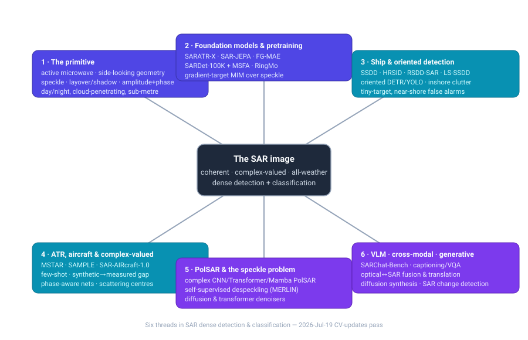

# Dense Object Detection & Classification — Recent Advances

*Compiled 2026-Jul-19 (America/Los_Angeles).*

Next installment in the running CV-updates log. Earlier entries on
`main`:
[Apr-30](../2026-Apr-30/2026-Apr-30_CV_updates.md),
[May-01](../2026-May-01/2026-May-01_CV_updates.md),
[May-02](../2026-May-02/2026-May-02_CV_updates.md),
[May-04](../2026-May-04/2026-May-04_CV_updates.md),
[May-05](../2026-May-05/2026-May-05_CV_updates.md),
[May-07](../2026-May-07/2026-May-07_CV_updates.md),
[May-08](../2026-May-08/2026-May-08_CV_updates.md),
[May-15](../2026-May-15/2026-May-15_CV_updates.md),
[May-16](../2026-May-16/2026-May-16_CV_updates.md),
[May-17](../2026-May-17/2026-May-17_CV_updates.md),
[Jun-09](../2026-Jun-09/2026-Jun-09_CV_updates.md),
[Jun-10](../2026-Jun-10/2026-Jun-10_CV_updates.md),
[Jun-12](../2026-Jun-12/2026-Jun-12_CV_updates.md),
[Jun-15](../2026-Jun-15/2026-Jun-15_CV_updates.md),
[Jun-16](../2026-Jun-16/2026-Jun-16_CV_updates.md),
[Jun-17](../2026-Jun-17/2026-Jun-17_CV_updates.md),
[Jun-19](../2026-Jun-19/2026-Jun-19_CV_updates.md),
[Jun-21](../2026-Jun-21/2026-Jun-21_CV_updates.md),
[Jun-22](../2026-Jun-22/2026-Jun-22_CV_updates.md),
[Jun-23](../2026-Jun-23/2026-Jun-23_CV_updates.md),
[Jun-24](../2026-Jun-24/2026-Jun-24_CV_updates.md),
[Jun-25](../2026-Jun-25/2026-Jun-25_CV_updates.md),
[Jun-27](../2026-Jun-27/2026-Jun-27_CV_updates.md),
[Jun-29](../2026-Jun-29/2026-Jun-29_CV_updates.md),
[Jun-30](../2026-Jun-30/2026-Jun-30_CV_updates.md),
[Jul-04](../2026-Jul-04/2026-Jul-04_CV_updates.md),
[Jul-07](../2026-Jul-07/2026-Jul-07_CV_updates.md),
[Jul-08](../2026-Jul-08/2026-Jul-08_CV_updates.md),
[Jul-10](../2026-Jul-10/2026-Jul-10_CV_updates.md),
[Jul-15](../2026-Jul-15/2026-Jul-15_CV_updates.md),
[Jul-17](../2026-Jul-17/2026-Jul-17_CV_updates.md),
[Jul-18](../2026-Jul-18/2026-Jul-18_CV_updates.md).

## Table of contents

1. [Why this pass: SAR as its own primitive](#why)
2. [Topic map](#map)
3. [Foundation models & SAR-native pretraining](#fm)
4. [Ship & oriented detection — the workhorse task](#ship)
5. [ATR, aircraft & complex-valued recognition](#atr)
6. [PolSAR & the speckle problem](#polsar)
7. [Vision–language, cross-modal & generative SAR](#vlm)
8. [Through-line & open problems](#throughline)
9. [Sources](#sources)

---

## 1. Why this pass: SAR as its own primitive

The recent run of passes has worked **sensor / imaging primitives on their own
terms** — LiDAR ([Jun-27](../2026-Jun-27/2026-Jun-27_CV_updates.md)), the event
camera ([Jun-29](../2026-Jun-29/2026-Jun-29_CV_updates.md)), thermal infrared
([Jun-30](../2026-Jun-30/2026-Jun-30_CV_updates.md)), automotive imaging radar
([Jul-04](../2026-Jul-04/2026-Jul-04_CV_updates.md)), medical imaging
([Jul-07](../2026-Jul-07/2026-Jul-07_CV_updates.md)), subsea sonar
([Jul-08](../2026-Jul-08/2026-Jul-08_CV_updates.md)), astronomical surveys
([Jul-10](../2026-Jul-10/2026-Jul-10_CV_updates.md)), X-ray transmission
([Jul-15](../2026-Jul-15/2026-Jul-15_CV_updates.md)), the microscope
([Jul-17](../2026-Jul-17/2026-Jul-17_CV_updates.md)) and the ultrasound image
([Jul-18](../2026-Jul-18/2026-Jul-18_CV_updates.md)).

Two earlier passes brushed against radar from opposite ends. The **automotive
imaging-radar** pass ([Jul-04](../2026-Jul-04/2026-Jul-04_CV_updates.md)) took the
*sparse, Doppler-rich, range–azimuth point cloud* of a 4-D mmWave sensor. The
**remote-sensing** pass ([Jun-25](../2026-Jun-25/2026-Jun-25_CV_updates.md)) folded
SAR into a *bag of geospatial channels* alongside optical and multispectral, one
sensor among many inside a multi-modal foundation model. Neither took the
**Synthetic Aperture Radar image itself** on its own terms. This pass does.

SAR is a genuinely *different* detection-and-classification problem — not optical
imagery that happens to be grey, and not a radar point cloud that happens to be
dense. It is distinct in six concrete ways, and every one of them shapes the
2024–2026 literature:

- **It is an *active, coherent* microwave measurement — the pixel is complex.**
  The sensor illuminates the scene with its own radiation and measures the
  returned wave's amplitude *and phase*. The native product is a complex-valued
  image, and half the physics (interferometry, polarimetry, coherent change
  detection) lives in the phase that a magnitude-only JPEG throws away. A detector
  built for 8-bit reflectance is, from the start, working on a lossy projection of
  the data.
- **Speckle is signal-dependent, multiplicative, and never goes away.** Coherent
  summation of sub-resolution scatterers produces the salt-and-pepper *speckle*
  that gives SAR its granular look. It is not additive sensor noise you can
  average out frame-to-frame — there are no frames — so despeckling and
  speckle-robust features are a first-class research track, not preprocessing.
- **Geometry is side-looking and range-projected, not perspective.** SAR images in
  the *slant-range / azimuth* plane. Tall objects **lay over** toward the sensor,
  the far sides sit in radar **shadow**, and a ship's superstructure smears along
  range. "Up" is not up; a rotated bounding box on a vessel encodes heading, not
  just a tighter fit. Oriented detection is intrinsic, not a nicety.
- **Targets are constellations of discrete bright scatterers, not textured
  blobs.** An aircraft in SAR is a handful of intense returns from edges, dihedrals
  and cavities separated by dark membrane — its appearance swings violently with a
  few degrees of aspect angle. Recognition leans on *scattering-center* physics
  (attributed scattering centers, electromagnetic structure) far more than on the
  smooth-texture priors that ImageNet backbones bring.
- **Labels are scarce, and the cheap way to make more is to simulate them.** There
  is no web-scale corpus of captioned SAR. The field's defining data problem is the
  **synthetic-to-measured gap**: electromagnetic simulators (and now diffusion
  models) can render targets cheaply, but a classifier trained on synthetic chips
  collapses on real ones. This is why SAMPLE, domain generalization and generative
  augmentation dominate the ATR literature.
- **The web-pretraining prior barely transfers.** SAR is almost absent from the
  image corpora that pretrain modern backbones, so the RGB→SAR domain shift is
  large in *both* data statistics and model structure. The 2024–2026 answer is
  SAR-native self-supervision — masked modeling with SAR-appropriate targets
  (gradients, scattering structure) instead of raw pixels — which is the through-line
  of §3.

The payoff is that SAR sees **through cloud, smoke and darkness, at any hour**,
which is exactly why maritime domain awareness, disaster response and defense keep
pulling the research. The tasks below — ship detection, aircraft ATR, land-cover
classification, change detection — are ordinary dense detection and classification
problems wearing very unusual physics.

---

## 2. Topic map

Six threads, one primitive. Foundation-model pretraining (§3) now sits under
everything: the ship (§4), ATR (§5) and PolSAR (§6) tracks increasingly start from
a SAR-native pretrained backbone rather than an ImageNet one, and the
vision–language / generative track (§7) both consumes those backbones and feeds
them synthetic data. Despeckling (§6) is the one thread that is as much a physics
problem as a learning one.

| # | Thread | What it is | Anchor work |
|---|--------|-----------|-------------|
| 1 | The primitive | coherent, complex-valued, speckled, side-looking microwave imaging | §1 |
| 2 | Foundation models & pretraining | SAR-native self-supervision; RGB→SAR domain gap | SARATR-X, SAR-JEPA, SARDet-100K/MSFA, FG-MAE, SAMBA |
| 3 | Ship & oriented detection | the workhorse; tiny targets, inshore clutter, rotated boxes | SSDD, HRSID, RSDD-SAR, SMEP-DETR, Strip R-CNN |
| 4 | ATR, aircraft & complex-valued | scattering-center recognition; synthetic→measured gap | MSTAR, SAMPLE, SAR-AIRcraft-1.0, ATRNet-STAR, EMWaveNet |
| 5 | PolSAR & the speckle problem | polarimetric land-cover; self-supervised despeckling | ECP-Mamba, CV-MsAtViT, PolSAM, MERLIN, PolMERLIN, Speckle2Self |
| 6 | VLM · cross-modal · generative | captioning/VQA; optical↔SAR fusion & translation; diffusion synthesis | SARChat-Bench-2M, SARLANG-1M, C-DiffSET, M4-SAR |

---

## 3. Foundation models & SAR-native pretraining

The single biggest shift since 2024 is that SAR stopped borrowing ImageNet
backbones wholesale and started **pretraining on SAR, with SAR-appropriate
objectives**. The reason is structural: SAR is nearly absent from web-scale image
corpora, so a DINO/CLIP/MAE prior trained on natural images transfers poorly, and
raw-pixel reconstruction objectives get swamped by speckle. The fix is to *change
the reconstruction target* to something speckle-robust and physically meaningful.

- **SARATR-X** is the reference point: the first foundation model built
  specifically for SAR target recognition. A ViT backbone is pretrained by a
  two-step masked-image-modeling scheme whose targets are **multi-scale gradient
  features** (not raw pixels), on ~0.18 M unlabeled SAR target chips curated from
  contemporary benchmarks — the largest such public collection at the time. It is
  competitive with, and often beats, fully-/semi-/self-supervised baselines on
  few-shot classification, robustness *and* detection from one backbone. Published
  in **IEEE TIP 2025** (arXiv 2405.09365).
- **SAR-JEPA** ("Predicting gradient is better") makes the same bet in a
  joint-embedding predictive frame: local masked patches predict **multi-scale SAR
  gradient representations** of unseen context, sidestepping both the small-target
  and speckle problems that break pixel-space MIM. It generalizes across vehicle,
  ship and aircraft recognition (four datasets for pretraining, three for
  evaluation) and improves as SAR data scales. **ISPRS J. P&RS 2024** (arXiv
  2311.15153).
- **FG-MAE** (Feature-Guided MAE) is the multispectral/SAR-remote-sensing sibling:
  reconstruct **HOG features** for SAR (HOG + normalized-difference indices for
  multispectral) instead of pixels, which it shows is materially better for noisy
  SAR; it releases Sentinel-1 pretrained ViTs. **IEEE JSTARS 2025** (arXiv
  2310.18653).
- **SARDet-100K + MSFA** is the detection-side anchor. SARDet-100K is the first
  COCO-scale, multi-class SAR detection benchmark — ~116 K images, ~245 K
  instances across **six classes** (aircraft, ship, car, bridge, tank, harbor),
  standardized from ten prior datasets. Its **Multi-Stage with Filter
  Augmentation (MSFA)** pretraining attacks the RGB→SAR gap from three sides —
  data input, domain transition and model migration — and improves detection
  across model families. **NeurIPS 2024 (spotlight)** (arXiv 2403.06534).
- **SAMBA** carries the idea into a state-space backbone: a **scatter-guided
  masked bidirectional Mamba** foundation model whose SG-MAE objective uses SAR
  physical *scattering* priors, at linear complexity and with far fewer parameters
  than CNN/Transformer baselines (2026, arXiv 2606.31668). **SARMAE** pushes the
  data axis, introducing **SAR-1M** (a million-scale pretraining set with paired
  optical) plus speckle-aware and optical-anchored representation constraints
  (**CVPR 2026**, arXiv 2512.16635).

**Does the web prior transfer at all?** Inkawhich's *On the Status of Foundation
Models for SAR Imagery* (2025, arXiv 2509.21722) says: not well off-the-shelf —
SAR is underrepresented in web pretraining — and the practical path is
**self-supervised finetuning in-domain** (e.g., continuing DINOv2's SSL objective
on SAR). That is the same conclusion SARDet-100K reached from the detection side.

**The multi-sensor camp includes SAR as one modality.** The geospatial
foundation-model families keep SAR in the mix: **RingMo** (first generative MIM RS
foundation model, optical+SAR; IEEE TGRS), **RingMo-SAM** (SAM adapted to
multimodal RS incl. SAR; IEEE TGRS 2023), **RingMoE** (14.7 B-param
mixture-of-modality-experts over ~400 M images incl. complex SAR; 2025, arXiv
2504.03166), **DOFA** (wavelength-conditioned dynamic patch embedding across SAR /
RGB / MS / HS; arXiv 2403.15356), **SkySense** (2.06 B params, optical+SAR time
series; CVPR 2024, arXiv 2312.10115) and **Galileo** (highly-multimodal SSL, SOTA
on Sen1Floods11 SAR flood mapping; ICML 2025, arXiv 2502.09356). New in this
window is a **SAR-centric** billion-scale model: **CrossEarth-SAR**, a
physics-guided sparse-MoE geospatial FM for domain-generalizable SAR segmentation,
with a 200 K dataset and 22 sub-benchmarks across eight domain gaps (2026, arXiv
2603.12008).

The tell across all of these: the winning objective is never "reconstruct the
speckly pixel." It is "predict a gradient, a HOG map, a scattering structure, or an
optical anchor" — a target that survives speckle and encodes SAR physics.

---

## 4. Ship & oriented detection — the workhorse task

Maritime surveillance is SAR's killer app, and ship detection is where the field
has the most datasets, the most methods and the clearest metrics. The problems are
specific: ships are **tiny** against huge scenes (a Sentinel-1 vessel can be a few
pixels), **inshore/near-shore clutter** — docks, cranes, breakwaters — throws
false alarms, and a ship's *orientation* is information (heading, berth geometry),
so **oriented bounding boxes** are the right output, not axis-aligned ones.

**The dataset ladder** matters because papers live or die on it:

- **SSDD** — the first widely-used open benchmark; the official re-release ships
  three annotation flavors, **BBox / RBox (oriented) / PSeg (polygon)**, so it
  serves horizontal, rotated and instance-segmentation work (*Remote Sensing*
  2021).
- **HRSID** — high-resolution (0.5/1/3 m), 5,604 images / 16,951 instances, COCO
  format with **masks** for detection + instance segmentation (*IEEE Access* 2020).
- **LS-SSDD-v1.0** — small ships under **large-scale Sentinel-1** backgrounds; 15
  big scenes tiled into 9,000 sub-images, AIS-verified (*Remote Sensing* 2020) —
  the pure small-target / large-scene stress test.
- **SAR-Ship-Dataset** — 43,819 chips from Gaofen-3 + Sentinel-1, complex
  backgrounds (*Remote Sensing* 2019).
- **RSDD-SAR** — **natively oriented** (DOTA-style OBB); 7,000 slices, 10,263
  instances from GF-3 + TerraSAR-X, with an S²A-Net baseline of ~90.06 % AP
  (*Journal of Radars* 2022).
- **FUSAR-Ship** — SAR–AIS matchup with **fine-grained ship classes** (15 primary
  / 98 sub), pushing past "ship / not-ship" to recognition (*Sci. China Inf. Sci.*
  2020).
- **OGSOD** and **M4-SAR** — **optical-paired** SAR detection sets (OGSOD adds
  bridge/tank/port; M4-SAR is a multi-resolution/polarization fusion benchmark,
  arXiv 2505.10931) — the bridge into §7's cross-modal work.

**Methods, 2024–2026.** Three currents:

1. **Transformer detectors tuned for clutter.** **SMEP-DETR** is a clean example:
   a DETR with built-in speckle denoising, multi-edge enhancement and parallel
   dilated convolutions, reporting mAP 98.6 % (SSDD) / 93.2 % (HRSID) / 80.0 %
   (LS-SSDD) — the last number being the honest one, since LS-SSDD is the hard
   small-target set (*Remote Sensing* 2025). **SARES-DEIM** adds a **sparse
   mixture-of-experts** to a DEIM-style DETR for robustness (2026, arXiv
   2604.04127).
2. **Oriented detection, done properly.** **Strip R-CNN** (AAAI 2025, arXiv
   2501.03775) replaces square kernels with sequential orthogonal **large-strip
   convolutions** matched to high-aspect-ratio objects, hitting 82.75 % mAP on
   DOTA-v1.0 and transferring to SAR ships. SAR-specific oriented work includes
   **LSR-Det** (lightweight OBB, *Remote Sensing* 2024), an **edge-deformable-conv
   + point-set** anchor/angle-free detector (*Remote Sensing* 2025), and a
   **multiscale task-decoupled** oriented detector with size-aware sample balancing
   (*Remote Sensing* 2025). The recurring baselines — **S²A-Net, Oriented R-CNN,
   ReDet** (rotation-equivariant), **AO2-DETR** — are all oriented-detection ideas
   borrowed from aerial optical and re-tuned for speckle.
3. **YOLO, still competitive.** Real-time SAR ship detectors keep iterating on
   YOLO: **HDF-YOLO** (YOLOv11 + heterogeneous convolution) reports 94.3 % / 98.7 %
   mAP@0.5 on HRSID / SSDD, and **MC-ASFF-ShipYOLO** adds coordinate attention +
   adaptively-spatial feature fusion for multi-scale ships (*Sensors* 2025).

Read the numbers with care: SSDD saturates near the high-90s and tells you little,
HRSID is a fairer mid-difficulty bar, and **LS-SSDD is the one that separates
methods** because that is where tiny targets and huge backgrounds actually live.

---

## 5. ATR, aircraft & complex-valued recognition

If ship detection is SAR's *where*, **Automatic Target Recognition (ATR)** is its
*what* — fine-grained classification of vehicles and aircraft from their scattering
signatures. This is the sub-field where SAR's physics is least hideable: a target
is a sparse set of bright scattering centers whose appearance is violently
aspect-dependent, and the labels are precious.

**Benchmarks, old and new.** **MSTAR** (10-class ground vehicles) has anchored ATR
for 25 years and is now essentially solved in-distribution and misleading
out-of-it. Two moves in this window address that: **SAMPLE** (AFRL) pairs
**synthetic vs. measured** MSTAR-class chips so you can measure the
synthetic-to-measured gap directly, and **ATRNet-STAR** (né NUDT4MSTAR) is the
would-be replacement — a large-scale fine-grained vehicle set, author-reported at
194,324 images across **40 vehicle types** and five scenes, crucially shipping
**original complex data** alongside magnitude imagery (2025, arXiv 2501.13354). For
aircraft, **SAR-AIRcraft-1.0** (Gaofen-3; 4,368 images / 16,463 instances / 7
airframe types; *Journal of Radars* 2023) is now the standard fine-grained bench.

**Aircraft detection is a discrete-scattering problem.** Because an airframe is a
handful of strong returns on dark apron, methods lean into that structure.
**DiffDet4SAR** casts detection as a **diffusion** process well-suited to sparse
strong scatterers and clutter, reporting SOTA mAP on SAR-AIRcraft-1.0 (2024, arXiv
2404.03595). **S³U-SAR** (physics-driven semantic scattering-structure
understanding) represents an aircraft as **semantic scattering keypoints** with
visibility attributes, releasing a keypoint-annotated set (2025, arXiv 2506.06847).

**Complex-valued and physics-aware networks** are the ATR frontier that has no
optical analogue, because they exploit the phase and the electromagnetics:

- **EMWaveNet** — a physically explainable complex-valued network built on
  electromagnetic **wave-propagation** physics (2024, arXiv 2410.09749).
- A **knowledge-informed complex-valued network** exploiting amplitude+phase,
  benchmarked on MSTAR (2025, arXiv 2510.20284).
- **SAR-GTR** — an attributed-scattering-center-guided **graph transformer** that
  fuses ASC physical parameters with a graph representation (2025, arXiv
  2505.08547), and **LDSF**, a lightweight dual-stream net coupling local EM
  scattering with global visual features (2024, arXiv 2403.03527).

**Closing the synthetic-to-measured gap** is the practical bottleneck. Approaches
this window: **soft segmented randomization** as a domain-generalization
augmentation (2024, arXiv 2409.14060), **mixing multiple EM simulators** to train
on synthetic data that transfers (2025, arXiv 2510.24768), and few-shot recognizers
like **CRCEPN** (region-aware convolution prototypical net, *Remote Sensing* 2024).
The gap is also a **security** surface: work on the *synthetic-to-measured
adversarial* vulnerability of SAR ATR (2024, arXiv 2401.17038), a **Bayesian-NN**
defense that flags >80 % of adversarial SAR chips at <20 % false alarm (IEEE Radar
Conf. 2024, arXiv 2403.18318), and **FACTUAL**, a contrastive adversarial-training
scheme with realistic physical attacks (2024, arXiv 2404.03225). **Interpretability**
gets a scattering-center-clustered two-stage feature decomposition feeding a shallow
transparent classifier (2025, arXiv 2506.09377) — explanation grounded in physics
rather than post-hoc saliency.

---

## 6. PolSAR & the speckle problem

Two SAR-specific problems have no clean optical counterpart, and both are as much
about *physics* as about learning: classifying **polarimetric** SAR (which measures
a full scattering matrix per pixel, not one intensity) and suppressing **speckle**
without inventing structure that was never there.

**PolSAR classification** is a per-pixel land-cover / terrain problem over
complex-valued, multi-channel data (typically the 3×3 coherency/covariance matrix).
The defining constraint is that labels are extremely sparse and the input is
complex, so the methods that win are the ones that respect both:

- **Complex-valued networks** process amplitude *and* phase natively rather than
  stacking real channels — discarding phase discards polarimetric information by
  construction. The 2024–2026 line keeps the complex domain but modernizes the
  architecture: **CV-MsAtViT**, a complex-valued multiscale attention ViT, reports
  OA 98.35 % on Flevoland (also San Francisco, Oberpfaffenhofen; *JAG* 2025), and a
  **Riemannian complex matrix convolution** network operates directly on Hermitian
  positive-definite covariance matrices on the manifold rather than in Euclidean
  space (arXiv 2312.03378).
- **State-space and few-label self-supervision.** **ECP-Mamba** brings a
  multi-scale self-supervised **contrastive Mamba** to PolSAR, reporting OA 99.70 %
  on Flevoland-1989 with heavy emphasis on label efficiency (2025, arXiv
  2506.01040) — the same linear-time state-space turn seen elsewhere in the log.
  Few-label robustness recurs as the framing: **dual-frequency selected knowledge
  distillation** with statistical sample rectification (arXiv 2507.03268) and
  **multiview manifold evidential fusion** for uncertainty-aware terrain
  classification (arXiv 2510.11171).
- **Physics-guided and interpretable.** The strongest recent thread folds
  polarimetric **scattering mechanism** in as a prior. **PolSAM** adapts Segment
  Anything to PolSAR with physics-informed prompt generation, beating SAM variants
  on the new PhySAR-Seg benchmarks (arXiv 2412.12737); a **concept-bottleneck +
  Kolmogorov–Arnold-network** model maps features to human-readable polarimetric
  concepts for physics-verifiable classification (arXiv 2507.03315); and a
  **multiscale-attention complex-valued graph U-Net** fuses superpixel-graph
  structure with complex features (*Remote Sensing* 2025). The move is identical to
  §3's: give the network the polarimetric decomposition (Freeman–Durden, H/α/A) as
  a target or prior rather than hoping it re-learns the physics from labels.

**Despeckling** is the other pillar, and it has quietly become one of the best
show-cases for self-supervised learning anywhere, because there is **no clean
ground truth** — you never get a speckle-free SAR image to supervise against.

- **Supervised CNNs** kicked it off — **SAR-CNN** (residual despeckling in the
  log domain) and **ID-CNN** (a CNN with a division-residual, component-wise
  speckle layer) — but they need synthetic speckle on optical images for training,
  which is itself a domain gap. A **transformer** despeckler (encoder-transformer /
  CNN-decoder) later beat PPB, SAR-BM3D, SAR-CNN and ID-CNN on PSNR/SSIM (IGARSS
  2022, arXiv 2201.09355).
- The self-supervised turn is the real advance. **MERLIN** trains a despeckler
  from a *single* real SAR image by exploiting the statistical independence of the
  **real and imaginary channels** of a single-look complex image — no clean target,
  no multitemporal stack (IEEE TGRS 2021, arXiv 2110.13148). **SAR2SAR** learns
  from **multitemporal** acquisitions of the same scene, treating independent
  speckle realizations as noisy targets for each other (IEEE JSTARS 2021, arXiv
  2006.15037). **Speckle2Void** brings **blind-spot** networks — the Noise2Void
  idea specialized to SAR's multiplicative, spatially-correlated speckle — again
  training directly on noisy data (IEEE TGRS 2021, arXiv 2007.02075).
- The current window extends all three axes. **PolMERLIN** carries MERLIN's
  channel-independence trick into **polarimetric** complex SAR with cross-channel
  masking (2024, arXiv 2401.07503). **Speckle2Self** frames single-image
  despeckling as masked-pixel estimation with a transformer and attention-guided
  complementary masks, reporting gains over Speckle2Void while training only on the
  noisy image (*Remote Sensing* 2025). And **diffusion / score-based** denoisers
  arrive: a region-aware DDPM (**R-DDPM**, arXiv 2401.03122) and a **log-domain
  self-supervised score-based** despeckler that turns multiplicative speckle into
  approximately additive Gaussian noise before a Tweedie-style objective (2026,
  arXiv 2601.14334).
- Meanwhile despeckling is increasingly folded *inside* detectors rather than run
  as a separate front-end — the SMEP-DETR of §4 carries a speckle-denoising stage
  in the network, and SARMAE's §3 objective is explicitly speckle-aware. The
  trajectory is away from "despeckle, then detect" toward speckle-robustness learned
  end-to-end.

The unifying lesson across §6: because clean SAR does not exist, the productive
question is never "denoise to a reference" but "what invariance in the raw coherent
data lets me learn without one" — channel independence (MERLIN), temporal
repetition (SAR2SAR), blind spots (Speckle2Void), or physical scattering priors.

---

## 7. Vision–language, cross-modal & generative SAR

The newest thread, and the one moving fastest: making SAR *legible* — to language
models, to optical pipelines, and to data-hungry detectors that need more training
imagery than the world has labeled.

**SAR meets language.** 2025 produced the first serious SAR vision–language
resources. **SARChat-Bench-2M** is the first large-scale SAR multimodal dialogue
benchmark — ~2 M image–text pairs across maritime/terrestrial/urban scenes,
spanning captioning, VQA, visual grounding and detection, with 16 VLMs (Qwen2-VL,
InternVL2.5, LLaVA…) benchmarked (arXiv 2502.08168). **SARLANG-1M** is comparable
in ambition — 118 K images, 1.13 M human-verified annotations from 59+ cities at
0.1–25 m — and reports that VLMs fine-tuned on it approach expert-level SAR
interpretation (arXiv 2504.03254). **SARVLM/SARCLIP** builds CLIP-style SAR↔text
alignment (2025, arXiv 2510.22665), **FSAR-Cap** adds fine-grained captioning
(arXiv 2510.16394), and one line reframes **ATR as visual reasoning** — chain-of-
thought over MLLMs on a FAIR-CSAR-derived reasoning dataset (2025, arXiv
2507.09535). The consistent finding is that generic VLMs are poor at SAR out of the
box — the scattering mechanism, blurred edges and orientation-sensitivity break the
optical priors — and need SAR-specific alignment data.

**Optical ↔ SAR, both directions.** Fusion detectors exploit the complementarity
(SAR's all-weather geometry + optical's texture): **SMEP-DETR** and **MHFNet**
(hybrid fusion for *misaligned* SAR–optical ship detection, ISPRS J. P&RS 2025)
sit alongside the **M4-SAR** fusion benchmark (§4). Translation goes the other way
to make SAR human-readable: **C-DiffSET** does latent-diffusion **SAR→optical**
with confidence-guided reliable object generation (2024, arXiv 2411.10788), a
**conditional Brownian-bridge diffusion** model handles VHR SAR→optical (arXiv
2408.07947), an **unpaired object-level** keypoint-guided diffusion translates SAR
aircraft to optical (2025, arXiv 2503.19798), and **OSCAR** adds optical-aware
semantic control for the aleatoric ambiguity of the mapping (2026, arXiv
2601.06835).

**Generative augmentation** attacks the label-scarcity root cause directly:
fine-tuning pretrained **latent diffusion** models to synthesize *unseen* SAR
(2025, arXiv 2506.13307) and single-image DDPM SAR generation (**SSDDPM**, *Sci.
Rep.* 2025) — the learning-side complement to the electromagnetic simulators of §5,
and increasingly the cheaper way to close the synthetic-to-measured gap.

**Change detection & disaster response** is where SAR's all-weather advantage
pays off operationally. **SARCDNet** improves bi-temporal SAR change detection
(*Sci. Rep.* 2025); at scale, a decade of Sentinel-1 was turned into a **global
flood-mapping** model and dataset with demonstrated rapid response (*Nat. Commun.*
2025), and **STURM-Flood** curates a DL-ready Sentinel-1+2 flood set against
Copernicus EMS ground truth (2025). The operational backdrop is a data supply
boom — **Sentinel-1** C-band free and open, plus scaling commercial X-band
constellations (**ICEYE, Capella, Umbra**, the last publishing an open,
ML-friendly SAR dataset) — which is itself a quiet driver of SAR-ML progress:
more imagery, more revisits, more reason to automate.

---

## 8. Through-line & open problems

**One idea unifies the pass:** *put SAR's physics into the objective, don't hope a
natural-image prior will survive contact with speckle.* You see it everywhere —
gradient targets (SARATR-X, SAR-JEPA), HOG targets (FG-MAE), scattering-guided
masking (SAMBA, S³U-SAR), attributed-scattering graphs (SAR-GTR), polarimetric
decomposition priors (PolSAR), and self-supervision that exploits SAR's own
statistics because there is no clean reference (MERLIN, SAR2SAR, Speckle2Void). The
optical recipe — pretrain on the web, reconstruct pixels, regress an axis-aligned
box — is exactly the recipe that underperforms here.

**What is genuinely converging:**

- **SAR-native foundation models are now the sensible starting point.** SARDet-100K
  gave detection a COCO-scale bench and MSFA gave it a pretraining recipe;
  SARATR-X/SAR-JEPA did the same for recognition. Downstream papers increasingly
  finetune these rather than an ImageNet backbone.
- **Oriented output is standard**, because heading and geometry are the point.
- **Self-supervision is the answer to label scarcity**, both for representation
  learning and for despeckling-without-ground-truth.

**What is still open:**

- **The synthetic-to-measured gap is not closed.** Simulators and diffusion models
  make cheap chips; transfer to measured data remains fragile, and it is
  simultaneously a *robustness/security* problem (adversarial transfer across the
  gap).
- **The complex-valued pixel is still half-wasted.** Most detectors run on
  magnitude imagery; phase-native (interferometric, polarimetric) learning is
  promising but far less mature than magnitude-domain detection.
- **Benchmarks saturate and mislead.** SSDD and in-distribution MSTAR are near
  ceilings; the field is mid-migration to harder, complex-data, fine-grained sets
  (LS-SSDD, ATRNet-STAR, SARDet-100K) — the honest numbers live there.
- **VLMs still don't "get" SAR.** Off-the-shelf multimodal models fail on
  scattering-mechanism reasoning; SAR-specific alignment corpora (SARChat-2M,
  SARLANG-1M) are new and small next to their optical counterparts.
- **Evaluation is fragmented.** Cross-sensor, cross-resolution, cross-band
  (X/C/L) generalization is under-measured; domain-generalization benchmarks like
  CrossEarth-SAR's 22 sub-benchmarks are a start.

The one-line summary: SAR has stopped pretending to be grey optical imagery. The
2024–2026 literature is the field building detectors, classifiers and foundation
models that take the *coherent, complex, speckled, side-looking* physics as the
starting assumption — which is the whole reason to treat the SAR image as its own
primitive.

---

## 9. Sources

*Retrieved 2026-Jul-19. Direct-fetch of some arXiv and publisher pages was blocked
by bot/egress filtering; entries below are drawn from search-index metadata,
abstracts and canonical landing pages (arXiv abs, IEEE Xplore, journal DOIs, code
repos). Treat all quantitative figures as author-reported.*

**Foundation models & pretraining (§3)**
- SARATR-X — IEEE TIP 2025, arXiv 2405.09365: https://arxiv.org/abs/2405.09365 · code: https://github.com/waterdisappear/SARATR-X
- SAR-JEPA — ISPRS J. P&RS 2024, arXiv 2311.15153: https://arxiv.org/abs/2311.15153 · https://www.sciencedirect.com/science/article/pii/S0924271624003514 · code: https://github.com/waterdisappear/SAR-JEPA
- FG-MAE — IEEE JSTARS 2025, arXiv 2310.18653: https://arxiv.org/abs/2310.18653 · code: https://github.com/zhu-xlab/FGMAE
- SARDet-100K + MSFA — NeurIPS 2024 (spotlight), arXiv 2403.06534: https://arxiv.org/abs/2403.06534 · code: https://github.com/zcablii/SARDet_100K
- SAMBA (scatter-guided masked bidirectional Mamba) — arXiv 2606.31668: https://arxiv.org/abs/2606.31668
- SARMAE / SAR-1M — CVPR 2026, arXiv 2512.16635: https://arxiv.org/abs/2512.16635 · code: https://github.com/MiliLab/SARMAE
- On the Status of Foundation Models for SAR Imagery — arXiv 2509.21722: https://arxiv.org/abs/2509.21722
- RingMo — IEEE TGRS 2022: https://ieeexplore.ieee.org/document/9844015
- RingMo-SAM — IEEE TGRS 2023: https://ieeexplore.ieee.org/document/10315957
- RingMoE — arXiv 2504.03166: https://arxiv.org/abs/2504.03166
- DOFA — arXiv 2403.15356: https://arxiv.org/abs/2403.15356
- SkySense — CVPR 2024, arXiv 2312.10115: https://arxiv.org/abs/2312.10115
- Galileo — ICML 2025, arXiv 2502.09356: https://arxiv.org/abs/2502.09356 · code: https://github.com/nasaharvest/galileo
- CrossEarth-SAR — arXiv 2603.12008: https://arxiv.org/abs/2603.12008

**Ship & oriented detection (§4)**
- SSDD (official, BBox/RBox/PSeg) — *Remote Sensing* 13(18):3690, 2021: https://www.mdpi.com/2072-4292/13/18/3690
- HRSID — *IEEE Access* 2020: https://ieeexplore.ieee.org/document/9127939 · code: https://github.com/chaozhong2010/HRSID
- LS-SSDD-v1.0 — *Remote Sensing* 12(18):2997, 2020: https://www.mdpi.com/2072-4292/12/18/2997 · code: https://github.com/TianwenZhang0825/LS-SSDD-v1.0-OPEN
- SAR-Ship-Dataset — *Remote Sensing* 11(7):765, 2019: https://www.mdpi.com/2072-4292/11/7/765 · code: https://github.com/CAESAR-Radi/SAR-Ship-Dataset
- RSDD-SAR (oriented) — *Journal of Radars* 11(4), 2022, DOI 10.12000/JR22007: https://radars.ac.cn/en/article/doi/10.12000/JR22007
- FUSAR-Ship — *Sci. China Inf. Sci.* 63, 2020: https://link.springer.com/article/10.1007/s11432-019-2772-5
- OGSOD-2.0 — SPIE 13539, 2025: https://www.spiedigitallibrary.org/conference-proceedings-of-spie/13539/1353903/
- M4-SAR (optical-SAR fusion) — arXiv 2505.10931: https://arxiv.org/abs/2505.10931
- Strip R-CNN — AAAI 2025, arXiv 2501.03775: https://arxiv.org/abs/2501.03775 · code: https://github.com/YXB-NKU/Strip-R-CNN
- LSR-Det — *Remote Sensing* 16(17):3251, 2024: https://www.mdpi.com/2072-4292/16/17/3251
- Multiscale task-decoupled oriented SAR ship detection — *Remote Sensing* 17(13):2257, 2025: https://doi.org/10.3390/rs17132257
- Edge-deformable-conv + point-set oriented detector — *Remote Sensing* 17(9):1612, 2025: https://doi.org/10.3390/rs17091612
- SMEP-DETR — *Remote Sensing* 17(6):953, 2025: https://www.mdpi.com/2072-4292/17/6/953
- SARES-DEIM (sparse MoE + DETR) — arXiv 2604.04127: https://arxiv.org/abs/2604.04127
- HDF-YOLO — Springer LNCS 2025, DOI 10.1007/978-981-96-9794-6_19: https://link.springer.com/chapter/10.1007/978-981-96-9794-6_19
- MC-ASFF-ShipYOLO — *Sensors* 25(9):2940, 2025: https://pmc.ncbi.nlm.nih.gov/articles/PMC12074152/

**ATR, aircraft & complex-valued (§5)**
- SAR-AIRcraft-1.0 — *Journal of Radars* 2023, DOI 10.12000/JR23043: https://radars.ac.cn/en/article/doi/10.12000/JR23043
- ATRNet-STAR (NUDT4MSTAR) — arXiv 2501.13354: https://arxiv.org/abs/2501.13354 · code: https://github.com/waterdisappear/ATRNet-STAR
- SAMPLE (synthetic-vs-measured) — AFRL/DSIAC, SPIE 2019: https://dsiac.dtic.mil/articles/the-synthetic-and-measured-paired-and-labeled-experiment-sample-dataset-for-sar-atr-development/
- DiffDet4SAR — arXiv 2404.03595: https://arxiv.org/abs/2404.03595
- S³U-SAR (semantic scattering structure) — arXiv 2506.06847: https://arxiv.org/abs/2506.06847
- EMWaveNet (EM-physics complex-valued) — arXiv 2410.09749: https://arxiv.org/abs/2410.09749
- Knowledge-informed complex-valued SAR recognition — arXiv 2510.20284: https://arxiv.org/abs/2510.20284
- SAR-GTR (attributed-scattering graph transformer) — arXiv 2505.08547: https://arxiv.org/abs/2505.08547
- LDSF (local EM + global visual) — arXiv 2403.03527: https://arxiv.org/abs/2403.03527
- CRCEPN (few-shot prototypical) — *Remote Sensing* 16(19):3563, 2024: https://doi.org/10.3390/rs16193563
- Soft segmented randomization (DG for synth→measured) — arXiv 2409.14060: https://arxiv.org/abs/2409.14060
- Combining SAR simulators for synthetic training — arXiv 2510.24768: https://arxiv.org/abs/2510.24768
- Synthetic-to-measured adversarial vulnerability — arXiv 2401.17038: https://arxiv.org/abs/2401.17038
- Uncertainty-aware (Bayesian-NN) SAR ATR defense — IEEE Radar Conf. 2024, arXiv 2403.18318: https://arxiv.org/abs/2403.18318
- FACTUAL (contrastive adversarial training) — IEEE Radar Conf. 2024, arXiv 2404.03225: https://arxiv.org/abs/2404.03225
- Interpretable two-stage feature decomposition — arXiv 2506.09377: https://arxiv.org/abs/2506.09377

**PolSAR & despeckling (§6)**
- CV-MsAtViT (complex-valued multiscale attention ViT) — *JAG* 2025, DOI 10.1016/j.jag.2025.104412: https://www.sciencedirect.com/science/article/pii/S1569843225000597 · code: https://github.com/mqalkhatib/CV-MsAtViT
- ECP-Mamba (self-supervised contrastive Mamba PolSAR) — arXiv 2506.01040: https://arxiv.org/abs/2506.01040
- Riemannian complex matrix convolution network — arXiv 2312.03378: https://arxiv.org/abs/2312.03378
- PolSAM (scattering-mechanism-informed SAM) — arXiv 2412.12737: https://arxiv.org/abs/2412.12737
- Interpretable PolSAR (concept-bottleneck + KAN) — arXiv 2507.03315: https://arxiv.org/abs/2507.03315
- Dual-frequency selected knowledge distillation — arXiv 2507.03268: https://arxiv.org/abs/2507.03268
- Multiview manifold evidential fusion — arXiv 2510.11171: https://arxiv.org/abs/2510.11171
- Multiscale-attention complex-valued graph U-Net — *Remote Sensing* 17(24):3943, 2025: https://www.mdpi.com/2072-4292/17/24/3943
- MERLIN (single-image self-supervised despeckling) — IEEE TGRS 2021, arXiv 2110.13148: https://arxiv.org/abs/2110.13148
- SAR2SAR (multitemporal self-supervised despeckling) — IEEE JSTARS 2021, arXiv 2006.15037: https://arxiv.org/abs/2006.15037
- Speckle2Void (blind-spot despeckling) — IEEE TGRS 2021, arXiv 2007.02075: https://arxiv.org/abs/2007.02075
- PolMERLIN (self-supervised PolSAR despeckling) — arXiv 2401.07503: https://arxiv.org/abs/2401.07503
- Speckle2Self (transformer masked-pixel despeckling) — *Remote Sensing* 17(23):3840, 2025: https://www.mdpi.com/2072-4292/17/23/3840
- R-DDPM (regional diffusion despeckling) — arXiv 2401.03122: https://arxiv.org/abs/2401.03122
- Log-domain self-supervised score-based despeckling — arXiv 2601.14334: https://arxiv.org/abs/2601.14334
- Transformer-based SAR despeckling (Perera et al.) — IGARSS 2022, arXiv 2201.09355: https://arxiv.org/abs/2201.09355

**Vision–language, cross-modal & generative (§7)**
- SARChat-Bench-2M — arXiv 2502.08168: https://arxiv.org/abs/2502.08168 · code: https://github.com/JimmyMa99/SARChat
- SARLANG-1M — arXiv 2504.03254: https://arxiv.org/abs/2504.03254 · code: https://github.com/Jimmyxichen/SARLANG-1M
- SARVLM/SARCLIP — arXiv 2510.22665: https://arxiv.org/abs/2510.22665
- FSAR-Cap — arXiv 2510.16394: https://arxiv.org/abs/2510.16394
- SAR ATR as visual reasoning (CoT) — arXiv 2507.09535: https://arxiv.org/abs/2507.09535
- MHFNet (misaligned SAR-optical fusion) — ISPRS J. P&RS 2025: https://www.sciencedirect.com/science/article/abs/pii/S0924271625004150
- C-DiffSET (SAR→optical latent diffusion) — arXiv 2411.10788: https://arxiv.org/abs/2411.10788
- Conditional Brownian-bridge diffusion (VHR SAR→optical) — arXiv 2408.07947: https://arxiv.org/abs/2408.07947
- Unpaired object-level SAR→optical (aircraft) — arXiv 2503.19798: https://arxiv.org/abs/2503.19798
- OSCAR (optical-aware semantic control) — arXiv 2601.06835: https://arxiv.org/abs/2601.06835
- Fine-tuning latent diffusion for unseen SAR — arXiv 2506.13307: https://arxiv.org/abs/2506.13307
- SSDDPM (single-image DDPM SAR generation) — *Sci. Rep.* 2025: https://www.nature.com/articles/s41598-025-95106-7
- SARCDNet (bi-temporal change detection) — *Sci. Rep.* 2025: https://www.nature.com/articles/s41598-025-31488-y
- Global flood mapping with 10 years of Sentinel-1 SAR — *Nat. Commun.* 2025: https://www.nature.com/articles/s41467-025-60973-1
- STURM-Flood — *Big Earth Data* 2025: https://www.tandfonline.com/doi/full/10.1080/20964471.2025.2458714

---

*Part of the running CV-updates log. Each pass takes one dense-detection &
classification primitive on its own terms; this one is the Synthetic Aperture
Radar image. Next passes continue the sensor-primitive arc.*
