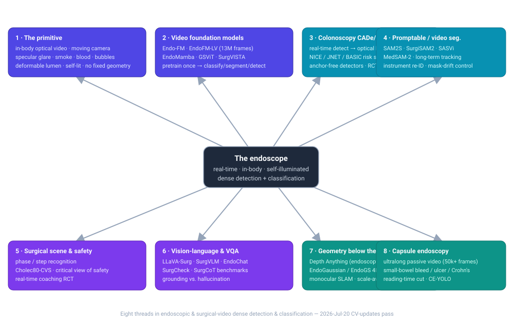
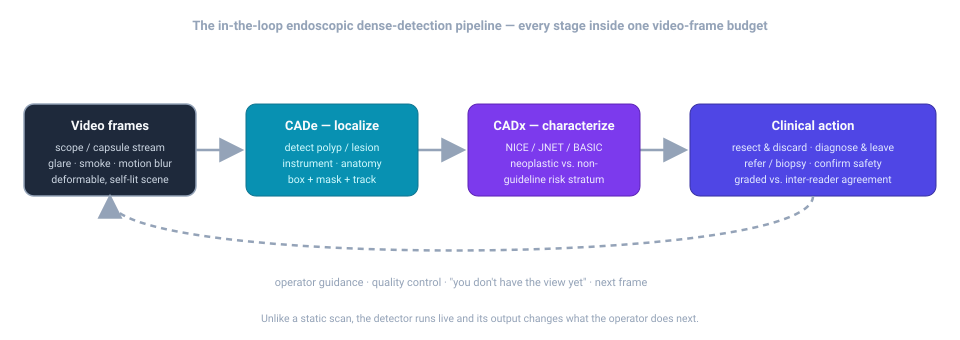

# Dense Object Detection & Classification — Recent Advances

*Compiled 2026-Jul-20 (America/Los_Angeles).*

Next installment in the running CV-updates log. Earlier entries on
`main`:
[Apr-30](../2026-Apr-30/2026-Apr-30_CV_updates.md),
[May-01](../2026-May-01/2026-May-01_CV_updates.md),
[May-02](../2026-May-02/2026-May-02_CV_updates.md),
[May-04](../2026-May-04/2026-May-04_CV_updates.md),
[May-05](../2026-May-05/2026-May-05_CV_updates.md),
[May-07](../2026-May-07/2026-May-07_CV_updates.md),
[May-08](../2026-May-08/2026-May-08_CV_updates.md),
[May-15](../2026-May-15/2026-May-15_CV_updates.md),
[May-16](../2026-May-16/2026-May-16_CV_updates.md),
[May-17](../2026-May-17/2026-May-17_CV_updates.md),
[Jun-09](../2026-Jun-09/2026-Jun-09_CV_updates.md),
[Jun-10](../2026-Jun-10/2026-Jun-10_CV_updates.md),
[Jun-12](../2026-Jun-12/2026-Jun-12_CV_updates.md),
[Jun-15](../2026-Jun-15/2026-Jun-15_CV_updates.md),
[Jun-16](../2026-Jun-16/2026-Jun-16_CV_updates.md),
[Jun-17](../2026-Jun-17/2026-Jun-17_CV_updates.md),
[Jun-19](../2026-Jun-19/2026-Jun-19_CV_updates.md),
[Jun-21](../2026-Jun-21/2026-Jun-21_CV_updates.md),
[Jun-22](../2026-Jun-22/2026-Jun-22_CV_updates.md),
[Jun-23](../2026-Jun-23/2026-Jun-23_CV_updates.md),
[Jun-24](../2026-Jun-24/2026-Jun-24_CV_updates.md),
[Jun-25](../2026-Jun-25/2026-Jun-25_CV_updates.md),
[Jun-27](../2026-Jun-27/2026-Jun-27_CV_updates.md),
[Jun-29](../2026-Jun-29/2026-Jun-29_CV_updates.md),
[Jun-30](../2026-Jun-30/2026-Jun-30_CV_updates.md),
[Jul-04](../2026-Jul-04/2026-Jul-04_CV_updates.md),
[Jul-07](../2026-Jul-07/2026-Jul-07_CV_updates.md),
[Jul-08](../2026-Jul-08/2026-Jul-08_CV_updates.md),
[Jul-10](../2026-Jul-10/2026-Jul-10_CV_updates.md),
[Jul-15](../2026-Jul-15/2026-Jul-15_CV_updates.md),
[Jul-17](../2026-Jul-17/2026-Jul-17_CV_updates.md),
[Jul-18](../2026-Jul-18/2026-Jul-18_CV_updates.md).

## Table of contents

1. [Why this pass: the endoscope as its own primitive](#why)
2. [Topic map](#map)
3. [Endoscopic video foundation models — pretrain once, adapt everywhere](#foundation)
4. [Colonoscopy CADe/CADx — detection that becomes an optical biopsy](#cade)
5. [Promptable & video segmentation — SAM 2 goes inside the body](#sam)
6. [Surgical scene understanding & safety — phase, instruments, the critical view](#surgical)
7. [Vision–language & VQA — reasoning over the operative scene](#vlm)
8. [Geometry below the pixel — depth, SLAM, and 4D tissue reconstruction](#geometry)
9. [Capsule endoscopy — the ultralong passive-video frontier](#capsule)
10. [Through-line & open problems](#throughline)
11. [Sources](#sources)

---

## 1. Why this pass: the endoscope as its own primitive

The recent run of passes has worked **sensor / imaging primitives on their own
terms** — LiDAR ([Jun-27](../2026-Jun-27/2026-Jun-27_CV_updates.md)), the event
camera ([Jun-29](../2026-Jun-29/2026-Jun-29_CV_updates.md)), thermal infrared
([Jun-30](../2026-Jun-30/2026-Jun-30_CV_updates.md)), imaging radar
([Jul-04](../2026-Jul-04/2026-Jul-04_CV_updates.md)), medical CT/MRI + H&E pathology
([Jul-07](../2026-Jul-07/2026-Jul-07_CV_updates.md)), subsea sonar
([Jul-08](../2026-Jul-08/2026-Jul-08_CV_updates.md)), astronomical surveys
([Jul-10](../2026-Jul-10/2026-Jul-10_CV_updates.md)), X-ray transmission
([Jul-15](../2026-Jul-15/2026-Jul-15_CV_updates.md)), the optical/electron
microscope ([Jul-17](../2026-Jul-17/2026-Jul-17_CV_updates.md)) and the ultrasound
image ([Jul-18](../2026-Jul-18/2026-Jul-18_CV_updates.md)).

Ultrasound gave us the *real-time, hand-steered* modality. This pass takes the
**endoscopic image as its own primitive**: the camera that goes *inside* the body
and moves through a soft, wet, self-illuminated tube. It shares ultrasound's
real-time, operator-driven nature but is optically its opposite — a reflectance
camera, not a pulse-echo probe — and it introduces failure modes no external
sensor faces.

Endoscopy is a *different* detection-and-classification problem from every sensor
covered to date, in six concrete ways:

- **The camera is inside a moving, deforming tube, and it carries its own light.**
  There is no fixed viewpoint and no external illumination — a small LED at the tip
  lights a cavity that closes, folds, peristalses and bleeds. Brightness falls off
  as the inverse square of a distance that changes every frame, so exposure,
  vignetting and geometry are all coupled to camera pose. A detector must survive a
  scene whose *lighting and shape are generated at acquisition time*.
- **Specular highlights, smoke, blood, bubbles and mucus are first-class
  occluders.** Wet tissue throws mirror-bright glints that saturate the sensor;
  electrocautery fills the field with smoke; a fold hides half a polyp. These are
  not additive noise — they are opaque, moving objects that a detector must reason
  *around*, and they are the reason natural-image and even CT/pathology backbones
  transfer poorly.
- **It is natively a *video* modality where the object appears, deforms and leaves
  frame.** A polyp slides behind a haustral fold and re-emerges; an instrument tip
  occludes the target it is about to cut. The 2025–26 literature is dominated by
  *temporal* models (video foundation models, SAM 2-style trackers) precisely
  because a single frame is not enough to detect, let alone characterize.
- **Detection is *in the loop* and changes what the human does next.** A colonoscopy
  CADe box tells the endoscopist where to look *now*; a "critical view of safety"
  classifier tells a surgeon whether it is safe to cut *now*. The model runs inside a
  single video-frame budget and its output feeds straight back into the operator's
  hands (diagram below).
- **The class taxonomy is a scoring rubric, not a noun list.** Just as ultrasound
  reads out BI-RADS/TIRADS, endoscopy reads out **NICE / JNET / BASIC** optical-biopsy
  strata for colorectal polyps, **Paris** morphology, **Mayo/CDEIS** disease-activity
  scores, and procedure-defined **surgical phases**. "Classification" here means
  predicting a **guideline-defined category** and being graded against
  inter-endoscopist agreement, not a clean ground truth.
- **The object spans from a whole operative field to a 2 mm diminutive polyp — and
  the pixel is not the only representation.** Beneath the RGB frame the field now
  recovers *depth, camera pose and a deformable 3-D surface* from the same monocular
  video, so "detection" increasingly happens in a reconstructed 3-D scene, not just
  on the image plane.

The through-line for the log: endoscopy is the primitive where **detection is an
action, not a report**. Everything below is an attempt to make one model robust to a
moving camera in a deforming, self-lit, occluded scene — fast enough to change what
a clinician does in the next second.

---

## 2. Topic map

The pass is organised around eight threads, mirrored in the diagram above:

| # | Thread | What it is | Representative 2025–26 work |
|---|--------|-----------|------------------------------|
| 1 | **The primitive** | why in-body video resists transfer | §1 |
| 2 | **Video foundation models** | pretrain once on endoscopic video | Endo-FM, EndoFM-LV, EndoMamba, GSViT, SurgVISTA |
| 3 | **Colonoscopy CADe/CADx** | detect → optical-biopsy classify, in the loop | anchor-free real-time detectors, NICE/JNET/BASIC CADx, ACCEPT/deskilling |
| 4 | **Promptable & video segmentation** | click/prompt → mask → track through the loop | SAM2S, SurgiSAM2, SASVi, MedSAM-2 |
| 5 | **Surgical scene & safety** | phase/step, instruments, the critical view | Cholec80-CVS, real-time CVS, AI coaching RCT |
| 6 | **Vision–language & VQA** | reason and answer over the operative scene | LLaVA-Surg, SurgVLM, EndoChat, SurgCheck, SurgCoT |
| 7 | **Geometry below the pixel** | depth, pose, 4-D deformable reconstruction | Depth Anything (endoscopy), Endo3R, EndoGaussian/EndoGS |
| 8 | **Capsule endoscopy** | ultralong passive video, small bowel | CE-YOLO, AI-CE meta-analyses, Crohn's validation |

---

## 3. Endoscopic video foundation models — pretrain once, adapt everywhere

The dominant 2025–26 storyline mirrors ultrasound's: a **single self-supervised
backbone pretrained on endoscopic *video*** that adapts cheaply to classification,
segmentation, detection and workflow recognition — a direct response to the
scan-time domain gap and the scarcity of expert annotations.

- **Endo-FM** set the template: a video transformer capturing spatial *and*
  long-range temporal dependencies, pretrained self-supervised on **>33K video clips
  / ~5M frames** from nine public datasets plus a private hospital collection. It
  surpassed prior state of the art on classification, segmentation and detection —
  the first convincing "pretrain once, adapt everywhere" result for the modality.
  ([arXiv 2306.16741](https://arxiv.org/abs/2306.16741) ·
  [MICCAI 2023](https://link.springer.com/chapter/10.1007/978-3-031-43996-4_10))
- **EndoFM-LV (IEEE JBHI 2025)** attacks the *time axis* directly: a **minute-level**
  pretraining framework over long sequences, using masked-token modeling in a
  teacher–student scheme, trained on **6,469 endoscopic videos each >1 minute,
  totaling >13M frames**. It beats prior state of the art across all four task
  families (classification, segmentation, detection, workflow recognition) — evidence
  that *long-context* temporal pretraining, not just clip-level, is where the headroom
  is. ([PubMed 40031835](https://pubmed.ncbi.nlm.nih.gov/40031835/) ·
  [code](https://github.com/med-air/EndoFM-LV))
- **EndoMamba (2025)** brings the **state-space (Mamba) recurrence** to endoscopic
  video via hierarchical pretraining — linear-time temporal modeling aimed at the
  real-time budget the modality demands, the same efficiency arc the event-camera pass
  traced with S5-ViT/SMamba. ([arXiv 2502.19090](https://arxiv.org/pdf/2502.19090))
- **GSViT** (General Surgery Vision Transformer) and **SurgVISTA** extend the recipe
  to *surgical* video, pretraining on large web-and-archive video collections so a
  single backbone can seed phase recognition, tool detection and scene segmentation
  across procedure types. ([surgical foundation-model review, arXiv 2502.14886](https://arxiv.org/html/2502.14886))
- **EndoSfM3D** closes the loop back to geometry: a **self-supervised foundation
  model** that learns to 3-D-reconstruct *any* endoscopic surgery scene, evidence that
  the foundation-model idea now spans not just recognition but structure-from-motion
  (see §8… §7). ([Springer / MICCAI](https://link.springer.com/chapter/10.1007/978-3-032-13961-0_30))

The consistent finding, as in ultrasound: **endoscopy-native, video-first
pretraining transfers; natural-image transfer largely does not**, and the binding
constraint is annotation and long-context temporal modeling, not raw architecture.

---

## 4. Colonoscopy CADe/CADx — detection that becomes an optical biopsy

Colonoscopy is where endoscopic dense detection is most mature and most measured,
and where the "detection is an action" property is sharpest. The pipeline is two
stages, both live: **CADe** localises a polyp; **CADx** characterises it into a
guideline stratum so the endoscopist can *resect-and-discard*, *diagnose-and-leave*
or refer — an **optical biopsy** that could replace histology for diminutive lesions.

- **Real-time detectors.** The 2025–26 direction is **anchor-free, multi-scale**
  detection tuned for the frame budget: an adaptive multi-scale, anchor-free framework
  reports **state-of-the-art accuracy at real-time speed** on standard GPUs, and a
  representative detector reaches **98.8% mAP@0.5 at 35.8 FPS** — outperforming earlier
  CNN and transformer baselines while staying inside the live-video envelope.
  ([anchor-free multi-scale CADe, PMC](https://pmc.ncbi.nlm.nih.gov/articles/PMC12737261/))
- **CADx = guideline classification.** CADx systems are built to *operationalise* the
  **NICE, JNET and BASIC** optical-diagnosis rubrics — turning subtle NBI/BLI
  vascular-and-surface patterns into an adenoma-vs-hyperplastic (and increasingly
  *serrated*) call. Reported accuracy is high but honest about its ceiling: an
  implementation study found accepted CADx diagnoses correct for **89.1% of neoplastic
  vs 68.7% of hyperplastic** predictions, and a multimodal (white-light + BLI) system
  hit **95.0% accuracy vs 81.7% for experts** — while **serrated lesions remain the
  hard, under-served class**, often mis-called non-neoplastic by NICE/JNET.
  ([CADx implementation study, PMC](https://www.ncbi.nlm.nih.gov/pmc/articles/PMC12900811/)
  · [serrated/advanced-lesion CADx, PMC](https://www.ncbi.nlm.nih.gov/pmc/articles/PMC12900858/)
  · [image-enhanced classification review](https://www.e-ce.org/journal/view.php?number=8021))
- **Clinical effect, honestly reported.** A 2025 systematic review/meta-analysis finds
  real-time AI **significantly raises the adenoma detection rate (ADR)** — the outcome
  that correlates with reduced interval cancer — with typical **8–10% relative ADR
  gains**, though the effect on overall polyp detection is more modest and setting
  dependent. Integrated CADe+CADx devices now auto-activate CADx the moment CADe fires.
  ([real-time AI vs standard colonoscopy meta-analysis, PMC](https://pmc.ncbi.nlm.nih.gov/articles/PMC12524564/)
  · [current-status review, Karger *Digestion*](https://karger.com/dig/article/106/2/138/918599/Current-Status-of-Artificial-Intelligence-Use-in)
  · [PolyDeep CADe/CADx trial](https://clinicaltrials.gov/study/NCT05512793))

The uncomfortable 2025 result — an AI benefit that partly *reverses* when the tool is
removed — is covered as an open problem in §10.

---

## 5. Promptable & video segmentation — SAM 2 goes inside the body

If CADe/CADx answers "detect and classify in the loop", the SAM line answers "turn a
prompt into a mask, then *track it through the cine loop*" — the same annotation-lever
strategy the ultrasound pass described, now stress-tested against occlusion, smoke and
instrument motion. SAM 2's **memory bank** (propagate a first-frame prompt across the
video) makes it the natural base, but vanilla SAM 2 drifts on surgical video, so the
work is about *stabilising* it.

- **SAM2S (2025)** enhances SAM 2 for **robust zero-shot surgical-video segmentation**
  with three complementary parts: **DiveMem** for stable long-term tracking, **Temporal
  Semantic Learning** for instrument re-identification, and **Ambiguity-Resilient
  Learning** to fight mask drift. It reaches **79.6 Macro J&F — +16.6 over vanilla and
  +4.1 over finetuned SAM 2 — at 68 FPS real-time**.
  ([arXiv 2511.16618](https://arxiv.org/abs/2511.16618) ·
  [project](https://jinlab-imvr.github.io/SAM2S/))
- **SurgiSAM2 (2025)** finetunes SAM 2 for **surgical anatomy segmentation and
  detection**, outperforming baselines across the majority of organ/tissue classes with
  a **17.9% relative gain** over the SAM 2 baseline — evidence that domain finetuning,
  not just prompting, is required inside the body.
  ([arXiv 2503.03942](https://arxiv.org/abs/2503.03942) ·
  [*Scientific Reports*](https://www.nature.com/articles/s41598-025-11759-4))
- **SASVi (2025)** adds a **re-prompting overseer**: a frame-wise object detector
  (pretrained on small surgical sets) monitors which entities are present and *re-prompts*
  SAM 2 when objects enter or leave — directly addressing the appear/disappear dynamics
  §1 flagged. ([arXiv 2502.09653](https://arxiv.org/html/2502.09653v1) ·
  [Int. J. CARS](https://link.springer.com/article/10.1007/s11548-025-03408-y))
- **MedSAM-2** re-frames medical segmentation as *video* across a 10-modality mix
  (~450K 3-D volumes + 76K video frames), propagating masks through endoscopic loops on a
  single GPU — the general medical-video base the surgical-specific models build on.
  ([arXiv 2408.00874](https://arxiv.org/abs/2408.00874))
- **Systematic evaluations** now temper the hype: broad studies across **9 datasets /
  17 surgery types** ask "is SAM 2 all you need for surgery video segmentation?" and
  answer *not out of the box* — prompting strategy, re-prompting and finetuning all matter.
  ([systematic SAM-in-surgery evaluation, *npj Digital Surgery*](https://www.nature.com/articles/s44484-025-00002-2)
  · [SAM 2 systematic study, arXiv 2501.00525](https://arxiv.org/html/2501.00525v1))

As in ultrasound, SAM-family tools are less an end product than a **flywheel** that
slashes the cost of the masks the foundation models (§3) then learn from.

---

## 6. Surgical scene understanding & safety — phase, instruments, the critical view

Beyond finding lesions, endoscopic video is the substrate for **understanding a whole
procedure**: decomposing it into phases, tracking instruments, and — most consequentially
— verifying *safety* before an irreversible cut. This is where dense detection becomes a
guardrail.

- **Surgical phase / step recognition** decomposes a procedure into discrete process
  units — a temporal classification task that anchors most surgical-video benchmarks and
  is a standard downstream head for the §3 foundation models.
  ([surgical scene-understanding review, arXiv 2502.14886](https://arxiv.org/html/2502.14886))
- **The critical view of safety (CVS).** In laparoscopic cholecystectomy, achieving
  Strasberg's CVS before clipping is the single best defence against bile-duct injury.
  The **Cholec80-CVS** open dataset made this learnable, and 2025 work pushes to
  **real-time CVS validation in the operating room** — a model that watches the live feed
  and confirms the three CVS criteria are met, transmitted even to remote centres for
  tele-mentoring. ([Cholec80-CVS, *Scientific Data*](https://www.nature.com/articles/s41597-023-02073-7)
  · [real-time CVS validation, SSRN/Verily](https://papers.ssrn.com/sol3/Delivery.cfm/ec4d158f-c504-4618-8108-6400492a56a9-MECA.pdf?abstractid=4423669&mirid=1)
  · [AI CVS detection, *J. Gastrointest. Surg.*](https://www.sciencedirect.com/science/article/abs/pii/S1091255X2400372X))
- **AI coaching, in a randomised trial.** A **randomised controlled trial** of an
  AI-based laparoscopic-cholecystectomy *coaching* program measured its effect on surgical
  performance — moving surgical AI from retrospective annotation to a prospective
  intervention, the same "does it change outcomes" bar colonoscopy CADe has to clear.
  ([AI coaching RCT, PMC](https://www.ncbi.nlm.nih.gov/pmc/articles/PMC11634122/))

The framing that matters: in surgery the "class" is often a **safety state**
(CVS-achieved / not) and a false negative is a bile-duct injury — so calibration and
real-time reliability, not headline accuracy, are the currency.

---

## 7. Vision–language & VQA — reasoning over the operative scene

The 2025–26 move parallels ultrasound's report-generation shift: from *classifying* to
*reasoning and answering* over surgical and endoscopic video — and, critically, **measuring
whether the models actually look at the image**.

- **LLaVA-Surg** is a surgical multimodal conversational model (Video-ChatGPT-style
  architecture) that generates meaningful dialogue about surgical *videos*, trained on
  curated instructional video–QA pairs. ([LLaVA-Surg, OpenReview](https://openreview.net/pdf/04d73daf100581d96e3a971dd358d0aad68ebdd1.pdf))
- **SurgVLM (2025)** is a large surgical vision–language model *and* a **systematic
  evaluation benchmark** for surgical intelligence — an attempt to standardise what
  "surgical understanding" even means across instruments, anatomy and tasks.
  ([arXiv 2506.02555](https://arxiv.org/html/2506.02555v1))
- **EndoChat (2025)** targets *endoscopic* (as opposed to open/robotic) scene dialogue,
  processing individual frames for grounded perception, while broad datasets like
  **SurgPub-Video** supply the video–text scale these models need.
  ([SurgPub-Video, arXiv 2508.10054](https://arxiv.org/html/2508.10054v1))
- **The honest counter-current: do VLMs actually look?** **SurgCheck** asks whether
  vision–language models *really use the image* in surgical VQA (or lean on language
  priors), and **SurgCoT** builds a **chain-of-thought benchmark for spatiotemporal
  reasoning** in surgical video — the surgical analogue of ultrasound's U2-BENCH reckoning
  that off-the-shelf VLMs read natural images far better than specialist scenes.
  ([SurgCheck, arXiv 2605.01911](https://arxiv.org/pdf/2605.01911)
  · [SurgCoT, arXiv 2604.20319](https://arxiv.org/pdf/2604.20319))

The read is the same as ultrasound's: report/dialogue generation is promising, but
**grounding and hallucination** remain the blockers, which is why benchmark scrutiny grew
up alongside the models rather than after them.

---

## 8. Geometry below the pixel — depth, SLAM, and 4D tissue reconstruction

Endoscopy's newest frontier is recovering **3-D structure and camera motion** from the
same monocular video — so detection and measurement move off the image plane into a
reconstructed scene. It is the modality's answer to the ultrasound pass's "below the
pixel" thread (raw RF), and it is hard for reasons §1 named: weak texture, non-uniform
self-lighting, specular glare and large tissue deformation.

- **Adapting Depth Anything to endoscopy.** General monocular-depth foundation models are
  trained on natural images and degrade indoors of the body — **blurred edges, local
  depth misclassification**. 2025 work introduces **endoscopy-specific finetuning of Depth
  Anything (V2)** inside an intrinsic-aware, self-supervised framework that jointly predicts
  **depth, pose and camera intrinsics** — a prerequisite for scale-aware SLAM.
  ([Advancing Depth Anything for endoscopy, arXiv 2409.07723](https://arxiv.org/abs/2409.07723)
  · [endoscopic depth-estimation survey, arXiv 2507.20881](https://arxiv.org/pdf/2507.20881))
- **Online, unified reconstruction.** **Endo3R** performs **unified online reconstruction
  from dynamic monocular endoscopic video** — recovering geometry frame-by-frame as the
  scope moves, rather than in an offline batch. ([Endo3R, arXiv 2504.03198](https://arxiv.org/pdf/2504.03198))
- **4-D deformable tissue via Gaussian splatting.** The **EndoGaussian / EndoGS** line
  brought **real-time 3-D Gaussian Splatting** to *deformable* endoscopic tissue —
  reconstructing beating, breathing, tool-occluded surfaces from a single viewpoint with
  deformation fields and depth-guided supervision — and 2025 extends it with
  **foundation-model-guided 4-D reconstruction**. This is the substrate for AR overlays,
  surgical navigation and measurement.
  ([EndoGaussian, arXiv 2401.12561](https://arxiv.org/abs/2401.12561)
  · [EndoGS, arXiv 2401.11535](https://arxiv.org/abs/2401.11535)
  · [foundation-guided 4-D GS, PubMed 40031670](https://pubmed.ncbi.nlm.nih.gov/40031670/))
- **Synthetic ground truth.** Because real per-pixel depth is unobtainable in vivo,
  high-fidelity synthetic colons like **RealSynCol** are being built to supply the 3-D
  supervision these models cannot get from patients.
  ([RealSynCol, arXiv 2602.08397](https://arxiv.org/pdf/2602.08397))

The point: endoscopy is quietly becoming a **3-D perception** problem. The most literal
dense-detection endpoint here is a per-pixel depth-and-surface estimate of a scene that is
deforming while you measure it.

---

## 9. Capsule endoscopy — the ultralong passive-video frontier

Video capsule endoscopy (VCE) inverts every control assumption above: the camera is a
swallowed pill with **no steering, no retreat and no re-imaging** — it drifts through the
small bowel producing **tens of thousands of frames per study**, of which a handful contain
the finding. This makes it the modality's **needle-in-a-haystack, reading-time** problem.

- **Detection + triage at scale.** DL systems now flag small-bowel lesions across vascular,
  ulcerated/erosive, protruding, bleeding and parasitic classes; a representative
  **CE-YOLOv5** system reports per-class sensitivities of **91–100%** (e.g. 95.1% active
  bleeding, 92.2% ulcers/erosions). The clinical payoff is **reading-time reduction**, since
  a clinician need only review AI-flagged frames.
  ([CE-YOLO small-bowel detection, ScienceDirect](https://www.sciencedirect.com/science/article/abs/pii/S221074012400055X))
- **Meta-analytic evidence.** A 2025 systematic review/meta-analysis finds AI-assisted VCE
  **superior to conventional reading** for small-bowel lesion detection, and a Crohn's-specific
  meta-analysis plus a **multicentre validation** report high sensitivity for ulcers and
  erosions (≈90% sensitivity) — the first steps toward routine clinical use.
  ([AI-VCE meta-analysis, *J. Gastroenterol. Hepatol.*](https://onlinelibrary.wiley.com/doi/10.1111/jgh.16931)
  · [Crohn's AI-VCE meta-analysis, *Frontiers*](https://www.frontiersin.org/journals/artificial-intelligence/articles/10.3389/frai.2025.1531362/full)
  · [Crohn's multicentre validation, *Clin. Gastroenterol. Hepatol.*](https://www.cghjournal.org/article/S1542-3565(25)00861-4/abstract))
- **Ultralong-video modeling.** Framing VCE as an **ultra-long-video** problem, recent work
  weaves clinician-inspired temporal context ("divide-then-diagnose") to reason over the whole
  transit rather than isolated frames — the extreme end of the long-context thread EndoFM-LV
  opened in §3. ([divide-then-diagnose for ultra-long VCE, arXiv 2604.21814](https://arxiv.org/pdf/2604.21814))
- **Market reality.** A 2025 review of **market-available AI-VCE tools** documents that
  several systems are already shipping in clinical practice — but that a non-trivial share of
  lesions still go undetected, so full reliance remains premature.
  ([market-available AI-VCE tools review, *Dig. Dis. Sci.*](https://link.springer.com/article/10.1007/s10620-025-09099-4))

VCE is the pass's cleanest illustration that in endoscopy the **acquisition constraints**
(no steering, huge redundant video) reshape the detection problem as much as the optics do.

---

## 10. Through-line & open problems

- **Detection is an action, not a report.** Every thread runs *in the loop* — CADe boxes,
  CVS safety states, capsule triage flags — inside a video-frame budget, feeding straight back
  to the operator. The endoscopic detector is judged by whether it changes the next second of
  care, which is why real-time speed and calibration dominate over headline accuracy.
- **Video-first, long-context, endoscopy-native pretraining won.** As in ultrasound,
  natural-image transfer underperforms; the field converged on self-supervised video backbones
  (Endo-FM → EndoFM-LV → EndoMamba, GSViT/SurgVISTA), with **long-context temporal modeling**
  the current frontier — a minute of context, not a clip.
- **Annotation is the binding constraint, so masks are being manufactured.** SAM 2-derived
  tools (SAM2S, SurgiSAM2, SASVi, MedSAM-2) and synthetic data (RealSynCol) exist to break the
  dependence on scarce expert labels — the same flywheel the ultrasound pass described.
- **Classification means guideline conformity — and serrated lesions are the blind spot.**
  NICE/JNET/BASIC optical biopsy and CVS safety states are graded against inter-reader
  agreement; the hard, clinically dangerous residue is the **serrated/advanced lesion** class
  that current rubrics under-detect.
- **Evaluation is (rightly) adversarial.** SurgCheck and SurgCoT interrogate whether VLMs
  *use the image at all*; systematic SAM-in-surgery studies show vanilla foundation models drift
  inside the body. Grounding and hallucination are the open blockers for report/dialogue systems,
  exactly as U2-BENCH found for ultrasound.
- **The deskilling result is the year's most important caution.** A multicentre observational
  study in *Lancet Gastroenterology & Hepatology* (from the ACCEPT trial) documented that after
  endoscopists were exposed to CADe and it was then removed, their **unassisted ADR fell ~6
  percentage points (28% → 22%)** — the first documented clinical-AI **"deskilling"** effect. It
  reframes the whole in-the-loop paradigm: a tool that helps while present may erode the human
  skill it was meant to augment. ([*Lancet Gastroenterol. Hepatol.* deskilling study](https://www.thelancet.com/journals/langas/article/PIIS2468-1253(25)00289-4/abstract)
  · [accompanying comment](https://www.thelancet.com/journals/langas/article/PIIS2468-1253(25)00164-5/abstract)
  · [STAT coverage](https://www.statnews.com/2025/08/12/ai-deskilling-doctors-colonoscopy-study-lancet/))
- **Geometry is the quiet expansion.** Depth, pose and 4-D deformable reconstruction
  (Depth-Anything-for-endoscopy, Endo3R, EndoGaussian/EndoGS) are turning endoscopy into a 3-D
  perception problem — the substrate for navigation, measurement and AR that the flat-image era
  could not support.

**Net:** endoscopy in 2025–26 is mid-transition from bespoke per-task CNNs to
**endoscopy-native, video-first foundation models with in-the-loop deployment** — while the
deskilling finding, the serrated-lesion blind spot, and VLM grounding stand as the open
problems that make it unmistakably its own primitive: the camera that acts inside the body.

---

## 11. Sources

*Retrieved 2026-Jul-20. Direct-fetch of some publisher and arXiv pages was blocked by
bot/egress filtering; entries below are drawn from search-index metadata and abstracts and
are cited to their canonical landing pages. Treat quantitative figures as author-reported.*

**Video foundation models (§3)**
- Endo-FM — arXiv 2306.16741: https://arxiv.org/abs/2306.16741 · MICCAI 2023: https://link.springer.com/chapter/10.1007/978-3-031-43996-4_10
- EndoFM-LV — PubMed 40031835: https://pubmed.ncbi.nlm.nih.gov/40031835/ · code: https://github.com/med-air/EndoFM-LV
- EndoMamba — arXiv 2502.19090: https://arxiv.org/pdf/2502.19090
- GSViT / SurgVISTA & surgical foundation-model review — arXiv 2502.14886: https://arxiv.org/html/2502.14886
- EndoSfM3D — Springer/MICCAI: https://link.springer.com/chapter/10.1007/978-3-032-13961-0_30

**Colonoscopy CADe/CADx (§4)**
- Anchor-free multi-scale real-time CADe — PMC: https://pmc.ncbi.nlm.nih.gov/articles/PMC12737261/
- CADx decision-making after diagnosis — PMC: https://www.ncbi.nlm.nih.gov/pmc/articles/PMC12900811/
- CADx on serrated/advanced lesions — PMC: https://www.ncbi.nlm.nih.gov/pmc/articles/PMC12900858/
- Image-enhanced endoscopy classification review — *Clin. Endosc.*: https://www.e-ce.org/journal/view.php?number=8021
- Real-time AI vs standard colonoscopy meta-analysis — PMC: https://pmc.ncbi.nlm.nih.gov/articles/PMC12524564/
- Current status of AI in colonoscopy — Karger *Digestion*: https://karger.com/dig/article/106/2/138/918599/Current-Status-of-Artificial-Intelligence-Use-in
- PolyDeep CADe/CADx clinical trial — NCT05512793: https://clinicaltrials.gov/study/NCT05512793

**Promptable & video segmentation (§5)**
- SAM2S — arXiv 2511.16618: https://arxiv.org/abs/2511.16618 · project: https://jinlab-imvr.github.io/SAM2S/
- SurgiSAM2 — arXiv 2503.03942: https://arxiv.org/abs/2503.03942 · *Scientific Reports*: https://www.nature.com/articles/s41598-025-11759-4
- SASVi — arXiv 2502.09653: https://arxiv.org/html/2502.09653v1 · Int. J. CARS: https://link.springer.com/article/10.1007/s11548-025-03408-y
- MedSAM-2 — arXiv 2408.00874: https://arxiv.org/abs/2408.00874
- Systematic SAM-in-surgery evaluation — *npj Digital Surgery*: https://www.nature.com/articles/s44484-025-00002-2 · SAM 2 systematic study arXiv 2501.00525: https://arxiv.org/html/2501.00525v1

**Surgical scene & safety (§6)**
- Surgical scene-understanding review — arXiv 2502.14886: https://arxiv.org/html/2502.14886
- Cholec80-CVS dataset — *Scientific Data*: https://www.nature.com/articles/s41597-023-02073-7
- Real-time CVS validation — SSRN: https://papers.ssrn.com/sol3/Delivery.cfm/ec4d158f-c504-4618-8108-6400492a56a9-MECA.pdf?abstractid=4423669&mirid=1
- AI CVS detection — *J. Gastrointest. Surg.*: https://www.sciencedirect.com/science/article/abs/pii/S1091255X2400372X
- AI coaching RCT — PMC: https://www.ncbi.nlm.nih.gov/pmc/articles/PMC11634122/

**Vision–language & VQA (§7)**
- LLaVA-Surg — OpenReview: https://openreview.net/pdf/04d73daf100581d96e3a971dd358d0aad68ebdd1.pdf
- SurgVLM — arXiv 2506.02555: https://arxiv.org/html/2506.02555v1
- SurgPub-Video — arXiv 2508.10054: https://arxiv.org/html/2508.10054v1
- SurgCheck — arXiv 2605.01911: https://arxiv.org/pdf/2605.01911
- SurgCoT — arXiv 2604.20319: https://arxiv.org/pdf/2604.20319

**Geometry below the pixel (§8)**
- Depth Anything for endoscopy — arXiv 2409.07723: https://arxiv.org/abs/2409.07723
- Endoscopic depth-estimation survey — arXiv 2507.20881: https://arxiv.org/pdf/2507.20881
- Endo3R — arXiv 2504.03198: https://arxiv.org/pdf/2504.03198
- EndoGaussian — arXiv 2401.12561: https://arxiv.org/abs/2401.12561 · EndoGS — arXiv 2401.11535: https://arxiv.org/abs/2401.11535
- Foundation-model-guided 4-D Gaussian Splatting — PubMed 40031670: https://pubmed.ncbi.nlm.nih.gov/40031670/
- RealSynCol synthetic colon — arXiv 2602.08397: https://arxiv.org/pdf/2602.08397

**Capsule endoscopy (§9)**
- CE-YOLO small-bowel detection — ScienceDirect: https://www.sciencedirect.com/science/article/abs/pii/S221074012400055X
- AI-VCE meta-analysis — *J. Gastroenterol. Hepatol.*: https://onlinelibrary.wiley.com/doi/10.1111/jgh.16931
- Crohn's AI-VCE meta-analysis — *Frontiers in AI*: https://www.frontiersin.org/journals/artificial-intelligence/articles/10.3389/frai.2025.1531362/full
- Crohn's multicentre validation — *Clin. Gastroenterol. Hepatol.*: https://www.cghjournal.org/article/S1542-3565(25)00861-4/abstract
- Divide-then-diagnose ultra-long VCE — arXiv 2604.21814: https://arxiv.org/pdf/2604.21814
- Market-available AI-VCE tools review — *Dig. Dis. Sci.*: https://link.springer.com/article/10.1007/s10620-025-09099-4

**Deskilling & clinical caution (§10)**
- Endoscopist deskilling after AI exposure — *Lancet Gastroenterol. Hepatol.*: https://www.thelancet.com/journals/langas/article/PIIS2468-1253(25)00289-4/abstract · comment: https://www.thelancet.com/journals/langas/article/PIIS2468-1253(25)00164-5/abstract · STAT: https://www.statnews.com/2025/08/12/ai-deskilling-doctors-colonoscopy-study-lancet/

---

*Part of the running CV-updates log. Each pass takes one dense-detection &
classification primitive on its own terms; this one is the endoscopic / surgical video
image. Next passes continue the sensor-primitive arc.*
