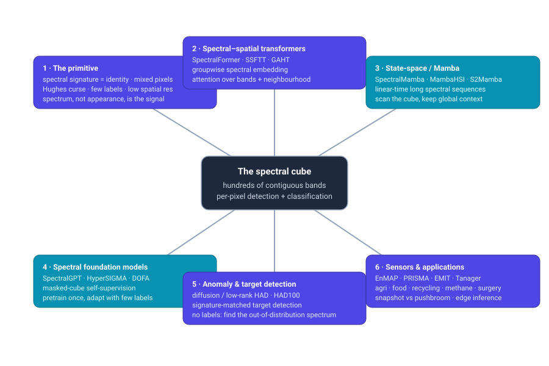

# Dense Object Detection & Classification — Recent Advances

*Compiled 2026-Jul-21 (America/Los_Angeles).*

Next installment in the running CV-updates log. Earlier entries on
`main`:
[Apr-30](../2026-Apr-30/2026-Apr-30_CV_updates.md),
[May-01](../2026-May-01/2026-May-01_CV_updates.md),
[May-02](../2026-May-02/2026-May-02_CV_updates.md),
[May-04](../2026-May-04/2026-May-04_CV_updates.md),
[May-05](../2026-May-05/2026-May-05_CV_updates.md),
[May-07](../2026-May-07/2026-May-07_CV_updates.md),
[May-08](../2026-May-08/2026-May-08_CV_updates.md),
[May-15](../2026-May-15/2026-May-15_CV_updates.md),
[May-16](../2026-May-16/2026-May-16_CV_updates.md),
[May-17](../2026-May-17/2026-May-17_CV_updates.md),
[Jun-09](../2026-Jun-09/2026-Jun-09_CV_updates.md),
[Jun-10](../2026-Jun-10/2026-Jun-10_CV_updates.md),
[Jun-12](../2026-Jun-12/2026-Jun-12_CV_updates.md),
[Jun-15](../2026-Jun-15/2026-Jun-15_CV_updates.md),
[Jun-16](../2026-Jun-16/2026-Jun-16_CV_updates.md),
[Jun-17](../2026-Jun-17/2026-Jun-17_CV_updates.md),
[Jun-19](../2026-Jun-19/2026-Jun-19_CV_updates.md),
[Jun-21](../2026-Jun-21/2026-Jun-21_CV_updates.md),
[Jun-22](../2026-Jun-22/2026-Jun-22_CV_updates.md),
[Jun-23](../2026-Jun-23/2026-Jun-23_CV_updates.md),
[Jun-24](../2026-Jun-24/2026-Jun-24_CV_updates.md),
[Jun-25](../2026-Jun-25/2026-Jun-25_CV_updates.md),
[Jun-27](../2026-Jun-27/2026-Jun-27_CV_updates.md),
[Jun-29](../2026-Jun-29/2026-Jun-29_CV_updates.md),
[Jun-30](../2026-Jun-30/2026-Jun-30_CV_updates.md),
[Jul-04](../2026-Jul-04/2026-Jul-04_CV_updates.md),
[Jul-07](../2026-Jul-07/2026-Jul-07_CV_updates.md),
[Jul-08](../2026-Jul-08/2026-Jul-08_CV_updates.md),
[Jul-10](../2026-Jul-10/2026-Jul-10_CV_updates.md),
[Jul-15](../2026-Jul-15/2026-Jul-15_CV_updates.md),
[Jul-17](../2026-Jul-17/2026-Jul-17_CV_updates.md),
[Jul-18](../2026-Jul-18/2026-Jul-18_CV_updates.md).

## Table of contents

1. [Why this pass: hyperspectral as its own primitive](#why)
2. [Topic map](#map)
3. [Spectral–spatial transformers — attention over the band axis](#transformers)
4. [State-space / Mamba — linear-time scanning of the cube](#mamba)
5. [Spectral foundation models — the answer to label scarcity](#foundation)
6. [Anomaly, target & object detection — finding the out-of-distribution spectrum](#detection)
7. [Sensors & applications — where the cube does dense work](#apps)
8. [Through-line & open problems](#throughline)
9. [Sources](#sources)

---

## 1. Why this pass: hyperspectral as its own primitive

The recent run of passes has worked **sensor / imaging primitives on their own
terms** — LiDAR ([Jun-27](../2026-Jun-27/2026-Jun-27_CV_updates.md)), the event
camera ([Jun-29](../2026-Jun-29/2026-Jun-29_CV_updates.md)), thermal infrared
([Jun-30](../2026-Jun-30/2026-Jun-30_CV_updates.md)), imaging radar
([Jul-04](../2026-Jul-04/2026-Jul-04_CV_updates.md)), medical CT/MRI + pathology
([Jul-07](../2026-Jul-07/2026-Jul-07_CV_updates.md)), subsea sonar
([Jul-08](../2026-Jul-08/2026-Jul-08_CV_updates.md)), astronomical surveys
([Jul-10](../2026-Jul-10/2026-Jul-10_CV_updates.md)), X-ray transmission
([Jul-15](../2026-Jul-15/2026-Jul-15_CV_updates.md)), the optical/electron
microscope ([Jul-17](../2026-Jul-17/2026-Jul-17_CV_updates.md)) and the ultrasound
image ([Jul-18](../2026-Jul-18/2026-Jul-18_CV_updates.md)).

The remote-sensing pass ([Jun-25](../2026-Jun-25/2026-Jun-25_CV_updates.md))
covered overhead RGB, multispectral and SAR — the *spatial* Earth-observation
sensors. It touched hyperspectral in a single line. That undersells a modality
whose detection-and-classification problem is fundamentally *not* spatial. This
pass takes the **hyperspectral cube as its own primitive**: the modality where the
discriminative signal lives along the **wavelength axis**, and where "the object"
is often a *spectrum*, not a shape.

Hyperspectral imaging (HSI) is a *different* detection-and-classification problem
from every sensor covered to date, in six concrete ways:

- **Identity is spectral, not visual.** A hyperspectral pixel is not a colour — it
  is a reflectance/emission *spectrum* sampled at hundreds of contiguous narrow
  bands (typically ~400–2500 nm, ~5–10 nm sampling). Each material has a spectral
  **fingerprint**. So "classification" is, at its core, **per-pixel spectral
  matching**: two objects that look identical in RGB (a real leaf vs a painted
  one, PET vs PVC, healthy vs tumour tissue) separate cleanly in the cube. A
  detector trained on appearance transfers *nothing*.
- **The data is a cube, and its two informative axes fight each other.** Every
  scene is an `(x, y, λ)` volume. The central architectural question of the whole
  field is how to model the **long spectral sequence** *and* the **spatial
  neighbourhood** at once — the "spectral–spatial" tension that names half the
  papers below. This is why sequence models (transformers, then Mamba) took over
  so fast: the band axis *is* a sequence.
- **More bands make it harder, not easier — the Hughes phenomenon.** Because
  labels are scarce, accuracy *rises then collapses* as the band count grows
  against a fixed, tiny training set (the curse of dimensionality made physical).
  Band selection, dimensionality reduction and grouping are not optimisations here;
  they are survival mechanisms.
- **The object can be smaller than a pixel.** Spaceborne HSI trades spatial for
  spectral resolution (EnMAP/PRISMA are **30 m/pixel**), so a single pixel is a
  *mixture* of materials. "Detection" therefore includes **spectral unmixing**
  (decompose a pixel into endmembers + fractional abundances) and **sub-pixel
  target detection** — locating a material that never fills a pixel. No box-based
  detector from the natural-image world even represents this.
- **Ground truth is a handful of scenes.** The field still benchmarks largely on
  **Indian Pines, Pavia, Houston 2013/2018 and WHU-Hi** — a few images with a few
  thousand labelled pixels each. Annotation requires field spectrometry or expert
  interpretation, so **label efficiency and self-supervision dominate**, exactly as
  they did for ultrasound and microscopy — but here the scarcity is structural.
- **Every instrument is a different sensor.** Band count, band centres, SNR and
  spatial resolution differ across EnMAP, PRISMA, EMIT, AVIRIS-NG and lab
  line-scan cameras, so a model trained on one sensor's spectra does not run on
  another's. The **variable-band / cross-sensor domain gap** is the binding
  constraint on foundation models — and the thing four different 2024–26
  mechanisms were invented to solve.

The through-line for the log: hyperspectral is the primitive where **the spectrum
is the object**. Everything below is an attempt to model a very long, very
redundant, weakly-labelled sequence per pixel — and to make one model survive the
jump from one spectrometer to the next.

---

## 2. Topic map

The pass is organised around six threads, mirrored in the diagram above:

| # | Thread | What it is | Representative work |
|---|--------|-----------|----------------------|
| 1 | **The primitive** | why the spectrum, not appearance, is the signal | §1 |
| 2 | **Spectral–spatial transformers** | attention over bands + neighbourhood | SpectralFormer, SSFTT, GAHT, SST, morphFormer |
| 3 | **State-space / Mamba** | linear-time long-spectral-sequence scanning | SpectralMamba, MambaHSI, S²Mamba, HSIMamba, IGroupSS-Mamba |
| 4 | **Spectral foundation models** | masked-cube self-supervision, cross-sensor | SpectralGPT, HyperSIGMA, DOFA, HyperFree, SpectralEarth, SpecAware |
| 5 | **Anomaly / target / object detection** | find the out-of-distribution spectrum | AETNet+HAD100, GT-HAD, BSDM, HTD-Mamba, SpecDETR, HyperCOD |
| 6 | **Sensors & applications** | where the cube does dense work | EnMAP, PRISMA, EMIT, Tanager-1; agri, food, recycling, methane, surgery |

---

## 3. Spectral–spatial transformers — attention over the band axis

The transformer takeover of HSI happened *because* the band axis is a sequence.
The 2021–23 wave established the template every later model iterates on: embed the
spectrum as tokens, attend along it, and fuse with spatial context.

- **SpectralFormer** ("Rethinking HSI Classification with Transformers", IEEE TGRS
  2022) is the origin point. It treats the cube as **spectral sequences**,
  introducing a **group-wise spectral embedding** (learn local sequence structure
  from *neighbouring bands* rather than single bands) and a **cross-layer adaptive
  fusion** that skip-connects transformer layers. Crucially it works for both
  pixel- and patch-wise inputs — establishing the band-as-sequence framing.
  ([arXiv 2107.02988](https://arxiv.org/abs/2107.02988))
- **SSFTT — Spectral–Spatial Feature Tokenization Transformer** (IEEE TGRS 2022)
  is the workhorse baseline. A **3D + 2D convolution** front-end extracts shallow
  spectral–spatial features, a **Gaussian-weighted feature tokenizer** turns them
  into semantic tokens, and a transformer encoder learns high-level features. It
  remains one of the most-cited strong baselines.
  ([IEEE 9684381](https://ieeexplore.ieee.org/document/9684381) ·
  [code](https://github.com/zgr6010/HSI_SSFTT))
- **GAHT — Group-Aware Hierarchical Transformer** (IEEE TGRS 2022) attacks a
  transformer-specific failure mode: with hundreds of bands, plain multi-head
  attention **over-disperses**. GAHT's **grouped pixel embedding** confines
  attention to local spectral–spatial groups in a 3-stage hierarchy, keeping the
  representation focused.
  ([IEEE 9895238](https://ieeexplore.ieee.org/document/9895238) ·
  [code](https://github.com/MeiShaohui/Group-Aware-Hierarchical-Transformer))
- **SST — Spatial–Spectral Transformer with Cross-Attention** (IEEE TGRS 2022)
  makes the two axes explicit: a **dual-branch** design (one spatial, one spectral)
  joined by a **cross-attention** fusion module — the cleanest statement of the
  "two orthogonal axes" view.
  ([IEEE 9874815](https://ieeexplore.ieee.org/document/9874815))
- **morphFormer** (IEEE TGRS 2023) folds classic **morphological operators**
  (learnable erosion/dilation) into a **spectral–spatial morphological attention**
  that fuses the CLS token with patch tokens — a reminder that HSI's strong
  physical priors still buy accuracy on tiny training sets.
  ([IEEE 10036472](https://ieeexplore.ieee.org/document/10036472))

The 2024–26 continuation keeps hybridising: **3D-convolution-guided** spectral–
spatial transformers ([arXiv 2404.13252](https://arxiv.org/abs/2404.13252)),
**transformer fusion across disjoint samples**
([arXiv 2405.01095](https://arxiv.org/abs/2405.01095)) and **selective / dual-fusion
transformers** ([arXiv 2410.03171](https://arxiv.org/abs/2410.03171)). The recurring
lesson: pure attention over hundreds of bands is expensive and over-disperses —
which is exactly the opening the next thread walks through.

---

## 4. State-space / Mamba — linear-time scanning of the cube

If the band axis is a long sequence, the transformer's quadratic cost is a tax you
pay on every pixel. The **selective state-space (Mamba)** wave — the fastest-moving
pocket of HSI in 2024–25 — offers **linear-time** long-range spectral modelling,
and it arrived almost the moment Mamba hit vision.

- **SpectralMamba** ("Efficient Mamba for HSI Classification", 2024) pairs a
  **gated spatial–spectral merging** module with a **piece-wise sequential
  scanning** strategy, sidestepping the parallelisation/attention-cost tradeoff.
  ([arXiv 2404.08489](https://arxiv.org/abs/2404.08489))
- **MambaHSI** (IEEE TGRS 2025) is the most consequential for the *dense-primitive*
  argument: a **pure-SSM** model that ingests the **whole image end-to-end** — not
  a patch window — with spatial and spectral Mamba blocks and adaptive fusion,
  modelling long-range dependencies at **linear complexity**. Whole-image inference
  is the natural expression of a per-pixel dense task.
  ([arXiv 2501.04944](https://arxiv.org/abs/2501.04944))
- **S²Mamba — Spatial-Spectral State Space Model** (IEEE TGRS 2025) runs **two
  selective SSMs**, one scanning space and one scanning the spectral axis, fused by
  a learnable **spatial-spectral mixture gate** — the Mamba analogue of SST's
  dual-branch design.
  ([arXiv 2404.18213](https://arxiv.org/abs/2404.18213))
- **HSIMamba** adds **bidirectional reversed-convolution** spectral pathways plus a
  spatial block, chasing transformer-level modelling at CNN-level cost.
  ([arXiv 2404.00272](https://arxiv.org/abs/2404.00272)); the earlier
  **Spectral-Spatial Mamba** ([arXiv 2404.18401](https://arxiv.org/abs/2404.18401))
  was the first port of Mamba to HSI.
- The variant explosion is itself the story — **IGroupSS-Mamba** (interval-group
  scanning, [arXiv 2410.05100](https://arxiv.org/abs/2410.05100)), **WaveMamba**
  (wavelet + Mamba, [arXiv 2408.01231](https://arxiv.org/abs/2408.01231)),
  **DCT-Mamba3D**, **MambaMoE** (mixture-of-spectral-spatial-experts,
  [arXiv 2504.20509](https://arxiv.org/abs/2504.20509)) and **Mamba-in-Mamba** —
  now surveyed in their own right ("State Space Models Meet Remote Sensing",
  [arXiv 2606.25329](https://arxiv.org/abs/2606.25329); "Vision Mamba in Remote
  Sensing", [arXiv 2505.00630](https://arxiv.org/abs/2505.00630)).

The net for the log: HSI is the modality where **linear-time sequence modelling
matters most**, because the sequence in question is *per pixel* and hundreds of
steps long — and where the field has moved from "does Mamba work" to "how do we
scan the cube" in barely a year.

---

## 5. Spectral foundation models — the answer to label scarcity

With ground truth stuck at a few standard scenes, the 2024–26 headline is the same
one every label-starved modality in this log has reached: **pretrain once on
unlabelled cubes, adapt cheaply**. HSI adds a twist no other modality has — the
**variable-band problem** — and the interesting work is the four distinct
mechanisms invented to solve it.

- **SpectralGPT** (IEEE TPAMI 2024) is the first spectral RS foundation model. A
  **3D generative pretrained transformer** with a **3D-token masked autoencoder**
  and multi-target spectral reconstruction, it explicitly captures *spectrally
  sequential* patterns and handles varying sizes, resolutions and time-series
  (~600M params, ~1M spectral images).
  ([arXiv 2311.07113](https://arxiv.org/abs/2311.07113))
- **HyperSIGMA** (IEEE TPAMI 2025) is the first HSI foundation model **scalable to
  >1B parameters**. Its **sparse sampling attention (SSA)** combats the extreme
  spectral/spatial redundancy of cubes; separate spatial and spectral subnetworks
  are pretrained on the purpose-built **HyperGlobal-450K** corpus, and it is
  evaluated across **16 datasets / 7 tasks** — classification, target *and* anomaly
  detection — reporting gains over SpectralGPT.
  ([arXiv 2406.11519](https://arxiv.org/abs/2406.11519) ·
  [code](https://github.com/WHU-Sigma/HyperSIGMA))
- The **variable-band mechanisms** are the conceptual core of the thread:
  - **DOFA (Dynamic-One-For-All)** uses a **wavelength-conditioned hypernetwork**
    to *generate* patch-embedding weights per band, so one ViT ingests SAR, MSI,
    HSI and RGB with different channel counts.
    ([arXiv 2403.15356](https://arxiv.org/abs/2403.15356) ·
    [code](https://github.com/zhu-xlab/DOFA))
  - **HyperFree** (CVPR 2025) learns a **weight dictionary over 0.4–2.5 µm** for
    dynamic embedding of *arbitrary* channel counts, and is **tuning-free** —
    prompt-based, SAM-style, producing semantic masks with no fine-tuning.
    ([arXiv 2503.21841](https://arxiv.org/abs/2503.21841) ·
    [code](https://github.com/Jingtao-Li-CVer/HyperFree))
  - **SpecAware** (ISPRS J. 2025) adds a **spectral-metadata-aware encoder** that
    reads band information to unify multi-sensor HSI, pretrained on Hyper-400K.
    ([arXiv 2510.27219](https://arxiv.org/abs/2510.27219))
  - **HyperSL** (IEEE TGRS 2025) standardises every spectral vector into a common
    token with **wavelength embedded in the positional encoding**, pretrained on
    300M+ spectral instances.
    ([IEEE 10981753](https://ieeexplore.ieee.org/document/10981753))
- **Pretraining corpora** are now the scarce resource, not architectures:
  **SpectralEarth** (~538K EnMAP patches for SSL,
  [arXiv 2408.08447](https://arxiv.org/abs/2408.08447)), **TerraMAE** (adaptive
  masked autoencoders on EO cubes,
  [arXiv 2508.07020](https://arxiv.org/abs/2508.07020)) and the **HyBiomass**
  global benchmark for evaluating geospatial FMs
  ([arXiv 2506.11314](https://arxiv.org/abs/2506.11314)). The multispectral
  lineage — **SatMAE** (NeurIPS 2022,
  [arXiv 2207.08051](https://arxiv.org/abs/2207.08051)), **SatMAE++** (CVPR 2024,
  [arXiv 2403.05419](https://arxiv.org/abs/2403.05419)) and NASA–IBM's
  **Prithvi-EO-2.0** ([repo](https://github.com/NASA-IMPACT/Prithvi-EO-2.0)) —
  is the multispectral contrast: powerful, but not hyperspectral-native.

The consistent finding: as with ultrasound and microscopy, **modality-native
pretraining transfers and natural-image pretraining largely does not** — but HSI's
extra burden is that "native" must also mean **sensor-agnostic**, and the
wavelength-conditioning trick is the field's distinctive answer.

---

## 6. Anomaly, target & object detection — finding the out-of-distribution spectrum

"Detection" in HSI splits into three problems that have no clean analogue in RGB —
and each is defined by the *spectrum*, not the box.

**Anomaly detection (HAD): no labels, no signature — just "which spectrum doesn't
belong".** The task is unsupervised: model the background, flag pixels whose
spectrum is out-of-distribution.

- **Autoencoder / low-rank–sparse** methods remain the backbone: **AClrAE**
  (dictionary-trained attention-constrained low-rank+sparse AE, *Neural Networks*
  2024, [DOI](https://www.sciencedirect.com/science/article/pii/S0893608024007214))
  and **DGRAD-LRR** (dual graph-regularised low-rank representation, *Remote
  Sensing* 2024, [DOI](https://www.mdpi.com/2072-4292/16/11/1837)).
- **Self-supervised HAD** is the growth area: **AETNet** ("train once, apply to any
  scene" with random masks, [arXiv 2303.18001](https://arxiv.org/abs/2303.18001)) —
  released *with* the field's first large benchmark, **HAD100** (100 real
  AVIRIS-NG test scenes plus aligned background sets); **SAP** (self-supervised
  anomaly prior, [arXiv 2404.13342](https://arxiv.org/abs/2404.13342)); and
  **Super-AD**, which formalises and fixes the **identity-mapping problem** that
  plagues reconstruction-based HAD ([arXiv 2504.04115](https://arxiv.org/abs/2504.04115)).
- **Transformer & diffusion HAD**: **GT-HAD** (gated transformer, dual
  background/anomaly branches, IEEE TNNLS 2024,
  [IEEE 10432978](https://ieeexplore.ieee.org/document/10432978)); **BSDM**
  (background-suppression diffusion,
  [arXiv 2307.09861](https://arxiv.org/abs/2307.09861)) opened a diffusion line now
  broad enough for its own review
  ([arXiv 2505.11158](https://arxiv.org/abs/2505.11158)). A 2025 survey and
  comparative study across 17 datasets is the current map of the field
  ([arXiv 2507.05730](https://arxiv.org/abs/2507.05730)).

**Target detection (HTD): given a spectral signature, find it — even sub-pixel.**
Framed as per-pixel binary matching against a known spectrum.

- **HTD-Mamba** brings linear-time state-space modelling to HTD via spectrally-
  contrastive learning and a pyramid SSM
  ([arXiv 2407.06841](https://arxiv.org/abs/2407.06841) ·
  [code](https://github.com/shendb2022/HTD-Mamba)).
- **Cross-domain few-shot** is the recurring recipe against scarce target priors —
  transformer-based TCFSL (IEEE TGRS 2025) and physics-aligned **SpecMamba** for
  few-shot HTD with test-time adaptation
  ([arXiv 2604.05562](https://arxiv.org/abs/2604.05562), 2026 preprint).

**Object detection: boxes on cubes, and tiny/camouflaged targets.** The DETR
paradigm arrived recently and is where HSI most resembles the rest of this log —
while exploiting the spectrum to find what RGB detectors cannot.

- **SpecDETR** (ISPRS J. 2025) is the first **DETR-style** network for multi-class
  hyperspectral **point/tiny-object** detection, with self-excited subpixel-scale
  attention over the full cube and **no CNN backbone**; it ships the **SPOD**
  benchmark ([arXiv 2405.10148](https://arxiv.org/abs/2405.10148) ·
  [code](https://github.com/ZhaoxuLi123/SpecDETR)).
- **S2ADet** does bounding-box detection via unified spectral–spatial aggregation
  ([arXiv 2306.08370](https://arxiv.org/abs/2306.08370)), and the **camouflage**
  frontier is now benchmarked: **HyperCOD** (first HSI camouflaged-object-detection
  dataset, 350 cubes / 200 bands, AAAI 2026,
  [arXiv 2601.03736](https://arxiv.org/abs/2601.03736)) and **BihoT** for
  camouflaged tracking ([arXiv 2408.12232](https://arxiv.org/abs/2408.12232)).
  Camouflage is the canonical case for the whole primitive: paint matched to a
  background in RGB still separates by spectrum.

**Benchmarks.** Classification still runs on **Indian Pines / Pavia / Houston
2013 & 2018 / WHU-Hi** ([WHU-Hi](https://arxiv.org/abs/2012.13920)); detection now
has **HAD100** (anomaly), **SPOD** (tiny objects) and **HyperCOD** (camouflage) —
the benchmark reset that always signals a field maturing past bespoke methods.

---

## 7. Sensors & applications — where the cube does dense work

Hyperspectral is unusual in this log for spanning **orbit to conveyor belt** on the
same primitive, and the sensor split drives the methods.

**Platforms.** The spaceborne era is now real, open-data and multiplying:

- **EnMAP** (DLR/GFZ, 2022) — pushbroom VNIR+SWIR, 400–2500 nm, 30 m, free data;
  two-year results published 2024
  ([RSE](https://www.sciencedirect.com/science/article/pii/S003442572400405X) ·
  [eoPortal](https://www.eoportal.org/satellite-missions/enmap)).
- **PRISMA** (ASI, 2019) — 240 bands, 30 m; now a workhorse for **mineral / litho
  mapping** ([Kazakhstan porphyry Cu](https://www.tandfonline.com/doi/full/10.1080/10106049.2025.2591763),
  [torrential-basin minerals](https://doi.org/10.3390/rs17152582)).
- **EMIT** (NASA/JPL, on the ISS since 2022) — built for surface **mineralogy** but
  proven for **methane / CO₂ super-emitter** detection; extended Nov 2024
  ([NASA EMIT](https://www.nasa.gov/missions/station/iss-research/emit/) ·
  [methane plume product](https://www.earthdata.nasa.gov/data/catalog/lpcloud-emitl2bch4plm-001)).
- **Tanager-1** (Carbon Mapper / Planet / JPL, launched Aug 2024, public data Feb
  2025) — facility-level methane and CO₂; a dedicated **SWIR Tanager** and ≥3 more
  satellites are planned
  ([system paper, AMT 2025](https://amt.copernicus.org/articles/18/6933/2025/) ·
  [Carbon Mapper](https://carbonmapper.org/articles/first-light-images-released-from-the-carbon-mapper-coalition-tanager-1-satellite)).
  NASA's **SBG** VSWIR + thermal mission is the next-generation follow-on
  ([SBG](https://science.gsfc.nasa.gov/solarsystem/projects/621/)).

**Camera physics matters.** The **pushbroom** line-scanner (hundreds of bands, high
spatial resolution, but needs a scan actuator) vs the **snapshot** camera (fewer
bands, video-rate, real-time) tradeoff decides what is deployable — sharply
illustrated in a brain-tissue study comparing both in the operating room
([J. Biomed. Opt. 2024](https://pmc.ncbi.nlm.nih.gov/articles/PMC11420787/)).

**Application domains** — all dense detection/classification on the spectrum:

- **Precision agriculture** — crop/disease/weed mapping and nutrient status;
  band selection is the recurring theme against the Hughes curse
  ([review, Comput. Electron. Agric. 2024](https://dl.acm.org/doi/10.1016/j.compag.2024.109037) ·
  [leaf-disease DL 2025](https://www.frontiersin.org/journals/plant-science/articles/10.3389/fpls.2025.1662251/full)).
- **Food quality & safety** — bruise/contaminant/ripeness inspection with DL
  ([review, JAFC 2025](https://pubs.acs.org/doi/10.1021/acs.jafc.4c11492)).
- **Plastics / waste sorting & recycling** — NIR line-scan discriminates polymer
  types indistinguishable in RGB (PET/PVC/PE/PP/PS/PLA)
  ([Waste Management 2025](https://www.sciencedirect.com/science/article/abs/pii/S0956053X2500265X) ·
  [HSI+RGB fusion 2025](https://www.mdpi.com/2313-4321/10/5/179)).
- **Environmental methane/GHG** — automated plume detection & delineation over
  EMIT/AVIRIS-class data
  ([arXiv 2505.21806](https://arxiv.org/abs/2505.21806)).
- **Surgical / medical HSI** — tumour-margin and tissue classification, an active
  clinical-translation frontier
  ([surgical HSI review 2025](https://www.tandfonline.com/doi/full/10.1080/24699322.2025.2546819) ·
  [brain-cancer classification, arXiv 2402.07192](https://arxiv.org/abs/2402.07192)).
- **Cultural heritage** — pigment identification and underdrawing recovery in
  paintings ([Thangka pigments, npj Heritage Sci. 2025](https://www.nature.com/articles/s40494-025-02241-5)).

**Edge & onboard** processing is the deployment frontier: real-time UAV pipelines
([Sensors 2025](https://www.ncbi.nlm.nih.gov/pmc/articles/PMC12349340/)),
onboard-satellite lightweight segmentation
([arXiv 2509.13229](https://arxiv.org/abs/2509.13229)) and a dedicated survey
([arXiv 2404.06526](https://arxiv.org/abs/2404.06526)) — because downlinking full
cubes is often infeasible, so the classifier must run *before* the data comes down.

---

## 8. Through-line & open problems

- **The spectrum is the object.** Across every thread, the discriminative signal is
  the per-pixel spectral fingerprint, not appearance — which is why HSI finds
  camouflage, sorts visually-identical plastics, and detects sub-pixel targets that
  no RGB or box-based detector can represent.
- **Sequence modelling won, and Mamba is winning the sequel.** The band axis is a
  long redundant sequence; transformers replaced CNNs, and linear-time state-space
  models (MambaHSI, S²Mamba) are now the fastest-moving pocket precisely because the
  sequence is *per pixel* and hundreds of steps long.
- **The binding constraint is labels, then sensors.** Ground truth is a handful of
  scenes, so self-supervised foundation models dominate — but HSI's distinctive
  burden is that "foundation" must also mean **sensor-agnostic**. Wavelength-
  conditioned embeddings (DOFA, HyperFree, SpecAware, HyperSL) are the field's
  signature answer, and cross-sensor domain generalisation (BiDA, C³DG, HyperKD)
  is the open problem behind it.
- **Detection is three different problems.** Unsupervised anomaly (HAD100),
  signature-based target (HTD-Mamba) and box/point object detection (SpecDETR,
  HyperCOD) each have distinct formulations — and the arrival of shared benchmarks
  in all three is the clearest sign of maturation.
- **Deployment pushes compute upstream.** Cubes are too big to downlink or stream
  raw, so the real frontier is **onboard/edge** inference — the mirror image of
  ultrasound's "model at the bedside".

**Net:** hyperspectral in 2025–26 is mid-transition from bespoke per-scene
classifiers to **sensor-agnostic, self-supervised foundation models over linear-time
sequence backbones**, with sub-pixel unmixing at one end and orbital methane
detection at the other — a detection-and-classification problem that is
unmistakably its own primitive because, uniquely in this log, *the class label is
written in the spectrum*.

---

## 9. Sources

*Retrieved 2026-Jul-21. Direct fetch of arXiv abstract pages was blocked by egress
filtering during compilation; arXiv IDs below were corroborated against search-index
listings (the bracketed `[YYMM.NNNNN]` titles) and, where possible, publisher /
code-repository landing pages. A few early-2026 preprints (flagged) are recent and
should be re-checked against their final venue. Treat quantitative figures as
author-reported.*

**Spectral–spatial transformers (§3)**
- SpectralFormer — arXiv 2107.02988: https://arxiv.org/abs/2107.02988
- SSFTT — IEEE 9684381: https://ieeexplore.ieee.org/document/9684381 · code: https://github.com/zgr6010/HSI_SSFTT
- GAHT — IEEE 9895238: https://ieeexplore.ieee.org/document/9895238 · code: https://github.com/MeiShaohui/Group-Aware-Hierarchical-Transformer
- SST (cross-attention) — IEEE 9874815: https://ieeexplore.ieee.org/document/9874815
- morphFormer — IEEE 10036472: https://ieeexplore.ieee.org/document/10036472
- 3D-conv-guided SS transformer — arXiv 2404.13252: https://arxiv.org/abs/2404.13252 · disjoint-sample fusion — arXiv 2405.01095: https://arxiv.org/abs/2405.01095 · selective/dual-fusion — arXiv 2410.03171: https://arxiv.org/abs/2410.03171

**State-space / Mamba (§4)**
- SpectralMamba — arXiv 2404.08489: https://arxiv.org/abs/2404.08489
- MambaHSI — arXiv 2501.04944: https://arxiv.org/abs/2501.04944
- S²Mamba — arXiv 2404.18213: https://arxiv.org/abs/2404.18213
- HSIMamba — arXiv 2404.00272: https://arxiv.org/abs/2404.00272 · Spectral-Spatial Mamba — arXiv 2404.18401: https://arxiv.org/abs/2404.18401
- IGroupSS-Mamba — arXiv 2410.05100: https://arxiv.org/abs/2410.05100 · WaveMamba — arXiv 2408.01231: https://arxiv.org/abs/2408.01231 · MambaMoE — arXiv 2504.20509: https://arxiv.org/abs/2504.20509
- Surveys — SSMs meet remote sensing arXiv 2606.25329: https://arxiv.org/abs/2606.25329 · Vision Mamba in RS arXiv 2505.00630: https://arxiv.org/abs/2505.00630 · classification survey arXiv 2404.14955: https://arxiv.org/abs/2404.14955

**Spectral foundation models (§5)**
- SpectralGPT (TPAMI 2024) — arXiv 2311.07113: https://arxiv.org/abs/2311.07113
- HyperSIGMA (TPAMI 2025) — arXiv 2406.11519: https://arxiv.org/abs/2406.11519 · code: https://github.com/WHU-Sigma/HyperSIGMA
- DOFA — arXiv 2403.15356: https://arxiv.org/abs/2403.15356 · code: https://github.com/zhu-xlab/DOFA
- HyperFree (CVPR 2025) — arXiv 2503.21841: https://arxiv.org/abs/2503.21841 · code: https://github.com/Jingtao-Li-CVer/HyperFree
- SpecAware — arXiv 2510.27219: https://arxiv.org/abs/2510.27219 · HyperSL — IEEE 10981753: https://ieeexplore.ieee.org/document/10981753
- SpectralEarth — arXiv 2408.08447: https://arxiv.org/abs/2408.08447 · TerraMAE — arXiv 2508.07020: https://arxiv.org/abs/2508.07020 · HyBiomass — arXiv 2506.11314: https://arxiv.org/abs/2506.11314
- SatMAE — arXiv 2207.08051: https://arxiv.org/abs/2207.08051 · SatMAE++ — arXiv 2403.05419: https://arxiv.org/abs/2403.05419 · Prithvi-EO-2.0 — https://github.com/NASA-IMPACT/Prithvi-EO-2.0

**Anomaly / target / object detection (§6)**
- AETNet + HAD100 — arXiv 2303.18001: https://arxiv.org/abs/2303.18001 · HAD100 page: https://zhaoxuli123.github.io/HAD100/
- AClrAE — DOI 10.1016/j.neunet.2024.107214: https://www.sciencedirect.com/science/article/pii/S0893608024007214 · DGRAD-LRR — https://www.mdpi.com/2072-4292/16/11/1837
- SAP — arXiv 2404.13342: https://arxiv.org/abs/2404.13342 · Super-AD — arXiv 2504.04115: https://arxiv.org/abs/2504.04115 · STAD — arXiv 2401.01093: https://arxiv.org/abs/2401.01093
- GT-HAD — IEEE 10432978: https://ieeexplore.ieee.org/document/10432978 · BSDM — arXiv 2307.09861: https://arxiv.org/abs/2307.09861 · diffusion review — arXiv 2505.11158: https://arxiv.org/abs/2505.11158 · HAD survey — arXiv 2507.05730: https://arxiv.org/abs/2507.05730
- HTD-Mamba — arXiv 2407.06841: https://arxiv.org/abs/2407.06841 · SpecMamba (few-shot HTD, 2026 preprint) — arXiv 2604.05562: https://arxiv.org/abs/2604.05562
- SpecDETR + SPOD — arXiv 2405.10148: https://arxiv.org/abs/2405.10148 · code: https://github.com/ZhaoxuLi123/SpecDETR · S2ADet — arXiv 2306.08370: https://arxiv.org/abs/2306.08370
- HyperCOD (AAAI 2026 preprint) — arXiv 2601.03736: https://arxiv.org/abs/2601.03736 · BihoT — arXiv 2408.12232: https://arxiv.org/abs/2408.12232
- WHU-Hi benchmark — arXiv 2012.13920: https://arxiv.org/abs/2012.13920 · classic scenes (GIC): https://www.ehu.eus/ccwintco/index.php/Hyperspectral_Remote_Sensing_Scenes · Houston: https://hyperspectral.ee.uh.edu/

**Sensors & applications (§7)**
- EnMAP — RSE 2024: https://www.sciencedirect.com/science/article/pii/S003442572400405X · eoPortal: https://www.eoportal.org/satellite-missions/enmap
- PRISMA mineral mapping — Geocarto 2025: https://www.tandfonline.com/doi/full/10.1080/10106049.2025.2591763 · Remote Sensing 2025: https://doi.org/10.3390/rs17152582
- EMIT — NASA: https://www.nasa.gov/missions/station/iss-research/emit/ · methane product: https://www.earthdata.nasa.gov/data/catalog/lpcloud-emitl2bch4plm-001
- Tanager-1 — AMT 2025: https://amt.copernicus.org/articles/18/6933/2025/ · Carbon Mapper: https://carbonmapper.org/articles/first-light-images-released-from-the-carbon-mapper-coalition-tanager-1-satellite · SBG: https://science.gsfc.nasa.gov/solarsystem/projects/621/
- Pushbroom vs snapshot (surgery) — J. Biomed. Opt. 2024: https://pmc.ncbi.nlm.nih.gov/articles/PMC11420787/
- Agriculture review — Comput. Electron. Agric. 2024: https://dl.acm.org/doi/10.1016/j.compag.2024.109037 · leaf disease — Front. Plant Sci. 2025: https://www.frontiersin.org/journals/plant-science/articles/10.3389/fpls.2025.1662251/full
- Food safety review — JAFC 2025: https://pubs.acs.org/doi/10.1021/acs.jafc.4c11492
- Plastics sorting — Waste Management 2025: https://www.sciencedirect.com/science/article/abs/pii/S0956053X2500265X · HSI+RGB fusion — Recycling 2025: https://www.mdpi.com/2313-4321/10/5/179
- Methane plume detection — arXiv 2505.21806: https://arxiv.org/abs/2505.21806
- Surgical HSI review — 2025: https://www.tandfonline.com/doi/full/10.1080/24699322.2025.2546819 · brain-cancer classification — arXiv 2402.07192: https://arxiv.org/abs/2402.07192
- Cultural heritage (Thangka pigments) — npj Heritage Science 2025: https://www.nature.com/articles/s40494-025-02241-5
- Onboard/edge — survey arXiv 2404.06526: https://arxiv.org/abs/2404.06526 · UAV real-time — Sensors 2025: https://www.ncbi.nlm.nih.gov/pmc/articles/PMC12349340/ · onboard segmentation — arXiv 2509.13229: https://arxiv.org/abs/2509.13229
- Cross-sensor generalisation — BiDA arXiv 2507.02268: https://arxiv.org/abs/2507.02268 · C³DG arXiv 2407.04100: https://arxiv.org/abs/2407.04100 · HyperKD arXiv 2508.09453: https://arxiv.org/abs/2508.09453 · CARL arXiv 2504.19223: https://arxiv.org/abs/2504.19223

---

*Part of the running CV-updates log. Each pass takes one dense-detection &
classification primitive on its own terms; this one is the hyperspectral cube.
Next passes continue the sensor-primitive arc.*
