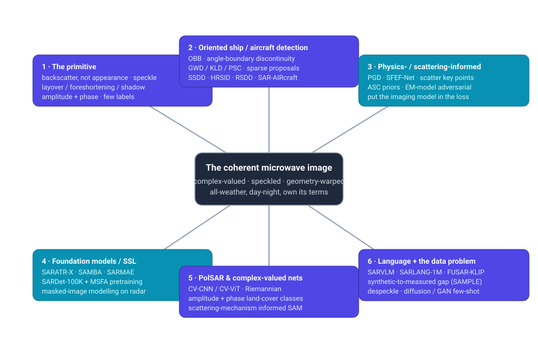

# Dense Object Detection & Classification — Recent Advances

*Compiled 2026-Jul-22 (America/Los_Angeles).*

Next installment in the running CV-updates log. Earlier entries on
`main`:
[Apr-30](../2026-Apr-30/2026-Apr-30_CV_updates.md),
[May-01](../2026-May-01/2026-May-01_CV_updates.md),
[May-02](../2026-May-02/2026-May-02_CV_updates.md),
[May-04](../2026-May-04/2026-May-04_CV_updates.md),
[May-05](../2026-May-05/2026-May-05_CV_updates.md),
[May-07](../2026-May-07/2026-May-07_CV_updates.md),
[May-08](../2026-May-08/2026-May-08_CV_updates.md),
[May-15](../2026-May-15/2026-May-15_CV_updates.md),
[May-16](../2026-May-16/2026-May-16_CV_updates.md),
[May-17](../2026-May-17/2026-May-17_CV_updates.md),
[Jun-09](../2026-Jun-09/2026-Jun-09_CV_updates.md),
[Jun-10](../2026-Jun-10/2026-Jun-10_CV_updates.md),
[Jun-12](../2026-Jun-12/2026-Jun-12_CV_updates.md),
[Jun-15](../2026-Jun-15/2026-Jun-15_CV_updates.md),
[Jun-16](../2026-Jun-16/2026-Jun-16_CV_updates.md),
[Jun-17](../2026-Jun-17/2026-Jun-17_CV_updates.md),
[Jun-19](../2026-Jun-19/2026-Jun-19_CV_updates.md),
[Jun-21](../2026-Jun-21/2026-Jun-21_CV_updates.md),
[Jun-22](../2026-Jun-22/2026-Jun-22_CV_updates.md),
[Jun-23](../2026-Jun-23/2026-Jun-23_CV_updates.md),
[Jun-24](../2026-Jun-24/2026-Jun-24_CV_updates.md),
[Jun-25](../2026-Jun-25/2026-Jun-25_CV_updates.md),
[Jun-27](../2026-Jun-27/2026-Jun-27_CV_updates.md),
[Jun-29](../2026-Jun-29/2026-Jun-29_CV_updates.md),
[Jun-30](../2026-Jun-30/2026-Jun-30_CV_updates.md),
[Jul-04](../2026-Jul-04/2026-Jul-04_CV_updates.md),
[Jul-07](../2026-Jul-07/2026-Jul-07_CV_updates.md),
[Jul-08](../2026-Jul-08/2026-Jul-08_CV_updates.md),
[Jul-10](../2026-Jul-10/2026-Jul-10_CV_updates.md),
[Jul-15](../2026-Jul-15/2026-Jul-15_CV_updates.md),
[Jul-17](../2026-Jul-17/2026-Jul-17_CV_updates.md),
[Jul-18](../2026-Jul-18/2026-Jul-18_CV_updates.md),
[Jul-21](../2026-Jul-21/2026-Jul-21_CV_updates.md).

## Table of contents

1. [Why this pass: SAR as its own primitive](#why)
2. [Topic map](#map)
3. [Oriented detection — ships & aircraft as rotated targets](#oriented)
4. [Physics- & scattering-informed detection and recognition](#physics)
5. [Foundation models & self-supervised pretraining on radar](#foundation)
6. [PolSAR & complex-valued networks — amplitude *and* phase](#polsar)
7. [Language, open-vocabulary & the semantic gap](#language)
8. [The data problem: speckle, the synthetic-to-measured gap, few-shot generation](#data)
9. [Through-line & open problems](#throughline)
10. [Sources](#sources)

---

## 1. Why this pass: SAR as its own primitive

The recent run of passes has worked **sensor / imaging primitives on their own
terms** — LiDAR ([Jun-27](../2026-Jun-27/2026-Jun-27_CV_updates.md)), the event
camera ([Jun-29](../2026-Jun-29/2026-Jun-29_CV_updates.md)), thermal infrared
([Jun-30](../2026-Jun-30/2026-Jun-30_CV_updates.md)), imaging radar
([Jul-04](../2026-Jul-04/2026-Jul-04_CV_updates.md)), medical CT/MRI + pathology
([Jul-07](../2026-Jul-07/2026-Jul-07_CV_updates.md)), subsea sonar
([Jul-08](../2026-Jul-08/2026-Jul-08_CV_updates.md)), astronomical surveys
([Jul-10](../2026-Jul-10/2026-Jul-10_CV_updates.md)), X-ray transmission
([Jul-15](../2026-Jul-15/2026-Jul-15_CV_updates.md)), the optical/electron
microscope ([Jul-17](../2026-Jul-17/2026-Jul-17_CV_updates.md)), the ultrasound
image ([Jul-18](../2026-Jul-18/2026-Jul-18_CV_updates.md)) and the hyperspectral
cube ([Jul-21](../2026-Jul-21/2026-Jul-21_CV_updates.md)).

The remote-sensing pass ([Jun-25](../2026-Jun-25/2026-Jun-25_CV_updates.md))
covered overhead RGB, multispectral and *touched* SAR — mostly through
optical–SAR fusion (SMEP-DETR / MHFNet). That undersold a modality whose
detection-and-classification problem is unlike any optical sensor: the image is
a **coherent microwave measurement**, not a photograph. This pass takes
**synthetic aperture radar as its own primitive**.

SAR is a *different* detection-and-classification problem from every sensor
covered so far, in six concrete ways:

1. **The signal is backscatter, not reflected light.** A pixel's brightness is
   the radar cross-section of a resolution cell at a specific frequency,
   polarization and incidence angle — governed by surface roughness, dielectric
   constant and geometry (dihedral/trihedral corners, specular facets), *not* by
   colour or texture as an eye would read it. A calm sea is dark; a metal ship's
   corner reflectors are blindingly bright. "Appearance" priors carried over
   from ImageNet are actively misleading.
2. **Speckle is signal-dependent, multiplicative noise, not additive.** Coherent
   summation of many sub-scatterers in a cell produces a grainy interference
   pattern with Rayleigh/Gamma statistics. It cannot be denoised by Gaussian
   assumptions, and it is *the* thing that separates SAR pre-processing from
   optical.
3. **The geometry is range-Doppler, not perspective.** Layover, foreshortening
   and radar shadow warp tall structures toward the sensor and cast
   information-free shadows away from it. Objects have an *orientation* on the
   image plane that carries physical meaning (a ship's heading), which is why
   **oriented bounding boxes** are the default here, not the exception.
4. **The native data is complex-valued.** A single-look-complex (SLC) product
   carries amplitude *and* phase; interferometry (InSAR) and polarimetry
   (PolSAR) live entirely in that phase/covariance structure. Casting to a real
   8-bit amplitude image throws away half the measurement — motivating
   complex-valued networks (§6).
5. **Labels are scarce and targets are tiny.** Ships and vehicles occupy tens of
   pixels; annotation needs a radar analyst, not a crowd-worker; and the
   canonical vehicle-recognition set (MSTAR) is small, correlated and
   over-fit-prone. Few-shot, self-supervised and synthetic-data methods are not
   niceties here — they are the mainline (§5, §8).
6. **It works when optical cannot.** All-weather, day-and-night, cloud- and
   smoke-penetrating — which is exactly why maritime domain awareness, disaster
   response and defence lean on it, and why the field cares about *operational*
   robustness over leaderboard deltas.

The rest of this pass follows the six clusters in the map: oriented detection
(§3), physics-informed detection (§4), foundation models (§5), PolSAR &
complex-valued nets (§6), language/open-vocabulary (§7) and the data problem
(§8).

---

## 2. Oriented detection — ships & aircraft as rotated targets

The flagship SAR detection task is **maritime**: find ships in
Sentinel-1 / Gaofen-3 / TerraSAR-X scenes. Because vessels are slender and
arbitrarily oriented, a horizontal box wastes most of its area on sea clutter
and merges neighbouring ships in a harbour. The field has therefore converged on
**oriented bounding boxes (OBB)**, and the last two years are largely a story of
*how to regress an angle without the loss blowing up at the wraparound*.

**The angle-boundary problem.** Regressing θ directly suffers a discontinuity as
the box flips at the ±90° / periodicity boundary: two nearly identical boxes can
have a huge loss, destabilising training. The now-standard fixes model the box as
a **2-D Gaussian** and regress a distribution distance instead of an angle —
**GWD** (Gaussian-Wasserstein distance) and **KLD** (Kullback-Leibler
divergence) — or encode the angle into a smooth periodic representation —
**PSC** (phase-shifting coder) and, more recently, a **Fourier Series** angle
coder that treats boundary discontinuity as an aliasing problem in the frequency
domain (2026 preprint). A 2024 TPAMI treatment of "detecting rotated objects as
Gaussian distributions" and a CVPR-2024 "Rethinking Boundary Discontinuity"
paper are the reference points; these general oriented-detection tools are what
SAR ship detectors build on. (See the earlier
[Jun-25](../2026-Jun-25/2026-Jun-25_CV_updates.md) remote-sensing pass for the
optical/aerial OBB lineage.)

**Sparse-proposal detectors come to SAR.** *Sparse R-CNN OBB* and *R-Sparse
R-CNN* (Apr 2025) port the learnable-proposal paradigm (a small fixed set of
proposals, no dense anchors/NMS) to rotated SAR ship detection, with R-Sparse
R-CNN adding **background-aware** proposals to suppress the land/sea-clutter
false alarms that dominate SAR. This matters because anchor-based OBB detectors
must tile a dense grid of rotated anchors — expensive and clutter-prone on
mostly-empty ocean scenes.

**Multitask & size-aware tricks.** *Gaussian-mask joint segmentation* couples
detection with a soft segmentation head so the network learns ship extent under
speckle; *multiscale task-decoupled* networks with a **size-aware balanced
strategy** (RS 2025) explicitly fight the extreme scale imbalance between a small
patrol boat and a container ship. Lightweight YOLO-family detectors (YOLO11-based
**AC-YOLO**, **MC-ASFF-ShipYOLO**) chase the on-board / near-real-time envelope.

**Small-target and denoising-first detectors.** Because a ship can be a
handful of pixels riding on speckle, 2026 preprints fold denoising *into* the
detector: a *Denoising-Enhanced YOLO* / **RSTNet** line (robust feature learning
+ distribution-aware regression) and shore-based dense-occlusion datasets (MID)
target the inshore, tightly-packed regime where boxes overlap and clutter is
worst.

**Aircraft are the harder sibling.** Parked aircraft on an apron are
**discrete-scatterer** targets: SAR sees a constellation of bright points
(engines, wing edges, fuselage corners) with dark gaps, not a filled silhouette.
Generic detectors fragment one plane into several boxes. This is precisely where
physics-informed methods take over — §4.

---

## 3. Physics- & scattering-informed detection and recognition

The distinctive 2024–2026 SAR thread is putting the **electromagnetic imaging
model back into the network** rather than treating the SAR chip as just another
grayscale image. The motivation is the aircraft-fragmentation problem above and
the general observation that SAR targets are best described by their **scattering
centres** (the Attributed Scattering Center, ASC, model) — a sparse set of
physically-meaningful bright points whose amplitudes and locations are
aspect-dependent.

- **Physics-Guided Detector (PGD)** (IEEE TCSVT 2025) formalises a
  physics-guided *learning paradigm* for SAR airplanes: it derives discrete
  scattering structure and injects it as guidance for detection **and**
  fine-grained classification, directly addressing the "one plane → many boxes"
  failure. Code is released (XAI4SAR/PGD).
- **SFEF-Net** (Scattering Feature Extraction & Fusion, 2025) and the related
  **scattering-enhancement** networks add a module that explicitly extracts and
  amplifies scatter key-points before fusing them with CNN features, evaluated on
  SAR-AIRcraft-1.0.
- **Semantic scattering-structure understanding** (2026 preprint) pushes toward
  parsing the *arrangement* of scattering parts of an aircraft — a step from
  "where is it" toward "what is it, and why does it scatter that way."
- **Scattering-mechanism-guided segmentation** adapts a visual foundation model
  (SAM-style) using the polarimetric scattering mechanism as a prior (RS 2025),
  and **PolSAM** (Dec 2024) informs Segment-Anything with polarimetric scattering
  descriptors.
- **Adversarial robustness is physical here too.** *Scattering-Model-Guided
  Adversarial Examples* show that perturbations respecting the SAR imaging model
  (adding realizable scatterers) are far more threatening — and more instructive
  for defence — than pixel-space noise. For a security-relevant, all-weather
  sensor this is not academic.

The through-line: **the imaging model is a free, strong prior.** Optical vision
spent a decade discovering that appearance priors transfer; SAR is discovering
that *scattering* priors transfer, and hard-coding them beats hoping the network
rediscovers physics from a few thousand chips.

---

## 4. Foundation models & self-supervised pretraining on radar

SAR's label scarcity makes **self-supervised pretraining** the highest-leverage
research direction, and 2024–2026 produced the first genuine SAR foundation
models. The core obstacle is that **RGB ImageNet pretraining transfers poorly**:
the domain gap in both data statistics (speckle, dynamic range) and model
structure is large.

- **SARDet-100K + MSFA** (NeurIPS 2024 spotlight) is the enabling artefact: the
  first COCO-scale multi-class SAR *detection* dataset (~100k images; ships,
  aircraft, cars, bridges, harbours, tanks), assembled by standardising ten prior
  datasets. Its **MSFA** (Multi-Stage with Filter Augmentation) pretraining
  recipe attacks the RGB→SAR gap from three sides — data input, domain
  transition, model migration — and generalises across backbones. This is the
  "here is the pretraining data and the recipe" moment SAR detection lacked.
- **SARATR-X** (IEEE TIP 2025) is the reference **target-recognition** foundation
  model: masked-image-modelling SSL on ~0.18M unlabelled SAR target chips (the
  largest such curation), a HiViT backbone, multi-scale gradient features for
  feature diversity, evaluated few-shot and under robustness for classification
  *and* detection. Weights + curated data are public.
- **SAMBA** (2026 preprint) replaces the quadratic transformer encoder with a
  **linear-complexity bidirectional Mamba** and — crucially — makes the masking
  *physical*: a three-level **Scattering-Guided Masked Autoencoder (SG-MAE)**
  masks according to SAR scattering priors instead of random patches, aligning
  the pretext task with the imaging mechanism. Fewer parameters than CNN/ViT
  baselines, competitive accuracy — the Mamba-for-SAR and physics-informed-SSL
  threads converging.
- **SARMAE** (Dec 2025 preprint) is a straight masked-autoencoder for SAR
  representation learning; **hierarchical multi-task SSL** with multiple pretext
  tasks (2025) is a parallel line.
- **Despeckling as self-supervision.** ESA-linked work frames the progression
  "from despeckling to representation learning" — the same blind-spot /
  noise-to-noise machinery that removes speckle (§8) doubles as a pretext task,
  because predicting a masked/held-out look forces the network to learn radar
  structure.

Net: SAR now has (a) a large detection benchmark with a transfer recipe
(SARDet-100K/MSFA), (b) a target-recognition foundation model (SARATR-X), and (c)
a physics-aware, linear-time successor line (SAMBA/SARMAE). The open question is
*scene-level* rather than *chip-level* foundation models — most SSL here still
pretrains on cropped target chips, not full wide-swath scenes.

---

## 5. PolSAR & complex-valued networks — amplitude *and* phase

**Polarimetric SAR** measures the full scattering matrix (HH/HV/VH/VV), from
which land-cover and target classes are inferred through **scattering mechanisms**
(surface, double-bounce, volume). The data is intrinsically **complex-valued**,
and the central methodological debate is how to respect that.

- **Complex-valued networks (CV-CNN / CV-ViT).** The classic CV-CNN extends every
  layer — conv, activation, pooling — to the complex domain to use amplitude *and*
  phase. 2025 pushes this into attention: **CV-MsAtViT** (complex-valued
  multiscale attention ViT) and a **shallow-to-deep feature fusion with
  complex-valued attention** (Sci. Reports 2025) report gains from keeping phase
  end-to-end. **Riemannian complex matrix** networks operate directly on the
  covariance matrices' manifold geometry rather than flattening them.
- **The "just concatenate real/imag" counter-position.** **MDCT** (Multi-Depth
  Convolutional Transformer, 2026) argues you can transform complex inputs into
  real-valued representations by concatenation and still win with a strong
  real-valued backbone — a reminder that complex-valued layers are a means, not an
  end, and the empirical case is still contested.
- **Foundation-model adaptation to PolSAR.** **PolSAM** (Dec 2024) and the
  scattering-mechanism-guided SAM (§4) adapt promptable segmentation to
  polarimetric data by feeding scattering descriptors as prompts/priors —
  bridging the SAM lineage ([Jun-21](../2026-Jun-21/2026-Jun-21_CV_updates.md))
  into the radar domain.
- **Label efficiency.** Semi-supervised complex-valued GANs and multi-task
  frameworks target the same scarcity problem as §4/§8, specialised to the dense
  per-pixel land-cover-classification setting.

PolSAR is where SAR most resembles the **hyperspectral** story
([Jul-21](../2026-Jul-21/2026-Jul-21_CV_updates.md)): a physically-rich,
per-pixel classification problem where the discriminative signal lives in a
channel structure (there, wavelength; here, the complex polarimetric covariance)
that naïve RGB-style networks discard.

---

## 6. Language, open-vocabulary & the semantic gap

The newest frontier — arriving in 2025 — is attaching **language** to SAR, both
to enable open-set/zero-shot recognition and to make an otherwise
analyst-only modality queryable in natural language.

- **SARLANG-1M** (Apr 2025) is a benchmark of SAR image–text pairs spanning
  multiple understanding tasks — VQA and captioning included — to train and
  evaluate vision-language models on radar imagery.
- **SARVLM** (Oct 2025) is billed as the first SAR-tailored vision-language
  *foundation* model, comprising **SARCLIP** (contrastive image–text alignment)
  and **SARCap** (captioning), trained on ~1.7M image–text pairs, with reported
  strength on captioning and downstream detection/oriented-detection (SARDet /
  SARRot) via the learned representation.
- **FUSAR-KLIP** (Sep 2025) pushes toward multimodal remote-sensing foundation
  models bridging SAR and language/other modalities.

The obstacle is real and specific: web-scale image–text pretraining that powers
optical open-vocabulary detection ([Jun-12](../2026-Jun-12/2026-Jun-12_CV_updates.md),
[Jun-23](../2026-Jun-23/2026-Jun-23_CV_updates.md)) has **almost no SAR** in it —
CLIP has never seen a Sentinel-1 chip described in words. Building the paired
corpus is the whole battle, and SARLANG-1M/SARVLM are the first serious attempts.
Expect the same open-vocabulary and grounded-MLLM detector patterns already seen
in optical to migrate here as the corpora mature.

---

## 7. The data problem: speckle, the synthetic-to-measured gap, few-shot generation

Every SAR thread bottoms out in the same scarcity-and-noise problem. Three
distinct attacks are active.

**Despeckling — increasingly self-supervised.** Clean references don't exist for
real SAR, so the field moved from supervised denoisers to **reference-free**
methods: the Speckle2Void / SAR2SAR / MERLIN blind-spot lineage, extended in 2025
by **Speckle2Self** (masked-pixel estimation with a transformer backbone and
attention-guided complementary masks — no clean data, no temporal stack) and
**Deep-Image-Prior** variants (S3DIP). Diffusion arrived as **SAR-DDPM** and
score-based models operating in the log domain. Beyond image cleanup, despeckling
doubles as an SSL pretext task (§5).

**The synthetic-to-measured domain gap.** Because measured target data is
expensive, a major line trains on **physics-simulated** SAR and tests on real —
the **SAMPLE** dataset (synthetic + measured *paired* chips over MSTAR vehicles)
is the canonical testbed for quantifying the gap. Naïve transfer degrades
sharply; 2025 fixes align distributions at **pixel / domain / class** scales
(multilevel-augmentation single-domain generalisation, MLDA-SDG) so a model
trained on *fully simulated* data generalises to unseen measured scenes.
Electromagnetic-simulation-aided classification and the generalisation study of
aircraft classification (ISPRS 2024) are part of the same effort. This is SAR's
version of the sim-to-real problem that autonomous-driving perception knows well
([May-17](../2026-May-17/2026-May-17_CV_updates.md)) — but here the simulator is
a rigorous EM solver, so the synthetic data is *physically* faithful yet still
domain-shifted.

**Few-shot generation.** Rather than simulate, generate: **diffusion**-based
augmentation (DADC — diffusion-augmented direct classification; REDG — recognizer-
embedding diffusion generation; SSDDPM — single-image DDPM) and
**consistency-regularised GANs** (2026) synthesise extra target chips to fatten
tiny training sets, closing the loop with the few-shot ATR methods (instance-
aware transformers, causal metric learning, forward-compatible prototype
classifiers for class-incremental ATR) that dominate the MSTAR-scale regime.

**Change detection & InSAR as the temporal application.** SAR's repeat-pass
geometry makes it the change-detection sensor: bi-temporal deep networks
(SARCDNet), robust unsupervised small-area change detection, and — using the
*phase* — **InSAR deformation** monitoring where transformer/CNN classifiers flag
volcanic and earthquake deformation as anomalies in interferograms, and
detection-first pipelines localise deformation at continental scale. This is the
dense, per-pixel classification face of SAR that has nothing to do with boxes.

---

## 8. Through-line & open problems

**The unifying claim.** SAR detection/classification is the discipline of
learning from a **coherent, complex-valued, speckled, geometry-warped
measurement of backscatter** — and every live research thread is a consequence of
one of those adjectives:

- *Coherent + complex* → PolSAR complex-valued nets (§6), InSAR change detection
  (§7), phase-aware everything.
- *Speckled* → self-supervised despeckling (§7), which becomes SSL pretext (§5).
- *Geometry-warped + oriented* → OBB detectors and the angle-boundary machinery
  (§3).
- *Backscatter, not appearance* → physics/scattering-informed detectors (§4) and
  the RGB→SAR transfer gap that motivates SAR-native foundation models (§5).
- *Label-scarce* → foundation models (§5), few-shot generation and the
  synthetic-to-measured gap (§7).

**What's genuinely new since the Jun-25 remote-sensing pass:** (1) SAR now has
its own foundation-model stack — SARDet-100K/MSFA for detection transfer,
SARATR-X for recognition, and a physics-aware Mamba successor (SAMBA); (2)
language finally attached to SAR (SARLANG-1M, SARVLM); (3) physics-informed
detection matured from a slogan into released detectors (PGD) with fine-grained
classification.

**Open problems.**
- **Scene-level, not chip-level, pretraining.** Most SSL still trains on cropped
  target chips; wide-swath, multi-scene foundation models (and honest scene-level
  detection benchmarks beyond ships/aircraft) are missing.
- **The measured-data ceiling.** MSTAR is small, correlated and over-fit; reported
  99% accuracies rarely survive operating-condition shifts (depression angle,
  configuration, clutter). SAMPLE-style paired evaluation and robustness-first
  benchmarks are the honest metric, and the community knows it.
- **Complex-valued vs concatenation.** Whether keeping phase end-to-end (CV-nets)
  actually beats a strong real-valued backbone (MDCT) is unresolved and
  under-controlled across papers.
- **Language corpora.** SARVLM/SARLANG-1M are a start, but SAR text supervision
  is orders of magnitude smaller than optical, and captions written by non-experts
  risk describing appearance the radar doesn't encode.
- **Physics priors vs foundation-model scale.** The field's two big bets —
  hard-code the EM model (§4) vs. pretrain at scale and let it emerge (§5) — are
  not yet reconciled; SAMBA's scattering-guided masking is the most interesting
  attempt to have both.

---

## 9. Sources

*Retrieved 2026-Jul-22. Direct fetch of arXiv abstract pages was blocked by
egress filtering during compilation; arXiv IDs below were corroborated against
search-index listings (the bracketed `[YYMM.NNNNN]`-style identifiers) and, where
possible, publisher / code-repository landing pages. Several early-/mid-2026
preprints (flagged) are recent and should be re-checked against their final
venue. Treat quantitative figures as author-reported.*

**Oriented ship & aircraft detection (§2, §3)**
- Survey — SAR ship classification via deep learning — arXiv 2503.11906: https://arxiv.org/abs/2503.11906 · Deep learning for SAR ship detection (past/present/future): https://scispace.com/pdf/deep-learning-for-sar-ship-detection-past-present-and-future-3czwsurl.pdf
- R-Sparse R-CNN (background-aware sparse proposals) — arXiv 2504.18959: https://arxiv.org/abs/2504.18959 · Sparse R-CNN OBB — arXiv 2409.07973: https://arxiv.org/abs/2409.07973
- Multitask Gaussian-mask joint segmentation — arXiv 2411.13847: https://arxiv.org/abs/2411.13847 · Polar-encoding arbitrary-oriented SAR ship detection — arXiv 2103.13151: https://arxiv.org/abs/2103.13151
- Multiscale task-decoupled oriented detection, size-aware balanced — Remote Sensing 2025: https://doi.org/10.3390/rs17132257 · AC-YOLO (YOLO11) — PLOS One 2025: https://journals.plos.org/plosone/article?id=10.1371/journal.pone.0327362 · MC-ASFF-ShipYOLO — PMC12074152: https://www.ncbi.nlm.nih.gov/pmc/articles/PMC12074152/
- Denoising-Enhanced YOLO / RSTNet (small-target SAR, 2026 preprint) — arXiv 2602.23820: https://arxiv.org/abs/2602.23820 · MID shore-based dense-occlusion dataset — arXiv 2412.05871: https://arxiv.org/abs/2412.05871

**Angle-boundary / oriented-detection machinery (§2)**
- Detecting rotated objects as Gaussian distributions + 3-D generalization (TPAMI 2022) — DOI 10.1109/TPAMI.2022.3197152: https://dl.acm.org/doi/10.1109/TPAMI.2022.3197152
- Rethinking Boundary Discontinuity (CVPR 2024) — arXiv 2305.10061: https://arxiv.org/abs/2305.10061 · Point-Axis representation (ECCV 2024) — DOI 10.1007/978-3-031-73390-1_10: https://dl.acm.org/doi/10.1007/978-3-031-73390-1_10
- Fourier Series angle coder (2026 preprint) — arXiv 2604.20281: https://arxiv.org/abs/2604.20281 · ABFL angular-boundary-free loss — arXiv 2311.12311: https://arxiv.org/abs/2311.12311 · Edge Wasserstein distance loss — arXiv 2312.07048: https://arxiv.org/abs/2312.07048
- Oriented object detection survey — Artificial Intelligence Review 2025: https://link.springer.com/article/10.1007/s10462-025-11256-0

**Physics- & scattering-informed detection (§3)**
- Physics-Guided Detector (PGD) for SAR airplanes — arXiv 2411.12301: https://arxiv.org/abs/2411.12301 · code: https://github.com/XAI4SAR/PGD
- SFEF-Net scattering feature extraction & fusion — PMC12114894: https://pmc.ncbi.nlm.nih.gov/articles/PMC12114894/ · Scattering-enhancement & feature-fusion (TCSVT 2024) — DOI 10.1109/TCSVT.2024.3470790: https://dl.acm.org/doi/abs/10.1109/TCSVT.2024.3470790
- Physics-driven semantic scattering-structure understanding of aircraft (2026 preprint) — arXiv 2606.06847: https://arxiv.org/abs/2606.06847
- Scattering-mechanism visual-foundation-model segmentation — Remote Sensing 2025: https://doi.org/10.3390/rs17071209 · Scattering-Model-Guided adversarial examples — arXiv 2209.04779: https://arxiv.org/abs/2209.04779
- YOLO-SAATD airport & aircraft detector — ScienceDirect 2025: https://www.sciencedirect.com/science/article/pii/S2468502X25000233 · Generalization in DL aircraft classification (ISPRS 2024): https://www.sciencedirect.com/science/article/pii/S0924271624004076

**Foundation models & self-supervised pretraining (§4)**
- SARDet-100K + MSFA (NeurIPS 2024 spotlight) — arXiv 2403.06534: https://arxiv.org/abs/2403.06534 · code: https://github.com/zcablii/SARDet_100K
- SARATR-X (IEEE TIP 2025) — arXiv 2405.09365: https://arxiv.org/abs/2405.09365 · code: https://github.com/waterdisappear/SARATR-X · DOI 10.1109/TIP.2025.3531988: https://dl.acm.org/doi/10.1109/TIP.2025.3531988
- SAMBA (scatter-guided masked bidirectional Mamba, 2026 preprint) — arXiv 2606.31668: https://arxiv.org/abs/2606.31668
- SARMAE (masked autoencoder for SAR, Dec 2025 preprint) — arXiv 2512.16635: https://arxiv.org/abs/2512.16635 · Hierarchical multi-task SSL for SAR ATR — PMC12787659: https://www.ncbi.nlm.nih.gov/pmc/articles/PMC12787659/
- Self-supervised learning for SAR (despeckling → representation learning), ESA Φ-lab: https://cin.philab.esa.int/databases/news-db/self-supervised-learning-for-sar-images-from-despeckling-to-representation-learning

**PolSAR & complex-valued networks (§5)**
- CV-CNN (foundational, IEEE) — https://ieeexplore.ieee.org/document/8039431/ · CV-MsAtViT — ScienceDirect 2025: https://www.sciencedirect.com/science/article/pii/S1569843225000597
- Shallow-to-deep fusion with complex-valued attention — Scientific Reports 2025: https://www.nature.com/articles/s41598-025-10475-3 · Riemannian complex matrix convolution — arXiv 2312.03378: https://arxiv.org/abs/2312.03378
- MDCT multi-depth convolutional transformer (2026) — ScienceDirect: https://www.sciencedirect.com/science/article/abs/pii/S0273117726005697 · Semi-supervised complex-valued GAN — arXiv 1906.03605: https://arxiv.org/abs/1906.03605
- PolSAM (polarimetric scattering-mechanism-informed SAM) — arXiv 2412.12737: https://arxiv.org/abs/2412.12737

**Language, open-vocabulary & VLM (§6)**
- SARLANG-1M vision-language benchmark — arXiv 2504.03254: https://arxiv.org/abs/2504.03254
- SARVLM (SARCLIP + SARCap) — arXiv 2510.22665: https://arxiv.org/abs/2510.22665
- FUSAR-KLIP multimodal RS foundation model — arXiv 2509.23927: https://arxiv.org/abs/2509.23927
- LLMDet (open-vocab detection under LLM supervision, CVPR 2025) — https://openaccess.thecvf.com/content/CVPR2025/html/Fu_LLMDet_Learning_Strong_Open-Vocabulary_Object_Detectors_under_the_Supervision_of_CVPR_2025_paper.html

**Despeckling, domain gap, few-shot generation, change detection (§7)**
- Speckle2Self (self-supervised, transformer, attention masks) — Remote Sensing 2025: https://www.mdpi.com/2072-4292/17/23/3840 · Speckle2Void — arXiv 2007.02075: https://arxiv.org/abs/2007.02075
- Self-supervised despeckling via Deep Image Prior (S3DIP) — ScienceDirect: https://www.sciencedirect.com/science/article/pii/S0167865525000637 · Region-aware sparse + statistical noise despeckling — arXiv 2412.18121: https://arxiv.org/abs/2412.18121 · Bayesian despeckling of structured sources — arXiv 2501.11860: https://arxiv.org/abs/2501.11860
- SAMPLE synthetic+measured paired dataset — DSIAC: https://dsiac.org/articles/the-synthetic-and-measured-paired-and-labeled-experiment-sample-dataset-for-sar-atr-development/ · Training on synthetic, testing on measured (IEEE) — https://ieeexplore.ieee.org/document/9356129/
- Single-domain generalization via multilevel augmentation (fully-simulated training) — Remote Sensing 2025: https://doi.org/10.3390/rs17172966 · EM-simulation-aided classification — OpenReview: https://openreview.net/pdf?id=APyT8HnQ2z
- Diffusion-augmented direct classification (DADC, few-shot ATR) — ScienceDirect 2025: https://www.sciencedirect.com/science/article/abs/pii/S0952197625036802 · Recognizer-embedding diffusion generation (REDG) — DOI 10.1007/978-981-99-8462-6_34: https://dl.acm.org/doi/abs/10.1007/978-981-99-8462-6_34 · SSDDPM single-image DDPM — Scientific Reports 2025: https://www.nature.com/articles/s41598-025-95106-7 · Consistency-regularized GAN few-shot (2026 preprint) — arXiv 2601.15681: https://arxiv.org/abs/2601.15681
- Few-shot ATR — instance-aware transformer — DOI 10.3390/rs14081884: https://doi.org/10.3390/rs14081884 · Global-in-Local convolutional transformer FSL — arXiv 2308.05464: https://arxiv.org/abs/2308.05464 · Global-model robust few-shot ATR — arXiv 2303.10800: https://arxiv.org/abs/2303.10800 · Deep causal metric learning — Int. J. Remote Sensing 2025: https://www.tandfonline.com/doi/abs/10.1080/01431161.2025.2511204 · Forward-compatible prototype classifier (class-incremental) — Remote Sensing 2025: https://www.mdpi.com/2072-4292/17/21/3518
- SAR change detection — SARCDNet — Scientific Reports 2025: https://www.nature.com/articles/s41598-025-31488-y · Robust unsupervised small-area change detection — arXiv 2011.11005: https://arxiv.org/abs/2011.11005 · InSAR deformation detection (DL, volcanic/earthquake) — Remote Sensing 2025: https://www.mdpi.com/2072-4292/17/4/686 · Unsupervised anomaly detection for volcanic deformation in InSAR — AGU E&SS 2025: https://agupubs.onlinelibrary.wiley.com/doi/full/10.1029/2024EA003892

**Datasets & benchmarks (referenced throughout)**
- SSDD official release & analysis: https://www.semanticscholar.org/paper/SAR-Ship-Detection-Dataset-(SSDD):-Official-Release-Zhang-Zhang/2fa558f583322888f786734eb89b6a1ec34b8459 · HRSID / RSDD-SAR (via oriented-detection works above)
- SAR-AIRcraft-1.0 (Gaofen-3, 7 classes, 4,368 images / 16,463 instances) — Journal of Radars 2023: https://radars.ac.cn/en/article/doi/10.12000/JR23043
- MSTAR (AFRL) — standard vehicle ATR benchmark (via SAMPLE / few-shot works above)

---

*Compiled automatically as part of the running CV-updates log. Scope: dense
object detection and classification, this pass viewed through the synthetic
aperture radar primitive. Corrections welcome in a follow-up entry.*
