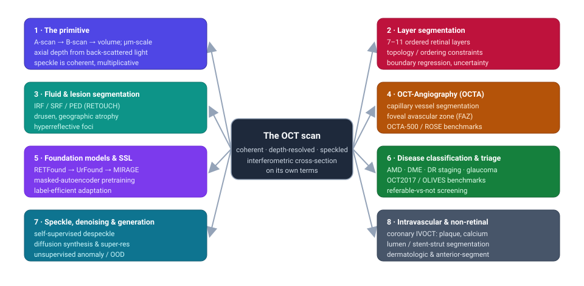

# Dense Object Detection & Classification — Recent Advances

*Compiled 2026-Jul-23 (America/Los_Angeles).*

Next installment in the running CV-updates log. Earlier entries on
`main`:
[Apr-30](../2026-Apr-30/2026-Apr-30_CV_updates.md),
[May-01](../2026-May-01/2026-May-01_CV_updates.md),
[May-02](../2026-May-02/2026-May-02_CV_updates.md),
[May-04](../2026-May-04/2026-May-04_CV_updates.md),
[May-05](../2026-May-05/2026-May-05_CV_updates.md),
[May-07](../2026-May-07/2026-May-07_CV_updates.md),
[May-08](../2026-May-08/2026-May-08_CV_updates.md),
[May-15](../2026-May-15/2026-May-15_CV_updates.md),
[May-16](../2026-May-16/2026-May-16_CV_updates.md),
[May-17](../2026-May-17/2026-May-17_CV_updates.md),
[Jun-09](../2026-Jun-09/2026-Jun-09_CV_updates.md),
[Jun-10](../2026-Jun-10/2026-Jun-10_CV_updates.md),
[Jun-12](../2026-Jun-12/2026-Jun-12_CV_updates.md),
[Jun-15](../2026-Jun-15/2026-Jun-15_CV_updates.md),
[Jun-16](../2026-Jun-16/2026-Jun-16_CV_updates.md),
[Jun-17](../2026-Jun-17/2026-Jun-17_CV_updates.md),
[Jun-19](../2026-Jun-19/2026-Jun-19_CV_updates.md),
[Jun-21](../2026-Jun-21/2026-Jun-21_CV_updates.md),
[Jun-22](../2026-Jun-22/2026-Jun-22_CV_updates.md),
[Jun-23](../2026-Jun-23/2026-Jun-23_CV_updates.md),
[Jun-24](../2026-Jun-24/2026-Jun-24_CV_updates.md),
[Jun-25](../2026-Jun-25/2026-Jun-25_CV_updates.md),
[Jun-27](../2026-Jun-27/2026-Jun-27_CV_updates.md),
[Jun-29](../2026-Jun-29/2026-Jun-29_CV_updates.md),
[Jun-30](../2026-Jun-30/2026-Jun-30_CV_updates.md),
[Jul-04](../2026-Jul-04/2026-Jul-04_CV_updates.md),
[Jul-07](../2026-Jul-07/2026-Jul-07_CV_updates.md),
[Jul-08](../2026-Jul-08/2026-Jul-08_CV_updates.md),
[Jul-10](../2026-Jul-10/2026-Jul-10_CV_updates.md),
[Jul-15](../2026-Jul-15/2026-Jul-15_CV_updates.md),
[Jul-17](../2026-Jul-17/2026-Jul-17_CV_updates.md),
[Jul-18](../2026-Jul-18/2026-Jul-18_CV_updates.md),
[Jul-21](../2026-Jul-21/2026-Jul-21_CV_updates.md),
[Jul-22](../2026-Jul-22/2026-Jul-22_CV_updates.md).

## Table of contents

1. [Why this pass: OCT as its own primitive](#why)
2. [Topic map](#map)
3. [Retinal layer segmentation — the ordered-boundary problem](#layers)
4. [Fluid & lesion segmentation — RETOUCH and beyond](#fluid)
5. [OCT-Angiography — vessels, FAZ and the plexus stack](#octa)
6. [Foundation models & self-supervised pretraining](#foundation)
7. [Disease classification & triage](#classification)
8. [Speckle, denoising, generation & anomaly detection](#speckle)
9. [Intravascular & non-retinal OCT](#ivoct)
10. [Through-line & open problems](#throughline)
11. [Sources](#sources)

---

## 1. Why this pass: OCT as its own primitive

The recent run of passes has worked **sensor / imaging primitives on their own
terms** — LiDAR ([Jun-27](../2026-Jun-27/2026-Jun-27_CV_updates.md)), the event
camera ([Jun-29](../2026-Jun-29/2026-Jun-29_CV_updates.md)), thermal infrared
([Jun-30](../2026-Jun-30/2026-Jun-30_CV_updates.md)), imaging radar
([Jul-04](../2026-Jul-04/2026-Jul-04_CV_updates.md)), medical CT/MRI + pathology
([Jul-07](../2026-Jul-07/2026-Jul-07_CV_updates.md)), subsea sonar
([Jul-08](../2026-Jul-08/2026-Jul-08_CV_updates.md)), astronomical surveys
([Jul-10](../2026-Jul-10/2026-Jul-10_CV_updates.md)), X-ray transmission
([Jul-15](../2026-Jul-15/2026-Jul-15_CV_updates.md)), the optical/electron
microscope ([Jul-17](../2026-Jul-17/2026-Jul-17_CV_updates.md)), the ultrasound
image ([Jul-18](../2026-Jul-18/2026-Jul-18_CV_updates.md)), the hyperspectral
cube ([Jul-21](../2026-Jul-21/2026-Jul-21_CV_updates.md)) and synthetic aperture
radar ([Jul-22](../2026-Jul-22/2026-Jul-22_CV_updates.md)).

The [medical pass](../2026-Jul-07/2026-Jul-07_CV_updates.md) treated *radiology*
(CT/MRI) and *pathology* (whole-slide) as the volumetric/gigapixel primitives.
It said almost nothing about the single most-acquired cross-sectional scan in
all of medicine: the **retinal OCT B-scan**. Optical coherence tomography is not
"a small MRI" — it is a **coherent, interferometric depth sounder built out of
light**, and its detection-and-classification problem is unlike CT, ultrasound
or the microscope. This pass takes **OCT as its own primitive**.

OCT is a *different* detection-and-classification problem from every sensor
covered so far, in seven concrete ways:

1. **Depth comes from interferometry, not time-of-flight or absorption.** OCT
   measures the *echo delay* of near-infrared light by interfering back-scattered
   sample light with a reference beam. Ultrasound uses the same pulse-echo idea
   with sound, but OCT's micron-scale axial resolution comes from optical
   *coherence gating* over a broadband source, not from a clock. The native
   measurement is an **A-scan** (a 1-D reflectivity-vs-depth profile); a lateral
   sweep of A-scans is a **B-scan** (the familiar cross-section); a raster of
   B-scans is a **volume (C-scan)**. Models must respect this A→B→volume anisotropy.
2. **Resolution is anisotropic and axial resolution is decoupled from lateral.**
   Axial resolution (~2–7 μm) is set by the light source's bandwidth; lateral
   resolution (~15–20 μm) by the beam optics. A pixel is *not* square in physical
   units, and a convolution that assumes isotropy quietly mismodels the tissue.
3. **Speckle is coherent and multiplicative — as in SAR and ultrasound, not
   like CT noise.** Because OCT is coherent, sub-resolution scatterers interfere
   to produce a grainy multiplicative texture that both *carries* tissue
   information and *obscures* thin layer boundaries. Gaussian-noise denoisers are
   the wrong prior; §8 is largely about this.
4. **The classes are laminar, ordered and thin.** The retina is a stack of
   **7–11 near-parallel layers** a few pixels thick, whose *vertical order never
   changes* in healthy tissue. The dominant dense task is not "find an object" but
   "trace a set of ordered 1-D boundaries across the B-scan" — a segmentation
   problem with a hard **topological constraint** that generic U-Nets violate
   (§3).
5. **Pathology is defined by where fluid/deposits sit *relative to* those
   layers.** Intraretinal fluid (IRF), subretinal fluid (SRF) and pigment-epithelial
   detachment (PED) are the *same* dark blobs to an appearance model; what
   distinguishes them is **which layer compartment** they occupy. Detection here is
   inseparable from layer context (§4).
6. **A whole clinical subfield is a derived contrast: OCT-Angiography.** Repeated
   B-scans at one location, decorrelated over time, expose flowing blood without
   dye — turning the same hardware into a **capillary angiogram**. Its targets
   (micron-wide vessels, the foveal avascular zone) are thin, tortuous and
   crossing multiple plexus depths (§5).
7. **It is the highest-throughput imaging in ophthalmology, and it is not only
   the eye.** Tens of millions of retinal OCTs are acquired yearly; the same
   physics runs a catheter for **intravascular coronary OCT** (plaque, calcium,
   stent struts) and a probe for **dermatologic / anterior-segment** imaging.
   Scale makes self-supervision and foundation models the mainline (§6), and the
   catheter makes it a rare medical detector that runs *live during an
   intervention* (§9).

The rest of this pass follows the eight clusters in the map: layer segmentation
(§3), fluid/lesion segmentation (§4), OCTA (§5), foundation models (§6),
classification/triage (§7), the speckle/denoising/generation stack (§8), and
intravascular/non-retinal OCT (§9).

---

## 3. Retinal layer segmentation — the ordered-boundary problem

The signature OCT dense task is tracing the retinal layers. It looks like
semantic segmentation but is really **simultaneous regression of a stack of
ordered surfaces**: in a healthy B-scan the boundaries (ILM, RNFL, GCL, IPL,
INL, OPL, ONL, ELM, IS/OS, RPE, Bruch's membrane) appear top-to-bottom in a
*fixed order that a correct output must never violate*. Free-form per-pixel
classifiers happily produce label maps where a "deeper" layer floats above a
"shallower" one — anatomically impossible and clinically useless.

**Enforcing topology / ordering.** The 2024–2026 literature is largely about
building the ordering constraint *into* the model rather than post-hoc cleanup.
The recurring devices are: (i) **explicit topology losses** — **SD-RetinaNet**
(2025) does semi-supervised *joint lesion + layer* segmentation with a
**"topology guarantee loss"** that forbids order violations and holds up under
pathology; (ii) **signed distance functions** — an *uncertainty-aware* approach
regresses **probabilistic signed distance functions (PSDF)** so the boundary and
its confidence come out together (arXiv 2412.04935); (iii) **boundary/height
regression** — predict each surface's height per A-column and enforce monotonic
ordering rather than labelling pixels (order-constrained height regression is
what makes **drusen** segmentation well-posed); and (iv) **reinforcement /
constraint search** — *general retinal layer segmentation via reinforcement
constraint* (Comp. Med. Imaging & Graphics 2024) treats boundary placement as a
constrained decision process.

**Transformer and query-based heads.** *Query-driven retinal layer
segmentation* (Diagnostics 2025) encodes each layer as a **learnable query** and
uses cross-attention against a transformer-encoded B-scan, so the head reasons
about layers as entities rather than pixels. **LightReSeg** ("lightweight
retinal layer segmentation with global reasoning", 2024) chases the same
global-context win at a fraction of the compute — ~3.3M parameters against
TransUNet's ~106M — for on-device use.

**Robustness to pathology and device.** The hard cases are exactly where
ordering breaks down in reality — severe edema, atrophy, drusen that deform
Bruch's membrane. *Weakly-supervised* layer segmentation with an **uncertainty
prototype + boundary regression** (Medical Image Analysis 2025) targets AMD
scans with sparse labels, and — importantly — **foundation-model backbones now
generalise layer segmentation across OCT devices** (Spectralis, Cirrus,
Topcon), a longstanding failure mode where a model trained on one vendor's
speckle statistics collapsed on another's (MICCAI-2025 work; see §6). Joint
annotation resources such as **AROI** (layer *and* fluid labels on nAMD scans)
are what make this joint geometry+pathology training practical.

---

## 4. Fluid & lesion segmentation — RETOUCH and beyond

If layer tracing is the "geometry" task, fluid/lesion segmentation is the
"pathology" task, and it is the one that drives treatment (anti-VEGF injections
are titrated on fluid). The reference benchmark is still **RETOUCH** (the
MICCAI-2017 Retinal OCT Fluid challenge), which labels three fluid types —
**intraretinal fluid (IRF)**, **subretinal fluid (SRF)** and **pigment-epithelial
detachment (PED)** — across Spectralis, Cirrus and Topcon volumes. The enduring
difficulty is that the three look alike as blobs; telling them apart *requires
the layer context from §3*.

**Recent architectures.** A **multiscale attention U-Net** (residual + inception
blocks with an autoencoder-based attention path) reports RETOUCH F1 ≈ 0.82 / 0.93
/ 0.94 for IRF / SRF / PED and generalises to the OPTIMA and Duke sets;
**FAM-U-Net** (feature-attention-module U-Net) is a robust multi-class SD-OCT
fluid baseline. A 2025 line brings **vision transformers** to the task: a
**SegFormer** pretrained on large corpora and fine-tuned on RETOUCH segments
subretinal fluid in rhegmatogenous retinal detachment; **MMIS-Net** (2025)
couples fluid segmentation with detection; and a 2025 benchmark pits **diffusion
segmentation models against CNN/transformer SOTA** on OCT fluid specifically. The
clinical-translation papers (e.g. fluid quantification in the faricimab
**TRUCKEE** study, uveitic macular edema) matter because they report **agreement
with human graders and longitudinal reproducibility**, not just Dice — the metric
that actually gates deployment.

**Drusen, geographic atrophy, hyperreflective foci.** Beyond fluid, the
biomarker frontier is: **drusen** (RPE/Bruch's deposits — often posed as the
order-constrained height-regression problem above); **geographic atrophy** (GA —
en-face RPE-loss territories, now segmented in 3-D and, notably, *predicted
forward*: 2024–2025 work forecasts patient-specific GA growth-rate from a
**single baseline OCT volume**, tied to the new complement-inhibitor trials); and
**hyperreflective foci** (tiny bright dots that are candidate
inflammatory/prognostic markers and a genuine *small-object detection* problem
inside a speckled B-scan — e.g. **Foci-Net**). A 2025 study quantifies layers,
fluid *and* HRF jointly and measures the effect on **diabetic-retinopathy
grading**, underscoring the through-line: OCT "objects" are defined **relative to
the layer scaffold**, so strong systems solve layers and lesions jointly rather
than in sequence.

**Longitudinal change as a task.** The **MARIO Challenge** (MICCAI 2024) reframed
the problem as *monitoring*: Task 1 classifies the change between two consecutive
B-scans (where AI matched physicians) and Task 2 predicts 3-month evolution under
anti-VEGF (which remained unsolved) — a clean statement of where OCT dense vision
is and isn't mature.

---

## 5. OCT-Angiography — vessels, FAZ and the plexus stack

**OCT-Angiography (OCTA)** is a derived contrast: acquire repeated B-scans at
each position, and the *temporal decorrelation* between them marks flowing blood,
yielding a dye-free capillary angiogram from the same instrument. It turns OCT
into a **fine-vessel and perfusion** problem, with two headline dense tasks:
**vessel/capillary segmentation** and **foveal avascular zone (FAZ)
segmentation**, plus derived biomarkers (vessel density, fractal dimension, FAZ
area/perimeter) that track diabetic retinopathy and glaucoma.

**Datasets.** **OCTA-500** (Medical Image Analysis 2024) is the anchor —
500 eyes with large-vessel, artery/vein, 2-D and 3-D FAZ and layer labels across
two fields of view — alongside the **ROSE** vessel set. These made OCTA a
benchmarkable dense task rather than a per-lab pipeline.

**Methods.** The vessels are thin, tubular and tortuous, so the strong models
bake in that geometry. **SSW-OCTA** ("Snake with Shifted Window", 2024) combines
**deformable/snake convolutions** for tubular structures with a Swin-transformer
global path; **RS_Unet3+** (2025) does full-scale skip aggregation for vessel +
FAZ quantification; **D²Net** (2025), a dual-stream disentangled model, targets
**cross-instrument generalisation**, validating on OCTA-500 and three ROSE
variants at once. Two data-efficiency tracks stand out: **SAM-OCTA** (2025)
*prompts* Segment-Anything for vessel/FAZ masks, and an **OCTA-autosegmentation**
pipeline (2024) trains vessel segmenters on **synthetic angiographs with no human
annotations**. **VAMAE** ("Vessel-Aware Masked Autoencoders", 2026) brings
**self-supervised MAE pretraining** to OCTA, reporting ~82% Dice for large-vessel
segmentation while cutting annotation by half — the same label-efficiency
argument as the retinal foundation models, specialised to vasculature. Auxiliary
supervision (predicting the FAZ boundary and a vessel mask as side tasks) is a
recurring trick to sharpen FAZ estimates in diabetic eyes. There is, notably,
**no widely-adopted OCTA-only foundation model yet** — OCTA is currently covered
under the general retinal foundation models of §6.

---

## 6. Foundation models & self-supervised pretraining

OCT's defining advantage for representation learning is **volume**: tens of
millions of unlabelled scans exist, so masked-autoencoder-style self-supervision
has a natural home here, and 2024–2026 is dominated by the **retinal foundation
model** story.

- **RETFound** (Nature 2023) is the reference point: a **masked-autoencoder
  ViT-Large** pretrained on **~1.6M** retinal images (~904K color fundus + ~736K
  OCT B-scans, as two modality-specific weights), transferring to DR/AMD/glaucoma
  detection, prognosis and even systemic-disease prediction with far fewer labels
  than ImageNet initialisation. Its public release (repo now adding DINOv2/DINOv3
  backbones) made it the default baseline the field measures against.
- **Efficiency rebuilds.** Two 2024–2025 lines attack RETFound's data/compute
  cost. **RETFound-Green** (Nature Communications 2025) retrains on only ~75K
  public images with a **token-reconstruction** objective at ~400× less compute
  (sub-$100 training) yet matches or beats the original on many tasks;
  **DERETFound** (Nature Biomedical Engineering 2025) instead trains a
  **diffusion model to synthesise ~1M fundus images** and pretrains on synthetic +
  real, reaching comparable performance with far less *real* data.
- **3-D and multimodal.** Most "OCT foundation models" are actually per-B-scan
  2-D; **OCTCube / OCTCube-M** (2024) is a genuine **3-D MAE** pretrained on
  26,685 OCT volumes (~1.62M B-scans), beating 2-D models on 27/29 tasks and
  spawning **OCTCube-EF** for GA prognosis. **MIRAGE** (npj Digital Medicine 2025)
  trains a **paired multimodal MAE on OCT + SLO** and ships a 19-task segmentation
  *and* classification benchmark — reporting lesion-segmentation Dice ≈ 69.7 /
  52.2 / 79.6 on Duke-DME / AROI / RETOUCH and beating DINOv2, RETFound and
  MedSAM. General-ophthalmology generalists extend the idea across modalities:
  **VisionFM** (NEJM AI 2024; iBOT SSL, ~3.4M images, 8 modalities), **EyeFound**
  (~2.78M images, 11 modalities).
- **Vision–language.** The text-grounded frontier: **EyeCLIP** (npj Digital
  Medicine 2025) aligns ~77M multimodal images with ~11K clinical reports for
  zero-shot and VQA; **RetiZero** (Nature Communications 2025) is a
  knowledge-enriched VLM covering 400+ fundus diseases; **FLAIR** encodes expert
  knowledge as text; and **RetFiner** (MICCAI 2025) is a vision-language *refinement*
  scheme that post-hoc sharpens existing OCT foundation features. Report
  generation is emerging too — fine-tuned **Llama-3.2-Vision** drafting glaucoma
  reports with sector-wise RNFL thinning from ONH circle scans (2025).
- **OCT-specific SSL.** Beyond the big FMs, task-focused self-supervision is
  active: **OCT-SelfNet** (2024) and **ViT-2SPN** (2025, dual-stream) for
  classification, **metadata-enhanced contrastive learning** (MedIA 2024), and
  **longitudinal MAE (L-MAE)** for DR progression.
- **The label-efficiency reckoning.** A useful 2025 counter-current asks *how
  foundational* these models really are: independent evaluations (optic-nerve
  analysis; a normal-vs-abnormal OCT **label-efficiency** study in *Ophthalmology
  Science*) find the advantage over well-tuned supervised baselines is **real but
  narrows as labels grow** — the honest framing is "few-shot head-start", not
  "free accuracy". Foundation backbones do, however, deliver the cross-device
  **layer segmentation** generalisation (§3) that supervised nets historically
  failed.

The net: OCT is one of the clearest cases where **self-supervised pretraining
pays**, precisely because the unlabelled-scan supply dwarfs the annotation
budget — but the 2025 evaluations are a healthy reminder to benchmark the
head-start against a *strong* supervised control.

---

## 7. Disease classification & triage

The classic OCT ML task — before dense segmentation and foundation models — is
**B-scan-level disease classification**, and it remains the workhorse for
screening/triage.

- **Benchmarks.** The **Kermany / OCT2017** set (Cell 2018; ~207K B-scans over
  CNV, DME, drusen, normal) is still the most-used four-class benchmark and the
  reason so many "99% accuracy" OCT-classifier papers exist — its saturation is
  exactly why the field moved to harder, longitudinal and biomarker-rich sets.
  **OLIVES** (NeurIPS 2022) pairs ~78K OCT images with **clinical labels and 16
  biomarkers** across visits; **OCTDL** (2024) is a newer labelled set; and for
  **glaucoma** specifically, **Harvard-GDP** (ICCV 2023) is the largest public
  **3-D-OCT** detection+progression set (with a fairness focus) and **GAMMA**
  (MICCAI 2022) pairs fundus + 3-D OCT for grading. Disease-progression and
  treatment-response framing is now more interesting than static 4-way accuracy.
- **Targets.** The clinically load-bearing classifications are **AMD** (normal /
  dry / wet, and drusen burden), **diabetic macular edema (DME)**, **diabetic
  retinopathy** staging (increasingly from OCTA perfusion features, §5),
  **glaucoma** (from peripapillary RNFL / GCL thinning), and **referable-vs-not**
  triage for community screening — where RETFound-style models showed sizable
  sensitivity/specificity gains over commercial tools in real deployments.
- **Where the interest is.** Static single-B-scan accuracy is largely solved on
  clean data; the open problems are **out-of-distribution robustness** (new
  device, new population — see §3's cross-vendor issue and §8's anomaly work),
  **calibration/uncertainty** for safe triage, and **explanations tied to
  anatomy** rather than saliency blobs (e.g. structure-aware post-hoc
  explanations aligned to retinal layers).

---

## 8. Speckle, denoising, generation & anomaly detection

Because OCT is coherent, **speckle** is the defining low-level problem — the
same multiplicative-noise story as SAR ([Jul-22](../2026-Jul-22/2026-Jul-22_CV_updates.md))
and ultrasound ([Jul-18](../2026-Jul-18/2026-Jul-18_CV_updates.md)), but in an
optical modality where thin layer boundaries live at the speckle scale.

**Self-supervised despeckling.** Clean reference images essentially do not exist
(you cannot photograph a retina without speckle), so the field is firmly in
**reference-free** territory: **Self2Self**-style single-image denoising for OCT
(PMC 2024) needs only one noisy B-scan; a 2025 **frame-interpolation** framework
(*Advanced Intelligent Systems*) exploits the strong correlation between adjacent
A-scans/B-scans to synthesise a pseudo-clean target; and **volumetric**
self-supervised restoration with a **Flip-Flop Swin transformer** (BanglaOCT2025)
denoises across the C-scan. The shared principle — learn the noise's statistics
from redundancy in the data itself — is exactly the SAR despeckling playbook,
re-derived for micron-scale optics.

**Generation & super-resolution.** Diffusion models now **synthesise** OCT: a
**layer-sketch-conditioned DDPM** generates circumpapillary B-scans *with*
segmentation labels (arXiv 2311.05479) — a segmenter trained on synthetic-only
matches real-data training — turning generation into a data engine for the
label-scarce dense tasks of §3–§4. **En-face-informed super-resolution** (2024)
uses a **3-D DDPM conditioned on the 2-D en-face** view to standardise volume
resolution; unsupervised **DDPM denoising** (arXiv 2201.11760) frames speckle
reduction as reverse diffusion. The scale of interest is real: the **APTOS-2024
Challenge** (342 teams) asked entrants to generate **synthetic 3-D OCT from a
fundus photo**, a genuine cross-modal generative benchmark.

**Anomaly detection / OOD.** Because normal retina vastly outnumbers any single
rare pathology, **unsupervised anomaly detection** — model the normal manifold,
flag deviations — is attractive for catch-all screening. **Knowledge-distillation**
student–teacher scoring on retinal OCT (TVST 2025) and **VQ-VAE + autoregressive**
density modelling on OCTA (2024) localise disease as a deviation from learned
normality, while diffusion "reconstruct-the-healthy-scan" approaches (Synomaly-style
multi-stage diffusion, 2024–2025) localise it as the reconstruction residual —
all sidestepping exhaustive lesion labels and connecting directly to the
OOD-robustness gap flagged in §7.

---

## 9. Intravascular & non-retinal OCT

OCT is not only the eye. The same coherence-gated physics, delivered through a
**rotating fibre-optic catheter**, images the coronary artery wall from the
inside — **intravascular OCT (IVOCT)** — and this is a rare medical detector that
must run *during* a percutaneous intervention.

- **Plaque characterisation.** The clinical questions are tissue-typing (fibrous
  / lipid / calcified plaque) and thin-cap fibroatheroma risk. A 2025 narrative
  review situates the ML landscape across **OCT, IVUS and CCTA**; **EDA-UNet**
  (iScience, Mar 2025) is a dedicated semantic-segmentation model for plaque-tissue
  characterisation and quantification, trained multi-centre with independent
  external validation.
- **Calcium.** Calcified lesions change how a stent is deployed, so calcium
  detection is high-value: a well-cited **two-step** approach first detects major
  calcifications with a **3-D CNN** over the pullback, then segments them with a
  **SegNet + Tversky-loss** head, reporting high sensitivity/specificity.
- **Full-vessel & volumetric quantification.** A 2025 study performs
  **comprehensive full-vessel segmentation and volumetric plaque quantification**
  over the entire pullback — moving from single-frame masks to **per-vessel,
  per-pullback** quantities that map onto clinical decisions. Lumen and
  **stent-strut** segmentation (including malapposition/coverage) round out the
  IVOCT dense-task set. Unlike retina, IVOCT is **not challenge-driven** — there
  is no active RETOUCH-equivalent — so results are harder to compare across
  groups.
- **Beyond cardiology.** Dermatologic OCT (skin-cancer margin assessment) and
  **anterior-segment** OCT (cornea, angle) reuse the same segmentation/classification
  machinery on non-laminar tissue, and are the smaller but growing tail of the
  modality.

---

## 10. Through-line & open problems

Pulling the eight threads together, OCT's dense-vision problem has a distinct
shape:

- **Everything is defined relative to an ordered layer scaffold.** Layers,
  fluid, drusen, atrophy and foci are all *positional* relative to the retinal
  lamination — which is why the strongest systems solve geometry (layers) and
  pathology (lesions) **jointly**, and why hard topological/ordering constraints,
  not bigger backbones, are the recurring architectural idea (§3–§4).
- **Coherent speckle is the shared low-level enemy — and it links OCT to SAR and
  ultrasound.** Reference-free, redundancy-exploiting self-supervised despeckling
  is the mainline exactly as in radar; the difference is that OCT's targets sit
  *at* the speckle scale (§8).
- **Scale makes self-supervision the default, but "foundational" deserves
  scrutiny.** The unlabelled-scan supply is enormous, so MAE-style pretraining
  and multimodal (OCT+CFP+SLO+text) foundation models are the frontier — while
  the 2025 label-efficiency evaluations rightly insist on strong supervised
  controls (§6).

**Open problems.** (1) **Cross-device / cross-population generalisation** —
different vendors' speckle statistics and scan protocols still break models;
foundation backbones help but don't close it. (2) **3-D done properly** — most
"OCT" models are per-B-scan 2-D; true volumetric (and 4-D longitudinal) modelling
of GA growth or fluid dynamics is under-served. (3) **Calibrated,
anatomy-grounded uncertainty** for safe triage, versus today's saliency blobs.
(4) **Live IVOCT** — real-time, on-catheter inference during intervention is a
latency-and-robustness regime the retinal literature rarely confronts. (5) **The
benchmark ceiling** — OCT2017 is saturated; longitudinal, biomarker-rich and
treatment-response benchmarks (OLIVES-style) are where meaningful progress now
shows up.

---

## 11. Sources

*Grouped by section. Links are to arXiv abstracts, DOIs, journal pages or
official dataset/repo pages where available. Treat quantitative figures as
author-reported; this is a literature-scan compiled automatically, not a
systematic review.*

**Foundation models & self-supervised pretraining (§6)**
- RETFound — a foundation model for generalizable disease detection from retinal images (Nature 2023): https://www.nature.com/articles/s41586-023-06555-x · repo (now incl. DINOv2/DINOv3): https://github.com/rmaphoh/RETFound · development & use (IOVS/ARVO): https://iovs.arvojournals.org/article.aspx?articleid=2797771
- RETFound-Green — efficient retinal FM via token reconstruction (arXiv 2405.00117; Nature Communications 2025): https://arxiv.org/abs/2405.00117 · https://www.nature.com/articles/s41467-025-62123-z
- DERETFound — data-efficient retinal FM via diffusion-synthesised pretraining (Nature Biomedical Engineering 2025): https://www.nature.com/articles/s41551-025-01365-0
- OCTCube / OCTCube-M — 3-D OCT foundation model (arXiv 2408.11227): https://arxiv.org/abs/2408.11227
- MIRAGE — multimodal (OCT+SLO) MAE FM + segmentation benchmark (arXiv 2506.08900; npj Digital Medicine 2025): https://arxiv.org/abs/2506.08900 · https://www.nature.com/articles/s41746-025-01852-3
- VisionFM — multimodal ophthalmic generalist (arXiv 2310.04992; NEJM AI 2024): https://arxiv.org/abs/2310.04992 · https://ai.nejm.org/doi/full/10.1056/AIoa2300221 · code: https://github.com/ABILab-CUHK/VisionFM
- EyeFound — generative multimodal ophthalmic FM (arXiv 2405.11338): https://arxiv.org/abs/2405.11338
- EyeCLIP — visual-language ophthalmic FM (npj Digital Medicine 2025): https://www.nature.com/articles/s41746-025-01772-2
- RetiZero — knowledge-enriched retinal VLM, 400+ diseases (Nature Communications 2025): https://www.nature.com/articles/s41467-025-60577-9 · code: https://github.com/LooKing9218/RetiZero
- FLAIR — foundation language-image model of the retina (arXiv 2308.07898): https://arxiv.org/abs/2308.07898
- RetFiner — vision-language refinement of retinal FMs (MICCAI 2025): https://link.springer.com/chapter/10.1007/978-3-032-04971-1_51
- OCT structured report generation with Llama-3.2-Vision (arXiv 2510.02403): https://arxiv.org/abs/2510.02403
- OCT-SelfNet — SSL for robust retinal disease detection (arXiv 2401.12344): https://arxiv.org/abs/2401.12344 · ViT-2SPN — dual-stream SSL pretraining (arXiv 2501.17260): https://arxiv.org/abs/2501.17260 · metadata-enhanced contrastive SSL (Medical Image Analysis 2024): https://www.sciencedirect.com/science/article/pii/S1361841524002214
- RETFound label-efficiency on OCT (Ophthalmology Science 2025): https://www.ophthalmologyscience.org/article/S2666-9145(25)00005-3/fulltext · https://pubmed.ncbi.nlm.nih.gov/40161460/ · independent RETFound optic-nerve evaluation (2025): https://www.sciencedirect.com/science/article/pii/S2666914525000181

**Retinal layer segmentation (§3)**
- SD-RetinaNet — topology-constrained semi-supervised joint layer + lesion segmentation (arXiv 2509.20864): https://arxiv.org/abs/2509.20864
- Uncertainty-aware layer segmentation via probabilistic signed distance functions (arXiv 2412.04935): https://arxiv.org/abs/2412.04935
- General retinal layer segmentation via reinforcement constraint (Comp. Med. Imaging & Graphics 2024): https://www.sciencedirect.com/science/article/abs/pii/S0895611124001575
- Query-driven retinal layer segmentation with cross-attentive feature learning (Diagnostics 2025): https://doi.org/10.3390/diagnostics16111697
- LightReSeg — lightweight retinal layer segmentation with global reasoning (arXiv 2404.16346; PMC11759324): https://arxiv.org/abs/2404.16346 · https://pmc.ncbi.nlm.nih.gov/articles/PMC11759324/
- Weakly-supervised layer segmentation with uncertainty prototype + boundary regression, AMD (Medical Image Analysis 2025): https://www.sciencedirect.com/science/article/abs/pii/S1361841525001197
- Foundation Models Permit Retinal Layer Segmentation Across OCT Devices (MICCAI 2025): https://link.springer.com/chapter/10.1007/978-3-031-85181-0_14
- AROI — annotated retinal OCT images, joint layer + fluid labels (Automatika 2021): https://www.tandfonline.com/doi/full/10.1080/00051144.2021.1973298

**Fluid & lesion segmentation (§4)**
- RETOUCH — retinal OCT fluid challenge overview / advanced architectures survey (Sensors 2022): https://doi.org/10.3390/s22083055
- Multiscale attention U-Net for retinal/subretinal fluid (PMC 2024): https://pmc.ncbi.nlm.nih.gov/articles/PMC11504175/ · FAM-U-Net multi-class SD-OCT fluid (Biomed. Signal Process. Control 2023/24): https://www.sciencedirect.com/science/article/abs/pii/S174680942300914X
- SegFormer ViT for subretinal-fluid segmentation with cross-validation (Ophthalmology Science 2025): https://www.ophthalmologyscience.org/article/S2666-9145(25)00150-2/fulltext
- MMIS-Net — retinal fluid segmentation + detection (arXiv 2508.13936): https://arxiv.org/abs/2508.13936 · diffusion-vs-SOTA OCT fluid benchmark (PMC 2025): https://pmc.ncbi.nlm.nih.gov/articles/PMC12571292/
- Foci-Net — hyperreflective-foci segmentation in AMD OCT (PMC 2025/26): https://pmc.ncbi.nlm.nih.gov/articles/PMC13020070/ · joint layer/fluid/HRF quantification for DR grading (arXiv 2503.01248): https://arxiv.org/abs/2503.01248
- Individual GA progression from a single baseline OCT (Ophthalmology Science 2024): https://www.ophthalmologyscience.org/article/S2666-9145(24)00002-2/fulltext · GA progression from 3-D OCT (TVST 2025): https://tvst.arvojournals.org/article.aspx?articleid=2802560
- MARIO Challenge — AMD-progression monitoring on OCT (MICCAI 2024; overview arXiv 2506.02976): https://arxiv.org/abs/2506.02976 · https://youvenz.github.io/MARIO_challenge.github.io/
- Retinal fluid quantification in the faricimab TRUCKEE study (PMC 2025): https://www.ncbi.nlm.nih.gov/pmc/articles/PMC11978878/ · uveitic macular edema fluid analysis (2026): https://www.sciencedirect.com/science/article/pii/S266691452600179X · human-AI OCT quantification systematic review (PMC 2025): https://www.ncbi.nlm.nih.gov/pmc/articles/PMC12744513/

**OCT-Angiography (§5)**
- OCTA-500 — a retinal OCTA dataset (Medical Image Analysis 2024): https://www.sciencedirect.com/science/article/abs/pii/S1361841524000173
- SSW-OCTA — Snake with Shifted Window (arXiv 2404.18096): https://arxiv.org/abs/2404.18096
- D²Net — dual-stream disentangled microvascular extraction, cross-instrument (PMC 2025): https://pmc.ncbi.nlm.nih.gov/articles/PMC11813864/
- SAM-OCTA — prompting Segment-Anything for OCTA (Biomed. Signal Process. Control 2025): https://www.sciencedirect.com/science/article/abs/pii/S1746809425002095
- OCTA-autosegmentation — synthetic angiographs, annotation-free vessel segmentation (2024): https://github.com/aiforvision/OCTA-autosegmentation
- VAMAE — vessel-aware masked autoencoders for OCTA (arXiv 2604.06583): https://arxiv.org/abs/2604.06583
- RS_Unet3+ — OCTA microstructure segmentation & quantification (ScienceDirect 2025): https://www.sciencedirect.com/science/article/pii/S2667102625000981
- FAZ segmentation in OCTA of nonproliferative diabetic retinopathy (IOVS/ARVO): https://iovs.arvojournals.org/article.aspx?articleid=2790847

**Disease classification & triage (§7)**
- Kermany / OCT2017 — labeled OCT dataset (Cell 2018 / Mendeley Data): https://data.mendeley.com/datasets/rscbjbr9sj/3
- OLIVES — OCT + clinical labels & biomarkers (NeurIPS 2022 D&B): https://arxiv.org/abs/2209.11195 · OCTDL — labeled OCT dataset (arXiv 2312.08255): https://arxiv.org/abs/2312.08255
- Harvard-GDP — 3-D-OCT glaucoma detection + progression, fairness (ICCV 2023): https://github.com/Harvard-Ophthalmology-AI-Lab/Harvard-GDP · GAMMA — fundus + 3-D OCT glaucoma grading (arXiv 2202.06511): https://arxiv.org/abs/2202.06511
- Equity-enhanced OCT glaucoma-progression via knowledge distillation (npj Digital Medicine 2025): https://www.nature.com/articles/s41746-025-01884-9

**Speckle, denoising, generation & anomaly (§8)**
- Self-supervised Self2Self despeckle for OCT, single noisy image (PMC 2024): https://pmc.ncbi.nlm.nih.gov/articles/PMC10890874/
- Self-supervised speckle reduction via frame interpolation (Advanced Intelligent Systems 2025): https://advanced.onlinelibrary.wiley.com/doi/10.1002/aisy.202500001 · model-informed SSL for low-SNR SS-OCT (Scientific Reports 2025): https://www.nature.com/articles/s41598-025-02375-3
- Unsupervised denoising of retinal OCT with a diffusion probabilistic model (arXiv 2201.11760): https://arxiv.org/abs/2201.11760
- Retinal OCT synthesis with DDPM for layer segmentation (arXiv 2311.05479): https://arxiv.org/abs/2311.05479 · en-face-informed 3-D-diffusion super-resolution (arXiv 2410.09862): https://arxiv.org/abs/2410.09862
- APTOS-2024 Challenge — synthetic 3-D OCT from fundus (arXiv 2506.07542): https://arxiv.org/abs/2506.07542
- Knowledge-distillation anomaly detection in retinal OCT (TVST 2025): https://tvst.arvojournals.org/article.aspx?articleid=2802739 · VQ-VAE + autoregressive anomaly detection in OCTA (Bioengineering 2024): https://www.mdpi.com/2306-5354/11/7/682

**Intravascular & non-retinal OCT (§9)**
- Machine learning for coronary plaque characterization — OCT/IVUS/CCTA review (Diagnostics 2025): https://doi.org/10.3390/diagnostics15141822
- EDA-UNet — coronary plaque-tissue characterization in IVOCT (iScience 2025; PMC11987667): https://www.cell.com/iscience/fulltext/S2589-0042(25)00430-4 · https://pmc.ncbi.nlm.nih.gov/articles/PMC11987667/
- Two-step calcified-plaque segmentation (3-D CNN + SegNet/Tversky) in IVOCT (IEEE TMI / PMC7885992): https://www.ncbi.nlm.nih.gov/pmc/articles/PMC7885992/
- Comprehensive full-vessel segmentation & volumetric plaque quantification for intracoronary OCT (PubMed 2025): https://pubmed.ncbi.nlm.nih.gov/40395415/

---

*Compiled automatically as part of the running CV-updates log. Scope: dense
object detection and classification, this pass viewed through the optical
coherence tomography primitive. Corrections welcome in a follow-up entry.*
