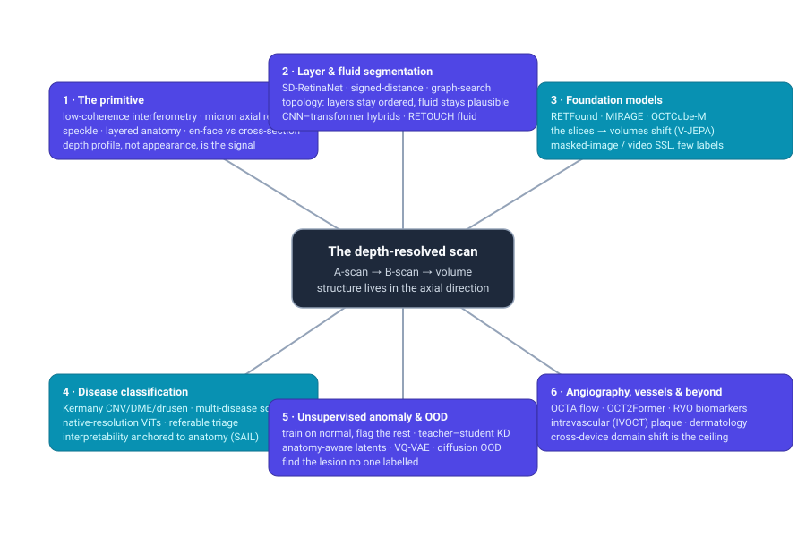
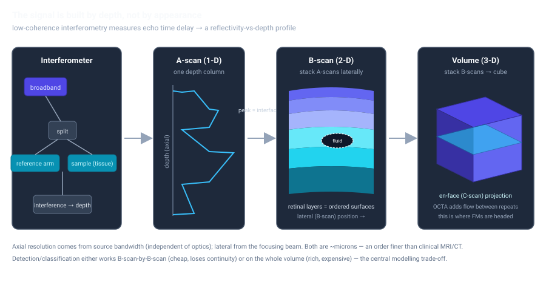

# Dense Object Detection & Classification — Recent Advances

*Compiled 2026-Jul-24 (America/Los_Angeles).*

Next installment in the running CV-updates log. Earlier entries on
`main`:
[Apr-30](../2026-Apr-30/2026-Apr-30_CV_updates.md),
[May-01](../2026-May-01/2026-May-01_CV_updates.md),
[May-02](../2026-May-02/2026-May-02_CV_updates.md),
[May-04](../2026-May-04/2026-May-04_CV_updates.md),
[May-05](../2026-May-05/2026-May-05_CV_updates.md),
[May-07](../2026-May-07/2026-May-07_CV_updates.md),
[May-08](../2026-May-08/2026-May-08_CV_updates.md),
[May-15](../2026-May-15/2026-May-15_CV_updates.md),
[May-16](../2026-May-16/2026-May-16_CV_updates.md),
[May-17](../2026-May-17/2026-May-17_CV_updates.md),
[Jun-09](../2026-Jun-09/2026-Jun-09_CV_updates.md),
[Jun-10](../2026-Jun-10/2026-Jun-10_CV_updates.md),
[Jun-12](../2026-Jun-12/2026-Jun-12_CV_updates.md),
[Jun-15](../2026-Jun-15/2026-Jun-15_CV_updates.md),
[Jun-16](../2026-Jun-16/2026-Jun-16_CV_updates.md),
[Jun-17](../2026-Jun-17/2026-Jun-17_CV_updates.md),
[Jun-19](../2026-Jun-19/2026-Jun-19_CV_updates.md),
[Jun-21](../2026-Jun-21/2026-Jun-21_CV_updates.md),
[Jun-22](../2026-Jun-22/2026-Jun-22_CV_updates.md),
[Jun-23](../2026-Jun-23/2026-Jun-23_CV_updates.md),
[Jun-24](../2026-Jun-24/2026-Jun-24_CV_updates.md),
[Jun-25](../2026-Jun-25/2026-Jun-25_CV_updates.md),
[Jun-27](../2026-Jun-27/2026-Jun-27_CV_updates.md),
[Jun-29](../2026-Jun-29/2026-Jun-29_CV_updates.md),
[Jun-30](../2026-Jun-30/2026-Jun-30_CV_updates.md),
[Jul-04](../2026-Jul-04/2026-Jul-04_CV_updates.md),
[Jul-07](../2026-Jul-07/2026-Jul-07_CV_updates.md),
[Jul-08](../2026-Jul-08/2026-Jul-08_CV_updates.md),
[Jul-10](../2026-Jul-10/2026-Jul-10_CV_updates.md),
[Jul-15](../2026-Jul-15/2026-Jul-15_CV_updates.md),
[Jul-17](../2026-Jul-17/2026-Jul-17_CV_updates.md),
[Jul-18](../2026-Jul-18/2026-Jul-18_CV_updates.md),
[Jul-21](../2026-Jul-21/2026-Jul-21_CV_updates.md),
[Jul-22](../2026-Jul-22/2026-Jul-22_CV_updates.md).

## Table of contents

1. [Why this pass: OCT as its own primitive](#why)
2. [Topic map](#map)
3. [The scan geometry — where the signal lives](#geometry)
4. [Topology-aware layer & fluid segmentation](#segmentation)
5. [Disease detection, classification & screening](#classification)
6. [Foundation models: the slices → volumes shift](#foundation)
7. [Unsupervised anomaly & out-of-distribution detection](#anomaly)
8. [Angiography, vessels & beyond the retina](#beyond)
9. [Through-line & open problems](#throughline)
10. [Sources](#sources)

---

## 1. Why this pass: OCT as its own primitive

The recent run of passes has worked **sensor / imaging primitives on their own
terms** — LiDAR ([Jun-27](../2026-Jun-27/2026-Jun-27_CV_updates.md)), the event
camera ([Jun-29](../2026-Jun-29/2026-Jun-29_CV_updates.md)), thermal infrared
([Jun-30](../2026-Jun-30/2026-Jun-30_CV_updates.md)), automotive radar
([Jul-04](../2026-Jul-04/2026-Jul-04_CV_updates.md)), then a march through the
medical and scientific modalities: radiology/pathology
([Jul-07](../2026-Jul-07/2026-Jul-07_CV_updates.md)), subsea sonar
([Jul-08](../2026-Jul-08/2026-Jul-08_CV_updates.md)), astronomical surveys
([Jul-10](../2026-Jul-10/2026-Jul-10_CV_updates.md)), X-ray transmission
([Jul-15](../2026-Jul-15/2026-Jul-15_CV_updates.md)), microscopy
([Jul-17](../2026-Jul-17/2026-Jul-17_CV_updates.md)), ultrasound
([Jul-18](../2026-Jul-18/2026-Jul-18_CV_updates.md)), hyperspectral
([Jul-21](../2026-Jul-21/2026-Jul-21_CV_updates.md)) and SAR
([Jul-22](../2026-Jul-22/2026-Jul-22_CV_updates.md)).

**Optical coherence tomography (OCT)** is the next primitive, and it is genuinely
different from everything before it. OCT is the *interferometric, depth-resolved,
micron-scale cross-sectional* optical modality. It is often described as "optical
ultrasound," and the analogy is exact in spirit — both build an image from
echoes returning from depth — but the mechanism could not be more different.
Ultrasound ([Jul-18](../2026-Jul-18/2026-Jul-18_CV_updates.md)) times acoustic
echoes; OCT can't time light directly (it's ~10⁶× too fast), so it uses
**low-coherence interferometry**: split broadband light into a reference arm and
a sample arm, and interference only survives where the two path lengths match,
which localizes reflectivity in depth. The consequences that matter for detection
and classification:

- **Structure lives in the axial (depth) direction.** A single measurement is an
  *A-scan* — a 1-D reflectivity-vs-depth profile. Sweep it laterally and you get a
  *B-scan* (the familiar cross-section); stack B-scans and you get a *volume*.
  The class label — a fluid pocket, a disrupted layer, a plaque — is written in
  how reflectivity changes *with depth*, not in appearance the way an RGB detector
  expects. This is closer to hyperspectral's per-pixel-signature framing than to
  natural-image detection.
- **Micron resolution, decoupled axes.** Axial resolution comes from the light
  source's *bandwidth* and is independent of the focusing optics; lateral
  resolution comes from the beam. Both are on the order of microns — an order of
  magnitude finer than clinical CT/MRI — which is why OCT resolves individual
  retinal layers and thin-cap fibroatheroma.
- **Speckle, not Gaussian noise.** Like ultrasound and SAR, OCT is a coherent
  modality, so it carries multiplicative *speckle*. Denoising and
  speckle-robustness recur as themes, exactly as they did in the SAR pass.
- **Strong anatomical priors.** In the dominant application — retinal imaging —
  the tissue is a stack of layers in a *known order*. That ordering is a topology
  constraint you can bake into a segmenter, and much of the recent work does.
- **The volume is under-used.** OCT is natively 3-D, but almost every high-profile
  model — including the foundation models — has operated on single B-scan slices.
  The single most important 2025→2026 shift is the move to model the *whole
  volume*.

OCT is overwhelmingly an ophthalmic tool (it is the most-ordered imaging test in
eye care), so the retina dominates this pass. But the same primitive underpins
**intravascular OCT** (IVOCT) for coronary plaque and **dermatological/endoscopic**
OCT, and those show up in §8 to keep the modality — rather than the organ — as the
subject.

---

## 2. Topic map

The six threads this pass follows, and how they hang off the depth-resolved scan.

---

## 3. The scan geometry — where the signal lives

Before the models, the signal chain, because it dictates every architecture choice
downstream. The interferometer produces an A-scan; lateral scanning produces a
B-scan; volumetric scanning produces a cube; and a temporal repeat at each
position, decorrelated by moving red blood cells, produces the **OCT-angiography
(OCTA)** flow signal. Modern systems are almost all **Fourier-domain** (spectral-
domain, SD-OCT, or swept-source, SS-OCT), which acquire the whole depth profile at
once and are fast enough to capture dense volumes in a clinical instant.

The diagram makes the central modelling trade-off concrete. A detector can work
**B-scan-by-B-scan** — cheap, matches the huge 2-D labelled corpora, but throws
away the fact that adjacent slices are the same eye a few microns apart — or on the
**whole volume** — which respects continuity and is where the pathology actually
lives in 3-D, but is expensive and starved of volumetric labels. The literature in
§4–§6 is, to a large extent, the field negotiating that trade-off.

---

## 4. Topology-aware layer & fluid segmentation

Dense prediction on OCT means two coupled tasks: delineating the **retinal layers**
(a set of ordered boundary surfaces) and segmenting **fluid / lesions** (blobs that
sit within or between those layers). Because the layers have a *fixed anatomical
order*, the interesting recent work is less about raw segmentation accuracy and more
about **enforcing topology** so the output stays anatomically legal.

- **Graph roots.** Classical OCT layer segmentation was graph-search (the Iowa
  Reference Algorithms cast the B-scan as a graph and find minimum-cost ordered
  surfaces). Modern deep methods keep re-importing that constraint — via
  **signed-distance-function** representations, ordering penalties, or explicit
  graph reasoning — because a pixel-wise softmax will happily predict layers out
  of order.
- **SD-RetinaNet** (2025) is the clearest recent statement of the idea:
  *topologically constrained, semi-supervised* joint segmentation of lesions **and**
  layers. It enforces that lesions land in anatomically plausible positions relative
  to the segmented layers, learns from mixed layer-labelled and lesion-labelled data,
  and reports state-of-the-art on both tasks — a nice example of a physical/anatomical
  prior doing the work that would otherwise need far more labels.
- **Uncertainty as a first-class output.** *Probabilistic signed distance functions*
  (2024→2025) predict a distribution over each layer surface, giving calibrated
  per-boundary uncertainty — valuable when the downstream number (a layer thickness)
  is the clinical biomarker.
- **Fluid segmentation** remains its own sub-field, anchored by the **RETOUCH**
  challenge's three fluid types (intraretinal, subretinal, pigment-epithelial
  detachment). Recent nets chase the hard parts — low contrast, blurred edges,
  variable lesion size — with large-receptive-field context modules, **multi-scale
  adaptive fusion** (AMDF-Net, Sci. Reports 2026), and attention-based CNN/UNet
  hybrids; nnU-Net variants with atrous spatial pyramid pooling remain a strong,
  hard-to-beat baseline that also generalizes across data sources.
- **CNN↔transformer hybrids** are now the default backbone: convolutions for local
  texture, attention for the long-range context that ties a lesion to the layers
  above and below it. Lightweight cross-convolution transformer modules (TCCT-style)
  widen the receptive field without the full quadratic cost.
- **Segmentation feeds severity grading.** A 2025 comprehensive-evaluation study
  ties layer + fluid + **hyper-reflective-foci** segmentation directly to diabetic-
  retinopathy severity assessment — the segmentation is a means to a classification
  end, not the end itself.

The through-line: on OCT, the strongest segmenters win by *encoding anatomy*
(ordering, plausibility, topology) rather than by scaling parameters.

---

## 5. Disease detection, classification & screening

The canonical OCT classification benchmark is **Kermany / OCT2017** — ~108k B-scans
labelled CNV (choroidal neovascularization), DME (diabetic macular edema), drusen,
and normal. Accuracies on it are saturated (>98%), and that saturation is itself the
story: the frontier has moved from "can a CNN classify a clean B-scan" (solved) to
robustness, native resolution, multi-disease coverage, and honest generalization.

- **Beyond four tidy classes.** Kermany conflates *multi-lesion* with *multi-disease*.
  Recent work reframes screening as many diseases at once — e.g. a **robust
  multi-retinal-disease screening classifier** (Sci. Reports 2025) built for the
  messy multi-centre reality rather than a curated four-way split, and standardized
  five-class schemes (Normal / AMD / DME / vitreomacular-interface disease / other).
- **Native-resolution, variable-size inputs.** Downsampling an OCT B-scan destroys
  the thin structures that carry the diagnosis. **FlexiVarViT** processes B-scans at
  *native resolution* with variable input size, explicitly to preserve those cues and
  improve robustness/generalizability — a small but telling correction to the
  "resize to 224×224" reflex inherited from ImageNet.
- **Label efficiency is the real metric.** Two 2025 *Ophthalmology Science* studies
  probe exactly how much a foundation model buys you: one estimates RETFound's label
  efficiency on normal-vs-abnormal OCT (how few labels to match a from-scratch model),
  another independently evaluates a retinal FM on optic-nerve analysis. The framing —
  "how foundational is the foundation model?" — is the mature question, and the
  answers are more nuanced than the launch headlines.
- **Interpretability anchored to anatomy.** **SAIL** (Structure-Aware Interpretable
  Learning, 2026) generates post-hoc explanations that are *aligned to retinal
  anatomy* rather than free-floating saliency, so a classifier's "why" lands on the
  layer/lesion a clinician would name. This is the OCT analogue of the general push
  (seen across this log) to make dense predictions auditable.

The pattern mirrors every mature-modality pass: the benchmark is saturated, so the
useful contributions are about *distribution shift, label budget, resolution honesty,
and interpretability*, not leaderboard deltas.

---

## 6. Foundation models: the slices → volumes shift

This is the most active and most interesting thread, and it has a clear narrative arc.

- **The slice-based generation.** **RETFound** (Nature 2023) set the template: a
  ViT-L pretrained by **masked autoencoding** on ~1.6M unlabelled retinal images
  (color fundus + OCT B-scans), then fine-tuned for downstream diagnosis/prognosis.
  It, along with **VisionFM** and **EyeFound**, showed that self-supervised retinal
  pretraining beats ImageNet transfer and slashes label needs. All of them operate on
  **single 2-D slices**. RETFound's public code has since been folded into a broader
  "vision foundation models for medical AI" repo that also wraps DINOv2/DINOv3
  backbones, signalling the field's convergence on general SSL recipes.
- **Multimodal, still 2-D: MIRAGE.** **MIRAGE** (npj Digital Medicine, 2025) trains a
  ViT with a **paired multimodal MAE** over co-registered OCT + scanning-laser-
  ophthalmoscopy (SLO) plus auto-generated layer labels, and can consume any modality
  at inference. On a purpose-built benchmark of 19 tasks / 14+ datasets it beats
  DINOv2, RETFound and MedSAM on both classification and segmentation — evidence that
  *complementary modalities* help even before you go 3-D.
- **The volumetric turn.** The limitation every one of the above shares is that a
  B-scan is one slice of a cube. Two 2026 lines of work attack this directly:
  - **OCTCube-M** (2024→) is a **3-D multimodal OCT foundation model** pretrained on
    volumes, with cross-cohort and cross-device validation and extension to systemic-
    disease prediction — an early demonstration that volumetric pretraining transfers.
  - **"Shifting the retinal foundation models paradigm from slices to volumes"**
    (npj Digital Medicine, 2026) is the crispest statement. It benchmarks **V-JEPA**,
    a *video* foundation model repurposed to treat the OCT volume as a stack of frames,
    against RETFound, VisionFM and DINOv2 for AMD and glaucomatous-optic-neuropathy
    detection across five datasets. V-JEPA **matches or beats** the slice-based models
    (mean AUROC ≈ 0.94 vs ≈ 0.90) *and* is cheaper than a 2.5-D DINoV2 baseline in
    GFLOPs/latency. The headline: the right inductive bias for OCT may be *video*, not
    *image*.
  - **OphMAE** (2026) similarly bridges volumetric and planar imaging in one MAE-style
    foundation model for adaptive ophthalmic diagnosis.
- **Language on top.** **RetFiner** (2025) is a *vision-language refinement* scheme
  that post-trains retinal foundation models with text supervision, nudging OCT/retinal
  FMs toward the report-grounded, open-vocabulary framing that the rest of vision has
  already embraced.

If there is one thing to take from this pass, it is this arc: **image-SSL → multimodal
image-SSL → volumetric/video-SSL.** OCT is the modality where "the volume was there all
along and we finally started using it" is the 2026 story.

---

## 7. Unsupervised anomaly & out-of-distribution detection

Because normal OCT is abundant and labelled pathology is not — and because the space
of possible abnormalities is open-ended — **train-on-normal, flag-the-rest** anomaly
detection is a natural fit and a lively 2025–2026 area.

- **Teacher–student knowledge distillation.** A 2025 approach (TVST) trains a student
  to mimic a teacher on *normal* OCT only; large student–teacher discrepancy at test
  time flags pathology. It reaches volume-wise AUC ≈ 0.94 and 0.81–0.87 on external
  datasets for B-scan-level detection of DME and multiple AMD stages — no lesion labels
  required.
- **Anatomy-aware latent modelling.** *Anatomy-Aware Unsupervised Detection and
  Localization of Retinal Abnormalities* (2026) uses **anatomy-guided discrete latent
  modelling** to give annotation-free anomaly detection *and localization* with strong
  cross-dataset generalization — again, the anatomical prior is what buys robustness.
- **Generative scoring.** A **VQ-VAE + autoregressive** model scores en-face **OCTA**
  images as anomalous, combined with Bayesian-U-Net epistemic uncertainty over the
  vasculature. More broadly, **diffusion-model** approaches are moving into medical OOD
  — e.g. *OOD detection via diffusion trajectories* (2025) — where the reconstruction
  path length under a diffusion prior becomes the anomaly score.

The value proposition is the same one that made anomaly detection attractive in the
hyperspectral ([Jul-21](../2026-Jul-21/2026-Jul-21_CV_updates.md)) and SAR
([Jul-22](../2026-Jul-22/2026-Jul-22_CV_updates.md)) passes: when you can't enumerate
or label the targets, model the *normal* and detect departures from it.

---

## 8. Angiography, vessels & beyond the retina

To keep the *modality* rather than the *organ* as the subject, three extensions:

- **OCT-angiography (OCTA) and vessels.** OCTA turns repeated B-scans into a
  label-free flow map of the retinal microvasculature. Dense tasks here are **vessel
  segmentation** — **OCT2Former** casts en-face vessel extraction as a transformer
  segmentation problem — and **biomarker detection**: a 2026 deep network detects
  retinal-vein-occlusion biomarkers (perifoveal capillary disruption, non-perfusion,
  tortuosity, cystoid spaces) at 84–93% detection, and **vessel-aware** models
  (2026) exploit the vasculature explicitly for AMD detection. Vessel topology is,
  again, a prior worth encoding (topology-aware feature fusion for retinal-vessel
  segmentation, 2026).
- **Intravascular OCT (IVOCT).** The same interferometric primitive, catheter-mounted,
  images coronary artery walls at ~10 µm to assess plaque. Deep learning here does
  **plaque tissue characterization / segmentation** (EDA-UNet, 2025), **calcified-plaque
  segmentation** (a two-step 3-D-CNN-then-SegNet pipeline, 97.7% sensitivity for major
  calcification), and **microvessel detection** as a vulnerability marker. Note the
  recurring 2-D-vs-3-D theme: the strongest calcification detector uses a **3-D CNN**
  over the pullback volume before a 2-D refiner — the volumetric lesson from §6, in a
  different anatomy.
- **Cross-device domain shift is the ceiling.** OCT scanners (Heidelberg Spectralis,
  Zeiss Cirrus, Topcon Triton, Optovue) differ in resolution, scan protocol and speckle
  statistics, so a model trained on one vendor degrades on another. 2024–2025 validation
  studies quantify this for layer segmentation across Spectralis↔Cirrus (usable but
  measurably degraded transfer), and **self-training adversarial** cross-domain methods
  attack fluid-segmentation domain shift directly. This is OCT's version of the
  synthetic-to-measured / cross-sensor generalization problem that closed the SAR and
  hyperspectral passes — and it is where deployment actually lives or dies.

---

## 9. Through-line & open problems

**Through-line.** OCT is the *depth-resolved interferometric* primitive: the class
label is written in the axial reflectivity profile, the anatomy comes with strong
ordering priors, and the data is natively volumetric. Everything strong in this pass
follows from taking those three facts seriously — **encode anatomy** (topology-
constrained segmentation, anatomy-aware anomaly detection, anatomy-aligned
interpretability), **respect resolution** (native-resolution classifiers), and
**use the volume** (the slices→volumes foundation-model shift, 3-D IVOCT). The same
coherent-imaging concerns that dominated ultrasound and SAR — speckle, real-time /
clinical throughput, cross-device generalization — reappear here, confirming that
these passes are mapping a family of related primitives, not isolated silos.

**Open problems.**
- **Volumetric labels, not just volumetric models.** V-JEPA and OCTCube-M show
  volumetric *pretraining* helps, but dense 3-D *annotations* (voxel-level layers,
  fluid, lesions) remain scarce and expensive. Semi-supervised topology constraints
  (§4) are the current stopgap; the field needs volumetric benchmarks with the scale
  Kermany gave the 2-D world.
- **Cross-device generalization is unsolved for deployment.** Vendor-transfer numbers
  are "usable but degraded." Honest evaluation must be *cross-device by default*, and
  domain-generalization (not just domain-adaptation-with-target-data) is the harder,
  more realistic target.
- **How foundational are the foundation models, really?** The 2025 label-efficiency
  studies suggest the advantage over strong supervised baselines is real but smaller
  than headlines imply, and task-dependent. Video/volumetric FMs (V-JEPA) reset this
  question — their label efficiency at 3-D tasks is largely unmeasured.
- **Anomaly detection's precision ceiling.** Train-on-normal detectors reach ~0.94 AUC
  internally but drop to ~0.81–0.87 externally, and they localize better than they
  characterize. Turning "something is abnormal here" into "this is subretinal fluid"
  without lesion labels is open.
- **Language supervision is thin.** RetFiner is a start, but OCT report corpora are
  small, jargon-dense, and rarely spatially grounded to the B-scan — the same
  bottleneck flagged in the SAR pass, in a different vocabulary.
- **Speckle, honestly.** Speckle suppression that provably *doesn't* erase the thin,
  low-contrast structures (early drusen, thin-cap fibroatheroma) that carry the
  diagnosis remains a real tension, exactly as in ultrasound.

---

## 10. Sources

*Retrieved 2026-Jul-24. Compiled from web search; several 2025–2026 items are recent
preprints (flagged where identifiable by arXiv ID) and should be re-checked against
their final venue. Treat quantitative figures as author-reported. Some arXiv IDs are
transcribed from search-index listings and may need verification against the abstract
page.*

**Foundation models — slices, multimodal, and the volumetric shift (§6)**
- RETFound (Nature 2023) — code & broader medical-AI FM repo (RETFound / DINOv2 / DINOv3): https://github.com/rmaphoh/RETFound
- MIRAGE — multimodal foundation model & benchmark for comprehensive retinal OCT analysis (npj Digital Medicine 2025): https://www.nature.com/articles/s41746-025-01852-3 · PubMed: https://pubmed.ncbi.nlm.nih.gov/40999048/ · preprint (arXiv 2506.08900): https://arxiv.org/html/2506.08900v1
- "Shifting the retinal foundation models paradigm from slices to volumes for OCT" — V-JEPA volumetric benchmarking (npj Digital Medicine 2026): https://www.nature.com/articles/s41746-026-02496-7 · summary: https://reachmd.com/news/volumetric-oct-foundation-models-v-jepa-from-slices-to-3d-volumes/2485942/
- OCTCube-M — 3-D multimodal OCT foundation model, cross-cohort/cross-device (arXiv 2408.11227): https://arxiv.org/pdf/2408.11227
- OphMAE — bridging volumetric and planar imaging with a foundation model (arXiv 2605.02714): https://arxiv.org/html/2605.02714v1
- RetFiner — vision-language refinement for retinal foundation models (Springer / MICCAI 2025): https://link.springer.com/chapter/10.1007/978-3-032-04971-1_51
- How foundational is the retina FM? RETFound label efficiency on normal-vs-abnormal OCT (Ophthalmology Science 2025): https://www.ophthalmologyscience.org/article/S2666-9145(25)00005-3/fulltext
- Independent evaluation of RETFound on optic-nerve analysis (Ophthalmology Science 2025): https://www.ophthalmologyscience.org/article/S2666-9145(25)00018-1/fulltext · ScienceDirect: https://www.sciencedirect.com/science/article/pii/S2666914525000181
- Survey of multimodal ophthalmic diagnostics: task-specific → foundational (arXiv 2508.03734): https://arxiv.org/pdf/2508.03734
- Representation learning from OCT images (arXiv 2605.02589): https://arxiv.org/pdf/2605.02589

**Topology-aware layer & fluid segmentation (§4)**
- SD-RetinaNet — topologically constrained semi-supervised lesion & layer segmentation (arXiv 2509.20864): https://arxiv.org/abs/2509.20864 · PDF: https://arxiv.org/pdf/2509.20864
- Uncertainty-aware layer segmentation via probabilistic signed distance functions (arXiv 2412.04935): https://arxiv.org/pdf/2412.04935
- Retinal OCT graph-based layer segmentation & clinical validation (Applied Sciences 2025): https://www.mdpi.com/2076-3417/15/16/8783
- General retinal layer segmentation via reinforcement constraint (Comput. Med. Imaging Graph. 2024): https://www.sciencedirect.com/science/article/abs/pii/S0895611124001575
- Multi-scale adaptive fusion network (AMDF-Net) for layer & fluid segmentation (Scientific Reports 2026): https://www.nature.com/articles/s41598-026-44006-5
- Efficient retinal fluid segmentation via large-receptive-field context (Entropy 2025): https://doi.org/10.3390/e27010060
- nnU-Net RASPP for retinal OCT fluid detection/segmentation & generalization (arXiv 2302.13195): https://arxiv.org/pdf/2302.13195
- Attention-based deep learning for fluid segmentation (Neurocomputing 2021): https://www.sciencedirect.com/science/article/abs/pii/S0925231220319135
- Comprehensive evaluation of layer/fluid/hyper-reflective-foci segmentation → DR severity (arXiv 2503.01248): https://arxiv.org/html/2503.01248v3
- Recent advanced DL architectures for retinal fluid segmentation (Sensors 2022): https://doi.org/10.3390/s22083055
- Comprehensive review of DL in OCT segmentation & classification (ScienceDirect 2025): https://www.sciencedirect.com/science/article/pii/S2590093525000475

**Disease detection, classification & screening (§5)**
- Robust deep learning classifier for screening multiple retinal diseases on OCT (Scientific Reports 2025): https://www.nature.com/articles/s41598-025-19286-y · PMC: https://pmc.ncbi.nlm.nih.gov/articles/PMC12511338/
- Kermany / OCT2017 dataset — DL classification of CNV/DME/drusen/normal (background): https://www.ncbi.nlm.nih.gov/pmc/articles/PMC10411652/
- FlexiVarViT — native-resolution, variable-size ViT for robust OCT B-scan classification (referenced in the comprehensive review above): https://www.sciencedirect.com/science/article/pii/S2590093525000475
- SAIL — structure-aware interpretable learning for anatomy-aligned post-hoc explanations in OCT (arXiv 2605.02707): https://arxiv.org/pdf/2605.02707
- Self-supervised learning with small-scale datasets for treatable-retinal-disease classification (arXiv 2404.10166): https://arxiv.org/pdf/2404.10166
- Disease classification of macular OCT with DL software, multi-centre validation (arXiv 1907.05164): https://arxiv.org/pdf/1907.05164

**Unsupervised anomaly & out-of-distribution detection (§7)**
- Anomaly detection in retinal OCT via teacher–student knowledge distillation (TVST 2025): https://tvst.arvojournals.org/article.aspx?articleid=2802739 · PubMed: https://pubmed.ncbi.nlm.nih.gov/40146150/
- Anatomy-aware unsupervised detection & localization of retinal abnormalities in OCT (arXiv 2604.22139): https://arxiv.org/pdf/2604.22139
- Anomaly detection in OCTA with a VQ-VAE (+ autoregressive modelling) (PMC 2024): https://pmc.ncbi.nlm.nih.gov/articles/PMC11273395/
- Out-of-distribution detection in medical imaging via diffusion trajectories (arXiv 2507.23411): https://arxiv.org/pdf/2507.23411
- Lesion detection in OCT with a transformer-enhanced detector (PMC 2023): https://www.ncbi.nlm.nih.gov/pmc/articles/PMC10671998/

**Angiography, vessels & beyond the retina (§8)**
- OCT2Former — retinal OCTA vessel segmentation transformer (Comput. Methods Programs Biomed. 2023): https://www.sciencedirect.com/science/article/abs/pii/S0169260723001207
- Vessel-aware deep learning for OCTA-based AMD detection (arXiv 2603.06735): https://arxiv.org/pdf/2603.06735
- OCT-A biomarker analysis of retinal vein occlusion with a deep neural network (Journal of Ophthalmology 2026): https://onlinelibrary.wiley.com/doi/10.1155/joph/9919113
- Advances in OCT angiography (review, PMC): https://pmc.ncbi.nlm.nih.gov/articles/PMC11905608/
- TFFM — topology-aware feature fusion for retinal vessel segmentation (arXiv 2601.19136): https://arxiv.org/pdf/2601.19136
- Automated comprehensive evaluation of coronary plaque in IVOCT via deep learning (EDA-UNet, PMC 2025): https://pmc.ncbi.nlm.nih.gov/articles/PMC11987667/
- Segmentation of coronary calcified plaque in IVOCT — two-step 3-D-CNN + SegNet (IEEE TMI 2021): https://ieeexplore.ieee.org/document/9296214/ · PMC: https://www.ncbi.nlm.nih.gov/pmc/articles/PMC7885992/
- Automated segmentation of microvessels in IVOCT (PMC 2022): https://www.ncbi.nlm.nih.gov/pmc/articles/PMC9687448/

**Cross-device domain shift & generalization (§8)**
- Validation of DL retinal-layer segmentation for AMD across two SD-OCT devices (Spectralis↔Cirrus) (Ophthalmology Science 2025): https://pmc.ncbi.nlm.nih.gov/articles/PMC11909428/ · ScienceDirect: https://www.sciencedirect.com/science/article/pii/S2666914524002069 · PubMed: https://pubmed.ncbi.nlm.nih.gov/40091912/
- Self-training adversarial learning for cross-domain retinal OCT fluid segmentation (Comput. Biol. Med. 2023): https://www.sciencedirect.com/science/article/abs/pii/S0010482523001154

**Context / adjacent (referenced in text)**
- FLAIR — a foundation language-image model of the retina, expert-knowledge text supervision (arXiv 2308.07898): https://arxiv.org/pdf/2308.07898
- Survey on automated Alzheimer's diagnosis using OCT / OCTA (arXiv 2209.03354): https://arxiv.org/pdf/2209.03354

---

*Compiled automatically as part of the running CV-updates log. Scope: dense
object detection and classification, this pass viewed through the optical-coherence-
tomography primitive. Corrections welcome in a follow-up entry.*
