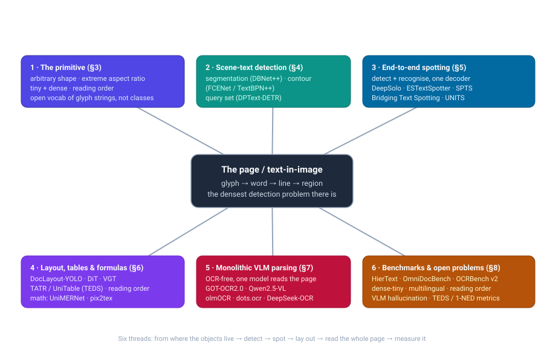
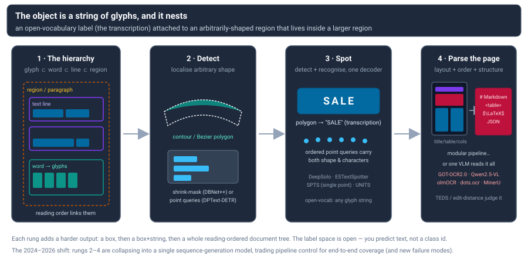

# Dense Object Detection & Classification — Recent Advances

*Compiled 2026-Jul-25 (America/Los_Angeles).*

Next installment in the running CV-updates log. Earlier entries on
`main`:
[Apr-30](../2026-Apr-30/2026-Apr-30_CV_updates.md),
[May-01](../2026-May-01/2026-May-01_CV_updates.md),
[May-02](../2026-May-02/2026-May-02_CV_updates.md),
[May-04](../2026-May-04/2026-May-04_CV_updates.md),
[May-05](../2026-May-05/2026-May-05_CV_updates.md),
[May-07](../2026-May-07/2026-May-07_CV_updates.md),
[May-08](../2026-May-08/2026-May-08_CV_updates.md),
[May-15](../2026-May-15/2026-May-15_CV_updates.md),
[May-16](../2026-May-16/2026-May-16_CV_updates.md),
[May-17](../2026-May-17/2026-May-17_CV_updates.md),
[Jun-09](../2026-Jun-09/2026-Jun-09_CV_updates.md),
[Jun-10](../2026-Jun-10/2026-Jun-10_CV_updates.md),
[Jun-12](../2026-Jun-12/2026-Jun-12_CV_updates.md),
[Jun-15](../2026-Jun-15/2026-Jun-15_CV_updates.md),
[Jun-16](../2026-Jun-16/2026-Jun-16_CV_updates.md),
[Jun-17](../2026-Jun-17/2026-Jun-17_CV_updates.md),
[Jun-19](../2026-Jun-19/2026-Jun-19_CV_updates.md),
[Jun-21](../2026-Jun-21/2026-Jun-21_CV_updates.md),
[Jun-22](../2026-Jun-22/2026-Jun-22_CV_updates.md),
[Jun-23](../2026-Jun-23/2026-Jun-23_CV_updates.md),
[Jun-24](../2026-Jun-24/2026-Jun-24_CV_updates.md),
[Jun-25](../2026-Jun-25/2026-Jun-25_CV_updates.md),
[Jun-27](../2026-Jun-27/2026-Jun-27_CV_updates.md),
[Jun-29](../2026-Jun-29/2026-Jun-29_CV_updates.md),
[Jun-30](../2026-Jun-30/2026-Jun-30_CV_updates.md),
[Jul-04](../2026-Jul-04/2026-Jul-04_CV_updates.md),
[Jul-07](../2026-Jul-07/2026-Jul-07_CV_updates.md),
[Jul-08](../2026-Jul-08/2026-Jul-08_CV_updates.md),
[Jul-10](../2026-Jul-10/2026-Jul-10_CV_updates.md),
[Jul-15](../2026-Jul-15/2026-Jul-15_CV_updates.md),
[Jul-17](../2026-Jul-17/2026-Jul-17_CV_updates.md),
[Jul-18](../2026-Jul-18/2026-Jul-18_CV_updates.md),
[Jul-21](../2026-Jul-21/2026-Jul-21_CV_updates.md),
[Jul-22](../2026-Jul-22/2026-Jul-22_CV_updates.md),
[Jul-24](../2026-Jul-24/2026-Jul-24_CV_updates.md).

## Table of contents

1. [Why this pass: the page / text-in-image as its own primitive](#why)
2. [Topic map](#map)
3. [The geometry — where the "objects" live](#geometry)
4. [Scene-text detection: localizing arbitrary shapes](#detection)
5. [End-to-end text spotting: detect + recognize in one model](#spotting)
6. [Layout, tables & formulas: parsing the page](#layout)
7. [The monolithic shift: VLM/LMM "OCR-free" parsing](#monolithic)
8. [Benchmarks, metrics & open problems](#benchmarks)
9. [Through-line & open problems](#throughline)
10. [Sources](#sources)

---

## 1. Why this pass: the page / text-in-image as its own primitive

The recent run of passes has worked **sensor / imaging primitives on their own
terms** — LiDAR ([Jun-27](../2026-Jun-27/2026-Jun-27_CV_updates.md)), the event
camera ([Jun-29](../2026-Jun-29/2026-Jun-29_CV_updates.md)), thermal infrared
([Jun-30](../2026-Jun-30/2026-Jun-30_CV_updates.md)), imaging radar
([Jul-04](../2026-Jul-04/2026-Jul-04_CV_updates.md)), and a string of medical /
scientific modalities through hyperspectral, SAR and OCT. This pass turns to a
primitive defined not by a *sensor* but by a *content type*: **text in images —
the page**. It is the most extreme instance of dense detection the field has, and
it has its own machinery, its own datasets, and — in 2024–2026 — its own quiet
revolution.

Three things make text-in-image a distinct primitive rather than "just detection
of one more class":

- **The object is an open-vocabulary string, not a fixed class id.** A detector
  that finds a "dog" chooses from a closed label set. A text detector must localize
  *and transcribe* an arbitrary glyph sequence it has never seen — a phone number,
  a foreign brand, a made-up word. The label space is effectively infinite, which
  is why the field converged early on *detection + recognition* ("spotting") as the
  real task and, lately, on sequence-generation models that emit the characters
  directly.
- **The objects are arbitrarily shaped, extreme in aspect ratio, and nested.**
  Scene text curves around mugs and bends along storefronts; document text packs
  hundreds of near-identical word instances per page at tiny scale. A word contains
  glyphs; a line contains words; a paragraph/region contains lines — a *hierarchy*
  with a **reading order** that is itself part of the label. No other detection
  problem routinely asks for 100+ instances per image *plus* the graph that links
  them.
- **The output is a structured document, not a bag of boxes.** The end user rarely
  wants boxes; they want the table as HTML, the equation as LaTeX, the form as
  key–value pairs, the page as reading-ordered Markdown. Detection is a means; the
  deliverable is *structure*.

So this pass follows the same ladder every text system climbs — **detect →
recognize → lay out → read the whole page** — and tracks where each rung stands in
2026. The headline is that the rungs are collapsing: a single vision-language model
increasingly ingests a page and emits structured text end-to-end, and the open
question is what that buys and what it breaks.

> Scope note. This is the first pass dedicated to text-in-image; scene-text
> spotting has appeared only as a single row in earlier generalist surveys
> (e.g. DeepSolo / GOT-OCR2.0 in the [Jun-09](../2026-Jun-09/2026-Jun-09_CV_updates.md)
> pass). Handwriting recognition, pure text *recognition* on pre-cropped words, and
> the NLP side of document understanding are mentioned only where they bear on
> detection/layout.

---

## 2. Topic map

The six threads of this pass and how they hang off the central primitive.

---

## 3. The geometry — where the "objects" live

Before the models, the shape of the problem. Text detection is dense detection with
four properties that jointly break the standard axis-aligned-box, closed-vocabulary
detector:

- **Arbitrary shape.** Words are quadrilaterals only in the easiest datasets. In the
  wild they are curved, perspective-warped, and vertical. The representational
  question — *how do you parameterize an arbitrary closed contour compactly and
  differentiably?* — drives most of the detection literature (§4): shrink-masks,
  Bézier curves, Fourier/DCT/low-rank contour signatures, or ordered point sets.
- **Extreme and variable aspect ratio.** A single text line can be 50× wider than it
  is tall; a vertical sign the reverse. Anchor priors tuned for objects fail, which
  is why segmentation and point/query representations dominate over box regression.
- **Density and tiny scale.** Document and commodity-packaging images carry
  hundreds of instances, many only a few pixels tall, packed with sub-pixel gaps.
  Separating *adjacent* instances (not just foreground/background) is the hard part —
  the reason progressive-expansion and pixel-aggregation post-processing exist.
- **Hierarchy + reading order.** Glyph ⊂ word ⊂ line ⊂ paragraph ⊂ region, plus a
  reading order over them. The label is not just *where* and *what* but *in what
  sequence* — a structure prediction problem hiding inside a detection problem.

The ladder below is the spine of the whole field: each rung adds a harder output on
top of the last.

The 2024–2026 story is that rungs 2–4 are being folded into a single
sequence-generation model. The rest of this pass walks the rungs bottom-up and then
looks at the model that eats them.

---

## 4. Scene-text detection: localizing arbitrary shapes

Detection-only work has consolidated around three ways to represent an arbitrary
contour. All three are alive in 2026; the choice is an accuracy/speed/robustness
trade.

**Segmentation-based (shrink-mask) detectors** predict a per-pixel text map and
recover instances by post-processing. The workhorse is **DBNet** (AAAI 2020), whose
*Differentiable Binarization* makes the threshold step learnable, removing
hand-tuned post-processing and hitting real-time; **DBNet++** (TPAMI 2022) adds
*Adaptive Scale Fusion* for scale robustness. Instance separation in dense text is
the segmentation camp's real problem: **PSENet** (CVPR 2019) grows text from minimal
"kernels" via progressive scale expansion, and **PAN** (ICCV 2019) clusters pixels
with a learned *Pixel Aggregation* at ~84 FPS. **FAST** pushes efficiency further
with a minimalist single-channel kernel and GPU-parallel post-processing plus a
text-tailored NAS backbone. These remain the deployment default when latency
matters.

**Regression / contour-based detectors** predict a compact parameterization of the
boundary directly. The representational menu is rich: **ABCNet**'s cubic **Bézier
curves** (CVPR 2020) with BezierAlign sampling; **FCENet**'s **Fourier Contour
Embedding** (CVPR 2021), which encodes a contour as Fourier coefficients and is
especially strong on highly-curved text; **TextBPN / TextBPN++** (ICCV 2021 / T-MM
2023), which iteratively deform a boundary proposal with a **boundary transformer**;
and a family of transform-coded contours — **TextDCT** (DCT masks), **TPSNet**
(thin-plate splines), and **LRANet** (AAAI 2024), which learns a **low-rank** shape
basis via SVD of labelled contours. **LRANet++** (TPAMI 2025) carries the low-rank
representation into joint spotting and is the first to clear 70% end-to-end
F-measure on CTW1500 at 26 FPS.

**DETR / query-based detectors** drop post-processing entirely by predicting
instances as a set. **DPText-DETR** (AAAI 2023) represents each instance as
progressively-refined *explicit point queries* with a shape-aware factorized
attention, and released the **Inverse-Text** set to probe rotated/inverse
robustness. **TESTR** (CVPR 2022) uses dual decoders for shape and characters;
**SRFormer** (AAAI 2024) injects a segmentation-derived soft-RoI to strengthen
queries. Query-based detection also inherits the broader real-time-DETR training
advances tracked in earlier passes — e.g. **DEIM** (CVPR 2025) with dense one-to-one
matching for fast convergence — increasingly retrofitted onto text detectors.

**2024–2026 developments.** Three currents stand out. (1) **Linear-time backbones**:
**TextMamba** (IJCNN 2025) is the first Mamba/state-space text detector, using a 2D
selective scan plus top-k attention for long-range context at linear cost. (2)
**SAM-in-text / multi-granularity**: **Hi-SAM** (TPAMI 2025) and **Char-SAM** adapt
the Segment Anything stack to hierarchical text segmentation (stroke → word → line →
paragraph in one model), and "unified multi-granularity" detectors predict
word/line/paragraph jointly with interactive attention. (3) **Robustness under shift**:
parameter-efficient adaptation (**TextDS**, 2026) and inverse/antagonistic-scene
benchmarks push past the saturated clean-image numbers.

The honest status: on the classic clean benchmarks (ICDAR2015, Total-Text, CTW1500)
detection F-measure is saturated in the high-80s/low-90s across all three camps. The
open frontier is *dense-tiny*, *multilingual*, and *distribution-shifted* text, plus
the fact that detection alone is increasingly the wrong unit of work (see §5, §7).

---

## 5. End-to-end text spotting: detect + recognize in one model

Because the label is a string, the field's real task is **spotting** — detection and
recognition trained jointly so that recognition gradients shape localization and vice
versa. The 2023–2026 arc runs from two-stage RoI pipelines to single-decoder
transformers to pure sequence generation.

**Single-decoder transformer spotters** are the current mainstream. **DeepSolo**
(CVPR 2023) represents each instance as a set of *ordered explicit point queries* and
lets **one** decoder "solo" both tasks with no RoI step; **DeepSolo++** adds a
script-identification head for multilingual spotting. **ESTextSpotter** (ICCV 2023)
makes the detection/recognition synergy *explicit* by splitting the shared query into
task-aware polygon and content queries with vision–language communication.
**SwinTextSpotter** (CVPR 2022) and its **v2** (IJCV 2025) couple the two tasks via a
*Recognition Conversion* that back-propagates recognition loss into localization.
**TESTR** (CVPR 2022) established the dual-decoder DETR template these build on.

**Minimal-annotation and sequence-generation spotters** cut the supervision and the
architecture at once. **SPTS** (ACM MM 2022) reframes spotting as autoregressive
token prediction needing only a **single center point** per instance — no boxes or
polygons — and **SPTS v2** splits instance-assignment and parallel recognition for
~19× faster inference. **UNITS** (CVPR 2023) is a unified sequence model that emits
multiple detection formats (quad/polygon) and uses *starting-point prompting* to
extract more instances than seen at training time. This autoregressive line is the
conceptual bridge to the monolithic VLMs of §7.

**Keeping the modules but bridging them.** **Bridging Text Spotting** (CVPR 2024)
freezes a strong pre-trained detector and a strong recognizer and connects them with
a zero-initialized *Bridge* + adapter — recovering most of the end-to-end benefit
while retaining the modular parts (≈83% Total-Text E2E). It is a useful counter-current
to the "one big model" trend, and a reminder that the two-step gap was largely an
*optimization* gap, not a fundamental one.

**Arbitrary shape, instructions, and video.** Bézier-denoising queries
(**DNTextSpotter**, 2024) and efficient multilingual spotters (**FastTextSpotter**,
2024) push the curved/multilingual frontier; **InstructOCR** (AAAI 2025) conditions
spotting on natural-language instructions; **STEP** does regex/pattern-promptable
"structured" spotting. On **video**, **TransDETR** (IJCV 2024) tracks-and-recognizes
via persistent text queries across frames, and **GoMatching / GoMatching++** (NeurIPS
2024 / 2025) show that freezing a strong *image* spotter and tuning only a lightweight
tracker beats bespoke video models — echoing the "bridge, don't rebuild" theme, and
introducing the arbitrary-shape **ArTVideo** test set.

---

## 6. Layout, tables & formulas: parsing the page

Documents add a second axis: beyond *where the words are*, you need the **page's
structure** — which regions are titles vs. body vs. figures vs. tables, in what
reading order, and (for tables and formulas) the internal grid or markup.

**Layout detection** treats page regions as the objects. Self-supervised document
backbones lead: **DiT** (ACM MM 2022) pre-trains a BEiT-style ViT on 42M unlabeled
pages and feeds a Mask/Cascade R-CNN head; **LayoutLMv3** (ACM MM 2022) unifies text
+ image with word–patch alignment; **VGT** (ICCV 2023) adds a two-stream *Vision Grid
Transformer* that models token- and segment-level text-grid semantics and released
the diverse **D4LA** benchmark. The efficiency counter-move is **DocLayout-YOLO**
(Oct 2024): a YOLO-v10-based detector with a global-to-local receptive module and
synthetic **DocSynth-300K** pretraining, delivering transformer-level accuracy at
real-time speed — now the default layout stage in several open pipelines.

**Reading order** is its own prediction problem. **LayoutReader** (EMNLP 2021) is a
layout-aware seq2seq trained on the 500K-page **ReadingBank**; **XY-Cut++** (2025)
revives the classic recursive cut with pre-masking, multi-granularity segmentation and
cross-modal priors, reporting ~98.8 BLEU on block-level ordering. Reading order is the
quiet failure point of multi-column and non-Manhattan layouts, and the place modular
pipelines most often beat end-to-end VLMs.

**Table structure recognition (TSR)** converts a table image into cell structure +
content. **TATR / Table Transformer** (CVPR 2022) casts *both* detection and structure
as DETR object detection over six classes and released the ~948K-table **PubTables-1M**
plus the **GriTS** metric; **TableFormer** (CVPR 2022) autoregressively emits an
HTML/OTSL structure sequence plus a cell-bbox decoder, robust to borderless tables;
**UniTable** (2024) unifies structure, cell-bbox and content as one language-modeling
objective over pixels and beats GPT-4o on table parsing; **MTL-TabNet** does
image→HTML multi-task decoding. Table quality is scored by **TEDS** (Tree-Edit-Distance
Similarity) — a structure-aware metric, unlike detection F-measure.

**Formulas.** Math is detection + a markup language. **pix2tex/LaTeX-OCR** and
**UniMERNet** (2024, with the UniMER-1M dataset) convert equation crops to LaTeX;
**PP-FormulaNet** (2025) tunes the accuracy/efficiency trade.

**Full pipelines.** These components now ship assembled: **MinerU** (2024,
DocLayout-YOLO + UniMERNet + table models → Markdown/JSON), **Docling** (IBM, DocLayNet
models + TableFormer, MIT-licensed), and **Marker** (the Surya model suite). They are
the modular baseline the monolithic VLMs of §7 are measured against.

---

## 7. The monolithic shift: VLM/LMM "OCR-free" parsing

This is the story of the pass. Between 2023 and 2026 the four rungs — detect,
recognize, lay out, structure — have been folding into a **single
vision-language model** that ingests a page image and emits Markdown/HTML/LaTeX
end-to-end. There is no explicit box anywhere in the pipeline; localization, if it
survives at all, is implicit in the decoder's attention.

**The lineage.** Two precursors seeded it. **Donut** (ECCV 2022) was the first
influential *OCR-free* document model — a Swin encoder + decoder trained to read a
page by next-token prediction, no OCR engine — and **Pix2Struct** (2022) pretrained
by parsing masked webpage screenshots into simplified HTML, an objective that quietly
subsumes OCR + layout + captioning. **Vary** (ECCV 2024) then showed you could *scale
the vision vocabulary* to handle dense document/chart pixels, and became the direct
ancestor of the flagship.

**The OCR-2.0 thesis.** **GOT-OCR2.0** (Sep 2024) is the model that named the shift.
Its argument: treat *all* optical signals — scene/document text, formulas, tables,
charts, sheet music, even geometry — as one class of "characters" and generate them
as a single sequence. A compact 580M model (high-compression encoder + long-context
decoder) does whole-page and region input and emits formatted Markdown/TikZ/SMILES,
on a consumer GPU. **Nougat** (Meta, 2023) had already done this for academic PDFs →
Markdown (with the now-classic repetition/looping failure on out-of-distribution
pages), and **Kosmos-2.5** (Microsoft, 2023) produced both spatially-grounded text
blocks and structured Markdown from the same decoder.

**The 2025 specialist wave.** The surprise of 2025 is that *tiny* purpose-built
doc-parsing VLMs now beat 72B general models and closed systems on document parsing:

- **olmOCR** (Ai2, 2025) fine-tunes a 7B VLM to linearize PDFs at scale, using
  *document anchoring* (feeding PDF-extracted text/coords as prompt hints); **olmOCR 2**
  adds **RLVR** — reinforcement learning against binary unit tests generated from
  synthetic HTML ground truth — with its biggest gains on math, tables, and
  multi-column pages.
- **dots.ocr** (rednote, 2025) folds layout detection + recognition + reading order
  into one **1.7B** model spanning 100+ languages and tops OmniDocBench despite its
  size.
- **MinerU2.5** (OpenDataLab, 2025) uses a **coarse-to-fine** two-stage trick — global
  layout on a downsampled page, then recognition on native-resolution crops — for high
  accuracy at low token cost; **MonkeyOCR** (2025) argues for a
  **Structure-Recognition-Relation** triplet (layout, content, and an explicit reading-
  order *relation* stage), with a 3B model beating Qwen2.5-VL-72B and Gemini 2.5 Pro on
  doc parsing on a single 3090; **PaddleOCR-VL** (Baidu, 2025) packs 109-language
  page parsing into a 0.9B model.
- **DeepSeek-OCR** (Oct 2025) reframes the whole task as **"contexts optical
  compression"**: encode a page into ~100 vision tokens and decode >10× as many text
  tokens at ~97% precision — OCR recast as a long-context *compression* method rather
  than an end in itself.

**General VLMs got good at reading, too.** The enabling trick everywhere is
**any-resolution / dynamic tiling** so dense small text survives encoding:
**Qwen2-VL**'s *Naive Dynamic Resolution* + M-RoPE, **Qwen2.5-VL** (OCR in 32
languages, robust to blur/tilt, structured form/invoice/table extraction),
**InternVL 2.5/3**, **DeepSeek-VL2** (MoE + dynamic tiling), **InternLM-XComposer2-4KHD**
(up to 4K input), and doc-specialist LMMs **mPLUG-DocOwl 1.5/2** (DocCompressor: 324
tokens/page) and **TextMonkey**. GPT-4o and Claude remain the closed reference points
that open models now match or beat on doc parsing.

**What it buys, what it breaks.** The upside is real: no OCR-error propagation, no
brittle hand-tuned stages, one model for text + tables + formulas + charts + reading
order, structured output directly. The documented failure modes are equally real and
are the live research front (detailed in §8): **hallucination** (plausible-but-wrong
text that a spell-checker won't catch — a qualitatively *new* error mode versus
classic OCR's garbled-but-obvious noise), **reading-order confusion** on multi-column
and non-Manhattan pages, **dense/small-text and long-page instability** (decoding
loops, silently skipped regions), and a **5–10× efficiency** gap versus classic OCR
engines. The pragmatic consensus emerging in 2025–2026 is *decoupled, not monolithic*:
a lightweight structural stage (layout + reading order) feeding a VLM recognizer —
MinerU2.5, MonkeyOCR-SRR, and PP-StructureV3 all land here — rather than one model
swallowing the page whole. It is the same "bridge, don't rebuild" lesson §5 drew for
spotting, one level up.

---

## 8. Benchmarks, metrics & open problems

**The datasets encode the difficulty axes.** Where a benchmark lives on the map tells
you which sub-problem it stresses:

- **Density / hierarchy.** **HierText** (CVPR 2022) is the reference dense benchmark —
  ~11.6K Open-Images pages with **word/line/paragraph** hierarchy and **~104 words per
  image** (≈25× ICDAR-2015 density), purpose-built for joint detection + layout, and the
  basis of the ICDAR 2023 hierarchical-text competition. **TextOCR** (~903K words,
  ~32/image) is the other large dense real-image set.
- **Arbitrary shape.** **Total-Text** (word-level polygons) and **SCUT-CTW1500**
  (line-level 14-point curves) are the curved-text staples; **ICDAR2019-ArT** (10K
  images) merges them for a larger arbitrary-shape test.
- **Multilingual.** **ICDAR2017/2019-MLT** (9–10 languages), **RCTW-17** and **ReCTS**
  (Chinese signage), plus Arabic (**EvArEST**) and Indic (**IIIT-ILST**, **IndicSTR12**)
  sets probe the long script tail.
- **Video.** **BOVText** (2K+ bilingual videos) and **DSText** (dense/small video text)
  add tracking to detection + recognition.
- **Whole-document parsing.** The new center of gravity: **OmniDocBench** (CVPR 2025 —
  ~1.6K PDF pages, 9–10 doc types, component-level scoring of text/tables/formulas/reading-
  order), **OCRBench v2** (bilingual, 31 scenarios, 10K human-verified QA — and the sobering
  finding that *most LMMs still score below 50/100*), and **olmOCR-Bench** (7K
  property-based unit tests over PDFs, checking output *properties* rather than string
  match). Table structure has **PubTables-1M** (~1M tables) and reading order has
  **ReadingBank** (500K pages).

**Metrics fragment by output type**, which is itself an open problem:

- **Detection** → **H-mean / F-measure** over IoU-matched polygons.
- **Spotting** → **word accuracy** and **1-NED** (1 − normalized edit distance), the
  latter kinder to long/multilingual strings than exact match.
- **Tables** → **TEDS / TEDS-Struct** (Tree-Edit-Distance Similarity over the HTML tree),
  a structure-aware score, plus **GriTS** from the PubTables-1M line.
- **Document text** → normalized edit distance / CER-WER; OmniDocBench scores
  text/formula/table/reading-order *separately*.
- **Reading order** → edit-distance / Kendall-τ over region sequences — but *ill-defined
  when two systems segment the page differently* (merge/split), which is exactly when it
  matters.

**Open problems (2024–2026).** The clean-benchmark detection numbers are saturated; the
work has moved to the hard tail and to the VLM era's new failure modes:

1. **Reading order in complex layouts.** Multi-column, nested, and newspaper pages still
   break heuristics; few general learnable methods exist and evaluation is unstable across
   differing segmentations.
2. **Dense / tiny text.** High-count, few-pixel text remains weak (the HierText / DSText /
   olmOCR "tiny-text" splits), colliding directly with the high-res-costs-tokens tension.
3. **Multilingual long tail.** Indic, Arabic and low-resource scripts are under-served, and
   the synthetic-to-real gap persists.
4. **Hallucination in VLM OCR.** The signature new risk: fluent, plausible, *wrong* text
   that classic error metrics and spell-checkers miss. Mitigations under study include
   grounding output to coordinates, document-anchoring prompts, latent-probe *abstention*,
   and dedicated inspectors.
5. **Evaluation itself.** No consensus among edit-distance vs F-measure vs TEDS vs
   reading-order metrics; segmentation-sensitivity plagues all of them; property-based unit
   tests (olmOCR) are one promising alternative paradigm.
6. **Efficiency / on-device.** VLM OCR is 5–10× slower than classic engines; token
   compression (DeepSeek-OCR, GOT), small specialists (dots.ocr 1.7B, PaddleOCR-VL 0.9B),
   and coarse-to-fine decoding are the active responses.

---

## 9. Through-line & open problems

Reading the four rungs top to bottom, one arc dominates the 2024–2026 window:

- **The unit of work keeps rising.** The field moved from *box* (detection) → *box +
  string* (spotting) → *page tree* (layout + reading order) → *structured document*
  (monolithic parsing). Each rung folded the one below it into a single trainable
  objective. The natural endpoint — one model that takes pixels and returns a faithful,
  reading-ordered, structured document — is now a crowded research area rather than a
  distant goal.
- **Representation was the whole game at the detection rung, and it's settled-but-plural.**
  Shrink-masks (DBNet++), transform-coded contours (FCENet/LRANet), and point/query sets
  (DPText-DETR) all clear the high-80s on clean curved-text benchmarks. Nobody "won";
  the choice is a latency/robustness trade, and the interesting motion has moved
  up-stack.
- **"Bridge, don't rebuild" recurs at every level.** Bridging Text Spotting (freeze
  detector + recognizer, learn a bridge), GoMatching (freeze an image spotter, tune a
  tracker for video), and the decoupled doc-parsers (MinerU2.5, MonkeyOCR-SRR — a light
  structural stage feeding a VLM) all say the same thing: the end-to-end *gap* was an
  optimization/interface gap, not evidence that a single monolith is the only path. The
  strongest 2025 systems are hybrids, not monoliths.
- **The new error mode is qualitatively different.** Classic OCR fails *loudly* —
  garbled characters you can see. VLM OCR fails *quietly* — fluent, confident,
  hallucinated text. That shift is what makes hallucination detection, grounding, and
  abstention (not just higher accuracy) the defining open problems of the current era,
  and it's why property-based evaluation (olmOCR-Bench) and coordinate-grounded output
  are gaining over pure string-match scoring.

The open problems worth watching, condensed: (1) **reading order** on genuinely complex
layouts, still the weakest link and the place modular pipelines beat VLMs; (2)
**dense/tiny/multilingual** text, where the high-resolution-costs-tokens tension bites
hardest; (3) **hallucination and trust**, the new-era safety problem for a task people
assume is "solved"; (4) **evaluation**, fragmented across F-measure/1-NED/TEDS/
reading-order metrics with no segmentation-robust consensus; and (5) **efficiency**, the
5–10× gap that token-compression and small specialists are racing to close. The page,
it turns out, is still one of the hardest dense-detection problems in vision — precisely
because the answer is not a set of boxes but a document.

---

## 10. Sources

*Retrieved 2026-Jul-25. Compiled from web search; several 2025–2026 items are recent
preprints and should be re-checked against their final venue. Treat quantitative figures
(mAP, F-measure, TEDS, parameter counts, tokens/page) as author-reported. A handful of
arXiv IDs with 25xx/26xx prefixes are transcribed from search-index listings and are
flagged inline as **[verify]**; the pre-2025 anchor papers are cross-checked and solid.*

**Scene-text detection — segmentation, contour & query (§4)**
- DBNet — differentiable binarization (AAAI 2020): https://arxiv.org/abs/1911.08947
- DBNet++ — + adaptive scale fusion (TPAMI 2022): https://arxiv.org/abs/2202.10304
- PSENet — progressive scale expansion (CVPR 2019): https://arxiv.org/abs/1903.12473
- PAN — pixel aggregation network (ICCV 2019): https://arxiv.org/abs/1908.05900
- FAST — minimalist kernel, GPU-parallel post-proc: https://arxiv.org/abs/2111.02394
- FCENet — Fourier contour embedding (CVPR 2021): https://arxiv.org/abs/2104.10442
- TextBPN — adaptive boundary proposal (ICCV 2021): https://arxiv.org/abs/2107.12664
- TextBPN++ — boundary transformer (T-MM 2023): https://arxiv.org/abs/2205.05320
- ABCNet — Bézier-curve text (CVPR 2020): https://arxiv.org/abs/2002.10200
- TextDCT — DCT mask representation: https://arxiv.org/abs/2206.13381
- LRANet — low-rank contour approximation (AAAI 2024): https://arxiv.org/abs/2306.15142
- LRANet++ — low-rank joint spotting (TPAMI 2025) **[verify]**: https://arxiv.org/abs/2511.05818
- DPText-DETR — dynamic point queries + Inverse-Text (AAAI 2023): https://arxiv.org/abs/2207.04491
- SRFormer — segmentation-informed queries (AAAI 2024): https://arxiv.org/abs/2308.10531
- DEIM — dense O2O matching for fast-converging real-time DETR (CVPR 2025): https://arxiv.org/abs/2412.04234
- TextMamba — Mamba/state-space text detector (IJCNN 2025) **[verify]**: https://arxiv.org/abs/2512.06657
- Hi-SAM — hierarchical text segmentation with SAM (TPAMI 2025): https://arxiv.org/abs/2401.17904
- Char-SAM — character-level SAM: https://arxiv.org/abs/2412.19917
- Unified multi-granularity text detection (interactive attention, 2024): https://arxiv.org/abs/2405.19765
- DRRG — deep relational reasoning graph (CVPR 2020): https://arxiv.org/abs/2003.07493

**End-to-end text spotting (§5)**
- DeepSolo — ordered explicit point queries, single decoder (CVPR 2023): https://arxiv.org/abs/2211.10772
- DeepSolo++ — multilingual + script ID: https://arxiv.org/abs/2305.19957
- ESTextSpotter — explicit detection/recognition synergy (ICCV 2023): https://arxiv.org/abs/2308.10147
- TESTR — text spotting transformers, dual decoders (CVPR 2022): https://arxiv.org/abs/2204.01918
- SwinTextSpotter — recognition conversion (CVPR 2022): https://arxiv.org/abs/2203.10209
- SwinTextSpotter v2 (IJCV 2025): https://arxiv.org/abs/2401.07641
- Bridging Text Spotting — frozen detector+recognizer + bridge (CVPR 2024): https://arxiv.org/abs/2404.04624
- UNITS — unified sequence spotter, starting-point prompt (CVPR 2023): https://arxiv.org/abs/2304.03435
- SPTS — single-point text spotting (ACM MM 2022): https://arxiv.org/abs/2112.07917
- SPTS v2 — parallel recognition decoder (TPAMI): https://arxiv.org/abs/2301.01635
- DNTextSpotter — Bézier denoising queries (2024): https://arxiv.org/abs/2408.00355
- FastTextSpotter — efficient multilingual spotting (2024): https://arxiv.org/abs/2408.14998
- InstructOCR — instruction-conditioned spotting (AAAI 2025): https://arxiv.org/abs/2412.15523
- STEP — structured/pattern-promptable spotting: https://arxiv.org/abs/2309.02356
- TransDETR — video text spotting (IJCV 2024): https://arxiv.org/abs/2203.10539
- GoMatching — freeze image spotter + tune tracker (NeurIPS 2024): https://arxiv.org/abs/2401.07080
- GoMatching++ (2025): https://arxiv.org/abs/2505.22228

**Layout, tables & formulas (§6)**
- DiT — document image transformer (ACM MM 2022): https://arxiv.org/abs/2203.02378 · code: https://github.com/microsoft/unilm/tree/master/dit
- LayoutLMv3 (ACM MM 2022): https://arxiv.org/abs/2204.08387
- VGT — vision grid transformer + D4LA (ICCV 2023): https://arxiv.org/abs/2308.14978
- DocLayout-YOLO — YOLO-v10 layout + DocSynth-300K (2024): https://arxiv.org/abs/2410.12628 · code: https://github.com/opendatalab/DocLayout-YOLO
- PubLayNet (ICDAR 2019): https://arxiv.org/abs/1908.07836
- DocLayNet (KDD 2022): https://arxiv.org/abs/2206.01062
- M6Doc (CVPR 2023): https://openaccess.thecvf.com/content/CVPR2023/papers/Cheng_M6Doc_A_Large-Scale_Multi-Format_Multi-Type_Multi-Layout_Multi-Language_Multi-Annotation_Category_Dataset_CVPR_2023_paper.pdf
- LayoutReader + ReadingBank (EMNLP 2021): https://arxiv.org/abs/2108.11591
- XY-Cut++ — reading-order recovery (2025): https://arxiv.org/abs/2504.10258
- TableFormer (CVPR 2022): https://arxiv.org/abs/2203.01017
- TATR / PubTables-1M + GriTS (CVPR 2022): https://arxiv.org/abs/2110.00061 · GriTS: https://arxiv.org/abs/2203.12555
- UniTable — unified pixel-level TSR (2024): https://arxiv.org/abs/2403.04822
- MTL-TabNet — image→HTML tables: https://arxiv.org/abs/2303.08648
- PubTabNet — image-based table recognition (ECCV 2020): https://arxiv.org/abs/1911.10683
- UniMERNet — universal math-expression recognition (2024): https://arxiv.org/abs/2404.15254
- pix2tex / LaTeX-OCR: https://github.com/lukas-blecher/LaTeX-OCR
- MinerU — PDF→Markdown pipeline (2024): https://arxiv.org/abs/2409.18839
- Docling — IBM PDF conversion (2024): https://arxiv.org/abs/2408.09869
- Marker / Surya: https://github.com/VikParuchuri/marker · https://github.com/VikParuchuri/surya

**Monolithic VLM / OCR-free parsing (§7)**
- Donut — OCR-free VDU (ECCV 2022): https://arxiv.org/abs/2111.15664
- Pix2Struct (2022): https://arxiv.org/abs/2210.03347
- Vary — scaling the vision vocabulary (ECCV 2024): https://arxiv.org/abs/2312.06109
- Nougat — academic-PDF OCR (2023): https://arxiv.org/abs/2308.13418
- Kosmos-2.5 — multimodal literate model (2023): https://arxiv.org/abs/2309.11419
- GOT-OCR2.0 — the OCR-2.0 thesis (2024): https://arxiv.org/abs/2409.01704 · code: https://github.com/Ucas-HaoranWei/GOT-OCR2.0
- olmOCR — Ai2 PDF linearization (2025): https://arxiv.org/abs/2502.18443 · code: https://github.com/allenai/olmocr
- olmOCR 2 — RLVR / unit-test rewards (2025): https://arxiv.org/abs/2510.19817
- dots.ocr — 1.7B unified layout+recognition+order (2025) **[verify]**: https://arxiv.org/abs/2512.02498 · code: https://github.com/rednote-hilab/dots.ocr
- MinerU2.5 — coarse-to-fine 1.2B (2025): https://arxiv.org/abs/2509.22186
- MonkeyOCR — structure-recognition-relation (2025): https://arxiv.org/abs/2506.05218
- PaddleOCR-VL — 0.9B, 109 languages (2025): https://arxiv.org/abs/2510.14528 · PaddleOCR 3.0: https://arxiv.org/abs/2507.05595
- DeepSeek-OCR — contexts optical compression (2025): https://arxiv.org/abs/2510.18234
- mPLUG-DocOwl 1.5 (2024): https://arxiv.org/abs/2403.12895 · DocOwl2 (2024): https://arxiv.org/abs/2409.03420
- TextMonkey (2024): https://arxiv.org/abs/2403.04473
- Qwen2-VL — naive dynamic resolution + M-RoPE (2024): https://arxiv.org/abs/2409.12191
- Qwen2.5-VL (2025): https://arxiv.org/abs/2502.13923
- InternVL 2.5 (2024): https://arxiv.org/abs/2412.05271 · InternVL3 (2025): https://arxiv.org/abs/2504.10479
- DeepSeek-VL2 — MoE + dynamic tiling (2024): https://arxiv.org/abs/2412.10302
- Molmo / PixMo (2024): https://arxiv.org/abs/2409.17146
- InternLM-XComposer2-4KHD (2024): https://arxiv.org/abs/2404.06512

**Benchmarks, metrics & open problems (§8)**
- HierText — hierarchical dense text (CVPR 2022): https://arxiv.org/abs/2203.15143 · ICDAR23 competition: https://arxiv.org/abs/2305.09750
- TextOCR (CVPR 2021): https://arxiv.org/abs/2105.05486
- ICDAR2019-ArT: https://arxiv.org/abs/1909.07145
- ICDAR2019-MLT: https://arxiv.org/abs/1907.00945 · RCTW-17: https://arxiv.org/abs/1708.09585 · ReCTS: https://arxiv.org/abs/1912.09641
- BOVText — bilingual open-world video text (NeurIPS 2021): https://arxiv.org/abs/2112.04888 · DSText: https://arxiv.org/abs/2304.04376
- OmniDocBench — diverse PDF parsing benchmark (CVPR 2025): https://arxiv.org/abs/2412.07626 · code: https://github.com/opendatalab/OmniDocBench
- OCRBench (2023): https://arxiv.org/abs/2305.07895 · OCRBench v2 (2025): https://arxiv.org/abs/2501.00321
- olmOCR-Bench: https://huggingface.co/datasets/allenai/olmOCR-bench
- DocVQA: https://arxiv.org/abs/2007.00398 · ChartQA: https://arxiv.org/abs/2203.10244 · InfographicVQA: https://arxiv.org/abs/2104.12756 · TextVQA: https://arxiv.org/abs/1904.08920
- Abstaining from VLM OCR errors — "Reading Between the Lines" (2025) **[verify]**: https://arxiv.org/abs/2511.19806
- Multimodal-hallucination survey (2025) **[verify]**: https://arxiv.org/abs/2507.19024

*Method families surveyed above draw on the differentiable-binarization, contour-coding,
DETR-query, sequence-generation, and VLM-parsing literatures; where a 2025–2026 preprint
ID could not be independently opened it is marked **[verify]** and its claim is stated as
author-reported.*

