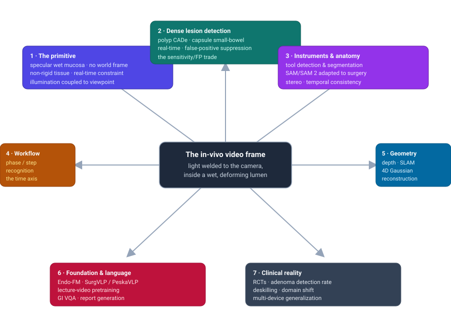
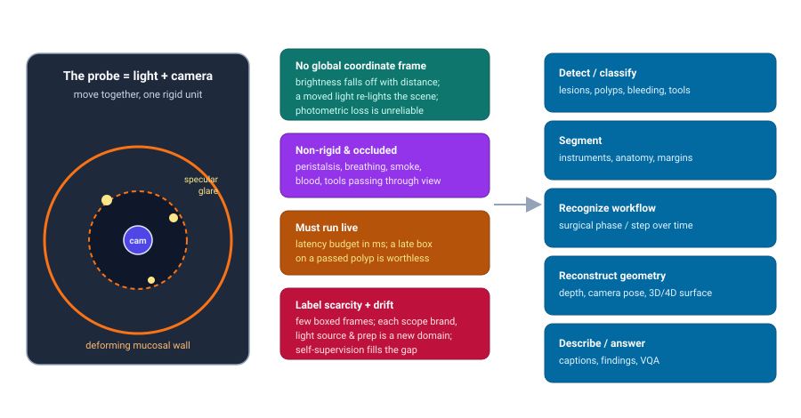
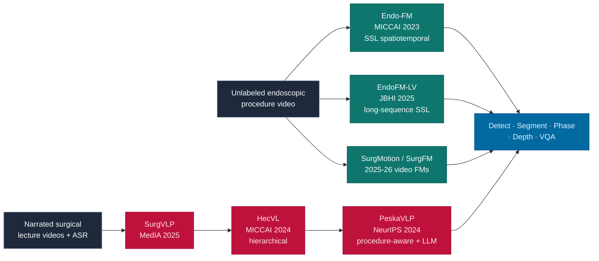

# Dense Object Detection & Classification — Recent Advances

*Compiled 2026-Jul-26 (America/Los_Angeles).*

Next installment in the running CV-updates log. Earlier entries on
`main`:
[Apr-30](../2026-Apr-30/2026-Apr-30_CV_updates.md),
[May-01](../2026-May-01/2026-May-01_CV_updates.md),
[May-02](../2026-May-02/2026-May-02_CV_updates.md),
[May-04](../2026-May-04/2026-May-04_CV_updates.md),
[May-05](../2026-May-05/2026-May-05_CV_updates.md),
[May-07](../2026-May-07/2026-May-07_CV_updates.md),
[May-08](../2026-May-08/2026-May-08_CV_updates.md),
[May-15](../2026-May-15/2026-May-15_CV_updates.md),
[May-16](../2026-May-16/2026-May-16_CV_updates.md),
[May-17](../2026-May-17/2026-May-17_CV_updates.md),
[Jun-09](../2026-Jun-09/2026-Jun-09_CV_updates.md),
[Jun-10](../2026-Jun-10/2026-Jun-10_CV_updates.md),
[Jun-12](../2026-Jun-12/2026-Jun-12_CV_updates.md),
[Jun-15](../2026-Jun-15/2026-Jun-15_CV_updates.md),
[Jun-16](../2026-Jun-16/2026-Jun-16_CV_updates.md),
[Jun-17](../2026-Jun-17/2026-Jun-17_CV_updates.md),
[Jun-19](../2026-Jun-19/2026-Jun-19_CV_updates.md),
[Jun-21](../2026-Jun-21/2026-Jun-21_CV_updates.md),
[Jun-22](../2026-Jun-22/2026-Jun-22_CV_updates.md),
[Jun-23](../2026-Jun-23/2026-Jun-23_CV_updates.md),
[Jun-24](../2026-Jun-24/2026-Jun-24_CV_updates.md),
[Jun-25](../2026-Jun-25/2026-Jun-25_CV_updates.md),
[Jun-27](../2026-Jun-27/2026-Jun-27_CV_updates.md),
[Jun-29](../2026-Jun-29/2026-Jun-29_CV_updates.md),
[Jun-30](../2026-Jun-30/2026-Jun-30_CV_updates.md),
[Jul-04](../2026-Jul-04/2026-Jul-04_CV_updates.md),
[Jul-07](../2026-Jul-07/2026-Jul-07_CV_updates.md),
[Jul-08](../2026-Jul-08/2026-Jul-08_CV_updates.md),
[Jul-10](../2026-Jul-10/2026-Jul-10_CV_updates.md),
[Jul-15](../2026-Jul-15/2026-Jul-15_CV_updates.md),
[Jul-17](../2026-Jul-17/2026-Jul-17_CV_updates.md),
[Jul-18](../2026-Jul-18/2026-Jul-18_CV_updates.md),
[Jul-21](../2026-Jul-21/2026-Jul-21_CV_updates.md),
[Jul-22](../2026-Jul-22/2026-Jul-22_CV_updates.md),
[Jul-24](../2026-Jul-24/2026-Jul-24_CV_updates.md).

## Table of contents

1. [Why this pass: the endoscopic frame as its own primitive](#why)
2. [Topic map](#map)
3. [The primitive — what makes in-vivo video different](#primitive)
4. [Dense lesion detection: polyps, capsules & the false-positive tax](#detection)
5. [Instruments & anatomy: segmentation in the SAM era](#instruments)
6. [Workflow: surgical phase recognition and the time axis](#workflow)
7. [Geometry: monocular depth, non-rigid SLAM & 4D reconstruction](#geometry)
8. [Foundation models & language: watching lectures, answering questions](#foundation)
9. [Clinical reality: trials, deskilling & domain shift](#clinical)
10. [Through-line & open problems](#throughline)
11. [Sources](#sources)

---

## 1. Why this pass: the endoscopic frame as its own primitive

The recent run of passes has worked **sensor / imaging primitives on their own
terms** — LiDAR ([Jun-27](../2026-Jun-27/2026-Jun-27_CV_updates.md)), the event
camera ([Jun-29](../2026-Jun-29/2026-Jun-29_CV_updates.md)), thermal infrared
([Jun-30](../2026-Jun-30/2026-Jun-30_CV_updates.md)), automotive radar
([Jul-04](../2026-Jul-04/2026-Jul-04_CV_updates.md)), then a march through the
scientific and medical modalities: radiology/pathology
([Jul-07](../2026-Jul-07/2026-Jul-07_CV_updates.md)), subsea sonar
([Jul-08](../2026-Jul-08/2026-Jul-08_CV_updates.md)), astronomical surveys
([Jul-10](../2026-Jul-10/2026-Jul-10_CV_updates.md)), X-ray transmission
([Jul-15](../2026-Jul-15/2026-Jul-15_CV_updates.md)), microscopy
([Jul-17](../2026-Jul-17/2026-Jul-17_CV_updates.md)), ultrasound
([Jul-18](../2026-Jul-18/2026-Jul-18_CV_updates.md)), hyperspectral
([Jul-21](../2026-Jul-21/2026-Jul-21_CV_updates.md)), SAR
([Jul-22](../2026-Jul-22/2026-Jul-22_CV_updates.md)) and optical coherence
tomography ([Jul-24](../2026-Jul-24/2026-Jul-24_CV_updates.md)).

**In-vivo endoscopic video** — colonoscopy, gastroscopy, laparoscopy, robotic
surgery, wireless capsule — is the next primitive, and it is deceptively
familiar. Superficially it is "just RGB video," the modality that every generic
detector and every foundation model was trained on. That familiarity is exactly
the trap. The endoscopic frame violates almost every assumption a natural-image
detector quietly relies on:

- **The light source is welded to the camera.** There is no ambient
  illumination and no fixed light field. Brightness falls off with the inverse
  square of distance to tissue; moving the scope re-lights the entire scene.
  The photometric-consistency assumption that underpins self-supervised depth
  and SLAM on street scenes is simply false here.
- **The scene is wet, specular and deforming.** Mucosa is a glossy, fluid-covered
  surface that throws saturated specular highlights that move with the camera;
  the tissue itself deforms under peristalsis, breathing and instrument contact.
  There is no rigid world to anchor to.
- **There is no global coordinate frame.** Inside a lumen or an abdomen there is
  no horizon, no gravity cue, no map. "Where am I" is genuinely hard, and
  loop closure is rare.
- **It must run live.** A polyp box that arrives 300 ms after the fold has
  scrolled past is clinically worthless. Unlike a radiology read
  ([Jul-07](../2026-Jul-07/2026-Jul-07_CV_updates.md)), the deadline is the
  endoscopist's hand, not a reporting queue.
- **Labels are scarce and the domain drifts constantly.** Boxed/masked frames
  are expensive (they need an expert who was in the room), and every scope
  brand, light source, bowel-prep quality and hospital is effectively a new
  domain.

So endoscopy is where generic video detection meets a hostile deployment
environment, and the interesting 2025–2026 work is precisely about closing that
gap: real-time detectors that survive the false-positive tax, promptable
segmenters adapted from natural-image SAM, temporal models that read *workflow*
rather than single frames, geometry pipelines that abandon photometric loss for
appearance-flow and Gaussian rendering, and a fast-growing shelf of
self-supervised and vision-language **surgical/GI foundation models** trained on
the one thing this field has in abundance — unlabeled procedure video and
narrated lecture footage.

## 2. Topic map

Seven threads, all radiating from the same awkward frame: the primitive itself
(§3), dense lesion **detection** (§4), instrument/anatomy **segmentation** (§5),
**workflow** recognition over time (§6), **geometry** (§7), **foundation &
language** models (§8), and the **clinical reality** that decides whether any of
it matters (§9).

## 3. The primitive — what makes in-vivo video different

The single fact that organizes everything downstream is the **coupled
light-camera probe**. Because illumination travels with the sensor, the image
formation model is closer to a moving flashlight in a cave than to a
photograph. Three consequences recur across every thread below:

1. **Photometric loss is unreliable.** The workhorse self-supervised signal for
   depth/ego-motion — "the same 3D point should look the same brightness across
   frames" — breaks when the light moves with the camera. The field's answer,
   *AF-SfMLearner*, introduced an explicit **appearance flow** to model
   brightness inconsistency between frames so that depth and pose can still be
   learned self-supervised; it remains the reference baseline for endoscopic
   monocular depth. Everything in §7 is downstream of this fix.
2. **Specular highlights are structured noise, not texture.** Saturated glare
   moves, occludes lesions, and fools both detectors and feature matchers.
   Preprocessing to *remove* specular highlights and black borders is now a
   standard front-end step even for vision-language pipelines (the MEDVQA-GI
   Florence-2 entrants strip highlights before fine-tuning).
3. **The deployment domain never sits still.** Because a "domain" here is a
   (scope, light, prep, patient, operator) tuple, the same model can look
   excellent on the dataset it was tuned on and collapse on the next cart in the
   next hospital. This is why so much of §8 is about *self-supervised* and
   *vision-language* pretraining on large unlabeled corpora rather than more
   supervised labels — the labels don't generalize; the representations might.

Keep these three in mind: the rest of the report is, in effect, five dense
tasks (detect, segment, recognize workflow, reconstruct, describe) each fighting
the same coupled-probe physics.

## 4. Dense lesion detection: polyps, capsules & the false-positive tax

**Polyp detection during colonoscopy** is the canonical dense-detection task of
this modality, and it is now a mature CADe (computer-aided detection) area with
FDA-cleared products in daily use. The technical story of the last few years is
less about raw accuracy — per-image sensitivities in the high 80s to high 90s
have been reported since the classic four-dataset validation of Wang et al.
(*Sci. Rep.* 2020) — and more about the **false-positive tax**: a detector that
blinks a box on every fold, bubble, or reflection trains the endoscopist to
ignore it, and clinical value evaporates.

- **Real-time, anchor-free detectors.** The current design point is a
  single-stage, anchor-free head tuned for both accuracy and frame rate. A 2025
  *Sensors* framework reports 98.8% mAP@0.5 at 35.8 FPS on a single GTX 1080-Ti
  by combining a Cross-Stage Pyramid Pooling module, a weighted bidirectional
  FPN, and an anchor-free head with a specialized IoU loss — the recurring
  recipe of "multi-scale context + adaptive fusion + no anchors" so the model
  can fire on flat, small, and partially occluded polyps within the latency
  budget.
- **Explicitly attacking false positives.** Two complementary directions. (a)
  Post-hoc *suppression* modules such as **EndoBoost**, a plug-and-play stage
  that filters CADe false positives in real-world colonoscopy (and ships its own
  benchmark of hard negatives). (b) *Data-side* hardening: a 2025 **detector-
  guided adversarial diffusion attacker** synthesizes targeted false-positive-
  like frames to make polyp detectors robust — using a diffusion model to
  manufacture exactly the confusing look-alikes (folds, residue, light) that
  drive clinical false alarms, then training against them. Median-filtering the
  per-frame stream over a short temporal window remains a cheap, effective
  classical trick (halving FP rates in the 2020 study) and still appears as a
  baseline.
- **Human-centered framing.** Beyond the metric, 2025 work argues for
  **human-centered AI-assisted colonoscopy** — designing the alert behavior,
  timing, and trust calibration around the endoscopist rather than optimizing
  mAP in a vacuum. This is the detection thread acknowledging that the "object"
  is only half the problem; the other half is the operator loop (picked up
  again in §9).

**Wireless capsule endoscopy (WCE)** is the other detection frontier and a
different beast: an ingestible camera drifts passively through the small bowel —
a region conventional scopes can't reach — producing tens of thousands of
frames per study, the vast majority normal. The task is needle-in-haystack
dense classification/detection across a long, redundant, unlabeled stream.

- A 2025 *WIREs Data Mining & Knowledge Discovery* survey catalogs the deep-
  learning landscape for GI WCE images — classification, detection, and the
  perennial class-imbalance problem (rare lesions among endless normal mucosa).
- **Bleeding and vascular lesions** are the best-developed sub-task. Reported
  systems reach very high sensitivity for active bleeding and stratify lesions by
  bleeding risk (e.g., along the Saurin classification), with multicentric,
  **multi-brand / multi-device** studies (tens of thousands of frames across
  seven capsule device types) now the credibility bar — a direct answer to the
  domain-drift problem of §3.
- A 2025 *J. Gastroenterol. Hepatol.* systematic review and meta-analysis finds
  AI-assisted capsule reading improves small-bowel lesion detection over
  conventional reading, which — as in colonoscopy — is what moves a method from
  "paper" to "adopted."

The through-line of §4: raw detection is largely solved; the research value now
lives in **false-positive robustness, temporal aggregation over redundant
streams, and multi-device generalization**.

## 5. Instruments & anatomy: segmentation in the SAM era

In laparoscopic and robotic surgery the dense task shifts from "find the lesion"
to "**segment the instruments and anatomy**" — for skill assessment, collision
avoidance, augmented-reality overlays, and as the substrate for workflow
recognition (§6). The EndoVis 2017/2018 instrument-segmentation challenges remain
the standard benchmarks, and the last two years are dominated by adapting the
**Segment Anything Model** family to surgery.

- **Surgical-DeSAM** *decouples* SAM: it replaces SAM's prompt dependence with a
  DETR-style detector so the system produces instance masks **without manual
  prompts** at inference, swaps in a Swin-Transformer backbone for better
  detection features, and reports Dice ≈ 89.6 / 90.7 on EndoVis 2017 / 2018 with
  real-time operation. This is the archetype of the era: keep SAM's mask
  decoder, graft on task-specific detection so it runs autonomously.
- **SAM 2 in surgery.** SAM 2 brought native video segmentation with a memory
  bank; a 2024–2025 empirical study evaluates its **robustness and
  generalization** on surgical video and finds real promise but also brittleness
  under surgical corruptions (smoke, blood, motion blur). Follow-ups such as
  **Surgical SAM 2** push real-time video segmentation via efficient frame
  pruning so the memory mechanism fits the latency budget.
- **Temporal and stereo priors.** Purely per-frame masks flicker. **MATIS**
  (masked-attention transformers) and **LACOSTE** (exploiting stereo + temporal
  context) add instance-level temporal consistency; a 2025 **segment-then-
  classify** framework enforces instance-level spatiotemporal consistency
  explicitly. A lightweight alternative pairs a single SAM prompt with **point
  tracking** to propagate masks across frames cheaply — trading a heavy video
  model for a tracker.

The pattern mirrors natural-image segmentation's SAM adoption, but with two
endoscopy-specific twists: prompts must be *removed* (no surgeon is clicking
mid-operation), and the temporal axis is not optional (§6 makes this explicit).

## 6. Workflow: surgical phase recognition and the time axis

Endoscopy's most distinctive dense task has no natural-image analogue:
**surgical workflow / phase recognition** — labeling every frame of a procedure
with the current phase or step (e.g., the seven phases of a laparoscopic
cholecystectomy on the **Cholec80** benchmark). It powers OR scheduling,
real-time decision support, automated documentation, and anticipation of the
next step. It is fundamentally a *long-range temporal classification* problem:
the same frame means different things depending on what came before.

- **From per-frame CNNs to video foundation models.** The trajectory runs from
  spatial-CNN-plus-LSTM baselines to transformer temporal models with
  calibrated-confidence two-stage inference, and now to **large self-supervised
  video foundation models** pretrained on surgery. **SurgMotion**, a
  video-native surgical foundation model, reports **91.05% accuracy / 77.95%
  Jaccard on Cholec80**, beating a DINOv3-L baseline by **+8.35 Jaccard** —
  evidence that in-domain video pretraining meaningfully outperforms
  transferring a strong natural-image/video backbone.
- **Breadth of evaluation is the new bar.** Recent foundation models
  (e.g., large-scale self-supervised video models for "intelligent surgery," and
  a *generalizable intraoperative* model spanning procedures) are benchmarked
  across seven-plus public datasets — Cholec80, M2CAI16, AutoLaparo, CATARACTS,
  Cataract-101/-21, PmLR50 — precisely because a phase recognizer that only works
  on cholecystectomy is not a foundation model. Cognition-inspired hierarchical
  frameworks ("focus-to-perceive" representation learning) push the same
  cross-procedure generalization.
- **Transfer-learning discipline.** A practical recurring recipe is a staged
  transfer path — Kinetics-400 → Cholec80 → target procedure — that beats
  training the target procedure cold, a reminder that data-scarce surgical
  domains still benefit from the generic-video → surgical-video → specific-
  procedure ladder.

Workflow recognition is where endoscopy is *most* its own primitive: it forces
models to reason over minutes of video with clinical semantics, and it is the
task where surgical foundation models (§8) show their clearest advantage.

## 7. Geometry: monocular depth, non-rigid SLAM & 4D reconstruction

Reconstructing the 3D scene from a monocular endoscope enables measurement
(polyp sizing), navigation, coverage/"blind-spot" tracking, and AR overlays. It
is also where the coupled-probe physics of §3 bites hardest, because classical
photometric SLAM assumes a static scene under fixed lighting — endoscopy offers
neither.

- **Self-supervised monocular depth.** The foundational fix is **AF-SfMLearner**'s
  appearance flow, which models brightness inconsistency so depth and ego-motion
  can be jointly learned without ground truth. 2025–2026 work layers **3D
  consistency optimization** on top: jointly inferring depth, camera parameters,
  and a unified 3D representation via differentiable Gaussian splatting, with
  world-coordinate global alignment and temporal-consistency terms for
  geometrically coherent, stable depth.
- **Gaussian-splatting SLAM and dynamic reconstruction.** The 3D/4D Gaussian
  wave has arrived in endoscopy. **Endo-4DGS** reconstructs deforming surgical
  scenes with 4D Gaussians, using a lightweight MLP for temporal dynamics and
  **Depth-Anything** pseudo-depth as a geometry prior — importing a
  natural-image depth foundation model to supply the prior that photometric loss
  can't. **EndoFlow-SLAM** (MICCAI 2025) folds **optical flow** in as a
  geometric constraint into a 3DGS-SLAM system, plus depth regularization, for
  robustness to soft-tissue motion like breathing. **4D monocular surgical
  reconstruction under arbitrary camera motions** tackles the hardest case,
  where the scope itself moves freely.
- **Online, unified reconstruction.** **Endo3R** performs unified *online*
  reconstruction from dynamic monocular endoscopic video — moving from
  offline, per-sequence optimization toward streaming reconstruction usable
  intra-operatively. Navigation systems such as **EndoSERV** build vision-based
  endoluminal robot navigation on top of this geometry stack.

The through-line: endoscopic geometry has largely *given up* on classical
photometric assumptions and instead fuses (a) appearance/optical-flow models to
handle the moving light, (b) natural-image depth foundation models as priors,
and (c) Gaussian rendering for deformable, real-time-ish reconstruction.

## 8. Foundation models & language: watching lectures, answering questions

Endoscopy has little labeled data but enormous quantities of *unlabeled
procedure video* and *narrated teaching video*. The defining trend of
2024–2026 is turning that abundance into **self-supervised and vision-language
foundation models**.

- **Vision-only self-supervision.** **Endo-FM** (MICCAI 2023) set the template:
  a transformer pretrained with global/local views on a **33K-clip / ~5M-frame**
  corpus assembled from nine public datasets plus private hospital data, robust
  to spatio-temporal variation and transferable to classification, segmentation,
  detection, and workflow. **EndoFM-LV** (*IEEE JBHI* 2025) extends it to
  **long-sequence** representation learning — important because endoscopy's
  semantics (workflow, coverage) live over minutes, not seconds. Parallel
  efforts explicitly **scale up self-supervised learning** for surgical
  foundation models (SurgFM-style scaling studies, 2025).
- **Vision-language from lecture video.** The CAMMA line is the clearest thread:
  **SurgVLP** (*Medical Image Analysis* 2025) transcribes *hundreds of surgical
  lecture videos* via ASR into narration text and contrastively aligns clip and
  text embeddings — enabling zero-shot text-based retrieval, temporal activity
  grounding, and captioning. **HecVL** (MICCAI 2024) adds *hierarchical*
  pretraining (clip / phase / video-level texts) for **zero-shot phase
  recognition**. **PeskaVLP** (NeurIPS 2024 spotlight) makes it *procedure-aware*,
  using LLMs to refine surgical concepts and a Dynamic-Time-Warping loss for
  cross-modal procedural alignment — mitigating overfitting from scarce surgical
  language. Newer large corpora such as **SurgAtlas** (2,391 hours of open and
  minimally invasive surgery) push the data scale further.
- **GI vision-language & VQA.** On the diagnostic-endoscopy side, the
  **ImageCLEFmed MEDVQA-GI 2025** challenge and the **Kvasir-VQA** dataset
  (6,500+ image–question–answer triplets) have made GI visual question
  answering a standard task; entrants fine-tune multimodal backbones like
  **Florence-2** (with specular-highlight/black-border removal front-ends),
  explore **parameter-efficient VLMs** for GI endoscopy, and add **multi-task,
  visually-grounded reasoning**. Reasoning-style benchmarks (surgical
  chain-of-thought) are beginning to probe spatiotemporal reasoning rather than
  single-image answers.

The pattern is unmistakable: the field is converging on the same
foundation-model playbook as the rest of vision, but powered by the two data
sources endoscopy uniquely has — raw procedure video (for SSL) and narrated
teaching video (for language supervision).

## 9. Clinical reality: trials, deskilling & domain shift

Endoscopy is one of the few dense-vision areas with a large body of
**prospective randomized evidence**, which makes it a useful reality check on
what "state of the art" actually buys.

- **The efficacy signal is real but context-dependent.** A meta-analysis of 28
  RCTs (≈23,861 participants) found AI-assisted colonoscopy raised the **adenoma
  detection rate ~20%** and cut the **adenoma miss rate ~55%**; a 2024
  *Gastrointestinal Endoscopy* systematic review reaches the same directional
  conclusion, and device-specific meta-analyses (e.g., GI Genius) corroborate.
- **…but not everywhere.** A 2025 multicenter Taiwanese RCT in **already
  high-ADR** settings found CAD-assisted colonoscopy met only **non-inferiority**;
  superiority was not significant overall, with benefit concentrated in the
  FIT-positive subgroup and driven largely by **diminutive** adenomas. The
  lesson: when baseline operator performance is high, a detector's marginal
  value shrinks — a sobering counterpoint to headline mAP numbers.
- **Deskilling.** The most striking 2025 finding is behavioral, not algorithmic:
  observational evidence that endoscopists' *unassisted* detection may **degrade
  after routine exposure to AI** ("deskilling"). This reframes evaluation — a
  CADe system must be judged on the human-AI *team* over time, not on a frozen
  test set, and directly motivates the human-centered design work of §4.
- **Domain shift is the deployment bottleneck.** Multi-brand/multi-device capsule
  studies (§4), cross-procedure foundation-model benchmarks (§6, §8), and the
  robustness evaluations of SAM 2 under surgical corruptions (§5) all circle the
  same problem: generalization across scopes, sites, and conditions is where
  laboratory numbers meet the cart in the next room.

## 10. Through-line & open problems

**Through-line.** In-vivo endoscopic video looks like ordinary RGB but behaves
like a hostile, non-rigid, self-illuminated stream with a live deadline. Every
thread above is a response to the **coupled light-camera probe** and the
**label-scarcity + domain-drift** it produces:

- detection has largely conquered accuracy and now fights the **false-positive
  tax** and **multi-device generalization** (§4);
- segmentation adapts **SAM/SAM 2** but must *remove* prompts and *add* temporal
  consistency (§5);
- **workflow recognition** is the primitive's signature task and the clearest
  win for in-domain video foundation models (§6);
- geometry **abandons photometric loss** for appearance-flow, optical-flow
  constraints, and Gaussian rendering with imported depth priors (§7);
- **foundation & language** models convert the field's two data surpluses —
  procedure video and lecture narration — into transferable representations (§8);
- and **clinical evidence** keeps everyone honest: real efficacy, real
  context-dependence, and a genuine **deskilling** risk (§9).

**Open problems.**

1. **Trustworthy real-time behavior.** Not just fewer false positives, but alert
   *timing and calibration* that a clinician can rely on without deskilling —
   evaluated on the human-AI team, longitudinally.
2. **Generalization as the primary metric.** Cross-scope, cross-site,
   cross-procedure robustness should be reported by default; single-dataset SOTA
   is close to meaningless here.
3. **Geometry without ground truth.** Deformable, metric-accurate,
   *online* 3D from a moving self-lit monocular probe remains unsolved at the
   accuracy sizing/coverage tasks demand.
4. **Foundation-model consolidation.** Vision-only (Endo-FM/EndoFM-LV/SurgMotion)
   and vision-language (SurgVLP/HecVL/PeskaVLP) lines are still separate; a
   unified surgical/GI multimodal model spanning detection, segmentation,
   workflow, geometry, and language is the obvious next target.
5. **Rare-event and long-stream reasoning.** Capsule (and long procedures)
   demand needle-in-haystack detection plus minute-scale temporal reasoning —
   still the weakest part of the stack.
6. **Evaluation beyond the frame.** Benchmarks that measure clinical outcomes and
   operator behavior, not just per-frame mAP/Dice, are the field's real frontier.

---

## 11. Sources

*Links current as of 2026-Jul-26. Access via the pre-configured proxy; a small
number of publisher pages may gate full text. Where a challenge, dataset, or
method appears under multiple venues, the most authoritative is listed.*

**The primitive & self-supervised depth (§3, §7)**
- AF-SfMLearner (appearance-flow self-supervised depth/ego-motion) — reference baseline, discussed via MICCAI/MedIA follow-ups below.
- 3D Consistency Optimization for Self-Supervised Monocular Video Depth Estimation — https://arxiv.org/pdf/2606.15681
- Endo-4DGS: Endoscopic Monocular Scene Reconstruction with 4D Gaussian Splatting — https://arxiv.org/abs/2401.16416 · https://link.springer.com/chapter/10.1007/978-3-031-72089-5_19
- EndoFlow-SLAM: Real-Time Endoscopic SLAM with Flow-Constrained Gaussian Splatting (MICCAI 2025) — https://papers.miccai.org/miccai-2025/0290-Paper3495.html
- 4D Monocular Surgical Reconstruction under Arbitrary Camera Motions — https://arxiv.org/abs/2602.17473
- Endo3R: Unified Online Reconstruction from Dynamic Monocular Endoscopic Video — https://arxiv.org/abs/2504.03198
- EndoSERV: A Vision-based Endoluminal Robot Navigation System — https://arxiv.org/abs/2603.08324

**Polyp / colonoscopy detection (§4)**
- Real-time detection of colon polyps during colonoscopy using deep learning (Wang et al., *Sci. Rep.* 2020) — https://www.nature.com/articles/s41598-020-65387-1 · https://pmc.ncbi.nlm.nih.gov/articles/PMC7239848/
- Advancing Real-Time Polyp Detection: Anchor-Free Framework with Adaptive Multi-Scale Perception (*Sensors* 2025) — https://doi.org/10.3390/s25247524 · https://pmc.ncbi.nlm.nih.gov/articles/PMC12737261/
- EndoBoost: plug-and-play false-positive suppression for CADe polyp detection (with dataset) — https://arxiv.org/abs/2212.12204
- Targeted False Positive Synthesis via Detector-guided Adversarial Diffusion Attacker for Robust Polyp Detection — https://arxiv.org/abs/2506.18134
- Toward a Human-Centered AI-assisted Colonoscopy System in Australia — https://arxiv.org/abs/2503.20790

**Capsule endoscopy (§4)**
- A Comprehensive Survey of Deep Learning Methods in GI Wireless Capsule Endoscopy (*WIREs DMKD* 2025) — https://wires.onlinelibrary.wiley.com/doi/10.1002/widm.70052
- Multi-brand / multi-device panendoscopic detection of vascular lesions — https://pmc.ncbi.nlm.nih.gov/articles/PMC11039033/
- AI-Assisted vs Conventional Capsule Endoscopy for Small-Bowel Lesions: Systematic Review & Meta-Analysis (*J. Gastroenterol. Hepatol.* 2025) — https://onlinelibrary.wiley.com/doi/10.1111/jgh.16931

**Instruments & segmentation (§5)**
- Surgical-DeSAM: decoupling SAM for instrument segmentation in robotic surgery — https://pubmed.ncbi.nlm.nih.gov/38758289/
- SAM 2 in Robotic Surgery: Robustness & Generalization in Surgical Video Segmentation — https://arxiv.org/abs/2408.04593
- MATIS: Masked-Attention Transformers for Surgical Instrument Segmentation — https://arxiv.org/abs/2303.09514
- LACOSTE: Exploiting stereo and temporal contexts for surgical instrument segmentation — https://arxiv.org/abs/2409.09360
- Augmenting Real-time Surgical Instrument Segmentation with Point Tracking and Segment Anything — https://arxiv.org/abs/2403.08003
- Surgical Instrument Segmentation via Segment-Then-Classify with Instance-Level Spatiotemporal Consistency (*J. Imaging* 2025) — https://www.mdpi.com/2313-433X/11/10/364

**Workflow / phase recognition & video foundation models (§6, §8)**
- SurgMotion: A Video-Native Foundation Model for Universal Understanding of Surgical Videos — https://arxiv.org/abs/2602.05638
- Large-scale Self-supervised Video Foundation Model for Intelligent Surgery — https://arxiv.org/abs/2506.02692
- Scaling up self-supervised learning for improved surgical foundation models — https://arxiv.org/abs/2501.09436
- A generalizable foundation model for intraoperative understanding across surgical procedures — https://arxiv.org/abs/2602.13633
- Focus-to-Perceive: Cognition-Inspired Hierarchical Framework for Endoscopic Video Analysis — https://arxiv.org/abs/2603.25778

**Foundation & vision-language models (§8)**
- Endo-FM: Foundation Model for Endoscopy Video Analysis via Large-scale Self-supervised Pre-train (MICCAI 2023) — https://link.springer.com/chapter/10.1007/978-3-031-43996-4_10 · https://github.com/med-air/Endo-FM
- EndoFM-LV: Improving the Foundation Model via Representation Learning on Long Sequences (*IEEE JBHI* 2025) — https://github.com/med-air/EndoFM-LV
- SurgVLP: Learning multi-modal representations by watching surgical video lectures (*Medical Image Analysis* 2025) — https://github.com/CAMMA-public/SurgVLP
- PeskaVLP: Procedure-Aware Surgical Video-Language Pretraining with Hierarchical Knowledge Augmentation (NeurIPS 2024 spotlight) — https://proceedings.neurips.cc/paper_files/paper/2024/file/de0f2a9943b7bd060e5c10c2fb2654f3-Paper-Conference.pdf · https://github.com/CAMMA-public/PeskaVLP
- HecVL: Hierarchical Video-Language Pretraining for Zero-shot Surgical Phase Recognition (MICCAI 2024) — https://www.researchgate.net/publication/384590158_HecVL_Hierarchical_Video-Language_Pretraining_for_Zero-Shot_Surgical_Phase_Recognition
- SurgAtlas: A Large-Scale Surgical Video-Language Dataset (2,391 hours) — https://arxiv.org/abs/2606.25905

**GI vision-language & VQA (§8)**
- Multimodal AI for Gastrointestinal Diagnostics: Tackling VQA in MEDVQA-GI 2025 — https://arxiv.org/pdf/2507.14544
- Parameter-Efficient VLMs for GI Endoscopy: Image Generation and Clinical VQA — https://arxiv.org/abs/2605.24792
- Multi-Task Learning for Visually Grounded Reasoning in Gastrointestinal VQA — https://arxiv.org/abs/2511.04384
- SurgCoT: Advancing Spatiotemporal Reasoning in Surgical Videos through a Chain-of-Thought Benchmark — https://arxiv.org/pdf/2604.20319

**Clinical evidence (§9)**
- Computer-Assisted Colonoscopy in High–Adenoma Detection Rate Settings in a High-Risk Population: A Randomized Clinical Trial (Taiwan, 2025) — https://pubmed.ncbi.nlm.nih.gov/41984482/ · https://pmc.ncbi.nlm.nih.gov/articles/PMC13084460/
- Use of AI improves colonoscopy performance in adenoma detection: systematic review & meta-analysis (*Gastrointest. Endosc.* 2024) — https://www.giejournal.org/article/S0016-5107(24)03471-0/fulltext
- Effectiveness of GI Genius CADe vs Standard Colonoscopy: Systematic Review & Meta-Analysis of RCTs — https://pmc.ncbi.nlm.nih.gov/articles/PMC12616575/

---

*Compiled automatically as part of the running CV-updates series. Diagrams are
self-contained SVG (`assets/`) plus one inline Mermaid flowchart, all
theme-robust (filled shapes with light text) for light and dark backgrounds and
free of external URLs. Numbers and claims are attributed to the linked sources;
where a source page gates full text, figures are reported as stated in the
abstract or the search-surfaced summary.*
