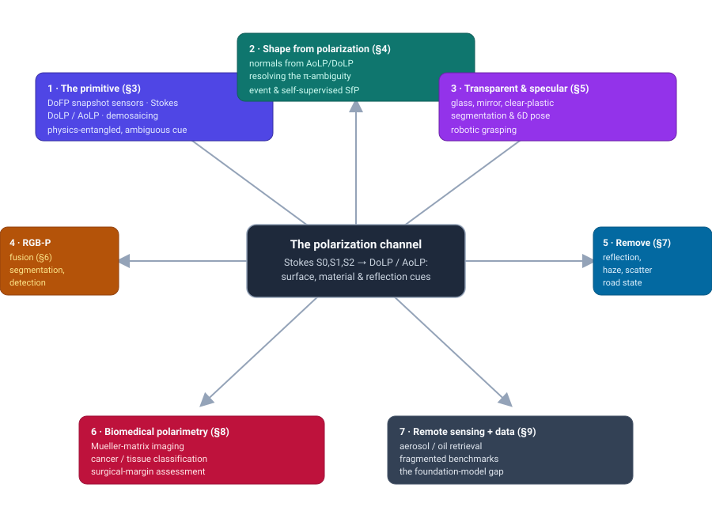
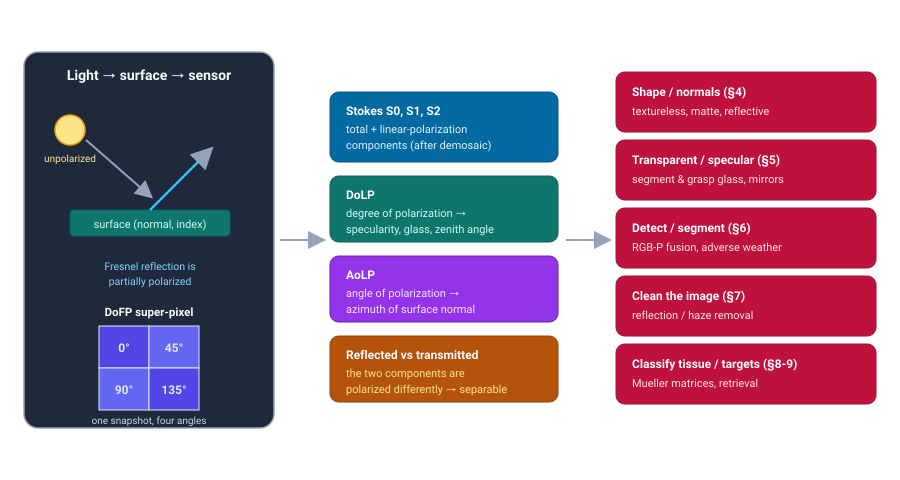
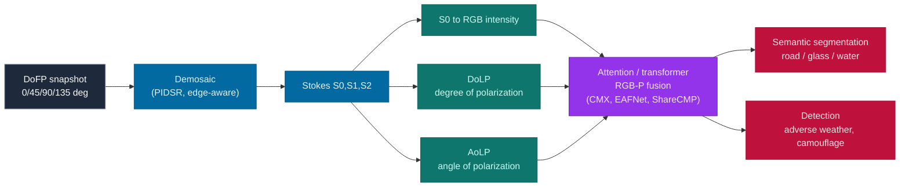

# Dense Object Detection & Classification — Recent Advances

*Compiled 2026-Jul-27 (America/Los_Angeles).*

Next installment in the running CV-updates log. Earlier entries on
`main`:
[Apr-30](../2026-Apr-30/2026-Apr-30_CV_updates.md),
[May-01](../2026-May-01/2026-May-01_CV_updates.md),
[May-02](../2026-May-02/2026-May-02_CV_updates.md),
[May-04](../2026-May-04/2026-May-04_CV_updates.md),
[May-05](../2026-May-05/2026-May-05_CV_updates.md),
[May-07](../2026-May-07/2026-May-07_CV_updates.md),
[May-08](../2026-May-08/2026-May-08_CV_updates.md),
[May-15](../2026-May-15/2026-May-15_CV_updates.md),
[May-16](../2026-May-16/2026-May-16_CV_updates.md),
[May-17](../2026-May-17/2026-May-17_CV_updates.md),
[Jun-09](../2026-Jun-09/2026-Jun-09_CV_updates.md),
[Jun-10](../2026-Jun-10/2026-Jun-10_CV_updates.md),
[Jun-12](../2026-Jun-12/2026-Jun-12_CV_updates.md),
[Jun-15](../2026-Jun-15/2026-Jun-15_CV_updates.md),
[Jun-16](../2026-Jun-16/2026-Jun-16_CV_updates.md),
[Jun-17](../2026-Jun-17/2026-Jun-17_CV_updates.md),
[Jun-19](../2026-Jun-19/2026-Jun-19_CV_updates.md),
[Jun-21](../2026-Jun-21/2026-Jun-21_CV_updates.md),
[Jun-22](../2026-Jun-22/2026-Jun-22_CV_updates.md),
[Jun-23](../2026-Jun-23/2026-Jun-23_CV_updates.md),
[Jun-24](../2026-Jun-24/2026-Jun-24_CV_updates.md),
[Jun-25](../2026-Jun-25/2026-Jun-25_CV_updates.md),
[Jun-27](../2026-Jun-27/2026-Jun-27_CV_updates.md),
[Jun-29](../2026-Jun-29/2026-Jun-29_CV_updates.md),
[Jun-30](../2026-Jun-30/2026-Jun-30_CV_updates.md),
[Jul-04](../2026-Jul-04/2026-Jul-04_CV_updates.md),
[Jul-07](../2026-Jul-07/2026-Jul-07_CV_updates.md),
[Jul-08](../2026-Jul-08/2026-Jul-08_CV_updates.md),
[Jul-10](../2026-Jul-10/2026-Jul-10_CV_updates.md),
[Jul-15](../2026-Jul-15/2026-Jul-15_CV_updates.md),
[Jul-17](../2026-Jul-17/2026-Jul-17_CV_updates.md),
[Jul-18](../2026-Jul-18/2026-Jul-18_CV_updates.md),
[Jul-21](../2026-Jul-21/2026-Jul-21_CV_updates.md),
[Jul-22](../2026-Jul-22/2026-Jul-22_CV_updates.md),
[Jul-24](../2026-Jul-24/2026-Jul-24_CV_updates.md),
[Jul-26](../2026-Jul-26/2026-Jul-26_CV_updates.md).

## Table of contents

1. [Why this pass: polarization as its own primitive](#why)
2. [Topic map](#map)
3. [The primitive — what polarization measures that intensity can't](#primitive)
4. [Shape from polarization: geometry from the angle of light](#sfp)
5. [Transparent, specular & mirrored objects: seeing what RGB can't](#transparent)
6. [RGB-P fusion: dense scene understanding in the hard cases](#fusion)
7. [Removing what's in the way: reflection, haze & scattering media](#removal)
8. [Biomedical polarimetry: Mueller matrices meet deep learning](#biomed)
9. [Remote sensing & the data problem: retrieval, benchmarks, foundations](#remote)
10. [Through-line & open problems](#throughline)
11. [Sources](#sources)

---

## 1. Why this pass: polarization as its own primitive

The recent run of passes has worked **sensor / imaging primitives on their own
terms** — LiDAR ([Jun-27](../2026-Jun-27/2026-Jun-27_CV_updates.md)), the event
camera ([Jun-29](../2026-Jun-29/2026-Jun-29_CV_updates.md)), thermal infrared
([Jun-30](../2026-Jun-30/2026-Jun-30_CV_updates.md)), automotive radar
([Jul-04](../2026-Jul-04/2026-Jul-04_CV_updates.md)), then a march through
scientific and medical modalities: radiology/pathology
([Jul-07](../2026-Jul-07/2026-Jul-07_CV_updates.md)), subsea sonar
([Jul-08](../2026-Jul-08/2026-Jul-08_CV_updates.md)), astronomical surveys
([Jul-10](../2026-Jul-10/2026-Jul-10_CV_updates.md)), X-ray transmission
([Jul-15](../2026-Jul-15/2026-Jul-15_CV_updates.md)), microscopy
([Jul-17](../2026-Jul-17/2026-Jul-17_CV_updates.md)), ultrasound
([Jul-18](../2026-Jul-18/2026-Jul-18_CV_updates.md)), hyperspectral
([Jul-21](../2026-Jul-21/2026-Jul-21_CV_updates.md)), SAR
([Jul-22](../2026-Jul-22/2026-Jul-22_CV_updates.md)), optical coherence
tomography ([Jul-24](../2026-Jul-24/2026-Jul-24_CV_updates.md)) and in-vivo
endoscopic video ([Jul-26](../2026-Jul-26/2026-Jul-26_CV_updates.md)).

**Polarization imaging** is the next primitive, and it occupies a peculiar niche:
it is not a new part of the spectrum (unlike thermal or hyperspectral) and not a
new geometry of acquisition (unlike LiDAR or radar). It is the *same* visible
light every RGB camera already collects — but it records a property that a
conventional sensor throws away: the **orientation of the light's oscillation**,
its polarization state. Ordinary intensity imaging integrates over all
polarization angles and discards the distinction; a polarization camera keeps it.

That discarded channel turns out to encode exactly the things intensity vision
is worst at:

- **Surface orientation.** When unpolarized light reflects off a surface, it
  becomes *partially polarized*, and the degree and angle of that polarization
  are governed by the surface's **normal** and its refractive index (via the
  Fresnel equations). Polarization therefore carries a direct, per-pixel cue to
  3D shape — one that survives on textureless, matte, or repetitive surfaces
  where stereo and photometric methods have no features to latch onto.
- **Transparent and specular materials.** Glass, water, clear plastic, and
  polished metal are near-invisible to intensity vision because they borrow the
  appearance of whatever is behind or reflected in them. But they *alter the
  polarization* of the light that passes through or bounces off them, so a
  polarization camera sees a strong signal exactly where RGB sees nothing.
- **Reflected vs. transmitted light.** A semi-reflector (a window, a wet road, a
  display) mixes a reflection with the scene behind it. The two components are
  polarized differently, so polarization can *separate* them — removing a
  reflection, or a veil of haze — in a way a single intensity image provably
  cannot.

The catch is that this signal is **weak, physics-entangled, and ambiguous**. The
polarization at a pixel depends jointly on the surface normal, the material, the
illumination, and the viewing geometry, and the governing equations are
famously ambiguous (the classic **π-ambiguity** in the azimuth of the normal).
Extracting anything usable means either strong physical priors or — the story of
2023–2026 — **learning** the inverse mapping from data, while respecting the
physics enough not to hallucinate. That is what makes polarization a distinctive
dense-vision primitive: the raw measurement is cheap and snapshot-fast, but every
downstream task is a physics-constrained inverse problem, and the field's recent
progress is about wiring that physics into networks, datasets, and — increasingly
— foundation-scale pretraining.

## 2. Topic map

Seven threads, all radiating from the same extra channel: the primitive itself
(§3), then the six dense tasks polarization is uniquely good at — **shape** from
the angle of light (§4), **transparent/specular** object detection (§5), **RGB-P
fusion** for scene understanding (§6), **reflection/haze removal** (§7),
**biomedical** tissue classification (§8), and **remote-sensing** retrieval with
the datasets and foundations that underpin all of it (§9).

## 3. The primitive — what polarization measures that intensity can't

Modern polarization vision runs almost entirely on **division-of-focal-plane
(DoFP)** sensors: a micro-polarizer array is bonded directly over the pixel
grid, so a repeating 2×2 "super-pixel" carries four linear polarizer
orientations — 0°, 45°, 90°, 135°. Sony's **Polarsens** family (the monochrome
IMX250MZR and color IMX250MYR, ~5 MP) made this a commodity, and it ships in
machine-vision cameras such as the LUCID Phoenix and Triton and FLIR's polarized
models. One exposure yields four co-registered polarized intensities per
super-pixel — a genuine **snapshot** measurement, no rotating filter wheel, no
moving parts ([Teledyne primer](https://www.teledynevisionsolutions.com/learn/learning-center/machine-vision/imaging-reflective-surfaces-sonys-first-polarized-sensor/); [FRAMOS IMX250MYR](https://framos.com/products/sensors/area-sensors/imx250myr-c-21971/); [LUCID Phoenix](https://thinklucid.com/product/phoenix-5-0-mp-polarized-model/)).

From those four intensities the pipeline computes the **linear Stokes vector**
(S0, S1, S2) and, from it, the two quantities that do the real work downstream:

- **DoLP** — the *degree of linear polarization*, the fraction of the light that
  is polarized. It spikes on specular reflections, glass, and water and rises
  predictably with the surface's zenith angle — a shape and material cue.
- **AoLP** — the *angle of linear polarization*, the dominant orientation of the
  oscillation. It is tied to the **azimuth of the surface normal**, which is why
  AoLP is the backbone of shape-from-polarization (§4).

Two front-end problems recur across every thread. First, **demosaicing**: just
like a Bayer array, the DoFP mosaic must be interpolated to recover full-
resolution polarization channels, and naïve interpolation smears the very
edges and highlights that carry the signal. Recent work treats this as its own
learning problem — an edge-aware, inter-channel-correlation demosaicker
([arXiv 2408.17099](https://arxiv.org/abs/2408.17099)) and a **joint
demosaicing-and-super-resolution** model, *PIDSR*, that argues the two tasks
reinforce each other toward cleaner high-resolution DoLP/AoLP
([arXiv 2504.07758](https://arxiv.org/abs/2504.07758)). Second, **tooling**:
open-source stacks such as [`polanalyser`](https://github.com/elerac/polanalyser)
and the *Pola4All* toolkit ([JEI 2024 / arXiv 2312.14697](https://arxiv.org/abs/2312.14697))
standardize the Stokes/DoLP/AoLP and Mueller-matrix math so groups aren't each
re-deriving the physics.

The single fact that organizes everything below: **polarization is a per-pixel
physical measurement of surface and material state, not an appearance feature.**
Every task in §§4–9 is a physics-constrained inverse of the same forward model —
which is why the two 2024 review articles framing the field, *Data-driven
polarimetric imaging* ([Opto-Electronic Science 2024](https://doi.org/10.29026/oes.2024.230042))
and *Polarimetric Imaging for Robot Perception* ([review, 2024](https://pmc.ncbi.nlm.nih.gov/articles/PMC11280991/)),
both organize themselves around *cues* (shape, material, reflection) rather than
around network architectures.

## 4. Shape from polarization: geometry from the angle of light

**Shape-from-polarization (SfP)** recovers a dense field of surface normals (and,
after integration, depth) from the AoLP/DoLP at each pixel. Its appeal is that it
works where the intensity-based 3D methods fail — on **textureless, matte, and
reflective** surfaces, from a **single snapshot**, passively. Its curse is the
Fresnel inverse problem: the mapping from polarization to normal is ambiguous
(the **π / azimuthal ambiguity**), sensitive to whether reflection is diffuse or
specular, and coupled to unknown lighting and refractive index. The last few
years are the story of learning to resolve those ambiguities without discarding
the physics.

- **The deep-learning template.** *Deep Shape from Polarization* (**DeepSfP**,
  [ECCV 2020](https://arxiv.org/abs/1903.10210)) set the pattern still used
  today: feed the network the *physics-based ambiguous normal candidates*
  alongside the raw polarization images, and let it learn to disambiguate. It
  also contributed a real object-scale dataset (multiple materials/paints under
  indoor, sunny, and cloudy light), with surface-normal **angular error** as the
  standard metric.
- **From objects to scenes.** *Shape from Polarization for Complex Scenes in the
  Wild* (**SPW**, [CVPR 2022](https://arxiv.org/abs/2112.11377)) pushed SfP from
  single objects to full scenes, adding a self-attention module and an explicit
  **viewing-angle encoding** to cope with the amplified ambiguities of complex
  materials and non-orthographic projection, and released the first real-world
  *scene-level* SfP dataset (522 images across 100 scenes, LUCID Phoenix).
- **Killing the lighting assumption.** *SfPUEL* (**Shape from Polarization under
  Unknown Environment Light**, [NeurIPS 2024](https://openreview.net/forum?id=skeopn3q5Y),
  [code](https://github.com/YouweiLyu/SfPUEL)) is an end-to-end transformer that
  jointly estimates normals *and* a dielectric-vs-metallic **material
  segmentation** under unknown illumination, borrowing priors from pretrained
  photometric-stereo models — a clear signal that SfP is folding in the broader
  vision-model toolbox.
- **Dropping ground truth.** *SS-SfP* poses SfP as **self-supervised neural
  inverse rendering**, disentangling mixed specular+diffuse polarization and
  estimating normals without ground-truth normals or a known refractive index
  ([arXiv 2407.09294](https://arxiv.org/abs/2407.09294)) — important because
  dense normal ground truth is exactly what polarization data lacks.
- **Breaking the speed–resolution trade with events.** Frame-based SfP needs
  either many polarizer angles (slow) or a snapshot mosaic (low resolution).
  *Event-based Shape from Polarization* ([CVPR 2023](https://arxiv.org/abs/2301.06855))
  spins a linear polarizer in front of an **event camera**
  ([Jun-29](../2026-Jun-29/2026-Jun-29_CV_updates.md)) so the event stream
  samples many angles continuously, reporting roughly a **25% reduction in normal
  MAE** over frame-based physics baselines and releasing the first large real
  event-SfP dataset. A spiking-neural-network follow-up targets energy-efficient
  event-SfP ([arXiv 2312.16071](https://arxiv.org/abs/2312.16071)), and dedicated
  polarization event sensors (**PDAVIS**, [CVPR 2023](https://arxiv.org/abs/2112.01933))
  reconstruct polarization directly from events.
- **The hard materials.** SfP tailored to **transparent** surfaces recovers
  normals where the diffuse-dominant assumption collapses
  ([arXiv 2204.06331](https://arxiv.org/abs/2204.06331)), and a 2025
  **long-wave-infrared polarimetric multi-view stereo** method targets
  transparent/translucent/heterogeneous objects that visible SfP struggles with
  ([arXiv 2510.20972](https://arxiv.org/abs/2510.20972), preprint).

The trajectory is unmistakable: SfP has moved from single objects under
controlled light (DeepSfP) → scenes in the wild (SPW) → unknown lighting and
joint material reasoning (SfPUEL) → self-supervision (SS-SfP) → new sensing
substrates (event and LWIR polarimetry). The recurring design principle is
**physics as a prior, learning as the disambiguator** — never one without the
other.

## 5. Transparent, specular & mirrored objects: seeing what RGB can't

The single most compelling argument for polarization is **transparent and
specular objects**, the canonical failure case of intensity vision and of active
depth sensors alike (a glass surface returns no reliable stereo match and
scatters a projected IR pattern). This matters acutely for **robotic
manipulation**: a robot that can't perceive a glass or a clear-plastic bin can't
grasp it.

- **The seminal case.** *Deep Polarization Cues for Transparent Object
  Segmentation* ([CVPR 2020](https://openaccess.thecvf.com/content_CVPR_2020/html/Kalra_Deep_Polarization_Cues_for_Transparent_Object_Segmentation_CVPR_2020_paper.html))
  showed a polarization-input CNN doing instance segmentation of textureless
  transparent objects in clutter, making the core argument crisp: a transparent
  surface changes the polarization of light even when it borrows the background's
  texture, so polarization sees an object where intensity sees straight through.
- **Glass and mirrors.** *PGSNet* (*Glass Segmentation Using Intensity and
  Spectral Polarization Cues*, [CVPR 2022](https://mhaiyang.github.io/CVPR2022_PGSNet/),
  [code](https://github.com/Mhaiyang/CVPR2022_PGSNet)) fuses trichromatic RGB with
  trichromatic *polarization* cues through a global-guidance + multi-scale
  self-attention module and releases **RGBP-Glass**, a large RGB-polarization
  glass/mirror dataset with reflection and edge ground truth — the reference
  benchmark for the task. (For scale, the intensity-only baselines it improves on
  trace back to the ICCV 2019 **MSD** mirror benchmark
  ([MirrorNet](https://mhaiyang.github.io/ICCV2019_MirrorNet/index)).)
- **6D pose, self-supervised.** *S2P3* (*Self-Supervised Polarimetric Pose
  Prediction*, [IJCV 2024 / arXiv 2312.01105](https://arxiv.org/abs/2312.01105))
  predicts 6D object pose from RGB + polarization using a physical polarization
  model plus teacher–student distillation — the first self-supervised route to
  pose on exactly the shiny, textureless objects that break RGB pose estimators.
- **The RGB-D contrast.** It is worth naming the *other* line of attack so the
  polarization advantage is legible. Depth-completion methods for transparent
  grasping — **ClearGrasp** ([ICRA 2020](https://research.google/pubs/cleargrasp-3d-shape-estimation-of-transparent-objects-for-manipulation/)),
  **TransCG** ([RA-L 2022](https://arxiv.org/abs/2202.08471), a 57,715-image
  real dataset over 51 transparent objects), and 2025 successors like *DCIRNet*
  ([arXiv 2506.09491](https://arxiv.org/abs/2506.09491)) and *ReMake*
  ([arXiv 2508.02507](https://arxiv.org/abs/2508.02507)) — *repair* a corrupted
  RGB-D depth map after the fact. Polarization instead supplies a **native
  physical cue** at the transparent surface itself. The two are complementary,
  and the open question (see §10) is whether fusing them beats either alone.

The pattern mirrors §4: polarization does not make the problem easy, but it
supplies a signal precisely where the dominant modality is blind, and the work is
about learning to read that signal robustly.

## 6. RGB-P fusion: dense scene understanding in the hard cases

For everyday scenes, polarization is best treated as an **auxiliary channel**
fused with RGB — the extra evidence pays off most on the hard classes (cars,
glass, water, wet road) and the hard conditions (glare, adverse weather). The
architectural question is how to fuse a weak, physics-entangled signal with a
strong appearance signal without letting either drown the other.

- **Attention-bridged fusion.** *EAFNet* (*Polarization-driven Semantic
  Segmentation via Efficient Attention-bridged Fusion*, [Optics Express 2021 /
  arXiv 2011.13313](https://arxiv.org/abs/2011.13313)) established single-shot
  RGB-P segmentation with an attention module that adaptively couples the two
  streams, and introduced an early RGB-P segmentation dataset in which glass and
  car classes benefit most.
- **Polarization as one of the "X" modalities.** *CMX* (*Cross-Modal Fusion for
  RGB-X Semantic Segmentation with Transformers*, [T-ITS 2023 / arXiv 2203.04838](https://arxiv.org/abs/2203.04838),
  [code](https://github.com/huaaaliu/RGBX_Semantic_Segmentation)) treats
  polarization as a first-class member of a unified RGB-X family (alongside
  depth, thermal, event, LiDAR), with a cross-modal feature-rectification module
  and a fusion module, reporting SOTA on the RGB-P benchmark among others — useful
  because it lets polarization ride the same fusion machinery as every other
  auxiliary sensor this series has covered.
- **Cheaper dual-branch fusion.** *ShareCMP* ([arXiv 2312.03430](https://arxiv.org/abs/2312.03430),
  [code](https://github.com/LEFTeyex/ShareCMP)) shares weights across the RGB and
  polarization branches to cut parameters/memory by a reported ~33.8% versus prior
  dual-branch models, adds a polarization-generation attention module, and reports
  **92.45% mIoU** on its new **UPLight** underwater RGB-P benchmark — a reminder
  that polarization's value rises in scattering media (§7).
- **Detection under adverse weather.** *PODB* (*a learning-based polarimetric
  object detection benchmark for road scenes in adverse weather*, [Information
  Fusion 2024](https://doi.org/10.1016/j.inffus.2024.102385),
  [code](https://github.com/zhuz-bit/PODB)) is the notable dataset contribution:
  a diverse polarimetric road-scene detection benchmark plus a multi-scale fusion
  cascade, with a reported ~10% accuracy gain in adverse weather, where DoLP/AoLP
  cut through glare and low contrast. *PRAFNet* ([Applied Optics 2025](https://opg.optica.org/ao/abstract.cfm?uri=ao-64-24-6945))
  adds adaptive dual-polarization fusion for detection in complex environments.
- **Camouflage.** Polarization is a natural counter to camouflage, which defeats
  *appearance* but not the *material/surface* difference between object and
  background. The **PCOD / PCOD_1200** dataset and **PolarNet** dual-flow network
  ([Pattern Recognition Letters 2023](https://www.sciencedirect.com/science/article/abs/pii/S0167865523002532),
  [dataset](https://github.com/cvhfut/PCOD_1200)) pair RGB-intensity with DoLP over
  1,200 annotated scenes for polarization-based camouflaged-object detection.

The consistent finding across the fusion literature: polarization rarely moves the
average metric much on easy classes, but it delivers outsized gains exactly where
RGB is weakest — reflective and transparent surfaces, camouflage, glare, and
adverse weather — which is precisely the deployment regime that motivates adding a
sensor at all.

## 7. Removing what's in the way: reflection, haze & scattering media

A distinct family of tasks uses polarization not to *classify* an object but to
*clean the image* so that downstream detection and classification can work at
all — separating light that comes from the scene from light that merely got in
the way. These are ill-posed for a single intensity image and provably more
tractable with polarization, because the unwanted component (a reflection, or
backscattered haze) is polarized differently from the wanted one.

- **Reflection removal.** *PolarFree* (*Polarization-based Reflection-Free
  Imaging*, [CVPR 2025](https://openaccess.thecvf.com/content/CVPR2025/html/Yao_PolarFree_Polarization-based_Reflection-Free_Imaging_CVPR_2025_paper.html),
  [code](https://github.com/mdyao/PolarFree)) uses a diffusion model conditioned
  on polarization cues to suppress reflections, and contributes **PolarRR** — a
  dataset of ~6,500 aligned RGB+polarization mixed/transmission pairs, reported as
  roughly 8× larger than prior polarization reflection datasets — with a reported
  ~2 dB PSNR gain on real scenes. It is the current high-water mark for a task
  polarization has owned since the classic multi-image formulations.
- **Dehazing and scattering media.** Haze and turbid water add a *polarized*
  backscatter veil that differs from the target's light, which polarization
  dehazing exploits: a physics+network hybrid for atmospheric haze
  ([JOSA A 2024](https://opg.optica.org/josaa/abstract.cfm?uri=josaa-41-2-311)), a
  lightweight four-channel CNN for **underwater** polarization dehazing
  ([Optik 2021](https://www.sciencedirect.com/science/article/abs/pii/S0030402621018878)),
  and a 2025 **self-supervised** frequency-domain GAN that estimates airlight from
  Stokes parameters inside the generator ([Pattern Recognition 2025](https://www.sciencedirect.com/science/article/abs/pii/S0031320325002754)).
  This is the same scattering-media physics that made polarization valuable in the
  underwater RGB-P segmentation of §6.
- **Road-condition classification.** A close cousin is classifying the *surface
  state* rather than removing anything: polarization cleanly separates specular
  (wet/ice) from diffuse (dry) reflection, enabling water/ice/snow/dry-asphalt
  discrimination in the near-IR — the foundational result reports misclassification
  as low as ~1.5% for water-vs-ice ([Applied Optics 2012](https://opg.optica.org/ao/abstract.cfm?uri=AO-51-15-3036)) —
  and water-hazard detection for off-road autonomy via the polarization ratio of
  horizontal to vertical components.

The through-line: these are the tasks where polarization's advantage is not
merely empirical but **information-theoretic** — the reflected/backscattered
component carries a polarization signature that a scalar-intensity sensor
physically cannot recover, so polarization is not a nicety but a requirement.

## 8. Biomedical polarimetry: Mueller matrices meet deep learning

Biological tissue is **birefringent** and structurally anisotropic — collagen,
muscle fiber, and amyloid all rotate and depolarize light in ways that track their
microstructure and its disruption by disease. Full **Mueller-matrix (MM)
polarimetry** measures the complete 4×4 transfer function relating input to output
polarization, giving a rich set of physically interpretable parameters
(retardance, diattenuation, depolarization) that behave as label-free stains. The
2024–2026 work marries MM imaging with deep learning for **cancer detection and
tissue classification**.

- **Fusing polarization with H&E.** *PolarHE* (*Beyond H&E*, [arXiv 2503.05933](https://arxiv.org/abs/2503.05933),
  2025) curates **>13,000 paired polarization–H&E images** and proposes a
  dual-modality fusion network with feature decomposition, reporting **86.70%
  accuracy on the Chaoyang** colon-histology dataset and **89.06% on MHIST** — a
  concrete demonstration that polarization adds diagnostic signal on top of the
  standard histology stain.
- **Digital histology from polarization alone.** Deep learning on MM images of
  thin **skin-biopsy** sections classifies degenerative/malignant lesions after a
  pixel-wise differential decomposition ([Photonics 2024](https://doi.org/10.3390/photonics11020185)),
  and MM microscopy with standard CNN backbones stages **oral (tongue) cancer**
  from micro-polarization parameter maps ([Optics 2025](https://www.mdpi.com/2673-3269/6/3/35)).
- **Surgical margins, live.** MM imaging segments freshly resected tissue into
  cancer vs non-cancer to aid intraoperative **resection-margin** assessment
  ([project publication, 2024](https://www.fondaction.ch/wp-content/uploads/2024/05/Candinas_Project-_Publication2.pdf)) —
  the same "decide at the point of care" pressure seen in endoscopy
  ([Jul-26](../2026-Jul-26/2026-Jul-26_CV_updates.md)).
- **A polarization-specific data problem — and fix.** MM images are *not* ordinary
  images: naïvely flipping or rotating one **breaks its physical meaning**, because
  the polarization parameters transform under rotation. A 2024–2025 method
  introduces **physically consistent augmentation** for MM polarimetry —
  transformations that respect the physics — with substantial generalization gains
  on tissue segmentation ([arXiv 2411.07918](https://arxiv.org/abs/2411.07918)).
  It is a neat illustration of the report's recurring lesson: to use polarization
  with deep learning, you have to teach the network the physics, even in something
  as mundane as data augmentation.

## 9. Remote sensing & the data problem: retrieval, benchmarks, foundations

At long range, **optical** polarization adds a material/geometry channel to
Earth observation that intensity and even hyperspectral
([Jul-21](../2026-Jul-21/2026-Jul-21_CV_updates.md)) miss. (This is distinct from
the **radar/PolSAR** polarimetry of [Jul-22](../2026-Jul-22/2026-Jul-22_CV_updates.md) —
same word, different physics: microwave scattering vs the optical Stokes
formalism used throughout this report.)

- **Atmospheric retrieval, physics-informed.** Multi-angle polarimetric
  instruments are workhorses for **aerosol** retrieval, and the modeling has gone
  physics-informed and pretrained: a robust multi-angle aerosol retrieval network
  ([Remote Sensing of Environment 2023](https://www.sciencedirect.com/science/article/abs/pii/S0034425723003140)),
  a **pretrain-then-fine-tune** framework for aerosol pollution and radiative
  forcing from single-angle satellite polarization ([ACS ES&T Air 2025](https://pubs.acs.org/doi/10.1021/acsestair.5c00445)),
  and data-driven **fine-mode-fraction** retrieval from single-view polarization
  ([Atmospheric Environment 2025](https://www.sciencedirect.com/science/article/abs/pii/S1352231025000585)).
  The unsupervised-pretraining-on-unlabeled-polarization recipe here rhymes with
  the foundation-model turn seen across this series.
- **Target and material detection.** Optical polarization discriminates
  man-made from natural surfaces and cuts sun-glint over water: hyperspectral +
  polarization fusion detects and classifies **submerged oil**
  ([Optik 2025](https://www.sciencedirect.com/science/article/abs/pii/S0030399225013416)),
  and the camouflage work of §6 is the terrestrial analogue of the same
  material-contrast principle.

**Datasets, surveys, and the foundation gap.** The connective tissue of the field
is thinner than in RGB, and that is itself the story:

- **Surveys** now exist to organize it: *Data-driven polarimetric imaging*
  ([OES 2024](https://doi.org/10.29026/oes.2024.230042)), *Polarimetric Imaging
  via Deep Learning: A Review* ([Remote Sensing 2023](https://ui.adsabs.harvard.edu/abs/2023RemS...15.1540L/abstract)),
  and *Polarimetric Imaging for Robot Perception* ([2024](https://pmc.ncbi.nlm.nih.gov/articles/PMC11280991/)).
- **Benchmarks** are accumulating but fragmented — RGBP-Glass (§5), PODB and
  PCOD_1200 (§6), UPLight (§6), SPW (§4), PolarRR (§7), each built by a single
  group for a single task, on **different cameras** with different calibration.
- **A general-purpose polarization backbone or foundation model does not yet
  exist.** Self-supervised polarization pretraining appears in narrow forms —
  *S2P3*'s self-supervised pose (§5), the pretrain-then-fine-tune aerosol models
  above — and there are early **2026 preprints** revisiting SfP "in the era of
  vision foundation models" and folding polarization into Gaussian-splatting
  reconstruction, but these are unconsolidated leads rather than an established
  base model. Compared with the surgical/GI foundation models of
  [Jul-26](../2026-Jul-26/2026-Jul-26_CV_updates.md), polarization vision is a
  step behind on exactly the axis — scale of pretraining data — where the rest of
  the field has moved.

## 10. Through-line & open problems

**Through-line.** Polarization imaging is the *same* visible light, plus one
discarded channel — the orientation of the wave — that happens to encode surface
orientation, material, and the reflected-vs-transmitted split. Every thread above
is a **physics-constrained inverse problem** on that channel, and the 2023–2026
progress is the steady wiring-in of physics to learned models:

- **shape** from AoLP/DoLP, resolving the π-ambiguity with physics priors, then
  unknown lighting, then self-supervision, then events and LWIR (§4);
- **transparent/specular** perception, where polarization sees a native signal on
  exactly the objects RGB and active depth miss (§5);
- **RGB-P fusion**, where a weak physical channel is attention-fused with strong
  appearance and pays off on the hard classes and hard weather (§6);
- **reflection/haze removal**, polarization's information-theoretic home turf (§7);
- **biomedical MM polarimetry**, a label-free stain for cancer detection that even
  needs physics-aware data augmentation (§8);
- **remote sensing**, physics-informed and increasingly pretrained retrieval (§9).

The unifying rule, stated once: **physics as the prior, learning as the
disambiguator.** Polarization punishes any method that treats it as just another
appearance channel, and rewards those that respect the forward model.

**Open problems.**

1. **A polarization foundation model.** The field has no scale-pretrained,
   general-purpose polarization backbone. The raw material (cheap snapshot DoFP
   capture, abundant unlabeled polarization video) exists; the consolidation does
   not.
2. **Cross-camera, cross-calibration generalization.** Benchmarks are
   single-group, single-sensor, single-task. A model tuned on one polarization
   camera's demosaicing and calibration often will not transfer — the domain-shift
   problem, in polarization's own idiom.
3. **Fusing the physical cue with the repair-based cue.** For transparent objects,
   polarization (native cue) and RGB-D depth completion (post-hoc repair) are
   complementary and almost never combined; whether their fusion beats either
   alone is open.
4. **Robust demosaicing and low-SNR polarization.** DoLP/AoLP are fragile at low
   light and after interpolation; joint demosaic-super-resolution (PIDSR) is a
   start, but noise-robust polarization remains a bottleneck for real deployment.
5. **Standard metrics and shared data.** SfP reports angular error, segmentation
   reports mIoU, retrieval reports domain-specific error — there is no common
   evaluation or large shared corpus, which is what keeps §9's foundation gap open.
6. **Beyond linear polarization.** Almost all vision work uses only *linear*
   Stokes (S0–S2); circular polarization (S3) and full spectro-polarimetry are
   largely untouched cues that the physics says should carry additional material
   information.

---

## 11. Sources

*Links current as of 2026-Jul-27. Access via the pre-configured proxy; several
publisher and preprint hosts (arXiv, CVF, Optica, some journals) intermittently
gate automated full-text fetches, so a number of figures below are reported as
stated in the abstract or search-surfaced summary and are attributed as such.
Where a method appears under multiple venues, the most authoritative is listed.
A few 2026 preprints surfaced as leads are described as unconsolidated and are
not relied on for quantitative claims.*

**The primitive: sensors, Stokes/DoLP/AoLP, demosaicing (§3)**
- Sony Polarsens / DoFP primer (IMX250MZR/MYR) — https://www.teledynevisionsolutions.com/learn/learning-center/machine-vision/imaging-reflective-surfaces-sonys-first-polarized-sensor/
- FRAMOS IMX250MYR product page — https://framos.com/products/sensors/area-sensors/imx250myr-c-21971/
- LUCID Phoenix 5.0 MP polarized camera — https://thinklucid.com/product/phoenix-5-0-mp-polarized-model/
- `polanalyser` open-source Stokes/Mueller toolkit — https://github.com/elerac/polanalyser
- Pola4All: survey + open-source polarimetry toolkit (*JEI* 2024) — https://arxiv.org/abs/2312.14697
- Efficient Polarization Demosaicking via Edge-aware & Inter-channel Correlation (arXiv 2024) — https://arxiv.org/abs/2408.17099
- PIDSR: Complementary Polarized Image Demosaicing and Super-Resolution (arXiv 2025) — https://arxiv.org/abs/2504.07758

**Shape from polarization (§4)**
- Deep Shape from Polarization (DeepSfP, ECCV 2020) — https://arxiv.org/abs/1903.10210 · code https://github.com/UCLA-VMG/DeepSfP
- Shape from Polarization for Complex Scenes in the Wild (SPW, CVPR 2022) — https://arxiv.org/abs/2112.11377 · code https://github.com/ChenyangLEI/sfp-wild
- SfPUEL: Shape from Polarization under Unknown Environment Light (NeurIPS 2024) — https://openreview.net/forum?id=skeopn3q5Y · code https://github.com/YouweiLyu/SfPUEL
- SS-SfP: Neural Inverse Rendering for Self-Supervised Shape from Polarization (arXiv 2024) — https://arxiv.org/abs/2407.09294
- Event-based Shape from Polarization (CVPR 2023) — https://arxiv.org/abs/2301.06855
- Event-based Shape from Polarization with Spiking Neural Networks (arXiv 2023) — https://arxiv.org/abs/2312.16071
- Deep Polarization Reconstruction with PDAVIS Events (CVPR 2023) — https://arxiv.org/abs/2112.01933
- Transparent Shape from a Single View Polarization Image (arXiv 2022) — https://arxiv.org/abs/2204.06331
- Thermal (LWIR) Polarimetric Multi-View Stereo (arXiv 2025, preprint) — https://arxiv.org/abs/2510.20972
- Awesome-Polarization-in-Vision (curated list) — https://github.com/ChenyangLEI/awesome-polarization-in-vision

**Transparent / specular / mirror objects (§5)**
- Deep Polarization Cues for Transparent Object Segmentation (CVPR 2020) — https://openaccess.thecvf.com/content_CVPR_2020/html/Kalra_Deep_Polarization_Cues_for_Transparent_Object_Segmentation_CVPR_2020_paper.html
- PGSNet: Glass Segmentation Using Intensity and Spectral Polarization Cues (CVPR 2022) — https://mhaiyang.github.io/CVPR2022_PGSNet/ · code https://github.com/Mhaiyang/CVPR2022_PGSNet
- S2P3: Self-Supervised Polarimetric Pose Prediction (IJCV 2024 / arXiv 2023) — https://arxiv.org/abs/2312.01105
- MirrorNet / MSD benchmark (ICCV 2019, contextual) — https://mhaiyang.github.io/ICCV2019_MirrorNet/index
- ClearGrasp (RGB-D, ICRA 2020, contextual) — https://research.google/pubs/cleargrasp-3d-shape-estimation-of-transparent-objects-for-manipulation/
- TransCG (RGB-D depth completion, RA-L 2022, contextual) — https://arxiv.org/abs/2202.08471 · code https://github.com/Galaxies99/TransCG
- DCIRNet (RGB-D transparent/reflective completion, arXiv 2025, contextual) — https://arxiv.org/abs/2506.09491
- ReMake: Rethinking Transparent Object Grasping (arXiv 2025, contextual) — https://arxiv.org/abs/2508.02507

**RGB-P fusion for scene understanding (§6)**
- EAFNet: Polarization-driven Semantic Segmentation via Efficient Attention-bridged Fusion (*Optics Express* 2021) — https://arxiv.org/abs/2011.13313
- CMX: Cross-Modal Fusion for RGB-X Semantic Segmentation with Transformers (*T-ITS* 2023) — https://arxiv.org/abs/2203.04838 · code https://github.com/huaaaliu/RGBX_Semantic_Segmentation
- ShareCMP: Polarization-Aware RGB-P Semantic Segmentation (arXiv 2023; UPLight dataset) — https://arxiv.org/abs/2312.03430 · code https://github.com/LEFTeyex/ShareCMP
- PODB: Learning-based Polarimetric Object Detection Benchmark for Road Scenes in Adverse Weather (*Information Fusion* 2024) — https://doi.org/10.1016/j.inffus.2024.102385 · code https://github.com/zhuz-bit/PODB
- PRAFNet: Polarization–RGB Adaptive Fusion for Object Detection (*Applied Optics* 2025) — https://opg.optica.org/ao/abstract.cfm?uri=ao-64-24-6945
- PCOD_1200 + PolarNet: Polarization-based Camouflaged Object Detection (*Pattern Recognition Letters* 2023) — https://www.sciencedirect.com/science/article/abs/pii/S0167865523002532 · dataset https://github.com/cvhfut/PCOD_1200

**Reflection, haze & scattering media (§7)**
- PolarFree: Polarization-based Reflection-Free Imaging (CVPR 2025; PolarRR dataset) — https://openaccess.thecvf.com/content/CVPR2025/html/Yao_PolarFree_Polarization-based_Reflection-Free_Imaging_CVPR_2025_paper.html · code https://github.com/mdyao/PolarFree
- Image dehazing combining polarization properties and deep learning (*JOSA A* 2024) — https://opg.optica.org/josaa/abstract.cfm?uri=josaa-41-2-311
- Underwater polarization dehazing imaging with a lightweight CNN (*Optik* 2021) — https://www.sciencedirect.com/science/article/abs/pii/S0030402621018878
- Self-supervised polarization image dehazing via frequency-domain GANs (*Pattern Recognition* 2025) — https://www.sciencedirect.com/science/article/abs/pii/S0031320325002754
- Polarization-resolved classification of winter road condition in the NIR (*Applied Optics* 2012) — https://opg.optica.org/ao/abstract.cfm?uri=AO-51-15-3036

**Biomedical Mueller-matrix polarimetry (§8)**
- PolarHE: Beyond H&E — polarization + H&E fusion for histopathology (arXiv 2025) — https://arxiv.org/abs/2503.05933
- Physically Consistent Image Augmentation for Mueller Matrix Polarimetry (arXiv 2024) — https://arxiv.org/abs/2411.07918
- Polarization-based Digital Histology of Skin Biopsies Assisted by Deep Learning (*Photonics* 2024) — https://doi.org/10.3390/photonics11020185
- Mueller matrix microscopy + deep learning for tongue-cancer staging (*Optics* 2025) — https://www.mdpi.com/2673-3269/6/3/35
- Mueller-matrix segmentation of fresh ex-vivo cancerous tissue for surgical margins (2024) — https://www.fondaction.ch/wp-content/uploads/2024/05/Candinas_Project-_Publication2.pdf

**Remote sensing, surveys & datasets (§9)**
- Robust multi-angle polarimetric aerosol retrieval with physics-informed DL (*Remote Sensing of Environment* 2023) — https://www.sciencedirect.com/science/article/abs/pii/S0034425723003140
- Pretrained DL for aerosol pollution & radiative forcing from satellite polarization (*ACS ES&T Air* 2025) — https://pubs.acs.org/doi/10.1021/acsestair.5c00445
- Data-driven fine-mode-fraction retrieval from single-view polarization (*Atmospheric Environment* 2025) — https://www.sciencedirect.com/science/article/abs/pii/S1352231025000585
- High-spectral polarization detection/classification of submerged oil (*Optik* 2025) — https://www.sciencedirect.com/science/article/abs/pii/S0030399225013416
- Data-driven polarimetric imaging (review, *Opto-Electronic Science* 2024) — https://doi.org/10.29026/oes.2024.230042
- Polarimetric Imaging via Deep Learning: A Review (*Remote Sensing* 2023) — https://ui.adsabs.harvard.edu/abs/2023RemS...15.1540L/abstract
- Polarimetric Imaging for Robot Perception: A Review (2024) — https://pmc.ncbi.nlm.nih.gov/articles/PMC11280991/

---

*Compiled automatically as part of the running CV-updates series. Diagrams are
self-contained SVG (`assets/`) plus one inline Mermaid flowchart, all
theme-robust (filled shapes with light text) for light and dark backgrounds and
free of external URLs. Numbers and claims are attributed to the linked sources;
where a source page gated automated full-text access, figures are reported as
stated in the abstract or the search-surfaced summary, and a small number of
2026 preprints are flagged as unconsolidated leads rather than settled results.*
