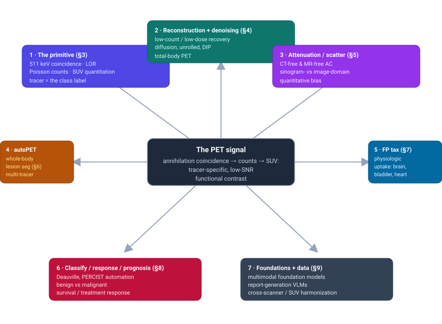
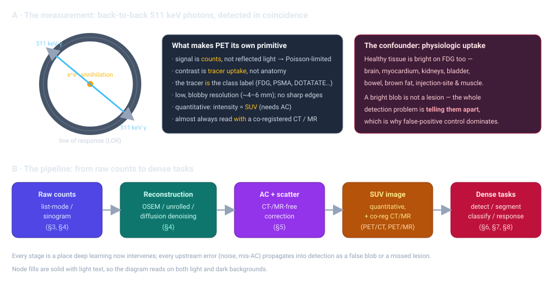
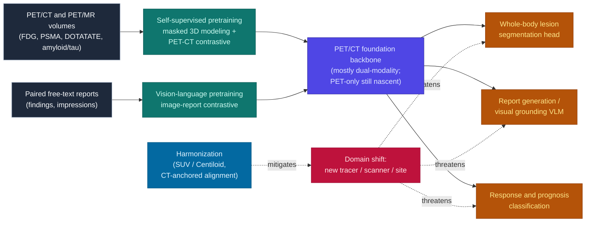

# Dense Object Detection & Classification — Recent Advances

*Compiled 2026-Jul-28 (America/Los_Angeles).*

Next installment in the running CV-updates log. Earlier entries on
`main`:
[Apr-30](../2026-Apr-30/2026-Apr-30_CV_updates.md),
[May-01](../2026-May-01/2026-May-01_CV_updates.md),
[May-02](../2026-May-02/2026-May-02_CV_updates.md),
[May-04](../2026-May-04/2026-May-04_CV_updates.md),
[May-05](../2026-May-05/2026-May-05_CV_updates.md),
[May-07](../2026-May-07/2026-May-07_CV_updates.md),
[May-08](../2026-May-08/2026-May-08_CV_updates.md),
[May-15](../2026-May-15/2026-May-15_CV_updates.md),
[May-16](../2026-May-16/2026-May-16_CV_updates.md),
[May-17](../2026-May-17/2026-May-17_CV_updates.md),
[Jun-09](../2026-Jun-09/2026-Jun-09_CV_updates.md),
[Jun-10](../2026-Jun-10/2026-Jun-10_CV_updates.md),
[Jun-12](../2026-Jun-12/2026-Jun-12_CV_updates.md),
[Jun-15](../2026-Jun-15/2026-Jun-15_CV_updates.md),
[Jun-16](../2026-Jun-16/2026-Jun-16_CV_updates.md),
[Jun-17](../2026-Jun-17/2026-Jun-17_CV_updates.md),
[Jun-19](../2026-Jun-19/2026-Jun-19_CV_updates.md),
[Jun-21](../2026-Jun-21/2026-Jun-21_CV_updates.md),
[Jun-22](../2026-Jun-22/2026-Jun-22_CV_updates.md),
[Jun-23](../2026-Jun-23/2026-Jun-23_CV_updates.md),
[Jun-24](../2026-Jun-24/2026-Jun-24_CV_updates.md),
[Jun-25](../2026-Jun-25/2026-Jun-25_CV_updates.md),
[Jun-27](../2026-Jun-27/2026-Jun-27_CV_updates.md),
[Jun-29](../2026-Jun-29/2026-Jun-29_CV_updates.md),
[Jun-30](../2026-Jun-30/2026-Jun-30_CV_updates.md),
[Jul-04](../2026-Jul-04/2026-Jul-04_CV_updates.md),
[Jul-07](../2026-Jul-07/2026-Jul-07_CV_updates.md),
[Jul-08](../2026-Jul-08/2026-Jul-08_CV_updates.md),
[Jul-10](../2026-Jul-10/2026-Jul-10_CV_updates.md),
[Jul-15](../2026-Jul-15/2026-Jul-15_CV_updates.md),
[Jul-17](../2026-Jul-17/2026-Jul-17_CV_updates.md),
[Jul-18](../2026-Jul-18/2026-Jul-18_CV_updates.md),
[Jul-21](../2026-Jul-21/2026-Jul-21_CV_updates.md),
[Jul-22](../2026-Jul-22/2026-Jul-22_CV_updates.md),
[Jul-24](../2026-Jul-24/2026-Jul-24_CV_updates.md),
[Jul-26](../2026-Jul-26/2026-Jul-26_CV_updates.md),
[Jul-27](../2026-Jul-27/2026-Jul-27_CV_updates.md).

## Table of contents

1. [Why this pass: PET / nuclear molecular imaging as its own primitive](#why)
2. [Topic map](#map)
3. [The primitive — what PET measures that CT and MRI can't](#primitive)
4. [Reconstruction & low-count denoising: the detection front-end](#recon)
5. [Attenuation & scatter correction: the CT-free problem](#ac)
6. [Whole-body lesion detection & segmentation: the autoPET era](#autopet)
7. [The false-positive tax: physiologic uptake](#fptax)
8. [Classification, response assessment & prognosis](#classify)
9. [Foundation models, VLMs & the domain-shift problem](#foundation)
10. [Through-line & open problems](#throughline)
11. [Sources](#sources)

---

## 1. Why this pass: PET / nuclear molecular imaging as its own primitive

This log has been walking through imaging modalities one at a time and asking
what *dense detection and classification* actually means inside each — X-ray
transmission, ultrasound, OCT, SAR, hyperspectral, endoscopic video,
polarization. The through-line is that a "modality" is not just a different
picture of the same world; it is a different measurement, with its own noise,
its own contrast mechanism, and therefore its own version of the detection
problem. This pass takes on **positron emission tomography (PET)** and the wider
family of **nuclear molecular imaging**, which pushes that idea about as far as
it goes: the pixel value is not reflected light, not tissue density, not echo
amplitude — it is a **count of radioactive decays**, and the contrast is not
anatomy but **where an injected molecule went**.

That single fact reorganizes everything downstream. A lesion on PET is a blob of
elevated tracer uptake sitting in a low-count, blurry image (spatial resolution
~4–6 mm), and the hardest part of "detecting" it is that **healthy organs are
bright too** — the brain, heart, kidneys, bladder, bowel and brown fat all take
up FDG (the workhorse glucose-analog tracer) avidly. The detection task is
therefore inseparable from a false-positive-suppression task, and both are
inseparable from the *upstream* image-formation choices — how few counts you can
reconstruct from, and whether you can correct for photon attenuation without a
CT. PET is also almost never read alone: it arrives as **PET/CT** or **PET/MRI**,
so it is natively a fusion problem, and its intensity is *quantitative* (the
standardized uptake value, SUV), so classification can lean on a physical number
in a way most modalities can't.

The result is a field where the "computer vision" spans the whole chain — from
deep-learning reconstruction of ultra-low-dose scans, through CT-free
attenuation correction, to whole-body multi-tracer lesion segmentation
(crystallized by the **autoPET** challenge series), to automated response scoring
(Deauville, PERCIST) and multimodal foundation models. This report walks that
chain.

*Scope note.* This is a computer-vision reading of a clinical field; it is not
medical advice, and the clinical-validation caveats in §8–§10 are load-bearing,
not decorative. Where possible, claims are linked to arXiv preprints, challenge
sites, or peer-reviewed DOIs in §11.

## 2. Topic map

The seven threads below all hang off one measurement — the annihilation
coincidence that PET counts — and the quantitative, tracer-dependent, low-SNR
image it produces.

## 3. The primitive — what PET measures that CT and MRI can't

Start with the measurement, because it dictates the vision problem.

A PET tracer is a biologically active molecule labeled with a
positron-emitting isotope (¹⁸F, ⁶⁸Ga, ⁸⁹Zr, ⁸²Rb…). When an emitted positron
annihilates with a nearby electron, it produces **two 511 keV photons flying
back-to-back**. A ring of detectors registers pairs of photons arriving in
**coincidence**, and each pair defines a **line of response (LOR)** through the
body. Modern scanners add **time-of-flight (TOF)** — timing the two arrivals
finely enough to localize the annihilation *along* the LOR — which sharpens the
reconstruction. The raw data is a set of counts (list-mode events, or a binned
sinogram), and an image is *reconstructed* from them, classically by
ordered-subset expectation maximization (OSEM).

Five properties make PET its own primitive, each with a direct consequence for
detection and classification:

- **The signal is counts, so the image is Poisson-limited.** Fewer injected
  becquerels or shorter scans mean fewer counts mean a noisier image — and the
  noise is signal-dependent, not additive Gaussian. This is why *denoising and
  reconstruction* (§4) are a first-class detection problem, not cosmetic
  post-processing: below some count level, small lesions simply are not
  separable from noise.
- **Contrast is functional, not anatomical.** PET shows *metabolism / receptor
  binding / blood flow*, not structure. A centimeter-scale tumor and the
  bladder can have identical brightness. This is why PET is read alongside a
  co-registered **CT or MRI** — the anatomical scan localizes and disambiguates
  what the functional scan lights up.
- **The tracer is (much of) the class label.** FDG asks "what is
  hypermetabolic?"; a PSMA ligand asks "what expresses prostate-specific
  membrane antigen?"; DOTATATE asks "what has somatostatin receptors?". Swapping
  tracers changes which objects are even visible and what a bright voxel *means*
  — a built-in domain-shift problem (§9) that has no analogue in RGB vision.
- **Resolution is low and blobby (~4–6 mm).** There are no sharp edges to lock a
  detector onto; lesions are smooth Gaussians. Sub-voxel and small-lesion
  detection are genuinely hard, and partial-volume effects bias the SUV of small
  objects downward.
- **Intensity is quantitative — the SUV.** After correcting for attenuation,
  scatter, decay and injected dose per body weight, a voxel's value is a
  physically meaningful **standardized uptake value**. Classification and
  response assessment (§8) can therefore use an absolute number (SUVmax,
  SUVpeak, metabolic tumor volume) rather than only learned appearance — but
  only if the upstream corrections (§5) are right, since any attenuation error
  propagates straight into a biased SUV.

Everything after this section is about deep learning intervening at one of those
stages — and about the fact that an error at any upstream stage (a denoising
hallucination, a mis-estimated attenuation map) shows up downstream as a false
lesion or a missed one.

## 4. Reconstruction & low-count denoising: the detection front-end

Because the PET image is reconstructed from a finite number of counts, the most
consequential "computer vision" often happens before anyone runs a detector: how
few counts (how low a dose, how short a scan) can you turn into an image in which
a small lesion is still separable from Poisson noise? Two forces make this urgent
— radiation-dose reduction, and patient throughput / motion on the very long
scans that **total-body PET** scanners (Siemens Vision Quadra, United Imaging
uEXPLORER) enable. The dominant modern answer is **generative denoising**, with
**diffusion / score-based models** now the front line.

- **Score-based and diffusion reconstruction.** A PET-specific line of
  *score-based generative models* adapts diffusion to the Poisson noise, high
  variance and wide dynamic range of PET data (*Score-Based Generative Models for
  PET Image Reconstruction*, [MELBA 2024](https://www.melba-journal.org/papers/2024:001.html) /
  arXiv [2308.14190](https://arxiv.org/abs/2308.14190)). Follow-ups push this to
  *fully-3D* real data: a *likelihood-scheduled* SGM using perpendicular
  pre-trained models to kill slice-to-slice inconsistency (arXiv
  [2412.04339](https://arxiv.org/abs/2412.04339)), and conditional diffusion
  sampling that trains on full-count images yet reconstructs 1%-count scans with
  lower variance in the bias–variance trade-off (arXiv
  [2412.04319](https://arxiv.org/abs/2412.04319)).
- **Dose-aware 3D diffusion.** *DDPET-3D* is a dose-aware 3D diffusion denoiser
  that uses fixed noise variables to enforce inter-slice consistency and
  conditions on dose level so a single model spans dose/count regimes, validated
  with a reader study on real low-dose data (arXiv
  [2311.04248](https://arxiv.org/abs/2311.04248), with a multi-institutional
  follow-up at [2405.12996](https://arxiv.org/abs/2405.12996)). *Text-guided*
  diffusion injects anatomical priors via prompts and beats U-Net and vanilla
  DDPM on paired 1/20-dose FDG at whole-body and organ level (arXiv
  [2502.21260](https://arxiv.org/abs/2502.21260)). Working in the **sinogram**
  domain, *RED* (Residual Estimation Diffusion) learns the residual between
  low- and full-dose sinograms (arXiv
  [2411.05354](https://arxiv.org/abs/2411.05354)).
- **Adversarial and transformer denoisers.** *Cycle-DCN* couples a noise
  predictor with two discriminators and a consistency network, reporting large
  PSNR/SSIM/NRMSE gains on a 1,224-patient Siemens Vision brain cohort while
  keeping edge preservation near full-dose (arXiv
  [2410.23628](https://arxiv.org/abs/2410.23628)). In the wavelet domain,
  *WaveNet* recovers standard-dose quality from ultra-low-dose scans by denoising
  decomposed frequency bands, beating a U-Net baseline across reduction factors
  ([EJNMMI 2024](https://doi.org/10.1007/s00259-024-06994-2)).
- **Direct / model-based deep reconstruction.** Rather than post-hoc denoising,
  a second family folds the physics into the network. *DeepPET* framed
  reconstruction as an encoder–decoder inverse-problem solver — lower RRMSE than
  OSEM/FBP and ~100× faster
  ([Med. Image Analysis 2019](https://www.sciencedirect.com/science/article/abs/pii/S1361841518305838)) —
  and the modern version is *deep unrolling*: a primal–dual network unrolled for
  **TOF list-mode** reconstruction, alternating list-mode-domain and image-domain
  updates (arXiv [2410.11148](https://arxiv.org/abs/2410.11148)). *Deep-image-prior*
  reconstruction with the forward model in the loss remains the standard
  unsupervised baseline (arXiv [2109.00768](https://arxiv.org/abs/2109.00768)),
  and *deep posterior sampling* adds uncertainty estimates to the reconstruction
  (arXiv [2306.04664](https://arxiv.org/abs/2306.04664)).
- **The task-based caveat.** Prettier images are not the goal — *detectable* ones
  are. Two threads keep denoising honest against the actual detection task:
  *LeqMod* (Lesion-Quantification-Consistent Modulation) is designed so low-count
  denoising does not distort lesion SUV (arXiv
  [2404.17994](https://arxiv.org/abs/2404.17994)), and task-based evaluations
  insert Monte-Carlo lesions into measured data before reconstruction to score a
  denoiser's effect on model-observer detectability across lesion size, contrast
  and count density (DIANA, [JNM 2025 abstract](https://jnm.snmjournals.org/content/66/supplement_1/251367)).
  This matters because a diffusion prior trained to produce "clean-looking" PET
  can smooth away a genuine small lesion or hallucinate a plausible-looking one —
  a failure mode with no cosmetic tell. Total-body ultra-low-dose research is now
  organized around shared data such as the **UDPET** challenge (standard- +
  simulated-low-dose total-body PET from 1,447 patients on Vision Quadra and
  uEXPLORER, [MICCAI 2025](https://doi.org/10.1007/978-3-032-05169-1_59)), and
  commercial DL denoisers (**SubtlePET**, Canon **AiCE**, United Imaging **HYPER
  DLR**) are already FDA-cleared and in clinical use
  ([AI for PET/SPECT enhancement review, JNM 2024](https://jnm.snmjournals.org/content/65/1/4)).

## 5. Attenuation & scatter correction: the CT-free problem

PET's quantitative claim — that a voxel value is an SUV — only holds if you
correct for the 511 keV photons absorbed and scattered on their way out of the
body. Conventionally the CT half of a PET/CT supplies the attenuation map. But
that breaks in two important settings: **PET/MRI**, where there is no CT and MR
intensities don't map cleanly to photon attenuation; and **standalone / total-body
PET-only** or dose-conscious protocols where you'd rather not add a CT dose. Deep
learning now attacks both, in the image domain (correcting a non-attenuation-
corrected image directly) and the sinogram/emission domain (estimating the
attenuation map from the emission data itself).

- **CT-free AC from emission data.** A Cycle-GAN can generate attenuation-
  corrected **total-body** PET directly from non-corrected images, validated on
  122 subjects with images closely resembling true AC PET
  ([European Radiology 2024](https://doi.org/10.1007/s00330-024-10647-1)).
  *POUR-Net* (Population-prior-aided Over-Under-Representation Network) generates
  attenuation maps from low-count data with a population prior (arXiv
  [2401.14285](https://arxiv.org/abs/2401.14285)), and a widely-cited
  domain-knowledge approach demonstrated generalizable CT-free joint AC + scatter
  correction across tracers and scanners
  ([Nature Communications 2022](https://www.nature.com/articles/s41467-022-33562-9)).
- **MR-free / PET-MRI AC.** For PET/MRI the standard move is to *synthesize a CT*
  from MR: *structure-guided MR-to-CT synthesis* aligns spatial and semantic
  structure to produce whole-body pseudo-CT for AC (arXiv
  [2411.17488](https://arxiv.org/abs/2411.17488)). Image-domain networks that map
  a non-corrected brain FDG image straight to a simultaneously attenuation- and
  scatter-corrected one also work well
  ([Medical Physics 2024](https://doi.org/10.1002/mp.16914)).
- **Scatter correction.** On the new **long-axial-FOV** scanners, scatter is a
  bigger fraction of counts. A U-Net can reproduce Monte-Carlo scatter to within
  ~6.4% for TOF long-AFOV PET, beating single-scatter simulation and improving
  lesion contrast recovery (arXiv [2501.01341](https://arxiv.org/abs/2501.01341)).
- **Why detection cares.** A mis-estimated attenuation map does not just add
  noise — it introduces a *spatially structured* bias in SUV, exactly the kind of
  systematic error that can turn normal tissue into an apparent hot spot or wash
  out a true lesion, and that can silently shift an SUV-thresholded classifier's
  decision. CT-free AC is thus not only a dose story; it is a
  false-positive/false-negative story.

*Parametric aside.* Beyond static SUV, **dynamic PET** fits tracer kinetics
per-voxel (e.g. Patlak Ki). Self-supervised networks now recover Patlak
parametric images from a 10-minute total-body scan comparable to the standard
40-minute acquisition (*SN-Patlak*, [EJNMMI 2024](https://doi.org/10.1007/s00259-024-07008-x)),
and DL denoising has been shown to stabilize kinetic metrics at reduced dose
([PMC 2025](https://pmc.ncbi.nlm.nih.gov/articles/PMC12222255/)) — extending the
"quantitative, therefore classifiable" property from a single number to a whole
kinetic map.

## 6. Whole-body lesion detection & segmentation: the autoPET era

If one thing organized dense detection in PET over the last three years it is the
**autoPET** challenge series (MICCAI). It turned whole-body tumor-lesion
segmentation from a scattering of single-site studies into a shared,
progressively harder benchmark, and its results are the clearest statement of
where the field actually is.

- **autoPET I (2022)** released the field's anchor dataset — **1,014 manually
  annotated whole-body FDG PET/CT studies** from Tübingen
  ([Nature Scientific Data 2022](https://www.nature.com/articles/s41597-022-01718-3)) —
  and established that **nnU-Net** was the method to beat.
- **autoPET II (2023)** turned to **domain generalization**: train on the 1,014
  FDG cases, test out-of-domain. The official Part-2 analysis
  ([JNM 2025](https://jnm.snmjournals.org/content/early/2025/12/30/jnumed.125.270260))
  found *no single clear winner* under bootstrap ranking and sharp degradation on
  out-of-domain **pediatric** and **PSMA** data — with the dominant failure modes
  being physiological-uptake false positives and missed small/low-uptake lesions.
- **autoPET III (2024, Marrakesh)** made the central problem explicit:
  **FDG→PSMA multi-tracer, multi-center generalization**. Training combined 1,014
  FDG (Tübingen) with **597 PSMA** studies (LMU Munich) — the largest public
  annotated PSMA PET/CT set to date — and tested on tracer–center combinations,
  some unseen. Across 27 algorithms from 17 teams, **almost everything was
  nnU-Net**, increasingly the *Residual Encoder* (ResEnc L/XL) presets;
  transformer entries rarely beat a well-tuned ResEnc nnU-Net. Top model-centric
  mean Dice landed around **0.66**. Challenge:
  [autopet-iii.grand-challenge.org](https://autopet-iii.grand-challenge.org) ·
  [autopet.org](https://www.autopet.org/autopetiii.html).
- **autoPET IV (2025)** moved to **interactive, human-in-the-loop** segmentation
  (simulated clicks) and **longitudinal** follow-up (a new >300-case database with
  baseline + follow-up where lesions may progress, regress, split, merge, vanish
  or newly appear) —
  [autopet-iv.grand-challenge.org](https://autopet-iv.grand-challenge.org).

Notable submissions and networks:

- **From FDG to PSMA: A Hitchhiker's Guide to Multitracer, Multicenter Lesion
  Segmentation** (autoPET III **1st place, model-centric**) — nnU-Net **ResEncL**
  with *misalignment data augmentation* (to absorb PET↔CT registration offsets)
  and *multi-modal CT/MR/PET pretraining* for anatomical priors (arXiv
  [2409.09478](https://arxiv.org/abs/2409.09478),
  [code](https://github.com/MIC-DKFZ/autopet-3-submission)). Other strong entries
  used **ResEnc-XL ensembles** (arXiv
  [2409.13779](https://arxiv.org/abs/2409.13779)), *sample-attention* reweighting
  of hard cases (arXiv [2409.07144](https://arxiv.org/abs/2409.07144)), and
  Generalized Dice Focal Loss (arXiv
  [2409.10151](https://arxiv.org/abs/2409.10151)).
- **Beyond nnU-Net.** *LM-UNet* brings a **Mamba** state-space encoder to
  dual-modality PET-CT lesion segmentation
  ([MICCAI 2024](https://papers.miccai.org/miccai-2024/paper/1851_paper.pdf)), and
  Swin-UNETR-style transformers with self-supervised pretraining have been used
  for [⁶⁸Ga]PSMA-11 lesion + organ segmentation
  ([PMC 2024](https://pmc.ncbi.nlm.nih.gov/articles/PMC10903052/)). The consistent
  lesson, though, is that architecture matters less than data, augmentation and
  anatomical priors on this task.
- **Interactive & longitudinal tooling.** *nnInteractive* provides general 3D
  promptable (click/scribble/box) segmentation now applied to PET/CT (arXiv
  [2503.08373](https://arxiv.org/abs/2503.08373)), and promptable longitudinal
  lesion segmentation targets autoPET IV's follow-up task
  (arXiv [2509.00613](https://arxiv.org/abs/2509.00613)).
- **The reported numbers are sobering.** A multicenter evaluation of *commercial*
  AI for FDG PET/CT lesion detection found per-lesion sensitivity spanning
  **44%–~100%** with false-positive VOIs from **~150 to ~1,400** across vendors
  ([Annals of Nuclear Medicine 2026](https://doi.org/10.1007/s12149-026-02199-9))
  — the sensitivity/false-positive trade-off, not mean Dice, is what stands
  between these models and clinical use. And a 2024 reality-check review asked
  directly whether automatic whole-body FDG tumor segmentation is a *clinical
  reality* yet — the answer being "not without a reader in the loop"
  ([PMC 2024](https://pmc.ncbi.nlm.nih.gov/articles/PMC11218718/)).

## 7. The false-positive tax: physiologic uptake

The reason autoPET is hard, and the reason commercial tools throw hundreds of
false-positive VOIs, is the defining confounder of the modality: **healthy tissue
is bright.** FDG concentrates physiologically in the brain, myocardium, kidneys,
bladder, bowel and brown fat; PSMA in the kidneys, liver, spleen,
salivary/submandibular glands and bladder. A bright blob is not a lesion, and the
entire detection problem reduces to telling avid disease apart from avid normal
anatomy. Two strategies dominate.

- **Anatomy priors / organ conditioning.** The most common autoPET-III trick was
  to feed **TotalSegmentator** organ masks into the network so it can *permit*
  uptake that would be a lesion elsewhere while *suppressing* uptake that is
  anatomically expected in, say, the bladder or kidneys. Anatomy-guided prompting
  with cross-modal PET↔CT self-alignment pushes this further to resolve metabolic
  ambiguity in whole-body PET/CT
  ([Medical Image Analysis 2026](https://www.sciencedirect.com/science/article/abs/pii/S1361841526000253)),
  and anatomy-aware ViT encoders have been used specifically to separate lymphoma
  from physiologic uptake in whole-body PET/CT
  (arXiv [2511.07047](https://arxiv.org/abs/2511.07047)).
- **Feature disentanglement.** *PET-Disentangler* (ISBI 2025 **Best Paper**) is
  the cleanest statement of the idea: a 3D encoder–decoder splits latent features
  into "healthy anatomy" vs "disease," with an adversarial critic forcing the
  healthy latent to match the distribution of healthy samples — markedly cutting
  false positives on the bladder and other high-uptake normal tissue (arXiv
  [2411.01758](https://arxiv.org/abs/2411.01758),
  [code](https://github.com/sfu-mial/PET-Disentangler)).

The through-line: in most modalities a detector learns what the *object* looks
like; in PET it must equally learn what *normal* looks like, because normal and
abnormal share the only feature the modality directly measures — uptake.

## 8. Classification, response assessment & prognosis

Detection is only the first half. Because PET intensity is quantitative and the
clinical questions are categorical — malignant or not? responding or not? how
long? — a large share of the field is *classification and outcome* work, and it
leans on the SUV as a physical feature in a way appearance-only vision can't.

- **Benign vs malignant.** The classic weakness of FDG-PET is *specificity*:
  inflammation is hypermetabolic too. DL fusion of SUV, handcrafted radiomics and
  CNN features is the standard remedy for pulmonary-nodule characterization
  ([review, Front. Oncol. 2024](https://www.frontiersin.org/journals/oncology/articles/10.3389/fonc.2024.1491762/full)),
  with dual-timepoint FDG models exploiting the fact that malignancy tends to
  *retain/increase* uptake between an early and delayed scan
  ([Sci. Rep. 2025](https://www.nature.com/articles/s41598-025-18677-5)). On the
  prostate side, a PSMA PET/CT pipeline that segments normal structures and then
  fuses PET+CT to classify foci as suspicious vs non-suspicious reached
  classification accuracy ~0.76 internal / ~0.80 external and beat single-modality
  CNNs ([PMC 2024](https://pmc.ncbi.nlm.nih.gov/articles/PMC11522269/)).
- **Lymphoma response — Deauville.** The 5-point Deauville score (lesion uptake vs
  liver/mediastinum references) is the response yardstick in FDG-avid lymphoma,
  and it has meaningful **interobserver variability**
  ([Clin. Nucl. Med. Open 2024](https://journals.lww.com/cnmo/fulltext/2024/12000/interobserver_reliability_of_the_5_point_deauville.4.aspx))
  — which is exactly the bar automation is measured against. The most prominent
  system is *LARS* (Lymphoma Artificial Reader System), a DL classifier for
  presence/absence of hypermetabolic disease trained on a large weakly-labelled
  set and framed as a rule-out / second-reader tool
  ([Lancet Digital Health 2024](https://www.thelancet.com/journals/landig/article/PIIS2589-7500(23)00203-0/fulltext)).
  Automated 5-class Deauville classifiers now report accuracy in the ~70–77% range
  (comparable to interobserver agreement), and delta-radiomics vs DL come out
  roughly even for simplified-Deauville / progression prediction
  ([LNCS 2025](https://link.springer.com/chapter/10.1007/978-3-031-95582-2_3)).
- **Solid-tumor response — PERCIST.** PERCIST demands consistent reference-region
  (liver/aorta) SUV placement and lesion tracking across timepoints — mechanical,
  error-prone work that tooling like RECOMIA's "digital PERCIST" module automates
  ([review, J. Nucl. Cardiol.-adjacent 2025](https://www.sciencedirect.com/science/article/pii/S0009926025003927)).
  A cautionary result: AI denoising of half-duration scans (SubtlePET) can shift
  EORTC/PERCIST response *category* if baseline and follow-up mix denoised and
  standard reconstructions
  ([EJNMMI Research 2024](https://doi.org/10.1186/s13550-024-01128-z)) — a concrete
  case of an upstream §4 choice propagating into a classification decision.
  Longitudinal response scoring itself goes back to weakly-supervised Siamese
  models like *OncoNet* (arXiv [2108.02016](https://arxiv.org/abs/2108.02016)).
- **Prognosis / survival.** DL-derived baseline biomarkers — total metabolic
  tumor volume (TMTV), max-lesion volume, lesion *dissemination* — are prognostic,
  and integrating nnU-Net-derived PET biomarkers with multi-omics stratifies DLBCL
  outcome across ~1,000 patients
  ([Cell Reports Medicine 2025](https://www.cell.com/cell-reports-medicine/fulltext/S2666-3791(25)00525-7)).
  For NSCLC, combined clinical + radiomic + DL + dosimetric models reach overall-
  survival AUC ~0.84
  ([J. Imaging Inf. Med. 2025](https://doi.org/10.1007/s10278-025-01828-5)), and
  robust multimodal PET/CT survival models such as *RobSurv* use vector-quantized
  representations to stay stable under missing/degraded modalities
  (arXiv [2505.02529](https://arxiv.org/abs/2505.02529)).
- **Neuro: amyloid & tau.** A distinct classification world sits in brain PET.
  Self-supervised subtyping of **tau-PET** spatial patterns recovered three AD
  subtypes at ~93% validation accuracy on ADNI
  ([Alzheimer's & Dementia 2025](https://pmc.ncbi.nlm.nih.gov/articles/PMC12736710/)),
  and multimodal fusion can *estimate* amyloid/tau positivity from more accessible
  data (AUROC ~0.79 amyloid / ~0.84 tau across 12,185 participants,
  [Nature Communications 2025](https://www.nature.com/articles/s41467-025-62590-4)) —
  a screening-style use of PET as the label rather than the input.

## 9. Foundation models, VLMs & the domain-shift problem

PET has two data surpluses that the rest of vision would recognize immediately as
foundation-model fuel: large archives of **PET/CT volumes** and the **free-text
reports** that accompany every one of them. The field is now converting both, and
in doing so is confronting the domain-shift problem that the tracer-as-label
property builds in from the start.

- **Foundation models are still emerging — and mostly dual-modality.** There is no
  dominant PET-only backbone with a headline pretraining scale yet; PET
  foundation work rides on PET/CT dual-modality pretraining or borrows the
  volumetric-CT template set by *Merlin*, the CT vision-language foundation model
  pretrained first to predict ICD codes from 3D CT and then via CT–report
  contrastive learning ([Nature 2026](https://www.nature.com/articles/s41586-026-10181-8)).
  Dedicated PET/CT foundation models — jointly encoding anatomy, metabolism and
  report text — have started to appear as preprints
  (e.g. a cross-modal PET/CT foundation model, arXiv
  [2503.02824](https://arxiv.org/abs/2503.02824); an open multi-center whole-body
  FDG PET/CT foundation model with a tumor-segmentation head, 2026 preprint), and
  surveys now treat PET explicitly within volumetric-imaging foundation models
  ([Electronics 2026](https://www.mdpi.com/2079-9292/15/6/1245)). The dominant
  PET-applicable recipes are **masked 3D image modeling** and **cross-modal
  contrastive alignment** (PET↔CT, image↔report).
- **Report generation is the fastest-moving VLM area.** New multi-center datasets
  anchor it: *PETRG-Lym* (824 PET/CT–report pairs, 746 lymphoma patients, 4
  centers) drives an end-to-end 3D dual-modality report-generation framework
  (arXiv [2511.20145](https://arxiv.org/abs/2511.20145)), and a Vietnamese PET/CT
  corpus pairs ~1.5M CT–PET images with 2,757 reports for multilingual generation
  (arXiv [2509.24739](https://arxiv.org/abs/2509.24739)). Related work does *visual
  grounding* of positive findings — weakly labelling report text to image
  locations to train a 3D VLM for interactive reads
  ([JNM 2025 abstract](https://jnm.snmjournals.org/content/66/supplement_1/252005.abstract)) —
  and LLMs fine-tuned on findings→impression can even mimic a specific reader's
  style ([J. Imaging Inf. Med. 2024](https://link.springer.com/article/10.1007/s10278-024-00985-3))
  or extract TNM stage from PET/CT reports
  ([Front. Digital Health 2026](https://www.frontiersin.org/journals/digital-health/articles/10.3389/fdgth.2026.1741973/full)).
- **Domain shift is the central unsolved problem.** The tracer-as-label property
  means a model trained on FDG can be near-blind on PSMA, and SUV is not
  comparable across scanners/vendors. autoPET III is the community's headline
  statement of the multi-tracer/multi-center gap (top DSC ~0.66; see §6). The most
  convincing fix so far is explicit **harmonization**: an anatomically-guided
  framework that harmonizes PET/MRI quantification to a PET/CT standard (CT-anchored
  anatomy learning, MRI→CT contrastive alignment, attention-guided residual PET
  correction) cut the amyloid Centiloid discrepancy from **23.6 → 4.1** across 420
  participants, 3 sites and 4 vendors — with zero-shot generalization to held-out
  tracers ([npj Digital Medicine 2026](https://www.nature.com/articles/s41746-026-02570-0),
  [medRxiv 2025](https://www.medrxiv.org/content/10.1101/2025.10.20.25338339v1)).
  CT-free AC via few-shot cross-domain adaptation
  ([npj Digital Medicine 2026](https://www.nature.com/articles/s41746-026-02760-w))
  and test-time adaptation for reconstruction attack the same problem from the
  front end.

## 10. Through-line & open problems

Read end to end, PET is the modality where **the whole vision stack is the
detection problem.** In RGB you can treat capture, denoising and detection as
separate concerns; in PET they are one pipeline, because the signal is scarce
(counts), the contrast is ambiguous (uptake, shared by disease and normal
anatomy), and the quantity you classify on (SUV) is only trustworthy if the
upstream corrections were right.

- **Detection is a false-positive problem first.** Mean Dice around 0.66 on
  autoPET III and per-lesion false positives in the hundreds for commercial tools
  say the field's bottleneck is not "find the bright spot" but "don't fire on the
  bladder." Anatomy priors and healthy/disease disentanglement are the current
  best answers, and both amount to learning *normal* as carefully as *abnormal*.
- **The tracer is a built-in domain shift.** No other modality changes what
  objects are visible every time you change the reagent. Multi-tracer
  generalization (autoPET III) and quantitative harmonization (Centiloid/SUV
  alignment) are the same problem seen from segmentation and classification sides;
  progress on one should transfer.
- **Generative front-ends are double-edged.** Diffusion denoising and CT-free AC
  make ultra-low-dose and PET-only imaging feasible, but a generative prior can
  smooth away a true small lesion or synthesize a plausible false one, and a
  mis-estimated attenuation map biases SUV in structured ways. Task-based
  evaluation (model-observer detectability, lesion-quantification consistency) —
  not PSNR — has to be the acceptance test.
- **Foundation models lag the rest of vision.** PET-native large-scale
  pretraining barely exists; most "PET foundation models" are PET/CT dual-modality
  and borrow CT-centric recipes. The report archives are the obvious untapped
  supervision, and report-generation VLMs are where that is being cashed in first.
- **The clinical reality check is load-bearing.** *PYLARIFY AI / aPROMISE*
  (PSMA quantification) is essentially the flagship FDA-cleared PET AI; fewer than
  ~30% of FDA-authorized radiology AI devices have undergone clinical testing and
  fewer still prospective testing
  ([reporting](https://radiologybusiness.com/topics/artificial-intelligence/less-30-fda-authorized-radiology-ai-devices-have-undergone-clinical-testing)),
  and a 2026 multicenter study flagged commercial FDG PET/CT lesion detectors for
  lacking real-world evidence. Second-reader / rule-out framings, not autonomy,
  are where the evidence actually points today.

The larger point for this series: PET makes explicit what every modality entry
has hinted at — "dense detection and classification" is defined by the physics of
the measurement, not by the abstract task. Counts, tracers and SUV give PET a
detection problem that looks nothing like RGB's, and the methods that work are the
ones that respect that.

## 11. Sources

*Link-verification note.* This report was compiled with automated search under an
egress policy that blocked direct fetches of arXiv / publisher pages, so
bibliographic details were drawn from search-result metadata and cross-checked
where possible. Peer-reviewed DOIs and challenge/leaderboard URLs are the most
reliable entries; a few **2026-dated arXiv identifiers could not be independently
opened** and should be confirmed at the source before formal citation. Nothing
here is medical advice.

**The primitive & reconstruction (§3–§4)**
- Score-Based Generative Models for PET Reconstruction — [MELBA 2024](https://www.melba-journal.org/papers/2024:001.html) / arXiv [2308.14190](https://arxiv.org/abs/2308.14190)
- Likelihood-scheduled fully-3D SGM — arXiv [2412.04339](https://arxiv.org/abs/2412.04339); conditional-diffusion 3D — arXiv [2412.04319](https://arxiv.org/abs/2412.04319)
- DDPET-3D — arXiv [2311.04248](https://arxiv.org/abs/2311.04248), [2405.12996](https://arxiv.org/abs/2405.12996)
- Text-guided diffusion denoising — arXiv [2502.21260](https://arxiv.org/abs/2502.21260); RED sinogram diffusion — arXiv [2411.05354](https://arxiv.org/abs/2411.05354)
- Cycle-DCN — arXiv [2410.23628](https://arxiv.org/abs/2410.23628); WaveNet — [EJNMMI 2024](https://doi.org/10.1007/s00259-024-06994-2)
- DeepPET — [Med. Image Anal. 2019](https://www.sciencedirect.com/science/article/abs/pii/S1361841518305838); deep unrolled primal–dual list-mode — arXiv [2410.11148](https://arxiv.org/abs/2410.11148); DIP direct recon — arXiv [2109.00768](https://arxiv.org/abs/2109.00768); deep posterior sampling — arXiv [2306.04664](https://arxiv.org/abs/2306.04664)
- LeqMod (lesion-quantification-consistent) — arXiv [2404.17994](https://arxiv.org/abs/2404.17994); DIANA task-based detectability — [JNM 2025](https://jnm.snmjournals.org/content/66/supplement_1/251367)
- UDPET ultra-low-dose challenge — [MICCAI 2025](https://doi.org/10.1007/978-3-032-05169-1_59); FDA-cleared PET denoisers review — [JNM 2024](https://jnm.snmjournals.org/content/65/1/4)

**Attenuation / scatter / parametric (§5)**
- CT-free AC total-body PET (Cycle-GAN) — [European Radiology 2024](https://doi.org/10.1007/s00330-024-10647-1); POUR-Net — arXiv [2401.14285](https://arxiv.org/abs/2401.14285); generalizable CT-free AC+SC — [Nat. Commun. 2022](https://www.nature.com/articles/s41467-022-33562-9)
- Structure-guided MR-to-CT synthesis — arXiv [2411.17488](https://arxiv.org/abs/2411.17488); image-domain AC+SC brain FDG — [Med. Phys. 2024](https://doi.org/10.1002/mp.16914)
- DL scatter correction on long-AFOV — arXiv [2501.01341](https://arxiv.org/abs/2501.01341)
- SN-Patlak self-supervised parametric — [EJNMMI 2024](https://doi.org/10.1007/s00259-024-07008-x); DL denoising × kinetics — [PMC 2025](https://pmc.ncbi.nlm.nih.gov/articles/PMC12222255/)

**Lesion detection / autoPET / FP suppression (§6–§7)**
- autoPET FDG dataset — [Nature Sci. Data 2022](https://www.nature.com/articles/s41597-022-01718-3)
- autoPET II domain generalization — [JNM 2025](https://jnm.snmjournals.org/content/early/2025/12/30/jnumed.125.270260)
- autoPET III — [grand-challenge](https://autopet-iii.grand-challenge.org) · [autopet.org](https://www.autopet.org/autopetiii.html); autoPET IV — [grand-challenge](https://autopet-iv.grand-challenge.org)
- "Hitchhiker's Guide" (1st place model-centric) — arXiv [2409.09478](https://arxiv.org/abs/2409.09478), [code](https://github.com/MIC-DKFZ/autopet-3-submission); ResEnc-XL ensemble — arXiv [2409.13779](https://arxiv.org/abs/2409.13779); sample-attention — arXiv [2409.07144](https://arxiv.org/abs/2409.07144); GDFL — arXiv [2409.10151](https://arxiv.org/abs/2409.10151)
- LM-UNet (Mamba PET-CT) — [MICCAI 2024](https://papers.miccai.org/miccai-2024/paper/1851_paper.pdf); Swin-UNETR + SSL PSMA — [PMC 2024](https://pmc.ncbi.nlm.nih.gov/articles/PMC10903052/)
- nnInteractive promptable 3D — arXiv [2503.08373](https://arxiv.org/abs/2503.08373); promptable longitudinal — arXiv [2509.00613](https://arxiv.org/abs/2509.00613)
- Multicenter commercial FDG detector evaluation — [Ann. Nucl. Med. 2026](https://doi.org/10.1007/s12149-026-02199-9); "clinical reality?" review — [PMC 2024](https://pmc.ncbi.nlm.nih.gov/articles/PMC11218718/)
- PET-Disentangler (ISBI 2025 best paper) — arXiv [2411.01758](https://arxiv.org/abs/2411.01758), [code](https://github.com/sfu-mial/PET-Disentangler); anatomy-guided cross-modal alignment — [Med. Image Anal. 2026](https://www.sciencedirect.com/science/article/abs/pii/S1361841526000253); anatomy-aware lymphoma — arXiv [2511.07047](https://arxiv.org/abs/2511.07047)

**Classification / response / prognosis (§8)**
- Pulmonary-nodule PET radiomics+DL review — [Front. Oncol. 2024](https://www.frontiersin.org/journals/oncology/articles/10.3389/fonc.2024.1491762/full); dual-phase FDG malignancy — [Sci. Rep. 2025](https://www.nature.com/articles/s41598-025-18677-5); PSMA uptake seg+classify — [PMC 2024](https://pmc.ncbi.nlm.nih.gov/articles/PMC11522269/)
- Deauville interobserver reliability — [Clin. Nucl. Med. Open 2024](https://journals.lww.com/cnmo/fulltext/2024/12000/interobserver_reliability_of_the_5_point_deauville.4.aspx); LARS — [Lancet Digital Health 2024](https://www.thelancet.com/journals/landig/article/PIIS2589-7500(23)00203-0/fulltext); delta-radiomics vs DL — [LNCS 2025](https://link.springer.com/chapter/10.1007/978-3-031-95582-2_3)
- PERCIST / oncological-PET AI review — [ScienceDirect 2025](https://www.sciencedirect.com/science/article/pii/S0009926025003927); denoising × PERCIST category — [EJNMMI Res. 2024](https://doi.org/10.1186/s13550-024-01128-z); OncoNet — arXiv [2108.02016](https://arxiv.org/abs/2108.02016)
- DLBCL PET+multi-omics prognosis — [Cell Rep. Med. 2025](https://www.cell.com/cell-reports-medicine/fulltext/S2666-3791(25)00525-7); NSCLC OS model — [J. Imaging Inf. Med. 2025](https://doi.org/10.1007/s10278-025-01828-5); RobSurv — arXiv [2505.02529](https://arxiv.org/abs/2505.02529)
- Tau-PET SSL subtyping — [Alz. & Dementia 2025](https://pmc.ncbi.nlm.nih.gov/articles/PMC12736710/); amyloid/tau status estimation — [Nat. Commun. 2025](https://www.nature.com/articles/s41467-025-62590-4)

**Foundation models / VLMs / domain shift / clinical (§9–§10)**
- Merlin CT VL foundation model — [Nature 2026](https://www.nature.com/articles/s41586-026-10181-8); cross-modal PET/CT FM — arXiv [2503.02824](https://arxiv.org/abs/2503.02824); volumetric-imaging FM survey — [Electronics 2026](https://www.mdpi.com/2079-9292/15/6/1245)
- PETRG-Lym report generation — arXiv [2511.20145](https://arxiv.org/abs/2511.20145); Vietnamese PET/CT VLM corpus — arXiv [2509.24739](https://arxiv.org/abs/2509.24739); visual grounding of findings — [JNM 2025](https://jnm.snmjournals.org/content/66/supplement_1/252005.abstract); personalized impression LLMs — [J. Imaging Inf. Med. 2024](https://link.springer.com/article/10.1007/s10278-024-00985-3); TNM staging from reports — [Front. Digital Health 2026](https://www.frontiersin.org/journals/digital-health/articles/10.3389/fdgth.2026.1741973/full)
- Cross-platform multi-tracer harmonization — [npj Digital Medicine 2026](https://www.nature.com/articles/s41746-026-02570-0) / [medRxiv 2025](https://www.medrxiv.org/content/10.1101/2025.10.20.25338339v1); few-shot CT-free AC/SC — [npj Digital Medicine 2026](https://www.nature.com/articles/s41746-026-02760-w)
- Radiology-AI clinical-testing gap — [reporting 2025](https://radiologybusiness.com/topics/artificial-intelligence/less-30-fda-authorized-radiology-ai-devices-have-undergone-clinical-testing)

---

*Compiled 2026-Jul-28 (America/Los_Angeles). Diagrams are original, rendered as
theme-robust standalone SVG (solid-fill nodes with light text, transparent
canvas) and one inline Mermaid flowchart, so they read on both light and dark
backgrounds with no external assets. Part of the running
[CV-updates log](../).*

