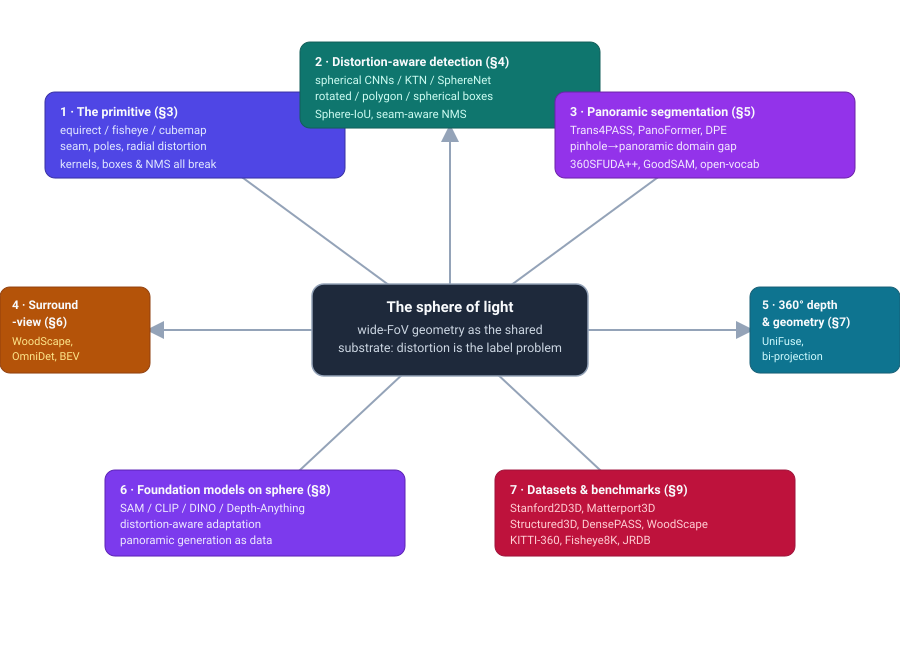
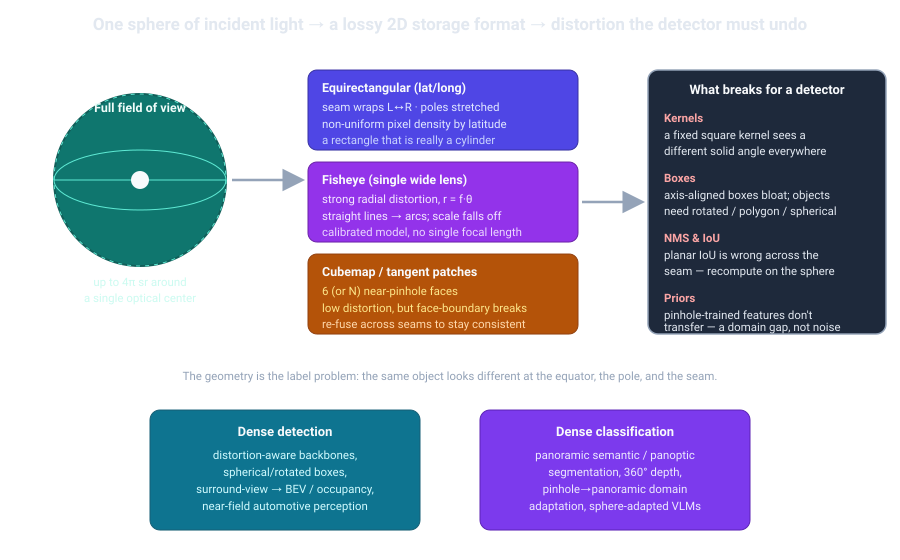
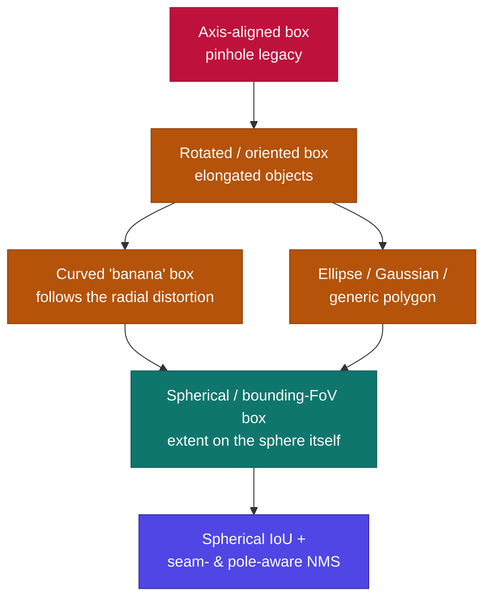

# Dense Object Detection & Classification — Recent Advances

*Compiled 2026-Jul-29 (America/Los_Angeles).*

Next installment in the running CV-updates log. Earlier entries on
`main`:
[Apr-30](../2026-Apr-30/2026-Apr-30_CV_updates.md),
[May-01](../2026-May-01/2026-May-01_CV_updates.md),
[May-02](../2026-May-02/2026-May-02_CV_updates.md),
[May-04](../2026-May-04/2026-May-04_CV_updates.md),
[May-05](../2026-May-05/2026-May-05_CV_updates.md),
[May-07](../2026-May-07/2026-May-07_CV_updates.md),
[May-08](../2026-May-08/2026-May-08_CV_updates.md),
[May-15](../2026-May-15/2026-May-15_CV_updates.md),
[May-16](../2026-May-16/2026-May-16_CV_updates.md),
[May-17](../2026-May-17/2026-May-17_CV_updates.md),
[Jun-09](../2026-Jun-09/2026-Jun-09_CV_updates.md),
[Jun-10](../2026-Jun-10/2026-Jun-10_CV_updates.md),
[Jun-12](../2026-Jun-12/2026-Jun-12_CV_updates.md),
[Jun-15](../2026-Jun-15/2026-Jun-15_CV_updates.md),
[Jun-16](../2026-Jun-16/2026-Jun-16_CV_updates.md),
[Jun-17](../2026-Jun-17/2026-Jun-17_CV_updates.md),
[Jun-19](../2026-Jun-19/2026-Jun-19_CV_updates.md),
[Jun-21](../2026-Jun-21/2026-Jun-21_CV_updates.md),
[Jun-22](../2026-Jun-22/2026-Jun-22_CV_updates.md),
[Jun-23](../2026-Jun-23/2026-Jun-23_CV_updates.md),
[Jun-24](../2026-Jun-24/2026-Jun-24_CV_updates.md),
[Jun-25](../2026-Jun-25/2026-Jun-25_CV_updates.md),
[Jun-27](../2026-Jun-27/2026-Jun-27_CV_updates.md),
[Jun-29](../2026-Jun-29/2026-Jun-29_CV_updates.md),
[Jun-30](../2026-Jun-30/2026-Jun-30_CV_updates.md),
[Jul-04](../2026-Jul-04/2026-Jul-04_CV_updates.md),
[Jul-07](../2026-Jul-07/2026-Jul-07_CV_updates.md),
[Jul-08](../2026-Jul-08/2026-Jul-08_CV_updates.md),
[Jul-10](../2026-Jul-10/2026-Jul-10_CV_updates.md),
[Jul-15](../2026-Jul-15/2026-Jul-15_CV_updates.md),
[Jul-17](../2026-Jul-17/2026-Jul-17_CV_updates.md),
[Jul-18](../2026-Jul-18/2026-Jul-18_CV_updates.md),
[Jul-21](../2026-Jul-21/2026-Jul-21_CV_updates.md),
[Jul-22](../2026-Jul-22/2026-Jul-22_CV_updates.md),
[Jul-24](../2026-Jul-24/2026-Jul-24_CV_updates.md),
[Jul-26](../2026-Jul-26/2026-Jul-26_CV_updates.md),
[Jul-27](../2026-Jul-27/2026-Jul-27_CV_updates.md).

## Table of contents

1. [Why this pass: the omnidirectional camera as its own primitive](#why)
2. [Topic map](#map)
3. [The primitive — what a full sphere of light changes](#primitive)
4. [Distortion-aware detection & the box-representation problem](#detection)
5. [Panoramic segmentation & the pinhole→panoramic domain gap](#segmentation)
6. [Automotive surround-view fisheye: near-field, multitask & BEV](#surround)
7. [360° depth & geometry](#depth)
8. [Foundation models on the sphere (and generation as data)](#foundation)
9. [Datasets & benchmarks](#datasets)
10. [Through-line & open problems](#throughline)
11. [Sources](#sources)

---

## 1. Why this pass: the omnidirectional camera as its own primitive

The recent run of passes has worked **sensor / imaging primitives on their own
terms** — LiDAR ([Jun-27](../2026-Jun-27/2026-Jun-27_CV_updates.md)), the event
camera ([Jun-29](../2026-Jun-29/2026-Jun-29_CV_updates.md)), thermal infrared
([Jun-30](../2026-Jun-30/2026-Jun-30_CV_updates.md)), automotive radar
([Jul-04](../2026-Jul-04/2026-Jul-04_CV_updates.md)), then a march through
scientific and medical modalities: radiology/pathology
([Jul-07](../2026-Jul-07/2026-Jul-07_CV_updates.md)), subsea sonar
([Jul-08](../2026-Jul-08/2026-Jul-08_CV_updates.md)), astronomical surveys
([Jul-10](../2026-Jul-10/2026-Jul-10_CV_updates.md)), X-ray transmission
([Jul-15](../2026-Jul-15/2026-Jul-15_CV_updates.md)), microscopy
([Jul-17](../2026-Jul-17/2026-Jul-17_CV_updates.md)), ultrasound
([Jul-18](../2026-Jul-18/2026-Jul-18_CV_updates.md)), hyperspectral
([Jul-21](../2026-Jul-21/2026-Jul-21_CV_updates.md)), SAR
([Jul-22](../2026-Jul-22/2026-Jul-22_CV_updates.md)), optical coherence
tomography ([Jul-24](../2026-Jul-24/2026-Jul-24_CV_updates.md)), in-vivo
endoscopic video ([Jul-26](../2026-Jul-26/2026-Jul-26_CV_updates.md)) and
polarization imaging ([Jul-27](../2026-Jul-27/2026-Jul-27_CV_updates.md)).

Almost every one of those primitives changed *what the pixels mean* — a new
part of the spectrum, a new physical quantity, a new noise process.
**Omnidirectional imaging** — fisheye, catadioptric, and 360°/panoramic capture
— is different: the pixels are still ordinary RGB radiance. What changes is
**the geometry of how the world is sampled onto the sensor**. A pinhole camera
maps a small cone of the world onto a plane and the perspective model holds:
straight lines stay straight, an object's apparent size and shape barely depend
on where it lands in the frame, and a square convolution kernel sees roughly the
same solid angle everywhere. A fisheye or 360° camera folds a hemisphere — or
the entire sphere — onto that same finite array. The perspective model breaks,
and it breaks *spatially non-uniformly*: distortion, apparent scale, and even
object topology now depend on **where** in the image a thing appears.

That makes omnidirectional capture a genuine dense-detection primitive rather
than "regular vision with a weird lens." A detector trained on pinhole data does
not merely lose a little accuracy at the edges; it faces a **domain gap** that
is geometric, not photometric — and the last three years of work is essentially
a catalogue of ways to put the sphere back into the model, from
distortion-adaptive convolutions and spherical bounding boxes to
foundation-model adapters that carry the sphere's geometry as a positional
prior. This is the modality the general detection-survey pass
([Jun-15 §10](../2026-Jun-15/2026-Jun-15_CV_updates.md)) could only touch in a
paragraph; here it gets the full treatment.

Two practical forces keep the primitive alive and funded: **one 190°+ fisheye
replaces several pinhole cameras** (cheap 360° coverage for cars, robots, and
surveillance), and **immersive/VR content is natively panoramic**. Both want
dense detection and dense classification directly in the omnidirectional frame,
without the information loss and blind-spot seams of rectifying to perspective
first.

## 2. Topic map

The seven threads of this pass and how they hang off the shared geometric
substrate:

*(If the SVG does not render in your viewer, it is at
[`assets/topic-map.svg`](assets/topic-map.svg). The same file renders on GitHub's
Markdown view.)*

## 3. The primitive — what a full sphere of light changes

An omnidirectional camera captures light over a very wide solid angle (a fisheye
hemisphere, ~180–200°; a dual-fisheye or catadioptric rig, the full 4π sphere)
and must store it in a flat 2D array. **There is no distortion-free way to do
this** — you cannot flatten a sphere onto a plane without stretching it, the same
theorem that plagues world maps. Every omnidirectional pipeline therefore begins
with a *choice of projection*, and each choice trades one problem for another:

- **Equirectangular (ERP)** — the "unrolled cylinder": longitude → *x*, latitude
  → *y*. Simple, seamless to store, and the default for 360° video. But it
  **stretches the poles grotesquely** (a point at the top of the image becomes a
  whole row) and its **left and right edges are the same meridian** — a person
  can straddle the seam and appear as two half-people at opposite ends of the
  frame. Pixel density per unit solid angle falls off as cos(latitude).
- **Fisheye** — a single wide lens with strong, calibrated **radial distortion**
  (image radius grows roughly linearly with incident angle, *r ≈ f·θ*, not with
  tan θ). Straight lines bow into arcs; an object's apparent shape and scale
  change as it moves from the optical center toward the periphery. There is no
  single focal length — you carry a calibration model.
- **Cubemap / tangent patches** — project the sphere onto the six faces of a cube
  (or many small tangent planes). Each face is nearly pinhole, so ordinary CNNs
  work *within* a face — but objects crossing **face boundaries** are split, and
  features must be re-fused across seams to stay consistent.

The consequences for a detector are structural, and they recur in every section
below:

1. **Kernels sample unequal solid angles.** A fixed 3×3 kernel covers a tiny
   patch of the world near the equator and a huge one near a pole. Distortion-
   aware and spherical convolutions exist precisely to make the receptive field
   *geometrically* constant instead of *pixel* constant.
2. **Axis-aligned boxes are the wrong shape.** A rectangle that tightly encloses
   a car at the image center is loose and skewed when the same car sits at the
   fisheye periphery, where its silhouette bends into a "banana." The field has
   moved to rotated, elliptical, polygonal, and **spherical / field-of-view**
   boxes.
3. **IoU and NMS must live on the sphere.** Planar IoU is simply wrong across the
   seam and near the poles; two boxes that overlap on the sphere can look
   disjoint in ERP pixels, and vice-versa. Correct suppression needs a spherical
   overlap criterion.
4. **Pinhole priors do not transfer.** A backbone pretrained on ImageNet/COCO
   perspective images encodes an implicit perspective prior. Dropped onto
   panoramas it suffers a *geometric* domain gap — the central theme of §5.

The rest of this pass follows those consequences into the two dense tasks —
**detection** (§4, §6) and **dense classification / pixel labelling** (§5, §7) —
and then into the foundation-model era (§8), where the open question is whether
the sphere is best handled by *engineering* distortion away or by *teaching* a
large pretrained model the geometry directly.

## 4. Distortion-aware detection & the box-representation problem

Object detection on the sphere has advanced along two coupled fronts: **how you
convolve** (make features distortion-consistent) and **how you describe an
object's extent** (a box that survives the projection).

**Distortion-aware / spherical backbones.** The foundational moves predate this
window but anchor everything after: **Spherical CNNs** (Cohen et al., ICLR 2018)
made convolution rotation-equivariant on SO(3); **SphereNet** (ECCV 2018) kept a
standard CNN but *warped the sampling grid* of each kernel according to the
spherical projection so that filters learned on perspective images transfer to
ERP; and the **Kernel Transformer Network / KTN** (CVPR 2019) learned to
transform a source (pinhole) kernel into position-dependent kernels across the
panorama, avoiding retraining. **SpherePHD** (CVPR 2019) instead tessellated the sphere as
an icosahedral polyhedron for near-uniform sampling, sidestepping ERP pole
oversampling entirely. The current generation folds the same idea into
transformers: **DarSwin** (ICCV 2023) partitions the image into *radial (polar)*
patches and drives token sampling and angular positional encoding from the
lens's projection curve, generalising zero-shot to *unseen* distortion levels;
**DarSwin-Unet** (2024) extends it to dense per-pixel prediction. The common
thread is convolutions/attention parameterised by the *calibrated* lens model
rather than a generic ERP assumption (see also the calibrated-convolution and
spherical-domain lines flagged in
[Jun-15 §10](../2026-Jun-15/2026-Jun-15_CV_updates.md)).

**The box-representation ladder.** This is where fisheye detection has visibly
matured, because the periphery of a wide lens turns compact objects into curved,
oriented shapes that an upright rectangle describes badly:

- **Axis-aligned box** — the pinhole legacy; loose and error-prone off-center.
- **Rotated / oriented box** — recovers most of the loss for elongated objects.
- **Curved ("banana") box** — Rashed et al.'s *Generalized Object Detection on
  Fisheye* (2020) showed a curved box that follows the periphery beats the
  standard box by ~+3 mAP and the oriented box by ~+1.6 mAP on WoodScape,
  formalising the insight that fisheye silhouettes bend along the radius.
- **Ellipse / Gaussian & generic polygon** — *FisheyeDetNet* (2024) compares
  standard, oriented, ellipse and 24-point-polygon representations head-to-head on
  a WoodScape-style surround-view set, with the **polygon representation winning
  at 49.5% mAP**; *RAPiD* (CVPRW 2020) is still the reference for *overhead*
  fisheye, directly regressing box orientation with a periodic angle loss; and
  the 2025 *"Let's Go Bananas"* work (Sensors) pushes distortion-aware
  curved/polar-arc boxes further using vanishing-point constraints.
- **Spherical / field-of-view box** — the cleanest formulation: describe an
  object by its extent *on the sphere*, not in stored pixels. *360-Indoor* (WACV
  2020) introduced bounding-FoV detection on 37 indoor classes, and **PANDORA**
  (ECCV 2022) added a **Rotated Bounding FoV (RBFoV)** — (θ, φ, α, β, γ) — that
  captures both position and in-plane orientation on the sphere, with matching
  spherical IoU. This is the representation that makes seam- and pole-correct NMS
  natural.

**Sphere-correct IoU & NMS.** Once boxes live on the sphere, the overlap
criterion that drives label assignment and NMS has to as well — and this is a
surprisingly deep sub-literature. *Spherical Criteria* (AAAI 2020) introduced the
FoV box B=(θ, φ, fov_x, fov_y) with an approximate **spherical IoU**; *Unbiased
IoU* (AAAI 2022) showed that approximation is biased and computed exact
spherical-rectangle intersection areas; *FoV-IoU* (TIP 2023) gave a
great-circle-based IoU usable for training, inference and evaluation, paired with
a **360°-rotation augmentation** that removes projection bias; *Sph2Pob* (IJCAI
2023) mapped spherical boxes to planar oriented boxes for a *differentiable*
IoU that reuses mature rotated-box detector machinery; and *GLDL* (CVPR 2023)
swapped ℓ-norm box regression — inconsistent with the non-differentiable
spherical IoU — for a Gaussian label-distribution loss. Together these make
seam- and pole-correct suppression a solved-enough primitive that detectors can
build on.

The representation lineage, and how the choice propagates into IoU/NMS:

**Where it's applied.** The two big detection arenas are **roadside/surveillance
fisheye** (the *FishEye8K* benchmark — 8,000 traffic-camera images, 157K boxes,
5 road classes — with the 2023 AI-City challenge popularising YOLO-family
baselines adapted to fisheye) and **vehicle-mounted surround-view** (§6). The
FishEye8K-driven **AI City Challenge Track 4** has become the annual proving
ground: 2024–2025 winners lean on Co-DETR/YOLO ensembles, open-vocabulary
pseudo-labelling, and low-light enhancement (a 2025 unified pipeline reports
F1 ≈ 0.64), and edge-deployable variants like a fisheye-specific **D-FINE**
(ICCVW 2025) target real-time inference. A recurring lesson across all of it:
rectifying to perspective before detecting throws away the wide FoV's whole
point and creates blind seams, so the field increasingly detects *natively* in
the distorted frame — even remapping overhead fisheye to a hemispherical
equirectangular form and using self-similar tile tokenization to recover tiny
persons (Panasonic/Chubu, 2025).

## 5. Panoramic segmentation & the pinhole→panoramic domain gap

Dense pixel labelling is where the geometric domain gap is most sharply posed,
because per-pixel labels are exquisitely sensitive to distortion, and because
there is **lots of labelled pinhole data (Cityscapes) and very little labelled
panoramic data**. The dominant benchmark is therefore an *adaptation* one:
train on pinhole Cityscapes, test on real panoramas (**DensePASS**), optionally
with synthetic panoramas (**SynPASS**) in between; **Stanford2D3D-Pano** is the
indoor analogue.

**Distortion-aware architectures.** **Trans4PASS** (CVPR 2022) introduced the
**Deformable Patch Embedding (DPE)** and a **Deformable MLP** so the transformer
can *learn per-patch offsets that follow ERP distortion*; DPE alone added ~+9.4
mIoU on DensePASS over fixed patch embedding, and the full system reached ~56.4%
mIoU. **Trans4PASS+** (T-PAMI 2024) upgraded the token mixing (DMLPv2) and
established the SynPASS synthetic→real benchmark. **PanoFormer** (ECCV 2022)
tokenized **tangent patches on the sphere** and added a learnable token-flow in
attention; **SGAT4PASS** (IJCAI 2023) went further to a **spherical
geometry-aware** projection and spherical deformable patch embedding, improving
robustness under 3D rotation on Stanford2D3D. At the far end, **HEAL-SWIN**
(CVPR 2024) drops ERP entirely and runs a SWIN transformer natively on the
**HEALPix spherical grid**, so there is no distortion to correct.

**Closing the pinhole→panoramic gap.** A dense cluster of adaptation methods:

- **DATR** (ICCV 2023) restricts attention to the less-distorted local
  neighborhood and cuts parameters ~80% while improving synthetic→real mIoU by
  >8%.
- **DPPASS** (CVPR 2023) trains a **dual path over ERP + tangent projection**,
  dropping the tangent path at inference for zero added cost.
- **360SFUDA / 360SFUDA++** (CVPR 2024 + extension) do **source-free** adaptation
  — only a pinhole-pretrained model plus *unlabeled* panoramas — via a reliable
  panoramic-prototype module and cross-projection dual attention.
- **DTA4PASS** (Information Fusion 2025) adds **multi-source** adaptation (real
  pinhole + synthetic panoramic → real panoramic), closing distortion and texture
  gaps jointly.
- **Open Panoramic Segmentation / OPS** (ECCV 2024) opens the *vocabulary*:
  train open-vocab on FoV-restricted pinhole, evaluate zero-shot on panoramas,
  using a Deformable Adapter Network and **Random Equirectangular Projection**
  augmentation.
- **OASS / UnmaskFormer + BlendPASS** (ECCV 2024) fold **occlusion (amodal)**
  into the problem, reporting ~48.1% mIoU on DensePASS and a new panoptic-style
  BlendPASS benchmark.

**SAM as a teacher.** The most 2024-flavoured thread uses a foundation segmenter
to *supply* the labels the panoramic domain lacks. **GoodSAM / GoodSAM++** (CVPR
2024 + extension) use SAM as a teacher with a **Distortion-Aware Rectification**
module and multi-level knowledge distillation into a compact panoramic student
(+3.75 mIoU over prior DA). **OmniSAM** (ICCV 2025) adapts **SAM2** directly —
treating the panorama as an overlapping patch sequence handled by SAM2's memory,
LoRA-tuning a tiny (<3 MB) adapter, with FoV-based prototype adaptation —
reporting large jumps (e.g. CS13→DP13 up ~+6.6 mIoU; a synthetic→real setting up
~+10.2). This is the seam where §5 meets §8.

**Beyond flat labels.** **360BEV** (WACV 2024) maps a single 360° panorama (plus
depth) into a top-down **bird's-eye-view semantic map**, +7–10 mIoU over prior
mapping, and **Panoramic Panoptic Segmentation** (T-ITS 2023) delivers full 360°
panoptic parsing with contrastive pretraining to transfer pinhole knowledge.

## 6. Automotive surround-view fisheye: near-field, multitask & BEV

Cars are the primitive's largest commercial deployment: four ~190° fisheye
cameras give full 360° near-field coverage for parking, traffic-jam assist, and
low-speed maneuvering, where sub-10-cm precision and heavily-distorted,
partially-visible objects are the norm. The reference survey is Kumar et al.'s
*Surround-View Fisheye Camera Perception for Automated Driving* (T-ITS 2023).

**Datasets.** **WoodScape** (ICCV 2019) is still the field standard — 4× 190°
fisheye, 9 tasks (semantic seg, depth, 3D boxes, soiling, …), and a detection
challenge that drew ~1,500 submissions. **SynWoodScape** (RA-L 2022) is its
CARLA-synthetic twin, adding the dense ground truth real capture cannot easily
provide (optical flow, per-pixel depth, all four cameras annotated
simultaneously for unified BEV work). **KITTI-360** (T-PAMI 2022) contributes
two 180° fisheye views with dense 2D/3D semantics over a 73.7 km drive, and the
**Fisheye Parking Dataset / FPNet** (T-IV 2022) adds 400k+ parking-lot fisheye
frames with 2D/3D/BEV/depth labels.

**Multitask networks.** **OmniDet** (RA-L/ICRA 2021) runs **six tasks** on a
shared encoder (depth, VO, semantic seg, motion seg, detection, soiling) with a
**camera-geometry adaptation mechanism** that injects the fisheye model into the
network — the joint model beats its single-task variants. **SVDistNet** (T-ITS
2021) does self-supervised **near-field distance** estimation with
camera-geometry-adaptive multiscale convolutions that generalise across *unseen*
fisheye intrinsics, and **SoilingNet** (ITSC 2019) is the canonical lens-soiling
classifier for adverse-condition robustness. Self-supervised pretraining
*directly on fisheye* (FisheyePixPro) avoids rectification altogether.

**Fisheye → BEV / occupancy.** The newest and most active sub-thread pushes
straight from raw fisheye to the BEV/occupancy representations downstream
planners want. **F2BEV** (IROS 2023) produces BEV height + semantic maps from
four fisheye images via distortion-aware spatial cross-attention (beating a SOTA
BEV method run on *undistorted* fisheye). **FisheyeBEVSeg** (CVPRW 2024, OmniCV)
is camera-model-agnostic and handles amodal/occluded regions. A 2026 AAAI entry
introduces fisheye-*native* 3D detectors (BEV- and query-based, using spherical
spatial representations, reporting up to +6.2% over pinhole baselines) with a
paired-array CARLA dataset — one of several 2026 leads (§ below) that extend the
fisheye→3D/occupancy frontier and should be treated as unconsolidated pending
publication.

## 7. 360° depth & geometry

Monocular depth from a single panorama is the other dense-classification task,
and it crystallised the field's signature trick — **bi-projection fusion**:
process the panorama in *two* representations (ERP for global context, and
cubemap or tangent patches for low-distortion local detail) and fuse them.
**UniFuse** (RA-L/ICRA 2021) fuses cubemap features unidirectionally into the
ERP branch; **OmniFusion** (CVPR 2022) and **360MonoDepth** (CVPR 2022) render
**tangent (icosahedral) patches**, run a conventional perspective depth network,
and merge back — the latter targeting high resolution. **HRDFuse** (CVPR 2023)
learns holistic (ERP) and regional (tangent) depth distributions with a spatial
feature-alignment module. Pure-transformer variants inject the geometry into
attention: **PanoFormer** (ECCV 2022), **EGformer** (ICCV 2023, an
equirectangular-geometry-biased transformer), and **SGFormer** (2024, spherical
geometry). **CUBE360** (2024) learns a continuous cubic-field representation for
VR.

The 2024–2025 shift is toward **foundation-model distillation and
camera-agnostic depth**. **Depth Anywhere** (NeurIPS 2024) distills a
perspective foundation model (Depth Anything) into a 360° model using unlabeled
panoramas plus random tangent-view augmentation. **Depth Any Camera** (CVPR
2025) goes further: train *only* on perspective images yet generalise zero-shot
to fisheye and 360° through a unified ERP representation with pitch-aware
conversion and FoV alignment, reporting up to ~50% δ1 improvement on fisheye/360°
over prior metric-depth foundation models. **FoVA-Depth** (3DV 2024) is a
field-of-view-agnostic depth model in the same spirit, and **Pano3D** (CVPRW
2021) remains the clean benchmark/baseline. A crop of 2025–2026 preprints
("calibration-token" adapters for frozen depth models, panoramic-depth
foundation models) extend the theme; the very recent ones are flagged as leads
in §11.

## 8. Foundation models on the sphere (and generation as data)

Every prior section now has a foundation-model overlay, and the field is visibly
choosing between two strategies for the same geometric problem.

**Strategy A — adapt a frozen giant to the distortion.** Keep a pretrained
pinhole model (SAM/SAM2, CLIP, DINO/ViT, Depth-Anything) and bolt on a
geometry-aware adapter: SAM-as-teacher distillation (**GoodSAM/++**), SAM2 with
LoRA + memory over overlapping patches (**OmniSAM**, and a 2026 **PanoSAM2** lead
for 360° video object segmentation with left-right-wrap seam handling),
open-vocabulary CLIP with a deformable adapter and equirectangular augmentation
(**OPS**), and *positional-encoding* fixes that teach a ViT the sphere directly —
projective rotary embeddings and "calibration-token" schemes (2025–2026 leads)
adapt frozen backbones to fisheye without task-specific pretraining. These are
cheap (a few MB of trained weights) and ride the giants' semantics.

**Strategy B — make the network spherical by construction.** Instead of
correcting distortion, remove it: **HEAL-SWIN** (CVPR 2024) tokenizes on the
HEALPix spherical grid so there is no ERP distortion to undo; spherical-geometry
transformers (SGAT4PASS, SGFormer) and equirectangular-biased attention
(EGformer) sit on this side too. The trade-off is the usual one — sphere-native
models are geometrically honest but forfeit the enormous pretrained perspective
corpus, so most 2025–2026 systems are hybrids.

**Generation as a data engine.** Because labelled panoramic data is scarce, 360°
image *generation* doubles as a training-data source. **MVDiffusion** (NeurIPS
2023) generates correspondence-consistent multi-view/panoramic images, and
**PanoDiffusion** (3DV 2024) does 360° RGB-D outpainting with camera-rotation
denoising for wraparound consistency (~67% relative FID improvement over prior
outpainting). Synthetic panoramas from CARLA (SynWoodScape, SynPASS) fill the
same gap for driving.

The unifying observation for §8: the sphere is being pushed *down* the stack,
from a post-hoc rectification step into the positional-encoding and tokenization
layers of the backbone itself — the same "put the physics in the model" arc seen
across this whole primitive series.

## 9. Datasets & benchmarks

The benchmark landscape splits cleanly by projection, environment, and task.

| Dataset | Env / capture | Projection | Primary tasks | Notes |
|---|---|---|---|---|
| **Stanford2D3D** | Indoor, real | ERP | Depth, semantic seg (13 cls) | Standard indoor 360° benchmark |
| **Matterport3D** | Indoor, real | ERP (rendered) | Depth, layout | Pole/scan-hole invalid regions |
| **Structured3D** | Indoor, synthetic | ERP | Depth, layout | Clean photorealistic GT |
| **360-Indoor** | Indoor, real | ERP | Detection (37 cls) | Bounding-FoV boxes |
| **PANDORA** | Indoor, real | ERP | Oriented detection | Rotated Bounding-FoV (RBFoV) |
| **DensePASS** | Driving, real | ERP | Semantic seg (Cityscapes labels) | The pinhole→pano UDA test set |
| **SynPASS** | Driving, synthetic | ERP | Semantic seg (22 cls) | 9,080 imgs, weather/day-night |
| **WoodScape** | Automotive, real | Fisheye (4×190°) | Seg, depth, 3D det, soiling | Field-standard multitask fisheye |
| **SynWoodScape** | Automotive, synthetic | Fisheye (4×) | +Optical flow, dense depth | Unified multi-cam BEV GT |
| **KITTI-360** | Driving, real | 2× fisheye + persp | 2D/3D semantic + instance | 73.7 km, temporally consistent IDs |
| **FishEye8K** | Roadside traffic, real | Fisheye | Detection (5 cls) | 8k imgs / 157K boxes |
| **JRDB** | Robot, indoor+outdoor | Cylindrical 360° + LiDAR | 2D/3D det + tracking | >2.4M 2D / >1.8M 3D boxes |
| **BlendPASS** | Driving, real | ERP | Occlusion-aware seamless seg | Amodal / panoptic-style |
| **360VOT** | Generic, real | ERP | 360° object tracking | Extended box representations |

Cross-cutting takeaways: **indoor 360° is ERP-dominated and reasonably
well-labelled; outdoor driving is fisheye-dominated and label-starved**, which is
exactly why the driving side leans so hard on synthetic data (SynWoodScape,
SynPASS) and on pinhole→panoramic adaptation (§5).

## 10. Through-line & open problems

**The through-line.** Omnidirectional imaging is the primitive where *geometry is
the label problem*. The pixels are ordinary; what is hard is that the mapping
from world to sensor is spatially varying and non-invertible-without-loss, so the
same object presents differently at the equator, the pole, and the seam. Three
years of work reduce to one arc: **move the sphere from a pre-processing
afterthought into the model** — first into the convolution's sampling grid
(SphereNet/KTN), then into the box and its IoU (curved/RBFoV/spherical NMS), then
into the transformer's tokens and attention (Trans4PASS, PanoFormer, HEAL-SWIN),
and finally into the positional encodings of frozen foundation models (OmniSAM,
projective-RoPE / calibration-token adapters). Bi-projection fusion (ERP for
context, tangent/cubemap for detail) is the recurring engineering compromise that
spans detection, segmentation, and depth alike.

**Open problems.**
- **Label scarcity outdoors.** Real panoramic driving labels remain thin; the
  field runs on synthetic data plus source-free adaptation, and how far that
  substitutes for real supervision is unsettled.
- **Seam- and pole-correct everything.** Spherical IoU/NMS is maturing, but
  losses, data augmentation, and evaluation metrics are still often computed in
  ERP pixels, quietly re-injecting the distortion the architecture removed.
- **Adapt-vs-rebuild.** Whether the winning recipe is a thin geometry adapter on
  a frozen pinhole giant (Strategy A) or a sphere-native backbone (Strategy B)
  is genuinely open; today's best systems hybridise, trading pretrained semantics
  against geometric honesty.
- **Native 3D / occupancy from fisheye.** Pushing straight from raw fisheye to
  BEV/occupancy/3D boxes — without a lossy rectification hop — is the live
  automotive frontier, and several 2026 preprints (fisheye-native 3D detectors,
  4D panoptic occupancy tracking, fisheye-LiDAR fusion) are staking it out.
- **Full-sphere temporal consistency.** 360° video segmentation/tracking across
  the wraparound seam and over time (PanoSAM2-style memory) is early.

## 11. Sources

Links are grouped by section. Where this session's egress policy blocked direct
retrieval of `arxiv.org` / CVF / publisher PDFs, entries were corroborated from
multiple live search results; **2026-dated preprints that could not be opened are
flagged `[lead — unverified]`** and should be treated as pointers rather than
settled results. arXiv IDs for a few pre-2023 classics are supplied from
reference knowledge and marked `[verify ID]`.

**Distortion-aware detection & box representations (§4)**
- Spherical CNNs (Cohen et al., ICLR 2018) — https://arxiv.org/abs/1801.10130
- SphereNet: Learning Spherical Representations for Detection and Classification in Omnidirectional Images (ECCV 2018) — https://openaccess.thecvf.com/content_ECCV_2018/html/Benjamin_Coors_SphereNet_Learning_Spherical_ECCV_2018_paper.html
- Kernel Transformer Networks for Compact Spherical Convolution (KTN, CVPR 2019) — https://arxiv.org/abs/1812.03115 · project https://sammy-su.github.io/projects/ktn/
- SpherePHD: Applying CNNs on a Spherical PolyHeDron Representation of 360° Images (CVPR 2019) — https://arxiv.org/abs/1811.08196 `[verify ID]`
- DarSwin: Distortion Aware Radial Swin Transformer (ICCV 2023) — https://arxiv.org/abs/2304.09691
- DarSwin-Unet: Distortion Aware Encoder-Decoder Architecture (2024) — https://arxiv.org/abs/2407.17328
- Generalized Object Detection on Fisheye Cameras for Autonomous Driving: curved bounding box (2020) — https://arxiv.org/abs/2012.02124
- FisheyeDetNet: Object Detection on Fisheye Surround View for Autonomous Driving (2024; polygon best 49.5% mAP) — https://arxiv.org/abs/2404.13443
- RAPiD: Rotation-Aware People Detection in Overhead Fisheye Images (CVPRW 2020) — https://arxiv.org/abs/2005.11623
- Let's Go Bananas: Beyond Bounding-Box Representations for Fisheye Object Detection (*Sensors* 2025) — https://doi.org/10.3390/s25123735 · open PDF https://pmc.ncbi.nlm.nih.gov/articles/PMC12196831/
- 360-Indoor: Towards Learning Real-World Objects in 360° Indoor Equirectangular Images (WACV 2020) — https://openaccess.thecvf.com/content_WACV_2020/html/Chou_360-Indoor_Towards_Learning_Real-World_Objects_in_360deg_Indoor_Equirectangular_Images_WACV_2020_paper.html
- PANDORA: A Panoramic Detection Dataset for Object with Orientation (RBFoV, ECCV 2022) — https://www.ecva.net/papers/eccv_2022/papers_ECCV/papers/136680229.pdf
- FishEye8K: A Benchmark and Dataset for Fisheye Camera Object Detection (CVPRW 2023) — https://arxiv.org/abs/2305.17449 · data https://huggingface.co/datasets/Voxel51/fisheye8k
- Panoramic Distortion-Aware Tokenization for Person Detection in Overhead Fisheye Images (2025) — https://arxiv.org/abs/2503.14228
- A Unified Detection Pipeline for Robust Object Detection in Fisheye Traffic Surveillance (AI City 2025) — https://arxiv.org/abs/2510.20016

**Sphere-correct IoU / NMS (§4)**
- Spherical Criteria for Fast and Accurate 360° Object Detection (SphIoU + FoV box, AAAI 2020) — https://ojs.aaai.org/index.php/AAAI/article/view/6995
- Unbiased IoU for Spherical Image Object Detection (AAAI 2022) — https://arxiv.org/abs/2108.08029 · code https://github.com/tdsuper/SphericalObjectDetection
- FoV-IoU: Field-of-View IoU for Object Detection in 360° Images (*IEEE TIP* 2023) — https://arxiv.org/abs/2202.03176
- Sph2Pob: Boosting Object Detection on Spherical Images with Planar Oriented Boxes (IJCAI 2023) — https://www.ijcai.org/proceedings/2023/0137.pdf
- GLDL: Gaussian Label Distribution Learning for Spherical Image Object Detection (CVPR 2023) — https://openaccess.thecvf.com/content/CVPR2023/html/Xu_Gaussian_Label_Distribution_Learning_for_Spherical_Image_Object_Detection_CVPR_2023_paper.html
- Deep Learning for Omnidirectional Vision: A Survey and New Perspectives (2022) — https://arxiv.org/abs/2205.10468

**Panoramic segmentation & domain adaptation (§5)**
- Trans4PASS — Bending Reality: Distortion-aware Transformers for Panoramic Semantic Segmentation (CVPR 2022) — https://arxiv.org/abs/2203.01452 · code https://github.com/jamycheung/Trans4PASS
- Trans4PASS+ — Behind Every Domain There is a Shift (T-PAMI 2024) — https://arxiv.org/abs/2207.11860
- PanoFormer: Panorama Transformer for Indoor 360° Depth/Segmentation (ECCV 2022) — https://arxiv.org/abs/2203.09283 · code https://github.com/zhijieshen-bjtu/PanoFormer
- SGAT4PASS: Spherical Geometry-Aware Transformer for Panoramic Semantic Segmentation (IJCAI 2023) — https://arxiv.org/abs/2306.03403 · code https://github.com/TencentARC/SGAT4PASS
- DATR: Look at the Neighbor — Distortion-aware UDA for Panoramic Segmentation (ICCV 2023) — https://arxiv.org/abs/2308.05493
- DPPASS: Both Style and Distortion Matter — Dual-Path UDA (CVPR 2023) — project https://vlis2022.github.io/cvpr23/DPPASS · code https://github.com/zhengxuJosh/DPPASS
- 360SFUDA / 360SFUDA++: Source-free UDA for Panoramic Segmentation (CVPR 2024 + ext.) — https://arxiv.org/abs/2404.16501 · code https://github.com/zhengxuJosh/360SFUDA
- DTA4PASS: Multi-source Domain Adaptation for Panoramic Semantic Segmentation (*Information Fusion* 2025) — https://arxiv.org/abs/2408.16469 · code https://github.com/jingjiang02/dta4pass
- Open Panoramic Segmentation / OPS (ECCV 2024) — https://arxiv.org/abs/2407.02685
- OASS / UnmaskFormer + BlendPASS: Occlusion-Aware Seamless Segmentation (ECCV 2024) — https://arxiv.org/abs/2407.02182 · code https://github.com/yihong-97/OASS
- GoodSAM: Bridging Domain and Capacity Gaps via SAM (CVPR 2024) — https://arxiv.org/abs/2403.16370
- GoodSAM++ (extension, 2024) — https://arxiv.org/abs/2408.09115
- OmniSAM: Omnidirectional SAM for UDA in Panoramic Segmentation (ICCV 2025) — https://arxiv.org/abs/2503.07098
- 360BEV: Panoramic Semantic Mapping for Indoor Bird's-Eye View (WACV 2024) — https://arxiv.org/abs/2303.11910 · project https://jamycheung.github.io/360BEV.html
- Panoramic Panoptic Segmentation (T-ITS 2023) — https://arxiv.org/abs/2206.10711
- HEAL-SWIN: A Vision Transformer on the Sphere (CVPR 2024) — https://arxiv.org/abs/2307.07313
- DensePASS benchmark (ITSC 2021) — https://arxiv.org/abs/2108.06383

**Automotive surround-view fisheye (§6)**
- WoodScape: A Multi-Task, Multi-Camera Fisheye Dataset for Autonomous Driving (ICCV 2019) — https://arxiv.org/abs/1905.01489 · code https://github.com/valeoai/WoodScape
- SynWoodScape: Synthetic Surround-view Fisheye Camera Dataset (RA-L 2022) — https://arxiv.org/abs/2203.05056
- KITTI-360 (T-PAMI 2022) — https://www.cvlibs.net/publications/Liao2022PAMI.pdf · https://www.cvlibs.net/datasets/kitti-360/
- Fisheye Parking Dataset + FPNet (T-IV 2022) — https://arxiv.org/abs/2212.04111
- OmniDet: Surround-View Cameras-based Multi-task Visual Perception (RA-L/ICRA 2021) — https://arxiv.org/abs/2102.07448 · project https://sites.google.com/view/omnidet/home
- FisheyeMultiNet (IMVIP 2019) — https://arxiv.org/abs/1912.11066
- SVDistNet: Self-Supervised Near-Field Distance Estimation on Fisheye (T-ITS 2021) — https://arxiv.org/abs/2104.04420
- Surround-View Fisheye Camera Perception for Automated Driving: Overview, Survey & Challenges (T-ITS 2023) — https://arxiv.org/abs/2205.13281
- SoilingNet: Soiling Detection on Automotive Surround-View Cameras (ITSC 2019) — https://arxiv.org/abs/1905.01492
- F2BEV: Bird's Eye View Generation from Surround-View Fisheye Camera Images (IROS 2023) — https://arxiv.org/abs/2303.03651
- FisheyeBEVSeg: Surround-View Fisheye BEV Segmentation (CVPRW 2024, OmniCV) — https://openaccess.thecvf.com/content/CVPR2024W/OmniCV2024/html/Yogamani_FisheyeBEVSeg_Surround_View_Fisheye_Cameras_based_Birds-Eye_View_Segmentation_for_CVPRW_2024_paper.html
- FisheyeDepth: Self-supervised metric-scale depth for fisheye (2024) — https://arxiv.org/abs/2409.15054
- Exploring Surround-View Fisheye Camera 3D Object Detection — FisheyeBEVDet / FisheyePETR (AAAI 2026) — https://arxiv.org/abs/2511.18695 `[lead — unverified]`

**360° depth & geometry (§7)**
- UniFuse: Unidirectional Fusion for 360° Panorama Depth Estimation (RA-L/ICRA 2021) — https://arxiv.org/abs/2102.03550 `[verify ID]`
- OmniFusion: 360° Monocular Depth via Geometry-Aware Fusion (CVPR 2022) — https://arxiv.org/abs/2202.06753 `[verify ID]`
- 360MonoDepth: High-Resolution 360° Monocular Depth (CVPR 2022) — https://arxiv.org/abs/2111.15669 `[verify ID]`
- HRDFuse: Holistic-with-Regional Depth Distributions (CVPR 2023) — https://arxiv.org/abs/2303.11616 · project https://vlis2022.github.io/HRDFuse/
- EGformer: Equirectangular Geometry-biased Transformer for 360 Depth (ICCV 2023) — https://arxiv.org/abs/2304.07803 `[verify ID]`
- SGFormer: Spherical Geometry Transformer for 360 Depth (2024) — https://arxiv.org/abs/2404.14979
- CUBE360: Cubic Field Representation for Monocular 360 Depth (2024) — https://arxiv.org/abs/2410.05735
- Depth Anywhere: Enhancing 360 Monocular Depth via Perspective Distillation (NeurIPS 2024) — https://arxiv.org/abs/2406.12849
- Depth Any Camera (DAC): Zero-Shot Metric Depth from Any Camera (CVPR 2025) — https://arxiv.org/abs/2501.02464 · project https://yuliangguo.github.io/depth-any-camera/
- FoVA-Depth: Field-of-View Agnostic Depth Estimation (3DV 2024) — https://research.nvidia.com/labs/lpr/fova-depth/
- Pano3D: A Holistic Benchmark and a Solid Baseline for 360° Depth (CVPRW 2021) — https://arxiv.org/abs/2109.02749
- Extending Foundational Monocular Depth Estimators to Fisheye with Calibration Tokens (2025) — https://arxiv.org/abs/2508.04928 `[lead — unverified]`

**Foundation models on the sphere & generation as data (§8)**
- MVDiffusion: Holistic Multi-view / Panoramic Image Generation (NeurIPS 2023) — https://arxiv.org/abs/2307.01097 `[verify ID]`
- PanoDiffusion: 360° Panorama Outpainting via Diffusion (3DV 2024) — https://arxiv.org/abs/2307.03177
- FishRoPE: Projective Rotary Position Embeddings for Omnidirectional Perception (2026) — https://arxiv.org/abs/2604.10391 `[lead — unverified]`
- PanoSAM2: Distortion- and Memory-Aware SAM2 for 360 Video Object Segmentation (2026) — https://arxiv.org/abs/2604.07901 `[lead — unverified]`

**Datasets & surveys (§9)**
- Structured3D (ECCV 2020) — https://arxiv.org/abs/1908.00222 `[verify ID]`
- JRDB: A Dataset and Benchmark for Egocentric Robot Visual Perception (CVPR 2020 / T-PAMI 2021) — https://jrdb.stanford.edu/
- 360VOT: Omnidirectional Visual Object Tracking (ICCV 2023) — https://arxiv.org/abs/2307.14630
- One Flight Over the Gap: A Survey from Perspective to Panoramic Vision (2025) — https://arxiv.org/abs/2509.04444

---

*Compiled automatically as part of the running CV-updates series. Diagrams are
self-contained SVG (`assets/`) plus one inline Mermaid flowchart, all
theme-robust (filled shapes with light text) for light and dark backgrounds and
free of external URLs. Numbers and claims are attributed to the linked sources;
this session's egress policy blocked direct retrieval of arxiv.org / CVF /
publisher PDFs, so figures are reported as surfaced by multiple search results,
a handful of pre-2023 arXiv IDs are marked `[verify ID]`, and 2026 preprints that
could not be opened are flagged `[lead — unverified]` rather than presented as
settled results.*
