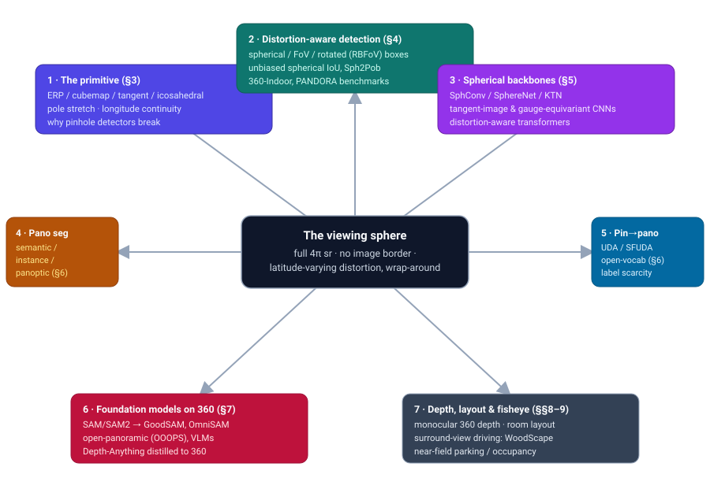
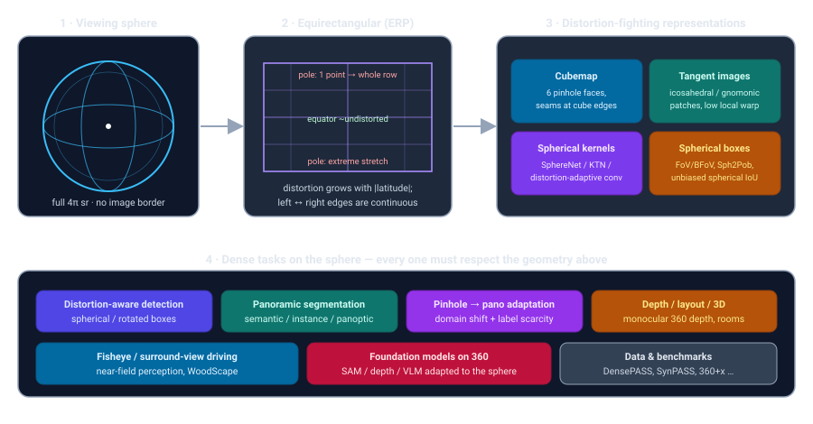
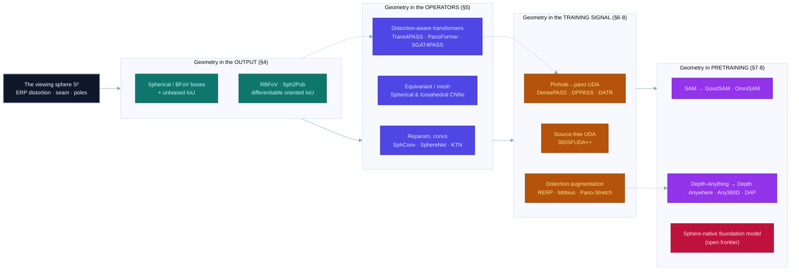

# Dense Object Detection & Classification — Recent Advances

*Compiled 2026-Jul-30 (America/Los_Angeles).*

Next installment in the running CV-updates log. Earlier entries on
`main`:
[Apr-30](../2026-Apr-30/2026-Apr-30_CV_updates.md),
[May-01](../2026-May-01/2026-May-01_CV_updates.md),
[May-02](../2026-May-02/2026-May-02_CV_updates.md),
[May-04](../2026-May-04/2026-May-04_CV_updates.md),
[May-05](../2026-May-05/2026-May-05_CV_updates.md),
[May-07](../2026-May-07/2026-May-07_CV_updates.md),
[May-08](../2026-May-08/2026-May-08_CV_updates.md),
[May-15](../2026-May-15/2026-May-15_CV_updates.md),
[May-16](../2026-May-16/2026-May-16_CV_updates.md),
[May-17](../2026-May-17/2026-May-17_CV_updates.md),
[Jun-09](../2026-Jun-09/2026-Jun-09_CV_updates.md),
[Jun-10](../2026-Jun-10/2026-Jun-10_CV_updates.md),
[Jun-12](../2026-Jun-12/2026-Jun-12_CV_updates.md),
[Jun-15](../2026-Jun-15/2026-Jun-15_CV_updates.md),
[Jun-16](../2026-Jun-16/2026-Jun-16_CV_updates.md),
[Jun-17](../2026-Jun-17/2026-Jun-17_CV_updates.md),
[Jun-19](../2026-Jun-19/2026-Jun-19_CV_updates.md),
[Jun-21](../2026-Jun-21/2026-Jun-21_CV_updates.md),
[Jun-22](../2026-Jun-22/2026-Jun-22_CV_updates.md),
[Jun-23](../2026-Jun-23/2026-Jun-23_CV_updates.md),
[Jun-24](../2026-Jun-24/2026-Jun-24_CV_updates.md),
[Jun-25](../2026-Jun-25/2026-Jun-25_CV_updates.md),
[Jun-27](../2026-Jun-27/2026-Jun-27_CV_updates.md),
[Jun-29](../2026-Jun-29/2026-Jun-29_CV_updates.md),
[Jun-30](../2026-Jun-30/2026-Jun-30_CV_updates.md),
[Jul-04](../2026-Jul-04/2026-Jul-04_CV_updates.md),
[Jul-07](../2026-Jul-07/2026-Jul-07_CV_updates.md),
[Jul-08](../2026-Jul-08/2026-Jul-08_CV_updates.md),
[Jul-10](../2026-Jul-10/2026-Jul-10_CV_updates.md),
[Jul-15](../2026-Jul-15/2026-Jul-15_CV_updates.md),
[Jul-17](../2026-Jul-17/2026-Jul-17_CV_updates.md),
[Jul-18](../2026-Jul-18/2026-Jul-18_CV_updates.md),
[Jul-21](../2026-Jul-21/2026-Jul-21_CV_updates.md),
[Jul-22](../2026-Jul-22/2026-Jul-22_CV_updates.md),
[Jul-24](../2026-Jul-24/2026-Jul-24_CV_updates.md),
[Jul-26](../2026-Jul-26/2026-Jul-26_CV_updates.md),
[Jul-27](../2026-Jul-27/2026-Jul-27_CV_updates.md).

## Table of contents

1. [Why this pass: omnidirectional vision as its own primitive](#why)
2. [Topic map](#map)
3. [The primitive — the viewing sphere, ERP distortion, and the projection zoo](#primitive)
4. [Distortion-aware detection and the spherical bounding box](#detection)
5. [Spherical backbones: convolutions, equivariance, and transformers](#backbones)
6. [Panoramic segmentation and the pinhole→panoramic domain gap](#segmentation)
7. [Foundation models on the sphere: SAM, open-vocabulary, VLMs](#foundation)
8. [Depth, layout, and 3D from a single 360](#depth)
9. [Fisheye and surround-view: the near-field driving primitive](#fisheye)
10. [Through-line and open problems](#throughline)
11. [Sources](#sources)

---

## 1. Why this pass: omnidirectional vision as its own primitive

The running theme of this log has been to take one *imaging primitive* at a time —
polarization, endoscopic video, OCT, SAR, hyperspectral, ultrasound — and ask what
dense detection and classification actually mean once you respect the physics and
geometry of that sensor. This pass turns to the **omnidirectional / 360° image**:
a single frame that captures the entire viewing sphere around the camera.

A 360° camera is not "a very wide-angle camera." It is a different geometric object.
A pinhole image is a planar sample of a bounded field of view; an omnidirectional
image is a sample of the whole **unit sphere** — a signal on S², with *no image
border*, a *wrap-around* seam where the left edge meets the right, and a *pole
singularity* at the top and bottom. To store it in an ordinary pixel array you must
project the sphere onto a plane, and every such projection lies: the near-universal
**equirectangular projection (ERP)** stretches a single point at the pole into an
entire top row of pixels, and the amount of stretch grows with latitude.

That single fact — **the distortion is spatially varying and it is a function of
where you are on the sphere** — breaks the core assumption of the modern detector
and segmentation stack. A convolution kernel, an anchor box, a patch-embedding
window, and an IoU are all defined on a plane where translation is a symmetry and a
box is an axis-aligned rectangle. On the sphere none of that holds: an object's
apparent shape and size depend on its latitude, a "rectangle" near the pole wraps
around a huge solid angle, and a filter slid one pixel to the right near the top of
the image has moved a very different angular distance than the same pixel step at the
equator. The literature below is, almost in its entirety, a catalogue of ways to put
the geometry *back in* — into the boxes (§4), into the convolutions and attention
(§5), into the training signal that transfers cheap pinhole labels onto expensive
panoramic pixels (§6), and finally into the foundation models now being retrofitted
to the sphere (§7). The payoff is concrete: one 360° camera replaces a rig of
pinhole cameras for surround-view driving, indoor mapping, robotics, VR, and
surveillance — *if* the perception stack can be trusted at the poles and across the
seam.

Two 2025–2026 surveys frame the arc well and are good entry points: an IJCV survey of
representation learning and optimization for omnidirectional vision
([arXiv 2502.10444](https://arxiv.org/abs/2502.10444)) and a broader 2026 survey,
*Panoramic Scene Analysis: from Distortion-Aware Engineering to Sphere-Native
Foundation Modeling* ([arXiv 2606.27745](https://arxiv.org/abs/2606.27745)), whose
title is itself the thesis of this pass — the field is migrating from *patching
planar tools* toward *building sphere-native models*. A companion survey on the
perspective→panoramic gap, *One Flight Over the Gap*
([arXiv 2509.04444](https://arxiv.org/abs/2509.04444)), organizes the transfer
problem that dominates §6.

## 2. Topic map

Seven threads, all radiating from the same geometric object: the primitive itself
(§3), then the six dense problems the sphere forces you to re-solve — **distortion-aware
detection** with spherical boxes (§4), **spherical backbones** that bake the geometry
into convolutions and attention (§5), **panoramic segmentation** and the
pinhole→panoramic **domain gap** that makes labels scarce (§6), **foundation models**
retrofitted to the sphere (§7), and the **geometry** tasks — monocular 360 depth and
room layout (§8) — plus the **fisheye / surround-view** near-field driving primitive
that shares the distortion problem from the other end of the lens (§9).

## 3. The primitive — the viewing sphere, ERP distortion, and the projection zoo

Start from the measurement. An omnidirectional camera (a dual-fisheye consumer
360 camera, a catadioptric rig, or a stitched multi-camera assembly) samples incoming
radiance over the **full 4π steradians** around the optical center. The native
domain of that signal is the sphere S², parameterized by longitude θ and
latitude φ. There is no way to flatten a sphere onto a rectangle without
distortion — a theorem older than computer vision — so every storage format is a
compromise:

- **Equirectangular (ERP).** Map θ to the image column and φ to the
  row directly. Simple, seamless in longitude, and the de-facto standard — but the
  horizontal scale is stretched by 1/cos φ, so a small patch near the pole
  occupies a wide band of pixels while carrying almost no information, and the two
  poles (single points on the sphere) smear into the entire top and bottom rows.
  Distortion is *zero at the equator and unbounded at the poles.*
- **Cubemap.** Project onto the six faces of a cube; each face is a normal 90° pinhole
  image, so pretrained planar networks run on it unchanged — at the cost of hard
  **seams** at the cube edges, across which objects and receptive fields are torn.
- **Tangent / gnomonic patches on an icosahedron.** Cover the sphere with many small
  locally-planar patches tangent to a subdivided **icosahedron**. Each patch has low
  local distortion and can be processed by a standard CNN, decoupling distortion from
  resolution — the approach of *Tangent Images*
  ([arXiv 1912.09390](https://arxiv.org/abs/1912.09390)) and *SpherePHD*
  ([arXiv 1811.08196](https://arxiv.org/abs/1811.08196)). The price is stitching patch
  predictions back together consistently.

The two properties that every downstream method must honor, and that separate 360
from "wide-angle," are: **(1) latitude-dependent distortion** — the same object looks
different, and a fixed-shape kernel/box means different things, at different φ;
and **(2) longitude continuity** — the leftmost and rightmost columns are physically
adjacent, so a detector that treats the image as a bounded plane will cut objects in
half at the seam and lose all context across it. The clearest statements of *why the
pinhole stack fails* are §2 of SphereNet
([ECCV 2018](https://openaccess.thecvf.com/content_ECCV_2018/html/Benjamin_Coors_SphereNet_Learning_Spherical_ECCV_2018_paper.html))
and the early multi-projection detector *mp-YOLO*
([arXiv 1805.08009](https://arxiv.org/abs/1805.08009)), which demonstrated the
pole-distortion failure directly and mitigated it by detecting on several
stereographic sub-projections and merging — the first appearance of the
FoV-vs-resolution tradeoff that the tangent-plane methods later formalized.

The single fact that organizes everything below: **an omnidirectional image is a
signal on the sphere, and the sphere's geometry is not optional — it is the label
space, the metric, and the symmetry group of every task.**

## 4. Distortion-aware detection and the spherical bounding box

The most concrete place the geometry bites is the *bounding box*. On a plane, a box is
four numbers and IoU is trivial. On the sphere, the axis-aligned ERP rectangle is
simply the wrong shape: it does not tightly enclose an object, its area is distorted
by latitude, and its IoU is biased. The detection literature is a progression of
better box representations and better overlap metrics.

- **Spherical bounding box + SphIoU.** *Spherical Criteria for Fast and Accurate 360°
  Object Detection* (AAAI 2020,
  [proceedings](https://ojs.aaai.org/index.php/AAAI/article/view/6995)) replaces the
  planar rectangle with a **spherical box** (θ, φ, fov_x, fov_y) — a center
  direction plus horizontal and vertical fields of view —
  and defines a spherical IoU (SphIoU) as the training/evaluation criterion.
- **Bounding Field-of-View (BFoV) and FoV-IoU.** *Field-of-View IoU for Object
  Detection in 360° Images* ([arXiv 2202.03176](https://arxiv.org/abs/2202.03176))
  computes IoU between **BFoV** boxes and adds a 360-specific augmentation; it is a
  drop-in upgrade for standard detectors that immediately corrects the latitude bias.
- **Unbiased spherical IoU.** *Unbiased IoU for Spherical Image Object Detection*
  (AAAI 2022, [arXiv 2108.08029](https://arxiv.org/abs/2108.08029),
  [code](https://github.com/tdsuper/SphericalObjectDetection)) argues spherical
  rectangles are the *unbiased* representation and derives an analytic,
  approximation-free IoU, paired with an anchor-free spherical detector.
- **Sph2Pob — spherical → planar oriented boxes.** The catch with unbiased spherical
  IoU is that it is expensive and non-differentiable. *Sph2Pob* (IJCAI 2023,
  [proceedings PDF](https://www.ijcai.org/proceedings/2023/0137.pdf),
  [code](https://github.com/AntXinyuan/sph2pob)) transforms spherical boxes into
  **planar oriented boxes**, yielding a differentiable `Sph2Pob-IoU` and loss — which
  quietly unlocks the whole mature oriented-object-detection toolbox for 360.
- **Rotated BFoV (RBFoV) and PANDORA.** A BFoV still cannot express arbitrary in-plane
  rotation. *PANDORA* (ECCV 2022,
  [ECVA PDF](https://www.ecva.net/papers/eccv_2022/papers_ECCV/papers/136680229.pdf))
  introduces the **Rotated BFoV** and a 3,000-image / 94k-box benchmark for oriented
  panoramic detection.
- **Two-stage reprojection.** *Reprojection R-CNN*
  ([arXiv 1907.11830](https://arxiv.org/abs/1907.11830)) proposes coarse regions with a
  distortion-aware spherical RPN on the ERP, then refines them on distortion-free
  perspective patches — trading the ERP's efficiency against the perspective view's
  accuracy.

Benchmarks anchor the thread: **360-Indoor** (WACV 2020,
[arXiv 1910.01712](https://arxiv.org/abs/1910.01712)) for real indoor ERP detection,
plus the mp-YOLO and PANDORA datasets above. A recent Swin variant, **PanoSwin**
(CVPR 2023, [arXiv 2308.14726](https://arxiv.org/abs/2308.14726)), evaluates on
panoramic detection, classification, *and* layout with pitch attention and
spherical-distance positional encodings — a bridge into the backbone question of §5.

## 5. Spherical backbones: convolutions, equivariance, and transformers

If the box carries the geometry at the output, the *backbone* is where you can inject
it into every layer. Three families have emerged.

**Reparameterized planar convolutions.** The pragmatic line keeps the CNN and only
moves the sampling grid. *Learning Spherical Convolution* (NeurIPS 2017,
[arXiv 1708.00919](https://arxiv.org/abs/1708.00919)) learns row-dependent
(latitude-varying) kernels that reproduce a planar CNN's outputs on the ERP without
per-tangent reprojection. **SphereNet** (ECCV 2018) adapts the convolution sampling
locations to invert ERP distortion *and wraps the filters around the sphere* — fixing
both the pole stretch and the longitude seam, and letting perspective-pretrained
weights transfer to 360. **Kernel Transformer Networks (KTN)** (CVPR 2019,
[arXiv 1812.03115](https://arxiv.org/abs/1812.03115)) go further and learn a function
of polar angle that *transforms* a source perspective model's kernels into their ERP
equivalents, transferable across tasks with far fewer parameters. *Distortion-Aware
Convolutional Filters* (ECCV 2018,
[ECVA PDF](https://www.ecva.net/papers/eccv_2018/papers_ECCV/papers/Keisuke_Tateno_Distortion-Aware_Convolutional_Filters_ECCV_2018_paper.pdf))
makes the same move for dense prediction.

**Equivariant and mesh-native networks.** The principled line rebuilds convolution on
the sphere itself. *Spherical CNNs* (ICLR 2018 best paper,
[arXiv 1801.10130](https://arxiv.org/abs/1801.10130)) define SO(3)-equivariant
spherical correlation via a generalized FFT. *Gauge Equivariant / Icosahedral CNNs*
(ICML 2019, [PMLR](https://proceedings.mlr.press/v97/cohen19d/cohen19d.pdf)) give a
gauge-equivariant convolution on the icosahedron, and *DeepSphere*
([arXiv 1810.12186](https://arxiv.org/abs/1810.12186)) uses a **HEALPix** graph for
efficient, near-equivariant spherical CNNs. *Orientation-Aware Segmentation on
Icosahedron Spheres* (ICCV 2019, [arXiv 1907.12849](https://arxiv.org/abs/1907.12849))
brings the mesh line to dense labeling.

**Distortion-aware transformers.** The current center of gravity. **PanoFormer**
(ECCV 2022, [arXiv 2203.09283](https://arxiv.org/abs/2203.09283)) tokenizes patches on
the spherical tangent domain with learnable token flow. **Trans4PASS / "Bending
Reality"** (CVPR 2022, [arXiv 2203.01452](https://arxiv.org/abs/2203.01452),
[code](https://github.com/jamycheung/Trans4PASS)) introduces **Deformable Patch
Embedding** and a Deformable MLP so the transformer absorbs distortion; its successor
**Trans4PASS+** ("Behind Every Domain There is a Shift", TPAMI 2024,
[arXiv 2207.11860](https://arxiv.org/abs/2207.11860)) refines this and ships the
SynPASS benchmark. **SGAT4PASS** (IJCAI 2023,
[arXiv 2306.03403](https://arxiv.org/abs/2306.03403),
[code](https://github.com/TencentARC/SGAT4PASS)) adds explicit spherical projection,
spherical deformable patch embedding, and a panorama-aware loss for robustness to 3D
rotation. The 2026 survey ([arXiv 2606.27745](https://arxiv.org/abs/2606.27745)) frames
the destination as **sphere-native foundation models** rather than any of these
retrofits — see §7.

## 6. Panoramic segmentation and the pinhole→panoramic domain gap

Dense per-pixel labeling is where 360 hurts most, because the geometry problem is
compounded by a *data* problem: densely annotating panoramas is far more expensive
than annotating pinhole images, and the largest labeled segmentation corpora
(Cityscapes and friends) are all pinhole. So the defining task of panoramic
segmentation is **transfer**: train where the labels are (pinhole) and deploy where
the FoV is (360). This is a triple domain shift — appearance/style, *geometric
distortion*, and *field of view* — and the field's structure below follows exactly
that decomposition.

**Architectures.** Beyond the distortion-aware transformers of §5, *ECANet*
("Capturing Omni-Range Context", CVPR 2021,
[arXiv 2103.05687](https://arxiv.org/abs/2103.05687)) captures 360°-spanning
dependencies and introduced the **WildPASS** benchmark.

**Unsupervised domain adaptation (UDA).** *DensePASS* (ITSC 2021,
[arXiv 2108.06383](https://arxiv.org/abs/2108.06383); journal *Transfer Beyond the
Field of View*, [arXiv 2110.11062](https://arxiv.org/abs/2110.11062)) formalized
Cityscapes→panorama UDA and released the standard 19-class benchmark. *DPPASS* ("Both
Style and Distortion Matter", CVPR 2023,
[code](https://github.com/zhengxuJosh/DPPASS)) explicitly *separates* the style gap
from the projection/format gap with a dual ERP + tangent-projection path. *DATR*
("Look at the Neighbor", ICCV 2023,
[arXiv 2308.05493](https://arxiv.org/abs/2308.05493),
[project](https://vlislab22.github.io/DATR/)) drops geometric priors in favor of a
learned distortion-aware attention with ~80% fewer parameters. The **source-free**
frontier — adapt using only a pinhole-pretrained model and *unlabeled* panoramas —
arrives with *360SFUDA / 360SFUDA++* (TPAMI 2024,
[arXiv 2404.16501](https://arxiv.org/abs/2404.16501),
[code](https://github.com/zhengxuJosh/360SFUDA)).

**Panoptic, instance, and occlusion-aware.** *Panoramic Panoptic Segmentation* (T-ITS
2023, [arXiv 2206.10711](https://arxiv.org/abs/2206.10711),
[code](https://github.com/alexanderjaus/PPS)) transfers pinhole-trained panoptic
features to 360 via contrastive learning and ships the WildPPS benchmark. *OASS —
Occlusion-Aware Seamless Segmentation* (ECCV 2024,
[arXiv 2407.02182](https://arxiv.org/abs/2407.02182),
[code](https://github.com/yihong-97/OASS)) jointly does FoV expansion, amodal/occlusion
reasoning, and domain adaptation, and releases **BlendPASS**.

**Datasets that define the field.** *DensePASS*, *WildPASS*
([code](https://github.com/elnino9ykl/WildPASS)), and the synthetic *SynPASS* (9,080
panoramas, all-weather) for outdoor street scenes; *Stanford2D3D*
([arXiv 1702.01105](https://arxiv.org/abs/1702.01105)), *Structured3D* (ECCV 2020,
[arXiv 1908.00222](https://arxiv.org/abs/1908.00222)), and *Matterport3D* (3DV 2017,
[arXiv 1709.06158](https://arxiv.org/abs/1709.06158)) for indoor; and the multi-modal
*360+x* (CVPR 2024 Oral, [arXiv 2404.00989](https://arxiv.org/abs/2404.00989),
[project](https://x360dataset.github.io/)), which pairs panoramic and egocentric views
with video, spatial audio, GPS, and text. A 2025 line even moves ERP segmentation onto
a spherical-convolution backbone compatible with large planar pretrained models
([arXiv 2507.09216](https://arxiv.org/abs/2507.09216)).

## 7. Foundation models on the sphere: SAM, open-vocabulary, VLMs

The 2024–2026 shift is to stop training bespoke 360 networks from scratch and instead
*transfer the giant pretrained perspective models* onto the sphere — the same
foundation-model wave seen elsewhere in this log, now colliding with distortion.

**Segment Anything, panoramized.** *GoodSAM* (CVPR 2024,
[arXiv 2403.16370](https://arxiv.org/abs/2403.16370)) distills SAM into a compact
distortion-aware panoramic student with no labels, via a semantic teacher-assistant, a
Distortion-Aware Rectification module, and multi-level knowledge adaptation; *GoodSAM++*
([arXiv 2408.09115](https://arxiv.org/abs/2408.09115)) extends it. *OmniSAM* (ICCV 2025,
[arXiv 2503.07098](https://arxiv.org/abs/2503.07098)) is the first to adapt **SAM 2** to
panoramic UDA, cleverly splitting the panorama into a *sequence* of patches and treating
it like a video so SAM 2's memory enforces cross-FoV consistency across the seam.

**Open-vocabulary on the sphere.** *Open Panoramic Segmentation (OPS)* (ECCV 2024,
[arXiv 2407.02685](https://arxiv.org/abs/2407.02685),
[code](https://github.com/JunweiZheng93/OPS)) defines a triply-open task — open FoV,
open vocabulary, open domain — training on FoV-restricted open-vocabulary *pinhole*
images and evaluating zero-shot on 360; its OOOPS model adds a Deformable Adapter
Network and a **Random Equirectangular Projection** augmentation that manufactures
distortion during pinhole training so the model is ready for it at test time.

**Vision-language reasoning.** *360-R1 / OmniVQA* (2025,
[arXiv 2505.14197](https://arxiv.org/abs/2505.14197)) is the first omnidirectional VQA
dataset and benchmark, and shows off-the-shelf MLLMs struggle with panoramic
localization and hallucination; it adapts Qwen2.5-VL with a GRPO-based RL recipe
(reasoning-similarity, answer-accuracy, and format rewards) for ~+6% gains — a marker
that the sphere is now a stress test for multimodal reasoning, not just perception.

The generalization the 2026 survey names as *sphere-native foundation modeling*
([arXiv 2606.27745](https://arxiv.org/abs/2606.27745)) is the endpoint these methods
gesture at: a model whose tokenization, positional encoding, and pretraining are
defined on S² from the start, rather than a planar giant bent onto the sphere
after the fact.

## 8. Depth, layout, and 3D from a single 360

A 360 image sees the whole room at once, which makes it uniquely suited to
single-shot 3D — and uniquely punished by ERP distortion in the geometry.

**Monocular 360 depth.** The dominant design pattern is **bi-projection fusion**:
process the ERP for global context *and* a distortion-free representation (cubemap or
tangent patches) for local detail, then fuse. *BiFuse* (CVPR 2020) and *UniFuse*
([arXiv 2102.03550](https://arxiv.org/abs/2102.03550)) established the ERP+cubemap
fusion; *OmniFusion* (CVPR 2022 Oral, [arXiv 2203.00838](https://arxiv.org/abs/2203.00838),
[code](https://github.com/yuliangguo/OmniFusion)) and *360MonoDepth*
([arXiv 2111.15669](https://arxiv.org/abs/2111.15669)) use tangent patches to reach 2K+
resolution; *HoHoNet* ([arXiv 2011.11498](https://arxiv.org/abs/2011.11498)) collapses
the panorama to 1-D horizontal features for real-time holistic indoor understanding.
The transformer generation — *PanoFormer* ([arXiv 2203.09283](https://arxiv.org/abs/2203.09283))
and *EGformer* (ICCV 2023, [arXiv 2304.07803](https://arxiv.org/abs/2304.07803),
[code](https://github.com/yuniw18/EGformer)) — bakes equirectangular geometry into the
attention itself, and *Elite360D* (CVPR 2024,
[arXiv 2403.16376](https://arxiv.org/abs/2403.16376)) fuses ERP with an icosahedral
projection efficiently.

The **foundation-model transfer** move (mirroring §7) is the newest and most striking:
*Depth Anywhere* (NeurIPS 2024, [arXiv 2406.12849](https://arxiv.org/abs/2406.12849))
and *Any360D* ([arXiv 2406.13378](https://arxiv.org/abs/2406.13378)) both **distill a
perspective depth foundation model (Depth Anything) into a 360 model** using unlabeled
panoramas and distortion-aware augmentation (Any360D adds a Möbius spatial
augmentation). *Depth Any Panoramas (DAP)*
([arXiv 2512.16913](https://arxiv.org/abs/2512.16913),
[project](https://insta360-research-team.github.io/DAP_website/)) pushes this to a
**panoramic metric-depth foundation model** on a DINOv3-Large backbone with a
distortion-aware decoder and a plug-and-play range-mask head — the clearest sign that
360 depth is consolidating into a single pretrained model rather than a zoo of
task-specific fusers.

**Room layout.** The parallel indoor-geometry task recovers the 3-D room shell from one
panorama under a Manhattan-world assumption. *HorizonNet*
([arXiv 1901.03861](https://arxiv.org/abs/1901.03861)) casts layout as three per-column
1-D signals; *LED2-Net* ([arXiv 2104.00568](https://arxiv.org/abs/2104.00568)) reframes
it as differentiable horizon-depth rendering; *LGT-Net*
([arXiv 2203.01824](https://arxiv.org/abs/2203.01824),
[code](https://github.com/zhigangjiang/LGT-Net)) uses a geometry-aware transformer
predicting horizon-depth plus room height with a planar-geometry loss on wall normals.

## 9. Fisheye and surround-view: the near-field driving primitive

Fisheye is the other face of the same coin: not a full sphere, but a single lens with a
~190° FoV and *severe radial distortion* that grows toward the image edge. It is the
production omnidirectional primitive — four fisheye cameras give a car a 360° near-field
belt for parking and low-speed maneuvering, and they are already in millions of vehicles.
The dense-perception challenge is identical in spirit to §§4–5: standard boxes and
kernels assume a rectilinear image the fisheye does not provide.

**Datasets.** *WoodScape* (ICCV 2019, [arXiv 1905.01489](https://arxiv.org/abs/1905.01489),
[code](https://github.com/valeoai/WoodScape)) is the first large real multi-task,
multi-camera surround-view fisheye automotive dataset — nine tasks including
segmentation, depth, 3-D boxes, and lens-soiling detection. *SynWoodScape*
([arXiv 2203.05056](https://arxiv.org/abs/2203.05056)) is its synthetic CARLA twin with
dense labels for BEV and beyond. The recurring venue for challenges is the **CVPR OmniCV
workshop** (e.g. the WoodScape fisheye segmentation challenge,
[arXiv 2107.08246](https://arxiv.org/abs/2107.08246)).

**Detection and segmentation under radial distortion.** *OmniDet*
([arXiv 2102.07448](https://arxiv.org/abs/2102.07448)) is a six-task network on raw
fisheye that encodes the camera geometry directly. The recurring question — *what shape
should a fisheye box be?* — runs from *FisheyeDet / Generalized Object Detection on
Fisheye* ([arXiv 2012.02124](https://arxiv.org/abs/2012.02124)), which compares axis-aligned
vs. oriented vs. ellipse vs. polygon outputs, to *FisheyeDetNet*
([arXiv 2404.13443](https://arxiv.org/abs/2404.13443)) across four surround cameras, and
the *"curved box"* representation with vanishing-point constraints (Sensors 2025,
[DOI](https://doi.org/10.3390/s25123735)). On the backbone side, *DarSwin*
([arXiv 2304.09691](https://arxiv.org/abs/2304.09691)) conditions a radial Swin
transformer on the lens distortion profile, *Sector Patch Embedding*
([arXiv 2303.14645](https://arxiv.org/abs/2303.14645)) makes transformer patches conform
to the radial geometry, deformable convolutions raise fisheye segmentation mIoU
([arXiv 2407.16647](https://arxiv.org/abs/2407.16647)), and *Deformable Mamba*
([arXiv 2411.16481](https://arxiv.org/abs/2411.16481)) brings a deformable state-space
model to wide-FoV segmentation. A survey of near-field surround-view perception
([arXiv 2205.13281](https://arxiv.org/abs/2205.13281)) collects the challenges; and the
BEV-native direction shows up in *DaF-BEVSeg*
([arXiv 2404.06352](https://arxiv.org/abs/2404.06352)).

## 10. Through-line and open problems

**One thesis ties the seven threads together.** Every method above is an answer to the
same question: *where do you put the sphere's geometry?* You can put it in the **output
representation** (spherical / BFoV / RBFoV boxes and unbiased IoU, §4), in the
**operators** (distortion-adaptive convolutions, equivariant spherical/icosahedral
networks, distortion-aware attention, §5), in the **training signal** (pinhole→panoramic
UDA, source-free adaptation, distortion-manufacturing augmentations like RERP and
Möbius, §§6–8), or increasingly in the **pretraining** itself (SAM/Depth-Anything
distilled onto the sphere; the sphere-native foundation model the surveys point toward,
§§7–8). The historical arc is a steady migration inward: from post-hoc box fixes toward
models that are spherical from the first layer.

**The domain gap is the real bottleneck, not the architecture.** The most consequential
single fact in panoramic dense vision is economic: labels live on the plane, deployment
lives on the sphere. That is why the segmentation literature (§6) is overwhelmingly a
*transfer*-learning literature, why the strongest 2024–2026 results come from
foundation-model distillation rather than novel spherical operators, and why
distortion-manufacturing augmentation (RERP, Möbius, Pano-Stretch) recurs everywhere —
it is the cheapest way to make plentiful pinhole data *look* spherical.

**Open problems.**
- **Sphere-native foundation models.** Everything today is a planar giant bent onto
  S². A model whose tokens, positional encodings, and pretraining objective are
  spherical from the start does not yet exist at scale ([survey](https://arxiv.org/abs/2606.27745)).
- **The seam and the poles remain failure sites.** Wrap-around continuity and pole
  singularities are handled case-by-case (circular padding, pitch attention, tangent
  patches); there is no single representation that is simultaneously seamless, pole-safe,
  and cheap.
- **Metrics.** Unbiased spherical IoU is correct but expensive; the differentiable
  approximations (Sph2Pob, FoV-IoU) trade exactness for speed, and there is no consensus
  evaluation across detection benchmarks.
- **Reasoning, not just perception.** 360-R1/OmniVQA shows MLLMs still hallucinate and
  mislocalize on panoramas; spatial reasoning over the full sphere is wide open.
- **Fisheye ↔ 360 unification.** Fisheye and equirectangular are the same geometry
  problem attacked from two ends, yet the two communities share little tooling; a
  distortion-model-conditioned representation that covers both would be valuable.

Net: omnidirectional vision is past the "does it even work" stage and into consolidation
— foundation models are absorbing the task, and the frontier is moving from *adapting
planar tools* to *building the sphere in from the start.*

## 11. Sources

*Links were gathered and cross-checked against search-engine indexes and, where
possible, official proceedings/project pages. arXiv abstract pages were not
byte-verifiable from this environment (datacenter egress block); every URL below was
returned by a live search index rather than composed from memory. Very recent (2025–2026)
preprints are marked; treat their identifiers as freshly minted.*

**Surveys**
- Representation Learning & Optimization for Omnidirectional Vision (IJCV 2025) — [arXiv 2502.10444](https://arxiv.org/abs/2502.10444)
- Panoramic Scene Analysis: Distortion-Aware Engineering → Sphere-Native Foundation Modeling (2026 preprint) — [arXiv 2606.27745](https://arxiv.org/abs/2606.27745)
- One Flight Over the Gap: Perspective → Panoramic Vision (2025) — [arXiv 2509.04444](https://arxiv.org/abs/2509.04444)

**The primitive & projections**
- Tangent Images (CVPR 2020) — [arXiv 1912.09390](https://arxiv.org/abs/1912.09390)
- SpherePHD (CVPR 2019) — [arXiv 1811.08196](https://arxiv.org/abs/1811.08196)
- mp-YOLO / detection in equirectangular panorama (2018) — [arXiv 1805.08009](https://arxiv.org/abs/1805.08009)

**Distortion-aware detection & boxes**
- Spherical Criteria (SphBB/SphIoU), AAAI 2020 — [proceedings](https://ojs.aaai.org/index.php/AAAI/article/view/6995)
- Field-of-View IoU (2022) — [arXiv 2202.03176](https://arxiv.org/abs/2202.03176)
- Unbiased IoU for Spherical Detection (AAAI 2022) — [arXiv 2108.08029](https://arxiv.org/abs/2108.08029) · [code](https://github.com/tdsuper/SphericalObjectDetection)
- Sph2Pob (IJCAI 2023) — [PDF](https://www.ijcai.org/proceedings/2023/0137.pdf) · [code](https://github.com/AntXinyuan/sph2pob)
- PANDORA / Rotated BFoV (ECCV 2022) — [ECVA PDF](https://www.ecva.net/papers/eccv_2022/papers_ECCV/papers/136680229.pdf)
- Reprojection R-CNN (2019) — [arXiv 1907.11830](https://arxiv.org/abs/1907.11830)
- 360-Indoor (WACV 2020) — [arXiv 1910.01712](https://arxiv.org/abs/1910.01712)
- PanoSwin (CVPR 2023) — [arXiv 2308.14726](https://arxiv.org/abs/2308.14726)

**Spherical backbones**
- Learning Spherical Convolution (NeurIPS 2017) — [arXiv 1708.00919](https://arxiv.org/abs/1708.00919)
- SphereNet (ECCV 2018) — [CVF](https://openaccess.thecvf.com/content_ECCV_2018/html/Benjamin_Coors_SphereNet_Learning_Spherical_ECCV_2018_paper.html)
- Kernel Transformer Networks (CVPR 2019) — [arXiv 1812.03115](https://arxiv.org/abs/1812.03115)
- Distortion-Aware Convolutional Filters (ECCV 2018) — [ECVA PDF](https://www.ecva.net/papers/eccv_2018/papers_ECCV/papers/Keisuke_Tateno_Distortion-Aware_Convolutional_Filters_ECCV_2018_paper.pdf)
- Spherical CNNs (ICLR 2018) — [arXiv 1801.10130](https://arxiv.org/abs/1801.10130)
- Gauge Equivariant / Icosahedral CNN (ICML 2019) — [PMLR](https://proceedings.mlr.press/v97/cohen19d/cohen19d.pdf)
- DeepSphere (HEALPix) — [arXiv 1810.12186](https://arxiv.org/abs/1810.12186)
- Orientation-Aware Icosahedron Segmentation (ICCV 2019) — [arXiv 1907.12849](https://arxiv.org/abs/1907.12849)

**Panoramic segmentation & domain adaptation**
- Trans4PASS / Bending Reality (CVPR 2022) — [arXiv 2203.01452](https://arxiv.org/abs/2203.01452) · [code](https://github.com/jamycheung/Trans4PASS)
- Trans4PASS+ (TPAMI 2024, SynPASS) — [arXiv 2207.11860](https://arxiv.org/abs/2207.11860)
- PanoFormer (ECCV 2022) — [arXiv 2203.09283](https://arxiv.org/abs/2203.09283)
- SGAT4PASS (IJCAI 2023) — [arXiv 2306.03403](https://arxiv.org/abs/2306.03403) · [code](https://github.com/TencentARC/SGAT4PASS)
- ECANet / WildPASS (CVPR 2021) — [arXiv 2103.05687](https://arxiv.org/abs/2103.05687)
- DensePASS (ITSC 2021) — [arXiv 2108.06383](https://arxiv.org/abs/2108.06383) · ext. [arXiv 2110.11062](https://arxiv.org/abs/2110.11062)
- DPPASS (CVPR 2023) — [code](https://github.com/zhengxuJosh/DPPASS)
- DATR (ICCV 2023) — [arXiv 2308.05493](https://arxiv.org/abs/2308.05493) · [project](https://vlislab22.github.io/DATR/)
- 360SFUDA / 360SFUDA++ (TPAMI 2024) — [arXiv 2404.16501](https://arxiv.org/abs/2404.16501) · [code](https://github.com/zhengxuJosh/360SFUDA)
- Panoramic Panoptic Segmentation / WildPPS (T-ITS 2023) — [arXiv 2206.10711](https://arxiv.org/abs/2206.10711) · [code](https://github.com/alexanderjaus/PPS)
- OASS / BlendPASS (ECCV 2024) — [arXiv 2407.02182](https://arxiv.org/abs/2407.02182) · [code](https://github.com/yihong-97/OASS)
- ERP segmentation with spherical conv + planar pretrained models (2025) — [arXiv 2507.09216](https://arxiv.org/abs/2507.09216)

**Datasets (segmentation/indoor)**
- Stanford2D3D — [arXiv 1702.01105](https://arxiv.org/abs/1702.01105)
- Structured3D (ECCV 2020) — [arXiv 1908.00222](https://arxiv.org/abs/1908.00222)
- Matterport3D (3DV 2017) — [arXiv 1709.06158](https://arxiv.org/abs/1709.06158)
- 360+x (CVPR 2024 Oral) — [arXiv 2404.00989](https://arxiv.org/abs/2404.00989) · [project](https://x360dataset.github.io/)
- WildPASS — [code](https://github.com/elnino9ykl/WildPASS)

**Foundation models on the sphere**
- GoodSAM (CVPR 2024) — [arXiv 2403.16370](https://arxiv.org/abs/2403.16370) · GoodSAM++ [arXiv 2408.09115](https://arxiv.org/abs/2408.09115)
- OmniSAM / SAM2 for panoramic UDA (ICCV 2025) — [arXiv 2503.07098](https://arxiv.org/abs/2503.07098)
- Open Panoramic Segmentation / OOOPS (ECCV 2024) — [arXiv 2407.02685](https://arxiv.org/abs/2407.02685) · [code](https://github.com/JunweiZheng93/OPS)
- 360-R1 / OmniVQA (2025) — [arXiv 2505.14197](https://arxiv.org/abs/2505.14197)

**Depth & layout**
- UniFuse — [arXiv 2102.03550](https://arxiv.org/abs/2102.03550)
- OmniFusion (CVPR 2022) — [arXiv 2203.00838](https://arxiv.org/abs/2203.00838) · [code](https://github.com/yuliangguo/OmniFusion)
- 360MonoDepth — [arXiv 2111.15669](https://arxiv.org/abs/2111.15669)
- HoHoNet (CVPR 2021) — [arXiv 2011.11498](https://arxiv.org/abs/2011.11498)
- EGformer (ICCV 2023) — [arXiv 2304.07803](https://arxiv.org/abs/2304.07803) · [code](https://github.com/yuniw18/EGformer)
- Elite360D (CVPR 2024) — [arXiv 2403.16376](https://arxiv.org/abs/2403.16376)
- Depth Anywhere (NeurIPS 2024) — [arXiv 2406.12849](https://arxiv.org/abs/2406.12849)
- Any360D — [arXiv 2406.13378](https://arxiv.org/abs/2406.13378)
- Depth Any Panoramas / DAP (2025 preprint) — [arXiv 2512.16913](https://arxiv.org/abs/2512.16913) · [project](https://insta360-research-team.github.io/DAP_website/)
- HorizonNet (CVPR 2019) — [arXiv 1901.03861](https://arxiv.org/abs/1901.03861)
- LED2-Net (CVPR 2021) — [arXiv 2104.00568](https://arxiv.org/abs/2104.00568)
- LGT-Net (CVPR 2022) — [arXiv 2203.01824](https://arxiv.org/abs/2203.01824) · [code](https://github.com/zhigangjiang/LGT-Net)

**Fisheye / surround-view**
- WoodScape (ICCV 2019) — [arXiv 1905.01489](https://arxiv.org/abs/1905.01489) · [code](https://github.com/valeoai/WoodScape)
- SynWoodScape — [arXiv 2203.05056](https://arxiv.org/abs/2203.05056)
- OmniDet — [arXiv 2102.07448](https://arxiv.org/abs/2102.07448)
- Generalized Object Detection on Fisheye — [arXiv 2012.02124](https://arxiv.org/abs/2012.02124)
- FisheyeDetNet (2024) — [arXiv 2404.13443](https://arxiv.org/abs/2404.13443)
- Curved-box fisheye detection (Sensors 2025) — [DOI](https://doi.org/10.3390/s25123735)
- DarSwin (2023) — [arXiv 2304.09691](https://arxiv.org/abs/2304.09691)
- Sector Patch Embedding (2023) — [arXiv 2303.14645](https://arxiv.org/abs/2303.14645)
- Deformable-conv fisheye segmentation (2024) — [arXiv 2407.16647](https://arxiv.org/abs/2407.16647)
- Deformable Mamba (2024) — [arXiv 2411.16481](https://arxiv.org/abs/2411.16481)
- Surround-view fisheye perception survey (2022) — [arXiv 2205.13281](https://arxiv.org/abs/2205.13281)
- DaF-BEVSeg (2024) — [arXiv 2404.06352](https://arxiv.org/abs/2404.06352)
- WoodScape OmniCV segmentation challenge (2021) — [arXiv 2107.08246](https://arxiv.org/abs/2107.08246)

---

### Diagram: how the field's methods evolved

The lineage below reads left-to-right as *where the geometry gets injected* — from
output boxes, to operators, to training-time transfer, to pretraining. It renders as a
Mermaid flowchart in GitHub-flavored markdown; node colors are set with explicit fills
and light text so they read in both light and dark themes.

*Compiled automatically as part of the CV-updates routine. Corrections and additions
welcome via PR against `main`.*
