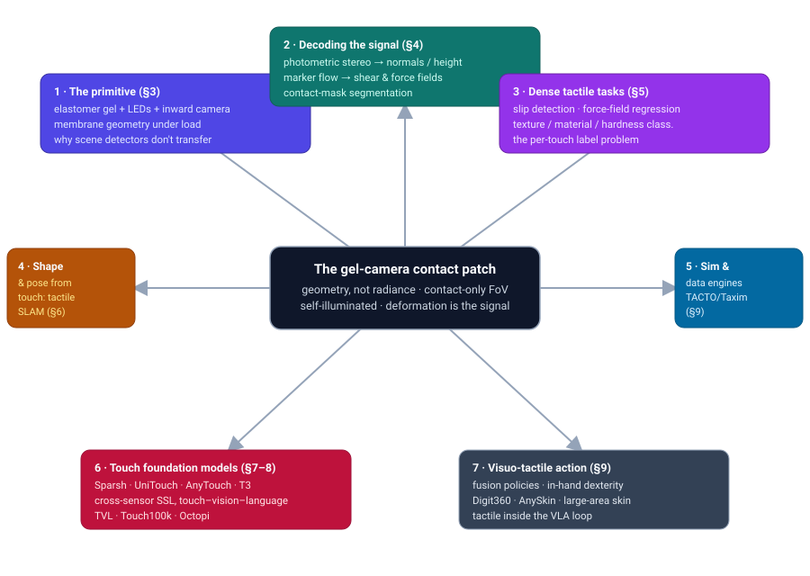
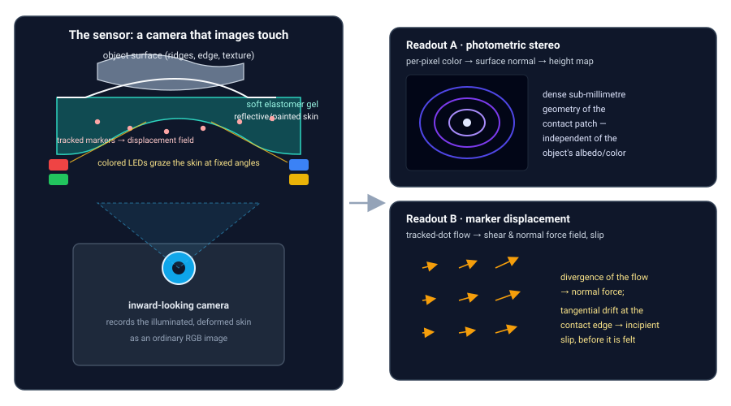
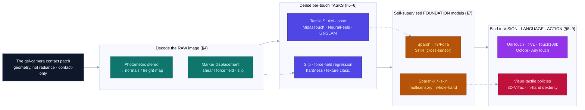

# Dense Object Detection & Classification — Recent Advances

*Compiled 2026-Jul-31 (America/Los_Angeles).*

Next installment in the running CV-updates log. Earlier entries on
`main`:
[Apr-30](../2026-Apr-30/2026-Apr-30_CV_updates.md),
[May-01](../2026-May-01/2026-May-01_CV_updates.md),
[May-02](../2026-May-02/2026-May-02_CV_updates.md),
[May-04](../2026-May-04/2026-May-04_CV_updates.md),
[May-05](../2026-May-05/2026-May-05_CV_updates.md),
[May-07](../2026-May-07/2026-May-07_CV_updates.md),
[May-08](../2026-May-08/2026-May-08_CV_updates.md),
[May-15](../2026-May-15/2026-May-15_CV_updates.md),
[May-16](../2026-May-16/2026-May-16_CV_updates.md),
[May-17](../2026-May-17/2026-May-17_CV_updates.md),
[Jun-09](../2026-Jun-09/2026-Jun-09_CV_updates.md),
[Jun-10](../2026-Jun-10/2026-Jun-10_CV_updates.md),
[Jun-12](../2026-Jun-12/2026-Jun-12_CV_updates.md),
[Jun-15](../2026-Jun-15/2026-Jun-15_CV_updates.md),
[Jun-16](../2026-Jun-16/2026-Jun-16_CV_updates.md),
[Jun-17](../2026-Jun-17/2026-Jun-17_CV_updates.md),
[Jun-19](../2026-Jun-19/2026-Jun-19_CV_updates.md),
[Jun-21](../2026-Jun-21/2026-Jun-21_CV_updates.md),
[Jun-22](../2026-Jun-22/2026-Jun-22_CV_updates.md),
[Jun-23](../2026-Jun-23/2026-Jun-23_CV_updates.md),
[Jun-24](../2026-Jun-24/2026-Jun-24_CV_updates.md),
[Jun-25](../2026-Jun-25/2026-Jun-25_CV_updates.md),
[Jun-27](../2026-Jun-27/2026-Jun-27_CV_updates.md),
[Jun-29](../2026-Jun-29/2026-Jun-29_CV_updates.md),
[Jun-30](../2026-Jun-30/2026-Jun-30_CV_updates.md),
[Jul-04](../2026-Jul-04/2026-Jul-04_CV_updates.md),
[Jul-07](../2026-Jul-07/2026-Jul-07_CV_updates.md),
[Jul-08](../2026-Jul-08/2026-Jul-08_CV_updates.md),
[Jul-10](../2026-Jul-10/2026-Jul-10_CV_updates.md),
[Jul-15](../2026-Jul-15/2026-Jul-15_CV_updates.md),
[Jul-17](../2026-Jul-17/2026-Jul-17_CV_updates.md),
[Jul-18](../2026-Jul-18/2026-Jul-18_CV_updates.md),
[Jul-21](../2026-Jul-21/2026-Jul-21_CV_updates.md),
[Jul-22](../2026-Jul-22/2026-Jul-22_CV_updates.md),
[Jul-24](../2026-Jul-24/2026-Jul-24_CV_updates.md),
[Jul-26](../2026-Jul-26/2026-Jul-26_CV_updates.md),
[Jul-27](../2026-Jul-27/2026-Jul-27_CV_updates.md),
[Jul-30](../2026-Jul-30/2026-Jul-30_CV_updates.md).

## Table of contents

1. [Why this pass: the tactile sensor as its own primitive](#why)
2. [Topic map](#map)
3. [The primitive — a camera that images touch, not scenes](#primitive)
4. [Decoding the raw signal: height maps, force fields, contact masks](#decode)
5. [Dense tactile tasks — the detection & classification analog](#tasks)
6. [Shape and pose from touch: tactile SLAM and reconstruction](#shape)
7. [Touch foundation models: self-supervised, cross-sensor](#foundation)
8. [Touch–vision–language: aligning the contact patch to CLIP and LLMs](#tvl)
9. [Visuo-tactile action: fusion, dexterity, sensors, simulators](#action)
10. [Through-line and open problems](#throughline)
11. [Sources](#sources)

---

## 1. Why this pass: the tactile sensor as its own primitive

Every previous entry in this log has treated dense detection and classification
through one *imaging primitive* at a time — SAR, hyperspectral, OCT, ultrasound,
endoscopy, polarization, the event camera, the 360° sphere. Each of those is a
different way of collecting **radiant energy that has travelled from a scene to a
sensor**: photons, microwaves, sound, however exotic the physics, the sensor sits
at a distance and measures a field that arrived from *out there*. This pass turns to
the one dense-vision primitive that breaks that assumption entirely: the
**vision-based tactile sensor** — an ordinary camera that never looks at the scene at
all. It looks *inward*, at a soft skin, and reports what the skin does when the robot
presses it against the world.

The dominant design (GelSight, DIGIT, GelSlim, TacTip, and their descendants) is
deceptively simple: a slab of soft transparent **elastomer** with a reflective or
patterned coating on the outside, lit from within by colored LEDs, with a small
camera behind it looking at the *back* of that skin. When the skin touches an
object, it deforms to the object's microgeometry, and the camera records a
high-resolution image of that deformation. The "image" therefore has nothing to do
with the object's color, texture, or albedo — it is a direct optical measurement of
**local surface geometry and contact mechanics**, at a spatial resolution that
routinely *exceeds the human fingertip* and can resolve features down to the
micron scale (this is the "retrographic sensing" idea of Johnson & Adelson,
[CVPR 2009](https://doi.org/10.1109/CVPR.2009.5206534); [GelSight Sensors 2017](https://doi.org/10.3390/s17122762)).

That inversion — *geometry instead of radiance, contact instead of standoff* — is why
the modern detection and classification stack does not transfer unchanged, and why
touch deserves its own pass:

- **No scene, no background, no "objects at a distance."** There is exactly one thing
  in the field of view: the contact patch. A COCO-style detector looking for objects
  against a background has nothing to do. The dense questions instead become *where is
  contact* (segmentation of the contact mask), *how hard and in which direction*
  (force/shear field regression), *is it slipping* (a temporal event), and *what is it*
  (material/hardness/texture classification from geometry alone).
- **The signal is illumination-engineered, not natural.** The colors in the image are
  a *code*: each LED direction paints the surface a known color, so per-pixel RGB
  inverts to a surface normal by **photometric stereo**. Change the illumination and
  you change the "image" of the same touch — a property no pretrained ImageNet
  backbone expects.
- **Every sensor is a different lens.** GelSight, DIGIT, GelSlim, TacTip and dozens of
  DIY variants differ in gel thickness, marker pattern, LED geometry, and optics, so a
  model trained on one is nearly useless on another. **Cross-sensor generalization**
  is the field's defining nuisance variable — the tactile analog of domain shift — and
  it is the reason the 2024–2026 story is dominated by *foundation models* (§7).
- **Labels are physically expensive.** You cannot scrape tactile data off the web.
  Every sample requires a robot pressing a real object, or a physics simulator good
  enough to fake it. So the field leans hard on **self-supervision** (§7) and on
  **tactile simulators** (§9) in a way optical vision never had to.

Two recent surveys frame the arc: a **classification/review of vision-based tactile
sensor designs** ([arXiv 2509.02478](https://arxiv.org/abs/2509.02478)), and a broad
2026 survey, *Tactile-based Multimodal Fusion in Embodied Intelligence*
([arXiv 2605.17336](https://arxiv.org/abs/2605.17336)), whose title captures the
destination of this pass: touch is migrating from a **bespoke, per-sensor signal**
into a **modality bound alongside vision and language** inside general embodied models.

## 2. Topic map

Seven threads radiate from one physical object — the deformed, self-illuminated
contact patch (§3). From it come the two ways the raw camera image is **decoded** into
physical quantities (§4); the **dense per-touch tasks** that are the detection/
classification analog — slip, force fields, material and hardness (§5); the geometric
tasks of recovering **object shape and pose from touch**, i.e. tactile SLAM (§6); the
**touch foundation models** that finally tamed cross-sensor transfer with
self-supervision (§7) and then bound touch to **vision and language** (§8); and
finally the payoff — **visuo-tactile action**: fusion policies, in-hand dexterity, new
sensors, and the simulators that make all of it trainable (§9).

## 3. The primitive — a camera that images touch, not scenes

**The construction.** Strip a vision-based tactile sensor to its essentials and you
have four parts: (1) a soft **elastomer gel** that is the part that touches the world;
(2) a thin **coating** on the gel's outer face — either an opaque reflective paint
(GelSight-style, so the camera sees a matte surface whose shading encodes geometry) or
an array of **markers/pins** (TacTip-style, so the camera tracks dots); (3) **LEDs**,
usually several colors from several directions, that light the coating from inside; and
(4) an **inward-looking camera** that records the illuminated skin. The canonical
reference paper for the optics, fabrication, and algorithms is Yuan, Dong & Adelson's
GelSight paper ([Sensors 2017](https://doi.org/10.3390/s17122762)); the low-cost,
hand-mountable **DIGIT** ([RA-L 2020, arXiv 2005.14679](https://arxiv.org/abs/2005.14679))
made the design ubiquitous in robot-learning labs, and **GelSlim**
([IROS 2018, arXiv 1803.00628](https://arxiv.org/abs/1803.00628)) squeezed it into a
slim gripper finger.

**Why the "image" is unlike any other in this log.** Two touches of the *same* object
under two illumination setups produce two different images; two *different* objects with
the same local geometry produce nearly identical images regardless of their color. The
camera is measuring the **shape of the skin**, which is the shape of the contact, not the
appearance of the thing. Everything downstream is an attempt to read one of two physical
fields out of that shape.

**Sensor families.** The zoo matters because it *is* the domain-shift problem:

- **GelSight lineage** — the reflective-skin, photometric-stereo branch. Compact
  variants include **GelSight Wedge** ([ICRA 2021, arXiv 2106.08851](https://arxiv.org/abs/2106.08851)),
  the commercial **GelSight Mini** (2022; no paper — cite the 2017 method), the
  human-finger-shaped **GelSight Svelte** ([IROS 2023, arXiv 2309.10885](https://arxiv.org/abs/2309.10885)),
  and low-cost DIY designs like **9DTact** ([RA-L 2024, arXiv 2308.14277](https://arxiv.org/abs/2308.14277)).
- **DIGIT lineage** — Meta/FAIR's open-hardware branch, culminating in **DIGIT 360 /
  "Digitizing Touch with an Artificial Multimodal Fingertip"**
  ([2024, arXiv 2411.02479](https://arxiv.org/abs/2411.02479)): an omnidirectional
  fingertip with a hyperfisheye lens and multimodal (vibration/audio/pressure)
  channels — notably the omnidirectional-imaging idea from last pass, now wrapped around
  a fingertip.
- **GelSlim lineage** — the slim-gripper branch, with the reproducibility-focused
  open-source **GelSlim 4.0** ([2024, arXiv 2409.19770](https://arxiv.org/abs/2409.19770)).
- **TacTip lineage** — Bristol's soft **biomimetic, marker-based** branch (pins on the
  inside of a soft dome), reviewed authoritatively by Lepora
  ([T-RO 2021, arXiv 2105.14455](https://arxiv.org/abs/2105.14455)); the **DigiTac**
  hybrid ([RA-L 2022, arXiv 2206.13657](https://arxiv.org/abs/2206.13657)) puts a
  TacTip skin on DIGIT electronics so the two can be compared head-to-head.
- **Recent designs (2024–2026)** — **RainbowSight** ([2024, arXiv 2409.13649](https://arxiv.org/abs/2409.13649))
  generalizes curved sensors via rainbow illumination; **LightTact**
  ([2025, arXiv 2512.20591](https://arxiv.org/abs/2512.20591)) targets
  deformation-independent, pixel-level contact segmentation.

## 4. Decoding the raw signal: height maps, force fields, contact masks

The RGB frame is never the end product; two decodings turn it into physics.

**Readout A — geometry via photometric stereo.** Because each LED direction has a known
color, the per-pixel RGB linearly maps to the **surface gradient** of the skin, and
integrating the gradients yields a dense **height/depth map** of the contact at
sub-millimeter (down to micron) resolution — independent of the object's own color. This
is the load-bearing decoding for GelSight-style sensors, documented in the
[Sensors 2017](https://doi.org/10.3390/s17122762) paper and refined for compact optics in
the **GelSight Wedge** ([arXiv 2106.08851](https://arxiv.org/abs/2106.08851)), which learns
gradients from as few as one to three lights. Learned pixelwise normal estimation with
CNNs has since become standard.

**Readout B — forces via marker displacement.** If the skin carries markers, tracking
their motion between the undeformed and deformed frames gives a dense **displacement
field**; its divergence relates to **normal force** and its tangential component to
**shear**, and the field's inhomogeneity is the earliest cue of **incipient slip**.
Dense force recovery was put on a physical footing with **inverse-FEM force distribution
estimation on GelSlim** ([ICRA 2019, arXiv 1810.04621](https://arxiv.org/abs/1810.04621)),
learned from finite-element supervision for the **GelSight Mini**
([2024, arXiv 2411.03315](https://arxiv.org/abs/2411.03315)), and pushed to full
**stress-tensor / deformation-field** calibration by **TensorTouch**
([2025, arXiv 2506.08291](https://arxiv.org/abs/2506.08291)). Estimating the displacement
field itself as **self-supervised optical flow** is the idea of **GelFlow**
([2023, arXiv 2309.06735](https://arxiv.org/abs/2309.06735)).

**Contact-mask segmentation.** The most literal "dense prediction" task on a tactile
image is *which pixels are actually in contact*. There is no single canonical benchmark,
but the problem shows up directly in visuo-tactile rotation measurement
([2024, arXiv 2401.09831](https://arxiv.org/abs/2401.09831)) and in **LightTact**'s
deformation-independent, pixel-level contact segmentation
([arXiv 2512.20591](https://arxiv.org/abs/2512.20591)).

## 5. Dense tactile tasks — the detection & classification analog

With geometry and force fields in hand, the field's "detection & classification" tasks
are physical events and material labels rather than boxes on a scene.

**Slip detection — the tactile "event detector."** Slip is a temporal, spatially
distributed phenomenon best read off the deforming field before macroscopic sliding
begins. Recent work reads it from the **entropy of the contact force field**
([2023, arXiv 2303.00935](https://arxiv.org/abs/2303.00935)), fuses vision and GelSight in
a **multi-scale temporal convolution network** for ~97% accuracy
([2023, arXiv 2302.13564](https://arxiv.org/abs/2302.13564)), and now predicts not just
slip presence but **slip severity** from the deformation field
([2024, arXiv 2411.07442](https://arxiv.org/abs/2411.07442)).

**Force / contact-field regression.** The dense-regression analog of segmentation: recover
a per-pixel normal+shear field ([inverse FEM, arXiv 1810.04621](https://arxiv.org/abs/1810.04621);
[FEA-supervised, arXiv 2411.03315](https://arxiv.org/abs/2411.03315);
[TensorTouch, arXiv 2506.08291](https://arxiv.org/abs/2506.08291)).

**Material, texture, and hardness classification — from geometry, not color.** Hardness
(stiffness) is inferred by *actively pressing* and watching how the geometry yields: the
original GelSight hardness work ([IROS 2016](https://doi.org/10.1109/IROS.2016.7759057))
and its shape-independent deep-learning successor
([ICRA 2017, arXiv 1704.03955](https://arxiv.org/abs/1704.03955)) established the task.
Texture/material recognition depends heavily on **how you explore**, systematically
studied in *What Matters for Active Texture Recognition With Vision-Based Tactile Sensors*
([2024, arXiv 2403.13701](https://arxiv.org/abs/2403.13701)). The recurring lesson —
touch is *active*: the label often depends on the exploratory action, not just a single
frame.

## 6. Shape and pose from touch: tactile SLAM and reconstruction

Because each touch reveals only a tiny patch, recovering an object's full shape or pose
is an **incremental, active-perception** problem — the tactile version of SLAM.

- **Active 3D shape reconstruction from vision and touch** ([NeurIPS 2021, arXiv 2107.09584](https://arxiv.org/abs/2107.09584))
  learns *where to touch next* to complete a mesh.
- **Tactile SLAM** ([ICRA 2021, arXiv 2011.07044](https://arxiv.org/abs/2011.07044)) uses a
  Gaussian-process implicit surface + factor graph to jointly infer object contour and pose
  from planar pushing.
- **MidasTouch** ([CoRL 2022, arXiv 2210.14210](https://arxiv.org/abs/2210.14210)) runs a
  particle filter over sliding touch to localize on a known surface; **FingerSLAM**
  ([ICRA 2023, arXiv 2303.07997](https://arxiv.org/abs/2303.07997)) closes the loop for
  unknown objects.
- **Tac2Pose** ([IJRR 2023, arXiv 2204.11701](https://arxiv.org/abs/2204.11701)) recovers a
  pose distribution from the *first* imprint via contrastive matching; **TouchSDF**
  ([2024, arXiv 2311.12602](https://arxiv.org/abs/2311.12602)) reconstructs an implicit SDF
  from touch.
- **NeuralFeels** ([Science Robotics 2024, arXiv 2312.13469](https://arxiv.org/abs/2312.13469))
  fuses vision and touch into an **online neural field** that tracks shape *and* pose during
  in-hand manipulation under heavy occlusion — the current high-water mark. **GelSLAM**
  ([2025, arXiv 2508.15990](https://arxiv.org/abs/2508.15990)) shows touch-only, long-horizon,
  high-fidelity object tracking and reconstruction working directly from normal maps.

## 7. Touch foundation models: self-supervised, cross-sensor

The 2024–2026 turning point. Because labels are expensive and every sensor is different,
the field converged on the optical-vision playbook — **pretrain a general encoder with
self-supervision, then adapt** — but had to solve *cross-sensor* transfer along the way.

- **Sparsh** ([CoRL 2024, arXiv 2410.24090](https://arxiv.org/abs/2410.24090)) is the
  pivot: a *family* of SSL touch encoders (MAE, DINO/DINOv2, I-JEPA) pretrained on 460K+
  unlabeled tactile images across DIGIT/GelSight, plus the **TacBench** suite of six
  downstream tasks (force, slip, pose, grasp stability, textile recognition, …). SSL
  pretraining beat task- and sensor-specific end-to-end training by ~95% on average —
  the tactile "pretrain-then-adapt beats from-scratch" moment.
- **T3 — Transferable Tactile Transformers** ([ICML 2025, arXiv 2406.13640](https://arxiv.org/abs/2406.13640))
  uses a shared trunk with **sensor-specific encoders** and **task-specific decoders**,
  pretrained on **FoTa**, the largest open tactile aggregation (>3M datapoints, 13 sensors,
  11 tasks). **SITR — Sensor-Invariant Tactile Representation**
  ([ICLR 2025, arXiv 2502.19638](https://arxiv.org/abs/2502.19638)) targets zero-/few-shot
  transfer across GelSight variants, GelSlim, and DIGIT; **Contrastive Touch-to-Touch
  pretraining** ([2024, arXiv 2410.11834](https://arxiv.org/abs/2410.11834)) aligns readings
  from different sensors directly.
- **Sparsh-X** ([2025, arXiv 2506.14754](https://arxiv.org/abs/2506.14754)) extends the
  recipe to the *multisensory* fingertip — image + audio + motion + pressure on DIGIT 360 —
  for +63% policy success over image-only touch; **Sparsh-skin**
  ([CoRL 2025, arXiv 2505.11420](https://arxiv.org/abs/2505.11420)) carries it to magnetic
  skin on a full dexterous hand.

## 8. Touch–vision–language: aligning the contact patch to CLIP and LLMs

Once you have a good touch encoder, the natural next move is to **bind touch to the
modalities that already have foundation models** — vision and language — so touch inherits
zero-shot recognition and can be *reasoned about* in words.

- **UniTouch / Binding Touch to Everything** ([CVPR 2024, arXiv 2401.18084](https://arxiv.org/abs/2401.18084))
  aligns tactile embeddings to a frozen CLIP/ImageBind image space (with learnable
  sensor-specific tokens), giving zero-shot material recognition, grasp-stability, and
  cross-modal retrieval "for free."
- **TVL — Touch, Vision, and Language dataset** ([ICML 2024, arXiv 2402.13232](https://arxiv.org/abs/2402.13232))
  provides 44K in-the-wild vision–touch pairs with human + GPT-4V captions, and trains a
  tactile encoder plus a tactile-aware LLM, improving touch–vision–language alignment by
  ~29%. **Touch100k** ([Information Fusion 2025, arXiv 2406.03813](https://arxiv.org/abs/2406.03813))
  scales paired touch–language–vision data to ~102K observations with multi-granularity
  descriptions.
- **Octopi** ([RSS 2024, arXiv 2405.02794](https://arxiv.org/abs/2405.02794)) plugs a GelSight
  encoder into an LLM (Vicuna) to *reason* about physical properties from tactile video, with
  the PhysiCLeAR dataset.
- **AnyTouch** ([ICLR 2025, arXiv 2502.12191](https://arxiv.org/abs/2502.12191)) unifies
  **static and dynamic** (image + video) touch across four sensors via masked modeling +
  multimodal alignment + cross-sensor matching, released with the **TacQuad** aligned
  four-sensor dataset — the current best answer to "one encoder for all sensors *and* both
  time scales."

## 9. Visuo-tactile action: fusion, dexterity, sensors, simulators

The payoff of a dense tactile primitive is **contact-rich manipulation**, where vision is
occluded exactly when it matters (fingers wrap the object) and touch takes over.

**Visuo-tactile fusion policies.** **3D-ViTac** ([CoRL 2024, arXiv 2410.24091](https://arxiv.org/abs/2410.24091))
fuses dense tactile-skin readings with point clouds into a unified 3D representation and pairs
it with a diffusion policy, beating vision-only on fine-grained, occluded, bimanual tasks.
**ViTacFormer** ([2025, arXiv 2506.15953](https://arxiv.org/abs/2506.15953)) cross-attends
high-resolution vision and touch with an autoregressive tactile-prediction head, completing
11-stage long-horizon dexterous tasks. **Reactive Diffusion Policy**
([RSS 2025, arXiv 2503.02881](https://arxiv.org/abs/2503.02881)) splits control into slow visual
planning and fast tactile reaction for contact-rich tasks, and **MViTac**
([ICRA 2024, arXiv 2401.12024](https://arxiv.org/abs/2401.12024)) is the contrastive
visuo-tactile pretraining recipe. **Touch in the Wild**
([2025, arXiv 2507.15062](https://arxiv.org/abs/2507.15062)) collects fine-manipulation data
outside the lab with a portable visuo-tactile gripper.

**In-hand dexterity and pose.** **NeuralFeels** ([arXiv 2312.13469](https://arxiv.org/abs/2312.13469),
§6) is the reference for touch-driven in-hand shape/pose tracking. On the control side,
**Rotating without Seeing / Touch Dexterity** ([RSS 2023, arXiv 2303.10880](https://arxiv.org/abs/2303.10880))
rotates novel objects in-hand from *touch alone* (no vision), and **AnyRotate**
([CoRL 2024, arXiv 2405.07391](https://arxiv.org/abs/2405.07391)) generalizes to gravity-invariant
multi-axis rotation with dense sim-to-real tactile sensing — the clearest demonstration that
touch takes over exactly where vision is occluded.

**New sensors and skins.** **DIGIT 360** ([arXiv 2411.02479](https://arxiv.org/abs/2411.02479))
brings omnidirectional, multimodal sensing to a fingertip; the magnetic-skin line **ReSkin**
([CoRL 2021, arXiv 2111.00071](https://arxiv.org/abs/2111.00071)) → **AnySkin**
([ICRA 2025, arXiv 2409.08276](https://arxiv.org/abs/2409.08276)) makes tactile skin
plug-and-play and cross-instance, and conformable e-skins like **DexSkin**
([CoRL 2025, arXiv 2509.18830](https://arxiv.org/abs/2509.18830)) push toward
**large-area, whole-hand** coverage rather than a single fingerpad.

**Tactile inside the VLA loop.** The newest thread folds touch directly into
vision-language-action models: **Octopi-1.5** ([RSS 2025, arXiv 2507.09985](https://arxiv.org/abs/2507.09985))
adds multi-part tactile input and retrieval augmentation to a tactile-language model, while
**Tactile-VLA** ([2025, arXiv 2507.09160](https://arxiv.org/abs/2507.09160)) and **VLA-Touch**
([2025, arXiv 2507.17294](https://arxiv.org/abs/2507.17294)) give a generalist VLA fine-grained
force control and tactile feedback — closing the loop from the contact patch back to language-
conditioned action. A 2025 survey, *Towards Forceful Robotic Foundation Models*
([arXiv 2504.11827](https://arxiv.org/abs/2504.11827)), maps this force/tactile-into-generalist-
policy frontier.

**Simulators — the answer to expensive labels.** Because real tactile data needs a robot
touching a real object, simulation is load-bearing: **TACTO**
([RA-L 2022, arXiv 2012.08456](https://arxiv.org/abs/2012.08456)) renders DIGIT/OmniTact-style
images fast in PyBullet; **Taxim** ([RA-L 2022, arXiv 2109.04027](https://arxiv.org/abs/2109.04027))
is example-based and calibrates from <100 real samples; **Tacchi**
([RA-L 2023, arXiv 2301.08343](https://arxiv.org/abs/2301.08343)) and **Tacchi 2.0**
([2025, arXiv 2503.09100](https://arxiv.org/abs/2503.09100)) simulate elastomer deformation
(now with dynamic press/slip/rotate); **DiffTactile**
([ICLR 2024, arXiv 2403.08716](https://arxiv.org/abs/2403.08716)) is a fully *differentiable*
FEM tactile simulator. On the data side, the **ObjectFolder** line
([ObjectFolder, arXiv 2109.07991](https://arxiv.org/abs/2109.07991);
[2.0, arXiv 2204.02389](https://arxiv.org/abs/2204.02389);
[Benchmark/Real, arXiv 2306.00956](https://arxiv.org/abs/2306.00956)) supplies vision+audio+touch
for 100 real household objects across a 10-task multisensory benchmark.

## 10. Through-line and open problems

The single thread running through every section is that **touch is geometry-under-action,
not radiance-at-a-distance**, and almost every 2024–2026 advance is a consequence:

- **Cross-sensor transfer is *the* domain shift.** The most important line of work
  (Sparsh, T3/FoTa, SITR, AnyTouch) exists because a model trained on one gel is useless on
  the next. The field is converging on *sensor-specific tokens/encoders + a shared trunk*,
  but a truly sensor-agnostic touch encoder that a lab can drop onto a brand-new DIY sensor
  with zero calibration is not solved.
- **Labels are physical, so self-supervision and simulation carry the field.** The
  pretrain-then-adapt recipe arrived late (Sparsh, 2024) precisely because there was no web
  of tactile data to scrape; the sim-to-real gap (TACTO/Taxim/Tacchi/DiffTactile) is still a
  bottleneck for force and dynamic contact.
- **Touch is active.** Hardness, texture, shape, and pose all depend on *how* you press,
  slide, and re-touch — so the "classifier" and the "controller" are entangled in a way
  static optical recognition never was.
- **Binding to vision+language is the integration path.** UniTouch, TVL, Touch100k, Octopi,
  and AnyTouch fold touch into the same embedding neighborhood as CLIP and LLMs — the route
  by which tactile perception is now entering vision-language-action models rather than living
  as a bespoke signal.

The destination named by the 2026 survey ([arXiv 2605.17336](https://arxiv.org/abs/2605.17336))
is a general embodied model in which touch is a first-class modality alongside sight and
language — and the open problem is doing that *without* re-collecting a robot-hours dataset for
every new fingertip.

## 11. Sources

**Surveys, reviews, and framing**
- Classification of Vision-Based Tactile Sensors: A Review (2025) — [arXiv 2509.02478](https://arxiv.org/abs/2509.02478)
- TacTip / soft biomimetic optical tactile sensing — a review (T-RO 2021) — [arXiv 2105.14455](https://arxiv.org/abs/2105.14455)
- Tactile-based Multimodal Fusion in Embodied Intelligence: A Survey (2026) — [arXiv 2605.17336](https://arxiv.org/abs/2605.17336)

**The primitive & sensor hardware**
- Retrographic sensing (CVPR 2009) — [DOI 10.1109/CVPR.2009.5206534](https://doi.org/10.1109/CVPR.2009.5206534)
- GelSight: High-Resolution Tactile Sensors (Sensors 2017) — [DOI 10.3390/s17122762](https://doi.org/10.3390/s17122762)
- Improved GelSight for geometry & slip (IROS 2017) — [arXiv 1708.00922](https://arxiv.org/abs/1708.00922)
- GelSight Wedge (ICRA 2021) — [arXiv 2106.08851](https://arxiv.org/abs/2106.08851)
- GelSight Svelte (IROS 2023) — [arXiv 2309.10885](https://arxiv.org/abs/2309.10885)
- 9DTact (RA-L 2024) — [arXiv 2308.14277](https://arxiv.org/abs/2308.14277)
- DIGIT (RA-L 2020) — [arXiv 2005.14679](https://arxiv.org/abs/2005.14679)
- DIGIT 360 / Digitizing Touch with an Artificial Multimodal Fingertip (2024) — [arXiv 2411.02479](https://arxiv.org/abs/2411.02479) · [code](https://github.com/facebookresearch/digit360)
- GelSlim (IROS 2018) — [arXiv 1803.00628](https://arxiv.org/abs/1803.00628)
- GelSlim 4.0 (2024) — [arXiv 2409.19770](https://arxiv.org/abs/2409.19770)
- DigiTac (RA-L 2022) — [arXiv 2206.13657](https://arxiv.org/abs/2206.13657)
- RainbowSight (2024) — [arXiv 2409.13649](https://arxiv.org/abs/2409.13649)
- LightTact (2025) — [arXiv 2512.20591](https://arxiv.org/abs/2512.20591)

**Signal decoding & dense tasks**
- GelFlow: self-supervised optical flow for tactile displacement (2023) — [arXiv 2309.06735](https://arxiv.org/abs/2309.06735)
- Visuo-tactile contact-region / rotation segmentation (2024) — [arXiv 2401.09831](https://arxiv.org/abs/2401.09831)
- Slip via contact-force-field entropy (2023) — [arXiv 2303.00935](https://arxiv.org/abs/2303.00935)
- Visuo-tactile slip detection, MS-TCN (2023) — [arXiv 2302.13564](https://arxiv.org/abs/2302.13564)
- Slip detection & severity via deformation field (2024) — [arXiv 2411.07442](https://arxiv.org/abs/2411.07442)
- Dense force distribution via inverse FEM, GelSlim (ICRA 2019) — [arXiv 1810.04621](https://arxiv.org/abs/1810.04621)
- Force distribution estimation via FEA, GelSight Mini (2024) — [arXiv 2411.03315](https://arxiv.org/abs/2411.03315)
- TensorTouch: stress-tensor & deformation-field calibration (2025) — [arXiv 2506.08291](https://arxiv.org/abs/2506.08291)
- Hardness estimation with GelSight (IROS 2016) — [DOI 10.1109/IROS.2016.7759057](https://doi.org/10.1109/IROS.2016.7759057)
- Shape-independent hardness via deep learning (ICRA 2017) — [arXiv 1704.03955](https://arxiv.org/abs/1704.03955)
- What Matters for Active Texture Recognition (2024) — [arXiv 2403.13701](https://arxiv.org/abs/2403.13701)

**Shape & pose from touch (tactile SLAM)**
- Active 3D shape reconstruction from vision & touch (NeurIPS 2021) — [arXiv 2107.09584](https://arxiv.org/abs/2107.09584)
- Tactile SLAM from planar pushing (ICRA 2021) — [arXiv 2011.07044](https://arxiv.org/abs/2011.07044)
- MidasTouch (CoRL 2022) — [arXiv 2210.14210](https://arxiv.org/abs/2210.14210)
- FingerSLAM (ICRA 2023) — [arXiv 2303.07997](https://arxiv.org/abs/2303.07997)
- Tac2Pose (IJRR 2023) — [arXiv 2204.11701](https://arxiv.org/abs/2204.11701)
- TouchSDF (2024) — [arXiv 2311.12602](https://arxiv.org/abs/2311.12602)
- NeuralFeels (Science Robotics 2024) — [arXiv 2312.13469](https://arxiv.org/abs/2312.13469)
- GelSLAM (2025) — [arXiv 2508.15990](https://arxiv.org/abs/2508.15990)

**Touch foundation models & cross-sensor transfer**
- Sparsh (CoRL 2024) — [arXiv 2410.24090](https://arxiv.org/abs/2410.24090) · [code](https://github.com/facebookresearch/sparsh)
- T3 / Transferable Tactile Transformers + FoTa (ICML 2025) — [arXiv 2406.13640](https://arxiv.org/abs/2406.13640)
- SITR: Sensor-Invariant Tactile Representation (ICLR 2025) — [arXiv 2502.19638](https://arxiv.org/abs/2502.19638)
- Contrastive Touch-to-Touch pretraining (2024) — [arXiv 2410.11834](https://arxiv.org/abs/2410.11834)
- Sparsh-X: multisensory touch representations (2025) — [arXiv 2506.14754](https://arxiv.org/abs/2506.14754)
- Sparsh-skin: SSL for tactile-skin dexterous hands (CoRL 2025) — [arXiv 2505.11420](https://arxiv.org/abs/2505.11420)

**Touch–vision–language**
- UniTouch / Binding Touch to Everything (CVPR 2024) — [arXiv 2401.18084](https://arxiv.org/abs/2401.18084)
- TVL: Touch, Vision, and Language dataset (ICML 2024) — [arXiv 2402.13232](https://arxiv.org/abs/2402.13232)
- Touch100k (Information Fusion 2025) — [arXiv 2406.03813](https://arxiv.org/abs/2406.03813)
- Octopi (RSS 2024) — [arXiv 2405.02794](https://arxiv.org/abs/2405.02794)
- AnyTouch + TacQuad (ICLR 2025) — [arXiv 2502.12191](https://arxiv.org/abs/2502.12191) · [code](https://github.com/GeWu-Lab/AnyTouch)

**Visuo-tactile action, fusion & simulators**
- 3D-ViTac (CoRL 2024) — [arXiv 2410.24091](https://arxiv.org/abs/2410.24091)
- ViTacFormer (2025) — [arXiv 2506.15953](https://arxiv.org/abs/2506.15953)
- Reactive Diffusion Policy (RSS 2025) — [arXiv 2503.02881](https://arxiv.org/abs/2503.02881)
- MViTac: contrastive visuo-tactile pretraining (ICRA 2024) — [arXiv 2401.12024](https://arxiv.org/abs/2401.12024)
- Touch in the Wild (2025) — [arXiv 2507.15062](https://arxiv.org/abs/2507.15062)
- Rotating without Seeing / Touch Dexterity (RSS 2023) — [arXiv 2303.10880](https://arxiv.org/abs/2303.10880)
- AnyRotate (CoRL 2024) — [arXiv 2405.07391](https://arxiv.org/abs/2405.07391)
- ReSkin (CoRL 2021) — [arXiv 2111.00071](https://arxiv.org/abs/2111.00071)
- AnySkin (ICRA 2025) — [arXiv 2409.08276](https://arxiv.org/abs/2409.08276)
- DexSkin (CoRL 2025) — [arXiv 2509.18830](https://arxiv.org/abs/2509.18830)
- Octopi-1.5 (RSS 2025) — [arXiv 2507.09985](https://arxiv.org/abs/2507.09985)
- Tactile-VLA (2025) — [arXiv 2507.09160](https://arxiv.org/abs/2507.09160)
- VLA-Touch (2025) — [arXiv 2507.17294](https://arxiv.org/abs/2507.17294)
- Towards Forceful Robotic Foundation Models — survey (2025) — [arXiv 2504.11827](https://arxiv.org/abs/2504.11827)
- TACTO simulator (RA-L 2022) — [arXiv 2012.08456](https://arxiv.org/abs/2012.08456) · [code](https://github.com/facebookresearch/tacto)
- Taxim simulator (RA-L 2022) — [arXiv 2109.04027](https://arxiv.org/abs/2109.04027)
- Tacchi (RA-L 2023) — [arXiv 2301.08343](https://arxiv.org/abs/2301.08343)
- Tacchi 2.0 (2025) — [arXiv 2503.09100](https://arxiv.org/abs/2503.09100)
- DiffTactile (ICLR 2024) — [arXiv 2403.08716](https://arxiv.org/abs/2403.08716)
- ObjectFolder (CoRL 2021) — [arXiv 2109.07991](https://arxiv.org/abs/2109.07991)
- ObjectFolder 2.0 (CVPR 2022) — [arXiv 2204.02389](https://arxiv.org/abs/2204.02389)
- ObjectFolder Benchmark / Real (CVPR 2023) — [arXiv 2306.00956](https://arxiv.org/abs/2306.00956)

---

### Diagram: how the field's methods evolved

The lineage below reads left-to-right as *where the physics gets injected* — from the raw
gel image, to hand-decoded physical fields, to per-touch dense tasks, and finally to
self-supervised foundation models that bind touch to vision, language, and action. It renders
as a Mermaid flowchart in GitHub-flavored markdown; node colors are set with explicit fills and
light text so they read in both light and dark themes.

*Compiled automatically as part of the CV-updates routine. Corrections and additions
welcome via PR against `main`.*
