# Dense Object Detection & Classification — Recent Advances

*Compiled 2026-Jun-08 (America/Los_Angeles).*

Twelfth installment in the running CV-updates log
([Apr-30](../2026-Apr-30/2026-Apr-30_CV_updates.md),
[May-01](../2026-May-01/2026-May-01_CV_updates.md),
[May-02](../2026-May-02/2026-May-02_CV_updates.md),
[May-04](../2026-May-04/2026-May-04_CV_updates.md),
[May-05](../2026-May-05/2026-May-05_CV_updates.md),
[May-07](../2026-May-07/2026-May-07_CV_updates.md),
[May-08](../2026-May-08/2026-May-08_CV_updates.md),
[May-15](../2026-May-15/2026-May-15_CV_updates.md),
[May-16](../2026-May-16/2026-May-16_CV_updates.md),
[May-17](../2026-May-17/2026-May-17_CV_updates.md)).
Earlier installments covered real-time DETRs, YOLO26, DINOv3, SAM 3,
Mamba/SSM decoders, LiDAR/MOT/event sensors, camouflaged & open-world
detection, multi-modal fusion, document / defect / wildlife verticals,
fairness / federated detection, counting, HOI, action detection,
REC/grounding, 6-DoF pose, visual in-context prompting, DETR PTQ,
fine-grained classification, AIGI forensics, small-object / UAV /
video / RGB-T / salient / SAR / class-incremental / industrial-anomaly
/ sparse-query / unified heads, 3D AV detection, BEV map / lane,
occupancy, open-vocabulary detection, foundation backbones, detection
pretraining, open-set / OOD, long-tail, active learning, sim-to-real,
and microscopy. After three weeks this installment rotates to threads
still untouched in depth: **the 2024-26 real-time DETR frontier**
(RF-DETR / D-FINE / LW-DETR), **knowledge distillation for
detection**, **semi-supervised detection**, **domain-adaptive /
source-free / test-time detection**, **multi-object tracking in the
SAM 2 era**, **adversarial robustness & physical attacks**,
**remote-sensing / aerial oriented detection**, **medical lesion
detection**, **low-light / adverse-weather restoration-aware
detection**, and **indoor 3D point-cloud detection**.

---

## Table of contents

1. [What's new since May-17](#1-whats-new-since-may-17)
2. [Topic map](#2-topic-map)
3. [The real-time DETR frontier (2024-2026)](#3-the-real-time-detr-frontier-2024-2026)
4. [Knowledge distillation for detection](#4-knowledge-distillation-for-detection)
5. [Semi-supervised object detection](#5-semi-supervised-object-detection)
6. [Domain-adaptive, source-free & test-time detection](#6-domain-adaptive-source-free--test-time-detection)
7. [Multi-object tracking in the SAM 2 era](#7-multi-object-tracking-in-the-sam-2-era)
8. [Adversarial robustness & physical attacks](#8-adversarial-robustness--physical-attacks)
9. [Remote-sensing / aerial oriented detection](#9-remote-sensing--aerial-oriented-detection)
10. [Medical lesion detection](#10-medical-lesion-detection)
11. [Low-light & adverse-weather detection](#11-low-light--adverse-weather-detection)
12. [Indoor 3D point-cloud detection](#12-indoor-3d-point-cloud-detection)
13. [Reading list](#13-reading-list)

---

## 1. What's new since May-17

| Thread                          | One-line take                                                                                                                                                  |
| ------------------------------- | -------------------------------------------------------------------------------------------------------------------------------------------------------------- |
| Real-time DETR frontier         | **RF-DETR** ([2511.09554](https://arxiv.org/abs/2511.09554)) uses weight-sharing NAS to become the **first real-time detector past 60 AP on COCO**; D-FINE / LW-DETR set the prior Pareto edge. |
| Knowledge distillation          | The action moved from feature mimicking (FGD/MGD) to **cross-head / logit** distillation (**CrossKD**) and to distilling DETRs through their queries.            |
| Semi-supervised                 | Teacher–student pseudo-labelling is mature for CNNs (Soft/Dense/Consistent Teacher); the open front is **end-to-end DETR SSOD** (Semi-DETR, Sparse Semi-DETR).   |
| Domain-adaptive / TTA           | **Source-free** and **test-time** adaptation now lean on **foundation-model priors** (VLOD-TTA, FM-assisted TTA) instead of access to source data.               |
| Multi-object tracking           | **SAM 2** reframed MOT as track-by-segmentation: SAM2MOT / SAMURAI / Seg2Track-SAM2 beat ByteTrack on DanceTrack while staying detector-agnostic.                |
| Adversarial robustness          | Physical **patch** attacks (hiding / creating / altering) remain the practical threat; defenses split into **detect-and-mask** (SAC, PAD) and **certified** lines.|
| Remote sensing / aerial         | Oriented detection (Oriented R-CNN, GWD/KLD losses) is now paired with **RS foundation backbones** (RVSA, MTP, RingMo) and **open-vocab on Earth** (LAE).        |
| Medical lesion detection        | DETR is finally competitive in medicine via **exemplar / contrastive** heads (Exemplar Med-DETR); nnDetection remains the self-configuring baseline.            |
| Low-light / adverse weather     | **Restoration-aware** and **image-adaptive** detectors (IA-YOLO → GDIP → ERUP-YOLO) beat "denoise-then-detect" by training the enhancement *for* the detector.   |
| Indoor 3D point-cloud           | Fully-sparse anchor-free detectors (FCAF3D, TR3D) and query-based **V-DETR / Uni3DETR** close the gap to the voting era (VoteNet) on ScanNet / SUN RGB-D.        |

---

## 2. Topic map

A standalone SVG topic map (light/dark-safe via `currentColor` + translucent fills):

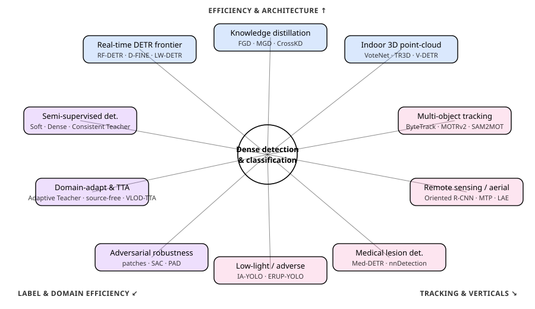

A Mermaid version of the same lattice:

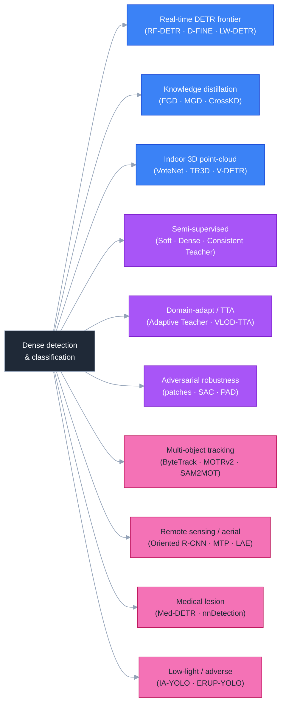

---

## 3. The real-time DETR frontier (2024-2026)

Earlier installments introduced real-time DETRs and YOLO26 at the
headline level. The story since is that the **DETR family caught and
passed the YOLO Pareto curve** at every latency band, culminating in
RF-DETR clearing 60 AP in real time.

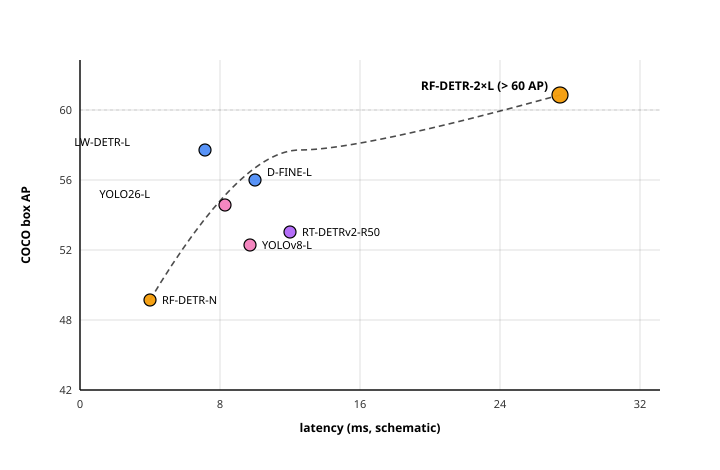

*(Schematic — point positions are illustrative, not exact benchmark
coordinates; see each paper for author-reported AP / latency.)*

### 3.1 The RT-DETR line

- **RT-DETR** ([arXiv:2304.08069](https://arxiv.org/abs/2304.08069))
  — the first DETR to beat YOLO on the speed–accuracy trade-off, via
  an efficient hybrid encoder that decouples intra-scale interaction
  from cross-scale fusion, plus IoU-aware query selection. NMS-free.
- **RT-DETRv2** ([arXiv:2407.17140](https://arxiv.org/abs/2407.17140))
  — a "bag-of-freebies" refresh: selective multi-scale deformable
  attention, discrete sampling, and a tuned training recipe that lifts
  AP with no inference-time cost.
- **RT-DETRv4** ([arXiv:2510.25257](https://arxiv.org/abs/2510.25257))
  — "painlessly" injects **vision-foundation-model** features into the
  RT-DETR encoder, closing the gap to NAS-tuned specialists without a
  search budget.

### 3.2 The D-FINE / LW-DETR / RF-DETR wave

- **LW-DETR** ([arXiv:2406.03459](https://arxiv.org/abs/2406.03459))
  — a *plain-ViT* DETR (no hierarchical backbone) that, with the right
  pretraining, beats YOLO on real-time COCO; it became the template
  RF-DETR builds on.
- **D-FINE** ([arXiv:2410.13842](https://arxiv.org/abs/2410.13842))
  — reframes box regression as **Fine-grained Distribution
  Refinement**: instead of predicting four scalars, the decoder
  iteratively refines a probability distribution over edge offsets,
  plus a self-distillation ("GO-LSD") of localisation knowledge across
  decoder layers.
- **RF-DETR** ([arXiv:2511.09554](https://arxiv.org/abs/2511.09554),
  ICLR '26) — weight-sharing **neural architecture search** over a
  DINOv2-pretrained LW-DETR supernet, discovering an
  accuracy–latency Pareto curve *per target dataset*. RF-DETR-N hits
  48.0 AP on COCO (≈ +5.3 over D-FINE-N at matched latency), and
  RF-DETR-2×L is the **first real-time detector to clear 60 AP on
  COCO**; on Roboflow100-VL it beats Grounding-DINO-tiny by 1.2 AP at
  ~20× the speed.

### 3.3 The YOLO line keeps moving

- **YOLOv10** ([arXiv:2405.14458](https://arxiv.org/abs/2405.14458))
  — **NMS-free** YOLO via consistent dual assignments; removes the
  last non-end-to-end bottleneck of the YOLO family.
- **YOLOv12** ([arXiv:2502.12524](https://arxiv.org/abs/2502.12524))
  — an *attention-centric* YOLO (area attention + residual ELAN) that
  keeps real-time speed while importing transformer-style global
  context.
- **YOLO26** ([arXiv:2509.25164](https://arxiv.org/abs/2509.25164),
  see May-07) — the latest Ultralytics line tuned for low-power /
  latency-sensitive edge inference.

### 3.4 Why DETR won the latency race

The throughline: NMS removal (latency variance gone), distributional
box heads (better localisation per FLOP), plain-ViT backbones
(reuse of DINOv2/v3 pretraining), and finally NAS to specialise the
whole stack to the deployment budget.

---

## 4. Knowledge distillation for detection

Detection KD is harder than classification KD: the signal is dominated
by background, the foreground/background imbalance corrupts naive
feature mimicking, and the teacher's *localisation* knowledge lives in
a different head than its *classification* knowledge. The 2025 review
([arXiv:2508.03317](https://arxiv.org/abs/2508.03317)) is the current
map of the field.

### 4.1 Feature-level distillation (the CNN era)

- **FitNets** ([arXiv:1412.6550](https://arxiv.org/abs/1412.6550))
  — the original "hint" layer; mimics intermediate features.
- **FGD — Focal and Global Distillation**
  ([arXiv:2111.11837](https://arxiv.org/abs/2111.11837)) — separates
  foreground from background (focal) and adds a global relation term;
  the standard dense-detector KD baseline.
- **MGD — Masked Generative Distillation**
  ([arXiv:2205.01529](https://arxiv.org/abs/2205.01529)) — masks
  random student features and forces them to *regenerate* the
  teacher's, shifting from mimicking to generation.
- **PKD — Pearson-correlation KD**
  ([arXiv:2207.02039](https://arxiv.org/abs/2207.02039)) — distills
  normalised feature *correlation* rather than magnitude, immune to
  teacher/student scale mismatch.

### 4.2 Localisation & logit distillation

- **LD — Localization Distillation**
  ([arXiv:2102.12252](https://arxiv.org/abs/2102.12252)) — shows that
  the teacher's **bounding-box distribution** carries more transferable
  knowledge than its features; flips the "features > logits" dogma for
  detection.
- **CrossKD — Cross-Head Knowledge Distillation**
  ([arXiv:2306.11369](https://arxiv.org/abs/2306.11369)) — feeds the
  student's intermediate head features through the *teacher's* head,
  so the student is not torn between the hard labels and the teacher's
  soft predictions. Lifts GFL-R50 from 40.2 → 43.7 AP on COCO with
  prediction-mimicking losses alone.
- **Bridging Cross-task Protocol Inconsistency**
  ([arXiv:2308.14286](https://arxiv.org/abs/2308.14286)) — reconciles
  the classification-KL vs. regression-objective mismatch in dense
  detectors.

### 4.3 Distilling DETRs

The 2025 frontier: DETR outputs are an *unordered set* matched by
Hungarian assignment, so there is no fixed grid to align logits to.
Approaches: distill **query** features after matching the student's
queries to the teacher's, distill the **attention maps**, or distill
the **encoder** features and let the decoder follow. The review above
organises these into query-level, feature-level, and logit-level
families for transformer detectors.

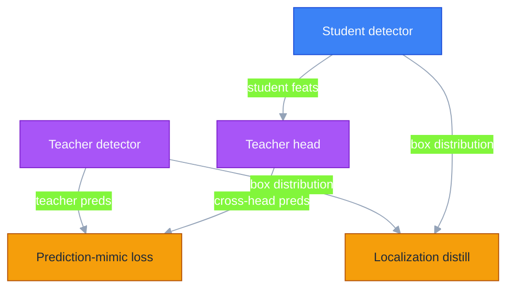

The practical recipe in 2026: **FGD/MGD on the neck + CrossKD/LD on
the head**, which together let a ResNet-50 student recover most of a
Swin-L teacher's AP at a fraction of the FLOPs.

---

## 5. Semi-supervised object detection

SSOD trains on a small labelled set plus a large unlabelled pool. The
dominant recipe is **teacher–student mutual learning**: an EMA teacher
pseudo-labels weakly-augmented images, the student trains on
strongly-augmented copies. The
[CNN→Transformer survey](https://arxiv.org/abs/2407.08460) is the
reference map.

### 5.1 The pseudo-label lineage

- **STAC** ([arXiv:2005.04757](https://arxiv.org/abs/2005.04757)) —
  the offline two-stage baseline: train, pseudo-label, retrain.
- **Unbiased Teacher**
  ([arXiv:2102.09480](https://arxiv.org/abs/2102.09480)) — EMA teacher
  + focal loss to fight the pseudo-label class imbalance; the first
  strong online recipe.
- **Soft Teacher** ([arXiv:2106.09018](https://arxiv.org/abs/2106.09018))
  — weights each pseudo-box by the teacher's classification score and
  adds box-jitter consistency for the regression branch.
- **Unbiased Teacher v2**
  ([arXiv:2206.09500](https://arxiv.org/abs/2206.09500)) — extends the
  recipe to anchor-free detectors with a listen-to-student mechanism.

### 5.2 Dense / consistency-driven pseudo-labels

- **Dense Teacher**
  ([arXiv:2207.02541](https://arxiv.org/abs/2207.02541)) — drops the
  hard pseudo-*boxes* in favour of **dense pseudo-labels** (the
  teacher's logit map), removing the post-processing & threshold
  brittleness.
- **DTG-SSOD**
  ([arXiv:2207.05536](https://arxiv.org/abs/2207.05536)) —
  "dense-to-dense" teacher guidance; the teacher's dense predictions
  directly supervise the student.
- **Consistent-Teacher**
  ([arXiv:2209.01589](https://arxiv.org/abs/2209.01589)) — fixes the
  *inconsistency* between pseudo-targets and anchor assignment across
  epochs via adaptive anchor assignment + feature alignment; one of
  the strongest CNN baselines.

### 5.3 End-to-end DETR SSOD

- **Semi-DETR** ([arXiv:2307.08095](https://arxiv.org/abs/2307.08095))
  — the first DETR-native SSOD: a stage-wise hybrid matching that
  copes with the one-to-one assignment's instability on noisy
  pseudo-labels.
- **Sparse Semi-DETR**
  ([arXiv:2404.01819](https://arxiv.org/abs/2404.01819)) — a learnable
  query refinement that filters low-quality queries, fixing the
  small-object & duplicate-query failures of DETR pseudo-labelling.

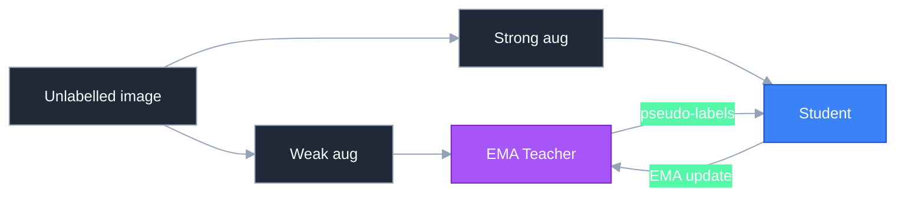

The 2026 takeaway: **dense pseudo-labels + consistency** is the safe
default for CNNs; for DETRs the matching instability is the real
problem and Semi-DETR / Sparse Semi-DETR are the answers.

---

## 6. Domain-adaptive, source-free & test-time detection

A detector trained on clear daytime data collapses on night / fog /
a new city. Domain-adaptive object detection (DAOD) closes that gap;
the 2025 shift is towards **source-free** (no source data at
adaptation) and **test-time** (adapt online, no target labels)
settings, increasingly bootstrapped by foundation models.

### 6.1 Classic feature-alignment DAOD

- **DA-Faster** ([arXiv:1803.03243](https://arxiv.org/abs/1803.03243))
  — image- and instance-level domain classifiers with a gradient-
  reversal layer; the origin of adversarial DAOD.
- **Strong-Weak (SWDA)**
  ([arXiv:1812.04798](https://arxiv.org/abs/1812.04798)) — strong
  local + weak global alignment, the recipe everyone forked.
- **Adaptive Teacher**
  ([arXiv:2111.13216](https://arxiv.org/abs/2111.13216)) — a
  mean-teacher with adversarial feature alignment; still the strong
  Cityscapes→Foggy baseline.
- **Probabilistic Teacher**
  ([arXiv:2206.06293](https://arxiv.org/abs/2206.06293)) — models
  pseudo-label uncertainty as distributions for more stable
  adaptation.

### 6.2 Source-free DAOD

- **Leveraging Confident Image Regions**
  ([arXiv:2501.10081](https://arxiv.org/abs/2501.10081)) — selects
  high-confidence regions as anchors for adaptation without any source
  data.
- **Source-Free Object Detection with Detection Transformer**
  ([arXiv:2510.11090](https://arxiv.org/abs/2510.11090)) — the DETR
  version of source-free adaptation; handles the query collapse that
  CNN recipes do not.
- **Foundation Model Priors Enhance Object Focus**
  ([arXiv:2512.17514](https://arxiv.org/abs/2512.17514)) — uses a
  frozen foundation model to re-focus features on objects during
  source-free adaptation.

### 6.3 Test-time adaptation (TTA)

- **Continual TTA for detection**
  ([arXiv:2406.16439](https://arxiv.org/abs/2406.16439)) — gradually
  adapts to *continually changing* target domains without forgetting.
- **VLOD-TTA**
  ([arXiv:2510.00458](https://arxiv.org/abs/2510.00458)) — test-time
  adaptation of **vision-language open-vocab detectors**; adapts the
  prompts / features online to the test stream.
- **Test-Time Adaptive Detection with Foundation Model**
  ([arXiv:2510.25175](https://arxiv.org/abs/2510.25175)) — a
  foundation model supplies stable pseudo-labels for online
  self-training.
- **Embodied Domain Adaptation**
  ([arXiv:2506.21860](https://arxiv.org/abs/2506.21860)) — adaptation
  under sequential changes in lighting, layout, and object diversity,
  the embodied-agent setting.

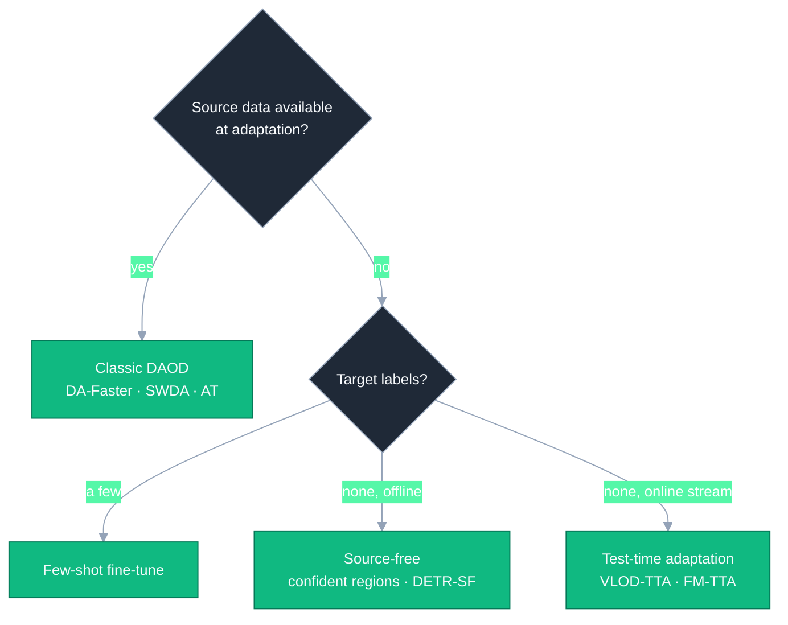

The 2026 rule of thumb: if you cannot ship the source data (privacy /
size), reach for a **foundation-model-anchored source-free or TTA**
recipe — the frozen prior is what keeps online self-training from
drifting.

---

## 7. Multi-object tracking in the SAM 2 era

MOT has two camps: **tracking-by-detection** (detect each frame, then
associate) and **tracking-by-query** (transformer track queries
persist across frames). The 2024-26 disruption is a third:
**tracking-by-segmentation** on top of SAM 2.

### 7.1 Tracking-by-detection (still the workhorse)

- **SORT / DeepSORT**
  ([arXiv:1602.00763](https://arxiv.org/abs/1602.00763),
  [arXiv:1703.07402](https://arxiv.org/abs/1703.07402)) — Kalman +
  Hungarian, optionally with an appearance embedding.
- **ByteTrack** ([arXiv:2110.06864](https://arxiv.org/abs/2110.06864))
  — associate *every* detection box, even low-score ones; a one-page
  idea that still tops many leaderboards.
- **OC-SORT** ([arXiv:2203.14360](https://arxiv.org/abs/2203.14360))
  — observation-centric re-update fixes the Kalman filter's drift
  during occlusion; the strong motion-only baseline.
- **BoT-SORT** ([arXiv:2206.14651](https://arxiv.org/abs/2206.14651))
  & **StrongSORT**
  ([arXiv:2202.13514](https://arxiv.org/abs/2202.13514)) — camera-
  motion compensation + appearance ReID glued onto the SORT skeleton.

### 7.2 Tracking-by-query (transformer)

- **TrackFormer / TransTrack**
  ([arXiv:2101.02702](https://arxiv.org/abs/2101.02702),
  [arXiv:2012.15460](https://arxiv.org/abs/2012.15460)) — track
  queries that auto-regress across frames.
- **MOTR / MOTRv2**
  ([arXiv:2105.03247](https://arxiv.org/abs/2105.03247),
  [arXiv:2211.09791](https://arxiv.org/abs/2211.09791)) — fully
  end-to-end DETR tracking; v2 bolts on a YOLOX proposal generator to
  fix MOTR's weak detection.
- **MeMOTR** ([arXiv:2307.15700](https://arxiv.org/abs/2307.15700))
  — long-term memory-augmented track queries.
- **MOTIP** ([arXiv:2403.16848](https://arxiv.org/abs/2403.16848)) —
  recasts association as **ID prediction**, dropping the hand-tuned
  matching entirely.

### 7.3 Tracking-by-segmentation (SAM 2 era)

- **SAMURAI** ([arXiv:2411.11922](https://arxiv.org/abs/2411.11922))
  — motion-aware memory selection on top of SAM 2 for zero-shot visual
  tracking; no training.
- **SAM2MOT** ([arXiv:2504.04519](https://arxiv.org/abs/2504.04519))
  — track-by-segmentation that self-generates boxes; **beats
  ByteTrack across detectors on DanceTrack** while recovering true
  positives the detector missed.
- **Seg2Track-SAM2**
  ([arXiv:2509.11772](https://arxiv.org/abs/2509.11772)) — plugs any
  pretrained detector into SAM 2 for init / association / refinement;
  detector-agnostic and dataset-fine-tune-free.
- **HiM2SAM** ([arXiv:2507.07603](https://arxiv.org/abs/2507.07603))
  — hierarchical motion estimation + memory optimisation for long-term
  tracking.
- **AR-MOT** ([arXiv:2601.01925](https://arxiv.org/abs/2601.01925)) —
  autoregressive MOT, a 2026 take on query propagation.

For the broader landscape see the
[modern MOT review](https://arxiv.org/abs/2209.04796).

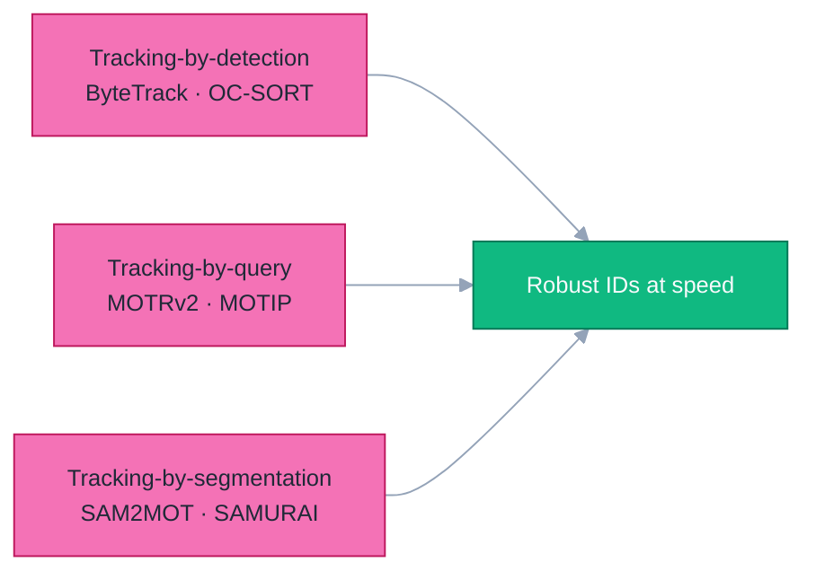

The pragmatic 2026 stance: **ByteTrack/OC-SORT for real-time
production**, transformer trackers when end-to-end training is
affordable, and **SAM 2 trackers for zero-shot / pixel-precise**
tracking where masks matter more than fps.

---

## 8. Adversarial robustness & physical attacks

A detector that ships into the physical world can be fooled by a
printed patch. The threat model splits into three goals: **hiding** an
object (make a person invisible), **creating** a phantom object, and
**altering** a label.

### 8.1 Attacks

- **Adversarial Patch**
  ([arXiv:1712.09665](https://arxiv.org/abs/1712.09665)) — the
  universal, printable patch that started the physical-attack line.
- **DPatch** ([arXiv:1806.02299](https://arxiv.org/abs/1806.02299))
  — the first patch that simultaneously attacks the bounding-box
  *and* class outputs of detectors.
- **Fooling automated surveillance**
  ([arXiv:1904.08653](https://arxiv.org/abs/1904.08653)) — the famous
  "person-hiding" cardboard patch against YOLOv2.
- **Adversarial T-shirt**
  ([arXiv:1910.11099](https://arxiv.org/abs/1910.11099)) — a
  non-rigid, wearable patch robust to body deformation.
- **Transferable physical patches vs. pedestrian detectors**
  ([arXiv:2604.22552](https://arxiv.org/abs/2604.22552)) — a 2026
  study of cross-model transferable physical-world patches.

### 8.2 Defenses

- **Segment-and-Complete (SAC)**
  ([arXiv:2112.04532](https://arxiv.org/abs/2112.04532)) — detect the
  patch region with a patch segmenter, then mask & inpaint it.
- **PAD — Patch-Agnostic Defense**
  ([arXiv:2404.16452](https://arxiv.org/abs/2404.16452)) — defends
  without prior knowledge of patch shape / size / location, using
  semantic & entropy cues.
- **Certified: DetectorGuard / ObjectSeeker**
  ([arXiv:2102.02956](https://arxiv.org/abs/2102.02956),
  [arXiv:2202.01811](https://arxiv.org/abs/2202.01811)) — *provable*
  robustness guarantees against patch hiding, via masking ensembles.
- **Revisiting Adversarial Patch Defenses**
  ([arXiv:2508.00649](https://arxiv.org/abs/2508.00649)) — a 2025
  re-evaluation showing many empirical defenses break under adaptive
  attacks.
- **Robustness in unmanned stores**
  ([arXiv:2505.08835](https://arxiv.org/abs/2505.08835)) — a
  deployment-grade study of patch attacks against retail detectors.

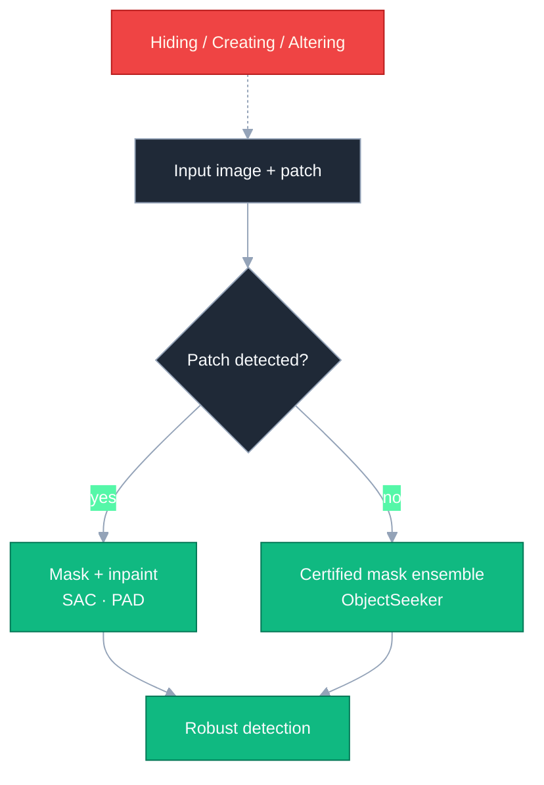

The honest 2026 summary: **empirical defenses keep losing to adaptive
attacks** (per the 2508 re-evaluation), so safety-critical deployments
increasingly want certified guarantees despite their AP cost.

---

## 9. Remote-sensing / aerial oriented detection

Overhead imagery breaks two assumptions of natural-image detection:
objects are **arbitrarily oriented** (a ship at 40°) and **tiny &
dense** (a parking lot of cars). The field answers with **oriented
bounding boxes (OBB)** and, increasingly, **RS-specific foundation
backbones**. (Generic small-object / SAR / UAV threads were covered
May-16; this is the oriented + foundation-model angle.)

### 9.1 Oriented detectors

- **DOTA** ([arXiv:1711.10398](https://arxiv.org/abs/1711.10398)) —
  the benchmark that defined OBB evaluation in aerial images.
- **RoI Transformer**
  ([arXiv:1812.00155](https://arxiv.org/abs/1812.00155)) — learns to
  transform horizontal RoIs into rotated ones.
- **Oriented R-CNN**
  ([arXiv:2108.05699](https://arxiv.org/abs/2108.05699)) — a clean,
  fast oriented RPN; still a default two-stage OBB baseline.
- **Oriented RepPoints**
  ([arXiv:2105.11111](https://arxiv.org/abs/2105.11111)) — point-set
  representation that adapts to oriented & non-axis-aligned shapes.
- **S²A-Net** ([arXiv:2008.09397](https://arxiv.org/abs/2008.09397))
  — feature alignment between the classification and oriented-box
  regression branches.

### 9.2 The angle-regression problem

OBB angle regression suffers **boundary discontinuity** (the
loss explodes at the periodic angle wrap-around). The fix is to model
boxes as distributions:

- **GWD — Gaussian Wasserstein Distance**
  ([arXiv:2101.11952](https://arxiv.org/abs/2101.11952)) — represent
  each OBB as a 2-D Gaussian, regress the Wasserstein distance; smooth
  & boundary-free.
- **KLD — Kullback-Leibler Divergence loss**
  ([arXiv:2106.01883](https://arxiv.org/abs/2106.01883)) — the KL
  version, with self-modulated optimisation; the strongest OBB loss.

### 9.3 RS foundation backbones & open-vocab

- **RVSA — Plain ViT towards a RS foundation model**
  ([arXiv:2208.03987](https://arxiv.org/abs/2208.03987)) — rotated
  varied-size window attention; the first ViT tuned for RS detection.
- **MTP — Multi-Task Pretraining**
  ([arXiv:2403.13430](https://arxiv.org/abs/2403.13430)) — pretrains a
  RS foundation backbone with detection / segmentation heads jointly.
- **RingMo-Agent**
  ([arXiv:2507.20776](https://arxiv.org/abs/2507.20776)) — a unified
  multi-platform / multi-modal RS foundation model with reasoning.
- **LAE — Locate Anything on Earth**
  ([arXiv:2408.09110](https://arxiv.org/abs/2408.09110)) — open-vocab
  detection for the RS community, with a large RS detection-text
  corpus.
- **HA-RDet** ([arXiv:2412.14379](https://arxiv.org/abs/2412.14379))
  — hybrid-anchor rotation detector balancing anchor density vs cost.
- **RiO-DETR** ([arXiv:2603.09411](https://arxiv.org/abs/2603.09411))
  — a 2026 **real-time oriented DETR**, bringing the §3 NMS-free
  philosophy to OBB.
- **Open-Text Aerial Detection**
  ([arXiv:2602.07827](https://arxiv.org/abs/2602.07827)) — a 2026
  unified framework for aerial visual grounding + detection.

The 2026 recipe: **RVSA/MTP backbone → oriented head → KLD loss**,
with LAE-style open-vocab when the class list is not fixed.

---

## 10. Medical lesion detection

Medical detection is its own world: 3-D volumes (CT / MRI), extreme
class imbalance (one nodule in a full chest CT), few labels, and a
*high cost of a miss*. DETR struggled here for years; 2025 changed
that.

### 10.1 Self-configuring & CNN baselines

- **nnDetection**
  ([arXiv:2106.00817](https://arxiv.org/abs/2106.00817)) — the
  "nnU-Net of detection": auto-configures the whole pipeline per
  dataset; still the baseline every medical-detection paper must beat.
- **DeepLesion / RetinaNet-3D**
  ([arXiv:1710.01766](https://arxiv.org/abs/1710.01766)) — the
  large-scale CT lesion dataset that anchored the CNN era.

### 10.2 DETR comes to medicine

- **Understanding DETR on natural vs. medical images**
  ([MELBA 2025:009](https://www.melba-journal.org/papers/2025:009.html))
  — a careful study of *why* DETR transfers poorly to medical images
  (small objects, few labels, no large pretraining corpus) and what
  fixes it.
- **Exemplar Med-DETR**
  ([arXiv:2507.19621](https://arxiv.org/abs/2507.19621)) — a
  multi-modal **contrastive** detector using cross-attention with
  class-specific *exemplar* features; SOTA across three modalities
  (mammography, chest X-ray, CT) on four public datasets, and the
  clearest signal that exemplar/contrastive heads are the way to make
  DETR work with few medical labels.

### 10.3 Modality verticals

- **Mammography** — deep systems now approach radiologist sensitivity
  on large multi-institutional screening sets; synthetic-data
  augmentation (GAN / diffusion) measurably helps the rare-malignant
  tail.
- **Polyp detection (colonoscopy)** — real-time YOLO / DETR variants
  for live endoscopy; the clinical bar is *sensitivity at video rate*.
- **Pulmonary nodules (CT)** — 3-D detection where nnDetection-style
  pipelines and FROC (not mAP) are the metric of record.

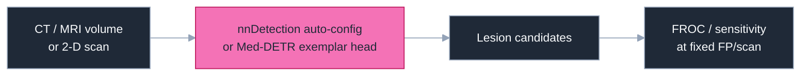

The honest caveat: medical detection is judged by **sensitivity at a
fixed false-positive rate (FROC)**, not COCO mAP — a model can win mAP
and still be clinically useless if it misses the rare malignant case.

---

## 11. Low-light & adverse-weather detection

Rain, fog, and night degrade the *image*, not the detector. The naive
fix — "denoise / dehaze, then detect" — often *hurts*, because the
restoration model optimises human-perceptual quality, not detection
features. The 2024-26 answer is **task-driven, restoration-aware**
detection. (RGB-thermal fusion was covered May-16; this is the
RGB-only enhancement angle.)

### 11.1 Image-adaptive / differentiable enhancement

- **IA-YOLO — Image-Adaptive YOLO**
  ([arXiv:2112.08088](https://arxiv.org/abs/2112.08088)) — a small CNN
  predicts the parameters of differentiable image-processing filters
  (defog, white-balance, gamma), trained **end-to-end with the
  detection loss**; the enhancement is learned *for* detection.
- **GDIP — Gated Differentiable Image Processing**
  ([arXiv:2209.14922](https://arxiv.org/abs/2209.14922)) — gates a
  bank of differentiable filters so the network picks the right
  enhancement per condition.
- **ERUP-YOLO**
  ([arXiv:2411.02799](https://arxiv.org/abs/2411.02799)) — unified
  image-adaptive processing (Bézier pixel-wise + kernel-based local
  filters) covering fog *and* low-light in one model.

### 11.2 Restoration-aware & feature-level

- **FeatEnHancer**
  ([arXiv:2308.03594](https://arxiv.org/abs/2308.03594)) —
  hierarchically enhances **features** (not pixels) for downstream
  low-light tasks.
- **Unsupervised Variational Translator**
  ([arXiv:2408.08149](https://arxiv.org/abs/2408.08149)) — bridges
  restoration and high-level vision without paired data, so the
  enhancer and the detector agree on what "clean" means.
- **FRBNet** ([arXiv:2510.23444](https://arxiv.org/abs/2510.23444))
  — a 2025 frequency-domain radial-basis network revisiting low-light
  vision.

### 11.3 Why "enhance then detect" fails

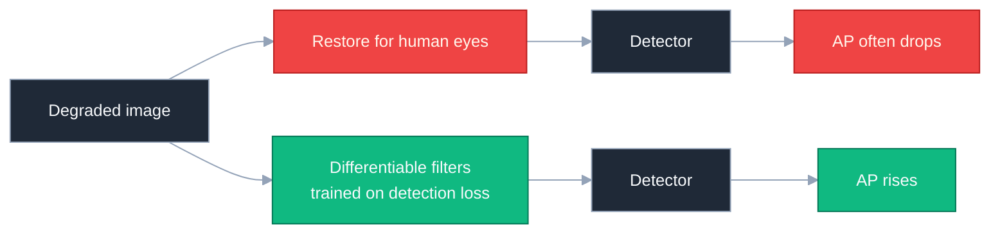

The 2026 rule: **never optimise the enhancer for PSNR/SSIM if the
consumer is a detector** — train the filters end-to-end on the
detection objective, or enhance in feature space.

---

## 12. Indoor 3D point-cloud detection

Outdoor AV 3-D detection was covered May-17 (BEVFusion / CenterPoint /
VoxelNeXt). Indoor is a different regime: dense RGB-D point clouds
(ScanNet, SUN RGB-D), heavy clutter, axis-aligned-ish furniture, and
no LiDAR sparsity prior. The arc runs from **voting** to **fully
sparse** to **query-based**.

### 12.1 The voting era

- **VoteNet** ([arXiv:1904.09664](https://arxiv.org/abs/1904.09664))
  — Hough-style deep voting: seed points vote for object centres, then
  cluster & classify. The reference baseline for a generation.
- **H3DNet** ([arXiv:2006.05682](https://arxiv.org/abs/2006.05682))
  — predicts a hybrid set of geometric primitives (centres, edges,
  faces) for more robust proposals.
- **Group-Free 3D**
  ([arXiv:2104.00678](https://arxiv.org/abs/2104.00678)) — drops the
  hand-grouped voting and lets attention assign points to objects.

### 12.2 Fully-sparse anchor-free

- **FCAF3D** ([arXiv:2112.00322](https://arxiv.org/abs/2112.00322))
  — fully-convolutional anchor-free 3-D detection on sparse voxels;
  no hand-tuned anchors, strong on ScanNet & SUN RGB-D.
- **TR3D** ([arXiv:2302.02858](https://arxiv.org/abs/2302.02858)) — a
  lean, fast successor to FCAF3D tuned for real-world latency.
- **CAGroup3D** ([arXiv:2210.04264](https://arxiv.org/abs/2210.04264))
  — class-aware 3-D proposal grouping with a two-stage refinement.

### 12.3 Query-based (DETR for point clouds)

- **3DETR** ([arXiv:2109.08141](https://arxiv.org/abs/2109.08141)) —
  the first end-to-end transformer 3-D detector; a near-vanilla
  transformer on point sets, no 3-D inductive bias.
- **V-DETR** ([arXiv:2308.04409](https://arxiv.org/abs/2308.04409)) —
  adds a **3-D vertex relative-position encoding** so the decoder
  respects point geometry; SOTA on ScanNetV2.
- **Uni3DETR** ([arXiv:2310.05699](https://arxiv.org/abs/2310.05699))
  — a single DETR-style detector that works **indoor *and* outdoor**,
  a step toward a universal 3-D detector.

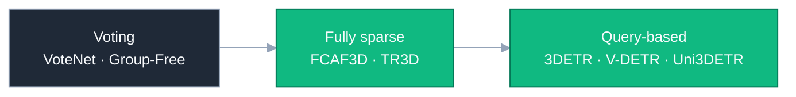

The 2026 indoor default is **FCAF3D/TR3D** when you want speed and a
simple anchor-free CNN, **V-DETR** when you want top ScanNet accuracy,
and **Uni3DETR** when one model must serve both indoor and outdoor.

---

## 13. Reading list

Curated, in approximate order of "read this first":

1. **RF-DETR** ([arXiv:2511.09554](https://arxiv.org/abs/2511.09554))
   — the current real-time-detection state of the art; first past
   60 AP on COCO in real time.
2. **D-FINE** ([arXiv:2410.13842](https://arxiv.org/abs/2410.13842))
   — the distributional box head that reset the DETR Pareto curve.
3. **CrossKD** ([arXiv:2306.11369](https://arxiv.org/abs/2306.11369))
   + **KD-for-detection review**
   ([arXiv:2508.03317](https://arxiv.org/abs/2508.03317)) — the modern
   distillation playbook.
4. **Consistent-Teacher**
   ([arXiv:2209.01589](https://arxiv.org/abs/2209.01589)) +
   **Semi-DETR** ([arXiv:2307.08095](https://arxiv.org/abs/2307.08095))
   — semi-supervised detection for CNNs and DETRs.
5. **Adaptive Teacher**
   ([arXiv:2111.13216](https://arxiv.org/abs/2111.13216)) — the DAOD
   baseline; pair with the source-free DETR paper
   ([arXiv:2510.11090](https://arxiv.org/abs/2510.11090)).
6. **SAM2MOT** ([arXiv:2504.04519](https://arxiv.org/abs/2504.04519))
   — the clearest demonstration of track-by-segmentation beating
   ByteTrack.
7. **SAC** ([arXiv:2112.04532](https://arxiv.org/abs/2112.04532)) +
   **Revisiting Patch Defenses**
   ([arXiv:2508.00649](https://arxiv.org/abs/2508.00649)) — the attack/
   defense reality check.
8. **Oriented R-CNN**
   ([arXiv:2108.05699](https://arxiv.org/abs/2108.05699)) + **KLD**
   ([arXiv:2106.01883](https://arxiv.org/abs/2106.01883)) — the OBB
   essentials.
9. **Exemplar Med-DETR**
   ([arXiv:2507.19621](https://arxiv.org/abs/2507.19621)) — DETR that
   finally works in medicine.
10. **IA-YOLO** ([arXiv:2112.08088](https://arxiv.org/abs/2112.08088))
    — the canonical restoration-aware detector.
11. **V-DETR** ([arXiv:2308.04409](https://arxiv.org/abs/2308.04409))
    — query-based indoor 3-D detection done right.

### Cross-section pointers from earlier installments

- Real-time DETRs at the headline level: see May-07.
- Open-vocabulary / Grounding-DINO / DINO-X: see May-17 §6.
- 3D AV / BEV / occupancy (outdoor 3-D): see May-17 §3-5.
- Small-object / UAV / SAR / RGB-T: see May-16.
- DETR PTQ / quantisation: see May-15 §9.
- Foundation backbones (DINOv3 / Co-DETR): see May-17 §7, May-07.
- Conformal prediction / risk control / calibration: see May-05.

---

*Compiled with public arXiv / journal / project-page sources; numbers
quoted from author-reported metrics on standard public splits, and the
accuracy–latency figure is schematic. Diagrams are standalone SVG and
Mermaid; both adapt to light- and dark-mode via `currentColor` and
Mermaid theme tokens. Some 2026 arXiv identifiers point to very recent
preprints and may update.*
