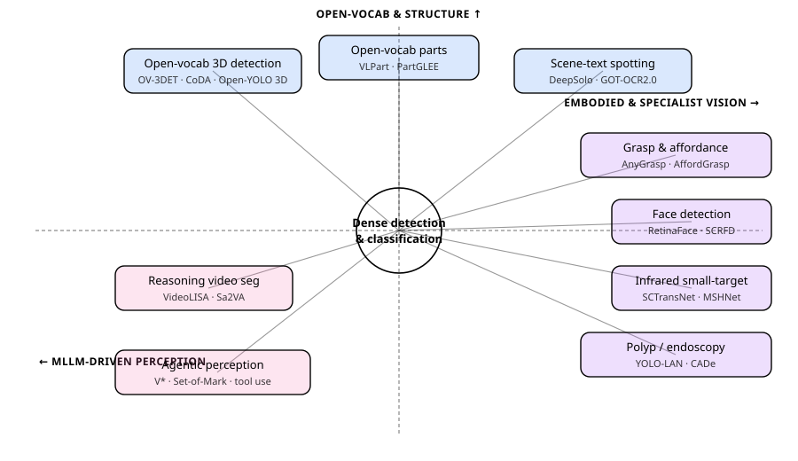
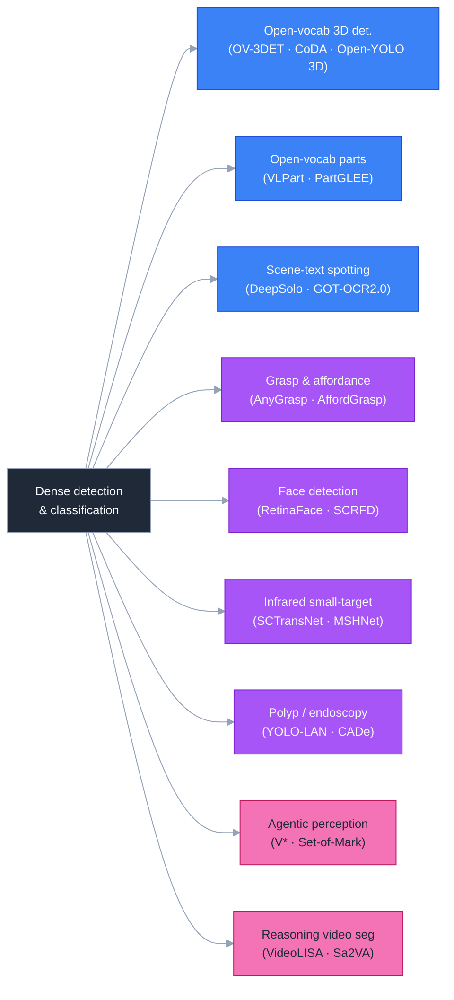
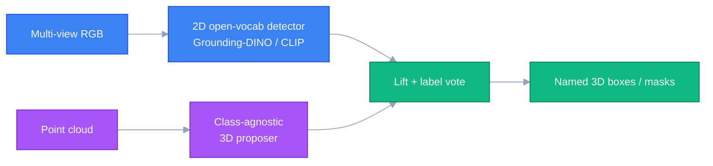
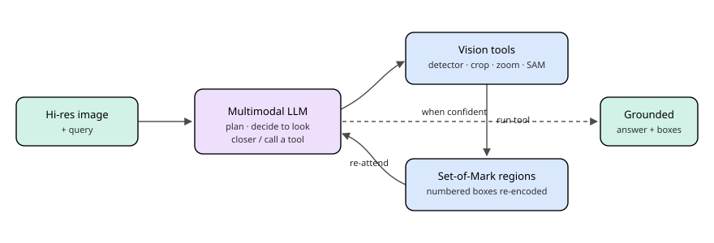

# Dense Object Detection & Classification — Recent Advances

*Compiled 2026-Jun-09 (America/Los_Angeles).*

Twelfth installment in the running CV-updates log
([Apr-30](../2026-Apr-30/2026-Apr-30_CV_updates.md),
[May-01](../2026-May-01/2026-May-01_CV_updates.md),
[May-02](../2026-May-02/2026-May-02_CV_updates.md),
[May-04](../2026-May-04/2026-May-04_CV_updates.md),
[May-05](../2026-May-05/2026-May-05_CV_updates.md),
[May-07](../2026-May-07/2026-May-07_CV_updates.md),
[May-08](../2026-May-08/2026-May-08_CV_updates.md),
[May-15](../2026-May-15/2026-May-15_CV_updates.md),
[May-16](../2026-May-16/2026-May-16_CV_updates.md),
[May-17](../2026-May-17/2026-May-17_CV_updates.md)).
Previous installments worked through real-time DETRs, YOLO26, DINOv3,
SAM 3, Mamba/SSM decoders, diffusion detectors, LiDAR/MOT/event
sensors, camouflaged / open-world detection, multi-modal fusion,
document / defect / wildlife / agriculture verticals, fairness /
federated detection, counting, HOI, action detection, REC/grounding,
6-DoF pose, visual in-context prompting, DETR PTQ, fine-grained
classification, AIGI forensics, small-object / UAV / RGB-T / SAR /
class-incremental / industrial anomaly / sparse-query / unified heads,
and yesterday's pass on 3D autonomous-driving, BEV map, occupancy,
open-vocabulary detection, foundation backbones, detection pretraining,
open-set/OOD, long-tail, active learning, sim-to-real, and microscopy.
Today rotates to threads still untouched: **open-vocabulary 3D
detection**, **robotic grasp & affordance detection**, **scene-text
detection & end-to-end spotting**, **open-vocabulary part
detection/segmentation**, **face detection & landmarks**, **infrared
small-target detection**, **real-time polyp / endoscopy detection**,
**agentic "thinking-with-images" perception**, and **referring &
reasoning video object segmentation**.

---

## Table of contents

1. [What's new since May-17](#1-whats-new-since-may-17)
2. [Topic map](#2-topic-map)
3. [Open-vocabulary 3D detection & instance segmentation](#3-open-vocabulary-3d-detection--instance-segmentation)
4. [Robotic grasp & affordance detection](#4-robotic-grasp--affordance-detection)
5. [Scene-text detection & end-to-end spotting](#5-scene-text-detection--end-to-end-spotting)
6. [Open-vocabulary part detection & segmentation](#6-open-vocabulary-part-detection--segmentation)
7. [Face detection & facial landmarks](#7-face-detection--facial-landmarks)
8. [Infrared small-target detection](#8-infrared-small-target-detection)
9. [Real-time polyp / endoscopy detection](#9-real-time-polyp--endoscopy-detection)
10. [Agentic "thinking-with-images" perception](#10-agentic-thinking-with-images-perception)
11. [Referring & reasoning video object segmentation](#11-referring--reasoning-video-object-segmentation)
12. [Reading list](#12-reading-list)

---

## 1. What's new since May-17

| Thread                          | One-line take                                                                                                                                              |
| ------------------------------- | ---------------------------------------------------------------------------------------------------------------------------------------------------------- |
| Open-vocab 3D detection         | The 2D→3D lift (VLM labels on RGB, cluster into boxes) is now the dominant recipe; **Open-YOLO 3D** shows you can skip 3D point-VLMs entirely and still win. |
| Grasp & affordance              | **AnyGrasp** is the 6/7-DoF workhorse; the 2025 move is to put a VLM in front of it for **task-oriented, language-conditioned** grasping (AffordGrasp).      |
| Scene-text spotting             | DETR-style single-decoder spotters (**DeepSolo**) and OCR-2.0 generalists (**GOT-OCR2.0**) collapse detect+recognise into one model.                         |
| Open-vocab parts                | **VLPart → PartGLEE** push open-vocab past whole objects to *parts*; hierarchical object→part decoding is the new default.                                   |
| Face detection                  | The field is mature: **RetinaFace / SCRFD** remain the accuracy/efficiency frontier, with YOLO-face variants chasing the lightweight edge.                   |
| Infrared small-target (ISTD)    | Targets are a few pixels with no texture; **SCTransNet / MSHNet / SeRankDet** treat it as background-modelling + scale-sensitive segmentation, not boxes.     |
| Polyp / endoscopy               | Real-time CADe is shipping: anchor-free YOLO-v11-class detectors hit ~99 mAP@0.5 at 30+ FPS; the open problem is flat/sessile lesions and miss-rate.         |
| Agentic perception              | MLLMs now **call detectors as tools**, zoom/crop, and re-encode (V*, Set-of-Mark); "thinking with images" beats single-pass grounding on high-res scenes.    |
| Reasoning video seg             | **VideoLISA / Sa2VA** marry an LLM with SAM 2 — one `<SEG>`/`<TRK>` token segments + tracks the referent across a clip; MeViS/LSVOS are the proving grounds.  |

---

## 2. Topic map

A standalone SVG topic map (light/dark-safe via `currentColor`):

A Mermaid version of the same lattice:

---

## 3. Open-vocabulary 3D detection & instance segmentation

Closed-set 3D detectors (covered May-02, May-17) are stuck with the
~10–18 class taxonomies of nuScenes / ScanNet. **Open-vocabulary 3D
detection (OV-3DDet)** asks a point-cloud model to localise *and* name
objects from arbitrary text — the 3D analogue of Grounding-DINO. The
hard part: there is no internet-scale 3D-text corpus, so every method
borrows semantics from 2D vision-language models.

### 3.1 The 2D→3D lift paradigm

- **OV-3DET** ([arXiv:2304.00788](https://arxiv.org/abs/2304.00788))
  — the seminal indoor recipe: a 2D open-vocab detector annotates RGB
  views, those boxes are lifted to 3D by point-cloud clustering, and a
  3D detector is trained **with no human 3D labels**. Localisation is
  learned from geometry, naming from CLIP-style text.
- **CoDA** ([arXiv:2310.02960](https://arxiv.org/abs/2310.02960)) —
  Collaborative novel-box discovery (3D-NOD) + cross-modal alignment:
  combines 3D geometry priors and 2D open-vocab priors to *discover*
  novel objects during training, not just classify proposals.
- **ImOV3D** ([arXiv:2410.24001](https://arxiv.org/abs/2410.24001)) —
  pushes the idea further: learn OV point-cloud detection **from only
  2D images**, by pseudo-lifting monocular depth into pseudo
  point-clouds. Useful where you have RGB but no LiDAR.
- **FM-OV3D** — pools multiple foundation models (Grounding-DINO for
  proposals, SAM for masks, GPT for prompt expansion, CLIP for naming);
  see the curated [Awesome-Open-Vocabulary-Perception](https://github.com/yangcaoai/Awesome-Open-Vocabulary-Perception)
  list for the fast-moving variant zoo.

### 3.2 Faster & outdoor

- **Open-YOLO 3D** ([arXiv:2406.02548](https://arxiv.org/abs/2406.02548),
  ICLR 2025 Oral) — argues you do **not** need an expensive 3D-text
  model at inference at all: project a class-agnostic 3D proposer's
  masks against cheap 2D open-vocab detections from multi-view RGB,
  then vote labels. ~16× faster than prior OV-3D instance segmentation
  on ScanNet200/Replica at comparable mAP.
- **OpenSight** ([arXiv:2312.08876](https://arxiv.org/abs/2312.08876))
  — a simple LiDAR-based OV framework for the *outdoor / driving*
  setting, where sparse far-range points break the indoor clustering
  trick.
- **OV-SCAN** ([arXiv:2503.06435](https://arxiv.org/abs/2503.06435))
  — semantically-consistent alignment for novel-object discovery;
  tackles the "the lift produced a box but the CLIP name is wrong"
  failure mode head-on.
- **GLRD** ([arXiv:2503.20682](https://arxiv.org/abs/2503.20682)) —
  global-local collaborative reasoning + debate with a probabilistic
  soft-logic layer; an LLM-in-the-loop refinement of OV-3D labels.

### 3.3 Why it sits in a detection report

OV-3DDet is the same closed-set→open-set transition that §6 of May-17
covered for 2D, but with the extra wrinkle that **semantics must be
imported from 2D because 3D-text data barely exists.** Every method is
therefore a study in *how* to lift 2D VLM knowledge into 3D — by
clustering (OV-3DET), by discovery (CoDA), or by skipping 3D-VLMs
entirely at inference (Open-YOLO 3D).

---

## 4. Robotic grasp & affordance detection

Grasp detection is dense prediction with a physics twist: for every
graspable surface, predict a 6- or 7-DoF gripper pose (position +
orientation + width) and a quality score. The 2024-26 shift is from
*geometry-only* grasping to *language-conditioned, task-aware* grasping.

### 4.1 Geometry-driven 6-DoF grasping

- **GraspNet-1Billion** ([project](https://graspnet.net/)) — the
  benchmark that made dense grasp learning tractable: a billion grasp
  annotations across 88 objects in clutter; the standard eval.
- **GSNet / Graspness** ([paper](https://arxiv.org/html/2406.11142v1))
  — "graspness" as a learned per-point scalar that prunes the vast
  empty grasp space before pose regression; the speed/accuracy
  backbone behind much of what follows.
- **Contact-GraspNet** ([arXiv:2103.14127](https://arxiv.org/abs/2103.14127))
  — represents grasps by their contact points on the observed point
  cloud, trained on ~17 M simulated grasps; still a strong real-world
  baseline.
- **AnyGrasp** ([arXiv:2212.08333](https://arxiv.org/abs/2212.08333))
  — billion-scale, self-supervised on point clouds only; emits dense,
  temporally-smooth 7-DoF grasps and tracks them across frames with
  center-of-mass awareness. ~93 % bin-clearing success on 300+ unseen
  objects; the de-facto production grasp engine ([SDK](https://github.com/graspnet/anygrasp_sdk)).

### 4.2 Language- & affordance-conditioned grasping

The frontier is *task-oriented* grasping — "hand me the knife by the
handle," not just "grasp the knife."

- **Grasp-Anything** ([arXiv:2309.09818](https://arxiv.org/abs/2309.09818))
  — a 1 M-scene grasp dataset synthesised from foundation models
  (ChatGPT scene descriptions → diffusion images → grasp masks),
  finally giving language-grounded grasping a training corpus.
- **Open-Vocabulary Part-Based Grasping**
  ([arXiv:2406.05951](https://arxiv.org/abs/2406.05951)) — combines
  open-vocab part segmentation (§6) with grasp sampling so the robot
  can target a *named part* ("the mug's handle").
- **AffordGrasp** — VLM-driven open-vocab task grasping: a model like
  GPT-4o does in-context reasoning over the image+instruction, predicts
  the task-relevant 2D region, and hands it to AnyGrasp to sample
  grasps there; see the affordance-grounding write-up in
  [Complex & Intelligent Systems 2025](https://link.springer.com/article/10.1007/s40747-025-02169-0).
- **VISO-Grasp** ([arXiv:2503.12609](https://arxiv.org/abs/2503.12609))
  — vision-language-informed *active view planning* for grasping under
  occlusion / invisibility; the robot moves to see before it grasps.
- **Corner-Grasp** ([arXiv:2504.01861](https://arxiv.org/abs/2504.01861))
  — multi-action grasp detection with active gripper adaptation in
  heavy clutter.
- **Lightweight Language-driven Grasp**
  ([arXiv:2407.17967](https://arxiv.org/abs/2407.17967)) — a
  conditional consistency model that makes language-conditioned grasp
  generation fast enough for real-time control.

### 4.3 The pattern

The lesson mirrors §3: geometry handles *where you can grasp*; the VLM
imports *what you should grasp and how*, the same 2D→action knowledge
transfer seen across open-vocab perception.

---

## 5. Scene-text detection & end-to-end spotting

Scene text is dense detection of a peculiar class: arbitrarily oriented,
curved, multi-scale instances whose *content* (the transcription)
matters as much as the box. Distinct from the document-layout thread
(May-08), the action here is **end-to-end spotting** — detect and read
in one network.

### 5.1 Detection-only backbones

- **DBNet / DB++** ([arXiv:1911.08947](https://arxiv.org/abs/1911.08947))
  — Differentiable Binarization makes the segmentation→box threshold
  learnable; still the real-time detection workhorse (PaddleOCR/MMOCR
  default).
- Segmentation-based detectors (PSENet, PAN) and regression-based ones
  (EAST) remain the lightweight options where recognition is a separate
  stage.

### 5.2 DETR-style end-to-end spotters

- **TESTR** (CVPR 2022) — a dual-decoder transformer: one decoder for
  polygon control points, one for the character sequence; the first
  clean DETR-style spotter.
- **SPTS** (Single-Point Text Spotting, ACM MM 2022) — radically
  reduces annotation to a *single point* per instance and auto-regresses
  the transcription, showing boxes are not strictly needed for
  supervision.
- **DeepSolo** ([arXiv:2211.10772](https://arxiv.org/abs/2211.10772),
  CVPR 2023) — lets a **single** DETR decoder "solo" both tasks:
  each text instance is a set of ordered point queries that
  simultaneously localise and decode characters. The current reference
  for the single-decoder design.
- **DeepSolo++** ([arXiv:2305.19957](https://arxiv.org/abs/2305.19957))
  — extends DeepSolo to **multilingual** spotting + script
  identification with the same decoder.
- **GoMatching** ([arXiv:2401.07080](https://arxiv.org/abs/2401.07080))
  — a strong, simple **video** text-spotting baseline via long/short-
  term matching; turns an image spotter into a tracker cheaply.

### 5.3 OCR-2.0 generalists

- **GOT-OCR2.0** ([arXiv:2409.01704](https://arxiv.org/abs/2409.01704))
  — a 580 M-param unified encoder-decoder that treats *all* optical
  signals — plain text, formulas, tables, charts, sheet music,
  geometry — as "characters." One model, prompt-controlled output
  (plain / markdown / TikZ / SMILES); a genuine consolidation of the
  detect→recognise→layout stack into a single transformer.

### 5.4 Where the boundary is moving

End-to-end spotters have absorbed detection into recognition, and
OCR-2.0 generalists are now absorbing *both* into a single VLM-style
decoder. The open issues are dense small text (signage at distance),
heavily curved/perspective text, and low-resource scripts — exactly
where the single-decoder point-query formulation still trails
two-stage pipelines.

---

## 6. Open-vocabulary part detection & segmentation

Whole-object open-vocab detection (May-17 §6) saturated quickly; the
next granularity is **parts** — "the dog's *ear*," "the chair's
*leg*." Parts are where fine-grained manipulation (§4), editing, and
attribute reasoning actually happen.

- **VLPart** ([ICCV 2023, code](https://github.com/facebookresearch/VLPart))
  — "Going Denser": parses both open-vocab objects and their parts by
  using DINO features to establish part-level correspondence between
  base and novel categories, so part knowledge transfers from a few
  annotated classes to arbitrary ones.
- **PartGLEE** ([arXiv:2407.16696](https://arxiv.org/abs/2407.16696))
  — a foundation model that recognises and parses *any* object and its
  parts; builds an explicit object→part **hierarchy** and decodes parts
  top-down from their parent object, which stabilises tiny-part
  localisation.
- **Semantic-SAM** ([arXiv:2307.04767](https://arxiv.org/abs/2307.04767))
  — segments and recognises at **any granularity** (part ↔ object),
  with a multi-granularity prompt; the granularity-controllable
  cousin of SAM.
- **PartCLIPSeg / cost-aggregation OVPS**
  ([arXiv:2501.09688](https://arxiv.org/abs/2501.09688)) — 2025
  baselines using fine-grained image-text cost aggregation to sharpen
  part boundaries that whole-object CLIP features smear.
- **LangHOPS** ([arXiv:2510.25263](https://arxiv.org/abs/2510.25263))
  — language-grounded **hierarchical** open-vocab part segmentation;
  pushes the object→part→subpart tree explicitly with an LLM.

The practical payoff is downstream: §4's part-based grasping, fine-
grained classification (May-15), and editing pipelines all consume
open-vocab part masks. The recurring design choice is **top-down**
(detect object, then split into parts; PartGLEE/LangHOPS) vs
**bottom-up** (segment everything, then label granularity;
Semantic-SAM).

---

## 7. Face detection & facial landmarks

Face detection is the most mature dense-detection vertical — a solved-
enough problem that the literature is now about the *efficiency
frontier* on WIDER FACE rather than new accuracy ceilings. It still
earns a section because it underpins recognition, deepfake forensics
(May-15 §11), AR, and driver monitoring.

- **DSFD** ([arXiv:1810.10220](https://arxiv.org/abs/1810.10220)) —
  Dual-Shot Face Detector; the dual-shot feature-enhance design that
  set the late-2010s bar.
- **RetinaFace** ([arXiv:1905.00641](https://arxiv.org/abs/1905.00641))
  — single-stage detector with **joint** box + 5-point landmark + dense
  3D regression; still the accuracy reference and the most-deployed
  alignment front-end.
- **TinaFace** ([arXiv:2011.13183](https://arxiv.org/abs/2011.13183))
  — shows a *generic* one-stage detector (RetinaNet-style), properly
  tuned, already tops WIDER FACE — "face detection is just object
  detection."
- **SCRFD** ([arXiv:2105.04714](https://arxiv.org/abs/2105.04714)) —
  Sample-and-Computation Redistribution: the efficiency winner,
  reallocating capacity across scales/stages for the best accuracy-per-
  FLOP; the standard for on-device.
- **YOLO5Face** ([arXiv:2105.12931](https://arxiv.org/abs/2105.12931))
  — recasts face detection as a YOLO task with a landmark
  regression head; spawned the lineage of YOLOv8/v11-face lightweight
  variants now common in 2024-25 edge work (e.g. GCS-/GMC-YOLOv8).

### What's actually changing in 2024-26

Not the architectures — the *integration*. Face detectors are
increasingly a fixed front-end module inside larger systems
(recognition + ByteTrack tracking, deepfake extractors), and the
research has moved to (a) tiny/hard faces (the WIDER FACE "hard" set,
crowds, distance) and (b) ultra-lightweight (sub-2 MB) variants for
mobile NPUs. RetinaFace + SCRFD remain the two reference points;
everything else is a point on their accuracy/latency curve.

---

## 8. Infrared small-target detection

Infrared small-target detection (ISTD) is dense detection at its most
extreme: targets are often **< 0.15 % of the image** (a handful of
pixels), have **no shape or texture**, low SNR, and sit against
cluttered backgrounds (clouds, sea, terrain). It is the workhorse of
maritime/aerial surveillance and is treated as *segmentation /
background-suppression*, not box regression.

### 8.1 Segmentation-style deep ISTD

- **ACM** (Asymmetric Contextual Modulation, WACV 2021) — the first
  widely-used deep ISTD baseline; fuses top-down and bottom-up context
  so a few-pixel target survives down-sampling.
- **DNANet** ([arXiv:2106.00487](https://arxiv.org/abs/2106.00487)) —
  Dense Nested Attention Network: repeated nested fusion keeps the tiny
  target alive through the encoder depth; long the public SOTA on
  NUAA-SIRST / NUDT-SIRST.
- **SCTransNet** ([arXiv:2401.15583](https://arxiv.org/abs/2401.15583),
  TGRS 2024) — Spatial-Channel Cross Transformer: cross-attention
  between spatial and channel tokens to model the target-vs-background
  difference explicitly.
- **MSHNet** ([CVPR 2024](https://www.researchgate.net/publication/384233888_Infrared_Small_Target_Detection_with_Scale_and_Location_Sensitivity))
  — introduces a **scale- and location-sensitive (SLS) loss** that is
  detector-agnostic and lifts existing models; a rare "loss, not
  architecture" contribution.
- **SeRankDet** (TGRS 2024) — "Pick of the Bunch": selective
  rank-aware attention to beat the hit-rate vs false-alarm trade-off
  that plagues ISTD.

### 8.2 2025-26 directions

- **Foundation-driven efficient ISTD**
  ([arXiv:2512.05511](https://arxiv.org/abs/2512.05511)) — rethinks the
  pipeline around a foundation backbone for efficiency rather than
  hand-built nested fusion.
- **Patch-free low-rank representations**
  ([arXiv:2506.10425](https://arxiv.org/abs/2506.10425)) — "it's not
  the target, it's the background": revives low-rank background
  modelling in a deep, patch-free form, arguing the field over-focuses
  on the target.
- A continuously updated index lives at
  [awesome-infrared-small-targets](https://github.com/Tianfang-Zhang/awesome-infrared-small-targets).

The ISTD lesson generalises to the May-16 small-object thread: when the
object carries almost no intrinsic signal, **modelling the background
distribution** (and a scale-sensitive loss) beats throwing a bigger
generic detector at the problem.

---

## 9. Real-time polyp / endoscopy detection

Computer-aided detection (CADe) in colonoscopy is a high-stakes,
real-time dense-detection deployment: every missed adenoma raises
interval-cancer risk, and the detector must run live at video frame
rate on hospital hardware while keeping false alarms low enough that
clinicians trust it.

### 9.1 Real-time detectors

- **Improved YOLOv5s for colonic polyps**
  ([Sci Reports 2025](https://www.nature.com/articles/s41598-025-91467-1))
  — Swin-Transformer blocks grafted into YOLOv5m; +5.3 % accuracy over
  baseline on CVC-ClinicalVideoDB.
- **YOLO-LAN** ([arXiv:2509.19166](https://arxiv.org/abs/2509.19166))
  — precise polyp detection via optimised loss, augmentations, and
  **hard-negative mining** (the negatives matter: clean colon wall
  drives most false positives).
- **LOF-preprocessed YOLO-v11n**
  ([arXiv:2507.10864](https://arxiv.org/abs/2507.10864)) — a
  lightweight, robust framework using Local-Outlier-Factor
  preprocessing in front of a nano-scale YOLO for edge deployment.
- **Anchor-free adaptive multi-scale detector**
  ([Sensors 2025](https://www.mdpi.com/1424-8220/25/24/7524)) —
  reports ~98.8 mAP@0.5 at 35.8 FPS on a single GTX 1080-Ti via
  cross-stage pyramid pooling + weighted BiFPN + an anchor-free SDAIoU
  head; representative of the current accuracy/speed frontier.

### 9.2 Datasets & the clinical gap

- **Kvasir-SEG / CVC-ClinicDB / CVC-ColonDB / ETIS** — the standard
  benchmarks; small and somewhat saturated, which is why **video**
  datasets (CVC-ClinicalVideoDB, SUN-SEG) and prospective trials now
  matter more than another point of mAP.
- A clinical review of real-time AI polyp detection
  ([PMC 2024](https://pmc.ncbi.nlm.nih.gov/articles/PMC11626263/))
  stresses the real metrics: adenoma detection rate (ADR), miss rate,
  and false-alarm fatigue — not COCO-style AP.

### 9.3 Open problems

Flat / sessile / diminutive lesions, domain shift across scopes and
hospitals, and **temporal stability** (a box that flickers on/off
erodes trust) are the live issues. The same foundation-model +
real-time-head template from microscopy (May-17 §13) is now being
ported here, with endoscopy-specific self-supervised backbones standing
in for ImageNet pretraining.

---

## 10. Agentic "thinking-with-images" perception

A new thread sits at the intersection of MLLMs (May-01 §6, May-08 §7)
and detection: instead of grounding objects in a single forward pass,
the model **acts** — it calls a detector, zooms into a region, re-encodes
it, and reasons over the result, iterating until it can answer. This is
detection as a *tool call* inside an agent loop.

### 10.1 Prompting the model to look closer

- **Set-of-Mark (SoM)** ([arXiv:2310.11441](https://arxiv.org/abs/2310.11441))
  — overlay numbered marks (from SAM/a detector) on the image so the
  MLLM can refer to regions by index; a strikingly simple unlock for
  GPT-4V-class spatial grounding.
- **V\*** ([arXiv:2312.14135](https://arxiv.org/abs/2312.14135)) —
  LLM-**guided visual search**: use world knowledge to decide *where*
  to look in a high-resolution image, crop, and re-encode. The
  accompanying **V\*Bench** exposes how badly single-pass MLLMs fail on
  small details in big images.

### 10.2 Tool-use frameworks

- **VisProg** ([arXiv:2211.11559](https://arxiv.org/abs/2211.11559))
  and **ViperGPT** ([arXiv:2303.08128](https://arxiv.org/abs/2303.08128))
  — generate a *program* that calls vision modules (detectors,
  segmenters, classifiers) to answer a compositional query; detection
  becomes a callable subroutine.
- **LLaVA-Plus** ([arXiv:2311.05437](https://arxiv.org/abs/2311.05437))
  and **GPT4Tools** ([arXiv:2305.18752](https://arxiv.org/abs/2305.18752))
  — fine-tune the MLLM to *learn* when and how to invoke tools, rather
  than relying on training-free prompting.
- **ToolScope** ([arXiv:2510.27363](https://arxiv.org/abs/2510.27363))
  — a 2025 agentic framework whose perception module re-attends to
  images to mitigate visual-context degradation over long-horizon VQA;
  representative of the "thinking with images" shift toward zoom /
  crop / code-synthesis toolsets.

### 10.3 Why this is a detection story

The detector does not disappear — it becomes the **most reliable tool in
the box.** Grounding-DINO / SAM / a YOLO supply the precise boxes that
the MLLM cannot itself produce, and the MLLM supplies the *reasoning*
about which boxes matter ("the unattended bag," "the part to grasp").
The agentic loop is how the open-vocab reasoning of §3-§6 gets composed
at inference time without a single monolithic model.

---

## 11. Referring & reasoning video object segmentation

Referring video object segmentation (RVOS) is dense detection across
time: segment **and track** every object in a clip that matches a
natural-language description — possibly one defined by an *action*
("the person who picks up the cup") rather than appearance.

### 11.1 Pre-LLM transformer RVOS

- **ReferFormer** ([arXiv:2201.00487](https://arxiv.org/abs/2201.00487),
  CVPR 2022) — text-conditioned queries attend across frames; a small
  set of queries follow the referent through the clip. The architecture
  template most later work builds on.
- **MeViS** ([arXiv:2308.08544](https://arxiv.org/abs/2308.08544)) —
  the **motion-expression** benchmark that broke appearance-only
  methods: queries describe *what an object does*, forcing genuine
  temporal reasoning.

### 11.2 LLM + SAM-2 reasoning segmentation

- **LISA** ([arXiv:2308.00692](https://arxiv.org/abs/2308.00692)) — the
  image ancestor: an LLM emits a `<SEG>` token whose embedding prompts
  a mask decoder, enabling *reasoning* segmentation ("the food highest
  in protein").
- **VideoLISA** ([arXiv:2409.19603](https://arxiv.org/abs/2409.19603),
  NeurIPS 2024) — "One Token to Seg Them All": a `<TRK>` token plus a
  Sparse-Dense Sampling strategy lets one LLM+SAM model segment **and**
  track the referent across a whole video with temporal consistency.
- **Sa2VA** ([arXiv:2501.04001](https://arxiv.org/abs/2501.04001), see
  May-17 §6.4) — marries SAM 2 with a VLM for zero-shot referring on
  images *and* video; the current general-purpose base model.
- **SaSaSa2VA** ([arXiv:2509.16972](https://arxiv.org/abs/2509.16972))
  — the LSVOS 2025 RVOS-track winner: key-frame compression + more
  `<SEG>` tokens + test-time augmentation; see the
  [LSVOS 2025 challenge report](https://arxiv.org/abs/2510.11063) for
  the full leaderboard and the Sa2VA-i / training-free-checker variants.

### 11.3 Where it's heading

The trajectory mirrors §10: a reasoning model (LLM) drives a precise
dense predictor (SAM 2) through a single token interface, and the open
problems are temporal consistency, multi-object referents, and
*motion*-defined queries (MeViS) rather than appearance. RVOS is, in
effect, the video instantiation of the whole report — open-vocab,
reasoning-driven, foundation-model-backed dense prediction.

---

## 12. Reading list

Curated, in approximate order of "read this first":

1. **Open-YOLO 3D** ([arXiv:2406.02548](https://arxiv.org/abs/2406.02548))
   — the fast, pragmatic state of open-vocab 3D detection /
   instance segmentation.
2. **CoDA** ([arXiv:2310.02960](https://arxiv.org/abs/2310.02960)) —
   the novel-object-discovery foundation for OV-3DDet.
3. **AnyGrasp** ([arXiv:2212.08333](https://arxiv.org/abs/2212.08333))
   — the production grasp engine; pair with **Grasp-Anything**
   ([arXiv:2309.09818](https://arxiv.org/abs/2309.09818)) for the
   language-conditioned data story.
4. **DeepSolo** ([arXiv:2211.10772](https://arxiv.org/abs/2211.10772))
   — the single-decoder end-to-end text spotter.
5. **GOT-OCR2.0** ([arXiv:2409.01704](https://arxiv.org/abs/2409.01704))
   — the OCR-2.0 generalist that absorbs detect+read+layout.
6. **PartGLEE** ([arXiv:2407.16696](https://arxiv.org/abs/2407.16696))
   — open-vocab object→part hierarchy in one model.
7. **RetinaFace** ([arXiv:1905.00641](https://arxiv.org/abs/1905.00641))
   + **SCRFD** ([arXiv:2105.04714](https://arxiv.org/abs/2105.04714)) —
   the two reference points of face detection.
8. **SCTransNet** ([arXiv:2401.15583](https://arxiv.org/abs/2401.15583))
   + **MSHNet** (CVPR 2024) — modern infrared small-target detection.
9. **V\*** ([arXiv:2312.14135](https://arxiv.org/abs/2312.14135)) +
   **Set-of-Mark** ([arXiv:2310.11441](https://arxiv.org/abs/2310.11441))
   — the agentic "thinking-with-images" toolbox.
10. **VideoLISA** ([arXiv:2409.19603](https://arxiv.org/abs/2409.19603))
    — one-token reasoning segmentation + tracking in video.
11. **YOLO-LAN** ([arXiv:2509.19166](https://arxiv.org/abs/2509.19166))
    — a clean, current real-time polyp-detection recipe.

### Cross-section pointers from earlier installments

- Open-vocab 2D detection & backbones: see May-17 §6-§8.
- 3D / LiDAR / BEV / occupancy detection: see May-02, May-17 §3-§5.
- 6-DoF object pose (complements grasping): see May-15 §7.
- Document & layout detection (vs scene text): see May-08 §3.
- Fine-grained classification (consumes part masks): see May-15 §10.
- Small-object detection (shares ISTD's challenge): see May-16 §3.
- Microscopy gigapixel dense detection (CADe template): see May-17 §13.
- MLLMs as grounders / reasoning detectors: see May-01 §6, May-08 §7.
- SAM 3 concept-prompt detection-as-segmentation: see May-07 §4.

---

*Compiled with public arXiv / GitHub / project-page sources; numbers
quoted from author-reported metrics on standard public splits and may
differ from peer-reviewed camera-ready values. Diagrams are standalone
SVG and Mermaid; both adapt to light- and dark-mode via `currentColor`
and Mermaid theme tokens.*
