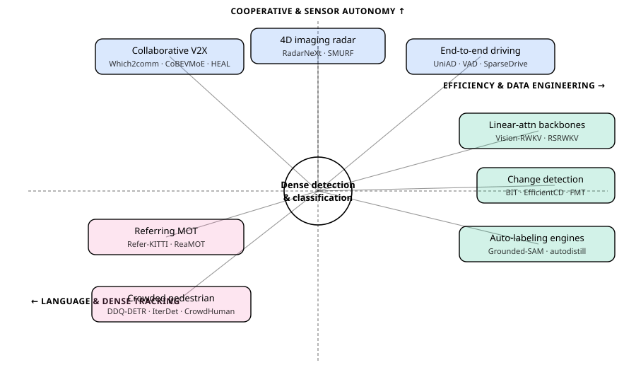
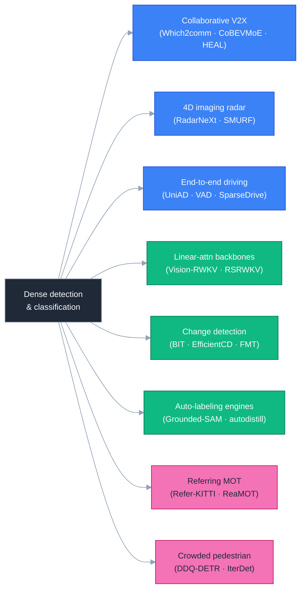
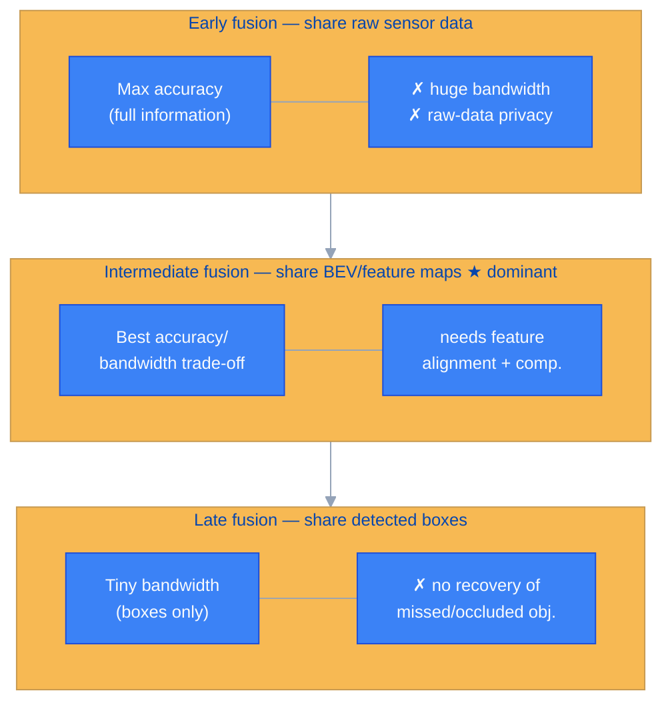
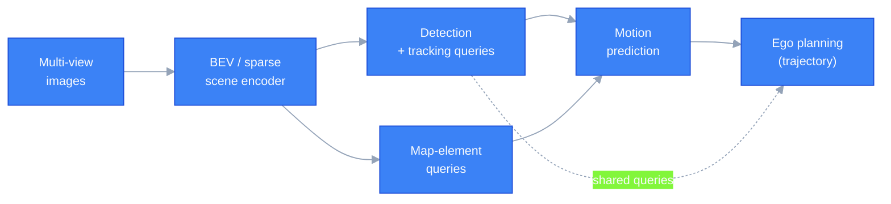
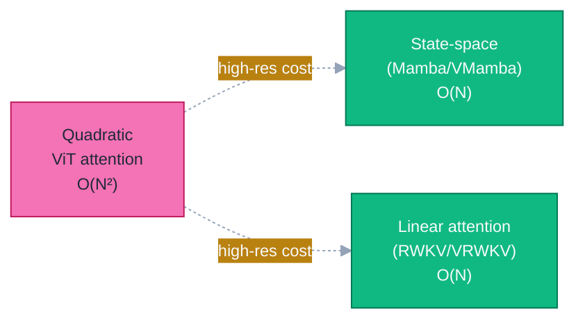
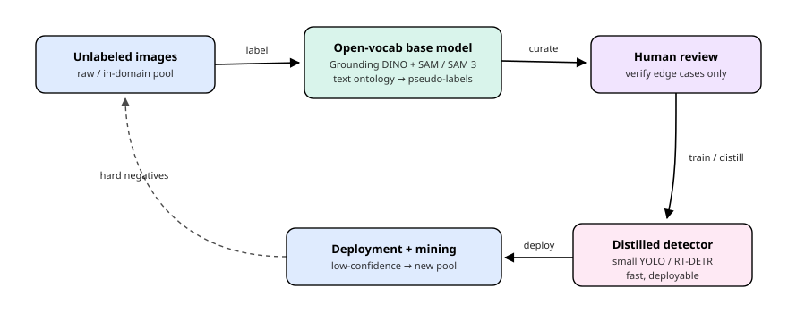
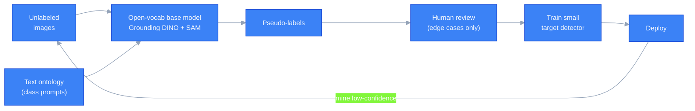
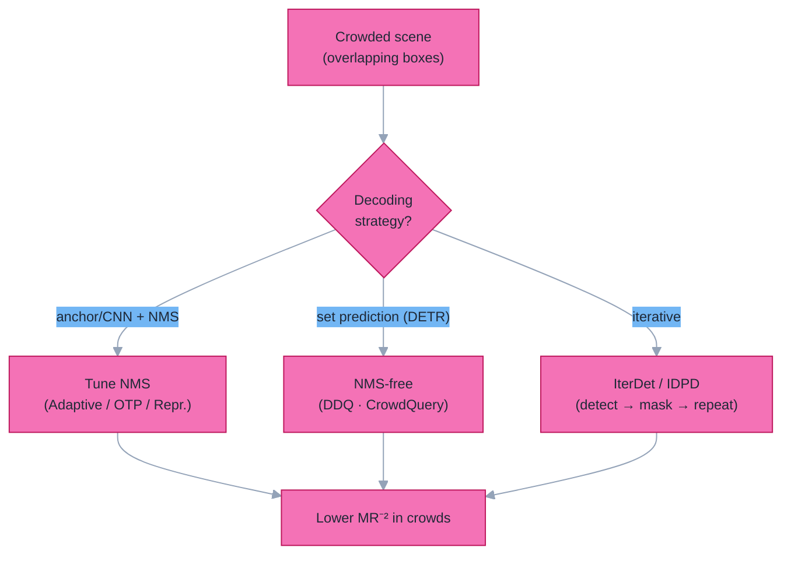

# Dense Object Detection & Classification — Recent Advances

*Compiled 2026-Jun-10 (America/Los_Angeles).*

Thirteenth installment in the running CV-updates log
([Apr-30](../2026-Apr-30/2026-Apr-30_CV_updates.md),
[May-01](../2026-May-01/2026-May-01_CV_updates.md),
[May-02](../2026-May-02/2026-May-02_CV_updates.md),
[May-04](../2026-May-04/2026-May-04_CV_updates.md),
[May-05](../2026-May-05/2026-May-05_CV_updates.md),
[May-07](../2026-May-07/2026-May-07_CV_updates.md),
[May-08](../2026-May-08/2026-May-08_CV_updates.md),
[May-15](../2026-May-15/2026-May-15_CV_updates.md),
[May-16](../2026-May-16/2026-May-16_CV_updates.md),
[May-17](../2026-May-17/2026-May-17_CV_updates.md),
[Jun-09](../2026-Jun-09/2026-Jun-09_CV_updates.md)).
The previous twelve passes worked through real-time DETRs, YOLO26, DINOv3,
SAM 3, Mamba/SSM decoders, diffusion detectors, single-vehicle LiDAR/MOT/event
sensing, camouflaged / open-world detection, multi-modal fusion, document /
defect / wildlife / agriculture verticals, fairness / federated detection,
counting, HOI, action detection, REC/grounding, 6-DoF pose, visual in-context
prompting, DETR PTQ, fine-grained classification, AIGI forensics, small-object
/ UAV / RGB-T / SAR / class-incremental / industrial anomaly / sparse-query /
unified heads, 3D autonomous-driving / BEV / occupancy / open-vocabulary
detection, and yesterday's pass on open-vocab 3D, grasping, scene-text,
open-vocab parts, faces, infrared small-target, polyps, agentic perception,
and reasoning video segmentation.

Today rotates to eight threads still untouched in this log: **collaborative /
V2X multi-agent perception**, **4D imaging-radar 3D detection**, **end-to-end
driving (perception→planning) & driving world models**, **referring /
language-guided multi-object tracking**, **linear-attention (RWKV) detection
backbones**, **remote-sensing bitemporal change detection**, **foundation-model
auto-labeling data engines**, and **crowded / occluded pedestrian detection**.

> **Sourcing note.** Figures are author-reported numbers on standard public
> splits and may differ from peer-reviewed camera-ready values. Where a
> search/API returned only a partial result, the entry is kept and flagged
> rather than dropped, per the resilience requirement.

---

## Table of contents

1. [What's new since Jun-09](#1-whats-new-since-jun-09)
2. [Topic map](#2-topic-map)
3. [Collaborative / V2X multi-agent perception](#3-collaborative--v2x-multi-agent-perception)
4. [4D imaging-radar 3D detection](#4-4d-imaging-radar-3d-detection)
5. [End-to-end driving: perception→planning & world models](#5-end-to-end-driving-perceptionplanning--world-models)
6. [Referring & language-guided multi-object tracking](#6-referring--language-guided-multi-object-tracking)
7. [Linear-attention (RWKV) detection backbones](#7-linear-attention-rwkv-detection-backbones)
8. [Remote-sensing bitemporal change detection](#8-remote-sensing-bitemporal-change-detection)
9. [Foundation-model auto-labeling data engines](#9-foundation-model-auto-labeling-data-engines)
10. [Crowded & occluded pedestrian detection](#10-crowded--occluded-pedestrian-detection)
11. [Reading list](#11-reading-list)

---

## 1. What's new since Jun-09

| Thread                       | One-line take                                                                                                                                              |
| ---------------------------- | ---------------------------------------------------------------------------------------------------------------------------------------------------------- |
| Collaborative V2X            | **Intermediate (feature) fusion** has won the accuracy/bandwidth trade-off; 2025–26 work is all about surviving **latency, pose-error and agent heterogeneity** ([Which2comm](https://arxiv.org/abs/2503.17175), [CoBEVMoE](https://arxiv.org/pdf/2509.17107)). |
| 4D imaging radar             | A cheap, weather-robust LiDAR stand-in: pillarize the sparse+noisy cloud and fuse views/frames. **[RadarNeXt](https://arxiv.org/pdf/2501.02314)** / **[SMURF](https://arxiv.org/pdf/2307.10784)** are the real-time references on VoD / TJ4DRadSet. |
| End-to-end driving           | **[UniAD](https://arxiv.org/abs/2212.10156)→[VAD](https://arxiv.org/abs/2303.12077)→[SparseDrive](https://arxiv.org/pdf/2405.19620)** fold detection+tracking+map+motion+planning into one query stack; the community is migrating off open-loop nuScenes onto **closed-loop [NAVSIM](https://arxiv.org/pdf/2406.15349)/nuPlan**. |
| Referring MOT                | "Track the objects this *sentence* describes." **[Refer-KITTI](https://arxiv.org/pdf/2303.03366)** seeded it; 2025 spun off **[reasoning](https://arxiv.org/abs/2505.20381)**, **[cross-view](https://arxiv.org/pdf/2412.17807)** and **[RGB-thermal](https://arxiv.org/html/2602.22033)** variants. |
| Linear-attn backbones        | **[Vision-RWKV](https://arxiv.org/pdf/2403.02308)** (ICLR'25 spotlight) gives ViT-level COCO detection at **linear** cost — the non-Mamba answer to quadratic attention on high-res dense inputs. |
| Change detection             | Bitemporal "what changed?" is a dense-detection task; **[BIT](https://arxiv.org/pdf/2103.00208)** / ChangeFormer transformers plus **frozen foundation backbones** ([FMT](https://link.springer.com/article/10.1007/s11227-026-08351-6)) now lead LEVIR-CD / WHU-CD. |
| Auto-labeling engines        | **[Grounded-SAM](https://github.com/idea-research/grounded-segment-anything)** + **[autodistill](https://pypi.org/project/autodistill/)** turn an open-vocab teacher into labeled data for a small student — quoted at **$50–200 vs $500–10k** for manual annotation. |
| Crowded pedestrian           | Set-prediction (DETR) is a natural fit because it is **NMS-free**; **[DDQ](https://arxiv.org/pdf/2303.12776)** and learnable-sample selection push miss-rate down where overlapping boxes break NMS. |

The headline single-image detectors carried over from prior installments still
frame the field: **[RF-DETR](https://github.com/roboflow/rf-detr)** (first
real-time model past **60 mAP**, ~54.7 AP at <5 ms on COCO; 60.6 on RF100-VL),
**[DEIMv2](https://arxiv.org/abs/2509.20787)** (57.8 AP at 50.3 M params), and
zero-shot **[Grounding DINO 1.5 Pro](https://github.com/IDEA-Research/Grounded-SAM-2)**
(54.3 COCO / 55.7 LVIS-minival). Today's threads are about what happens once
that per-frame box is no longer the bottleneck: *many agents*, *new sensors*,
*language*, *cheaper compute*, *temporal change*, and *cheaper labels*.

---

## 2. Topic map

A standalone SVG topic map (light/dark-safe via `currentColor`):

A Mermaid version of the same lattice:

The three axes are deliberately orthogonal to the per-frame detectors covered
earlier: **cooperative & sensor autonomy** (where the input is *more than one
camera on one car*), **efficiency & data engineering** (where the cost — FLOPs
or labels — is the object of study), and **language & dense tracking** (where
the query is a sentence and the output spans time).

---

## 3. Collaborative / V2X multi-agent perception

A single vehicle's perception is fundamentally occlusion- and range-limited.
**Vehicle-to-everything (V2X) collaborative perception** lets connected
vehicles and roadside units (RSUs) share what they see, so an object hidden
behind a truck for car A can be filled in by car B or an infrastructure camera.
The dense-detection question becomes: *what do you transmit, and how do you
fuse it under real-world bandwidth, latency and calibration noise?*

### 3.1 The fusion taxonomy

There are three places to fuse, and the field has converged hard on the middle one:

Intermediate (feature-level) fusion — typically exchanging **BEV feature maps**
or **object-level sparse features** — keeps most of the accuracy of early fusion
at a fraction of the bandwidth, and that is where essentially all 2025–26 work
lives.

### 3.2 What's new (2025–26)

- **[Which2comm](https://arxiv.org/abs/2503.17175)** transmits *object-level
  sparse features* rather than dense BEV maps, slashing communication volume,
  and adds a **relative temporal-encoding** fusion that makes it robust to
  communication latency — the recurring villain of V2X.
- **[CoBEVMoE](https://arxiv.org/pdf/2509.17107)** treats agent heterogeneity
  head-on with a **dynamic Mixture-of-Experts** fusion, routing each
  collaborator's features through experts suited to its sensor/viewpoint.
- **[FocalComm](https://arxiv.org/pdf/2512.13982)** is *hard-instance-aware*:
  it spends scarce bandwidth on the objects that matter (small, distant,
  occluded) rather than uniformly.
- **[Faster-HEAL](https://arxiv.org/pdf/2603.07314)** and
  **[V2X-DSC](https://arxiv.org/pdf/2602.00687)** (distributed source coding)
  push the *efficient + privacy-preserving + heterogeneous* frontier, building
  on the extensible open-heterogeneous **HEAL** framework (ICLR 2024). A
  [generative communication mechanism](https://arxiv.org/pdf/2510.19618) lets
  agents with mismatched encoders still exchange usable features.

### 3.3 Datasets — the field's real bottleneck

| Dataset | Year | Notes |
| ------- | ---- | ----- |
| [OPV2V](https://arxiv.org/abs/2109.07644) / V2XSet | 2022 | CARLA-simulated V2V / V2X; the de-facto training grounds. |
| [DAIR-V2X](https://arxiv.org/pdf/2308.16714) | 2022 | First large real V2I set; DAIR-V2X-C ≈ 38,845 LiDAR + 38,845 camera frames, ~464k 3D boxes, 10 classes. |
| V2V4Real | 2023 | First large-scale **real-world** multimodal V2V set. |
| [V2X-Real](https://dl.acm.org/doi/10.1007/978-3-031-72943-0_26) | ECCV 2024 | Real V2X with four sub-tracks: vehicle-centric, infra-centric, V2V, I2I. |
| TUMTraf-V2X · UrbanIng-V2X · CATS-V2V | 2024–25 | Newer real roadside+vehicle streams with sync/connectivity metadata. |

A living survey + paper digest is maintained at
[Little-Podi/Collaborative_Perception](https://github.com/Little-Podi/Collaborative_Perception);
the canonical surveys are [arXiv:2301.06262](https://arxiv.org/pdf/2301.06262)
and [arXiv:2308.16714](https://arxiv.org/pdf/2308.16714).

**Open problems:** time-asynchronous agents, GPS/pose misalignment, dropped
packets, and the *heterogeneity* of mixing a LiDAR truck, a camera-only car,
and an RSU into one fused BEV.

---

## 4. 4D imaging-radar 3D detection

LiDAR is accurate but expensive and degrades in rain/fog/snow. **4D imaging
radar** (range, azimuth, elevation, **+ Doppler velocity**) is cheap, all-weather,
and gives per-point radial velocity for free — but its point cloud is **sparse,
noisy, and low-resolution** in angle, with multipath ghosts. The detection
problem is "LiDAR-style 3D detection, but on a much worse point cloud."

### 4.1 Radar-only detectors

- **[RadarNeXt](https://arxiv.org/pdf/2501.02314)** — a real-time, reliable 3D
  detector built directly on the 4D mmWave cloud; the current efficiency
  reference point.
- **[SMURF](https://arxiv.org/pdf/2307.10784)** — pillarization + **kernel
  density estimation** to combat sparsity; SOTA on the two standard 4D-radar
  sets, **View-of-Delft (VoD)** and **TJ4DRadSet**.
- **[SMIFormer](https://www.ncbi.nlm.nih.gov/pmc/articles/PMC10708838/)** —
  decouples the scene into BEV / front / side views and fuses them with
  multi-view interactive transformers.
- **[RadarGaussianDet3D](https://arxiv.org/pdf/2509.16119)** — a Gaussian
  representation for real-time detection, trading the voxel grid for continuous
  splats.

### 4.2 Radar + camera fusion

Because radar gives geometry+velocity and cameras give semantics, fusion is the
accuracy play:

- **[M³Detection](https://arxiv.org/pdf/2510.27166)** — *multi-frame,
  multi-level* fusion of camera and 4D radar, addressing how to aggregate
  sparse object features across time and modality without exploding compute.
- **[RadarXFormer](https://arxiv.org/pdf/2603.14822)** — fuses the **raw 4D
  radar spectra** (not just the thresholded point cloud) with images via a
  cross-dimension transformer, recovering information that CFAR detection
  throws away.

A comprehensive treatment is the [4D mmWave radar survey](https://www.researchgate.net/publication/379158431_4D_mmWave_Radar_for_Autonomous_Driving_Perception_A_Comprehensive_Survey),
and the curated [Awesome-Radar-Perception](https://github.com/Radar-Camera-Fusion/Awesome-Radar-Perception)
list tracks the leaderboard. **Headline:** with the right segmentation backbone,
recent work reports **+23.7%** over prior radar-only SOTA — the gap to LiDAR is
closing but not closed, and the practical case for radar is cost + weather, not
peak accuracy.

---

## 5. End-to-end driving: perception→planning & world models

The classic stack — detect → track → map → predict → plan — passes hand-designed
interfaces between modules, losing information at each boundary. The **end-to-end**
movement folds the whole pipeline into one differentiable network where
*detection is a means to planning*, not the deliverable.

### 5.1 The query-unified lineage

- **[UniAD](https://arxiv.org/abs/2212.10156)** (CVPR 2023 best paper) unified
  detection, tracking, mapping, motion prediction and planning into a single
  transformer with shared queries — the template everything else iterates on.
- **[VAD](https://arxiv.org/abs/2303.12077) / VADv2** replace dense rasters with
  a **vectorized** scene and add probabilistic planning over a large trajectory
  vocabulary, improving closed-loop behavior and speed.
- **[SparseDrive](https://arxiv.org/pdf/2405.19620)** drops the dense BEV
  entirely: it encodes the scene as **sparse agent + map instances**, runs
  *symmetric sparse perception*, and does motion prediction and planning **in
  parallel** — faster and more accurate than the sequential pipelines.
- **DriveTransformer** decouples and runs perception and planning in parallel
  for stronger closed-loop inference; **LLM/VLA** designs (EMMA, LeAD) inject
  chain-of-thought semantics for long-tail edge cases.

### 5.2 World-model variants

Instead of only planning, **driving world models** forecast the future scene and
plan against it: **[Drive-OccWorld](https://arxiv.org/pdf/2408.14197)** does
vision-centric **4D occupancy forecasting + planning**, and
**[SparseWorld](https://arxiv.org/pdf/2510.17482)** makes the 4D occupancy world
model efficient with sparse, dynamic queries.

### 5.3 The benchmark shift that matters

Open-loop **nuScenes** planning metrics (L2 displacement, collision rate —
recent methods report ~0.11–0.28% average collision) are increasingly seen as
*gameable*: a model can score well by mimicking logged trajectories without
truly driving. The field is migrating to **closed-loop** evaluation:

- **[NAVSIM](https://arxiv.org/pdf/2406.15349)** — built on OpenScene/nuPlan
  logs, resampled to drop trivial straight-line scenes; scores the **PDMS**
  (no at-fault collision · drivable-area compliance · time-to-collision ·
  comfort · ego progress).
- **nuPlan** — full closed-loop simulation where sensor inputs update with the
  ego's own actions.

This is the relevant cross-link for a detection log: *the value of better
detection is now measured by downstream driving safety, not box mAP.*

---

## 6. Referring & language-guided multi-object tracking

**Referring Multi-Object Tracking (RMOT)** asks a model to detect *and track*
exactly the set of objects described by a natural-language expression — e.g.
"the cars turning left" — across a video. Unlike single-object referring
tracking, the referent count is variable and time-dependent (a car *becomes* a
match when it starts turning), which makes it a genuinely dense, temporal
grounding task.

### 6.1 The founding setup

**[Refer-KITTI](https://arxiv.org/pdf/2303.03366)** introduced the task with a
DETR-style **TransRMOT** baseline and a benchmark of 18 videos / 818 expressions
(avg **10.7** matched objects per expression). The natural follow-up,
[*Make it Strong Again*](https://arxiv.org/abs/2503.07516), revisits the
two-stage **referring-by-tracking** decomposition (track everything, then filter
by language) and shows it can beat the joint approaches.

### 6.2 The 2025–26 fan-out

| Variant | Adds | Reference |
| ------- | ---- | --------- |
| **ReaMOT** | *Reasoning* over complex instructions, not just attribute matching | [arXiv:2505.20381](https://arxiv.org/abs/2505.20381) |
| **CRMOT** | *Cross-view* observations so objects invisible in one view are recovered | [arXiv:2412.17807](https://arxiv.org/pdf/2412.17807) |
| **RT-RMOT** | *RGB-thermal* for night / smoke low-visibility tracking | [arXiv:2602.22033](https://arxiv.org/html/2602.22033) |
| **ORMOT** | *Omnidirectional* (360°) referring tracking | [arXiv:2603.05384](https://arxiv.org/pdf/2603.05384) |
| **OmniPT** | A **VLM** that tracks *and explains* pedestrians | [arXiv:2511.17053](https://arxiv.org/pdf/2511.17053) |

Method-side, the live questions are robust **language↔detection alignment**
([Tell Me What to Track](https://arxiv.org/pdf/2412.12561)) and **cognitive
disentanglement** of appearance vs. motion vs. relation cues
([arXiv:2503.11496](https://arxiv.org/pdf/2503.11496)). Benchmarks have grown
beyond Refer-KITTI to Refer-KITTI-v2, Refer-Dance and LaMOT. This is the
temporal sibling of the reasoning-video-segmentation thread from
[Jun-09 §11](../2026-Jun-09/2026-Jun-09_CV_updates.md): both put an LLM/VLM in
charge of *which* pixels/boxes to emit over time.

---

## 7. Linear-attention (RWKV) detection backbones

ViT self-attention is **O(N²)** in token count — punishing for dense detection,
which wants high-resolution feature maps. The [Jun-/May Mamba thread](../2026-May-01/2026-May-01_CV_updates.md)
covered state-space backbones; the other linear-cost lineage is **RWKV**, an
attention-free recurrent/linear architecture from NLP, now ported to vision.

- **[Vision-RWKV (VRWKV)](https://arxiv.org/pdf/2403.02308)** (ICLR 2025
  *Spotlight*; [code](https://github.com/OpenGVLab/Vision-RWKV)) adapts RWKV's
  WKV linear-attention and token-shift to 2D with a **bidirectional** scan,
  giving a **global receptive field at linear complexity**. On **COCO
  detection** it outperforms a comparable ViT with **significantly lower FLOPs**,
  and it scales cleanly on ImageNet-1K and ADE20K segmentation — its edge grows
  with input resolution, exactly where dense detection lives.
- **[RSRWKV](https://arxiv.org/html/2503.20382)** carries the linear-complexity
  **2D attention** idea into remote sensing, where image tiles are enormous and
  quadratic attention is a non-starter.
- Hybrid softmax/linear designs (e.g.
  [SoLA-Vision](https://arxiv.org/pdf/2601.11164)) suggest the near-term
  practical answer is *mixing* a few full-attention layers with mostly linear
  ones.

**Takeaway:** for high-resolution dense prediction, the 2025 backbone menu is no
longer "ViT vs. CNN" — it is "**quadratic attention vs. linear-cost (SSM or
RWKV)**," and the linear options now match accuracy while unlocking resolutions
ViT can't afford.

---

## 8. Remote-sensing bitemporal change detection

Given two co-registered satellite/aerial images of the same place at times *t₁*
and *t₂*, **change detection (CD)** outputs a dense map of *what changed* — new
buildings, deforestation, disaster damage. It is a per-pixel dense-prediction
task with the unusual twist that the input is a *pair* and the signal is the
*difference*, while ignoring nuisance changes (illumination, season).

- **[BIT / Transformer CD](https://arxiv.org/pdf/2103.00208)** introduced
  bitemporal-image transformers; **ChangeFormer** added a Siamese transformer
  encoder — together the modern baselines on **LEVIR-CD** and **WHU-CD**.
- **[EfficientCD](https://arxiv.org/pdf/2407.15999)** exchanges bi-temporal
  layers to model change cheaply, targeting the deployment end.
- **Foundation-model CD** is the 2025–26 frontier: a
  [foundation-model transformer (FMT)](https://link.springer.com/article/10.1007/s11227-026-08351-6)
  pairs a **frozen** foundation backbone with a light ResNet to filter invariant
  background, and
  [foundation-model-driven *semantic* CD](https://arxiv.org/pdf/2602.13780)
  labels not just *where* but *what kind* of change.
- **[RSBuilding](https://arxiv.org/pdf/2403.07564)** unifies building extraction
  *and* change detection in one foundation model; *Treat Stillness with
  Movement* ([arXiv:2408.08078](https://arxiv.org/html/2408.08078v1)) reframes
  CD as mining temporal foregrounds.

Standard benchmarks: **LEVIR-CD**, **WHU-CD**, **DSIFN**, and **SECOND** for
semantic CD. The throughline with the rest of this log: the same **frozen
foundation backbone** recipe that powers open-vocabulary detection is now the
default feature extractor for CD, with a small trainable head on top.

---

## 9. Foundation-model auto-labeling data engines

The most practical CV advance of the last two years isn't a detector — it's a
*pipeline* that lets an open-vocabulary teacher label data so a small, fast
student can be trained without a human drawing every box.

A Mermaid view of the same loop:

- **[Grounded-SAM](https://github.com/idea-research/grounded-segment-anything)**
  marries **Grounding DINO** (text-prompted open-set boxes) with **SAM**
  (promptable masks) — point a sentence at an image, get boxes + masks back.
- **[Grounded-SAM-2](https://github.com/IDEA-Research/Grounded-SAM-2)** extends
  this to **video** (track-anything) and adds **Florence-2** for dense region
  captioning, detection and a cascaded auto-label pipeline.
- **[autodistill](https://pypi.org/project/autodistill/)** formalizes the loop:
  *unlabeled data → Base model (with an Ontology) → labeled Dataset → Target
  model → distilled student*. The
  [labeling cost claim](https://labelyourdata.com/articles/data-annotation/autodistill)
  is striking — **$50–200 of GPU vs. $500–10,000 of manual annotation** for a
  comparable set.
- A 2025 study,
  [*Auto-Labeling Data for Object Detection*](https://arxiv.org/pdf/2506.02359),
  quantifies where pseudo-labels help and where they silently inject errors.

**Best practice** is explicitly *hybrid*: let the engine label the easy
majority, route low-confidence / edge cases to humans, and mine deployment
failures back into the unlabeled pool. SAM 3's concept prompts
([Jun-09 §… / May-07 §4](../2026-May-07/2026-May-07_CV_updates.md)) drop straight
into the "base model" slot, making the teacher stronger every release.

---

## 10. Crowded & occluded pedestrian detection

In dense crowds the failure mode is post-processing, not the backbone:
heavily-overlapping true boxes get **suppressed by NMS**, so the detector is
hostage to a single IoU threshold. The benchmark is
**[CrowdHuman](https://arxiv.org/pdf/1805.00123)** (~22.6 persons/image, heavy
occlusion), scored by **AP**, log-average **miss-rate (MR⁻²)** and the **Jaccard
index (JI)**.

Two families attack it:

**(a) Fix NMS.**
- **[Adaptive-NMS](https://ar5iv.labs.arxiv.org/html/1904.03629)** raises the
  suppression threshold where the crowd is denser, via a learned density
  sub-net.
- **[NMS by Representative Region](https://arxiv.org/pdf/2003.12729)** suppresses
  on visible-region proposals instead of full boxes; **OTP-NMS** predicts a
  per-instance optimal threshold; **OPLA + Hierarchical-NMS** add
  occlusion-aware label assignment.

**(b) Remove NMS — set prediction.** DETR's one-query-one-object matching is
*inherently NMS-free*, which is exactly what crowds need:
- **[DDQ (Dense Distinct Query)](https://arxiv.org/pdf/2303.12776)** seeds dense
  queries from every feature point, then keeps only *distinct* ones — moving the
  NMS-like filtering to the **front** as query selection rather than output
  post-processing.
- **[Selecting Learnable Training Samples is All DETRs Need](https://arxiv.org/pdf/2305.10801)**
  shows careful query/sample selection alone restores SOTA miss-rate in crowds.
- **[CrowdQuery](https://arxiv.org/pdf/2509.08738)** adds a **density-guided**
  query module that works for both **2D and 3D** crowded detection, and
  **[Dome-DETR](https://arxiv.org/html/2505.05741v1)** uses density-oriented
  feature/query manipulation for efficient **tiny-object** crowds.
- The older **IterDet / [IDPD](https://link.springer.com/article/10.1007/s11760-023-02896-2)**
  detect iteratively — find some boxes, mask them, find more — so overlapping
  instances aren't forced to compete in one pass.

Reported numbers cluster high — methods at **~93.6 AP** on CrowdHuman and
multi-point MR⁻² gains over FCOS baselines — but the honest frontier remains
*heavy mutual occlusion* (>70% overlap), where appearance cues vanish and only
context/part reasoning survives. This connects to the
[small-object thread (May-16 §3)](../2026-May-16/2026-May-16_CV_updates.md):
crowds are partly a small + occluded problem.

---

## 11. Reading list

A compact, click-through set of entry points for today's eight threads:

**Collaborative / V2X**
1. **Which2comm** ([arXiv:2503.17175](https://arxiv.org/abs/2503.17175)) —
   object-level sparse features + temporal fusion, latency-robust.
2. **CoBEVMoE** ([arXiv:2509.17107](https://arxiv.org/pdf/2509.17107)) —
   MoE fusion for heterogeneous agents.
3. **Collaborative Perception survey + digest**
   ([repo](https://github.com/Little-Podi/Collaborative_Perception),
   [arXiv:2301.06262](https://arxiv.org/pdf/2301.06262)) +
   **V2X-Real** ([ECCV 2024](https://dl.acm.org/doi/10.1007/978-3-031-72943-0_26)).

**4D imaging radar**
4. **RadarNeXt** ([arXiv:2501.02314](https://arxiv.org/pdf/2501.02314)) +
   **SMURF** ([arXiv:2307.10784](https://arxiv.org/pdf/2307.10784)) — real-time
   radar-only references on VoD / TJ4DRadSet.
5. **RadarXFormer** ([arXiv:2603.14822](https://arxiv.org/pdf/2603.14822)) —
   raw-spectra × image cross-dimension fusion.

**End-to-end driving**
6. **UniAD** ([arXiv:2212.10156](https://arxiv.org/abs/2212.10156)) →
   **SparseDrive** ([arXiv:2405.19620](https://arxiv.org/pdf/2405.19620)) — the
   query-unified perception→planning lineage.
7. **NAVSIM** ([arXiv:2406.15349](https://arxiv.org/pdf/2406.15349)) — the
   closed-loop benchmark the field is moving to.

**Referring MOT**
8. **Refer-KITTI / TransRMOT** ([arXiv:2303.03366](https://arxiv.org/pdf/2303.03366))
   + **ReaMOT** ([arXiv:2505.20381](https://arxiv.org/abs/2505.20381)) — the task
   and its reasoning extension.

**Linear-attention backbones**
9. **Vision-RWKV** ([arXiv:2403.02308](https://arxiv.org/pdf/2403.02308),
   [code](https://github.com/OpenGVLab/Vision-RWKV)) — linear-cost detection
   backbone, ICLR'25 spotlight.

**Change detection**
10. **BIT** ([arXiv:2103.00208](https://arxiv.org/pdf/2103.00208)) +
    **EfficientCD** ([arXiv:2407.15999](https://arxiv.org/pdf/2407.15999)) +
    foundation-model **FMT**
    ([Springer 2026](https://link.springer.com/article/10.1007/s11227-026-08351-6)).

**Auto-labeling**
11. **Grounded-SAM / Grounded-SAM-2**
    ([repo](https://github.com/idea-research/grounded-segment-anything),
    [v2](https://github.com/IDEA-Research/Grounded-SAM-2)) +
    **autodistill** ([PyPI](https://pypi.org/project/autodistill/)).

**Crowded pedestrian**
12. **DDQ** ([arXiv:2303.12776](https://arxiv.org/pdf/2303.12776)) +
    **CrowdHuman** ([arXiv:1805.00123](https://arxiv.org/pdf/1805.00123)) — the
    NMS-free recipe and its benchmark.

### Cross-section pointers from earlier installments

- Single-vehicle 3D / LiDAR / BEV / occupancy detection: see
  [May-02](../2026-May-02/2026-May-02_CV_updates.md),
  [May-17 §3–§5](../2026-May-17/2026-May-17_CV_updates.md) — §3–§5 here are the
  *multi-agent / new-sensor / planning* complements.
- State-space (Mamba) backbones — sibling of §7's RWKV:
  [May-01 §3](../2026-May-01/2026-May-01_CV_updates.md).
- SAM 3 concept-prompt detection — the strongest "base model" for §9:
  [May-07 §4](../2026-May-07/2026-May-07_CV_updates.md).
- Reasoning video segmentation — temporal sibling of §6's referring MOT:
  [Jun-09 §11](../2026-Jun-09/2026-Jun-09_CV_updates.md).
- Small-object / RGB-T / SAR detection — overlaps §4 (radar), §8 (RS), §10
  (crowds): [May-16](../2026-May-16/2026-May-16_CV_updates.md).
- Open-vocabulary detection + foundation backbones (feed §8 CD and §9 engines):
  [May-17 §6–§8](../2026-May-17/2026-May-17_CV_updates.md).

---

*Compiled with public arXiv / GitHub / project-page / publisher sources;
numbers are author-reported metrics on standard public splits and may differ
from peer-reviewed camera-ready values. Diagrams are standalone SVG and Mermaid;
both adapt to light- and dark-mode via `currentColor` and Mermaid theme tokens.
Where a source returned only partial data, the entry was retained and flagged
rather than dropped.*
