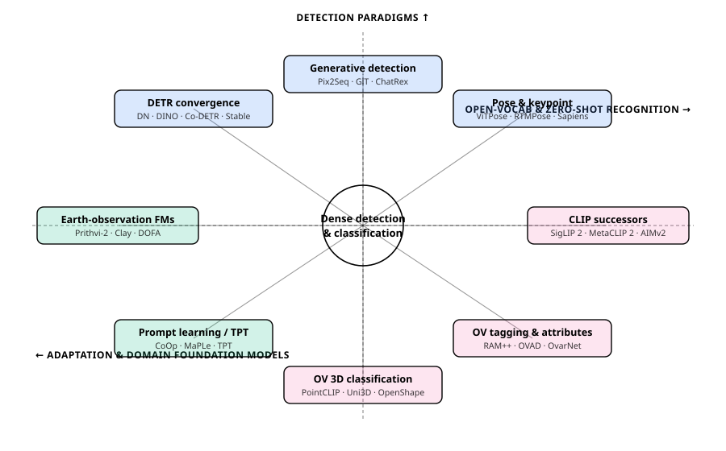
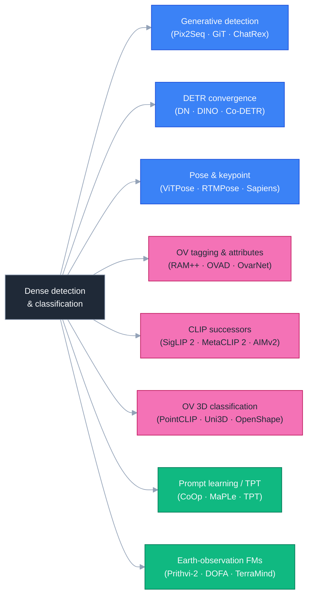
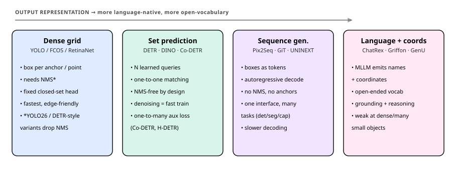
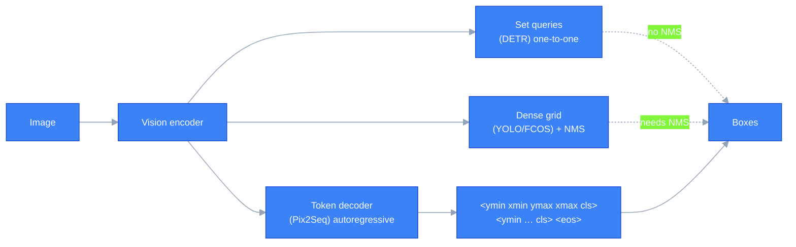
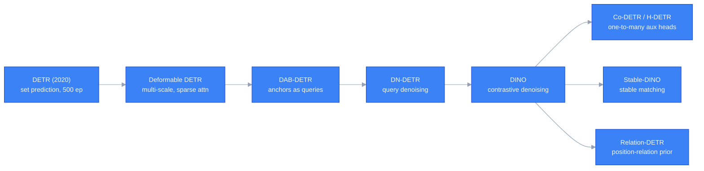
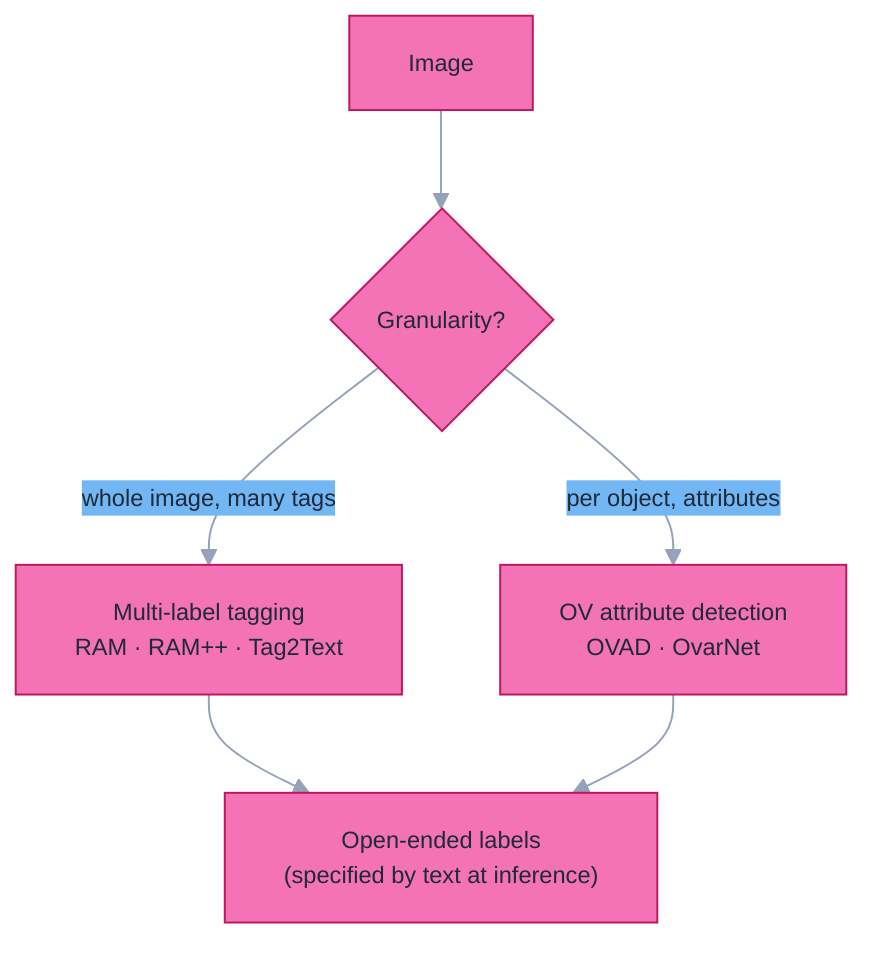
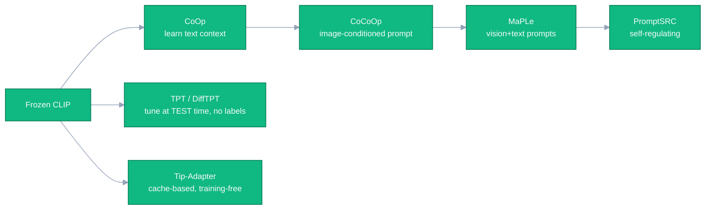
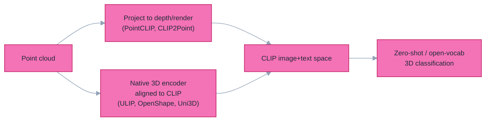
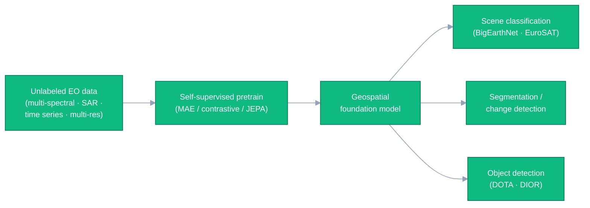

# Dense Object Detection & Classification — Recent Advances

*Compiled 2026-Jun-11 (America/Los_Angeles).*

Fourteenth installment in the running CV-updates log
([Apr-30](../2026-Apr-30/2026-Apr-30_CV_updates.md),
[May-01](../2026-May-01/2026-May-01_CV_updates.md),
[May-02](../2026-May-02/2026-May-02_CV_updates.md),
[May-04](../2026-May-04/2026-May-04_CV_updates.md),
[May-05](../2026-May-05/2026-May-05_CV_updates.md),
[May-07](../2026-May-07/2026-May-07_CV_updates.md),
[May-08](../2026-May-08/2026-May-08_CV_updates.md),
[May-15](../2026-May-15/2026-May-15_CV_updates.md),
[May-16](../2026-May-16/2026-May-16_CV_updates.md),
[May-17](../2026-May-17/2026-May-17_CV_updates.md),
[Jun-09](../2026-Jun-09/2026-Jun-09_CV_updates.md),
[Jun-10](../2026-Jun-10/2026-Jun-10_CV_updates.md)).
The previous installments worked through real-time DETRs, YOLO26, DINOv3, SAM 3,
Mamba/SSM and diffusion detectors, single-vehicle and cooperative (V2X) 3D
sensing, 4D radar, end-to-end driving, camouflaged / open-world detection,
multi-modal fusion, document / defect / wildlife / agriculture verticals,
fairness / federated detection, counting, HOI, action detection, REC/grounding,
6-DoF pose, visual in-context prompting, quantization, fine-grained
classification, AIGI forensics, small-object / UAV / RGB-T / SAR / SAR change
detection, class-incremental / anomaly / sparse-query / unified heads,
open-vocabulary 2D & 3D detection, grasping, scene-text, parts, faces, infrared
small-target, polyps, agentic perception, reasoning video segmentation,
referring MOT, linear-attention (RWKV) backbones, and auto-labeling data engines.

Today the log deliberately tilts back toward the **classification** half of its
title and toward **detection *paradigms*** rather than detection verticals. Eight
fresh threads, grouped on three axes:

- **Detection paradigms** — how a model *emits* objects: **generative /
  autoregressive (sequence-to-sequence) detection**, the **DETR
  label-assignment & convergence lineage** that made set-prediction trainable,
  and **human / animal pose & keypoint detection**.
- **Open-vocabulary & zero-shot recognition** — **open-vocabulary multi-label
  tagging & attribute recognition**, **CLIP-successor backbones for zero-shot
  classification**, and **open-vocabulary 3D shape / point-cloud
  classification**.
- **Adaptation & domain foundation models** — **prompt learning & test-time
  prompt tuning** for frozen VLMs, and **Earth-observation / geospatial
  foundation models**.

> **Sourcing note.** Figures are author-reported numbers on standard public
> splits and may differ from peer-reviewed camera-ready values; backbones and
> protocols differ between entries, so cross-row numbers are *not* directly
> comparable. Where a search/API returned only a partial result, the entry is
> kept and flagged rather than dropped, per the resilience requirement.

---

## Table of contents

1. [What's new since Jun-10](#1-whats-new-since-jun-10)
2. [Topic map](#2-topic-map)
3. [Generative / autoregressive detection](#3-generative--autoregressive-detection)
4. [DETR label-assignment & convergence lineage](#4-detr-label-assignment--convergence-lineage)
5. [Human & animal pose / keypoint detection](#5-human--animal-pose--keypoint-detection)
6. [Open-vocabulary tagging & attribute recognition](#6-open-vocabulary-tagging--attribute-recognition)
7. [CLIP successors for zero-shot classification](#7-clip-successors-for-zero-shot-classification)
8. [Prompt learning & test-time prompt tuning](#8-prompt-learning--test-time-prompt-tuning)
9. [Open-vocabulary 3D shape / point-cloud classification](#9-open-vocabulary-3d-shape--point-cloud-classification)
10. [Earth-observation / geospatial foundation models](#10-earth-observation--geospatial-foundation-models)
11. [Reading list](#11-reading-list)

---

## 1. What's new since Jun-10

| Thread | One-line take |
| ------ | ------------- |
| Generative detection | Detection as **next-token prediction** — serialize boxes+labels and decode them. **[Pix2Seq](https://arxiv.org/abs/2109.10852)** started it; **[GenerateU](https://arxiv.org/abs/2403.10191)** / **[ChatRex](https://arxiv.org/abs/2411.18363)** / **[Griffon](https://arxiv.org/abs/2311.14552)** turn an (M)LLM into an open-ended detector. |
| DETR convergence | The line that fixed DETR's slow training: **[DN-DETR](https://arxiv.org/abs/2203.01305)** denoising → **[DINO](https://arxiv.org/abs/2203.03605)** → **[Co-DETR](https://arxiv.org/abs/2211.12860)** one-to-many aux heads (~**66 AP** COCO test-dev) → stable matching ([Stable-DINO](https://arxiv.org/abs/2304.04742)) and relation priors ([Relation-DETR](https://arxiv.org/abs/2407.11699)). |
| Pose & keypoint | **[ViTPose](https://arxiv.org/abs/2204.12484)** (plain-ViT, ~81 AP) and **[RTMPose](https://arxiv.org/abs/2303.07399)** / **[RTMO](https://arxiv.org/abs/2312.07526)** (real-time) anchor the field; **[Sapiens](https://arxiv.org/abs/2408.12569)** is a human-centric foundation model and **[X-Pose](https://arxiv.org/abs/2310.08530)** detects *any* keypoint by prompt. |
| OV tagging & attributes | **[RAM](https://arxiv.org/abs/2306.03514)/[RAM++](https://arxiv.org/abs/2310.15200)** beat CLIP at open-set *multi-label* tagging (+5–15 mAP); **[OVAD](https://arxiv.org/abs/2211.12914)/[OvarNet](https://arxiv.org/abs/2301.09506)** push open-vocab *attributes* down to the box. |
| CLIP successors | **[SigLIP 2](https://arxiv.org/abs/2502.14786)** (sigmoid loss + multilingual) and **[MetaCLIP 2](https://arxiv.org/abs/2507.22062)** (worldwide data) raise zero-shot ImageNet while going multilingual; **[DFN](https://arxiv.org/abs/2309.17425)** (learned data filtering) and **[AIMv2](https://arxiv.org/abs/2411.14402)** (autoregressive) attack the data and objective. |
| Prompt learning / TPT | Freeze CLIP, learn a prompt: **[CoOp](https://arxiv.org/abs/2109.01134)→[CoCoOp](https://arxiv.org/abs/2203.05557)→[MaPLe](https://arxiv.org/abs/2210.03117)→[PromptSRC](https://arxiv.org/abs/2307.06948)**; at *test time* **[TPT](https://arxiv.org/abs/2209.07511)** tunes the prompt per image with no labels. |
| OV 3D classification | Drag point clouds into CLIP space: **[PointCLIP](https://arxiv.org/abs/2112.02413)** (render→CLIP) → **[ULIP](https://arxiv.org/abs/2212.05171)/[OpenShape](https://arxiv.org/abs/2305.10764)/[Uni3D](https://arxiv.org/abs/2310.06773)** (tri-modal alignment); Uni3D hits **~88% zero-shot ModelNet40**. |
| EO foundation models | Pretrain once on satellites, fine-tune for detect/classify/segment: **[Prithvi-EO-2.0](https://arxiv.org/abs/2412.02732)**, **[SatMAE++](https://arxiv.org/abs/2403.05419)**, **[DOFA](https://arxiv.org/abs/2403.15356)** (any-sensor), **[AnySat](https://arxiv.org/abs/2412.14123)** (JEPA) and 2025's any-to-any **[TerraMind](https://arxiv.org/abs/2504.11171)**. |

The per-frame, closed-set detectors that frame the series — **[RF-DETR](https://github.com/roboflow/rf-detr)**,
**[DEIMv2](https://arxiv.org/abs/2509.20787)**, **[YOLO26](../2026-May-07/2026-May-07_CV_updates.md)** —
all sit in the *dense* or *set-prediction* corners of §3's paradigm map. Today's
threads ask the orthogonal questions: *how* should a detector emit its output
(§3–§5), and *how open* can a recognizer's vocabulary be without per-class
training (§6–§10)?

---

## 2. Topic map

A standalone SVG topic map (light/dark-safe via `currentColor`):

A Mermaid version of the same lattice:

The three axes are orthogonal to the detection *verticals* covered earlier.
**Detection paradigms** asks how the output is produced — a dense grid, a matched
set of queries, or a generated token stream. **Open-vocabulary & zero-shot
recognition** removes the fixed label set, whether the target is a tag, an
attribute, a 2D image, or a 3D shape. **Adaptation & domain foundation models**
asks how to specialize a frozen general model cheaply — with a learned prompt, or
with a domain-pretrained backbone.

---

## 3. Generative / autoregressive detection

There are three ways a detector can *emit* its answer, and they define three
research cultures:

**Generative detection** casts the problem as *language modeling*: serialize each
object's quantized box coordinates and class id into a sequence of discrete
tokens, and decode them one token at a time with an image-conditioned decoder.
No anchors, no Hungarian matching, no NMS — and the *same* interface generalizes
to segmentation, keypoints and captioning, which is why it became the natural
bridge to LLM-based perception. (A useful umbrella is the *Autoregressive Models
in Vision* survey, TMLR 2025, [repo](https://github.com/ChaofanTao/Autoregressive-Models-in-Vision-Survey).)

### 3.1 The Pix2Seq origin and unified-interface line

- **[Pix2Seq](https://arxiv.org/abs/2109.10852)** (Chen, Saxena, Li, Fleet,
  Hinton; ICLR 2022) treats detection as a string of tokens and reaches
  **~43–45 AP** on COCO with a generic encoder–decoder and *no* specialized head.
- **[A Unified Sequence Interface for Vision Tasks](https://arxiv.org/abs/2206.07669)**
  (Pix2Seq v2; NeurIPS 2022) runs detection, instance segmentation, keypoints and
  captioning through **one model and one loss**, selected by a text prompt.
- **[AiT — All in Tokens](https://arxiv.org/abs/2301.02229)** (ICCV 2023) encodes
  masks/depth into *soft* tokens (codebook mixtures) for more accurate decoding.
- **[UNINEXT](https://arxiv.org/abs/2303.06674)** (CVPR 2023) unifies ten
  instance-perception tasks as "discover candidates, then retrieve the ones the
  prompt asks for," and **[GiT](https://arxiv.org/abs/2403.09394)** (ECCV 2024
  Oral) pushes the minimal-bias ideal: a *vanilla* ViT with a universal language
  interface spanning captioning → detection → segmentation.

### 3.2 The LLM-as-detector turn (2024–26)

Once detection is token generation, an LLM can do it directly:

| Model | Idea | Headline | Ref |
| ----- | ---- | -------- | --- |
| **GenerateU** | Deformable-DETR proposes regions; an LM *generates* each object's free-form name — **open-ended**, no vocabulary at test time | matches GLIP on LVIS **without seeing class names** | [arXiv:2403.10191](https://arxiv.org/abs/2403.10191) (CVPR 2024) |
| **VisionLLM (v1/v2)** | "image as a foreign language"; instructions define the task | v1 reports **>60 mAP** on COCO, on par with specialist detectors | [v1 2305.11175](https://arxiv.org/abs/2305.11175) · [v2 2406.08394](https://arxiv.org/abs/2406.08394) |
| **Griffon (v1→v2→G)** | a pure LVLM that spells out *all* object locations as text | v2 SOTA on REC / phrase grounding; beats experts on counting | [v1 2311.14552](https://arxiv.org/abs/2311.14552) · [v2 2403.09333](https://arxiv.org/abs/2403.09333) · [G 2410.16163](https://arxiv.org/abs/2410.16163) |
| **ChatRex** | *decouples* perception: a proposal net supplies boxes, the LLM **retrieves box indices** instead of regressing coordinates | **~48.5 mAP** COCO while keeping MLLM understanding | [arXiv:2411.18363](https://arxiv.org/abs/2411.18363) |
| **DetGPT** | reason over the instruction → name targets → localize with an open-vocab detector | reasoning-driven ("I want a cold drink" → fridge) | [arXiv:2305.14167](https://arxiv.org/abs/2305.14167) |

The honest trade-off: autoregressive decoding is **serial** (slower than YOLO's
single forward pass), coordinates must be **quantized** into a vocabulary, and
pure-LLM detectors are still weak on **many small objects**. ChatRex's
retrieve-don't-regress design and the open-ended GenerateU line are the two most
practical answers in 2025–26. This thread is the generative sibling of the
[MLLM-grounder thread (May-01 §6)](../2026-May-01/2026-May-01_CV_updates.md) and
the [agentic perception thread (Jun-09 §10)](../2026-Jun-09/2026-Jun-09_CV_updates.md).

---

## 4. DETR label-assignment & convergence lineage

[DETR](https://arxiv.org/abs/2005.12872) (ECCV 2020) made detection **NMS-free**
by predicting a fixed *set* of objects matched to ground truth by bipartite
(Hungarian) matching — but it trained painfully slowly (500 epochs) and lagged on
small objects. The single most consequential 2022–24 storyline in plain detection
is the chain of fixes that turned set prediction into the accuracy leader.

### 4.1 Making the queries trainable

- **[Deformable DETR](https://arxiv.org/abs/2010.04159)** added multi-scale
  deformable attention, cutting convergence ~10× and fixing small objects.
- **[DAB-DETR](https://arxiv.org/abs/2201.12329)** (ICLR 2022) reinterpreted
  queries as **dynamic anchor boxes**, giving them explicit spatial meaning.
- **[DN-DETR](https://arxiv.org/abs/2203.01305)** (CVPR 2022) is the key insight:
  the *instability of bipartite matching* is what slows training, so feed in
  **noised ground-truth boxes** and ask the decoder to denoise them — an
  auxiliary task that sidesteps matching entirely and accelerates convergence.
- **[DINO](https://arxiv.org/abs/2203.03605)** (ICLR 2023) added **contrastive
  denoising** (positive/negative noised pairs), mixed query selection and
  look-forward-twice — the first DETR to top the COCO leaderboard (**63.3 AP**
  test-dev with Swin-L).

### 4.2 One-to-one *and* one-to-many

The deep tension: one-to-one matching is what makes DETR NMS-free, but it gives
the encoder *sparse* supervision (few positives). The 2023 answer is to add
**auxiliary one-to-many** assignment during training only:

- **[Co-DETR](https://arxiv.org/abs/2211.12860)** (ICCV 2023) trains parallel
  auxiliary heads with one-to-many label assignment (ATSS, Faster-RCNN-style) to
  enrich encoder supervision, then discards them at inference — reaching **~66 AP**
  on COCO test-dev, among the first detectors to do so.
- **[H-DETR](https://arxiv.org/abs/2207.13080)** (hybrid matching) and
  **[Group-DETR](https://arxiv.org/abs/2207.13085)** add extra query groups for
  the same denser-supervision effect; **[MS-DETR](https://arxiv.org/abs/2401.03989)**
  (CVPR 2024) mixes one-to-one and one-to-many supervision in a single decoder.

### 4.3 Stabilizing the match

- **[Stable-DINO](https://arxiv.org/abs/2304.04742)** (ICCV 2023) traces residual
  instability to a *multi-optimization-path* problem and injects **position
  metrics into the classification loss and matching cost** — **50.4 / 51.5 AP**
  (R50, 12 / 24 epochs) and **63.8 AP** with Swin-L.
- **[Relation-DETR](https://arxiv.org/abs/2407.11699)** (ECCV 2024 Oral) adds an
  explicit **position-relation prior** as an attention bias, reaching **51.7 AP**
  (1×) / **52.1 AP** (2×) and **>40 AP after only 2 epochs** — a +2.0 AP gain over
  DINO with faster convergence.

This lineage is the engine under the real-time DETRs from
[Apr-30 §3](../2026-Apr-30/2026-Apr-30_CV_updates.md) (RT-DETR, RF-DETR, DEIM) and
the [sparse-query detectors of May-16 §11](../2026-May-16/2026-May-16_CV_updates.md);
**[DDQ](https://arxiv.org/abs/2303.12776)** from the [crowded-pedestrian thread
(Jun-10 §10)](../2026-Jun-10/2026-Jun-10_CV_updates.md) is the same denoising/query-selection
idea applied where NMS breaks.

---

## 5. Human & animal pose / keypoint detection

Keypoint detection is *dense localization*: rather than a box, emit a structured
set of named points (joints) per instance. It splits into **top-down** (detect
person → estimate pose per crop, accurate) and **bottom-up / one-stage** (detect
all keypoints then group, fast in crowds). Scored by **AP/AR over OKS** (object
keypoint similarity) on **COCO keypoints** (17 joints), **MPII**, **CrowdPose**,
and the 133-point **COCO-WholeBody**.

### 5.1 The transformer baselines

- **[ViTPose](https://arxiv.org/abs/2204.12484)** / ViTPose++ (NeurIPS 2022;
  [arXiv:2212.04246](https://arxiv.org/abs/2212.04246)) showed a *plain*,
  non-hierarchical ViT with a lightweight decoder is a remarkably strong,
  scalable pose backbone — the largest variant reaches **~81 AP** on COCO
  test-dev. It is the pose analogue of the "plain-ViT is enough" lesson from the
  [foundation-backbone thread (May-17 §7)](../2026-May-17/2026-May-17_CV_updates.md).
- **[RTMPose](https://arxiv.org/abs/2303.07399)** is the real-time top-down
  reference (a SimCC-style coordinate classifier in an efficient backbone): **~75.8
  AP** on COCO at hundreds of FPS, with **[DWPose](https://arxiv.org/abs/2307.15880)**
  distilling it for whole-body.
- **[RTMO](https://arxiv.org/abs/2312.07526)** (CVPR 2024) brings coordinate
  classification *one-stage* inside a YOLO-style architecture with dual 1-D
  heatmaps: **74.8 AP** on COCO val at **141 FPS** — top-down accuracy at
  bottom-up speed.

### 5.2 Foundation & open-vocabulary keypoints

- **[Sapiens](https://arxiv.org/abs/2408.12569)** (Meta; ECCV 2024 Oral) is a
  **human-centric foundation model** family pretrained on ~300M in-the-wild human
  images, with a single backbone serving 2D pose, body-part segmentation, depth
  and surface normals — the "DINOv3 moment" for human-centric vision.
- **[ED-Pose](https://arxiv.org/abs/2302.01593)** (ICLR 2023) reframes multi-person
  pose as **explicit box detection** in a DETR decoder, unifying person and
  keypoint queries end-to-end.
- **[X-Pose](https://arxiv.org/abs/2310.08530)** (formerly UniPose; ECCV 2024)
  detects **any keypoint** — human, animal, rigid or soft object — from a visual
  or textual prompt, trained on the **UniKPT** unification of 13 datasets (338
  keypoint types, 1,237 categories). This is the keypoint analogue of the
  open-vocabulary / promptable detection trend (SAM 3, Grounding DINO).

### 5.3 Animals

Animal pose pushes the same models onto non-human morphology and severe data
scarcity: **AP-10K** ([arXiv:2108.12617](https://arxiv.org/abs/2108.12617)),
**APT-36K** ([arXiv:2206.05683](https://arxiv.org/abs/2206.05683)) and **Animal
Kingdom** are the standard sets, and **SuperAnimal** (DeepLabCut; Nature
Communications 2024) offers zero-shot, no-DLC-training animal pose. This connects
to the [wildlife / camera-trap thread (May-08 §5)](../2026-May-08/2026-May-08_CV_updates.md)
and the [HOI thread (May-15 §4)](../2026-May-15/2026-May-15_CV_updates.md), where
pose is a strong interaction cue.

---

## 6. Open-vocabulary tagging & attribute recognition

Between "what single class is this image?" (classification) and "where are the
boxes?" (detection) sits the under-appreciated task of assigning an **open-ended
set of textual labels** — *tags* to a whole image, or *attributes* to an object.
CLIP, trained with one global image–text loss per image, actually under-fits
multi-tag images; this thread fixes that.

### 6.1 Image tagging — Recognize Anything

- **[Tag2Text](https://arxiv.org/abs/2303.05657)** (ICLR 2024) parses tags from
  the paired caption (annotation-free), trains a tagger on them, and feeds the
  predicted tags back to guide captioning/alignment (~3,400 common categories).
- **[RAM — Recognize Anything](https://arxiv.org/abs/2306.03514)** scales this
  into a strong zero-shot image-tagging foundation model recognizing thousands of
  common categories.
- **[RAM++](https://arxiv.org/abs/2310.15200)** adds **multi-grained text
  supervision** (per-tag *and* global text, with LLM-expanded "tag descriptions"),
  reporting **+10.2 mAP** (OpenImages) and **+15.4 mAP** (ImageNet multi-label)
  over CLIP on common tags, and **+5.0 mAP** over CLIP / **+6.4** over RAM on
  *open-set* categories. (All three: [recognize-anything repo](https://github.com/xinyu1205/recognize-anything).)

### 6.2 Object attributes — open-vocabulary

- **[OVAD](https://arxiv.org/abs/2211.12914)** (CVPR 2023) is the benchmark: 117
  attribute classes over the 80 COCO objects, ~1.4M positive/negative attribute
  annotations — probing whether a VLM knows *color/material/state* at the **box**
  level, not just the image level.
- **[OvarNet](https://arxiv.org/abs/2301.09506)** (CVPR 2023) jointly detects
  objects **and** infers attributes in the open-vocabulary setting (even
  attributes with no training annotation), showing joint training beats handling
  detection and attributes separately.

Tagging is the recognition complement of the [open-vocabulary detection thread
(May-17 §6)](../2026-May-17/2026-May-17_CV_updates.md) and feeds the
[auto-labeling engines (Jun-10 §9)](../2026-Jun-10/2026-Jun-10_CV_updates.md): RAM
is a common "ontology generator" that proposes candidate tags before Grounding
DINO + SAM draw the boxes.

---

## 7. CLIP successors for zero-shot classification

[CLIP](https://arxiv.org/abs/2103.00020) made **zero-shot classification** the
default: embed an image and a set of text class prompts into a shared space and
pick the nearest. Three years of successors attack four levers — **loss design**,
**data curation**, **scale**, and **multilinguality** — measured by ImageNet-1k
zero-shot top-1.

| Model | Lever | ImageNet ZS top-1 (author-reported) | Ref |
| ----- | ----- | ----------------------------------- | --- |
| **EVA-CLIP** | better init (MIM) + LAMB + masking | up to **82.0** (E/14+, 5.0B params) | [arXiv:2303.15389](https://arxiv.org/abs/2303.15389) |
| **CLIPA(-v2)** | inverse scaling: big encoder, short train tokens | **81.1** within a ~$10k budget; up to **83.0** (G/14) | [2305.07017](https://arxiv.org/abs/2305.07017) · [v2 2306.15658](https://arxiv.org/abs/2306.15658) |
| **DFN** | learn a network to *filter* training data | **84.4** (ViT-H on DFN-5B) | [arXiv:2309.17425](https://arxiv.org/abs/2309.17425) (ICLR 2024) |
| **MetaCLIP** | metadata-balanced data curation | 70.8 → 72.4 (ViT-B, 400M→1B) | [arXiv:2309.16671](https://arxiv.org/abs/2309.16671) (ICLR 2024) |
| **SigLIP** | **sigmoid** loss (no global softmax norm) | 76.7 (B/16 @256) | [arXiv:2303.15343](https://arxiv.org/abs/2303.15343) (ICCV 2023) |
| **SigLIP 2** | + caption pretrain, self-distill, **109 languages** | **79.1** (B/16 @256); better dense/localization | [arXiv:2502.14786](https://arxiv.org/abs/2502.14786) |
| **MetaCLIP 2** | **worldwide** (300+ languages) scaling recipe | +0.8% over English-only; +0.7% over mSigLIP (ViT-H) | [arXiv:2507.22062](https://arxiv.org/abs/2507.22062) |
| **AIMv2** | **autoregressive** multimodal pretraining | 89.5 frozen-trunk probe (*not* a ZS-CLIP number) | [arXiv:2411.14402](https://arxiv.org/abs/2411.14402) |

**The 2025–26 storyline** is twofold. First, **multilinguality stopped costing
English accuracy**: both [SigLIP 2](https://arxiv.org/abs/2502.14786) (Feb 2025)
and [MetaCLIP 2](https://arxiv.org/abs/2507.22062) (NeurIPS 2025 spotlight) scale
to hundreds of languages while *raising* ImageNet zero-shot — MetaCLIP 2 explicitly
breaks the "curse of multilinguality." Second, the **objective** is up for grabs:
[AIMv2](https://arxiv.org/abs/2411.14402) (Apple, CVPR 2025) drops contrastive
training for an autoregressive decoder that predicts image patches *and* text
tokens in one sequence, beating CLIP/SigLIP on multimodal understanding. The
reproducible baseline for all of this remains **[OpenCLIP](https://github.com/mlfoundations/open_clip)**.

> **Caveat.** AIMv2's 89.5% is a frozen-trunk attentive-probe number and is *not*
> comparable to the zero-shot column. The original SigLIP arXiv id (2303.15343)
> and the larger-variant SigLIP 2 / MetaCLIP 2 numbers are taken from
> abstracts/secondary reviews; the relative gains are consistently reported.

This thread is the contrastive-pretraining sibling of the self-supervised
[DINOv3 backbone thread (May-07 §3)](../2026-May-07/2026-May-07_CV_updates.md) — the
text-aligned encoders here are exactly what open-vocabulary detectors (§6) and
prompt-tuned classifiers (§8) sit on top of.

---

## 8. Prompt learning & test-time prompt tuning

A frozen CLIP is a strong zero-shot classifier, but hand-written prompts ("a
photo of a {class}") are brittle. **Prompt learning** keeps CLIP frozen and learns
a tiny number of continuous prompt vectors — the most parameter-efficient way to
specialize a VLM. The standard yardstick is **base-to-novel generalization** (few-shot
train on "base" classes, zero-shot test on unseen "novel" classes, report the
harmonic mean **H**) across **11 datasets**.

### 8.1 Training-time prompt learning

- **[CoOp](https://arxiv.org/abs/2109.01134)** (IJCV 2022) replaces prompt words
  with **learnable context vectors**, beating hand-crafted prompts from 1–2 shots.
- **[CoCoOp](https://arxiv.org/abs/2203.05557)** (CVPR 2022) makes the prompt
  **image-conditioned**, fixing CoOp's poor generalization to unseen classes.
- **[MaPLe](https://arxiv.org/abs/2210.03117)** (CVPR 2023) learns prompts in
  **both** the vision and text branches with deep coupling — **+3.45% novel,
  +2.72% H** over CoCoOp across 11 datasets.
- **[PromptSRC](https://arxiv.org/abs/2307.06948)** (ICCV 2023) **self-regulates**:
  agreement with frozen CLIP + prompt self-ensembling + textual diversity, to stop
  over-fitting the base classes. ([KgCoOp](https://arxiv.org/abs/2303.13283),
  [ProGrad](https://arxiv.org/abs/2205.14865) are the knowledge-preserving cousins.)

### 8.2 Adapters and test-time tuning

- **[CLIP-Adapter](https://arxiv.org/abs/2110.04544)** and the training-free
  **[Tip-Adapter](https://arxiv.org/abs/2207.09519)** (ECCV 2022) blend a small
  feature adapter / few-shot cache onto frozen CLIP features.
- **[TPT](https://arxiv.org/abs/2209.07511)** (NeurIPS 2022) is the key idea:
  tune the prompt **at inference, per test image, with no labels**, by minimizing
  prediction entropy across augmented views — **+3.6%** zero-shot over CLIP.
  **[DiffTPT](https://arxiv.org/abs/2308.06038)** (ICCV 2023) adds diffusion-generated
  augmentations for **+5.13%** over TPT.
- **2025–26**: the frontier is *dynamic / continual* test-time tuning and
  calibration (e.g. DynaPrompt, continual TPT); a useful living tracker is
  [Awesome-Prompt-Adapter-Learning-for-VLMs](https://github.com/zhengli97/Awesome-Prompt-Adapter-Learning-for-VLMs-CLIP).

This is the classification-side complement of the [PEFT-for-detectors thread
(May-08 §8)](../2026-May-08/2026-May-08_CV_updates.md), the [visual in-context
prompting thread (May-15 §8)](../2026-May-15/2026-May-15_CV_updates.md), and the
[test-time adaptation thread (May-04 §6)](../2026-May-04/2026-May-04_CV_updates.md):
all four freeze a large model and adapt a sliver of parameters (or none).

---

## 9. Open-vocabulary 3D shape / point-cloud classification

3D recognition has historically been **closed-set** (40 ModelNet classes) and
data-starved. The breakthrough is to **align 3D into CLIP's image–text space**, so
a point cloud can be classified against arbitrary text categories it never saw in
3D training. Two families:

### 9.1 Project-to-2D

- **[PointCLIP](https://arxiv.org/abs/2112.02413)** (CVPR 2022) projects a cloud to
  multi-view depth maps and feeds frozen CLIP — the first CLIP-for-3D bridge.
- **[PointCLIP V2](https://arxiv.org/abs/2211.11682)** (ICCV 2023) improves the
  rendering and prompting, lifting zero-shot ModelNet40 to **~64%** (a **+40-point**
  jump over v1). **[CLIP2Point](https://arxiv.org/abs/2210.01055)** and
  **[CG3D](https://arxiv.org/abs/2303.11313)** are siblings on this branch.

### 9.2 Native 3D encoders aligned to CLIP

Train a real 3D backbone with contrastive learning on **(point cloud, image,
text)** triplets:

| Model | Zero-shot Objaverse-LVIS | ModelNet40 | ScanObjectNN | Ref |
| ----- | ------------------------ | ---------- | ------------ | --- |
| **ULIP-2** | 50.6 | 84.7 | — | [arXiv:2305.08275](https://arxiv.org/abs/2305.08275) (CVPR 2024) |
| **OpenShape** | 46.8 | 85.3 | 56.7 | [arXiv:2305.10764](https://arxiv.org/abs/2305.10764) (NeurIPS 2023) |
| **Uni3D** (giant) | **47.2** | **88.2** | **66.5** | [arXiv:2310.06773](https://arxiv.org/abs/2310.06773) (ICLR 2024 Spotlight) |

- **[ULIP](https://arxiv.org/abs/2212.05171)** / ULIP-2 (Salesforce) introduced
  the tri-modal alignment; **[OpenShape](https://arxiv.org/abs/2305.10764)** was
  the first zero-shot method to *match fully-supervised* legacy models on
  ModelNet40 by scaling to ensembled Objaverse data; **[Uni3D](https://arxiv.org/abs/2310.06773)**
  (BAAI) scales a plain transformer 3D encoder to the strongest numbers in the set.
- **2025 frontier**: a [3D point-cloud foundation-model survey](https://arxiv.org/abs/2501.18594)
  (Jan 2025), and methods targeting *sparse / occluded* real scans —
  [MRD](https://arxiv.org/abs/2407.14007) reports 53.2 / 88.8 (Objaverse /
  ModelNet40), beating larger Uni3D variants.

Datasets: **ModelNet40** (synthetic CAD), **ScanObjectNN** (real, harder),
**Objaverse-LVIS** (1,156 categories — the de-facto open-world benchmark). This is
the *recognition* complement of the [open-vocabulary 3D detection / instance
segmentation thread (Jun-09 §3)](../2026-Jun-09/2026-Jun-09_CV_updates.md) and the
[LiDAR 3D detection thread (May-02 §2)](../2026-May-02/2026-May-02_CV_updates.md).

---

## 10. Earth-observation / geospatial foundation models

Satellite and aerial imagery is the ideal substrate for self-supervised
pretraining — petabytes of unlabeled, multi-spectral, multi-sensor, time-series
data — and a domain where one pretrained backbone now feeds scene
**classification**, **segmentation**, **change detection** and **object detection**
alike.

### 10.1 The masked-image-modeling line

- **[SatMAE](https://arxiv.org/abs/2207.08051)** (NeurIPS 2022) adapted MAE to
  multi-spectral + temporal satellite data; **[Scale-MAE](https://arxiv.org/abs/2212.14532)**
  (ICCV 2023) made it **scale-aware** (ground-sample-distance positional
  encoding); **[SatMAE++](https://arxiv.org/abs/2403.05419)** (CVPR 2024) adds
  multi-scale reconstruction for **+3.6%** on land-cover classification and new
  SOTA on six datasets.
- **[SpectralGPT](https://arxiv.org/abs/2311.07113)** (TPAMI 2024) is a
  spectral-first MAE; **[SkySense](https://arxiv.org/abs/2312.10115)** (CVPR 2024)
  is a billion-scale optical+SAR temporal model.

### 10.2 Any-sensor, any-modality, and generative (2024–26)

- **[Prithvi-EO-2.0](https://arxiv.org/abs/2412.02732)** (NASA-IBM) pretrains on
  4.2M Landsat+Sentinel-2 time-series samples (300M/600M params), reporting **~+8%**
  over Prithvi v1 averaged across **GEO-Bench**.
- **[DOFA](https://arxiv.org/abs/2403.15356)** ("Dynamic One-For-All") uses a
  **wavelength-conditioned hypernetwork** to build patch embeddings on the fly, so
  one model spans five sensor modalities and *generalizes to unseen sensors*; a
  vision-language extension [DOFA-CLIP](https://arxiv.org/abs/2503.06312) followed
  in 2025.
- **[AnySat](https://arxiv.org/abs/2412.14123)** (CVPR 2025) is a **JEPA** model
  for *any resolution, scale, and modality*, sharing >75% of parameters across
  sensors and hitting SOTA on nine downstream tasks.
- **[TerraMind](https://arxiv.org/abs/2504.11171)** (IBM-ESA; ICCV 2025) is the
  headline 2025 release: an **any-to-any generative** multimodal EO model trained
  on 9M aligned samples, beating 12 prior FMs by **≥8%** on the PANGAEA benchmark
  and introducing "Thinking-in-Modalities."
- **[Clay](https://github.com/Clay-foundation/model)** (community; no formal paper)
  is the efficiency-oriented open model — a 26M-param ViT MAE reported ~2–3× faster
  than Prithvi/DOFA.

Evaluation is consolidating on **[GEO-Bench](https://arxiv.org/abs/2306.03831)**
(NeurIPS 2023) and the newer global **PANGAEA**
([arXiv:2412.04204](https://arxiv.org/abs/2412.04204)) suites; detection
specifically uses **DOTA** and **DIOR** (oriented/horizontal aerial boxes). This
thread is the pretraining engine behind the [SAR / multi-spectral RS thread
(May-16 §8)](../2026-May-16/2026-May-16_CV_updates.md), the [bitemporal change-detection
thread (Jun-10 §8)](../2026-Jun-10/2026-Jun-10_CV_updates.md), and the
[RS-RWKV backbone (Jun-10 §7)](../2026-Jun-10/2026-Jun-10_CV_updates.md): the same
frozen-foundation-backbone-plus-light-head recipe seen across the whole series.

---

## 11. Reading list

A compact, click-through set of entry points for today's eight threads:

**Generative / autoregressive detection**
1. **Pix2Seq** ([arXiv:2109.10852](https://arxiv.org/abs/2109.10852)) +
   **Unified Sequence Interface** ([arXiv:2206.07669](https://arxiv.org/abs/2206.07669)) —
   detection-as-token-generation and its multi-task interface.
2. **GenerateU** ([arXiv:2403.10191](https://arxiv.org/abs/2403.10191)) +
   **ChatRex** ([arXiv:2411.18363](https://arxiv.org/abs/2411.18363)) — open-ended
   and retrieve-don't-regress LLM detectors.

**DETR convergence**
3. **DN-DETR** ([arXiv:2203.01305](https://arxiv.org/abs/2203.01305)) →
   **DINO** ([arXiv:2203.03605](https://arxiv.org/abs/2203.03605)) — query
   denoising and the first leaderboard-topping DETR.
4. **Co-DETR** ([arXiv:2211.12860](https://arxiv.org/abs/2211.12860)) +
   **Relation-DETR** ([arXiv:2407.11699](https://arxiv.org/abs/2407.11699)) —
   one-to-many aux supervision and position-relation priors.

**Pose & keypoint**
5. **ViTPose** ([arXiv:2204.12484](https://arxiv.org/abs/2204.12484)) +
   **RTMO** ([arXiv:2312.07526](https://arxiv.org/abs/2312.07526)) — plain-ViT and
   real-time one-stage pose.
6. **Sapiens** ([arXiv:2408.12569](https://arxiv.org/abs/2408.12569)) +
   **X-Pose** ([arXiv:2310.08530](https://arxiv.org/abs/2310.08530)) — human-centric
   foundation model and any-keypoint detection.

**OV tagging & attributes**
7. **RAM++** ([arXiv:2310.15200](https://arxiv.org/abs/2310.15200)) +
   **OVAD** ([arXiv:2211.12914](https://arxiv.org/abs/2211.12914)) — open-set
   tagging and the open-vocab attribute benchmark.

**CLIP successors**
8. **SigLIP 2** ([arXiv:2502.14786](https://arxiv.org/abs/2502.14786)) +
   **MetaCLIP 2** ([arXiv:2507.22062](https://arxiv.org/abs/2507.22062)) +
   **DFN** ([arXiv:2309.17425](https://arxiv.org/abs/2309.17425)) — loss, data, and
   multilingual scaling.

**Prompt learning / TPT**
9. **CoOp/CoCoOp** ([2109.01134](https://arxiv.org/abs/2109.01134) ·
   [2203.05557](https://arxiv.org/abs/2203.05557)) +
   **MaPLe** ([2210.03117](https://arxiv.org/abs/2210.03117)) +
   **TPT** ([2209.07511](https://arxiv.org/abs/2209.07511)).

**OV 3D classification**
10. **Uni3D** ([arXiv:2310.06773](https://arxiv.org/abs/2310.06773)) +
    **OpenShape** ([arXiv:2305.10764](https://arxiv.org/abs/2305.10764)) +
    **PointCLIP** ([arXiv:2112.02413](https://arxiv.org/abs/2112.02413)).

**Earth-observation FMs**
11. **Prithvi-EO-2.0** ([arXiv:2412.02732](https://arxiv.org/abs/2412.02732)) +
    **DOFA** ([arXiv:2403.15356](https://arxiv.org/abs/2403.15356)) +
    **TerraMind** ([arXiv:2504.11171](https://arxiv.org/abs/2504.11171)) +
    **GEO-Bench** ([arXiv:2306.03831](https://arxiv.org/abs/2306.03831)).

### Cross-section pointers from earlier installments

- Real-time DETRs / YOLO families — the dense & set-prediction corners of §3's map:
  [Apr-30](../2026-Apr-30/2026-Apr-30_CV_updates.md),
  [May-07 §5](../2026-May-07/2026-May-07_CV_updates.md).
- MLLM grounders & agentic perception — generative-detection cousins of §3:
  [May-01 §6](../2026-May-01/2026-May-01_CV_updates.md),
  [Jun-09 §10](../2026-Jun-09/2026-Jun-09_CV_updates.md).
- Sparse-query / diffusion detectors & crowded-pedestrian DDQ — same denoising/query
  ideas as §4: [May-16 §11](../2026-May-16/2026-May-16_CV_updates.md),
  [Jun-10 §10](../2026-Jun-10/2026-Jun-10_CV_updates.md).
- Self-supervised (DINOv3) backbones & open-vocab detection — what §6–§8 sit on:
  [May-07 §3](../2026-May-07/2026-May-07_CV_updates.md),
  [May-17 §6–§7](../2026-May-17/2026-May-17_CV_updates.md).
- PEFT / visual in-context / test-time adaptation — adaptation siblings of §8:
  [May-08 §8](../2026-May-08/2026-May-08_CV_updates.md),
  [May-15 §8](../2026-May-15/2026-May-15_CV_updates.md),
  [May-04 §6](../2026-May-04/2026-May-04_CV_updates.md).
- Open-vocab 3D detection & LiDAR — the detection complement of §9:
  [Jun-09 §3](../2026-Jun-09/2026-Jun-09_CV_updates.md),
  [May-02 §2](../2026-May-02/2026-May-02_CV_updates.md).
- SAR / RS fusion, change detection, RS-RWKV — downstream of §10's backbones:
  [May-16 §8](../2026-May-16/2026-May-16_CV_updates.md),
  [Jun-10 §7–§8](../2026-Jun-10/2026-Jun-10_CV_updates.md).

---

*Compiled with public arXiv / GitHub / project-page / publisher sources;
numbers are author-reported metrics on standard public splits and may differ
from peer-reviewed camera-ready values, with backbones/protocols varying between
entries. Diagrams are standalone SVG and Mermaid; both adapt to light- and
dark-mode via `currentColor` and Mermaid theme tokens. Where a source returned
only partial data, the entry was retained and flagged rather than dropped.*
