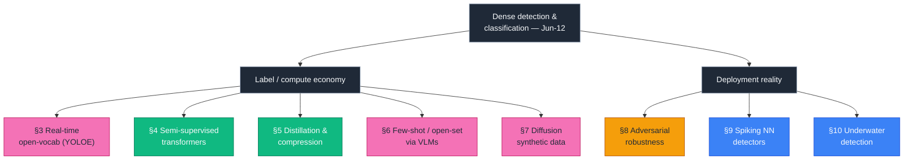
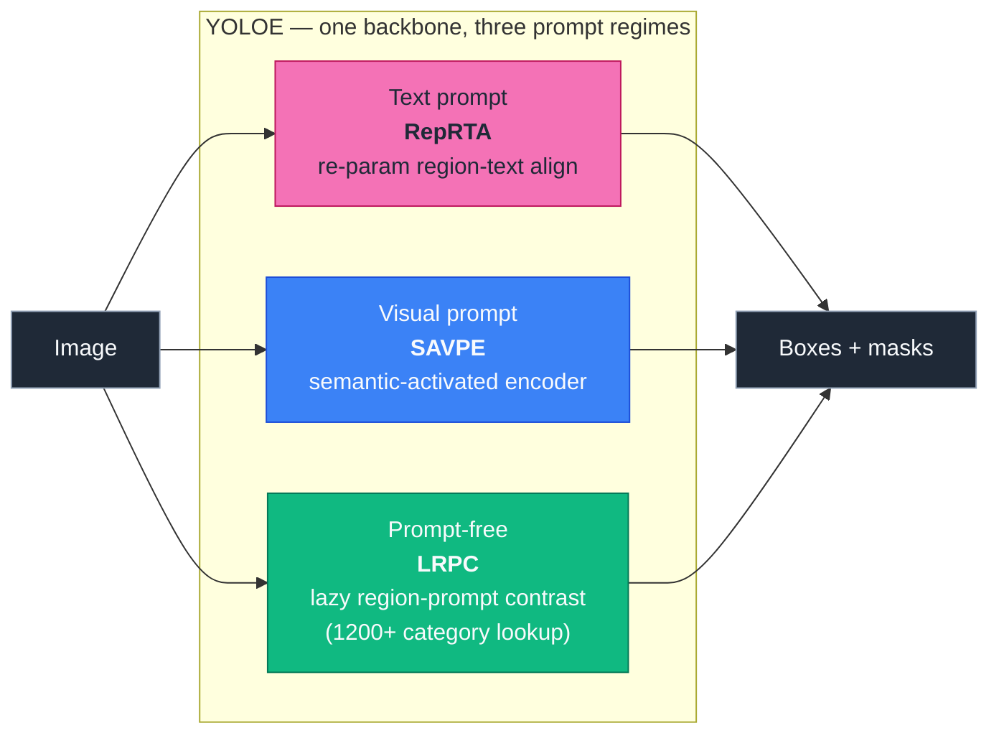
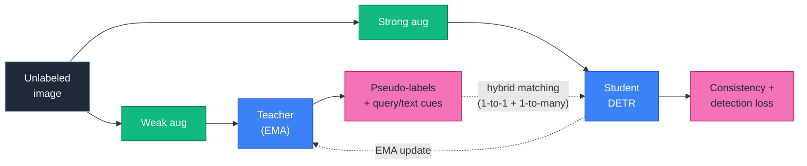
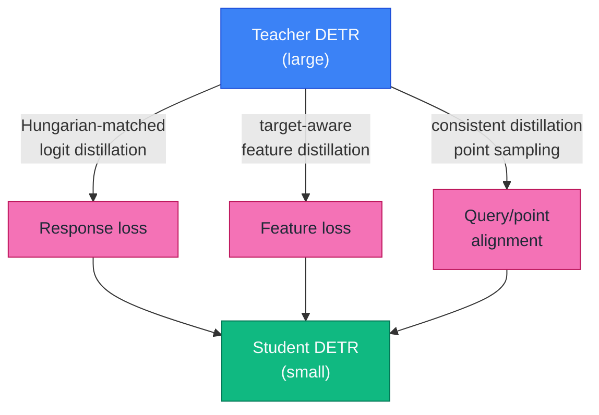
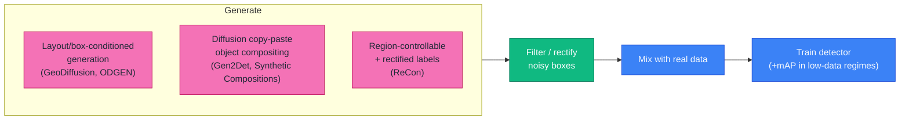
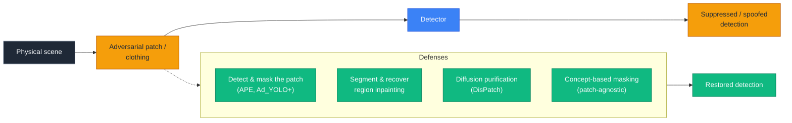
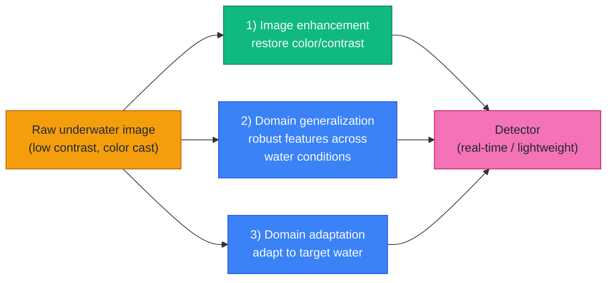

# Dense Object Detection & Classification — Recent Advances

*Compiled 2026-Jun-12 (America/Los_Angeles).*

Fourteenth installment in the running CV-updates log
([Apr-30](../2026-Apr-30/2026-Apr-30_CV_updates.md),
[May-01](../2026-May-01/2026-May-01_CV_updates.md),
[May-02](../2026-May-02/2026-May-02_CV_updates.md),
[May-04](../2026-May-04/2026-May-04_CV_updates.md),
[May-05](../2026-May-05/2026-May-05_CV_updates.md),
[May-07](../2026-May-07/2026-May-07_CV_updates.md),
[May-08](../2026-May-08/2026-May-08_CV_updates.md),
[May-15](../2026-May-15/2026-May-15_CV_updates.md),
[May-16](../2026-May-16/2026-May-16_CV_updates.md),
[May-17](../2026-May-17/2026-May-17_CV_updates.md),
[Jun-09](../2026-Jun-09/2026-Jun-09_CV_updates.md),
[Jun-10](../2026-Jun-10/2026-Jun-10_CV_updates.md)).
The previous passes worked through real-time DETRs, YOLO26, DINOv3, SAM 3,
Mamba/SSM decoders, diffusion detectors, single-vehicle LiDAR/MOT/event
sensing, camouflaged / open-world detection, multi-modal fusion, document /
defect / wildlife / agriculture verticals, counting, HOI, action detection,
REC/grounding, 6-DoF pose, visual in-context prompting, DETR PTQ, fine-grained
classification, AIGI forensics, small-object / UAV / RGB-T / SAR /
class-incremental / industrial-anomaly / sparse-query / unified heads, 3D
autonomous-driving / BEV / occupancy / open-vocabulary detection, open-vocab
3D + grasping + scene-text + parts + faces + infrared small-target + polyps +
agentic perception + reasoning video segmentation, and most recently
collaborative/V2X, 4D imaging radar, end-to-end driving world models, referring
MOT, RWKV backbones, remote-sensing change detection, auto-labeling data
engines, and crowded/occluded pedestrian detection.

Today rotates to **eight threads still untouched in this log**, weighted toward
*how detectors are trained, compressed, attacked, and fed* rather than new
heads: **real-time open-vocabulary 2D detection (the YOLOE generation)**,
**semi-supervised detection with transformers**, **knowledge distillation &
compression for detectors**, **few-shot / open-set detection via
vision-language models**, **diffusion-generated synthetic training data**,
**adversarial robustness & patch defenses**, **spiking neural-network
detectors**, and **underwater object detection**.

> **Sourcing note.** Figures are author-reported numbers on standard public
> splits and may differ from peer-reviewed camera-ready values. Several
> citations are recent preprints (including 2026-dated arXiv listings) whose
> claims have not been independently reproduced. Where a search/API returned
> only a partial result, the entry is kept and flagged rather than dropped, per
> the resilience requirement.

---

## Table of contents

1. [What's new since Jun-10](#1-whats-new-since-jun-10)
2. [Topic map](#2-topic-map)
3. [Real-time open-vocabulary 2D detection: the YOLOE generation](#3-real-time-open-vocabulary-2d-detection-the-yoloe-generation)
4. [Semi-supervised detection with transformers](#4-semi-supervised-detection-with-transformers)
5. [Knowledge distillation & compression for detectors](#5-knowledge-distillation--compression-for-detectors)
6. [Few-shot & open-set detection via vision-language models](#6-few-shot--open-set-detection-via-vision-language-models)
7. [Diffusion-generated synthetic training data](#7-diffusion-generated-synthetic-training-data)
8. [Adversarial robustness & patch defenses](#8-adversarial-robustness--patch-defenses)
9. [Spiking neural-network detectors](#9-spiking-neural-network-detectors)
10. [Underwater object detection](#10-underwater-object-detection)
11. [Reading list](#11-reading-list)

---

## 1. What's new since Jun-10

The connective theme this pass is **annotation- and compute-economy**. Five of
the eight threads are about getting a strong detector *without* the usual price:
open-vocabulary inference without retraining (§3), labels without humans (§4,
§6), a small model from a big one (§5), pixels without a camera (§7). The other
three are about **deployment reality**: detectors that survive an adversary
(§8), a power budget (§9), or a hostile imaging medium (§10).

A few load-bearing data points:

- **YOLOE** (ICCV 2025) collapses text-prompt, visual-prompt, and *prompt-free*
  open-vocabulary detection into one real-time YOLO with **zero inference
  overhead** versus a closed-set YOLO — surpassing YOLO-Worldv2-S by **+3.5 LVIS
  AP at 3× less training cost and 1.4× faster inference**.
- **Transformer semi-supervised detection** matured: Semi-DETR's hybrid
  matching + cross-view query consistency line now extends to **STEP-DETR**
  (ICCV 2025), which injects *pseudo-label text queries* to rebalance rare
  classes.
- **SpikeYOLO** with integer-valued training / spike-driven inference reports
  **66.2 % mAP@50 on COCO** and **5.7× energy efficiency** on neuromorphic Gen1
  — closing much of the historical SNN–CNN detection gap.

---

## 2. Topic map

---

## 3. Real-time open-vocabulary 2D detection: the YOLOE generation

Open-vocabulary detection (OVD) used to be a tax: GLIP/Grounding DINO–style
models pay heavily at inference because a text encoder runs alongside the
detector. [YOLO-World](https://arxiv.org/abs/2401.17270) (CVPR 2024) was the
first to push real-time OVD by re-parameterizing text embeddings into the YOLO
head offline. The 2025 successor, **[YOLOE](https://github.com/THU-MIG/yoloe)**
("Real-Time Seeing Anything," ICCV 2025), generalizes that idea across *three*
prompt regimes in one model with **zero inference and transfer overhead** versus
a closed-set YOLO:

Key points:

- **RepRTA** (text) re-parameterizes a lightweight region–text alignment into
  the detection head so the text encoder is *not* needed at inference.
- **SAVPE** (visual) lets a user prompt with an example crop instead of a word.
- **LRPC** (prompt-free) performs open-set recognition via embedding-similarity
  lookup against an internal vocabulary (~1200+ categories distilled from LVIS +
  Objects365), with **no external prompt or encoder**.
- Reported headline: **YOLOE-v8-S beats YOLO-Worldv2-S by +3.5 LVIS AP with 3×
  less training cost and 1.4× faster inference**; YOLOE also unifies detection
  *and* instance segmentation. (Numbers from the project README / [Ultralytics
  docs](https://docs.ultralytics.com/models/yoloe);
  [tutorial walk-through](https://learnopencv.com/yoloe-tutorial-real-time-open-vocabulary-detection/).)

**Why it matters for this log.** The OVD frontier is no longer "can we do
open-vocab at all" but "can we do it at YOLO latency on edge hardware." YOLOE
puts text/visual/promptless OVD in the same speed class as a closed-set
detector, which is what makes open-vocab practical for robotics and on-device
use. Search results also surfaced 2026 preprints exploring **YOLO26 × YOLOE**
integration for NMS-free end-to-end OVD; those are early and unverified, and are
flagged accordingly.

---

## 4. Semi-supervised detection with transformers

Semi-supervised object detection (SSOD) trains on a small labeled set plus a
large unlabeled pool, typically with a teacher–student mean-teacher loop and
pseudo-labels. The CNN era (STAC, Unbiased Teacher, Soft Teacher) assumed
NMS + dense anchors; porting that to DETR is non-trivial because DETR's
**one-to-one Hungarian matching** makes pseudo-labels brittle and slows
convergence. The current line solves this directly:

- **[Semi-DETR](https://arxiv.org/abs/2307.08095)** (CVPR 2023) was the first
  DETR-native SSOD framework: **Stage-wise Hybrid Matching** (one-to-many early
  to absorb noisy pseudo-labels, one-to-one later) plus **Cross-view Query
  Consistency** and cost-based pseudo-label mining.
- **Semi-DETR++** (preprint, Apr 2025) reports state-of-the-art SSOD by
  refining the hybrid-matching schedule and re-decode query consistency for
  more stable consistency training under noisy labels.
- **[STEP-DETR](https://openaccess.thecvf.com/content/ICCV2025/papers/Shehzadi_STEP-DETR_Advancing_DETR-based_Semi-Supervised_Object_Detection_with_Super_Teacher_and_ICCV_2025_paper.pdf)**
  (ICCV 2025) adds a **Super Teacher** for higher-quality pseudo-labels and
  **Pseudo-Label Text Queries** that fold text embeddings into the query set,
  explicitly rebalancing the student's confidence across common vs. rare
  classes — a recurring SSOD failure mode.

A 2026 survey ([Sensors](https://www.mdpi.com/1424-8220/26/1/310),
[PMC mirror](https://pmc.ncbi.nlm.nih.gov/articles/PMC12788260/)) traces the
CNN→transformer arc and flags the persistent gaps: compute cost of the
teacher–student loop, robustness to pseudo-label noise, training stability, and
**benchmark realism** (COCO 1–10 % splits are not representative of real
long-tailed unlabeled pools). The pattern across all three methods is the same:
*pseudo-labels are no longer just boxes — they are semantic cues that steer
query refinement and cross-view consistency.*

---

## 5. Knowledge distillation & compression for detectors

DETR-family detectors are accurate but heavy; distillation (KD) compresses a
large teacher into a deployable student. KD for detectors has two classic
channels — **logit/response** distillation and **feature** distillation — plus a
DETR-specific complication: which queries/locations do you even distill, given
sparse one-to-one predictions?

- **[DETRDistill](https://arxiv.org/abs/2211.10156)** — a universal KD framework
  for the DETR family: **Hungarian-matching logit distillation** to align
  teacher/student predictions plus **target-aware feature distillation** for
  object-centric features.
- **[KD-DETR](https://arxiv.org/abs/2211.08071)** — identifies that reliable KD
  needs *sufficient and consistent distillation points*; introduces consistent
  distillation-point sampling that works for both homogeneous (DETR→DETR) and
  heterogeneous teacher/student pairs.
- **[Query-selection KD](https://arxiv.org/abs/2409.06443)** (2024) — shows that
  **hard-negative foreground queries** are the ones worth distilling, not the
  full query set.
- **[SO-DETR](https://arxiv.org/abs/2504.11470)** (Apr 2025) — pairs a
  lightweight backbone with KD to build an efficient **small-object** detector,
  a reminder that KD is increasingly fused with architecture search rather than
  applied post-hoc.

Two 2025 surveys frame the field: an
[architectural review of KD for detection](https://arxiv.org/pdf/2508.03317)
and a [CNN→transformer KD survey](https://pmc.ncbi.nlm.nih.gov/articles/PMC12788226/).
The throughline: **the hard part of detector KD is correspondence** — matching
teacher and student predictions/features when the student has fewer queries,
different resolution, or a different backbone family. This complements the DETR
post-training-quantization thread from [May-15](../2026-May-15/2026-May-15_CV_updates.md):
KD shrinks *what* you compute, PTQ shrinks *how precisely* you compute it.

---

## 6. Few-shot & open-set detection via vision-language models

Few-shot object detection (FSOD) asks for a detector of novel classes from a
handful of examples; **open-set** FSOD additionally requires rejecting unknowns.
The 2024–26 shift is decisive: **don't train an FSOD model from scratch —
fine-tune a vision-language foundation detector.**

- **[Revisiting FSOD with VLMs](https://arxiv.org/abs/2312.14494)** established a
  benchmark protocol where detectors pre-trained on large external corpora are
  fine-tuned on **multi-modal (text + visual) K-shot** examples per class — and
  found these VLM-based detectors dramatically outperform classic meta-learning
  FSOD.
- **Grounding DINO** (Swin-B) is the recurring backbone of choice: pre-trained
  on COCO + Objects365 + GoldG + Cap4M + OpenImages + ODinW-35 + RefCOCO, it
  fine-tunes to a target domain from very few shots.
- **[Few-shot open-set OD via prompt learning](https://arxiv.org/html/2406.18443v3)**
  detects known classes while rejecting unknowns under scarce data, using
  prompt learning + a robust decision boundary.
- **[NTIRE 2025 Cross-Domain FSOD challenge](https://arxiv.org/html/2504.10685v1)**
  pushed cross-domain FSOD as a formal benchmark; winning entries set new SOTA
  in both open- and closed-source settings, mostly by fine-tuning grounding
  detectors with clever augmentation and pseudo-text.
- A practical caveat from
  **["open-vocab vs. closed-set" best practice](https://arxiv.org/pdf/2410.15315)**:
  open-vocabulary detectors only beat closed-set fine-tuning when the target
  classes are *text-describable*; for visually idiosyncratic categories, a
  closed-set fine-tune can still win.

The boundary between this section and §3 is real but narrowing: **§3 is about
zero-/low-overhead inference across an open vocabulary; §6 is about squeezing a
specific novel domain out of a foundation detector with minimal labels.** Both
lean on the same grounding/VLM substrate. See the
[MLLM-for-detection review](https://www.sciencedirect.com/science/article/pii/S1566253525006475)
for the broader landscape, and the agentic-perception thread in
[Jun-09](../2026-Jun-09/2026-Jun-09_CV_updates.md) for the LLM-tool-use end of it.

---

## 7. Diffusion-generated synthetic training data

If labels are the bottleneck, generate the *images and labels together*.
Text-to-image diffusion now produces detector training data good enough to move
mAP, especially in data-scarce domains. Three sub-strategies have emerged:

- **Layout-conditioned generation.**
  [GeoDiffusion](https://arxiv.org/pdf/2306.04607) text-prompts *geometric*
  control so generated images respect target boxes;
  [ODGEN](https://arxiv.org/pdf/2405.15199) specializes this to domain-specific
  detection. [AeroGen](https://arxiv.org/html/2411.15497v2) does layout-driven
  generation for **remote-sensing** detection, where real annotated data is
  especially scarce.
- **Diffusion copy-paste / compositing.**
  [Gen2Det](https://arxiv.org/pdf/2312.04566) generates scene-level data to
  detect; recent **[Synthetic Object Compositions](https://arxiv.org/html/2510.09110)**
  (Oct 2025) composites generated objects for detection, segmentation, *and*
  grounding at once. A "Diffusion Copy-Paste" variant conditioned on edge/image
  prompts reported **+3.57 % mAP** on average by mixing synthetic types.
- **Label rectification.** The hard problem is *label noise* — generated boxes
  drift from generated pixels. **[ReCon](https://arxiv.org/pdf/2510.15783)**
  (Oct 2025) adds region-controllable generation with **rectification and
  alignment** to keep boxes faithful; **[object-centric category-level
  synthesis](https://arxiv.org/html/2511.23450v1)** (Nov 2025) targets per-class
  coverage.

This is the *generative* sibling of the **auto-labeling data engines** covered
in [Jun-10 §9](../2026-Jun-10/2026-Jun-10_CV_updates.md): data engines label
*real* images with a foundation model; diffusion pipelines *manufacture* both
the image and its label. The shared lesson is that **quality control —
filtering and rectifying noisy supervision — matters more than raw volume.**

---

## 8. Adversarial robustness & patch defenses

Detectors are deployed in security-critical settings (driving, surveillance,
navigation), where a printed **adversarial patch** can suppress a detection or
spoof one in the physical world. The 2023–25 literature has matured into a
clear attack/defense loop:

**Defenses.**
- **Adversarial Patch-Feature Energy (APE)** exploits the shared deep-feature
  signature of patches via APE-masking + APE-refinement to neutralize *any*
  patch ([ACM MM](https://dl.acm.org/doi/10.1145/3503161.3548362)).
- **[Segment and Recover](https://pmc.ncbi.nlm.nih.gov/articles/PMC12470975/)**
  localizes the patch region and reconstructs the clean detection.
- **[DisPatch](https://arxiv.org/pdf/2509.04597)** (Sep 2025) uses **diffusion
  models** to "disarm" patches by purifying the corrupted region — the same
  generative machinery from §7 turned to defense.
- **Concept-Based Masking** (NeurIPS 2025) offers a **patch-agnostic** defense
  that does not assume a localized noise blob.

**The attack side keeps moving.** Patches have evolved from obvious noise blobs
into **natural-looking patterns** that evade region-removal defenses
([survey, 2023–25](https://www.preprints.org/manuscript/202510.1706)). A 2025
result shows a **[single set of adversarial clothes breaking multiple
defenses](https://arxiv.org/pdf/2510.17322)** in the physical world, and 2026
preprints report **[transferable physical-world patches against pedestrian
detectors](https://arxiv.org/html/2604.22552v1)**. Crucially,
**[Breaking the Illusion](https://arxiv.org/pdf/2410.19863)** documents how many
lab-grade attacks degrade sharply under real-world viewing angles, lighting, and
print fidelity — so reported attack success rates should be read with the same
skepticism as reported defense rates. This connects to the AIGI-forensics thread
in [May-15](../2026-May-15/2026-May-15_CV_updates.md): both are about
trustworthiness of perception under adversarial pressure.

---

## 9. Spiking neural-network detectors

Spiking neural networks (SNNs) trade dense floating-point MACs for sparse,
event-driven spikes — attractive for always-on edge sensing and neuromorphic
hardware. Historically SNN detectors lagged CNNs badly; 2024–25 work closed most
of the gap.

| Milestone | Contribution | Headline number |
|---|---|---|
| [Spiking-YOLO](https://arxiv.org/abs/1903.06530) (2020) | First deep-SNN object detector | Proof of concept |
| [EMS-YOLO](https://arxiv.org/abs/2307.11411) (2023) | First **directly-trained** SNN detector (no ANN→SNN conversion) | Removes conversion latency |
| **[SpikeYOLO](https://arxiv.org/abs/2407.20708)** (ECCV 2024, Best-Paper candidate) | Simplified meta-SNN YOLO + **I-LIF** integer-valued training / spike-driven inference | **66.2 % mAP@50, 48.9 % mAP@50:95 on COCO** (+15.0 / +18.7 over prior SNN SOTA); **67.2 % mAP@50 on Gen1 with 5.7× energy efficiency** |
| [SU-YOLO](https://arxiv.org/abs/2503.24389) (2025) | SNN for **underwater** detection (ties into §10) | Efficient low-power underwater detector |
| [SMTrack](https://arxiv.org/html/2508.14607v1) (2025) | End-to-end trained SNN for **multi-object tracking** in RGB video | Extends SNNs beyond single-frame detection |

The decisive trick in SpikeYOLO is **I-LIF (Integer Leaky Integrate-and-Fire)**:
train with integer activations to cut the quantization error that plagued binary
spikes, then run spike-driven (and therefore low-power) at inference. SNNs pair
naturally with **event cameras** (the Gen1 neuromorphic benchmark), which links
back to the single-vehicle event-sensing thread in
[May-08](../2026-May-08/2026-May-08_CV_updates.md): event data is the native
input modality where the SNN energy advantage is largest.

---

## 10. Underwater object detection

Underwater detection is a stress test for domain robustness: wavelength-dependent
absorption produces **low-contrast, blue/green color casts**, turbidity blurs
edges, and lighting varies wildly — so a detector trained on one water condition
collapses on another. The field is converging on three responses:

- **Enhancement-coupled detection.** A
  [real-time domain-adaptive framework with image enhancement](https://arxiv.org/pdf/2403.19079)
  jointly restores the image and detects, rather than treating enhancement as a
  disconnected preprocessing step.
- **Domain generalization.**
  [Robust underwater detection via domain generalization](https://arxiv.org/abs/2503.19929)
  and the **MARS** multi-scale framework target features that transfer across
  unseen water conditions without target-domain labels.
- **New benchmarks + lightweight models.** **UOD-SZTU-2025** (3,133 images, five
  marine classes) ships with **EFCWM-Mamba-YOLO**, whose Enhanced Feature
  Correction and Weighting Module does feature-level domain adaptation in a
  real-time, lightweight detector
  ([Neurocomputing](https://www.sciencedirect.com/science/article/abs/pii/S0925231225015632)).
- **Robustness reality check.** An
  [empirical study of YOLO under underwater conditions](https://arxiv.org/html/2509.17561v1)
  reports enhancement-fine-tuned models hit **0.899 mAP@50 on enhanced test
  images but only 0.672 on original real-world images** — a stark
  enhancement-vs-reality gap. A broader 2026 preprint,
  [Generalization Under Scrutiny](https://arxiv.org/pdf/2604.08230), argues
  cross-domain detection gains are often overstated once evaluation is honest.

Underwater is also where §7 and §9 converge on a vertical: diffusion-based
augmentation helps with the data scarcity, and **SU-YOLO** (§9) shows SNNs are
attractive for power-limited underwater robots.

---

## 11. Reading list

**§3 Real-time open-vocabulary**
- YOLOE — Real-Time Seeing Anything (ICCV 2025): [code](https://github.com/THU-MIG/yoloe) · [docs](https://docs.ultralytics.com/models/yoloe) · [tutorial](https://learnopencv.com/yoloe-tutorial-real-time-open-vocabulary-detection/)
- YOLO-World (CVPR 2024): [arXiv 2401.17270](https://arxiv.org/abs/2401.17270)

**§4 Semi-supervised transformers**
- Semi-DETR (CVPR 2023): [arXiv 2307.08095](https://arxiv.org/abs/2307.08095)
- STEP-DETR (ICCV 2025): [paper PDF](https://openaccess.thecvf.com/content/ICCV2025/papers/Shehzadi_STEP-DETR_Advancing_DETR-based_Semi-Supervised_Object_Detection_with_Super_Teacher_and_ICCV_2025_paper.pdf)
- SSOD survey CNN→Transformer (2026): [MDPI Sensors](https://www.mdpi.com/1424-8220/26/1/310) · [PMC](https://pmc.ncbi.nlm.nih.gov/articles/PMC12788260/)

**§5 Distillation & compression**
- DETRDistill: [arXiv 2211.10156](https://arxiv.org/abs/2211.10156)
- KD-DETR: [arXiv 2211.08071](https://arxiv.org/abs/2211.08071)
- Query-selection KD: [arXiv 2409.06443](https://arxiv.org/abs/2409.06443)
- SO-DETR (small object): [arXiv 2504.11470](https://arxiv.org/abs/2504.11470)
- KD-for-detection surveys: [architectural review](https://arxiv.org/pdf/2508.03317) · [CNN→Transformer](https://pmc.ncbi.nlm.nih.gov/articles/PMC12788226/)

**§6 Few-shot & open-set via VLMs**
- Revisiting FSOD with VLMs: [arXiv 2312.14494](https://arxiv.org/abs/2312.14494)
- Few-shot open-set via prompt learning: [arXiv 2406.18443](https://arxiv.org/html/2406.18443v3)
- NTIRE 2025 Cross-Domain FSOD: [arXiv 2504.10685](https://arxiv.org/html/2504.10685v1)
- Open-vocab vs. closed-set best practice: [arXiv 2410.15315](https://arxiv.org/pdf/2410.15315)
- MLLM-for-detection review: [ScienceDirect](https://www.sciencedirect.com/science/article/pii/S1566253525006475)

**§7 Diffusion synthetic data**
- GeoDiffusion: [arXiv 2306.04607](https://arxiv.org/pdf/2306.04607) · ODGEN: [arXiv 2405.15199](https://arxiv.org/pdf/2405.15199) · AeroGen: [arXiv 2411.15497](https://arxiv.org/html/2411.15497v2)
- Gen2Det: [arXiv 2312.04566](https://arxiv.org/pdf/2312.04566) · Synthetic Object Compositions: [arXiv 2510.09110](https://arxiv.org/html/2510.09110)
- ReCon (label rectification): [arXiv 2510.15783](https://arxiv.org/pdf/2510.15783) · Object-centric synthesis: [arXiv 2511.23450](https://arxiv.org/html/2511.23450v1)

**§8 Adversarial robustness**
- APE defense: [ACM MM](https://dl.acm.org/doi/10.1145/3503161.3548362)
- Segment and Recover: [PMC](https://pmc.ncbi.nlm.nih.gov/articles/PMC12470975/) · DisPatch (diffusion): [arXiv 2509.04597](https://arxiv.org/pdf/2509.04597)
- Adversarial clothes break defenses: [arXiv 2510.17322](https://arxiv.org/pdf/2510.17322) · Transferable pedestrian patches: [arXiv 2604.22552](https://arxiv.org/html/2604.22552v1)
- Breaking the Illusion (real-world limits): [arXiv 2410.19863](https://arxiv.org/pdf/2410.19863) · Patch attack/defense survey: [Preprints](https://www.preprints.org/manuscript/202510.1706) · [awesome list](https://github.com/jiakaiwangCN/awesome-physical-adversarial-examples)

**§9 Spiking NN detectors**
- SpikeYOLO (ECCV 2024): [arXiv 2407.20708](https://arxiv.org/abs/2407.20708) · [code](https://github.com/BICLab/SpikeYOLO)
- EMS-YOLO (directly-trained): [arXiv 2307.11411](https://arxiv.org/abs/2307.11411) · Spiking-YOLO: [arXiv 1903.06530](https://arxiv.org/abs/1903.06530)
- SU-YOLO (underwater SNN): [arXiv 2503.24389](https://arxiv.org/abs/2503.24389) · SMTrack (SNN MOT): [arXiv 2508.14607](https://arxiv.org/html/2508.14607v1)

**§10 Underwater detection**
- Real-time domain-adaptive + enhancement: [arXiv 2403.19079](https://arxiv.org/pdf/2403.19079)
- Domain generalization: [arXiv 2503.19929](https://arxiv.org/abs/2503.19929)
- UOD-SZTU-2025 + EFCWM-Mamba-YOLO: [Neurocomputing](https://www.sciencedirect.com/science/article/abs/pii/S0925231225015632)
- YOLO underwater robustness study: [arXiv 2509.17561](https://arxiv.org/html/2509.17561v1) · Generalization Under Scrutiny: [arXiv 2604.08230](https://arxiv.org/pdf/2604.08230)

### Cross-section pointers from earlier installments

- **DETR post-training quantization** (compression complement to §5): [May-15 §](../2026-May-15/2026-May-15_CV_updates.md)
- **Small-object / sparse-query / unified heads** (SO-DETR context): [May-16](../2026-May-16/2026-May-16_CV_updates.md)
- **Open-vocabulary 3D detection** (3D sibling of §3/§6): [May-17](../2026-May-17/2026-May-17_CV_updates.md), [Jun-09](../2026-Jun-09/2026-Jun-09_CV_updates.md)
- **Agentic "thinking-with-images" perception** (LLM-tool end of §6): [Jun-09 §10](../2026-Jun-09/2026-Jun-09_CV_updates.md)
- **Foundation-model auto-labeling data engines** (real-data sibling of §7): [Jun-10 §9](../2026-Jun-10/2026-Jun-10_CV_updates.md)
- **AIGI forensics** (trustworthiness sibling of §8): [May-15](../2026-May-15/2026-May-15_CV_updates.md)
- **Event/neuromorphic single-vehicle sensing** (event-camera input for §9): [May-08](../2026-May-08/2026-May-08_CV_updates.md)

---

*End of 2026-Jun-12 installment. Diagrams are Mermaid (rendered client-side) using a
saturated mid-tone palette with explicit text colors for legibility in both light and
dark themes. No external image URLs are used.*
