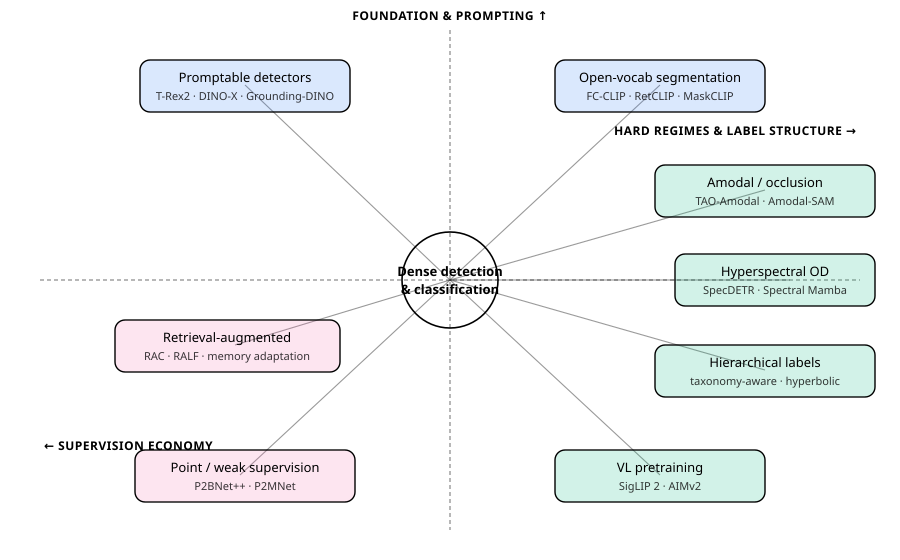

# Dense Object Detection & Classification — Recent Advances

*Compiled 2026-Jun-13 (America/Los_Angeles).*

Fifteenth installment in the running CV-updates log
([Apr-30](../2026-Apr-30/2026-Apr-30_CV_updates.md),
[May-01](../2026-May-01/2026-May-01_CV_updates.md),
[May-02](../2026-May-02/2026-May-02_CV_updates.md),
[May-04](../2026-May-04/2026-May-04_CV_updates.md),
[May-05](../2026-May-05/2026-May-05_CV_updates.md),
[May-07](../2026-May-07/2026-May-07_CV_updates.md),
[May-08](../2026-May-08/2026-May-08_CV_updates.md),
[May-15](../2026-May-15/2026-May-15_CV_updates.md),
[May-16](../2026-May-16/2026-May-16_CV_updates.md),
[May-17](../2026-May-17/2026-May-17_CV_updates.md),
[Jun-09](../2026-Jun-09/2026-Jun-09_CV_updates.md),
[Jun-10](../2026-Jun-10/2026-Jun-10_CV_updates.md),
[Jun-12](../2026-Jun-12/2026-Jun-12_CV_updates.md)).
The previous fourteen passes worked through real-time DETRs, YOLO26, DINOv3,
SAM 3, Mamba/SSM and RWKV backbones, diffusion detectors, single-vehicle and
cooperative (V2X) LiDAR/MOT/event/4D-radar sensing, end-to-end driving world
models, camouflaged / open-world detection, multi-modal fusion, document /
defect / wildlife / agriculture verticals, counting, HOI, action detection,
REC/grounding, referring MOT, 6-DoF pose, visual in-context prompting, DETR
PTQ, fine-grained classification, AIGI forensics, small-object / UAV / RGB-T /
SAR / infrared-small-target / class-incremental / industrial-anomaly /
sparse-query / unified heads, 3D autonomous-driving / BEV / occupancy /
open-vocabulary 3D detection, grasping, scene-text, open-vocab parts, faces,
polyps, agentic perception, reasoning video segmentation, remote-sensing change
detection, auto-labeling data engines, crowded/occluded pedestrians, and — most
recently (Jun-12) — real-time open-vocab YOLOE, semi-supervised DETR, knowledge
distillation, few-shot/open-set VLM detection, diffusion synthetic data,
adversarial robustness, spiking detectors, and underwater detection.

Today rotates to **eight further threads still untouched in this log**, themed
around a single question: *how do you build a detector or classifier without
the closed-set, fully-labeled assumptions of the COCO era?* The thread spans
**promptable open-set detection foundation models**, **open-vocabulary
panoptic & instance segmentation**, **point- and weakly-supervised detection**,
**amodal / occlusion-aware detection**, **hyperspectral object detection**,
**hierarchical & taxonomy-aware classification**, **vision-language pretraining
for zero-shot classification**, and **retrieval-augmented detection &
recognition**.

> **Sourcing note.** Figures are author-reported numbers on standard public
> splits and may differ from peer-reviewed camera-ready values. Several
> citations are recent preprints (including 2026-dated arXiv listings) whose
> claims have not been independently reproduced. During compilation the
> arXiv abstract/HTML endpoints returned `HTTP 403` to the fetch tool, so the
> entries below are reconstructed from search-index summaries and publisher
> pages rather than full-text reads — numbers should be treated as indicative
> and verified against the primary PDF before citing. Per the resilience
> requirement, partial results are kept and flagged rather than dropped.

---

## Table of contents

1. [What's new since Jun-12](#1-whats-new-since-jun-12)
2. [Topic map](#2-topic-map)
3. [Promptable open-set detection foundation models](#3-promptable-open-set-detection-foundation-models)
4. [Open-vocabulary panoptic & instance segmentation](#4-open-vocabulary-panoptic--instance-segmentation)
5. [Point- & weakly-supervised detection](#5-point--weakly-supervised-detection)
6. [Amodal & occlusion-aware detection](#6-amodal--occlusion-aware-detection)
7. [Hyperspectral object detection](#7-hyperspectral-object-detection)
8. [Hierarchical & taxonomy-aware classification](#8-hierarchical--taxonomy-aware-classification)
9. [Vision-language pretraining for zero-shot classification](#9-vision-language-pretraining-for-zero-shot-classification)
10. [Retrieval-augmented detection & recognition](#10-retrieval-augmented-detection--recognition)
11. [Reading list](#11-reading-list)

---

## 1. What's new since Jun-12

The connective theme this pass is **dropping the closed-set, fully-supervised
contract**. Each thread relaxes a different assumption that COCO-era detectors
took for granted:

- **The vocabulary is fixed at train time** → §3 promptable foundation
  detectors and §4 open-vocabulary segmentation accept text *or* visual
  prompts (or none) and name objects never seen during training.
- **Every box is hand-drawn** → §5 trains competitive detectors from a *single
  click per object*, and §10 lets a frozen detector look up rare concepts from
  an external memory instead of relearning them.
- **Objects are fully visible** → §6 reasons about the hidden extent of
  occluded objects (amodal completion).
- **The input is an RGB image** → §7 detects sub-pixel targets in
  hundreds-of-band hyperspectral cubes.
- **Classes are a flat list** → §8 respects a label *tree*, so a leopard
  mistaken for a jaguar costs less than one mistaken for a truck.
- **You need labeled data at all** → §9's contrastive image-text encoders
  classify thousands of categories zero-shot.

A few load-bearing data points (author-reported; see the sourcing caveat):

- **DINO-X Pro** reports **56.0 AP on COCO**, **59.8 AP on LVIS-minival** and
  **63.3 AP on LVIS-minival rare classes** zero-shot, trained on a
  **Grounding-100M** corpus, with a single backbone serving detection,
  segmentation, pose, captioning and object-QA. The **Edge** variant keeps
  **48.3 AP on LVIS-minival** for real-time use.
- **FC-CLIP** turns one *frozen* convolutional CLIP into both mask generator
  and open-vocab classifier — **26.8 PQ on ADE20K** zero-shot while training
  and testing **~7.5×/6.6× faster** than prior two-stage pipelines; **RetCLIP**
  (retrieval-augmented, arXiv 2026) lifts that to **30.9 PQ / 19.3 mAP /
  44.0 mIoU** (**+4.5 PQ**).
- **P2Object / P2MNet** push *single-point*-supervised detection to
  **~30.3 box AP on COCO** — within striking distance of fully-supervised
  Faster R-CNN — from one click per instance.
- **SigLIP 2** improves zero-shot ImageNet top-1 by **~2–3 points** over SigLIP
  at matched scale, across B/L/So400m/g sizes, by adding caption, self-distill
  and masked-patch objectives to the sigmoid loss.

---

## 2. Topic map

The eight threads cluster on three axes — *foundation & prompting* (top),
*supervision economy* (left), and *hard regimes & label structure* (right).

Text description of the topic map (accessibility fallback)

A central hub, "dense detection & classification", links to eight nodes in
three colour groups:

- **Foundation & prompting (top):** Promptable detectors (T-Rex2, DINO-X,
  Grounding-DINO); Open-vocab segmentation (FC-CLIP, RetCLIP, MaskCLIP).
- **Supervision economy (left):** Point / weak supervision (P2BNet++, P2MNet);
  Retrieval-augmented (RAC, RALF, memory adaptation).
- **Hard regimes & label structure (right):** Amodal / occlusion (TAO-Amodal,
  Amodal-SAM); Hyperspectral OD (SpecDETR, Spectral Mamba); Hierarchical labels
  (taxonomy-aware, hyperbolic); VL pretraining (SigLIP 2, AIMv2).

---

## 3. Promptable open-set detection foundation models

The DETR-grounding lineage has converged on a single idea: a detector should
take a **prompt** — text, a visual exemplar, or nothing — and return boxes for
*whatever the prompt names*, including categories absent from training.

- **T-Rex2** (ECCV 2024) is the reference design for **text-visual prompt
  synergy**. Its insight is complementarity: *text* prompts capture abstract
  concepts of common objects but stumble on rare/long-tail ones, while *visual*
  prompts (a box or point on an exemplar) depict novel objects concretely but
  cannot convey abstraction. T-Rex2 fuses both in one model via region-text
  contrastive alignment, so a user can point at one widget and detect the rest.
- **DINO-X** (IDEA Research, arXiv 2411.14347, v3) scales this into a *unified*
  open-world model. It supports **text, visual, and "customized" prompts**, and
  adds a **universal object prompt** for **prompt-free** "detect everything"
  inference. Trained on **Grounding-100M** (100M+ grounding samples), the **Pro**
  model reports **56.0 AP (COCO)**, **59.8 / 52.4 AP (LVIS-minival / -val)** and
  **63.3 / 56.5 AP on LVIS rare classes** zero-shot — author-claimed **+5.8 /
  +5.0 box AP** over prior SOTA on rare classes — while the **Edge** model holds
  **48.3 / 42.0 AP (LVIS-minival / -val)** for latency-bound deployment. One
  object-level representation feeds detection, segmentation, pose, object
  captioning, and object-QA heads.
- **Grounding DINO 1.5/1.6** sits between the open-source Grounding DINO and
  DINO-X — the same marry-DINO-with-grounded-pretraining recipe, scaled for
  open-set detection in the wild.

**Why it matters.** These models collapse "train a detector" into "write a
prompt," and the visual-prompt path is what makes them practical for the
long tail that text alone cannot name. The open question is honest evaluation:
LVIS-rare AP is sensitive to prompt phrasing and the 100M-scale grounding data
likely overlaps benchmark categories, so zero-shot claims deserve scrutiny.

**Sources:**
[T-Rex2 (arXiv 2403.14610)](https://arxiv.org/abs/2403.14610) ·
[T-Rex2 (ECCV 2024, Springer)](https://link.springer.com/chapter/10.1007/978-3-031-73414-4_3) ·
[T-Rex / T-Rex2 code](https://github.com/IDEA-Research/T-Rex) ·
[DINO-X (arXiv 2411.14347)](https://arxiv.org/abs/2411.14347) ·
[DINO-X paper page (HF)](https://huggingface.co/papers/2411.14347) ·
[DINO-X-API code](https://github.com/IDEA-Research/DINO-X-API) ·
[Grounding DINO 1.5 (DigitalOcean overview)](https://www.digitalocean.com/community/tutorials/grounding-dino-1-5-open-set-object-detection)

---

## 4. Open-vocabulary panoptic & instance segmentation

Open-vocab detection's dense cousin: assign every pixel a mask *and* a name
drawn from an open vocabulary, evaluated zero-shot on datasets the model never
trained on (ADE20K, Mapillary, Cityscapes).

- **FC-CLIP** ("Convolutions Die Hard", NeurIPS 2023) is the efficiency
  baseline everyone now compares against. A **single frozen convolutional
  CLIP** serves *both* as mask generator and open-vocab classifier — the
  convolutional backbone generalizes to higher resolutions than CLIP's
  pretraining size, and freezing it preserves zero-shot classification. Trained
  on COCO panoptic only, it reports **26.8 PQ / 16.8 AP / 34.1 mIoU on ADE20K**,
  **18.2 PQ on Mapillary Vistas**, and **44.0 PQ on Cityscapes** zero-shot, at
  **~7.5× / 6.6× faster** train/test than the prior two-stage art.
- **MaskCLIP** and **OpenSeeD/X-Decoder**-style decoders established the
  two-stage "mask proposals → CLIP naming" template that FC-CLIP compressed.
- **Retrieval augmentation (2026).** *Open Vocabulary Panoptic Segmentation
  with Retrieval Augmentation* (arXiv 2601.12779, "RetCLIP") adds a
  **non-parametric memory** of mask-pooled features indexed by class; at
  inference it returns similarity-aggregated scores that *supplement or
  override* direct prompt matching. On COCO→ADE20K it reports **30.9 PQ /
  19.3 mAP / 44.0 mIoU** — **+4.5 PQ / +2.5 mAP / +10.0 mIoU** over its baseline,
  with the gains concentrated on out-of-domain categories. A complementary
  *training-free* line, **kNN-CLIP**, shows retrieval can expand vocabularies
  continually without any fine-tuning.
- **Objectness-bias mitigation (2026).** *Mitigating Objectness Bias and
  Region-to-Text Misalignment* (arXiv 2603.21386) targets two failure modes of
  frozen-CLIP segmenters: the mask head over-fires on "thing"-like blobs, and
  region embeddings drift from text embeddings — both of which throttle
  zero-shot PQ.

**Why it matters.** The frozen-CLIP recipe made open-vocab segmentation
*cheap*; the 2026 work is about *recognition quality on the tail*, where
retrieval (look it up) is beating parametric scaling (learn it all). This is the
same retrieval-vs-parameters tension as §10, one rung up the density ladder.

**Sources:**
[FC-CLIP (arXiv 2308.02487)](https://arxiv.org/abs/2308.02487) ·
[FC-CLIP (NeurIPS 2023 PDF)](https://papers.neurips.cc/paper_files/paper/2023/file/661caac7729aa7d8c6b8ac0d39ccbc6a-Paper-Conference.pdf) ·
[MaskCLIP OV panoptic (OpenReview)](https://openreview.net/forum?id=zWudXc9343) ·
[OV Panoptic w/ Retrieval Augmentation (arXiv 2601.12779)](https://arxiv.org/abs/2601.12779) ·
[kNN-CLIP (arXiv 2404.09447)](https://arxiv.org/pdf/2404.09447) ·
[Objectness-bias mitigation (arXiv 2603.21386)](https://arxiv.org/html/2603.21386v1) ·
[OV panoptic overview](https://www.emergentmind.com/topics/open-vocabulary-panoptic-segmentation)

---

## 5. Point- & weakly-supervised detection

Bounding boxes are the expensive part of detection annotation. This thread asks
how far a **single click per object** (point supervision) — or just image-level
tags — can take you.

- **P2BNet** (Point-to-Box, ECCV 2022) was the first single-point-supervised
  detector. It builds *balanced instance-level proposal bags* by sampling
  anchor-like proposals around each point and refining them coarse-to-fine
  inside a multiple-instance-learning (MIL) framework, generating pseudo-boxes
  that train a standard detector. It improved relative AP by **>50%** over the
  prior point-supervised art on COCO.
- **P2Object / P2BNet++ / P2MNet** (IJCV 2025, arXiv 2504.07813) reframes the
  discrete proposal sampling as an **approximately continuous** optimization,
  adding spatial self-distillation. The reported COCO ladder runs from
  **P2BNet++-FR ≈ 21.7–23.1 AP** up to **P2MNet-SwinMR\* ≈ 30.3 AP**, and the
  Point-to-Mask variant extends the same supervision to *instance
  segmentation*. Gains hold on VOC, SBD and Cityscapes, narrowing the gap to
  fully-supervised training.
- **Specialized regimes.** *Tiny Object Detection with Single Point
  Supervision* (arXiv 2412.05837) adapts point-MIL to sub-16px targets;
  **I²OL-Net** (arXiv 2412.03811) handles point-supervised **X-ray prohibited-
  item** detection via intra/inter objectness learning; **Point2RBox** (arXiv
  2311.14758) extends single-point supervision to **oriented** (rotated-box)
  detection using synthetic visual patterns.

**Why it matters.** A click is ~10× cheaper than a box. Closing from "50%
relative gain" (2022) to "~30 AP, within ~10 points of full supervision"
(2025) makes point supervision a credible default for new domains — and the
extensions to masks, tiny targets, X-ray and oriented boxes show the recipe
generalizes beyond natural images.

**Sources:**
[P2BNet (arXiv 2207.06827)](https://arxiv.org/pdf/2207.06827) ·
[P2BNet (ECCV 2022, Springer)](https://link.springer.com/chapter/10.1007/978-3-031-20077-9_4) ·
[P2Object (arXiv 2504.07813)](https://arxiv.org/abs/2504.07813) ·
[P2Object (IJCV 2025)](https://link.springer.com/article/10.1007/s11263-025-02441-3) ·
[Tiny OD w/ single point (arXiv 2412.05837)](https://arxiv.org/pdf/2412.05837) ·
[I²OL-Net X-ray point sup. (arXiv 2412.03811)](https://arxiv.org/pdf/2412.03811) ·
[Point2RBox oriented (arXiv 2311.14758)](https://arxiv.org/pdf/2311.14758)

---

## 6. Amodal & occlusion-aware detection

*Amodal* perception is the human ability to infer an object's full extent when
it is partly hidden. Amodal detection/segmentation predicts the **complete**
box or mask, including occluded regions — the regime where modal (visible-only)
detectors silently truncate.

- **Benchmark: TAO-Amodal** (arXiv 2312.12433) annotates **833 object
  categories amodally** in unconstrained indoor/outdoor video under partial
  *and* complete occlusion, with metrics that isolate the occluded cases for
  both detection and tracking — the first large-scale yardstick for the task.
- **Amodal SAM** (OpenReview) extends the Segment Anything Model to **open-world
  amodal segmentation**, predicting full shapes for novel objects while keeping
  SAM's promptable generalization, and carries over to video.
- **Open-World Amodal Appearance Completion** (CVPR 2025) is a **training-free**
  framework that takes a flexible text query and reconstructs the *full
  appearance* (not just the mask) of the queried, partly-occluded object —
  "reasoning amodal completion."
- **MLLM-guided completion (2026).** *Integrating Multimodal LLM Knowledge into
  Amodal Completion* (arXiv 2603.28333) injects an MLLM's object priors to guide
  the completion of hidden regions, and diffusion-based **Progressive Mixed
  Context** completion (arXiv 2312.15540) fills occluded appearance via
  context-mixing diffusion. A lighter-weight option, the **Tri-Layer plugin**
  (arXiv 2210.10046), improves *occluded detection* by modeling occluder /
  object / occludee layers as a drop-in head.

**Why it matters.** Robotics, AR and tracking all need the *whole* object, not
the visible sliver — a grasp planner that sees half a mug plans a bad grasp. The
2025–26 shift is from bespoke amodal heads toward **foundation-model priors**
(SAM, MLLMs, diffusion) supplying the "what's behind the occluder" guess, which
is what finally makes open-world amodal tractable.

**Sources:**
[TAO-Amodal benchmark (arXiv 2312.12433)](https://arxiv.org/pdf/2312.12433) ·
[Amodal SAM (OpenReview)](https://openreview.net/forum?id=YJHuiCMkHS) ·
[Open-World Amodal Appearance Completion (CVPR 2025)](https://cvpr.thecvf.com/virtual/2025/poster/35148) ·
[MLLM knowledge for amodal completion (arXiv 2603.28333)](https://arxiv.org/pdf/2603.28333) ·
[Progressive Mixed Context Diffusion (arXiv 2312.15540)](https://arxiv.org/pdf/2312.15540) ·
[Tri-Layer occlusion plugin (arXiv 2210.10046)](https://arxiv.org/pdf/2210.10046)

---

## 7. Hyperspectral object detection

Hyperspectral imaging trades spatial resolution for **hundreds of narrow
spectral bands**, so targets are often **sub-pixel "point" objects**
distinguished by their spectrum rather than their shape — a regime where
RGB-trained detectors and classic hyperspectral target detection (HTD)
statistics each fall short.

- **SpecDETR** (arXiv 2405.10148; last updated **Jan 2026**; journal version in
  ISPRS J. Photogrammetry & Remote Sensing 2025) is a transformer detector
  built *for* this regime. A multi-layer encoder with **self-excited
  sub-pixel-scale attention** extracts joint spatial–spectral features directly
  from the cube, no RGB projection. The authors introduce **SPOD**, the first
  simulated **hyperspectral point-object-detection benchmark**, and report that
  SpecDETR beats both visual detectors (e.g., Faster R-CNN) and classical HTD
  methods on mAP / mAR across SPOD and real scenes (Avon, San Diego, Gulfport).
- **Few-shot HTD (2026).** *Physics-Aligned Spectral Mamba* (arXiv 2604.05562)
  applies a state-space (Mamba) backbone to **few-shot** hyperspectral target
  detection, **decoupling semantics from dynamics** so that scarce target
  spectra align with a physics-informed model — addressing the chronic
  label-scarcity of HTD.
- **New benchmarks & adjacent tasks.** *Hyperspectral Salient Object Detection*
  (arXiv 2504.02416) provides the first benchmark + baseline for HS salient OD,
  and **BihoT** (arXiv 2408.12232) is a large-scale dataset for **hyperspectral
  camouflaged object tracking**, where spectral signatures expose targets that
  are invisible in RGB.

**Why it matters.** Sub-pixel spectral targets — pollutants, camouflaged
vehicles, mineral signatures, small maritime objects — are exactly what RGB
detectors miss. Transformers and Mamba now ingest the full cube end-to-end, and
the arrival of dedicated benchmarks (SPOD, HS-SOD, BihoT) is what will let this
sub-field be measured rather than asserted.

**Sources:**
[SpecDETR (arXiv 2405.10148)](https://arxiv.org/abs/2405.10148) ·
[SpecDETR (ISPRS J. P&RS 2025)](https://www.sciencedirect.com/science/article/abs/pii/S0924271625001868) ·
[SpecDETR code](https://github.com/ZhaoxuLi123/SpecDETR) ·
[Physics-Aligned Spectral Mamba (arXiv 2604.05562)](https://arxiv.org/pdf/2604.05562) ·
[Hyperspectral Salient OD benchmark (arXiv 2504.02416)](https://arxiv.org/pdf/2504.02416) ·
[BihoT HS camouflaged tracking (arXiv 2408.12232)](https://arxiv.org/pdf/2408.12232)

---

## 8. Hierarchical & taxonomy-aware classification

Flat softmax treats every misclassification as equally wrong. Taxonomy-aware
classification injects the **label tree** (kingdom → … → species; vehicle →
truck → pickup) so that predictions are *consistent* with the hierarchy and
mistakes are *less severe* — confusing a leopard with a jaguar should cost less
than confusing it with a sofa.

- **Mistake severity & consistency.** *Learning Hierarchy-Aware Features for
  Reducing Mistake Severity* (arXiv 2207.12646) and *Visually Consistent
  Hierarchical Image Classification* (arXiv 2406.11608) establish the modern
  framing: optimize not just top-1 but the *tree distance* of errors and the
  internal consistency of coarse/fine predictions.
- **Hyperbolic geometry.** Hyperbolic spaces embed trees with low distortion in
  few dimensions, so hierarchy maps naturally onto the manifold. *Multi-
  Prototype Hyperbolic Learning Guided by Class Hierarchy* uses per-class
  prototypes in hyperbolic space; complementary work shows a **hierarchy-aware
  objective** can help regardless of curvature while still benefiting from
  hyperbolic geometry where available.
- **2026 multimodal & LMM directions.** *Taxonomy-Aware Representation Alignment
  for Hierarchical Visual Recognition with Large Multimodal Models* (arXiv
  2603.00431) aligns an LMM's representations to a taxonomy for robust
  hierarchical recognition; an **ICLR 2026** *hierarchy-guided multimodal*
  framework fuses images with **DNA barcodes** for robust taxonomic prediction
  via a hierarchy-aware loss (a biodiversity-scale use case). *Climbing the
  Label Tree* (arXiv 2511.03771) brings **hierarchy-preserving contrastive
  learning** to medical imaging, and a **taxonomy-guided capsule routing**
  network (KBS 2025) bakes the tree into capsule connections.

**Why it matters.** At the scale of iNaturalist, GBIF or medical ontologies,
flat accuracy is the wrong objective — graceful failure up the tree is what
matters for deployment, and it improves data efficiency on rare leaf classes.
The 2026 move is to push hierarchy into **multimodal / LMM** representations and
fuse non-visual signals (DNA) at the class structure level.

**Sources:**
[Hierarchy-Aware Features / mistake severity (arXiv 2207.12646)](https://arxiv.org/pdf/2207.12646) ·
[Visually Consistent Hierarchical Classification (arXiv 2406.11608)](https://arxiv.org/html/2406.11608v2) ·
[Multi-Prototype Hyperbolic Learning (ResearchGate)](https://www.researchgate.net/publication/394852566_Multi-Prototype_Hyperbolic_Learning_Guided_by_Class_Hierarchy) ·
[Taxonomy-Aware Representation Alignment w/ LMMs (arXiv 2603.00431)](https://arxiv.org/abs/2603.00431) ·
[Hierarchy-Guided Multimodal (ICLR 2026, OpenReview)](https://openreview.net/pdf?id=TEWJjZuMqc) ·
[Climbing the Label Tree (arXiv 2511.03771)](https://arxiv.org/abs/2511.03771) ·
[Taxonomy-guided capsule routing (KBS 2025)](https://www.sciencedirect.com/science/article/pii/S0950705125014832)

---

## 9. Vision-language pretraining for zero-shot classification

The backbone story behind everything above: image-text contrastive encoders
that classify *any* category named in text, with no task-specific labels — and
that double as the frozen feature extractor for open-vocab detection and
segmentation.

- **SigLIP 2** (arXiv 2502.14786) is the current open reference. It keeps
  SigLIP's **sigmoid** image-text loss (no global softmax normalization, so it
  scales to large batches) and adds **caption-based pretraining, self-
  distillation, masked-patch prediction, and online data curation**. Released as
  a **multilingual** dual-tower family at **ViT-B (86M), L (303M), So400m (400M),
  g (1B)** with **NaFlex** variable-resolution support, it reports **~2–3 point**
  gains in zero-shot ImageNet top-1 and retrieval recall@1 over SigLIP at
  matched scale, plus better **dense** features (segmentation, depth) — which is
  exactly what makes it a good frozen backbone for §4.
- **AIMv2** is the autoregressive-multimodal counterpart: scaling vision
  encoders with a generative (next-token) image-text objective rather than
  contrastive, and reporting strong frozen-feature transfer. (Indexed in the
  same VLP cluster; treat the comparison as directional pending a full read.)
- **ViTamin** (arXiv 2404.02132) studies *which* vision architectures scale best
  in the vision-language era — relevant when choosing the backbone these
  objectives train.

**Why it matters.** Zero-shot classification quality is the ceiling for
open-vocab detection and segmentation: a detector built on a frozen CLIP can
only *name* as well as the encoder. SigLIP 2's added self-supervised and
captioning objectives are explicitly designed to lift *dense* features, which is
why the open-vocab dense-prediction threads (§3, §4) keep adopting it.

**Sources:**
[SigLIP 2 (arXiv 2502.14786)](https://arxiv.org/abs/2502.14786) ·
[SigLIP 2 (HF blog)](https://huggingface.co/blog/siglip2) ·
[siglip2-so400m checkpoint (HF)](https://huggingface.co/google/siglip2-so400m-patch14-384) ·
[SigLIP 2 overview (LearnOpenCV)](https://learnopencv.com/siglip-2-deepminds-multilingual-vision-language-model/) ·
[ViTamin (arXiv 2404.02132)](https://arxiv.org/pdf/2404.02132)

---

## 10. Retrieval-augmented detection & recognition

Rather than cram every rare class into network weights, **retrieval-augmented**
recognition keeps a **non-parametric external memory** of encoded exemplars and
*looks up* nearest neighbours at inference — the same RAG idea now common in
LLMs, applied to boxes and labels.

- **Retrieval-Augmented Classification (RAC)** (CVPR 2022, arXiv 2202.11233) is
  the template: a standard classifier plus a retrieval module that queries an
  external memory of pre-encoded images + text snippets. The retrieval branch
  carries the **tail** classes (where neighbours are informative) and frees the
  parametric encoder to focus on the head — a clean division of labor for
  long-tailed recognition.
- **Retrieval-augmented open-vocabulary detection (RALF and successors, ECCV
  2024)** lets a detector **look up similar object concepts from a flexible
  memory bank** at test time, improving recognition of rare/novel categories
  without retraining — the detection analogue of §4's RetCLIP.
- **Online memory adaptation (2024–25).** *Online Learning via Memory:
  Retrieval-Augmented Detector Adaptation* (arXiv 2409.10716) augments each
  training batch with **RoI features replayed from a dynamic memory bank**,
  continuously updated so rare-class buffers fill over time — adapting a
  deployed detector to new distributions *online* without full retraining.

**Why it matters.** Memory is **editable** in a way weights are not: add a few
exemplars and the system recognizes a new rare class immediately, no gradient
step. That makes retrieval attractive for **long-tailed**, **continually
expanding**, and **deployment-drift** settings — and the recurrence of the
pattern at the segmentation level (§4 RetCLIP, kNN-CLIP) suggests retrieval is
becoming a general tool for the tail rather than a one-off classification trick.

**Sources:**
[RAC (CVPR 2022, arXiv 2202.11233)](https://arxiv.org/pdf/2202.11233) ·
[RAC (CVPR 2022, CVF PDF)](https://openaccess.thecvf.com/content/CVPR2022/papers/Long_Retrieval_Augmented_Classification_for_Long-Tail_Visual_Recognition_CVPR_2022_paper.pdf) ·
[Retrieval-Augmented OV Detection (ResearchGate)](https://www.researchgate.net/publication/384169468_Retrieval-Augmented_Open-Vocabulary_Object_Detection) ·
[Online Memory Detector Adaptation (arXiv 2409.10716)](https://arxiv.org/pdf/2409.10716) ·
[Retrieval-Augmented Classifier overview](https://www.emergentmind.com/topics/retrieval-augmented-classifier-rac)

---

## 11. Reading list

Primary references introduced today, grouped by thread:

**Promptable foundation detectors (§3)**
- T-Rex2 — text-visual prompt synergy: [arXiv 2403.14610](https://arxiv.org/abs/2403.14610)
- DINO-X — unified open-world model, Grounding-100M: [arXiv 2411.14347](https://arxiv.org/abs/2411.14347)
- Grounding DINO (foundation): [arXiv 2303.05499](https://arxiv.org/pdf/2303.05499)

**Open-vocab segmentation (§4)**
- FC-CLIP — frozen convolutional CLIP: [arXiv 2308.02487](https://arxiv.org/abs/2308.02487)
- OV panoptic with retrieval augmentation (2026): [arXiv 2601.12779](https://arxiv.org/abs/2601.12779)
- kNN-CLIP — training-free vocabulary expansion: [arXiv 2404.09447](https://arxiv.org/pdf/2404.09447)
- Objectness-bias / region-text misalignment (2026): [arXiv 2603.21386](https://arxiv.org/html/2603.21386v1)

**Point / weak supervision (§5)**
- P2BNet — first single-point detector: [arXiv 2207.06827](https://arxiv.org/pdf/2207.06827)
- P2Object / P2BNet++ / P2MNet (IJCV 2025): [arXiv 2504.07813](https://arxiv.org/abs/2504.07813)
- Tiny OD with single point: [arXiv 2412.05837](https://arxiv.org/pdf/2412.05837)
- Point2RBox — oriented from points: [arXiv 2311.14758](https://arxiv.org/pdf/2311.14758)

**Amodal / occlusion (§6)**
- TAO-Amodal benchmark: [arXiv 2312.12433](https://arxiv.org/pdf/2312.12433)
- Amodal SAM — open-world amodal segmentation: [OpenReview](https://openreview.net/forum?id=YJHuiCMkHS)
- MLLM knowledge for amodal completion (2026): [arXiv 2603.28333](https://arxiv.org/pdf/2603.28333)

**Hyperspectral OD (§7)**
- SpecDETR — transformer HS point detector + SPOD (upd. Jan 2026): [arXiv 2405.10148](https://arxiv.org/abs/2405.10148)
- Physics-Aligned Spectral Mamba — few-shot HTD (2026): [arXiv 2604.05562](https://arxiv.org/pdf/2604.05562)
- BihoT — HS camouflaged tracking: [arXiv 2408.12232](https://arxiv.org/pdf/2408.12232)

**Hierarchical classification (§8)**
- Taxonomy-Aware Representation Alignment w/ LMMs (2026): [arXiv 2603.00431](https://arxiv.org/abs/2603.00431)
- Hierarchy-Guided Multimodal (ICLR 2026): [OpenReview](https://openreview.net/pdf?id=TEWJjZuMqc)
- Climbing the Label Tree (medical): [arXiv 2511.03771](https://arxiv.org/abs/2511.03771)

**VL pretraining for classification (§9)**
- SigLIP 2 — multilingual sigmoid VL encoders: [arXiv 2502.14786](https://arxiv.org/abs/2502.14786)
- ViTamin — scalable vision models for the VL era: [arXiv 2404.02132](https://arxiv.org/pdf/2404.02132)

**Retrieval-augmented recognition (§10)**
- RAC — retrieval-augmented long-tail classification: [arXiv 2202.11233](https://arxiv.org/pdf/2202.11233)
- Online memory detector adaptation: [arXiv 2409.10716](https://arxiv.org/pdf/2409.10716)

### Cross-section pointers from earlier installments

- **Open-vocab & real-time prompting:** YOLOE / YOLO-World (Jun-12 §3), visual
  in-context prompting (May-15), open-vocab 3D + parts + scene-text (Jun-09).
- **Label/compute economy:** semi-supervised DETR & distillation (Jun-12 §4–5),
  auto-labeling data engines (Jun-10), active learning & label-efficient
  learning (May-04, May-17), few-shot/open-set VLM detection (Jun-12 §6).
- **Backbones & pretraining:** DINOv3 / SAM 3 (May-07), Mamba/SSM (May-01) and
  RWKV (Jun-10) backbones — the encoders that §9's VL objectives train.
- **Hard imaging regimes:** infrared small-target (Jun-09), RGB-T / SAR (May-16),
  underwater (Jun-12 §10), adverse weather (May-07) — and hyperspectral, which
  earlier appeared only as a *sub-topic of multi-modal fusion* (May-04 HSC-SAM,
  May-05 §3.2) and gets its first dedicated, point-object treatment in §7 here.
- **Promptable / open-vocab heritage:** today's §3 detector lineage (T-Rex2,
  DINO-X) is distinct from the SAM-3 "Promptable Concept Segmentation" line
  covered in Apr-30 §6 and May-07 — the former returns *named boxes from a
  text/visual prompt*, the latter returns *all instances of a concept mask*.
- **Long tail & structure:** long-tailed / OOD detection (May-17), class-
  incremental detection (May-16), fine-grained classification (May-15) — the
  flat-label problems that §8 and §10 reframe.

---

*Compiled as part of the running CV-updates routine. Eight threads, ~30 primary
sources. Diagrams are inline SVG using `currentColor` + translucent fills so
they render in both light and dark themes. Where the arXiv fetch endpoint
returned 403 during compilation, entries were reconstructed from search-index
summaries and flagged accordingly per the resilience requirement.*
