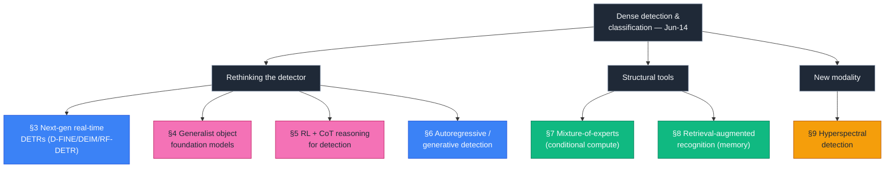
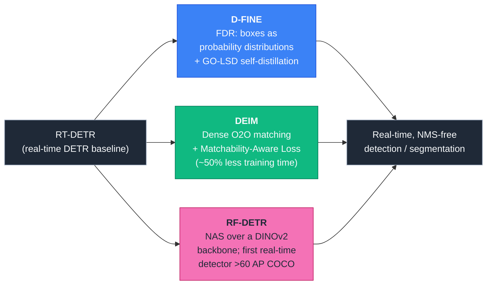
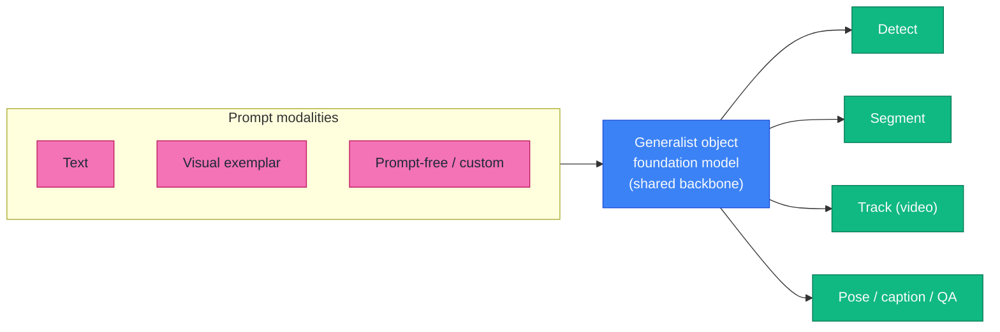
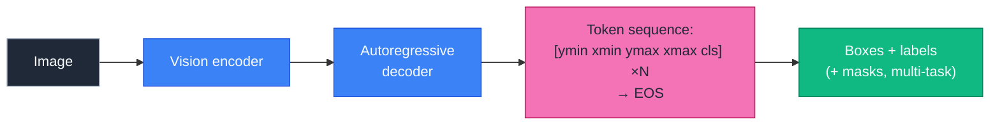
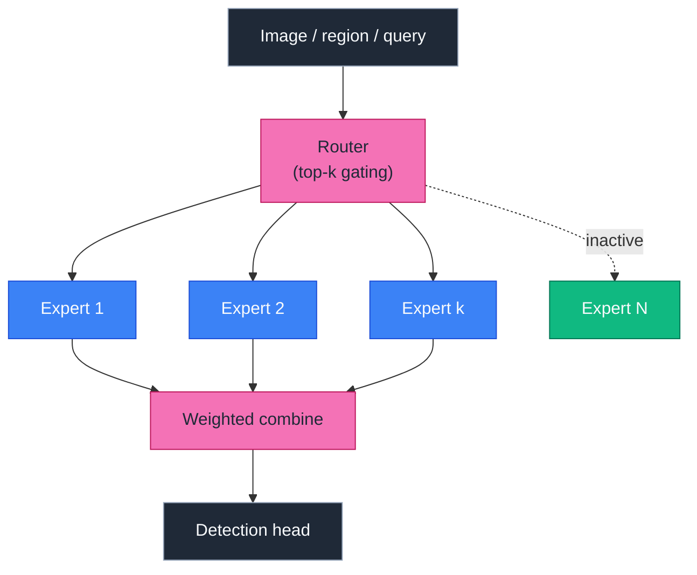
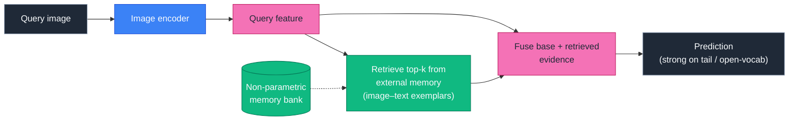
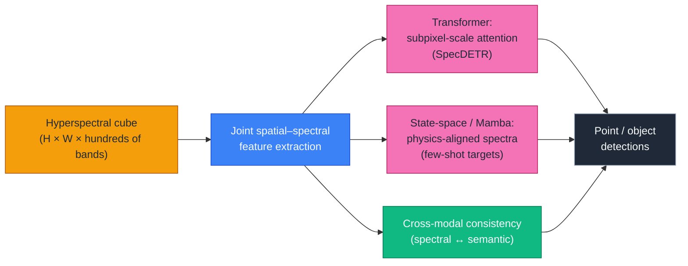

# Dense Object Detection & Classification — Recent Advances

*Compiled 2026-Jun-14 (America/Los_Angeles).*

Fifteenth installment in the running CV-updates log
([Apr-30](../2026-Apr-30/2026-Apr-30_CV_updates.md),
[May-01](../2026-May-01/2026-May-01_CV_updates.md),
[May-02](../2026-May-02/2026-May-02_CV_updates.md),
[May-04](../2026-May-04/2026-May-04_CV_updates.md),
[May-05](../2026-May-05/2026-May-05_CV_updates.md),
[May-07](../2026-May-07/2026-May-07_CV_updates.md),
[May-08](../2026-May-08/2026-May-08_CV_updates.md),
[May-15](../2026-May-15/2026-May-15_CV_updates.md),
[May-16](../2026-May-16/2026-May-16_CV_updates.md),
[May-17](../2026-May-17/2026-May-17_CV_updates.md),
[Jun-09](../2026-Jun-09/2026-Jun-09_CV_updates.md),
[Jun-10](../2026-Jun-10/2026-Jun-10_CV_updates.md),
[Jun-12](../2026-Jun-12/2026-Jun-12_CV_updates.md)).
Earlier passes worked through real-time DETRs, YOLO26, DINOv3, SAM 3, Mamba/SSM
and RWKV backbones, diffusion detectors, single-vehicle and cooperative
LiDAR/radar/event sensing, camouflaged / open-world detection, multi-modal
fusion, document / defect / wildlife / agriculture / medical verticals,
counting, HOI, action detection, REC/grounding, 6-DoF pose, visual in-context
prompting, DETR post-training quantization, fine-grained classification, AIGI
forensics, small-object / UAV / RGB-T / SAR / class-incremental /
industrial-anomaly / sparse-query / unified heads, 3D AV / BEV / occupancy /
open-vocabulary detection, agentic "thinking-with-images" perception, reasoning
video segmentation, auto-labeling data engines, and most recently (Jun-12)
real-time open-vocabulary YOLOE, semi-supervised DETRs, knowledge distillation
& compression, few-shot/open-set VLM detection, diffusion-generated synthetic
data, adversarial patch defenses, spiking detectors, and underwater detection.

Today rotates to **seven threads still untouched in this log**, weighted toward
the *paradigm shifts* reshaping how detectors are built and trained rather than
new verticals: **next-generation real-time detection transformers (the
D-FINE / DEIM / RF-DETR line)**, **generalist open-world object foundation
models**, **reinforcement-learning & chain-of-thought reasoning for
detection/grounding**, **autoregressive / generative (sequence-based)
detection**, **mixture-of-experts detectors**, **retrieval-augmented
recognition**, and **hyperspectral object detection**.

> **Sourcing note.** Figures are author-reported numbers on standard public
> splits and may differ from peer-reviewed camera-ready values. Several
> citations are recent preprints (including 2026-dated arXiv listings) whose
> claims have not been independently reproduced. Where a search/API returned
> only a partial result, the entry is kept and flagged rather than dropped, per
> the resilience requirement.

---

## Table of contents

1. [What's new since Jun-12](#1-whats-new-since-jun-12)
2. [Topic map](#2-topic-map)
3. [Next-generation real-time detection transformers](#3-next-generation-real-time-detection-transformers)
4. [Generalist open-world object foundation models](#4-generalist-open-world-object-foundation-models)
5. [RL & chain-of-thought reasoning for detection and grounding](#5-rl--chain-of-thought-reasoning-for-detection-and-grounding)
6. [Autoregressive & generative (sequence-based) detection](#6-autoregressive--generative-sequence-based-detection)
7. [Mixture-of-experts detectors](#7-mixture-of-experts-detectors)
8. [Retrieval-augmented recognition](#8-retrieval-augmented-recognition)
9. [Hyperspectral object detection](#9-hyperspectral-object-detection)
10. [Reading list](#10-reading-list)

---

## 1. What's new since Jun-12

The connective theme this pass is **paradigm, not vertical**. Where Jun-12 was
about *economy* (getting a strong detector without the usual label/compute/power
price), Jun-14 is about the **four ways the detector itself is being
rethought**: (a) the real-time crown is moving from YOLOs back to *transformers*
that finally converge fast and run fast (§3); (b) single-task detectors are
collapsing into *generalist object foundation models* that detect, segment,
track, and answer questions in one set of weights (§4); (c) detection is being
*post-trained with reinforcement learning and explicit reasoning* rather than
plain supervised fine-tuning (§5); and (d) the box itself is being emitted as a
*token sequence* by a generative decoder (§6). Three structural tools cut across
all four — *conditional compute* via mixture-of-experts (§7), *non-parametric
memory* via retrieval (§8) — and one fresh modality, *hyperspectral* (§9),
stress-tests them outside the RGB comfort zone.

A few load-bearing data points:

- **RF-DETR** (NAS-designed, DINOv2 backbone) is reported as the **first
  real-time detector to exceed 60 AP on COCO**; its *nano* variant reports
  **48.0 AP, beating D-FINE-nano by +5.3 AP at comparable latency**.
- **D-FINE-X** reports **55.8 % AP at 78 FPS (T4)**, rising to **59.3 % AP with
  Objects365 pretraining**; **DEIM**'s Dense-O2O matching + Matchability-Aware
  Loss cuts DETR training time by **up to 50 %** while lifting AP.
- **Visual-RFT** (GRPO + a verifiable **IoU reward**) lifts a 2B VLM by **+21.9
  on COCO two-shot** and **+15.4 on LVIS** few-shot detection — *reinforcement*
  fine-tuning, not more labels.
- **DINO-X** is pre-trained on **Grounding-100M** and reports record COCO/LVIS
  zero-shot detection while sharing one backbone across detection, segmentation,
  pose, captioning, and object QA.

---

## 2. Topic map

---

## 3. Next-generation real-time detection transformers

For years the real-time crown belonged to the YOLO family because DETRs, though
elegant (no NMS, no anchors), converged slowly and ran heavy. The 2024–26 line
closes both gaps and is now arguably *beating* YOLOs at their own
latency–accuracy game. Three names anchor the shift:

- **[D-FINE](https://arxiv.org/abs/2410.13842)** reframes bounding-box
  regression as **Fine-grained Distribution Refinement (FDR)** — predicting a
  *probability distribution* over box edges and iteratively sharpening it —
  paired with **GO-LSD (Global Optimal Localization Self-Distillation)** so deep
  layers teach shallow ones. Reported: **D-FINE-L 54.0 % AP @ 124 FPS (T4)** and
  **D-FINE-X 55.8 % @ 78 FPS**, rising to **57.1 % / 59.3 %** with Objects365
  pretraining.
- **[DEIM](https://github.com/Intellindust-AI-Lab/DEIM)** (CVPR 2025) attacks
  DETR's slow convergence with **Dense One-to-One (O2O) matching** plus a
  **Matchability-Aware Loss (MAL)**; dropped into RT-DETR or D-FINE it
  **cuts training time by up to ~50 %** and lifts AP (e.g.
  **DEIM-D-FINE-L/X → 54.7 % / 56.5 % AP**).
- **[RF-DETR](https://arxiv.org/abs/2511.09554)** (Roboflow; ICLR 2026) applies
  **neural architecture search** over a **DINOv2** ViT backbone to find the
  latency–accuracy Pareto front, and is reported as the **first real-time
  detector to surpass 60 AP on COCO** (2×-large), with **RF-DETR-nano at 48.0 AP
  beating D-FINE-nano by +5.3 AP** at similar latency. It also extends to
  instance segmentation and reports strong transfer on the domain-shifted
  RF100-VL benchmark.

**Why it matters for this log.** The "DETRs are too slow for production" verdict
that justified YOLO-everywhere is now stale: distribution-based regression
(D-FINE), dense matching (DEIM), and backbone NAS (RF-DETR) make NMS-free
end-to-end detection competitive at the edge. This is the supervised,
closed-set complement to the **open-vocabulary YOLOE** thread in
[Jun-12 §3](../2026-Jun-12/2026-Jun-12_CV_updates.md), and it pairs directly
with the **DETR post-training-quantization** work in
[May-15](../2026-May-15/2026-May-15_CV_updates.md) and the **small-object
SO-DETR** line in [May-16](../2026-May-16/2026-May-16_CV_updates.md): better
convergence + lower precision compound into deployable models.

---

## 4. Generalist open-world object foundation models

The second shift dissolves the boundary between detection, segmentation,
tracking, grounding, and object-level QA into a *single* model with shared
weights, trained on tens-to-hundreds of millions of grounded examples. These are
"object foundation models": prompt with text, an example crop, or nothing at
all, and get boxes/masks/IDs/captions out.

- **[T-Rex2](https://arxiv.org/abs/2403.14610)** (ECCV 2024) unifies **text and
  visual prompts** in one model via contrastive alignment, so a user can
  describe a category *or* point at an example — strong on long-tail and
  cross-domain categories where text alone is ambiguous.
- **[DINO-X](https://arxiv.org/abs/2411.14347)** scales Grounding-DINO ideas to a
  **Grounding-100M** corpus and reports **record COCO/LVIS zero-shot detection**
  (DINO-X Pro), while the *same* model supports detection, segmentation, pose,
  object captioning, and object QA. Text / visual / customized prompts are all
  accepted ([API repo](https://github.com/IDEA-Research/DINO-X-API)).
- **[GLEE](https://arxiv.org/abs/2312.09158)** (CVPR 2024 Highlight) trains on
  **10M+ images** across heterogeneous supervision to do detection, instance
  segmentation, grounding, MOT, VIS, VOS, and interactive segmentation in one
  framework, with strong zero-shot transfer ([project](https://glee-vision.github.io/)).

**The tension worth flagging.** Generalist breadth and specialist peak accuracy
still trade off: a fine-tuned closed-set detector can beat a generalist on a
narrow benchmark, but the generalist wins on *coverage*, *promptability*, and
*zero-shot transfer*. This is the 2D-image sibling of the **open-vocabulary 3D**
work in [May-17](../2026-May-17/2026-May-17_CV_updates.md) and
[Jun-09](../2026-Jun-09/2026-Jun-09_CV_updates.md), and the promptable-everything
counterpart to **SAM 3** ([May-07](../2026-May-07/2026-May-07_CV_updates.md)).
It also sets up §5: once you have a grounded foundation model, the next lever is
*how you post-train it.*

---

## 5. RL & chain-of-thought reasoning for detection and grounding

The hottest 2025–26 move in perception borrows from DeepSeek-R1: instead of
supervised fine-tuning (SFT) on more boxes, **post-train a vision-language
detector with reinforcement learning against a verifiable reward**, and let it
*reason* before localizing. Detection rewards are conveniently checkable — IoU,
mAP, count — which makes RL with verifiable rewards a natural fit.

- **[Visual-RFT](https://arxiv.org/abs/2503.01785)** (ICCV 2025) adapts R1-style
  **Group Relative Policy Optimization (GRPO)** to vision by designing
  **verifiable visual rewards** — most notably an **IoU reward** for detection.
  On Qwen2-VL-2B/7B it reports **+21.9 over baseline on COCO two-shot** and
  **+15.4 on LVIS** few-shot detection, plus gains on fine-grained
  classification, reasoning grounding, and open-vocabulary detection — *with
  only dozens of labeled examples* ([code](https://github.com/Liuziyu77/Visual-RFT)).
- **[Rex-Thinker](https://arxiv.org/abs/2506.04034)** (ICLR 2026) casts object
  *referring* as explicit **chain-of-thought** reasoning over candidate objects:
  it justifies each prediction with interpretable steps and — crucially —
  **learns to abstain** when no object matches the expression, attacking the
  hallucination failure mode head-on ([code](https://github.com/IDEA-Research/Rex-Thinker)).
- **[DeepEyes](https://arxiv.org/abs/2505.14362)** incentivizes "thinking *with*
  images": the model decides whether to **zoom in** by emitting grounding
  coordinates and cropping a region for a second look, learned end-to-end with
  RL — improving fine-grained perception, grounding, and hallucination metrics.

**Why it matters.** Detection is being absorbed into the LLM post-training
playbook: *verifiable rewards + reasoning traces* turn a frozen-ish foundation
detector into a few-shot, interpretable, abstention-aware perceiver. This
extends the **agentic "thinking-with-images"** thread from
[Jun-09 §10](../2026-Jun-09/2026-Jun-09_CV_updates.md) (which was about
tool-use) into the *training-objective* dimension, and complements the
**few-shot/open-set VLM** detection of
[Jun-12 §6](../2026-Jun-12/2026-Jun-12_CV_updates.md): same VLM substrate, but
RL rather than SFT. Caveat: RL-for-perception is young, rewards can be gamed
(box-format hacking, reward over-optimization), and reported few-shot deltas are
sensitive to the exact baseline.

---

## 6. Autoregressive & generative (sequence-based) detection

A quieter but conceptually deep line treats detection as **sequence
generation**: serialize boxes and labels into discrete tokens and let an
autoregressive decoder emit them, no hand-designed heads, anchors, or NMS. This
is the architecture that makes §4's "one model, many tasks" and §5's
"reason-then-localize" clean to express.

- **[Pix2Seq](https://arxiv.org/abs/2109.10852)** established the framing:
  quantize each object to **five discrete tokens** `(ymin, xmin, ymax, xmax,
  class)` over a shared vocabulary, then train with plain next-token prediction
  and teacher forcing. **Pix2Seq-v2** extends it to instance segmentation,
  keypoints, and captioning in one multi-task interface.
- **[Token-based detection with video](https://arxiv.org/abs/2506.22562)**
  (Jun 2025) revisits the sequence formulation and shows that **temporal context
  from video** stabilizes and improves token-based detectors — a practical
  answer to autoregressive detection's historically higher variance versus dense
  heads.
- **[AR-MOT](https://arxiv.org/abs/2601.01925)** (2026 preprint) carries the
  autoregressive idea into **multi-object tracking**, generating
  track-and-box tokens over time rather than running detect-then-associate.

**Why it matters.** Sequence-based detection is the substrate that unifies
perception with language modeling: the *same* decoder that writes a caption can
write a box list, which is exactly why §4's generalist models and §5's reasoning
detectors lean on it. The standing trade-off is throughput and calibration —
autoregressive decoding is slower than a parallel dense head and can mis-order
or drop objects — so the live research question is whether parallel/diffusion
decoding (cf. the **diffusion detectors** noted in earlier installments) can
keep the unified interface while recovering DETR-class latency.

---

## 7. Mixture-of-experts detectors

Mixture-of-Experts (MoE) brings *conditional compute* to detection: route each
image, region, or **object query** to a small subset of specialized expert
sub-networks, so simple inputs spend little compute and hard inputs get more
capacity — scaling parameters without scaling per-input FLOPs proportionally.

- **[YOLO-Master](https://arxiv.org/abs/2512.23273)** adds an **Efficient Sparse
  MoE (ES-MoE)** to a YOLO-style real-time detector: simple regions activate
  fewer experts, complex regions access more capacity — *instance-conditional*
  adaptive computation inside a real-time budget.
- **[HI-MoE](https://arxiv.org/abs/2604.04908)** (2026 preprint) does
  **hierarchical scene-to-instance routing for DETR-style detectors**, selecting
  experts **per object query** (not just per image/patch) by replacing chosen
  feed-forward layers with sparse experts.
- **[AW-MoE](https://arxiv.org/abs/2603.16261)** (2026 preprint) targets
  **all-weather multi-modal 3D detection**, routing across modality/condition
  experts so fog, rain, and night each get specialized capacity — the MoE answer
  to the adverse-weather robustness thread in
  [May-07](../2026-May-07/2026-May-07_CV_updates.md).
- **[EMC2](https://arxiv.org/abs/2507.04123)** puts a **scenario-aware MoE** on
  the *edge* for low-latency autonomous-driving 3D detection, while
  **[MoCaE](https://openreview.net/pdf/a5700688b986af7acd0cdc97fe85093287ce5866.pdf)**
  (Mixture of *Calibrated* Experts) shows the gating must respect each expert's
  *calibration* or the ensemble underperforms.

**Why it matters.** MoE is how detectors get bigger and more multi-domain
without a proportional latency hit — and the 2025–26 novelty is **per-query
routing** that fits DETR/foundation-model decoders naturally. It composes with
§3 (sparse experts inside a real-time DETR) and §4 (experts as a scaling axis
for generalist models), and the recurring caveats are **load-balancing**,
**routing instability**, and **expert calibration** (MoCaE).

---

## 8. Retrieval-augmented recognition

Borrowing RAG from NLP: instead of cramming all knowledge into weights, give the
classifier/detector a **non-parametric external memory** of pre-encoded
images-and-text and let it *look things up* at inference. This decouples the
long tail from the backbone and lets you add classes by editing the memory, not
retraining.

- **[RAC](https://arxiv.org/abs/2202.11233)** (Retrieval-Augmented
  Classification, CVPR 2022) fuses a base encoder with a parallel retrieval
  branch over an external memory, reporting **+14.5 % on Places365-LT** and
  **+6.7 % on iNaturalist-2018** using only the training set as memory — the
  retrieval branch learns the *tail* so the encoder can focus on the head.
- **[RECO](https://arxiv.org/abs/2306.07196)** (Retrieval-Enhanced Contrastive
  vision-text models) refines CLIP-style embeddings with retrieved cross-modal
  neighbors, improving zero-shot recognition — directly relevant to the
  open-vocabulary detectors of §4.
- **[REVEAL](https://arxiv.org/abs/2212.05221)** pre-trains with a
  **multi-source multimodal knowledge memory**, learning to retrieve and attend
  over external knowledge during vision-language pretraining.

**Why it matters.** Retrieval is the *memory* counterpart to §7's *compute*: both
add capability without bloating the backbone, and both shine on the long tail.
For recognition this is the natural extension of the **fine-grained
classification** thread ([May-15](../2026-May-15/2026-May-15_CV_updates.md)) and
the **long-tail** work ([May-17](../2026-May-17/2026-May-17_CV_updates.md)) —
editable, inspectable knowledge beats a frozen softmax when categories are rare
or shifting. Open questions: memory-bank curation cost, retrieval latency, and
staleness as the world (and the label set) drifts.

> **Sourcing note.** RAC/RECO/REVEAL are the load-bearing, well-cited anchors
> for this thread; 2024–26 search results surface many derivative
> retrieval-augmented recognition papers but with thinner reproducibility, so
> they are omitted here rather than cited unverified.

---

## 9. Hyperspectral object detection

Hyperspectral imaging (HSI) captures *hundreds* of contiguous spectral bands per
pixel, so objects are separable by **material signature** even when they are
spatially tiny or visually camouflaged — at the cost of a 3D spatial–spectral
cube, severe band redundancy, and chronically scarce labels. Detection (vs.
classic per-pixel spectral *classification*) is an emerging frontier.

- **[SpecDETR](https://arxiv.org/abs/2405.10148)** is described as the **first
  specialized network for hyperspectral *point* object detection**, using a
  multi-layer transformer encoder with **self-excited subpixel-scale attention**
  to extract joint spatial–spectral features directly from the cube; it reports
  outperforming both general visual detectors and classic hyperspectral
  target-detection methods.
- **[Physics-Aligned Spectral Mamba](https://arxiv.org/abs/2604.05562)** (2026
  preprint) brings **state-space (Mamba)** modeling to **few-shot hyperspectral
  target detection**, decoupling spectral *semantics* from *dynamics* and
  aligning to physical spectra — the HSI cousin of the Mamba/RWKV backbone work
  in [Jun-10](../2026-Jun-10/2026-Jun-10_CV_updates.md).
- **[Spectral Discrepancy & Cross-modal Semantic Consistency](https://arxiv.org/abs/2512.18245)**
  (late-2025 preprint) and a broad **[survey of transformers in hyperspectral
  imaging](https://www.sciencedirect.com/science/article/pii/S0952197626002289)**
  frame the open problems: band redundancy, 3D-cube compute cost, tiny labeled
  corpora, and cross-sensor generalization.

**Why it matters.** HSI is where detection meets *physics*: material spectra give
a discriminative signal RGB simply lacks, valuable for defense, agriculture,
mineralogy, and environmental monitoring. It is the spectral sibling of the
**SAR** ([May-16](../2026-May-16/2026-May-16_CV_updates.md)) and **infrared
small-target** ([Jun-09](../2026-Jun-09/2026-Jun-09_CV_updates.md)) threads —
all three are "detection outside the RGB comfort zone" — and the data-scarcity
problem makes them prime customers for the synthetic-data and few-shot tools from
[Jun-12](../2026-Jun-12/2026-Jun-12_CV_updates.md).

---

## 10. Reading list

**§3 Next-gen real-time DETRs**
- D-FINE (FDR + GO-LSD): [arXiv 2410.13842](https://arxiv.org/abs/2410.13842)
- DEIM (Dense O2O + MAL, CVPR 2025): [code](https://github.com/Intellindust-AI-Lab/DEIM)
- RF-DETR (NAS, ICLR 2026): [arXiv 2511.09554](https://arxiv.org/abs/2511.09554) · [code](https://github.com/roboflow/rf-detr) · [overview](https://blog.roboflow.com/rf-detr/)

**§4 Generalist object foundation models**
- T-Rex2 (text+visual prompts, ECCV 2024): [arXiv 2403.14610](https://arxiv.org/abs/2403.14610) · [code](https://github.com/IDEA-Research/T-Rex)
- DINO-X (Grounding-100M): [arXiv 2411.14347](https://arxiv.org/abs/2411.14347) · [API](https://github.com/IDEA-Research/DINO-X-API)
- GLEE (CVPR 2024 Highlight): [arXiv 2312.09158](https://arxiv.org/abs/2312.09158) · [project](https://glee-vision.github.io/) · [code](https://github.com/FoundationVision/GLEE)

**§5 RL & CoT reasoning for detection**
- Visual-RFT (GRPO + IoU reward, ICCV 2025): [arXiv 2503.01785](https://arxiv.org/abs/2503.01785) · [code](https://github.com/Liuziyu77/Visual-RFT)
- Rex-Thinker (CoT referring, ICLR 2026): [arXiv 2506.04034](https://arxiv.org/abs/2506.04034) · [code](https://github.com/IDEA-Research/Rex-Thinker)
- DeepEyes (thinking with images via RL): [arXiv 2505.14362](https://arxiv.org/abs/2505.14362)

**§6 Autoregressive / generative detection**
- Pix2Seq (language-modeling framework): [arXiv 2109.10852](https://arxiv.org/abs/2109.10852)
- Token-based detection with video (Jun 2025): [arXiv 2506.22562](https://arxiv.org/abs/2506.22562)
- AR-MOT (autoregressive MOT, 2026): [arXiv 2601.01925](https://arxiv.org/abs/2601.01925)

**§7 Mixture-of-experts detectors**
- YOLO-Master (ES-MoE): [arXiv 2512.23273](https://arxiv.org/abs/2512.23273)
- HI-MoE (per-query routing, 2026): [arXiv 2604.04908](https://arxiv.org/abs/2604.04908)
- AW-MoE (all-weather 3D, 2026): [arXiv 2603.16261](https://arxiv.org/abs/2603.16261)
- EMC2 (edge MoE 3D): [arXiv 2507.04123](https://arxiv.org/abs/2507.04123) · MoCaE (calibrated experts): [OpenReview](https://openreview.net/pdf/a5700688b986af7acd0cdc97fe85093287ce5866.pdf)

**§8 Retrieval-augmented recognition**
- RAC (CVPR 2022): [arXiv 2202.11233](https://arxiv.org/abs/2202.11233)
- RECO (retrieval-enhanced contrastive): [arXiv 2306.07196](https://arxiv.org/abs/2306.07196)
- REVEAL (multimodal knowledge memory): [arXiv 2212.05221](https://arxiv.org/abs/2212.05221)

**§9 Hyperspectral detection**
- SpecDETR (point object detection): [arXiv 2405.10148](https://arxiv.org/abs/2405.10148)
- Physics-Aligned Spectral Mamba (few-shot, 2026): [arXiv 2604.05562](https://arxiv.org/abs/2604.05562)
- Spectral Discrepancy + Cross-modal Consistency: [arXiv 2512.18245](https://arxiv.org/abs/2512.18245) · Transformers-in-HSI survey: [ScienceDirect](https://www.sciencedirect.com/science/article/pii/S0952197626002289)

### Cross-section pointers from earlier installments

- **Real-time open-vocabulary YOLOE** (open-set sibling of §3): [Jun-12 §3](../2026-Jun-12/2026-Jun-12_CV_updates.md)
- **DETR post-training quantization** (compression complement to §3): [May-15](../2026-May-15/2026-May-15_CV_updates.md)
- **SAM 3 / promptable everything** (segmentation sibling of §4): [May-07](../2026-May-07/2026-May-07_CV_updates.md)
- **Open-vocabulary 3D detection** (3D sibling of §4): [May-17](../2026-May-17/2026-May-17_CV_updates.md), [Jun-09](../2026-Jun-09/2026-Jun-09_CV_updates.md)
- **Agentic "thinking-with-images" perception** (tool-use end of §5): [Jun-09 §10](../2026-Jun-09/2026-Jun-09_CV_updates.md)
- **Few-shot / open-set via VLMs** (SFT counterpart of §5): [Jun-12 §6](../2026-Jun-12/2026-Jun-12_CV_updates.md)
- **Mamba / RWKV backbones** (state-space context for §6/§9): [Jun-10](../2026-Jun-10/2026-Jun-10_CV_updates.md)
- **Adverse-weather robustness** (motivation for AW-MoE, §7): [May-07](../2026-May-07/2026-May-07_CV_updates.md)
- **Fine-grained & long-tail classification** (recognition target of §8): [May-15](../2026-May-15/2026-May-15_CV_updates.md), [May-17](../2026-May-17/2026-May-17_CV_updates.md)
- **SAR & infrared small-target** (non-RGB siblings of §9): [May-16](../2026-May-16/2026-May-16_CV_updates.md), [Jun-09](../2026-Jun-09/2026-Jun-09_CV_updates.md)

---

*End of 2026-Jun-14 installment. Diagrams are Mermaid (rendered client-side) using a
saturated mid-tone palette with explicit text colors for legibility in both light and
dark themes. No external image URLs are used.*
