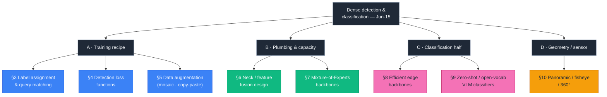
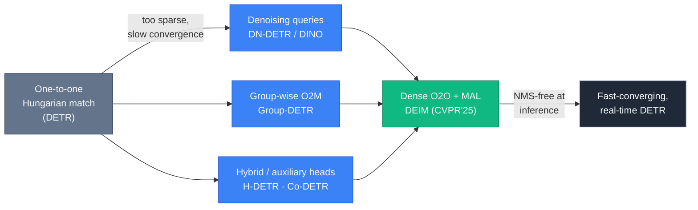
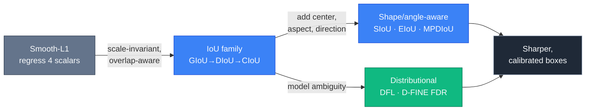
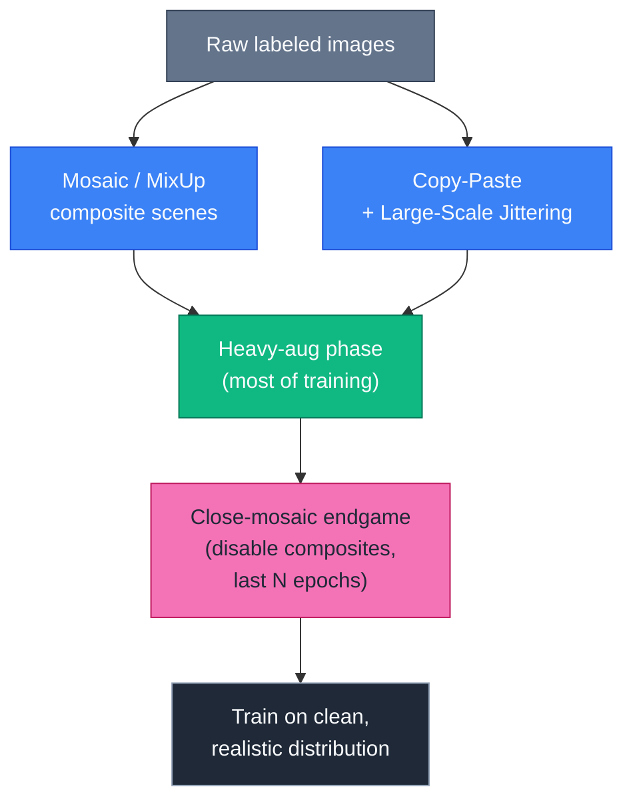
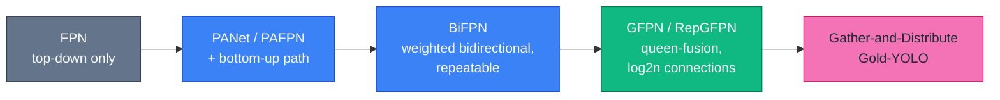
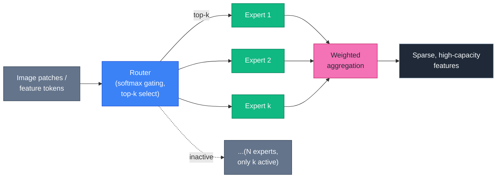
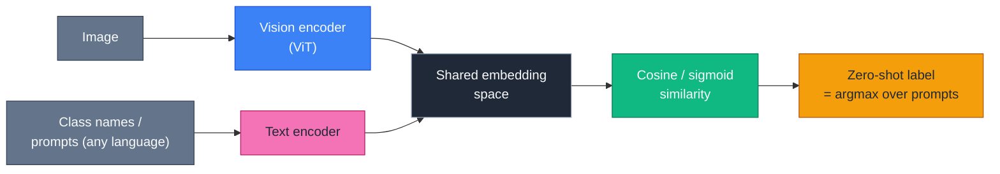
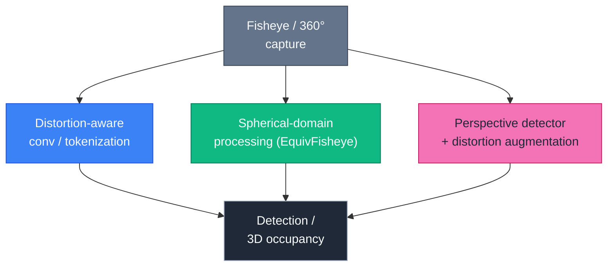

# Dense Object Detection & Classification — Recent Advances

*Compiled 2026-Jun-15 (America/Los_Angeles).*

Fifteenth installment in the running CV-updates log
([Apr-30](../2026-Apr-30/2026-Apr-30_CV_updates.md),
[May-01](../2026-May-01/2026-May-01_CV_updates.md),
[May-02](../2026-May-02/2026-May-02_CV_updates.md),
[May-04](../2026-May-04/2026-May-04_CV_updates.md),
[May-05](../2026-May-05/2026-May-05_CV_updates.md),
[May-07](../2026-May-07/2026-May-07_CV_updates.md),
[May-08](../2026-May-08/2026-May-08_CV_updates.md),
[May-15](../2026-May-15/2026-May-15_CV_updates.md),
[May-16](../2026-May-16/2026-May-16_CV_updates.md),
[May-17](../2026-May-17/2026-May-17_CV_updates.md),
[Jun-09](../2026-Jun-09/2026-Jun-09_CV_updates.md),
[Jun-10](../2026-Jun-10/2026-Jun-10_CV_updates.md),
[Jun-12](../2026-Jun-12/2026-Jun-12_CV_updates.md)).
The previous fourteen passes worked mostly at the level of **architectures and
application domains** — real-time DETRs, YOLO26/YOLOE, DINOv3, SAM 3, Mamba/SSM
and RWKV backbones, diffusion detectors, LiDAR/4D-radar/BEV/occupancy,
V2X, open-vocabulary 2D/3D, semi-supervised and few-shot detection, distillation,
adversarial robustness, spiking and event detectors, and a long tail of
verticals (medical, agriculture, wildlife, document, underwater, remote sensing,
counting, HOI, pose, grounding, forensics).

Today deliberately goes **under the hood**. The leaderboard advertises a
backbone and an AP number, but most of the gap between a mediocre detector and a
strong one lives in machinery the model card never shows: *how positives are
assigned, what loss shapes the gradients, how the data is augmented, how
multi-scale features are fused, and how capacity is spent.* This pass rotates to
**eight threads untouched as dedicated topics in this log** — five of them the
training-and-architecture plumbing of detection, two of them the **classification
half** of this series' title (which has been underweighted), and one fresh
geometry/sensor domain:

1. **Label assignment & query matching** — SimOTA, task-aligned assignment, and the DETR one-to-one→dense-O2O arc.
2. **Detection loss functions** — the focal/quality-focal/varifocal and IoU→distribution-regression families.
3. **Data augmentation for detection** — mosaic, copy-paste, large-scale jittering, and the "close-mosaic" endgame.
4. **Neck / feature-fusion design** — FPN → PANet → BiFPN → GFPN/RepGFPN → Gather-and-Distribute.
5. **Mixture-of-Experts backbones** — V-MoE, Swin-MoE, mobile V-MoE, and MoE inside YOLO.
6. **Efficient edge classification backbones** — MobileNetV4, RepViT, FastViT, EfficientViT, iFormer.
7. **Zero-shot / open-vocabulary classification** — SigLIP 2, MetaCLIP 2, Perception Encoder, AIMv2.
8. **Panoramic / fisheye / 360° detection** — distortion-aware and spherical approaches.

> **Sourcing note.** Figures are author-reported numbers on standard public
> splits (COCO, LVIS, ImageNet-1K) and may differ from peer-reviewed
> camera-ready values. Several citations are recent preprints — including some
> 2026-dated arXiv listings surfaced by search — whose claims have **not** been
> independently reproduced; these are flagged inline. Where a search or fetch
> returned only partial metadata, the entry is kept and marked rather than
> dropped, per the resilience requirement.

---

## Table of contents

1. [What's new since Jun-12](#1-whats-new-since-jun-12)
2. [Topic map](#2-topic-map)
3. [Label assignment & query matching](#3-label-assignment--query-matching)
4. [Detection loss functions](#4-detection-loss-functions)
5. [Data augmentation for detection](#5-data-augmentation-for-detection)
6. [Neck / feature-fusion design](#6-neck--feature-fusion-design)
7. [Mixture-of-Experts backbones](#7-mixture-of-experts-backbones)
8. [Efficient edge classification backbones](#8-efficient-edge-classification-backbones)
9. [Zero-shot & open-vocabulary classification](#9-zero-shot--open-vocabulary-classification)
10. [Panoramic / fisheye / 360° detection](#10-panoramic--fisheye--360-detection)
11. [Reading list](#11-reading-list)

---

## 1. What's new since Jun-12

The connective theme this pass is **the recipe, not the head**. Two detectors
with identical backbones and identical heads can differ by 5–10 AP purely
because of *assignment, loss, and augmentation* choices — and most 2024–2026
"YOLO/DETR improvements" are exactly that: recipe swaps, not new operators. So
this installment treats the recipe as a first-class subject.

A few load-bearing data points:

- **DEIM** (CVPR 2025) replaces DETR's sparse one-to-one matching with a **Dense
  O2O** scheme plus a **Matchability-Aware Loss (MAL)**, cutting training time
  ~50% and pushing **DEIM-D-FINE-X to 56.5 AP at 78 FPS** on a T4 — a pure
  recipe change on top of an existing detector. ([arXiv](https://arxiv.org/abs/2412.04234))
- **D-FINE** (ICLR 2025 Spotlight) reframes box regression itself as
  **Fine-grained Distribution Refinement** — iteratively sharpening a probability
  distribution over edge offsets rather than regressing four scalars.
  ([GitHub](https://github.com/Peterande/D-FINE))
- On the classification side, **MetaCLIP 2** (a worldwide, from-scratch CLIP
  recipe) reaches **~81.3% zero-shot ImageNet-1K top-1** with ViT-H/14 while
  *beating* its English-only counterpart by 0.8 pt — reversing the usual "curse
  of multilinguality." ([arXiv](https://arxiv.org/abs/2507.22062))
- **RepGFPN** (DAMO-YOLO) shows the neck is not free real estate: a
  redesigned generalized-FPN improves mAP50 by ~0.4 pt while *cutting* params
  2.8% and GFLOPs 7.7% versus a conventional FPN. ([arXiv](https://arxiv.org/pdf/2211.15444))

The throughline: in 2026, "training a better detector" increasingly means
**editing the recipe** (§3–§5) and **spending capacity wisely** (§6–§7), while
the classification frontier has migrated almost entirely to **language-supervised
zero-shot encoders** (§9) and **hardware-aware tiny backbones** (§8).

---

## 2. Topic map

A standalone SVG version of this map (for renderers without Mermaid) lives at
[`assets/topic-map.svg`](assets/topic-map.svg).

---

## 3. Label assignment & query matching

**The problem.** Before any loss is computed, a detector must decide *which
predictions are responsible for which ground-truth objects*. This "label
assignment" step is invisible on a model card but is one of the highest-leverage
knobs in detection. The field has converged on two parallel stories — one for
dense (YOLO-style) detectors, one for query-based (DETR-style) detectors.

**Dense detectors: from static rules to dynamic, task-aligned assignment.**
Early detectors assigned anchors by hand-tuned IoU thresholds. The modern recipe
is *dynamic*: let the cost of each candidate decide.

- **SimOTA** (the simplified Optimal Transport Assignment used in
  [YOLOX](https://arxiv.org/abs/2107.08430)) treats assignment as a transport
  problem, dynamically selecting the top-k lowest-cost (classification + IoU)
  anchors per ground truth instead of a fixed rule.
- **TOOD / Task-Aligned Assignment (TAL)** ranks candidates by an alignment
  metric that *multiplies* classification score and localization quality, so the
  same anchor is encouraged to be good at both tasks at once. TAL is the default
  assigner in YOLOv8 and several successors.

**Query detectors: the one-to-one bottleneck and its fixes.** DETR's defining
choice is **bipartite (Hungarian) one-to-one matching** — exactly one query per
object, which removes NMS but starves training of positive signal and converges
slowly. The 2022–2025 arc is a catalogue of ways to *densify supervision without
reintroducing NMS at inference*:

- **DN-DETR** adds a *denoising* training task — feeding noised ground-truth
  boxes straight into the decoder so it learns to reconstruct them, bypassing the
  unstable matching early in training. **DINO** combines this with DAB-DETR's
  dynamic anchor queries and contrastive denoising, and became the template for
  most strong DETRs.
- **Group-DETR** runs several parallel query groups, each keeping strict
  one-to-one matching internally but collectively producing one-to-many
  supervision — more positives, same inference path.
- **Co-DETR** ("DETRs with Collaborative Hybrid Assignments Training")
  attaches auxiliary *one-to-many* heads (ATSS/Faster-R-CNN-style) during
  training only, using them to enrich the encoder's supervision while the
  one-to-one head is what ships. ([arXiv 2211.12860](https://arxiv.org/pdf/2211.12860))
- **DEIM** (CVPR 2025) is the current synthesis: a **Dense O2O** strategy that
  uses augmentation to pack more targets per image, plus the **Matchability-Aware
  Loss (MAL)** to handle the resulting mixed-quality matches. Bolted onto
  RT-DETR/D-FINE it cuts training time ~50% and reaches **53.2 AP in a single day
  on one RTX 4090**, with DEIM-D-FINE-X at **56.5 AP / 78 FPS (T4)**.
  ([arXiv 2412.04234](https://arxiv.org/abs/2412.04234) ·
  [code](https://github.com/Intellindust-AI-Lab/DEIM))

**2026 watch (unverified preprints).** Search surfaced *"Beyond Hungarian:
Match-Free Supervision for End-to-End Object Detection"*
([arXiv 2603.08514](https://arxiv.org/pdf/2603.08514)) and *"Integrating Diverse
Assignment Strategies into DETRs"*
([arXiv 2601.09247](https://arxiv.org/pdf/2601.09247)), both pushing toward
removing or generalizing the bipartite-matching step. These are early listings
and reported numbers should be treated as unconfirmed.

**Why it matters.** Assignment is the cheapest lever in detection: no extra
inference cost, often no architecture change, yet several AP. The trend is clear
— *dense supervision during training, single prediction at inference.*

Sources: [SimOTA/YOLOX](https://arxiv.org/abs/2107.08430) ·
[Co-DETR](https://arxiv.org/pdf/2211.12860) · [DEIM](https://arxiv.org/abs/2412.04234) ·
[DETR/ViT survey 2025](https://ietresearch.onlinelibrary.wiley.com/doi/full/10.1049/cvi2.70028).

---

## 4. Detection loss functions

A detector's loss is two coupled problems — *classify* and *localize* — and the
modern recipe rebalances both so that the classification score actually predicts
localization quality.

**Classification branch.**

- **Focal Loss** (RetinaNet) down-weights easy negatives so dense detectors can
  train through extreme foreground/background imbalance.
- **Quality Focal Loss (QFL)** / **Generalized Focal Loss (GFL)** replace the
  hard one-hot label with a *soft* target equal to the predicted box's IoU, so
  the classifier learns a joint "class-and-quality" score. This kills the
  classic train/test misalignment where a confident box is poorly localized.
- **Varifocal Loss (VFL)** asymmetrically weights positives (by their IoU-aware
  target) and negatives, and is used for the classification task in
  [YOLOv6](https://arxiv.org/pdf/2209.02976).

**Localization branch: from L1 to IoU to distributions.**

- **IoU-family regression losses** optimize the metric you actually care about:
  **GIoU** adds a penalty for non-overlapping boxes, **DIoU/CIoU** add
  center-distance and aspect-ratio terms, **SIoU** adds the *direction* of the
  mismatch, and **EIoU/MPDIoU** simplify and stabilize the computation —
  **MPDIoU** directly minimizes the distance between predicted and ground-truth
  corner points, folding overlap, center distance, and aspect ratio into one
  metric. ([SIoU](https://arxiv.org/pdf/2205.12740) ·
  [MPDIoU](https://www.sciencedirect.com/science/article/abs/pii/S0262885624004864))
- **Distribution Focal Loss (DFL)** stops treating a box edge as a single number
  and instead learns a *discretized probability distribution* over offsets,
  capturing ambiguity (blurred or occluded boundaries). DFL is the box loss in
  YOLOv8. ([GFL/VFL walk-through](https://learnopencv.com/yolo-loss-function-gfl-vfl-loss/))
- **D-FINE** (ICLR 2025 Spotlight) takes this furthest: **Fine-grained
  Distribution Refinement (FDR)** iteratively *refines* the edge distribution
  across decoder layers, plus a self-distillation that transfers the final,
  sharp distribution back to early layers — turning regression into a
  progressive, well-calibrated process. ([GitHub](https://github.com/Peterande/D-FINE) ·
  [OpenReview](https://openreview.net/pdf?id=MFZjrTFE7h))
- **Matchability-Aware Loss (MAL)** from DEIM (§3) is a loss *and* assignment
  co-design: it weights each match by quality so that Dense-O2O's many
  low-quality positives don't drown the signal.

**Why it matters.** The 2024–2026 story is **alignment and calibration**: make
the confidence score predict IoU (QFL/VFL), make the box loss optimize IoU
directly (IoU family), and model boundary uncertainty explicitly (DFL/FDR). None
of these change inference cost; all of them move AP.

Sources: [GFL/VFL](https://learnopencv.com/yolo-loss-function-gfl-vfl-loss/) ·
[YOLOv6/VFL](https://arxiv.org/pdf/2209.02976) ·
[SIoU](https://arxiv.org/pdf/2205.12740) ·
[D-FINE](https://github.com/Peterande/D-FINE) ·
[multi-scale loss construction (2025)](https://pmc.ncbi.nlm.nih.gov/articles/PMC11946842/).

---

## 5. Data augmentation for detection

Detection augmentation is its own discipline because boxes/masks must be
transformed *with* the pixels, and because objects are sparse — so the most
effective augmentations **manufacture object density and context diversity.**

- **Mosaic** stitches four (or nine) images into one, forcing the model to see
  objects at many scales and in unfamiliar contexts within a single sample. It
  is the backbone augmentation of the YOLO line.
- **MixUp** linearly blends two images and their labels, regularizing the
  classifier and softening decision boundaries.
- **Copy-Paste** ([Ghiasi et al., CVPR 2021](https://openaccess.thecvf.com/content/CVPR2021/papers/Ghiasi_Simple_Copy-Paste_Is_a_Strong_Data_Augmentation_Method_for_Instance_Segmentation_paper.pdf))
  cuts instances out of one image and pastes them into another. "Simple"
  copy-paste — random scale jittering + horizontal flip, no blending tricks —
  turned out to be a *strong* instance-segmentation and detection augmentation,
  especially for rare classes.
- **Large-Scale Jittering (LSJ)** widens the resize range from the standard
  0.8–1.25× to **0.1–2.0×**, dramatically increasing scale diversity; it pairs
  naturally with copy-paste and gives large gains over standard scale jittering.

- **The "close-mosaic" endgame.** Heavy composites help feature learning but
  create an unrealistic distribution (e.g., box edges cut by tile seams). The
  now-standard fix — used in YOLOv8 and RT-DETR-family training — is to **turn
  mosaic off for the final ~10–20 epochs** so the model adapts to the real,
  un-tiled distribution before evaluation.
- **Scene-aware and small-object copy-paste.** 2025 work pushes copy-paste to be
  *realistic*: pasting instances at plausible scales and locations using scene
  understanding, which matters disproportionately for small-object detection
  ([instance-level scene-aware aug, Remote Sensing 2026](https://www.mdpi.com/2072-4292/18/4/647);
  [small-object detection survey 2023–2025](https://www.mdpi.com/2076-3417/15/22/11882)).
- **Connection to imbalance.** Augmentation is also a class-imbalance tool;
  copy-paste of rare classes is one of the simplest long-tail mitigations
  ([imbalance diagnosis, 2024](https://arxiv.org/pdf/2403.07113)).

**Why it matters.** Augmentation is free data. The recipe consensus — *heavy
composites early, clean distribution late, copy-paste for the tail* — is now so
load-bearing that ablating it costs more AP than swapping the backbone.

Sources: [Simple Copy-Paste](https://arxiv.org/pdf/2012.07177) ·
[image-augmentation survey](https://www.sciencedirect.com/science/article/pii/S0031320323000481) ·
[scene-aware small-object aug](https://www.mdpi.com/2072-4292/18/4/647) ·
[small-object survey 2023–2025](https://www.mdpi.com/2076-3417/15/22/11882).

---

## 6. Neck / feature-fusion design

Between backbone and head sits the **neck** — the module that fuses multi-scale
features so small and large objects are both detectable. It is where a
surprising amount of accuracy (and latency) is won or lost.

The evolution is a steady march toward *richer cross-scale information exchange
at controlled cost*:

- **FPN** introduced the top-down pathway that fuses high-level semantics into
  high-resolution maps.
- **PANet / PAFPN** added a bottom-up path so localization detail flows back up —
  effective but with higher cost; it became the default YOLO neck for years.
- **BiFPN** (EfficientDet) made fusion *bidirectional and repeatable*, removed
  single-input nodes, added same-level skip connections, and learned per-input
  fusion weights — a much better accuracy/efficiency trade-off.
- **GFPN / RepGFPN** (DAMO-YOLO) generalize the fusion topology ("queen-fusion"
  with log-scale skip connections) to exchange high-level semantics and
  low-level spatial detail more thoroughly. **RepGFPN reports +0.4 mAP50 while
  cutting params 2.8% and GFLOPs 7.7%** versus a conventional FPN.
  ([arXiv 2211.15444](https://arxiv.org/pdf/2211.15444))
- **GiraffeDet** argues the neck deserves *more* compute than the backbone — a
  "heavy-neck, light-backbone" paradigm built on a generalized-FPN.
  ([arXiv 2202.04256](https://arxiv.org/pdf/2202.04256))
- **Gold-YOLO** replaces the recursive FPN flow with a **Gather-and-Distribute
  (GD)** mechanism: collect features from *all* scales into one unified module
  (via convolution + self-attention), then redistribute — avoiding the
  information loss inherent to pairwise FPN fusion without a big latency hit.
- **2025 directions.** Heterogeneous, re-parameterized necks such as
  **MHAF-YOLO** (Multi-Branch Heterogeneous Auxiliary Fusion) continue to refine
  cross-scale fusion for accuracy/efficiency
  ([arXiv 2502.04656](https://arxiv.org/pdf/2502.04656)), and there's renewed
  attention to "features-fused-pyramid" rethinks
  ([Springer 2024](https://link.springer.com/chapter/10.1007/978-3-031-72855-6_5)).

**Why it matters.** The neck is the cheapest place to add cross-scale capacity
and the easiest to overspend. The modern consensus — *bidirectional,
weighted, repeatable fusion with global gather-and-distribute* — is why two
detectors with the same backbone can differ sharply on small objects.

Sources: [DAMO-YOLO/RepGFPN](https://arxiv.org/pdf/2211.15444) ·
[GiraffeDet](https://arxiv.org/pdf/2202.04256) ·
[MHAF-YOLO](https://arxiv.org/pdf/2502.04656) ·
[FPN](https://www.researchgate.net/publication/320964510_Feature_Pyramid_Networks_for_Object_Detection).

---

## 7. Mixture-of-Experts backbones

Mixture-of-Experts (MoE) — route each token/patch through a small subset of many
expert sub-networks — is the dominant scaling trick in LLMs and is now a
recurring theme in vision and detection: *more capacity, near-constant inference
cost.*

- **V-MoE** ([Riquelme et al., NeurIPS 2021](https://dl.acm.org/doi/10.5555/3540261.3540918))
  is the sparse Vision Transformer: experts are specialist MLP layers; certain
  patches route to certain experts. It matches the largest dense ViTs **with as
  little as half the inference compute.**
- **Swin-MoE** (Microsoft, 2022) added MoE to the Swin Transformer to build a
  **3.6B-parameter** detection/segmentation model, improving COCO accuracy with
  modest extra training.
- **M3ViT** ([OpenReview](https://openreview.net/pdf?id=cFOhdl1cyU-)) uses MoE
  for *multi-task* learning — different tasks activate different experts,
  reducing cross-task interference, which is directly relevant to unified
  detection+segmentation+depth heads.
- **Mobile V-MoE** ([arXiv 2309.04354](https://arxiv.org/pdf/2309.04354)) scales
  MoE *down*, showing sparse experts can also help in the resource-constrained
  regime — important for edge detection.
- **MoE inside detectors (2025).** **YOLO-Master** integrates **ES-MoE** modules
  into both backbone and neck, with a Dynamic Routing Network (softmax gating,
  top-k) for feature extraction and fusion
  ([arXiv 2512.23273](https://arxiv.org/pdf/2512.23273) — late-2025 preprint,
  numbers unverified). **MoCaE** (Mixture of *Calibrated* Experts) instead
  treats whole detectors as experts, calibrating each before fusing their
  predictions for more reliable ensembling.

**Why it matters.** MoE decouples *capacity* from *inference cost*, which is
exactly the trade detection deployment cares about: a 3.6B-parameter detector
that runs like a much smaller one. The open questions remain routing stability,
load balancing, and memory — but the direction (sparse experts in backbone *and*
neck) is now showing up in real-time detector papers, not just billion-scale
research.

Sources: [Scaling Vision with Sparse MoE / V-MoE](https://dl.acm.org/doi/10.5555/3540261.3540918) ·
[Mobile V-MoE](https://arxiv.org/pdf/2309.04354) ·
[M3ViT](https://openreview.net/pdf?id=cFOhdl1cyU-) ·
[MoE survey](https://arxiv.org/pdf/2209.01667) ·
[YOLO-Master](https://arxiv.org/pdf/2512.23273).

---

## 8. Efficient edge classification backbones

The **classification half** of this series' title has drifted, in 2024–2026,
into two camps: *tiny hardware-aware backbones* (this section) and
*language-supervised zero-shot encoders* (§9). Edge backbones are where
classification meets deployment reality — and almost every modern detector
borrows one as its backbone.

The architectural consensus is **hybrid**: combine the three building blocks —
convolutions, attention, and MLPs — and optimize for *measured latency*, not
FLOPs.

| Backbone | Core idea | Note |
|---|---|---|
| **MobileNetV4** | Universal Inverted Bottleneck (UIB) + **Mobile MQA** attention; NAS-tuned | Designed for Pareto-optimal latency across mobile CPUs/GPUs/accelerators |
| **RepViT** | Pure-CNN re-design guided by ViT principles; structural re-parameterization | RepViT-M0.9 **beats EfficientFormerV2-S0 by +3.0%** and FastViT-T8 by +2.0% top-1 |
| **FastViT** | Hybrid with **RepMixer** token mixer; train-time multi-branch, inference-time fused | Strong accuracy/latency on Apple-silicon-class hardware |
| **EfficientViT** | **Cascaded group attention** (memory-efficient) / multi-scale linear attention | Best accuracy/speed trade-off across ImageNet settings; good for high-res dense prediction |
| **iFormer** (ICLR 2025) | Explicitly **integrates ConvNet locality with Transformer globality** | [OpenReview](https://openreview.net/pdf?id=4ytHislqDS) |

- **The reparameterization trick** (MobileOne, RepViT, FastViT, GhostNetV3)
  recurs: train with a rich multi-branch topology, then algebraically fuse it
  into a plain, fast inference graph — accuracy of the big model, latency of the
  small one.
- **"Beyond MACs."** A 2026 preprint argues backbone design should optimize
  *hardware* efficiency directly rather than multiply-accumulate counts, since
  MACs correlate poorly with real latency
  ([arXiv 2603.26551](https://arxiv.org/pdf/2603.26551) — unverified).
- **Tooling.** The practical home for all of these is
  [`timm`](https://github.com/huggingface/pytorch-image-models), which ships
  trained weights for MobileNetV4, RepViT, FastViT, EfficientViT, ConvNeXt,
  MaxViT, and more — making backbone swaps in a detector close to a one-line
  change.

**Why it matters.** A detector is only as deployable as its backbone. The 2025–26
edge-backbone frontier is **latency-measured hybrids with reparameterization**,
and these are exactly the encoders feeding real-time DETRs and YOLOs in §3–§6.

Sources: [RepViT](https://arxiv.org/pdf/2307.09283) ·
[FastViT](https://arxiv.org/pdf/2303.14189) ·
[EfficientViT (cascaded group attn)](https://arxiv.org/pdf/2305.07027) ·
[MobileNetV4](https://www.researchgate.net/publication/385696003_MobileNetV4_Universal_Models_for_the_Mobile_Ecosystem) ·
[iFormer (ICLR'25)](https://openreview.net/pdf?id=4ytHislqDS) ·
[timm](https://github.com/huggingface/pytorch-image-models).

---

## 9. Zero-shot & open-vocabulary classification

The other classification camp abandoned fixed label sets entirely. Modern
zero-shot classifiers are **contrastive vision-language encoders**: embed images
and text into one space, then classify by nearest text embedding — the same
encoders that power open-vocabulary detection (§3 of earlier installments) and
feed multimodal LLMs.

- **SigLIP 2** ([arXiv 2502.14786](https://arxiv.org/abs/2502.14786), Feb 2025)
  keeps SigLIP's **sigmoid** (pairwise, batch-size-robust) loss and adds
  caption-based pretraining, self-distillation, masked prediction, and online
  data curation. It **outperforms the original SigLIP at all scales** on
  zero-shot classification, retrieval, dense prediction, and localization,
  supports **109 languages**, and at the L scale **beats AIMv2** as a VLM vision
  encoder.
- **MetaCLIP 2** ([arXiv 2507.22062](https://arxiv.org/abs/2507.22062)) is the
  first recipe to train CLIP *from scratch on worldwide* (non-English-filtered)
  web image-text pairs and *still* beat the English-only model — breaking the
  "curse of multilinguality." ViT-H/14 reaches **~81.3% zero-shot ImageNet-1K
  top-1** (+0.8 over English-only, +0.7 over mSigLIP) and sets SOTA on
  multilingual benchmarks (Babel-ImageNet 50.2%, XM3600 retrieval 64.3%).
- **Perception Encoder** ([Bolya et al., arXiv 2504.13181](https://arxiv.org/pdf/2504.13181))
  makes a sharp observation: for a contrastively-trained vision tower, **the best
  general-purpose embeddings are not at the output layer** but in intermediate
  layers — so the strongest features for detection/VLM downstream tasks must be
  *extracted from the middle*, with task-specific alignment to surface them.
- **AIMv2** is the autoregressive-multimodal pretraining alternative (predict
  image+text tokens), competitive as a VLM encoder though edged out by SigLIP 2
  at matched scale in the comparisons above.
- **FG-CLIP 2** ([arXiv 2510.10921](https://arxiv.org/pdf/2510.10921)) targets the
  known CLIP weakness — *fine-grained* alignment — with a bilingual,
  fine-grained recipe, relevant to fine-grained classification (cf. May-15 §10).

**Why it matters.** "Classification" in 2026 increasingly means *"pick the best
text prompt,"* with no retraining for new classes — and the same encoder doubles
as the backbone for open-vocabulary detection and the eyes of a multimodal LLM.
The frontier is **multilinguality without an English-quality tax** (MetaCLIP 2),
**better dense/localized features** (SigLIP 2, Perception Encoder), and
**fine-grained alignment** (FG-CLIP 2).

Sources: [SigLIP 2](https://arxiv.org/abs/2502.14786) ·
[MetaCLIP 2](https://arxiv.org/abs/2507.22062) ·
[Perception Encoder](https://arxiv.org/pdf/2504.13181) ·
[FG-CLIP 2](https://arxiv.org/pdf/2510.10921).

---

## 10. Panoramic / fisheye / 360° detection

Wide-angle and omnidirectional cameras (surveillance fisheye, surround-view
automotive, 360° rigs) break the core assumption of every standard detector:
**objects are not axis-aligned rectangles on a perspective grid.** Radial
distortion warps shape and scale with position, and equirectangular projections
tear objects across the image boundary.

Three families of fixes:

1. **Distortion-aware convolutions / tokenization.** Adapt the receptive field
   to the local geometry instead of resampling the image. Examples: convolution
   kernels adapted to a *calibrated* fisheye model
   ([arXiv 2402.01456](https://arxiv.org/pdf/2402.01456)), and **panoramic
   distortion-aware tokenization** for person detection/localization in overhead
   fisheye images using transformers (2025).
2. **Spherical-domain processing.** Work directly on the sphere with spherical
   convolutions so features are distortion-consistent. **EquivFisheye** is billed
   as the first 3D semantic-occupancy + object-detection framework in the
   *spherical domain* for surround-view fisheye, using distance-aware weighted
   fusion and equivariant spherical features
   ([SSRN](https://papers.ssrn.com/sol3/Delivery.cfm/a7a1ec27-8dbf-4496-998f-94a4571da596-MECA.pdf?abstractid=5232063&mirid=1)).
3. **Robust perspective pipelines + heavy augmentation.** Sometimes the pragmatic
   answer is a strong standard detector plus distortion-simulating augmentation
   and rotated/elliptical boxes. A **unified fisheye-traffic-surveillance
   pipeline** placed 8th/62 (F1 0.6366) in the 2025 AI City Challenge Track 4
   ([arXiv 2510.20016](https://arxiv.org/pdf/2510.20016)).

A 2025 survey, *"One Flight Over the Gap: A Survey from Perspective to Panoramic
Vision"* ([arXiv 2509.04444](https://arxiv.org/pdf/2509.04444)), maps this whole
space — projections, distortion handling, datasets, and the transfer gap from
perspective-pretrained models.

**Why it matters.** Fisheye covers a wide area with one cheap sensor — ideal for
surveillance, robotics, and surround-view driving — but standard detectors lose
accuracy near the rim. Distortion-aware and spherical methods recover that
accuracy, and surround-view fisheye is increasingly the input to BEV/occupancy
stacks (cf. May-17 §3–§5).

Sources: [Perspective→Panoramic survey](https://arxiv.org/pdf/2509.04444) ·
[fisheye-calibrated conv](https://arxiv.org/pdf/2402.01456) ·
[EquivFisheye](https://papers.ssrn.com/sol3/Delivery.cfm/a7a1ec27-8dbf-4496-998f-94a4571da596-MECA.pdf?abstractid=5232063&mirid=1) ·
[fisheye traffic pipeline](https://arxiv.org/pdf/2510.20016).

---

## 11. Reading list

**Label assignment & matching (§3)**
- YOLOX / SimOTA — <https://arxiv.org/abs/2107.08430>
- Co-DETR (Collaborative Hybrid Assignments) — <https://arxiv.org/pdf/2211.12860>
- DEIM: DETR with Improved Matching (CVPR 2025) — <https://arxiv.org/abs/2412.04234> · code <https://github.com/Intellindust-AI-Lab/DEIM>
- CNN & ViT detection survey (2025) — <https://ietresearch.onlinelibrary.wiley.com/doi/full/10.1049/cvi2.70028>
- *Beyond Hungarian: Match-Free Supervision* (2026 preprint, unverified) — <https://arxiv.org/pdf/2603.08514>

**Loss functions (§4)**
- D-FINE: regression as distribution refinement (ICLR 2025) — <https://github.com/Peterande/D-FINE> · <https://openreview.net/pdf?id=MFZjrTFE7h>
- GFL / VFL explainer — <https://learnopencv.com/yolo-loss-function-gfl-vfl-loss/>
- YOLOv6 (VFL) — <https://arxiv.org/pdf/2209.02976>
- SIoU Loss — <https://arxiv.org/pdf/2205.12740>
- MPDIoU Loss — <https://www.sciencedirect.com/science/article/abs/pii/S0262885624004864>

**Data augmentation (§5)**
- Simple Copy-Paste (CVPR 2021) — <https://arxiv.org/pdf/2012.07177>
- Image augmentation survey — <https://www.sciencedirect.com/science/article/pii/S0031320323000481>
- Scene-aware small-object aug (2026) — <https://www.mdpi.com/2072-4292/18/4/647>
- Small-object detection survey 2023–2025 — <https://www.mdpi.com/2076-3417/15/22/11882>

**Neck design (§6)**
- DAMO-YOLO / RepGFPN — <https://arxiv.org/pdf/2211.15444>
- GiraffeDet (heavy-neck) — <https://arxiv.org/pdf/2202.04256>
- MHAF-YOLO (2025) — <https://arxiv.org/pdf/2502.04656>
- FPN (original) — <https://www.researchgate.net/publication/320964510_Feature_Pyramid_Networks_for_Object_Detection>

**Mixture-of-Experts (§7)**
- V-MoE / Scaling Vision with Sparse MoE (NeurIPS 2021) — <https://dl.acm.org/doi/10.5555/3540261.3540918>
- Mobile V-MoE — <https://arxiv.org/pdf/2309.04354>
- M3ViT (multi-task MoE) — <https://openreview.net/pdf?id=cFOhdl1cyU->
- Sparse expert models review — <https://arxiv.org/pdf/2209.01667>
- YOLO-Master ES-MoE (2025 preprint, unverified) — <https://arxiv.org/pdf/2512.23273>

**Efficient backbones (§8)**
- RepViT — <https://arxiv.org/pdf/2307.09283>
- FastViT — <https://arxiv.org/pdf/2303.14189>
- EfficientViT (cascaded group attention) — <https://arxiv.org/pdf/2305.07027>
- MobileNetV4 — <https://www.researchgate.net/publication/385696003_MobileNetV4_Universal_Models_for_the_Mobile_Ecosystem>
- iFormer (ICLR 2025) — <https://openreview.net/pdf?id=4ytHislqDS>
- timm backbone zoo — <https://github.com/huggingface/pytorch-image-models>

**Zero-shot / open-vocab classification (§9)**
- SigLIP 2 — <https://arxiv.org/abs/2502.14786>
- MetaCLIP 2 (Worldwide Scaling Recipe) — <https://arxiv.org/abs/2507.22062>
- Perception Encoder — <https://arxiv.org/pdf/2504.13181>
- FG-CLIP 2 — <https://arxiv.org/pdf/2510.10921>

**Panoramic / fisheye (§10)**
- Perspective→Panoramic survey (2025) — <https://arxiv.org/pdf/2509.04444>
- Fisheye-calibrated convolution adaptation — <https://arxiv.org/pdf/2402.01456>
- EquivFisheye (spherical surround-view) — <https://papers.ssrn.com/sol3/Delivery.cfm/a7a1ec27-8dbf-4496-998f-94a4571da596-MECA.pdf?abstractid=5232063&mirid=1>
- Fisheye traffic-surveillance pipeline (AI City 2025) — <https://arxiv.org/pdf/2510.20016>

---

### Cross-section pointers from earlier installments

- **Real-time DETRs** the recipes in §3–§4 ride on: [Apr-30 §3](../2026-Apr-30/2026-Apr-30_CV_updates.md), [May-01](../2026-May-01/2026-May-01_CV_updates.md).
- **YOLO26 / YOLOE** (NMS-free heads that consume §3 assignment + §6 necks): [May-07 §5](../2026-May-07/2026-May-07_CV_updates.md), [Jun-12 §3](../2026-Jun-12/2026-Jun-12_CV_updates.md).
- **Quantization / pruning** complementary to §7–§8 capacity choices: [May-15 §9](../2026-May-15/2026-May-15_CV_updates.md), [Jun-12 §5](../2026-Jun-12/2026-Jun-12_CV_updates.md).
- **Foundation backbones** (DINOv3) vs the contrastive encoders in §9: [May-07 §3](../2026-May-07/2026-May-07_CV_updates.md), [May-17 §7](../2026-May-17/2026-May-17_CV_updates.md).
- **Open-vocabulary detection** built on §9 encoders: [May-17 §6](../2026-May-17/2026-May-17_CV_updates.md), [Jun-09 §3](../2026-Jun-09/2026-Jun-09_CV_updates.md).
- **Diffusion synthetic data** as an augmentation cousin to §5: [May-02 §6](../2026-May-02/2026-May-02_CV_updates.md), [Jun-12 §7](../2026-Jun-12/2026-Jun-12_CV_updates.md).
- **BEV / occupancy** that consume §10 surround-view fisheye: [May-17 §3–§5](../2026-May-17/2026-May-17_CV_updates.md).

*End of Jun-15 installment.*
