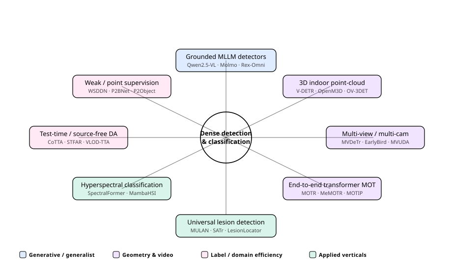
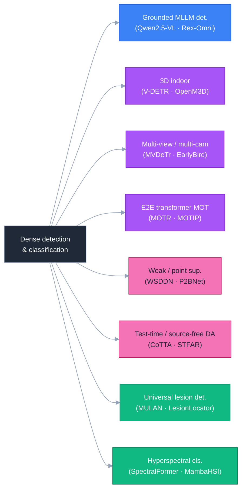
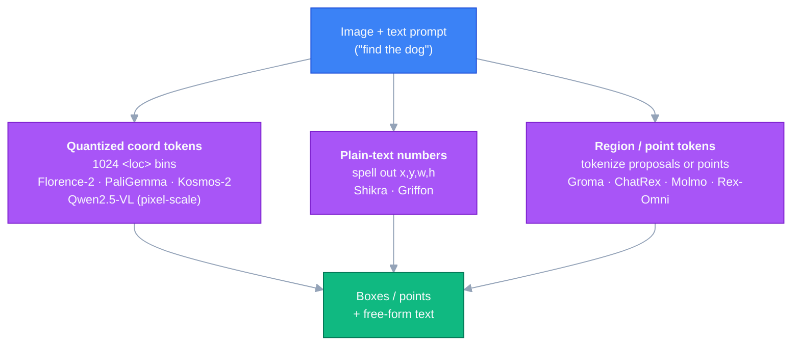
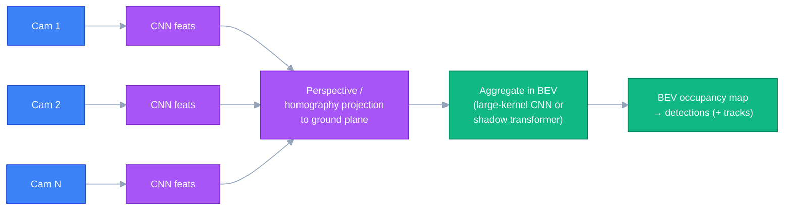
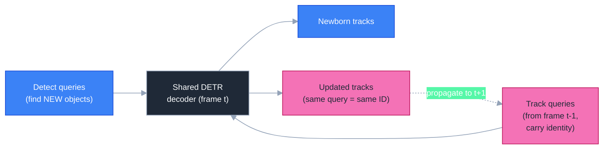
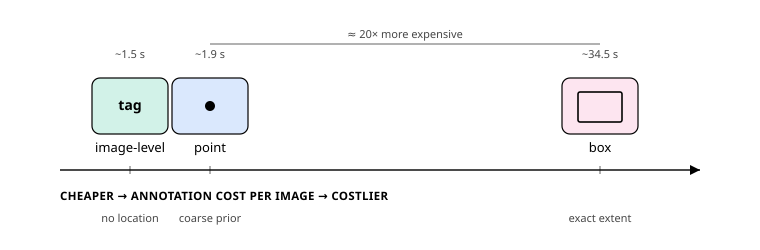
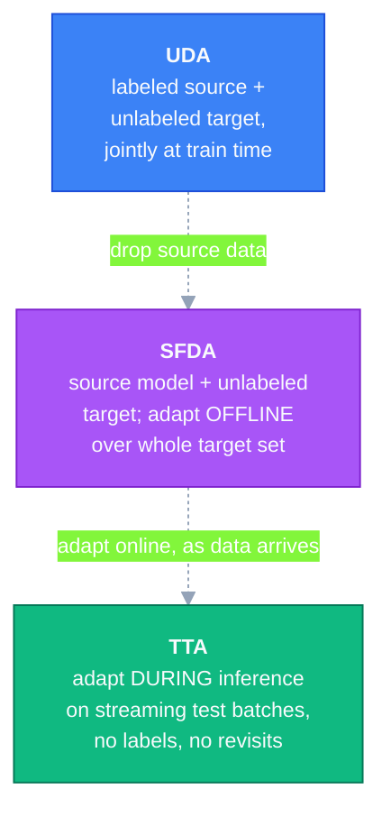
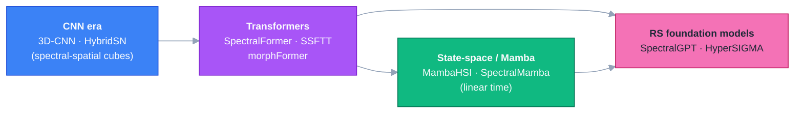

# Dense Object Detection & Classification — Recent Advances

*Compiled 2026-Jun-16 (America/Los_Angeles).*

Next installment in the running CV-updates log. Earlier entries on
`main`:
[Apr-30](../2026-Apr-30/2026-Apr-30_CV_updates.md),
[May-01](../2026-May-01/2026-May-01_CV_updates.md),
[May-02](../2026-May-02/2026-May-02_CV_updates.md),
[May-04](../2026-May-04/2026-May-04_CV_updates.md),
[May-05](../2026-May-05/2026-May-05_CV_updates.md),
[May-07](../2026-May-07/2026-May-07_CV_updates.md),
[May-08](../2026-May-08/2026-May-08_CV_updates.md),
[May-15](../2026-May-15/2026-May-15_CV_updates.md),
[May-16](../2026-May-16/2026-May-16_CV_updates.md),
[May-17](../2026-May-17/2026-May-17_CV_updates.md),
[Jun-09](../2026-Jun-09/2026-Jun-09_CV_updates.md),
[Jun-10](../2026-Jun-10/2026-Jun-10_CV_updates.md),
[Jun-12](../2026-Jun-12/2026-Jun-12_CV_updates.md),
[Jun-15](../2026-Jun-15/2026-Jun-15_CV_updates.md).
Those June passes covered open-vocab 3D,
grasp/affordance, scene-text spotting, open-vocab parts, face
detection, infrared small-target, polyp/endoscopy, agentic perception,
referring video segmentation, V2X cooperative perception, 4-D radar,
end-to-end driving / world models, referring MOT, RWKV backbones,
remote-sensing change detection, auto-labeling data engines, crowded
pedestrian detection, YOLOE open-vocab, semi-supervised DETR,
distillation/compression, few-shot/open-set VLMs, diffusion synthetic
data, adversarial robustness, spiking detectors, underwater detection,
label assignment, loss functions, augmentation, neck design, MoE
backbones, edge classification, zero-shot classification, and
panoramic/fisheye detection.

Today rotates to eight threads still untouched by the series:
**grounded multimodal-LLM detectors**, **3D indoor point-cloud
detection**, **multi-view / multi-camera detection**, **end-to-end
transformer multi-object tracking**, **weakly- & point-supervised
detection**, **test-time / source-free domain adaptation**,
**universal lesion detection in CT**, and (the classification half)
**hyperspectral image classification**.

> Scope note: links below are arXiv `abs` pages, official GitHub repos,
> or publisher pages that were verified during research. A handful of
> very recent items carry forward-dated arXiv identifiers; where a date
> could not be confirmed, the item is described qualitatively rather
> than linked, and flagged in-line.

---

## Table of contents

1. [What's new this pass](#1-whats-new-this-pass)
2. [Topic map](#2-topic-map)
3. [Grounded multimodal-LLM detectors](#3-grounded-multimodal-llm-detectors)
4. [3D indoor point-cloud detection](#4-3d-indoor-point-cloud-detection)
5. [Multi-view / multi-camera detection](#5-multi-view--multi-camera-detection)
6. [End-to-end transformer multi-object tracking](#6-end-to-end-transformer-multi-object-tracking)
7. [Weakly- & point-supervised detection](#7-weakly--point-supervised-detection)
8. [Test-time & source-free domain adaptation](#8-test-time--source-free-domain-adaptation)
9. [Universal lesion detection in CT / radiology](#9-universal-lesion-detection-in-ct--radiology)
10. [Hyperspectral image classification](#10-hyperspectral-image-classification)
11. [Reading list](#11-reading-list)

---

## 1. What's new this pass

| Thread                       | One-line take                                                                                                                                              |
| ---------------------------- | --------------------------------------------------------------------------------------------------------------------------------------------------------- |
| Grounded MLLM detectors      | Box/point output is now a *token-generation* task; **Rex-Omni** and **Qwen2.5-VL** report zero-shot COCO/LVIS on par with specialist Grounding-DINO.       |
| 3D indoor detection          | DETR-style heads (**V-DETR**) top ScanNet; the live frontier is **annotation-free open-vocab** indoor 3D (**OV-3DET → OpenM3D**) lifted from 2D alone.     |
| Multi-view / multi-camera    | Per-view features are projected to a shared BEV ground plane; transformers (**MVDeTr** shadow attention) suppress projection "shadows"; UDA now in play.   |
| End-to-end transformer MOT   | **Track queries** carry identity across frames, making association implicit; **MOTIP** (CVPR'25) recasts the whole thing as in-context ID prediction.      |
| Weak / point supervision     | The cost ladder is tag ≪ point ≪ box; **P2BNet/P2Object** turn single points into boxes, and VLM/SAM pseudo-labels now drive cost toward zero.             |
| Test-time / source-free DA   | Adapt a detector with **no source data** (SFDA) or **mid-inference** (TTA) via mean-teacher self-training; 2025 work targets VLM detectors on COCO-C.       |
| Universal lesion detection   | From **MULAN** multitask R-CNN to slice-attention transformers (**SATr**) and promptable 3D foundation models (**LesionLocator**, CVPR'25); FROC rules.    |
| Hyperspectral classification | The spectral-spatial transformer (**SpectralFormer**) lineage is being overtaken by **linear-time Mamba** (**MambaHSI**) and RS foundation models.         |

---

## 2. Topic map

A standalone SVG topic map (light/dark-safe via `currentColor`):

A Mermaid version of the same lattice:

---

## 3. Grounded multimodal-LLM detectors

The biggest shift of the last 18 months is that *detection has become a
text-generation task*. Instead of a regression head emitting box
coordinates, a vision-language model (VLM) **writes the box** as part of
its output sequence. Three encodings dominate:

- **Quantized coordinate tokens.** Florence-2, PaliGemma and Kosmos-2 add
  ~1024 special `loc0000…loc1023` tokens for binned, normalized
  coordinates. **Qwen2.5-VL** keeps coordinate tokens but at *absolute
  pixel scale* — the team argues this teaches the model true image scale,
  and it emits structured JSON for boxes and points
  ([arXiv 2502.13923](https://arxiv.org/abs/2502.13923),
  [blog](https://qwenlm.github.io/blog/qwen2.5-vl/)).
- **Plain-text numbers.** **Shikra**
  ([arXiv 2306.15195](https://arxiv.org/abs/2306.15195)) and the
  **Griffon** family
  ([arXiv 2311.14552](https://arxiv.org/abs/2311.14552)) deliberately spell
  coordinates as ordinary numbers — no special tokens, no detection head.
- **Region / point tokens.** **Groma**
  ([ECCV 2024](https://link.springer.com/chapter/10.1007/978-3-031-72658-3_24))
  tokenizes region proposals; **ChatRex**
  ([arXiv 2411.18363](https://arxiv.org/abs/2411.18363)) decouples a
  retrieval-based perception branch from the LLM; and **Molmo / PixMo**
  ([arXiv 2409.17146](https://arxiv.org/html/2409.17146v2),
  [code](https://github.com/allenai/molmo)) trains the model to *point*
  rather than box, using points as a communication channel for counting
  and grounding.

**Lineage.** Kosmos-2
([arXiv 2306.14824](https://arxiv.org/abs/2306.14824)) opened the
grounded-MLLM era; Apple's **Ferret / Ferret-v2** added any-resolution,
multi-granularity grounding with a second DINOv2 encoder
([arXiv 2404.07973](https://arxiv.org/abs/2404.07973)); **Florence-2**
([arXiv 2311.06242](https://arxiv.org/abs/2311.06242)) showed a small
unified seq2seq model can beat much larger predecessors zero-shot.

**The 2025–26 headline** is that generative box output has *caught up* with
specialist detectors. **Rex-Omni** (3B) recasts detection — and OCR
grounding, pointing, and more — as **next-point prediction**, and reports
zero-shot COCO/LVIS comparable to or exceeding regression detectors like
DINO / Grounding-DINO ([arXiv 2510.12798](https://arxiv.org/abs/2510.12798),
[code](https://github.com/IDEA-Research/Rex-Omni)). That is a milestone:
generative outputs historically lagged on dense / small-object benchmarks.
For reference, the specialist SOTA still runs through the
**Grounding-DINO → Grounding DINO 1.5 → DINO-X** line
([DINO-X, arXiv 2411.14347](https://arxiv.org/abs/2411.14347)), the
last of which is a unified object-centric DETR model, *not* token
generation.

The broader trend is toward a single **perception generalist** —
detection + segmentation + pointing + VQA from one model: **VisionLLM v2**
([arXiv 2406.08394](https://arxiv.org/html/2406.08394)), **X-SAM**
([arXiv 2508.04655](https://arxiv.org/pdf/2508.04655)), and the
Rex-Omni / Qwen line all point that way.

---

## 4. 3D indoor point-cloud detection

Distinct from the autonomous-driving 3D stack (covered May-17 / Jun-10),
indoor detection works on dense RGB-D-derived point clouds (ScanNet,
SUN RGB-D) where the challenge is clutter and 9-DoF oriented boxes rather
than range and ego-motion.

**Closed-vocabulary backbone.** The field moved from hand-grouped local
features to attention and sparse convolutions:

| Model | Key idea | Venue | Link |
|-------|----------|-------|------|
| GroupFree3D | Object features from *all* points via attention, not hand-grouped neighborhoods | CVPR 2021 | [arXiv 2104.00678](https://arxiv.org/pdf/2104.00678) |
| FCAF3D | First fully-convolutional **anchor-free** indoor detector; sparse voxels, single pass | ECCV 2022 | [arXiv 2112.00322](https://arxiv.org/abs/2112.00322) |
| CAGroup3D | Two-stage fully-sparse; class-aware grouping + sparse RoI refinement | NeurIPS 2022 | [arXiv 2210.04264](https://arxiv.org/abs/2210.04264) |
| TR3D | Lightweight, **real-time** fully-convolutional indoor detector | 2023 | [arXiv 2302.02858](https://arxiv.org/abs/2302.02858) |
| V-DETR | DETR + **3D Vertex Relative Position Encoding** restores locality; beats CAGroup3D by +2.7/+4.7 AP on ScanNetV2 | 2023 | [arXiv 2308.04409](https://arxiv.org/pdf/2308.04409) |

**The live frontier — annotation-free open-vocabulary.** Because 3D box
labels are brutally expensive, the action has moved to detectors that need
*no 3D annotations* at all, lifting supervision from 2D foundation models:

- **OV-3DET** — open-vocab point-cloud detection with **no 3D box labels**,
  via image/VL priors + a divide-and-conquer localizer and text↔point
  alignment (CVPR 2023,
  [arXiv 2304.00788](https://arxiv.org/abs/2304.00788)).
- **CoDA / CoDAv2** — collaborative novel-box discovery (geometry + CLIP 2D
  priors) with cross-modal alignment; v2 reports >140–150% relative gains
  on SUN RGB-D / ScanNetV2 (NeurIPS 2023,
  [arXiv 2310.02960](https://arxiv.org/pdf/2310.02960)).
- **ImOV3D** — learns open-vocab 3D detection from **only 2D images**
  ([arXiv 2410.24001](https://arxiv.org/pdf/2410.24001)).
- **OpenM3D** — first **multi-view** open-vocab indoor 3D detector with no
  human annotations; graph-embedding pseudo-boxes, ~0.3 s/scene, +37% AP25
  over OV-3DET, SOTA on ScanNet200 and ARKitScenes (ICCV 2025,
  [arXiv 2508.20063](https://arxiv.org/abs/2508.20063),
  [project](https://penghaohsu.github.io/projects/openm3d/)).

**Benchmarks.** ScanNetV2 and SUN RGB-D are the closed-vocab standards
(S3DIS often added); **ScanNet200** (66 head / 68 common / 66 tail
classes) is the open-vocab / long-tail yardstick, with **ARKitScenes**
rising for multi-view evaluation.

---

## 5. Multi-view / multi-camera detection

When several **fixed, calibrated, overlapping** cameras watch a scene
(retail, surveillance, sports), the winning recipe is *not* to detect
per-image and fuse boxes — it is to project per-view CNN features onto a
shared **bird's-eye-view ground plane** and detect there. A person on the
ground projects to a consistent foot location across all views, so an
occlusion in one view is filled in by the others.

**The lineage.** **MVDet** set the anchor-free baseline (per-view features
→ ground-plane projection → large-kernel aggregation) and introduced the
synthetic **MultiviewX** dataset (ECCV 2020,
[arXiv 2007.07247](https://arxiv.org/abs/2007.07247),
[code](https://github.com/hou-yz/MVDet)). The known artifact is that
projecting features at a single ground height "smears" them into vertical
*shadows*; two fixes emerged:

- **Stacked homographies** — **SHOT** projects each view to multiple height
  planes with a learned soft-selection (ICCV 2021), and **Booster-SHOT**
  adds a homography attention module, reaching 92.9% MODA on Wildtrack
  (WACV 2024, [paper](https://arxiv.org/pdf/2208.09211)).
- **Attention** — **MVDeTr** adds a **shadow transformer** (multi-view
  deformable attention) that jointly attends across views to suppress
  shadows, hitting ~91.5% MODA on Wildtrack / ~93.7% on MultiviewX
  (ACM MM 2021, [arXiv 2108.05888](https://arxiv.org/abs/2108.05888),
  [code](https://github.com/hou-yz/MVDeTr)).

Augmentation also matters disproportionately here: **3DROM** projects
random 3D cylinder occlusions into all views (ECCV 2022,
[arXiv 2207.10895](https://arxiv.org/abs/2207.10895)), and **MVAug**
augments *both* the image and the perspective transform
([arXiv 2210.10756](https://arxiv.org/abs/2210.10756),
[code](https://github.com/cvlab-epfl/MVAug)).

**2024–26.** The frontier is joint detection + tracking and domain
transfer. **EarlyBird** does early BEV fusion for joint detect+track,
adding re-ID features (+4.6 MOTA on Wildtrack;
[arXiv 2310.13350](https://arxiv.org/abs/2310.13350)); **TrackTacular**
compares Simple-BEV / BEVFormer / Lift-Splat-Shoot lifting strategies
([arXiv 2403.12573](https://arxiv.org/abs/2403.12573),
[code](https://github.com/tteepe/TrackTacular)); and **MVUDA** brings
**unsupervised domain adaptation** across *different camera rigs*
(MultiviewX→Wildtrack) via mean-teacher pseudo-labeling on the occupancy
map ([arXiv 2412.04117](https://arxiv.org/abs/2412.04117)). 2025 work
extends BEV to a 3D **probabilistic occupancy volume**
([arXiv 2503.10982](https://arxiv.org/pdf/2503.10982)).

**Benchmarks.** **Wildtrack** (7 real cameras, dense pedestrians),
**MultiviewX** (6 synthetic cameras), **MMPTRACK** (5 environments, ~9.6 h);
metrics are MODA / MODP / precision / recall, plus MOTA / IDF1 when
tracking.

---

## 6. End-to-end transformer multi-object tracking

Tracking-by-detection (SORT, ByteTrack) detects each frame then associates
with a separate Re-ID / IoU step. The DETR-style alternative folds both
into one decoder using two query types — and is distinct from the
*language-referring* MOT covered on Jun-10.

Because the *same* track query follows an object across frames, **the query
is the track ID** — association becomes implicit, with no hand-designed
matching. The catch is a **label-assignment imbalance**: most objects are
already tracked, leaving few positives for detect queries, which starves
detection and makes training data-hungry. Most of the literature is fixing
exactly that.

| Model | Key idea | Venue | Link |
|-------|----------|-------|------|
| TrackFormer | First **track queries**; frame-to-frame set prediction | CVPR 2022 | [arXiv 2101.02702](https://arxiv.org/abs/2101.02702) |
| MOTR | Fully end-to-end; track query updated autoregressively | ECCV 2022 | [arXiv 2105.03247](https://arxiv.org/abs/2105.03247) |
| MeMOT | Large spatio-temporal **memory** of identity embeddings | CVPR 2022 | [arXiv 2203.16761](https://arxiv.org/abs/2203.16761) |
| MOTRv2 | Bootstraps detection with **YOLOX anchor proposals**; first e2e to beat tracking-by-detection | CVPR 2023 | [arXiv 2211.09791](https://arxiv.org/abs/2211.09791) |
| MeMOTR | Long-term memory-attention; +7.9 HOTA on DanceTrack | ICCV 2023 | [arXiv 2307.15700](https://arxiv.org/abs/2307.15700) |
| CO-MOT | **COLA** coopetition label assignment fixes the query imbalance | 2023 | [arXiv 2305.12724](https://arxiv.org/abs/2305.12724) |
| MOTIP | Recasts association as in-context **ID prediction** | CVPR 2025 | [arXiv 2403.16848](https://arxiv.org/abs/2403.16848) |

**2024–26.** **MOTRv3** balances detect-vs-track assignment with a
release-fetch schedule plus pseudo-label distillation (ICLR 2025 cycle,
[arXiv 2305.14298](https://arxiv.org/abs/2305.14298)); **OVTR** brings
open-vocabulary categories into e2e transformer tracking
([arXiv 2503.10616](https://arxiv.org/pdf/2503.10616)); and
**FastTrackTr** targets latency
([arXiv 2411.15811](https://arxiv.org/pdf/2411.15811)).

**Benchmarks.** **DanceTrack** (uniform appearance, non-linear motion) is
where query trackers shine because it stresses *association*;
**MOT17/20** (crowded, linear motion), **SportsMOT**, and multi-class
**BDD100K** round it out. Primary metric: **HOTA** (with its AssA / DetA
split), alongside MOTA and IDF1.

---

## 7. Weakly- & point-supervised detection

The driver is annotation cost. Per-image labeling time scales steeply with
localization signal:

A box costs ~20× a point or tag (~34.5 s vs ~1.5–1.9 s), so the field
trades a tiny extra annotation for a strong localization prior.

**Image-level labels (MIL lineage).** Treat the image as a bag of region
proposals supervised by an image-level class label. The recurring failure
is latching onto the most discriminative *part* rather than the whole
object — each generation patches that:

- **WSDDN** — foundational two-stream (classification × detection) MIL CNN
  (CVPR 2016, [arXiv 1511.02853](https://arxiv.org/abs/1511.02853)).
- **OICR** — online instance-classifier refinement: top proposals become
  pseudo-labels for the next branch (CVPR 2017,
  [arXiv 1704.00138](https://arxiv.org/abs/1704.00138)).
- **PCL** — proposal-cluster learning groups adjacent proposals into whole
  objects (TPAMI 2020, [arXiv 1807.03342](https://arxiv.org/abs/1807.03342)).
- **MIST** — instance-aware self-training + a "Concrete DropBlock" that
  forces the net off discriminative parts (CVPR 2020,
  [arXiv 2004.04725](https://arxiv.org/abs/2004.04725)).

**Point supervision (weakly-semi-supervised).** A small boxed set plus a
large *point*-annotated set, with points converted to pseudo-boxes:

- **Point-DETR** — "points as queries": a point encoder turns annotations
  into DETR queries, a teacher labels the point set (CVPR 2021,
  [arXiv 2104.07434](https://arxiv.org/abs/2104.07434)).
- **P2BNet** — pure point supervision via coarse box prediction + iterative
  refinement; >50% relative AP gain over prior PSOD on COCO (ECCV 2022,
  [arXiv 2207.06827](https://arxiv.org/abs/2207.06827)).
- **P2Object** — 2025 follow-up (P2BNet++ near-continuous proposal
  sampling, plus a segmentation extension) (IJCV 2025,
  [arXiv 2504.07813](https://arxiv.org/abs/2504.07813)).
- **Point-Teaching** — Hungarian point-matching + point-guided copy-paste;
  +9.1 AP over Unbiased Teacher at 0.5% labels
  ([arXiv 2206.00274](https://arxiv.org/abs/2206.00274)). Mixed-supervision
  frameworks: **UFO²** ([arXiv 2010.10804](https://arxiv.org/abs/2010.10804))
  and **Omni-DETR** ([arXiv 2203.16089](https://arxiv.org/pdf/2203.16089)).

**2024–26 — foundation-model pseudo-labels.** The newest direction
replaces hand-designed MIL: open-vocab detectors / CLIP / SAM generate
boxes or masks from tags or captions, which then supervise (or distill
into) a closed-set detector — pushing supervision cost toward zero.
**Grounding DINO** is the workhorse pseudo-box generator
([arXiv 2303.05499](https://arxiv.org/html/2303.05499v5)); recent recipes
include **CoT-PL** chain-of-thought pseudo-labeling
([arXiv 2510.14792](https://arxiv.org/abs/2510.14792)) and a hierarchical
semantic-distillation framework for OVD
([arXiv 2503.10152](https://arxiv.org/pdf/2503.10152)). The recurring
caveat: CLIP on cropped proposals localizes poorly, so the work is really
about *filtering and re-grounding* those proposals. (The space is
fragmented — there is no single canonical "distill OVD → cheap WSOD"
paper yet.)

---

## 8. Test-time & source-free domain adaptation

A detector trained on clear daytime data degrades under fog, night, or
sensor change. Three regimes adapt it, differing in what data is available
and *when*:

- **UDA** has labeled source *and* unlabeled target together — not
  source-free. The mean-teacher baseline backbone: **MTTrans** (DETR,
  ECCV 2022, [paper](https://www.ecva.net/papers/eccv_2022/papers_ECCV/papers/136690620.pdf))
  and **Contrastive Mean Teacher** (CMT, 51.9 mAP on Foggy Cityscapes,
  CVPR 2023, [arXiv 2305.03034](https://arxiv.org/abs/2305.03034)).
- **SFDA** keeps only the source-pretrained model + unlabeled target,
  adapting offline. **LODS** "learns to overlook domain style" (CVPR 2022,
  [paper](https://openaccess.thecvf.com/content/CVPR2022/papers/Li_Source-Free_Object_Detection_by_Learning_To_Overlook_Domain_Style_CVPR_2022_paper.pdf));
  a 2024 study shows simple self-training rivals complex SFOD pipelines
  ([ECCV 2024](https://link.springer.com/chapter/10.1007/978-3-031-72949-2_12)).
  Earlier SFOD baselines (SOAP, SED, A2SFOD, IRG) are widely cited; clean
  `abs` links were not all confirmed in research, so they are named but not
  all linked here.
- **TTA** adapts *during* inference on streaming batches. The template is
  **CoTTA** (weight-averaged teacher + augmentation averaging + stochastic
  restoration, CVPR 2022,
  [paper](https://openaccess.thecvf.com/content/CVPR2022/papers/Wang_Continual_Test-Time_Domain_Adaptation_CVPR_2022_paper.pdf)).
  For detection: **STFAR** adds feature-alignment regularization
  ([arXiv 2303.17937](https://arxiv.org/abs/2303.17937)); a 2024 method
  uses dynamic pseudo-label thresholds for continually changing
  environments ([arXiv 2406.16439](https://arxiv.org/abs/2406.16439)); and
  TTA even reaches monocular 3D detection
  ([arXiv 2405.19682](https://arxiv.org/html/2405.19682v1)).

**2025 turns to VLM detectors.** **VLOD-TTA** adapts open-vocabulary
detectors (e.g., Grounding DINO) at test time
([arXiv 2510.00458](https://arxiv.org/pdf/2510.00458)); **BCA+** is a
Bayesian TTA evaluated across all 15 COCO-C corruptions
([arXiv 2510.02750](https://arxiv.org/pdf/2510.02750)).

**Benchmarks.** **Cityscapes → Foggy Cityscapes** (fog 0.02 hardest) is
the canonical weather shift; **COCO-C** (15 corruptions × 5 severities)
and **COCO-O** (natural shifts,
[arXiv 2307.12730](https://arxiv.org/pdf/2307.12730)) test corruption
robustness. Note: the SFDA/TTA terminology is used loosely across papers.

---

## 9. Universal lesion detection in CT / radiology

"Universal" lesion detection (ULD) aims to find lesions *across organs* in
volumetric CT, rather than one organ-specific detector each. The
benchmark anchor is **DeepLesion** (~32.7K lesions on ~32.1K CT slices,
4,427 patients, NIH), evaluated by **FROC** — sensitivity at a fixed
budget of false positives per scan (0.5, 1, 2, 4, 8, 16 FP/image; the mean
is the headline number).

**The lineage.**

- **3DCE** injects 3D context by aggregating neighboring slices, lifting
  sensitivity @4 FP from ~80.3% to ~84.4%
  ([arXiv 1806.09648](https://arxiv.org/pdf/1806.09648)).
- **MULAN** is the multitask reference: joint detection + 185-tag
  classification + segmentation on an improved Mask R-CNN with 3D feature
  fusion (MICCAI 2019, [arXiv 1908.04373](https://arxiv.org/abs/1908.04373),
  [code](https://github.com/rsummers11/CADLab/tree/master/MULAN_universal_lesion_analysis)).
- **ULDor** uses pseudo-masks + hard-negative mining for false-positive
  reduction (~86% sens @5 FP,
  [arXiv 1901.06359](https://arxiv.org/abs/1901.06359)).
- Anchor-free and 3D-context variants push further: a 3D anchor-free
  keypoint detector ([arXiv 1908.11324](https://arxiv.org/abs/1908.11324)),
  efficient anchor-free ULD (~86% avg sens,
  [arXiv 2203.16074](https://arxiv.org/pdf/2203.16074)), and **A3D**
  asymmetric 3D context fusion
  ([arXiv 2109.08684](https://arxiv.org/pdf/2109.08684)).

**Transformers.** **SATr** is a plug-in slice-attention Transformer block
that models long-range inter-slice dependencies for any CNN ULD backbone,
for an "almost free" accuracy boost (MICCAI 2022,
[arXiv 2203.07373](https://arxiv.org/abs/2203.07373)).

**2024–26 — promptable 3D foundation models.** The frontier is
foundation models that localize/segment lesions with prompts and track
them over time:

- **LesionLocator** — zero-shot universal tumor segmentation *and*
  longitudinal tracking in 3D whole-body imaging; first prompt-based 4D
  framework, trained on ~23K scans + synthetic longitudinal data, beating
  prior promptable models by ~10 Dice (CVPR 2025,
  [arXiv 2502.20985](https://arxiv.org/abs/2502.20985),
  [code](https://github.com/MIC-DKFZ/LesionLocator)).
- **CLIP-driven Universal Model** — one model segmenting 25 organs + 6
  tumor types via a language-driven parameter generator (Med. Image
  Analysis 2024, [arXiv 2405.18356](https://arxiv.org/abs/2405.18356)).
- **MedSAM2** extends Segment Anything to 3D medical images and video
  across 40 tasks ([arXiv 2504.03600](https://arxiv.org/html/2504.03600v1));
  **MedLSAM** is a 3D localization foundation model
  ([Med. Image Analysis 2024](https://www.sciencedirect.com/science/article/abs/pii/S1361841524002950)).
- **ULS23** standardizes 3D universal lesion *segmentation* evaluation
  ([Grand Challenge](https://uls23.grand-challenge.org/)).

For lung nodules specifically, **LUNA16** (888 chest CTs) with the **CPM**
metric remains standard; 2025 work pairs DINOv2 self-supervised features
with classical classifiers
([arXiv 2505.15120](https://www.arxiv.org/pdf/2505.15120)) and stacks Swin
transformers on YOLO pipelines
([PMC](https://pmc.ncbi.nlm.nih.gov/articles/PMC12219450/)). *(Several
2025–26 medical "foundation" papers surfaced with forward-dated arXiv IDs
that could not be verified; they are omitted here.)*

---

## 10. Hyperspectral image classification

The classification half. Hyperspectral imaging (HSI) records hundreds of
contiguous spectral bands per pixel; the task is per-pixel land-cover
classification. The defining constraint is **tiny labeled samples** —
per-pixel labeling of high-dimensional cubes is expensive, so models must
generalize from a handful of labels.

- **CNN baselines.** **HybridSN** stacks a spectral-spatial 3D-CNN then a
  spatial 2D-CNN, cheaper than a pure 3D-CNN (GRSL 2019,
  [arXiv 1902.06701](https://arxiv.org/abs/1902.06701)).
- **Spectral-spatial transformers.** **SpectralFormer** first brought the
  Transformer to HSI, with group-wise spectral embedding + cross-layer
  adaptive fusion (TGRS 2022,
  [arXiv 2107.02988](https://arxiv.org/abs/2107.02988)); **SSFTT** adds
  Gaussian-weighted feature tokenization; **morphFormer** injects learnable
  morphological operations into attention
  ([IEEE](https://ieeexplore.ieee.org/document/10036472/)); and
  **FactoFormer** adds factorized self-supervised pretraining
  ([arXiv 2309.09431](https://arxiv.org/pdf/2309.09431)).
- **Mamba / state-space — the 2024–25 surge.** Linear complexity vs.
  quadratic attention makes state-space models a natural fit for
  long spectral sequences. **MambaHSI** is the first whole-image Mamba HSI
  classifier (spatial + grouped-spectral blocks + adaptive fusion, TGRS
  2024, [arXiv 2501.04944](https://arxiv.org/abs/2501.04944),
  [code](https://github.com/li-yapeng/MambaHSI)); see also **SpectralMamba**
  ([arXiv 2404.08489](https://arxiv.org/abs/2404.08489)), **HSIMamba**
  ([arXiv 2404.00272](https://arxiv.org/abs/2404.00272)), **S2Mamba**
  ([arXiv 2404.18213](https://arxiv.org/html/2404.18213v2)), and a
  spatial-spectral morphological Mamba
  ([arXiv 2408.01372](https://arxiv.org/abs/2408.01372)).
- **Remote-sensing foundation models.** **SpectralGPT** is a 3D generative
  pretrained transformer trained on ~1M spectral images
  ([arXiv 2311.07113](https://arxiv.org/abs/2311.07113)); **HyperSIGMA**
  scales an HSI ViT past 1B parameters, pretrained on HyperGlobal-450K
  ([arXiv 2406.11519](https://arxiv.org/abs/2406.11519)).

**The small-sample problem.** Methods lean on self-supervised pretraining
(e.g., **S4L-FSC**, [arXiv 2505.12482](https://arxiv.org/html/2505.12482v1)),
few-shot metric learning, and open-set discovery for unknown classes. A
useful one-stop overview is the 2024 survey "evolution from conventional
to transformers and Mamba models"
([arXiv 2404.14955](https://arxiv.org/pdf/2404.14955)).

**Benchmarks.** Indian Pines (16 classes, AVIRIS), Pavia University
(9 classes, ROSIS), Houston 2013 (15 classes, DFC), and the UAV-borne
**WHU-Hi** suite ([dataset paper](https://arxiv.org/pdf/2012.13920)).

---

## 11. Reading list

**Grounded MLLM detectors**
- Qwen2.5-VL — [arXiv 2502.13923](https://arxiv.org/abs/2502.13923)
- Rex-Omni (detection as next-point prediction) — [arXiv 2510.12798](https://arxiv.org/abs/2510.12798)
- Florence-2 — [arXiv 2311.06242](https://arxiv.org/abs/2311.06242)
- Molmo / PixMo (pointing) — [arXiv 2409.17146](https://arxiv.org/html/2409.17146v2)
- DINO-X (specialist SOTA) — [arXiv 2411.14347](https://arxiv.org/abs/2411.14347)

**3D indoor point-cloud detection**
- V-DETR — [arXiv 2308.04409](https://arxiv.org/pdf/2308.04409)
- FCAF3D — [arXiv 2112.00322](https://arxiv.org/abs/2112.00322)
- OV-3DET — [arXiv 2304.00788](https://arxiv.org/abs/2304.00788)
- OpenM3D (ICCV 2025) — [arXiv 2508.20063](https://arxiv.org/abs/2508.20063)

**Multi-view / multi-camera detection**
- MVDet — [arXiv 2007.07247](https://arxiv.org/abs/2007.07247)
- MVDeTr (shadow transformer) — [arXiv 2108.05888](https://arxiv.org/abs/2108.05888)
- EarlyBird — [arXiv 2310.13350](https://arxiv.org/abs/2310.13350)
- MVUDA (domain adaptation) — [arXiv 2412.04117](https://arxiv.org/abs/2412.04117)

**End-to-end transformer MOT**
- MOTR — [arXiv 2105.03247](https://arxiv.org/abs/2105.03247)
- MOTRv2 — [arXiv 2211.09791](https://arxiv.org/abs/2211.09791)
- MeMOTR — [arXiv 2307.15700](https://arxiv.org/abs/2307.15700)
- MOTIP (CVPR 2025) — [arXiv 2403.16848](https://arxiv.org/abs/2403.16848)

**Weak & point supervision**
- WSDDN — [arXiv 1511.02853](https://arxiv.org/abs/1511.02853)
- P2BNet — [arXiv 2207.06827](https://arxiv.org/abs/2207.06827)
- P2Object (IJCV 2025) — [arXiv 2504.07813](https://arxiv.org/abs/2504.07813)
- Point-DETR — [arXiv 2104.07434](https://arxiv.org/abs/2104.07434)

**Test-time / source-free DA**
- CoTTA — [CVPR 2022 paper](https://openaccess.thecvf.com/content/CVPR2022/papers/Wang_Continual_Test-Time_Domain_Adaptation_CVPR_2022_paper.pdf)
- STFAR — [arXiv 2303.17937](https://arxiv.org/abs/2303.17937)
- CMT (UDA baseline) — [arXiv 2305.03034](https://arxiv.org/abs/2305.03034)
- VLOD-TTA — [arXiv 2510.00458](https://arxiv.org/pdf/2510.00458)

**Universal lesion detection**
- MULAN — [arXiv 1908.04373](https://arxiv.org/abs/1908.04373)
- SATr — [arXiv 2203.07373](https://arxiv.org/abs/2203.07373)
- LesionLocator (CVPR 2025) — [arXiv 2502.20985](https://arxiv.org/abs/2502.20985)
- ULS23 challenge — [grand-challenge.org](https://uls23.grand-challenge.org/)

**Hyperspectral classification**
- SpectralFormer — [arXiv 2107.02988](https://arxiv.org/abs/2107.02988)
- MambaHSI — [arXiv 2501.04944](https://arxiv.org/abs/2501.04944)
- HyperSIGMA — [arXiv 2406.11519](https://arxiv.org/abs/2406.11519)
- Survey (transformers → Mamba) — [arXiv 2404.14955](https://arxiv.org/pdf/2404.14955)

---

*Diagrams are inline Mermaid plus standalone SVG (`assets/`) using
`currentColor` and semi-transparent fills, so they render on both light
and dark backgrounds with no external requests. Generated as part of the
CV-updates series.*
