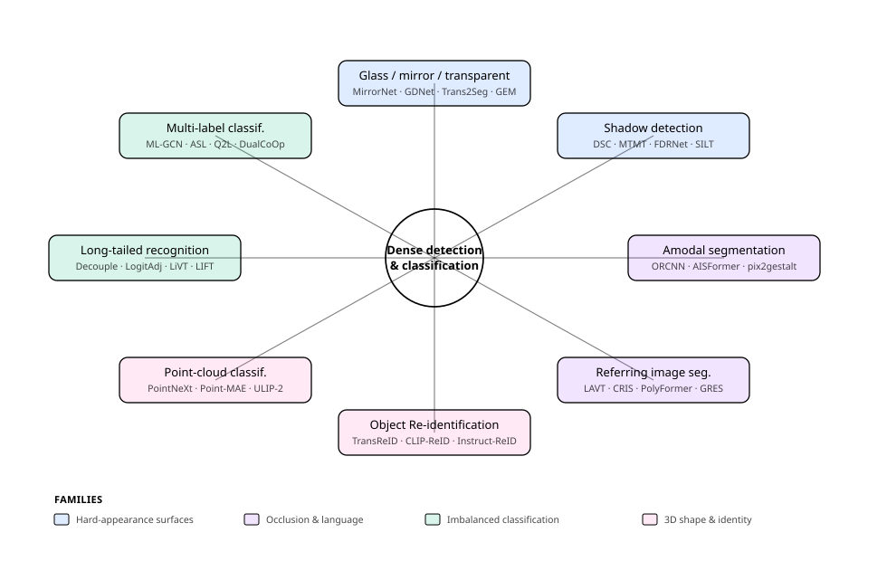
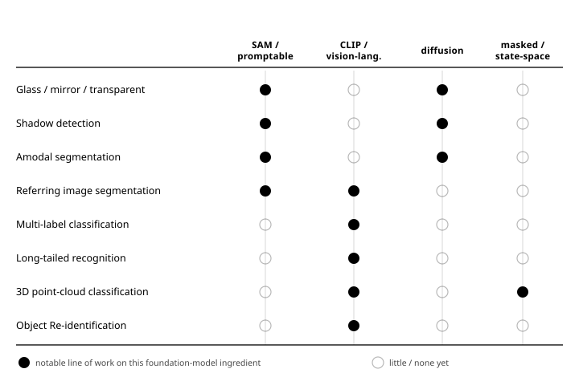
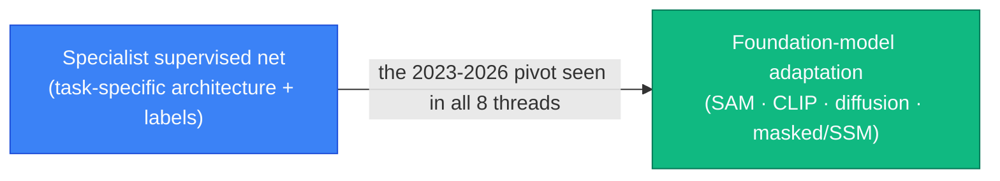

# Dense Object Detection & Classification — Recent Advances

*Compiled 2026-Jun-17 (America/Los_Angeles).*

Next installment in the running CV-updates log. Earlier entries on
`main`:
[Apr-30](../2026-Apr-30/2026-Apr-30_CV_updates.md),
[May-01](../2026-May-01/2026-May-01_CV_updates.md),
[May-02](../2026-May-02/2026-May-02_CV_updates.md),
[May-04](../2026-May-04/2026-May-04_CV_updates.md),
[May-05](../2026-May-05/2026-May-05_CV_updates.md),
[May-07](../2026-May-07/2026-May-07_CV_updates.md),
[May-08](../2026-May-08/2026-May-08_CV_updates.md),
[May-15](../2026-May-15/2026-May-15_CV_updates.md),
[May-16](../2026-May-16/2026-May-16_CV_updates.md),
[May-17](../2026-May-17/2026-May-17_CV_updates.md),
[Jun-09](../2026-Jun-09/2026-Jun-09_CV_updates.md),
[Jun-10](../2026-Jun-10/2026-Jun-10_CV_updates.md),
[Jun-12](../2026-Jun-12/2026-Jun-12_CV_updates.md),
[Jun-15](../2026-Jun-15/2026-Jun-15_CV_updates.md),
[Jun-16](../2026-Jun-16/2026-Jun-16_CV_updates.md).
Across ~120 dedicated sections those passes have already worked through
the real-time detector race (YOLO/DETR/DEIM), oriented & aerial
detection, camouflaged & salient objects, small-object & infrared
detection, open-world/incremental/long-tail detection, event-based &
spiking detectors, industrial anomaly detection, fine-grained &
hyperspectral & zero-shot classification, 3D / BEV / multi-view
detection, end-to-end MOT, weak/point/semi-supervised learning,
test-time & source-free adaptation, distillation, diffusion detectors,
referring & grounded MLLM detection, and much more.

To avoid repeating that ground, today rotates to **eight threads the
series has not yet given a dedicated section** — clustered around two
recurring difficulties (objects you can barely *see*, and objects you
can only partly see) plus the often-neglected classification half:
**glass / mirror / transparent-surface detection**, **shadow
detection**, **amodal (occlusion-aware) segmentation**, **referring
image segmentation**, **multi-label classification**, **long-tailed
recognition**, **3D point-cloud shape classification**, and **object
re-identification**.

> Scope note: links below are arXiv `abs` pages, official GitHub repos,
> or publisher pages (CVF / IEEE / NeurIPS / IJCAI) cross-checked during
> research — each arXiv ID was corroborated against the paper title
> across multiple listings. Several influential papers (e.g. GDNet, PMD,
> GlassSemNet, MTMT, FDRNet, the KINS dataset) exist only as
> conference / journal camera-ready versions with **no standalone arXiv
> preprint**; those are flagged in-line and cited via their proceedings
> page or the arXiv ID of a direct journal extension. Benchmark numbers
> are as-reported by the authors and rounded.

---

## Table of contents

1. [What's new this pass](#1-whats-new-this-pass)
2. [Topic map](#2-topic-map)
3. [Glass / mirror / transparent-surface detection](#3-glass--mirror--transparent-surface-detection)
4. [Shadow detection](#4-shadow-detection)
5. [Amodal (occlusion-aware) segmentation](#5-amodal-occlusion-aware-segmentation)
6. [Referring image segmentation](#6-referring-image-segmentation)
7. [Multi-label image classification](#7-multi-label-image-classification)
8. [Long-tailed recognition](#8-long-tailed-recognition)
9. [3D point-cloud shape classification](#9-3d-point-cloud-shape-classification)
10. [Object re-identification](#10-object-re-identification)
11. [Cross-cutting theme: the foundation-model pivot](#11-cross-cutting-theme-the-foundation-model-pivot)
12. [Reading list](#12-reading-list)

---

## 1. What's new this pass

| Thread                       | One-line take                                                                                                                                              |
| ---------------------------- | --------------------------------------------------------------------------------------------------------------------------------------------------------- |
| Glass / transparent surfaces | Surfaces with no intrinsic appearance are segmented from **boundary & context cues** (GDNet, Trans2Seg), then from **extra physics** (depth/thermal/polarization); SAM fails zero-shot, so SAM+diffusion-data specialists (**GEM**) take over. |
| Shadow detection             | From direction-aware context (**DSC**) to **label-quality** fixes — semi-supervised (**MTMT**) and noisy-label tuning (**SILT**, a plain U-Net beats SOTA); removal pivots to transformers/diffusion (**ShadowFormer, ShadowDiffusion**). |
| Amodal segmentation          | Predict the *hidden* extent of occluded objects: multi-head mask R-CNNs (**ORCNN**) → transformer queries (**AISFormer**) → shape priors (**C2F-Seg**) → diffusion "synthesize the whole" (**pix2gestalt**) and SAM decoders (**SAMEO**). |
| Referring image segmentation | Segment the object named by a phrase: early fusion in a ViT (**LAVT**), CLIP-to-pixel (**CRIS**), polygon generation (**PolyFormer**), generalist decoders (**X-Decoder/SEEM**), and the multi-/no-target generalization (**GRES**). |
| Multi-label classification   | Model label co-occurrence: graph (**ML-GCN**) → asymmetric loss (**ASL**) → transformer label queries (**Query2Label, ML-Decoder**) → CLIP prompt-tuning for partial-/zero-label (**DualCoOp, TaI-DPT**). |
| Long-tailed recognition      | Rebalance the tail: decouple representation vs. classifier (**Kang et al.**), prior/logit correction (**Logit Adjustment, Balanced Softmax**), contrastive (**PaCo**), ViTs (**LiVT**), and light CLIP fine-tuning (**LIFT**). |
| Point-cloud classification   | Architecture matters less than the **training recipe** (**PointNeXt** revisits PointNet++); masked pretraining (**Point-MAE**), linear-time **Mamba** (**PointMamba**), and CLIP-aligned **ULIP-2** push open-vocab 3D. |
| Object Re-identification      | Match an identity across cameras: transformer ReID (**TransReID**), CLIP for label-only data (**CLIP-ReID**), occluded/text variants, converging on **instruction-driven multi-modal "one model for all ReID"** (Instruct-ReID, AIO). |

---

## 2. Topic map

A standalone SVG topic map (light/dark-safe via `currentColor`):

A Mermaid version of the same lattice:

```mermaid
%%{init: {"theme":"base","themeVariables":{
  "primaryColor":"#3b82f6","primaryTextColor":"#ffffff",
  "primaryBorderColor":"#1d4ed8","lineColor":"#94a3b8",
  "secondaryColor":"#a855f7","tertiaryColor":"#10b981",
  "fontSize":"13px"}}}%%
flowchart TB
  classDef surf fill:#3b82f6,stroke:#1d4ed8,color:#f8fafc;
  classDef occ fill:#a855f7,stroke:#7e22ce,color:#f8fafc;
  classDef cls fill:#10b981,stroke:#047857,color:#f8fafc;
  classDef idr fill:#f472b6,stroke:#be185d,color:#1f2937;
  classDef hub fill:#1f2937,stroke:#94a3b8,color:#f8fafc;

  H["Dense detection<br/>& classification"]:::hub

  GLA["Glass / mirror / transparent<br/>(GDNet · Trans2Seg · GEM)"]:::surf
  SHA["Shadow detection<br/>(DSC · MTMT · SILT)"]:::surf

  AMO["Amodal segmentation<br/>(ORCNN · AISFormer · pix2gestalt)"]:::occ
  RIS["Referring image seg.<br/>(LAVT · CRIS · GRES)"]:::occ

  MLC["Multi-label classif.<br/>(ML-GCN · ASL · Query2Label)"]:::cls
  LTR["Long-tailed recognition<br/>(Decouple · LogitAdj · LIFT)"]:::cls

  PCL["Point-cloud classif.<br/>(PointNeXt · Point-MAE · ULIP-2)"]:::idr
  REID["Object Re-ID<br/>(TransReID · CLIP-ReID · AIO)"]:::idr

  H --> GLA
  H --> SHA
  H --> AMO
  H --> RIS
  H --> MLC
  H --> LTR
  H --> PCL
  H --> REID
```

Four families organize the eight threads: **hard-appearance surfaces**
(glass, shadow — barely visible at all); **occlusion & language**
(amodal completion, language-grounded segmentation); **imbalanced
classification** (multi-label, long-tailed); and **3D shape & identity**
(point-cloud classification, re-identification). A single trend cuts
across all of them — see §11.

---

## 3. Glass / mirror / transparent-surface detection

Glass, mirrors, and transparent objects break the core assumption of
appearance-based recognition: a glass pane *shows whatever is behind it*
and a mirror *shows a reflected scene*, so there is almost no intrinsic
texture to latch onto. Getting this wrong is safety-critical — robots
and drones collide with windows; depth sensors return garbage through
glass — which is why it became a dedicated dense-segmentation task.

**RGB-only era (2019–2021).** The first models exploited *context
contrast* and *boundaries*. [**MirrorNet**](https://arxiv.org/abs/1908.09101)
("Where Is My Mirror?", ICCV 2019) modeled the semantic/low-level
discontinuity between content inside vs. outside a mirror and introduced
the **MSD** dataset. [**TransLab**](https://arxiv.org/abs/2003.13948)
(ECCV 2020) used predicted boundaries as an explicit clue and shipped
**Trans10K** (10,428 images). **GDNet** ("Don't Hit Me! Glass Detection
in Real-world Scenes", CVPR 2020) aggregated large-field context (LCFI)
on the **GDD** dataset, reaching ~87.6 IoU / 5.62 BER — but it has no
standalone arXiv preprint, so the citable record is its journal
extension [**GDNet-B / "Large-Field Contextual Feature Learning"**](https://arxiv.org/abs/2209.04639)
(TPAMI 2023). [**Trans2Seg**](https://arxiv.org/abs/2101.08461)
(IJCAI 2021) made the encoder a transformer and posed segmentation as a
learnable-prototype dictionary lookup, re-annotating Trans10K into
**11 fine-grained classes** (Trans10K-v2, ~72 mIoU).

**Beyond RGB — adding physics (2022).** Because appearance is ambiguous,
the next wave injected modalities where glass behaves *distinctively*:
[**RGB-thermal glass segmentation**](https://arxiv.org/abs/2204.05453)
(glass is opaque to long-wave IR), [**RGB-D cross-modal mining**](https://arxiv.org/abs/2206.11250)
(depth sensors leave holes behind glass), and **PGSNet** polarization
cues (CVPR 2022, CVF-only). **GlassSemNet** (NeurIPS 2022, proceedings
only) added scene-level semantic relations and the **GSD-S** benchmark.

**Foundation-model era (2023–2025).** Does SAM solve it? No —
[**"SAM Meets Glass"**](https://arxiv.org/abs/2305.00278) showed
zero-shot SAM largely fails on mirrors and transparent objects. The
answer is adaptation plus synthetic data:
[**GEM**](https://arxiv.org/abs/2307.12018) builds a query decoder on a
SAM backbone and trains on **S-GSD**, a Stable-Diffusion-generated
synthetic glass set (up to 168k images), for SOTA on GSD-S;
[**IEBAF**](https://arxiv.org/abs/2307.00212) refines internal/external
boundary attention.

**Takeaway.** With no appearance to rely on, the field stacks every
available signal — boundaries, global context, depth/thermal/polarization
physics, scene semantics, and now generative synthetic data — and treats
SAM as a backbone to be specialized rather than a solution.

---

## 4. Shadow detection

Shadow detection is binary dense labeling made hard by an
ambiguity: a dark non-shadow region and a genuine cast shadow can look
identical locally, so the model needs global context and lighting
reasoning. (Detection is also the front half of *shadow removal*, a
related restoration task.)

**Context-aware CNNs.** [**DSC**](https://arxiv.org/abs/1712.04142)
("Direction-aware Spatial Context", CVPR 2018; extended in
[TPAMI](https://arxiv.org/abs/1805.04635) to detection *and* removal)
introduced a direction-aware spatial-context module inside a spatial RNN
to aggregate context along four directions, with a weighted loss for the
shadow/non-shadow imbalance.

**The pivot to label quality.** Shadow ground truth is scarce and
noisy, and recent gains come from attacking that rather than the
architecture. **MTMT** ("Multi-task Mean Teacher", CVPR 2020,
proceedings only) is a **semi-supervised** mean-teacher that enforces
consistency across shadow/edge/count predictions on unlabeled images.
**FDRNet** (ICCV 2021, proceedings only) tackles *intensity bias* — the
tendency to equate "dark" with "shadow" — by decomposing features into
intensity-variant/invariant components via brightness self-supervision.
Most strikingly, [**SILT**](https://arxiv.org/abs/2308.12064)
("Shadow-aware Iterative Label Tuning", ICCV 2023) shows that benchmark
*labels themselves* are noisy: with iterative label tuning, even a plain
U-Net beats prior SOTA, cutting BER by 25–37% on SBU/UCF/ISTD. (Note:
the separate "Revisiting Shadow Detection" paper is
[**FSDNet**](https://arxiv.org/abs/1911.06998), which introduced the
larger **CUHK-Shadow** benchmark — not FDRNet.)

**Removal & foundation models.** Removal moved to transformers
([**ShadowFormer**](https://arxiv.org/abs/2302.01650), AAAI 2023, global
shadow↔non-shadow attention) and diffusion
([**ShadowDiffusion**](https://arxiv.org/abs/2212.04711), CVPR 2023,
jointly refining mask and shadow-free image). SAM is again adapted
rather than used raw ([**AdapterShadow**](https://arxiv.org/abs/2311.08891)).
The 2024 survey [**"Unveiling Deep Shadows"**](https://arxiv.org/abs/2409.02108)
consolidates benchmarks (BER for detection; RMSE/PSNR for removal).

**Takeaway.** Like glass, shadow is a low-cue task where the recent
lever is *data and label quality* (semi-supervision, noisy-label tuning)
and generative priors, more than new backbones.

---

## 5. Amodal (occlusion-aware) segmentation

"Amodal" perception is the human ability to perceive the *whole* of a
partially-occluded object. Amodal instance segmentation asks a model to
output the **full mask including hidden parts**, not just the visible
(modal) region — essential for robotics grasping, occlusion-aware
tracking, and scene reasoning. The task was coined by Li & Malik
(ECCV 2016, proceedings only) and given appearance-completion by
[**SeGAN**](https://arxiv.org/abs/1703.10239) (CVPR 2018).

**Mask-head era.** [**ORCNN**](https://arxiv.org/abs/1804.08864)
("Learning to See the Invisible", WACV 2019) extended Mask R-CNN with
separate amodal and occlusion-mask heads (invisible = amodal − visible)
and contributed the **D2SA** and **COCOA-cls** benchmarks. The
**KINS** dataset (CVPR 2019, proceedings only) added amodal annotations
to KITTI driving scenes and remains the standard automotive benchmark.

**Transformers & shape priors.**
[**AISFormer**](https://arxiv.org/abs/2210.06323) (BMVC 2022) treats
occluder/visible/amodal/invisible masks as learnable transformer queries
to model their coherence; [**C2F-Seg**](https://arxiv.org/abs/2308.16825)
(ICCV 2023) predicts a coarse amodal mask in a vector-quantized latent
space (a learned **shape prior**) then refines it.

**Generative & foundation-model era (2024–2025).** The leap is to
*hallucinate* the whole object. [**pix2gestalt**](https://arxiv.org/abs/2401.14398)
(CVPR 2024) fine-tunes a large diffusion model to synthesize the full
object behind an occlusion — zero-shot, even on art — reporting ~82.9
mIoU on Amodal-COCO and beating supervised and zero-shot SAM baselines.
[**AISDiff**](https://arxiv.org/abs/2409.18256) (ACCV 2024) uses
diffusion features for shape-prior estimation, and
[**SAMEO**](https://arxiv.org/abs/2503.06261) (2025) adapts SAM into a
general amodal mask decoder behind arbitrary detectors, with the 300k-image
**Amodal-LVIS** synthetic set.

**Takeaway.** Amodal segmentation has moved from explicit occlusion
mask-heads toward generative foundation models that *synthesize the
hidden whole*, trading dataset-specific supervision for zero-shot,
in-the-wild completion.

---

## 6. Referring image segmentation

Referring image segmentation (RIS) takes an image **and a free-form
phrase** ("the man in the red shirt on the left") and returns a pixel
mask of exactly that object — a dense, language-grounded classification
of every pixel as referent or not. Benchmarks are **RefCOCO /
RefCOCO+ / RefCOCOg** (built on COCO), with overall-IoU / mIoU and
Precision@0.5 metrics. The task dates to Hu et al.
([2016](https://arxiv.org/abs/1603.06180), CNN+LSTM fusion).

**Transformer fusion & CLIP.** The modern baselines fuse language
early. [**LAVT**](https://arxiv.org/abs/2112.02244) (CVPR 2022) injects
text into a Swin-style vision-transformer encoder via pixel-word
attention rather than fusing only at the decoder.
[**CRIS**](https://arxiv.org/abs/2111.15174) (CVPR 2022) transfers
CLIP's image-text alignment to pixels with text-to-pixel contrastive
learning. [**PolyFormer**](https://arxiv.org/abs/2302.07387) (CVPR 2023)
reframes RIS as autoregressive **polygon-vertex generation**, unifying
segmentation and grounding.

**Generalist & promptable models.** RIS is increasingly absorbed into
universal segmenters: [**X-Decoder**](https://arxiv.org/abs/2212.11270)
(CVPR 2023) and [**SEEM**](https://arxiv.org/abs/2304.06718) (NeurIPS
2023) handle generic + referring + interactive segmentation with one
decoder over points/boxes/scribbles/text, and
[**EVF-SAM**](https://arxiv.org/abs/2406.20076) (2024) finds that
**early vision-language fusion** (BEiT-3) prompts SAM far better than
late CLIP/LLM fusion, hitting SOTA with ~82% fewer params than LISA-style
LMM+SAM stacks.

**Generalizing the task.** [**GRES**](https://arxiv.org/abs/2306.00968)
(CVPR 2023) introduces **Generalized RIS** — expressions with
*multiple* or *zero* targets — plus the **gRefCOCO** dataset and the
region-based ReLA baseline, a more realistic setting than the classic
"exactly one referent" assumption.

**Takeaway.** RIS has gone from bespoke CNN+RNN fusion to early
vision-language transformer fusion, then to generalist promptable
foundation decoders and more realistic multi-/no-target settings.

---

## 7. Multi-label image classification

Most "classification" is single-label, but real images contain many
objects, so multi-label classification predicts a *set* of labels and
must model their **co-occurrence**. The central benchmark is MS-COCO
multi-label (also VOC, NUS-WIDE, Open Images), scored by **mAP**.

**Correlation & loss.** [**ML-GCN**](https://arxiv.org/abs/1904.03582)
(CVPR 2019) built a graph over labels (word-embedding nodes) and learned
a GCN mapping it into inter-dependent classifiers — the "model
co-occurrence explicitly" paradigm. [**ASL**](https://arxiv.org/abs/2009.14119)
("Asymmetric Loss", ICCV 2021) instead fixes the extreme
positive/negative imbalance per image by decoupling focusing for
positives vs. negatives and discarding easy negatives; it became the
de-facto multi-label loss.

**Transformer label queries.**
[**Query2Label**](https://arxiv.org/abs/2107.10834) uses a transformer
decoder where each label is a learnable query that cross-attends to pool
its own class-specific spatial features; [**ML-Decoder**](https://arxiv.org/abs/2111.12933)
(WACV 2023) makes that head scalable with group decoding (queries
decoupled from class count), generalizing to thousands of classes and to
zero-shot.

**Vision-language prompt tuning.** For partial-label and zero-shot
settings, CLIP adaptation now leads:
[**DualCoOp**](https://arxiv.org/abs/2206.09541) (NeurIPS 2022) learns
positive/negative prompt pairs per class with ~1M params, and
[**TaI-DPT**](https://arxiv.org/abs/2211.12739) (CVPR 2023) treats *text*
as image surrogates so CLIP can be prompt-tuned with no labeled images —
complementary, and combinable, with DualCoOp.

**Takeaway.** The arc runs co-occurrence graphs → imbalance-aware loss →
per-label transformer queries → CLIP prompt-tuning for label-scarce
regimes — the same foundation-model gravitation seen elsewhere.

---

## 8. Long-tailed recognition

Real-world class frequencies follow a long tail: a few head classes
dominate and many tail classes have almost no examples, so a naive
classifier ignores the tail. Benchmarks (**ImageNet-LT**,
**iNaturalist-2018**, **Places-LT**, **CIFAR-100-LT**) report overall
top-1 plus **many/medium/few** splits.

**Margins, decoupling, and priors.**
[**LDAM-DRW**](https://arxiv.org/abs/1906.07413) (NeurIPS 2019) gives
rare classes larger margins and defers re-weighting. The influential
[**Decoupling**](https://arxiv.org/abs/1910.09217) paper (ICLR 2020)
showed representations learn fine under instance-balanced sampling and
that long-tail performance is mostly fixable by **adjusting only the
classifier** afterward. [**Logit Adjustment**](https://arxiv.org/abs/2007.07314)
(ICLR 2021) and [**Balanced Softmax**](https://arxiv.org/abs/2007.10740)
(NeurIPS 2020) correct logits by class priors with theoretical grounding.

**Representation & architecture.**
[**PaCo**](https://arxiv.org/abs/2107.12028) (ICCV 2021) adds parametric
class-wise centers to supervised contrastive learning to counter its
head-class bias; [**LiVT**](https://arxiv.org/abs/2212.02015) (CVPR 2023)
shows ViTs *can* be trained from scratch on long-tailed data via masked
generative pretraining plus a balanced-BCE loss.

**Foundation models.** CLIP changed the baseline:
[**BALLAD**](https://arxiv.org/abs/2111.14745) continues
vision-language pretraining then trains a balanced adapter, and
[**LIFT**](https://arxiv.org/abs/2309.10019) (ICML 2024) shows *heavy*
fine-tuning of a foundation model hurts the tail, proposing lightweight
parameter-efficient tuning (<1% params, few epochs) for SOTA — extended
by [**LIFT+**](https://arxiv.org/abs/2504.13282) (2025).

**Takeaway.** Long-tail work progressed from loss/margin and classifier
rebalancing to principled prior corrections, then to ViTs and CLIP — and
the latest lesson is that with a foundation model, *light* fine-tuning
beats heavy fine-tuning for the tail.

---

## 9. 3D point-cloud shape classification

Distinct from the 3D *scene* detection covered in earlier passes, shape
classification labels a whole 3D object from its point set. Benchmarks
are **ModelNet40** (synthetic CAD) and the harder, real-world,
noisy/occluded **ScanObjectNN**; metric is overall accuracy (OA). The
foundations are [**PointNet**](https://arxiv.org/abs/1612.00593) (CVPR
2017, shared MLP + max-pool for permutation invariance) and
[**PointNet++**](https://arxiv.org/abs/1706.02413) (hierarchical local
geometry).

**Recipe over architecture.** A key 2022 result:
[**PointNeXt**](https://arxiv.org/abs/2206.04670) (NeurIPS 2022) showed
that *modern training strategies alone* lift plain PointNet++ on
ScanObjectNN from 77.9→86.1% — architecture mattered less than the
recipe — and added clean scaling to ~87.7% OA.
[**PointMLP**](https://arxiv.org/abs/2202.07123) (ICLR 2022) reached
similar heights with a pure residual MLP plus a geometric-affine module,
no fancy local extractor. Transformers followed:
[**Point Transformer V2**](https://arxiv.org/abs/2210.05666) (grouped
vector attention) and the faster, serialized
[**V3**](https://arxiv.org/abs/2312.10035) (CVPR 2024).

**Self-supervision, state-space, and CLIP.** Masked pretraining arrived
with [**Point-BERT**](https://arxiv.org/abs/2111.14819) and
[**Point-MAE**](https://arxiv.org/abs/2203.06604) (ECCV 2022,
high-ratio masked patch reconstruction). Two 2023–24 frontiers now
diverge: **linear-time state-space backbones** —
[**PointMamba**](https://arxiv.org/abs/2402.10739) (NeurIPS 2024) and
[**Point Cloud Mamba**](https://arxiv.org/abs/2403.00762) — and
**CLIP-aligned multimodal pretraining** —
[**ULIP**](https://arxiv.org/abs/2212.05171) (CVPR 2023) aligning a 3D
encoder to CLIP's image-text space, and
[**ULIP-2**](https://arxiv.org/abs/2305.08275) (CVPR 2024) auto-captioning
3D data to scale to Objaverse (~84.7% zero-shot ModelNet40).

**Takeaway.** ModelNet40 is near-saturated, so ScanObjectNN is the real
test; the action is in training recipes, masked self-supervision,
linear-time Mamba backbones, and CLIP-aligned open-vocabulary 3D.

---

## 10. Object re-identification

Re-identification (ReID) matches the *same* person or vehicle across
non-overlapping cameras — fine-grained instance retrieval where the
"classes" are identities unseen at training time. Benchmarks include
**Market-1501**, **MSMT17**, **DukeMTMC-reID**, vehicle **VeRi-776**,
and **Occluded-Duke**, scored by **mAP** and **Rank-1 (CMC)**. The
long-standing CNN reference is the
[**Bag-of-Tricks**](https://arxiv.org/abs/1903.07071) baseline (CVPRW
2019), which alone hits 94.5% Rank-1 on Market-1501.

**Transformers & vision-language.**
[**TransReID**](https://arxiv.org/abs/2102.04378) (ICCV 2021) was the
first pure-transformer ReID, adding a Jigsaw Patch Module for robust part
features and Side-Information Embeddings to encode camera/view bias.
[**CLIP-ReID**](https://arxiv.org/abs/2211.13977) (AAAI 2023) exploits
CLIP for label-only data: it learns per-identity text tokens (stage 1),
then fine-tunes the image encoder against them (stage 2).

**Specialization & unification.** Branches handle occlusion
([**PFD**](https://arxiv.org/abs/2112.02466), pose-guided feature
disentangling) and text-to-image person search
([**IRRA**](https://arxiv.org/abs/2303.12501), CVPR 2023). The 2024–25
frontier is *one model for all ReID*:
[**Instruct-ReID**](https://arxiv.org/abs/2306.07520) (CVPR 2024) unifies
six ReID tasks as instruction-conditioned retrieval with the OmniReID
benchmark, and [**AIO**](https://arxiv.org/abs/2405.04741) uses a frozen
large model to handle RGB / sketch / text / IR modalities zero-shot.

**Takeaway.** ReID moved from hand-tuned CNN baselines to transformers,
then to CLIP for semantics, and is now converging on instruction-driven,
multi-modal foundation models that generalize across tasks, platforms,
and modalities rather than chasing single-benchmark SOTA.

---

## 11. Cross-cutting theme: the foundation-model pivot

Read together, the eight threads tell one story. However different
glass segmentation and long-tailed classification look, each has the
same recent inflection: a specialist, fully-supervised network is
overtaken (or absorbed) by an adaptation of a **foundation model** —
SAM for promptable segmentation, CLIP for vision-language alignment,
diffusion models as generative priors, and masked / state-space
pretraining for label-free representation. The matrix below marks where
each thread has a notable line of work on each ingredient; every row has
at least one mark.

Two corollaries recur. First, **a foundation model used raw usually
fails** on these specialized tasks — SAM cannot segment glass, mirrors,
or shadows zero-shot, and heavy CLIP fine-tuning *hurts* the
long-tail — so the craft is in *how* to adapt (adapters, prompt pairs,
early fusion, light tuning, synthetic data), not whether. Second, the
bottleneck is shifting from architecture to **data and supervision
quality**: SILT wins shadows by fixing noisy labels, GEM wins glass with
diffusion-synthesized data, PointNeXt wins shapes with a better recipe,
and pix2gestalt/SAMEO win amodal with generative and synthetic
supervision.

---

## 12. Reading list

**Glass / mirror / transparent-surface detection**
- MirrorNet (ICCV 2019) — [arXiv 1908.09101](https://arxiv.org/abs/1908.09101)
- TransLab / Trans10K (ECCV 2020) — [arXiv 2003.13948](https://arxiv.org/abs/2003.13948)
- GDNet (CVPR 2020; journal ext. GDNet-B) — [arXiv 2209.04639](https://arxiv.org/abs/2209.04639)
- Trans2Seg / Trans10K-v2 (IJCAI 2021) — [arXiv 2101.08461](https://arxiv.org/abs/2101.08461)
- RGB-Thermal glass segmentation — [arXiv 2204.05453](https://arxiv.org/abs/2204.05453)
- RGB-D glass surface detection — [arXiv 2206.11250](https://arxiv.org/abs/2206.11250)
- SAM Meets Glass — [arXiv 2305.00278](https://arxiv.org/abs/2305.00278)
- GEM (SAM + diffusion data) — [arXiv 2307.12018](https://arxiv.org/abs/2307.12018)
- IEBAF — [arXiv 2307.00212](https://arxiv.org/abs/2307.00212)
- GlassSemNet (NeurIPS 2022; GSD-S) — [NeurIPS proceedings](https://proceedings.neurips.cc/paper_files/paper/2022/hash/8d162f48c816af5f8c114eb437e8b28b-Abstract-Conference.html)

**Shadow detection (and removal)**
- DSC (CVPR 2018; TPAMI ext.) — [arXiv 1712.04142](https://arxiv.org/abs/1712.04142) · [TPAMI 1805.04635](https://arxiv.org/abs/1805.04635)
- MTMT (semi-supervised, CVPR 2020) — [CVF PDF](https://openaccess.thecvf.com/content_CVPR_2020/html/Chen_A_Multi-Task_Mean_Teacher_for_Semi-Supervised_Shadow_Detection_CVPR_2020_paper.html)
- FDRNet (intensity bias, ICCV 2021) — [CVF PDF](https://openaccess.thecvf.com/content/ICCV2021/html/Zhu_Mitigating_Intensity_Bias_in_Shadow_Detection_via_Feature_Decomposition_and_ICCV_2021_paper.html)
- FSDNet / CUHK-Shadow ("Revisiting", TIP 2021) — [arXiv 1911.06998](https://arxiv.org/abs/1911.06998)
- SILT (noisy-label tuning, ICCV 2023) — [arXiv 2308.12064](https://arxiv.org/abs/2308.12064)
- ShadowFormer (removal, AAAI 2023) — [arXiv 2302.01650](https://arxiv.org/abs/2302.01650)
- ShadowDiffusion (removal, CVPR 2023) — [arXiv 2212.04711](https://arxiv.org/abs/2212.04711)
- Unveiling Deep Shadows (survey/benchmark) — [arXiv 2409.02108](https://arxiv.org/abs/2409.02108)

**Amodal (occlusion-aware) segmentation**
- SeGAN (CVPR 2018) — [arXiv 1703.10239](https://arxiv.org/abs/1703.10239)
- ORCNN / "Learning to See the Invisible" (WACV 2019; D2SA, COCOA-cls) — [arXiv 1804.08864](https://arxiv.org/abs/1804.08864)
- KINS dataset (CVPR 2019) — [CVF PDF](https://openaccess.thecvf.com/content_CVPR_2019/papers/Qi_Amodal_Instance_Segmentation_With_KINS_Dataset_CVPR_2019_paper.pdf)
- AISFormer (BMVC 2022) — [arXiv 2210.06323](https://arxiv.org/abs/2210.06323)
- C2F-Seg (ICCV 2023) — [arXiv 2308.16825](https://arxiv.org/abs/2308.16825)
- pix2gestalt (diffusion, CVPR 2024) — [arXiv 2401.14398](https://arxiv.org/abs/2401.14398)
- AISDiff (ACCV 2024) — [arXiv 2409.18256](https://arxiv.org/abs/2409.18256)
- SAMEO (SAM amodal decoder, 2025) — [arXiv 2503.06261](https://arxiv.org/abs/2503.06261)

**Referring image segmentation**
- Segmentation from Natural Language Expressions (ECCV 2016) — [arXiv 1603.06180](https://arxiv.org/abs/1603.06180)
- LAVT (CVPR 2022) — [arXiv 2112.02244](https://arxiv.org/abs/2112.02244)
- CRIS (CLIP-driven, CVPR 2022) — [arXiv 2111.15174](https://arxiv.org/abs/2111.15174)
- PolyFormer (CVPR 2023) — [arXiv 2302.07387](https://arxiv.org/abs/2302.07387)
- X-Decoder (CVPR 2023) — [arXiv 2212.11270](https://arxiv.org/abs/2212.11270)
- SEEM (NeurIPS 2023) — [arXiv 2304.06718](https://arxiv.org/abs/2304.06718)
- EVF-SAM (early VL fusion, 2024) — [arXiv 2406.20076](https://arxiv.org/abs/2406.20076)
- GRES / gRefCOCO (CVPR 2023) — [arXiv 2306.00968](https://arxiv.org/abs/2306.00968)

**Multi-label image classification**
- ML-GCN (CVPR 2019) — [arXiv 1904.03582](https://arxiv.org/abs/1904.03582)
- ASL — Asymmetric Loss (ICCV 2021) — [arXiv 2009.14119](https://arxiv.org/abs/2009.14119)
- Query2Label — [arXiv 2107.10834](https://arxiv.org/abs/2107.10834)
- ML-Decoder (WACV 2023) — [arXiv 2111.12933](https://arxiv.org/abs/2111.12933)
- DualCoOp (NeurIPS 2022) — [arXiv 2206.09541](https://arxiv.org/abs/2206.09541)
- TaI-DPT (CVPR 2023) — [arXiv 2211.12739](https://arxiv.org/abs/2211.12739)

**Long-tailed recognition**
- LDAM-DRW (NeurIPS 2019) — [arXiv 1906.07413](https://arxiv.org/abs/1906.07413)
- Decoupling Representation & Classifier (ICLR 2020) — [arXiv 1910.09217](https://arxiv.org/abs/1910.09217)
- Logit Adjustment (ICLR 2021) — [arXiv 2007.07314](https://arxiv.org/abs/2007.07314)
- Balanced (Meta-)Softmax (NeurIPS 2020) — [arXiv 2007.10740](https://arxiv.org/abs/2007.10740)
- PaCo (ICCV 2021) — [arXiv 2107.12028](https://arxiv.org/abs/2107.12028)
- LiVT (CVPR 2023) — [arXiv 2212.02015](https://arxiv.org/abs/2212.02015)
- BALLAD (CLIP baseline) — [arXiv 2111.14745](https://arxiv.org/abs/2111.14745)
- LIFT (ICML 2024); LIFT+ (2025) — [arXiv 2309.10019](https://arxiv.org/abs/2309.10019) · [arXiv 2504.13282](https://arxiv.org/abs/2504.13282)

**3D point-cloud shape classification**
- PointNet (CVPR 2017) — [arXiv 1612.00593](https://arxiv.org/abs/1612.00593)
- PointNet++ (NeurIPS 2017) — [arXiv 1706.02413](https://arxiv.org/abs/1706.02413)
- PointMLP (ICLR 2022) — [arXiv 2202.07123](https://arxiv.org/abs/2202.07123)
- PointNeXt (NeurIPS 2022) — [arXiv 2206.04670](https://arxiv.org/abs/2206.04670)
- Point Transformer V2 (NeurIPS 2022) — [arXiv 2210.05666](https://arxiv.org/abs/2210.05666)
- Point Transformer V3 (CVPR 2024) — [arXiv 2312.10035](https://arxiv.org/abs/2312.10035)
- Point-BERT (CVPR 2022) — [arXiv 2111.14819](https://arxiv.org/abs/2111.14819)
- Point-MAE (ECCV 2022) — [arXiv 2203.06604](https://arxiv.org/abs/2203.06604)
- PointMamba (NeurIPS 2024) — [arXiv 2402.10739](https://arxiv.org/abs/2402.10739)
- Point Cloud Mamba — [arXiv 2403.00762](https://arxiv.org/abs/2403.00762)
- ULIP (CVPR 2023) — [arXiv 2212.05171](https://arxiv.org/abs/2212.05171)
- ULIP-2 (CVPR 2024) — [arXiv 2305.08275](https://arxiv.org/abs/2305.08275)

**Object re-identification**
- Bag of Tricks baseline (CVPRW 2019) — [arXiv 1903.07071](https://arxiv.org/abs/1903.07071)
- TransReID (ICCV 2021) — [arXiv 2102.04378](https://arxiv.org/abs/2102.04378)
- CLIP-ReID (AAAI 2023) — [arXiv 2211.13977](https://arxiv.org/abs/2211.13977)
- PFD (occluded, AAAI 2022) — [arXiv 2112.02466](https://arxiv.org/abs/2112.02466)
- IRRA (text-to-image, CVPR 2023) — [arXiv 2303.12501](https://arxiv.org/abs/2303.12501)
- Instruct-ReID (CVPR 2024) — [arXiv 2306.07520](https://arxiv.org/abs/2306.07520)
- AIO — All-in-One multimodal ReID (2024) — [arXiv 2405.04741](https://arxiv.org/abs/2405.04741)

---

*Diagrams are inline Mermaid plus standalone SVG (`assets/`) using
`currentColor` and semi-transparent fills, so they render on both light
and dark backgrounds with no external requests. arXiv IDs were
corroborated against listings, CVF / IEEE / NeurIPS / IJCAI proceedings,
and author repositories during research; items without a confirmed
standalone arXiv preprint (GDNet, PMD, GlassSemNet, MTMT, FDRNet, the
KINS dataset, Li & Malik 2016) are cited via their proceedings page or a
journal extension and flagged in-line. Threads were chosen to avoid
duplicating the ~120 topic sections in prior reports. Generated as part
of the CV-updates series.*
