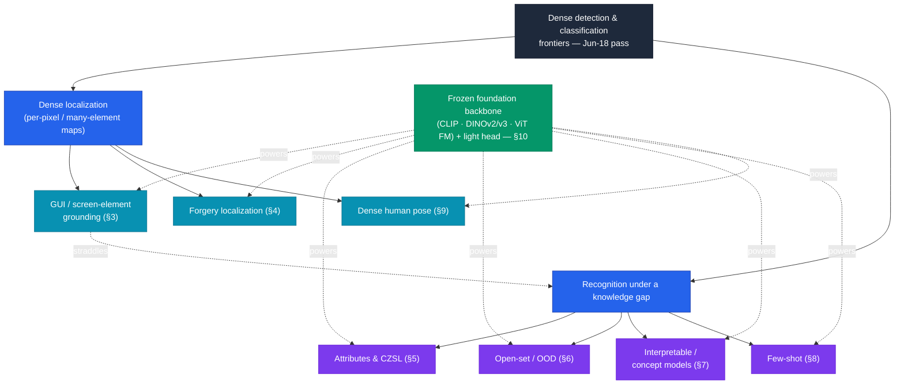
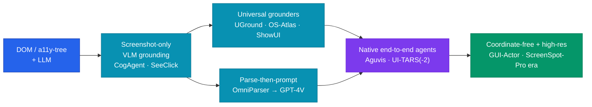
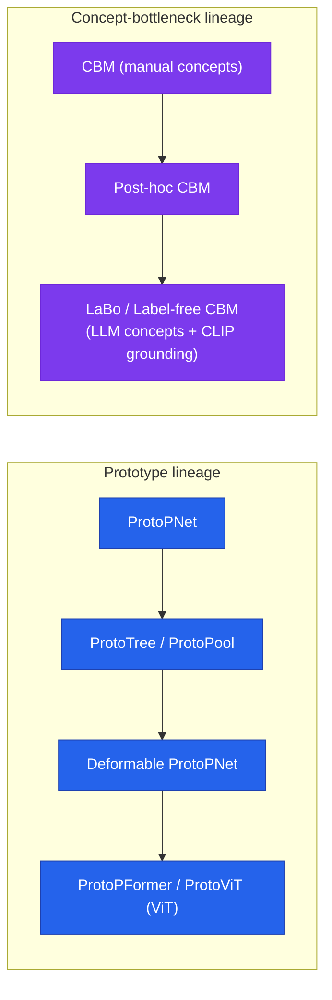
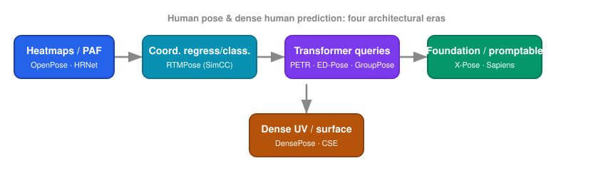

# Dense Object Detection & Classification — Recent Advances

*Compiled 2026-Jun-18 (America/Los_Angeles).*

Next installment in the running CV-updates log. Earlier entries on
`main`:
[Apr-30](../2026-Apr-30/2026-Apr-30_CV_updates.md),
[May-01](../2026-May-01/2026-May-01_CV_updates.md),
[May-02](../2026-May-02/2026-May-02_CV_updates.md),
[May-04](../2026-May-04/2026-May-04_CV_updates.md),
[May-05](../2026-May-05/2026-May-05_CV_updates.md),
[May-07](../2026-May-07/2026-May-07_CV_updates.md),
[May-08](../2026-May-08/2026-May-08_CV_updates.md),
[May-15](../2026-May-15/2026-May-15_CV_updates.md),
[May-16](../2026-May-16/2026-May-16_CV_updates.md),
[May-17](../2026-May-17/2026-May-17_CV_updates.md),
[Jun-09](../2026-Jun-09/2026-Jun-09_CV_updates.md),
[Jun-10](../2026-Jun-10/2026-Jun-10_CV_updates.md),
[Jun-12](../2026-Jun-12/2026-Jun-12_CV_updates.md),
[Jun-15](../2026-Jun-15/2026-Jun-15_CV_updates.md),
[Jun-16](../2026-Jun-16/2026-Jun-16_CV_updates.md),
[Jun-17](../2026-Jun-17/2026-Jun-17_CV_updates.md).
Across ~150 dedicated sections those passes have already worked through
the real-time detector race (YOLO/DETR/DEIM), oriented & aerial
detection, camouflaged/salient/small/infrared objects,
open-world/incremental/long-tail detection, event & spiking detectors,
industrial anomaly detection, fine-grained/hyperspectral/zero-shot
classification, 3D / BEV / multi-view detection, end-to-end MOT,
weak/point/semi-supervised learning, test-time & source-free
adaptation, distillation, diffusion detectors, referring & grounded
MLLM detection, glass / shadow / amodal / referring-segmentation, plus
multi-label, long-tailed, point-cloud and re-ID classification.

To avoid repeating that ground, today rotates to **seven threads the
series has not yet given a dedicated section** — chosen because each is
a *dense* prediction or recognition problem that has quietly become a
field of its own, and most sit on the classification half the log
tends to under-serve:

1. **GUI / screen-element detection** for computer-use agents — grounding
   thousands of tiny interactable elements on a screenshot.
2. **Image manipulation / forgery *localization*** — per-pixel masks of
   spliced / inpainted / AI-edited regions (distinct from the whole-image
   real-vs-fake forensics covered before).
3. **Visual attribute recognition & compositional zero-shot learning**
   (CZSL) — recognizing *attribute–object* compositions.
4. **Open-set recognition & out-of-distribution (OOD) detection** for
   classifiers — knowing what you don't know.
5. **Interpretable / prototype- & concept-based classification** —
   "this looks like that" and concept-bottleneck models.
6. **Few-shot image classification with foundation models** — the
   meta-learning → CLIP-adaptation pivot.
7. **Dense human pose & keypoint estimation** — heatmaps → transformer
   queries → human-vision foundation models, plus DensePose-style
   surface correspondence.

> **Scope & sourcing note.** Links below are arXiv `abs` pages, official
> repos, or publisher pages cross-checked during research. arXiv IDs were
> corroborated against paper titles across listings; where an ID could
> **not** be verified (or the work exists only as a conference
> camera-ready, e.g. ProtoNet, TesNet, PIP-Net, ManTra-Net, PETR,
> COCO-Attributes) it is cited by venue and **flagged in-line** rather
> than given a possibly-wrong link. A handful of 2025–2026 preprints
> surfaced only in secondary indexes (arXiv blocked direct fetches during
> this run); those are marked *(ID unverified)*. Benchmark numbers are
> **as-reported by the authors**, rounded, and **not comparable across
> differing backbones / splits / protocols** — treat them as orders of
> magnitude, not a leaderboard.

---

## Table of contents

1. [What's new this pass](#1-whats-new-this-pass)
2. [Topic map](#2-topic-map)
3. [GUI / screen-element detection for computer-use agents](#3-gui--screen-element-detection-for-computer-use-agents)
4. [Image manipulation / forgery localization](#4-image-manipulation--forgery-localization)
5. [Visual attribute recognition & compositional zero-shot learning](#5-visual-attribute-recognition--compositional-zero-shot-learning)
6. [Open-set recognition & OOD detection](#6-open-set-recognition--ood-detection)
7. [Interpretable / prototype- & concept-based classification](#7-interpretable--prototype--concept-based-classification)
8. [Few-shot image classification with foundation models](#8-few-shot-image-classification-with-foundation-models)
9. [Dense human pose & keypoint estimation](#9-dense-human-pose--keypoint-estimation)
10. [Cross-cutting theme: the frozen-foundation-backbone pivot](#10-cross-cutting-theme-the-frozen-foundation-backbone-pivot)
11. [Reading list](#11-reading-list)

---

## 1. What's new this pass

| Thread | One-line take |
| ------ | ------------- |
| GUI / screen-element detection | The field jumped from DOM/accessibility-tree inputs to **pure-vision screenshot grounding** (SeeClick → UGround → OS-Atlas → UI-TARS), and from "parse-then-prompt GPT-4V" pipelines to **native end-to-end agents**; the open problem is tiny targets in dense pro UIs (ScreenSpot-Pro), now attacked with high-res perception + **coordinate-free** action heads (GUI-Actor). |
| Forgery localization | CNN two-stream RGB+noise/DCT detectors (CAT-Net, MVSS-Net) gave way to ViT methods (IML-ViT, TruFor), and now **frozen self-supervised backbones (DINOv2/v3 + light head)** reportedly beat specialists; the frontier is **diffusion/AI-inpainting** regions, where classic detectors collapse and new benchmarks (TGIF, COCO-Inpaint, IMDL-BenCo) expose huge generalization gaps. |
| Attributes & CZSL | From GCN/embedding methods (CGE, Co-CGE) to **CLIP soft-prompt recomposition** (CSP, DFSP, Troika) and now going *inside* CLIP layers (CAILA, MSCI, CAMS); open-world CZSL adds **feasibility estimation** to suppress implausible unseen compositions. |
| Open-set / OOD | Logit/feature scores (Energy, ViM, KNN-OOD) → **VLM zero-shot OOD** that extends CLIP's label space with negative concepts (MCM, CLIPN, **NegLabel**); OpenOOD v1.5 standardized the **near-OOD vs far-OOD** split that keeps humbling far-OOD-strong methods. |
| Interpretable classification | "This-looks-like-that" prototype nets went **CNN → ViT** and **rigid → deformable** (ProtoPNet → Deformable ProtoPNet → ProtoViT), while concept-bottleneck models stopped needing manual concepts — **LLMs propose concepts, CLIP grounds them** (LaBo, Label-free CBM), closing most of the accuracy gap to black boxes. |
| Few-shot classification | The whole field pivoted from **episodic meta-learning** (MAML, ProtoNet) to **adapt-one-foundation-model**; Tip-Adapter's training-free key-value **cache** spawned a training-free race (SuS-X, TIMO) that matches fine-tuned methods at ~100× less cost, with **cross-modal text-as-data** the recurring trick. |
| Dense human pose | Heatmaps/PAF (HRNet, OpenPose) → coordinate classification (RTMPose) → **DETR-style query set-prediction** (PETR, ED-Pose, Group Pose) → **promptable & foundation** models (X-Pose/UniPose, Sapiens); whole-body grew from 17 to 133 keypoints, and DensePose-style surface correspondence is folding into the same backbones. |

---

## 2. Topic map

How today's seven threads relate. Two are **dense localization** problems
(predict a map / many boxes); four are **recognition under a knowledge
gap** (unseen compositions, unknown classes, few labels, human-auditable
concepts); GUI grounding straddles both. The recurring engine across all
of them is a **frozen foundation backbone** (CLIP / DINOv2-v3 / a ViT
foundation model) with a light task head — see §10.

---

## 3. GUI / screen-element detection for computer-use agents

**The task.** Given a screenshot and a natural-language instruction
("click the *Compose* button"), output the **pixel coordinates / box** of
the right interactable element. It is dense detection in the hardest
sense — a productivity screen has hundreds of near-identical icons, text
fields and menu items, and the target can be <0.1 % of the image. This
is the perceptual bottleneck for "computer-use" / GUI agents.

**Arc of the field.**

- **DOM/accessibility-tree era → pure vision.** Early agents fed HTML or
  the OS accessibility tree to an LLM. **CogAgent**
  ([2312.08914](https://arxiv.org/abs/2312.08914), 18B, dual low/high-res
  encoders at 1120×1120) and **SeeClick**
  ([2401.10935](https://arxiv.org/abs/2401.10935)) showed screenshot-only
  grounding could work; SeeClick also introduced the **ScreenSpot**
  benchmark (~1.2K instructions across mobile/desktop/web).
- **Apple's Ferret-UI** ([2404.05719](https://arxiv.org/abs/2404.05719))
  and **Ferret-UI 2**
  ([2410.18967](https://arxiv.org/abs/2410.18967)) pushed
  any-resolution, cross-platform (iPhone/Android/iPad/Web/AppleTV)
  referring + grounding.
- **Universal grounding models.** **UGround**
  ([2410.05243](https://arxiv.org/abs/2410.05243)) trained vision-only
  pixel grounding on large synthetic GUI data and reported ~20-point
  absolute gains over prior grounding; **OS-Atlas**
  ([2410.23218](https://arxiv.org/abs/2410.23218)) released the largest
  open cross-platform grounding corpus (>13M elements). **ShowUI**
  ([2411.17465](https://arxiv.org/abs/2411.17465), CVPR 2025) is a 2B
  model with UI-guided visual-token selection, ~75 % zero-shot grounding.
- **Parse-then-prompt.** **OmniParser**
  ([2408.00203](https://arxiv.org/abs/2408.00203)) converts a screenshot
  into structured interactable elements to feed GPT-4V; the later
  **OmniParser V2** (a Microsoft model release on GitHub/HF pairing a
  fine-tuned YOLOv8 icon detector with Florence-2 captioning, ~60 %
  latency cut) is a *model release*, not the similarly-named arXiv
  doc-parsing paper — don't conflate the two.
- **Native end-to-end agents.** **Aguvis**
  ([2412.04454](https://arxiv.org/abs/2412.04454)), **Aria-UI**
  ([2412.16256](https://arxiv.org/abs/2412.16256)) and **UI-TARS**
  ([2501.12326](https://arxiv.org/abs/2501.12326)) fold grounding +
  planning + acting into one screenshot-native model; **UI-TARS-2**
  ([2509.02544](https://arxiv.org/abs/2509.02544)) adds multi-turn RL with
  a data flywheel and a unified sandbox.
- **Coordinate-free grounding.** **GUI-Actor**
  ([2506.03143](https://arxiv.org/abs/2506.03143), Microsoft) drops
  text-coordinate regression: an attention-based action head aligns an
  `<ACTOR>` token to visual patches in one forward pass — a better fit for
  tiny dense targets.

**Benchmarks.** ScreenSpot (SeeClick) → **ScreenSpot-v2** (cleaned) →
**ScreenSpot-Pro** ([2504.07981](https://arxiv.org/abs/2504.07981), *ID
from listing*): 1,581 instructions across 23 professional apps, targets
averaging **0.07 %** of image area (vs ~2 % in mainstream sets). As
reported there, full-screen accuracy is brutal — OS-Atlas-7B ≈ 18.9 %,
UGround-7B ≈ 16.5 % — but a visual-search wrapper (ScreenSeekeR) lifts
OS-Atlas-7B to ~48 %. UI-TARS reports 24.6 on OSWorld and 46.6 on
AndroidWorld (as-reported). *Caution:* the 80–90 % ScreenSpot/-v2 figures
often quoted for UGround/OS-Atlas were not individually verified here.

---

## 4. Image manipulation / forgery localization

**The task.** Output a **per-pixel mask** of the tampered region —
splicing, copy-move, inpainting, or AI-edits — and ideally an integrity
score. This is the dense-prediction sibling of the whole-image
real-vs-fake forensics covered in earlier passes; here the question is
*where*, not just *whether*.

**Arc of the field.**

- **Anomaly / two-stream CNNs.** **ManTra-Net** (CVPR 2019, *conference
  version — no verified arXiv ID*) framed localization as local-anomaly
  detection over 385 manipulation types. **CAT-Net**
  ([2108.12947](https://arxiv.org/abs/2108.12947)) added a DCT stream to
  learn JPEG-compression artifacts; **MVSS-Net / MVSS-Net++**
  ([2112.08935](https://arxiv.org/abs/2112.08935)) fused boundary + noise
  views with multi-scale supervision for generalization.
- **ViT era.** **TruFor**
  ([2212.10957](https://arxiv.org/abs/2212.10957), CVPR 2023) fuses RGB
  with a learned "Noiseprint++" and emits localization + integrity +
  reliability maps. **IML-ViT**
  ([2307.14863](https://arxiv.org/abs/2307.14863)) set the plain-ViT
  recipe: high-res input, multi-scale features, explicit edge
  supervision.
- **Beyond binary masks.** **SAFIRE**
  ([2412.08197](https://arxiv.org/abs/2412.08197), AAAI 2025) makes
  localization **point-promptable** (SAM-style) and partitions an image by
  *source* rather than emitting one binary mask; **Mesorch**
  ([2412.13753](https://arxiv.org/abs/2412.13753)) "orchestrates" parallel
  CNN + Transformer branches to combine macro semantics with micro (DCT)
  cues.
- **Diffusion / AI-inpainting frontier.** **InpDiffusion**
  ([2501.02816](https://arxiv.org/abs/2501.02816), *ID from listing*)
  predicts the mask via conditional diffusion; **DinoLizer**
  ([2511.20722](https://arxiv.org/abs/2511.20722), *ID from listing*) puts
  a linear head on **DINOv2** patch embeddings for generative-inpainting
  localization, reportedly ~12 IoU points over the next best. A 2026
  preprint argues a **frozen DINOv3 ViT-L + LoRA + light decoder** beats
  specialized detectors (+17 avg pixel-F1, ~9M trainable params) — *date
  and ID unverified; treat as a signal, not a citation.*

**Benchmarks & the generalization gap.** Classic: CASIA v1/v2, NIST16,
Coverage (copy-move), Columbia, IMD2020, DEFACTO. AI-edit benchmarks:
**TGIF** ([2407.11566](https://arxiv.org/abs/2407.11566), ~75K
SD2/SDXL/Firefly forgeries), COCO-Inpaint, DiffSeg30k (*recent, IDs
unverified*), and the standardizing **IMDL-BenCo**
([2406.10580](https://arxiv.org/abs/2406.10580), NeurIPS D&B 2024).
The headline lesson: TruFor posts pixel-F1 in the ~0.88–0.95 range
*in-protocol* on classic sets, but under MVSS's strict **cross-dataset**
protocol (train CASIAv2, test elsewhere) avg pixel-F1 collapses to ~0.52
for both TruFor and IML-ViT — and on fully **regenerated** diffusion
images many classic detectors fail outright, sometimes leaning on
semantic bias rather than forensic traces. *(All numbers as-reported;
cross-protocol values are not comparable.)*

---

## 5. Visual attribute recognition & compositional zero-shot learning

**The task.** Recognize **attribute–object compositions** — *sliced
apple*, *old building*, *wet dog* — including compositions never seen in
training (CZSL). The hard variant is **open-world CZSL**: the test label
space is the full Cartesian product of states × objects, most of which
are implausible.

**Arc of the field.**

- **Graph / embedding methods.** **CGE**
  ([2102.01987](https://arxiv.org/abs/2102.01987)) modeled
  state–object–composition dependencies as an end-to-end GCN (and
  introduced **C-GQA**); **CompCos**
  ([2101.12609](https://arxiv.org/abs/2101.12609)) defined open-world CZSL
  with **feasibility scoring**; **Co-CGE**
  ([2105.01017](https://arxiv.org/abs/2105.01017)) folded feasibility into
  graph weights; **SCEN**
  ([2206.14475](https://arxiv.org/abs/2206.14475)) used Siamese
  contrastive prototypes + a state-transition synthesizer.
- **CLIP soft-prompt recomposition.** **CSP**
  ([2204.03574](https://arxiv.org/abs/2204.03574), ICLR 2023) was the
  first CLIP-based CZSL — attributes/objects become learnable vocabulary
  tokens recomposed at test time. **DFSP**
  ([2211.10681](https://arxiv.org/abs/2211.10681)) decomposed soft prompts
  with cross-modal fusion; **Troika**
  ([2303.15230](https://arxiv.org/abs/2303.15230), CVPR 2024) ran three
  parallel state/object/composition branches with a cross-modal traction
  module.
- **LLM-informed & inside-CLIP.** **PLID**
  ([2305.14428](https://arxiv.org/abs/2305.14428)) uses LLM-derived class
  distributions; **CAILA**
  ([2305.16681](https://arxiv.org/abs/2305.16681)) and **GIPCOL**
  ([2311.05729](https://arxiv.org/abs/2311.05729)) insert
  concept-aware / graph-structured adapters *inside* CLIP encoder layers.
  **MSCI** ([2505.10289](https://arxiv.org/abs/2505.10289), IJCAI 2025)
  aggregates CLIP intermediate-layer features; **CAMS**
  ([2511.16378](https://arxiv.org/abs/2511.16378), Nov 2025) adds gated
  cross-attention + multi-space disentanglement, claiming closed- and
  open-world SOTA.

**Attribute datasets / benchmarks.** Broad attribute recognition:
**VAW** ([2106.09707](https://arxiv.org/abs/2106.09707), ~927K pos/neg
annotations, 620 attributes, long-tailed multi-label) and
**OVAD** open-vocabulary attribute detection
([2211.12914](https://arxiv.org/abs/2211.12914), 117 attributes over
COCO objects, ~1.4M annotations); **COCO-Attributes** (ECCV 2016, *no
verified arXiv*). CZSL benchmarks: **MIT-States**, **UT-Zappos50K**,
**C-GQA**, evaluated by **AUC** over the seen–unseen operating curve
(plus best-Seen / best-Unseen / Harmonic-Mean). *Absolute per-method AUC
tables could not be re-verified this run;* the field context is roughly
UT-Zappos ~35–45 AUC, MIT-States ~18–22, C-GQA single-digits to low
teens (closed-world), with open-world far lower — so treat individual
numbers cautiously.

**Trends.** (1) Graph/embedding → CLIP prompt-based since CSP. (2)
Black-box CLIP prompting → cross-modal decomposition → going *inside*
CLIP layers / intermediate features. (3) Explicit state-vs-object
**disentanglement**, open-world **feasibility estimation**, and growing
use of **LLM-derived semantics**.

---

## 6. Open-set recognition & OOD detection

**The task.** A deployed classifier will meet inputs from classes it was
never trained on. **Open-set recognition (OSR)** asks it to classify
knowns *and* reject unknowns; **OOD detection** is the closely-related
score-and-threshold framing. Both are prerequisites for trustworthy dense
recognition.

**Arc of the field.**

- **Calibration & scores.** **OpenMax**
  ([1511.06233](https://arxiv.org/abs/1511.06233), CVPR 2016) replaced
  softmax with an EVT-calibrated unknown estimate. **Energy-based OOD**
  ([2010.03759](https://arxiv.org/abs/2010.03759)) used free energy
  (logsumexp of logits) as a less-overconfident score. **ARPL**
  ([2103.00953](https://arxiv.org/abs/2103.00953)) learned per-class
  reciprocal points to bound open-space risk. **MOS**
  ([2105.01879](https://arxiv.org/abs/2105.01879)) grouped a large label
  space with per-group "others" classes for ImageNet-scale OOD.
- **Feature-space methods.** **ViM**
  ([2203.10807](https://arxiv.org/abs/2203.10807)) adds a *virtual logit*
  from the feature residual to the principal subspace (and contributed
  OpenImage-O); **KNN-OOD**
  ([2204.06507](https://arxiv.org/abs/2204.06507)) is non-parametric
  nearest-neighbor distance with no distributional assumption; **NPOS**
  ([2303.02966](https://arxiv.org/abs/2303.02966)) synthesizes outliers
  near low-likelihood ID embeddings without a Gaussian assumption.
- **VLM zero-shot OOD.** **MCM**
  ([2211.13445](https://arxiv.org/abs/2211.13445), NeurIPS 2022) scores
  the softmax-scaled max cosine similarity between a CLIP image embedding
  and ID *text* concepts. **ZOC**
  ([2109.02748](https://arxiv.org/abs/2109.02748)) generates candidate
  unknown class names; **CLIPN**
  ([2308.12213](https://arxiv.org/abs/2308.12213)) adds a learnable "no"
  prompt + negation encoder; **NegLabel**
  ([2403.20078](https://arxiv.org/abs/2403.20078), ICLR 2024 Spotlight)
  mines a large lexicon of **negative labels** to extend CLIP's scoring
  space.

**Benchmarks.** **OpenOOD v1.5**
([2306.09301](https://arxiv.org/abs/2306.09301)) unified the field: ID =
CIFAR-10/100, ImageNet-200/1K; AUROC / AUPR / FPR95, split into
**near-OOD** (semantically close) vs **far-OOD**, and extended to
foundation models (CLIP, DINOv2) and full-spectrum (semantic + covariate)
shift. The persistent finding: methods strong on far-OOD often falter on
near-OOD. As-reported anchors: NegLabel ~94.2 % AUROC / ~25.4 % FPR95
zero-shot on ImageNet-1K; ViM ~90.9 % avg AUROC (BiT-S) on four hard
sets; MOS ~14 % FPR95 reduction at ~6× speedup. *(As-reported, not
recomputed.)*

**Trends.** (1) Vision-only logit/feature scores → **VLM text-encoder**
methods (ID-name concepts, negation prompts, negative-label spaces). (2)
Standardization on **near- vs far-OOD** via OpenOOD/v1.5. (3) **Outlier
synthesis / open-space modeling without distributional assumptions**.

---

## 7. Interpretable / prototype- & concept-based classification

**The task.** Build classifiers that are **inherently interpretable** —
the decision is *constituted* by human-legible evidence, not explained
after the fact. Two lineages dominate.

**Prototype ("this looks like that").**

- **ProtoPNet** ([1806.10574](https://arxiv.org/abs/1806.10574), NeurIPS
  2019) dissects an image into prototypical parts and sums their evidence.
  **ProtoTree** ([2012.02046](https://arxiv.org/abs/2012.02046)) puts
  prototypes in a soft decision tree for a traceable path; **ProtoPool**
  ([2112.02902](https://arxiv.org/abs/2112.02902)) shares a differentiable
  prototype pool across classes.
- **Deformable ProtoPNet**
  ([2111.15000](https://arxiv.org/abs/2111.15000)) lets prototypes shift
  spatially for pose/context; **ProtoPFormer**
  ([2208.10431](https://arxiv.org/abs/2208.10431)) adapts prototypes to
  ViT backbones (global + local branches to fight ViT background
  distraction); **ProtoViT**
  ([2410.20722](https://arxiv.org/abs/2410.20722)) adds deformable,
  adaptive-count prototypes via greedy matching. **TesNet** (ICCV 2021,
  *no verified arXiv*) builds an orthogonal basis-concept embedding;
  **PIP-Net** (CVPR 2023, *no verified arXiv*) learns prototypes
  self-supervised for a sparse additive scoring sheet.

**Concept-bottleneck models (CBM).**

- **CBM** ([2007.04612](https://arxiv.org/abs/2007.04612), ICML 2020)
  predicts human-specified concepts first, then the label — enabling
  **test-time concept intervention** (but needing concept labels).
  **Post-hoc CBM** ([2205.15480](https://arxiv.org/abs/2205.15480))
  converts any trained net into a CBM via concept-activation vectors.
- The 2023 leap removed manual concepts: **LaBo**
  ([2211.11158](https://arxiv.org/abs/2211.11158)) has GPT-3 propose
  candidate concept sentences, submodular selection build a
  discriminative bottleneck, and CLIP ground them — the first CBM matching
  black-box accuracy without hand-annotated concepts. **Label-free CBM**
  ([2304.06129](https://arxiv.org/abs/2304.06129)) does the same with
  CLIP-Dissect filtering and no labeled concept data.

**Benchmarks (as-reported, backbone-dependent — verify before citing).**
CUB-200-2011 is the workhorse, plus Stanford Cars / ImageNet (CBMs also
use CIFAR/Places365). On CUB, ResNet50/iNat-pretrained: ProtoPNet ~84.8 %,
TesNet ~86.2 %, ProtoPool ~85.5 %, **Deformable ProtoPNet ~86.1–86.4 %**
(single model, beating ProtoTree and 3-model TesNet ensembles); ProtoViT
claims SOTA among prototype methods. LaBo reports ~+11.7 % over black-box
linear probes at 1-shot across 11 datasets, narrowing with more data.

**Trends.** (1) CNN→ViT backbones and rigid→deformable prototypes. (2)
**LLMs propose concepts, VLMs ground them**, removing the annotation
bottleneck that long capped CBMs. (3) A shift from accuracy-only to
**faithfulness / coherence** evaluation (PIP-Net, ProtoPNeXt-style
meta-benchmarks).

---

## 8. Few-shot image classification with foundation models

**The task.** Learn a new class from a handful (1–16) of labeled
examples. The field's center of gravity moved decisively from
**learning-to-learn** to **adapting one strong foundation model**.

**Meta-learning era (episodic; miniImageNet/tieredImageNet).**
**MAML** ([1703.03400](https://arxiv.org/abs/1703.03400)) learns an
initialization that adapts in a few gradient steps; **Prototypical
Networks** (NeurIPS 2017, *no verified arXiv*) classify by nearest
class-mean embedding; **Meta-Baseline**
([2003.04390](https://arxiv.org/abs/2003.04390)) showed plain
whole-classification pretraining + light meta fine-tuning is a strong
baseline. Reference numbers (miniImageNet 5-way, ConvNet-4/ResNet-12):
ProtoNet 49.4 / 68.2 %, Meta-Baseline 63.2 / 79.3 %.

**Foundation-model adaptation era (the 11-dataset CLIP suite).**

- **Prompt tuning.** **CoOp**
  ([2109.01134](https://arxiv.org/abs/2109.01134)) replaces hand-crafted
  CLIP prompts with learnable context vectors; **CoCoOp**
  ([2203.05557](https://arxiv.org/abs/2203.05557)) makes them
  input-conditional to fix base-class overfitting; **PLOT**
  ([2210.01253](https://arxiv.org/abs/2210.01253)) aligns multiple prompts
  to feature maps via optimal transport.
- **Adapters & caches.** **CLIP-Adapter**
  ([2110.04544](https://arxiv.org/abs/2110.04544)) adds a residual MLP on
  frozen features; **Tip-Adapter**
  ([2111.03930](https://arxiv.org/abs/2111.03930) / ECCV
  [2207.09519](https://arxiv.org/abs/2207.09519)) builds a *training-free*
  key-value cache from the few-shot features (Tip-Adapter-F fine-tunes it
  in ~20 epochs vs CoOp's ~200).
- **Training-free / cross-modal.** **SuS-X / TIP-X**
  ([2211.16198](https://arxiv.org/abs/2211.16198)) is name-only transfer —
  build a support set by LAION retrieval or Stable-Diffusion generation,
  no labeled shots. **Cross-modal linear probing**
  ([2301.06267](https://arxiv.org/abs/2301.06267)) treats one-shot *text*
  as extra training samples; **TIMO**
  ([2412.11375](https://arxiv.org/abs/2412.11375), AAAI 2025) uses mutual
  image↔text guidance, with training-free TIMO beating prior training-free
  SOTA and TIMO-S beating training-required methods at ~100× less cost.
  (See also **Meta-Dataset**,
  [1903.03096](https://arxiv.org/abs/1903.03096), for cross-domain
  evaluation.)

**Benchmark anchors (as-reported).** ImageNet 16-shot, ResNet-50:
linear-probe CLIP 56.1 %, Tip-Adapter (training-free) 62.0 %, CoOp
63.0 %, **Tip-Adapter-F 65.5 %** — i.e. a training-free cache nearly
matches prompt tuning, and a lightly-tuned cache exceeds it at a fraction
of the cost.

**Trends.** (1) Episodic meta-learning → **pretrain-then-adapt**. (2) The
**training-free cache** push (Tip-Adapter → SuS-X → TIMO). (3)
**Cross-modal text-as-data** as free supervision.

---

## 9. Dense human pose & keypoint estimation

**The task.** Localize body keypoints (and, in the dense variant, map
*every* person-pixel to a 3D body surface). Two intertwined lineages —
sparse keypoints and dense surface correspondence — are converging onto
shared backbones.

**Sparse keypoints: heatmaps → queries → foundation.**

- **Heatmap / PAF.** **OpenPose**
  ([1812.08008](https://arxiv.org/abs/1812.08008)) did real-time
  bottom-up multi-person pose via Part Affinity Fields; **HRNet**
  ([1902.09212](https://arxiv.org/abs/1902.09212)) kept high-resolution
  representations throughout and was the long-standing top-down baseline.
- **Plain-ViT & coordinate classification.** **ViTPose / ViTPose++**
  ([2204.12484](https://arxiv.org/abs/2204.12484) /
  [2212.04246](https://arxiv.org/abs/2212.04246)) showed a plain ViT + a
  light decoder scales to ~1B params (ViTPose-G ~81 AP on COCO test-dev);
  **RTMPose** ([2303.07399](https://arxiv.org/abs/2303.07399)) used
  SimCC-style coordinate classification for real-time deployment.
- **End-to-end transformer set-prediction.** **PETR** (CVPR 2022, *no
  verified arXiv ID*) was the first fully end-to-end DETR-based pose
  framework; **ED-Pose**
  ([2302.01593](https://arxiv.org/abs/2302.01593)) recast it as explicit
  human + keypoint box detection (reporting ~76.6 AP on the occlusion-heavy
  **CrowdPose**, +9.9 AP from explicit boxes); **Group Pose**
  ([2308.07313](https://arxiv.org/abs/2308.07313)) is a clean
  query-only DETR baseline that exceeds ED-Pose.
- **Whole-body & foundation.** **DWPose**
  ([2307.15880](https://arxiv.org/abs/2307.15880)) distills whole-body
  pose (lifting RTMPose-l from 64.8 → 66.5 AP on **COCO-WholeBody**'s 133
  keypoints); **RTMW**
  ([2407.08634](https://arxiv.org/abs/2407.08634)) extends to real-time
  2D/3D whole-body. **X-Pose / UniPose**
  ([2310.08530](https://arxiv.org/abs/2310.08530)) makes keypoint
  detection text/visual-**promptable** ("detect any keypoint", UniKPT
  unifying 13 datasets); **Sapiens**
  ([2408.12569](https://arxiv.org/abs/2408.12569), Meta, ECCV 2024 oral)
  is a human-vision **foundation model** (0.3–2B params, pretrained on
  ~300M human images, native-1K inference) covering pose alongside
  part-segmentation, depth and normals.

**Dense surface correspondence.** **DensePose**
([1802.00434](https://arxiv.org/abs/1802.00434)) regresses every
person-pixel to a body-surface UV (DensePose-RCNN + the DensePose-COCO
dataset); **Continuous Surface Embeddings**
([2011.12438](https://arxiv.org/abs/2011.12438)) replaced the fixed UV
parameterization with learned per-pixel embeddings matched to mesh
vertices, generalizing across categories (incl. animals). These
dense-prediction heads increasingly ride the same ViT-foundation
backbones (Sapiens) as sparse keypoints.

*A few 2025–2026 items (e.g. DETRPose, temporally-consistent dense
human prediction) appeared in search but had unverified IDs and are
omitted from firm citation.*

**Trends.** (1) Heatmap → coordinate regression/classification →
**transformer query set-prediction** (drops NMS, RoI crop, grouping). (2)
Plain-ViT backbones and **scaling**. (3) Toward **promptable / unified
human-vision foundation models** spanning sparse keypoints and dense
surface correspondence; whole-body grew 17 → 133 keypoints.

---

## 10. Cross-cutting theme: the frozen-foundation-backbone pivot

The single thread linking all seven sections is that the **task-specific
architecture is increasingly a thin head on a frozen foundation
backbone** — and the interesting engineering moved from the backbone to
*how you query and adapt it*:

| Thread | Foundation backbone | The thin head / adaptation |
| ------ | ------------------- | -------------------------- |
| GUI grounding (§3) | LVLM / ViT screenshot encoder | coordinate-free attention head, RL post-training |
| Forgery localization (§4) | DINOv2 / DINOv3 (frozen) | LoRA + light decoder, linear patch head |
| Attributes & CZSL (§5) | CLIP | soft-prompt recomposition, in-layer adapters |
| Open-set / OOD (§6) | CLIP | negative-label / negation text scoring |
| Interpretable (§7) | CLIP + LLM | concept proposal (LLM) + grounding (CLIP) |
| Few-shot (§8) | CLIP | training-free KV cache, prompt tuning |
| Dense pose (§9) | ViT FM (Sapiens) | light decoder; promptable keypoint queries |

Three consequences recur across the literature above:

1. **Training-free or near-free adaptation** is now competitive with full
   fine-tuning (Tip-Adapter, NegLabel, DINO-linear forgery heads) — the
   cost frontier collapsed.
2. **Text is data.** CLIP's shared space lets language supply class
   semantics (CZSL prompts), rejection concepts (OOD negative labels),
   interpretable concepts (CBMs) and even extra training samples
   (cross-modal few-shot).
3. **Generalization is the real metric.** Every thread has a benchmark
   designed to break in-domain winners — ScreenSpot-Pro's 0.07 %-area
   targets, IMDL-BenCo / TGIF's regenerated images, OpenOOD's near-OOD
   split, open-world CZSL's full product space. In-protocol numbers look
   solved; the honest numbers are the cross-domain ones.

---

## 11. Reading list

Verified arXiv IDs unless flagged. Grouped by section.

**GUI / screen-element grounding (§3)**
- CogAgent — [2312.08914](https://arxiv.org/abs/2312.08914)
- SeeClick (+ ScreenSpot) — [2401.10935](https://arxiv.org/abs/2401.10935)
- Ferret-UI / Ferret-UI 2 — [2404.05719](https://arxiv.org/abs/2404.05719) / [2410.18967](https://arxiv.org/abs/2410.18967)
- UGround — [2410.05243](https://arxiv.org/abs/2410.05243); OS-Atlas — [2410.23218](https://arxiv.org/abs/2410.23218); ShowUI — [2411.17465](https://arxiv.org/abs/2411.17465)
- OmniParser — [2408.00203](https://arxiv.org/abs/2408.00203) (OmniParser V2 = a GitHub/HF model release, *not* the doc-parsing arXiv paper)
- Aguvis — [2412.04454](https://arxiv.org/abs/2412.04454); Aria-UI — [2412.16256](https://arxiv.org/abs/2412.16256)
- UI-TARS — [2501.12326](https://arxiv.org/abs/2501.12326); UI-TARS-2 — [2509.02544](https://arxiv.org/abs/2509.02544)
- GUI-Actor — [2506.03143](https://arxiv.org/abs/2506.03143); ScreenSpot-Pro — [2504.07981](https://arxiv.org/abs/2504.07981) *(ID from listing)*

**Forgery localization (§4)**
- ManTra-Net — CVPR 2019 *(no verified arXiv)*; CAT-Net — [2108.12947](https://arxiv.org/abs/2108.12947); MVSS-Net++ — [2112.08935](https://arxiv.org/abs/2112.08935)
- TruFor — [2212.10957](https://arxiv.org/abs/2212.10957); IML-ViT — [2307.14863](https://arxiv.org/abs/2307.14863)
- SAFIRE — [2412.08197](https://arxiv.org/abs/2412.08197); Mesorch — [2412.13753](https://arxiv.org/abs/2412.13753)
- TGIF — [2407.11566](https://arxiv.org/abs/2407.11566); IMDL-BenCo — [2406.10580](https://arxiv.org/abs/2406.10580)
- InpDiffusion — [2501.02816](https://arxiv.org/abs/2501.02816) *(ID from listing)*; DinoLizer — [2511.20722](https://arxiv.org/abs/2511.20722) *(ID from listing)*

**Attributes & CZSL (§5)**
- CGE — [2102.01987](https://arxiv.org/abs/2102.01987); CompCos — [2101.12609](https://arxiv.org/abs/2101.12609); Co-CGE — [2105.01017](https://arxiv.org/abs/2105.01017); SCEN — [2206.14475](https://arxiv.org/abs/2206.14475)
- CSP — [2204.03574](https://arxiv.org/abs/2204.03574); DFSP — [2211.10681](https://arxiv.org/abs/2211.10681); Troika — [2303.15230](https://arxiv.org/abs/2303.15230)
- PLID — [2305.14428](https://arxiv.org/abs/2305.14428); CAILA — [2305.16681](https://arxiv.org/abs/2305.16681); GIPCOL — [2311.05729](https://arxiv.org/abs/2311.05729)
- MSCI — [2505.10289](https://arxiv.org/abs/2505.10289); CAMS — [2511.16378](https://arxiv.org/abs/2511.16378)
- VAW — [2106.09707](https://arxiv.org/abs/2106.09707); OVAD — [2211.12914](https://arxiv.org/abs/2211.12914)

**Open-set / OOD (§6)**
- OpenMax — [1511.06233](https://arxiv.org/abs/1511.06233); Energy-OOD — [2010.03759](https://arxiv.org/abs/2010.03759); ARPL — [2103.00953](https://arxiv.org/abs/2103.00953); MOS — [2105.01879](https://arxiv.org/abs/2105.01879)
- ViM — [2203.10807](https://arxiv.org/abs/2203.10807); KNN-OOD — [2204.06507](https://arxiv.org/abs/2204.06507); NPOS — [2303.02966](https://arxiv.org/abs/2303.02966)
- MCM — [2211.13445](https://arxiv.org/abs/2211.13445); ZOC — [2109.02748](https://arxiv.org/abs/2109.02748); CLIPN — [2308.12213](https://arxiv.org/abs/2308.12213); NegLabel — [2403.20078](https://arxiv.org/abs/2403.20078)
- OpenOOD v1.5 — [2306.09301](https://arxiv.org/abs/2306.09301)

**Interpretable classification (§7)**
- ProtoPNet — [1806.10574](https://arxiv.org/abs/1806.10574); ProtoTree — [2012.02046](https://arxiv.org/abs/2012.02046); ProtoPool — [2112.02902](https://arxiv.org/abs/2112.02902)
- Deformable ProtoPNet — [2111.15000](https://arxiv.org/abs/2111.15000); ProtoPFormer — [2208.10431](https://arxiv.org/abs/2208.10431); ProtoViT — [2410.20722](https://arxiv.org/abs/2410.20722)
- TesNet (ICCV 2021) & PIP-Net (CVPR 2023) — *no verified arXiv*
- CBM — [2007.04612](https://arxiv.org/abs/2007.04612); Post-hoc CBM — [2205.15480](https://arxiv.org/abs/2205.15480); LaBo — [2211.11158](https://arxiv.org/abs/2211.11158); Label-free CBM — [2304.06129](https://arxiv.org/abs/2304.06129)

**Few-shot classification (§8)**
- MAML — [1703.03400](https://arxiv.org/abs/1703.03400); ProtoNet — *NeurIPS 2017, no verified arXiv*; Meta-Baseline — [2003.04390](https://arxiv.org/abs/2003.04390); Meta-Dataset — [1903.03096](https://arxiv.org/abs/1903.03096)
- CoOp — [2109.01134](https://arxiv.org/abs/2109.01134); CoCoOp — [2203.05557](https://arxiv.org/abs/2203.05557); PLOT — [2210.01253](https://arxiv.org/abs/2210.01253)
- CLIP-Adapter — [2110.04544](https://arxiv.org/abs/2110.04544); Tip-Adapter — [2111.03930](https://arxiv.org/abs/2111.03930) / [2207.09519](https://arxiv.org/abs/2207.09519)
- SuS-X / TIP-X — [2211.16198](https://arxiv.org/abs/2211.16198); Cross-modal linear probing — [2301.06267](https://arxiv.org/abs/2301.06267); TIMO — [2412.11375](https://arxiv.org/abs/2412.11375)

**Dense human pose (§9)**
- OpenPose — [1812.08008](https://arxiv.org/abs/1812.08008); HRNet — [1902.09212](https://arxiv.org/abs/1902.09212)
- ViTPose — [2204.12484](https://arxiv.org/abs/2204.12484); ViTPose++ — [2212.04246](https://arxiv.org/abs/2212.04246); RTMPose — [2303.07399](https://arxiv.org/abs/2303.07399)
- PETR — *CVPR 2022, no verified arXiv*; ED-Pose — [2302.01593](https://arxiv.org/abs/2302.01593); Group Pose — [2308.07313](https://arxiv.org/abs/2308.07313)
- DWPose — [2307.15880](https://arxiv.org/abs/2307.15880); RTMW — [2407.08634](https://arxiv.org/abs/2407.08634); X-Pose/UniPose — [2310.08530](https://arxiv.org/abs/2310.08530); Sapiens — [2408.12569](https://arxiv.org/abs/2408.12569)
- DensePose — [1802.00434](https://arxiv.org/abs/1802.00434); Continuous Surface Embeddings — [2011.12438](https://arxiv.org/abs/2011.12438)

---

*Compiled by an automated CV-updates routine. Numbers are as-reported by
the cited authors and rounded; arXiv IDs flagged "unverified" / "ID from
listing" / "no verified arXiv" should be confirmed against the source
before citation. Corrections welcome via PR.*
