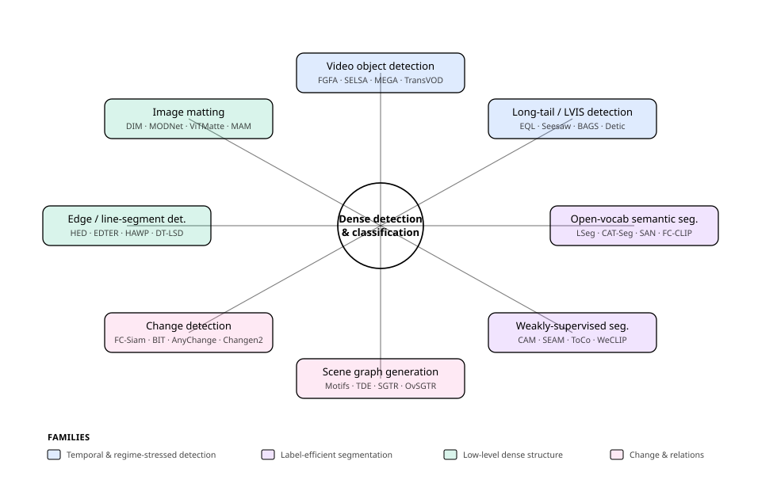
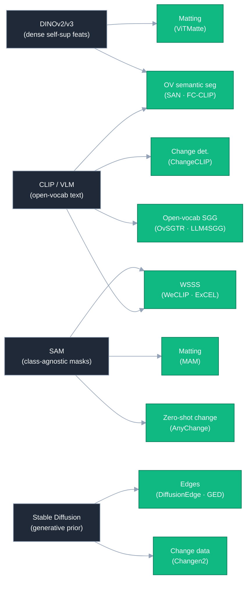

# Dense Object Detection & Classification — Recent Advances

*Compiled 2026-Jun-19 (America/Los_Angeles).*

Next installment in the running CV-updates log. Earlier entries on
`main` / this branch:
[Apr-30](../2026-Apr-30/2026-Apr-30_CV_updates.md),
[May-01](../2026-May-01/2026-May-01_CV_updates.md),
[May-02](../2026-May-02/2026-May-02_CV_updates.md),
[May-04](../2026-May-04/2026-May-04_CV_updates.md),
[May-05](../2026-May-05/2026-May-05_CV_updates.md),
[May-07](../2026-May-07/2026-May-07_CV_updates.md),
[May-08](../2026-May-08/2026-May-08_CV_updates.md),
[May-15](../2026-May-15/2026-May-15_CV_updates.md),
[May-16](../2026-May-16/2026-May-16_CV_updates.md),
[May-17](../2026-May-17/2026-May-17_CV_updates.md),
[Jun-09](../2026-Jun-09/2026-Jun-09_CV_updates.md),
[Jun-10](../2026-Jun-10/2026-Jun-10_CV_updates.md),
[Jun-12](../2026-Jun-12/2026-Jun-12_CV_updates.md),
[Jun-15](../2026-Jun-15/2026-Jun-15_CV_updates.md),
[Jun-16](../2026-Jun-16/2026-Jun-16_CV_updates.md),
[Jun-17](../2026-Jun-17/2026-Jun-17_CV_updates.md).
Across ~150 dedicated sections those passes have worked through the
real-time detector race (YOLO/DETR/DEIM), oriented & aerial detection,
camouflaged/salient/glass/shadow/small/infrared objects, open-world,
incremental and long-tailed *recognition*, amodal & referring
segmentation, event/spiking detectors, industrial anomaly, fine-grained
/ hyperspectral / multi-label classification, 3D / BEV / point-cloud,
end-to-end MOT, weak/point/semi supervision, test-time & source-free
adaptation, distillation, diffusion detectors, grounded MLLM detection,
GUI grounding, forgery localization, compositional zero-shot,
open-set/OOD, prototype/concept interpretability, few-shot classifiers,
and dense pose.

To avoid repeating that ground, today rotates to **eight threads the
series has not yet given a dedicated section** — the
*dense-prediction periphery* of object detection: tasks that still
output boxes/masks/pixels/graphs but sit just outside the COCO-box
mainstream, plus the two detection *regimes* (temporal video, and the
long tail of a 1200-class vocabulary) that most resist the
foundation-model pivot. Concretely: **video object detection**,
**long-tailed / large-vocabulary (LVIS) detection**, **open-vocabulary
semantic segmentation**, **weakly-supervised semantic segmentation**,
**bi-temporal change detection**, **image matting**, **edge &
line-segment / wireframe detection**, and **scene graph generation**.

> Scope note. Links below are arXiv `abs` pages, official GitHub repos,
> or publisher pages (CVF / IEEE / NeurIPS / AAAI / IJCAI / ECVA)
> cross-checked during research — each arXiv ID was corroborated against
> the paper title across multiple listings. Several influential papers
> (e.g. **HAttMatting**, **MuGE**, **VS3**, **CTI**, **POT**, classic
> **LSD**) have **no standalone arXiv preprint** or only a
> conference/journal camera-ready; those are flagged in-line and cited
> via their proceedings page. A handful of 2026 preprints surfaced with
> `2602/2603/2604.xxxxx` IDs whose title↔ID mapping could not be
> independently confirmed (arXiv served HTTP 403 to automated fetches
> throughout); per the series' practice these are **omitted rather than
> risk an invented citation**, with the trend noted in prose. Benchmark
> numbers are **as-reported by the authors and rounded**; backbones,
> training data (e.g. `+VOC`/`MS` for edges, backbone choice for SGG)
> and eval protocols differ, so cross-row figures are **not a
> leaderboard**. A parallel unmerged routine PR covers a *2026-Jun-18*
> pass (GUI grounding, forgery localization, CZSL, open-set/OOD,
> interpretable & few-shot classification, dense pose); today's threads
> were chosen to be disjoint from it as well.

---

## Table of contents

1. [What's new this pass](#1-whats-new-this-pass)
2. [Topic map](#2-topic-map)
3. [Video object detection](#3-video-object-detection)
4. [Long-tailed / large-vocabulary detection (LVIS)](#4-long-tailed--large-vocabulary-detection-lvis)
5. [Open-vocabulary semantic segmentation](#5-open-vocabulary-semantic-segmentation)
6. [Weakly-supervised semantic segmentation](#6-weakly-supervised-semantic-segmentation)
7. [Change detection](#7-change-detection)
8. [Image matting](#8-image-matting)
9. [Edge & line-segment / wireframe detection](#9-edge--line-segment--wireframe-detection)
10. [Scene graph generation](#10-scene-graph-generation)
11. [Cross-cutting theme: the same four foundation models, everywhere](#11-cross-cutting-theme-the-same-four-foundation-models-everywhere)
12. [Reading list](#12-reading-list)

---

## 1. What's new this pass

| Thread | One-line take |
| --- | --- |
| Video object detection | Per-frame detection + **temporal feature aggregation**: optical-flow warping (**FGFA**) → full-sequence semantic aggregation (**SELSA**) → global+local memory (**MEGA**) → DETR-in-time (**TransVOD**, **PTSEFormer** ~88% mAP on ImageNet VID). |
| Long-tail / LVIS detection | Distinct from long-tailed *recognition*: rebalance the **gradient** (**EQL/EQLv2/EFL**, **Seesaw**), **group/decouple** the classifier (**BAGS**, calibration), or sidestep it with image-level supervision (**Detic** closes the rare-class gap); 2024-25 finds the **box-regression** head is biased too. |
| Open-vocab semantic seg | Per-pixel CLIP transfer: free dense labels (**MaskCLIP**) → mask-then-classify with mask-adapted CLIP (**OVSeg**) → cost-volume aggregation (**CAT-Seg**), frozen-CLIP side adapters (**SAN**), encoder-side dense (**SED**), unified panoptic (**FC-CLIP**). |
| Weakly-supervised seg | Image-level labels only: **CAM** → affinity/boundary expansion (**SEAM, IRN, AdvCAM**) → ViT attention & single-stage (**AFA, MCTformer, ToCo**) → frozen-CLIP backbones (**WeCLIP**, **ExCEL**), pushing VOC from ~64 to ~78 mIoU. |
| Change detection | Bi-temporal per-pixel change: Siamese FCNs (**FC-Siam**) → attention & transformers (**STANet, BIT, ChangeFormer**) → generative & **zero-shot SAM-based** foundation models (**Segment Any Change**, **Changen2**, **ChangeCLIP**). |
| Image matting | Dense alpha: trimap CNNs (**DIM, IndexNet, GCA**) → trimap-free portrait/auto (**MODNet, P3M, AIM**) → ViT (**MatteFormer, ViTMatte**) → SAM-promptable class-agnostic (**Matting Anything**) and recurrent video (**RVM**). |
| Edge & line detection | Classic dense structure, now FM-touched: **HED→RCF→BDCN→PiDiNet**, transformer **EDTER**, **uncertainty/multi-granularity** (UAED/MuGE) and **diffusion** (DiffusionEdge); lines/wireframes **L-CNN→HAWP→LETR→DT-LSD**. |
| Scene graph generation | Objects **+ relations**: context models (**IMP, Motifs, VCTree**) → the **unbiased / long-tailed-predicate** line (**TDE, BGNN, IETrans, NICE**) → one-stage DETR SGG (**RelTR, SGTR**), panoptic (**PSG**), and **open-vocab / VLM** SGG (**OvSGTR, PGSG, LLM4SGG**). |

---

## 2. Topic map

A standalone SVG topic map (light/dark-safe via `currentColor`):

A Mermaid version of the same lattice:

```mermaid
%%{init: {"theme":"base","themeVariables":{
  "primaryColor":"#3b82f6","primaryTextColor":"#ffffff",
  "primaryBorderColor":"#1d4ed8","lineColor":"#94a3b8",
  "secondaryColor":"#a855f7","tertiaryColor":"#10b981",
  "fontSize":"13px"}}}%%
flowchart TB
  classDef det fill:#3b82f6,stroke:#1d4ed8,color:#f8fafc;
  classDef seg fill:#a855f7,stroke:#7e22ce,color:#f8fafc;
  classDef low fill:#10b981,stroke:#047857,color:#f8fafc;
  classDef rel fill:#f472b6,stroke:#be185d,color:#1f2937;
  classDef hub fill:#1f2937,stroke:#94a3b8,color:#f8fafc;

  H["Dense detection<br/>& classification"]:::hub

  VID["Video object detection<br/>(FGFA · SELSA · TransVOD)"]:::det
  LVIS["Long-tail / LVIS det.<br/>(EQL · Seesaw · Detic)"]:::det

  OVS["Open-vocab semantic seg.<br/>(MaskCLIP · CAT-Seg · FC-CLIP)"]:::seg
  WSS["Weakly-supervised seg.<br/>(CAM · ToCo · WeCLIP)"]:::seg

  MAT["Image matting<br/>(DIM · ViTMatte · MAM)"]:::low
  EDG["Edge / line det.<br/>(HED · EDTER · DT-LSD)"]:::low

  CHG["Change detection<br/>(BIT · AnyChange · Changen2)"]:::rel
  SGG["Scene graph generation<br/>(Motifs · TDE · OvSGTR)"]:::rel

  H --> VID
  H --> LVIS
  H --> OVS
  H --> WSS
  H --> MAT
  H --> EDG
  H --> CHG
  H --> SGG
```

Four families organize the eight threads: **temporal & regime-stressed
detection** (video; the LVIS long tail); **label-efficient
segmentation** (open-vocabulary; image-level-weak); **low-level dense
structure** (matting; edges & lines); and **change & relations**
(bi-temporal change; relational scene graphs). One trend cuts across all
of them — see §11.

---

## 3. Video object detection

Video object detection (VID) is per-frame object detection that
*aggregates features across time* to fix what single-image detectors
get wrong on video — motion blur, defocus, rare poses, partial
occlusion. It is **not** multi-object tracking (no identities; covered
[Jun-08](../2026-Jun-08/2026-Jun-08_CV_updates.md) / [Jun-16](../2026-Jun-16/2026-Jun-16_CV_updates.md))
nor video instance/reasoning segmentation
([Jun-09](../2026-Jun-09/2026-Jun-09_CV_updates.md)). The benchmark is
**ImageNet VID** (30 classes), scored as mAP.

**Flow-warping era.** The seminal line warps neighbouring-frame features
onto the current frame along estimated optical flow.
[**FGFA**](https://arxiv.org/abs/1703.10025) ("Flow-Guided Feature
Aggregation", ICCV 2017) estimates a flow field to each nearby frame,
warps their feature maps in, and adaptively weights the aggregation —
about **+2.9 mAP** overall and **+6.2** on fast-moving objects over the
single-frame baseline; with its sibling *Deep Feature Flow* it powered
the winning ImageNet VID 2017 entry.

**Semantic / memory aggregation.** Flow is expensive and brittle, so the
field moved to attention over a *semantic* neighbourhood.
[**SELSA**](https://arxiv.org/abs/1907.06390) ("Sequence Level Semantics
Aggregation", ICCV 2019) aggregates proposals across the *full sequence*
by feature similarity rather than temporal adjacency (~**82.7 mAP**,
ResNet-101). [**MEGA**](https://arxiv.org/abs/2003.12063) ("Memory
Enhanced Global-Local Aggregation", CVPR 2020) adds a Long-Range Memory
module so a key frame sees both global (sequence-wide) and local
content. [**Temporal RoI Align**](https://arxiv.org/abs/2109.03495)
(AAAI 2021) fixes the feature-sampling step itself by pooling RoI
features across time.

**Transformers in time.** The end-to-end DETR recipe arrived via
[**TransVOD**](https://arxiv.org/abs/2201.05047) (the spatial-temporal
DETR family; precursor "End-to-End Video Object Detection with
Spatial-Temporal Transformers",
[arXiv 2105.10920](https://arxiv.org/abs/2105.10920)), which links
per-frame object queries with temporal query/feature decoders and
removes hand-crafted post-processing.
[**PTSEFormer**](https://arxiv.org/abs/2209.02242) (ECCV 2022) adds
progressive spatial-temporal enhancement, reporting ~**88.1 mAP** on
ImageNet VID. The newest work tilts back toward efficiency — e.g.
["Practical Video Object Detection via Feature Selection and
Aggregation"](https://arxiv.org/abs/2407.19650) (2024) keeps cost near
single-frame while retaining the temporal gains.

**Takeaway.** The arc is *flow → similarity → memory → attention*: each
step drops a hand-crafted assumption (optical flow, temporal locality)
in favour of learned long-range aggregation, and the open frontier is
doing this in **streaming/real time** rather than over a buffered clip.

---

## 4. Long-tailed / large-vocabulary detection (LVIS)

Long-tailed *detection* is a different beast from the long-tailed
*recognition* covered on
[Jun-17](../2026-Jun-17/2026-Jun-17_CV_updates.md): with ~1200
categories on [**LVIS**](https://arxiv.org/abs/1908.03195) (CVPR 2019),
rare classes (1–10 training images) compete inside the detector's own
classification head against a flood of negatives and a `background`
class, and the annotation is *federated* (each image exhaustively
labelled for only some classes). LVIS' own baseline is **Repeat Factor
Sampling (RFS)**, which oversamples images containing rare categories;
everything below is measured against it (AP / AP_rare).

**Equalization-loss lineage.** The dominant idea is to stop frequent
classes from *suppressing* rare ones through negative gradients.
[**EQL**](https://arxiv.org/abs/2003.05176) ("Equalization Loss", CVPR
2020; LVIS-2019-challenge tech report
[1911.04692](https://arxiv.org/abs/1911.04692)) simply ignores
discouraging gradients on rare-class logits;
[**EQLv2**](https://arxiv.org/abs/2012.08548) (CVPR 2021) replaces the
hard switch with a **gradient-guided reweighting** that equalizes the
cumulative positive:negative gradient ratio per class (~+4 AP overall,
**+14–18 AP_rare** over EQL on LVIS v1). [**EFL**](https://arxiv.org/abs/2201.02593)
("Equalized Focal Loss", CVPR 2022) carries the idea to **one-stage**
dense detectors (~29 AP on LVIS v1).

**Other loss / calibration designs.**
[**Seesaw Loss**](https://arxiv.org/abs/2008.10032) (CVPR 2021)
rebalances per-class gradients with a *mitigation* factor (ease tail
penalties) and a *compensation* factor (curb tail false positives).
[**ECM Loss**](https://arxiv.org/abs/2301.09724) ("Effective Class
Margins", ECCV 2022 Oral — note the arXiv copy is dated Jan 2023) is a
**hyperparameter-free** surrogate that directly bounds mAP via a
margin-based error. Post-hoc calibration is a cheaper lever:
[**NorCal**](https://arxiv.org/abs/2107.02170) (NeurIPS 2021) simply
normalizes per-class scores by training count (no retraining);
[**DisAlign**](https://arxiv.org/abs/2103.16370) (CVPR 2021) learns an
adaptive distribution-alignment calibration.

**Group-softmax & decoupling.**
[**BAGS**](https://arxiv.org/abs/2006.10408) ("Balanced Group Softmax",
CVPR 2020) groups categories by frequency and applies softmax *within*
each group so rare classes only compete with similar-frequency peers.
[**SimCal**](https://arxiv.org/abs/2007.11978) ("The Devil is in
Classification", ECCV 2020) shows the dominant LVIS failure is
*proposal classification*, not localization, and fixes it with a
class-balanced calibration head — the detection analogue of
recognition's "decouple representation vs. classifier".
[**LOCE**](https://arxiv.org/abs/2108.07507) (ICCV 2021) uses the
running mean score per class to drive an equilibrium loss plus
memory-augmented feature sampling.

**Vocabulary expansion & 2024–26.**
[**Detic**](https://arxiv.org/abs/2201.02605) (ECCV 2022) trains the
*classifier* on image-classification data (ImageNet-21k) by assigning
the label to the max-size proposal, **essentially closing the rare-class
gap (AP_rare ≈ AP, ~41.7 mAP)** and extending the vocabulary to tens of
thousands of concepts — the bridge to open-vocabulary detection (covered
[Jun-13](../2026-Jun-12/2026-Jun-12_CV_updates.md) / Jun-14 PRs). Two
recent results: ["Rectify the Regression Bias in Long-Tailed Object
Detection"](https://arxiv.org/abs/2401.15885) (ECCV 2024) shows the
**box-regression head**, not just the classifier, is biased for rare
classes (a class-agnostic regression branch adds ~+4.6 AP_rare); and
[**SimLTD**](https://arxiv.org/abs/2412.20047) (CVPR 2025) reports a new
LVIS record with a simple supervised→semi-supervised head→tail transfer
(up to +10.6 AP_rare).

**Takeaway.** Three families — reshape the **gradient** (EQL→EFL,
Seesaw, ECM), **rebalance/decouple the classifier** (BAGS, SimCal,
NorCal), or **inject cheap labels** (Detic) — and a 2024–26 reminder
that the *regression* head and even **annotation noise** are part of the
long-tail problem, not just the softmax.

---

## 5. Open-vocabulary semantic segmentation

Open-vocabulary semantic segmentation labels **every pixel** with a
class named by free text, including classes unseen in training — the
per-pixel cousin of the open-vocabulary panoptic/instance work covered
[Jun-13](../2026-Jun-12/2026-Jun-12_CV_updates.md). The lever is CLIP;
the difficulty is that CLIP is trained on *whole images*, so its dense
features are weak. Benchmarks: **ADE20K** (A-150 / A-847), **PASCAL
Context** (PC-59 / PC-459), **PASCAL VOC** (PAS-20), reported as mIoU.

**Getting dense labels out of CLIP.**
[**LSeg**](https://arxiv.org/abs/2201.03546) ("Language-driven Semantic
Segmentation", ICLR 2022) trains a dense image encoder to align pixel
embeddings with CLIP text embeddings.
[**MaskCLIP**](https://arxiv.org/abs/2112.01071) ("Extract Free Dense
Labels from CLIP", ECCV 2022 Oral) shows that a minimal surgery on
CLIP's last attention layer already yields open-concept masks
*annotation-free*; with self-training, MaskCLIP+ lifts unseen-class
mIoU on VOC/Context/COCO-Stuff dramatically (e.g. VOC 35.6→**86.1**).

**Mask-then-classify (two-stage).** Generate class-agnostic masks, then
classify each with CLIP. [**OVSeg**](https://arxiv.org/abs/2210.04150)
(CVPR 2023) pinpoints the bottleneck — CLIP is bad on *masked* crops —
and **fine-tunes CLIP on masked regions**, a large jump for the
paradigm.

**Single-stage / cost-aggregation / adapters (the current SOTA bands).**
[**CAT-Seg**](https://arxiv.org/abs/2303.11797) (CVPR 2024) aggregates
the **image-text cost volume** and fine-tunes CLIP for dense use.
[**SAN**](https://arxiv.org/abs/2302.12242) ("Side Adapter Network",
CVPR 2023, TPAMI) attaches a lightweight side network to a **frozen**
CLIP, predicting masks + attention bias with ~18× fewer trainable
params. [**SED**](https://arxiv.org/abs/2311.15537) (CVPR 2024) uses a
hierarchical encoder for a pixel-level cost map (ConvNeXt-L: A-150
**35.3**, PC-459 **22.1**, PAS-20 **96.1** as reported on the official
repo). [**FC-CLIP**](https://arxiv.org/abs/2308.02487) (NeurIPS 2023)
folds the whole pipeline onto a **single frozen ConvNeXt-CLIP** backbone
for both mask generation and classification (ConvNeXt-L: A-150 ~**34.1**;
also a strong open-vocab *panoptic* model). [**MAFT+**](https://arxiv.org/abs/2408.00744)
(ECCV 2024) continues the mask-text collaborative-tuning line with
further gains.

> A 2026 preprint ("dinov3.seg", purported arXiv `2603.19531`) claims
> new SOTA by swapping the CLIP backbone for **DINOv3** features; the
> title↔ID mapping could not be independently confirmed here, so it is
> noted as a *direction* (frozen self-supervised ViT backbones entering
> OV-seg) rather than cited as fact.

**Takeaway.** The trajectory is *make CLIP dense* → *fix CLIP on masks*
→ *freeze CLIP and bolt on a thin head* (SAN/SED/FC-CLIP). The winning
recipe is now a **frozen vision-language backbone + a cheap dense
adapter**, the same shape seen in WSSS (§6) and across §11.

---

## 6. Weakly-supervised semantic segmentation

Weakly-supervised semantic segmentation (WSSS) from **image-level labels
only** is the cheapest dense-labeling regime: no boxes, no scribbles,
just "this image contains a dog". Almost everything builds on the **Class
Activation Map**. It is distinct from the weak/point-supervised
*detection* covered [Jun-13](../2026-Jun-12/2026-Jun-12_CV_updates.md) /
[Jun-16](../2026-Jun-16/2026-Jun-16_CV_updates.md). Benchmarks: PASCAL
VOC 2012 and MS COCO val mIoU.

**CAM and its refinement (CNN era).**
[**CAM**](https://arxiv.org/abs/1512.04150) (CVPR 2016) and
[**Grad-CAM**](https://arxiv.org/abs/1610.02391) (ICCV 2017) localize
*discriminative* regions — but only parts, so the lineage is about
**expanding** sparse seeds into full masks.
[**IRN**](https://arxiv.org/abs/1904.05044) (CVPR 2019) grows seeds via
inter-pixel relations/boundaries; [**SEAM**](https://arxiv.org/abs/2004.04581)
(CVPR 2020) enforces equivariance/consistency on CAMs;
[**AdvCAM**](https://arxiv.org/abs/2103.08896) (CVPR 2021) anti-
adversarially perturbs images to expand activated regions (VOC val
~**68.1**).

**Transformer-attention & single-stage.**
[**AFA**](https://arxiv.org/abs/2203.02664) (CVPR 2022) learns semantic
affinity from ViT self-attention end-to-end;
[**MCTformer**](https://arxiv.org/abs/2203.02891) (CVPR 2022) uses
multiple class tokens for class-specific maps (VOC val ~**71.9**);
[**ToCo**](https://arxiv.org/abs/2303.01267) (CVPR 2023) adds token
contrast to fight ViT over-uniformity, the single-stage SOTA before the
CLIP wave (VOC val ~**71.1**, COCO val ~**42.3**).

**CLIP- and SAM-assisted.**
[**CLIMS**](https://arxiv.org/abs/2203.02668) (CVPR 2022) uses CLIP
text-image matching to activate whole objects and suppress co-occurring
background; [**CLIP-ES**](https://arxiv.org/abs/2212.09506) (CVPR 2023)
generates CAMs *training-free* from CLIP (VOC val ~**73.8**, COCO val
~**45.4**). [**SAM**](https://arxiv.org/abs/2305.05803)-assisted pseudo-
labels turn CAM cues into class-aware masks via class-agnostic SAM
proposals; [**MARS**](https://arxiv.org/abs/2304.09913) (ICCV 2023)
removes biased co-occurring objects (VOC val ~**77.7**).

**Frozen-CLIP backbones (2024–25 SOTA).**
[**WeCLIP**](https://arxiv.org/abs/2406.11189) ("Frozen CLIP: A Strong
Backbone for WSSS", CVPR 2024) puts a lightweight decoder on a **frozen
CLIP**, single-stage, ~+5 mIoU over ToCo (VOC val ~**76.4**, COCO val
~**47.1**); [**ExCEL**](https://arxiv.org/abs/2503.20826) (CVPR 2025)
exploits CLIP's *dense* patch-text knowledge for the highest image-level
WSSS numbers verified here (VOC val ~**78.4**, COCO val ~**50.3**, per
the authors' repo table). Refinements **DuPL**
([2403.11184](https://arxiv.org/abs/2403.11184)) and **SeCo**
([2402.18467](https://arxiv.org/abs/2402.18467), CVPR 2024) attack
label noise and class co-occurrence; **CTI** and **POT** (CVPR 2024/25)
are CVF-only (no confirmed arXiv abs).

**Takeaway.** WSSS moved from *expanding CAM seeds* (2019–22) to
*frozen-foundation backbones* (2024–25), pushing VOC ~64→78 and COCO
<40→~50 mIoU — and, exactly as in the [Jun-17](../2026-Jun-17/2026-Jun-17_CV_updates.md)
glass/shadow threads, the late gains come as much from **label/co-
occurrence quality** (MARS, SeCo, DuPL) as from new backbones.

---

## 7. Change detection

Change detection takes two co-registered images of the same scene at
different times and outputs a **per-pixel change map** (binary, or
semantic "from-to"). It is the dominant dense task in remote sensing and
a clean case of bi-temporal reasoning. Benchmarks: **LEVIR-CD**,
**WHU-CD**, **S2Looking**, **SYSU-CD**, **SECOND** (semantic), scored as
F1 / IoU.

**Siamese FCNs.** [**FC-Siam**](https://arxiv.org/abs/1810.08462)
("Fully Convolutional Siamese Networks for Change Detection", Daudt et
al., ICIP 2018) established the template: a weight-shared encoder on each
date, differenced/concatenated and decoded to a change mask — and far
faster than the patch-classifier methods it replaced.
[**SNUNet-CD**](https://ieeexplore.ieee.org/document/9355573) (GRSL
2021, IEEE-only) densely connects a Siamese NestedUNet to preserve
fine boundaries of small changed targets.

**Attention & transformers.**
[**STANet**](https://www.mdpi.com/2072-4292/12/10/1662) (Remote Sensing
2020, MDPI; **introduced LEVIR-CD**) adds spatial-temporal self-attention,
lifting baseline F1 ~83.9→**87.3**.
[**BIT**](https://arxiv.org/abs/2103.00208) ("Remote Sensing Image
Change Detection with Transformers", TGRS 2021) tokenizes each date into
a few semantic tokens and reasons over them with a transformer — efficient
and a long-standing strong baseline.
[**ChangeFormer**](https://arxiv.org/abs/2201.01293) (IGARSS 2022)
goes fully transformer with a hierarchical Siamese encoder + lightweight
MLP decoder for multi-scale change.

**Generative & foundation-model era (2024–26).** The frontier mirrors the
rest of this report — *generate data, or go zero-shot with SAM/CLIP*.
[**Changen2**](https://arxiv.org/abs/2406.17998) (TPAMI 2024) is a
generative *change foundation model*: it synthesizes multi-temporal
change data to pre-train detectors, and reports large zero-shot gains
plus strong supervised LEVIR-CD/S2Looking after fine-tuning.
[**Segment Any Change**](https://arxiv.org/abs/2402.01188) ("AnyChange",
NeurIPS 2024) adapts **SAM** *training-free* via bitemporal latent
matching for **zero-shot** change, setting an unsupervised record on
SECOND (up to +4.4 F1). [**ChangeCLIP**](https://www.sciencedirect.com/science/article/abs/pii/S0924271624000042)
(ISPRS J. 2024; no confirmed arXiv abs) reconstructs CLIP for bitemporal
vision-language change, reporting SOTA IoU across five datasets. Language
prompting is now appearing too (e.g. SAM2-adapted language-guided change,
[2509.21894](https://arxiv.org/abs/2509.21894)).

> Several very recent 2026 IDs (`2602/2603.xxxxx`, e.g. a "NeXt2Former-CD"
> and an "RWKV linear-time" change detector) appeared in search; their
> title↔ID mappings were not independently confirmed and they are
> omitted here — the verifiable trend is **efficient backbones + zero-shot
> foundation adaptation**.

**Takeaway.** Change detection retraced the general CV arc inside one
decade — *Siamese CNN → attention → transformer → generative/zero-shot
foundation model* — and is now one of the clearest demonstrations that
**SAM/CLIP can do a dense task zero-shot** (AnyChange) once you supply
the right bitemporal matching rule.

---

## 8. Image matting

Image matting estimates a continuous **alpha matte** α∈[0,1] per pixel
(the soft foreground opacity), solving `I = αF + (1−α)B` — far finer
than a binary mask, since it must resolve hair, fur, smoke and
transparency. Metrics (lower is better): **SAD, MSE, Grad, Conn**,
typically on **Composition-1k** (trimap), **Distinctions-646**,
**P3M-10k** (portrait), **AIM-500** (automatic). *Note:* on
Composition-1k, MSE is reported either as a raw fraction (~0.004–0.014)
or scaled ×10³ (~4–14) — always check the scale before comparing.

**Trimap-based CNNs.** [**Deep Image Matting (DIM)**](https://arxiv.org/abs/1703.03872)
(CVPR 2017) was the first end-to-end deep matter (RGB+trimap → alpha)
and introduced **Composition-1k** (SAD ~50.4).
[**IndexNet**](https://arxiv.org/abs/1908.00672) (ICCV 2019) learns
data-dependent up/down-sampling indices (SAD ~45.8);
[**GCA**](https://arxiv.org/abs/2001.04069) (AAAI 2020) brings affinity-
based propagation inside the net via guided contextual attention (SAD
~35.3); [**Context-Aware Matting**](https://arxiv.org/abs/1909.09725)
(ICCV 2019) jointly estimates foreground and alpha with dual
local/global encoders.

**Trimap-free / automatic.** Dropping the trimap is what made matting
deployable. **MODNet** ([2011.11961](https://arxiv.org/abs/2011.11961),
AAAI 2022) decomposes the objective into semantic/detail/fusion
sub-tasks for real-time **portrait** matting; **HAttMatting**
(CVPR 2020, **CVF-only — no arXiv**) introduced **Distinctions-646** and
a trimap-free attention net; **P3M-Net**
([2104.14222](https://arxiv.org/abs/2104.14222), ACM-MM 2021) shipped the
privacy-preserving **P3M-10k** portrait benchmark; **AimNet**
([2107.07235](https://arxiv.org/abs/2107.07235), IJCAI 2021) shipped
**AIM-500** for *automatic natural* matting across salient/transparent/
non-salient foregrounds.

**Transformers, SAM & video.**
[**MatteFormer**](https://arxiv.org/abs/2203.15662) (CVPR 2022) adds
trimap-region **prior-tokens** to a Swin backbone (Composition-1k SAD
~23.8); [**ViTMatte**](https://arxiv.org/abs/2305.15272) (Information
Fusion 2024) adapts a **plain pretrained ViT** (DINO/MAE) with a tiny
convolutional detail module, among the best reported (Comp-1k SAD
~20.3). The SAM era brings class-agnostic, promptable matting:
[**Matting Anything (MAM)**](https://arxiv.org/abs/2306.05399) (CVPR
2024) puts a 2.7M-param Mask-to-Matte head on **SAM** features and
handles semantic/instance/referring matting from points, boxes or text
in one model. For video, [**Robust Video Matting (RVM)**](https://arxiv.org/abs/2108.11515)
uses a recurrent architecture for temporally coherent human matting (4K
@ 76 FPS).

**Takeaway.** Matting follows the now-familiar three-act structure —
*trimap CNNs → trimap-free specialists → ViT/SAM generalists* — and MAM
is a textbook §11 case: a **frozen SAM backbone + a tiny task head** that
inherits SAM's promptability for a task SAM was never trained on.

---

## 9. Edge & line-segment / wireframe detection

Two classic dense-structure tasks, both about *where the boundaries are*.
**Edge detection** outputs a per-pixel boundary probability (metric:
ODS/OIS F-score on **BSDS500**, **NYUDv2**); **line-segment detection /
wireframe parsing** outputs *vectorized* straight segments (metric:
structural AP **sAP** on **Wireframe (ShanghaiTech)** and **YorkUrban**).

**Edge — CNN to transformer.** The deeply-supervised, multi-scale
template is [**HED**](https://arxiv.org/abs/1504.06375) (ICCV 2015, ODS
~0.79); [**RCF**](https://arxiv.org/abs/1612.02103) (CVPR 2017) fuses
*all* conv layers (ODS ~0.81, first to pass the ~0.803 human score);
[**BDCN**](https://arxiv.org/abs/1902.10903) (CVPR 2019) supervises each
layer with scale-specific labels (ODS ~0.828);
[**PiDiNet**](https://arxiv.org/abs/2108.07009) (ICCV 2021) revives
pixel-difference convolutions for a <1M-param, 100-FPS detector (ODS
~0.807); [**DexiNed**](https://arxiv.org/abs/2112.02250) (WACV 2020 /
PR 2023) trains from scratch for crisp edges and stresses cross-dataset
generalization. [**EDTER**](https://arxiv.org/abs/2203.08566) (CVPR
2022) is the transformer entry (global+local ViT encoders; BSDS500 ODS
~0.824 single-scale, ~0.832 with MS+VOC).

**Edge — the label-ambiguity / crispness debate.** BSDS500 has *multiple*
disagreeing annotators and a generous matching tolerance, so detectors
can score well while producing thick, over-smoothed edges (the critique
in ["Learning to Predict Crisp Boundaries"](https://arxiv.org/abs/1807.10097),
ECCV 2018). Two responses dominate 2023–25: **model the uncertainty** —
[**UAED**](https://arxiv.org/abs/2303.11828) (CVPR 2023) treats the
multi-annotator label as a per-pixel Gaussian (ODS ~0.844 at its best
config) and **MuGE** (CVPR 2024, **CVF-only — no arXiv**) outputs a
*tunable* coarse↔fine family; and **go generative** —
[**DiffusionEdge**](https://arxiv.org/abs/2401.02032) (AAAI 2024) runs a
latent diffusion model for crisp edges without morphological
post-processing, and [**GED**](https://arxiv.org/abs/2410.03080) (2024)
fine-tunes Stable Diffusion to predict edge maps. SAM/Mamba variants
(SAUGE [2412.12892](https://arxiv.org/abs/2412.12892), EDMB
[2501.04846](https://arxiv.org/abs/2501.04846)) and ranking losses
(RankED [2403.01795](https://arxiv.org/abs/2403.01795)) round out the
2025 frontier.

**Lines & wireframes.** [**L-CNN**](https://arxiv.org/abs/1905.03246)
(ICCV 2019) was the first end-to-end vectorized wireframe parser and
**defined sAP** (Wireframe sAP10 ~62.9);
[**HAWP**](https://arxiv.org/abs/2003.01663) (CVPR 2020) reparameterizes
segments as a 4-D holistic attraction field for fast accurate parsing
(sAP10 ~66.5; its self-supervised extension **HAWPv2/v3**,
[2210.12971](https://arxiv.org/abs/2210.12971), TPAMI 2023).
Efficiency-oriented one-stage detectors followed —
[**TP-LSD**](https://arxiv.org/abs/2009.05505) (tri-points),
[**F-Clip**](https://arxiv.org/abs/2104.11207) (center+length+angle),
[**M-LSD**](https://arxiv.org/abs/2106.00186) (mobile, ~0.6M params),
[**ELSD**](https://arxiv.org/abs/2104.14205) (joint detector+descriptor)
and the Hough-prior [**HT-LCNN**](https://arxiv.org/abs/2007.09493)
(ECCV 2020). The transformer line started with
[**LETR**](https://arxiv.org/abs/2101.01909) (CVPR 2021, DETR-style, no
edge/junction stage) and now leads with
[**DT-LSD**](https://arxiv.org/abs/2411.13005) (WACV 2025, deformable
attention + line contrastive denoising; **Wireframe sAP10 ~71.7**,
YorkUrban ~33.2) and [**LINEA**](https://arxiv.org/abs/2505.16264)
(ICIP 2025, deformable line attention). Self-supervised scaling appears
in [**ScaleLSD**](https://arxiv.org/abs/2506.09369) (CVPR 2025), trained
on 10M+ unlabeled images to finally beat the classic non-deep **LSD**
(TPAMI 2010 / IPOL 2012; no arXiv) across the board.

**Takeaway.** Edges and lines are old tasks getting two modern jolts:
**probabilistic / generative** outputs that take annotator disagreement
seriously (UAED, MuGE, DiffusionEdge), and **deformable transformers +
self-supervised scaling** that finally let learned line detectors
dominate the classical baseline.

---

## 10. Scene graph generation

Scene graph generation (SGG) detects objects **and** predicts the
pairwise ⟨subject, predicate, object⟩ relations among them — the
relational layer above detection. It is benchmarked on Visual Genome
(**VG150**) across *PredCls / SGCls / SGDet*, scored by **Recall@K**
(rewards frequent predicates) and, crucially, **mean Recall@K** (per-
predicate average — the honest metric, since VG's predicate distribution
is brutally long-tailed). This complements the panoptic scene-graph
mention in [May-04](../2026-May-04/2026-May-04_CV_updates.md). *All
figures graph-constraint, as-reported; backbone matters.*

**Context models.** [**IMP**](https://arxiv.org/abs/1701.02426) (CVPR
2017) introduced end-to-end SGG with iterative primal-dual message
passing; [**Neural Motifs**](https://arxiv.org/abs/1711.06640) (CVPR
2018) showed object labels strongly predict relations and set a strong
**frequency-prior** baseline (PredCls R@100 ~67); 
[**VCTree**](https://arxiv.org/abs/1812.01880) (CVPR 2019) composes
dynamic tree structures for context. All three score high **R@K** but
single-digit **mR@K** — they collapse to head predicates ("on", "has").

**The unbiased / long-tailed-predicate line.** This is the field's main
story. [**TDE**](https://arxiv.org/abs/2002.11949) ("Unbiased SGG from
Biased Training", CVPR 2020) uses **causal counterfactuals** — subtract
the content-masked prediction — to roughly double mR@K on a frozen
backbone (VCTree-TDE PredCls mR@100 ~28.7), and shipped the standard
benchmark codebase. The reweighting/resampling/label-cleaning successors:
[**PCPL**](https://arxiv.org/abs/2009.00893) (predicate-correlation
loss), [**CogTree**](https://arxiv.org/abs/2009.07526) (cognitive-tree
loss), [**BGNN**](https://arxiv.org/abs/2104.00308) (bipartite message
passing + bi-level resampling), [**DLFE**](https://arxiv.org/abs/2107.02112)
(dynamic label-frequency estimation), [**EBM**](https://arxiv.org/abs/2103.02221)
(energy over the whole graph), and the data-centric
[**IETrans**](https://arxiv.org/abs/2203.11654) (ECCV 2022, relabel
coarse→fine + recover missing relations; Motifs+IETrans PredCls mR@100
~39) and [**NICE**](https://arxiv.org/abs/2206.03014) (CVPR 2022, clean
noisy VG labels). [**SHA-GCL**](https://arxiv.org/abs/2203.09811) (CVPR
2022) groups predicates for collaborative balanced learning (PredCls
mR@100 ~42.7).

**One-stage / DETR & panoptic SGG.** Borrowing set-prediction from
detection: [**RelTR**](https://arxiv.org/abs/2201.11460) (TPAMI 2023,
coupled subject/object queries, R@50 ~27.5 / mR@50 ~10.8),
[**SGTR**](https://arxiv.org/abs/2112.12970) (CVPR 2022, bipartite
entity/predicate generators), [**Relationformer**](https://arxiv.org/abs/2203.10202)
(ECCV 2022, a shared `[rln]` token), and the fully-convolutional
[**FCSGG**](https://arxiv.org/abs/2103.16083). Grounding nodes in
**panoptic masks** instead of boxes gives
[**PSG**](https://arxiv.org/abs/2207.11247) (ECCV 2022; PSGTR R@100
~36.3) and its unbiased successors [**HiLo**](https://arxiv.org/abs/2303.15994)
(ICCV 2023) and [**Pair-Net**](https://arxiv.org/abs/2307.08699) (TPAMI
2024).

**Open-vocabulary & VLM/LLM SGG (2023–26).** The newest wave drops the
closed VG vocabulary. [**VS3**](https://openaccess.thecvf.com/content/CVPR2023/html/Zhang_Learning_To_Generate_Language-Supervised_and_Open-Vocabulary_Scene_Graph_Using_Pre-Trained_CVPR_2023_paper.html)
(CVPR 2023, **CVF-only**) grounds caption nouns via a GLIP visual-
semantic space; [**PGSG / Pix2Grp**](https://arxiv.org/abs/2404.00906)
(CVPR 2024) casts OV-SGG as VLM **sequence generation**;
[**OvSGTR**](https://arxiv.org/abs/2311.10988) (ECCV 2024) is a DETR-like
*fully* open-vocab model (novel objects **and** relations) with concept
retention against forgetting; [**OpenPSG**](https://arxiv.org/abs/2407.11213)
(ECCV 2024) does open-set *panoptic* SGG with an LMM predicting relations
autoregressively. LLMs now supervise or replace the relation step:
[**LLM4SGG**](https://arxiv.org/abs/2310.10404) (CVPR 2024) and
[**GPT4SGG**](https://arxiv.org/abs/2312.04314) use an LLM to build
better triplet pseudo-labels from captions;
[**RAHP**](https://arxiv.org/abs/2412.19021) (AAAI 2025) and
[**LLaVA-SpaceSGG**](https://arxiv.org/abs/2412.06322) (WACV 2025)
instruction-tune MLLMs for it; a training-free
["Open World SGG using VLMs"](https://arxiv.org/abs/2506.08189) (2025)
treats the whole task as zero-shot structured prompting.

**Takeaway.** SGG's defining problem is the **predicate long tail**, and
its through-line is *debias a fixed backbone* (TDE → IETrans/NICE) →
*set-prediction one-stage* (SGTR/PSG) → *open-vocabulary via VLMs/LLMs*.
The honest scoreboard is **mean Recall**, where even strong models sit
in the 30–45 range — relational understanding is far from solved.

---

## 11. Cross-cutting theme: the same four foundation models, everywhere

Read end-to-end, these eight "peripheral" tasks tell **one** story: the
same handful of foundation models — **CLIP**, **SAM**, **DINOv2/v3**, and
**Stable Diffusion** — are arriving in every dense niche, almost always
as a **frozen backbone with a thin task head**, not as a from-scratch
architecture.

Three sub-patterns recur:

- **CLIP as the open-vocabulary classifier.** Every "open-vocab" or
  "language-driven" variant — OV semantic seg (SAN/FC-CLIP), WSSS
  (WeCLIP/ExCEL), change detection (ChangeCLIP), SGG (OvSGTR) — is
  fundamentally *making CLIP dense or relational* and freezing it.
- **SAM as the mask/feature source.** Matting (MAM), zero-shot change
  (AnyChange), and SAM-assisted WSSS all take SAM's class-agnostic masks
  or features and add a tiny task-specific head — often inheriting
  promptability for a task SAM never trained on.
- **Diffusion as a generative prior** — for *crisp outputs* (DiffusionEdge,
  GED) and for *synthetic training data* (Changen2 for change, and the
  diffusion-data engines seen [May-09](../2026-May-09/2026-May-09_CV_updates.md)).

And the counter-melody, identical to the [Jun-17](../2026-Jun-17/2026-Jun-17_CV_updates.md)
glass/shadow finding: where foundation models **don't** yet dominate —
the LVIS long tail, the SGG predicate tail, edge-label ambiguity — the
decisive lever is **data and label quality** (Detic's image labels,
IETrans/NICE relabeling, UAED's uncertainty, SeCo/MARS co-occurrence
fixes), not a bigger backbone. The recipe is converging; the open
problems are the *imbalanced* and *ambiguous* regimes that no frozen
backbone fixes for free.

---

## 12. Reading list

**Video object detection**
- FGFA (ICCV 2017) — [arXiv 1703.10025](https://arxiv.org/abs/1703.10025)
- SELSA (ICCV 2019) — [arXiv 1907.06390](https://arxiv.org/abs/1907.06390)
- MEGA (CVPR 2020) — [arXiv 2003.12063](https://arxiv.org/abs/2003.12063)
- Temporal RoI Align (AAAI 2021) — [arXiv 2109.03495](https://arxiv.org/abs/2109.03495)
- TransVOD (TPAMI) — [arXiv 2201.05047](https://arxiv.org/abs/2201.05047) · precursor [2105.10920](https://arxiv.org/abs/2105.10920)
- PTSEFormer (ECCV 2022) — [arXiv 2209.02242](https://arxiv.org/abs/2209.02242)
- Practical VOD via feature selection (2024) — [arXiv 2407.19650](https://arxiv.org/abs/2407.19650)

**Long-tailed / large-vocabulary detection**
- LVIS + RFS (CVPR 2019) — [arXiv 1908.03195](https://arxiv.org/abs/1908.03195)
- EQL (CVPR 2020) — [arXiv 2003.05176](https://arxiv.org/abs/2003.05176) · tech report [1911.04692](https://arxiv.org/abs/1911.04692)
- EQLv2 (CVPR 2021) — [arXiv 2012.08548](https://arxiv.org/abs/2012.08548)
- EFL (CVPR 2022) — [arXiv 2201.02593](https://arxiv.org/abs/2201.02593)
- Seesaw Loss (CVPR 2021) — [arXiv 2008.10032](https://arxiv.org/abs/2008.10032)
- ECM Loss (ECCV 2022) — [arXiv 2301.09724](https://arxiv.org/abs/2301.09724)
- BAGS (CVPR 2020) — [arXiv 2006.10408](https://arxiv.org/abs/2006.10408)
- SimCal (ECCV 2020) — [arXiv 2007.11978](https://arxiv.org/abs/2007.11978)
- NorCal (NeurIPS 2021) — [arXiv 2107.02170](https://arxiv.org/abs/2107.02170)
- DisAlign (CVPR 2021) — [arXiv 2103.16370](https://arxiv.org/abs/2103.16370)
- LOCE (ICCV 2021) — [arXiv 2108.07507](https://arxiv.org/abs/2108.07507)
- Detic (ECCV 2022) — [arXiv 2201.02605](https://arxiv.org/abs/2201.02605)
- Regression bias in long-tail det. (ECCV 2024) — [arXiv 2401.15885](https://arxiv.org/abs/2401.15885)
- SimLTD (CVPR 2025) — [arXiv 2412.20047](https://arxiv.org/abs/2412.20047)

**Open-vocabulary semantic segmentation**
- LSeg (ICLR 2022) — [arXiv 2201.03546](https://arxiv.org/abs/2201.03546)
- MaskCLIP (ECCV 2022) — [arXiv 2112.01071](https://arxiv.org/abs/2112.01071)
- OVSeg (CVPR 2023) — [arXiv 2210.04150](https://arxiv.org/abs/2210.04150)
- CAT-Seg (CVPR 2024) — [arXiv 2303.11797](https://arxiv.org/abs/2303.11797)
- SAN (CVPR 2023 / TPAMI) — [arXiv 2302.12242](https://arxiv.org/abs/2302.12242)
- SED (CVPR 2024) — [arXiv 2311.15537](https://arxiv.org/abs/2311.15537)
- FC-CLIP (NeurIPS 2023) — [arXiv 2308.02487](https://arxiv.org/abs/2308.02487)
- MAFT+ (ECCV 2024) — [arXiv 2408.00744](https://arxiv.org/abs/2408.00744)

**Weakly-supervised semantic segmentation**
- CAM (CVPR 2016) — [arXiv 1512.04150](https://arxiv.org/abs/1512.04150) · Grad-CAM (ICCV 2017) — [arXiv 1610.02391](https://arxiv.org/abs/1610.02391)
- IRN (CVPR 2019) — [arXiv 1904.05044](https://arxiv.org/abs/1904.05044)
- SEAM (CVPR 2020) — [arXiv 2004.04581](https://arxiv.org/abs/2004.04581)
- AdvCAM (CVPR 2021) — [arXiv 2103.08896](https://arxiv.org/abs/2103.08896)
- AFA (CVPR 2022) — [arXiv 2203.02664](https://arxiv.org/abs/2203.02664)
- MCTformer (CVPR 2022) — [arXiv 2203.02891](https://arxiv.org/abs/2203.02891)
- ToCo (CVPR 2023) — [arXiv 2303.01267](https://arxiv.org/abs/2303.01267)
- CLIMS (CVPR 2022) — [arXiv 2203.02668](https://arxiv.org/abs/2203.02668)
- CLIP-ES (CVPR 2023) — [arXiv 2212.09506](https://arxiv.org/abs/2212.09506)
- SAM-assisted pseudo-labels — [arXiv 2305.05803](https://arxiv.org/abs/2305.05803) · MARS (ICCV 2023) — [arXiv 2304.09913](https://arxiv.org/abs/2304.09913)
- DuPL (CVPR 2024) — [arXiv 2403.11184](https://arxiv.org/abs/2403.11184) · SeCo (CVPR 2024) — [arXiv 2402.18467](https://arxiv.org/abs/2402.18467)
- WeCLIP (CVPR 2024) — [arXiv 2406.11189](https://arxiv.org/abs/2406.11189)
- ExCEL (CVPR 2025) — [arXiv 2503.20826](https://arxiv.org/abs/2503.20826)

**Change detection**
- FC-Siam (ICIP 2018) — [arXiv 1810.08462](https://arxiv.org/abs/1810.08462)
- STANet + LEVIR-CD (RS 2020) — [MDPI](https://www.mdpi.com/2072-4292/12/10/1662)
- SNUNet-CD (GRSL 2021) — [IEEE](https://ieeexplore.ieee.org/document/9355573)
- BIT (TGRS 2021) — [arXiv 2103.00208](https://arxiv.org/abs/2103.00208)
- ChangeFormer (IGARSS 2022) — [arXiv 2201.01293](https://arxiv.org/abs/2201.01293)
- Changen2 (TPAMI 2024) — [arXiv 2406.17998](https://arxiv.org/abs/2406.17998)
- Segment Any Change / AnyChange (NeurIPS 2024) — [arXiv 2402.01188](https://arxiv.org/abs/2402.01188)
- ChangeCLIP (ISPRS J. 2024) — [ScienceDirect](https://www.sciencedirect.com/science/article/abs/pii/S0924271624000042)

**Image matting**
- Deep Image Matting (CVPR 2017) — [arXiv 1703.03872](https://arxiv.org/abs/1703.03872)
- IndexNet (ICCV 2019) — [arXiv 1908.00672](https://arxiv.org/abs/1908.00672)
- GCA Matting (AAAI 2020) — [arXiv 2001.04069](https://arxiv.org/abs/2001.04069)
- Context-Aware Matting (ICCV 2019) — [arXiv 1909.09725](https://arxiv.org/abs/1909.09725)
- HAttMatting + Distinctions-646 (CVPR 2020, CVF-only) — [CVF](https://openaccess.thecvf.com/content_CVPR_2020/papers/Qiao_Attention-Guided_Hierarchical_Structure_Aggregation_for_Image_Matting_CVPR_2020_paper.pdf)
- MODNet (AAAI 2022) — [arXiv 2011.11961](https://arxiv.org/abs/2011.11961)
- P3M-Net + P3M-10k (ACM-MM 2021) — [arXiv 2104.14222](https://arxiv.org/abs/2104.14222)
- AimNet + AIM-500 (IJCAI 2021) — [arXiv 2107.07235](https://arxiv.org/abs/2107.07235)
- MatteFormer (CVPR 2022) — [arXiv 2203.15662](https://arxiv.org/abs/2203.15662)
- ViTMatte (Inf. Fusion 2024) — [arXiv 2305.15272](https://arxiv.org/abs/2305.15272)
- Matting Anything / MAM (CVPR 2024) — [arXiv 2306.05399](https://arxiv.org/abs/2306.05399)
- Robust Video Matting / RVM — [arXiv 2108.11515](https://arxiv.org/abs/2108.11515)

**Edge & line-segment detection**
- HED (ICCV 2015) — [arXiv 1504.06375](https://arxiv.org/abs/1504.06375)
- RCF (CVPR 2017) — [arXiv 1612.02103](https://arxiv.org/abs/1612.02103)
- BDCN (CVPR 2019) — [arXiv 1902.10903](https://arxiv.org/abs/1902.10903)
- PiDiNet (ICCV 2021) — [arXiv 2108.07009](https://arxiv.org/abs/2108.07009)
- DexiNed (WACV 2020 / PR 2023) — [arXiv 2112.02250](https://arxiv.org/abs/2112.02250)
- EDTER (CVPR 2022) — [arXiv 2203.08566](https://arxiv.org/abs/2203.08566)
- Crisp boundaries (ECCV 2018) — [arXiv 1807.10097](https://arxiv.org/abs/1807.10097)
- UAED (CVPR 2023) — [arXiv 2303.11828](https://arxiv.org/abs/2303.11828) · MuGE (CVPR 2024, CVF-only)
- DiffusionEdge (AAAI 2024) — [arXiv 2401.02032](https://arxiv.org/abs/2401.02032) · GED (2024) — [arXiv 2410.03080](https://arxiv.org/abs/2410.03080)
- L-CNN (ICCV 2019) — [arXiv 1905.03246](https://arxiv.org/abs/1905.03246)
- HAWP (CVPR 2020) — [arXiv 2003.01663](https://arxiv.org/abs/2003.01663) · v2/v3 (TPAMI 2023) — [arXiv 2210.12971](https://arxiv.org/abs/2210.12971)
- TP-LSD (ECCV 2020) — [arXiv 2009.05505](https://arxiv.org/abs/2009.05505)
- F-Clip — [arXiv 2104.11207](https://arxiv.org/abs/2104.11207) · M-LSD (AAAI 2022) — [arXiv 2106.00186](https://arxiv.org/abs/2106.00186) · ELSD (ICCV 2021) — [arXiv 2104.14205](https://arxiv.org/abs/2104.14205)
- HT-LCNN (ECCV 2020) — [arXiv 2007.09493](https://arxiv.org/abs/2007.09493)
- LETR (CVPR 2021) — [arXiv 2101.01909](https://arxiv.org/abs/2101.01909)
- DT-LSD (WACV 2025) — [arXiv 2411.13005](https://arxiv.org/abs/2411.13005) · LINEA (ICIP 2025) — [arXiv 2505.16264](https://arxiv.org/abs/2505.16264) · ScaleLSD (CVPR 2025) — [arXiv 2506.09369](https://arxiv.org/abs/2506.09369)

**Scene graph generation**
- IMP (CVPR 2017) — [arXiv 1701.02426](https://arxiv.org/abs/1701.02426)
- Neural Motifs (CVPR 2018) — [arXiv 1711.06640](https://arxiv.org/abs/1711.06640)
- VCTree (CVPR 2019) — [arXiv 1812.01880](https://arxiv.org/abs/1812.01880)
- TDE (CVPR 2020) — [arXiv 2002.11949](https://arxiv.org/abs/2002.11949)
- PCPL (ACM-MM 2020) — [arXiv 2009.00893](https://arxiv.org/abs/2009.00893) · CogTree (IJCAI 2021) — [arXiv 2009.07526](https://arxiv.org/abs/2009.07526)
- BGNN (CVPR 2021) — [arXiv 2104.00308](https://arxiv.org/abs/2104.00308) · DLFE (ACM-MM 2021) — [arXiv 2107.02112](https://arxiv.org/abs/2107.02112)
- EBM (CVPR 2021) — [arXiv 2103.02221](https://arxiv.org/abs/2103.02221)
- IETrans (ECCV 2022) — [arXiv 2203.11654](https://arxiv.org/abs/2203.11654) · NICE (CVPR 2022) — [arXiv 2206.03014](https://arxiv.org/abs/2206.03014)
- SHA-GCL (CVPR 2022) — [arXiv 2203.09811](https://arxiv.org/abs/2203.09811)
- RelTR (TPAMI 2023) — [arXiv 2201.11460](https://arxiv.org/abs/2201.11460) · SGTR (CVPR 2022) — [arXiv 2112.12970](https://arxiv.org/abs/2112.12970) · Relationformer (ECCV 2022) — [arXiv 2203.10202](https://arxiv.org/abs/2203.10202)
- PSG (ECCV 2022) — [arXiv 2207.11247](https://arxiv.org/abs/2207.11247) · HiLo (ICCV 2023) — [arXiv 2303.15994](https://arxiv.org/abs/2303.15994) · Pair-Net (TPAMI 2024) — [arXiv 2307.08699](https://arxiv.org/abs/2307.08699)
- OvSGTR (ECCV 2024) — [arXiv 2311.10988](https://arxiv.org/abs/2311.10988) · PGSG (CVPR 2024) — [arXiv 2404.00906](https://arxiv.org/abs/2404.00906) · OpenPSG (ECCV 2024) — [arXiv 2407.11213](https://arxiv.org/abs/2407.11213)
- LLM4SGG (CVPR 2024) — [arXiv 2310.10404](https://arxiv.org/abs/2310.10404) · RAHP (AAAI 2025) — [arXiv 2412.19021](https://arxiv.org/abs/2412.19021) · LLaVA-SpaceSGG (WACV 2025) — [arXiv 2412.06322](https://arxiv.org/abs/2412.06322)

---

*Diagrams are inline Mermaid plus a standalone SVG (`assets/topic-map.svg`)
using `currentColor` and semi-transparent fills, so they render on both
light and dark backgrounds with no external requests. arXiv IDs were
corroborated against listings, CVF / IEEE / NeurIPS / AAAI / IJCAI / ECVA
proceedings, and author repositories during research; items without a
confirmed standalone arXiv preprint (HAttMatting, MuGE, VS3, CTI, POT,
ChangeCLIP, classic LSD) are cited via their proceedings page and flagged
in-line, and a few unverifiable 2026 `2602/2603/2604.xxxxx` IDs were
omitted rather than risk an invented citation. Benchmark numbers are
as-reported by authors, rounded, on differing backbones/protocols — not a
leaderboard. Threads were chosen to avoid duplicating the ~150 topic
sections in prior reports (and the parallel unmerged Jun-18 PR).
Generated as part of the CV-updates series.*
