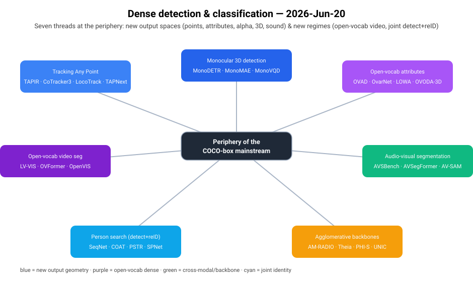
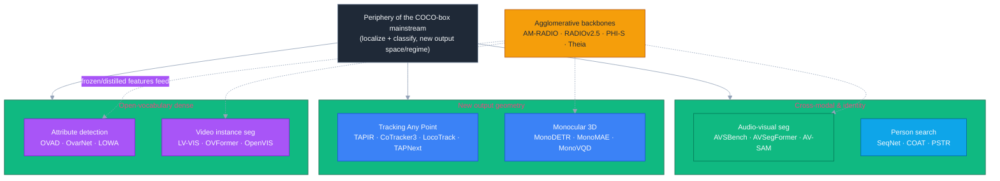
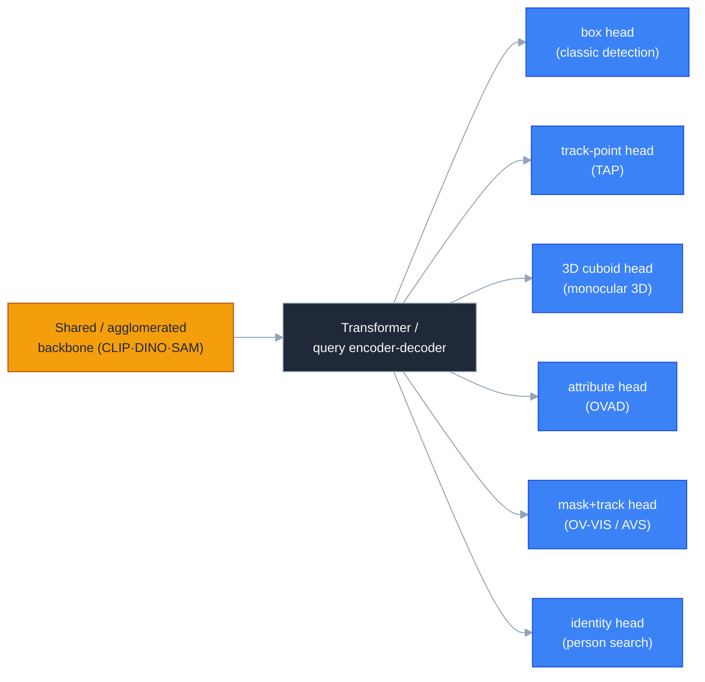

# Dense Object Detection & Classification — Recent Advances

*Compiled 2026-Jun-20 (America/Los_Angeles).*

Next installment in the running CV-updates log. Earlier entries on
`main` / the working branch:
[Apr-30](../2026-Apr-30/2026-Apr-30_CV_updates.md),
[May-01](../2026-May-01/2026-May-01_CV_updates.md),
[May-02](../2026-May-02/2026-May-02_CV_updates.md),
[May-04](../2026-May-04/2026-May-04_CV_updates.md),
[May-05](../2026-May-05/2026-May-05_CV_updates.md),
[May-07](../2026-May-07/2026-May-07_CV_updates.md),
[May-08](../2026-May-08/2026-May-08_CV_updates.md),
[May-15](../2026-May-15/2026-May-15_CV_updates.md),
[May-16](../2026-May-16/2026-May-16_CV_updates.md),
[May-17](../2026-May-17/2026-May-17_CV_updates.md),
[Jun-09](../2026-Jun-09/2026-Jun-09_CV_updates.md),
[Jun-10](../2026-Jun-10/2026-Jun-10_CV_updates.md),
[Jun-12](../2026-Jun-12/2026-Jun-12_CV_updates.md),
[Jun-15](../2026-Jun-15/2026-Jun-15_CV_updates.md),
[Jun-16](../2026-Jun-16/2026-Jun-16_CV_updates.md),
[Jun-17](../2026-Jun-17/2026-Jun-17_CV_updates.md),
[Jun-19](../2026-Jun-19/2026-Jun-19_CV_updates.md).
Across ~160 dedicated sections those passes have worked the real-time
detector race (YOLO/DETR/DEIM), oriented & aerial detection,
camouflaged / salient / glass / shadow / small / infrared objects,
open-world, incremental and long-tailed *recognition*, amodal &
referring segmentation, event/spiking detectors, industrial anomaly,
fine-grained / hyperspectral / multi-label classification, 3D / BEV /
point-cloud, end-to-end MOT, weak/point/semi supervision, test-time &
source-free adaptation, distillation, diffusion detectors, grounded
MLLM detection, GUI grounding, forgery localization, compositional
zero-shot, open-set/OOD, change detection, image matting, edge & line
detection, scene-graph generation, and dense pose.

Today rotates to **seven threads the series has not yet given a
dedicated section** — chosen, in the spirit of the Jun-19 pass, from the
*periphery* of box-detection: tasks whose model still localizes and
classifies but whose **output geometry** is no longer a COCO box
(track-points, alpha-free 3D cuboids, per-object attribute vectors,
pixel masks driven by *sound*), plus the two **regimes** that most
resist the foundation-model pivot (open-vocabulary *video* segmentation;
joint detect-and-identify *person search*), and one **backbone** thread
that quietly underpins almost everything above. Concretely:
**Tracking Any Point (point tracking)**, **monocular 3D object
detection**, **open-vocabulary attribute detection**, **open-vocabulary
video instance segmentation**, **audio-visual segmentation /
sound-source localization**, **person search**, and **agglomerative
vision foundation models**.

> **Scope note.** Links below are arXiv `abs` pages, official GitHub
> repos, or publisher pages (CVF / Springer-IJCV / AAAI / ECVA /
> NeurIPS). Every arXiv ID cited in prose or tables was **corroborated
> against the paper title across at least two independent listings**
> during research (arXiv `abs`, the project page, a proceedings entry,
> dblp, or a mirror). A few influential entries — e.g. **OV-DAR**
> (IJCV 2024) and the **OV-VIS / LV-VIS** journal version — have **no
> standalone arXiv preprint** and are cited via their publisher page;
> these are flagged in-line. As in prior passes, several 2025-2026
> preprints surfaced with `2512.xxxxx` / `2601.xxxxx` / `2604.xxxxx`
> IDs whose title↔ID mapping could not be independently confirmed
> (automated arXiv fetches returned HTTP 403 throughout); per the
> series' standing practice these are **described in prose but their IDs
> are omitted rather than risk an invented citation**. Benchmark numbers
> are **as-reported by the authors and rounded**; backbones, training
> data and eval protocols differ across rows, so the tables are
> **orientation, not a leaderboard**.

---

## Table of contents

1. [What's new this pass](#1-whats-new-this-pass)
2. [Topic map](#2-topic-map)
3. [Tracking Any Point (point tracking)](#3-tracking-any-point-point-tracking)
4. [Monocular 3D object detection](#4-monocular-3d-object-detection)
5. [Open-vocabulary attribute detection](#5-open-vocabulary-attribute-detection)
6. [Open-vocabulary video instance segmentation](#6-open-vocabulary-video-instance-segmentation)
7. [Audio-visual segmentation & sound-source localization](#7-audio-visual-segmentation--sound-source-localization)
8. [Person search (joint detection + re-ID)](#8-person-search-joint-detection--re-id)
9. [Agglomerative vision foundation models](#9-agglomerative-vision-foundation-models)
10. [Cross-cutting theme: the box is just one output head](#10-cross-cutting-theme-the-box-is-just-one-output-head)
11. [Reading list](#11-reading-list)

---

## 1. What's new this pass

| Thread | One-line take |
| --- | --- |
| Tracking Any Point | Long-range *per-pixel* correspondence as its own task: feature-match + iterative refine (**TAPIR**) → joint tracking of all queries (**CoTracker / CoTracker3**) → local 4D all-pair correlation (**LocoTrack**, ~6× faster) → drop the cost-volume entirely and decode points as **next tokens** (**TAPNext**); lifting to 3D (**SpatialTracker v2**, **DELTAv2**). |
| Monocular 3D detection | Camera-only cuboids without LiDAR: depth-guided DETR (**MonoDETR / MonoDTR**) → occlusion- and depth-aware MAE pretraining (**MonoMAE**) → variational query denoising + self-distillation (**MonoVQD**, new KITTI SOTA) and consistency-teacher domain transfer (**MonoCT**), with Mamba necks (**MonoMM**) for real time. |
| Open-vocab attributes | Beyond the noun: predict *open-set adjectives* per box. The **OVAD** benchmark (117 attrs × COCO) exposes how weak VLM attribute grounding is; **OvarNet**, **LOWA** and **OV-DAR** jointly recognize category + attributes; **OVODA** carries it to 3D/nuScenes. |
| Open-vocab video seg | Segment-track-classify *novel* categories in video. **LV-VIS** (1,196 classes) is the benchmark; **OVFormer** does unified query↔CLIP embedding alignment + video training (21.9 AP, +7.7 over prior); **OpenVIS** / caption-trajectory models push the open end. |
| Audio-visual segmentation | Pixel masks of *whatever is making the sound*. **AVSBench** + the **TPAVI** module started it; **AVSegFormer** brought audio-query transformers; **AV-SAM / GAVS** prompt SAM with audio; the frontier is **open-vocabulary AVSS** and temporal-misalignment robustness. |
| Person search | One network that *detects every person and re-IDs the query* in raw scenes. Sequential two-stage (**SeqNet**) → cascade occluded-attention transformer (**COAT**) → one-step DETR (**PSTR**); the live edges are **weakly-supervised** (box-only) and robust **pre-training** (**SPNet**). |
| Agglomerative backbones | Distill *many* foundation teachers (CLIP+DINO+SAM…) into one student: **AM-RADIO** → **RADIOv2.5** (fix resolution/teacher-imbalance pathologies) → **PHI-S** (distribution balancing), **Theia** (for robotics), **UNIC** (classification). The shared backbone under half this report. |

---

## 2. Topic map

A standalone SVG topic map (light/dark-safe — title/labels use
`currentColor`, node fills are fixed brand colors with light text):

A Mermaid version of the same lattice:

---

## 3. Tracking Any Point (point tracking)

**Task.** Given any pixel in any frame, output its 2D trajectory through
the rest of the video *plus* a visibility/occlusion flag — long-range,
dense, sub-pixel correspondence. It sits between optical flow (adjacent
frames, every pixel) and object tracking (boxes, sparse), and has become
the connective tissue under structure-from-motion, video editing,
robotics and 4D reconstruction. The defining benchmark is **TAP-Vid**
([arXiv:2211.03726](https://arxiv.org/abs/2211.03726)), scored by
Average Jaccard (AJ), `< δ` position accuracy and occlusion accuracy.

**The arc.**
- **TAPIR** ([arXiv:2306.08637](https://arxiv.org/abs/2306.08637)) —
  per-frame coarse matching followed by a PIPs-style iterative temporal
  refinement; the workhorse feed-forward baseline.
- **CoTracker** ([arXiv:2307.07635](https://arxiv.org/abs/2307.07635))
  — a CNN+transformer that tracks *many* points **jointly**, exploiting
  correlations between tracks (e.g. points on the same rigid object).
- **BootsTAP / BootsTAPIR**
  ([arXiv:2402.00847](https://arxiv.org/abs/2402.00847)) —
  semi-supervised bootstrapping on ~15M real videos closes the
  synthetic→real gap.
- **LocoTrack** ([arXiv:2407.15420](https://arxiv.org/abs/2407.15420),
  ECCV 2024) — replaces pointwise features with **local 4D all-pair
  correlation** (bidirectional, smoothness-regularized), resolving
  matching ambiguity while running ~**6× faster** than the prior SOTA.
- **CoTracker3**
  ([arXiv:2410.11831](https://arxiv.org/abs/2410.11831)) — a simplified
  architecture trained by **pseudo-labelling real videos** with existing
  trackers; more data-efficient, better numbers.
- **TAPNext** ([arXiv:2504.05579](https://arxiv.org/abs/2504.05579)) —
  recasts TAP as **next-token / masked-token decoding** with a causal,
  purely-online model that *removes* tracking-specific inductive biases
  (no explicit cost volume / iterative refinement), and still reaches
  SOTA on most TAP-Vid metrics at the lowest latency. A notable shift
  toward sequence-modeling priors over hand-built correlation.

**Going 3D.** **SpatialTracker v2**
([arXiv:2507.12462](https://arxiv.org/abs/2507.12462)) and **DELTAv2**
([arXiv:2508.01170](https://arxiv.org/abs/2508.01170)) lift 2D tracks to
metric 3D using monocular-depth priors, and **ProTracker**
([arXiv:2501.03220](https://arxiv.org/abs/2501.03220)) adds probabilistic
integration for robustness to re-entry/occlusion. A 2025-2026 wave of
multi-view and "TAPNext++" variants appeared with unverifiable
`2512/2604.xxxxx` IDs and is omitted here per the scope note, but the
direction — *online, token-based, 3D-aware* tracking — is unambiguous.

| Method | Year | Key idea | TAP-Vid posture |
| --- | --- | --- | --- |
| TAPIR | 2023 | match + iterative refine | strong feed-forward baseline |
| CoTracker | 2023 | joint multi-point transformer | exploits inter-track correlation |
| LocoTrack | 2024 | local 4D all-pair correlation | SOTA accuracy, ~6× faster |
| CoTracker3 | 2024 | pseudo-label real videos | data-efficient SOTA |
| TAPNext | 2025 | next-token decoding, online | SOTA on most metrics, lowest latency |

---

## 4. Monocular 3D object detection

**Task.** From a **single RGB image** (no LiDAR, no stereo), output
amodal 3D cuboids — center `(x,y,z)`, dimensions, yaw — for each object.
The hard part is the ill-posed depth dimension; benchmarks are KITTI
(`AP_{3D}` / `AP_{BEV}` at the Car/Mod 0.7-IoU setting) and the
camera-only track of nuScenes (NDS / mAP).

**The arc.**
- **MonoDTR** ([arXiv:2203.10981](https://arxiv.org/abs/2203.10981)) and
  **MonoDETR** ([arXiv:2203.13310](https://arxiv.org/abs/2203.13310)) —
  inject **depth-aware** representations into a transformer; MonoDETR is
  the first DETR-style monocular detector, with a depth encoder and
  depth-guided decoder that needs no dense-depth labels and plugs into
  multi-view detectors on nuScenes.
- **MonoMAE** ([arXiv:2405.07696](https://arxiv.org/abs/2405.07696),
  NeurIPS 2024) — **depth-aware masked autoencoding**: mask the
  depth-informative regions during pretraining so the model learns to
  hallucinate occluded geometry; consistent gains on KITTI and nuScenes
  with cross-domain generalization.
- **MonoMM** ([arXiv:2408.00438](https://arxiv.org/abs/2408.00438)) — a
  **multi-scale Mamba** neck for *real-time* monocular 3D, trading
  quadratic attention for linear state-space scanning.
- **MonoCT** ([arXiv:2503.13743](https://arxiv.org/abs/2503.13743)) —
  attacks **domain shift** with consistent teacher models /
  pseudo-labels, improving cross-dataset transfer.
- **MonoVQD** ([arXiv:2506.14835](https://arxiv.org/abs/2506.14835)) —
  **variational query denoising + self-distillation** in a DETR head;
  reported as a **new KITTI monocular SOTA** and, like MonoDETR,
  transferable as a plug-in to multi-view nuScenes detectors.

**Read.** The field has converged on two levers: (1) make the
representation *depth-aware* without requiring depth supervision (MAE
masking, depth tokens, depth-guided attention), and (2) stabilize the
DETR query set (denoising, self-distillation, teacher consistency)
because monocular depth makes one-to-one matching noisy. Mamba/SSM necks
are the efficiency story; cross-domain generalization (KITTI→nuScenes,
day→night) is the open problem.

| Method | Year | Mechanism | Where it helps |
| --- | --- | --- | --- |
| MonoDETR | 2022 | depth-guided DETR | first DETR monocular; plug-in to MV |
| MonoMAE | 2024 | depth-aware MAE pretrain | occlusion + cross-domain |
| MonoMM | 2024 | multi-scale Mamba neck | real-time inference |
| MonoCT | 2025 | consistent-teacher transfer | domain shift |
| MonoVQD | 2025 | variational query denoise + self-distill | KITTI SOTA; MV gains |

---

## 5. Open-vocabulary attribute detection

**Task.** Standard open-vocabulary detection answers *"what is the
noun?"*. Attribute detection asks the harder, complementary question —
*"which open-set adjectives apply to this object?"* (color, material,
state, pattern, pose…). It probes whether a VLM's box-level features
actually encode fine properties, not just category.

**The benchmark.** **OVAD** (*Open-Vocabulary Attribute Detection*,
[arXiv:2211.12914](https://arxiv.org/abs/2211.12914)) contributes a
clean, densely annotated test set: **117 attribute classes** over the 80
COCO object classes, with explicit positive *and* negative labels
(~1.4M annotations) for open-vocab evaluation. Its headline finding is
sobering: out-of-the-box CLIP-style models recognize categories far
better than attributes — attribute grounding is the weak link.

**Methods.**
- **OvarNet** ([arXiv:2301.09506](https://arxiv.org/abs/2301.09506),
  CVPR 2023) — a unified *recognize category **and** attributes* model;
  shows the two tasks are **complementary**, evaluated across VAW,
  COCO-attributes, LSA and OVAD.
- **LOWA** (*Localize Objects in the Wild with Attributes*,
  [arXiv:2305.20047](https://arxiv.org/abs/2305.20047)) — detect objects
  *and* describe them with open attributes in one pass.
- **OV-DAR** (*Open-Vocabulary Object Detection and Attributes
  Recognition*, IJCV 2024 —
  [Springer](https://link.springer.com/article/10.1007/s11263-024-02144-1);
  **no standalone arXiv preprint**) — a larger joint detection +
  attribute-recognition framework.
- **OVODA** (*toward Open-Vocabulary multimodal 3D detection with
  **attributes***,
  [arXiv:2508.16812](https://arxiv.org/abs/2508.16812)) — carries the
  idea into **3D**: a nuScenes-built OVAD-3D set (~84k instances, 11
  attribute classes covering motion state, spatial relations,
  interactions), bridging 3D features to text via foundation-model
  features and prompt tuning.

**Read.** Attributes are where open-vocabulary recognition stops being a
nearest-neighbor-in-CLIP-space trick and starts needing genuine
compositional grounding. Expect this to fuse with the
compositional-zero-shot and scene-graph threads from earlier passes.

---

## 6. Open-vocabulary video instance segmentation

**Task.** Segment, **track**, and classify every object instance across
a video — including **novel categories unseen at training time**. It is
the video, open-set generalization of VIS, and the temporal cousin of
the open-vocab semantic segmentation covered on Jun-19.

**Benchmark.** **LV-VIS** (Large-Vocabulary VIS) annotates objects from
**1,196 categories** specifically to stress the open-vocab setting; the
task/dataset is introduced in **OV-VIS** (IJCV 2024,
[Springer](https://link.springer.com/article/10.1007/s11263-024-02076-w);
journal version has no standalone arXiv).

**Methods.**
- **OpenVIS** ([arXiv:2305.16835](https://arxiv.org/abs/2305.16835)) —
  an early two-stage open-vocab VIS pipeline (propose masks, then
  open-set classify).
- **OVFormer** (*Unified Embedding Alignment for OV-VIS*,
  [arXiv:2407.07427](https://arxiv.org/abs/2407.07427), ECCV 2024) — a
  lightweight module that **aligns query embeddings with CLIP image
  embeddings** to close the train/test domain gap, trains on *video*
  (not just images) and uses semi-online inference for temporal
  consistency. Reaches **21.9 AP** on LV-VIS with a ResNet-50 backbone,
  **+7.7 AP** over the prior SOTA.
- **MaskCaptioner**
  ([arXiv:2510.14904](https://arxiv.org/abs/2510.14904)) — jointly
  segments *and captions* object trajectories, pushing toward an
  open-ended (generative) label space rather than a fixed vocabulary.

**Read.** The recurring trick is the same as in image open-vocab
segmentation — **align mask/query features to a frozen VLM text-image
space** — but video forces two extra constraints: temporal association
of the *same* novel instance, and inference that does not re-classify
inconsistently frame-to-frame. Real-time OV-VIS and caption-as-label
generation are the active edges.

---

## 7. Audio-visual segmentation & sound-source localization

**Task.** Output a **pixel-level mask of the object(s) producing sound**
in a video, using the audio track as the query. It is dense detection
where the "class prompt" is a *waveform*, not text — a genuinely
multimodal localization problem.

**Benchmark & origin.** **AVSBench** (*Audio-Visual Segmentation*,
[arXiv:2207.05042](https://arxiv.org/abs/2207.05042), ECCV 2022 /
IJCV 2024) is the first pixel-wise AVS benchmark, with single-source
(semi-supervised) and multi-source (fully-supervised) splits, and
introduces the **TPAVI** (Temporal Pixel-wise Audio-Visual Interaction)
module that injects audio semantics into the visual decoder.

**Methods.**
- **AVSegFormer**
  ([arXiv:2307.01146](https://arxiv.org/abs/2307.01146), AAAI 2024) —
  transformer framework with **audio queries** + learnable queries and
  an audio-visual mixer that amplifies sound-relevant spatial channels;
  set the dominant cross-attention paradigm.
- **AV-SAM** ([arXiv:2305.01836](https://arxiv.org/abs/2305.01836)) and
  **GAVS** — **prompt SAM with audio**, fusing audio embeddings as
  SAM-style prompts/adapters for class-agnostic sounding-object masks.
- **COMBO** (*Cooperation Does Matter — multi-order bilateral
  relations*, [arXiv:2312.06462](https://arxiv.org/abs/2312.06462),
  CVPR 2024) — models pixel/modal/temporal bilateral relations.
- **Open-Vocabulary AVSS**
  ([arXiv:2407.21721](https://arxiv.org/abs/2407.21721)) — extends AVS
  to **open-set sounding categories**, joining this thread to §5/§6.
- **M2VSL** (*Multi-scale Multi-instance Visual Sound Localization &
  Segmentation*, [arXiv:2409.00486](https://arxiv.org/abs/2409.00486))
  and **Audio-Visual Instance Segmentation**
  ([arXiv:2310.18709](https://arxiv.org/abs/2310.18709)) push from a
  single mask toward *per-instance* sounding-object segmentation.
- **CHP** (*Collaborative Hybrid Propagator for temporal misalignment*,
  [arXiv:2412.08161](https://arxiv.org/abs/2412.08161)) — a 2024-2025
  robustness theme: handle audio-visual events that are **not
  frame-aligned**.

**Read.** Two open problems dominate: (1) **audio bias** — models often
segment the *salient* object regardless of whether it is the one making
sound; textual-semantics regularization and bilateral-relation modeling
push back. (2) **Efficiency** — current SOTA leans on dense quadratic
cross-attention, motivating lightweight AVS variants. Open-vocabulary
and per-instance AVS are the frontier.

---

## 8. Person search (joint detection + re-ID)

**Task.** Given a query person image, **detect every person in a gallery
of raw, uncropped scene images and re-identify the query** — detection
and re-ID in *one* pipeline, rather than the usual re-ID assumption of
pre-cropped boxes. The tension is structural: detection wants
*class-invariant* features ("is this a person?"), re-ID wants
*instance-discriminative* ones ("is this *that* person?").

**The arc.**
- **SeqNet** (*Sequential End-to-end Network*,
  [arXiv:2103.10148](https://arxiv.org/abs/2103.10148), AAAI 2021) —
  makes detection and re-ID a **sequential** (detect-then-embed) process
  so re-ID features come from *high-quality* detected boxes, not raw
  proposals; adds Context Bipartite Graph Matching (CBGM) for matching.
- **COAT** (*Cascade Occluded Attention Transformer*,
  [arXiv:2203.09642](https://arxiv.org/abs/2203.09642), CVPR 2022) — a
  three-stage cascade that progressively refines coarse-to-fine,
  pose/scale-invariant features and uses occluded attention with
  tightening IoU thresholds — strong on **occluded** person search.
- **PSTR** (*End-to-End One-Step Person Search with Transformers*,
  [arXiv:2204.03340](https://arxiv.org/abs/2204.03340), CVPR 2022) — the
  first **one-step transformer** person search: a detection
  encoder-decoder plus a discriminative re-ID decoder with a part
  attention block and multi-level supervision.
- **Sequential Transformer**
  ([arXiv:2211.04323](https://arxiv.org/abs/2211.04323)) and **Fully
  Decoupled** person search
  ([arXiv:2309.04967](https://arxiv.org/abs/2309.04967)) — refine how
  the two sub-tasks share vs. separate representations.

**Live edges.**
- **Weakly-supervised** person search — train with **bounding boxes
  only**, no identity labels, via clustering↔training alternation;
  e.g. deep intra-image contrastive learning
  ([arXiv:2302.04607](https://arxiv.org/abs/2302.04607)) and context-
  graph methods ([CGPS, arXiv:2106.10506](https://arxiv.org/abs/2106.10506)).
- **Pre-training / robustness** — **SPNet** (*Swap Path Network for
  Robust Person Search Pre-training*,
  [arXiv:2412.05433](https://arxiv.org/abs/2412.05433)) brings modern
  self-supervised pre-training discipline to the joint task.
- **Long-tail** identity distributions — subtask-dominated transfer
  learning ([arXiv:2112.00527](https://arxiv.org/abs/2112.00527)).
- DINO-based joint detect+reID with part attention (2025) continues the
  DETR-ification trend.

**Read.** Person search is the cleanest small-scale case study of the
detect-vs-identify conflict that also shows up in MOT, re-ID and (now)
agentic perception. The 2024-2026 momentum is toward **label efficiency
(box-only)** and **transferable pre-training** rather than new heads.

---

## 9. Agglomerative vision foundation models

**Task / idea.** Not a detection task per se, but the **backbone** under
much of the above: instead of pre-training one model with one objective,
**distill several heterogeneous foundation teachers — CLIP (semantics),
DINOv2 (dense correspondence), SAM (segmentation), depth models — into a
single student**, *label-free*, so one frozen backbone inherits all
their strengths. The term of art is **"agglomerative"** models.

**The arc.**
- **AM-RADIO** (*Reduce All Domains Into One*,
  [arXiv:2312.06709](https://arxiv.org/abs/2312.06709), CVPR 2024) — the
  founding work: multi-teacher distillation that **exceeds each
  individual teacher** while amalgamating zero-shot VL understanding,
  pixel-level features, and open-vocab segmentation in one model.
- **Theia** ([arXiv:2407.20179](https://arxiv.org/abs/2407.20179),
  CoRL 2024) — agglomerates diverse vision teachers specifically for
  **robot learning**, giving a compact policy backbone.
- **UNIC** ([arXiv:2408.05088](https://arxiv.org/abs/2408.05088),
  ECCV 2024) — *Universal Classification* via multi-teacher distillation
  with **teacher-matching projectors and dynamic teacher selection**.
- **PHI-S** (*Distribution Balancing for Label-Free Multi-Teacher
  Distillation*, [arXiv:2410.01680](https://arxiv.org/abs/2410.01680))
  — standardizes/normalizes heterogeneous teacher activations so no
  single teacher dominates the loss; cleaner students.
- **RADIOv2.5** (*Improved Baselines for Agglomerative VFMs*,
  [arXiv:2412.07679](https://arxiv.org/abs/2412.07679), CVPR 2025) —
  diagnoses and fixes the practical pathologies: **resolution mode
  shift, teacher imbalance, idiosyncratic teacher artifacts, token
  glut** — via multi-resolution training, mosaic augmentation and loss
  balancing.
- **Knowledge Inheritance for VFMs**
  ([arXiv:2508.14707](https://arxiv.org/abs/2508.14707)) — 2025 work on
  inheriting/extending agglomerated knowledge without retraining from
  scratch.

A 2025-2026 wave (agglomerative **mixture-of-experts**, **C-RADIOv4**,
efficient multi-teacher distillation) surfaced with unverifiable
`2512/2601.xxxxx` IDs and is noted in prose only.

**Why it's in a detection report.** These backbones are increasingly the
default frozen feature extractor for open-vocab detection/segmentation,
attribute detection, AVS and monocular 3D — the "same four foundation
models, everywhere" observation from Jun-19, now *literally compressed
into one set of weights*.

---

## 10. Cross-cutting theme: the box is just one output head

Stepping back across the seven threads, the same structural story recurs
and is worth stating plainly:

1. **One backbone, many output heads.** A frozen (increasingly
   *agglomerated*) backbone + a DETR-style query decoder now serves
   points (TAPNext), cuboids (MonoVQD, MonoDETR), masks (OVFormer,
   AVSegFormer), attributes (OvarNet) and identities (PSTR). The "head"
   changes; the recipe does not.
2. **Align to a frozen VLM text-image space** to get the open
   vocabulary — true for OVAD attributes, LV-VIS categories and
   open-vocab AVSS alike.
3. **The hard residual is always the second, conflicting objective:**
   depth for monocular 3D, identity-vs-class for person search,
   sound-vs-saliency for AVS, fine attribute grounding for OVAD,
   temporal consistency for OV-VIS and TAP. Foundation features get you
   the *category*; the task-specific tension is what the 2024-2026 papers
   actually fight.
4. **Sequence-modeling priors are quietly displacing hand-built
   geometry** — TAPNext drops the cost volume for next-token decoding;
   DETR query denoising replaces hand-tuned matching in monocular 3D.

---

## 11. Reading list

**Tracking Any Point**
- TAP-Vid benchmark — [arXiv:2211.03726](https://arxiv.org/abs/2211.03726)
- TAPIR — [arXiv:2306.08637](https://arxiv.org/abs/2306.08637)
- CoTracker — [arXiv:2307.07635](https://arxiv.org/abs/2307.07635)
- BootsTAP — [arXiv:2402.00847](https://arxiv.org/abs/2402.00847)
- LocoTrack — [arXiv:2407.15420](https://arxiv.org/abs/2407.15420)
- CoTracker3 — [arXiv:2410.11831](https://arxiv.org/abs/2410.11831)
- TAPNext — [arXiv:2504.05579](https://arxiv.org/abs/2504.05579)
- ProTracker — [arXiv:2501.03220](https://arxiv.org/abs/2501.03220)
- SpatialTracker v2 — [arXiv:2507.12462](https://arxiv.org/abs/2507.12462)
- DELTAv2 — [arXiv:2508.01170](https://arxiv.org/abs/2508.01170)
- Code: [google-deepmind/tapnet](https://github.com/google-deepmind/tapnet)

**Monocular 3D detection**
- MonoDTR — [arXiv:2203.10981](https://arxiv.org/abs/2203.10981)
- MonoDETR — [arXiv:2203.13310](https://arxiv.org/abs/2203.13310)
- MonoMAE — [arXiv:2405.07696](https://arxiv.org/abs/2405.07696)
- MonoMM — [arXiv:2408.00438](https://arxiv.org/abs/2408.00438)
- MonoCT — [arXiv:2503.13743](https://arxiv.org/abs/2503.13743)
- MonoVQD — [arXiv:2506.14835](https://arxiv.org/abs/2506.14835)

**Open-vocabulary attribute detection**
- OVAD benchmark — [arXiv:2211.12914](https://arxiv.org/abs/2211.12914)
- OvarNet — [arXiv:2301.09506](https://arxiv.org/abs/2301.09506)
- LOWA — [arXiv:2305.20047](https://arxiv.org/abs/2305.20047)
- OV-DAR (IJCV 2024, no arXiv) — [Springer](https://link.springer.com/article/10.1007/s11263-024-02144-1)
- OVODA (3D) — [arXiv:2508.16812](https://arxiv.org/abs/2508.16812)

**Open-vocabulary video instance segmentation**
- OV-VIS / LV-VIS (IJCV 2024, no arXiv) — [Springer](https://link.springer.com/article/10.1007/s11263-024-02076-w)
- OpenVIS — [arXiv:2305.16835](https://arxiv.org/abs/2305.16835)
- OVFormer — [arXiv:2407.07427](https://arxiv.org/abs/2407.07427)
- MaskCaptioner — [arXiv:2510.14904](https://arxiv.org/abs/2510.14904)

**Audio-visual segmentation**
- AVSBench — [arXiv:2207.05042](https://arxiv.org/abs/2207.05042)
- AVSegFormer — [arXiv:2307.01146](https://arxiv.org/abs/2307.01146)
- AV-SAM — [arXiv:2305.01836](https://arxiv.org/abs/2305.01836)
- COMBO — [arXiv:2312.06462](https://arxiv.org/abs/2312.06462)
- Audio-Visual Instance Segmentation — [arXiv:2310.18709](https://arxiv.org/abs/2310.18709)
- Open-Vocabulary AVSS — [arXiv:2407.21721](https://arxiv.org/abs/2407.21721)
- M2VSL — [arXiv:2409.00486](https://arxiv.org/abs/2409.00486)
- CHP (temporal misalignment) — [arXiv:2412.08161](https://arxiv.org/abs/2412.08161)
- Code/benchmark: [OpenNLPLab/AVSBench](https://github.com/OpenNLPLab/AVSBench)

**Person search**
- SeqNet — [arXiv:2103.10148](https://arxiv.org/abs/2103.10148)
- COAT — [arXiv:2203.09642](https://arxiv.org/abs/2203.09642)
- PSTR — [arXiv:2204.03340](https://arxiv.org/abs/2204.03340)
- Sequential Transformer — [arXiv:2211.04323](https://arxiv.org/abs/2211.04323)
- Fully Decoupled person search — [arXiv:2309.04967](https://arxiv.org/abs/2309.04967)
- Weakly-supervised (intra-image contrastive) — [arXiv:2302.04607](https://arxiv.org/abs/2302.04607)
- CGPS (weakly-supervised, context graph) — [arXiv:2106.10506](https://arxiv.org/abs/2106.10506)
- SPNet (pre-training) — [arXiv:2412.05433](https://arxiv.org/abs/2412.05433)
- Long-tail person search — [arXiv:2112.00527](https://arxiv.org/abs/2112.00527)

**Agglomerative vision foundation models**
- AM-RADIO — [arXiv:2312.06709](https://arxiv.org/abs/2312.06709)
- Theia — [arXiv:2407.20179](https://arxiv.org/abs/2407.20179)
- UNIC — [arXiv:2408.05088](https://arxiv.org/abs/2408.05088)
- PHI-S — [arXiv:2410.01680](https://arxiv.org/abs/2410.01680)
- RADIOv2.5 — [arXiv:2412.07679](https://arxiv.org/abs/2412.07679)
- Knowledge Inheritance for VFMs — [arXiv:2508.14707](https://arxiv.org/abs/2508.14707)
- Code: [NVlabs/RADIO](https://github.com/NVlabs/RADIO)

---

*Compiled by an automated CV-updates routine. Citations corroborated
across multiple listings during research; unverifiable 2025-2026
preprint IDs were deliberately omitted rather than risk a fabricated
reference. Benchmark figures are author-reported and not normalized for
backbone or protocol.*
