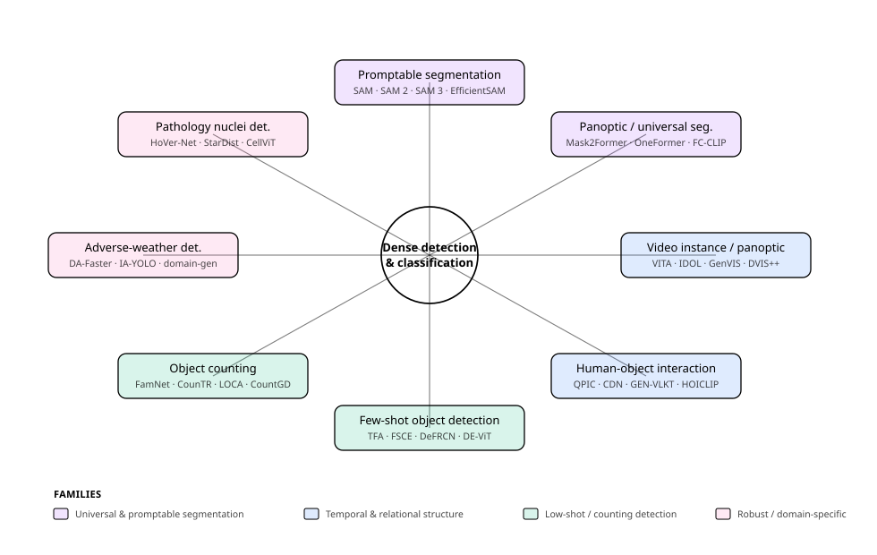
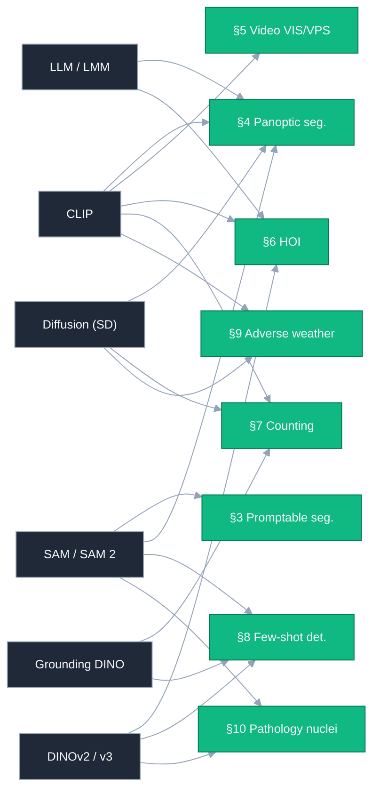

# Dense Object Detection & Classification — Recent Advances

*Compiled 2026-Jun-21 (America/Los_Angeles).*

Next installment in the running CV-updates log. Earlier entries on
`main`:
[Apr-30](../2026-Apr-30/2026-Apr-30_CV_updates.md),
[May-01](../2026-May-01/2026-May-01_CV_updates.md),
[May-02](../2026-May-02/2026-May-02_CV_updates.md),
[May-04](../2026-May-04/2026-May-04_CV_updates.md),
[May-05](../2026-May-05/2026-May-05_CV_updates.md),
[May-07](../2026-May-07/2026-May-07_CV_updates.md),
[May-08](../2026-May-08/2026-May-08_CV_updates.md),
[May-15](../2026-May-15/2026-May-15_CV_updates.md),
[May-16](../2026-May-16/2026-May-16_CV_updates.md),
[May-17](../2026-May-17/2026-May-17_CV_updates.md),
[Jun-09](../2026-Jun-09/2026-Jun-09_CV_updates.md),
[Jun-10](../2026-Jun-10/2026-Jun-10_CV_updates.md),
[Jun-12](../2026-Jun-12/2026-Jun-12_CV_updates.md),
[Jun-15](../2026-Jun-15/2026-Jun-15_CV_updates.md),
[Jun-16](../2026-Jun-16/2026-Jun-16_CV_updates.md),
[Jun-17](../2026-Jun-17/2026-Jun-17_CV_updates.md),
[Jun-19](../2026-Jun-19/2026-Jun-19_CV_updates.md).
Across ~160 dedicated sections those passes have worked through the
real-time detector race (YOLO/DETR/DEIM), oriented & aerial detection,
camouflaged/salient/glass/shadow/small/infrared objects, open-world,
incremental and long-tailed *recognition*, amodal & referring
segmentation, event/spiking detectors, industrial anomaly, fine-grained
/ hyperspectral / multi-label classification, 3D / BEV / point-cloud,
end-to-end MOT, weak/point/semi supervision, test-time & source-free
adaptation, distillation, diffusion detectors, grounded MLLM detection,
GUI grounding, forgery localization, video object detection,
long-tailed / LVIS detection, open-vocabulary & weakly-supervised
*semantic* segmentation, bi-temporal change detection, image matting,
edge / line-segment / wireframe detection, and scene graph generation.

To avoid repeating that ground, today rotates to **eight threads the
series has not yet given a dedicated section** — chosen around the gap
between the COCO-box detector and the wider *segment-and-relate* problem
that the 2024–2026 literature actually obsesses over. Concretely:
**promptable & interactive segmentation** (the Segment Anything
lineage), **panoptic & universal image segmentation**, **video
instance / panoptic segmentation**, **human–object interaction
detection**, **object counting**, **few-shot object detection**,
**domain-generalized & adverse-weather detection**, and **nuclei /
cell detection & classification in computational pathology**.

> Scope note. Links below are arXiv `abs` pages, official GitHub repos,
> or publisher pages (CVF / IEEE / NeurIPS / AAAI / BMVC / MIDL / Nature)
> cross-checked during research — each arXiv ID was corroborated against
> the paper title across at least two independent listings. Several
> influential papers (MCNN, Single-DGOD, Referring-Expression Counting /
> GroundingREC, FM-FSOD, HoVer-NeXt, Cellpose) exist only as
> conference / journal versions with **no standalone arXiv preprint**;
> those are flagged in-line and cited via their proceedings or journal
> page. A few very recent forward-dated `2026` identifiers (e.g.
> SL-HOI `2603.xxxxx`, the ICLR-2026 FSOD-VFM `2602.xxxxx`) are flagged
> as preprints to verify before formal citation. Benchmark numbers are
> as-reported by authors, rounded, on differing backbones / protocols —
> not a leaderboard.

---

## Table of contents

1. [What's new this pass](#1-whats-new-this-pass)
2. [Topic map](#2-topic-map)
3. [Promptable & interactive segmentation](#3-promptable--interactive-segmentation)
4. [Panoptic & universal image segmentation](#4-panoptic--universal-image-segmentation)
5. [Video instance & panoptic segmentation](#5-video-instance--panoptic-segmentation)
6. [Human–object interaction (HOI) detection](#6-humanobject-interaction-hoi-detection)
7. [Object counting](#7-object-counting)
8. [Few-shot object detection](#8-few-shot-object-detection)
9. [Domain-generalized & adverse-weather detection](#9-domain-generalized--adverse-weather-detection)
10. [Nuclei / cell detection & classification in pathology](#10-nuclei--cell-detection--classification-in-pathology)
11. [Cross-cutting theme: the foundation-model pivot](#11-cross-cutting-theme-the-foundation-model-pivot)
12. [Reading list](#12-reading-list)

---

## 1. What's new this pass

| Thread | One-line take |
| --- | --- |
| Promptable segmentation | The **Segment Anything** lineage from geometric prompts (**SAM**) → memory-based video (**SAM 2**) → open-vocabulary *concept* prompts (**SAM 3**) and instruction reasoning (**SAM3-I**); a parallel efficiency track (**MobileSAM, EdgeSAM, TinySAM, EfficientSAM**) and domain forks (**MedSAM2**). |
| Panoptic / universal seg | One transformer for all mask tasks: **Mask2Former → OneFormer / Mask DINO / kMaX-DeepLab**, then **OMG-Seg** (10+ tasks, one weight set); the open-vocab frontier runs on frozen CLIP (**FC-CLIP, EOV-Seg**), diffusion (**ODISE**), LMMs (**PSALM**), and SAM2+VLM (**OpenWorldSAM**). |
| Video instance / panoptic | Offline clip models (**Mask2Former-VIS, VITA**) vs online association (**IDOL → GenVIS → DVIS++ → CAVIS**), unified target-query designs (**TarViS**), and open-vocab VIS (**OV2Seg / LV-VIS, BriVIS**). |
| Human–object interaction | `<human, object, verb>` triplets: DETR one-stage (**QPIC, CDN**), CLIP knowledge transfer (**GEN-VLKT, HOICLIP**), and LLM-/low-rank-driven open-vocabulary (**SGC-Net, HOLa**). |
| Object counting | Density CNNs (**MCNN, CSRNet**) → exemplar-matching transformers (**FamNet, CounTR, LOCA**) → text / multi-modal open-world counters (**CLIP-Count, CountGD, DAVE, T2ICount**); FSC-147 test MAE ~23→~6. |
| Few-shot detection | Meta-learn (**FSRW, Meta R-CNN**) → fine-tune (**TFA, FSCE, DeFRCN**) → DETR meta (**Meta-DETR**) → repurpose foundation models (**Foundational FSOD, FM-FSOD, FSOD-VFM**), where zero-shot Grounding DINO already beats classic FSOD. |
| Adverse-weather det. | Adversarial / teacher-student **domain adaptation** (**DA-Faster, Adaptive Teacher**) → **single-domain generalization** (**Single-DGOD, DivAlign**) → semantic priors from CLIP (**CLIP the Gap**) and diffusion (**Generalized Diffusion Detector**); plus restoration-coupled **IA-YOLO / D-YOLO**. |
| Pathology nuclei | Distance/flow-map CNNs (**HoVer-Net, StarDist, Cellpose**) → ViT-encoder U-Nets (**CellViT**), graph-transformer classifiers, frozen pathology-FM encoders (**CellViT++**), and a pivot to pure DETR detection (**CellNuc-DETR**) and SAM generalists (**Cellpose-SAM**). |

---

## 2. Topic map

A standalone SVG topic map (light/dark-safe via `currentColor`):

A Mermaid version of the same lattice:

```mermaid
%%{init: {"theme":"base","themeVariables":{
  "primaryColor":"#a855f7","primaryTextColor":"#ffffff",
  "primaryBorderColor":"#7e22ce","lineColor":"#94a3b8",
  "secondaryColor":"#3b82f6","tertiaryColor":"#10b981",
  "fontSize":"13px"}}}%%
flowchart TB
  classDef seg fill:#a855f7,stroke:#7e22ce,color:#f8fafc;
  classDef det fill:#3b82f6,stroke:#1d4ed8,color:#f8fafc;
  classDef low fill:#10b981,stroke:#047857,color:#f8fafc;
  classDef rel fill:#f472b6,stroke:#be185d,color:#1f2937;
  classDef hub fill:#1f2937,stroke:#94a3b8,color:#f8fafc;

  H["Dense detection<br/>& classification"]:::hub

  PROMPT["Promptable segmentation<br/>(SAM · SAM 2 · SAM 3)"]:::seg
  PANO["Panoptic / universal seg.<br/>(Mask2Former · OMG-Seg · FC-CLIP)"]:::seg

  VIS["Video instance / panoptic<br/>(VITA · IDOL · DVIS++)"]:::det
  HOI["Human-object interaction<br/>(QPIC · GEN-VLKT · HOICLIP)"]:::det

  COUNT["Object counting<br/>(FamNet · LOCA · CountGD)"]:::low
  FSOD["Few-shot detection<br/>(TFA · DeFRCN · FSOD-VFM)"]:::low

  WEATHER["Adverse-weather det.<br/>(DA-Faster · DivAlign · diffusion)"]:::rel
  NUCLEI["Pathology nuclei det.<br/>(HoVer-Net · CellViT · CellNuc-DETR)"]:::rel

  H --> PROMPT
  H --> PANO
  H --> VIS
  H --> HOI
  H --> COUNT
  H --> FSOD
  H --> WEATHER
  H --> NUCLEI
```

Four families organize the eight threads: **universal & promptable
segmentation** (the SAM lineage; panoptic/universal seg); **temporal &
relational structure** (video instance/panoptic; human–object
interaction); **low-shot & counting detection** (object counting;
few-shot detection); and **robust / domain-specific detection**
(adverse-weather generalization; pathology nuclei). One trend cuts
across all of them — see §11.

---

## 3. Promptable & interactive segmentation

Promptable segmentation outputs a mask *on demand* from a prompt —
a point, box, mask, text phrase, or exemplar — rather than from a fixed
class list. The defining model is [**Segment Anything (SAM)**](https://arxiv.org/abs/2304.02643)
(ICCV 2023), a ViT image encoder + lightweight prompt encoder + mask
decoder trained on **SA-1B** (1B+ masks, 11M images); with ViTDet boxes
it reaches ~**46 mask AP** on COCO and ~**45 AP** on LVIS v1, and ~**77**
single-box mIoU on COCO — all zero-shot. SAM made "segment *anything* you
can point at" a primitive that the rest of this report quietly builds on
(see also [Jun-17 amodal/referring](../2026-Jun-17/2026-Jun-17_CV_updates.md)).

**Adding the time axis.** [**SAM 2**](https://arxiv.org/abs/2408.00714)
(ICLR 2025) extends the primitive to video with a *streaming memory
bank* + memory-attention that conditions the current frame on past
frames and prompts, on a Hiera encoder trained on the new **SA-V**
dataset — ~**77 J&F** on SA-V val (Hiera-B+) at ~**44 FPS**, ~6× faster
than SAM on images and ~3× fewer interactions than prior video methods.

**From geometry to language.** [**SAM 3**](https://arxiv.org/abs/2511.16719)
(Meta, Nov 2025) is the big shift: a single detect-segment-track model
driven by **concept prompts** — short noun phrases, image exemplars, or
both — returning masks *and persistent identities* for all matching
instances. One backbone feeds an image detector and a memory-based video
tracker, with recognition decoupled from localization via a **presence
head**, trained by a data engine producing ~4M unique concept labels. On
the new **SA-Co/Gold** benchmark it scores ~**54 cgF1**, roughly doubling
the strongest baseline (OWLv2 ~25) and reaching ~**75–80% of human**
performance. [**SAM3-I**](https://arxiv.org/abs/2512.04585) ("Segment
Anything with **Instructions**", Dec 2025 — the *-I* is *Instructions*,
not *Interactive*) pushes past noun phrases to full natural-language
instructions (attributes, relations, actions, implicit reasoning) via
*Promptable Instruction Segmentation*, preserving SAM 3 concept quality
(~49 gIoU on PACO-LVIS-Instruct) while reaching ~54 gIoU on simple and
~51 gIoU on complex instructions in a single pass.

**The efficiency track.** SAM's ViT-H encoder is the bottleneck, so a
whole sub-literature compresses it.
[**MobileSAM**](https://arxiv.org/abs/2306.14289) distills ViT-H (637M)
into a Tiny-ViT (~5M) — >60× smaller, ~10 ms/image.
[**EfficientSAM**](https://arxiv.org/abs/2312.00863) (CVPR 2024) uses
SAMI masked-image pretraining (reconstructing SAM features via MAE) to
learn compact ViT-Tiny/Small encoders, ~**44 AP** COCO / ~**42 AP** LVIS
at ~20× fewer params. [**EdgeSAM**](https://arxiv.org/abs/2312.06660)
distills into a *pure CNN* with prompt-in-the-loop, the first SAM variant
to run >30 FPS on an iPhone 14 (~37× faster than SAM).
[**TinySAM**](https://arxiv.org/abs/2312.13789) (AAAI 2025) adds
full-stage distillation, prompt-aware post-training quantization, and a
hierarchical "everything" mode.

**Domain forks.** [**MedSAM2**](https://arxiv.org/abs/2504.03600)
(Apr 2025) fine-tunes SAM 2's memory architecture on 455K+ 3D
image-mask pairs and 76K frames, treating CT/MRI/PET/ultrasound/endoscopy
slices as "video"; user studies report >85% annotation-time savings —
the bridge into §10.

**Takeaway.** The lineage is *geometry → time → concepts →
instructions*: each step removes a constraint (one image; one geometric
click; a closed label set) until the model is effectively a
language-promptable, identity-preserving segmenter — while a parallel
distillation/quantization track keeps the same recipe runnable on a
phone.

---

## 4. Panoptic & universal image segmentation

Panoptic segmentation unifies *stuff* (semantic) and *things* (instance)
into one per-pixel labeling with instance IDs, scored as **Panoptic
Quality (PQ)**. The 2022–2026 story is consolidation: one architecture
for all three mask tasks (semantic, instance, panoptic), then one *weight
set*, then an open *vocabulary*.

**The universal meta-architecture.**
[**Mask2Former**](https://arxiv.org/abs/2112.01527) (CVPR 2022) — backbone
+ pixel decoder + Transformer decoder with **masked attention** that
constrains cross-attention to predicted foreground — handles panoptic,
instance, and semantic with one design (~**58 PQ** / ~50 instance AP on
COCO, ~58 mIoU ADE20K). [**OneFormer**](https://arxiv.org/abs/2211.06220)
(CVPR 2023) makes it *train-once*: task-conditioned joint training + a
query-text contrastive loss let a single model beat separately-trained
Mask2Formers (~51 mIoU / ~51 PQ ADE20K).
[**kMaX-DeepLab**](https://arxiv.org/abs/2207.04044) (ECCV 2022) reframes
cross-attention as **k-means clustering** (~58 PQ COCO, ~68 PQ
Cityscapes), and [**Mask DINO**](https://arxiv.org/abs/2206.02777)
(CVPR 2023) folds detection and segmentation into one DETR-style
denoising framework (~59 PQ, ~55 instance AP, Swin-L).

**One model, every task.**
[**OMG-Seg**](https://arxiv.org/abs/2401.10229) (CVPR 2024) takes
"universal" literally: one transformer with task-specific queries spans
10+ tasks — image/video semantic, instance, panoptic, open-vocab,
SAM-style interactive, VOS — in a single set of weights (~**44 PQ** COCO
as a shared, frozen-ConvNeXt-L model at 24 epochs; the modest number is
the price of one-model-for-everything).

**Open-vocabulary panoptic** is the live frontier, and it runs on frozen
foundation models. [**ODISE**](https://arxiv.org/abs/2303.04803)
(CVPR 2023) mines frozen **text-to-image diffusion** features (Stable
Diffusion) + CLIP (~23 PQ / ~29 mIoU zero-shot ADE20K).
[**FC-CLIP**](https://arxiv.org/abs/2308.02487) ("Convolutions Die Hard",
NeurIPS 2023) collapses the two-stage pipeline onto a *single frozen
convolutional CLIP* that is both mask generator and classifier (~27 PQ /
~34 mIoU ADE20K, ~44 PQ Cityscapes, zero-shot).
[**PSALM**](https://arxiv.org/abs/2403.14598) (ECCV 2024) bolts a mask
decoder onto a large multimodal model with a flexible input schema,
unifying generic / referring / interactive / open-vocab segmentation with
strong zero-shot task transfer. [**EOV-Seg**](https://arxiv.org/abs/2412.08628)
(AAAI 2025) is the first *efficiency*-focused open-vocab panoptic model
(~25 PQ ADE20K at ~12 FPS, 4–19× faster than prior SOTA), and
[**OpenWorldSAM**](https://arxiv.org/abs/2507.05427) (NeurIPS 2025
Spotlight) language-prompts SAM 2 by injecting VLM embeddings, training
only ~4.5M params for SOTA zero-shot across six benchmarks (~60 mIoU
ADE20K). (Also notable: [**PosSAM**](https://arxiv.org/abs/2403.09620),
which fuses SAM spatial features with CLIP classification.)

**Takeaway.** Panoptic segmentation has become a *settled architecture*
(mask-classification transformers) wrapped around an *unsettled
vocabulary*: the gains since 2023 come almost entirely from which frozen
foundation model supplies open-set recognition — CLIP, diffusion, an LMM,
or SAM 2 — not from new mask heads.

---

## 5. Video instance & panoptic segmentation

Video instance segmentation (VIS) detects, segments, *and* tracks object
instances across a clip; video panoptic segmentation (VPS) adds stuff
classes. It is the dense-mask cousin of the box-level MOT covered
[Jun-08/Jun-16](../2026-Jun-16/2026-Jun-16_CV_updates.md) and distinct
from referring video segmentation ([Jun-09](../2026-Jun-09/2026-Jun-09_CV_updates.md)).
Benchmarks: **YouTube-VIS 2019/2021** and **OVIS** (occlusion-heavy) for
VIS (mask AP); **VIPSeg** for VPS (VPQ).

**Offline vs online.** The field splits on whether you see the whole
clip at once. *Offline:*
[**Mask2Former-VIS**](https://arxiv.org/abs/2112.10764) (2021) shows the
universal image segmenter generalizes to video by predicting 3D
spatio-temporal mask volumes with no architectural change (~60 AP
YT-VIS19, ~53 AP YT-VIS21, Swin-L);
[**VITA**](https://arxiv.org/abs/2206.04403) (NeurIPS 2022) associates
frame-level *object tokens* at the clip level on top of a frozen image
segmenter (~50/46/20 AP on YT19/YT21/OVIS, R50). *Online:*
[**IDOL**](https://arxiv.org/abs/2207.10661) (ECCV 2022 Oral) uses
contrastive instance embeddings to fix error-prone cross-frame
association (~50 AP YT19, ~30 AP OVIS), and
[**GenVIS**](https://arxiv.org/abs/2211.08834) (CVPR 2023) adds a memory
module + novel label assignment that runs online or semi-online (~+5.6 AP
on OVIS).

**Decoupling + unification.**
[**DVIS**](https://arxiv.org/abs/2306.03413) (ICCV 2023) splits the
problem into segmenter → referring tracker → temporal refiner, with the
tracker/refiner only ~6% of segmenter FLOPs (single-GPU training; ~+7.3
AP OVIS, ~+9.6 VPQ VIPSeg).
[**DVIS++**](https://arxiv.org/abs/2312.13305) (TPAMI 2023/24) strengthens
the spatio-temporal modeling and adds an open-vocab variant **OV-DVIS++**
(~57/52/41 AP on YT19/YT21/OVIS, ~44 VPQ VIPSeg, large backbone).
[**TarViS**](https://arxiv.org/abs/2301.02657) (CVPR 2023) represents
targets as abstract queries and *hot-swaps* tasks (VIS/VPS/VOS/PET) at
inference without retraining — the video echo of OMG-Seg.

**Open-vocabulary VIS.**
[**OV2Seg**](https://arxiv.org/abs/2304.01715) (ICCV 2023 Oral) defines
the task and the 1,196-category **LV-VIS** benchmark, segmenting/tracking
novel categories near real-time (~14 AP overall / ~12 AP novel, ~22 fps).
[**BriVIS**](https://arxiv.org/abs/2401.09732) (AAAI 2025) models an
instance's frame-level features over time as a *Brownian Bridge* and
aligns it to class texts (~7.4 mAP on BURST, a ~49% relative gain over
OV2Seg). The newest closed-set result,
[**CAVIS**](https://arxiv.org/abs/2407.03010) (ICCV 2025), adds a
context-aware tracker fusing surrounding-context with instance features
(~55.7/50.5/43.5 AP on YT19/YT21/OVIS, R50 — beating DVIS++ by up to
~+3.7 AP on OVIS). *(Flag: a real-time open-vocab method, TROY-VIS,
[2412.04434](https://arxiv.org/abs/2412.04434), is relevant at ~25 fps on
BURST/LV-VIS, but its publication venue could not be independently
confirmed.)*

**Takeaway.** VIS recapitulates the image-segmentation arc one level up —
universal queries (TarViS), decoupled tracking (DVIS++), open-vocabulary
text alignment (OV2Seg/BriVIS) — and the 2025 headline is that **online**
methods (IDOL→GenVIS→DVIS++→CAVIS) now *match or beat* offline ones,
especially under occlusion (OVIS) and in the panoptic VIPSeg regime.

---

## 6. Human–object interaction (HOI) detection

HOI detection localizes and classifies `<human, object, interaction>`
triplets — not just *what* is in the image but *what the person is doing
with it*. It sits between detection and scene-graph generation
([Jun-19](../2026-Jun-19/2026-Jun-19_CV_updates.md)). Benchmarks:
**HICO-DET** (600 triplet classes, mAP) and **V-COCO** (AP_role).

**The DETR pivot.**
[**QPIC**](https://arxiv.org/abs/2103.05399) (CVPR 2021) was the first
clean one-stage DETR HOI detector — each query captures at most one
human-object pair via image-wide attention (~29.1 mAP HICO-DET, ~58.8
AP_role V-COCO). [**CDN**](https://arxiv.org/abs/2108.05077) (NeurIPS
2021) bridges one- and two-stage by predicting pairs directly but
*disentangling* interaction classification into a cascaded decoder
(~31.8 mAP, ~62.3 AP_role). The two-stage line stayed competitive with
[**UPT**](https://arxiv.org/abs/2112.01838) (CVPR 2022), which fuses
unary (per-instance) and pairwise (per-pair) transformer representations
on off-the-shelf detections (~31.7–32.6 mAP).

**CLIP knowledge transfer.** The field's second pivot was importing
vision-language priors.
[**GEN-VLKT**](https://arxiv.org/abs/2203.13954) (CVPR 2022) removes
post-hoc matching via position-guided embeddings and initializes the
interaction classifier with **CLIP text embeddings** + a mimic loss
(~33.8 mAP, ~62.4 AP_role).
[**HOICLIP**](https://arxiv.org/abs/2303.15786) (CVPR 2023) mines
informative CLIP visual regions through a query-based interaction decoder
+ verb-class adapter, strong in fully-supervised, zero-shot, and
data-efficient regimes (~34.7 mAP full / ~31.1 rare).

**Open-vocabulary & LLM-guided (2025–26).**
[**SGC-Net**](https://arxiv.org/abs/2503.00414) (CVPR 2025) tackles
CLIP's coarse granularity with a granularity-sensing alignment module and
**LLM-generated fine-grained class descriptions** (open-vocab HICO-DET
~27 full / ~23 unseen mAP).
[**HOLa**](https://arxiv.org/abs/2507.15542) (ICCV 2025) low-rank
decomposes VLM text features into class-shared basis + adaptable
per-class weights for zero-shot generalization, setting zero-shot SOTA
(~28 unseen-verb mAP). *(Flag: a 2026 preprint, SL-HOI
[2603.27500](https://arxiv.org/abs/2603.27500), reports a large jump by
building on a frozen **DINOv3** backbone instead of CLIP (~42 full / ~40
unseen mAP), but it is only corroborated by arXiv + its own repo — treat
as unverified pending a venue.)*

**Takeaway.** HOI converged on DETR-style disentangled
human-object/interaction decoding, then moved decisively to
foundation-model knowledge transfer — CLIP distillation (GEN-VLKT,
HOICLIP) → LLM-guided descriptions and low-rank VLM adaptation (SGC-Net,
HOLa) → and, tentatively, self-supervised backbones (DINOv3) for the
open-vocabulary regime.

---

## 7. Object counting

Counting estimates *how many* instances of a target appear, usually
without enumerating boxes. It began as scene-specific **crowd** counting
via density-map regression and has become general-purpose, prompt-driven
counting of arbitrary categories. Benchmarks: **FSC-147** (147
categories; MAE/RMSE, 3-shot unless noted) for class-agnostic counting;
**ShanghaiTech Part A/B** (MAE) for crowds.

**Density-map foundations.**
[**MCNN**](https://openaccess.thecvf.com/content_cvpr_2016/papers/Zhang_Single-Image_Crowd_Counting_CVPR_2016_paper.pdf)
(CVPR 2016, *no arXiv*) uses three multi-receptive-field CNN columns
fused into a density map summed for the count, and introduced the
ShanghaiTech dataset (Part A MAE ~110, Part B ~26).
[**CSRNet**](https://arxiv.org/abs/1802.10062) (CVPR 2018) swaps the
multi-column trick for a VGG-16 front-end + **dilated** back-end that
enlarges receptive fields without losing resolution (Part A MAE ~68,
Part B ~11).

**Class-agnostic / few-shot counting.**
[**FamNet**](https://arxiv.org/abs/2104.08391) ("Learning To Count
Everything", CVPR 2021) correlates the query with a few exemplar boxes
and regresses a density map with test-time adaptation — and introduced
**FSC-147** (val MAE ~24, test ~23).
[**SAFECount**](https://arxiv.org/abs/2201.08959) (WACV 2023) reweights
query features by an exemplar-similarity map (test MAE ~14).
[**CounTR**](https://arxiv.org/abs/2208.13721) (BMVC 2022) is a
ViT-encoder/conv-decoder counter with exemplar cross-attention and
mosaic training (test MAE ~12), and
[**LOCA**](https://arxiv.org/abs/2211.08217) (ICCV 2023) iteratively
fuses exemplar shape and appearance via an object-prototype module before
correlation, sharply improving localization (val MAE ~10, test ~11).

**Text / open-vocabulary counting.**
[**CLIP-Count**](https://arxiv.org/abs/2305.07304) (ACM MM 2023) is the
first end-to-end *text-guided* density estimator (zero-shot text test MAE
~18). [**CounTX**](https://arxiv.org/abs/2306.01851) (BMVC 2023) is a
single-stage image-text counter specified by free-form text and released
the text-described **FSC-147-D**.
[**VLCounter**](https://arxiv.org/abs/2312.16580) (AAAI 2024) adds
semantic-conditioned prompt tuning + a learnable affine transform in a
one-stage text counter. [**DAVE**](https://arxiv.org/abs/2404.16622)
(CVPR 2024) runs a *detect-and-verify* paradigm — high-recall density
candidates then appearance verification — returning both count and
detections (few-shot test MAE ~9, ~20% better than LOCA).
[**CountGD**](https://arxiv.org/abs/2407.04619) (NeurIPS 2024) repurposes
**Grounding DINO** so the target is specified by text, exemplars, or
both, the strongest here (multi-modal FSC-147 test MAE ~6).
[**T2ICount**](https://arxiv.org/abs/2502.20625) (CVPR 2025) swaps CLIP
for a frozen **text-to-image diffusion** backbone for richer text
sensitivity (new zero-shot text SOTA, test MAE ~14). The fine-grained
frontier is *referring-expression counting*:
[**GroundingREC**](https://openaccess.thecvf.com/content/CVPR2024/papers/Dai_Referring_Expression_Counting_CVPR_2024_paper.pdf)
(CVPR 2024, *no arXiv located*) counts subclasses named by an expression
("people *sitting*") and released **REC-8K**.

**Takeaway.** Counting has tracked the same foundation-model pivot:
scene-specific density CNNs → exemplar-matching transformers → text /
multi-modal open-world counters, driving FSC-147 test MAE from ~23
(FamNet, 2021) to ~6 (CountGD, 2024), with referring-expression counting
the current fine-grained edge.

---

## 8. Few-shot object detection

Few-shot object detection (FSOD) learns to detect *novel* classes from a
handful (1–30) of labeled boxes by transferring from data-abundant base
classes — distinct from the few-shot *classifiers*
([Jun-12](../2026-Jun-12/2026-Jun-12_CV_updates.md)) because it must
localize too. Benchmarks: **PASCAL VOC** novel AP50 (Split 1, K=1/3/5/10)
and **COCO** novel AP (10/30-shot).

**Meta-learning era.**
[**FSRW**](https://arxiv.org/abs/1812.01866) (ICCV 2019) turns support
examples into channel reweighting vectors on a one-stage YOLOv2 (VOC
nAP50 ~15/27/34/47). [**Meta R-CNN**](https://arxiv.org/abs/1909.13032)
(ICCV 2019) brings meta-learning to two-stage detectors via a
predictor-head remodeling network applying class-attentive soft-attention
to RoI features (~20/35/46/52).

**The fine-tuning turn.**
[**TFA**](https://arxiv.org/abs/2003.06957) ("Frustratingly Simple FSOD",
ICML 2020) showed that simply freezing the whole backbone and
fine-tuning *only* the cosine box classifier/regressor beats elaborate
meta-learners (~40/45/56/56) — and set the standard multi-run protocol.
[**FSCE**](https://arxiv.org/abs/2103.05950) (CVPR 2021) adds a
supervised-contrastive proposal branch to reduce class confusion, and
[**DeFRCN**](https://arxiv.org/abs/2108.09017) (ICCV 2021) decouples
RPN-vs-RCNN and cls-vs-loc gradients with a gradient-decoupled layer +
prototypical calibration (a long-standing strong baseline, COCO ~19/23
nAP). [**Meta-DETR**](https://arxiv.org/abs/2208.00219) (TPAMI 2022;
earlier preprint [2103.11731](https://arxiv.org/abs/2103.11731)) is the
proposal-free DETR meta-detector, attending to multiple support classes
at once to exploit inter-class correlations.

**The foundation-model reframing (2024–26).** The newest work argues FSOD
is now a *concept-alignment* problem.
[**Foundational FSOD**](https://arxiv.org/abs/2312.14494)
("Revisiting FSOD with Vision-Language Models", NeurIPS 2024 D&B) aligns
**Grounding DINO** to target concepts with a few multimodal examples —
and reports the landmark result that *zero-shot* Grounding DINO (~48 AP
COCO) already beats prior few-shot SOTA (~33 AP).
[**FM-FSOD**](https://openaccess.thecvf.com/content/CVPR2024/html/Han_Few-Shot_Object_Detection_with_Foundation_Models_CVPR_2024_paper.html)
(CVPR 2024, *no arXiv located*) pairs a frozen DINOv2 backbone with an
LLM that reasons over proposals conditioned on support images. A useful
caution comes from ["Open-vocabulary vs. Closed-set"](https://arxiv.org/abs/2410.15315)
(2024), which proposes a *text-describability* metric and shows
open-vocab detectors barely help — sometimes hurt — for classes hard to
name in words. *(Flag: [**FSOD-VFM**](https://arxiv.org/abs/2602.03137),
a largely training-free SAM2 + DINOv2 + graph-diffusion pipeline, is
listed as ICLR 2026 and corroborated across arXiv/OpenReview/GitHub
(~32 AP at 10-shot on cross-domain CD-FSOD vs ~21 for prior training-free
methods); treat the forward-dated ID as a preprint to re-verify.)*

**Takeaway.** FSOD has moved from *how to learn from few examples*
(meta-learning, then last-layer fine-tuning) to *how to best align a
powerful pretrained model* (Grounding DINO, DINOv2, SAM 2) to hard-to-name
novel concepts — to the point that strong zero-shot foundation models are
themselves the baseline to beat.

---

## 9. Domain-generalized & adverse-weather detection

A detector trained on clear daytime data degrades badly in fog, rain,
snow, and at night. Two problem settings address this: **domain
adaptation** (DA — uses *unlabeled* target-domain images) and the harder
**single-domain generalization** (SDG — *no* target access at all).
Benchmarks: **Cityscapes→Foggy Cityscapes**, **BDD100K**, **DAWN**,
**ACDC**, **RTTS**, and the urban SDG split (Daytime-Sunny →
Night-Sunny / Dusk-Rainy / Night-Rainy / Daytime-Foggy).

**Adversarial & teacher-student DA.**
[**DA-Faster R-CNN**](https://arxiv.org/abs/1803.03243) (CVPR 2018) is the
foundational design: image-level + instance-level adversarial domain
classifiers (gradient reversal) + a consistency regularizer, learning
domain-invariant features (~27 mAP Cityscapes→Foggy, the number the whole
lineage is measured against).
[**Adaptive Teacher**](https://arxiv.org/abs/2111.13216) (CVPR 2022)
brings the mean-teacher recipe to detection: an EMA teacher pseudo-labels
weakly-augmented target images for a cross-domain student, with an
adversarial discriminator removing residual bias (~50.9 mAP
Cityscapes→Foggy — a large jump over the adversarial line).

**Single-domain generalization.**
[**Single-DGOD**](https://openaccess.thecvf.com/content/CVPR2022/papers/Wu_Single-Domain_Generalized_Object_Detection_in_Urban_Scene_via_Cyclic-Disentangled_Self-Distillation_CVPR_2022_paper.pdf)
(CVPR 2022, *no arXiv*) defines the SDG-detection task and the standard
urban weather benchmark, using cyclic disentanglement + self-distillation
to separate domain-invariant from domain-specific representations
(~36.6 mAP Night-Sunny). [**CLIP the Gap**](https://arxiv.org/abs/2301.05499)
(CVPR 2023) first brought a VLM into SDG: CLIP text prompts describing
weather concepts drive *semantic augmentation* of backbone features, so a
single-source detector hallucinates unseen-domain styles (~36.9 mAP
Night-Sunny, ~+10% over Single-DGOD).
[**DivAlign**](https://arxiv.org/abs/2405.14497) (CVPR 2024) shows strong
augmentation-based **div**ersification + multi-view prediction
**align**ment beats more complex SDG methods and is detector-agnostic
(SOTA on the 5-weather split).
[**VLKI**](https://arxiv.org/abs/2504.19086) (ACM MM 2025) refines the VLM
route from coarse image-level text to fine-grained *region/object-level*
cross-modal features.

**Restoration-coupled & diffusion-guided.**
[**IA-YOLO**](https://arxiv.org/abs/2112.08088) (AAAI 2022) learns a
differentiable image-processing pipeline (defog/white-balance/gamma)
*end-to-end under the detection loss* — enhancement for the detector, not
the human eye, with no degradation on clear images.
[**D-YOLO**](https://arxiv.org/abs/2403.09233) (2024) argues against
explicit restoration, instead fusing hazy + "dehazed" features via a
dual-route network. The strongest 2025 direction is diffusion-guided:
[**Generalized Diffusion Detector**](https://arxiv.org/abs/2503.02101)
(CVPR 2025) distills domain-invariant features from a pretrained
text-to-image diffusion model into a standard detector (no added
inference cost), reporting ~**+14 mAP** over prior DG methods averaged
across domains/corruptions; a follow-up at ICCV 2025
([2506.21042](https://arxiv.org/abs/2506.21042)) extends the idea to the
DA setting.

**Takeaway.** The field has shifted from adversarial/teacher-student
adaptation (needs target data) toward single-domain generalization (no
target), and the biggest 2023–2026 gains come from injecting external
semantic priors — CLIP text prompts, then frozen diffusion features —
plus simple-but-strong augmentation+alignment recipes, all on the
Cityscapes→Foggy and Daytime-Sunny→adverse-weather urban splits.

---

## 10. Nuclei / cell detection & classification in pathology

Detecting, segmenting, and *classifying* cell nuclei in H&E histopathology
is dense small-object detection at extreme instance counts (thousands per
tile) with heavy touching/overlap — the medical analogue of crowd
counting, and downstream of the general lesion/polyp work
([Jun-16](../2026-Jun-16/2026-Jun-16_CV_updates.md)). Benchmarks:
**PanNuke** (19 tissues, 5 classes), **CoNSeP**, **MoNuSeg**, **Lizard**,
scored by **Panoptic Quality (PQ / mPQ / bPQ)** and **F1-detection**.

**Distance/flow-map CNNs.**
[**StarDist**](https://arxiv.org/abs/1806.03535) (MICCAI 2018) regresses,
per pixel, a **star-convex polygon** (radial boundary distances +
objectness), with NMS over polygons — a shape prior that excels on
crowded roundish nuclei.
[**HoVer-Net**](https://arxiv.org/abs/1812.06499) (Medical Image
Analysis 2019) is the field's reference baseline: a multi-branch net
predicting nuclear pixels, **horizontal/vertical distance maps** (to split
touching nuclei), and a type-classification branch (CoNSeP F1-det ~0.75,
PanNuke bPQ ~0.66).
[**Cellpose**](https://www.nature.com/articles/s41592-020-01018-x)
(Nature Methods 2021, *no arXiv*; bioRxiv
[2020.02.02.931238](https://www.biorxiv.org/content/10.1101/2020.02.02.931238))
predicts **flow fields** toward cell centers and tracks gradients to group
pixels, trained for generalist, retraining-free segmentation.

**Transformer & graph era.**
[**CellViT**](https://arxiv.org/abs/2306.15350) (Medical Image Analysis
2024) is a U-Net with a **ViT encoder** (SAM ViT + a ViT pretrained on
104M histology patches) and HoVer-style decoder branches (PanNuke mean PQ
~0.50, F1-det ~0.83 — SOTA at release). The
[**Cell Graph Transformer**](https://arxiv.org/abs/2402.12946) (AAAI 2024)
builds a cell graph and treats **both nodes and edges as transformer
tokens** for long-range-context nuclei *classification* (+1.9% PanNuke /
+3.2% Lizard F-score over prior best).
[**HoVer-NeXt**](https://proceedings.mlr.press/v250/baumann24a.html)
(MIDL 2024, *no arXiv*) modernizes HoVer-Net with a **ConvNeXt** backbone
for whole-slide speed (~47.7 mPQ on the Lizard-derived benchmark).

**Foundation models & the detection pivot.**
[**CellViT++**](https://arxiv.org/abs/2501.05269) (2025) swaps in *frozen*
pathology foundation-model encoders (UNI, Virchow, Virchow2, SAM) for
zero-shot segmentation and data-efficient cell typing at a far lower
compute/carbon footprint (≥~7.5% mPQ gain over CellViT on PanNuke).
[**CellNuc-DETR**](https://arxiv.org/abs/2502.06307) (2025, ECDP) marks a
*paradigm shift from segmentation to detection*: a Deformable-DETR with a
Swin encoder localizes and classifies dense small nuclei end-to-end with
no masks (PanNuke F1-det ~0.84; ~2× faster than HoVer-NeXt, ~10× faster
than CellViT). Finally,
[**Cellpose-SAM**](https://www.biorxiv.org/content/10.1101/2025.04.28.651001v1)
(2025) adapts the SAM ViT backbone into the Cellpose flow framework,
trained on ~22.8k images / 3.3M ROIs (incl. PanNuke, CoNIC, MoNuSeg) for
near-human generalization. The point-supervised branch
([partial-points](https://arxiv.org/abs/2007.05448), TMI 2020;
[dynamic pseudo-labels](https://arxiv.org/abs/2406.16427), MICCAI 2024)
cuts annotation cost with centroid dots only — the §3 promptable/weak
theme applied to cells.

**Takeaway.** Nuclei analysis is moving from CNN distance/flow-map methods
(HoVer-Net, StarDist, Cellpose) to ViT-encoder U-Nets (CellViT), frozen
pathology-FM encoders for zero-shot/data-efficient typing (CellViT++),
graph-transformer classifiers, and — most strikingly — a 2025 pivot away
from instance *masks* toward pure **DETR detection** (CellNuc-DETR) and
SAM-based generalists (Cellpose-SAM).

---

## 11. Cross-cutting theme: the foundation-model pivot

The same handful of frozen foundation models reappears as the engine of
all eight threads — the open-vocabulary recognizer, the dense feature
extractor, the prompt interface, or the generalization prior. The
recurring 2024–2026 recipe is: *freeze a foundation model, add a small
task head, train few parameters.*

Read the diagram as a bill of materials: **CLIP** supplies open-set
recognition almost everywhere (open-vocab panoptic, open-vocab VIS, HOI
classifiers, text counting, weather priors); **SAM/SAM 2** supplies the
mask/prompt primitive (promptable seg, OpenWorldSAM/OMG-Seg, FSOD-VFM,
Cellpose-SAM/CellViT); **Grounding DINO** is the open-vocab *detector*
behind CountGD and Foundational FSOD; **diffusion** features are the
newest generalization prior (ODISE, T2ICount, Generalized Diffusion
Detector); **DINOv2/v3** is the emerging dense backbone (FM-FSOD,
FSOD-VFM, SL-HOI); and **LLMs/LMMs** supply reasoning or fine-grained
descriptions (PSALM, SGC-Net). The open frontier shared by all eight is
the same: *how little* task-specific data and *how few* trainable
parameters can ride on top of these frozen models.

---

## 12. Reading list

**Promptable & interactive segmentation**
- SAM (ICCV 2023) — [arXiv 2304.02643](https://arxiv.org/abs/2304.02643)
- SAM 2 (ICLR 2025) — [arXiv 2408.00714](https://arxiv.org/abs/2408.00714)
- SAM 3 — concepts (2025) — [arXiv 2511.16719](https://arxiv.org/abs/2511.16719) · SAM3-I — instructions (2025) — [arXiv 2512.04585](https://arxiv.org/abs/2512.04585)
- MobileSAM — [arXiv 2306.14289](https://arxiv.org/abs/2306.14289) · EfficientSAM (CVPR 2024) — [arXiv 2312.00863](https://arxiv.org/abs/2312.00863)
- EdgeSAM — [arXiv 2312.06660](https://arxiv.org/abs/2312.06660) · TinySAM (AAAI 2025) — [arXiv 2312.13789](https://arxiv.org/abs/2312.13789)
- MedSAM2 (2025) — [arXiv 2504.03600](https://arxiv.org/abs/2504.03600)

**Panoptic & universal segmentation**
- Mask2Former (CVPR 2022) — [arXiv 2112.01527](https://arxiv.org/abs/2112.01527) · OneFormer (CVPR 2023) — [arXiv 2211.06220](https://arxiv.org/abs/2211.06220)
- kMaX-DeepLab (ECCV 2022) — [arXiv 2207.04044](https://arxiv.org/abs/2207.04044) · Mask DINO (CVPR 2023) — [arXiv 2206.02777](https://arxiv.org/abs/2206.02777)
- OMG-Seg (CVPR 2024) — [arXiv 2401.10229](https://arxiv.org/abs/2401.10229)
- ODISE (CVPR 2023) — [arXiv 2303.04803](https://arxiv.org/abs/2303.04803) · FC-CLIP (NeurIPS 2023) — [arXiv 2308.02487](https://arxiv.org/abs/2308.02487)
- PSALM (ECCV 2024) — [arXiv 2403.14598](https://arxiv.org/abs/2403.14598) · EOV-Seg (AAAI 2025) — [arXiv 2412.08628](https://arxiv.org/abs/2412.08628)
- OpenWorldSAM (NeurIPS 2025) — [arXiv 2507.05427](https://arxiv.org/abs/2507.05427) · PosSAM — [arXiv 2403.09620](https://arxiv.org/abs/2403.09620)

**Video instance / panoptic segmentation**
- Mask2Former-VIS (2021) — [arXiv 2112.10764](https://arxiv.org/abs/2112.10764) · VITA (NeurIPS 2022) — [arXiv 2206.04403](https://arxiv.org/abs/2206.04403)
- IDOL (ECCV 2022) — [arXiv 2207.10661](https://arxiv.org/abs/2207.10661) · GenVIS (CVPR 2023) — [arXiv 2211.08834](https://arxiv.org/abs/2211.08834)
- TarViS (CVPR 2023) — [arXiv 2301.02657](https://arxiv.org/abs/2301.02657) · DVIS (ICCV 2023) — [arXiv 2306.03413](https://arxiv.org/abs/2306.03413) · DVIS++ — [arXiv 2312.13305](https://arxiv.org/abs/2312.13305)
- OV2Seg / LV-VIS (ICCV 2023) — [arXiv 2304.01715](https://arxiv.org/abs/2304.01715) · BriVIS (AAAI 2025) — [arXiv 2401.09732](https://arxiv.org/abs/2401.09732)
- CAVIS (ICCV 2025) — [arXiv 2407.03010](https://arxiv.org/abs/2407.03010) · TROY-VIS (2024, venue unconfirmed) — [arXiv 2412.04434](https://arxiv.org/abs/2412.04434)

**Human–object interaction detection**
- QPIC (CVPR 2021) — [arXiv 2103.05399](https://arxiv.org/abs/2103.05399) · CDN (NeurIPS 2021) — [arXiv 2108.05077](https://arxiv.org/abs/2108.05077)
- UPT (CVPR 2022) — [arXiv 2112.01838](https://arxiv.org/abs/2112.01838) · GEN-VLKT (CVPR 2022) — [arXiv 2203.13954](https://arxiv.org/abs/2203.13954)
- HOICLIP (CVPR 2023) — [arXiv 2303.15786](https://arxiv.org/abs/2303.15786)
- SGC-Net (CVPR 2025) — [arXiv 2503.00414](https://arxiv.org/abs/2503.00414) · HOLa (ICCV 2025) — [arXiv 2507.15542](https://arxiv.org/abs/2507.15542)
- SL-HOI (2026 preprint, verify) — [arXiv 2603.27500](https://arxiv.org/abs/2603.27500)

**Object counting**
- MCNN (CVPR 2016, CVF-only) · CSRNet (CVPR 2018) — [arXiv 1802.10062](https://arxiv.org/abs/1802.10062)
- FamNet / FSC-147 (CVPR 2021) — [arXiv 2104.08391](https://arxiv.org/abs/2104.08391) · SAFECount (WACV 2023) — [arXiv 2201.08959](https://arxiv.org/abs/2201.08959)
- CounTR (BMVC 2022) — [arXiv 2208.13721](https://arxiv.org/abs/2208.13721) · LOCA (ICCV 2023) — [arXiv 2211.08217](https://arxiv.org/abs/2211.08217)
- CLIP-Count (ACM MM 2023) — [arXiv 2305.07304](https://arxiv.org/abs/2305.07304) · CounTX (BMVC 2023) — [arXiv 2306.01851](https://arxiv.org/abs/2306.01851) · VLCounter (AAAI 2024) — [arXiv 2312.16580](https://arxiv.org/abs/2312.16580)
- DAVE (CVPR 2024) — [arXiv 2404.16622](https://arxiv.org/abs/2404.16622) · CountGD (NeurIPS 2024) — [arXiv 2407.04619](https://arxiv.org/abs/2407.04619) · T2ICount (CVPR 2025) — [arXiv 2502.20625](https://arxiv.org/abs/2502.20625)
- GroundingREC / Referring-Expression Counting (CVPR 2024, CVF-only)

**Few-shot object detection**
- FSRW (ICCV 2019) — [arXiv 1812.01866](https://arxiv.org/abs/1812.01866) · Meta R-CNN (ICCV 2019) — [arXiv 1909.13032](https://arxiv.org/abs/1909.13032)
- TFA (ICML 2020) — [arXiv 2003.06957](https://arxiv.org/abs/2003.06957) · FSCE (CVPR 2021) — [arXiv 2103.05950](https://arxiv.org/abs/2103.05950) · DeFRCN (ICCV 2021) — [arXiv 2108.09017](https://arxiv.org/abs/2108.09017)
- Meta-DETR (TPAMI 2022) — [arXiv 2208.00219](https://arxiv.org/abs/2208.00219) / [2103.11731](https://arxiv.org/abs/2103.11731)
- Foundational FSOD (NeurIPS 2024) — [arXiv 2312.14494](https://arxiv.org/abs/2312.14494) · FM-FSOD (CVPR 2024, CVF-only) · "Open-vocab vs Closed-set" (2024) — [arXiv 2410.15315](https://arxiv.org/abs/2410.15315)
- FSOD-VFM (ICLR 2026, verify) — [arXiv 2602.03137](https://arxiv.org/abs/2602.03137)

**Domain-generalized & adverse-weather detection**
- DA-Faster R-CNN (CVPR 2018) — [arXiv 1803.03243](https://arxiv.org/abs/1803.03243) · Adaptive Teacher (CVPR 2022) — [arXiv 2111.13216](https://arxiv.org/abs/2111.13216)
- Single-DGOD (CVPR 2022, CVF-only) · CLIP the Gap (CVPR 2023) — [arXiv 2301.05499](https://arxiv.org/abs/2301.05499)
- DivAlign (CVPR 2024) — [arXiv 2405.14497](https://arxiv.org/abs/2405.14497) · VLKI (ACM MM 2025) — [arXiv 2504.19086](https://arxiv.org/abs/2504.19086)
- IA-YOLO (AAAI 2022) — [arXiv 2112.08088](https://arxiv.org/abs/2112.08088) · D-YOLO (2024) — [arXiv 2403.09233](https://arxiv.org/abs/2403.09233)
- Generalized Diffusion Detector (CVPR 2025) — [arXiv 2503.02101](https://arxiv.org/abs/2503.02101) · DG+DA diffusion (ICCV 2025) — [arXiv 2506.21042](https://arxiv.org/abs/2506.21042)

**Nuclei / cell detection & classification**
- StarDist (MICCAI 2018) — [arXiv 1806.03535](https://arxiv.org/abs/1806.03535) · HoVer-Net (MedIA 2019) — [arXiv 1812.06499](https://arxiv.org/abs/1812.06499)
- Cellpose (Nature Methods 2021, bioRxiv) — [bioRxiv 2020.02.02.931238](https://www.biorxiv.org/content/10.1101/2020.02.02.931238)
- CellViT (MedIA 2024) — [arXiv 2306.15350](https://arxiv.org/abs/2306.15350) · Cell Graph Transformer (AAAI 2024) — [arXiv 2402.12946](https://arxiv.org/abs/2402.12946)
- HoVer-NeXt (MIDL 2024, PMLR-only) · CellViT++ (2025) — [arXiv 2501.05269](https://arxiv.org/abs/2501.05269)
- CellNuc-DETR (2025) — [arXiv 2502.06307](https://arxiv.org/abs/2502.06307) · Cellpose-SAM (bioRxiv 2025) — [bioRxiv 2025.04.28.651001](https://www.biorxiv.org/content/10.1101/2025.04.28.651001v1)
- Point supervision: partial-points (TMI 2020) — [arXiv 2007.05448](https://arxiv.org/abs/2007.05448) · dynamic pseudo-labels (MICCAI 2024) — [arXiv 2406.16427](https://arxiv.org/abs/2406.16427)

---

*Diagrams are inline Mermaid plus a standalone SVG (`assets/topic-map.svg`)
using `currentColor` and semi-transparent fills, so they render on both
light and dark backgrounds with no external requests. arXiv IDs were
corroborated against listings, CVF / IEEE / NeurIPS / AAAI / BMVC / MIDL
proceedings, journal pages (Medical Image Analysis, Nature Methods), and
author repositories during research; items without a confirmed standalone
arXiv preprint (MCNN, Single-DGOD, GroundingREC, FM-FSOD, HoVer-NeXt,
Cellpose) are cited via their proceedings/journal page and flagged
in-line, and forward-dated 2026 identifiers (SL-HOI, FSOD-VFM, TROY-VIS)
are flagged as preprints to verify. Benchmark numbers are as-reported by
authors, rounded, on differing backbones/protocols — not a leaderboard.
Threads were chosen to avoid duplicating the ~160 topic sections in prior
reports. Generated as part of the CV-updates series.*
