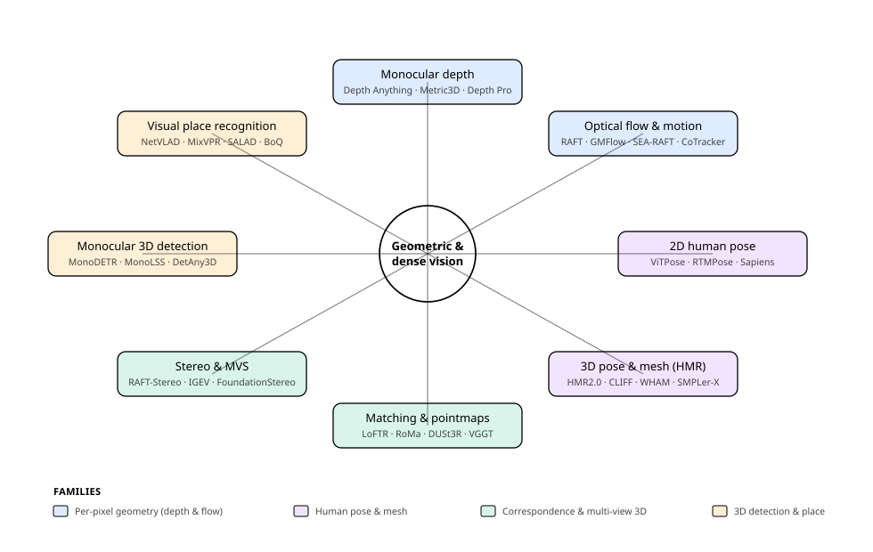
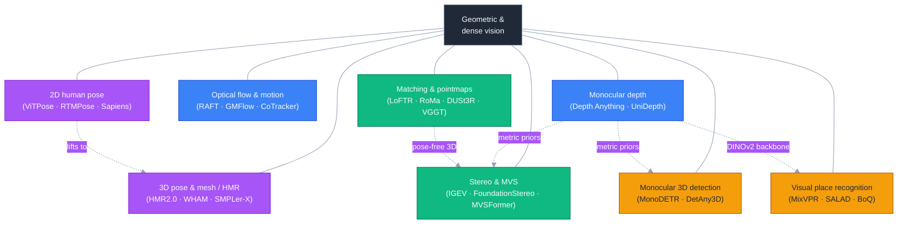
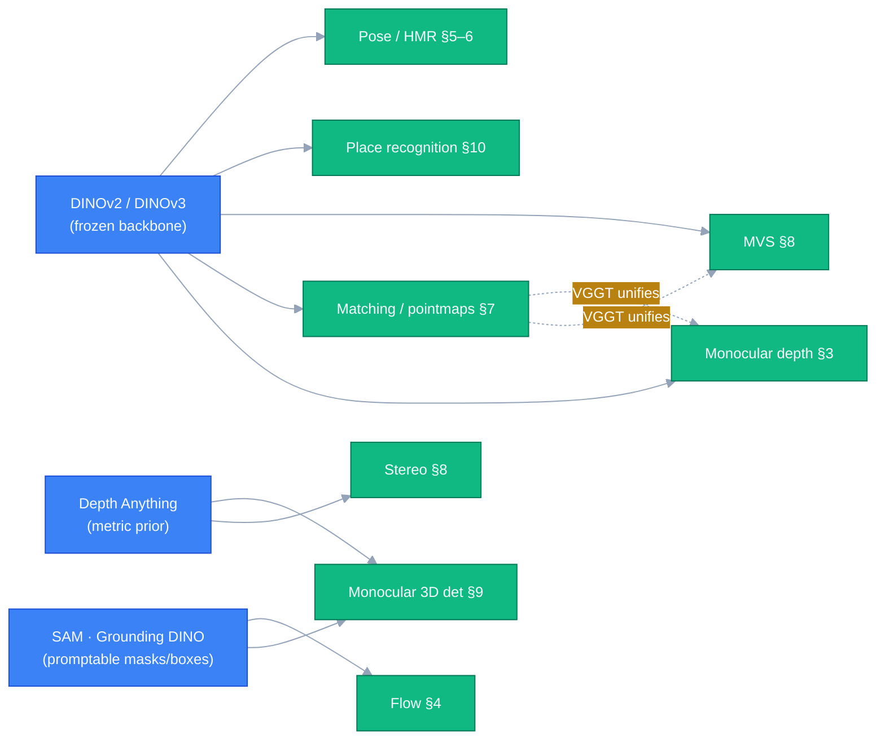

# Dense Object Detection & Classification — Recent Advances

*Compiled 2026-Jun-22 (America/Los_Angeles).*

Next installment in the running CV-updates log. Earlier entries on
`main`:
[Apr-30](../2026-Apr-30/2026-Apr-30_CV_updates.md),
[May-01](../2026-May-01/2026-May-01_CV_updates.md),
[May-02](../2026-May-02/2026-May-02_CV_updates.md),
[May-04](../2026-May-04/2026-May-04_CV_updates.md),
[May-05](../2026-May-05/2026-May-05_CV_updates.md),
[May-07](../2026-May-07/2026-May-07_CV_updates.md),
[May-08](../2026-May-08/2026-May-08_CV_updates.md),
[May-15](../2026-May-15/2026-May-15_CV_updates.md),
[May-16](../2026-May-16/2026-May-16_CV_updates.md),
[May-17](../2026-May-17/2026-May-17_CV_updates.md),
[Jun-09](../2026-Jun-09/2026-Jun-09_CV_updates.md),
[Jun-10](../2026-Jun-10/2026-Jun-10_CV_updates.md),
[Jun-12](../2026-Jun-12/2026-Jun-12_CV_updates.md),
[Jun-15](../2026-Jun-15/2026-Jun-15_CV_updates.md),
[Jun-16](../2026-Jun-16/2026-Jun-16_CV_updates.md),
[Jun-17](../2026-Jun-17/2026-Jun-17_CV_updates.md),
[Jun-19](../2026-Jun-19/2026-Jun-19_CV_updates.md),
[Jun-21](../2026-Jun-21/2026-Jun-21_CV_updates.md).
Across ~170 dedicated sections, those passes worked the *semantic /
instance / relational* half of dense vision very hard — the real-time
detector race (YOLO/DETR/DEIM), oriented & aerial detection,
camouflaged/salient/glass/shadow/small/infrared objects, open-world and
long-tailed *recognition*, promptable & panoptic segmentation, video
instance/panoptic segmentation, HOI, object counting, few-shot &
open-vocabulary detection, end-to-end MOT, scene graphs, and the
medical / industrial verticals.

What they have **not** given dedicated sections to is the *other* half
of dense vision: the **geometric & correspondence** problems — recover
where every pixel is in 3D, how it moves, how two views relate, and
where the camera is. That half has gone through its own foundation-model
revolution in 2023–2026, largely in parallel to the detector world.
Today's pass rotates entirely to it, with **eight fresh threads**:

- **Monocular depth estimation** (Depth Anything → metric foundation models)
- **Optical flow & dense motion** (RAFT lineage + point tracking)
- **2D human pose & keypoint estimation** (ViTPose → Sapiens; real-time RTMPose)
- **3D human pose & mesh recovery** (HMR2.0 → world-coordinate WHAM/TRAM)
- **Local feature matching & two-view geometry** (LoFTR → RoMa → DUSt3R → VGGT)
- **Stereo matching & multi-view stereo** (RAFT-Stereo → IGEV → FoundationStereo)
- **Monocular 3D object detection** (MonoDETR → open-vocabulary DetAny3D)
- **Visual place recognition** (NetVLAD → frozen-DINOv2 SALAD/BoQ)

> Scope note. Links below are arXiv `abs` pages, official GitHub repos,
> or publisher pages (CVF / IEEE / NeurIPS / ICLR / TPAMI / Nature
> Comms) cross-checked during research. arXiv direct-fetch was
> egress-blocked in the research environment, so each ID was corroborated
> against arXiv's own indexed result title **and** the method's official
> GitHub README — strong two-source matching, not a first-hand abstract
> read. Several influential works exist only as conference/journal
> versions with **no standalone arXiv preprint** (PETR-pose, SMPL, MPII,
> YOLOv8-pose, MonoUNI, GeoMVSNet, DLNR, Any-Stereo); those are flagged
> in-line and cited via their venue. A few very recent 2025 preprints
> (MonSter++, MVSAnywhere, RoMa v2, Pi3, LocateAnything3D) are flagged as
> preprints to verify before formal citation. Benchmark numbers are
> as-reported by authors, rounded, on differing backbones / resolutions /
> protocols — not a leaderboard.

---

## Table of contents

1. [What's new this pass](#1-whats-new-this-pass)
2. [Topic map](#2-topic-map)
3. [Monocular depth estimation](#3-monocular-depth-estimation)
4. [Optical flow & dense motion estimation](#4-optical-flow--dense-motion-estimation)
5. [2D human pose & keypoint estimation](#5-2d-human-pose--keypoint-estimation)
6. [3D human pose & mesh recovery](#6-3d-human-pose--mesh-recovery)
7. [Local feature matching & two-view geometry](#7-local-feature-matching--two-view-geometry)
8. [Stereo matching & multi-view stereo](#8-stereo-matching--multi-view-stereo)
9. [Monocular 3D object detection](#9-monocular-3d-object-detection)
10. [Visual place recognition](#10-visual-place-recognition)
11. [Cross-cutting theme: the pointmap pivot](#11-cross-cutting-theme-the-pointmap-pivot)
12. [Reading list](#12-reading-list)

---

## 1. What's new this pass

| Thread | One-line take |
| --- | --- |
| Monocular depth | Relative-depth generalization is near-solved by data-engine foundation models (**Depth Anything V1/V2**); the live frontier is *metric* depth without intrinsics (**ZoeDepth → Metric3D(v2) → UniDepth → Depth Pro**) and diffusion priors collapsing to a single step (**Marigold → Lotus / DepthFM**); video adds temporal consistency (**Video Depth Anything, DepthCrafter, RollingDepth**). |
| Optical flow | RAFT's iterative GRU refinement remains the backbone, but **global matching** (**GMFlow / UniMatch**) and transformers (**FlowFormer++**) reframed it, then **SEA-RAFT** simplified/sped it up; **MemFlow** adds video memory. A parallel **point-tracking (TAP)** paradigm (**CoTracker3, BootsTAPIR, LocoTrack**) tracks arbitrary points through occlusion, increasingly via self-supervised real-video bootstrapping. |
| 2D human pose | Plain ViTs won (**ViTPose / ViTPose++ → Sapiens**, pretrained on Humans-300M); end-to-end set prediction killed the detect-then-crop split (**PETR → ED-Pose → GroupPose**); real-time runs on coordinate-classification heads (**SimCC → RTMPose / RTMO / RTMW**) with cheap **distillation** (**DWPose**). |
| 3D pose & HMR | Single-image SMPL regression went fully transformer (**HMR2.0**, **CLIFF** for global rotation, **TokenHMR**), then generalist/foundation (**SMPLer-X**, **NLF**); the big shift is **world-coordinate** human motion from video by fusing learned motion priors with SLAM (**WHAM, TRAM**), with whole-body SMPL-X now standard (**Multi-HMR, OSX**). |
| Matching & pointmaps | The detect-describe-match pipeline collapsed: detector-free semi-dense (**LoFTR**) → fully dense (**DKM / RoMa** on frozen DINOv2) → and then **DUSt3R**'s *pointmaps* dissolved matching+depth+pose+intrinsics into one feed-forward output. **VGGT** (CVPR 2025 Best Paper) unified it across N views in <1s; **Fast3R / CUT3R / Pi3** scale and streaming-ize it. |
| Stereo & MVS | Iterative geometry-encoding volumes dominate stereo (**RAFT-Stereo → IGEV / IGEV++ → Selective-Stereo / NMRF**); the 2025 story is **zero-shot generalization** via foundation models and monocular-depth priors (**FoundationStereo, MonSter, DEFOM-Stereo**). MVS went transformer (**MVSFormer / ++**) and is being absorbed into the pose-free pointmap paradigm. |
| Monocular 3D det. | DETR query detectors took over KITTI (**MonoDETR → MonoCD / MonoDGP**), depth stays the bottleneck so the field now imports **depth foundation models** (**MonoDINO-DETR**) and pivots to **open-vocabulary / promptable** 3D detection (**OVMono3D, DetAny3D**) — novel categories and arbitrary intrinsics. |
| Place recognition | The frozen-**DINOv2** pivot reset the field: training-free **AnyLoc** beat trained CNNs, then **SALAD** (optimal-transport aggregation) and **BoQ** (learnable query bank) on DINOv2 features saturated Pitts/MSLS, pushing evaluation to harder appearance-change sets (Nordland, Tokyo24/7). |

---

## 2. Topic map

A standalone SVG topic map (light/dark-safe via `currentColor` strokes
and semi-transparent fills):

A Mermaid version of the same lattice:

**Two organizing axes.** Vertically, the eight threads split by *what is
recovered*: per-pixel geometry from one image (depth, flow),
human-centric structure (2D/3D pose), pairwise/multi-view correspondence
(matching, stereo/MVS), and 3D-aware recognition (monocular detection,
place recognition). Horizontally, almost every thread now shares the same
two engines — a **frozen vision foundation backbone** (DINOv2 above all)
and a **feed-forward "predict-the-geometry-directly"** design that
replaces hand-built optimization. §11 returns to that convergence.

---

## 3. Monocular depth estimation

Predicting depth from a single RGB image is ill-posed — a 2D projection
discards scale — so the field splits on *what kind* of depth.
**Affine-invariant (relative)** depth is correct only up to an unknown
global scale-and-shift (fit per image before evaluation); it generalizes
beautifully but is not directly measurable. **Metric** depth is absolute
meters; far more useful downstream, far more sensitive to camera and
domain shift. The dominant 2024–2026 recipe is to train relative depth on
enormous data, then extend to metric. Metrics: **AbsRel** (relative
error, lower better) and **δ1** (fraction of pixels within 1.25× of GT,
higher better), on NYUv2 (indoor) and KITTI (outdoor), plus zero-shot
suites (ETH3D, ScanNet, DIODE, Sintel).

**The MiDaS recipe underneath everything.** MiDaS established
multi-dataset mixing with a scale-and-shift-invariant loss for robust
zero-shot relative depth, with [**DPT**](https://arxiv.org/abs/2103.13413)
(ICCV 2021) the standard transformer decoder head. Essentially every
later foundation model is *affine-invariant loss + multi-dataset mix +
DPT head*, scaled up.

**The data-engine foundation models.**
[**Depth Anything**](https://arxiv.org/abs/2401.10891) (CVPR 2024) builds
a data engine that auto-labels ~62M unlabeled images with a teacher,
training a DINOv2+DPT student into a relative-depth foundation model.
[**Depth Anything V2**](https://arxiv.org/abs/2406.09414) (NeurIPS 2024)
swaps real labels for a *synthetic-only* teacher then re-labels real data
as pseudo-GT, yielding much finer detail and ~10× faster inference than
diffusion estimators (metric ViT-L: KITTI ~0.074 AbsRel / ~0.946 δ1).

**Metric depth without metadata.** A parallel line attacks absolute
scale. [**ZoeDepth**](https://arxiv.org/abs/2302.12288) (2023) bridges
relative→metric with per-domain "metric bins" heads + a router.
[**Metric3D**](https://arxiv.org/abs/2307.10984) (ICCV 2023) makes
zero-shot metric depth work across cameras via a *canonical camera-space*
transform that decouples intrinsics;
[**Metric3Dv2**](https://arxiv.org/abs/2404.15506) (TPAMI 2024) adds
surface normals as a joint geometric foundation model.
[**UniDepth**](https://arxiv.org/abs/2403.18913) (CVPR 2024) predicts
metric depth *and* the camera via a self-promptable camera module and a
pseudo-spherical output that disentangles camera from depth
([**UniDepthV2**](https://arxiv.org/abs/2502.20110), 2025, adds
edge-guided loss + uncertainty). [**Depth Pro**](https://arxiv.org/abs/2410.02073)
(Apple, ICLR 2025) produces sharp metric depth in <1s with *no* camera
metadata — it estimates focal length itself — via a multi-scale ViT.

**Diffusion priors, then their collapse to one step.**
[**Marigold**](https://arxiv.org/abs/2312.02145) (CVPR 2024 Oral)
repurposes Stable Diffusion as an affine-invariant depth estimator
fine-tuned on *synthetic only*, with striking detail (NYUv2 ~0.055–0.059
AbsRel) — but multi-step and slow. The follow-ups remove that cost:
[**Lotus**](https://arxiv.org/abs/2409.18124) (ICLR 2025) reformulates to
single-step x0-prediction for depth+normals, and
[**DepthFM**](https://arxiv.org/abs/2403.13788) (AAAI 2025 Oral) uses
flow-matching (image→depth) to distill SD into near-single-step
inference.

**Temporal consistency for video.** Per-frame depth flickers, so two
camps stabilize it. *Video-diffusion:*
[**ChronoDepth**](https://arxiv.org/abs/2406.01493) (ECCV 2024),
[**DepthCrafter**](https://arxiv.org/abs/2409.02095) (CVPR 2025), and
[**RollingDepth**](https://arxiv.org/abs/2411.19189) (CVPR 2025; "video
depth without video models", frame-triplet LDM + registration).
*Fast feed-forward:*
[**Video Depth Anything**](https://arxiv.org/abs/2501.12375) (CVPR 2025)
extends DA-V2 to temporally consistent depth on arbitrarily long video.

**Takeaway.** Relative-depth generalization is effectively a solved
foundation-model problem; the action moved to (1) *metric* depth via
camera-aware / intrinsics-free designs that increasingly predict "metric
3D points + camera + normals" together, (2) generative priors squeezed
from multi-step diffusion down to one step, and (3) temporal consistency.
Crucially, these depth models are becoming *upstream priors* for the
later sections — stereo (§8) and monocular 3D detection (§9) now import
them directly.

---

## 4. Optical flow & dense motion estimation

Optical flow estimates a dense per-pixel 2D motion field between two
frames. The modern era starts with [**RAFT**](https://arxiv.org/abs/2003.12039)
(ECCV 2020 Best Paper): per-pixel features → a 4D all-pairs correlation
volume → a recurrent GRU that iteratively refines a single full-resolution
flow field. It is still the architectural anchor. Metrics: **EPE**
(end-point error) on Sintel (clean vs the harder final pass) and
**Fl-all** (outlier %) on KITTI-2015; the standard schedule is
FlyingChairs → FlyingThings3D ("C+T") → fine-tune on Sintel+KITTI+HD1K.

**The two reframings: global matching and transformers.**
[**GMFlow**](https://arxiv.org/abs/2111.13680) (CVPR 2022 Oral) recasts
flow as *global* softmax feature matching, where a single refinement step
rivals 31-iteration RAFT; [**UniMatch**](https://arxiv.org/abs/2211.05783)
(TPAMI 2023) generalizes that one backbone to flow, stereo, *and* depth
as a unified dense-matching problem. In parallel,
[**FlowFormer**](https://arxiv.org/abs/2203.16194) (ECCV 2022) tokenizes
the cost volume into a transformer "cost memory," and
[**FlowFormer++**](https://arxiv.org/abs/2303.01237) (CVPR 2023) adds
MAE-style masked cost-volume pretraining.

**Simplify and speed up.**
[**SEA-RAFT**](https://arxiv.org/abs/2405.14793) (ECCV 2024 Oral) is a
simpler, faster, more robust RAFT — a mixture-of-Laplace loss, direct
initial-flow regression, and rigid-motion pretraining.
[**CCMR**](https://arxiv.org/abs/2311.02661) (WACV 2024) does
coarse-to-fine multi-scale recurrence with attention-based context
grouping. For video, [**MemFlow**](https://arxiv.org/abs/2404.04808)
(CVPR 2024) reads/updates a memory of historical motion in real time (and
can predict future flow), and [**SAMFlow**](https://arxiv.org/abs/2307.16586)
(AAAI 2024) injects a SAM encoder so flow respects object integrity.

**The parallel paradigm: point tracking (TAP).** Rather than dense
two-frame flow, "track any point" follows arbitrary query points across a
whole video through occlusion. [**PIPs**](https://arxiv.org/abs/2204.04153)
(ECCV 2022) revived the idea as multi-frame trajectories;
[**TAPIR**](https://arxiv.org/abs/2306.08637) (ICCV 2023) added a
matching-then-refine two stage; [**CoTracker**](https://arxiv.org/abs/2307.07635)
(ECCV 2024) tracks many points *jointly* via inter-point attention. The
2024–2025 shift is to **self-supervised real-video bootstrapping**:
[**BootsTAPIR**](https://arxiv.org/abs/2402.00847) (ACCV 2024) and
[**CoTracker3**](https://arxiv.org/abs/2410.11831) (ICCV 2025) reach SOTA
with ~1000× less labeled data (CoTracker3 ~76.1 AJ on TAP-Vid-DAVIS), and
[**LocoTrack**](https://arxiv.org/abs/2407.15420) (ECCV 2024) uses local
4D correlation for ~6× speedups. (3D dense motion / scene flow is moving
to LiDAR-native 4D voxel nets like
[**Flow4D**](https://arxiv.org/abs/2407.07995) and self-supervised
[**SeFlow**](https://arxiv.org/abs/2407.01702).)

**Takeaway.** Flow consolidated around three moves — iterative refinement
→ global matching, unified flow/stereo/depth architectures, and temporal
memory — while *point tracking* emerged as a parallel dense-motion
paradigm now driven by self-supervised bootstrapping on real video rather
than synthetic-only training.

---

## 5. 2D human pose & keypoint estimation

Human pose estimation localizes body keypoints; as a structured detection
problem it is scored with **OKS-based AP** (Object Keypoint Similarity
playing IoU's role) on COCO, with CrowdPose (crowding), OCHuman
(occlusion) and MPII (PCKh; *no arXiv* — CVPR 2014) as stress tests. Two
axes organize the field: *paradigm* (top-down: detect boxes then estimate
per crop — accurate, cost scales with people; bottom-up: detect all
keypoints then group; one-stage: predict people+keypoints in a single
pass) and *output head* (heatmap; direct regression; or
**coordinate-classification**).

**Plain ViTs took over.** [**TokenPose**](https://arxiv.org/abs/2104.03516)
(ICCV 2021) made each keypoint a learnable token attending to image
patches. [**ViTPose**](https://arxiv.org/abs/2204.12484) (NeurIPS 2022)
showed a *plain*, non-hierarchical ViT encoder + a lightweight decoder is
simple and scales — up to ~80.9 AP COCO test-dev at billion-scale.
[**ViTPose++**](https://arxiv.org/abs/2212.04246) (TPAMI 2023) factors
knowledge via MoE-FFN to cover human, whole-body, and animal pose in one
backbone. The high-water mark is
[**Sapiens**](https://arxiv.org/abs/2408.12569) (ECCV 2024 Oral): a
high-resolution ViT family self-supervised-pretrained on **Humans-300M**,
with native 1K inference and one backbone serving 2D pose, body-part
segmentation, depth, and normals (whole-body AP scales 62.0→74.5 from
0.3B→2B params).

**End-to-end set prediction.** The detect-then-crop/group split gave way
to single-pass transformers. **PETR** (CVPR 2022; *no arXiv preprint* —
do not confuse with the unrelated 3D-detection "PETR") did the first
fully end-to-end multi-person pose; [**ED-Pose**](https://arxiv.org/abs/2302.01593)
(ICLR 2023) recasts it as explicit human + per-keypoint box detection
(~76.6 AP CrowdPose); [**GroupPose**](https://arxiv.org/abs/2308.07313)
(ICCV 2023) is a clean DETR baseline using grouped self-attention with no
human-box supervision.

**Real-time on coordinate classification.** The practical-deployment line
is built on [**SimCC**](https://arxiv.org/abs/2107.03332) (ECCV 2022),
which treats localization as two 1D classification problems (x-bins,
y-bins) per joint — dropping upsampling/refinement, best at low
resolution. [**RTMPose**](https://arxiv.org/abs/2303.07399) (2023) pairs
SimCC with a CSPNeXt backbone (RTMPose-m ~75.8 AP COCO at 430+ FPS);
[**RTMO**](https://arxiv.org/abs/2312.07526) (CVPR 2024) brings real-time
*one-stage* multi-person to a YOLO-style architecture (~74.8 AP @141
FPS); [**RTMW**](https://arxiv.org/abs/2407.08634) (2024) is the first
open-source whole-body model >70 AP. [**YOLO-Pose**](https://arxiv.org/abs/2204.06806)
(CVPRW 2022) folds heatmap-free pose into a YOLO pass optimizing OKS
directly (the productized **YOLOv8-pose / YOLO-NAS-Pose** have *no arXiv*
— library releases). [**DWPose**](https://arxiv.org/abs/2307.15880)
(ICCV 2023 workshop) uses two-stage distillation to lift whole-body
accuracy cheaply and is the common ControlNet pose preprocessor.

**Promptable & animal pose.** [**X-Pose**](https://arxiv.org/abs/2310.08530)
(ECCV 2024, ex-UniPose) is a promptable "detect any keypoint" model
spanning humans, animals, and objects; foundation animal-pose
([**SuperAnimal / DeepLabCut**](https://arxiv.org/abs/2203.07436), Nature
Comms 2024) brings 45+ species with no new labels, on benchmarks like
[**APT-36K**](https://arxiv.org/abs/2206.05683) and
[**APTv2**](https://arxiv.org/abs/2312.15612).

**Takeaway.** 2D pose mirrors the detector world a beat ahead: plain-ViT
+ scale + self-supervised pretraining for accuracy (ViTPose→Sapiens),
end-to-end set prediction to remove the crop/group stages, and
coordinate-classification + distillation for real time.

---

## 6. 3D human pose & mesh recovery

Human Mesh Recovery (HMR) regresses a full parametric 3D body —
[**SMPL**](https://smpl.is.tue.mpg.de/) (SIGGRAPH Asia 2015; *no arXiv*),
6890 vertices from pose θ + shape β, or expressive
[**SMPL-X**](https://arxiv.org/abs/1904.05866) (CVPR 2019) adding hands +
face. Metrics: **MPJPE** (root-aligned joint error), **PA-MPJPE**
(Procrustes-aligned — pose shape only), **PVE/MPVPE** (per-vertex), on
3DPW and Human3.6M; world-coordinate work adds drift-sensitive
**W-/WA-MPJPE** on [**EMDB**](https://arxiv.org/abs/2308.16894) (ICCV
2023).

**Single-image regression went fully transformer.**
[**HMR2.0 / 4DHumans**](https://arxiv.org/abs/2305.20091) (ICCV 2023)
is a fully transformerized ViT SMPL regressor with a 3D-tracking video
front-end. [**CLIFF**](https://arxiv.org/abs/2208.00571) (ECCV 2022 Oral)
feeds the bounding-box location into the cropped regressor so global
rotation is correct in the *full-frame* camera (and doubles as a
pseudo-GT annotator). [**PARE**](https://arxiv.org/abs/2104.08527) (ICCV
2021) uses body-part attention so occluded parts are inferred from
visible neighbors. [**TokenHMR**](https://arxiv.org/abs/2404.16752) (CVPR
2024) adds a tokenized pose prior + threshold-adaptive loss scaling to
better exploit 2D data (~7.6% lower error than HMR2.0 on EMDB).

**Generalist & continuous models.**
[**SMPLer-X**](https://arxiv.org/abs/2309.17448) (NeurIPS 2023) is the
first generalist *foundation* model for expressive (SMPL-X) pose & shape
— ViT-Huge, ~4.5M instances, 32 datasets.
[**NLF**](https://arxiv.org/abs/2407.07532) (Neural Localizer Fields,
NeurIPS 2024) learns a continuous neural field of point-localizers so any
3D body point can be queried, trained across heterogeneous annotations
(~68.4 MPJPE EMDB). [**Multi-HMR**](https://arxiv.org/abs/2402.14654)
(ECCV 2024) does single-shot *multi-person* whole-body SMPL-X with
camera-frame 3D location.

**The world-coordinate shift.** The biggest recent move is recovering
human motion in *world* coordinates from video by fusing learned motion
priors with camera-motion estimation.
[**WHAM**](https://arxiv.org/abs/2312.07531) (CVPR 2024) lifts 2D-keypoint
sequences to 3D motion (trained on AMASS) and fuses SLAM angular velocity
+ contact-aware trajectory refinement (3DW PA-MPJPE ~35.9).
[**TRAM**](https://arxiv.org/abs/2403.17346) (ECCV 2024) robustifies
DROID-SLAM by masking dynamic humans for metric camera motion, then a
VIMO video transformer for body motion — cutting global motion error
~60%. Whole-body single-shot is now standard
([**OSX**](https://arxiv.org/abs/2303.16160), CVPR 2023;
[**Hand4Whole**](https://arxiv.org/abs/2011.11534);
[**PIXIE**](https://arxiv.org/abs/2105.05301)).

**Takeaway.** HMR followed 2D pose into plain-ViT + scale + generalist
foundation models, but its distinctive 2024–2026 contribution is
**world-coordinate human motion from video** — pose estimation fused with
SLAM, evaluated by new drift-aware metrics — plus the normalization of
whole-body SMPL-X.

---

## 7. Local feature matching & two-view geometry

Establishing correspondences between two images is the substrate of SfM,
SLAM, localization, and 3D reconstruction. The classical pipeline is
*detect → describe → match*; the 2021–2026 story is its progressive
collapse. Metrics: relative-pose **AUC@5/10/20°** on MegaDepth-1500
(outdoor) and ScanNet-1500 (indoor, low-texture), plus HPatches homography.

**Sparse, then learned matching.**
[**SuperPoint**](https://arxiv.org/abs/1712.07629) (CVPRW 2018) jointly
detects keypoints + descriptors self-supervised;
[**SuperGlue**](https://arxiv.org/abs/1911.11763) (CVPR 2020 Oral) matches
two feature sets with an attention GNN + optimal transport.
[**LightGlue**](https://arxiv.org/abs/2306.13643) (ICCV 2023) makes it
adaptive (depth/width scale to pair difficulty) — faster, more accurate,
easier to train (~49.9 AUC@5° MegaDepth with SuperPoint).
[**ALIKED**](https://arxiv.org/abs/2304.03608) (T-IM 2023) and the
real-time CPU-friendly [**XFeat**](https://arxiv.org/abs/2404.19174)
(CVPR 2024) push the lightweight sparse track.

**Detector-free, semi-dense to dense.**
[**LoFTR**](https://arxiv.org/abs/2104.00680) (CVPR 2021) removed the
detector entirely, doing coarse-to-fine transformer matching that wins in
low texture; [**ASpanFormer**](https://arxiv.org/abs/2208.14201) (ECCV
2022) adapts attention span via flow guidance. The dense line —
[**DKM**](https://arxiv.org/abs/2202.00667) (CVPR 2023) and especially
[**RoMa**](https://arxiv.org/abs/2305.15404) (CVPR 2024), which pairs
frozen **DINOv2** coarse features with a robust regression-by-classification
loss — tops the classic-matcher leaderboard (~62.6 AUC@5° MegaDepth; a
DINOv3-based [**RoMa v2**](https://arxiv.org/abs/2511.15706) preprint
followed). [**GIM**](https://arxiv.org/abs/2402.11095) (ICLR 2024) learns
a single generalizable matcher from internet video via self-training.

**The pointmap revolution.** [**DUSt3R**](https://arxiv.org/abs/2312.14132)
(CVPR 2024) reframed the whole problem: regress dense **pointmaps**
directly from an uncalibrated image pair — *no intrinsics, no poses* —
folding matching, depth, pose, and reconstruction into one output.
[**MASt3R**](https://arxiv.org/abs/2406.09756) (ECCV 2024 Oral) adds a
dense local-feature head grounding 2D matching as a 3D task;
[**MASt3R-SfM**](https://arxiv.org/abs/2409.19152) (3DV 2025) turns it into
a near-training-free SfM. The paradigm then scaled and streaming-ized:
[**Spann3R**](https://arxiv.org/abs/2408.16061) (spatial memory → global
frame, no global alignment), [**MonST3R**](https://arxiv.org/abs/2410.03825)
(dynamic scenes), [**Fast3R**](https://arxiv.org/abs/2501.13928) (1000+
views in one pass), [**CUT3R**](https://arxiv.org/abs/2501.12387)
(persistent recurrent state, online), and
[**Pi3 / π³**](https://arxiv.org/abs/2507.13347) (permutation-equivariant,
no fixed reference view). The inflection point is
[**VGGT**](https://arxiv.org/abs/2503.11651) (CVPR 2025 **Best Paper**): a
single feed-forward transformer that infers intrinsics, extrinsics,
depth, pointmaps, and 3D tracks for 1→hundreds of views in <1s, now used
as a downstream backbone.

**Takeaway.** Matching collapsed from a four-stage pipeline into a single
feed-forward 3D predictor: detector-free (LoFTR) → dense on frozen DINOv2
(RoMa) → pointmaps that dissolve the explicit matching stage (DUSt3R) →
unified, optimization-free geometry transformers (VGGT). This is the
clearest instance of the cross-cutting theme in §11.

---

## 8. Stereo matching & multi-view stereo

Given calibrated multiple views, stereo (two rectified images) and MVS
(many posed images) recover dense geometry from *correspondence* rather
than from monocular priors. Stereo metrics: **EPE** (Scene Flow),
**D1-all** (KITTI 3-px outlier %), bad-2.0/bad-1.0 (Middlebury/ETH3D).
MVS metrics: Accuracy/Completeness/Overall mm (DTU), F-score (Tanks &
Temples).

**Iterative geometry-encoding volumes dominate stereo.**
[**RAFT-Stereo**](https://arxiv.org/abs/2109.07547) (3DV 2021 Best Student
Paper) adapts RAFT's multi-level ConvGRU recurrence to disparity.
[**IGEV-Stereo**](https://arxiv.org/abs/2303.06615) (CVPR 2023) builds a
*combined geometry encoding volume* for a strong init it then
ConvGRU-indexes (Scene Flow EPE ~0.47 vs RAFT ~0.61, and far faster);
[**IGEV++**](https://arxiv.org/abs/2409.00638) (TPAMI 2025) adds
multi-range volumes for large disparities (Middlebury bad-2.0 ~3.23%).
[**CREStereo**](https://arxiv.org/abs/2203.11483) (CVPR 2022 Oral)
cascades recurrent refinement with adaptive group correlation;
[**Selective-Stereo**](https://arxiv.org/abs/2403.00486) (CVPR 2024) fuses
multi-frequency disparity (edges vs smooth);
[**NMRF-Stereo**](https://arxiv.org/abs/2403.11193) (CVPR 2024) revives a
neural Markov random field with learned potentials + message passing
(<100 ms, top KITTI). (**DLNR**, CVPR 2023, and **Any-Stereo**, AAAI
2024, are *no-arXiv* — cite CVF/AAAI.)

**The 2025 zero-shot / foundation wave.** The headline shift is
generalizing across domains without per-dataset fine-tuning.
[**FoundationStereo**](https://arxiv.org/abs/2501.09898) (CVPR 2025 Oral,
Best Paper nom., NVIDIA) trains on ~1M self-curated synthetic pairs and
side-tunes a backbone adapting Depth Anything V2 monocular priors, with
long-range cost-volume reasoning → strong zero-shot Middlebury/ETH3D/KITTI.
A cluster of 2025 work couples monocular-depth foundation priors into
stereo for textureless/occluded regions:
[**MonSter**](https://arxiv.org/abs/2501.08643) (dual mono+stereo branches
that refine each other) and
[**DEFOM-Stereo**](https://arxiv.org/abs/2501.09466).

**MVS went transformer, then pose-free.** [**MVSNet**](https://arxiv.org/abs/1804.02505)
(ECCV 2018) set the template — differentiable homography warping into a
cost volume regularized by a 3D-CNN.
[**MVSFormer**](https://arxiv.org/abs/2208.02541) (TMLR 2023) injects
pretrained ViT features; [**MVSFormer++**](https://arxiv.org/abs/2401.11673)
(ICLR 2024) adds a DINOv2 encoder + side-view attention (Tanks & Temples
Intermediate ~67 F-score). **GeoMVSNet** (CVPR 2023; *arXiv ID
unverified* — cite CVF) propagates geometric priors coarse-to-fine (DTU
~0.295 mm). And the pose-free pointmap models of §7 (DUSt3R → VGGT,
plus zero-shot [**MVSAnywhere**](https://arxiv.org/abs/2503.22430)) are
absorbing classical MVS into calibration-free feed-forward reconstruction.

**Takeaway.** Stereo settled on iterative geometry-encoding-volume
refinement, then turned to **foundation-model zero-shot generalization**
and monocular-depth priors; MVS went transformer and is now being
re-subsumed by the pointmap paradigm — multi-view geometry and
single-image priors are converging rather than competing.

---

## 9. Monocular 3D object detection

Estimating 3D boxes (location, size, orientation) from a *single* camera
is the cheapest 3D-perception setup and the hardest: a single image lacks
metric depth, so accuracy is fundamentally bounded by predicted depth and
degrades with distance. This distinguishes it from **LiDAR** detection
(direct metric geometry, the accuracy ceiling — covered
[May-02](../2026-May-02/2026-May-02_CV_updates.md)), **multi-view BEV**
(surround cameras fused into a top-down grid, evaluated on nuScenes —
[Jun-16](../2026-Jun-16/2026-Jun-16_CV_updates.md)), and **point-cloud
classification** ([Jun-17](../2026-Jun-17/2026-Jun-17_CV_updates.md)).
Metric: **KITTI AP3D** for Car at IoU≥0.7, Easy/Moderate/Hard (the
**Moderate** column ranks leaderboards), plus nuScenes mAP/NDS.

**Geometry/keypoint CNNs.** [**MonoFlex**](https://arxiv.org/abs/2104.02323)
(CVPR 2021) decouples truncated objects and predicts depth as an
uncertainty-weighted ensemble of a direct regression + keypoint-geometric
solutions. [**GUPNet**](https://arxiv.org/abs/2107.13774) (ICCV 2021)
models geometry-guided depth *uncertainty* to tame the error
amplification of height→depth projection.
[**MonoCon**](https://arxiv.org/abs/2112.04628) (AAAI 2022) adds
training-only auxiliary 2D contexts (~26.3/19.0/16.0 E/M/H val).
[**DEVIANT**](https://arxiv.org/abs/2207.10758) (ECCV 2022) replaces
backbone blocks with depth-equivariant steerable convolutions for better
depth + cross-dataset transfer.

**The DETR transition.** [**MonoDTR**](https://arxiv.org/abs/2203.10981)
(CVPR 2022) is an end-to-end depth-aware transformer (LiDAR depth only at
training). [**MonoDETR**](https://arxiv.org/abs/2203.13310) (ICCV 2023) is
the first DETR for mono-3D: a foreground depth map + depth-guided
cross-attention, no anchors/NMS/dense-depth labels. Refinements followed:
[**MonoCD**](https://arxiv.org/abs/2404.03181) (CVPR 2024) adds a
*complementary* depth branch so multiple depth estimates stop sharing the
same error sign; [**MonoLSS**](https://arxiv.org/abs/2312.14474) (3DV
2024) learns which samples regress 3D properties (Gumbel-Softmax) +
MixUp3D (~26.1/19.2/16.9 test); [**MonoDGP**](https://arxiv.org/abs/2410.19590)
(CVPR 2025) replaces multi-depth prediction with perspective-invariant
*geometry-error* priors + a decoupled vision-only query decoder
(Moderate ~18.7 test). (**MonoUNI**, NeurIPS 2023, unifies
vehicle/infrastructure views via "normalized depth" — *no arXiv*, cite
the proceedings.)

**The foundation-model frontier.** The 2024–2026 pivot imports the depth
and VLM foundations of earlier sections.
[**MonoDINO-DETR**](https://arxiv.org/abs/2502.00315) (2025) puts a
DINOv2 backbone in a DETR detector with a DPT head initialized from Depth
Anything V2. The bigger shift is **open-vocabulary / promptable** 3D
detection: [**OVMono3D**](https://arxiv.org/abs/2411.16833) (3DV 2026)
lifts open-vocab 2D boxes (Grounding DINO) to 3D via metric depth
(UniDepth/Metric3D) on a DINOv2 backbone — zero-shot to unseen
categories; [**DetAny3D**](https://arxiv.org/abs/2504.07958) (ICCV 2025)
is a promptable monocular-3D *foundation* model generalizing to novel
objects and *arbitrary camera intrinsics* by aggregating SAM + Grounding
DINO + UniDepth. (The older pseudo-LiDAR lineage —
[**Pseudo-LiDAR**](https://arxiv.org/abs/1812.07179) (CVPR 2019),
[**DD3D**](https://arxiv.org/abs/2108.06417),
[**CaDDN**](https://arxiv.org/abs/2103.01100) — is being revived through
these depth foundation models.)

**Takeaway.** Monocular 3D detection mirrors the 2D detector arc — DETR
queries displaced anchor/center heads — but its defining 2025–2026 move is
treating depth as an *imported* foundation-model prior and going
open-vocabulary, so the same DINOv2 / Depth Anything / Grounding DINO /
SAM stack that powers §3, §7, and §10 now drives camera-only 3D
detection.

---

## 10. Visual place recognition

Visual place recognition (VPR) — "have I been here before?" — is
image-retrieval cast as coarse localization: encode each image into a
global descriptor, then nearest-neighbor against a geotagged database.
It is the recognition counterpart to the geometry sections, and the
front end of every localization/SLAM loop. Metric: **Recall@N** (R@1
headline) on Pittsburgh (Pitts30k/250k), Mapillary Street-Level Sequences
(MSLS), and the harder appearance-change sets Nordland (seasonal) and
Tokyo24/7 (day–night).

**The classics.** [**NetVLAD**](https://arxiv.org/abs/1511.07247) (CVPR
2016) introduced a differentiable VLAD aggregation layer trained
weakly-supervised — still the universal baseline (~84–86% Pitts30k R@1).
[**GeM**](https://arxiv.org/abs/1711.02512) (TPAMI 2018) contributed
trainable generalized-mean pooling, now a standard component.
[**CosPlace**](https://arxiv.org/abs/2204.02287) (CVPR 2022) and
[**EigenPlaces**](https://arxiv.org/abs/2308.10832) (ICCV 2023) recast
city-scale VPR as *classification* (by geographic cell), avoiding
expensive pair/triplet mining and adding viewpoint robustness
(EigenPlaces ~89% Pitts30k R@1).

**Learned aggregation.** [**MixVPR**](https://arxiv.org/abs/2303.02190)
(WACV 2023) aggregates holistically via cascaded all-MLP feature-mixer
blocks (~94.6% Pitts250k R@1); [**BoQ**](https://arxiv.org/abs/2405.07364)
(CVPR 2024) probes backbone features with a fixed bank of *learnable
queries* via cross-attention, markedly better on hard sets (~70.7%
Nordland R@1 vs MixVPR ~58.4%).

**The frozen-DINOv2 pivot.** The field reset its default backbone after
[**AnyLoc**](https://arxiv.org/abs/2308.00688) (RA-L 2023) showed that
*training-free* aggregation (unsupervised VLAD/GeM) over **frozen
DINOv2** patch features beats trained CNNs and generalizes across domains
zero-shot (up to ~4× gains on OOD sets). The CVPR/ICLR-2024 wave builds on
DINOv2, typically frozen + lightweight adapters:
[**SALAD**](https://arxiv.org/abs/2311.15937) reformulates NetVLAD
soft-assignment as optimal transport solved with Sinkhorn (+ a "dustbin"
to drop uninformative features; ~92.2% MSLS-val R@1);
[**CricaVPR**](https://arxiv.org/abs/2402.19231) adds cross-image
correlation across a batch; and
[**SelaVPR**](https://arxiv.org/abs/2402.14505) (ICLR 2024) seamlessly
adapts DINOv2 with adapters and fuses global retrieval with dense-local
re-ranking, dropping costly RANSAC verification
([**SelaVPR++**](https://arxiv.org/abs/2502.16601), TPAMI 2025, follows).

**Takeaway.** VPR consolidated onto frozen DINOv2 features + clever
aggregation (optimal transport, learnable query banks), with
classification-style training and two-stage retrieve-then-rerank for
efficiency. Pitts/MSLS are now ~90%+ saturated, pushing evaluation toward
appearance-change and multi-domain suites — the same "frozen foundation
backbone + lightweight head" recipe that recurs across every section here.

---

## 11. Cross-cutting theme: the pointmap pivot

Read the eight sections together and two engines power almost all of
them.

**1. One frozen backbone, everywhere — and it is mostly DINOv2.** It is
the dense backbone of Depth Anything (§3), RoMa and DUSt3R-family
matchers (§7), MVSFormer++ (§8), MonoDINO-DETR / OVMono3D / DetAny3D
(§9), and the entire modern VPR stack (§10); plain-ViT scale + huge data
is also what made ViTPose→Sapiens (§5) and SMPLer-X/NLF (§6) win.
**Depth Anything** has itself become a *second* shared foundation — a
geometric prior imported downstream into stereo (FoundationStereo,
MonSter), MVS (MVSAnywhere, DVP-MVS), and monocular 3D detection. And
**SAM + Grounding DINO** supply promptable masks/boxes wherever
open-vocabulary or promptable behavior appears (SAMFlow, X-Pose,
OVMono3D, DetAny3D). The recurring research question is the same one §11
of the [Jun-21 pass](../2026-Jun-21/2026-Jun-21_CV_updates.md) named for
the semantic half: *how little task-specific data and how few trainable
parameters can ride on top of these frozen models.*

**2. Optimization → feed-forward, and the pointmap as the unifier.** The
deeper shift is representational. Classical geometric vision was a
pipeline of hand-built optimizers — detect/describe/match, then
RANSAC/bundle-adjustment/global-alignment. **DUSt3R's pointmap** (a dense
per-pixel 3D coordinate map, regressed directly) dissolved that: in one
feed-forward pass it yields depth, matches, pose, and intrinsics at once,
and **VGGT** (CVPR 2025 Best Paper) extended it to many views in under a
second. The same "predict the geometry directly, skip the optimizer"
instinct shows up as coordinate-classification heads in pose (§5),
regress-the-mesh HMR fused with SLAM (§6), and depth/flow foundation
models that replace per-scene fitting (§3–§4).

The semantic half of dense vision spent 2023–2026 consolidating onto
*one architecture, one weight set, one vocabulary*; the geometric half
covered here consolidated onto *one backbone and one feed-forward 3D
representation*. The two halves are now meeting — open-vocabulary
monocular 3D detection (§9) is literally a 2D open-vocab detector plus a
depth foundation model — which is the most likely place the next pass
picks up.

---

## 12. Reading list

**Monocular depth estimation**
- DPT (ICCV 2021) — [arXiv 2103.13413](https://arxiv.org/abs/2103.13413) · Depth Anything (CVPR 2024) — [arXiv 2401.10891](https://arxiv.org/abs/2401.10891) · Depth Anything V2 (NeurIPS 2024) — [arXiv 2406.09414](https://arxiv.org/abs/2406.09414)
- ZoeDepth (2023) — [arXiv 2302.12288](https://arxiv.org/abs/2302.12288) · Metric3D (ICCV 2023) — [arXiv 2307.10984](https://arxiv.org/abs/2307.10984) · Metric3Dv2 (TPAMI 2024) — [arXiv 2404.15506](https://arxiv.org/abs/2404.15506)
- UniDepth (CVPR 2024) — [arXiv 2403.18913](https://arxiv.org/abs/2403.18913) · UniDepthV2 (2025) — [arXiv 2502.20110](https://arxiv.org/abs/2502.20110) · Depth Pro (ICLR 2025) — [arXiv 2410.02073](https://arxiv.org/abs/2410.02073)
- Marigold (CVPR 2024) — [arXiv 2312.02145](https://arxiv.org/abs/2312.02145) · Lotus (ICLR 2025) — [arXiv 2409.18124](https://arxiv.org/abs/2409.18124) · DepthFM (AAAI 2025) — [arXiv 2403.13788](https://arxiv.org/abs/2403.13788)
- Video Depth Anything (CVPR 2025) — [arXiv 2501.12375](https://arxiv.org/abs/2501.12375) · ChronoDepth (ECCV 2024) — [arXiv 2406.01493](https://arxiv.org/abs/2406.01493) · DepthCrafter (CVPR 2025) — [arXiv 2409.02095](https://arxiv.org/abs/2409.02095) · RollingDepth (CVPR 2025) — [arXiv 2411.19189](https://arxiv.org/abs/2411.19189)

**Optical flow & dense motion**
- RAFT (ECCV 2020) — [arXiv 2003.12039](https://arxiv.org/abs/2003.12039) · GMFlow (CVPR 2022) — [arXiv 2111.13680](https://arxiv.org/abs/2111.13680) · UniMatch (TPAMI 2023) — [arXiv 2211.05783](https://arxiv.org/abs/2211.05783)
- FlowFormer (ECCV 2022) — [arXiv 2203.16194](https://arxiv.org/abs/2203.16194) · FlowFormer++ (CVPR 2023) — [arXiv 2303.01237](https://arxiv.org/abs/2303.01237)
- SEA-RAFT (ECCV 2024) — [arXiv 2405.14793](https://arxiv.org/abs/2405.14793) · CCMR (WACV 2024) — [arXiv 2311.02661](https://arxiv.org/abs/2311.02661) · MemFlow (CVPR 2024) — [arXiv 2404.04808](https://arxiv.org/abs/2404.04808) · SAMFlow (AAAI 2024) — [arXiv 2307.16586](https://arxiv.org/abs/2307.16586)
- PIPs (ECCV 2022) — [arXiv 2204.04153](https://arxiv.org/abs/2204.04153) · TAPIR (ICCV 2023) — [arXiv 2306.08637](https://arxiv.org/abs/2306.08637) · CoTracker (ECCV 2024) — [arXiv 2307.07635](https://arxiv.org/abs/2307.07635) · CoTracker3 (ICCV 2025) — [arXiv 2410.11831](https://arxiv.org/abs/2410.11831)
- LocoTrack (ECCV 2024) — [arXiv 2407.15420](https://arxiv.org/abs/2407.15420) · BootsTAPIR (ACCV 2024) — [arXiv 2402.00847](https://arxiv.org/abs/2402.00847) · Flow4D (RA-L 2025) — [arXiv 2407.07995](https://arxiv.org/abs/2407.07995) · SeFlow (ECCV 2024) — [arXiv 2407.01702](https://arxiv.org/abs/2407.01702)

**2D human pose & keypoint estimation**
- SimCC (ECCV 2022) — [arXiv 2107.03332](https://arxiv.org/abs/2107.03332) · TokenPose (ICCV 2021) — [arXiv 2104.03516](https://arxiv.org/abs/2104.03516)
- ViTPose (NeurIPS 2022) — [arXiv 2204.12484](https://arxiv.org/abs/2204.12484) · ViTPose++ (TPAMI 2023) — [arXiv 2212.04246](https://arxiv.org/abs/2212.04246) · Sapiens (ECCV 2024) — [arXiv 2408.12569](https://arxiv.org/abs/2408.12569)
- PETR (CVPR 2022, CVF-only) · ED-Pose (ICLR 2023) — [arXiv 2302.01593](https://arxiv.org/abs/2302.01593) · GroupPose (ICCV 2023) — [arXiv 2308.07313](https://arxiv.org/abs/2308.07313)
- RTMPose (2023) — [arXiv 2303.07399](https://arxiv.org/abs/2303.07399) · RTMO (CVPR 2024) — [arXiv 2312.07526](https://arxiv.org/abs/2312.07526) · RTMW (2024) — [arXiv 2407.08634](https://arxiv.org/abs/2407.08634) · YOLO-Pose (CVPRW 2022) — [arXiv 2204.06806](https://arxiv.org/abs/2204.06806) · DWPose (ICCV 2023 WS) — [arXiv 2307.15880](https://arxiv.org/abs/2307.15880)
- X-Pose (ECCV 2024) — [arXiv 2310.08530](https://arxiv.org/abs/2310.08530) · SuperAnimal/DeepLabCut (Nature Comms 2024) — [arXiv 2203.07436](https://arxiv.org/abs/2203.07436) · APT-36K (NeurIPS 2022) — [arXiv 2206.05683](https://arxiv.org/abs/2206.05683) · APTv2 (2023) — [arXiv 2312.15612](https://arxiv.org/abs/2312.15612)

**3D human pose & mesh recovery**
- SMPL (SIGGRAPH Asia 2015, journal-only) · SMPL-X (CVPR 2019) — [arXiv 1904.05866](https://arxiv.org/abs/1904.05866)
- HMR2.0 / 4DHumans (ICCV 2023) — [arXiv 2305.20091](https://arxiv.org/abs/2305.20091) · CLIFF (ECCV 2022) — [arXiv 2208.00571](https://arxiv.org/abs/2208.00571) · PARE (ICCV 2021) — [arXiv 2104.08527](https://arxiv.org/abs/2104.08527) · TokenHMR (CVPR 2024) — [arXiv 2404.16752](https://arxiv.org/abs/2404.16752)
- SMPLer-X (NeurIPS 2023) — [arXiv 2309.17448](https://arxiv.org/abs/2309.17448) · NLF (NeurIPS 2024) — [arXiv 2407.07532](https://arxiv.org/abs/2407.07532) · Multi-HMR (ECCV 2024) — [arXiv 2402.14654](https://arxiv.org/abs/2402.14654)
- WHAM (CVPR 2024) — [arXiv 2312.07531](https://arxiv.org/abs/2312.07531) · TRAM (ECCV 2024) — [arXiv 2403.17346](https://arxiv.org/abs/2403.17346)
- OSX (CVPR 2023) — [arXiv 2303.16160](https://arxiv.org/abs/2303.16160) · Hand4Whole (CVPRW 2022) — [arXiv 2011.11534](https://arxiv.org/abs/2011.11534) · PIXIE (3DV 2021) — [arXiv 2105.05301](https://arxiv.org/abs/2105.05301) · EMDB (ICCV 2023) — [arXiv 2308.16894](https://arxiv.org/abs/2308.16894)

**Local feature matching & two-view geometry**
- SuperPoint (CVPRW 2018) — [arXiv 1712.07629](https://arxiv.org/abs/1712.07629) · SuperGlue (CVPR 2020) — [arXiv 1911.11763](https://arxiv.org/abs/1911.11763) · LightGlue (ICCV 2023) — [arXiv 2306.13643](https://arxiv.org/abs/2306.13643) · ALIKED (T-IM 2023) — [arXiv 2304.03608](https://arxiv.org/abs/2304.03608) · XFeat (CVPR 2024) — [arXiv 2404.19174](https://arxiv.org/abs/2404.19174)
- LoFTR (CVPR 2021) — [arXiv 2104.00680](https://arxiv.org/abs/2104.00680) · ASpanFormer (ECCV 2022) — [arXiv 2208.14201](https://arxiv.org/abs/2208.14201) · DKM (CVPR 2023) — [arXiv 2202.00667](https://arxiv.org/abs/2202.00667) · RoMa (CVPR 2024) — [arXiv 2305.15404](https://arxiv.org/abs/2305.15404) · RoMa v2 (2025 preprint) — [arXiv 2511.15706](https://arxiv.org/abs/2511.15706) · GIM (ICLR 2024) — [arXiv 2402.11095](https://arxiv.org/abs/2402.11095)
- DUSt3R (CVPR 2024) — [arXiv 2312.14132](https://arxiv.org/abs/2312.14132) · MASt3R (ECCV 2024) — [arXiv 2406.09756](https://arxiv.org/abs/2406.09756) · MASt3R-SfM (3DV 2025) — [arXiv 2409.19152](https://arxiv.org/abs/2409.19152) · Spann3R (3DV 2025) — [arXiv 2408.16061](https://arxiv.org/abs/2408.16061) · MonST3R (ICLR 2025) — [arXiv 2410.03825](https://arxiv.org/abs/2410.03825)
- VGGT (CVPR 2025, Best Paper) — [arXiv 2503.11651](https://arxiv.org/abs/2503.11651) · Fast3R (CVPR 2025) — [arXiv 2501.13928](https://arxiv.org/abs/2501.13928) · CUT3R (CVPR 2025) — [arXiv 2501.12387](https://arxiv.org/abs/2501.12387) · Pi3 (2025 preprint) — [arXiv 2507.13347](https://arxiv.org/abs/2507.13347)

**Stereo matching & multi-view stereo**
- RAFT-Stereo (3DV 2021) — [arXiv 2109.07547](https://arxiv.org/abs/2109.07547) · CREStereo (CVPR 2022) — [arXiv 2203.11483](https://arxiv.org/abs/2203.11483) · IGEV-Stereo (CVPR 2023) — [arXiv 2303.06615](https://arxiv.org/abs/2303.06615) · IGEV++ (TPAMI 2025) — [arXiv 2409.00638](https://arxiv.org/abs/2409.00638)
- Selective-Stereo (CVPR 2024) — [arXiv 2403.00486](https://arxiv.org/abs/2403.00486) · NMRF-Stereo (CVPR 2024) — [arXiv 2403.11193](https://arxiv.org/abs/2403.11193) · DLNR (CVPR 2023, CVF-only) · Any-Stereo (AAAI 2024, AAAI-only)
- FoundationStereo (CVPR 2025) — [arXiv 2501.09898](https://arxiv.org/abs/2501.09898) · MonSter (2025) — [arXiv 2501.08643](https://arxiv.org/abs/2501.08643) · DEFOM-Stereo (CVPR 2025) — [arXiv 2501.09466](https://arxiv.org/abs/2501.09466)
- MVSNet (ECCV 2018) — [arXiv 1804.02505](https://arxiv.org/abs/1804.02505) · MVSFormer (TMLR 2023) — [arXiv 2208.02541](https://arxiv.org/abs/2208.02541) · MVSFormer++ (ICLR 2024) — [arXiv 2401.11673](https://arxiv.org/abs/2401.11673) · GeoMVSNet (CVPR 2023, CVF-only) · MVSAnywhere (CVPR 2025) — [arXiv 2503.22430](https://arxiv.org/abs/2503.22430)

**Monocular 3D object detection**
- Pseudo-LiDAR (CVPR 2019) — [arXiv 1812.07179](https://arxiv.org/abs/1812.07179) · DD3D (ICCV 2021) — [arXiv 2108.06417](https://arxiv.org/abs/2108.06417) · CaDDN (CVPR 2021) — [arXiv 2103.01100](https://arxiv.org/abs/2103.01100)
- MonoFlex (CVPR 2021) — [arXiv 2104.02323](https://arxiv.org/abs/2104.02323) · GUPNet (ICCV 2021) — [arXiv 2107.13774](https://arxiv.org/abs/2107.13774) · MonoCon (AAAI 2022) — [arXiv 2112.04628](https://arxiv.org/abs/2112.04628) · DEVIANT (ECCV 2022) — [arXiv 2207.10758](https://arxiv.org/abs/2207.10758)
- MonoDTR (CVPR 2022) — [arXiv 2203.10981](https://arxiv.org/abs/2203.10981) · MonoDETR (ICCV 2023) — [arXiv 2203.13310](https://arxiv.org/abs/2203.13310) · MonoCD (CVPR 2024) — [arXiv 2404.03181](https://arxiv.org/abs/2404.03181) · MonoLSS (3DV 2024) — [arXiv 2312.14474](https://arxiv.org/abs/2312.14474) · MonoDGP (CVPR 2025) — [arXiv 2410.19590](https://arxiv.org/abs/2410.19590) · MonoUNI (NeurIPS 2023, proceedings-only)
- MonoDINO-DETR (2025) — [arXiv 2502.00315](https://arxiv.org/abs/2502.00315) · OVMono3D (3DV 2026) — [arXiv 2411.16833](https://arxiv.org/abs/2411.16833) · DetAny3D (ICCV 2025) — [arXiv 2504.07958](https://arxiv.org/abs/2504.07958)

**Visual place recognition**
- NetVLAD (CVPR 2016) — [arXiv 1511.07247](https://arxiv.org/abs/1511.07247) · GeM (TPAMI 2018) — [arXiv 1711.02512](https://arxiv.org/abs/1711.02512) · CosPlace (CVPR 2022) — [arXiv 2204.02287](https://arxiv.org/abs/2204.02287) · EigenPlaces (ICCV 2023) — [arXiv 2308.10832](https://arxiv.org/abs/2308.10832)
- MixVPR (WACV 2023) — [arXiv 2303.02190](https://arxiv.org/abs/2303.02190) · BoQ (CVPR 2024) — [arXiv 2405.07364](https://arxiv.org/abs/2405.07364)
- AnyLoc (RA-L 2023) — [arXiv 2308.00688](https://arxiv.org/abs/2308.00688) · SALAD (CVPR 2024) — [arXiv 2311.15937](https://arxiv.org/abs/2311.15937) · CricaVPR (CVPR 2024) — [arXiv 2402.19231](https://arxiv.org/abs/2402.19231) · SelaVPR (ICLR 2024) — [arXiv 2402.14505](https://arxiv.org/abs/2402.14505) · SelaVPR++ (TPAMI 2025) — [arXiv 2502.16601](https://arxiv.org/abs/2502.16601)

---

*Diagrams are inline Mermaid plus a standalone SVG (`assets/topic-map.svg`)
using `currentColor` strokes and semi-transparent fills, so they render on
both light and dark backgrounds with no external requests. arXiv IDs were
corroborated against arXiv's indexed result titles and the methods'
official GitHub READMEs during research (direct arxiv.org fetch was
egress-blocked, so these are two-source title matches, not first-hand
abstract reads); items without a confirmed standalone arXiv preprint
(PETR-pose, SMPL, MPII, YOLOv8/NAS-pose, MonoUNI, GeoMVSNet, DLNR,
Any-Stereo) are cited via their proceedings/journal and flagged in-line,
and recent 2025 preprints (RoMa v2, Pi3, MonSter, MVSAnywhere) are flagged
to verify before formal citation. Benchmark numbers are as-reported by
authors, rounded, on differing backbones/resolutions/protocols — not a
leaderboard. Threads were chosen to avoid duplicating the ~170 topic
sections in prior reports, rotating to the geometric/correspondence half
of dense vision. Generated as part of the CV-updates series.*
