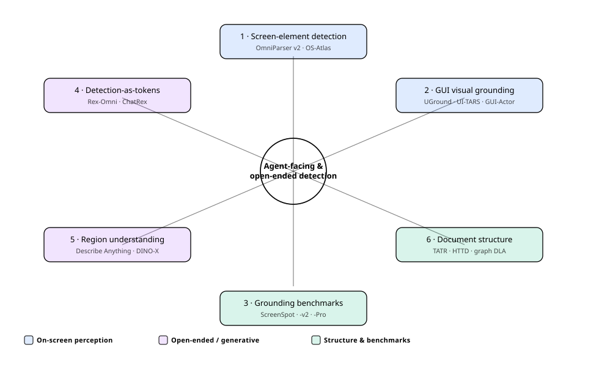
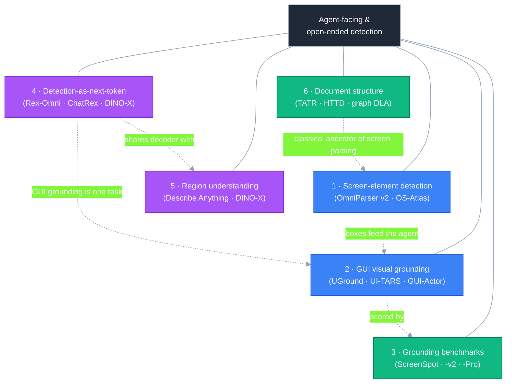
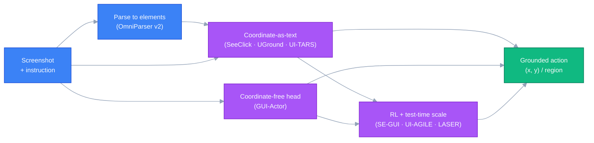
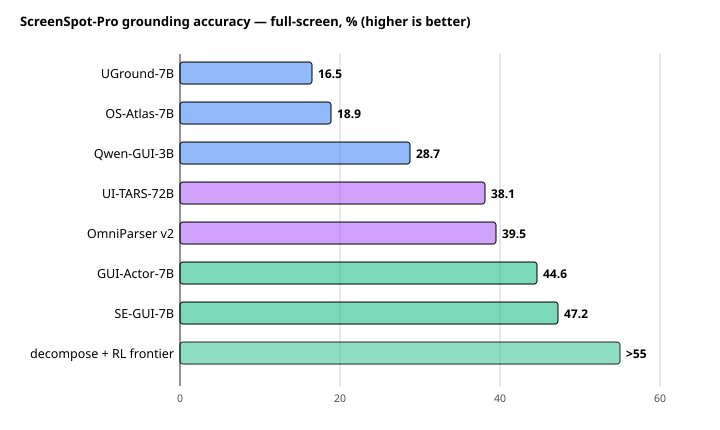

# Dense Object Detection & Classification — Recent Advances

*Compiled 2026-Jun-23 (America/Los_Angeles).*

Next installment in the running CV-updates log. Earlier entries on
`main`:
[Apr-30](../2026-Apr-30/2026-Apr-30_CV_updates.md),
[May-01](../2026-May-01/2026-May-01_CV_updates.md),
[May-02](../2026-May-02/2026-May-02_CV_updates.md),
[May-04](../2026-May-04/2026-May-04_CV_updates.md),
[May-05](../2026-May-05/2026-May-05_CV_updates.md),
[May-07](../2026-May-07/2026-May-07_CV_updates.md),
[May-08](../2026-May-08/2026-May-08_CV_updates.md),
[May-15](../2026-May-15/2026-May-15_CV_updates.md),
[May-16](../2026-May-16/2026-May-16_CV_updates.md),
[May-17](../2026-May-17/2026-May-17_CV_updates.md),
[Jun-09](../2026-Jun-09/2026-Jun-09_CV_updates.md),
[Jun-10](../2026-Jun-10/2026-Jun-10_CV_updates.md),
[Jun-12](../2026-Jun-12/2026-Jun-12_CV_updates.md),
[Jun-15](../2026-Jun-15/2026-Jun-15_CV_updates.md),
[Jun-16](../2026-Jun-16/2026-Jun-16_CV_updates.md),
[Jun-17](../2026-Jun-17/2026-Jun-17_CV_updates.md),
[Jun-19](../2026-Jun-19/2026-Jun-19_CV_updates.md),
[Jun-21](../2026-Jun-21/2026-Jun-21_CV_updates.md),
[Jun-22](../2026-Jun-22/2026-Jun-22_CV_updates.md).

Across ~180 dedicated sections, those passes worked the *semantic /
instance / relational* half of dense vision (the YOLO/DETR/DEIM real-time
race, oriented & aerial detection, camouflaged/salient/small/infrared
objects, open-world & long-tailed recognition, promptable & panoptic
segmentation, video instance/panoptic, HOI, counting, few-shot &
open-vocabulary detection, MOT, scene graphs, plus medical / industrial
verticals) **and** — last pass — the *geometric & correspondence* half
(depth, flow, pose, matching, stereo, monocular-3D, place recognition).
They also covered the alternative-architecture substrate: state-space
(Mamba) trunks and event/spiking detectors each have prior sections.

What none of them gave a dedicated section to is the frontier that has
grown up *around the agent boom*: detection whose consumer is no longer a
person reading boxes but **a model deciding where to click, or a model
asked to describe and reason about an arbitrary region**. This pass
rotates entirely to that **agent-facing & open-ended dense-detection**
frontier — six fresh threads:

- **GUI screen-element detection** — parsing a screenshot into typed,
  boxed, interactable widgets (OmniParser v2, OS-Atlas).
- **GUI visual grounding** — instruction → pixel coordinate, including
  the *coordinate-free* turn (UGround, UI-TARS, Aguvis, GUI-Actor).
- **Grounding benchmarks** — ScreenSpot → ScreenSpot-v2 → ScreenSpot-Pro
  → multi-window desktop, and what the leaderboard motion means.
- **Detection-as-next-token** — generative MLLM detectors that emit
  coordinates as language (Rex-Omni, ChatRex, DINO-X's language head).
- **Localized region understanding** — detail-dense captioning / VQA on a
  given region (Describe Anything, DINO-X dense region caption).
- **Structured-document detection** — the table / layout detectors that
  are the closest classical cousin to screen parsing (TATR, HTTD,
  graph-based DLA).

> **Scope note.** Links below are arXiv `abs` pages, official GitHub
> repos, project pages, or publisher pages (CVF / ICLR / NeurIPS / MDPI)
> cross-checked during research. arXiv direct-fetch and several
> `*.github.io` project pages were **egress-blocked / 403** in the
> research environment, so each arXiv ID was corroborated against the
> indexed result title **and** the method's official GitHub README — a
> two-source match, not a first-hand abstract read. Reported numbers are
> as stated by each method's own page/README or the benchmark's authors;
> evaluation protocols differ (full-screen vs. cropped, with/without a
> verifier or planner), so treat cross-model deltas as indicative, not
> head-to-head. Items flagged *(corroborate)* are very recent (2026)
> preprints seen only via search snippets.

---

## Topic map

*(If the SVG does not render in your viewer, the same six threads are
laid out in the [TL;DR](#tldr) table below. The diagram uses
`currentColor` for all strokes and text, so it inverts cleanly between
light and dark themes.)*

---

## TL;DR

| # | Thread | Representative 2025–26 work | One-line takeaway |
|---|--------|------------------------------|-------------------|
| 1 | Screen-element detection | **OmniParser v2**, **OS-Atlas** | A screenshot becomes a typed list of boxed, captioned, interactable widgets — pure-vision, no DOM/accessibility tree. |
| 2 | GUI visual grounding | **UGround**, **UI-TARS**, **Aguvis**, **GUI-Actor** | Instruction → click point; the field is moving from emitting `(x,y)` text to *coordinate-free* attention heads. |
| 3 | Grounding benchmarks | **ScreenSpot / -v2 / -Pro**, **WinDeskGround** | High-res professional UIs crushed early models (<20%); decomposition + RL + verifiers pushed the ceiling past 55%. |
| 4 | Detection-as-next-token | **Rex-Omni (3B)**, **ChatRex**, **DINO-X** | Detection reframed as next-(point/token) prediction; one MLLM does boxes, points, OCR, GUI, keypoints. |
| 5 | Region understanding | **Describe Anything (DAM)**, **DINO-X** dense caption | Given a point/box/mask, emit detail-dense local captions / region VQA — recognition past the class label. |
| 6 | Document structure | **Table Transformer (TATR)**, **HTTD**, graph DLA | The classical table/layout detectors are the closest engineered cousin to screen parsing. |

---

## 1. GUI screen-element detection

**The task.** Take a raw screenshot and return a structured set of
elements — boxes for icons, buttons, text fields, menus — each with a
type and often a short functional caption, *without* relying on an HTML
DOM, accessibility tree, or app metadata. This is dense object detection
+ classification in a new domain: targets are tiny, densely packed,
heterogeneous, and text-heavy, and the "classes" are functional
(*is this clickable? what does it do?*) rather than visual.

**Why it surfaced now.** Computer-use agents (browser/OS automation)
need a reliable bridge from pixels to actionable regions. Many target
environments expose no clean DOM (canvas apps, remote desktops, games,
PDFs, native desktop software), so a *pure-vision* parser is the
fallback that always works.

### 1.1 OmniParser → OmniParser v2

Microsoft's **OmniParser** parses a UI screenshot into structured
elements via two stages: a **YOLO-based interactable-icon detector** that
proposes boxes, and a **captioning module (Florence-2)** that attaches a
functional description to each box. The output is a machine-readable list
that a downstream VLM consumes to produce grounded actions — turning a
generic VLM into a usable GUI agent without fine-tuning it.

- **OmniParser v2** improves small-icon detection and interactability
  prediction and reports **39.5% on ScreenSpot-Pro** (see §3), a large
  jump for a detect-then-caption pipeline, alongside latency reductions.
- arXiv **2408.00203** · GitHub `microsoft/OmniParser`.

### 1.2 OS-Atlas — a foundation action/grounding model

**OS-Atlas** trains a *foundation action model* for generalist GUI
agents, with a grounding pre-training corpus spanning Windows, Linux,
macOS, Android and the web. It is the canonical "grounding backbone" many
later agents build on; **OS-Atlas-7B** reports **18.9% on ScreenSpot-Pro**
under full-screen evaluation (a number that looks low only because
ScreenSpot-Pro is brutal — see §3).

- arXiv **2410.23218** (NeurIPS-era release) · GitHub `OS-Copilot/OS-Atlas`.

> **Where it sits relative to prior passes.** This is *document & layout
> dense detection* (covered Jun-15/16) pointed at live software UIs, with
> the twist that the label space is interaction semantics. The detector
> half (YOLO/Florence in OmniParser) is exactly the machinery this log
> has tracked all spring — it is the *consumer* (an agent) that is new.

---

## 2. GUI visual grounding

**The task.** Given a natural-language instruction ("click the *merge*
button", "open the layers panel") and a screenshot, output the **pixel
location** of the target element. Unlike §1 this need not enumerate every
element — it must pick the *right* one, often among hundreds.

### 2.1 The "emit coordinates as text" lineage

The dominant early-2025 recipe fine-tunes an MLLM to output the target
coordinate as **text tokens** (`(x, y)` or a box):

- **SeeClick** established instruction-to-target grounding and the
  original ScreenSpot benchmark (arXiv **2401.10935**).
- **UGround** ("Navigating the Digital World as Humans Do") is a
  *universal* visual grounding model trained on **~10M elements from
  ~1.3M screenshots**; the Qwen2-VL-based UGround-V1 shipped Jan 2025 in
  2B / 7B / 72B sizes and beat prior SOTA across ScreenSpot web / mobile /
  desktop (arXiv **2410.05243**).
- **Aguvis** pushes toward a *unified, pure-vision* GUI agent that both
  grounds and acts across interfaces in one model (arXiv **2412.04454**).
- **UI-TARS** is a native end-to-end GUI agent (perception + grounding +
  action + reasoning) trained at scale; its larger variants were the
  ScreenSpot-Pro reference point through 2025 — **UI-TARS-72B ≈ 38.1%**
  (arXiv **2501.12326**).

### 2.2 The coordinate-free turn — GUI-Actor

A 2026-relevant shift questions whether a language model should
*verbalize* numeric coordinates at all. **GUI-Actor** (NeurIPS 2025)
replaces coordinate-text generation with an **attention-based action
head**: a special action token attends over visual patch features to
ground the target region directly, proposing several candidate regions in
one forward pass, with an optional **grounding verifier** to pick the
best.

- **GUI-Actor-7B** (Qwen2-VL): **40.7** on ScreenSpot-Pro, **44.2** with
  the verifier — *surpassing UI-TARS-72B (38.1) with ~10× fewer params.*
- With a Qwen2.5-VL backbone, **GUI-Actor-7B → 44.6**.
- On the easier suites: ScreenSpot **88.3**, ScreenSpot-v2 **89.5**
  (competitive with UI-TARS-7B's 89.5 / 91.6).
- The action head generalizes to **unseen resolutions/layouts**, since it
  never had to memorize a coordinate-text distribution.
- arXiv **2506.03143** · GitHub `microsoft/GUI-Actor`.

### 2.3 RL and inference-time scaling

Reinforcement learning and test-time decomposition are the other engine
of 2025–26 gains: **UI-R1** and **SE-GUI** apply RL (GRPO-style, dense
reward shaping) to grounding, and **SE-GUI-7B reports 47.2% on
ScreenSpot-Pro** trained on only ~3k open-source samples. Inference-time
methods — **ScreenSeekeR** (spatial reduction), **UI-AGILE** (inference
decomposition), **DiMo-GUI** (modality-aware test-time scaling), and
active multi-step perception (**LASER**) — collectively lifted the
ScreenSpot-Pro ceiling from sub-20% to **above 55%** *(corroborate;
survey-reported)*.

---

## 3. Grounding benchmarks — ScreenSpot and its harder children

The benchmark ladder is the clearest record of how fast this sub-field is
moving.

- **ScreenSpot** (with SeeClick, arXiv **2401.10935**) — the first
  cross-platform (mobile/desktop/web) instruction-grounding set; modern
  7B models now sit in the **88–92%** range, so it is largely saturated.
- **ScreenSpot-v2** — a re-annotated, cleaned variant correcting label
  noise; GUI-Actor-7B / UI-TARS-7B land around **89–92%**.
- **ScreenSpot-Pro** (ICLR 2025, arXiv **2504.07981**) — the current
  stress test: **1,581 expert-annotated instructions across 23
  professional applications, 5 industries, 3 operating systems** (CAD,
  IDEs, creative design, scientific computing, office). Targets are tiny
  and dense on high-resolution displays, which is why early-2025
  full-screen scores were sub-20%.
- **WinDeskGround** *(corroborate; arXiv 2605.16402, 2026)* — pushes into
  **complex multi-window desktop** layouts, the next robustness frontier
  after single-window professional apps.

*Full-screen (uncropped) ScreenSpot-Pro accuracy. Bars are color-grouped:
coordinate-as-text MLLMs (blue), large/native agents (purple), and
coordinate-free / RL / pipeline approaches (green). The ">55" frontier
bar is the survey-reported ceiling from decomposition + RL + active
perception, not a single released checkpoint. Protocols differ across
rows — read this as trajectory, not a controlled comparison.*

**The story the numbers tell.** In ~12 months, professional-UI grounding
went from "barely works" (<20%) to "usefully works" (>55% with the best
pipelines), driven by three levers, none of which is a bigger backbone:
**(a)** detect-then-ground pipelines (OmniParser), **(b)** architectural
change away from coordinate-text (GUI-Actor), and **(c)** RL +
inference-time search. The remaining gap to human-level on tiny, dense,
high-res targets is the open problem.

---

## 4. Detection-as-next-token — generative open-vocabulary detectors

A parallel 2025–26 thread reframes **detection itself** as autoregressive
generation inside an MLLM: coordinates become tokens the model *predicts*,
unifying detection with pointing, OCR, keypointing and GUI grounding
under one decoder. This is the bridge between the open-vocabulary
detectors this log tracked all spring and the agent-facing grounding
above.

### 4.1 Rex-Omni — "detect anything via next point prediction"

IDEA Research's **Rex-Omni** (CVPR 2026, arXiv **2510.12798**) is a **3B
MLLM** (Qwen backbone) that recasts detection and a wide range of
perception tasks as **next-point prediction**:

- **Coordinate tokenization 0–999** via special tokens — bounding the
  vocabulary and cutting the coordinate-prediction learning difficulty
  and token count.
- **Two-stage training:** SFT on **~22M** samples, then **GRPO-based RL**
  post-training to sharpen localization and reduce duplicate/degenerate
  predictions (a known failure mode of generative detectors).
- **Zero-shot COCO / LVIS** results that **rival or exceed
  regression-based detectors** (DINO, Grounding DINO) — notable because
  generative detectors historically trailed on dense-AP metrics.
- One model also does **object referring, pointing, visual prompting, GUI
  grounding, spatial referring, OCR (word/line boxes & polygons), and
  keypointing.**
- GitHub `IDEA-Research/Rex-Omni`; AWQ-quantized weights + Gradio demo.

### 4.2 ChatRex and DINO-X — perception ⊕ understanding

- **ChatRex** (IDEA Research) couples a retrieval-based detection
  proposal path with an MLLM so the model can both *localize* and *talk
  about* objects, targeting the failure mode where chat-tuned MLLMs
  hallucinate boxes (GitHub `IDEA-Research/ChatRex`).
- **DINO-X** (arXiv **2411.14347**) is a unified **object-centric** model
  supporting open-world detection & segmentation, phrase grounding,
  visual-prompt counting, pose, **prompt-free** detection/recognition, and
  **dense region captioning** — via a promptable generative language head
  bolted onto a Grounding-DINO-style detector. It accepts text, visual,
  and customized prompts and emits boxes, masks, keypoints, or captions.

> **Why this lives in a detection report.** These models are evaluated on
> COCO/LVIS AP and phrase-grounding recall like any detector — they just
> reach those numbers by *generating* coordinates. The convergence point
> with §2 is explicit: GUI grounding is listed as one of Rex-Omni's
> evaluated tasks.

---

## 5. Localized region understanding — recognition past the label

Classification's frontier is no longer "which of N classes" but "**given
this exact region, describe and reason about it**." This is the
classification half of the agent story: once a box exists (from §1/§2/§4),
what can a model *say* about its contents?

### 5.1 Describe Anything (DAM)

NVIDIA's **Describe Anything Model** (ICCV 2025, arXiv **2504.16072**)
performs **detailed localized captioning**: given a point, box, scribble,
or mask, it emits a fine-grained description of that region in images
*and* video.

- **Focal prompt** — high-resolution encoding of the targeted region —
  combined with a **localized vision backbone** that fuses the precise
  region with its broader context, so descriptions stay both detailed and
  context-aware.
- **DLC-SDP**, a semi-supervised data pipeline, bootstraps from existing
  segmentation datasets and expands to unlabeled web images to overcome
  the scarcity of region-caption training data.
- A medical adaptation, *Describe Anything in Medical Images*
  (arXiv **2505.05804**), shows the recipe transfers to clinical regions.
- GitHub `NVlabs/describe-anything`.

### 5.2 Dense region captioning as a detector head

**DINO-X**'s dense-region-caption and region-VQA heads (§4.2) make the
same point from the detector side: the box and its description are
produced jointly. The combined §4–§5 picture is a single decoder that
**localizes, classifies open-vocabulary, *and* explains** — collapsing
detection, recognition, captioning and region-VQA into one head.

---

## 6. Structured-document detection — the engineered ancestor

Screen parsing (§1) did not appear from nowhere: its closest classical
relative is **document layout & table-structure detection**, where
DETR-style detectors have been turning page images into typed, boxed,
relational structure for years. Worth tracking as the mature baseline
the screen-parsing world is re-deriving:

- **Table Transformer (TATR)** — DETR applied to table extraction, with
  separate detection and **structure-recognition** models, trained on the
  **PubTables-1M** corpus (arXiv **2110.00061**; v1.1 checkpoints on
  Hugging Face). Still a strong, widely deployed baseline.
- **HTTD** (*Hierarchical Transformer for Table Detection*, MDPI
  *Mathematics* 13(2):266, 2025) — Swin-L backbone + transformer
  detection head reporting **96.98% on ICDAR-2019 cTDaR**, **96.43% on
  TNCR**, **93.14% on TabRecSet**.
- **Graph-based Document Structure Analysis** (ICLR 2025) — reframes
  layout as a **graph** over detected regions, recovering reading order
  and parent/child relations rather than flat boxes — the relational step
  that screen-element parsing (which also needs "this label belongs to
  that field") will need next.
- VLM-based table recognition (e.g. neighbor-guided toolchain reasoners,
  arXiv **2412.20662**) mirrors §4: structure emitted as generated tokens
  rather than regressed boxes.

> **The through-line.** Documents and screens are the same problem at
> different framerates — dense, text-rich, relational layouts where the
> useful output is *typed boxes plus their relations*, and the field is
> converging on transformer detectors with optional generative heads for
> both.

---

## 7. Cross-cutting theme — detection's consumer changed, so its output did

Stepping back across the six threads, the unifying shift is **who reads
the detector's output**:

1. **From boxes-for-humans to boxes-for-agents.** A GUI grounder's output
   is consumed by a policy that will *click* it; correctness is judged by
   downstream task success, not just IoU. This rewards calibration,
   single-best-target precision, and robustness to tiny high-res targets
   over raw mAP.
2. **From regress-coordinates to generate-coordinates — and back.**
   2024–25 went all-in on MLLMs emitting coordinate *text* (UGround,
   UI-TARS, Rex-Omni). 2026 is already questioning that: **GUI-Actor**'s
   coordinate-free attention head and Rex-Omni's quantized 0–999 token
   scheme are two different fixes for the same pain — language models are
   bad at verbalizing precise numbers.
3. **Localize + classify + explain in one head.** DINO-X, Rex-Omni and
   DAM collapse detection, open-vocabulary recognition, region captioning
   and region-VQA into a single promptable decoder. The "classification"
   output is now free-form language about a region, not a softmax.
4. **RL and test-time search beat scale.** The biggest ScreenSpot-Pro
   gains came from GRPO-style RL, verifiers, and inference-time
   decomposition on *small* (3–7B) models — not from larger backbones.
5. **Documents foreshadow screens.** The table/layout community already
   solved typed-box-plus-relations with DETR + graphs; screen parsing is
   re-walking that path on live, higher-variance inputs.

The detector machinery this log has tracked since April — DETR heads,
YOLO proposals, Grounding-DINO open-vocabulary, DINOv-family backbones —
is all still here. What changed is the **interface and the consumer**:
coordinates as tokens, regions as captions, and an agent (not a person)
on the receiving end.

---

## 8. Reading list

**GUI screen-element detection**
- OmniParser — arXiv **2408.00203** · `microsoft/OmniParser` (V2: 39.5% ScreenSpot-Pro).
- OS-Atlas: A Foundation Action Model for Generalist GUI Agents — arXiv **2410.23218** · `OS-Copilot/OS-Atlas`.

**GUI visual grounding**
- SeeClick (+ original ScreenSpot) — arXiv **2401.10935**.
- UGround — *Navigating the Digital World as Humans Do* — arXiv **2410.05243** · OSU-NLP-Group UGround.
- Aguvis — *Unified Pure Vision GUI Agents* — arXiv **2412.04454**.
- UI-TARS — *Pioneering Automated GUI Interaction with Native Agents* — arXiv **2501.12326**.
- GUI-Actor — *Coordinate-Free Visual Grounding for GUI Agents* (NeurIPS 2025) — arXiv **2506.03143** · `microsoft/GUI-Actor`.
- UI-R1 — *RL for GUI action prediction* — arXiv **2503.21620**.

**Benchmarks**
- ScreenSpot-Pro — arXiv **2504.07981** · `likaixin2000/ScreenSpot-Pro-GUI-Grounding` · leaderboard `gui-agent.github.io/grounding-leaderboard`.
- WinDeskGround — multi-window desktop grounding — arXiv **2605.16402** *(corroborate)*.

**Detection-as-next-token**
- Rex-Omni — *Detect Anything via Next Point Prediction* (CVPR 2026) — arXiv **2510.12798** · `IDEA-Research/Rex-Omni`.
- ChatRex — *Taming Multimodal LLM for Joint Perception and Understanding* — `IDEA-Research/ChatRex`.
- DINO-X — *A Unified Vision Model for Open-World Object Detection and Understanding* — arXiv **2411.14347** · `IDEA-Research/DINO-X-API`.

**Region understanding**
- Describe Anything (DAM) — *Detailed Localized Image and Video Captioning* (ICCV 2025) — arXiv **2504.16072** · `NVlabs/describe-anything`.
- Describe Anything in Medical Images — arXiv **2505.05804**.

**Structured-document detection**
- Table Transformer / PubTables-1M — arXiv **2110.00061** · `microsoft/table-transformer-structure-recognition-v1.1-all`.
- HTTD — *Hierarchical Transformer for Table Detection* — MDPI *Mathematics* 13(2):266 (2025).
- Graph-based Document Structure Analysis — ICLR 2025.
- VLM table recognition benchmark / toolchain reasoner — arXiv **2412.20662**.

---

### Diagram-rendering notes

- Two **Mermaid** flowcharts (topic map + grounding pipeline) and two
  **standalone SVGs** (`assets/topic-map.svg`, `assets/screenspot-pro.svg`).
- No external image URLs — both SVGs are local files committed alongside
  this report.
- SVG strokes/text use `currentColor`; fills use low-opacity RGBA, and the
  Mermaid nodes pair colored fills with light (`#f8fafc`) text — so both
  the diagrams and the chart stay legible in **light and dark** themes.
- Numbers are quoted from each method's own page/README/benchmark authors;
  protocols differ (full-screen vs cropped, with/without verifier or
  planner), so cross-model deltas are indicative, not controlled.
