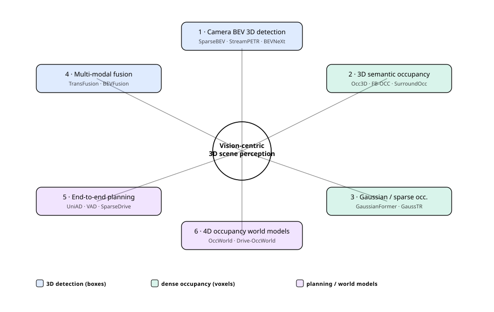
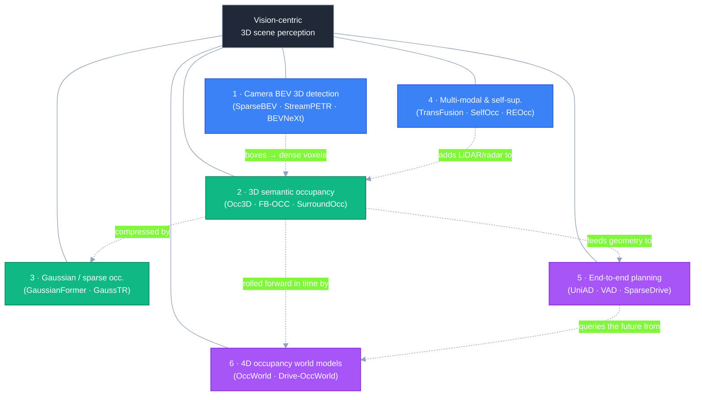
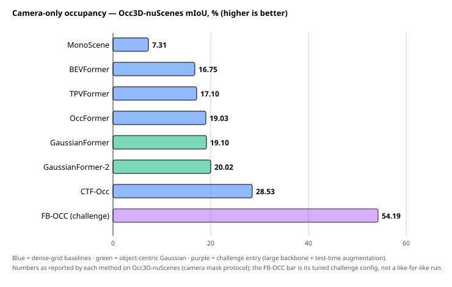
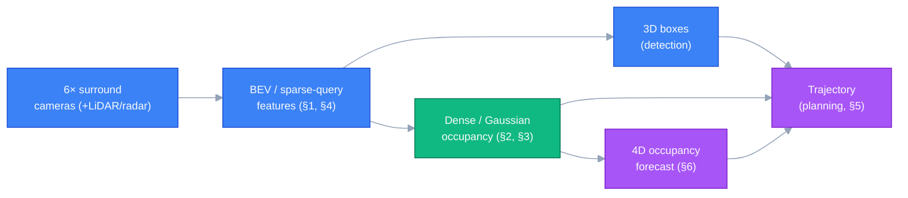

# Dense Object Detection & Classification — Recent Advances

*Compiled 2026-Jun-24 (America/Los_Angeles).*

Next installment in the running CV-updates log. Earlier entries on
`main`:
[Apr-30](../2026-Apr-30/2026-Apr-30_CV_updates.md),
[May-01](../2026-May-01/2026-May-01_CV_updates.md),
[May-02](../2026-May-02/2026-May-02_CV_updates.md),
[May-04](../2026-May-04/2026-May-04_CV_updates.md),
[May-05](../2026-May-05/2026-May-05_CV_updates.md),
[May-07](../2026-May-07/2026-May-07_CV_updates.md),
[May-08](../2026-May-08/2026-May-08_CV_updates.md),
[May-15](../2026-May-15/2026-May-15_CV_updates.md),
[May-16](../2026-May-16/2026-May-16_CV_updates.md),
[May-17](../2026-May-17/2026-May-17_CV_updates.md),
[Jun-09](../2026-Jun-09/2026-Jun-09_CV_updates.md),
[Jun-10](../2026-Jun-10/2026-Jun-10_CV_updates.md),
[Jun-12](../2026-Jun-12/2026-Jun-12_CV_updates.md),
[Jun-15](../2026-Jun-15/2026-Jun-15_CV_updates.md),
[Jun-16](../2026-Jun-16/2026-Jun-16_CV_updates.md),
[Jun-17](../2026-Jun-17/2026-Jun-17_CV_updates.md),
[Jun-19](../2026-Jun-19/2026-Jun-19_CV_updates.md),
[Jun-21](../2026-Jun-21/2026-Jun-21_CV_updates.md),
[Jun-22](../2026-Jun-22/2026-Jun-22_CV_updates.md),
[Jun-23](../2026-Jun-23/2026-Jun-23_CV_updates.md).

Across ~190 dedicated sections, those passes worked the *2D
semantic / instance / relational* half of dense vision (the YOLO/DETR/DEIM
real-time race, oriented & aerial detection, camouflaged/salient/small
objects, open-world & long-tailed recognition, promptable & panoptic
segmentation, video instance/panoptic, HOI, counting, MOT, scene graphs),
the *geometric & correspondence* half (depth, flow, pose, matching,
stereo, monocular-3D, place recognition), and — last pass — the
*agent-facing* frontier (GUI grounding, detection-as-next-token, region
understanding). Single-frame 3D detection got touched in pieces
(monocular-3D in Jun-22, indoor/multi-view in Jun-16, open-vocab-3D and
infrared in Jun-09, cooperative/V2X in Jun-10).

What none of them gave a dedicated section to is the **surround-camera 3D
scene-perception stack that drives autonomous vehicles and embodied
agents** — the place where "dense detection + classification" stopped
meaning *boxes on a pixel grid* and became **per-voxel semantics over the
whole 3D volume around the ego-vehicle**. That is *literally* dense
classification: every cell of a 3D grid (or every Gaussian) gets a
semantic label, including a learned `free`/`occupied` distinction for the
empty space a box-only detector can't represent. This pass rotates
entirely to that **vision-centric 3D perception** frontier — six fresh
threads:

- **Camera BEV 3D detection** — multi-camera images → 3D boxes in a
  bird's-eye-view, and the dense-grid → sparse-query split (BEVFormer,
  BEVNeXt vs. SparseBEV, StreamPETR, Far3D).
- **3D semantic occupancy prediction** — the dense-voxel task that
  superseded box-only detection (Occ3D benchmark, TPVFormer, SurroundOcc,
  OccFormer, FB-OCC, CTF-Occ).
- **Gaussian & sparse occupancy** — replacing the dense voxel grid with
  object-centric 3D Gaussians or sparse queries (GaussianFormer/-2,
  GaussTR, GaussianFlowOcc, GaussianOcc).
- **Multi-modal & self-supervised occupancy/detection** — LiDAR-camera and
  camera-radar fusion (TransFusion, SparseFusion, BEVFusion, BEVDilation,
  REOcc) and label-free training (SelfOcc, RenderOcc, QueryOcc).
- **End-to-end perception → planning** — detection as one module inside a
  single differentiable driver (UniAD, VAD, SparseDrive, DriveTransformer).
- **4D occupancy world models** — forecasting the *future* occupied
  volume and using it to plan (OccWorld, Drive-OccWorld, GaussianWorld,
  SparseWorld).

> **Scope note.** Links below are arXiv `abs` pages, official GitHub
> repos, project pages, or publisher pages (CVF / ECCV / AAAI / MDPI)
> cross-checked during research. arXiv direct-fetch and several
> `*.github.io` project pages were **egress-blocked / 403** in the
> research environment, so each arXiv ID was corroborated against the
> indexed result title **and**, where possible, the method's official
> GitHub README or a CVF/publisher landing page — a two-source match, not
> a first-hand abstract read. Reported numbers are as stated by each
> method's own paper, README, or benchmark authors; **occupancy protocols
> differ a lot** (camera-visibility mask vs. not, image backbone, input
> resolution, single-frame vs. temporal, with/without test-time
> augmentation), so treat cross-model deltas as *indicative, not
> head-to-head*. Items flagged *(corroborate)* are very recent (late-2025
> / 2026) preprints seen only via search snippets.

---

## Topic map

*(If the SVG does not render in your viewer, the same six threads are laid
out in the [TL;DR](#tldr) table below. The diagram uses `currentColor` for
all strokes and text and low-opacity RGBA fills, so it inverts cleanly
between light and dark themes.)*

---

## TL;DR

| # | Thread | Representative 2024–26 work | One-line takeaway |
|---|--------|------------------------------|-------------------|
| 1 | Camera BEV 3D detection | **BEVFormer**, **BEVNeXt**, **SparseBEV**, **StreamPETR**, **Far3D** | Multi-camera → 3D boxes; the field split into dense-BEV vs. sparse-query camps, both temporal, both ~0.60+ NDS on nuScenes. |
| 2 | 3D semantic occupancy | **Occ3D**, **TPVFormer**, **SurroundOcc**, **OccFormer**, **FB-OCC**, **CTF-Occ** | Box detection gave way to per-voxel `free`/`occupied`+class — dense classification of the whole volume, arbitrary shapes included. |
| 3 | Gaussian / sparse occupancy | **GaussianFormer / -2**, **GaussTR**, **GaussianFlowOcc**, **GaussianOcc** | Replace the cubic voxel grid with a few thousand object-centric 3D Gaussians → big memory cuts at similar mIoU. |
| 4 | Multi-modal & self-supervised | **TransFusion**, **SparseFusion**, **BEVFusion**, **BEVDilation**, **REOcc**, **SelfOcc**, **QueryOcc** | LiDAR/radar fusion for robustness; rendering losses let occupancy train without dense 3D labels. |
| 5 | End-to-end planning | **UniAD**, **VAD**, **SparseDrive**, **DriveTransformer** | Detection becomes one query-sharing module in a single net trained to output a trajectory; sparse designs cut cost and collisions. |
| 6 | 4D occupancy world models | **OccWorld**, **Drive-OccWorld**, **GaussianWorld**, **SparseWorld** | Forecast the *future* occupied volume and plan against it — detection's output is now a rolled-forward 4D scene. |

---

## 1. Camera BEV 3D detection — from pixels to boxes in bird's-eye-view

**The task.** Given 6 surround-view camera images (no LiDAR), output
3D bounding boxes with class, position, size, orientation and velocity in
a common bird's-eye-view (BEV) frame. This is the modern, camera-only
descendant of the LiDAR 3D detectors, and the workhorse benchmark is
**nuScenes** (NDS / mAP).

**The architectural split.** Two camps emerged and are still co-evolving:

- **Dense BEV.** Lift image features into an explicit BEV grid, then run a
  detection head on it. **BEVFormer** popularized spatio-temporal
  deformable attention over a dense BEV; **BEVNeXt** (CVPR 2024) argues the
  dense-BEV line was prematurely written off and revives it with a CRF-modulated
  depth head + improved temporal fusion, reaching **0.622 NDS** (ViT-Adapter-L)
  on the nuScenes val set.
- **Sparse query.** Skip the dense grid entirely; carry a sparse set of 3D
  object queries that sample image features directly.
  - **SparseBEV** (ICCV 2023) seeds queries from BEV pillars and samples
    multi-view, multi-frame features with scale-adaptive self-attention.
  - **StreamPETR** propagates object queries frame-to-frame through a
    memory queue with explicit ego-motion compensation — a long-temporal
    object-centric model that reaches **0.609 NDS** (ViT-L) on val.
  - **Far3D** initializes 3D queries from a 2D detector + depth net to push
    detection to **long range** (the regime where dense BEV grids blow up
    in memory).

> **Where it sits relative to prior passes.** The Jun-22 pass covered
> *monocular* 3D detection (one camera, metric depth). This is the
> *surround* multi-camera, temporally-fused case — the production
> autonomous-driving setting — and it is the entry point for everything
> below: the same BEV/query machinery is what later gets pushed from
> "boxes" to "every voxel."

---

## 2. 3D semantic occupancy prediction — dense classification of the volume

**The task, and why it replaced boxes.** A 3D bounding box can't describe
a crane arm, an overhanging branch, a partially-seen truck, or
debris on the road — anything whose shape isn't a cuboid, or whose class
isn't in the box vocabulary. **3D semantic occupancy prediction**
reframes perception as **dense voxel classification**: partition the space
around the ego-vehicle into a voxel grid (e.g. 200×200×16) and assign every
voxel a label from `{free, car, pedestrian, vegetation, drivable surface, …}`.
This is the cleanest possible statement of "dense classification" — a
softmax over semantic classes at *every point in 3D space*, with `free`
itself a learned class so the model represents empty drivable room, not
just objects.

**The benchmark that crystallized the task.** **Occ3D**
(arXiv **2304.14365**) built large-scale occupancy labels by voxelizing and
densifying nuScenes / Waymo LiDAR, and defined the **Occ3D-nuScenes** and
**Occ3D-Waymo** splits plus the now-standard *camera-visibility mask*
evaluation. It is the reference leaderboard the rest of this section reports on.

**The model lineage.**

- **TPVFormer** — represents the scene with three orthogonal planes
  (tri-perspective view) instead of a full voxel grid, the first to show
  camera-only occupancy at LiDAR-segmentation quality.
- **SurroundOcc** — multi-scale surround occupancy with a dense-label
  pipeline; a widely-used benchmark in its own right.
- **OccFormer** — a dual-path (local + global) transformer over the
  volume; **19.03 mIoU** on Occ3D-nuScenes.
- **CTF-Occ** — coarse-to-fine voxel refinement, **28.53 mIoU**, among the
  strongest single-model camera-only entries.
- **FB-OCC** (arXiv **2307.01492**) — forward-backward view transformation
  (combining LSS-style forward projection with BEVFormer-style backward
  attention); the **CVPR 2023 Occupancy Challenge winner at 54.19 mIoU**,
  though that figure uses a large backbone + temporal stacking + test-time
  augmentation, so it sits well above like-for-like single-model runs.

*Reported camera-only mIoU on Occ3D-nuScenes. Dense-grid baselines (blue),
object-centric Gaussian methods (green, see §3), and the heavily-tuned
challenge entry (purple). The MonoScene→CTF-Occ climb is roughly
controlled; the FB-OCC bar is its challenge configuration, not a
single-model comparison. Protocols (backbone, resolution, temporal frames,
TTA) differ across rows — read this as trajectory, not a leaderboard.*

**2025–26 frontier.** The active research lines are **multi-task coupling**
(*Inverse++*, arXiv **2504.04732**, adds an auxiliary 3D-detection head so
detection's discriminative signal sharpens occupancy on small/dynamic
objects), **adaptive lifting + occupancy flow** (*ALOcc*, arXiv
**2411.07725**, jointly predicts semantics *and* per-voxel motion), **memory
priors** (*LMPOcc* fuses stored occupancy logits from prior traversals of
the same road), and **robustness** — *out-of-distribution* occupancy
(arXiv **2506.21185**) and *test-time* adaptation (arXiv **2503.08485**)
for classes and conditions never labeled.

---

## 3. Gaussian & sparse occupancy — killing the cubic grid

**The problem with dense voxels.** A dense voxel grid is *cubic* in cost
and mostly empty — the vast majority of cells are `free`. Spending compute
and memory uniformly across all of them is wasteful. The 2024–26 answer is
to make the representation **sparse and object-centric**.

### 3.1 GaussianFormer — scene as 3D Gaussians

**GaussianFormer** (ECCV 2024, GitHub `huang-yh/GaussianFormer`) represents
the scene as a few thousand **3D semantic Gaussians**, each carrying a
position, covariance and class distribution, that adaptively cluster around
occupied regions. A Gaussian-to-voxel splatting step renders the final
occupancy only where it's needed. It matches dense-grid baselines —
**19.10 mIoU** on Occ3D-nuScenes, on par with OccFormer's 19.03 — while
cutting memory substantially (its headline is a large reduction versus
dense methods).

- **GaussianFormer-2** (CVPR 2025) reframes the Gaussians as a
  **probabilistic superposition** — each Gaussian contributes occupancy
  probability rather than a hard assignment — lifting accuracy to
  **20.02 mIoU** at even better efficiency.

### 3.2 The Gaussian-occupancy explosion

The representation caught on fast; a representative slice of 2025–26 work:

- **GaussTR** (arXiv **2412.13193**) — a foundation-model-aligned Gaussian
  transformer for **self-supervised** 3D spatial understanding (aligns
  Gaussians to a frozen VLM/foundation backbone for open-vocabulary
  semantics).
- **GaussianFlowOcc** (ICCV 2025) — **sparse, weakly-supervised** occupancy
  via Gaussian splatting + **temporal flow**, dropping the need for dense
  voxel labels.
- **GaussRender** (ICCV 2025, `valeoai/GaussRender`) — a plug-in
  **Gaussian-rendering loss** that improves *existing* occupancy nets
  (e.g. TPVFormer / SurroundOcc rise to ~20.6–20.8 mIoU on the SurroundOcc
  benchmark with it added).
- **VoxelSplat** (arXiv **2506.05563**) — dynamic Gaussian splatting as an
  auxiliary loss for joint occupancy + flow.
- *(corroborate)* **GaussianWorld**, **SuperOcc** (superquadric primitives,
  arXiv **2601.15644**), **GaussianFormer3D** (multi-modal, arXiv
  **2505.10685**) and a wave of early-2026 "sparse Gaussian occupancy"
  preprints continue the line toward fewer, smarter primitives.

> **The classification connection.** This is the same move as sparse vs.
> dense detection heads (§1), one level up: instead of classifying a dense
> grid of anchors/voxels, classify a sparse, adaptive set of primitives
> that *go where the objects are*. The label space (per-Gaussian class
> distribution) is unchanged; only the carrier is sparser.

---

## 4. Multi-modal & self-supervised occupancy/detection

Two orthogonal pressures shape this thread: **robustness** (cameras alone
fail at night, in glare, at range) and **label cost** (dense 3D occupancy
annotation is enormously expensive).

### 4.1 LiDAR-camera and camera-radar fusion

- **TransFusion** (arXiv **2203.11496**) — a transformer decoder where a
  first layer predicts boxes from LiDAR queries and a second
  **soft-associates** image features, robust to bad image conditions and
  calibration error. Still the canonical fusion baseline.
- **BEVFusion** — unifies camera and LiDAR features in a shared BEV space,
  decoupling the fusion from any single task head; the deployment workhorse.
- **SparseFusion** (arXiv **2304.14340**) — fuses *instance-level sparse*
  representations from parallel per-modality detectors; SOTA on nuScenes
  with the fastest inference among fusion methods at its release.
- **BEVDilation** *(corroborate; arXiv 2512.02972)* — a **LiDAR-centric**
  fusion that densifies sparse foreground voxels using image priors via a
  "Dilation Block," reporting gains over prior fusion SOTA on nuScenes at
  competitive cost.
- **REOcc** *(corroborate; arXiv 2511.06666)* — **camera-radar** occupancy
  with radar-feature enrichment, targeting the all-weather regime where
  camera-only occupancy degrades.

### 4.2 Self-supervised / label-efficient occupancy

The key trick is **differentiable rendering**: render the predicted 3D
field back into the 2D images (depth/semantics) and supervise against the
images themselves — no dense 3D labels required.

- **SelfOcc** and **RenderOcc** established render-based self/weak
  supervision for occupancy.
- **GaussianOcc** (ICCV 2025, `GANWANSHUI/GaussianOcc`) — **fully
  self-supervised** occupancy with Gaussian splatting, ~2.7× faster
  training and ~5× faster rendering than prior render-based self-sup.
- **QueryOcc** *(corroborate; arXiv 2511.17221)* — query-based
  self-supervision for semantic occupancy.
- **OccLE** (arXiv **2505.20617**) — label-efficient occupancy from minimal
  supervision; **EFFOcc** (arXiv **2406.07042**) learns efficient occupancy
  nets from minimal labels.

---

## 5. End-to-end perception → planning — detection as a module

The boldest reframing: stop treating detection as the deliverable at all.
**End-to-end driving** trains perception, prediction and planning in a
*single differentiable network* whose output is the ego trajectory, with
detection surfacing only as an intermediate, query-shared representation.

- **UniAD** (CVPR 2023 best paper) — unifies detection, tracking, online
  mapping, motion forecasting, occupancy and planning into one
  transformer with shared queries, explicitly *planning-oriented*: every
  upstream task is shaped by its usefulness to the final plan.
- **VAD** — a **vectorized** scene representation (agents and map elements
  as polylines/instances rather than dense rasters), much cheaper than
  UniAD's dense maps while improving planning.
- **SparseDrive** (arXiv **2405.19620**) — pushes the sparse-query idea
  end-to-end: a symmetric sparse perception module feeds a **parallel**
  motion-prediction-and-planning head. Reported nuScenes open-loop
  planning: **0.58 m average L2** and **0.06 % collision rate** — vs. the
  prior best (VAD), **−19.4 % L2** and **−71.4 % collision**, at lower cost.
- **DriveTransformer** — decouples and runs perception and planning **in
  parallel** (rather than sequentially), reporting stronger closed-loop
  behavior.
- *(corroborate)* A 2026 wave couples **VLMs** to the driving policy for
  interpretable, language-conditioned decisions — *Senna-2* (arXiv
  **2603.11219**), unified language-action driving models (arXiv
  **2603.01441**), and MoT-style VLA drivers (arXiv **2603.14851**).

---

## 6. 4D occupancy world models — forecasting the occupied volume

The newest thread closes the loop: if occupancy is a snapshot of the 3D
world *now*, a **world model** learns to roll it **forward in time** —
"given the past few occupancy frames (and a candidate action), predict the
future occupied volume" — turning perception into 4D forecasting that a
planner can query.

- **OccWorld** (arXiv **2311.16038**) — the founding formulation: a
  GPT-style autoregressive model over a learned occupancy tokenization,
  jointly forecasting future 3D occupancy *and* the ego trajectory.
- **Drive-OccWorld** (AAAI 2025 **oral**, `yuyang-cloud/Drive-OccWorld`) —
  a **vision-centric** 4D-forecasting world model for end-to-end planning:
  semantic- and motion-conditional normalization in the memory module
  drives continuous future-state forecasting, and an **occupancy-based cost
  function** selects the optimal trajectory. Crucially it is
  **action-conditional** — velocity, steering, trajectory or command can be
  injected for controllable rollouts.
- **GaussianWorld** *(corroborate)* — a **Gaussian** world model for
  *streaming* occupancy prediction, carrying the §3 sparse representation
  into the temporal/forecasting setting.
- **SparseWorld** *(corroborate; arXiv 2510.17482)* — a flexible, efficient
  **4D occupancy world model** built on sparse, dynamic queries; a related
  line (arXiv **2605.24354**) folds a sparse-scene world model back into
  end-to-end driving.
- **Semi-supervised 3D occupancy world model** (arXiv **2502.07309**) —
  reduces the label burden for the world-model setting specifically.

> **Why this is still a detection report.** A 4D occupancy world model is
> evaluated on future-frame mIoU/IoU — the *same dense-classification
> metric* as §2, just indexed by future time. The "object" being detected
> and classified is now a spatiotemporal volume, and planning is scored on
> how well that forecast supports a safe trajectory.

---

## 7. Cross-cutting theme — detection became dense 4D classification

Stepping back across the six threads, the unifying shift is what the
*output representation* of "perception" is:

1. **From boxes to volumes.** A cuboid can't describe arbitrary geometry or
   open-set obstacles; per-voxel occupancy can. The deliverable went from a
   handful of boxes to a **dense semantic field** — and `free` became a
   first-class learned class, so the model represents drivable emptiness,
   not just objects.
2. **From dense grids to sparse primitives — twice.** The exact same
   dense-vs-sparse tension plays out in detection (dense BEV vs. sparse
   queries, §1) and in occupancy (dense voxels vs. 3D Gaussians, §3). Both
   fields concluded that classifying a *sparse, adaptive* set of carriers
   that follow the objects beats classifying a uniform grid.
3. **Rendering replaced labels.** Differentiable rendering (Gaussian
   splatting, volume rendering) lets occupancy train against the 2D images
   it came from, sidestepping the crippling cost of dense 3D annotation
   (§3–§4). Self-supervision is now a first-class training mode, not a
   curiosity.
4. **Fusion is for robustness, not just accuracy.** LiDAR/radar fusion
   (§4) survives where camera-only fails — night, glare, long range,
   adverse weather — which matters more than a leaderboard point once the
   consumer is a vehicle.
5. **The consumer is a planner, and then a world model.** Detection stopped
   being the product. In §5 it's an intermediate query inside a net that
   outputs a trajectory; in §6 the product is a *forecast* of the future
   occupied volume that the planner interrogates. Correctness is judged by
   downstream driving safety (L2, collision rate), not IoU alone.

The detector machinery this log has tracked since April — DETR-style
decoders, deformable/BEV attention, sparse object queries, transformer
fusion — is all still here. What changed is the **dimensionality and the
consumer**: dense classification over a 3D (then 4D) volume, rendered for
supervision, fused for robustness, and consumed by a planner or a world
model rather than a person reading boxes.

---

## 8. Reading list

**Camera BEV 3D detection**
- BEVNeXt — *Reviving Dense BEV Frameworks for 3D Object Detection* (CVPR 2024) — CVF open access (0.622 NDS val).
- SparseBEV — *High-Performance Sparse 3D Object Detection from Multi-Camera Videos* (ICCV 2023) — `MCG-NJU/SparseBEV`.
- StreamPETR — *Exploring Object-Centric Temporal Modeling for Multi-View 3D Detection* (0.609 NDS, ViT-L val).
- Far3D — *Expanding the Horizon for Surround-View 3D Object Detection* (long-range queries).

**3D semantic occupancy prediction**
- Occ3D — *A Large-Scale 3D Occupancy Prediction Benchmark for Autonomous Driving* — arXiv **2304.14365**.
- FB-OCC — *3D Occupancy Prediction based on Forward-Backward View Transformation* — arXiv **2307.01492** (challenge winner, 54.19 mIoU).
- TPVFormer / SurroundOcc / OccFormer / CTF-Occ — dense camera-only occupancy lineage.
- Inverse++ — *occupancy assisted with 3D detection* — arXiv **2504.04732**.
- ALOcc — *Adaptive Lifting + Cost-Volume Flow* — arXiv **2411.07725**.
- Out-of-Distribution Semantic Occupancy — arXiv **2506.21185**; Test-Time Occupancy — arXiv **2503.08485**.

**Gaussian / sparse occupancy**
- GaussianFormer — *Scene as Gaussians for Vision-Based 3D Semantic Occupancy* (ECCV 2024) — `huang-yh/GaussianFormer` (19.10 mIoU).
- GaussianFormer-2 — *Probabilistic Gaussian Superposition* (CVPR 2025) — 20.02 mIoU.
- GaussTR — *Foundation Model-Aligned Gaussian Transformer* — arXiv **2412.13193**.
- GaussianFlowOcc — *Sparse, Weakly-Supervised Occupancy via Gaussian Splatting + Flow* (ICCV 2025).
- GaussRender — *Learning 3D Occupancy with Gaussian Rendering* (ICCV 2025) — arXiv **2502.05040** · `valeoai/GaussRender`.
- VoxelSplat — arXiv **2506.05563**; GaussianFormer3D (multi-modal) — arXiv **2505.10685**; SuperOcc — arXiv **2601.15644** *(corroborate)*.

**Multi-modal & self-supervised**
- TransFusion — arXiv **2203.11496**; SparseFusion — arXiv **2304.14340**; BEVFusion (shared-BEV fusion).
- BEVDilation — arXiv **2512.02972** *(corroborate)*; REOcc (camera-radar) — arXiv **2511.06666** *(corroborate)*.
- GaussianOcc — *Fully Self-Supervised Occupancy* (ICCV 2025) — arXiv **2408.11447** · `GANWANSHUI/GaussianOcc`.
- QueryOcc — arXiv **2511.17221** *(corroborate)*; OccLE — arXiv **2505.20617**; EFFOcc — arXiv **2406.07042**.

**End-to-end planning**
- UniAD — *Planning-Oriented Autonomous Driving* (CVPR 2023 best paper).
- VAD — *Vectorized Scene Representation for Efficient Autonomous Driving*.
- SparseDrive — *End-to-End Autonomous Driving via Sparse Scene Representation* — arXiv **2405.19620** (0.58 m L2, 0.06 % collision).
- DriveTransformer — *parallel perception + planning*; Senna-2 — arXiv **2603.11219** *(corroborate)*.

**4D occupancy world models**
- OccWorld — *Learning a 3D Occupancy World Model* — arXiv **2311.16038**.
- Drive-OccWorld — *Vision-Centric 4D Occupancy Forecasting and Planning* (AAAI 2025 oral) — arXiv **2408.14197** · `yuyang-cloud/Drive-OccWorld`.
- SparseWorld — *4D Occupancy World Model via Sparse Dynamic Queries* — arXiv **2510.17482** *(corroborate)*.
- Semi-Supervised 3D Occupancy World Model — arXiv **2502.07309**.
- Survey — *Occupancy Perception for Autonomous Driving: An Information Fusion Perspective* (Information Fusion 2025) — `HuaiyuanXu/3D-Occupancy-Perception`.

---

### Diagram-rendering notes

- Two **Mermaid** flowcharts (topic map + perception→planning stack) and
  two **standalone SVGs** (`assets/topic-map.svg`, `assets/occ-miou.svg`).
- No external image URLs — both SVGs are local files committed alongside
  this report.
- SVG strokes/text use `currentColor`; fills use low-opacity RGBA, and the
  Mermaid nodes pair colored fills with light (`#f8fafc`) text — so both the
  diagrams and the chart stay legible in **light and dark** themes.
- Numbers are quoted from each method's own paper / README / benchmark
  authors; occupancy protocols (visibility mask, backbone, resolution,
  temporal frames, test-time augmentation) differ across rows, so
  cross-model deltas are indicative, not controlled. The FB-OCC bar is its
  challenge configuration; single-model camera-only entries top out far
  lower.
