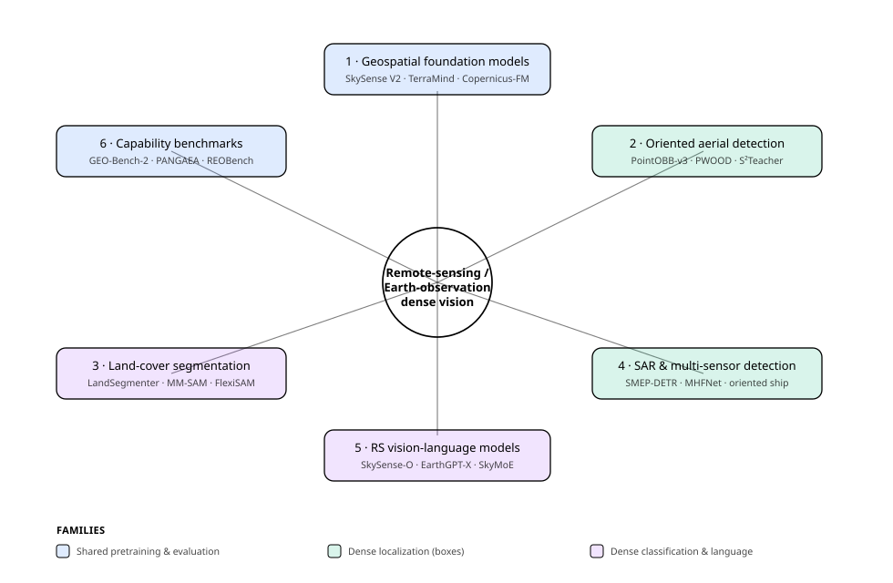
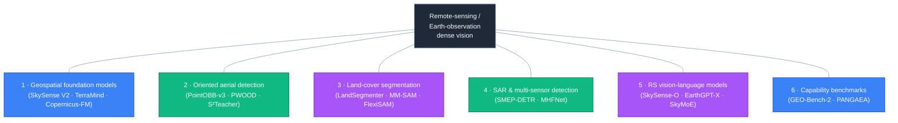
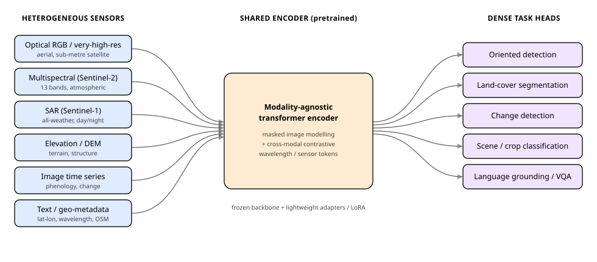
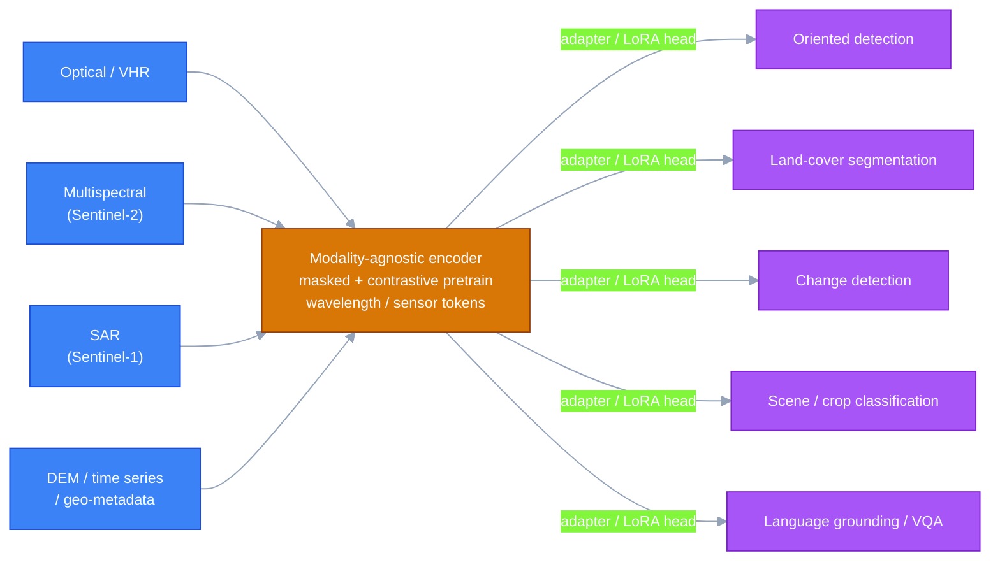
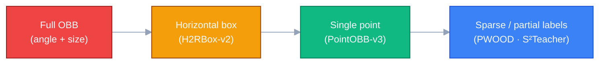

# Dense Object Detection & Classification — Recent Advances

*Compiled 2026-Jun-25 (America/Los_Angeles).*

Next installment in the running CV-updates log. Earlier entries on
`main`:
[Apr-30](../2026-Apr-30/2026-Apr-30_CV_updates.md),
[May-01](../2026-May-01/2026-May-01_CV_updates.md),
[May-02](../2026-May-02/2026-May-02_CV_updates.md),
[May-04](../2026-May-04/2026-May-04_CV_updates.md),
[May-05](../2026-May-05/2026-May-05_CV_updates.md),
[May-07](../2026-May-07/2026-May-07_CV_updates.md),
[May-08](../2026-May-08/2026-May-08_CV_updates.md),
[May-15](../2026-May-15/2026-May-15_CV_updates.md),
[May-16](../2026-May-16/2026-May-16_CV_updates.md),
[May-17](../2026-May-17/2026-May-17_CV_updates.md),
[Jun-09](../2026-Jun-09/2026-Jun-09_CV_updates.md),
[Jun-10](../2026-Jun-10/2026-Jun-10_CV_updates.md),
[Jun-12](../2026-Jun-12/2026-Jun-12_CV_updates.md),
[Jun-15](../2026-Jun-15/2026-Jun-15_CV_updates.md),
[Jun-16](../2026-Jun-16/2026-Jun-16_CV_updates.md),
[Jun-17](../2026-Jun-17/2026-Jun-17_CV_updates.md),
[Jun-19](../2026-Jun-19/2026-Jun-19_CV_updates.md),
[Jun-21](../2026-Jun-21/2026-Jun-21_CV_updates.md),
[Jun-22](../2026-Jun-22/2026-Jun-22_CV_updates.md),
[Jun-23](../2026-Jun-23/2026-Jun-23_CV_updates.md),
[Jun-24](../2026-Jun-24/2026-Jun-24_CV_updates.md).

Across ~200 dedicated sections, those passes worked the **2D semantic /
instance / relational** half of dense vision (the YOLO/DETR/DEIM real-time
race, oriented & aerial detection, camouflaged/salient/small objects,
open-world & long-tailed recognition, promptable & panoptic segmentation,
video instance/panoptic, HOI, counting, MOT, scene graphs), the
**geometric & correspondence** half (depth, flow, pose, matching, stereo,
monocular-3D, place recognition), the **agent-facing** frontier (GUI
grounding, detection-as-next-token, region understanding), and — last
pass — the **vision-centric 3D scene-perception** stack (camera BEV
detection, dense voxel occupancy, Gaussian/sparse occupancy, world models,
end-to-end planning).

Remote sensing kept appearing in fragments — bitemporal change detection
(Jun-10, Jun-19), oriented/aerial detection mentioned inside the YOLO/DETR
race, RGB-T/SAR/hyperspectral *fusion* (May-05), and hyperspectral
*classification* (Jun-16) — but it never got a dedicated pass on its own
terms. That is a gap, because **Earth observation is where "dense detection
+ classification" is being rebuilt around a different primitive than the
rest of computer vision.** Natural-image models inherit ImageNet/COCO
priors; satellites deliver **dozens of spectral bands, all-weather radar,
elevation, and multi-year time series over the same patch of ground**, with
tiny, densely-packed, arbitrarily-rotated objects and per-pixel land-cover
labels as the *native* output. The field's answer in 2025–26 is a wave of
**multi-sensor geospatial foundation models** that pretrain once across all
those modalities and then drive every dense task — oriented detection,
land-cover segmentation, change detection, classification, and language
grounding — through lightweight heads.

This pass rotates entirely to that **remote-sensing / Earth-observation
dense-vision** frontier — six threads:

- **Geospatial foundation models** — multi-sensor masked / contrastive
  pretraining that has gone *any-sensor* and *generative* (SkySense V2,
  TerraMind, Copernicus-FM, TerraFM, Panopticon, Galileo, AnySat, Clay,
  Prithvi-EO-2.0, DOFA).
- **Oriented aerial object detection** — rotated boxes for tiny,
  densely-packed objects, and the collapse of the annotation cost from full
  OBB → horizontal box → single point (PointOBB-v3, PWOOD, S²Teacher,
  P2RBox, GRA, ARS-DETR).
- **Dense land-cover semantic segmentation** — per-pixel classification of
  the ground, increasingly via SAM/SAM2 adaptation and text-promptable
  heads (LandSegmenter, FlexiSAM, MM-SAM, RSAM-Seg, FreqWeaver).
- **SAR & multi-sensor detection** — detection that survives clouds and
  darkness by fusing optical with radar (SMEP-DETR, MHFNet, multi-modal
  oriented ship detection).
- **Remote-sensing vision-language models** — grounded chat, visual
  prompting, open-world recognition, and MoE scaling over satellite imagery
  (GeoChat, EarthGPT/-X, SkySense-O, EarthMarker, SkyMoE, TinyRS-R1).
- **Capability-driven benchmarks** — the evaluation reset that exposed how
  narrowly GeoFMs had been measured (GEO-Bench-2, PANGAEA, Copernicus-Bench,
  REOBench).

> **Scope note.** Links below are arXiv `abs` pages, official GitHub repos,
> Hugging Face model pages, project pages, or publisher pages (CVF / ECCV /
> AAAI / MDPI / ScienceDirect) cross-checked during research. arXiv
> direct-fetch and several `*.github.io` project pages were
> **egress-blocked / 403** in the research environment, so each arXiv ID was
> corroborated against the indexed result title **and**, where possible, the
> method's official GitHub README, Hugging Face card, or a CVF/publisher
> landing page — a two-source match, not a first-hand abstract read.
> Reported numbers are as stated by each method's own paper, README, or
> benchmark authors; **remote-sensing protocols differ enormously** (sensor,
> band set, spatial resolution, single-frame vs. temporal, tiling, IoU
> convention), so treat cross-model deltas as *indicative, not head-to-head*.
> Items flagged *(corroborate)* are very recent (late-2025 / 2026) preprints
> seen only via search snippets.

---

## Topic map

*(If the SVG does not render in your viewer, the same six threads are laid
out in the [TL;DR](#tldr) table below. The diagram uses `currentColor` for
all strokes and text and low-opacity RGBA fills, so it inverts cleanly
between light and dark themes.)*

### The shared-encoder picture

Most of the dense tasks below now hang off the *same* pretrained backbone.
The unifying move of 2025–26 is a **modality-agnostic encoder** that
ingests whatever sensors are available and exposes features to lightweight
task heads:

---

## TL;DR

| # | Thread | What changed in 2025–26 | Representative work |
|---|--------|--------------------------|---------------------|
| 1 | Geospatial foundation models | Pretraining went **any-sensor** (encode wavelength/sensor as tokens) and **generative** (any-modality-to-any-modality), beyond fixed-band MAEs | SkySense V2, TerraMind, Copernicus-FM, TerraFM, Panopticon, Galileo, AnySat |
| 2 | Oriented aerial detection | Annotation cost collapsed: full OBB → horizontal box → **single point**, with SAM-prompted and semi-/weakly-supervised pipelines closing most of the gap | PointOBB-v3, PWOOD, S²Teacher, P2RBox, GRA, ARS-DETR |
| 3 | Land-cover segmentation | **SAM/SAM2 adaptation** plus text-promptable and multimodal adapters became the default route to dense per-pixel labels with few annotations | LandSegmenter, FlexiSAM, MM-SAM, RSAM-Seg, FreqWeaver |
| 4 | SAR & multi-sensor detection | Transformer SAR detectors + **optical-SAR fusion** (incl. misaligned pairs) push all-weather ship/vehicle detection toward operational mAP | SMEP-DETR, MHFNet, multi-modal oriented ship detection |
| 5 | RS vision-language models | Grounded chat → **visual prompting**, open-world recognition, **MoE** scaling, and compact **reasoning** variants for satellite imagery | GeoChat, EarthGPT/-X, SkySense-O, EarthMarker, SkyMoE, TinyRS-R1 |
| 6 | Capability benchmarks | Evaluation reset from single-dataset accuracy to **capability axes** across modalities, resolutions, tasks, and **robustness** | GEO-Bench-2, PANGAEA, Copernicus-Bench, REOBench |

---

## 1. Geospatial foundation models — pretrain once, across every sensor

The natural-image recipe (ImageNet/LAION pretraining, then fine-tune) loses
much of its edge on Earth observation, because the most informative signal
lives in **bands a camera never sees** (red-edge, SWIR, radar backscatter)
and in **time** (a field looks different across the growing season). The
2023–24 generation — Scale-MAE, SatMAE, GFM, SatLas — established that
masked autoencoding on satellite imagery beats natural-image transfer on
multispectral tasks. 2025–26 pushed three things at once: **scale**,
**any-sensor flexibility**, and **generation**.

- **SkySense** (CVPR 2024) set the high-water mark for scale: a **2.06-billion-parameter**,
  multi-modal model with a factorized spatiotemporal encoder over **optical +
  SAR time series**, pretrained by multi-granularity contrastive learning on
  **21.5M temporal sequences**, and evaluated across 16 datasets / 7 tasks
  from classification to localization — reported to beat GFM, SatLas and
  Scale-MAE by ~2.8–3.7% on average ([arXiv 2312.10115](https://arxiv.org/abs/2312.10115),
  [`Jack-bo1220/SkySense`](https://github.com/Jack-bo1220/SkySense)). Its 2025
  successor **SkySense V2** advances toward a *unified* model spanning
  modalities rather than modular encoders ([arXiv 2507.13812](https://arxiv.org/abs/2507.13812)).
- **TerraMind** (IBM / ESA, 2025) reframes the backbone as a **generative,
  modality-agnostic** model trained jointly on optical, SAR, DEM and more,
  supporting **any-modality-to-any-modality** generation — e.g. synthesizing
  Sentinel-2 optical from Sentinel-1 SAR — which doubles as a way to fill
  sensor gaps at inference ([arXiv 2504.11171](https://arxiv.org/abs/2504.11171)).
- **Copernicus-FM** (2025) handles **any spectral or non-spectral sensor**
  via dynamic hypernetworks and flexible metadata encoding, trained on
  **Copernicus-Pretrain** (18.7M aligned images spanning all major Sentinel
  missions, surface to atmosphere), with the companion **Copernicus-Bench**
  of 15 hierarchical tasks ([arXiv 2503.11849](https://arxiv.org/abs/2503.11849),
  [HF: `wangyi111/Copernicus-FM`](https://huggingface.co/wangyi111/Copernicus-FM)).
- **TerraFM** scales unified multisensor pretraining as a single backbone
  for classification and segmentation ([arXiv 2506.06281](https://arxiv.org/abs/2506.06281)).
- **Panopticon** builds an **any-sensor** model on the DINOv2 framework by
  encoding the **wavelength and mode** of optical and SAR channels, so it can
  ingest arbitrary channel combinations ([arXiv 2503.10845](https://arxiv.org/abs/2503.10845),
  [`Panopticon-FM`](https://github.com/Panopticon-FM)).
- **Galileo** and **AnySat** align cross-modal views with contrastive
  training and shared embeddings for SAR + multispectral fusion; **Clay**
  (a SegFormer-inspired MAE) and **Prithvi-EO-2.0** (the open NASA/IBM line)
  round out the open-weight options; **DOFA** uses a frequency-aware dynamic
  architecture for cross-sensor transfer.
- **GeoLink** (2025) injects **OpenStreetMap** vector context into RS
  pretraining, a reminder that "sensor" increasingly includes structured
  geo-priors, not just pixels ([arXiv 2509.26016](https://arxiv.org/abs/2509.26016)).

The throughline: the encoder no longer assumes a fixed channel count. By
tokenizing *which sensor and which wavelength* a band came from, one model
absorbs the entire Copernicus/Landsat/commercial-VHR zoo — and every dense
task in §§2–5 becomes a head on top.

**Curated index:** [`Jack-bo1220/Awesome-Remote-Sensing-Foundation-Models`](https://github.com/Jack-bo1220/Awesome-Remote-Sensing-Foundation-Models)
and the survey *A Genealogy of Foundation Models in Remote Sensing*
([arXiv 2504.17177](https://arxiv.org/abs/2504.17177)).

---

## 2. Oriented aerial object detection — and the collapse of annotation cost

Aerial/satellite objects are **small, densely packed, and arbitrarily
oriented** (ships in a harbour, vehicles in a lot, storage tanks), so the
native output is an **oriented bounding box (OBB)**, not an axis-aligned one.
The benchmarks are **DOTA-v1.0/1.5/2.0**, **DIOR-R**, and **HRSC2016**. The
architectural lineage is mature — Oriented R-CNN, R3Det (SkewIoU loss),
S2A-Net, and oriented backbones like **LSKNet** — and the transformer wing
has caught up:

- **ARS-DETR** — an *aspect-ratio-sensitive* detection transformer tuned for
  the extreme aspect ratios of aerial objects ([arXiv 2303.04989](https://arxiv.org/abs/2303.04989)).
- **RQFormer** — a *rotated query* transformer for end-to-end OOD
  ([arXiv 2311.17629](https://arxiv.org/abs/2311.17629)).
- **GRA** — *Group-wise Rotating and Attention* for detecting oriented
  objects with lighter parameters ([arXiv 2403.11127](https://arxiv.org/abs/2403.11127)).

The genuinely *new* story, though, is **how cheaply you can supervise these
detectors.** Full OBB annotation is among the most expensive labels in
vision; 2024–26 work walks the cost ladder down:

- **H2RBox-v2** — recovers orientation from **horizontal-box** supervision by
  exploiting reflection symmetry, nearly matching fully-OBB-supervised
  detectors ([arXiv 2304.04403](https://arxiv.org/abs/2304.04403)).
- **PointOBB-v2 / v3** — push to **single-point** supervision per object;
  v3 (Jan 2025) "expands the performance boundaries" of point-supervised OOD
  across DOTA/DIOR ([v3: arXiv 2501.13898](https://arxiv.org/abs/2501.13898),
  [v2: arXiv 2410.08210](https://arxiv.org/abs/2410.08210)).
- **P2RBox** — uses a **SAM point-prompt** to turn clicks into oriented boxes,
  bridging promptable segmentation and OOD ([arXiv 2311.13128](https://arxiv.org/abs/2311.13128)).
- **PWOOD** — *Partial Weakly-Supervised OOD* (Jul 2025): mixes horizontal-box
  or single-point weak labels with large unlabeled pools via an
  orientation/scale-aware student and class-agnostic pseudo-label filtering,
  reported to match or beat semi-supervised baselines on DOTA-v1.0/1.5/2.0 +
  DIOR ([arXiv 2507.02751](https://arxiv.org/abs/2507.02751)).
- **S²Teacher** — *step-by-step teacher* for **sparsely-annotated** OOD,
  progressively mining hard objects from partially-labeled scenes
  ([arXiv 2504.11111](https://arxiv.org/abs/2504.11111)).
- Efficiency for the edge: **low-rank adaptation (LoRA)** of transformer OOD
  detectors for **on-satellite** processing ([arXiv 2406.02385](https://arxiv.org/abs/2406.02385));
  and recent symmetry-prior orientation work like **ABBSPO**
  ([arXiv 2512.10031](https://arxiv.org/abs/2512.10031) *(corroborate)*).

Most of these slot directly onto the §1 backbones — the encoder is shared;
only the (now much cheaper) supervision changes.

---

## 3. Dense land-cover semantic segmentation — per-pixel classification of the ground

Land-use/land-cover (LULC) mapping is **dense classification in its purest
form**: every pixel gets a class (water, crop, building, road, forest…).
2025–26's dominant move is **adapting SAM / SAM2** — whose zero-shot
generalization is attractive when labels are scarce — and making the prompt
**semantic** rather than geometric:

- **LandSegmenter** (Nov 2025) replaces SAM2's geometric prompter with a
  **text encoder from GeoRSCLIP**, yielding a flexible LULC foundation model
  with **zero-shot** segmentation from class names
  ([arXiv 2511.08156](https://arxiv.org/html/2511.08156)).
- **FlexiSAM** — a flexible SAM-based segmenter for LULC over **high-resolution
  multimodal** imagery (ISPRS J., 2025)
  ([ScienceDirect](https://www.sciencedirect.com/science/article/abs/pii/S0924271625002151)).
- **MM-SAM** — a **Multimodal RS Fusion** adapter (multispectral + SAR) plus a
  **Multiscale Feature Enhancement** adapter inside SAM's image encoder;
  reported **mIoU 69.99%**, +17.88 over vanilla SAM on its benchmark.
- **RSAM-Seg** / **MeSAM** / SAM-with-boundary-constraints — fine-tuning
  recipes that inject RS priors and boundary supervision into SAM for semantic
  segmentation ([RSAM-Seg, MDPI 17/4/590](https://www.mdpi.com/2072-4292/17/4/590);
  [boundary-constrained, arXiv 2312.02464](https://arxiv.org/abs/2312.02464)).
- **FreqWeaver Adapter** (Baltimore Atlas, Jun 2025) — **semi-supervised
  ultra-high-resolution** LULC via a frequency-aware adapter, targeting the
  sub-metre regime where tiling and boundary detail dominate
  ([arXiv 2506.15565](https://arxiv.org/abs/2506.15565)).
- Temporal SAM: **wetland mapping from sparse annotations** using **satellite
  image time series + a temporal-aware SAM**, exploiting phenology that a
  single date can't resolve ([arXiv 2601.11400](https://arxiv.org/abs/2601.11400) *(corroborate)*).

The recurring lesson mirrors the rest of vision's foundation-model pivot: you
rarely train a LULC segmenter from scratch anymore — you **adapt a promptable
backbone**, and the research is in *how* (which adapter, which prompt
modality, how to fold in SAR/time series) rather than in a bespoke decoder.

---

## 4. SAR & multi-sensor detection — detection that survives clouds and night

Optical satellites are blind through cloud and at night; **synthetic-aperture
radar (SAR)** is not, which makes it indispensable for maritime
surveillance, disaster response, and defense. SAR detection is hard for its
own reasons — speckle noise, sidelobes, and tiny targets — and the
benchmarks are **SSDD**, **HRSID**, and **LS-SSDD-v1.0** (ship detection):

- **SMEP-DETR** — a transformer SAR ship detector with a **speckle-denoising**
  module, **multi-edge enhancement**, and parallel dilated convolutions;
  reported **mAP 98.6% (SSDD)**, **93.2% (HRSID)**, **80.0% (LS-SSDD-v1.0)**
  ([MDPI 17/6/953](https://www.mdpi.com/2072-4292/17/6/953)).
- **Multi-scale direction-aware SAR detection** with global information fusion
  ([arXiv 2312.16943](https://arxiv.org/abs/2312.16943)).

The frontier is **optical-SAR fusion** — combining optical *texture* with SAR
*scattering signature* — including the realistic case where the two sensors
are **misaligned**:

- **MHFNet** — a multimodal **hybrid fusion** framework explicitly designed for
  **misaligned** SAR-optical ship detection (ISPRS J., 2025)
  ([ScienceDirect](https://www.sciencedirect.com/science/article/abs/pii/S0924271625004150)).
- **Multi-modal oriented ship detection** — a dataset + method that fuses
  optical and SAR for **oriented** ship boxes via adaptive probabilistic
  fusion ([MDPI 18/2/274](https://www.mdpi.com/2072-4292/18/2/274)).
- Dual-modal pipelines pairing an optical YOLO branch with a transformer SAR
  branch, fused by an improved NMS (F-NMS), are now common; see the 2025
  review of multi-source ship-target fusion recognition
  ([ACM proceedings](https://dl.acm.org/doi/10.1145/3748825.3748975)).

Cross-modal transformers (independent per-sensor encoders + cross-attention
alignment) are the structural workhorse here — the same fusion pattern the
autonomous-driving stack reached for with LiDAR-camera fusion last pass,
re-derived for the optical-SAR pair.

---

## 5. Remote-sensing vision-language models — grounded chat to open-world recognition

The MLLM wave reached Earth observation, and it matters for *detection*
because these models do **grounded** recognition: they answer questions and
**point at the evidence** with boxes or regions, and they recognize concepts
that were never in a training taxonomy.

- **GeoChat** (CVPR 2024) — the first **grounded** large VLM for remote
  sensing: region-level VQA, captioning, and visual grounding over satellite
  imagery.
- **EarthGPT** — a universal MLLM unifying **multi-sensor** RS interpretation
  (optical, SAR, infrared) across detection/grounding/captioning, built on a
  large multi-sensor instruction dataset ([arXiv 2401.16822](https://arxiv.org/abs/2401.16822)).
- **EarthGPT-X** (2025) — adds **visual prompting** and multi-level,
  multi-source spatial understanding ([arXiv 2504.12795](https://arxiv.org/abs/2504.12795));
  **EarthMarker** likewise drives a VLM with **visual prompts** (points/boxes)
  for region-level RS understanding ([arXiv 2407.13596](https://arxiv.org/abs/2407.13596)).
- **SkySense-O** (2025) — pushes toward **open-world** RS interpretation with
  vision-centric visual-language modeling and richer textual rationales,
  closing on recognition of categories outside any fixed list
  ([ResearchGate](https://www.researchgate.net/publication/394512617_SkySense-O_Towards_Open-World_Remote_Sensing_Interpretation_with_Vision-Centric_Visual-Language_Modeling)).
- **SkyMoE** (2025) — a **mixture-of-experts** VL foundation model for
  geospatial interpretation, scaling capacity without proportional inference
  cost ([arXiv 2512.02517](https://arxiv.org/abs/2512.02517) *(corroborate)*).
- **TinyRS-R1** (2025) — a **compact, reasoning-capable** RS multimodal model,
  bringing chain-of-thought-style grounding to deployable sizes
  ([arXiv 2505.12099](https://arxiv.org/abs/2505.12099)).
- Evaluation for this wing: **VRSBench** (versatile RS VL benchmark,
  [arXiv 2406.12384](https://arxiv.org/abs/2406.12384)) and the robustness
  suite **REOBench** ([arXiv 2505.16793](https://arxiv.org/abs/2505.16793)).

This is the Earth-observation echo of the **detection-as-next-token /
region-understanding** thread from Jun-23: the *consumer* of RS detection is
becoming a language interface, so the output is drifting from a fixed-vocab
box list toward open-ended, promptable, grounded answers.

---

## 6. Capability-driven benchmarks — the evaluation reset

The GeoFM boom outran its evaluation. Papers reported wins on a handful of
favorable datasets with inconsistent protocols, making cross-model claims
hard to trust. 2024–26 brought a deliberate reset:

- **PANGAEA** (2024→2025) — a **global and inclusive** benchmark for GeoFMs
  spanning diverse datasets, tasks, resolutions, sensor modalities, and
  *temporalities*, with a standardized protocol; its central finding was that
  prior evaluations were narrow and often used suboptimal downstream tasks
  ([arXiv 2412.04204](https://arxiv.org/abs/2412.04204)).
- **GEO-Bench-2** (Nov 2025) — reframes evaluation **from performance to
  capability**: 19 permissively-licensed datasets across **classification,
  segmentation, regression, object detection, and instance segmentation**
  (land cover, agriculture, disaster mapping, species detection, urban
  infrastructure), with a flexible-but-rigorous protocol for transparent,
  reproducible ranking along capability axes
  ([arXiv 2511.15658](https://arxiv.org/abs/2511.15658),
  [overview](https://www.emergentmind.com/topics/geo-bench-2)).
- **Copernicus-Bench** — the 15-task hierarchical suite tied to Sentinel
  missions, shipped with Copernicus-FM (§1).
- **REOBench** — benchmarks **robustness** of EO foundation models under
  corruptions/perturbations, the dimension accuracy-only leaderboards miss
  ([arXiv 2505.16793](https://arxiv.org/abs/2505.16793)).
- Domain-specific spinoffs continue (e.g. **Cryo-Bench** for the cryosphere,
  [arXiv 2603.01576](https://arxiv.org/abs/2603.01576) *(corroborate)*), a sign
  the community now treats *the benchmark itself* as a research contribution.

Across these, the recurring empirical result is the one that motivates this
whole pass: **EO-specific multi-sensor pretraining (TerraMind, Prithvi, Clay,
SkySense) beats natural-image transfer on multispectral and SAR tasks** — but
*which* GeoFM wins depends heavily on the task family, so capability-axis
reporting (not a single average) is now the norm.

---

## 7. Cross-cutting theme — the COCO assumptions don't survive orbit

Step back and the six threads tell one story. The rest of computer vision
inherited a tacit contract from ImageNet and COCO: **three RGB channels, one
moment in time, upright objects, a closed vocabulary, dense labels.** Earth
observation violates every clause —

- **Channels** → dozens of spectral bands plus radar and elevation, so the
  backbone had to become **sensor-agnostic** (§1: wavelength/sensor tokens,
  any-modality generation).
- **Time** → multi-year revisits, so pretraining and segmentation went
  **temporal** (§1, §3: image-time-series encoders, temporal SAM).
- **Orientation** → arbitrarily-rotated, tiny, dense objects, so detection is
  **oriented** and the expensive OBB label got **cheapened to a point** (§2).
- **All-weather** → cloud/night blindness, so detection learned to **fuse
  optical with SAR** (§4).
- **Vocabulary** → endless place- and object-specificity, so recognition went
  **open-world and language-grounded** (§5).
- **Labels** → annotation is scarce and costly, so nearly everything leans on
  **promptable/foundation backbones + weak/semi/self-supervision** (§2, §3).

And because each clause broke differently, the field needed a **new
yardstick** (§6) — capability axes, not a COCO-style single number. The
mechanism is identical to the foundation-model pivot this log has tracked in
2D, geometric, agentic, and 3D vision: **pretrain a flexible encoder once,
attach cheap heads, evaluate on capabilities.** Earth observation is simply
the setting where the *inputs* are most alien to natural-image priors — which
is exactly why the multi-sensor, any-modality backbone is the load-bearing
idea, and why dense detection and dense classification here are converging on
the **same shared encoder** faster than almost anywhere else in vision.

---

## 8. Reading list

**Geospatial foundation models**
- SkySense — *A Multi-Modal RS Foundation Model Towards Universal Interpretation* (CVPR 2024, 2.06B params) — [arXiv 2312.10115](https://arxiv.org/abs/2312.10115) · [`Jack-bo1220/SkySense`](https://github.com/Jack-bo1220/SkySense).
- SkySense V2 — *A Unified Foundation Model for Multi-modal Remote Sensing* — [arXiv 2507.13812](https://arxiv.org/abs/2507.13812).
- TerraMind — *Large-Scale Generative Multimodality for Earth Observation* (IBM/ESA) — [arXiv 2504.11171](https://arxiv.org/abs/2504.11171).
- Copernicus-FM — *Towards a Unified Copernicus Foundation Model for Earth Vision* — [arXiv 2503.11849](https://arxiv.org/abs/2503.11849) · [HF: `wangyi111/Copernicus-FM`](https://huggingface.co/wangyi111/Copernicus-FM).
- TerraFM — *A Scalable Foundation Model for Unified Multisensor Earth Observation* — [arXiv 2506.06281](https://arxiv.org/abs/2506.06281).
- Panopticon — *Advancing Any-Sensor Foundation Models for Earth Observation* — [arXiv 2503.10845](https://arxiv.org/abs/2503.10845) · [`Panopticon-FM`](https://github.com/Panopticon-FM).
- Galileo · AnySat · Clay · Prithvi-EO-2.0 · DOFA — open-weight multi-sensor / any-modality backbones (see index below).
- GeoLink — *Empowering RS Foundation Model with OpenStreetMap Data* — [arXiv 2509.26016](https://arxiv.org/abs/2509.26016).
- Survey — *A Genealogy of Foundation Models in Remote Sensing* — [arXiv 2504.17177](https://arxiv.org/abs/2504.17177) · index: [`Awesome-Remote-Sensing-Foundation-Models`](https://github.com/Jack-bo1220/Awesome-Remote-Sensing-Foundation-Models).

**Oriented aerial object detection**
- ARS-DETR — *Aspect-Ratio-Sensitive DETR for aerial OOD* — [arXiv 2303.04989](https://arxiv.org/abs/2303.04989).
- RQFormer — *Rotated Query Transformer for End-to-End OOD* — [arXiv 2311.17629](https://arxiv.org/abs/2311.17629).
- GRA — *Detecting Oriented Objects through Group-wise Rotating and Attention* — [arXiv 2403.11127](https://arxiv.org/abs/2403.11127).
- H2RBox-v2 — *Incorporating Symmetry for HBox-Supervised OOD* — [arXiv 2304.04403](https://arxiv.org/abs/2304.04403).
- PointOBB-v3 — *Single-Point-Supervised OOD* — [arXiv 2501.13898](https://arxiv.org/abs/2501.13898); v2 — [arXiv 2410.08210](https://arxiv.org/abs/2410.08210).
- P2RBox — *Point Prompt OOD with SAM* — [arXiv 2311.13128](https://arxiv.org/abs/2311.13128).
- PWOOD — *Partial Weakly-Supervised OOD* — [arXiv 2507.02751](https://arxiv.org/abs/2507.02751).
- S²Teacher — *Step-by-step Teacher for Sparsely Annotated OOD* — [arXiv 2504.11111](https://arxiv.org/abs/2504.11111).
- LoRA on transformer OOD for **on-satellite** processing — [arXiv 2406.02385](https://arxiv.org/abs/2406.02385).
- ABBSPO — *Adaptive Bounding-Box Scaling + Symmetric-Prior Orientation* — [arXiv 2512.10031](https://arxiv.org/abs/2512.10031) *(corroborate)*.

**Dense land-cover semantic segmentation**
- LandSegmenter — *Flexible Foundation Model for LULC Mapping* (SAM2 + GeoRSCLIP text prompt) — [arXiv 2511.08156](https://arxiv.org/html/2511.08156).
- FlexiSAM — *Flexible SAM-based LULC segmentation for HR multimodal imagery* — [ScienceDirect (ISPRS J.)](https://www.sciencedirect.com/science/article/abs/pii/S0924271625002151).
- MM-SAM — multimodal (MS+SAR) + multiscale adapters in SAM's encoder (mIoU 69.99%).
- RSAM-Seg — *SAM with prior knowledge for RS semantic segmentation* — [MDPI 17/4/590](https://www.mdpi.com/2072-4292/17/4/590); boundary-constrained SAM — [arXiv 2312.02464](https://arxiv.org/abs/2312.02464).
- FreqWeaver Adapter (Baltimore Atlas) — *Semi-supervised ultra-high-res LULC* — [arXiv 2506.15565](https://arxiv.org/abs/2506.15565).
- Temporal-aware SAM for wetland mapping from sparse annotations — [arXiv 2601.11400](https://arxiv.org/abs/2601.11400) *(corroborate)*.

**SAR & multi-sensor detection**
- SMEP-DETR — *Transformer SAR Ship Detection (multi-edge + dilated conv)* — [MDPI 17/6/953](https://www.mdpi.com/2072-4292/17/6/953).
- Multi-scale direction-aware SAR detection via global info fusion — [arXiv 2312.16943](https://arxiv.org/abs/2312.16943).
- MHFNet — *Multimodal Hybrid Fusion for misaligned SAR-Optical ship detection* — [ScienceDirect (ISPRS J.)](https://www.sciencedirect.com/science/article/abs/pii/S0924271625004150).
- Multi-modal oriented ship detection — dataset + adaptive probabilistic fusion — [MDPI 18/2/274](https://www.mdpi.com/2072-4292/18/2/274).
- Review — *Ship Target Fusion Recognition from Multi-Source RS Data* (2025) — [ACM](https://dl.acm.org/doi/10.1145/3748825.3748975).

**Remote-sensing vision-language models**
- GeoChat — *Grounded Large VLM for Remote Sensing* (CVPR 2024).
- EarthGPT — *Universal MLLM for Multi-sensor RS Comprehension* — [arXiv 2401.16822](https://arxiv.org/abs/2401.16822).
- EarthGPT-X — *Spatial MLLM with Visual Prompting* — [arXiv 2504.12795](https://arxiv.org/abs/2504.12795).
- EarthMarker — *Visual-Prompting MLLM for RS* — [arXiv 2407.13596](https://arxiv.org/abs/2407.13596).
- SkySense-O — *Open-World RS Interpretation, vision-centric VL modeling* — [ResearchGate](https://www.researchgate.net/publication/394512617_SkySense-O_Towards_Open-World_Remote_Sensing_Interpretation_with_Vision-Centric_Visual-Language_Modeling).
- SkyMoE — *Mixture-of-Experts VL foundation model for geospatial interpretation* — [arXiv 2512.02517](https://arxiv.org/abs/2512.02517) *(corroborate)*.
- TinyRS-R1 — *Compact Multimodal Reasoning Model for RS* — [arXiv 2505.12099](https://arxiv.org/abs/2505.12099).
- VRSBench — [arXiv 2406.12384](https://arxiv.org/abs/2406.12384); REOBench — [arXiv 2505.16793](https://arxiv.org/abs/2505.16793).

**Capability-driven benchmarks**
- PANGAEA — *A Global and Inclusive Benchmark for GeoFMs* — [arXiv 2412.04204](https://arxiv.org/abs/2412.04204).
- GEO-Bench-2 — *From Performance to Capability* — [arXiv 2511.15658](https://arxiv.org/abs/2511.15658) · [overview](https://www.emergentmind.com/topics/geo-bench-2).
- Copernicus-Bench — 15 hierarchical Sentinel tasks (shipped with Copernicus-FM, above).
- REOBench — *Benchmarking Robustness of EO Foundation Models* — [arXiv 2505.16793](https://arxiv.org/abs/2505.16793).
- Cryo-Bench — *Foundation Models for Cryosphere Applications* — [arXiv 2603.01576](https://arxiv.org/abs/2603.01576) *(corroborate)*.

---

### Diagram-rendering notes

- Three **Mermaid** flowcharts (topic map, shared-encoder stack, annotation-cost
  ladder) and two **standalone SVGs** (`assets/topic-map.svg`,
  `assets/eo-stack.svg`).
- No external image URLs — both SVGs are local files committed alongside this
  report.
- SVG strokes/text use `currentColor`; fills use low-opacity RGBA, and the
  Mermaid nodes pair colored fills with light (`#f8fafc`) text — so both the
  diagrams stay legible in **light and dark** themes.
- Numbers are quoted from each method's own paper / README / benchmark
  authors; RS protocols (sensor, band set, spatial resolution, tiling,
  single-frame vs. temporal, IoU convention) differ across rows, so
  cross-model deltas are indicative, not controlled. SAR mAP figures are on
  the named ship-detection benchmark configurations (SSDD/HRSID/LS-SSDD).
