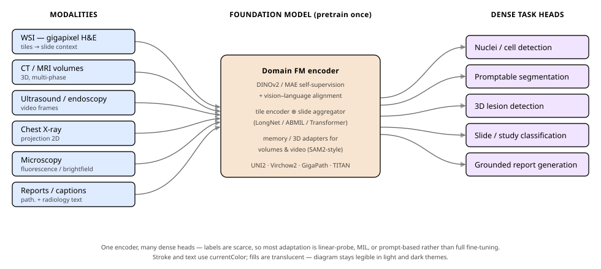
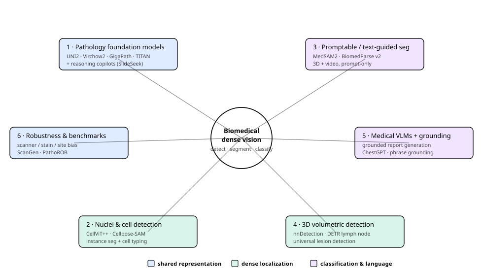
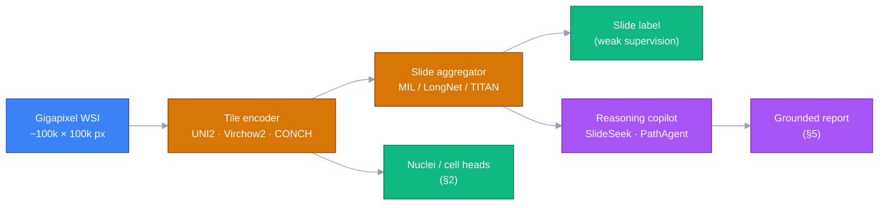
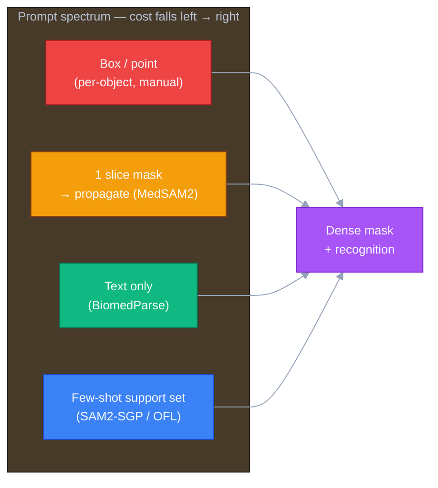
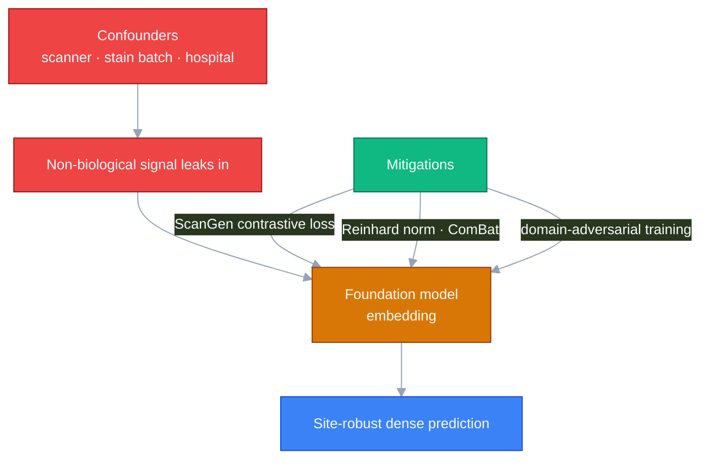

# Dense Object Detection & Classification — Recent Advances

*Compiled 2026-Jun-26 (America/Los_Angeles).*

Next installment in the running CV-updates log. Earlier entries on
`main`:
[Apr-30](../2026-Apr-30/2026-Apr-30_CV_updates.md),
[May-01](../2026-May-01/2026-May-01_CV_updates.md),
[May-02](../2026-May-02/2026-May-02_CV_updates.md),
[May-04](../2026-May-04/2026-May-04_CV_updates.md),
[May-05](../2026-May-05/2026-May-05_CV_updates.md),
[May-07](../2026-May-07/2026-May-07_CV_updates.md),
[May-08](../2026-May-08/2026-May-08_CV_updates.md),
[May-15](../2026-May-15/2026-May-15_CV_updates.md),
[May-16](../2026-May-16/2026-May-16_CV_updates.md),
[May-17](../2026-May-17/2026-May-17_CV_updates.md),
[Jun-09](../2026-Jun-09/2026-Jun-09_CV_updates.md),
[Jun-10](../2026-Jun-10/2026-Jun-10_CV_updates.md),
[Jun-12](../2026-Jun-12/2026-Jun-12_CV_updates.md),
[Jun-15](../2026-Jun-15/2026-Jun-15_CV_updates.md),
[Jun-16](../2026-Jun-16/2026-Jun-16_CV_updates.md),
[Jun-17](../2026-Jun-17/2026-Jun-17_CV_updates.md),
[Jun-19](../2026-Jun-19/2026-Jun-19_CV_updates.md),
[Jun-21](../2026-Jun-21/2026-Jun-21_CV_updates.md),
[Jun-22](../2026-Jun-22/2026-Jun-22_CV_updates.md),
[Jun-23](../2026-Jun-23/2026-Jun-23_CV_updates.md),
[Jun-24](../2026-Jun-24/2026-Jun-24_CV_updates.md),
[Jun-25](../2026-Jun-25/2026-Jun-25_CV_updates.md).

Those passes worked the **2D semantic / instance / relational** half of
dense vision (the YOLO/DETR/DEIM real-time race, oriented & aerial
detection, camouflaged/salient/small objects, open-world & long-tailed
recognition, promptable & panoptic segmentation, video instance/panoptic,
HOI, counting, MOT, scene graphs), the **geometric & correspondence** half
(depth, flow, pose, matching, stereo, monocular-3D, place recognition), the
**agent-facing** frontier (GUI grounding, detection-as-next-token, region
understanding), the **vision-centric 3D scene-perception** stack (BEV
detection, occupancy, world models, planning), and — last pass — the
**remote-sensing / Earth-observation** frontier.

Medical and biomedical imaging kept surfacing in fragments — pathology
nuclei (Jun-21), universal lesion detection and hyperspectral
classification (Jun-16), microscopy (May-17) — but, exactly like remote
sensing before Jun-25, it never got a dedicated pass on its own terms. That
is a gap, because **medicine is the other place where "dense detection +
classification" is being rebuilt around a different primitive than natural
images.** A natural-image detector inherits ImageNet/COCO priors and
outputs a handful of boxes over a 640×640 frame. A pathology model is
handed a **100,000 × 100,000-pixel gigapixel slide** with hundreds of
thousands of nuclei and only a *single* slide-level label; a radiology
model is handed a **3D volume** where the finding is three voxels wide and
the label says only "malignant"; a microscopy model must generalize across
stains, scanners, and organisms it never saw. The native outputs — every
cell typed, every lesion localized in 3D, every region tied to a sentence
in a report — are *dense by construction*, while supervision is scarce,
expensive, and noisy.

The field's answer in 2025–26 mirrors the geospatial story: a wave of
**domain foundation models** pretrained once with self-supervision (and
increasingly vision–language alignment) on millions of slides, volumes, and
image–text pairs, then driven through lightweight heads — multiple-instance
learning, prompt encoders, linear probes — into every dense task. This pass
rotates entirely to that **medical / biomedical dense-vision** frontier —
six threads:

- **Pathology foundation models** — tile→slide self-supervised and
  multimodal encoders, now wrapped in reasoning copilots.
- **Nuclei & cell detection / classification** — the dense primitive of
  computational pathology and microscopy.
- **Promptable & text-guided medical segmentation** — SAM2-for-volumes and
  text-only "parse everything" models.
- **3D volumetric lesion detection** — self-configuring and transformer
  detectors over CT/MRI/PET.
- **Medical VLMs & visually-grounded reporting** — detection in service of
  report generation and phrase grounding.
- **Robustness, generalization & benchmarks** — scanner/stain/site bias and
  the benchmarks now quantifying it.

> **A note on scope and sourcing.** This is a literature/landscape summary
> compiled from public papers, preprints, and project pages (links inline).
> Some sources sit behind paywalls or rate-limit automated fetches; where a
> page could not be retrieved, the entry leans on the abstract/search
> snippet and is flagged as such rather than dropped. Nothing here is
> clinical advice, and none of these models is a cleared diagnostic device
> unless its own documentation says so.

The stack above is the through-line for every section: heterogeneous
medical inputs on the left, one self-supervised (often vision–language)
encoder in the middle, and a fan of lightweight dense heads on the right.
The radial map below groups the six threads into the same three families
used in the Jun-25 pass — *shared representation*, *dense localization*, and
*dense classification & language*.

---

## 1. Pathology foundation models — tile → slide → multimodal

Computational pathology is the part of medical vision that most resembles
remote sensing: a single **gigapixel whole-slide image (WSI)** is far too
large to feed a network whole, so the canonical recipe is *tile → encode →
aggregate*. The 2024–26 wave replaced bespoke per-task CNNs with
**self-supervised tile encoders** and then **slide-level aggregators**,
trained on enormous unlabeled archives.

**Tile-level encoders (the workhorses).**

- **UNI / UNI2-h** (Mahmood Lab) — DINOv2-pretrained ViT tile encoders that
  became the de-facto feature extractor for weakly-supervised WSI
  classification; UNI2-h scales the backbone and pretraining corpus.
- **Virchow2** (Paige) — a ViT tile encoder scaled to ~**3.1M WSIs from
  ~225k patients** across globally diverse institutions, mixed
  magnifications and stains, targeting pan-cancer detection with strong
  rare-cancer generalization (the original Virchow trained on ~1.5M WSIs).
- **Prov-GigaPath** (Microsoft / Providence) — pretrained on **1.3 billion
  256×256 tiles from 171,189 slides**, and notable for using **LongNet
  dilated attention** to model the *whole slide* as one ultra-long sequence,
  fusing tile-level detail with global tissue architecture.
- **H-optimus-0 / CONCH** — additional widely-benchmarked encoders; CONCH
  is **vision–language** (image–text contrastive), enabling zero-shot text
  queries over tiles.

**Slide-level & multimodal foundation models (the 2025–26 frontier).**

- **TITAN** (Mahmood Lab, *Nature Medicine*, Nov 5 2025) — a *multimodal
  whole-slide* foundation model pretrained on **335,645 WSIs** with visual
  self-supervision **plus** vision–language alignment against pathology
  reports and **423,122 synthetic captions**. It emits a single slide-level
  embedding usable for **zero-shot** classification, retrieval, and report
  generation without per-task fine-tuning — the WSI analogue of a CLIP
  embedding.
  [Nature Medicine](https://www.nature.com/articles/s41591-025-03982-3) ·
  [code](https://github.com/mahmoodlab/TITAN)
- A parallel **multimodal knowledge-enhanced WSI foundation model** appeared
  in *Nature Communications*
  ([article](https://www.nature.com/articles/s41467-025-66220-x)), and
  **magnification-aware distillation (MAD)** proposes unified
  representation learning across magnifications for gigapixel WSIs
  ([arXiv](https://arxiv.org/pdf/2512.14796)).

**Why this matters for dense detection/classification.** These encoders are
rarely the *end* product — they are the shared backbone the other five
threads sit on. Slide classification is multiple-instance learning (MIL)
over frozen tile features; nuclei detection (§2) increasingly uses the same
encoders as backbones; report grounding (§5) aligns to their embeddings.

**Reasoning copilots over WSIs.** The newest layer wraps these encoders in
**agentic** systems that *navigate* a slide the way a pathologist does:

- **SlideSeek / PathChat+** — a multi-agent copilot where a *supervisor*
  agent forms diagnostic hypotheses and dispatches *explorer* agents to
  examine regions at chosen magnifications, synthesizing a visually-grounded
  report. On **DDxBench** (open-ended differential diagnosis, 55 diseases)
  it reports **86.0% top-1 / 92.7% top-3**, beating general MLLMs by up to
  ~42% and holding up on 41 rare diseases. PathChat+ itself is trained on
  ~1M visual-language instructions / ~5M QA turns over 624k images.
  [arXiv 2506.20964](https://arxiv.org/abs/2506.20964)
- **PathAgent** ([arXiv 2511.17052](https://arxiv.org/pdf/2511.17052)) and
  **TeamPath** ([arXiv 2511.17652](https://arxiv.org/html/2511.17652))
  pursue similar LLM-driven agentic reasoning over WSIs; an open pipeline /
  dataset for WSI vision-language modeling
  ([arXiv 2512.17326](https://arxiv.org/pdf/2512.17326)) aims to democratize
  these copilots.

Sources:
[Virchow2 / Prov-GigaPath overview (Pathology Outlines)](https://www.pathologyoutlines.com/topic/informaticsfoundationaimodels.html) ·
[Prov-GigaPath (PMC)](https://www.ncbi.nlm.nih.gov/pmc/articles/PMC11153137/) ·
[TITAN (Nature Medicine)](https://www.nature.com/articles/s41591-025-03982-3) ·
[SlideSeek/PathChat+ (arXiv)](https://arxiv.org/abs/2506.20964)

---

## 2. Nuclei & cell detection / classification — the dense primitive

If pathology slide classification is the *coarse* output, **per-nucleus
detection, segmentation, and typing** is the genuinely *dense* one — tens to
hundreds of thousands of instances per slide, each to be delineated and
classified (tumor / lymphocyte / stroma / …). This thread is where
"detection + classification" is most literal, and 2025 brought two big
generalization jumps.

- **CellViT++** (Jan 2025) — extends the CellViT detector to extract
  **deep features and instance masks in a single forward pass**, then reuses
  the per-cell Transformer-token embeddings for a **segmentation-agnostic
  cell-type classifier**. This decoupling gives **zero-shot segmentation**
  plus **data-efficient** cell typing across new tissues/tumors, with
  swappable foundation backbones (SAM-H, HIPT, **Virchow**). Strong results
  across seven datasets; ships with a web UI.
  [arXiv 2501.05269](https://arxiv.org/abs/2501.05269)
- **Cellpose-SAM** (preprint May 1 2025) — plugs **SAM foundation features**
  into the diameter-aware **Cellpose** flow backbone, claiming *"superhuman
  generalization"* across brightfield, phase-contrast, and most fluorescence
  channels with minimal tuning. It has become a default generalist for
  cell/nucleus segmentation in biology.
  [ResearchGate PDF](https://www.researchgate.net/publication/391390016_Cellpose-SAM_superhuman_generalization_for_cellular_segmentation) ·
  [practitioner guide](https://scirouter.ai/blog/cellpose-sam-complete-guide-cell-segmentation/)
- **CellSAM** — a SAM-derived **foundation model for cell segmentation**
  spanning microscopy modalities
  ([ResearchGate](https://www.researchgate.net/publication/398451184_CellSAM_a_foundation_model_for_cell_segmentation)).
- **Co-Seg** ([arXiv 2509.06740](https://arxiv.org/pdf/2509.06740)) —
  mutual prompt-guided **collaborative tissue + nuclei** segmentation, using
  each task to prompt the other; and **all-in-SAM** molecular-empowered
  **fine-grained multiclass** nuclei segmentation
  ([PMC](https://pmc.ncbi.nlm.nih.gov/articles/PMC12410749/)).
- Going 3D: **Bright-4B** scales hyperspherical learning for instance
  segmentation in **3D brightfield** microscopy
  ([arXiv 2512.22423](https://arxiv.org/pdf/2512.22423)).

**The pattern.** All four lean on a foundation backbone (SAM or a pathology
FM) for *generalization*, then bolt on a *lightweight, swappable* typing/flow
head — the same "one encoder, many heads" shape as §1, applied at the
single-cell scale. A 2025 systematic review of nucleus instance
segmentation ([IET Image Processing](https://ietresearch.onlinelibrary.wiley.com/doi/full/10.1049/ipr2.70129))
surveys the broader landscape.

Sources:
[CellViT++ (arXiv)](https://arxiv.org/abs/2501.05269) ·
[Cellpose-SAM (ResearchGate)](https://www.researchgate.net/publication/391390016_Cellpose-SAM_superhuman_generalization_for_cellular_segmentation) ·
[Co-Seg (arXiv)](https://arxiv.org/pdf/2509.06740)

---

## 3. Promptable & text-guided medical segmentation

The single biggest import from natural-image vision into medicine is the
**promptable segmenter** — and 2025 was the year SAM2's *memory/streaming*
design unlocked **3D volumes and video** while text-promptable models
removed the need for any geometric prompt at all.

- **MedSAM2** ([arXiv 2504.03600](https://arxiv.org/abs/2504.03600), Apr
  2025) — fine-tunes **SAM2** on a large medical corpus (**>455k 3D
  image–mask pairs and ~76k video frames**) and **reframes every 2D/3D/video
  segmentation task as object tracking**: a prompt on one slice propagates
  through the volume via memory attention. A **self-sorting memory bank**
  keeps informative, dissimilar embeddings, improving 3D consistency and
  enabling **one-prompt** 2D segmentation. User studies report **>85%**
  reduction in manual annotation effort across CT lesions, liver-MRI
  lesions, and echocardiogram video.
  [project page](https://medsam2.github.io/) ·
  [HF](https://huggingface.co/papers/2504.03600)
- **BiomedParse** (*Nature Methods*, Jan 2025) — a **text-promptable**
  foundation model for **joint segmentation, detection, and recognition**
  across **nine modalities**, trained on **>6M image–mask–text triples**.
  With *text only* (no box/point) it **beats SOTA box-prompted methods**, and
  it **statistically rejects invalid prompts** (e.g. "find the left ventricle
  in a dermoscopy image") to curb hallucination.
  [Nature Methods](https://www.nature.com/articles/s41592-024-02499-w) ·
  [project](https://microsoft.github.io/BiomedParse/) ·
  [code](https://github.com/microsoft/BiomedParse)
  - **BiomedParse v2** (Oct 15 2025) scales pretraining to million-scale
    over **200+ anatomies**, adds the **BoltzFormer** architecture for
    small-object segmentation, and supports **end-to-end 3D volumetric**
    inference — pushing toward SOTA volumetric performance.
    **BiomedParse-V** extends the universal text-guided idea to volumes
    ([Springer chapter](https://link.springer.com/chapter/10.1007/978-3-032-23496-4_7)).
- **SAM2 adaptation studies** — because off-the-shelf SAM2 underperforms on
  medical data, a cluster of 2025 work makes it *few-shot* and *robust*:
  **OFL-SAM2** (online few-shot learner prompting,
  [arXiv 2512.24861](https://arxiv.org/pdf/2512.24861)), **SAM2-SGP**
  (support-set guided prompting,
  [arXiv 2506.19658](https://arxiv.org/pdf/2506.19658)), and an empirical
  study of **ultrasound-video** SAM2 finetuning from a data perspective
  ([arXiv 2511.05731](https://arxiv.org/pdf/2511.05731)).

Sources:
[MedSAM2 (arXiv)](https://arxiv.org/abs/2504.03600) ·
[BiomedParse (Nature Methods)](https://www.nature.com/articles/s41592-024-02499-w) ·
[BiomedParse-V (Springer)](https://link.springer.com/chapter/10.1007/978-3-032-23496-4_7) ·
[SAM2-SGP (arXiv)](https://arxiv.org/pdf/2506.19658)

---

## 4. 3D volumetric lesion detection in radiology

Detection in CT/MRI/PET is its own discipline: targets are tiny relative to
the volume, classes are severely imbalanced, and "where is it" must be
answered in **3D**. Two strands dominate — *self-configuring* detectors and
*transformer* detectors — plus the benchmarks that keep them honest.

- **nnDetection** (MIC-DKFZ) — the detection counterpart to nnU-Net: a
  **self-configuring** framework that picks architecture, hyperparameters,
  and training schedule from dataset properties with no manual tuning, built
  on a **Retina U-Net** one-stage core that explicitly handles class
  imbalance and multi-scale objects. It remains a go-to strong baseline and
  has been adapted to mediastinal lesions, lymphoma, and more.
  [GitHub](https://github.com/MIC-DKFZ/nnDetection) ·
  [mediastinal adaptation (arXiv)](https://arxiv.org/pdf/2303.11214)
- **Universal lesion detection & tagging (ULDT)** on **DeepLesion** —
  jointly localize, size, and tag lesions anywhere in the body. Recent work:
  **3D ULDT with self-training** ([PubMed](https://pubmed.ncbi.nlm.nih.gov/40735103/)),
  **class-imbalance correction** for ULDT
  ([PMC](https://pmc.ncbi.nlm.nih.gov/articles/PMC12306826/)), and the
  multitask lineage from **MULAN** (joint detect + tag + segment). **PDSE**
  pairs PANet with a deformable squeeze-and-excitation block for multi-lesion
  detection ([arXiv 2506.03608](https://arxiv.org/pdf/2506.03608)).
- **Transformer (DETR-style) detectors** — **location-debiased query
  selection + contrastive query representation** for CT **lymph-node**
  detection ([arXiv 2404.03819](https://arxiv.org/pdf/2404.03819)), and an
  **autoregressive tracking Transformer** that treats slices as a sequence
  for **cohesive 3D lymph-node** detection
  ([arXiv 2503.07933](https://arxiv.org/pdf/2503.07933)). **Anatomy-aware**
  detection for whole-body **PET/CT lymphoma**
  ([arXiv 2511.07047](https://arxiv.org/pdf/2511.07047)) injects organ priors
  to suppress false positives.
- **Benchmarks** — the **ULS23** challenge provides a baseline model and
  benchmark for **3D universal lesion segmentation** in CT
  ([arXiv 2406.05231](https://arxiv.org/pdf/2406.05231)); a 2024 systematic
  review covers pulmonary-nodule detection/segmentation
  ([European Radiology](https://link.springer.com/article/10.1007/s00330-024-10907-0)).
  An adjacent imaging-physics result: **DL image reconstruction** improves
  nodule detection at **ultra-low-dose** chest CT
  ([Radiology](https://pubs.rsna.org/doi/full/10.1148/radiol.210551)).

**The pattern.** Unlike pathology, radiology detection is *not* yet
dominated by a single foundation model — the volume is the unit, labels are
genuinely 3D, and the strongest systems are still task-configured detectors
(nnDetection) or DETR variants with anatomical priors. Promptable
volumetric segmenters (§3) are starting to feed candidate masks into this
pipeline, which is where the two threads converge.

Sources:
[nnDetection (GitHub)](https://github.com/MIC-DKFZ/nnDetection) ·
[Contrastive query lymph-node DETR (arXiv)](https://arxiv.org/pdf/2404.03819) ·
[Autoregressive tracking transformer (arXiv)](https://arxiv.org/pdf/2503.07933) ·
[ULS23 (arXiv)](https://arxiv.org/pdf/2406.05231)

---

## 5. Medical VLMs & visually-grounded reporting

The clinically valuable output is rarely a raw box — it is a **report**, and
the trust requirement is that each phrase be **grounded** to the pixels that
justify it. So detection/localization is increasingly trained *jointly with*
language, both to improve reports and to make them auditable.

- **ChestGPT** ([arXiv 2507.03739](https://arxiv.org/html/2507.03739v1),
  Jul 2025) — couples a ViT with an LLM for **joint disease detection and
  localization** on chest X-rays, returning findings tied to image regions.
- **GK-MVLP** — **grounded knowledge-enhanced** medical vision–language
  pretraining that aligns medical knowledge to **anatomical regions**,
  improving disease classification, **localization**, report generation, and
  VQA together ([arXiv 2404.14750](https://arxiv.org/abs/2404.14750);
  [ScienceDirect](https://www.sciencedirect.com/science/article/abs/pii/S1746809425009279)).
- **Region-guided CT report generation** — an LLM with **region-guided
  referring and grounding** for 3D CT reports
  ([arXiv 2411.15539](https://arxiv.org/pdf/2411.15539)); **VLMs for 3D
  PET/CT** report generation ([arXiv 2511.20145](https://arxiv.org/pdf/2511.20145)).
- **Phrase-grounded fact-checking** — verifies each generated phrase against
  the image to catch hallucinated findings
  ([arXiv 2509.21356](https://arxiv.org/pdf/2509.21356)) — a detection-style
  check used as a *guardrail* on generation.
- **MiniGPT-Med** — a multi-modality (X-ray/CT/MRI) VLM with task-specific
  instruction tokens spanning grounding and non-grounding tasks; and
  **gaze-guided** chest-X-ray pretraining that learns from radiologist
  attention ([arXiv 2603.26049](https://arxiv.org/pdf/2603.26049)). A 2025
  review surveys **longitudinal** report generation
  ([arXiv 2510.12444](https://arxiv.org/pdf/2510.12444)).

**The pattern.** Grounding flips detection from *the product* into *the
evidence*: the model must point at the lesion to be believed about the
sentence it wrote. This is the medical mirror of the agent-facing
"detection-as-evidence" trend from the Jun-23 pass.

Sources:
[ChestGPT (arXiv)](https://arxiv.org/html/2507.03739v1) ·
[GK-MVLP (arXiv)](https://arxiv.org/abs/2404.14750) ·
[Region-guided CT report (arXiv)](https://arxiv.org/pdf/2411.15539) ·
[Phrase-grounded fact-checking (arXiv)](https://arxiv.org/pdf/2509.21356)

---

## 6. Robustness, generalization & benchmarks

The thread that decides whether any of the above reaches a clinic. Medical
models fail in a *characteristic* way: they latch onto **non-biological**
signal — the scanner, the stain batch, the originating hospital — and
silently degrade on data from a new site. 2025 produced both the sobering
benchmarks and the first mitigations.

- **Scanner sensitivity + ScanGen** ([arXiv 2507.22092](https://arxiv.org/abs/2507.22092))
  — shows pathology FMs *still* carry **scanner bias** despite the
  generalization promise, and introduces **ScanGen**, a contrastive loss
  applied during task-specific fine-tuning that suppresses scanner-dependent
  features while preserving (here) EGFR-mutation prediction.
- **PathoROB** — a public **robustness benchmark** quantifying reliance on
  non-biological features across **20 foundation models** and the resulting
  **downstream clinical errors**; finds **Reinhard stain normalization** and
  **ComBat batch correction** raise a robustness index, while
  domain-adversarial training improves generalization.
- **"Current Pathology FMs are unrobust to medical-center differences"**
  ([arXiv 2501.18055](https://arxiv.org/html/2501.18055v2)) — a blunt
  demonstration that center identity leaks into embeddings; and
  **"Towards robust foundation models for digital pathology"**
  ([Nature Communications](https://www.nature.com/articles/s41467-026-73923-2))
  pushes toward fixes.
- **Stain normalization** as a front-line defense remains active —
  attention-guided residual structure-preserving normalization
  ([PMC](https://pmc.ncbi.nlm.nih.gov/articles/PMC12467461/)) and
  latent-manifold compaction
  ([arXiv 2602.24251](https://arxiv.org/pdf/2602.24251)).

Sources:
[ScanGen (arXiv)](https://arxiv.org/abs/2507.22092) ·
[Unrobust to medical-center differences (arXiv)](https://arxiv.org/html/2501.18055v2) ·
[Robust FMs for digital pathology (Nature Comms)](https://www.nature.com/articles/s41467-026-73923-2)

---

## 7. Cross-cutting theme — the COCO assumptions don't survive the clinic

Read together, the six threads tell one story, and it is the same shape as
the Jun-25 remote-sensing pass: **the assumptions baked into natural-image
detection break in medicine, and the field's response is a domain foundation
model plus thin task heads.**

- **Scale.** A COCO image is ~0.3 MP; a WSI is ~10,000 MP. You cannot feed
  it whole, so the unit is a *tile* (pathology) or a *3D patch* (radiology),
  and a separate **aggregator** rebuilds global context (LongNet, MIL,
  memory attention).
- **Supervision.** COCO gives a box per object; medicine gives **one weak
  label per gigapixel slide** or **per 3D study**, with the dense structure
  (every nucleus, every voxel of a lesion) *unlabeled*. Hence MIL,
  self-training, prompt-only segmentation, and the **>85% annotation savings**
  MedSAM2 reports are not conveniences — they are the only way the data
  economics work.
- **The native output is dense.** "Type every cell," "segment the lesion in
  3D," "ground every sentence" — these are not post-hoc; they are the task.
- **Distribution shift is adversarial, not incidental.** Scanners, stains,
  and hospitals are confounders the model will exploit unless explicitly
  defended against (§6) — the failure mode that most separates a leaderboard
  number from a deployable tool.
- **Convergence on one recipe.** Every thread reduces to *self-supervised
  (often vision-language) pretraining → lightweight adaptation*. The encoder
  is shared; the head is cheap; the prompt is increasingly **text**.

Where this leaves the running log: across the 2D, geometric, agent-facing,
3D-scene, remote-sensing, and now medical passes, the same gravitational
pull keeps showing up — **away from bespoke detectors trained per task,
toward one pretrained representation queried many ways.** Medicine is the
hardest test of that thesis, because here the cost of a confident wrong box
is measured in patients, not mAP.

---

### Methodology & caveats

- **Compiled** 2026-Jun-26 (America/Los_Angeles) as part of the running
  CV-updates series; scope chosen to fill the medical/biomedical gap left by
  prior passes without duplicating them.
- **Sourcing** is public papers, preprints (arXiv/bioRxiv), and project
  pages, linked inline. A few publisher pages rate-limited or blocked
  automated fetching (e.g. the MedSAM2 project page returned HTTP 403 on
  fetch); those entries rely on abstracts/snippets and are written
  conservatively. Per the task's resilience requirement, blocked sources
  were worked around rather than allowed to halt the compile.
- **Dates** reflect publication/preprint timing as reported by the sources;
  where a venue and a preprint differ, both are noted.
- **Not medical advice.** None of these systems is presented here as a
  cleared diagnostic device; capability claims are the authors' own.
- **Diagrams** are inline Mermaid and standalone SVG with no external URLs.
  SVGs use `currentColor` for strokes/text and translucent fills; Mermaid
  uses explicit `classDef` fills with light text — both render legibly in
  light and dark themes.
