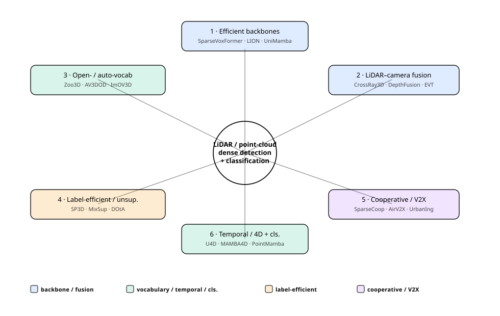
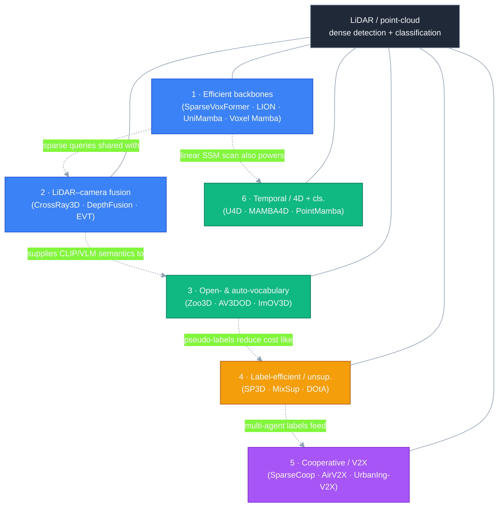
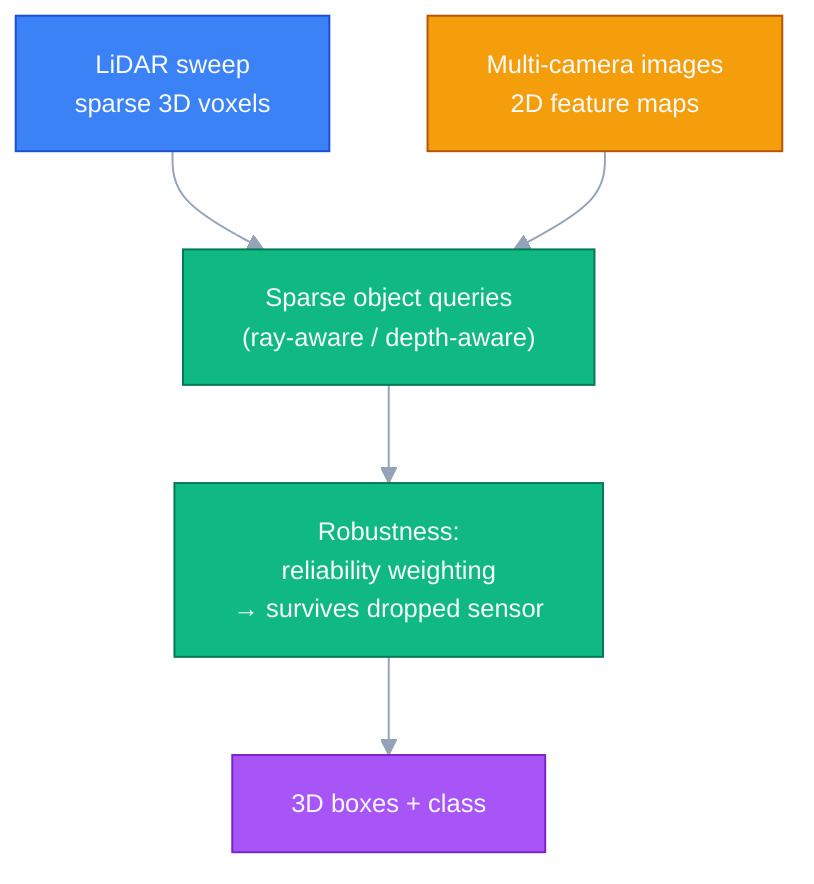

# Dense Object Detection & Classification — Recent Advances

*Compiled 2026-Jun-27 (America/Los_Angeles).*

Next installment in the running CV-updates log. Earlier entries on
`main`:
[Apr-30](../2026-Apr-30/2026-Apr-30_CV_updates.md),
[May-01](../2026-May-01/2026-May-01_CV_updates.md),
[May-02](../2026-May-02/2026-May-02_CV_updates.md),
[May-04](../2026-May-04/2026-May-04_CV_updates.md),
[May-05](../2026-May-05/2026-May-05_CV_updates.md),
[May-07](../2026-May-07/2026-May-07_CV_updates.md),
[May-08](../2026-May-08/2026-May-08_CV_updates.md),
[May-15](../2026-May-15/2026-May-15_CV_updates.md),
[May-16](../2026-May-16/2026-May-16_CV_updates.md),
[May-17](../2026-May-17/2026-May-17_CV_updates.md),
[Jun-09](../2026-Jun-09/2026-Jun-09_CV_updates.md),
[Jun-10](../2026-Jun-10/2026-Jun-10_CV_updates.md),
[Jun-12](../2026-Jun-12/2026-Jun-12_CV_updates.md),
[Jun-15](../2026-Jun-15/2026-Jun-15_CV_updates.md),
[Jun-16](../2026-Jun-16/2026-Jun-16_CV_updates.md),
[Jun-17](../2026-Jun-17/2026-Jun-17_CV_updates.md),
[Jun-19](../2026-Jun-19/2026-Jun-19_CV_updates.md),
[Jun-21](../2026-Jun-21/2026-Jun-21_CV_updates.md),
[Jun-22](../2026-Jun-22/2026-Jun-22_CV_updates.md),
[Jun-23](../2026-Jun-23/2026-Jun-23_CV_updates.md),
[Jun-24](../2026-Jun-24/2026-Jun-24_CV_updates.md),
[Jun-25](../2026-Jun-25/2026-Jun-25_CV_updates.md).

## Why this pass: the sensor-side of 3D, on its own terms

The [Jun-24](../2026-Jun-24/2026-Jun-24_CV_updates.md) pass worked the
**vision-centric** 3D stack — camera BEV detection, dense voxel occupancy,
Gaussian/sparse occupancy, world models — and was *explicitly* camera-first:
LiDAR appeared only as the thing fusion modules bolt on. The
[Jun-25](../2026-Jun-25/2026-Jun-25_CV_updates.md) pass rotated to remote
sensing, where the primitive is spectral bands and time series over a fixed
patch of ground. Neither gave the **LiDAR / point-cloud detection-and-
classification stack** a dedicated pass on its own terms, and across the
~200 sections of the running log it has only ever surfaced in fragments
(RGB-T/SAR *fusion* on May-05, hyperspectral *classification* on Jun-16,
3D point-cloud *classification* on Jun-17, multi-view indoor detection on
Jun-16). That is the gap this entry fills.

It deserves its own pass because **the point cloud is a genuinely different
primitive** from the image grid, and 2025–26 is the year its detectors
stopped borrowing image architectures and grew their own:

- **The data is sparse, unordered, and 3D.** A LiDAR sweep is ~100–200k
  points scattered over a 100 m radius — >99 % of the voxel volume is empty.
  Dense 3D convolution wastes almost all its FLOPs on air; the field's whole
  efficiency story is *how aggressively you exploit that emptiness*.
- **Range matters, and attention does not scale to it.** Long-range
  perception (≥200 m for highway driving) means tens of thousands of
  occupied voxels per scene. Window-transformer detectors (DSVT) made
  attention tractable; in the last year **linear-time state-space and RNN
  backbones** (Mamba, RWKV, RetNet) took over the long-sequence regime.
- **Labels are 3D boxes drawn by humans in a 3D viewer** — far costlier than
  2D boxes. So **label-efficient, sparsely-supervised, and fully
  unsupervised** discovery is not a side quest here; it is the dominant
  cost-reduction thread.
- **Geometry is metric and shareable.** Because points live in metric space,
  multiple agents (cars, roadside units, drones) can fuse their sweeps —
  **cooperative / V2X perception** is a first-class topic, not an
  afterthought.

This pass covers six threads of that stack:

1. **Efficient point-cloud backbones** — sparse-voxel transformers → linear
   state-space / RNN detectors (the headline architectural shift).
2. **Multi-modal LiDAR–camera fusion** — sparse-query fusion that survives a
   dropped sensor.
3. **Open-vocabulary & auto-vocabulary 3D detection** — naming objects with
   no 3D box labels, even with no user-supplied class list.
4. **Label-efficient, sparse & unsupervised** 3D detection — one click, one
   box, or zero labels per scene.
5. **Cooperative / V2X perception** — fusing across vehicles, infrastructure,
   and aerial agents.
6. **Temporal, 4D & point-cloud classification** — sequence models, LiDAR
   world models, and the backbone that feeds shape classification.

> **Reading the numbers.** Figures are quoted from each method's own paper or
> leaderboard entry. Detection protocols differ (nuScenes mAP/NDS vs. Waymo
> mAPH/L2 vs. KITTI/Argoverse-2/ScanNet/SUN-RGBD), point densities and class
> sets differ, and "SOTA" claims are as-of each paper — so cross-row deltas
> are indicative, not controlled. arXiv IDs encode submission month (e.g.
> `2510.xxxxx` = Oct 2025); a few details I could only corroborate indirectly
> are marked *(corroborate)*.

## Topic map

---

## 1 · Efficient point-cloud backbones — from sparse-voxel transformers to linear-time SSM/RNN

The defining architectural story of the last year is the migration off
quadratic attention. The lineage runs **dense 3D conv → submanifold sparse
conv (SECOND/VoxelNeXt) → window transformer (DSVT) → linear-complexity
state-space / RNN backbones**, each step buying longer range at lower cost
per occupied voxel.

- **DSVT — Dynamic Sparse Voxel Transformer** ([arXiv 2301.06051](https://arxiv.org/abs/2301.06051),
  CVPR 2023) is the immediate ancestor: window-based attention over rotated
  voxel sets, the strong transformer baseline everything since is measured
  against.
- **LION — Linear Group RNN for 3D Object Detection** ([arXiv 2407.18232](https://arxiv.org/abs/2407.18232),
  NeurIPS 2024) is the pivot. A window-based framework that runs a *linear*
  group RNN over grouped voxel features, and is operator-agnostic — it slots
  in **Mamba, RWKV, RetNet, or TTT**. **LION-Mamba set a new state of the art
  on the nuScenes test benchmark, beating DSVT by +1.2 NDS / +1.4 mAP**, with
  SOTA results also on Waymo, Argoverse-V2 and ONCE, all trainable in <24 GB.
- **Voxel Mamba — Group-Free State Space Models** ([arXiv 2406.10700](https://arxiv.org/abs/2406.10700))
  drops the windowing entirely: a group-free serialization linearizes the
  *whole* occupied voxel space into one continuous sequence (Hilbert-curve
  ordering) to preserve spatial proximity, with a dual-scale design for
  hierarchical context.
- **UniMamba** ([arXiv 2503.12009](https://arxiv.org/abs/2503.12009),
  Mar 2025) fuses 3D submanifold convolution with SSM in a multi-head block —
  3D-conv dynamic position embedding, complementary **Z-order serialization**
  (horizontal + vertical), and a channel-grouped local-global aggregator. It
  reports **70.2 mAP on nuScenes** with results across nuScenes, Waymo and
  Argoverse-2.
- **GateMamba** ([ISPRS J. Photogramm. & RS, 2026](https://www.sciencedirect.com/science/article/abs/pii/S0924271626001917))
  and **MSHI-Mamba** ([Appl. Sci., 2026](https://www.mdpi.com/2076-3417/16/3/1189))
  push on the two standing weaknesses of these scans: unidirectional scanning
  ignores bidirectional spatial relations (GateMamba's feature-gated mixers)
  and single-layer SSMs limit cross-layer feature flow (MSHI's multi-stage
  hierarchical interaction). **PillarMamba** ([arXiv 2505.05397](https://arxiv.org/abs/2505.05397))
  adapts the recipe to the roadside (infrastructure) sensing setting.
- **SparseVoxFormer** ([arXiv 2503.08092](https://arxiv.org/abs/2503.08092),
  Mar 2025) attacks the BEV bottleneck directly: instead of collapsing to a
  dense BEV grid, it runs a transformer over **high-resolution sparse 3D voxel
  features**, leveraging emptiness to keep compute down while reporting SOTA
  on nuScenes at faster inference. (It is also multi-modal — see §2.)

```mermaid
%%{init: {"theme":"base","themeVariables":{
  "primaryColor":"#3b82f6","primaryTextColor":"#f8fafc",
  "primaryBorderColor":"#1d4ed8","lineColor":"#94a3b8","fontSize":"13px"}}}%%
flowchart LR
  classDef old   fill:#64748b,stroke:#334155,color:#f8fafc;
  classDef mid   fill:#3b82f6,stroke:#1d4ed8,color:#f8fafc;
  classDef new   fill:#10b981,stroke:#047857,color:#f8fafc;

  A["Dense 3D conv<br/>O(volume) · wastes air"]:::old
  B["Submanifold sparse conv<br/>SECOND · VoxelNeXt<br/>O(occupied)"]:::old
  C["Window transformer<br/>DSVT<br/>O(N·w) attention"]:::mid
  D["Linear SSM / RNN<br/>LION · Voxel Mamba · UniMamba<br/>O(N) global, long-range"]:::new

  A --> B --> C --> D
  C -. "drop quadratic attention" .-> D
  D -. "serialize voxels:<br/>Z-order / Hilbert curve" .-> D
```

**Takeaway.** For long-range LiDAR, **linear-time global mixing has displaced
windowed attention** as the default backbone idea; the open problems are
serialization (how to flatten 3D space into a 1-D scan without breaking
locality) and scan directionality (uni- vs. bi-directional).

---

## 2 · Multi-modal LiDAR–camera fusion — sparse queries that survive a dropped sensor

Fusion moved from dense BEV concatenation (BEVFusion,
[arXiv 2205.13790](https://arxiv.org/abs/2205.13790); TransFusion,
[arXiv 2203.11496](https://arxiv.org/abs/2203.11496)) toward **sparse, query-
centric** fusion that is both cheaper and robust to a missing modality.

- **CrossRay3D — Geometry & Distribution Guidance for Efficient Multimodal 3D
  Detection** ([arXiv 2510.15991](https://arxiv.org/abs/2510.15991), Oct 2025)
  is the standout. It argues sparse detectors fail when they discard geometry
  and ignore class imbalance, and fixes both: a **Sparse Selector** with
  **Ray-Aware Supervision** preserves geometric structure, **Class-Balanced
  Supervision** reweights rare classes, and **Ray Positional Encoding**
  bridges the LiDAR/image distribution gap. It reports **72.4 mAP / 74.7 NDS
  on nuScenes at 1.84× faster** inference than leading methods, and degrades
  gracefully when LiDAR *or* camera is partially or entirely missing.
- **SparseVoxFormer** ([arXiv 2503.08092](https://arxiv.org/abs/2503.08092))
  fuses image features onto its high-res sparse voxels rather than a BEV grid
  — SOTA on nuScenes with faster inference (also §1).
- **DepthFusion — Depth-Aware Hybrid Feature Fusion** ([arXiv 2505.07398](https://arxiv.org/abs/2505.07398),
  May 2025) weights the camera vs. LiDAR contribution by depth, where the
  modalities' reliability crosses over.
- **EVT — Efficient View Transformation** ([arXiv 2411.10715](https://arxiv.org/abs/2411.10715))
  targets the lift-to-BEV step that dominates camera-branch cost.
- **Reliability-Driven LiDAR–Camera Fusion** ([arXiv 2502.01856](https://arxiv.org/abs/2502.01856),
  Feb 2025) makes robustness explicit, estimating per-region modality
  reliability before fusing — the recurring 2025 theme that a fusion model
  must not collapse when one sensor is degraded or absent.
- **Dual-Domain Homogeneous Fusion with Cross-Modal Mamba** ([arXiv 2503.08992](https://arxiv.org/abs/2503.08992))
  carries the §1 SSM idea into fusion, mixing modalities with a progressive
  Mamba decoder.

**Takeaway.** The frontier is **sparse-query fusion with explicit
geometry-preservation and graceful sensor-dropout** — accuracy at fewer FLOPs
*and* a model that does not fall over when a camera is blinded or LiDAR
returns are sparse.

---

## 3 · Open-vocabulary & auto-vocabulary 3D detection — naming objects without 3D box labels

The hardest constraint in 3D is the scarcity of point-cloud–text pairs and
the image↔point-cloud modality gap. The 2024–26 line answers it by
**distilling 2D foundation models (CLIP, SAM, VLMs) into the 3D detector**,
and the newest work removes even the user-supplied class list.

- **Zoo3D — Zero-Shot 3D Object Detection at Scene Level** ([arXiv 2511.20253](https://arxiv.org/abs/2511.20253),
  Nov 2025) is, by its own claim, the first to do open-vocabulary 3D detection
  in a **fully training-free** manner — no 3D detection training data at all —
  building boxes from 2D foundation-model outputs and camera geometry.
- **Auto-Vocabulary 3D Object Detection (AV3DOD)** ([arXiv 2512.16077](https://arxiv.org/abs/2512.16077),
  Dec 2025) goes one step further than open-vocabulary: classes are
  **auto-generated** per detected object with *no* user input. It uses 2D VLM
  captioning → pseudo-3D-box generation → feature-space semantics expansion,
  and introduces a **Semantic Score (SS)** metric for generated class quality.
  It beats prior SOTA **CoDA by +3.48 overall mAP and +24.5 % relative SS on
  ScanNetV2** (and reports gains on SUN-RGBD).
- **ImOV3D — Open-Vocabulary Point Clouds from Only 2D Images** ([arXiv 2410.24001](https://arxiv.org/abs/2410.24001))
  learns an open-vocab point-cloud detector when *no* 3D training data exists,
  lifting 2D supervision into 3D.
- **OV-SCAN — Semantically Consistent Alignment for Novel Object Discovery**
  ([arXiv 2503.06435](https://arxiv.org/abs/2503.06435)) tackles the discovery
  half: finding genuinely novel categories while keeping alignment consistent.
- **FM-OV3D — Foundation-Model Cross-modal Knowledge Blending** ([arXiv 2312.14465](https://arxiv.org/abs/2312.14465))
  is the reference blend of multiple foundation models for open-vocab 3D.
- For autonomous-driving LiDAR specifically, **Vision-Language Guidance for
  LiDAR-based Unsupervised 3D Detection** ([arXiv 2408.03790](https://arxiv.org/abs/2408.03790))
  transfers CLIP knowledge to *name* spatio-temporally clustered point groups
  — a bridge into §4.

**Takeaway.** 3D open-vocabulary detection is increasingly **a 2D-foundation-
model distillation problem**; the 2025-end frontier (Zoo3D, AV3DOD) is to need
neither 3D box labels nor even a predefined class list.

---

## 4 · Label-efficient, sparse & unsupervised 3D detection — one click, one box, or none

Because 3D boxes are expensive to draw, this thread aims to **approach
full-supervision accuracy with a fraction of the annotation** — and, at the
limit, with none.

- **SP3D — Sparsely-Supervised 3D Detection via Cross-Modal Semantic Prompts**
  ([arXiv 2503.06467](https://arxiv.org/abs/2503.06467), Mar 2025) uses
  accurate cross-modal prompts to sharpen feature discrimination when only a
  handful of boxes are labeled.
- **MixSup — Mixed-grained Supervision** ([arXiv 2401.16305](https://arxiv.org/abs/2401.16305))
  mixes *massive cheap cluster labels* with *a few accurate boxes* — the
  practical sweet spot for label budget.
- **Single-click annotation** ([ISPRS J. Photogramm. & RS, 2026](https://www.sciencedirect.com/science/article/abs/pii/S0924271626000821))
  reduces the per-object cost to one click for outdoor LiDAR detection.
- **DOtA — Detecting Objects from Multi-Agent LiDAR Scans without Manual
  Labels** ([arXiv 2503.08421](https://arxiv.org/abs/2503.08421), Mar 2025)
  is the fully-unsupervised standout: it exploits **shared, complementary
  views across multiple agents** to discover objects with *no* external
  labels — directly linking label-efficiency to the cooperative setting (§5).
- Motion-based pseudo-labeling (the lineage behind
  [LISO](https://arxiv.org/abs/2403.07071) and
  [Towards Unsupervised Object Detection from LiDAR, CVPR 2023](https://openaccess.thecvf.com/content/CVPR2023/papers/Zhang_Towards_Unsupervised_Object_Detection_From_LiDAR_Point_Clouds_CVPR_2023_paper.pdf))
  remains the dominant label-free recipe: cluster + track moving objects,
  bootstrap a detector — with the standing weakness that static objects and
  fine class labels are hard, which the VLM-guided work in §3 addresses.

**Takeaway.** The cost frontier has two ends converging: **mixed-grained /
single-click** supervision squeezing the most out of a tiny budget, and
**multi-agent + motion + VLM** pipelines that need no human boxes at all.

---

## 5 · Cooperative / V2X perception — fusing across cars, infrastructure, and drones

Because point clouds are metric, agents can share them. Collaborative
perception sees through occlusion and extends range past any single sensor —
at the price of bandwidth, latency, and cross-agent alignment.

- **SparseCoop — Cooperative Perception with Kinematic-Grounded Queries**
  ([arXiv 2512.06838](https://arxiv.org/abs/2512.06838), Dec 2025) is a
  **fully sparse** cooperative detection-*and*-tracking framework:
  kinematic-grounded instance queries carry 3D geometry + velocity for
  spatio-temporal alignment, with coarse-to-fine aggregation and cooperative
  instance denoising — the sparse-query idea from §1–2 lifted to multi-agent.
- **AirV2X — Unified Air-Ground V2X** ([arXiv 2506.19283](https://arxiv.org/abs/2506.19283),
  Jun 2025) adds **aerial agents (drones)** to the vehicle/infrastructure mix,
  giving top-down views that resolve ground-level occlusion.
- **UrbanIng-V2X** ([arXiv 2510.23478](https://arxiv.org/abs/2510.23478),
  Oct 2025) is a new large-scale **multi-vehicle, multi-infrastructure**
  dataset spanning multiple intersections — the data substrate the field has
  been missing beyond DAIR-V2X and V2X-Seq.
- **Pragmatic Heterogeneous Collaborative Perception via Generative
  Communication** ([arXiv 2510.19618](https://arxiv.org/abs/2510.19618))
  tackles the realistic case where agents run **different sensors and
  models**, using a generative mechanism to reconcile heterogeneous messages.
- The **End-to-End V2X Cooperative Autonomous Driving Competition**
  ([arXiv 2507.21610](https://arxiv.org/abs/2507.21610)) report surveys where
  the field's bottlenecks actually are, increasingly via large VLMs in the
  loop.

**Takeaway.** Cooperative 3D detection is consolidating around **sparse
instance-level message passing** (cheaper than dense BEV feature sharing) and
**heterogeneity-tolerant** fusion, with new air-ground datasets pushing past
the vehicle-infrastructure-only era.

---

## 6 · Temporal, 4D & point-cloud classification — sequence models, world models, and the shape-recognition half

The same linear-scan machinery from §1 generalizes from a single sweep to
**sequences of sweeps** (4D) and to the **classification** half of dense
point-cloud vision.

**Temporal & 4D**

- **U4D — Uncertainty-Aware 4D World Modeling from LiDAR Sequences**
  ([arXiv 2512.02982](https://arxiv.org/abs/2512.02982), CVPR 2026) treats
  **spatial uncertainty as a structural prior**: it estimates uncertainty maps
  from a pretrained segmentation model, then generates the 4D scene
  "hard-to-easy" (high-entropy regions first, then completion under learned
  priors), with a mixture-of-spatio-temporal block for temporal coherence —
  the LiDAR-native counterpart to the camera occupancy world models from
  Jun-24.
- **MAMBA4D — Long-Sequence Point-Cloud Video Understanding** ([arXiv 2405.14338](https://arxiv.org/abs/2405.14338))
  disentangles spatial and temporal SSMs for efficient point-cloud *video*.
- **MambaTrack3D** ([arXiv 2511.15077](https://arxiv.org/abs/2511.15077),
  Nov 2025) applies SSMs to LiDAR single-object tracking under high temporal
  variation.

**Point-cloud classification (the recognition half)**

- **PointMamba** ([arXiv 2402.10739](https://arxiv.org/abs/2402.10739),
  NeurIPS 2024) ports Mamba to point-cloud analysis with linear complexity and
  global modeling — **94.32 % on ScanObjectNN OBJ-BG**, 92.60 % OBJ-ONLY,
  89.31 % on the hard PB-T50-RS split.
- **Point Cloud Mamba (PCM)** ([AAAI 2025](https://ojs.aaai.org/index.php/AAAI/article/view/33098/35253))
  and **DyReMamba** ([Sci. Reports, 2026](https://www.nature.com/articles/s41598-026-48606-z),
  dynamic reordering + bidirectional SSM, **92.6 % ModelNet40 / 93.15 %
  ScanObjectNN OBJ-BG**) push the SSM-for-shape-recognition line.
- **PMA — Point Mamba Adapter** ([arXiv 2505.20941](https://arxiv.org/abs/2505.20941))
  and **GAPrompt — Geometry-Aware Point-Cloud Prompt** ([arXiv 2505.04119](https://arxiv.org/abs/2505.04119))
  bring **parameter-efficient adaptation** (adapters / prompts) to frozen 3D
  backbones, mirroring the PEFT wave in 2D.
- **STREAM — A Universal State-Space Model for Sparse Geometric Data**
  ([arXiv 2411.12603](https://arxiv.org/abs/2411.12603)) aims for one SSM
  formulation across sparse geometric modalities.
- Self-supervised pretraining for *detection* backbones remains the upstream
  enabler — the **Point-BERT / Point-MAE / MaskPoint / MAELi**
  ([arXiv 2212.07207](https://arxiv.org/abs/2212.07207)) masked-modeling
  lineage — now increasingly paired with cross-domain transfer, e.g.
  **Generalized Cross-Domain Few-Shot** general 3D detection ([arXiv 2503.06282](https://arxiv.org/abs/2503.06282)).

**Takeaway.** The **Mamba/SSM scan is now the shared substrate** across single-
sweep detection, 4D sequence modeling, and shape classification; uncertainty-
guided LiDAR world models (U4D) are the LiDAR-native answer to the camera
occupancy-world-model trend.

---

## Cross-cutting observations

- **One idea, three jobs.** Linear-time SSM/RNN scanning of serialized voxels
  shows up as the §1 detection backbone, the §6 video/classification backbone,
  and (cross-modally) inside §2 fusion. The shared open problem is
  *serialization* — Z-order vs. Hilbert vs. window grouping — and scan
  directionality.
- **"Sparse" is the through-line.** Sparse voxels (§1), sparse fusion queries
  (§2), and sparse cooperative messages (§5) are the same bet: do not pay for
  empty space, and pass instances rather than dense grids.
- **Robustness is now a headline metric, not an ablation.** CrossRay3D's
  graceful sensor-dropout and Reliability-Driven Fusion (§2) treat
  missing/degraded modalities as the design center, not a corner case.
- **The label cost is being attacked from both ends** (§3–4): VLM/foundation-
  model distillation removes the *semantic* labeling cost (open/auto-
  vocabulary), while multi-agent + motion pipelines remove the *geometric*
  labeling cost (unsupervised boxes).
- **Venue signal.** The genuinely new work clusters in late-2025 arXiv
  (`2510`–`2512`) and CVPR 2026 (U4D), built on a 2024–early-2025 lineage
  (LION/Voxel Mamba/DSVT; PointMamba). The shift from windowed attention to
  linear scanning is essentially complete for long-range LiDAR.

---

## Sources & further reading

**1 · Efficient backbones**
- DSVT — *Dynamic Sparse Voxel Transformer with Rotated Sets* — [arXiv 2301.06051](https://arxiv.org/abs/2301.06051) (CVPR 2023).
- LION — *Linear Group RNN for 3D Object Detection* — [arXiv 2407.18232](https://arxiv.org/abs/2407.18232) (NeurIPS 2024) · [project](https://happinesslz.github.io/projects/LION/).
- Voxel Mamba — *Group-Free State Space Models* — [arXiv 2406.10700](https://arxiv.org/abs/2406.10700).
- UniMamba — *Unified Spatial-Channel Representation with Group-Efficient Mamba* — [arXiv 2503.12009](https://arxiv.org/abs/2503.12009).
- GateMamba — *Feature-gated mixer SSM for 3D detection* — [ISPRS J. 2026](https://www.sciencedirect.com/science/article/abs/pii/S0924271626001917) *(corroborate)*.
- MSHI-Mamba — *Multi-stage hierarchical interaction* — [Appl. Sci. 2026](https://www.mdpi.com/2076-3417/16/3/1189) *(corroborate)*.
- PillarMamba — *Hybrid SSM for roadside point cloud* — [arXiv 2505.05397](https://arxiv.org/abs/2505.05397).

**2 · LiDAR–camera fusion**
- CrossRay3D — *Geometry & Distribution Guidance for Efficient Multimodal 3D Detection* — [arXiv 2510.15991](https://arxiv.org/abs/2510.15991).
- SparseVoxFormer — *Sparse Voxel-based Transformer for Multi-modal 3D Detection* — [arXiv 2503.08092](https://arxiv.org/abs/2503.08092).
- DepthFusion — *Depth-Aware Hybrid Feature Fusion* — [arXiv 2505.07398](https://arxiv.org/abs/2505.07398).
- EVT — *Efficient View Transformation* — [arXiv 2411.10715](https://arxiv.org/abs/2411.10715).
- Reliability-Driven LiDAR-Camera Fusion — [arXiv 2502.01856](https://arxiv.org/abs/2502.01856).
- Dual-Domain Homogeneous Fusion w/ Cross-Modal Mamba — [arXiv 2503.08992](https://arxiv.org/abs/2503.08992).
- BEVFusion — [arXiv 2205.13790](https://arxiv.org/abs/2205.13790); TransFusion — [arXiv 2203.11496](https://arxiv.org/abs/2203.11496) (baselines).

**3 · Open- & auto-vocabulary 3D**
- Zoo3D — *Zero-Shot 3D Object Detection at Scene Level* — [arXiv 2511.20253](https://arxiv.org/abs/2511.20253).
- AV3DOD — *Auto-Vocabulary 3D Object Detection* — [arXiv 2512.16077](https://arxiv.org/abs/2512.16077).
- ImOV3D — *Open-Vocab Point Clouds from Only 2D Images* — [arXiv 2410.24001](https://arxiv.org/abs/2410.24001).
- OV-SCAN — *Semantically Consistent Alignment for Novel Object Discovery* — [arXiv 2503.06435](https://arxiv.org/abs/2503.06435).
- FM-OV3D — *Foundation-Model Cross-modal Knowledge Blending* — [arXiv 2312.14465](https://arxiv.org/abs/2312.14465).
- Vision-Language Guidance for LiDAR-based Unsupervised 3D Detection — [arXiv 2408.03790](https://arxiv.org/abs/2408.03790).

**4 · Label-efficient / unsupervised**
- SP3D — *Sparsely-Supervised 3D Detection via Cross-Modal Semantic Prompts* — [arXiv 2503.06467](https://arxiv.org/abs/2503.06467).
- MixSup — *Mixed-grained Supervision* — [arXiv 2401.16305](https://arxiv.org/abs/2401.16305).
- DOtA — *Detect Objects from Multi-Agent LiDAR Scans without Manual Labels* — [arXiv 2503.08421](https://arxiv.org/abs/2503.08421).
- Single-click annotation outdoor 3D detection — [ISPRS J. 2026](https://www.sciencedirect.com/science/article/abs/pii/S0924271626000821) *(corroborate)*.
- Towards Unsupervised Object Detection from LiDAR — [CVPR 2023](https://openaccess.thecvf.com/content/CVPR2023/papers/Zhang_Towards_Unsupervised_Object_Detection_From_LiDAR_Point_Clouds_CVPR_2023_paper.pdf).

**5 · Cooperative / V2X**
- SparseCoop — *Cooperative Perception with Kinematic-Grounded Queries* — [arXiv 2512.06838](https://arxiv.org/abs/2512.06838).
- AirV2X — *Unified Air-Ground V2X* — [arXiv 2506.19283](https://arxiv.org/abs/2506.19283).
- UrbanIng-V2X — *Multi-Vehicle, Multi-Infrastructure dataset* — [arXiv 2510.23478](https://arxiv.org/abs/2510.23478).
- Pragmatic Heterogeneous Collaborative Perception — [arXiv 2510.19618](https://arxiv.org/abs/2510.19618).
- End-to-End V2X Cooperative AD Competition — [arXiv 2507.21610](https://arxiv.org/abs/2507.21610).

**6 · Temporal / 4D + classification**
- U4D — *Uncertainty-Aware 4D World Modeling from LiDAR Sequences* — [arXiv 2512.02982](https://arxiv.org/abs/2512.02982) (CVPR 2026) · [code](https://github.com/worldbench/U4D).
- MAMBA4D — *Long-Sequence Point-Cloud Video Understanding* — [arXiv 2405.14338](https://arxiv.org/abs/2405.14338).
- MambaTrack3D — *SSM for LiDAR tracking under high temporal variation* — [arXiv 2511.15077](https://arxiv.org/abs/2511.15077).
- PointMamba — *Simple State Space Model for Point-Cloud Analysis* — [arXiv 2402.10739](https://arxiv.org/abs/2402.10739) (NeurIPS 2024) · [code](https://github.com/LMD0311/PointMamba).
- Point Cloud Mamba (PCM) — [AAAI 2025](https://ojs.aaai.org/index.php/AAAI/article/view/33098/35253).
- DyReMamba — *Dynamic reordering + bidirectional SSM* — [Sci. Reports 2026](https://www.nature.com/articles/s41598-026-48606-z) *(corroborate)*.
- PMA — *Point Mamba Adapter* — [arXiv 2505.20941](https://arxiv.org/abs/2505.20941); GAPrompt — [arXiv 2505.04119](https://arxiv.org/abs/2505.04119).
- STREAM — *Universal SSM for Sparse Geometric Data* — [arXiv 2411.12603](https://arxiv.org/abs/2411.12603).
- MAELi — *Masked Autoencoder for Large-Scale LiDAR* — [arXiv 2212.07207](https://arxiv.org/abs/2212.07207); Generalized Cross-Domain Few-Shot 3D detection — [arXiv 2503.06282](https://arxiv.org/abs/2503.06282).

---

### Diagram-rendering notes

- Three **Mermaid** flowcharts (topic map, backbone-efficiency ladder,
  sparse-query fusion) plus two **standalone SVGs**
  (`assets/topic-map.svg`, `assets/backbone-ladder.svg`).
- No external image URLs — both SVGs are local files committed alongside this
  report, referenced by relative path.
- The SVGs use `currentColor` for strokes/text and **low-opacity RGBA** fills,
  and the Mermaid nodes pair saturated fills with light (`#f8fafc`) text — so
  every diagram stays legible in **light and dark** themes.
- Numbers are quoted from each method's own paper / leaderboard. Detection
  protocols differ across nuScenes (mAP/NDS), Waymo (mAPH/L2), KITTI,
  Argoverse-2, ScanNet and SUN-RGBD, and point densities/class sets differ, so
  cross-row deltas are indicative rather than controlled. Items I could only
  corroborate indirectly (egress limits blocked direct paper fetches this run)
  are flagged *(corroborate)*; arXiv IDs are the canonical references.
