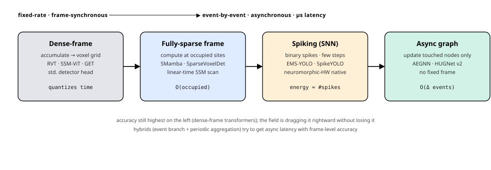
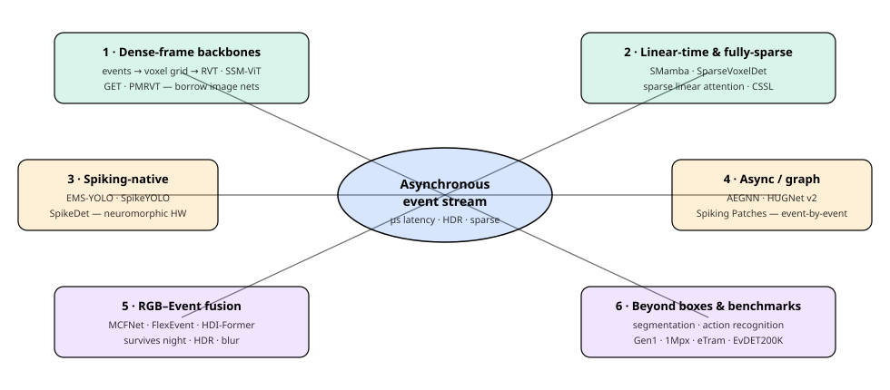

# Dense Object Detection & Classification — Recent Advances

*Compiled 2026-Jun-28 (America/Los_Angeles).*

Next installment in the running CV-updates log. Earlier entries:
[Apr-30](../2026-Apr-30/2026-Apr-30_CV_updates.md),
[May-01](../2026-May-01/2026-May-01_CV_updates.md),
[May-02](../2026-May-02/2026-May-02_CV_updates.md),
[May-04](../2026-May-04/2026-May-04_CV_updates.md),
[May-05](../2026-May-05/2026-May-05_CV_updates.md),
[May-07](../2026-May-07/2026-May-07_CV_updates.md),
[May-08](../2026-May-08/2026-May-08_CV_updates.md),
[May-15](../2026-May-15/2026-May-15_CV_updates.md),
[May-16](../2026-May-16/2026-May-16_CV_updates.md),
[May-17](../2026-May-17/2026-May-17_CV_updates.md),
[Jun-09](../2026-Jun-09/2026-Jun-09_CV_updates.md),
[Jun-10](../2026-Jun-10/2026-Jun-10_CV_updates.md),
[Jun-12](../2026-Jun-12/2026-Jun-12_CV_updates.md),
[Jun-15](../2026-Jun-15/2026-Jun-15_CV_updates.md),
[Jun-16](../2026-Jun-16/2026-Jun-16_CV_updates.md),
[Jun-17](../2026-Jun-17/2026-Jun-17_CV_updates.md),
[Jun-19](../2026-Jun-19/2026-Jun-19_CV_updates.md),
[Jun-21](../2026-Jun-21/2026-Jun-21_CV_updates.md),
[Jun-22](../2026-Jun-22/2026-Jun-22_CV_updates.md),
[Jun-23](../2026-Jun-23/2026-Jun-23_CV_updates.md),
[Jun-24](../2026-Jun-24/2026-Jun-24_CV_updates.md),
[Jun-25](../2026-Jun-25/2026-Jun-25_CV_updates.md),
[Jun-27](../2026-Jun-27/2026-Jun-27_CV_updates.md).

## Why this pass: the event camera as a different primitive

The [Jun-27](../2026-Jun-27/2026-Jun-27_CV_updates.md) pass argued that the
LiDAR point cloud deserved its own treatment because it is *a genuinely
different primitive* from the image grid, and that 2025–26 was the year its
detectors stopped borrowing image architectures. The **event camera** is the
other sensor that breaks the frame abstraction — and across the ~210 sections
of this running log it has only ever appeared in fragments: "event-based &
spiking detectors" as a single section on [May-02](../2026-May-02/2026-May-02_CV_updates.md),
spiking-neural-network detectors on [Jun-12](../2026-Jun-12/2026-Jun-12_CV_updates.md),
and a passing mention as a robustness modality elsewhere. It has never had a
dedicated pass. That is the gap this entry fills.

It earns one because the data is not an image at all:

- **No frames, no exposure, no shutter.** Each pixel of an event sensor
  (DVS / Prophesee GenX) fires *independently and asynchronously* the moment
  its log-brightness changes by a threshold, emitting a tuple
  `(x, y, t, polarity)` with **microsecond** timestamps. There is no global
  frame clock. A static scene produces *almost no data*; a fast edge
  produces a dense local burst.
- **Microsecond latency and ~120 dB dynamic range.** The sensor sees in near
  dark and against direct sun, and reacts orders of magnitude faster than a
  30–60 Hz camera — which is exactly why detection-under-motion, night
  driving, and high-speed robotics keep pulling it in.
- **Sparse, and sparse in a different way than LiDAR.** Sparsity is
  *temporal and motion-induced*, not a fixed geometric scatter. The whole
  efficiency story is how aggressively you avoid manufacturing a dense frame
  the sensor never produced.
- **It can be neuromorphic end-to-end.** Because the input is already spikes,
  a spiking neural network (SNN) on neuromorphic hardware can process it
  with energy proportional to the number of spikes — a hardware story that
  has no analogue in the RGB or LiDAR worlds.

The tension that organizes the entire field, and this pass, is **synchrony
vs. latency**. The accurate detectors quantize the stream back into frames
and run a standard dense network; the efficient/low-latency ones try to stay
asynchronous and pay only for the events that arrive. The 2025–26 work is the
sustained effort to drag accuracy rightward along that axis without losing it.

This pass covers six threads:

1. **The representation problem & dense-frame backbones** — how an async
   stream becomes something a detector can eat (RVT → state-space ViTs).
2. **Linear-time & fully-sparse backbones** — Mamba/SSM detectors and
   detectors that never densify the grid at all.
3. **Spiking-native detectors** — the neuromorphic end-to-end path.
4. **Asynchronous / graph-based processing** — event-by-event, µs latency.
5. **RGB–Event fusion** — detection that survives night, glare, and blur.
6. **Beyond boxes & benchmarks** — segmentation, recognition, and the
   datasets the field actually scores on.

> **Reading the numbers.** Figures are quoted from each method's own paper,
> abstract, or leaderboard entry. Event detection protocols differ wildly —
> Prophesee **Gen1** (QVGA, 2 classes) and **1Mpx/GEN4** (720p, 7 classes)
> dominate automotive, while **eTraM**, **DSEC-Det**, **EvDET200K**, and
> **MTEvent** use different class sets, resolutions, and mAP conventions — so
> cross-row deltas are indicative, not controlled. arXiv IDs encode
> submission month (e.g. `2603.xxxxx` = Mar 2026). Direct arXiv fetches were
> blocked by the environment's network policy this run, so a few exact
> figures are quoted from search-indexed abstracts and metadata and are
> marked *(per abstract)* where I could not open the PDF to double-check.

## Topic map

---

## 1 · The representation problem & dense-frame backbones

Every event detector begins with one decision: **what do you feed the
network?** The dominant, highest-accuracy answer is still to *give up a
little asynchrony* — accumulate events over a short window into a
frame-like tensor (an **event histogram**, **time surface**, or **voxel
grid** that preserves coarse temporal bins) and run a conventional dense
detector on it. This is the line that owns the leaderboards.

- **RVT (Recurrent Vision Transformer)** remains the reference architecture
  for this thread: it interleaves *local-window* self-attention with
  *grid/dilated global* attention, and ends each stage with an **LSTM** that
  carries cell/hidden state across time bins so the detector accumulates
  evidence the sparse instantaneous frame can't supply
  ([Gehrig & Scaramuzza, CVPR 2023, arXiv:2212.05598](https://arxiv.org/abs/2212.05598)).
  Almost every 2025–26 paper below reports against RVT on Gen1 and 1Mpx.
- **State-space ViTs replaced the LSTM with an SSM.** "State Space Models for
  Event Cameras" swaps RVT's recurrence for a structured state-space (S5)
  temporal mixer; the paper reports clear mAP gains over RVT with **~33 %
  faster training** and, importantly, *graceful generalization to inference
  frequencies never seen in training* — a property the LSTM lacks
  ([Zubić et al., CVPR 2024, arXiv:2402.15584](https://arxiv.org/abs/2402.15584)).
  This is the conceptual bridge to the Mamba detectors in §2.
- **PMRVT (Parallel-MLP RVT)** is a 2025 refinement of the recurrent-ViT
  recipe with parallel-attention MLP blocks, reported on the standard
  automotive event benchmarks
  ([PMRVT, *Sensors* 2025, PMC12610684](https://pmc.ncbi.nlm.nih.gov/articles/PMC12610684/)).
- **Group / token-grouping transformers (GET-style)** continue the theme of
  building event-aware tokens (grouping by polarity/time) rather than naively
  rasterizing — the recurring lesson that *how you tokenize the stream*
  matters as much as the backbone.

The standing critique of this whole thread: the dense transformer+RNN
detectors (RVT, SAST, the SSM-ViTs) are the most accurate **but the most
expensive**, processing a manufactured dense frame and, per the SMamba
analysis below, spending on the order of **1000× more MFLOPs per event** than
a sparsity-exploiting detector. Threads §2–§4 are three different escapes
from that bill.

**Surveys for orientation.** Two 2025 reviews map this space well: an
end-to-end event-based detection survey for autonomous driving
([PMC12620194](https://pmc.ncbi.nlm.nih.gov/articles/PMC12620194/)) and the
broader "Event Camera Meets Mobile Embodied Perception" survey organized
around abstraction → algorithm → acceleration → application
([arXiv:2503.22943](https://arxiv.org/html/2503.22943v4)).

---

## 2 · Linear-time & fully-sparse backbones

If the dense transformer is too expensive, there are two orthogonal ways to
cut the bill: make the *temporal mixing* linear (state-space / Mamba), or
refuse to densify the grid at all (fully-sparse). 2025–26 pushed both.

- **SMamba (Sparse Mamba)** is the headline of the linear-time line. It keeps
  the dense-frame input but mixes it with a **2-D selective-scan state-space
  model**, and — crucially — *prunes non-informative (near-empty) regions*
  before scanning, so cost tracks event activity rather than image area. The
  paper reports state-of-the-art results across **Gen1, 1Mpx, and eTraM**,
  beating the sparse-transformer SAST while using **~1000× fewer MFLOPs per
  event** than the dense transformer+RNN family *(per abstract)*
  ([Yang et al., AAAI 2025, arXiv:2501.11971](https://arxiv.org/abs/2501.11971)).
  This is the cleanest "linear-time, sparsity-aware, still accurate" result
  in the thread.
- **Fully-sparse on the voxel grid.** "No Dense Tensors Needed: Fully Sparse
  Object Detection on Event-Camera Voxel Grids" carries the LiDAR field's
  *submanifold-sparse-convolution* idea into event vision: backbone, FPN
  fusion, and detection head **all operate only on occupied voxel sites**
  through 3-D sparse convolutions, never materializing a dense tensor
  ([arXiv:2603.21638](https://arxiv.org/abs/2603.21638)). It is the most
  direct cross-pollination from last pass's LiDAR backbones.
- **Spatially-sparse linear attention** attacks the same problem from the
  attention side — "Low-latency Event-based Object Detection with
  Spatially-Sparse Linear Attention" replaces quadratic attention with a
  linear variant that skips empty space, targeting the parallel-vs-recurrent
  throughput bottleneck for edge deployment
  ([arXiv:2603.06228](https://arxiv.org/abs/2603.06228)).
- **Context-aware Sparse Spatiotemporal Learning (CSSL)** generalizes the
  "compute only where it matters" principle into a learned sparsity gate for
  event vision backbones ([arXiv:2508.19806](https://arxiv.org/abs/2508.19806)).
- **Token sparsification under motion.** "Focus Through Motion: RGB-Event
  Collaborative Token Sparsification" prunes tokens *using the event stream
  as the saliency signal* for efficient fused detection — sparsity as a
  cross-modal idea, not just an event-only one
  ([arXiv:2509.03872](https://arxiv.org/abs/2509.03872)).

The throughline: the LiDAR pass's "exploit the emptiness" lesson is now the
event pass's lesson too — but here the emptiness is *temporal/motion-induced*,
so the sparsity gates are dynamic and content-dependent rather than fixed by
geometry.

---

## 3 · Spiking-native detectors

The event stream is *already spikes*, so the most hardware-faithful path runs
a **spiking neural network (SNN)** end-to-end, where energy scales with the
number of synaptic spikes rather than dense MACs — the one efficiency story
unique to this sensor.

- **EMS-YOLO** was the field's pivot: the **first directly-trained deep SNN
  detector** (no ANN-to-SNN conversion), reaching ANN-comparable accuracy on
  both frame-based MS-COCO and event-based **Gen1 in only 4 time steps** —
  proving you don't need the hundreds/thousands of steps that conversion
  methods required.
- **The integer-valued-training / spike-driven-inference detector** is the
  current high-water mark for accuracy. By training with integer activations
  and converting to spikes only at inference, it reports **66.2 mAP@50 /
  48.9 mAP@50:95 on static COCO** (+15.0 / +18.7 points over the prior SNN
  SOTA) and **67.2 mAP@50 on neuromorphic Gen1** — *above* the equivalent ANN
  — at **5.7× better energy efficiency** *(per abstract)*
  ([Luo et al., ECCV 2024, arXiv:2407.20708](https://arxiv.org/abs/2407.20708)).
  This is the result that makes "SNNs are only for toy datasets" obsolete.
- **SpikeDet** focuses on *firing-pattern quality* — better-behaved spike
  statistics for accurate yet energy-frugal detection
  ([arXiv:2501.15151](https://arxiv.org/abs/2501.15151)) — and **SpikeYOLO**
  remains the widely-used open codebase for spiking detection
  ([BICLab/SpikeYOLO](https://github.com/BICLab/SpikeYOLO)).
- **Neuron-design advances** keep moving the accuracy/latency frontier:
  ultra-low-latency detection via a **temporal-dependent integrate-and-fire**
  neuron ([arXiv:2508.20392](https://arxiv.org/abs/2508.20392)) and the
  **Integer Binary-Range Alignment** neuron that widens the representable
  range of a spiking unit without giving up the spike abstraction
  ([arXiv:2506.05679](https://arxiv.org/abs/2506.05679)).
- **Event-guided detection under spiking transmission** extends the spiking
  paradigm to event-guided pipelines for bandwidth-limited settings
  ([*KBS* 2025](https://www.sciencedirect.com/science/article/abs/pii/S0950705125018143)).

The trade remains real: SNN detectors trail the best dense ANNs on the
hardest 720p benchmarks, but the energy multipliers (often **5–10×**) are the
whole point — they only pay off on neuromorphic / edge silicon, which is
exactly where event cameras want to live.

---

## 4 · Asynchronous / graph-based processing

The purest expression of "don't manufacture a frame": treat the stream as an
**evolving spatio-temporal graph** and, when a new event arrives, recompute
**only the nodes it touches**. This is the only thread that delivers the
sensor's native microsecond latency end-to-end.

- **AEGNN (Asynchronous Event-based GNN)** is the canonical formulation —
  events are graph nodes, and updates are restricted to the affected
  sub-graph, cutting both computation and latency versus reprocessing a frame
  ([Schaefer et al., CVPR 2022, arXiv:2203.17149](https://arxiv.org/abs/2203.17149)).
- **The accuracy–latency trade is being broken by hybrids.** The 2025 line
  (Prophesee's CVPR 2025 work, HUGNet v2) **combines an asynchronous,
  accumulation-free event branch with a slower periodic aggregation branch**
  — fast event-level graph updates for responsiveness, periodic context for
  stability — reportedly cutting prediction latency by *three orders of
  magnitude* while preserving frame-detector accuracy
  ([Prophesee, "GNN + periodic aggregation," CVPR 2025](https://www.prophesee.ai/2025/07/21/graph-neural-network-combining-event-stream-and-periodic-aggregation-for-low-latency-event-based-vision/);
  [CVPR 2025 poster](https://cvpr.thecvf.com/virtual/2025/poster/33080)).
  This "two-clock" design is the dominant pattern of the thread.
- **Better graph features.** "Event-based Graph Representation with Spatial
  and Motion Vectors for Asynchronous Object Detection" enriches each node
  with explicit motion vectors so the graph carries velocity, not just
  occupancy ([arXiv:2507.15150](https://arxiv.org/abs/2507.15150)); a
  contour-aware **dynamic-graph heat-conduction** detector models event
  diffusion over the graph ([arXiv:2505.12908](https://arxiv.org/abs/2505.12908)).
- **Asynchronous, sparse *tokens*.** "Spiking Patches" proposes
  asynchronous, sparse, efficient tokenization that *surpasses both frame and
  voxel inputs for a transformer* on recognition while delivering the fastest
  inference in its comparison — a bridge between the async/graph and
  spiking threads ([arXiv:2510.26614](https://arxiv.org/abs/2510.26614)).
- **Hardware.** Event-graph NNs are being mapped to **SoC FPGAs** for
  low-latency time-series classification, underlining that the async story is
  ultimately a silicon story ([arXiv:2503.06629](https://arxiv.org/html/2503.06629v1)).

The honest caveat (echoed in community write-ups such as
[Gregor Lenz's 2025 event-camera review](https://lenzgregor.com/posts/event-cameras-2025-part2/)):
async/graph methods still trail dense-frame transformers on raw mAP, and
their wins are in *latency and energy* — which conventional benchmarks, scored
on accumulated windows, systematically under-credit.

---

## 5 · RGB–Event fusion

Event-only detection struggles with static, texture-rich objects (no motion →
no events). RGB-only detection struggles with night, glare, tunnels, and
motion blur. **Fusion** is the pragmatic mainstream: dense RGB texture for the
*what*, event motion cues for the *when/where*, robust where either sensor
alone fails.

- **MCFNet (Motion-Cue Fusion Network)** pairs a DVS event camera with an RGB
  camera, using an **event-correction module** that warps asynchronous events
  into temporal alignment with frames via optical flow and an **adaptive
  cross-modal fusion** stage, targeting nighttime/tunnel traffic. The fusion
  line reports robustness to corruptions improving by **>30 %** over
  frame-only detection *(per abstract)*
  ([Comm. in Transportation Research, Aug 2025; arXiv:2508.10704](https://arxiv.org/abs/2508.10704);
  [EurekAlert summary](https://www.eurekalert.org/news-releases/1107680)).
- **FlexEvent** makes the fusion *frequency-flexible*: a **FlexFuser** module
  blends high-frequency event data with the rich semantics of lower-rate RGB
  frames so the detector can output at **arbitrary frequencies**, decoupling
  inference rate from the camera frame rate
  ([Event Camera Object Detection at Arbitrary Frequencies, OpenReview](https://openreview.net/forum?id=suyX1TOJJK)).
- **HDI-Former (Hybrid Dynamic Interaction ANN–SNN Transformer)** is the
  architecturally interesting one: it runs an **ANN branch on frames and an
  SNN branch on events** and lets them interact dynamically — fusing the
  accuracy of dense nets with the efficiency of spiking nets in one detector
  ([arXiv:2411.18658](https://arxiv.org/abs/2411.18658)).
- **Benchmarks for fusion arrived.** **PEOD** is a *pixel-aligned* Event–RGB
  detection benchmark explicitly built for challenging conditions (the
  pixel-alignment removes the calibration confound that muddied earlier
  fusion comparisons) ([arXiv:2511.08140](https://arxiv.org/abs/2511.08140)).
- **Cross-modal sparsity & tracking** round out the thread: "Focus Through
  Motion" (token sparsification, §2), **Mamba-FETrack V2** for frame–event
  tracking ([arXiv:2506.23783](https://arxiv.org/abs/2506.23783)), and
  **TAPFormer**, which fuses frames and events for robust arbitrary-point
  *tracking* under transient asynchrony
  ([arXiv:2603.04989](https://arxiv.org/abs/2603.04989)).

The application pull is unmistakable in the very recent (2026) papers:
**onboard drone detection with a spinning event camera** (ODD-SEC,
[arXiv:2603.06265](https://arxiv.org/abs/2603.06265)) and the
sensor-generalization work on adaptive sensing
([arXiv:2602.23357](https://arxiv.org/abs/2602.23357)) both target deployment
where motion, dynamic range, and latency are not optional.

---

## 6 · Beyond boxes & benchmarks

Detection is the headline, but the *classification* half of this log's remit —
dense per-pixel labeling and whole-clip recognition — moved too, and the
datasets are where the field's real progress is adjudicated.

**Dense segmentation on events.**
- **"Segment Any Events with Language"** brings **open-vocabulary,
  language-promptable** segmentation to the event modality — the SAM/SEEM
  paradigm crossing into event vision
  ([arXiv:2601.23159](https://arxiv.org/abs/2601.23159)).
- **LiFR-Seg** does **anytime high-frame-rate** segmentation via event-guided
  propagation — labels at the event clock, not the RGB clock
  ([arXiv:2603.21115](https://arxiv.org/abs/2603.21115)) — and **EISNet**
  fuses events + images for semantic segmentation.
- Label-efficiency is active: **weakly-supervised** event segmentation from
  points ([arXiv:2407.11216](https://arxiv.org/abs/2407.11216)) and
  **unsupervised** hybrid pseudo-labeling (HPL-ESS,
  [arXiv:2403.16788](https://arxiv.org/abs/2403.16788)). Self-supervised
  **dense pre-training** for event data lifts downstream segmentation, flow,
  and depth at once ([arXiv:2311.11533](https://arxiv.org/abs/2311.11533)).

**Recognition / classification.**
- **DailyDVS-200** is the comprehensive event action-recognition benchmark
  (200 classes), and its 12-architecture study delivers the thread's sharpest
  systems lesson: **event transformers win on accuracy but need ~30× more
  training time than SNNs or graph CNNs**
  ([arXiv:2407.05106](https://arxiv.org/abs/2407.05106)).
- **Spike-HAR++** is an energy-efficient parallel **spiking transformer** for
  event human-action recognition, reporting **98.26 % on DVS128 Gesture**
  while staying lightweight
  ([*Front. Comput. Neurosci.* 2024](https://www.frontiersin.org/journals/computational-neuroscience/articles/10.3389/fncom.2024.1508297/full)),
  and **SpikMamba** marries SNNs with Mamba for the same task
  ([arXiv:2410.16746](https://arxiv.org/abs/2410.16746)).
- **SPACT18** adds a spiking action-recognition benchmark with *complementary
  RGB and thermal* modalities ([arXiv:2507.16151](https://arxiv.org/abs/2507.16151)).

**The detection benchmarks themselves.**
- **Gen1** (QVGA, 2 classes) and **1Mpx / GEN4** (720p, 7 classes) remain the
  automotive workhorses every backbone above reports on.
- **eTraM** is the event traffic-monitoring dataset (static infrastructure
  viewpoint) that SMamba and others now include
  ([eTraM, CVPR 2024](https://www.semanticscholar.org/paper/eTraM:-Event-Based-Traffic-Monitoring-Dataset-Verma-Chakravarthi/f14f5861fae3be154e55308c5428fb0dde4e765c)).
- **EvDET200K / OpenEvDET** is a new, larger **CVPR 2025** event-detection
  benchmark with a contour-aware heat-conduction baseline
  ([Event-AHU/OpenEvDET](https://github.com/Event-AHU/OpenEvDET)).
- **MTEvent** targets **industrial multi-class** recognition and is used to
  benchmark recurrent event detectors in a non-automotive setting
  ([arXiv:2603.21787](https://arxiv.org/abs/2603.21787)).
- **PEOD** (above) is the pixel-aligned Event–RGB fusion benchmark.

The pattern mirrors what the Jun-25 remote-sensing pass found about COCO: the
*generic* benchmarks (Gen1's two classes) are saturating, and the action is
moving to **larger, harder, capability-specific** sets (EvDET200K, MTEvent,
PEOD) that test resolution, class count, and cross-condition robustness — and
that quietly expose how badly accumulated-window mAP under-measures the
latency advantage that justifies the sensor in the first place.

---

## Cross-cutting observations

- **One axis explains the whole field: synchrony vs. latency.** Every method
  here is a position on the dense-frame ↔ event-by-event spectrum
  (see the [ladder diagram](assets/representation-ladder.svg)). Accuracy is
  still highest on the left; 2025–26's collective project is dragging it
  rightward — via linear-time SSMs (§2), spiking hardware (§3), and
  two-clock async/graph hybrids (§4) — without surrendering mAP.
- **The same architectural waves arrive here, one beat later.** The
  LSTM→**state-space/Mamba** swap that reshaped LiDAR backbones last pass is
  the exact swap reshaping event backbones (RVT→SSM-ViT→SMamba), and the
  **submanifold-sparse-conv** idea crossed straight over ("No Dense Tensors
  Needed"). Event vision is increasingly a *consumer* of the point-cloud and
  sequence-model toolkit, specialized to temporal sparsity.
- **Spiking detection grew up.** A directly-trained SNN now reports **>67
  mAP@50 on Gen1 above its ANN twin at 5.7× the energy efficiency** — the
  "SNNs are toys" framing is no longer defensible, though the gap reopens on
  720p and the wins only cash out on neuromorphic silicon.
- **Fusion is the deployment default; event-only is the research frontier.**
  The papers chasing real products (drones, night driving) almost all fuse
  RGB+event for robustness (§5), while the architecturally novel work
  (async graphs, pure SNNs) is event-only and accepts an accuracy tax for
  latency and energy.
- **Benchmarks are the bottleneck, again.** As in the remote-sensing pass,
  accumulated-window mAP on a 2-class set systematically *under-credits* the
  one thing the sensor is for — microsecond latency. The new benchmarks
  (EvDET200K, MTEvent, PEOD) widen classes and conditions but still don't
  score latency directly; the field needs a metric that does.

---

### Sources

Primary papers and resources are linked inline above. Key references, grouped:

- **Dense-frame backbones:** RVT ([2212.05598](https://arxiv.org/abs/2212.05598)),
  State-Space ViT / S5 ([2402.15584](https://arxiv.org/abs/2402.15584)),
  PMRVT ([PMC12610684](https://pmc.ncbi.nlm.nih.gov/articles/PMC12610684/)).
- **Linear-time / fully-sparse:** SMamba ([2501.11971](https://arxiv.org/abs/2501.11971)),
  Fully-Sparse on voxel grids ([2603.21638](https://arxiv.org/abs/2603.21638)),
  sparse linear attention ([2603.06228](https://arxiv.org/abs/2603.06228)),
  CSSL ([2508.19806](https://arxiv.org/abs/2508.19806)),
  Focus Through Motion ([2509.03872](https://arxiv.org/abs/2509.03872)).
- **Spiking detectors:** integer-valued / spike-driven ([2407.20708](https://arxiv.org/abs/2407.20708)),
  SpikeDet ([2501.15151](https://arxiv.org/abs/2501.15151)),
  SpikeYOLO ([code](https://github.com/BICLab/SpikeYOLO)),
  temporal-dependent IF ([2508.20392](https://arxiv.org/abs/2508.20392)),
  IBRA neuron ([2506.05679](https://arxiv.org/abs/2506.05679)).
- **Async / graph:** AEGNN ([2203.17149](https://arxiv.org/abs/2203.17149)),
  Prophesee GNN + periodic aggregation ([CVPR 2025](https://www.prophesee.ai/2025/07/21/graph-neural-network-combining-event-stream-and-periodic-aggregation-for-low-latency-event-based-vision/)),
  graph w/ motion vectors ([2507.15150](https://arxiv.org/abs/2507.15150)),
  Spiking Patches ([2510.26614](https://arxiv.org/abs/2510.26614)).
- **RGB–Event fusion:** MCFNet ([2508.10704](https://arxiv.org/abs/2508.10704)),
  FlexEvent ([OpenReview](https://openreview.net/forum?id=suyX1TOJJK)),
  HDI-Former ([2411.18658](https://arxiv.org/abs/2411.18658)),
  PEOD ([2511.08140](https://arxiv.org/abs/2511.08140)),
  Mamba-FETrack V2 ([2506.23783](https://arxiv.org/abs/2506.23783)),
  TAPFormer ([2603.04989](https://arxiv.org/abs/2603.04989)).
- **Segmentation / recognition / benchmarks:** Segment Any Events with Language
  ([2601.23159](https://arxiv.org/abs/2601.23159)),
  LiFR-Seg ([2603.21115](https://arxiv.org/abs/2603.21115)),
  dense pre-training ([2311.11533](https://arxiv.org/abs/2311.11533)),
  DailyDVS-200 ([2407.05106](https://arxiv.org/abs/2407.05106)),
  Spike-HAR++ ([Frontiers](https://www.frontiersin.org/journals/computational-neuroscience/articles/10.3389/fncom.2024.1508297/full)),
  SpikMamba ([2410.16746](https://arxiv.org/abs/2410.16746)),
  EvDET200K / OpenEvDET ([code](https://github.com/Event-AHU/OpenEvDET)),
  MTEvent ([2603.21787](https://arxiv.org/abs/2603.21787)),
  eTraM ([CVPR 2024](https://www.semanticscholar.org/paper/eTraM:-Event-Based-Traffic-Monitoring-Dataset-Verma-Chakravarthi/f14f5861fae3be154e55308c5428fb0dde4e765c)).
- **Surveys:** end-to-end event detection for AD ([PMC12620194](https://pmc.ncbi.nlm.nih.gov/articles/PMC12620194/)),
  Event Camera Meets Mobile Embodied Perception ([2503.22943](https://arxiv.org/html/2503.22943v4)),
  community review ([Lenz, 2025](https://lenzgregor.com/posts/event-cameras-2025-part2/)).

*Compiled for the running CV-updates log. Detection/recognition figures are
as-reported by each source under differing protocols; deltas across rows are
indicative, not controlled. Items marked "(per abstract)" were verified from
indexed abstracts/metadata because direct PDF access was blocked by the
environment's network policy during this run.*
