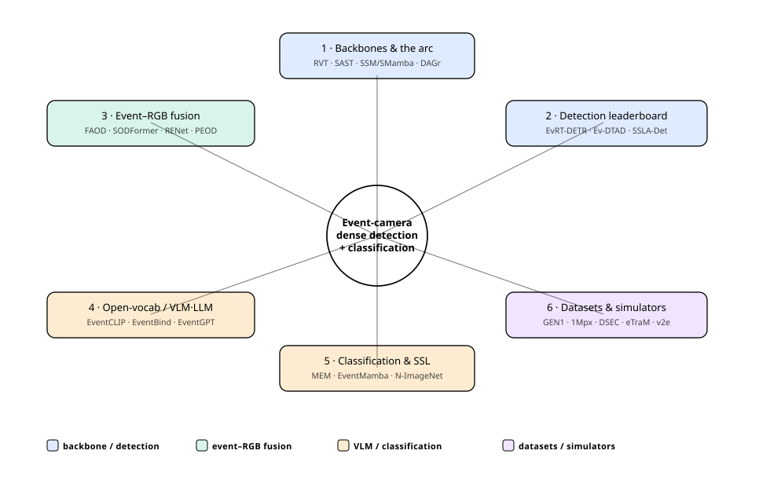
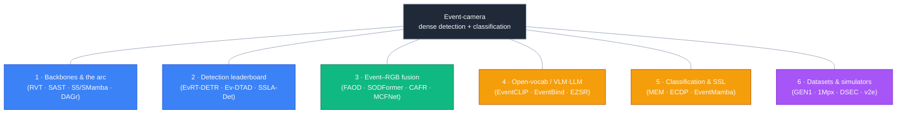
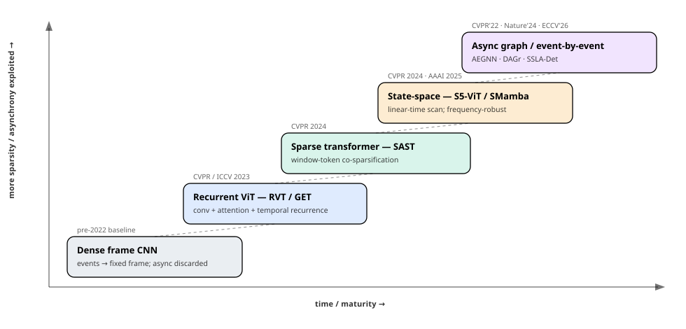

# Dense Object Detection & Classification — Recent Advances

*Compiled 2026-Jun-29 (America/Los_Angeles).*

Next installment in the running CV-updates log. Earlier entries on
`main`:
[Apr-30](../2026-Apr-30/2026-Apr-30_CV_updates.md),
[May-01](../2026-May-01/2026-May-01_CV_updates.md),
[May-02](../2026-May-02/2026-May-02_CV_updates.md),
[May-04](../2026-May-04/2026-May-04_CV_updates.md),
[May-05](../2026-May-05/2026-May-05_CV_updates.md),
[May-07](../2026-May-07/2026-May-07_CV_updates.md),
[May-08](../2026-May-08/2026-May-08_CV_updates.md),
[May-15](../2026-May-15/2026-May-15_CV_updates.md),
[May-16](../2026-May-16/2026-May-16_CV_updates.md),
[May-17](../2026-May-17/2026-May-17_CV_updates.md),
[Jun-09](../2026-Jun-09/2026-Jun-09_CV_updates.md),
[Jun-10](../2026-Jun-10/2026-Jun-10_CV_updates.md),
[Jun-12](../2026-Jun-12/2026-Jun-12_CV_updates.md),
[Jun-15](../2026-Jun-15/2026-Jun-15_CV_updates.md),
[Jun-16](../2026-Jun-16/2026-Jun-16_CV_updates.md),
[Jun-17](../2026-Jun-17/2026-Jun-17_CV_updates.md),
[Jun-19](../2026-Jun-19/2026-Jun-19_CV_updates.md),
[Jun-21](../2026-Jun-21/2026-Jun-21_CV_updates.md),
[Jun-22](../2026-Jun-22/2026-Jun-22_CV_updates.md),
[Jun-23](../2026-Jun-23/2026-Jun-23_CV_updates.md),
[Jun-24](../2026-Jun-24/2026-Jun-24_CV_updates.md),
[Jun-25](../2026-Jun-25/2026-Jun-25_CV_updates.md),
[Jun-27](../2026-Jun-27/2026-Jun-27_CV_updates.md).

## Why this pass: the event camera as its own primitive

The last three passes worked sensor primitives **on their own terms** —
camera-3D / occupancy ([Jun-24](../2026-Jun-24/2026-Jun-24_CV_updates.md)),
remote-sensing spectra/time-series
([Jun-25](../2026-Jun-25/2026-Jun-25_CV_updates.md)), and the LiDAR
point cloud ([Jun-27](../2026-Jun-27/2026-Jun-27_CV_updates.md)). The
**event camera** is the obvious fourth, and across the ~200 sections of the
running log it has only ever appeared as a *spiking-network energy story*:
SNN detectors on [May-02](../2026-May-02/2026-May-02_CV_updates.md) and
[Jun-12](../2026-Jun-12/2026-Jun-12_CV_updates.md), with the event stream
treated as a low-power *input* to a spiking detector. That framing buries
the much larger non-spiking story: the **dense (ANN / state-space / graph)
detection-and-classification stack built natively for events**, where SNNs
are one branch and not the headline. That stack is the gap this entry fills.

It earns its own pass because the event stream is a genuinely different
primitive from the image grid:

- **The data is asynchronous, sparse, and polarity-valued.** A
  Dynamic-Vision-Sensor (DVS) pixel fires an event `(x, y, t, p)` only when
  its log-intensity changes — microsecond timestamps, no global shutter, no
  motion blur, and a dynamic range around **120–140 dB** versus ~60 dB for a
  frame camera ([Gallego et al., *Event-based Vision: A Survey*, TPAMI
  2022](https://ieeexplore.ieee.org/abstract/document/9138762)). Static
  scenes emit almost nothing; >99 % of the "frame" is silent.
- **There is no frame, so the first design decision is the representation.**
  Everything downstream hangs on how you turn an event stream into something
  a network ingests — event frame, voxel grid, time surface, graph, or raw
  async point — and the field's whole accuracy/latency story is *how little
  asynchrony you throw away* doing it.
- **Attention does not obviously fit a continuous stream.** The headline
  architectural arc of 2023–26 runs **recurrent ViT → scene-adaptive sparse
  transformer → linear-time state-space (Mamba/S5) → asynchronous graph /
  event-by-event** — the same "windowed attention gives way to linear
  scanning" shift seen on the LiDAR side, but pushed all the way to
  per-event compute.
- **Labels are scarce and the killer apps are night / HDR / high-speed.** So
  **event–RGB fusion** (use frames for content, events for the moments
  frames fail) and **VLM/CLIP-borrowed open-vocabulary recognition** (no
  large labelled event corpus exists) are first-class threads, not
  footnotes.

This pass covers six threads of that stack:

1. **Backbones & the architectural arc** — representation choices and the
   recurrent-ViT → sparse-transformer → state-space → async-graph ladder.
2. **The dense detection leaderboard** — adapting image detectors (RT-DETR)
   and the 2025–26 async / low-latency frontier.
3. **Event–RGB fusion** — detection that survives night, glare, and blur.
4. **Open-vocabulary & VLM/LLM event understanding** — CLIP and MLLMs
   without a labelled event corpus.
5. **Classification & self-supervised pretraining** — the recognition half
   and the pretext tasks that feed it.
6. **Datasets, simulators & benchmarks** — what everyone trains on, and the
   video-to-events pipelines that paper over the data shortage.

> **Reading the numbers.** Figures are quoted from each method's own paper,
> repo, or leaderboard. **Detection protocols differ and are not
> comparable across rows**: automotive event detection usually reports a
> COCO-style mAP@[.5:.95] (so RVT's "47.2" on Gen1 is a COCO mAP), while
> several fusion papers report mAP@50 or mAP@[.5:.95] as a 0–1 fraction
> (SODFormer's "0.504" is an mAP@50). Gen1, 1Mpx/Gen4, DSEC-derivatives,
> eTraM and PKU-DAVIS-SOD differ in resolution, class set and density, so
> cross-row deltas are indicative, not controlled. arXiv IDs encode
> submission month (`2412.xxxxx` = Dec 2024; `2603.xxxxx` = Mar 2026).
>
> **Verification note.** This run's egress policy blocked direct
> `arxiv.org` / publisher fetches, so IDs, venues and most numbers were
> cross-checked against authors' **GitHub repositories**, conference
> proceedings pages and multiple independent search results rather than the
> abstract PDFs. Numbers I could pin to a primary repo/README are stated
> plainly; figures available only via secondary summaries are flagged
> *(secondary)*.

## Topic map

---

## 1 · Backbones & the architectural arc — from recurrent ViTs to event-by-event compute

There is no frame, so the first decision is **how to represent the stream**.
The taxonomy, roughly in order of how much asynchrony it discards:

- **Event frame / 2D histogram** — accumulate polarity counts over a fixed
  window into an image. Maximum compatibility with image CNNs/ViTs; throws
  away sub-window timing.
- **Voxel grid / time surface** — bin events into a few temporal channels or
  keep each pixel's most-recent timestamp; retains coarse timing.
- **Graph** — events as nodes in an evolving spatio-temporal graph; supports
  truly asynchronous, event-by-event updates.
- **Raw async point** — process `(x, y, t, p)` directly with a sequence
  model; the least lossy, the hardest to make accurate.

The backbone arc is the story of climbing that ladder while keeping accuracy:

```mermaid
%%{init: {"theme":"base","themeVariables":{
  "primaryColor":"#3b82f6","primaryTextColor":"#f8fafc",
  "primaryBorderColor":"#1d4ed8","lineColor":"#94a3b8","fontSize":"13px"}}}%%
flowchart LR
  classDef a fill:#64748b,stroke:#334155,color:#f8fafc;
  classDef b fill:#3b82f6,stroke:#1d4ed8,color:#f8fafc;
  classDef c fill:#10b981,stroke:#047857,color:#f8fafc;
  classDef d fill:#f59e0b,stroke:#b45309,color:#f8fafc;
  classDef e fill:#a855f7,stroke:#7e22ce,color:#f8fafc;
  CNN["Dense frame CNN<br/>async discarded"]:::a -->
  RVT["Recurrent ViT<br/>RVT · GET (2023)"]:::b -->
  SAST["Sparse transformer<br/>SAST (2024)"]:::c -->
  SSM["State-space<br/>S5-ViT · SMamba (2024–25)"]:::d -->
  GNN["Async graph / event-by-event<br/>AEGNN · DAGr · SSLA-Det"]:::e
```

| Method | Reference | Family | Headline |
|---|---|---|---|
| **AEGNN** | [arXiv 2203.17149](https://arxiv.org/abs/2203.17149) (CVPR 2022) | async graph NN | events as an evolving graph; recompute only nodes touched by each event → up to **~11× lower FLOPs** than prior async methods |
| **RVT** | [arXiv 2212.05598](https://arxiv.org/abs/2212.05598) (CVPR 2023) | recurrent ViT | conv prior + local/dilated attention + temporal recurrence; **47.2 mAP Gen1 / 47.4 1Mpx**, 18.5 M params, **<12 ms on a T4** (~6× faster than prior art) |
| **GET** | [arXiv 2310.02642](https://arxiv.org/abs/2310.02642) (ICCV 2023) | group transformer | "Group Token" representation groups events by timestamp+polarity; dual self-attention; primarily a classification backbone, also detects |
| **SAST** | [arXiv 2404.01882](https://arxiv.org/abs/2404.01882) (CVPR 2024) | sparse transformer | scene-adaptive **window-token co-sparsification**; **47.9 / 48.2 mAP Gen1**, 48.3 1Mpx at **~28 % of RVT's A-FLOPs** *(secondary)* |
| **S5-ViT** | [arXiv 2402.15584](https://arxiv.org/abs/2402.15584) (CVPR 2024, Spotlight) | state-space | replaces RNN with S5/S4D in an RVT-style ViT; **47.7 / 47.8 mAP**, ~33 % faster training, **frequency-robust**: mean mAP drop at higher test rates **3.31 vs 21.25 (RVT) / 24.53 (GET)** |
| **SMamba** | [arXiv 2501.11971](https://arxiv.org/abs/2501.11971) (AAAI 2025) | sparse Mamba | scores token informativeness (events vs noise) and prunes; **~50.4 / ~49.3 mAP** at lower FLOPs *(secondary)* |
| **DAGr** | [Nature 629:1034–1040, 2024](https://www.nature.com/articles/s41586-024-07409-w) | hybrid CNN + async GNN | 20 fps RGB + events → **latency of a 5,000 fps camera at ~100× less data**; the field's strongest low-latency result |
| **Chimera** | [arXiv 2412.19646](https://arxiv.org/abs/2412.19646) (Frontiers in AI 2025) | NAS | block-based search over attention / conv / SSM / MLP-mixer macroblocks to port RGB backbones to events; **1.6× fewer params, 2.1× faster** on Gen1 |

**What the ladder tells you.** Each rung exploits more of the event
structure. Recurrent ViTs (RVT) made event detection *accurate and fast* by
borrowing the image-ViT toolkit and bolting on recurrence. SAST kept that
accuracy while spending compute only where the scene is busy. The 2024
state-space turn ([S5-ViT](https://arxiv.org/abs/2402.15584)) added the
property frames never needed: **train at one event rate, deploy at another**
without collapse — exactly the long-sequence linear-scan advantage the LiDAR
backbones found ([Jun-27](../2026-Jun-27/2026-Jun-27_CV_updates.md)). At the
top, AEGNN and DAGr abandon the frame entirely and compute per event, which
is where the microsecond-latency promise of the sensor actually cashes out.

## 2 · The dense detection leaderboard — adapting image detectors, then going async

Two distinct strategies dominate 2025–26. **(a) Adapt a strong image
detector** to events with minimal surgery, and **(b) go fully asynchronous**
to chase the sensor's latency floor.

| Method | Reference | Idea | Headline |
|---|---|---|---|
| **EvRT-DETR** | [arXiv 2412.02890](https://arxiv.org/abs/2412.02890) (ICCV 2025) | adapt a frozen **RT-DETR** image detector via latent-space temporal-memory modules ("I2EvDet") | **+2.3 mAP Gen1, +1.4 mAP 1Mpx** over prior best (abs. ~52.7 / ~50.1 *(secondary)*) |
| **Ev-DTAD** | [arXiv 2605.08825](https://arxiv.org/abs/2605.08825) (May 2026) | representation-level **temporal aggregation** + model-level **hypergraph reasoning** | **+0.8 mAP / 1.7× faster (Gen1)**, +0.5 / 1.6× (1Mpx), **+3.0 / 2.0× (eTraM)** vs EvRT-DETR *(secondary abs.)* |
| **SSLA-Det** | [arXiv 2603.06228](https://arxiv.org/abs/2603.06228) (ECCV 2026) | **spatially-sparse linear attention** + scatter-compute-gather; end-to-end async | Gen1 **0.375 async mAP**, N-Caltech101 0.515, **>20× less per-event compute** than prior async |
| **EVA** | [arXiv 2505.11165](https://arxiv.org/abs/2505.11165) (ICLR 2026) | async→sync representation learning, **event-by-event** | first A2S framework to do detection; **Gen1 0.477 mAP** |
| **MoE-HCO** | [arXiv 2412.06647](https://arxiv.org/abs/2412.06647) (2024) | **Mixture-of-Experts + heat-conduction** detector + new benchmark | accuracy/efficiency balance; ships a new large-scale event-detection dataset |
| **EV-UAV** | [arXiv 2506.23575](https://arxiv.org/abs/2506.23575) (ICCV 2025) | **tiny-object** (anti-UAV) detection benchmark + baseline | 147 seq, **>2.3 M annotations**, targets averaging **6.8 × 5.4 px** |

**The split that matters.** EvRT-DETR makes the pragmatic bet — the years of
RGB detector engineering (RT-DETR, query denoising, NMS-free heads) are worth
inheriting, and the event-specific work is just *temporal adaptation in
latent space*. That is the same "adapt, don't reinvent" move RF-DETR/D-FINE
made on the image side ([Jun-09](../2026-Jun-09/2026-Jun-09_CV_updates.md)).
The async camp (SSLA-Det, EVA) makes the opposite bet: only event-by-event
inference delivers the sub-millisecond latency that justifies buying an event
camera at all, so the leaderboard should be **async mAP at fixed
per-event-FLOPs**, not COCO mAP on accumulated frames. Both are improving;
they are optimising different objectives, which is why their numbers don't
sit on one axis.

## 3 · Event–RGB fusion — detection that survives night, glare, and blur

The motivation is concrete: frames carry texture and colour but saturate,
blur and lag; events stay sharp through HDR and high-speed motion but are
texture-poor. Fuse them and you get a detector that **degrades gracefully
when one modality fails**. The design axis runs from late/score fusion to
**cross-modal attention** and, lately, **cross-modal Mamba** and
**event-guided token sparsification**.

| Method | Reference | Idea | Headline (note the metric) |
|---|---|---|---|
| **SODFormer** | [arXiv 2308.04047](https://arxiv.org/abs/2308.04047) (TPAMI 2023) | streaming transformer with **async attention** fusion, queryable at any time | PKU-DAVIS-SOD **mAP@50 0.504**; the standard fusion baseline |
| **RENet** | [arXiv 2209.08323](https://arxiv.org/abs/2209.08323) (ICRA 2023) | multi-scale event aggregation + **bi-directional** attention fusion | moving-object detection; introduced **DSEC-MOD** |
| **CAFR / FRN** | [arXiv 2407.12582](https://arxiv.org/abs/2407.12582) (ECCV 2024) | coarse-to-fine cross-modality interaction + AdaIN-style refinement | PKU-DDD17-Car **mAP@50 0.867 / mAP 0.460**; DSEC **mAP 0.380** |
| **EOLO** | [arXiv 2309.09297](https://arxiv.org/abs/2309.09297) (ICRA 2024) | lightweight SNN branch + **symmetric** RGB-event fusion for all-day detection | **+3.74 mAP@50** over RENet across lighting *(secondary)* |
| **FAOD** | [arXiv 2412.04149](https://arxiv.org/abs/2412.04149) (2024/CVPR'25) | **frequency-adaptive** align + "Time Shift" training; events as primary | PKU-DAVIS-SOD **mAP 30.5**, DSEC-Detection **42.5**; **+9.8** over SODFormer at ~¼ params |
| **FlexEvent** | [arXiv 2412.06708](https://arxiv.org/abs/2412.06708) (CVPR 2025) | FlexFuse + FlexTune → detection at **arbitrary frequencies** | frequency-adaptive fine-tuning on DSEC |
| **MCFNet** | [arXiv 2508.10704](https://arxiv.org/abs/2508.10704) (Commun. Transp. Res. 2025) | optical-flow event correction + **cross-modal Mamba fusion** | DSEC-Det **+7.4 mAP@50 / +1.7 mAP** over prior best |
| **FocusMamba** | [arXiv 2509.03872](https://arxiv.org/abs/2509.03872) (2025) | **event-guided token sparsification** + cross-modality focus fusion | efficiency-focused; DSEC-Det + PKU-DAVIS-SOD |
| **NRE-Net** | [arXiv 2508.02127](https://arxiv.org/abs/2508.02127) (2025) | tri-modal RGB + event + **monocular normal maps** for adverse lighting | DSEC-Det-sub + PKU-DAVIS-SOD |
| **CM3AE** | [arXiv 2504.12576](https://arxiv.org/abs/2504.12576) (ACM MM 2025) | unified RGB + event-image + event-voxel **pretraining** (MAE + contrastive) | one model for event-only and event-RGB downstream tasks |

**Where the field landed in 2026.** The pixel-aligned benchmark **PEOD**
([arXiv 2511.08140](https://arxiv.org/abs/2511.08140), AAAI 2026) is the most
honest current verdict: across a 1280×720, ~340 k-box dataset where 57 % of
frames are low-light / over-exposed / high-speed, **fusion beats the RGB-only
baseline by ~2 % mAP overall — but on the illumination-challenge subset the
best event-only model beats every fusion model.** The lesson is that naive
fusion can be *dragged down* by the failing modality; the strongest 2025–26
designs (MCFNet, FocusMamba, modality-decoupled query fusion) are all really
about **deciding when to trust which sensor**, which is the same
robustness-under-modality-drop problem the LiDAR-camera fusion work attacks
([Jun-27 §2](../2026-Jun-27/2026-Jun-27_CV_updates.md)).

## 4 · Open-vocabulary & VLM/LLM event understanding — recognition without a labelled event corpus

There is no ImageNet-scale *labelled* event dataset, so the dominant idea is
to **borrow a frozen vision-language model** and bridge the modality gap by
rendering events into a CLIP-friendly representation or by aligning an event
encoder to CLIP's image/text space.

| Method | Reference | Idea | Note |
|---|---|---|---|
| **EventCLIP** | [arXiv 2306.06354](https://arxiv.org/abs/2306.06354) (2023) | render events → 2D grids → **frozen CLIP** image encoder + text prompts; adapter for temporal aggregation | zero-/few-shot on N-Caltech101 / N-Cars / N-ImageNet |
| **EventBind** | [arXiv 2308.03135](https://arxiv.org/abs/2308.03135) (ECCV 2024) | learn a unified **event–image–text** space (extends CLIP) with prompt learning | **+5.34 / +5.65** fine-tune over prior on N-Caltech101 / N-ImageNet |
| **CEIA** | [arXiv 2407.06611](https://arxiv.org/abs/2407.06611) (ECCV 2024) | align **event↔image** (abundant pairs), inherit CLIP's image-text alignment | open-world recognition + retrieval |
| **EZSR** | [arXiv 2407.21616](https://arxiv.org/abs/2407.21616) (CVPR 2025) | fixes event-sparsity semantic misalignment via scalar modulation + RGB→event synthesis | **47.84 % zero-shot top-1 on N-ImageNet** *(secondary)* |
| **Adaptive Event Slicing** | [arXiv 2510.00681](https://arxiv.org/abs/2510.00681) (2025) | **open-vocabulary event detection** via VL knowledge distillation + adaptive stream slicing | distils RGB-VLM knowledge to detect novel classes from events |
| **EventGPT** | [arXiv 2412.00832](https://arxiv.org/abs/2412.00832) (2024) | event-stream understanding with a **multimodal LLM** | conversational event captioning / QA |
| **EventVL** | [arXiv 2501.13707](https://arxiv.org/abs/2501.13707) (2025) | event-stream MLLM for explicit semantic understanding | event captioning / scene understanding |

**Why this is the natural shortcut.** Events are texture- and colour-poor, so
a pure event classifier trained from scratch starves for data. CLIP already
encodes the world's semantics; the only hard part is mapping a sparse event
tensor into that space. EventCLIP does it with rendering + an adapter;
EventBind/CEIA do it by *training an event encoder to imitate CLIP*. The
2025 frontier (Adaptive Event Slicing) pushes the same trick from
classification to **open-vocabulary detection** — distil a VLM teacher so the
event detector can name objects it never saw a 2D event box for, the
event-domain echo of the open-vocab LiDAR work on
[Jun-27 §3](../2026-Jun-27/2026-Jun-27_CV_updates.md).

## 5 · Classification & self-supervised pretraining — the recognition half

Event classification is benchmarked on a small, well-worn set, and the live
research question is **what pretext task** replaces the missing labelled
corpus.

**Standard classification benchmarks.** **N-ImageNet** (ICCV 2021; 1,000
classes, ~1.78 M event streams — ImageNet shown on a monitor to a moving
event camera) is the large one; **N-Caltech101** (101), **N-Cars** (2, real
Gen1 recordings), **CIFAR10-DVS** (10) and **DVS128-Gesture** round it out.

| Method | Reference | Idea | Headline |
|---|---|---|---|
| **MEM** | [arXiv 2212.10368](https://arxiv.org/abs/2212.10368) (WACV 2024) | **masked event modeling** (MAE-style) on unlabelled events | N-Caltech101 **85.6 %**, N-Cars 98.55 % *(secondary)* |
| **ECDP** | [arXiv 2301.01928](https://arxiv.org/abs/2301.01928) (ICCV 2023) | self-supervised **event+RGB** pretraining (masking + contrastive) | N-ImageNet ViT-S **64.83 %** finetune *(secondary)* |
| **ECDP-Dense** | [arXiv 2311.11533](https://arxiv.org/abs/2311.11533) (ECCV 2024) | **dense** pretraining on synthetic **E-TartanAir** events | beats N-ImageNet pretraining on downstream dense prediction |
| **EventMamba** | [arXiv 2405.06116](https://arxiv.org/abs/2405.06116) (2024) | events as a **point cloud** + Mamba temporal extractor | DVS128-Gesture **~99.2–99.6 %**, DailyDVS ~99.3 %, 3ET ~95.1 % |
| **ExACT** | [arXiv 2403.12534](https://arxiv.org/abs/2403.12534) (CVPR 2024) | **language-guided** event *action* recognition + uncertainty; SeAct dataset | cross-modal event–text recognition |
| **Spikformer** | [arXiv 2209.15425](https://arxiv.org/abs/2209.15425) (ICLR 2023) | first **spiking self-attention** (no softmax) | CIFAR10-DVS 80.9 %, ImageNet 74.81 % *(secondary)* |
| **Spike-driven Transformer V2** | [arXiv 2404.03663](https://arxiv.org/abs/2404.03663) (ICLR 2024) | meta SNN transformer, addition-only attention | **ImageNet 80.0 % top-1** (55 M) |

**The throughline.** With labels scarce, pretraining is the lever. MEM shows
masked-autoencoding works on raw events; ECDP shows paired RGB is a powerful
free teacher; EventMamba shows that treating events as the point cloud they
physically are — and scanning them with a linear-time SSM — tops the
point-based classifiers, the same Mamba-for-point-clouds result from the
LiDAR pass. The spiking-transformer line (Spikformer → Spike-driven V2)
remains the energy-first branch flagged on
[Jun-12 §9](../2026-Jun-12/2026-Jun-12_CV_updates.md): now competitive on
ImageNet, not just neuromorphic toy sets.

## 6 · Datasets, simulators & benchmarks — what everyone trains on

Event detection lives or dies on a handful of datasets, and because real
labelled events are expensive, **video-to-events simulation** is load-bearing
infrastructure, not a side tool.

**Detection / driving datasets.**

| Dataset | Reference | Sensor / res. | Volume | Classes | Notes |
|---|---|---|---|---|---|
| **GEN1** | [arXiv 2001.08499](https://arxiv.org/abs/2001.08499) (2020) | ATIS 304×240, event-only | >39 h | 2 | >255 k boxes; the low-res workhorse |
| **1Mpx / Gen4** | [arXiv 2009.13436](https://arxiv.org/abs/2009.13436) (NeurIPS 2020) | 1280×720, event-only | ~14.65 h | 7 (3 in std. benchmark) | **~25 M** boxes at 60 Hz |
| **DSEC** | [arXiv 2103.06011](https://arxiv.org/abs/2103.06011) (RA-L 2021) | stereo 640×480 + RGB + LiDAR | 53 seq | — (stereo) | base release has **no boxes**; detection labels live in derivatives |
| **DSEC-MOD** | [arXiv 2209.08323](https://arxiv.org/abs/2209.08323) (ICRA 2023) | DSEC + aligned RGB | 16 seq | 8 | moving-object boxes (RENet) |
| **DSEC-Detection** | [Nature 2024](https://www.nature.com/articles/s41586-024-07409-w) | DSEC + RGB | ~60 seq | 8 | ~390 k boxes (DAGr) |
| **eTraM** | [arXiv 2403.19976](https://arxiv.org/abs/2403.19976) (CVPR 2024) | ~1280×720, fixed roadside | ~10 h | 8 | ~2 M boxes; static traffic monitoring |
| **PKU-DAVIS-SOD** | [arXiv 2308.04047](https://arxiv.org/abs/2308.04047) (TPAMI 2023) | DAVIS346, **aligned** event+RGB | 220 seq | 3 | ~1.08 M boxes; normal / blur / low-light splits |
| **PEDRo** | CVPRW 2023 | DAVIS346 346×260 | 119 rec | 1 | 43,259 boxes; handheld person detection |
| **PEOD** | [arXiv 2511.08140](https://arxiv.org/abs/2511.08140) (AAAI 2026) | coaxial **pixel-aligned** 1280×720 | 130+ seq | 6 | ~340 k boxes; 57 % extreme-condition |
| **TUMTraf Event** | [arXiv 2401.08474](https://arxiv.org/abs/2401.08474) (T-IV 2024) | roadside event 640×480 + RGB 1920×1200 | 4,111+ frames | ITS | fusion **+9 mAP day / +13 night** vs RGB |

> **Naming caution.** Two different "DSEC-Det/Detection" datasets exist — the
> UZH/Nature one (≈60 seq, ~390 k boxes) and SFNet's variable-illumination one
> ([arXiv 2311.00436](https://arxiv.org/abs/2311.00436); 53 seq, ~208 k
> labels). Same name, different contents.

**Simulators & video-to-events** (how you make events when you can't record
them):

- **ESIM** ([CoRL 2018](https://rpg.ifi.uzh.ch/docs/CORL18_Rebecq.pdf)) — the
  original rendering-coupled adaptive-sampling simulator.
- **v2e** ([arXiv 2006.07722](https://arxiv.org/abs/2006.07722), CVPRW 2021) —
  any video → realistic DVS events with a non-ideal pixel model (threshold
  mismatch, finite bandwidth, noise).
- **DVS-Voltmeter** ([ECCV 2022](https://link.springer.com/chapter/10.1007/978-3-031-20071-7_34))
  — stochastic, circuit-physics-driven event timestamps/noise.
- **V2CE** ([arXiv 2309.08891](https://arxiv.org/abs/2309.08891), ICRA 2024) —
  learned converter inferring **continuous** event timestamps from voxels.
- **ADV2E** ([arXiv 2411.12250](https://arxiv.org/abs/2411.12250), 2024/PRCV'25)
  — embeds analogue pixel-circuit behaviour for high-contrast fidelity.
- **GS2E** ([arXiv 2505.15287](https://arxiv.org/abs/2505.15287), NeurIPS 2025
  D&B) — **3D Gaussian Splatting** the scene from sparse RGB, then simulating
  events along novel trajectories.
- **Sim-to-real gap** ([arXiv 2506.13722](https://arxiv.org/abs/2506.13722),
  CVIP 2025) — trains RVT purely on CARLA-DVS events and quantifies how fast
  accuracy degrades as real-data fraction grows: synthetic-only transfers
  poorly, the honest caveat behind every simulator above.

---

## Cross-cutting theme: the same linear-scan pivot, pushed to per-event

Read end-to-end, this pass tells the same structural story as the LiDAR pass
two days ago, on a different primitive:

- **The architecture pivot is identical.** Windowed/recurrent attention
  (RVT, SAST) gives way to **linear-time state-space scanning** (S5-ViT,
  SMamba) for the long, sparse sequence — and the event field then pushes
  *past* that to **asynchronous graphs and event-by-event compute** (AEGNN,
  DAGr, SSLA-Det), because the sensor's whole reason to exist is microsecond
  latency. State-space models earn their place with a property frames never
  needed: **train at one rate, deploy at another**.
- **Two camps, two objectives.** "Adapt a great image detector" (EvRT-DETR
  on RT-DETR) versus "go fully async and report mAP-per-event-FLOP"
  (SSLA-Det, EVA). Their leaderboard numbers are not comparable because they
  optimise different things — accuracy-on-accumulated-frames vs
  latency-at-fixed-compute.
- **Scarce labels route around the problem the same way everywhere.** No
  labelled event ImageNet → **borrow CLIP** (EventCLIP/EventBind) and
  **distil VLMs for open-vocab detection** (Adaptive Event Slicing); no cheap
  real events → **simulate** (v2e → GS2E) and self-supervise (MEM, ECDP).
- **Fusion's real lesson is trust, not addition.** PEOD's 2026 finding —
  event-only can *beat* fusion on the hard illumination subset — says the win
  is in **deciding when to discount the failing modality**, the same
  modality-drop robustness theme as LiDAR-camera fusion.
- **Venue signal.** The genuinely new work clusters in late-2025/2026 arXiv
  (`2505`–`2605`) and ICLR/ECCV/CVPR 2026 (EVA, SSLA-Det, Ev-DTAD, PEOD),
  built on a 2022–2024 lineage (AEGNN, RVT, S5-ViT, DAGr).

---

## Sources & further reading

**Motivation / survey**
- Gallego et al. — *Event-based Vision: A Survey* — [IEEE TPAMI 2022](https://ieeexplore.ieee.org/abstract/document/9138762) ([arXiv 1904.08405](https://arxiv.org/abs/1904.08405)).

**1 · Backbones & the arc**
- AEGNN — *Asynchronous Event-based Graph Neural Networks* — [arXiv 2203.17149](https://arxiv.org/abs/2203.17149) (CVPR 2022) · [code](https://github.com/uzh-rpg/aegnn).
- RVT — *Recurrent Vision Transformers for Object Detection with Event Cameras* — [arXiv 2212.05598](https://arxiv.org/abs/2212.05598) (CVPR 2023) · [code](https://github.com/uzh-rpg/RVT).
- GET — *Group Event Transformer for Event-Based Vision* — [arXiv 2310.02642](https://arxiv.org/abs/2310.02642) (ICCV 2023).
- SAST — *Scene Adaptive Sparse Transformer for Event-based Object Detection* — [arXiv 2404.01882](https://arxiv.org/abs/2404.01882) (CVPR 2024) · [code](https://github.com/Peterande/SAST).
- S5-ViT — *State Space Models for Event Cameras* — [arXiv 2402.15584](https://arxiv.org/abs/2402.15584) (CVPR 2024 Spotlight) · [code](https://github.com/uzh-rpg/ssms_event_cameras).
- SMamba — *Sparse Mamba for Event-based Object Detection* — [arXiv 2501.11971](https://arxiv.org/abs/2501.11971) (AAAI 2025) · [code](https://github.com/Zizzzzzzz/SMamba_AAAI2025).
- DAGr — *Low-latency automotive vision with event cameras* — [Nature 629:1034–1040, 2024](https://www.nature.com/articles/s41586-024-07409-w) · [code](https://github.com/uzh-rpg/dagr).
- Chimera — *Block-Based NAS for Event-Based Object Detection* — [arXiv 2412.19646](https://arxiv.org/abs/2412.19646) (Frontiers in AI 2025) · [code](https://github.com/silvada95/Chimera).

**2 · Detection leaderboard**
- EvRT-DETR — *Latent Space Adaptation of Image Detectors for Event-based Vision* — [arXiv 2412.02890](https://arxiv.org/abs/2412.02890) (ICCV 2025) · [code](https://github.com/realtime-intelligence/evrt-detr).
- Ev-DTAD — *Representation-Level Temporal Aggregation & Model-Level Hypergraph Reasoning* — [arXiv 2605.08825](https://arxiv.org/abs/2605.08825) (2026) · [code](https://github.com/meisenwang/Ev-DTAD).
- SSLA-Det — *Low-latency Event-based Object Detection with Spatially-Sparse Linear Attention* — [arXiv 2603.06228](https://arxiv.org/abs/2603.06228) (ECCV 2026) · [code](https://github.com/haohq19/SSLA).
- EVA — *Maximizing Asynchronicity in Event-based Neural Networks* — [arXiv 2505.11165](https://arxiv.org/abs/2505.11165) (ICLR 2026) · [code](https://github.com/haohq19/eva).
- MoE-HCO — *MoE Heat-Conduction Detector + Benchmark* — [arXiv 2412.06647](https://arxiv.org/abs/2412.06647).
- EV-UAV — *Event-based Tiny Object Detection: Benchmark + Baseline* — [arXiv 2506.23575](https://arxiv.org/abs/2506.23575) (ICCV 2025) · [code](https://github.com/ChenYichen9527/EV-UAV).

**3 · Event–RGB fusion**
- SODFormer — [arXiv 2308.04047](https://arxiv.org/abs/2308.04047) (TPAMI 2023) · [code](https://github.com/dianzl/SODFormer).
- RENet (DSEC-MOD) — [arXiv 2209.08323](https://arxiv.org/abs/2209.08323) (ICRA 2023) · [code](https://github.com/ZZY-Zhou/RENet).
- CAFR / FRN — [arXiv 2407.12582](https://arxiv.org/abs/2407.12582) (ECCV 2024) · [code](https://github.com/HuCaoFighting/FRN).
- EOLO — [arXiv 2309.09297](https://arxiv.org/abs/2309.09297) (ICRA 2024) · [code](https://github.com/AndyCao1125/EOLO).
- FAOD — [arXiv 2412.04149](https://arxiv.org/abs/2412.04149) · [code](https://github.com/Hatins/FAOD-master).
- FlexEvent — [arXiv 2412.06708](https://arxiv.org/abs/2412.06708) (CVPR 2025).
- MCFNet — [arXiv 2508.10704](https://arxiv.org/abs/2508.10704) (Commun. Transp. Res. 2025).
- FocusMamba — [arXiv 2509.03872](https://arxiv.org/abs/2509.03872) · [code](https://github.com/Zizzzzzzz/FocusMamba).
- NRE-Net — [arXiv 2508.02127](https://arxiv.org/abs/2508.02127).
- CM3AE — [arXiv 2504.12576](https://arxiv.org/abs/2504.12576) (ACM MM 2025).
- SFNet (DSEC-Det) — [arXiv 2311.00436](https://arxiv.org/abs/2311.00436) (T-ITS 2024) · [code](https://github.com/YN-Yang/SFNet).

**4 · Open-vocab / VLM·LLM**
- EventCLIP — [arXiv 2306.06354](https://arxiv.org/abs/2306.06354) · [code](https://github.com/Wuziyi616/EventCLIP).
- EventBind — [arXiv 2308.03135](https://arxiv.org/abs/2308.03135) (ECCV 2024) · [code](https://github.com/jiazhou-garland/EventBind).
- CEIA — [arXiv 2407.06611](https://arxiv.org/abs/2407.06611) (ECCV 2024).
- EZSR — [arXiv 2407.21616](https://arxiv.org/abs/2407.21616) (CVPR 2025).
- Adaptive Event Stream Slicing (open-vocab detection) — [arXiv 2510.00681](https://arxiv.org/abs/2510.00681).
- EventGPT — [arXiv 2412.00832](https://arxiv.org/abs/2412.00832); EventVL — [arXiv 2501.13707](https://arxiv.org/abs/2501.13707).

**5 · Classification & SSL**
- MEM — *Masked Event Modeling* — [arXiv 2212.10368](https://arxiv.org/abs/2212.10368) (WACV 2024).
- ECDP — *Event Camera Data Pre-training* — [arXiv 2301.01928](https://arxiv.org/abs/2301.01928) (ICCV 2023); Dense successor — [arXiv 2311.11533](https://arxiv.org/abs/2311.11533) (ECCV 2024).
- EventMamba — [arXiv 2405.06116](https://arxiv.org/abs/2405.06116) · [code](https://github.com/rhwxmx/EventMamba).
- ExACT — [arXiv 2403.12534](https://arxiv.org/abs/2403.12534) (CVPR 2024).
- Spikformer — [arXiv 2209.15425](https://arxiv.org/abs/2209.15425) (ICLR 2023); Spike-driven Transformer V2 — [arXiv 2404.03663](https://arxiv.org/abs/2404.03663) (ICLR 2024).

**6 · Datasets & simulators**
- GEN1 — [arXiv 2001.08499](https://arxiv.org/abs/2001.08499); 1Mpx/Gen4 — [arXiv 2009.13436](https://arxiv.org/abs/2009.13436) (NeurIPS 2020).
- DSEC — [arXiv 2103.06011](https://arxiv.org/abs/2103.06011) (RA-L 2021); eTraM — [arXiv 2403.19976](https://arxiv.org/abs/2403.19976) (CVPR 2024).
- PKU-DAVIS-SOD — [arXiv 2308.04047](https://arxiv.org/abs/2308.04047); PEOD — [arXiv 2511.08140](https://arxiv.org/abs/2511.08140) (AAAI 2026) · [code](https://github.com/bupt-ai-cz/PEOD); TUMTraf Event — [arXiv 2401.08474](https://arxiv.org/abs/2401.08474).
- ESIM — [CoRL 2018](https://rpg.ifi.uzh.ch/docs/CORL18_Rebecq.pdf); v2e — [arXiv 2006.07722](https://arxiv.org/abs/2006.07722); DVS-Voltmeter — [ECCV 2022](https://link.springer.com/chapter/10.1007/978-3-031-20071-7_34).
- V2CE — [arXiv 2309.08891](https://arxiv.org/abs/2309.08891); ADV2E — [arXiv 2411.12250](https://arxiv.org/abs/2411.12250); GS2E — [arXiv 2505.15287](https://arxiv.org/abs/2505.15287); CARLA sim-to-real — [arXiv 2506.13722](https://arxiv.org/abs/2506.13722).

---

### Diagram-rendering notes

- Two **Mermaid** flowcharts (topic map, backbone arc) plus two **standalone
  SVGs** (`assets/topic-map.svg`, `assets/backbone-arc.svg`).
- No external image URLs — both SVGs are local files committed alongside this
  report, referenced by relative path.
- The SVGs use `currentColor` for strokes/text and **low-opacity RGBA** fills,
  and the Mermaid nodes pair saturated fills with light (`#f8fafc`) text — so
  every diagram stays legible in **light and dark** themes.
- Numbers are quoted from each method's own paper / repo / leaderboard.
  **Metrics are not comparable across rows** (COCO mAP@[.5:.95] vs mAP@50 vs
  async-mAP; Gen1 / 1Mpx / DSEC-derivatives / eTraM / PKU-DAVIS-SOD differ in
  resolution, class set and density). This run's egress policy blocked direct
  `arxiv.org`/publisher fetches, so IDs/venues/numbers were corroborated via
  authors' GitHub repos and proceedings pages; figures available only through
  secondary summaries are flagged *(secondary)*.
