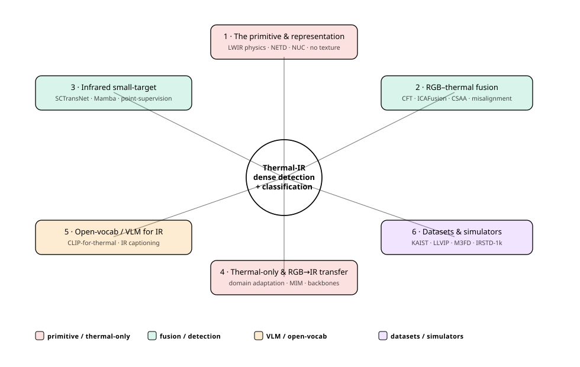
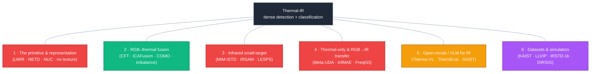
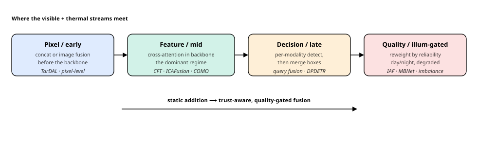
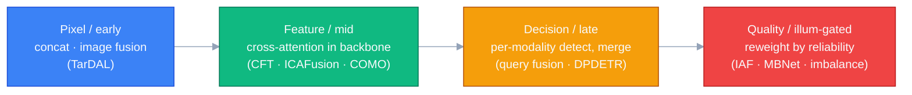

# Dense Object Detection & Classification — Recent Advances

*Compiled 2026-Jun-30 (America/Los_Angeles).*

Next installment in the running CV-updates log. Earlier entries on
`main`:
[Apr-30](../2026-Apr-30/2026-Apr-30_CV_updates.md),
[May-01](../2026-May-01/2026-May-01_CV_updates.md),
[May-02](../2026-May-02/2026-May-02_CV_updates.md),
[May-04](../2026-May-04/2026-May-04_CV_updates.md),
[May-05](../2026-May-05/2026-May-05_CV_updates.md),
[May-07](../2026-May-07/2026-May-07_CV_updates.md),
[May-08](../2026-May-08/2026-May-08_CV_updates.md),
[May-15](../2026-May-15/2026-May-15_CV_updates.md),
[May-16](../2026-May-16/2026-May-16_CV_updates.md),
[May-17](../2026-May-17/2026-May-17_CV_updates.md),
[Jun-09](../2026-Jun-09/2026-Jun-09_CV_updates.md),
[Jun-10](../2026-Jun-10/2026-Jun-10_CV_updates.md),
[Jun-12](../2026-Jun-12/2026-Jun-12_CV_updates.md),
[Jun-15](../2026-Jun-15/2026-Jun-15_CV_updates.md),
[Jun-16](../2026-Jun-16/2026-Jun-16_CV_updates.md),
[Jun-17](../2026-Jun-17/2026-Jun-17_CV_updates.md),
[Jun-19](../2026-Jun-19/2026-Jun-19_CV_updates.md),
[Jun-21](../2026-Jun-21/2026-Jun-21_CV_updates.md),
[Jun-22](../2026-Jun-22/2026-Jun-22_CV_updates.md),
[Jun-23](../2026-Jun-23/2026-Jun-23_CV_updates.md),
[Jun-24](../2026-Jun-24/2026-Jun-24_CV_updates.md),
[Jun-25](../2026-Jun-25/2026-Jun-25_CV_updates.md),
[Jun-27](../2026-Jun-27/2026-Jun-27_CV_updates.md),
[Jun-29](../2026-Jun-29/2026-Jun-29_CV_updates.md).

## Why this pass: thermal infrared as its own primitive

The last several passes worked sensor primitives **on their own terms** —
camera-3D / occupancy ([Jun-24](../2026-Jun-24/2026-Jun-24_CV_updates.md)),
remote-sensing spectra/time-series
([Jun-25](../2026-Jun-25/2026-Jun-25_CV_updates.md)), the LiDAR point cloud
([Jun-27](../2026-Jun-27/2026-Jun-27_CV_updates.md)), and the event stream
([Jun-29](../2026-Jun-29/2026-Jun-29_CV_updates.md)). The **long-wave
infrared (LWIR) thermal image** is the obvious next one — and across the
~200 sections of the running log it has only ever shown up as two narrow
slices: the **infrared small-target *segmentation*** sub-problem
([Jun-09 §8](../2026-Jun-09/2026-Jun-09_CV_updates.md): SCTransNet / MSHNet /
SeRankDet), and **one band inside a fusion stack** (RGB-T as a *fusion*
partner for SAR/hyperspectral on
[May-05](../2026-May-05/2026-May-05_CV_updates.md); a single KAIST/FLIR row
on [May-16](../2026-May-16/2026-May-16_CV_updates.md)). It has never had a
pass as a *primitive in its own right*. That is the gap this entry fills.

It earns its own pass because a thermal image is a genuinely different thing
from the visible grid every RGB detector was built on:

- **You are imaging emitted heat, not reflected light.** An LWIR camera
  integrates self-emitted radiation in the **~8–14 µm** band, so its pixels
  encode an object's temperature and emissivity, not its albedo. RGB and
  thermal therefore live in different feature spaces with no clean
  pixel-to-pixel correspondence — "RGB captures reflected light whereas
  thermal imaging measures emitted heat … fundamental differences in image
  formation physics" ([FreqKD, arXiv 2606.11572](https://arxiv.org/abs/2606.11572)).
- **No colour, almost no texture, low resolution, noisy.** Uncooled
  microbolometer focal-plane arrays are commonly **80×60 → 640×512** pixels
  with **sensor-specific per-pixel gain non-uniformity and high readout
  noise → low SNR** ([Thermal Image Processing via Physics-Inspired Deep
  Networks, arXiv 2108.07973](https://arxiv.org/abs/2108.07973)). Contrast is
  bounded by **NETD** (noise-equivalent temperature difference, typically
  **~20–75 mK**), and the raw stream carries **fixed-pattern noise** that a
  **non-uniformity correction (NUC)** — often a mechanical shutter flat-field
  refresh — must continually suppress
  ([two-point NUC, PMC9966154](https://www.ncbi.nlm.nih.gov/pmc/articles/PMC9966154/)),
  alongside self-heating "narcissus"/halo artifacts
  ([arXiv 2108.07973](https://arxiv.org/abs/2108.07973)).
- **There is no labelled thermal ImageNet.** The scarcity of large annotated
  TIR corpora is the field's recurring bottleneck
  ([Meta-UDA, arXiv 2110.03143](https://arxiv.org/abs/2110.03143)), so
  **RGB→thermal transfer, self-supervision, and synthesis** are first-class
  threads, not footnotes.
- **The whole selling point is seeing when RGB can't** — total darkness,
  glare, smoke, fog. So thermal is rarely used alone: the dominant deployment
  is **RGB-T fusion**, and its real lesson is *trust* — knowing **when to
  discount the failing modality** (night, or a degraded thermal frame), the
  same modality-drop robustness theme that ran through the LiDAR-camera
  ([Jun-27](../2026-Jun-27/2026-Jun-27_CV_updates.md)) and event-RGB
  ([Jun-29](../2026-Jun-29/2026-Jun-29_CV_updates.md)) passes.

This pass covers six threads of that stack:

1. **The primitive & representation** — the physics that forces different
   design choices, and how thermal gets fed to a network.
2. **RGB–thermal multispectral detection** — the fusion leaderboard, the
   *where-to-fuse* taxonomy, and the modality-imbalance / misalignment
   problems that define it.
3. **Infrared small-target detection (ISTD)** — dense detection at its most
   extreme: a few textureless pixels against clutter.
4. **Thermal-only detection & RGB→IR transfer** — domain adaptation,
   distillation, and self-supervised / foundation-model backbones for a
   modality with no ImageNet.
5. **Open-vocabulary & vision-language for thermal** — CLIP/VLM adaptation to
   a band the big models never saw.
6. **Datasets, simulators & benchmarks** — what everyone trains on, and the
   synthesis pipelines that paper over the data shortage.

> **Reading the numbers.** Figures are quoted from each method's own paper,
> repo, or leaderboard, and **are not comparable across rows**: RGB-T
> detection reports COCO-style mAP / mAP@50 or KAIST **log-average miss rate**
> (lower is better); ISTD reports pixel **IoU / nIoU** and object-level
> **Pd / Fa** — different tasks on different benchmarks (KAIST, FLIR, LLVIP,
> M3FD, DroneVehicle, VEDAI vs NUAA-/NUDT-SIRST, IRSTD-1k, …) that differ in
> resolution, class set and density. This run's egress policy **blocked
> direct `arxiv.org` / publisher fetches (HTTP 403)**, so arXiv IDs, venues
> and numbers were corroborated across multiple search-result pages and
> authors' GitHub repos rather than read from source PDFs; very recent
> (2026, `2602`–`2606`) IDs are real and consistently matched but are
> **preprints**, and any figure available only through a secondary summary is
> flagged *(approx.)* or *(unverified)*.

## Topic map

---

## 1 · The primitive & representation — why thermal forces different choices

A thermal frame *looks* like a grayscale image, so the temptation is to drop
it into an RGB detector unchanged. That works as a baseline and fails at the
margins, because four properties of the sensor have no analogue in the
visible grid:

| Property | What it means downstream |
|---|---|
| **Emitted, not reflected** (8–14 µm) | Intensity = temperature × emissivity. A black car and a white car look alike; a warm engine block "glows". RGB-pretrained low/high-frequency priors transfer only **partially** — shape/layout aligns, texture/edges do not ([FreqKD, arXiv 2606.11572](https://arxiv.org/abs/2606.11572)). |
| **No colour, weak texture, low res** | The cheap classification cues are gone; detectors lean on **shape, contrast and context**. Fine classes (vehicle subtype, person vs people) are hard. |
| **NETD-bounded contrast + fixed-pattern noise** | Targets can sit a few **mK** above background; **NUC**/denoising is a real preprocessing stage, and "small target" often means *low-SNR blob*, not *small object* ([arXiv 2108.07973](https://arxiv.org/abs/2108.07973)). |
| **Day/night invariance** | The upside: thermal is **illumination-robust**, which is exactly why it is paired with RGB and why the night subset is where fusion is won or lost. |

**Representation choices** the field actually uses, roughly in order of how
much thermal physics they respect:

- **Treat as a 1- or 3-channel image** (replicate the band) and reuse an
  RGB CNN/ViT/DETR. Maximum compatibility; ignores radiometry. The default,
  and the baseline every method below beats.
- **Radiometric / temperature input** — feed calibrated temperature rather
  than 8-bit AGC output, or normalize per-frame; matters for material and
  emissivity-driven tasks ([thermal material classification, *Sci. Rep.*
  2022](https://www.nature.com/articles/s41598-022-21588-4)).
- **Physics-aware preprocessing** — explicit NUC / denoise / edge
  enhancement before the backbone, or physics-inspired layers
  ([arXiv 2108.07973](https://arxiv.org/abs/2108.07973)).
- **Frequency-decoupled features** — split low-frequency (cross-modal,
  shareable with RGB) from high-frequency (modality-specific) and treat them
  differently; the organizing idea behind the strongest 2026 transfer work
  ([FreqKD, arXiv 2606.11572](https://arxiv.org/abs/2606.11572)) and several
  wavelet-domain ISTD methods (§3).

The rest of this pass is what you build *on top of* that input — and every
thread is shaped by the same two facts: **no labels** and **RGB fails at
night, thermal doesn't**.

## 2 · RGB–thermal multispectral detection — the fusion leaderboard

Pairing a visible and a thermal camera is the workhorse deployment
(pedestrian/vehicle detection at night, surveillance, ADAS, drones). The
research question is almost never "which backbone" — it is **where and how to
fuse the two streams, and how to keep the fusion honest when one stream is
useless.**

**Transformer cross-modal fusion** is the dominant regime — fuse in feature
space, with attention deciding the cross-modal interaction:

| Method | Reference | Idea | Headline *(approx.)* |
|---|---|---|---|
| **CFT** (Cross-Modality Fusion Transformer) | [arXiv 2111.00273](https://arxiv.org/abs/2111.00273) (2021) | self-attention over concatenated RGB+thermal tokens at each backbone stage — the seminal transformer-fusion work | FLIR mAP@50 73.0→**78.7**; LLVIP **97.5**; VEDAI mAP 46.8→**56.0** |
| **ICAFusion** | [arXiv 2308.07504](https://arxiv.org/abs/2308.07504) (Pattern Recognition 2023) · [code](https://github.com/chanchanchan97/ICAFusion) | dual cross-attention with a **parameter-shared iterative** query-guided interaction; global fusion at low compute | strong on KAIST / FLIR / VEDAI, faster inference |
| **IC-Fusion** (Infrared-Centric DETR) | [arXiv 2505.15137](https://arxiv.org/abs/2505.15137) (2025) | wavelet analysis says **IR carries the high-frequency structure** that matters; IR-centric 3-stage fusion | RT-DETR IR-only **43.6** vs RGB-only 33.5 mAP (illustrative) |
| **YOLOv11-RGBT** | [arXiv 2506.14696](https://arxiv.org/abs/2506.14696) (2025) | a unified multimodal YOLOv11 cataloguing/standardizing RGB-T fusion modes | engineering baseline / framework |

**Mamba / state-space fusion** is the fast-rising 2024–26 alternative —
linear-time scanning instead of quadratic attention, the same pivot seen on
the LiDAR ([Jun-27](../2026-Jun-27/2026-Jun-27_CV_updates.md)) and event
([Jun-29](../2026-Jun-29/2026-Jun-29_CV_updates.md)) sides:

- **RemoteDet-Mamba** — [arXiv 2410.13532](https://arxiv.org/abs/2410.13532)
  (2024) — hybrid Mamba-CNN, 4-directional patch scanning; DroneVehicle
  TIR-only 79.4 → fused **~81.8 mAP** *(approx.)*.
- **COMO** — [arXiv 2412.18076](https://arxiv.org/abs/2412.18076) (2024) —
  Cross-Mamba interaction + offset-guided fusion.
- **WaveMamba** — [arXiv 2507.18173](https://arxiv.org/abs/2507.18173) (2025)
  — wavelet + Mamba on YOLOv8; LLVIP **mAP@50 98.3 / mAP 66.0** *(approx.)*.
- **MambaRefine-YOLO** — [arXiv 2511.19134](https://arxiv.org/abs/2511.19134)
  (2025) — dual-modality small-object detector for UAV imagery.

**The two problems that actually define the field.** Backbone choice is
secondary to these:

- **Modality imbalance / dominance** — one stream dominates training and the
  detector never learns to use the other when it's the only good one. The
  illumination-aware lineage gates the merge by a day/night estimate
  ([IAF R-CNN, arXiv 1803.05347](https://arxiv.org/abs/1803.05347)) and the
  differential-fusion lineage explicitly balances the streams (**MBNet**,
  ECCV 2020, *arXiv ID unverified*). 2025–26 pushes this hard: a
  **base-and-auxiliary detector** trains an auxiliary branch on
  *pseudo-degraded* inputs under a consistency constraint, claiming **~55 %
  miss-rate reduction under extreme imbalance**
  ([arXiv 2505.22154](https://arxiv.org/abs/2505.22154), PRL 2025);
  **modality-dominance-aware optimization**
  ([arXiv 2601.00598](https://arxiv.org/abs/2601.00598), 2026) and
  **robust detection with uncertain/missing modality**
  ([arXiv 2602.06363](https://arxiv.org/abs/2602.06363), 2026) attack the
  test-time version.
- **Weak alignment / misalignment** — the two cameras are never perfectly
  registered; naive fusion smears features. **AR-CNN** introduced a Region
  Feature Alignment module that predicts and corrects the per-object shift
  ([arXiv 1901.02645](https://arxiv.org/abs/1901.02645), ICCV 2019);
  **DPDETR** decouples object position per modality inside a DETR
  ([arXiv 2408.06123](https://arxiv.org/abs/2408.06123), 2024); offset-guided
  dynamic alignment ([arXiv 2506.16737](https://arxiv.org/abs/2506.16737),
  2025) and **COXNet** ([arXiv 2508.09533](https://arxiv.org/abs/2508.09533),
  2025) extend it to weakly-aligned UAV tiny objects.

**Benchmarks & metrics** (see §6 for sizes/links):

| Benchmark | Task | Metric | Reference point *(approx.)* |
|---|---|---|---|
| **KAIST** | multispectral pedestrian | log-average **miss rate** (↓), day/night subsets | 2024 night LAMR **~7–9 %** *(unverified)* |
| **FLIR-aligned** | 3-class ADAS | mAP / mAP@50 | CFT mAP@50 **78.7** |
| **LLVIP** | low-light pedestrian | mAP@50 / mAP | top end **mAP@50 ≈ 98.3, mAP ≈ 66** *(unverified)* |
| **M3FD** | 6-class, mixed weather | mAP / mAP@50 | — |
| **DroneVehicle** | aerial, oriented boxes | mAP / mAP@50 | RemoteDet-Mamba **~81.8** *(approx.)* |
| **VEDAI** | aerial small vehicles | mAP / mAP@50 | CFT mAP **56.0** |

Curated lists worth bookmarking:
[Awesome-RGBT-Fusion](https://github.com/yuanmaoxun/Awesome-RGBT-Fusion) and
[Multispectral-Pedestrian-Detection-Resource](https://github.com/CalayZhou/Multispectral-Pedestrian-Detection-Resource)
(includes the KAIST annotation fixes).

## 3 · Infrared small-target detection (ISTD) — dense detection at the limit

ISTD is single-band thermal detection of targets that are **a few
textureless, low-contrast pixels** against structured clutter — drones,
distant aircraft, ships. [Jun-09 §8](../2026-Jun-09/2026-Jun-09_CV_updates.md)
covered the 2022–24 CNN/transformer baselines (SCTransNet, MSHNet,
SeRankDet); the 2024–26 frontier has moved on three axes.

**(a) Mamba / state-space backbones** — linear-complexity global modelling as
a cheaper alternative to ViT-style ISTD:

| Method | Reference | Idea |
|---|---|---|
| **MiM-ISTD** | [arXiv 2403.02148](https://arxiv.org/abs/2403.02148) (2024) | "Mamba-in-Mamba" outer+inner blocks; first widely-cited Mamba ISTD |
| **IRMamba** | [AAAI 2025](https://ojs.aaai.org/index.php/AAAI/article/view/33085) | injects pixel-difference intensity/direction into the SSM state equation |
| **SAMamba** | [Information Fusion 2025](https://www.sciencedirect.com/science/article/abs/pii/S1566253525004117) | SAM-style hierarchy + Mamba; **IRSTD-1k IoU 72.54** *(approx.)* |

**(b) Foundation-model adaptation** — the biggest shift, increasingly
multimodal/CLIP-guided:

| Method | Reference | Idea |
|---|---|---|
| **IRSAM** | [arXiv 2407.07520](https://arxiv.org/abs/2407.07520) (ECCV 2024) | adapts SAM with Perona-Malik-diffusion blocks to close the natural→IR gap |
| **SAIST** | [CVPR 2025](https://openaccess.thecvf.com/content/CVPR2025/html/Zhang_SAIST_Segment_Any_Infrared_Small_Target_Model_Guided_by_Contrastive_CVPR_2025_paper.html) | SR-CLIP scene recognition + CLIP-guided SAM; ships multimodal **MIRSTD** image-text set |
| **SPIRIT** | [arXiv 2602.01843](https://arxiv.org/abs/2602.01843) (2026) | vision-foundation backbone unifying single- and multi-frame ISTD |

Alongside them: **interpretable deep-unfolding** (RPCANet / RPCANet++ unroll
robust-PCA into a network — [arXiv 2311.00917](https://arxiv.org/abs/2311.00917),
WACV 2024), **gradient/edge-aware** designs (GANet "gradient is all you need"
— [arXiv 2409.19599](https://arxiv.org/abs/2409.19599); MSDA-Net,
[arXiv 2406.02037](https://arxiv.org/abs/2406.02037), PRCV-2024 winner),
**wavelet/frequency** methods (SWAN,
[arXiv 2508.01322](https://arxiv.org/abs/2508.01322)), and **diffusion** for
both detection and augmentation (Gaussian-agnostic diffusion priors,
[arXiv 2507.18260](https://arxiv.org/abs/2507.18260)).

**(c) Label efficiency — single-point supervision is now standard.** Pixel
masks for sub-10-px targets are punishing to draw, so the field moved to
**one click per target**. **LESPS** evolves point labels via the network's
own predictions and recovers **>70 % of full-supervision IoU and >95 % of Pd**
([arXiv 2304.01484](https://arxiv.org/abs/2304.01484), CVPR 2023 ·
[code](https://github.com/XinyiYing/LESPS)); **MCLC** recovers masks from a
single point by Monte-Carlo clustering
([arXiv 2304.04442](https://arxiv.org/abs/2304.04442), ICCV 2023). 2024–26
extends this to active learning
([PAL, arXiv 2412.11154](https://arxiv.org/abs/2412.11154)), energy-guided
prompts ([EDGSP, arXiv 2408.08191](https://arxiv.org/abs/2408.08191)), and a
detection-style **encoder-only centroid regressor**
([SPIRE, arXiv 2604.05363](https://arxiv.org/abs/2604.05363), 2026).

**A methodological reckoning.** Two 2025 papers argue the field's reflex of
reporting **segmentation IoU on a single dataset** is the wrong target:
[arXiv 2502.14168](https://arxiv.org/abs/2502.14168) (survey) frames mask
integrity as only a proxy for detection, and
[arXiv 2509.16888](https://arxiv.org/abs/2509.16888) proposes a hybrid
pixel+target-level metric with mandatory **cross-dataset** evaluation. The
practical signal: **IRSTD-1k** (real, cluttered, nIoU typically <70 %) stays
hard while synthetic **NUDT-SIRST** is near-saturated (IoU in the 90s), so
single-number leaderboard wins mean little.

The fastest-growing data frontier is **moving / multi-frame** ISTD —
satellite video (**IRSatVideo-LEO** + RFR baseline,
[arXiv 2409.12448](https://arxiv.org/abs/2409.12448)) and dense moving targets
(**DMIST**, [code](https://github.com/UESTC-nnLab/DMIST)).

## 4 · Thermal-only detection & RGB→IR transfer — building without an ImageNet

When you only have thermal, the problem is **labels**, and every method here
is a different way to import supervision the modality doesn't have.

**Domain adaptation & RGB→thermal translation.** Meta-learn the detector's
initialization to boost any UDA method
([Meta-UDA, arXiv 2110.03143](https://arxiv.org/abs/2110.03143), WACV 2022);
or *manufacture* thermal training data: **ECDM** uses **edge cues** to
condition a diffusion model and strips visible-specific edges via two-stage
adversarial training
([arXiv 2408.03748](https://arxiv.org/abs/2408.03748), ACM MM 2024 ·
[code](https://github.com/lengmo1996/ECDM)); **F-ViTA** conditions
InstructPix2Pix on **SAM / Grounded-DINO** zero-shot masks to translate one
RGB image into LWIR/MWIR/NIR
([arXiv 2504.02801](https://arxiv.org/abs/2504.02801) ·
[code](https://github.com/JayParanjape/F-ViTA)).

**Cross-modal knowledge distillation (RGB teacher → thermal student).** The
2026 organizing insight is that the RGB–IR feature gap is
**frequency-dependent**: **FreqKD** distills low-frequency (shape/layout,
cross-modal) with strict MSE and high-frequency (texture/edges,
modality-specific) loosely
([arXiv 2606.11572](https://arxiv.org/abs/2606.11572)); a contrast-guided
variant ([arXiv 2511.01435](https://arxiv.org/abs/2511.01435), 2025) and the
NeurIPS-2024 "thermal detection via cross-modal KD" entry
([listing](https://neurips.cc/virtual/2024/109045)) work the same RGB→thermal
transfer angle.

**Self-supervised / foundation pretraining for thermal** — masked image
modelling on large *unlabelled* IR corpora:

| Model | Reference | Idea |
|---|---|---|
| **InfMAE** | [arXiv 2402.00407](https://arxiv.org/abs/2402.00407) (ECCV 2024) | "first IR foundation model"; **information-aware masking**, releases **Inf30** (305,241 IR images); gains on IR seg / det / small-target |
| **DuGI-MAE** | [arXiv 2512.04511](https://arxiv.org/abs/2512.04511) (AAAI 2026) | entropy-based deterministic masking + dual-domain guidance to filter IR background noise; **Inf-590K** pretraining set |
| **SSVIF** | [arXiv 2509.22450](https://arxiv.org/abs/2509.22450) (2025) | self-supervised, segmentation-oriented visible-infrared fusion |

**Thermal classification** rounds out the recognition half: emissivity as a
material-discriminative feature
([*Sci. Rep.* 2022](https://www.nature.com/articles/s41598-022-21588-4)),
deep IR **face analysis** ([MDPI *AI* 2023](https://www.mdpi.com/2673-2688/4/1/9);
embedded thermal face detection,
[MDPI *Sensors* 2025](https://www.mdpi.com/1424-8220/25/10/3126)), and
thermal/RGB-T **wildlife** surveys from drones
([*Sci. Rep.* 2023](https://www.nature.com/articles/s41598-023-37295-7);
[*Methods Ecol. Evol.* 2025](https://besjournals.onlinelibrary.wiley.com/doi/10.1111/2041-210X.70006)).

## 5 · Open-vocabulary & vision-language for thermal — a band the big models never saw

CLIP, YOLO-World, OWL-ViT and DINO-X are trained on web RGB; none has seen
much thermal. Closing that gap is the **least mature** thread, and 2026
splits it two ways.

**Map thermal into the VLM's RGB input space** (zero-shot, no retraining):
preprocess IR into an RGB-compatible representation (e.g. a "magma" colormap)
and run a frozen **CLIP ViT-B/32** with prompt ensembling
([VLM-IRIS, arXiv 2512.11098](https://arxiv.org/abs/2512.11098), 2026); inject
**text/category semantics as a bridge** between the RGB and IR responses
([Consensus & Discrepancy text-guided multispectral detection,
arXiv 2604.11234](https://arxiv.org/abs/2604.11234), 2026 — *recent
preprint*). For ISTD, **SAIST** (§3) already runs CLIP-guided.

**Build a wavelength-aware VLM** instead of faking RGB: **Thermo-VL** augments
a frozen **Molmo-7B** with a trainable thermal encoder and a gated residual
into the RGB stream — adding thermal evidence without breaking the
RGB-language interface — and argues directly *against* RGB-translation
pipelines (generative bottleneck, hallucinated visible detail)
([arXiv 2605.21882](https://arxiv.org/abs/2605.21882), 2026). The thread now
has its own evaluation: **ThermEval**, a structured benchmark for VLMs on
thermal ([arXiv 2602.14989](https://arxiv.org/abs/2602.14989), 2026), plus
extensions to robotics (**ThermoAct** VLA,
[arXiv 2603.25044](https://arxiv.org/abs/2603.25044)) and a security note that
IR-VLMs are physically attackable
([universal IR adversarial patches, arXiv 2604.03117](https://arxiv.org/abs/2604.03117)).

> These 2026 (`2602`–`2605`) items are real, consistently matched preprints
> but were **not page-verified** under this run's egress block — treat as
> leading-edge leads, not settled results.

## 6 · Datasets, simulators & benchmarks — what everyone trains on

**RGB-T / multispectral detection.** The core benchmarks (sizes from
paper/repo, GitHub links repo-verified; some official hosts 403'd):

| Dataset | Year | Modality / task | Size *(approx.)* | Link |
|---|---|---|---|---|
| **KAIST Multispectral Pedestrian** | 2015 | aligned RGB+LWIR, pedestrian | 95,328 pairs / 103,128 boxes | [repo](https://github.com/SoonminHwang/rgbt-ped-detection) |
| **CVC-14** | 2016 | visible(gray)+FIR, pedestrian | ~8.5k day+night frames *(approx.)* | [paper](https://pmc.ncbi.nlm.nih.gov/articles/PMC4934246/) |
| **FLIR ADAS v2** | 2022 | thermal(+unaligned RGB), 15-class | ~26,442 frames; v2 ~520k boxes | [Kaggle mirror](https://www.kaggle.com/datasets/samdazel/teledyne-flir-adas-thermal-dataset-v2) |
| **LLVIP** | 2021 | aligned RGB+IR, pedestrian | 15,488 pairs | [repo](https://github.com/bupt-ai-cz/LLVIP) |
| **M3FD** | 2022 | aligned IR+visible, 6-class + fusion | 4,200 pairs / ~34k objects | [repo (TarDAL)](https://github.com/JinyuanLiu-CV/TarDAL) |
| **DroneVehicle** | 2020/22 | aerial RGB+IR, 5-class oriented | 28,439 pairs / 953,087 OBBs | [repo](https://github.com/VisDrone/DroneVehicle) |
| **VEDAI** | 2015 | aerial RGB+NIR, small vehicles | ~1,2k image sets | [PwC](https://paperswithcode.com/dataset/vedai) |
| **MFNet** | 2017 | RGB-T urban **segmentation** | 1,569 pairs (820 day/749 night) | [project](https://www.mi.t.u-tokyo.ac.jp/static/projects/mil_multispectral/) |
| **RGBT-Tiny** | 2024–25 | UAV RGB-T **tiny**-object det+track | 115 seqs / ~93k frames / ~1.2M ann. | [repo](https://github.com/XinyiYing/RGBT-Tiny) |
| **ATR-UMOD** | 2025 | aligned RGB+IR UAV, 11-class + conditions | 13,353 pairs *(unverified)* | [arXiv 2510.13620](https://arxiv.org/abs/2510.13620) |

**Infrared small-target.** Single-frame: **NUAA-SIRST** (427 real images,
[repo](https://github.com/YimianDai/sirst)), **NUDT-SIRST** (1,327 synthetic,
near-saturated), **IRSTD-1k** (~1,000 real, the hard one), **SIRST-V2**,
**NUDT-SIRST-Sea**, **IRDST**, **SIRST-5K**
([arXiv 2403.05416](https://arxiv.org/abs/2403.05416)), and the ICPR-2024
challenge meta-set **WideIRSTD**
([repo](https://github.com/XinyiYing/WideIRSTD-Dataset), aggregates 7 sets +
a single-point weak-supervision track). Multi-frame / moving:
**IRSatVideo-LEO** ([arXiv 2409.12448](https://arxiv.org/abs/2409.12448)),
**DMIST** ([repo](https://github.com/UESTC-nnLab/DMIST)), **NUDT-MIRSDT**.
Anti-UAV: **Anti-UAV410** (TPAMI 2023, 410 videos / 438k boxes,
[repo](https://github.com/HwangBo94/Anti-UAV410)), **CST Anti-UAV**
([arXiv 2507.23473](https://arxiv.org/abs/2507.23473), 220 seqs / ~240k boxes).
Standard metrics: **IoU, nIoU, Pd, Fa** (per-pixel false alarm, ×10⁻⁶).

**Thermal-only / face / wildlife.** **HIT-UAV** (high-altitude IR drone,
2,898 images / ~24.9k objects,
[repo](https://github.com/suojiashun/HIT-UAV-Infrared-Thermal-Dataset)),
**BIRDSAI** (nighttime aerial TIR wildlife, ~62k real + ~100k synthetic
images), **MONET** (drone thermal, ~53k images / ~162k boxes,
[project](https://tev.fbk.eu/resources/monet)), **Caltech Aerial RGB-Thermal**
([repo](https://github.com/aerorobotics/caltech-aerial-rgbt-dataset)); thermal
faces in **TFW** ([repo](https://github.com/IS2AI/TFW), 9,982 images) and the
large **ARL-VTF** thermal-to-visible verification set
([CVF](https://openaccess.thecvf.com/content/WACV2021/html/Poster_A_Large-Scale_Time-Synchronized_Visible_and_Thermal_Face_Dataset_WACV_2021_paper.html)).

**Synthesis & simulators** — the answer to "no labelled thermal ImageNet":

- **Learned RGB→thermal** — GANs (ThermalGAN,
  [repo](https://github.com/vlkniaz/ThermalGAN); InfraGAN) giving way to
  diffusion / flow: **PID** (physics-informed,
  [arXiv 2407.09299](https://arxiv.org/abs/2407.09299)), **DiffV2IR**
  ([arXiv 2503.19012](https://arxiv.org/abs/2503.19012)), **ThermalGen**
  (style-disentangled flow, [arXiv 2509.24878](https://arxiv.org/abs/2509.24878)),
  and edge-guided translation
  ([arXiv 2301.12689](https://arxiv.org/abs/2301.12689); ECDM, §4).
- **Physics-based IR scene simulators** — first-principles self-emission
  rendering across 0.4–14 µm: **DIRSIG** ([RIT](https://dirsig.cis.rit.edu/)),
  **OKTAL-SE SE-Workbench**, **ThermoAnalytics MuSES / CoTherm** (mass-produce
  auto-labelled IR signatures over time-of-day/weather/range), **Ansys Speos**
  and **Presagis Ondulus IR**.
- **Style-transfer augmentation** — meta-learned color→IR stylization
  ([MLST, arXiv 2212.12824](https://arxiv.org/abs/2212.12824), WACV 2025).
- Umbrella reference: *A Comprehensive Survey on Synthetic Infrared Image
  Synthesis* ([arXiv 2408.06868](https://arxiv.org/abs/2408.06868), 2024).

---

## Cross-cutting theme: the same three escapes, on a colder primitive

Read end-to-end, this pass tells the same structural story as the four
modality passes before it — camera-3D, remote sensing, LiDAR, event — applied
to a band with no texture and no labels:

- **The architecture pivot is the same one.** Cross-attention fusion (CFT,
  ICAFusion) and ViT-style ISTD backbones (SCTransNet) give way to
  **linear-time state-space scanning** (RemoteDet-Mamba, COMO, WaveMamba on
  the fusion side; MiM-ISTD, IRMamba, SAMamba on the small-target side) — the
  identical "windowed attention → linear scan" shift the LiDAR
  ([Jun-27](../2026-Jun-27/2026-Jun-27_CV_updates.md)) and event
  ([Jun-29](../2026-Jun-29/2026-Jun-29_CV_updates.md)) passes found, arriving
  on thermal in 2024–25.
- **No labels routes around the problem three identical ways.** No thermal
  ImageNet → **self-supervise** (InfMAE/DuGI-MAE masked modelling),
  **transfer/distil from RGB** (Meta-UDA, FreqKD's frequency-decoupled KD),
  or **synthesize** (ECDM, F-ViTA, DIRSIG/MuSES) — the same MEM/ECDP +
  v2e/GS2E pattern the event pass used, and the same SAM/CLIP-adaptation the
  remote-sensing pass used.
- **Fusion's real lesson is trust, not addition.** The headline RGB-T
  problems are **modality imbalance** and **knowing when one stream is
  useless at night** ([arXiv 2505.22154](https://arxiv.org/abs/2505.22154);
  uncertain-modality detection,
  [arXiv 2602.06363](https://arxiv.org/abs/2602.06363)) — the same
  *discount-the-failing-modality* finding as LiDAR-camera dropout and the
  PEOD event-vs-fusion result on [Jun-29](../2026-Jun-29/2026-Jun-29_CV_updates.md).
- **Foundation models arrive, by adaptation not pretraining.** SAM and CLIP
  reach thermal through **adapters and colormaps** (IRSAM, SAIST, VLM-IRIS)
  rather than native IR-scale pretraining — except where someone finally pays
  for it (InfMAE's Inf30, Thermo-VL's wavelength-aware VLM), which is exactly
  where the 2026 frontier is.
- **Venue signal.** The settled lineage is 2021–24 (CFT, AR-CNN, LESPS,
  RPCANet, IRSAM, InfMAE); the genuinely new work clusters in late-2025/2026
  arXiv (`2505`–`2606`) — FreqKD, DuGI-MAE, Thermo-VL, ThermEval, SPIRE,
  SPIRIT — and skews toward **frequency-decoupling, foundation adaptation,
  and trust-aware fusion**.

---

## Sources & further reading

**Motivation / physics & surveys**
- Thermal Image Processing via Physics-Inspired Deep Networks — [arXiv 2108.07973](https://arxiv.org/abs/2108.07973).
- Two-Point NUC for wide-spectrum LWIR — [PMC9966154](https://www.ncbi.nlm.nih.gov/pmc/articles/PMC9966154/).
- FreqKD (RGB–IR frequency divergence) — [arXiv 2606.11572](https://arxiv.org/abs/2606.11572).
- IR small-object segmentation survey — [arXiv 2502.14168](https://arxiv.org/abs/2502.14168) (2025).
- Rethinking ISTD evaluation — [arXiv 2509.16888](https://arxiv.org/abs/2509.16888) (2025).
- Synthetic IR image synthesis survey — [arXiv 2408.06868](https://arxiv.org/abs/2408.06868) (2024).

**2 · RGB–thermal fusion**
- CFT — [arXiv 2111.00273](https://arxiv.org/abs/2111.00273).
- ICAFusion — [arXiv 2308.07504](https://arxiv.org/abs/2308.07504) (PR 2023) · [code](https://github.com/chanchanchan97/ICAFusion).
- IC-Fusion (IR-centric DETR) — [arXiv 2505.15137](https://arxiv.org/abs/2505.15137) (2025).
- YOLOv11-RGBT — [arXiv 2506.14696](https://arxiv.org/abs/2506.14696) (2025).
- RemoteDet-Mamba — [arXiv 2410.13532](https://arxiv.org/abs/2410.13532); COMO — [arXiv 2412.18076](https://arxiv.org/abs/2412.18076); WaveMamba — [arXiv 2507.18173](https://arxiv.org/abs/2507.18173); MambaRefine-YOLO — [arXiv 2511.19134](https://arxiv.org/abs/2511.19134).
- IAF R-CNN — [arXiv 1803.05347](https://arxiv.org/abs/1803.05347); MBNet (ECCV 2020, *arXiv ID unverified*).
- Modality imbalance — [arXiv 2505.22154](https://arxiv.org/abs/2505.22154) (PRL 2025); modality-dominance — [arXiv 2601.00598](https://arxiv.org/abs/2601.00598); uncertain-modality — [arXiv 2602.06363](https://arxiv.org/abs/2602.06363).
- AR-CNN — [arXiv 1901.02645](https://arxiv.org/abs/1901.02645); DPDETR — [arXiv 2408.06123](https://arxiv.org/abs/2408.06123); offset-guided alignment — [arXiv 2506.16737](https://arxiv.org/abs/2506.16737); COXNet — [arXiv 2508.09533](https://arxiv.org/abs/2508.09533).
- Lists: [Awesome-RGBT-Fusion](https://github.com/yuanmaoxun/Awesome-RGBT-Fusion) · [Multispectral-Pedestrian-Detection-Resource](https://github.com/CalayZhou/Multispectral-Pedestrian-Detection-Resource).

**3 · Infrared small-target detection**
- MiM-ISTD — [arXiv 2403.02148](https://arxiv.org/abs/2403.02148); IRMamba — [AAAI 2025](https://ojs.aaai.org/index.php/AAAI/article/view/33085); SAMamba — [Info. Fusion 2025](https://www.sciencedirect.com/science/article/abs/pii/S1566253525004117).
- IRSAM — [arXiv 2407.07520](https://arxiv.org/abs/2407.07520) (ECCV 2024); SAIST — [CVPR 2025](https://openaccess.thecvf.com/content/CVPR2025/html/Zhang_SAIST_Segment_Any_Infrared_Small_Target_Model_Guided_by_Contrastive_CVPR_2025_paper.html); SPIRIT — [arXiv 2602.01843](https://arxiv.org/abs/2602.01843).
- RPCANet — [arXiv 2311.00917](https://arxiv.org/abs/2311.00917) (WACV 2024); GANet — [arXiv 2409.19599](https://arxiv.org/abs/2409.19599); MSDA-Net — [arXiv 2406.02037](https://arxiv.org/abs/2406.02037); SWAN — [arXiv 2508.01322](https://arxiv.org/abs/2508.01322); diffusion priors — [arXiv 2507.18260](https://arxiv.org/abs/2507.18260).
- LESPS — [arXiv 2304.01484](https://arxiv.org/abs/2304.01484) (CVPR 2023) · [code](https://github.com/XinyiYing/LESPS); MCLC — [arXiv 2304.04442](https://arxiv.org/abs/2304.04442); PAL — [arXiv 2412.11154](https://arxiv.org/abs/2412.11154); EDGSP — [arXiv 2408.08191](https://arxiv.org/abs/2408.08191); SPIRE — [arXiv 2604.05363](https://arxiv.org/abs/2604.05363).
- IRSatVideo-LEO + RFR — [arXiv 2409.12448](https://arxiv.org/abs/2409.12448); DMIST — [code](https://github.com/UESTC-nnLab/DMIST).

**4 · Thermal-only detection & RGB→IR transfer**
- Meta-UDA — [arXiv 2110.03143](https://arxiv.org/abs/2110.03143) (WACV 2022).
- ECDM — [arXiv 2408.03748](https://arxiv.org/abs/2408.03748) (ACM MM 2024) · [code](https://github.com/lengmo1996/ECDM); F-ViTA — [arXiv 2504.02801](https://arxiv.org/abs/2504.02801) · [code](https://github.com/JayParanjape/F-ViTA).
- FreqKD — [arXiv 2606.11572](https://arxiv.org/abs/2606.11572); contrast-guided KD — [arXiv 2511.01435](https://arxiv.org/abs/2511.01435); NeurIPS-2024 cross-modal KD — [listing](https://neurips.cc/virtual/2024/109045).
- InfMAE — [arXiv 2402.00407](https://arxiv.org/abs/2402.00407) (ECCV 2024); DuGI-MAE — [arXiv 2512.04511](https://arxiv.org/abs/2512.04511) (AAAI 2026); SSVIF — [arXiv 2509.22450](https://arxiv.org/abs/2509.22450).
- Thermal material classification — [*Sci. Rep.* 2022](https://www.nature.com/articles/s41598-022-21588-4); IR face analysis review — [MDPI *AI* 2023](https://www.mdpi.com/2673-2688/4/1/9); thermal/RGB-T wildlife — [*Sci. Rep.* 2023](https://www.nature.com/articles/s41598-023-37295-7).

**5 · Open-vocab / VLM for thermal**
- VLM-IRIS — [arXiv 2512.11098](https://arxiv.org/abs/2512.11098); text-bridge multispectral detection — [arXiv 2604.11234](https://arxiv.org/abs/2604.11234).
- Thermo-VL — [arXiv 2605.21882](https://arxiv.org/abs/2605.21882); ThermEval — [arXiv 2602.14989](https://arxiv.org/abs/2602.14989); ThermoAct — [arXiv 2603.25044](https://arxiv.org/abs/2603.25044); IR-VLM adversarial patches — [arXiv 2604.03117](https://arxiv.org/abs/2604.03117).

**6 · Datasets & simulators**
- KAIST — [repo](https://github.com/SoonminHwang/rgbt-ped-detection); LLVIP — [repo](https://github.com/bupt-ai-cz/LLVIP); M3FD/TarDAL — [repo](https://github.com/JinyuanLiu-CV/TarDAL); DroneVehicle — [repo](https://github.com/VisDrone/DroneVehicle); FLIR ADAS v2 — [Kaggle](https://www.kaggle.com/datasets/samdazel/teledyne-flir-adas-thermal-dataset-v2); RGBT-Tiny — [repo](https://github.com/XinyiYing/RGBT-Tiny); ATR-UMOD — [arXiv 2510.13620](https://arxiv.org/abs/2510.13620).
- NUAA-SIRST — [repo](https://github.com/YimianDai/sirst); SIRST-5K — [arXiv 2403.05416](https://arxiv.org/abs/2403.05416); WideIRSTD — [repo](https://github.com/XinyiYing/WideIRSTD-Dataset); Anti-UAV410 — [repo](https://github.com/HwangBo94/Anti-UAV410); CST Anti-UAV — [arXiv 2507.23473](https://arxiv.org/abs/2507.23473).
- HIT-UAV — [repo](https://github.com/suojiashun/HIT-UAV-Infrared-Thermal-Dataset); MONET — [project](https://tev.fbk.eu/resources/monet); Caltech Aerial RGB-T — [repo](https://github.com/aerorobotics/caltech-aerial-rgbt-dataset); TFW — [repo](https://github.com/IS2AI/TFW); ARL-VTF — [CVF](https://openaccess.thecvf.com/content/WACV2021/html/Poster_A_Large-Scale_Time-Synchronized_Visible_and_Thermal_Face_Dataset_WACV_2021_paper.html).
- ThermalGAN — [repo](https://github.com/vlkniaz/ThermalGAN); PID — [arXiv 2407.09299](https://arxiv.org/abs/2407.09299); DiffV2IR — [arXiv 2503.19012](https://arxiv.org/abs/2503.19012); ThermalGen — [arXiv 2509.24878](https://arxiv.org/abs/2509.24878); MLST — [arXiv 2212.12824](https://arxiv.org/abs/2212.12824); DIRSIG — [RIT](https://dirsig.cis.rit.edu/).

---

### Diagram-rendering notes

- Two **Mermaid** flowcharts (topic map, fusion stages) plus two
  **standalone SVGs** (`assets/topic-map.svg`, `assets/fusion-stages.svg`).
- No external image URLs — both SVGs are local files committed alongside this
  report, referenced by relative path.
- The SVGs use `currentColor` for strokes/text and **low-opacity RGBA** fills,
  and the Mermaid nodes pair saturated fills with light (`#f8fafc`) text — so
  every diagram stays legible in **light and dark** themes. The thermal
  palette swaps the event pass's blue "backbone" hue for a warm red
  (`#ef4444`) to mark the thermal primitive.
- Numbers are quoted from each method's own paper / repo / leaderboard and
  **are not comparable across rows** (RGB-T mAP / mAP@50 vs KAIST log-average
  miss rate vs ISTD IoU / nIoU / Pd / Fa; KAIST / FLIR / LLVIP / M3FD /
  DroneVehicle / VEDAI vs NUAA-/NUDT-SIRST / IRSTD-1k differ in resolution,
  class set and density). This run's egress policy blocked direct
  `arxiv.org` / publisher fetches (HTTP 403), so IDs / venues / numbers were
  corroborated via authors' GitHub repos, proceedings pages and multiple
  cross-checked search results; figures available only through secondary
  summaries are flagged *(approx.)* / *(unverified)*, and 2026 (`2602`–`2606`)
  arXiv IDs are real, consistently matched **preprints** not yet page-verified.
