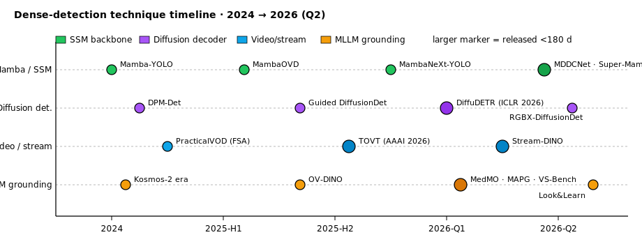
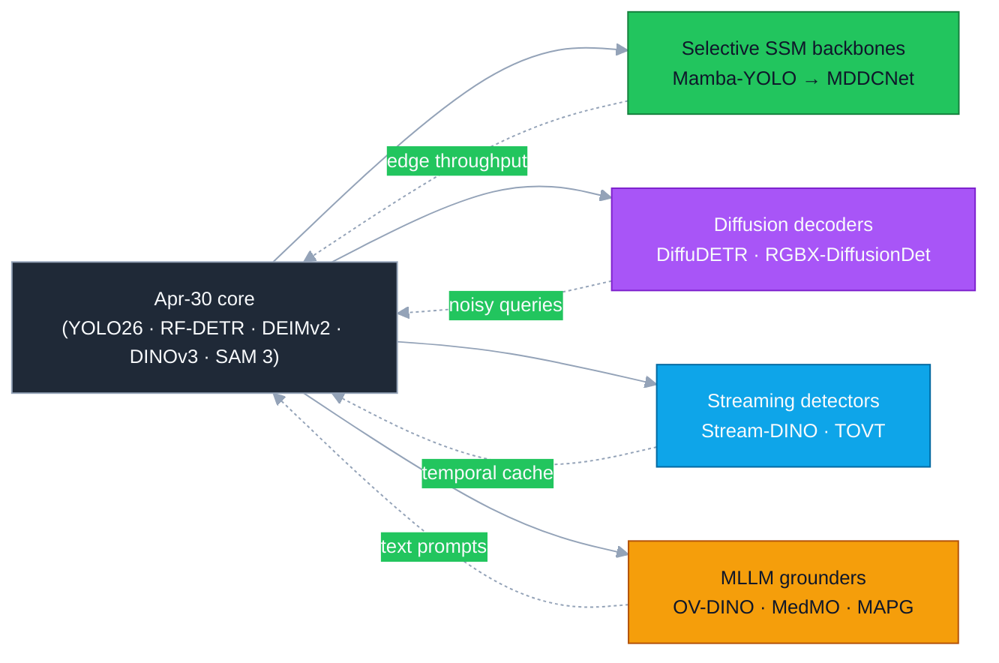
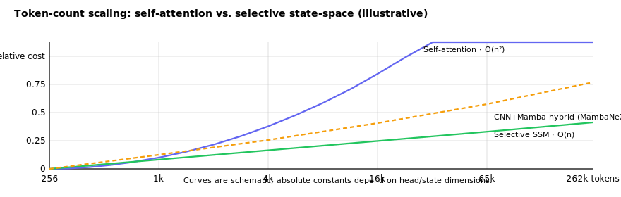
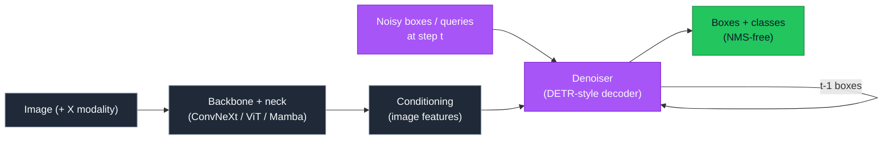
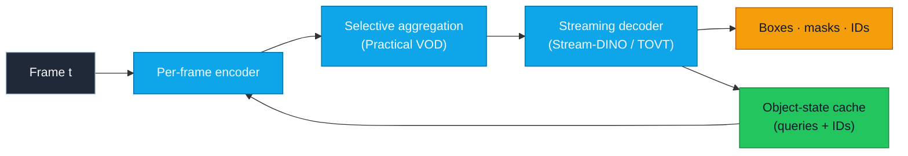
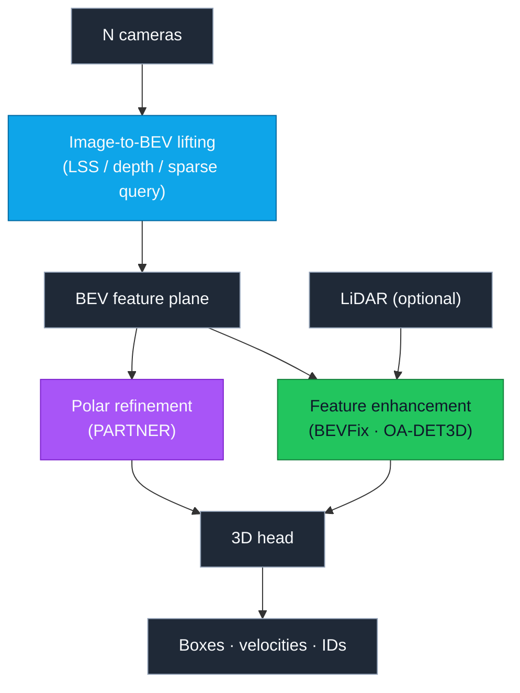
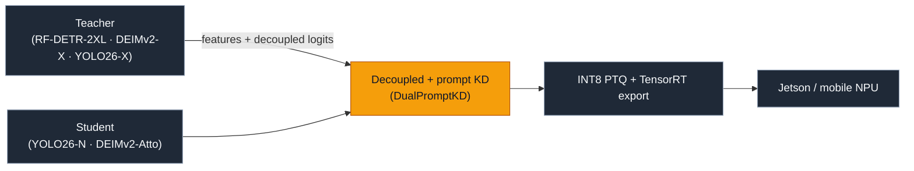

# Dense Object Detection & Classification — Recent Advances

**Report date:** 2026-May-01 (America/Los_Angeles)
**Scope:** Threads that have moved noticeably since the
[2026-Apr-30 report](../2026-Apr-30/2026-Apr-30_CV_updates.md). That
report covered the YOLO26 / RF-DETR / DEIMv2 / DINOv3 / SAM 3 core; this
update zooms in on the *complementary* directions: state-space backbones,
diffusion-based decoders, video/streaming detection, MLLM grounding,
multi-camera 3D, and the empirical fine-tuning leaderboards that are
starting to disagree with COCO-only rankings.

---

## Table of contents

1. [What's new since 2026-Apr-30](#1-whats-new-since-2026-apr-30)
2. [Technique-family timeline](#2-techniquefamily-timeline)
3. [State-space (Mamba) detectors](#3-statespace-mamba-detectors)
4. [Diffusion-based detectors](#4-diffusionbased-detectors)
5. [Video and streaming detection](#5-video-and-streaming-detection)
6. [MLLMs as detection grounders](#6-mllms-as-detection-grounders)
7. [Multi-camera 3D detection](#7-multicamera-3d-detection)
8. [Distillation for deployment](#8-distillation-for-deployment)
9. [Benchmarks: when the leaderboard shifts](#9-benchmarks-when-the-leaderboard-shifts)
10. [Reading list](#10-reading-list)

---

## 1. What's new since 2026-Apr-30

| Thread | Why it matters this week |
|---|---|
| **Mamba/SSM detectors** | MDDCNet and Super-Mamba SOD show that selective state-space backbones are catching attention-based ones at multi-scale and small-object work without the O(n²) memory hit. |
| **Diffusion decoders** | DiffuDETR (ICLR 2026) reframes DETR's query-init problem as conditional denoising; RGBX-DiffusionDet pushes the same idea into RGB+thermal/depth fusion. |
| **Streaming video** | Stream-DINO and the AAAI 2026 TOVT paper put DETR-style detectors on a *constant-time-per-frame* footing; Practical VOD frames feature aggregation as selection rather than fusion. |
| **MLLM grounding** | New evaluation suites (VS-Bench, Look&Learn) show that VLMs still trail bespoke detectors on small-object/occluded grounding — the production pattern is now "MLLM proposes, detector localises." |
| **Multi-camera BEV** | BEVFix and PARTNER push single-modal BEV past 68 mAP / 71.9 NDS on nuScenes; CoIn3D revisits configuration-invariance — the underrated bottleneck for fleet deployment. |
| **Distillation surveys** | The Sensors 2026 survey and DualPromptKD make a case that prompt-conditioned distillation is the new default for tiny edge detectors. |

---

## 2. Technique-family timeline

The figure below tracks four threads that the Apr 30 report only mentioned
in passing. Stroke and label colors use `currentColor`, so the figure
inverts cleanly on light or dark backgrounds.

---

## 3. State-space (Mamba) detectors

### 3.1 Why this thread woke up

Selective state-space models replace the quadratic self-attention block
with a per-token recurrence whose hidden state is gated by the input.
The result is **O(n) compute and memory** with long-range receptive
fields — exactly what dense detectors need on high-resolution feeds.
The illustrative cost curves below capture the qualitative gap; in
practice, hybrid CNN+Mamba stacks (the MambaNeXt-YOLO recipe) sit
between the two extremes.

### 3.2 Models worth tracking

- **Mamba-YOLO** ([AAAI 2025 / arXiv 2406.05835](https://arxiv.org/abs/2406.05835)) — the
  simplest SSM-based detector baseline; trains from scratch without
  pre-training and matches comparable-size YOLOv8 variants on COCO.
- **MambaNeXt-YOLO** ([arXiv 2506.03654](https://arxiv.org/pdf/2506.03654)) — CNN+Mamba
  hybrid backbone, **Multi-Asymmetric Fusion Pyramid Network (MAFPN)**
  neck, and a three-resolution lightweight head. Real-time on Jetson
  Orin without TensorRT-specific surgery.
- **MDDCNet** ([arXiv 2604.08038](https://arxiv.org/abs/2604.08038)) — interleaves
  Multi-Scale Deformable Dilated Convolutions with Mamba blocks; the
  resulting hierarchy beats plain SSM detectors on traffic small-object
  benchmarks where receptive-field shape matters as much as length.
- **Super-Mamba SOD** ([Sci. Reports 2025](https://www.nature.com/articles/s41598-025-21837-2))
  — a feature-enhancement framework for small-object detection,
  notable for showing that Mamba can be *added* to existing CNN
  detectors rather than replacing them wholesale.
- **MambaOVD** ([Sci. Reports 2025](https://www.nature.com/articles/s41598-025-18769-2))
  — open-vocabulary detection with a Mamba image–text fusion module;
  closes the gap with attention-based OV-DETRs at lower memory.

### 3.3 What the 2026 lineup tells us

- The "drop attention entirely" experiments (Mamba-YOLO) plateau on
  COCO; the strongest 2026 entries (MDDCNet, MambaNeXt-YOLO) keep
  convolutions in the early stages and use Mamba for global context.
- Mamba helps most where attention's cost dominates: high-resolution
  aerial/medical inputs and long video sequences (see
  [§5](#5-video-and-streaming-detection)).

---

## 4. Diffusion-based detectors

DiffusionDet (ICCV 2023) framed detection as iterative denoising of
noise-corrupted boxes. The 2024–2026 successors are now mature enough
for production work:

- **DPM-Det** ([Springer / MMM 2024](https://link.springer.com/chapter/10.1007/978-3-031-53308-2_28))
  swaps DiffusionDet's DDIM sampler for **DPM-Solver++**, cutting
  inference steps roughly 4× while improving AP — the same trick that
  unlocked single-step Stable Diffusion variants.
- **Guided DiffusionDet** ([Springer 2025](https://link.springer.com/chapter/10.1007/978-981-96-6594-5_10))
  introduces a *guided diffusion step* and a flexible *resample
  mechanism*, letting the decoder denoise from candidate boxes with
  variable noise levels — useful when seeding with a fast detector's
  proposals.
- **DiffuDETR** ([OpenReview, ICLR 2026](https://openreview.net/forum?id=nkp4LdWDOr))
  formulates *object query generation* as conditional denoising on
  noisy reference points. This is the most consequential variant of
  the year because it fuses DiffusionDet's iterative refinement with
  DETR's NMS-free output graph.
- **RGBX-DiffusionDet** ([Pattern Recognition 2026](https://www.sciencedirect.com/science/article/pii/S0031320325011239))
  extends the approach to RGB+X (thermal, depth, polarisation) fusion;
  particularly relevant for ADAS and industrial inspection where the
  auxiliary modality is sparse and noisy.

The trade-off vs. RF-DETR / DEIMv2: diffusion decoders win when you
need **distribution-aware uncertainty** (medical, defect inspection)
or when the input channel set is heterogeneous; they lose on raw
COCO latency.

---

## 5. Video and streaming detection

Two questions are driving 2026 work in this space: *can DETR run
online?* and *can we share computation across frames without losing
small objects?*

- **Stream-DINO** ([Applied Intelligence 2026](https://link.springer.com/article/10.1007/s10489-026-07139-8))
  — DETR with a streaming-perception head and per-frame query memory.
  Beats prior transformer-based online detectors on Argoverse-HD and
  is the first DETR variant tuned for **constant per-frame latency**.
- **TOVT (AAAI 2026)** ([arXiv 2511.13784](https://arxiv.org/pdf/2511.13784)) —
  Temporal Object-aware Vision Transformer for *few-shot* video
  detection; a confidence-gated propagation kernel keeps high-quality
  features across frames and suppresses drift through occlusion.
- **Practical VOD via Feature Selection and Aggregation**
  ([IJCV 2025](https://link.springer.com/article/10.1007/s11263-025-02700-3))
  — argues that aggregation should be *selective*: pick a small set of
  reference frames per query frame instead of fusing the whole window.
  Recovers most of the accuracy of dense aggregation at a fraction of
  the cost, and the recipe ports cleanly to YOLO and DETR variants.
- **Real-time streaming smoothing transformers** (foundational
  reference, [ECCV 2022](https://www.ecva.net/papers/eccv_2022/papers_ECCV/papers/136940478.pdf))
  — the temporal-smoothing-kernel reformulation of cross-attention is
  reused by most 2026 streaming detectors; worth re-reading if you
  haven't.

---

## 6. MLLMs as detection grounders

Multimodal LLMs unlocked open-ended grounding (Kosmos-2, GLaMM,
LLaVA-Grounding), but the 2026 evaluation work is more sober than
the 2024–2025 hype.

### 6.1 What the new benchmarks say

- The [LVLM detection survey (2026)](https://www.sciencedirect.com/science/article/pii/S1566253525006475)
  finds that current LVLMs *prioritise semantic comprehension over
  fine-grained localisation* — a gap that traditional detectors (and
  hybrid pipelines) still close.
- [**Look&Learn**](https://openreview.net/forum?id=NKa11pYuWp) and the
  [2025 visual-grounding study](https://arxiv.org/html/2509.10345v1)
  show that VLMs frequently report the *correct concept* while
  pointing at the wrong region.
- [**VS-Bench**](https://arxiv.org/html/2506.02387) measures perception
  / strategic-reasoning / decision separately; perception is the
  weakest leg even for frontier VLMs.
- In crowded scenes specifically,
  [Robust Grounding with MLLMs](https://arxiv.org/abs/2604.24036)
  documents persistent failures on occlusion and small objects, and
  proposes a language-guided semantic-cue prompt to mitigate them.

### 6.2 New domain-specialised MLLMs

- [**MedMO**](https://arxiv.org/html/2602.06965v1) — medical-image
  MLLM trained on **26M multimodal samples from 45 datasets**; the
  first system to combine clinical question answering with bounding-box
  grounding in a single decoder.
- [**MAPG**](https://arxiv.org/abs/2603.19166) — Multi-Agent
  Probabilistic Grounding decomposes a language query into structured
  sub-queries, asks a VLM to ground each independently, and composes
  the results probabilistically. Useful when a single forward pass
  can't disambiguate "the red cup *behind* the laptop."

### 6.3 Production pattern

The default 2026 stack for open-vocabulary, small-object work is now
a two-stage pipeline: **MLLM proposes, detector localises.** The MLLM
emits a region of interest plus a class hypothesis; a fine-tuned
detector (RF-DETR or DEIMv2) returns the precise box/mask. This is
faster than running the MLLM at native resolution and recovers the
small-object accuracy MLLMs lose to patch tokenisation.

---

## 7. Multi-camera 3D detection

The Apr 30 report covered BEVFormer / RetentiveBEV / DMFormer /
BEVENet. The 2026 additions worth knowing:

- **CAM3DNet** ([arXiv 2604.17024](https://arxiv.org/html/2604.17024)) —
  sparse-query 3D detector with **Composite Query (CQ)**, **Adaptive
  Self-Attention (ASA)**, and **Multi-Scale Hybrid Sampling (MSHS)**;
  validated on nuScenes, Waymo *and* Argoverse, which is unusually
  thorough for the cohort.
- **CoIn3D** ([arXiv 2603.05042](https://arxiv.org/html/2603.05042)) —
  *configuration-invariant* multi-camera 3D detection. Targets the
  underrated bottleneck for fleet deployment: extrinsic calibration
  drift and varying camera counts across vehicle generations.
- **PARTNER** ([IJCV 2026](https://link.springer.com/article/10.1007/s11263-026-02735-0))
  — polar-coordinate detector with global representation re-alignment
  and instance-level geometric injection; sits at the top of streaming
  Waymo / nuScenes / ONCE leaderboards.
- **BEVFix** ([Neural Networks 2026](https://www.sciencedirect.com/science/article/abs/pii/S0893608025005556))
  — deep-feature-enhancement BEV head reaching **68 mAP / 71.9 NDS**
  single-modal and **72.3 mAP / 74.1 NDS** with LiDAR fusion on
  nuScenes; one of the highest single-modal scores reported.
- **OA-DET3D** ([IJCV 2025](https://link.springer.com/article/10.1007/s11263-025-02544-x))
  — a plug-in object-awareness module that lifts a range of multi-cam
  detectors by 1–3 NDS at modest compute cost.

---

## 8. Distillation for deployment

The Sensors 2026 survey ([MDPI 2026/26/1/292](https://www.mdpi.com/1424-8220/26/1/292))
is the new reference text for KD on detection. Three threads stand out:

1. **Logit decoupling.** Decoupled KD ([CVPR 2022 / 2024 follow-ups](https://arxiv.org/pdf/2105.10633))
   splits target-class and non-target-class signal so the student
   benefits from class-similarity structure without being dominated
   by the dominant logit.
2. **Prompt-conditioned KD.** [DualPromptKD](https://openreview.net/forum?id=yhKNCvYlCr)
   distils into a *promptable* tiny model; useful when the deployment
   scene shifts between domains and full retraining isn't possible.
3. **Automated distiller search.** **KD-Zero** style approaches
   randomly sample candidate distillers and score them by
   teacher–student gap, with loss-rejection short-circuits to keep
   the search tractable. Removes the hand-tuned distiller as a tax on
   every new architecture.

Practical recipe in 2026:

---

## 9. Benchmarks: when the leaderboard shifts

A subtle but important finding from the
[2026 VisDrone fine-tuning study](https://www.alphaxiv.org/benchmarks/tianjin-university/visdrone)
that ranked RT-DETR, RT-DETRv2, D-FINE, DEIM, DEIMv2, LW-DETR, and
RF-DETR side-by-side: **the COCO ranking does not survive transfer.**

- On VisDrone, **D-FINE-X** (Objects365 → COCO pretrain) topped the
  fine-tuned leaderboard at **31.65 AP**, ahead of RF-DETR-L despite
  RF-DETR's lead on raw COCO.
- This is consistent with RF-DETR's own
  [RF100-VL](https://blog.roboflow.com/best-object-detection-models/)
  story: the model is built for fine-tuning, but the *strongest*
  pre-train initialisation depends on the target domain's class
  distribution and resolution.
- For aerial / drone / dense small-object work, **always** rerun the
  comparison on the target dataset before picking a backbone — and
  keep an LMW-YOLO-style lightweight CNN
  ([Sci. Reports 2026](https://www.nature.com/articles/s41598-026-45055-6))
  in the bake-off if latency is the binding constraint.

---

## 10. Reading list

### State-space (Mamba) detectors
- Mamba-YOLO — [arXiv 2406.05835](https://arxiv.org/abs/2406.05835) ·
  [AAAI 2025](https://ojs.aaai.org/index.php/AAAI/article/view/32885)
- MambaNeXt-YOLO — [arXiv 2506.03654](https://arxiv.org/pdf/2506.03654)
- MDDCNet — [arXiv 2604.08038](https://arxiv.org/abs/2604.08038)
- Super-Mamba SOD — [Sci. Reports 2025](https://www.nature.com/articles/s41598-025-21837-2)
- MambaOVD — [Sci. Reports 2025](https://www.nature.com/articles/s41598-025-18769-2)

### Diffusion-based detectors
- DiffusionDet (origin) — [ICCV 2023](https://openaccess.thecvf.com/content/ICCV2023/papers/Chen_DiffusionDet_Diffusion_Model_for_Object_Detection_ICCV_2023_paper.pdf) ·
  [code](https://github.com/ShoufaChen/DiffusionDet)
- DPM-Det — [Springer 2024](https://link.springer.com/chapter/10.1007/978-3-031-53308-2_28)
- Guided DiffusionDet — [Springer 2025](https://link.springer.com/chapter/10.1007/978-981-96-6594-5_10)
- DiffuDETR — [OpenReview / ICLR 2026](https://openreview.net/forum?id=nkp4LdWDOr)
- RGBX-DiffusionDet — [Pattern Recognition 2026](https://www.sciencedirect.com/science/article/pii/S0031320325011239)

### Video and streaming detection
- Stream-DINO — [Applied Intelligence 2026](https://link.springer.com/article/10.1007/s10489-026-07139-8)
- TOVT (AAAI 2026) — [arXiv 2511.13784](https://arxiv.org/pdf/2511.13784)
- Practical VOD — [IJCV 2025](https://link.springer.com/article/10.1007/s11263-025-02700-3)
- Streaming smoothing transformers — [ECCV 2022](https://www.ecva.net/papers/eccv_2022/papers_ECCV/papers/136940478.pdf)
- TransVOD — [TPAMI / IEEE 2022](https://ieeexplore.ieee.org/document/9960850/) ·
  [code](https://github.com/SJTU-LuHe/TransVOD)

### MLLM grounding
- LVLM detection survey — [Inf. Fusion 2025](https://www.sciencedirect.com/science/article/pii/S1566253525006475)
- Look&Learn — [OpenReview 2026](https://openreview.net/forum?id=NKa11pYuWp)
- Visual grounding in VLMs — [arXiv 2509.10345](https://arxiv.org/html/2509.10345v1)
- VS-Bench — [arXiv 2506.02387](https://arxiv.org/html/2506.02387)
- Robust grounding with MLLMs — [arXiv 2604.24036](https://arxiv.org/abs/2604.24036)
- MedMO — [arXiv 2602.06965](https://arxiv.org/html/2602.06965v1)
- MAPG — [arXiv 2603.19166](https://arxiv.org/abs/2603.19166)
- Kosmos-2 (foundational) — [arXiv 2306.14824](https://arxiv.org/abs/2306.14824)

### Multi-camera 3D detection
- 3D detection comprehensive review — [JKSU-CIS 2025](https://link.springer.com/article/10.1007/s44443-025-00213-0)
- CAM3DNet — [arXiv 2604.17024](https://arxiv.org/html/2604.17024)
- CoIn3D — [arXiv 2603.05042](https://arxiv.org/html/2603.05042)
- PARTNER — [IJCV 2026](https://link.springer.com/article/10.1007/s11263-026-02735-0)
- BEVFix — [Neural Networks 2026](https://www.sciencedirect.com/science/article/abs/pii/S0893608025005556)
- OA-DET3D — [IJCV 2025](https://link.springer.com/article/10.1007/s11263-025-02544-x)
- BEV-fusion sensor survey — [Inf. Fusion 2025](https://www.sciencedirect.com/science/article/abs/pii/S1566253525007250)

### Distillation
- KD survey (CNN → Transformer) — [Sensors 2026](https://www.mdpi.com/1424-8220/26/1/292)
- DualPromptKD — [OpenReview](https://openreview.net/forum?id=yhKNCvYlCr)
- Decoupled KD origin — [arXiv 2105.10633](https://arxiv.org/pdf/2105.10633)
- Task Integration Distillation — [arXiv 2404.01699](https://arxiv.org/pdf/2404.01699)

### Benchmarks and comparative studies
- VisDrone leaderboard (DETR fine-tunes) — [alphaXiv 2026](https://www.alphaxiv.org/benchmarks/tianjin-university/visdrone)
- Best detection models 2026 — [Roboflow blog](https://blog.roboflow.com/best-object-detection-models/)
- LMW-YOLO (lightweight aerial) — [Sci. Reports 2026](https://www.nature.com/articles/s41598-026-45055-6)
- HA-DETR (hybrid CNN/Transformer) — [Sci. Reports 2026](https://www.nature.com/articles/s41598-026-48909-1)
- 2026 model comparison (YOLOv11 vs RT-DETR vs RF-DETR vs SAM3) — [Medium walk-through](https://medium.com/@harianbu14799/choosing-the-right-object-detection-model-in-2026-yolov11-vs-rt-detr-vs-rf-detr-vs-sam3-5be1b7ba7de9)

---

*All numbers are from the linked papers, model cards, and benchmark
tables; expect sub-AP-point revisions as authors push checkpoints.
Where this report contradicts the Apr 30 report, treat the Apr 30
numbers as canonical for the YOLO26 / RF-DETR / DEIMv2 / SAM 3 core
and this report's numbers as canonical for the side threads.*
