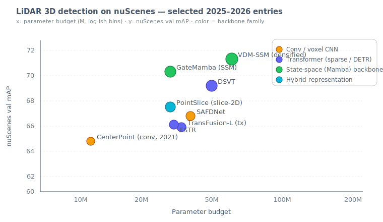
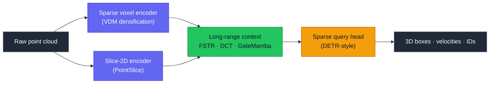
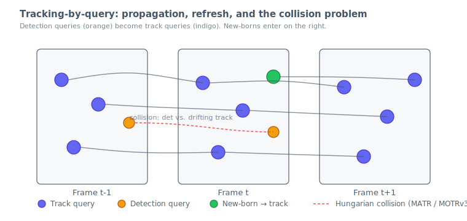
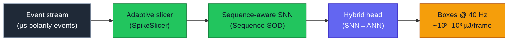
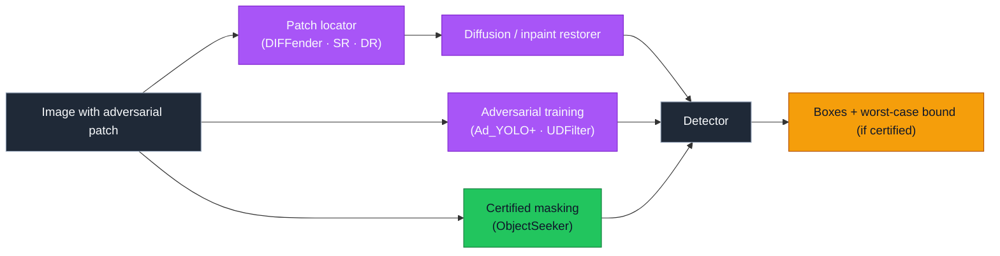
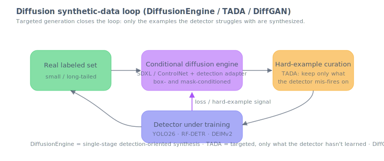

# Dense Object Detection & Classification — Recent Advances

**Report date:** 2026-May-02 (America/Los_Angeles)
**Scope:** Threads that have moved since the
[2026-Apr-30](../2026-Apr-30/2026-Apr-30_CV_updates.md) and
[2026-May-01](../2026-May-01/2026-May-01_CV_updates.md) reports. Apr-30
covered the YOLO26 / RF-DETR / DEIMv2 / DINOv3 / SAM 3 core; May-01
covered Mamba/SSM, diffusion decoders, streaming video, MLLM grounding,
multi-camera 3D BEV, and distillation. This report rotates to the
*orthogonal* threads — LiDAR point clouds, end-to-end multi-object
tracking, event-based detection, adversarial robustness, diffusion-based
synthetic data, calibration, and few-shot foundation-model detection.

---

## Table of contents

1. [What's new since 2026-May-01](#1-whats-new-since-2026-may-01)
2. [LiDAR point-cloud 3D detection](#2-lidar-pointcloud-3d-detection)
3. [End-to-end multi-object tracking](#3-endtoend-multiobject-tracking)
4. [Event-based & spiking detectors](#4-eventbased--spiking-detectors)
5. [Adversarial robustness for dense detection](#5-adversarial-robustness-for-dense-detection)
6. [Diffusion-driven synthetic data](#6-diffusiondriven-synthetic-data)
7. [Calibration & uncertainty](#7-calibration--uncertainty)
8. [Few-shot detection with foundation models](#8-fewshot-detection-with-foundation-models)
9. [Reading list](#9-reading-list)

---

## 1. What's new since 2026-May-01

| Thread | Why it matters this week |
|---|---|
| **LiDAR point-cloud 3D** | PointSlice (66.7 mAP) and GateMamba / VDM-SSM push single-modal LiDAR past 70 mAP on nuScenes — the first SSM backbone at the top of the LiDAR table, complementing the multi-camera BEV story. |
| **End-to-end MOT** | MOTRv3, LA-MOTR (ICCV 2025), MATR, and DecoderTracker / FixDT all attack the *query-collision* problem in tracking-by-query — the bottleneck inherited from MOTR. |
| **Event / spiking** | Sequence-SOD and SpikeSlicer give event-camera detection a sequence-aware SNN backbone running at 40 Hz on embedded silicon — a credible low-power complement to YOLO26-N. |
| **Adversarial robustness** | DIFFender, Ad_YOLO+, and the [unified patch-defense benchmark](https://arxiv.org/html/2508.00649v2) show patch defenses still leave a 15-pt AP@0.5 headroom; certified detectors (ObjectSeeker) remain the only formal guarantee. |
| **Synthetic data** | DiffusionEngine, TADA, and DiffGAN make diffusion-based augmentation a default for detection — the targeted variant (TADA) reverses the "more synthetic data is always better" story. |
| **Calibration** | Laplace-approximation 3D detectors and the global/local-calibration framework give a principled story for uncertainty in safety-critical deployments. |
| **Few-shot FSOD** | FSOD-VFM (DINOv2 + SAM 2 + graph diffusion), VLM zero-shot baselines that beat 33-AP FSOD methods, and the NTIRE 2026 CD-FSOD challenge define the new benchmark surface. |

---

## 2. LiDAR point-cloud 3D detection

The May-01 report covered *multi-camera* BEV detectors (BEVFix, PARTNER,
CoIn3D). The LiDAR table moved separately, and the 2025–2026 entries are
worth ranking because three different representational families now
trade blows at the top.



### 2.1 Sparse-transformer trunk

- **FSTR** ([IEEE TGRS 2023 / TGRS 10302363](https://ieeexplore.ieee.org/document/10302363/),
  [code](https://github.com/Poley97/FSTR)) — Fully Sparse Transformer
  3-D Detector. Sparse-voxel tokens with dynamic queries seeded from
  foreground priors; still the cleanest baseline for sparse DETR-style
  LiDAR detection.
- **Dynamic Cluster Transformer (DCT)**
  ([Pattern Recognition 2025](https://www.sciencedirect.com/science/article/abs/pii/S0031320325011069))
  — Sparse Cluster Generation + Cluster Feature Interaction; SOTA on
  Waymo and nuScenes for cluster-aware LiDAR detection.
- **PointViT** ([arXiv 2602.06406](https://arxiv.org/html/2602.06406))
  — Point Virtual Transformer, Feb 2026. Reasons jointly over raw
  LiDAR and *virtual* LiDAR points densified from camera depth, with
  multiple early/BEV-gated fusion strategies. Closes the long-tail
  far-field gap that has plagued sparse trunks since DETR3D.

### 2.2 Slice and densification representations

- **PointSlice** ([Pattern Recognition 2026](https://www.sciencedirect.com/science/article/abs/pii/S0031320326004152),
  [arXiv 2509.01487](https://arxiv.org/abs/2509.01487)) — converts a
  point cloud into multiple 2D slices and detects in 2D per slice.
  **66.74 mAP on nuScenes**, **0.79× the parameters and 1.13× the
  speed** of SAFDNet on Waymo.
- **VDM (Voxel Densification)** ([arXiv 2508.16069](https://arxiv.org/html/2508.16069))
  — pre-serialization expansion of sparse voxels; plug-and-play across
  Waymo, nuScenes, Argoverse 2, and ONCE. Reaches **70.5 mAP nuScenes**
  / **74.8 L2 mAPH on Waymo** when paired with an SSM trunk.

### 2.3 State-space (Mamba) trunks

- **GateMamba** ([ISPRS J. Photogramm. & RS 2026](https://www.sciencedirect.com/science/article/abs/pii/S0924271626001917))
  — feature-gated mixer in a state-space model for point-cloud
  detection. SOTA on multiple benchmarks; especially strong on
  small/distant targets where attention's quadratic cost would
  otherwise force voxel-size compromises.
- The trend mirrors the May-01 imaging-Mamba story: hybrids (CNN early,
  SSM/Mamba global, sparse query head) dominate full-Mamba rebuilds.



### 2.4 Picks for production

- **Latency-bound autonomy:** PointSlice — best param/speed/mAP triangle.
- **Maximum mAP on a single LiDAR:** VDM-SSM trunk + sparse-query head.
- **Far-field / sparse returns:** PointViT or GateMamba.
- **For benchmarking / training infrastructure**, OpenPCDet remains the
  default toolkit ([open-mmlab/OpenPCDet](https://github.com/open-mmlab/OpenPCDet)).

---

## 3. End-to-end multi-object tracking

MOTR's tracking-by-query (TBQ) paradigm is now the dominant template,
but the 2025–2026 work has converged on a single antagonist: the
*detection–track query collision*. When detection queries are reassigned
each frame via Hungarian matching while track queries must follow the
same identity, a drifting track query gets re-bound to the wrong object
and the tracker silently breaks.



### 3.1 What changed

- **MOTRv3** ([OpenReview](https://openreview.net/forum?id=ezPbPoYFME),
  [arXiv 2305.14298](https://arxiv.org/abs/2305.14298)) — *release-fetch*
  supervision: labels are first released for detection, then gradually
  fetched back for association. Adds pseudo-label distillation and
  track-group denoising. Surpasses MeMOTR across all metrics on diverse
  benchmarks **without an extra detector at inference**.
- **LA-MOTR** ([ICCV 2025](https://openaccess.thecvf.com/content/ICCV2025/papers/Wang_LA-MOTR_End-to-End_Multi-Object_Tracking_by_Learnable_Association_ICCV_2025_paper.pdf))
  — Learnable Association decouples detection and association into
  separate decoder branches and learns the association policy directly,
  avoiding the heuristic match between TBQ and Hungarian assignment.
- **MATR (Motion-Aware Transformer)**
  ([arXiv 2509.21715](https://arxiv.org/html/2509.21715v3)) — explicitly
  predicts inter-frame motion to *advance* track queries before the
  detection–track Hungarian step. Reduces collisions and stabilises
  both detection and association.
- **DecoderTracker / FixDT**
  ([Pattern Recognition 2026](https://www.sciencedirect.com/science/article/abs/pii/S0031320326002074))
  — decoder-only end-to-end MOT. Drops the encoder entirely between
  frames, leaning on a per-frame backbone and a temporally-aware
  decoder. Cuts training time and inference cost without losing
  HOTA on MOT17/20.
- **Tracking-by-Detection-and-Query**
  ([arXiv 2411.06197](https://arxiv.org/html/2411.06197v1)) — argues for
  fusing the strengths of TBD (decoupled identity head) with TBQ
  (end-to-end optimisation), framing the union as the new default.

### 3.2 What still hurts

- TBQ trackers remain *fragile* on small objects and short re-entries;
  the [two-stage hybrid](https://www.nature.com/articles/s41598-025-16389-4)
  recipe still wins on MOT20 and DanceTrack when occlusions are dense.
- For panoramic or fisheye footage, anchor-based-query trackers
  ([Sensors 2024 / 24/1/229](https://www.mdpi.com/1424-8220/24/1/229))
  remain competitive; pure DETR queries do not yet generalise across
  the projection.

---

## 4. Event-based & spiking detectors

Event cameras report asynchronous brightness changes at ~µs latency.
Pairing them with spiking neural networks (SNNs) yields a sub-watt
detection stack that does not require dense per-frame inference — useful
where the YOLO26-N / DEIMv2-Atto envelope is still too power-hungry.

- **Sequence-SOD** ([OpenReview](https://openreview.net/forum?id=CLZ4mgMdTz))
  — first sequence-aware SNN for event-camera detection; processes
  long event-stream contexts and predicts boxes at **40 Hz**, with
  multi-event temporal pooling instead of frame conversion.
- **SpikeSlicer** ([OpenReview](https://openreview.net/forum?id=CcNw4mVIxo))
  — adaptive event-stream slicer driven by a low-energy SNN. The slice
  policy is itself a tiny SNN trained to maximise downstream detection
  AP, replacing fixed time-window heuristics.
- **Event-guided detection under spiking transmission**
  ([KBS 2025](https://www.sciencedirect.com/science/article/abs/pii/S0950705125018143))
  — uses event evidence as a spike-driven attention mask over a
  conventional frame detector; clear win when the frame stream is
  motion-blurred or low-light.
- **Hybrid SNN-ANN backbones**
  ([IEEE 2025 / 11094495](https://ieeexplore.ieee.org/document/11094495/))
  — early SNN encoder + late ANN head; recovers most of the SNN
  energy benefit while keeping detection AP within 1 mAP of the dense
  baseline.
- **Embedded SNN detector** ([arXiv 2406.17617](https://arxiv.org/abs/2406.17617))
  — 1.08 M parameters, **490 mJ per prediction** on automotive
  event-camera streams; one of the first credible numbers for
  *embedded* event-based detection.

For background and dataset coverage, the
[2025 oejournal review](https://www.oejournal.org/ioe/article/doi/10.29026/ioe.2025.250007)
and the
[2024 SNN-detection review](https://arxiv.org/html/2411.17006v1)
remain the canonical entry points.



---

## 5. Adversarial robustness for dense detection

Localized adversarial *patch* attacks remain the practical threat
model for cameras in the wild. The 2025–2026 defenses cluster into
three categories.

### 5.1 Detect-and-restore

- **DIFFender** — text-guided diffusion locator and inpainting restorer;
  the locator finds the patch region, the diffusion model resamples a
  plausible content, and the detector runs as normal. Strong against
  scale-, position-, and orientation-varying patches that defeated
  Segment-and-Complete.
- **Segment and Recover (SR)** ([J. Imaging 2025/9/316](https://www.mdpi.com/2313-433X/11/9/316))
  — segmentation-driven localisation; faster than DIFFender and
  competitive on dynamic scenes.
- **Detect–and-Restore (DR)** ([arXiv 2403.12988](https://arxiv.org/html/2403.12988))
  — detect patches, then *restore* detector confidence in the original
  prediction by undoing the patch's logit shift; cheap inference path.

### 5.2 Adversarial training and patch-aware detectors

- **Ad_YOLO+** — extends YOLOv5x with a dedicated patch-detection
  branch trained on a curated patch dataset; learns to flag both the
  patch and the overlaid object simultaneously.
- **UDFilter (Universal Defense Filter)**
  ([Computers & Security 2024](https://www.sciencedirect.com/science/article/abs/pii/S0167404824003717))
  — overlays a learned, image-size defense filter via self-adaptive
  iterative competition with the patch generator; protocol-agnostic.

### 5.3 Certified defenses

- **ObjectSeeker** ([arXiv 2202.01811](https://ar5iv.labs.arxiv.org/html/2202.01811))
  — patch-agnostic masking with formal certificates against patch-hiding
  attacks; the only family with formal guarantees, and still the
  reference for safety-critical deployments where worst-case bounds
  matter more than empirical AP.

### 5.4 The benchmark gap

The
[unified patch-defense evaluation (arXiv 2508.00649)](https://arxiv.org/html/2508.00649v2)
finds that, with a large-scale, diverse-patch dataset, existing defenses
still leave **+15.09 AP@0.5** on the table — and that defense quality
correlates more tightly with attacked-object AP than with the
"detection-success" metric most papers report. The community-level
[adv-patch reading list](https://github.com/inspire-group/adv-patch-paper-list)
is a useful index of the surface.



---

## 6. Diffusion-driven synthetic data

Diffusion models stopped being a side project and became the default
augmentation pipeline for detection in 2026. The interesting question
has shifted from *can we generate plausible images?* to *which examples
are worth generating, and when do extra synthetics start hurting?*



### 6.1 Engines

- **DiffusionEngine** ([Pattern Recognition 2025/2026](https://www.sciencedirect.com/science/article/abs/pii/S0031320325008015))
  — single-stage detection-oriented synthetic-data generator: pre-trained
  diffusion + a Detection-Adapter that conditions on category and box
  layout. Drops cleanly into existing YOLO / DETR fine-tuning pipelines.
- **Controllable diffusion for detection** ([Amazon Science / IEEE WACV 2024](https://www.amazon.science/publications/data-augmentation-for-object-detection-via-controllable-diffusion-models))
  — layout-conditioned generation with category-balanced prompts; the
  recipe most often reused by domain-specific augmentation work.
- **DiffGAN** ([Springer 2025/MMM-style](https://link.springer.com/chapter/10.1007/978-981-96-6688-1_5))
  — diffusion + GAN hybrid; reports **+13.9% to +16.1% mAP@0.5** vs.
  classic augmentation on small-data detection benchmarks.

### 6.2 Targeted / curated synthesis

- **TADA** ([arXiv 2505.21574](https://arxiv.org/abs/2505.21574)) —
  TArgeted Diffusion Augmentation. Synthesises only the examples the
  detector has *not yet learned* by mid-training, using faithful
  variations that preserve semantics. The most consequential finding
  is that **untargeted bulk synthesis often plateaus or hurts** —
  curation is the policy.
- **Multi-Perspective Augmentation for FSOD**
  ([OpenReview](https://openreview.net/forum?id=qG0WCAhZE0)) — prompts
  the diffusion model from multiple viewpoints of the same instance
  to break the few-shot detector's pose-overfitting habit.
- **Forestry low-data study** ([Forests 2026](https://www.mdpi.com/1999-4907/17/3/302))
  — segmentation-guided inpainting + Unreal Engine 5 simulator;
  reaches **mAP50 ≈ 0.647 / mAP50-95 ≈ 0.435** on a real test set
  with substantially reduced cross-fold variance — a useful concrete
  recipe for industrial low-data domains.

### 6.3 Caveats and the meta-survey

The 2025 survey
[*Advances in diffusion models for image data augmentation*](https://link.springer.com/article/10.1007/s10462-025-11116-x)
documents three repeatable failure modes: distribution drift when the
prompt set is too narrow, label leakage when the box-mask conditioning
is too loose, and **diffusion-induced shortcuts** the detector picks up
and then can't generalise from. Targeted curation (TADA) and
inpainting-only synthesis (forestry recipe) are the practical mitigations.

---

## 7. Calibration & uncertainty

Detection probabilities are well-known to be poorly calibrated — but
the 2026 work has finally produced metrics and methods that can be
audited under safety regimes (UN R155, ISO/PAS 8800).

- **Global vs. local calibration framework** ([arXiv 2309.00464](https://arxiv.org/abs/2309.00464),
  [IJCV 2024](https://link.springer.com/article/10.1007/s11263-024-02219-z))
  — the now-standard distinction. *Global* calibration audits the
  detector overall; *local* calibration measures it conditioned on
  spatial position, scale, or class. Most pretrained detectors fail
  the local test.
- **Laplace approximation for 3D**
  ([OpenReview](https://openreview.net/forum?id=u4QXJbcvx8u)) — converts
  a deterministic 3D LiDAR detector into a Bayesian net post-hoc and
  recovers epistemic uncertainty without retraining. Pairs naturally
  with §2 LiDAR work for autonomy stacks.
- **Camouflaged object detection uncertainty** ([IEEE TPAMI 10159663](https://ieeexplore.ieee.org/document/10159663/))
  — predictive-uncertainty head jointly trained with the detector;
  the camouflaged-COD setting is harsh enough that uncertainty
  estimates have to be useful to be defensible.
- **Decomposition** — explicit splitting of regression and
  classification uncertainties into epistemic (model-side, reducible)
  and aleatoric (data-side, irreducible) is now the default reporting
  shape; see the 2024 reliability index by
  [Niko Sünderhauf](https://nikosuenderhauf.github.io/projects/uncertainty/).

Practical pattern in 2026 is to ship a detector with a **calibration
post-net** trained on a held-out set, plus a Laplace head when the
deployment is safety-critical. Temperature scaling alone is no longer
sufficient — local calibration audits will catch it.

---

## 8. Few-shot detection with foundation models

Few-shot object detection (FSOD) used to be a niche track. Foundation
models — DINOv2/3, SAM 2/3, GroundingDINO, LLaVA-style VLMs — turned it
into a benchmark for *how good are your pre-trained features?* The
production answer in 2026 is: very good, often better than fine-tuned
FSOD methods.

### 8.1 The VLM-zero-shot baseline

[*Revisiting Few-Shot Object Detection with Vision-Language Models*](https://proceedings.neurips.cc/paper_files/paper/2024/file/22b2067b8f680812624032025864c5a1-Paper-Datasets_and_Benchmarks_Track.pdf)
showed that GroundingDINO's zero-shot predictions reach **48 AP** on
COCO — beating SOTA few-shot detectors at **33 AP**. The reading is
simple: if your novel classes are nameable in natural language, *do
not* train a few-shot head; ground them with a VLM and fine-tune only
when domain shift is severe.

### 8.2 FSOD-VFM (DINOv2 + SAM 2 + graph diffusion)

[FSOD-VFM](https://openreview.net/forum?id=jHlAq2rYUw)
([arXiv 2602.03137](https://arxiv.org/abs/2602.03137)) is the
strongest 2026 entry that *isn't* a pure VLM call:

- A **Universal Proposal Network (UPN)** generates category-agnostic
  proposals.
- **SAM 2** refines proposal masks for better localisation.
- **DINOv2 features** drive a graph-diffusion classifier over the
  candidate boxes — the diffusion step propagates the few-shot label
  signal across structurally similar instances in a single image.

The recipe is the new template for *cold-start* detection where a
class isn't easily nameable but is visually consistent (industrial
defect inspection, biological micrography).

### 8.3 NTIRE 2026 CD-FSOD challenge

The second [Cross-Domain Few-Shot Object Detection challenge at NTIRE
2026](https://arxiv.org/html/2604.11998v1) formalised the *robustness
under shift* axis:

- The benchmark covers 8 target domains spanning satellite, medical,
  underwater, and stylised art imagery.
- Top entries combine VLM-zero-shot proposals with FSOD-VFM-style
  graph refinement and **per-domain prompt tuning** rather than full
  fine-tuning.
- The takeaway echoes May-01's VisDrone leaderboard finding: COCO
  rankings do not transfer; always rerun on your domain.

```mermaid
flowchart LR
  classDef in    fill:#1f2937,stroke:#94a3b8,color:#f8fafc;
  classDef vlm   fill:#6366f1,stroke:#4338ca,color:#f8fafc;
  classDef vfm   fill:#22c55e,stroke:#15803d,color:#0f172a;
  classDef ref   fill:#a855f7,stroke:#7e22ce,color:#f8fafc;
  classDef out   fill:#f59e0b,stroke:#b45309,color:#0f172a;

  IMG["Image"]:::in --> ROUTE{"Class<br/>nameable?"}
  ROUTE -->|yes| VLM["GroundingDINO / SAM 3<br/>zero-shot grounding"]:::vlm
  ROUTE -->|no|  UPN["UPN proposals"]:::vfm
  UPN --> SAM2["SAM 2 mask refinement"]:::vfm
  SAM2 --> DINO["DINOv2 features"]:::vfm
  DINO --> GD["Graph diffusion classifier<br/>(FSOD-VFM)"]:::ref
  VLM --> FT["Optional prompt fine-tune<br/>(per-domain, low-rank)"]:::ref
  GD  --> OUT["Boxes + classes (few-shot)"]:::out
  FT  --> OUT
```

---

## 9. Reading list

### LiDAR point-cloud 3D detection

- PointSlice — [arXiv 2509.01487](https://arxiv.org/abs/2509.01487) ·
  [Pattern Recognition 2026](https://www.sciencedirect.com/science/article/abs/pii/S0031320326004152)
- VDM (Voxel Densification) — [arXiv 2508.16069](https://arxiv.org/html/2508.16069)
- GateMamba — [ISPRS J. Photogramm. & RS 2026](https://www.sciencedirect.com/science/article/abs/pii/S0924271626001917)
- FSTR — [IEEE TGRS 2023](https://ieeexplore.ieee.org/document/10302363/) ·
  [code](https://github.com/Poley97/FSTR)
- Dynamic Cluster Transformer — [Pattern Recognition 2025](https://www.sciencedirect.com/science/article/abs/pii/S0031320325011069)
- PointViT — [arXiv 2602.06406](https://arxiv.org/html/2602.06406)
- 3D detection comprehensive review — [JKSU-CIS 2025](https://link.springer.com/article/10.1007/s44443-025-00213-0)
- OpenPCDet toolkit — [GitHub](https://github.com/open-mmlab/OpenPCDet)

### End-to-end multi-object tracking

- MOTRv3 — [OpenReview](https://openreview.net/forum?id=ezPbPoYFME) ·
  [arXiv 2305.14298](https://arxiv.org/abs/2305.14298)
- LA-MOTR — [ICCV 2025](https://openaccess.thecvf.com/content/ICCV2025/papers/Wang_LA-MOTR_End-to-End_Multi-Object_Tracking_by_Learnable_Association_ICCV_2025_paper.pdf)
- MATR (Motion-Aware Transformer) — [arXiv 2509.21715](https://arxiv.org/html/2509.21715v3)
- DecoderTracker / FixDT — [Pattern Recognition 2026](https://www.sciencedirect.com/science/article/abs/pii/S0031320326002074)
- Tracking-by-Detection-and-Query — [arXiv 2411.06197](https://arxiv.org/html/2411.06197v1)
- Two-stage hybrid MOT — [Sci. Reports 2025](https://www.nature.com/articles/s41598-025-16389-4)
- Anchor-based-query MOT — [Sensors 2024](https://www.mdpi.com/1424-8220/24/1/229)
- TrackFormer (foundational) — [CVPR 2022](https://openaccess.thecvf.com/content/CVPR2022/papers/Meinhardt_TrackFormer_Multi-Object_Tracking_With_Transformers_CVPR_2022_paper.pdf)
- MOTR (foundational) — [arXiv 2105.03247](https://arxiv.org/abs/2105.03247) ·
  [code](https://github.com/megvii-research/MOTR)

### Event-based & spiking detection

- Sequence-SOD — [OpenReview](https://openreview.net/forum?id=CLZ4mgMdTz)
- SpikeSlicer — [OpenReview](https://openreview.net/forum?id=CcNw4mVIxo)
- Event-guided spiking transmission — [KBS 2025](https://www.sciencedirect.com/science/article/abs/pii/S0950705125018143)
- Hybrid SNN-ANN — [IEEE 11094495](https://ieeexplore.ieee.org/document/11094495/)
- Embedded SNN detector — [arXiv 2406.17617](https://arxiv.org/abs/2406.17617)
- 2024 SNN object-detection review — [arXiv 2411.17006](https://arxiv.org/html/2411.17006v1)
- 2025 SNN segmentation/detection review — [oejournal](https://www.oejournal.org/ioe/article/doi/10.29026/ioe.2025.250007)

### Adversarial robustness

- DIFFender / Segment-and-Recover — [J. Imaging 2025](https://www.mdpi.com/2313-433X/11/9/316)
- Detect-and-Restore — [arXiv 2403.12988](https://arxiv.org/html/2403.12988)
- Ad_YOLO+ patch-aware detector — [MDPI](https://www.mdpi.com/2673-4052/6/3/44)
- UDFilter — [Computers & Security 2024](https://www.sciencedirect.com/science/article/abs/pii/S0167404824003717)
- ObjectSeeker (certified) — [arXiv 2202.01811](https://ar5iv.labs.arxiv.org/html/2202.01811)
- Unified patch-defense benchmark — [arXiv 2508.00649](https://arxiv.org/html/2508.00649v2)
- Patch-defense paper list — [GitHub](https://github.com/inspire-group/adv-patch-paper-list)
- UAV patch defense — [arXiv 2405.19179](https://arxiv.org/html/2405.19179)

### Synthetic data & augmentation

- DiffusionEngine — [Pattern Recognition 2026](https://www.sciencedirect.com/science/article/abs/pii/S0031320325008015)
- Controllable diffusion for detection — [Amazon Science / WACV 2024](https://www.amazon.science/publications/data-augmentation-for-object-detection-via-controllable-diffusion-models)
- TADA (targeted augmentation) — [arXiv 2505.21574](https://arxiv.org/abs/2505.21574)
- Multi-perspective FSOD augmentation — [OpenReview](https://openreview.net/forum?id=qG0WCAhZE0)
- DiffGAN — [Springer 2025](https://link.springer.com/chapter/10.1007/978-981-96-6688-1_5)
- Forestry low-data study — [Forests 2026](https://www.mdpi.com/1999-4907/17/3/302)
- Diffusion augmentation survey — [AI Review 2025](https://link.springer.com/article/10.1007/s10462-025-11116-x)

### Calibration & uncertainty

- Theoretical & practical framework — [arXiv 2309.00464](https://arxiv.org/abs/2309.00464)
- Pretrained-detector calibration review — [IJCV 2024](https://link.springer.com/article/10.1007/s11263-024-02219-z)
- Laplace 3D detection — [OpenReview](https://openreview.net/forum?id=u4QXJbcvx8u)
- Predictive uncertainty for COD — [IEEE TPAMI 10159663](https://ieeexplore.ieee.org/document/10159663/)
- Reliability resource — [Sünderhauf project page](https://nikosuenderhauf.github.io/projects/uncertainty/)

### Few-shot / foundation-model FSOD

- VLM-zero-shot FSOD — [NeurIPS 2024 D&B](https://proceedings.neurips.cc/paper_files/paper/2024/file/22b2067b8f680812624032025864c5a1-Paper-Datasets_and_Benchmarks_Track.pdf) ·
  [code](https://github.com/anishmadan23/foundational_fsod)
- FSOD-VFM — [OpenReview](https://openreview.net/forum?id=jHlAq2rYUw) ·
  [arXiv 2602.03137](https://arxiv.org/abs/2602.03137)
- FSOD with foundation models (CVPR 2024) — [paper](https://openaccess.thecvf.com/content/CVPR2024/papers/Han_Few-Shot_Object_Detection_with_Foundation_Models_CVPR_2024_paper.pdf)
- NTIRE 2026 CD-FSOD challenge — [arXiv 2604.11998](https://arxiv.org/html/2604.11998v1)

### Semi-supervised detection (context)

- SSOD survey CNN→Transformer — [PMC 12788260](https://pmc.ncbi.nlm.nih.gov/articles/PMC12788260/)
- Adaptive-weighted active learning + orthogonal augmentation — [Sensors 2025](https://www.mdpi.com/1424-8220/25/6/1798)
- Soft Teacher (foundational) — [ICCV 2021](https://ieeexplore.ieee.org/iel7/9709627/9709628/09710144.pdf)
- Consistent dense pseudo-labels (RS) — [Remote Sensing 2025](https://www.mdpi.com/2072-4292/17/8/1474)

---

*Numbers are taken from the linked papers, model cards, and benchmark
tables; expect sub-AP-point revisions as authors push checkpoints.
Where this report contradicts the Apr 30 / May 1 reports, treat the
earlier reports as canonical for the YOLO26 / RF-DETR / DEIMv2 / SAM 3
core and the Mamba / diffusion / streaming threads, and this report as
canonical for the LiDAR / MOT / event / robustness / synthetic /
calibration / FSOD threads.*
