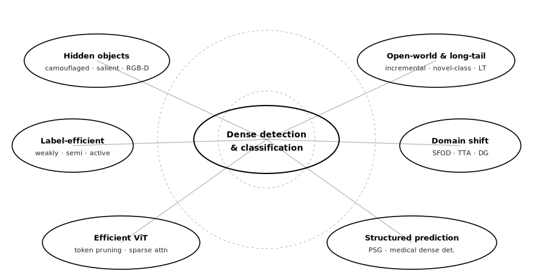
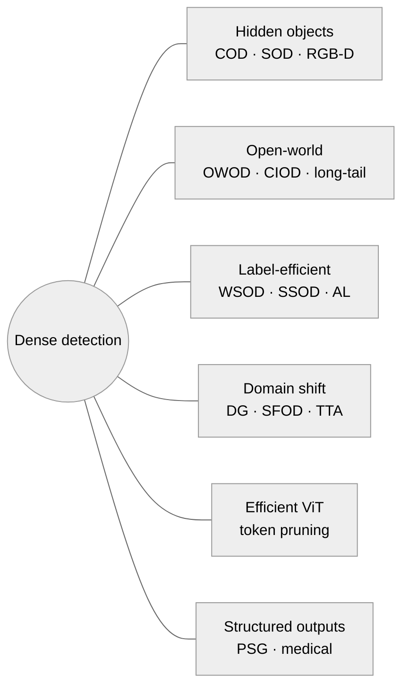
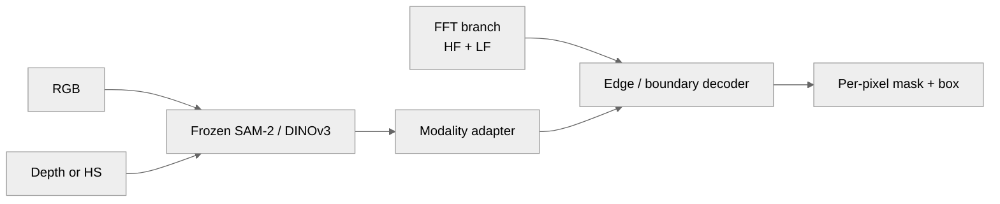
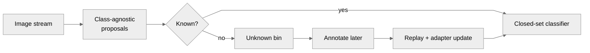
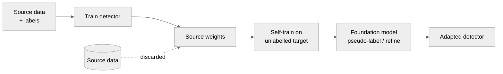
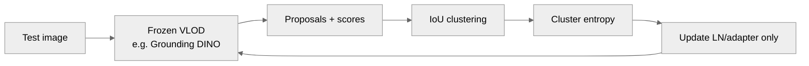
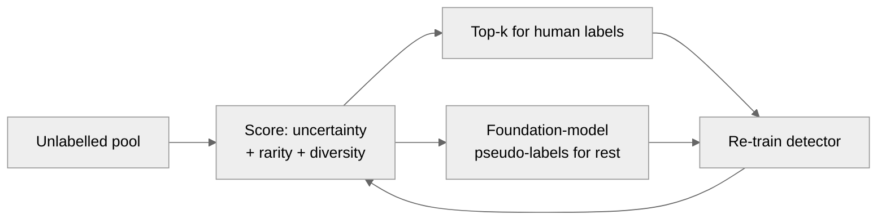
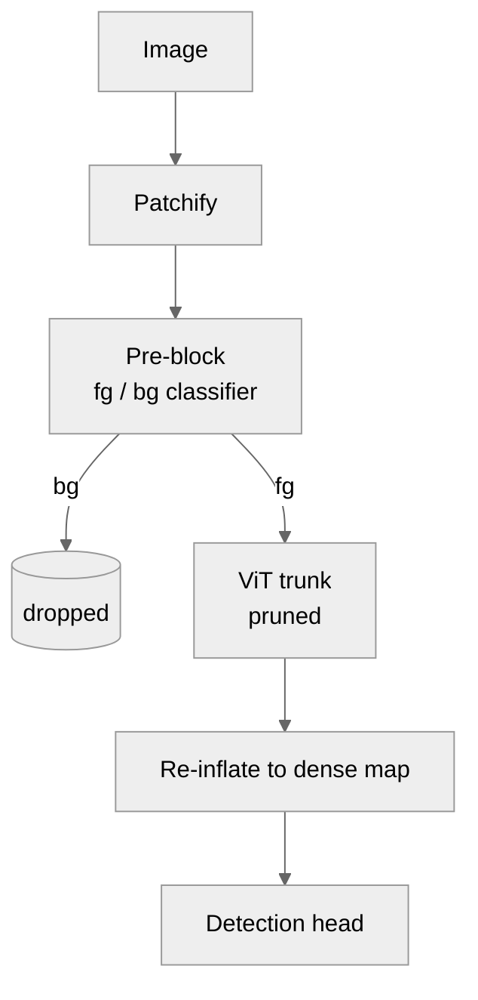

# Dense Object Detection & Classification — Recent Advances

*Compiled 2026-May-04 (America/Los_Angeles).*

This installment focuses on threads not covered in the prior reports
(Apr-30: real-time DETR/YOLO/SAM 3 backbones; May-01: Mamba, diffusion,
streaming, MLLM grounding; May-02: LiDAR 3D, MOT, event sensors, adversarial,
diffusion data, calibration, FSOD). Today we look at *the messy edges* of
dense detection: targets that hide, classes that arrive after deployment,
domains that drift, labels that are scarce, transformers that are too slow,
and outputs that need to be more than boxes.

---

## Table of contents

1. [What's new since 2026-May-02](#1-whats-new-since-2026-may-02)
2. [Topic map](#2-topic-map)
3. [Camouflaged & salient object detection](#3-camouflaged--salient-object-detection)
4. [Open-world, class-incremental, and long-tail detection](#4-open-world-class-incremental-and-long-tail-detection)
5. [Domain generalization & source-free adaptation](#5-domain-generalization--source-free-adaptation)
6. [Test-time adaptation for VLOD detectors](#6-test-time-adaptation-for-vlod-detectors)
7. [Label-efficient detection: weakly-supervised, semi-supervised, active](#7-label-efficient-detection-weakly-supervised-semi-supervised-active)
8. [Efficient ViT detection: token pruning & sparse attention](#8-efficient-vit-detection-token-pruning--sparse-attention)
9. [Medical dense detection (DETR-family)](#9-medical-dense-detection-detr-family)
10. [Beyond boxes: panoptic scene graphs](#10-beyond-boxes-panoptic-scene-graphs)
11. [Reading list](#11-reading-list)

---

## 1. What's new since 2026-May-02

- **SAM2-DEGNet** (dual-stage edge guidance over the Hiera trunk of SAM 2)
  and **HSC-SAM** for hyperspectral camouflaged objects extend the SAM 2 →
  COD adapter line, while ICCV 2025 **SAM-DSA** sets RGB-D COD records by
  adding dual-stream adapters to SAM. The pattern is now consistent: take
  the frozen SAM/SAM 2 trunk, attach modality- or domain-specific adapters,
  freeze most parameters.
- **DEIMv2** (the DINOv3-backed real-time DETR introduced last week)
  continues to climb leaderboards; DEIMv2-X reports 57.6 AP on COCO at
  ~50 M params, and DEIMv2-S is the first sub-10 M model above 50 AP.
  The interesting wrinkle is that the gain comes almost entirely from a
  *frozen* pretrained trunk — the head does the real work.
- **DSFlash** (arXiv:2603.10538) compresses panoptic scene-graph generation
  into a 56 fps pipeline on a single RTX 3090 — the first PSG model that's
  honestly real-time on commodity hardware.
- **VLOD-TTA** formalises a test-time-adaptation recipe specifically for
  vision-language *detectors* (not classifiers): IoU-weighted entropy on
  proposal clusters, plus image-conditioned prompt scoring.
- **STEP-DETR** (semi-supervised DETR with text-guided queries and a
  "Super Teacher") is the cleanest semi-/weak-supervision DETR recipe
  to land in 2026 so far.
- **LMW-YOLO** sets a new SOTA on the **RS-STOD** tiny-object remote-sensing
  benchmark (72.1 mAP@0.5, 45.2 mAP@0.5:0.95) at only 2.6 M params,
  beating the heavier 2026 entrants AMFC-DEIM and FBV-Fusion.

---

## 2. Topic map

The six themes covered today form two perpendicular axes — *what makes the
data hard* (hidden, drifting, scarce) and *what makes the model hard*
(open, efficient, structured).

---

## 3. Camouflaged & salient object detection

Camouflaged object detection (COD) and salient object detection (SOD) sit
at the dense end of "detection": you must produce a per-pixel decision and
the foreground is by definition hard to localise. The 2026 picture is
dominated by SAM/SAM 2 adapters and frequency-domain priors.

### 3.1 SAM-2 adapters for COD

Three converging recipes:

| Model | Backbone | Trick | Reported gain |
|---|---|---|---|
| **SAM2-DEGNet** | SAM 2 / Hiera | Dual-stage edge guidance, two-stream decoder | New SOTA on COD10K, NC4K, CAMO |
| **SAM2-Adapter** | SAM 2 multi-res | Per-stage adapters into the hierarchical ViT | New SOTA on COD, shadow, medical |
| **SAM-DSA** (ICCV 25) | SAM | Dual-stream RGB+D adapters | New SOTA on 4 COD benchmarks |

The interesting constant: **the SAM/SAM 2 trunk is frozen** and the
adapters are tiny. Camouflage is the cleanest demonstration that
SAM-style features already encode separability — the missing piece is a
specialty decoder that knows about edges or depth.

### 3.2 Frequency-domain priors

The COD literature has converged on a useful inductive bias: high-frequency
detail and low-frequency contour give better localisation than spatial
features alone, because camouflage by construction confuses spatial
texture. Recent threads:

- **FSPNet** (CVPR 23, still the reference baseline) — feature shrinkage
  pyramid over a ViT encoder.
- **Frequency-Spatial Entanglement** (ECCV 24) — couples FFT branches
  with spatial branches inside the decoder.
- **Edge Perception via Frequency-Domain Reconstruction** — supervises
  edges in the frequency domain, then reconstructs spatially.
- **Boundary-Aware Spatial-Frequency Supervision** — pushes the same idea
  to all four standard COD benchmarks.

### 3.3 Hyperspectral & video extensions

- **HyperCOD / HSC-SAM** (AAAI 2026) — first benchmark + baseline for
  hyperspectral camouflage. The win comes from feeding SAM separate
  spatial and spectral saliency maps rather than the raw HS cube.
- **SAM-PM** — spatio-temporal attention adapter on SAM for *video* COD;
  the temporal prior helps with sub-pixel motion that breaks
  single-frame adapters.

### 3.4 RGB-D salient object detection

A mature problem with a lot of incremental transformer work in 2026:

| Model | Notes |
|---|---|
| **D²TNet** (Apr 2026) | Decoupled-decoding transformer; outperforms 19 SOTA RGB-D SOD methods on six benchmarks |
| **EM-Trans** | Edge-aware multimodal transformer with dual-band edge supervision |
| **TranSal** | Depth-guided transformer cross-attention |
| **SwinEGNet** | Swin trunk + edge guidance |
| **GroupTransNet** | Cross-layer group attention for long-range deps |

The trend mirrors COD: depth/edge priors + SAM- or Swin-grade trunks +
small attention-based decoders. Cross-modal *fusion* is no longer the
research frontier; *what to fuse with* (edges, frequency, depth gradients)
is.

---

## 4. Open-world, class-incremental, and long-tail detection

OWOD and CIOD ask the model to keep learning after deployment. The 2026
question is no longer *can we do it?* but *what does it look like in the
era of foundation models?*

### 4.1 The OWOD reformulation

Classical OWOD (Joseph et al., CVPR 21) trains a closed-vocabulary
detector that flags an "unknown" class, then takes annotations later and
incrementally adds the new classes without forgetting. Two recent
surveys (arXiv:2410.11301 and 2508.16527) agree on three core sub-
problems:

1. **Class-agnostic objectness** — propose boxes for things you've never
   seen.
2. **Unknown-aware classification** — say "this is something" without
   collapsing into a known class.
3. **Incremental learning without forgetting** — fold the new class in
   without mAP collapse on the old ones.

### 4.2 Foundation-model-era OWOD

The surveys make one point sharply: most pre-2024 OWOD benchmarks are
*already solved* by a CLIP- or SigLIP-grounded zero-shot detector. The
real evaluation now needs:

- **OWEL** (*From Open Vocabulary to Open World*, arXiv:2411.18207) —
  parameterises class embeddings so new classes can be added by
  optimising new vectors rather than retraining the head.
- **YOLOOC** — YOLO-based open-class incremental detection with novel-
  class discovery; demonstrates that the YOLO line can do OWOD without
  a transformer rewrite.
- **OCPL** (Open-world via Discriminative Class Prototype Learning) —
  prototype-based classifier + embedding-space compression; classical
  but still competitive on the harder OWOD benchmarks.
- **FlyPrompt** (ICLR 2026) — brain-inspired routing with temporal-
  ensemble experts for general continual learning; not detection-
  specific but designed to mitigate catastrophic forgetting at scale.

### 4.3 Long-tail — the cousin problem

Long-tailed detection is the bounded version of OWOD: all classes are
known, but the rare ones look open. Two threads worth watching:

- **FOMO-3D** (arXiv:2603.08611) — first 3D detector to leverage frozen
  vision foundation models (OWLv2 + Metric3Dv2) explicitly for long-
  tailed 3D detection; large gains on rare driving classes from the
  semantic + depth priors of the foundation stack.
- **CLIP-finetuning calibration work** — recent papers point out that
  vanilla CLIP fine-tuning *inherits* the long-tail bias of its
  pre-training corpus; the fix is not just rebalancing the
  fine-tune set, but rebalancing the prompt distribution and using
  classifier calibration (cf. *On Model Calibration for Long-Tailed
  Object Detection and Instance Segmentation*).

### 4.4 What still doesn't work

- **Catastrophic forgetting on dense outputs** — most OWOD literature
  still measures forgetting on box mAP. Mask mAP and panoptic-quality
  forgetting are much harsher and largely unsolved.
- **Unknown discovery on open-vocabulary backbones** — when the trunk
  already "knows" most concepts, "unknown" becomes a labelling artifact.
  The OWOD-FM benchmark (arXiv:2312.05745) is the best current attempt
  to make this measurable.

---

## 5. Domain generalization & source-free adaptation

Three families converge in 2026:

| Family | Setting | Representative 2025-26 work |
|---|---|---|
| **DG** (domain generalization) | Train on multi-domain source, deploy unseen | "Granular-aware Open-set DG" (AAAI 26); SemAlign (language-guided semi-DG); GOOD (DG for oriented detection) |
| **UDA** (unsupervised DA) | Source labels + target unlabelled | Self-supervised trunks closing the gap (arXiv 2025) |
| **SFOD** (source-free) | Only source *weights* + target unlabelled | Multi-level domain perturbation (RS); collaborative learning with multiple foundation models; DAM (dual active learning + multimodal FM) |

### 5.1 What changed in 2026

The two most consistent findings across the SFOD/UDA literature this
year:

1. **Frozen self-supervised trunks (DINOv2/v3, SigLIP 2) are the bridge.**
   "*Large self-supervised models bridge the gap in domain adaptive
   object detection*" (arXiv 2025) is the canonical statement. SFOD
   methods that swap a ResNet-50 trunk for a frozen DINOv2 close most
   of the gap *before* any self-training.
2. **Multiple foundation models > one.** *Collaborative Learning with
   Multiple Foundation Models for SFDA* shows reliably that an
   ensemble of disagreeing FMs gives better pseudo-labels than any
   single one — at the cost of inference compute, but only at
   adaptation time.

### 5.2 The remote-sensing wrinkle

For overhead imagery the source data is often *legally* unavailable
(licensing/geography). SFOD becomes the default deployment story.
*Multi-level domain perturbation for source-free OD in remote sensing*
(2024) and **GOOD** (DG for oriented detection, 2025) are now the
two reference baselines — neither uses adversarial alignment; both
rely on perturbation diversity inside the target domain.

---

## 6. Test-time adaptation for VLOD detectors

Test-time adaptation (TTA) for image classifiers is well-studied (TENT,
EATA, …); the detector version is harder because:

- Confidence is a per-box, not per-image, signal.
- Most boxes are background, and background entropy is meaningless.
- Pseudo-labels from a drifting model are catastrophic.

**VLOD-TTA** (OpenReview 7W4Gusa9rY) is the cleanest 2026 recipe for
adapting a vision-language *detector* (Grounding DINO-style) at test time:

- **IoU-weighted entropy** — concentrates adaptation on spatially
  coherent proposal *clusters*, suppressing isolated boxes that are
  almost always noise.
- **Image-conditioned prompt scoring** — re-weights prompt tokens by
  per-image relevance, so "dog" doesn't compete with "cat" on a
  cat-free street.

In parallel, **POEM** (Online Entropy Matching, NeurIPS 24) and
*Adaptive Debiasing Tsallis Entropy* (arXiv:2602.11743) tighten the
classification-side entropy mechanism to better behave under distribution
shift, but neither is detection-native yet.

The pattern is now consistent across modalities: **don't update the
trunk**, update only LayerNorm or a lightweight adapter, and gate
updates on a robust uncertainty signal.

---

## 7. Label-efficient detection: weakly-supervised, semi-supervised, active

### 7.1 STEP-DETR — semi-supervised DETR done well

**STEP-DETR** (2026) is the most cleanly engineered semi-supervised DETR
this year:

1. **Text-guided query alignment** — anchors object queries to a small
   set of phrase prompts that survive transfer.
2. **Super Teacher pseudo-label filtering** — runs the teacher in a
   higher-quality regime (more queries, longer NMS) and filters by
   text-query agreement before passing labels back to the student.
3. **Standard DETR losses** on labelled + filtered-pseudo-labelled data.

The pattern (text alignment + heavy-weight teacher + DETR-native losses)
is likely to generalise across the DETR variants we covered Apr-30
(D-FINE, DEIM, RT-DETR).

### 7.2 Pseudo-labels via SSL trunks

For purely **weakly supervised** detection (image-level labels only),
the 2025-26 winner is to delegate the spatial work to a self-
supervised ViT:

- **CAMR + CSM** (Knowledge-Based Systems 2025) — class-activation
  reassembly using DINO-style attention groups. CAM gives semantics,
  the SSL ViT gives groupings, the composite scoring head fuses them.
- **Sparse Generation** (CVPR 24) — instead of densifying point-level
  weak labels into many pseudo-boxes, *make pseudo-labels sparse* via
  Mapping/Mask/Regression stages. Cleaner training signal under low
  data.

### 7.3 Active learning — the rarity-aware turn

Industrial datasets have severe class imbalance, so a 2026 trend is
**rarity-aware** active learning: stratify the unlabelled pool by
predicted-class rarity and reserve budget for tail classes.

- *Rarity-Aware Stratified Active Learning for Class-Imbalanced
  Industrial OD* (Applied Sciences 2026) — composite score combining
  uncertainty, informativeness, and class-complementary diversity, with
  adaptive weight on rare classes. Reports 5 % AP gain at the same
  budget, or 20-30 % budget reduction at the same AP.
- **DAM** (Dual Active Learning + Multimodal FM, 2025) — uses a
  multimodal foundation model both to score query candidates *and* to
  pseudo-label unqueried ones during the same cycle.

---

## 8. Efficient ViT detection: token pruning & sparse attention

Real-time DETR (Apr-30) and Mamba detectors (May-01) cut the trunk and
the head respectively. The third lever is **token pruning** — cutting
the *width* of the attention map.

### 8.1 The detection-specific complication

Most token-pruning literature (DynamicViT, EViT, …) targets
classification, where the final decision is a single CLS token.
Detection needs spatial coverage at the head. The 2025-26 detection-
aware methods all share one trick: **prune at the trunk, but
reinflate at the head**.

- **Revisiting Token Pruning for OD & Instance Segmentation** (WACV 24)
  — early identification of the "preserve pruned tokens for the head"
  pattern; otherwise small-object recall collapses.
- **BAViT** (Background-Aware ViT, arXiv:2410.09324) — a tiny
  pre-block that classifies tokens as fg/bg before the main ViT. ~25 %
  token reduction, ~3 mAP drop on COCO.
- **TRAM** (Token Reduction via Attention-based Multilayer net,
  ESWA 2025) — attention-MLN over multilayer attention scores
  predicts which tokens to drop; preserves dense-prediction quality
  better than entropy-only criteria.
- **ToaSt** (arXiv:2602.15720) — joint *channel selection* and
  structured token pruning; transfers cleanly to downstream OD heads.
- **SEPatch3D** (arXiv:2604.14563) — for sparse multi-view 3D
  detectors: dynamic patch-size selection + informative-patch
  enhancement. ~57 % faster inference on multi-view BEV.

### 8.2 Sparse attention for video

For event-based / video tracking, **token sparsification** (IJCV 2025,
*Efficient ViT with Token Sparsification for Event-Based Tracking*)
prunes 60 % of tokens hierarchically, drops MAC by ~25 %, and loses
≤ 0.5 pp tracking accuracy.

The empirical headline: **2-3× FLOPs reduction is now routine; the
mAP/AP cost is < 1 pp on COCO if you reinflate.**

---

## 9. Medical dense detection (DETR-family)

Medical imaging is a long-tail of dense-detection problems where the
boxes are tiny, the data is scarce, and false negatives are clinically
expensive. 2026 has been the year DETR-family detectors moved from
academic to mainstream there.

### 9.1 RT-DETR for endoscopy

- **GI-RT-DETR** (Sci. Reports 2026) — RT-DETR-r18 trunk with two
  bespoke modules: **DWRC3-DRB** (residual + dense connections to
  fuse shallow + deep features) and **EAAAIFI** (background-
  suppression via global context). Reports F1 = 1.00 on polyp class
  in WCE evaluation.
- **AVPDN** (Sci. Reports 2026) — Adaptive Video Polyp Detection
  Network with AFIA + SACI modules; targets motion-robustness in
  dynamic colonoscopy.
- **Anchor-Free Adaptive Multi-Scale** real-time polyp detection
  (Sensors 2025) — pure CNN baseline that DETR variants are now
  beating cleanly.

### 9.2 Pulmonary nodule detection

- **RePoint-Net + 3DSqU²Net** — point-then-segment 3D pipeline,
  still the strongest *non-DETR* baseline.
- **DETR for Lung Nodule Detection in CT** — DETR-style global
  attention helps with the specific failure mode of CNNs (over-
  triggering on vessels and ribs).

### 9.3 Digital pathology

The 2025-26 review in *J Diagn Pathol Oncol* shows the same
convergence: ResNet/U-Net are still common in production, but
DETR-derivatives (Adamixer, HDETR, SQR-DETR) achieve the new SOTA
on whole-slide tumour detection. Fine-grained classification of
pathology tiles is moving in the same direction (cf. *Transformer
attention fusion for fine-grained medical image classification*,
Sci. Reports 2025).

### 9.4 Practical takeaways

- **RT-DETR variants are now the safest off-the-shelf medical detector.**
  They beat YOLO on small + occluded targets and don't need anchor
  tuning for new modalities.
- **Pretrain on natural images, then medical fine-tune.** DINOv2 trunks
  consistently outperform ImageNet-supervised trunks across radiology
  + pathology.
- **Verify with frequency / multi-scale modules.** The medical DETR
  papers that report the largest gains all add either a frequency or
  multi-scale module on top of the base detector — same lesson as
  COD (§3.2).

---

## 10. Beyond boxes: panoptic scene graphs

Panoptic Scene Graph Generation (PSG) extends detection to *triples*:
(subject mask, predicate, object mask). The 2026 push is real-time PSG.

- **DSFlash** (arXiv:2603.10538) — first PSG model to run at 56 fps on
  a single RTX 3090, without giving up SOTA quality. The trick is to
  emit comprehensive (not just salient) relations in one pass, so the
  expensive pairwise classification is amortised.
- **CVCPSG** (J King Saud Univ. 2025) — DETR-based PSG with a
  composite visual-clues bank (object / spatial / situational) and
  multi-level visual extractor. Gains come from explicit spatial +
  situational features, which earlier PSG methods discarded.
- **GroupRF** — group-relation tokens for panoptic SGG.
- **4D-PSG** — extension to spatio-temporal scene graphs; the
  benchmark is still tiny but the structure (boxes → masks → triples
  → 4D triples) is now standard.

For dense detection consumers, the practical question is whether to
treat PSG as (a) a stronger downstream pose for an existing
panoptic-segmentation model, or (b) a joint training target. DSFlash's
results say (b) is finally fast enough to be the default.

---

## 11. Reading list

### Hidden-object detection
- *SAM2-DEGNet*, Visual Computer 2026 — <https://link.springer.com/article/10.1007/s00371-025-04252-6>
- *SAM2-Adapter*, arXiv 2408.04579 — <https://arxiv.org/html/2408.04579v1>
- *Improving SAM for COD via Dual Stream Adapters* (ICCV 25) — <https://openaccess.thecvf.com/content/ICCV2025/html/Liu_Improving_SAM_for_Camouflaged_Object_Detection_via_Dual_Stream_Adapters_ICCV_2025_paper.html>
- *HyperCOD* (AAAI 2026) — <https://ojs.aaai.org/index.php/AAAI/article/view/37221>
- *SAM-PM*, arXiv 2406.05802 — <https://arxiv.org/html/2406.05802v1>
- *FSPNet* (CVPR 23) — <https://openaccess.thecvf.com/content/CVPR2023/papers/Huang_Feature_Shrinkage_Pyramid_for_Camouflaged_Object_Detection_With_Transformers_CVPR_2023_paper.pdf>
- *Frequency-Spatial Entanglement* (ECCV 24) — <https://www.ecva.net/papers/eccv_2024/papers_ECCV/papers/01001.pdf>
- *Edge Perception via Frequency-Domain Reconstruction* — <https://ieeexplore.ieee.org/document/10536093/>
- *Boundary-Aware Spatial-Frequency Supervision*, MDPI Electronics — <https://www.mdpi.com/2079-9292/14/13/2541>
- *D²TNet* (RGB-D SOD, Apr 2026) — <https://papers.ssrn.com/sol3/papers.cfm?abstract_id=6506544>
- *EM-Trans* (RGB-D SOD) — <https://ieeexplore.ieee.org/abstract/document/10433541>
- *SwinEGNet* — <https://pmc.ncbi.nlm.nih.gov/articles/PMC10650861/>
- *GroupTransNet* — <https://www.sciencedirect.com/science/article/abs/pii/S0925231224006362>

### Open-world & long-tail
- *OWOD in the Era of Foundation Models*, arXiv 2312.05745 — <https://arxiv.org/abs/2312.05745>
- *Open World OD: A Survey*, arXiv 2410.11301 — <https://arxiv.org/html/2410.11301v2>
- *Towards Open World Detection: A Survey*, arXiv 2508.16527 — <https://arxiv.org/html/2508.16527v1>
- *From Open Vocabulary to Open World (OWEL)*, arXiv 2411.18207 — <https://arxiv.org/html/2411.18207v2>
- *YOLOOC*, arXiv 2404.00257 — <https://arxiv.org/abs/2404.00257>
- *OCPL*, arXiv 2302.11757 — <https://arxiv.org/abs/2302.11757>
- *FOMO-3D* (long-tail 3D), arXiv 2603.08611 — <https://arxiv.org/html/2603.08611>
- *Calibration for Long-Tailed OD & IS* — <https://openreview.net/forum?id=t9gKUW9T8fX>

### Domain shift
- *Awesome-Multimodal-Adaptation* (TPAMI 26) — <https://github.com/donghao51/Awesome-Multimodal-Adaptation>
- *Awesome-Domain-Generalization* — <https://github.com/junkunyuan/Awesome-Domain-Generalization>
- *Multi-level Domain Perturbation for SFOD in RS* — <https://www.tandfonline.com/doi/full/10.1080/10095020.2024.2378920>
- *GOOD: DG for Oriented OD* — <https://www.researchgate.net/publication/389947776_GOOD_Towards_domain_generalized_oriented_object_detection>
- *Instance Relation Graph SFOD* — <https://par.nsf.gov/servlets/purl/10516363>

### Test-time adaptation
- *VLOD-TTA* — <https://openreview.net/forum?id=7W4Gusa9rY>
- *TENT* (ICLR 21, baseline) — <https://openreview.net/pdf?id=uXl3bZLkr3c>
- *POEM: Protected TTA via Online Entropy Matching* (NeurIPS 24) — <https://proceedings.neurips.cc/paper_files/paper/2024/file/9b35a0a20d617dc68ae98a7a57df2f51-Paper-Conference.pdf>
- *Adaptive Debiasing Tsallis Entropy*, arXiv 2602.11743 — <https://arxiv.org/html/2602.11743>
- *TTA for OD in Continually Changing Envs*, arXiv 2406.16439 — <https://arxiv.org/html/2406.16439v5>
- *Robust OD with DI Training + CTTA*, IJCV 2025 — <https://link.springer.com/article/10.1007/s11263-025-02465-9>

### Label-efficient
- *Pseudo-Label Enhancement via SSL ViT* (KBS 2025) — <https://www.sciencedirect.com/science/article/abs/pii/S0950705125000607>
- *Sparse Generation for WSOD* — <https://ieeexplore.ieee.org/document/10889548/>
- *Scaling Novel OD with Weakly-Supervised DETRs* (WACV 23) — <https://openaccess.thecvf.com/content/WACV2023/papers/LaBonte_Scaling_Novel_Object_Detection_With_Weakly_Supervised_Detection_Transformers_WACV_2023_paper.pdf>
- *Rarity-Aware Stratified Active Learning* — <https://www.mdpi.com/2076-3417/16/3/1236>
- *Plug-and-Play Active Learning for OD* (CVPR 24) — <https://openaccess.thecvf.com/content/CVPR2024/papers/Yang_Plug_and_Play_Active_Learning_for_Object_Detection_CVPR_2024_paper.pdf>

### Efficient ViT
- *Revisiting Token Pruning for OD & IS* (WACV 24) — <https://openaccess.thecvf.com/content/WACV2024/papers/Liu_Revisiting_Token_Pruning_for_Object_Detection_and_Instance_Segmentation_WACV_2024_paper.pdf>
- *BAViT*, arXiv 2410.09324 — <https://arxiv.org/html/2410.09324v1>
- *TRAM*, ESWA 2025 — <https://www.sciencedirect.com/science/article/pii/S0957417425010711>
- *ToaSt*, arXiv 2602.15720 — <https://arxiv.org/html/2602.15720v1>
- *SEPatch3D*, arXiv 2604.14563 — <https://arxiv.org/abs/2604.14563>
- *Efficient ViT with Token Sparsification for Event Tracking* (IJCV 25) — <https://link.springer.com/article/10.1007/s11263-025-02666-2>

### Medical dense detection
- *GI-RT-DETR*, Sci. Reports 2026 — <https://www.nature.com/articles/s41598-026-38617-1>
- *AVPDN*, Sci. Reports 2026 — <https://www.nature.com/articles/s41598-026-42286-5>
- *Anchor-Free Adaptive Multi-Scale Polyp Detection* (Sensors) — <https://www.mdpi.com/1424-8220/25/24/7524>
- *Multi-Task DL for Lung Nodule Detection & Segmentation* — <https://www.mdpi.com/2079-9292/14/15/3009>
- *Tumor Detection & Segmentation Review* (J Diagn Pathol Oncol) — <https://jdpo.org/archive/volume/9/issue/4/article/2910>
- *Transformer Attention Fusion for FG Medical Classification* — <https://www.nature.com/articles/s41598-025-07561-x>

### Panoptic scene graphs
- *DSFlash*, arXiv 2603.10538 — <https://arxiv.org/abs/2603.10538>
- *Panoptic SGG* (ECCV 22, foundational) — <https://www.ecva.net/papers/eccv_2022/papers_ECCV/papers/136870175.pdf>
- *CVCPSG* — <https://link.springer.com/article/10.1007/s44443-025-00063-w>
- *GroupRF* — <https://www.sciencedirect.com/science/article/abs/pii/S1047320325000197>
- *4D-PSG* — <https://openreview.net/forum?id=GRHZiTbDDI>
- *Fair Ranking & New Model for PSG* — <https://link.springer.com/chapter/10.1007/978-3-031-73030-6_9>

### Cross-cutting / surveys
- *Top CVPR 2026 Papers* (curated) — <https://github.com/SkalskiP/top-cvpr-2026-papers>
- *Awesome Incremental Learning* — <https://github.com/xialeiliu/Awesome-Incremental-Learning>
- *Awesome Test-Time Adaptation* — <https://github.com/tim-learn/awesome-test-time-adaptation>
- *Transformers in Small OD: Survey* (ACM CSUR) — <https://dl.acm.org/doi/10.1145/3758090>
- *Advancements in Small-Object Detection 2023-2025* — <https://www.mdpi.com/2076-3417/15/22/11882>
