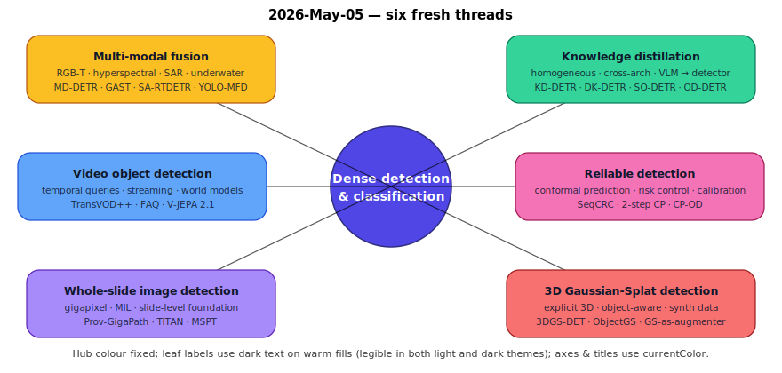
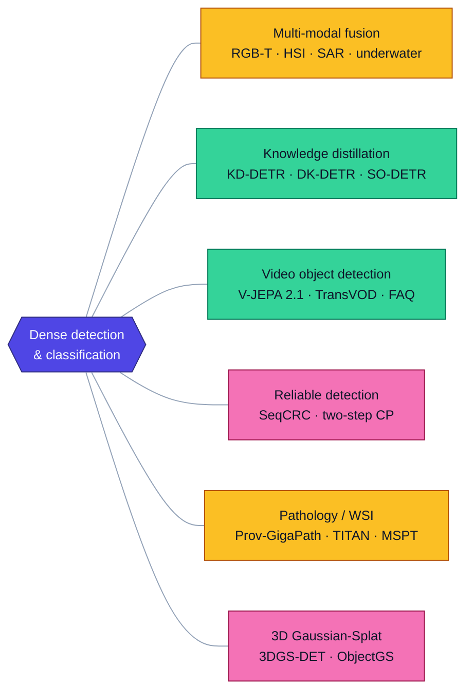
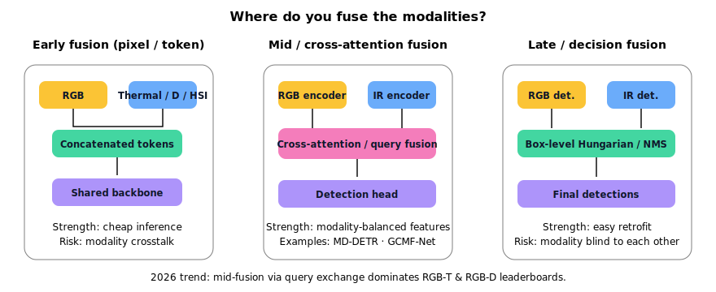
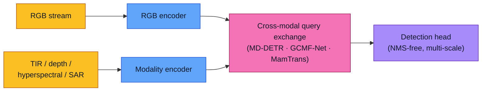
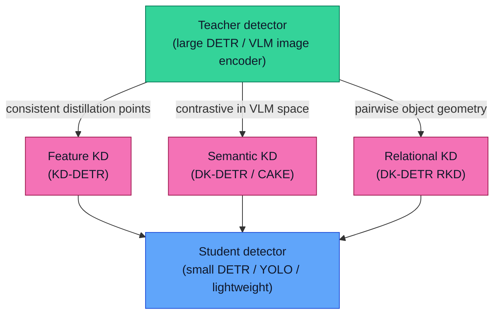
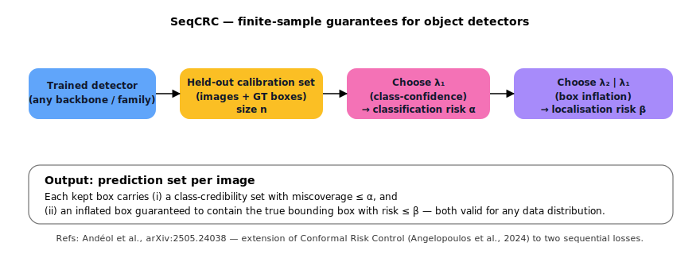
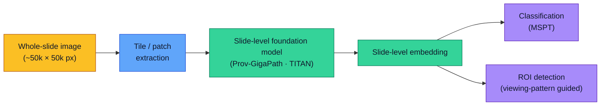
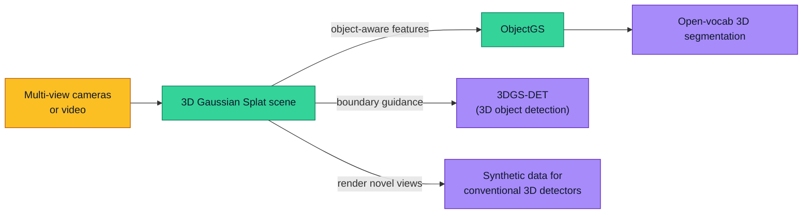

# Dense Object Detection & Classification — Recent Advances

*Compiled 2026-May-05 (America/Los_Angeles).*

This installment continues the running CV-updates log and deliberately
covers threads not yet treated in the prior reports
([Apr-30](../2026-Apr-30/2026-Apr-30_CV_updates.md): real-time DETR, YOLO26,
DINOv3, SAM 3, BEV 3D, edge deployment;
[May-01](../2026-May-01/2026-May-01_CV_updates.md): Mamba, diffusion,
streaming, MLLM grounding;
[May-02](../2026-May-02/2026-May-02_CV_updates.md): LiDAR 3D, MOT, event sensors,
adversarial robustness, calibration, FSOD;
[May-04](../2026-May-04/2026-May-04_CV_updates.md): camouflaged/salient, OWOD,
DG/SFOD, label efficiency, efficient ViT, medical, panoptic scene graphs).

Today's six threads sit on the *capability frontier* — they are what
detection looks like once you let go of "RGB image, COCO classes, single
frame, point estimate."

---

## Table of contents

1. [What's new this week](#1-whats-new-this-week)
2. [Topic map](#2-topic-map)
3. [Multi-modal fusion: RGB-T, hyperspectral, SAR, underwater](#3-multi-modal-fusion-rgb-t-hyperspectral-sar-underwater)
4. [Knowledge distillation across detector families](#4-knowledge-distillation-across-detector-families)
5. [Video object detection & temporal aggregation](#5-video-object-detection--temporal-aggregation)
6. [Reliable detection: conformal prediction & risk control](#6-reliable-detection-conformal-prediction--risk-control)
7. [Pathology gigapixel detection (whole-slide images)](#7-pathology-gigapixel-detection-whole-slide-images)
8. [3D Gaussian-Splat scene understanding & detection](#8-3d-gaussian-splat-scene-understanding--detection)
9. [Reading list](#9-reading-list)

---

## 1. What's new this week

- **V-JEPA 2.1** ([arXiv 2603.14482](https://arxiv.org/abs/2603.14482)) lands
  the first JEPA-style video model that produces *dense* spatio-temporal
  features — closing the long-standing gap to image-level DINOv3 on per-pixel
  tasks while keeping the world-model objective.
- **Modality-Decoupled DETR** ([arXiv 2601.08458](https://arxiv.org/abs/2601.08458))
  reframes RGB-T fusion as *query exchange between two parallel DETR
  branches*; it is the cleanest articulation yet of why mid-fusion beats
  early concatenation when the two modalities disagree.
- **SO-DETR** ([arXiv 2504.11470](https://arxiv.org/abs/2504.11470)) and
  **DK-DETR** (ICCV 2023, still the cited baseline) push knowledge distillation
  from a "model compression trick" into the open-vocabulary DETR pipeline
  proper.
- **SeqCRC** ([arXiv 2505.24038](https://arxiv.org/abs/2505.24038)) gives the
  first practical conformal-prediction wrapper that produces calibrated
  *bounding boxes* and *class sets* with finite-sample guarantees on both —
  important for safety-critical downstream use.
- **Prov-GigaPath** ([Nature 2024](https://www.nature.com/articles/s41586-024-07441-w))
  and the multi-modal **TITAN** ([Nature Medicine 2025](https://www.nature.com/articles/s41591-025-03982-3))
  are the first two pathology foundation models to be trained on >100k whole
  slides and to produce slide-level embeddings useful for region-of-interest
  detection, not just classification.
- **3DGS-DET** (ICLR 2025, [OpenReview](https://openreview.net/forum?id=9SmukfhJoF))
  and **ObjectGS** ([arXiv 2507.15454](https://arxiv.org/abs/2507.15454))
  show that 3D Gaussian Splatting is now a viable *detection* representation —
  not only a renderer.

---

## 2. Topic map

The themes today form three pairings:

- **Inputs** — multi-modal sensors and gigapixel pathology slides extend the
  domain side of detection.
- **Outputs** — conformal prediction sets and Gaussian-splat 3D add structure
  on the prediction side.
- **Compression & scale** — distillation and video aggregation are the
  efficiency-and-scale stories.

---

## 3. Multi-modal fusion: RGB-T, hyperspectral, SAR, underwater

The 2026 fusion-detection literature has converged on a small set of design
choices: fuse *late enough* that each modality keeps its own representation,
*early enough* that detections agree at the box level, and use the
DETR-decoder query as the natural fusion site.

### 3.1 RGB–thermal: the query-fusion default

- **Modality-Decoupled DETR (MD-DETR)**
  ([arXiv 2601.08458](https://arxiv.org/abs/2601.08458)) keeps two parallel
  DETR branches — one for RGB, one for TIR — and exchanges *queries* (not
  features) between them at every refinement stage. The branches stay
  decoupled enough to handle modality dropout, but the cross-modal query
  exchange means the head sees a fused decision.
- **GCMF-Net**
  ([Sci. Rep. 2025](https://www.sciencedirect.com/science/article/abs/pii/S0957417425032944))
  uses a global cross-attention block plus a mask-guided fusion module
  to harden multispectral pedestrian detection in low-light.
- **Sigmoid-gated early fusion** still wins on the simplest pipelines:
  the IEEE Xplore "Enhanced Thermal–RGB Fusion" CVPR-W work
  ([2023](https://openaccess.thecvf.com/content/CVPR2023W/PBVS/papers/Ahmar_Enhanced_Thermal-RGB_Fusion_for_Robust_Object_Detection_CVPRW_2023_paper.pdf))
  measured up to **9% AP gain** with a tiny gating network — useful when the
  budget rules out two backbones.
- The **Awesome-RGB-T-Fusion** repos
  ([VisionVerse](https://github.com/VisionVerse/Awesome-RGBT),
  [yuanmaoxun](https://github.com/yuanmaoxun/Awesome-RGBT-Fusion))
  curate the current leaderboard across detection, segmentation, tracking,
  and crowd counting.

### 3.2 Hyperspectral classification & detection

- **GAST**
  ([ScienceDirect 2026](https://www.sciencedirect.com/science/article/pii/S2667393226000025))
  is a graph-augmented spectral–spatial transformer with adaptive gated
  fusion — the new SOTA on eight HSI benchmarks under 5%-labelled regimes,
  with **5× fewer parameters** than the previous hybrid GNN baseline.
- **MamTrans**
  ([ScienceDirect 2024](https://www.sciencedirect.com/science/article/abs/pii/S0165168424002895))
  pairs a Mamba spectral branch with a vanilla transformer spatial branch —
  arguably the cleanest argument for why the spectral axis really is best
  modelled as a 1-D sequence.
- For *point-target* HSI detection (anomalies, sub-pixel), **SpecDETR**
  ([arXiv 2405.10148](https://arxiv.org/abs/2405.10148)) is the first DETR
  formulation; previous SOTA was matched-filter + post-processing.

### 3.3 SAR detection: small, multi-scale, scattered

- **SA-RTDETR**
  ([IEEE TGRS 2025](https://ieeexplore.ieee.org/document/11242118/))
  takes RT-DETR and bolts on a bidirectional receptive-field booster, a
  deformable-attention intra-scale module for tiny targets, and an
  attention upsampler — the headline real-time SAR detector for ships and
  vehicles in 2025–26.
- **CCDN-DETR**
  ([Sensors 2024](https://www.mdpi.com/1424-8220/24/6/1793))
  swaps the multi-layer encoder for a cross-scale encoder and adds a
  contrastive denoising query selection for the long-tailed SAR class
  distribution.
- **TSDet**
  ([IEEE 2022](https://ieeexplore.ieee.org/document/9891879)) and
  **WHFE-ViT**
  ([Springer 2024](https://link.springer.com/chapter/10.1007/978-981-96-0128-8_11))
  are the best-cited SAR-specialised DETRs prior to SA-RTDETR; WHFE-ViT
  injects a discrete-wavelet down-sampler so high-frequency scatter
  patterns survive into the deep stages.

### 3.4 Underwater detection

- **YOLO-MFD**
  ([Sci. Rep. 2026](https://www.nature.com/articles/s41598-026-45591-1))
  reaches **84.4 mAP@0.5 / 64.9 mAP@0.5:0.95** on a prefabricated-shoreline
  underwater benchmark by adding a multi-scale feature pyramid plus a
  dynamic detection head onto YOLOv8 — the SOTA non-transformer underwater
  baseline of the cycle.
- The 2025 survey *"Underwater Object Detection in the Era of Artificial
  Intelligence"*
  ([arXiv 2410.05577](https://arxiv.org/abs/2410.05577)) groups the field
  into four recipes: image-restoration preprocessing, attention-augmented
  YOLO, hybrid CNN-transformers, and synthetic-real domain adaptation.
  Hybrid CNN-transformers lead under colour cast; restoration preprocessing
  still wins under turbidity.
- **BTS-DETR (Better Teach Small DETR)**
  ([Knowledge-Based Systems 2026](https://www.sciencedirect.com/science/article/abs/pii/S0950705126003679))
  is the first sonar-image-specific DETR distillation with adaptive weight
  allocation — useful when the imaging physics differs enough from optical
  RGB that ImageNet-pretrained teachers transfer poorly.

---

## 4. Knowledge distillation across detector families

The 2026 [survey of KD for detection](https://www.mdpi.com/1424-8220/26/1/292)
([PMC mirror](https://pmc.ncbi.nlm.nih.gov/articles/PMC12788226/)) is the
single best entry point: it organises 2018-vintage logit/feature distillation
all the way through 2025 *cross-architecture* and *VLM-to-detector*
distillation. Three threads matter most for dense detection right now.

### 4.1 DETR-native distillation

The original problem with DETR distillation is that the matched query–GT
pairs differ between teacher and student, so feature-map distillation is
unprincipled.

- **KD-DETR**
  ([CVPR 2024 / arXiv 2211.08071](https://arxiv.org/abs/2211.08071))
  introduces *consistent distillation-points sampling*: a fixed pool of
  per-image points is shared between teacher and student, removing the
  matching mismatch. Works for both homogeneous (DETR→smaller-DETR) and
  heterogeneous (DETR→YOLO) distillation.
- **OD-DETR**
  ([arXiv 2406.05791](https://arxiv.org/abs/2406.05791)) flips the time
  axis: it distils from a *moving-average teacher* on the fly, stabilising
  DETR training without needing a separate pretrained teacher.

### 4.2 VLM → detector distillation (open-vocabulary)

- **DK-DETR**
  ([ICCV 2023](https://openaccess.thecvf.com/content/ICCV2023/papers/Li_Distilling_DETR_with_Visual-Linguistic_Knowledge_for_Open-Vocabulary_Object_Detection_ICCV_2023_paper.pdf))
  routes a VLM's image features through a separate *distillation branch*
  with auxiliary queries. Two losses run in parallel:
  - **SKD (semantic KD)** treats feature alignment as a contrastive
    classification task, not a regression — it pulls same-object features
    together and pushes different-object features apart in the VLM space.
  - **RKD (relational KD)** reuses the VLM's pairwise structure between
    object embeddings, leveraging implicit semantic geometry rather than
    individual features.
- **DeCo-DETR**
  ([arXiv 2604.02753](https://arxiv.org/abs/2604.02753), Apr 2026)
  separates "recognise" and "localise" decoders so VLM distillation only
  touches the recognition branch — useful when the localisation prior is
  already strong (e.g. ConvNeXt-trained students).
- **CAKE**
  ([AAAI 2025](https://ojs.aaai.org/index.php/AAAI/article/view/32639/34794))
  pre-extracts category-aware knowledge from the VLM offline and avoids the
  per-batch VLM forward pass during student training — the cheapest
  practical recipe for open-vocab fine-tuning.

### 4.3 Distillation for small-object & cross-domain detection

- **SO-DETR**
  ([arXiv 2504.11470](https://arxiv.org/abs/2504.11470)) combines a
  dual-domain (spatial + frequency) encoder, an expanded-IoU query
  selection, and KD into a lightweight backbone. On VisDrone-2019-DET and
  UAVVaste it beats heavier baselines at matched FLOPs — the
  closest 2025 analog to "RT-DETR for tiny aerial targets."
- **Hierarchical KD for small objects**
  ([JCST 2024](https://jcst.ict.ac.cn/fileup/1000-9000/PDF/JCST-2024-4-5-4158-798.pdf))
  introduces multi-resolution feature matching so the student can absorb
  fine spatial detail from the teacher's higher-resolution feature pyramid.
- **Sonar / agricultural** specialisations
  ([Springer 2025](https://link.springer.com/article/10.1007/s40747-025-02123-0))
  show the same recipe transferring almost verbatim to off-distribution
  domains — KD is now the default move when the deployment device is
  fixed and accuracy headroom is the one variable.

---

## 5. Video object detection & temporal aggregation

Video detection is having a quiet renaissance: V-JEPA 2.1 finally produces
*dense* video features; transformer detectors that aggregate features
across frames are now competitive with single-frame DETR baselines on
ImageNet-VID; and the streaming-perception story has matured into
deployable APIs.

### 5.1 V-JEPA 2 → V-JEPA 2.1: dense video features

- **V-JEPA 2**
  ([arXiv 2506.09985](https://arxiv.org/abs/2506.09985),
  [Meta blog](https://ai.meta.com/blog/v-jepa-2-world-model-benchmarks/),
  [code](https://github.com/facebookresearch/vjepa2))
  is the joint-embedding predictive video model trained on >1 M hours of
  internet video. It hits **77.3 SSv2 / 39.7 R@5 EK-100** and enables
  zero-shot robot control — but its features are *global*; per-pixel
  evaluations were weak.
- **V-JEPA 2.1** ([arXiv 2603.14482](https://arxiv.org/abs/2603.14482),
  [HF page](https://huggingface.co/papers/2603.14482)) addresses exactly that
  gap. Four ingredients:
  1. **Dense Predictive Loss** — every token (visible *and* masked) contributes
     to the loss, forcing spatial-temporal grounding.
  2. **Deep Self-Supervision** — the predictive objective is applied at
     multiple intermediate encoder layers, not only at the top.
  3. **Multi-modal tokenisers** for unified image+video training.
  4. Aggressive scaling of model and data.
- Reported numbers: **7.71 mAP** on Ego4D short-term object-interaction
  anticipation, **40.8 R@5** on EPIC-KITCHENS, **0.307 NYUv2 RMSE** depth
  with a linear probe, **+20pt grasp success** vs. V-JEPA 2 AC. The
  takeaway: V-JEPA 2.1 is the first SSL video backbone whose features look
  competitive on dense per-pixel benchmarks.

### 5.2 Transformer VOD: TransVOD line and successors

- **TransVOD / TransVOD++**
  ([TPAMI 2022](https://ieeexplore.ieee.org/iel7/34/4359286/09960850.pdf),
  [arXiv 2201.05047](https://arxiv.org/abs/2201.05047),
  [code](https://github.com/SJTU-LuHe/TransVOD))
  is still the strongest end-to-end VOD baseline: a temporal transformer
  aggregates per-frame DETR queries plus encoded feature memories.
- **Feature Aggregated Queries (FAQ)**
  ([CVPR 2023](https://openaccess.thecvf.com/content/CVPR2023/papers/Cui_Feature_Aggregated_Queries_for_Transformer-Based_Video_Object_Detectors_CVPR_2023_paper.pdf))
  pushes the aggregation into *query space* rather than feature space —
  cheaper, and surprisingly more robust to occlusion than feature memory.
- **Practical VOD via Feature Selection & Aggregation**
  ([IJCV 2026](https://link.springer.com/article/10.1007/s11263-025-02700-3))
  argues that selecting *which* neighbouring frames to aggregate matters as
  much as how — confidence-driven sparse aggregation is now the practical
  recipe.

### 5.3 Streaming perception in production

- The streaming-perception framing
  ([CVPR 2022](https://openaccess.thecvf.com/content/CVPR2022/papers/Yang_Real-Time_Object_Detection_for_Streaming_Perception_CVPR_2022_paper.pdf))
  is now table stakes — RF-DETR runs at ~5 ms / 54.7 mAP on T4
  ([Roboflow blog](https://blog.roboflow.com/best-object-detection-models/)),
  with NVIDIA's Real-Time Video Intelligence service shipping RT-DETR /
  Grounding-DINO inside DeepStream
  ([NVIDIA docs](https://docs.nvidia.com/vss/latest/object-detection-tracking.html)).
- The remaining open problem is *temporal stability* — none of the
  transformer-aggregation recipes above is dominant on ImageNet-VID once
  occlusion and motion blur are stressed; survey
  ([Intelligent Computing 2024](https://spj.science.org/doi/10.34133/icomputing.0143))
  has the cleanest comparison.

---

## 6. Reliable detection: conformal prediction & risk control

A single bounding box with a single softmax score is increasingly
unacceptable in safety-critical settings. The 2024–2026 conformal-prediction
work plugs into existing detectors *post-hoc* and gives statistically
valid prediction sets on top.

### 6.1 SeqCRC — the 2025 reference

- **Conformal Object Detection by Sequential Risk Control**
  ([arXiv 2505.24038](https://arxiv.org/abs/2505.24038),
  [MLinPL talk](https://conference.mlinpl.org/docs/contributed-talk-19.pdf))
  extends conformal risk control to *two* losses chosen sequentially —
  one for classification, one for localisation. The user picks risk levels
  α (class) and β (box) and the method calibrates two thresholds on a
  held-out set.
- It reviews and unifies prior work on conformal loss functions and on the
  prediction–GT matching metric (which turns out to drive most of the
  variance), and ships an open-source codebase covering several
  detectors and several risk metrics.
- Concrete application: the same group's *railway signaling* paper
  ([HAL 2025](https://hal.science/hal-05399906v1/document)) — a regulator-
  facing use case where calibrated coverage matters more than peak AP.

### 6.2 Bounding-box uncertainty intervals

- **Two-step conformal for boxes**
  ([arXiv 2403.07263](https://arxiv.org/abs/2403.07263)) is the cleanest
  realisation of "propagate label uncertainty into geometric uncertainty":
  the predicted class set determines which conformity score to apply for
  the box, so the bounding-box prediction interval auto-adjusts when the
  classifier is unsure.
- **Object Detection with Probabilistic Guarantees**
  ([SAFECOMP 2022](https://link.springer.com/chapter/10.1007/978-3-031-14862-0_23))
  is the first paper to spell out the safety-engineering benefit:
  conformal prediction sets give a distribution-free coverage guarantee
  that deterministic confidence-thresholding cannot.

### 6.3 Adoption signal

- The high-energy-physics community has begun citing conformal prediction
  as a *calibration standard*
  ([arXiv 2512.17048](https://arxiv.org/abs/2512.17048)) — a useful
  cross-disciplinary signal that the technique has graduated beyond CV.
- Industrial anomaly detection in CPS
  ([Reliability Engineering & System Safety 2026](https://www.sciencedirect.com/science/article/abs/pii/S0951832026002334))
  uses the same machinery for binary anomaly tasks; the geometry is just
  simpler than for boxes.

---

## 7. Pathology gigapixel detection (whole-slide images)

Whole-slide images (WSI) are 50 000 × 50 000 px or larger; you cannot
just run a standard detector on them. The 2024–2026 cycle has produced
proper *foundation models* trained slide-level, plus multi-scale
prototypical detectors that find lesion regions of interest.

### 7.1 Slide-level foundation models

- **Prov-GigaPath**
  ([Nature 2024](https://www.nature.com/articles/s41586-024-07441-w))
  is the first WSI foundation model trained on ~1.3 billion 256 × 256 tile
  crops from real-world pathology data, with a vision transformer that
  ingests *the whole slide* via dilated/long-context self-attention. It
  beats prior tile-only models on 25 of 26 downstream tasks.
- **TITAN**
  ([Nature Medicine 2025](https://www.nature.com/articles/s41591-025-03982-3))
  pretrains a transformer on 335 645 slides, using self-supervision plus
  vision-language alignment with paired pathology reports. The slide-level
  embedding it produces is the practical input for downstream lesion
  detection / retrieval pipelines.
- **Multi-Scale Prototypical Transformer (MSPT)**
  ([Springer 2023](https://link.springer.com/chapter/10.1007/978-3-031-43987-2_58))
  is the canonical *classification* recipe atop a foundation embedding —
  a prototypical-token transformer with multi-scale fusion. Most production
  WSI pipelines currently chain *foundation embedding → MSPT*.

### 7.2 ROI detection and viewing-pattern guidance

- **Long-context histopathology transformer**
  ([OpenReview 2025](https://openreview.net/forum?id=f3oHNyqd83&noteId=lKorETjRvY))
  rethinks the transformer's quadratic cost for slides specifically and
  proposes a sub-quadratic attention pattern aligned to tissue topology.
- **Pathologists'-viewing-pattern-guided ROI detection**
  ([J. Imaging Inform. Med. 2024](https://link.springer.com/article/10.1007/s10278-024-01202-x))
  uses the spatial trajectories that human pathologists actually traverse
  on a slide as supervision for the ROI detector — the cleanest example of
  imitation learning being grafted onto a detection task.
- See also the **2025 critical-overview** of WSI deep learning
  ([PMC 12593639](https://pmc.ncbi.nlm.nih.gov/articles/PMC12593639/)) and
  the **Lab Investigation 2025 review**
  ([Laboratory Investigation 2025](https://www.laboratoryinvestigation.org/article/S0023-6837(25)00096-0/abstract))
  for end-to-end pipeline taxonomies, including the data-curation pitfalls
  that dominate downstream performance.

---

## 8. 3D Gaussian-Splat scene understanding & detection

3D Gaussian Splatting (3DGS) graduated from "novel-view synthesis trick"
to a *first-class 3D representation* in 2024–25. The 2026 step is to
extract *detection* and *open-vocabulary segmentation* signals out of the
splat itself.

- **3DGS-DET**
  ([OpenReview ICLR 2025](https://openreview.net/forum?id=9SmukfhJoF))
  reformulates 3D object detection on a 3DGS scene, adding boundary guidance
  and box-focused sampling on the Gaussians. Reported gains: **+5.6 mAP@0.25
  / +3.7 mAP@0.5** vs. its 3DGS-rendered baseline.
- **ObjectGS**
  ([arXiv 2507.15454](https://arxiv.org/abs/2507.15454)) is an *object-aware*
  reconstruction framework: every Gaussian carries a learned object identity
  feature, so the same scene supports open-vocabulary segmentation and
  panoptic-style queries without re-rendering. Outperforms prior SOTA on
  both open-vocab and panoptic-3D benchmarks.
- **Gaussian Splatting as a data generator**
  ([arXiv 2504.16740](https://arxiv.org/abs/2504.16740)) shows that a
  trained 3DGS scene is an *augmenter* for training conventional 3D
  detectors — and is the first augmenter strictly better than diffusion-based
  novel-view synthesis on a real-data baseline.
- **SpectralGaussians**
  ([ScienceDirect 2025](https://www.sciencedirect.com/science/article/pii/S0924271625002345))
  extends the splat to *multi-spectral* radiance, enabling semantic +
  spectral 3D scene representations — the analog of hyperspectral
  classification but in 3D space.
- The wider ecosystem has standardised: the **glTF KHR_gaussian_splatting**
  extension was announced Feb 2026 with ratification expected Q2 2026
  (overview pieces at [polyvia3d](https://www.polyvia3d.com/guides/what-is-gaussian-splatting),
  [thefuture3d](https://www.thefuture3d.com/blog/state-of-gaussian-splatting-2026/)),
  meaning splat-native pipelines now have a portable interchange format.
- Curated lists: the **Awesome-3DGS-Applications**
  ([GitHub](https://github.com/heshuting555/Awesome-3DGS-Applications))
  and **MrNeRF's 3DGS paper list**
  ([site](https://mrnerf.github.io/awesome-3D-gaussian-splatting/)) track
  the segmentation/editing/generation frontier weekly.

---

## 9. Reading list

### Multi-modal fusion
- Modality-Decoupled DETR — [arXiv 2601.08458](https://arxiv.org/abs/2601.08458)
- GCMF-Net — [Sci. Rep. 2025](https://www.sciencedirect.com/science/article/abs/pii/S0957417425032944)
- Multimodal Fusion Transformer for low-light pedestrian — [Sci. Rep. 2025](https://www.nature.com/articles/s41598-025-03567-7)
- Awesome-RGBT-Fusion — [GitHub](https://github.com/yuanmaoxun/Awesome-RGBT-Fusion) / [VisionVerse mirror](https://github.com/VisionVerse/Awesome-RGBT)
- TFDet (RGB-T pedestrian) — [arXiv 2305.16580](https://arxiv.org/abs/2305.16580)
- GAST (HSI, 2026) — [ScienceDirect](https://www.sciencedirect.com/science/article/pii/S2667393226000025)
- MamTrans (HSI, Mamba+Transformer) — [ScienceDirect](https://www.sciencedirect.com/science/article/abs/pii/S0165168424002895)
- SpecDETR (HSI point detection) — [arXiv 2405.10148](https://arxiv.org/abs/2405.10148)
- SA-RTDETR (SAR) — [IEEE TGRS 2025](https://ieeexplore.ieee.org/document/11242118/)
- CCDN-DETR (SAR) — [Sensors 2024](https://www.mdpi.com/1424-8220/24/6/1793)
- WHFE-ViT (SAR + DWT) — [Springer 2024](https://link.springer.com/chapter/10.1007/978-981-96-0128-8_11)
- YOLO-MFD (underwater) — [Sci. Rep. 2026](https://www.nature.com/articles/s41598-026-45591-1)
- Underwater detection survey — [arXiv 2410.05577](https://arxiv.org/abs/2410.05577)
- BTS-DETR (sonar) — [Knowledge-Based Systems 2026](https://www.sciencedirect.com/science/article/abs/pii/S0950705126003679)

### Knowledge distillation
- KD survey (CNN→Transformer) — [Sensors 2026](https://www.mdpi.com/1424-8220/26/1/292) · [PMC](https://pmc.ncbi.nlm.nih.gov/articles/PMC12788226/)
- KD-DETR — [arXiv 2211.08071](https://arxiv.org/abs/2211.08071) · [IEEE 2024](https://ieeexplore.ieee.org/document/10656943/)
- DK-DETR (open-vocab) — [ICCV 2023 PDF](https://openaccess.thecvf.com/content/ICCV2023/papers/Li_Distilling_DETR_with_Visual-Linguistic_Knowledge_for_Open-Vocabulary_Object_Detection_ICCV_2023_paper.pdf)
- DeCo-DETR — [arXiv 2604.02753](https://arxiv.org/abs/2604.02753)
- CAKE (offline VLM-KD) — [AAAI 2025](https://ojs.aaai.org/index.php/AAAI/article/view/32639/34794)
- OD-DETR (online distillation) — [arXiv 2406.05791](https://arxiv.org/abs/2406.05791)
- SO-DETR (small object KD) — [arXiv 2504.11470](https://arxiv.org/abs/2504.11470)
- Hierarchical KD for small objects — [JCST 2024](https://jcst.ict.ac.cn/fileup/1000-9000/PDF/JCST-2024-4-5-4158-798.pdf)
- KD for farmland obstacle DETR — [Springer 2025](https://link.springer.com/article/10.1007/s40747-025-02123-0)

### Video object detection
- V-JEPA 2 — [arXiv 2506.09985](https://arxiv.org/abs/2506.09985) · [Meta blog](https://ai.meta.com/blog/v-jepa-2-world-model-benchmarks/) · [code](https://github.com/facebookresearch/vjepa2)
- V-JEPA 2.1 — [arXiv 2603.14482](https://arxiv.org/abs/2603.14482) · [HF page](https://huggingface.co/papers/2603.14482) · [emergentmind summary](https://www.emergentmind.com/papers/2603.14482)
- TransVOD / TransVOD++ — [TPAMI 2022](https://ieeexplore.ieee.org/iel7/34/4359286/09960850.pdf) · [arXiv 2201.05047](https://arxiv.org/abs/2201.05047) · [code](https://github.com/SJTU-LuHe/TransVOD)
- Feature Aggregated Queries (FAQ) — [CVPR 2023 PDF](https://openaccess.thecvf.com/content/CVPR2023/papers/Cui_Feature_Aggregated_Queries_for_Transformer-Based_Video_Object_Detectors_CVPR_2023_paper.pdf)
- Practical VOD (IJCV 2026) — [Springer](https://link.springer.com/article/10.1007/s11263-025-02700-3)
- Streaming Perception (CVPR 2022) — [PDF](https://openaccess.thecvf.com/content/CVPR2022/papers/Yang_Real-Time_Object_Detection_for_Streaming_Perception_CVPR_2022_paper.pdf)
- Video transformer review — [Intelligent Computing 2024](https://spj.science.org/doi/10.34133/icomputing.0143)
- NVIDIA VSS Object Detection & Tracking — [docs](https://docs.nvidia.com/vss/latest/object-detection-tracking.html)

### Reliable detection
- SeqCRC — [arXiv 2505.24038](https://arxiv.org/abs/2505.24038) · [MLinPL talk](https://conference.mlinpl.org/docs/contributed-talk-19.pdf)
- Sequential CRC for railway signaling — [HAL 2025](https://hal.science/hal-05399906v1/document) · [PMLR 266](https://proceedings.mlr.press/v266/andeol25a.html)
- Two-step conformal for bbox — [arXiv 2403.07263](https://arxiv.org/abs/2403.07263)
- Conformal Risk Control — [arXiv 2208.02814](https://arxiv.org/abs/2208.02814) · [OpenReview](https://openreview.net/forum?id=33XGfHLtZg)
- Object detection with probabilistic guarantees — [Springer 2022](https://link.springer.com/chapter/10.1007/978-3-031-14862-0_23)
- Conformal prediction in HEP (2026) — [arXiv 2512.17048](https://arxiv.org/abs/2512.17048)
- Conformal anomaly detection in CPS — [Reliab. Eng. & Syst. Safety 2026](https://www.sciencedirect.com/science/article/abs/pii/S0951832026002334)

### Whole-slide pathology
- Prov-GigaPath — [Nature 2024](https://www.nature.com/articles/s41586-024-07441-w)
- TITAN — [Nature Medicine 2025](https://www.nature.com/articles/s41591-025-03982-3)
- MSPT — [Springer 2023](https://link.springer.com/chapter/10.1007/978-3-031-43987-2_58)
- Long-context histopathology transformer — [OpenReview](https://openreview.net/forum?id=f3oHNyqd83&noteId=lKorETjRvY)
- Viewing-pattern-guided ROI detection — [J. Imaging Inform. Med. 2024](https://link.springer.com/article/10.1007/s10278-024-01202-x)
- WSI deep-learning critical overview — [PMC 12593639](https://pmc.ncbi.nlm.nih.gov/articles/PMC12593639/)
- Cancer-pathology DL review — [Laboratory Investigation 2025](https://www.laboratoryinvestigation.org/article/S0023-6837(25)00096-0/abstract)
- Histopathology transformer survey — [PMC 10518923](https://pmc.ncbi.nlm.nih.gov/articles/PMC10518923/)
- Pathologists' visual pattern study — [PMC 12214614](https://pmc.ncbi.nlm.nih.gov/articles/PMC12214614/)

### 3D Gaussian-Splat detection
- 3DGS-DET — [OpenReview ICLR 2025](https://openreview.net/forum?id=9SmukfhJoF)
- ObjectGS — [arXiv 2507.15454](https://arxiv.org/abs/2507.15454)
- GS as data generator — [arXiv 2504.16740](https://arxiv.org/abs/2504.16740)
- SpectralGaussians — [ScienceDirect 2025](https://www.sciencedirect.com/science/article/pii/S0924271625002345)
- 3DGS optimisation review — [ScienceDirect 2024](https://www.sciencedirect.com/science/article/abs/pii/S0262885624004098)
- Awesome-3DGS-Applications — [GitHub](https://github.com/heshuting555/Awesome-3DGS-Applications)
- MrNeRF 3DGS paper list — [site](https://mrnerf.github.io/awesome-3D-gaussian-splatting/)
- 3DGS in 2026 — [polyvia3d](https://www.polyvia3d.com/guides/what-is-gaussian-splatting) · [thefuture3d](https://www.thefuture3d.com/blog/state-of-gaussian-splatting-2026/)

---

*Numbers cited are as reported in the linked papers, model cards, and
benchmark tables; expect minor revisions as authors update checkpoints.
This report deliberately covers material orthogonal to the prior reports
in this series — when in doubt, follow the references.*
