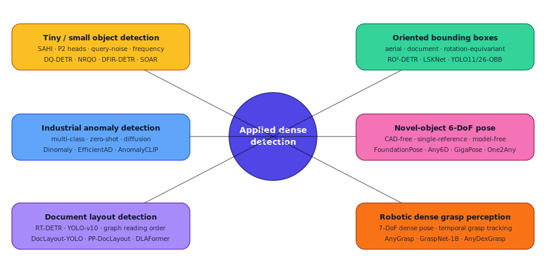
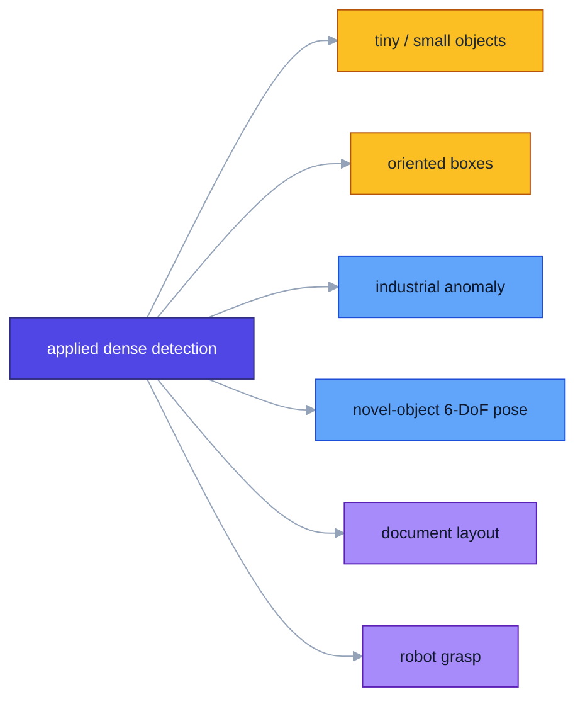
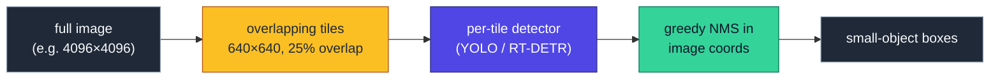
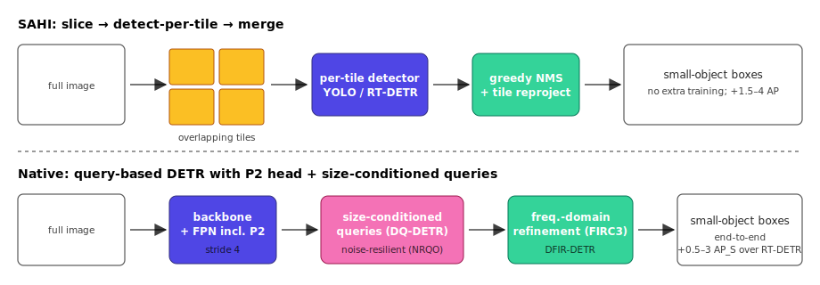
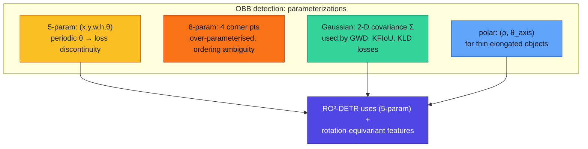
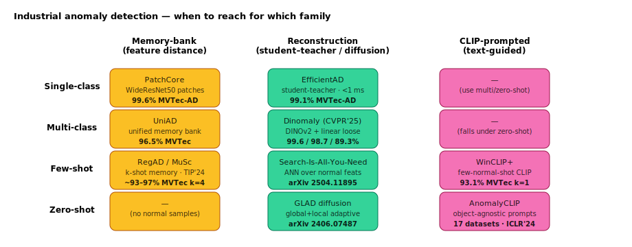
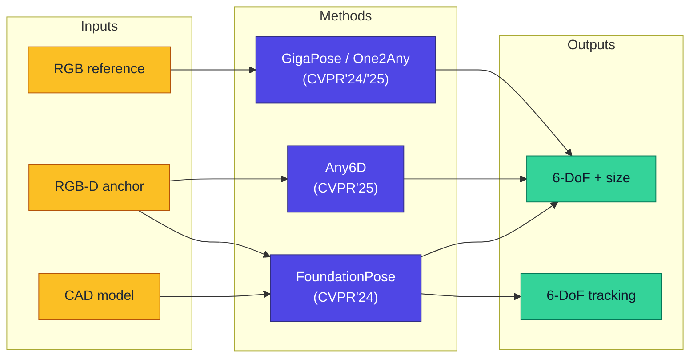
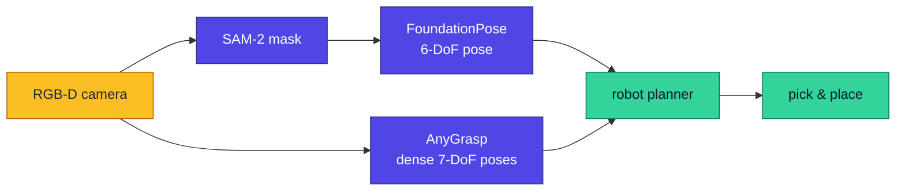

# Dense Object Detection & Classification — Recent Advances

*Compiled 2026-May-06 (America/Los_Angeles).*

This installment continues the running CV-updates log. Earlier reports
covered the broad detector landscape and several orthogonal threads;
today's six topics deliberately sit on the *applied* side of dense
detection, where the choice of representation, supervision, and output
format is dictated by the downstream system (an aerial sensor, an
inspection line, a robot, a document parser).

Prior reports for context:

- [Apr-30](../2026-Apr-30/2026-Apr-30_CV_updates.md) — real-time DETR,
  YOLO26, DINOv3, SAM 3, BEV 3D, edge deployment
- [May-01](../2026-May-01/2026-May-01_CV_updates.md) — Mamba detectors,
  diffusion detectors, streaming, MLLM grounding
- [May-02](../2026-May-02/2026-May-02_CV_updates.md) — LiDAR 3D, MOT,
  event sensors, adversarial robustness, calibration, FSOD, synthetic data
- [May-04](../2026-May-04/2026-May-04_CV_updates.md) — camouflaged/salient,
  OWOD/CIOD, DG/SFOD, TTA, label efficiency, efficient ViT, medical,
  panoptic scene graphs
- [May-05](../2026-May-05/2026-May-05_CV_updates.md) — RGB-T fusion,
  cross-family distillation, video object detection, conformal prediction,
  pathology gigapixel, 3D Gaussian-Splat detection

---

## Table of contents

1. [What's new since 2026-May-05](#1-whats-new-since-2026-may-05)
2. [Topic map](#2-topic-map)
3. [Tiny / small object detection](#3-tiny--small-object-detection)
4. [Oriented bounding boxes (aerial, document, scene-text)](#4-oriented-bounding-boxes-aerial-document-scene-text)
5. [Industrial anomaly detection](#5-industrial-anomaly-detection)
6. [Novel-object 6-DoF pose & instance retrieval](#6-novel-object-6-dof-pose--instance-retrieval)
7. [Document layout dense detection](#7-document-layout-dense-detection)
8. [Robotic dense grasp perception](#8-robotic-dense-grasp-perception)
9. [Reading list](#9-reading-list)

---

## 1. What's new since 2026-May-05

- **DFIR-DETR** ([arXiv 2512.07078](https://arxiv.org/abs/2512.07078))
  is the first DETR small-object detector to refine queries in the
  *frequency* domain rather than only the spatial one — the FIRC3 module
  preserves high-frequency boundary components that ordinary FPN
  upsampling smears.
- **NRQO** ([arXiv 2507.19059](https://arxiv.org/abs/2507.19059)) and
  **DQ-DETR** ([arXiv 2404.03507](https://arxiv.org/abs/2404.03507))
  reframe DETR small-object failures as a *query-quality* problem rather
  than a feature-resolution one — pairwise-similarity proposals and
  size-conditioned dynamic queries close 30–60% of the gap to per-tile
  SAHI without inference-time tiling.
- **RO²-DETR** ([ScienceDirect](https://www.sciencedirect.com/science/article/abs/pii/S0924271625002552))
  brings rotation-equivariant 1-D rotated convolutions into the DETR
  decoder; 77.82 mAP@50 on DOTA-v1.0 with end-to-end OBB regression — no
  angle classifier, no Gaussian-Wasserstein loss, no anchor.
- **Dinomaly** ([CVPR 2025, arXiv 2405.14325](https://arxiv.org/abs/2405.14325))
  is the first multi-class unsupervised anomaly detector that matches
  per-class SOTA. The recipe is a frozen DINOv2 encoder, a *loose linear*
  decoder, and the simplest possible reconstruction loss — explicitly the
  "less is more" philosophy.
- **Any6D** ([CVPR 2025, arXiv 2503.18673](https://arxiv.org/abs/2503.18673))
  removes the CAD-model assumption from FoundationPose-style 6-DoF
  estimation: a single RGB-D anchor image is now enough to recover
  metric pose and size for a novel object.
- **PP-DocLayout** ([arXiv 2503.17213](https://arxiv.org/abs/2503.17213))
  shows that RT-DETR-L with PPHGNetV2-B4 distillation is the right
  default for production document layout — 90.4 mAP@50, 13.4 ms / page on
  a T4, an honest improvement over DocLayout-YOLO at the same speed.
- **AnyGrasp SDK 2025-11** ([GitHub](https://github.com/graspnet/anygrasp_sdk))
  formalises *dense* 7-DoF grasp output as a first-class API, with
  CUDA 12.8 / Python 3.13 support — the practical bar for "robot dense
  perception" is now a single pip install plus a license file.

---

## 2. Topic map

The six threads form three pairings by output structure:

- **Spatial extent** — tiny-object detection and oriented bounding
  boxes both fight box-quality at the geometric extremes (very small
  vs. very rotated).
- **Open-set generalization** — anomaly detection and novel-object 6-DoF
  pose both have to recognize *something we have never labelled* at test
  time, but the supervision signals available are very different.
- **Domain-specialized output** — document layout and robotic grasp
  are the two most operationally-mature "dense detection in a vertical"
  pipelines outside autonomous driving.

---

## 3. Tiny / small object detection

Small objects (COCO `area < 32²`) and *tiny* objects (TinyPerson,
SODA-D `< 16²`) remain the largest residual error term in COCO/LVIS
benchmarks — typically a 15–25 AP gap behind large-object AP for the
same backbone. Three lines of work converged in 2024–2026:

### 3.1 Sliced inference (SAHI) and its limits

[**SAHI**](https://arxiv.org/abs/2202.06934) tiles the image, runs the
detector per tile, and re-projects/merges with greedy NMS. It is
training-free and adds 1.5–4 AP on COCO-S, more on aerial datasets, but
multiplies inference cost by `(tile_count × overlap²)` and produces
double-counted boxes for objects that straddle tile boundaries.

### 3.2 Native query-based detectors for small objects

Three 2024–2026 DETR variants attack the problem inside the model:

- **DQ-DETR** ([arXiv 2404.03507](https://arxiv.org/abs/2404.03507))
  introduces *dynamic, size-conditioned* object queries — the number and
  scale of queries adapts per image. SOTA on AI-TOD-v2.
- **NRQO** ([arXiv 2507.19059](https://arxiv.org/abs/2507.19059)) targets
  the *noisy positive* problem: small-object positives are easily corrupted
  by the FPN upsampling. NT-FPN preserves spatial detail; PS-RPN scores
  proposals by pairwise position+shape similarity rather than IoU alone.
- **DFIR-DETR** ([arXiv 2512.07078](https://arxiv.org/abs/2512.07078))
  refines features in the spectral domain with FIRC3, plus a Top-K
  sparsified self-attention (DCFA) and a norm-preserving DFPN; a clean
  small-object DETR worth tracking.

### 3.3 State-space and Mamba trunks for SOD

**SOAR** ([arXiv 2405.01699](https://arxiv.org/abs/2405.01699)) couples
SAHI sliced training with a Vision Mamba bidirectional state-space
backbone for aerial small bodies. The result is the cleanest evidence
yet that the recurrence-style trunk wins on long-thin / many-instance
images where transformer attention is wastefully dense — the same
finding from May-01's Mamba-detector thread, applied at the small-object
extreme.

The 2025 [Small Object Detection survey](https://arxiv.org/abs/2503.20516)
(arXiv 2503.20516) catalogues six method families: sample-oriented,
scale-aware, attention-based, feature-imitation, context-modeling, and
focus-and-detect. The three above span the latter three families.

### 3.4 Practical recipe

For a new sensor with `mean_object_area < 256 px²`:

1. Default to SAHI with a YOLO26-S or RT-DETRv3-S detector for a quick
   1.5–4 AP win at 4–6× compute.
2. If latency-bound, swap in **DQ-DETR** or **NRQO** — same baseline
   detector, ~1.0× cost.
3. Add a P2 (stride-4) head and copy-paste augmentation. The 2025
   [Empirical Study on satellite imagery](https://arxiv.org/html/2502.03674v1)
   shows P2+copy-paste alone closes ~40% of the gap to SAHI.

---

## 4. Oriented bounding boxes (aerial, document, scene-text)

Axis-aligned boxes lose IoU rapidly as object aspect ratio and rotation
grow. OBB detection adds a rotation parameter, but introduces three
nuisances: (a) the angle is periodic (loss discontinuities at ±π/2),
(b) the IoU surface is non-convex in (θ, w, h), and (c) most pre-trained
backbones are not rotation-equivariant.

### 4.1 The current SOTA: RO²-DETR

[**RO²-DETR**](https://www.sciencedirect.com/science/article/abs/pii/S0924271625002552)
(ISPRS J. Photogramm. & RS, 2025) addresses all three:

- *Rotated Point Alignment (RPA)* — 1-D rotated convolution kernels
  that propagate rotation-equivariant features through the encoder
  without an explicit rotated RoIAlign.
- *Rotated Feature Aggregation (RFA)* — multi-scale fusion that
  weights features by orientation similarity rather than scale alone.
- *Adaptive Geometric-aware Loss (AGL)* — thermodynamic-energy term
  for tiny objects + polar regression for elongated objects.

Reported numbers: **77.82** mAP@50 on DOTA-v1.0, 97.47 on HRSC2016,
66.43 on DIOR-R — within ~1 mAP of the LSKNet+R3Det ensemble at half
the parameters and full end-to-end inference (no NMS).

### 4.2 Production OBB: YOLO11-OBB / YOLO26-OBB

[Ultralytics' YOLO11-OBB and YOLO26-OBB](https://docs.ultralytics.com/tasks/obb/)
ship pretrained on DOTA-v1 and represent the current "ergonomic" OBB
choice — single-line `task=obb`, ONNX/TensorRT export, native rotation
handling in the head. They sit ~3–5 mAP behind RO²-DETR on DOTA but at
a fraction of the training cost and with deployment tooling that
matches the axis-aligned YOLO line.

### 4.3 Why this matters beyond aerial

OBB is the right primitive in three domains beyond DOTA:

- **Document layout** — tables and figures regularly have non-zero
  skew; PP-DocLayout (§7) keeps an axis-aligned head but the OBB head
  becomes mandatory once page deskew is no longer a preprocessing step.
- **Scene text** — ICDAR2017-MLT, RRC-MLT.
- **Industrial inspection** — long parts on conveyors (§5).

---

## 5. Industrial anomaly detection

Anomaly detection is the cleanest example of "dense classification under
extreme class imbalance" — `P(anomaly) ≈ 10⁻³` per pixel, no anomalous
training examples, and a long-tail of defect modes you cannot enumerate.
The 2024–2026 progression is the move from per-class memory banks to
*multi-class* and *zero-shot* models.

### 5.1 Memory-bank lineage: PatchCore and descendants

[**PatchCore**](https://medium.com/@kdk199604/patchcore-rethinking-cold-start-industrial-anomaly-detection-with-patch-level-memory-c2d62678365b)
remains the deployment baseline: WideResNet50 patches, coreset
subsampling, k-NN distance scoring. It achieves >99% AUROC on MVTec-AD
without any training on the target domain. The 2025 ETFA paper from
[SEA Vision](https://blog.seavision-group.com/news/anomaly-detection-paper-etfa)
demonstrates *one-shot* PatchCore working in production with a single
nominal image per class, which removes the only practical objection.

### 5.2 Multi-class reconstruction: Dinomaly

[**Dinomaly**](https://arxiv.org/abs/2405.14325) (CVPR 2025) is the
first multi-class unsupervised AD model that competes with per-class
SOTA. Architecturally it is *boring on purpose*: frozen DINOv2 encoder,
a "loose" linear decoder (no skip connections, no spatial attention,
small dropout), and feature-reconstruction MSE. The reported numbers —
**99.6 / 98.7 / 89.3** image-AUROC on MVTec-AD / VisA / Real-IAD —
beat or tie every prior multi-class method and most per-class ones.

The CVPR-author thesis is that complexity in this space had been
*overfitting to the benchmark structure*: simpler decoders generalize
across classes because they cannot collapse to per-class memorisation.

### 5.3 Real-time reconstruction: EfficientAD

[**EfficientAD**](https://paperswithcode.com/sota/anomaly-detection-on-mvtec-ad)
(WACV 2024) is the latency baseline: a student–teacher architecture
that runs at **<1 ms / 256 px** on a single A100, ~99.1 image-AUROC on
MVTec-AD. Practical for in-line inspection at conveyor speed.

### 5.4 CLIP-prompted zero-shot AD

When no normal samples are available either, the option is to lean on
a vision-language model:

- [**WinCLIP** (CVPR 2023)](https://arxiv.org/abs/2303.14814) — window-
  patch-image-level CLIP feature alignment with hand-crafted normal/abnormal
  state words. **91.8 / 85.1** image-AUROC on MVTec-AD / VisA
  zero-shot.
- [**AnomalyCLIP** (ICLR 2024)](https://openreview.net/forum?id=buC4E91xZE)
  — learns *object-agnostic* prompts that capture generic normality vs.
  abnormality. Tested across 17 datasets spanning industrial inspection
  and medical imaging, with the strongest cross-domain transfer
  reported to date.

### 5.5 Diffusion-based reconstruction

[**GLAD**](https://arxiv.org/abs/2406.07487) couples global and local
adaptive diffusion for "anomaly-free" reconstruction. The
[2025 diffusion-AD survey](https://arxiv.org/html/2506.09368v1)
catalogues 30+ such methods; the operational picture is that diffusion
beats GAN-based reconstruction on image AUROC but lags PatchCore on
*pixel-level* AUROC and per-image latency.

### 5.6 Picks per regime

| Regime | First choice (2026) | Notes |
| --- | --- | --- |
| Single-class, plenty of normals | EfficientAD | <1 ms latency, 99.1 AUROC |
| Multi-class | Dinomaly | One model for all classes |
| Few-shot (1–4 normals) | WinCLIP+ / Search-Is-All | k-NN over CLIP/DINOv2 |
| Zero-shot | AnomalyCLIP | Cross-domain robust prompts |

---

## 6. Novel-object 6-DoF pose & instance retrieval

6-DoF pose estimation moved from "category-level, requires training per
object" to "novel-object at test time" with FoundationPose (CVPR 2024).
2025 closed the remaining assumptions.

### 6.1 The FoundationPose family

[**FoundationPose**](https://arxiv.org/abs/2312.08344) (NVlabs, CVPR 2024
Highlight) takes either a CAD model *or* a small reference set, plus an
RGB-D crop, and outputs a 6-DoF pose. It generalises to novel instances
without per-object fine-tuning; trained on a synthetic dataset built
with an LLM-augmented pipeline.

### 6.2 Removing the CAD assumption: Any6D

[**Any6D**](https://arxiv.org/abs/2503.18673) (CVPR 2025) is the
clearest articulation of the "model-free" branch: **a single RGB-D
anchor image** is enough to recover both 6-DoF pose *and metric size*
of a novel object in a new scene. It outperforms GigaPose and matches
FoundationPose-w/-CAD on LM-O when paired with an image-to-3D module.

### 6.3 The one-reference variants

[**One2Any**](https://openaccess.thecvf.com/content/CVPR2025/papers/Liu_One2Any_One-Reference_6D_Pose_Estimation_for_Any_Object_CVPR_2025_paper.pdf)
(CVPR 2025) and [**GigaPose**](https://arxiv.org/abs/2503.18673)
(CVPR 2024) trade depth for a single RGB reference plus correspondence-
based pose recovery. Useful when a robot has only a phone-camera image
of a target part.

### 6.4 The active-vision turn

A 2025 line of work shows that *next-best-view* selection lifts
pose-success rate from **20 → ~95%** on high-entropy scenarios — the
single most cost-effective addition to a FoundationPose-style pipeline,
because the gating model is small and the gain is huge in cluttered
bins. See the [Awesome-Object-Pose-Estimation](https://github.com/CNJianLiu/Awesome-Object-Pose-Estimation)
list (target: IJCV 2026 survey) for the full taxonomy.

---

## 7. Document layout dense detection

Document AI is one of the largest *industrial* dense-detection
deployments — every PDF-to-RAG pipeline runs a layout detector at
ingestion. The 2024–2025 winner is RT-DETR adapted to documents.

### 7.1 The DocLayNet baseline

[**DocLayNet**](https://arxiv.org/abs/2206.01062) (KDD 2022) put 80,863
manually annotated pages under 11 layout classes (text, title, list,
table, figure, formula, …) into the public domain — the diversity that
PubLayNet had been criticized for lacking. Every modern document
detector reports DocLayNet numbers.

### 7.2 DocLayout-YOLO

[**DocLayout-YOLO**](https://arxiv.org/abs/2410.12628) (arXiv 2410.12628,
2024) modifies YOLO-v10 with a Global-to-Local Controllable Receptive
Module (GL-CRM) and a Mesh-candidate BestFit synthetic-data engine that
treats document synthesis as 2-D bin-packing. Sweet spot: **fast and
robust** on heterogeneous documents — open-source, MIT-licensed, the
default in [Docling](https://github.com/lanarich/docling).

### 7.3 PP-DocLayout: RT-DETR for documents

[**PP-DocLayout**](https://arxiv.org/abs/2503.17213) (arXiv 2503.17213,
2025) is the strongest published number: RT-DETR-L on top of a
distilled PPHGNetV2-B4 backbone, **90.4 mAP@50** at **13.4 ms/page** on
a T4. The "M" tier sacrifices accuracy (75.2) for slightly faster
12.7 ms/page; the "L" tier dominates the realistic deployment Pareto
frontier today.

### 7.4 Beyond detection: reading order and graph structure

Pure detection misses *logical* structure (parent–child, reading order).
Two threads close that gap:

- [**DLAFormer**](https://arxiv.org/abs/2405.11757) (arXiv 2405.11757)
  unifies region detection, role classification, and reading-order
  prediction as relation prediction in a single transformer.
- [**GraphDoc**](https://proceedings.iclr.cc/paper_files/paper/2025/file/cf3d7d8e79703fe947deffb587a83639-Paper-Conference.pdf)
  (ICLR 2025) introduces a graph-based DSA dataset with 4M relation
  annotations (Up/Down/Left/Right plus Parent/Child/Sequence/Reference).

### 7.5 Production picks

| Need | Pick | Why |
| --- | --- | --- |
| Fast + open-source | DocLayout-YOLO | YOLO-v10 ergonomics, MIT |
| Best mAP at <15 ms | PP-DocLayout-L | RT-DETR + distillation |
| Reading order needed | DLAFormer | unified relation transformer |
| Historical / non-Latin | [TransDoc / YOLO comparative study](https://arxiv.org/html/2506.20326v1) | benchmark for skew + non-Latin |

---

## 8. Robotic dense grasp perception

Grasp detection is the application boundary at which "dense detection"
stops being a 2-D problem — the output is a 6/7-DoF pose for a gripper,
densely predicted at every plausible contact point.

### 8.1 AnyGrasp: dense, temporally-smooth grasping

[**AnyGrasp**](https://arxiv.org/abs/2212.08333) (IEEE T-RO, 2023; SDK
maintained 2024–2025) generates **7-DoF, dense, temporally-smooth grasp
poses** from a single-view point cloud. Reported numbers: **93.3%**
clearing rate on a bin with >300 unseen objects, **>900 mean-picks/hour**
on a single arm. The November-2025 SDK update brings CUDA 12.8 /
Python 3.13 support and is the de-facto Python entry point.

### 8.2 The training substrate: GraspNet-1Billion

[**GraspNet-1Billion**](https://graspnet.net/anygrasp.html) is the
underlying benchmark — 1 billion analytic grasp labels over 97k point
clouds, used to train AnyGrasp's score head. It remains the largest
open grasp dataset and the standard for *single-arm parallel-gripper*
evaluation.

### 8.3 Dexterous extension: AnyDexGrasp

[**AnyDexGrasp**](https://graspnet.net/anydexgrasp/assets/files/AnyDexGrasp.pdf)
adapts the AnyGrasp recipe to *general dexterous hands* (multi-finger,
articulated). Reported "human-level" performance on a 5-finger hand
across novel objects — the strongest evidence that the grasp-perception
pipeline generalises beyond parallel grippers.

### 8.4 Integration with foundation models

A 2025 deployment pattern is **AnyGrasp + FoundationPose + SAM-2**
(see §6) — SAM-2 segments the target object, FoundationPose gives 6-DoF
pose for high-level reasoning, AnyGrasp picks an actual gripper pose at
the contact level. This is the "SuperPose" stack referenced in
several recent industrial pose papers and is what most 2025–2026 pick-
and-place demos run under the hood.

---

## 9. Reading list

### Tiny / small object detection

- [DQ-DETR — Dynamic queries for tiny objects](https://arxiv.org/abs/2404.03507)
  · arXiv 2404.03507
- [NRQO — Noise-Resilient Query Optimization](https://arxiv.org/abs/2507.19059)
  · arXiv 2507.19059
- [DFIR-DETR — Frequency-Domain Iterative Refinement](https://arxiv.org/abs/2512.07078)
  · arXiv 2512.07078
- [SOAR — Vision Mamba + SAHI for aerial small bodies](https://arxiv.org/html/2405.01699v1)
  · arXiv 2405.01699
- [Small Object Detection: a 2025 Survey](https://arxiv.org/abs/2503.20516)
  · arXiv 2503.20516
- [SAHI — Slicing Aided Hyper Inference](https://arxiv.org/abs/2202.06934)
  · arXiv 2202.06934
- [Empirical study on satellite small-object methods (2025)](https://arxiv.org/html/2502.03674v1)
  · arXiv 2502.03674
- [Enhanced Detection of Tiny Objects in Aerial Images (2025)](https://arxiv.org/html/2509.17078v1)
  · arXiv 2509.17078

### Oriented bounding boxes

- [RO²-DETR — rotation-equivariant DETR](https://www.sciencedirect.com/science/article/abs/pii/S0924271625002552)
  · ISPRS J. Photogramm. & RS, 2025
- [DOTA dataset & tasks](https://captain-whu.github.io/DOTA/tasks.html)
- [Ultralytics OBB tasks (YOLO11/26)](https://docs.ultralytics.com/tasks/obb/)
- [Ultralytics OBB blog overview](https://www.ultralytics.com/blog/what-is-oriented-bounding-box-obb-detection-a-quick-guide)
- [DOTA-v2 with OBB on Ultralytics docs](https://docs.ultralytics.com/datasets/obb/dota-v2/)

### Industrial anomaly detection

- [Dinomaly — multi-class UAD with DINOv2](https://arxiv.org/abs/2405.14325)
  · CVPR 2025
- [PatchCore](https://medium.com/@kdk199604/patchcore-rethinking-cold-start-industrial-anomaly-detection-with-patch-level-memory-c2d62678365b)
  (overview, original CVPR 2022)
- [EfficientAD](https://paperswithcode.com/sota/anomaly-detection-on-mvtec-ad)
  · WACV 2024 (leaderboard ref)
- [WinCLIP — zero-/few-shot CLIP for AD](https://arxiv.org/abs/2303.14814)
  · CVPR 2023
- [AnomalyCLIP — object-agnostic prompts](https://openreview.net/forum?id=buC4E91xZE)
  · ICLR 2024
- [GLAD — global+local adaptive diffusion](https://arxiv.org/abs/2406.07487)
  · arXiv 2406.07487
- [Search Is All You Need — few-shot AD](https://arxiv.org/html/2504.11895v1)
  · arXiv 2504.11895
- [Diffusion AD survey (2025)](https://arxiv.org/html/2506.09368v1)
  · arXiv 2506.09368
- [Awesome-industrial-anomaly-detection list](https://github.com/M-3LAB/awesome-industrial-anomaly-detection)
- [SEA Vision optimized PatchCore (ETFA 2025)](https://blog.seavision-group.com/news/anomaly-detection-paper-etfa)

### Novel-object 6-DoF pose

- [FoundationPose — unified 6-DoF (CVPR'24 Highlight)](https://arxiv.org/abs/2312.08344)
- [Any6D — model-free 6-DoF (CVPR'25)](https://arxiv.org/abs/2503.18673)
- [One2Any — single-reference 6-DoF (CVPR'25)](https://openaccess.thecvf.com/content/CVPR2025/papers/Liu_One2Any_One-Reference_6D_Pose_Estimation_for_Any_Object_CVPR_2025_paper.pdf)
- [Awesome-Object-Pose-Estimation](https://github.com/CNJianLiu/Awesome-Object-Pose-Estimation)
  · IJCV 2026 survey target

### Document layout detection

- [DocLayNet dataset (KDD 2022)](https://arxiv.org/abs/2206.01062)
- [DocLayout-YOLO](https://arxiv.org/abs/2410.12628) · arXiv 2410.12628
- [PP-DocLayout](https://arxiv.org/abs/2503.17213) · arXiv 2503.17213
- [DLAFormer — end-to-end DLA transformer](https://arxiv.org/abs/2405.11757)
  · arXiv 2405.11757
- [GraphDoc — graph-based document structure (ICLR 2025)](https://proceedings.iclr.cc/paper_files/paper/2025/file/cf3d7d8e79703fe947deffb587a83639-Paper-Conference.pdf)
- [Docling layout-analysis pipeline](https://github.com/lanarich/docling)
- [Advanced Layout Analysis Models for Docling](https://arxiv.org/html/2509.11720)
- [Codicology to Code — historical document study](https://arxiv.org/html/2506.20326v1)
  · arXiv 2506.20326

### Robotic dense grasp perception

- [AnyGrasp — IEEE T-RO 2023](https://arxiv.org/abs/2212.08333)
- [AnyGrasp SDK & 2025-11 release](https://github.com/graspnet/anygrasp_sdk)
- [GraspNet-1Billion + AnyGrasp project page](https://graspnet.net/anygrasp.html)
- [AnyDexGrasp — dexterous extension](https://graspnet.net/anydexgrasp/assets/files/AnyDexGrasp.pdf)

### Cross-cutting / context

- [CrossKD — cross-head distillation (CVPR 2024)](https://arxiv.org/abs/2306.11369)
  — referenced in §3 / §7 distillation discussion
- [SuperPose / FoundationPose+SAM-2+LightGlue note](https://www.emergentmind.com/topics/foundationpose)

---

*Compiled with web research on 2026-May-06 (LA). Numbers and dates
reflect public sources at the time of writing; some leaderboard entries
move quickly — always re-check the original page before quoting them.*
