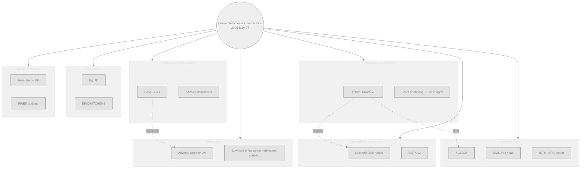
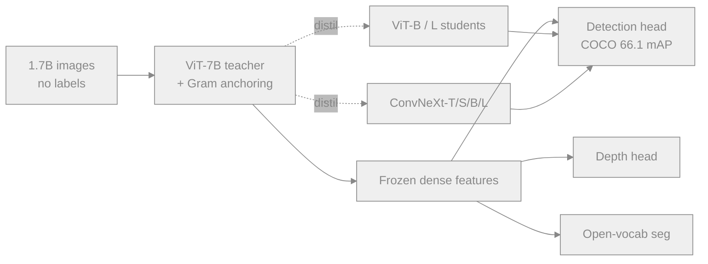
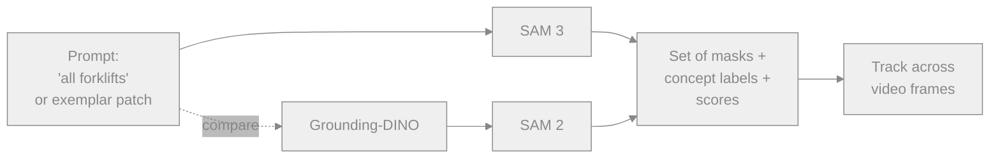
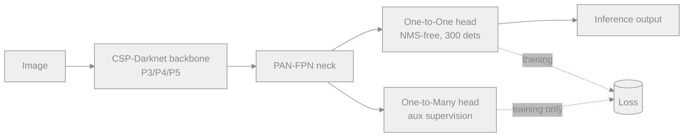
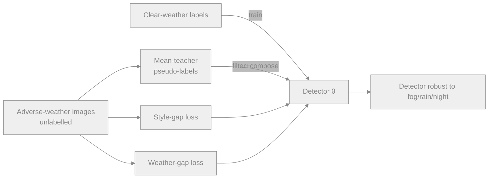
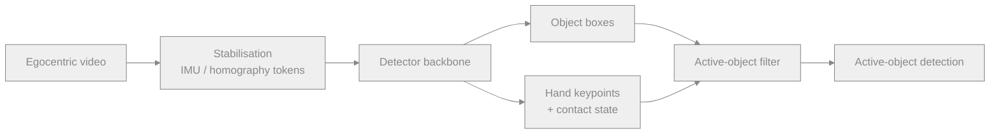
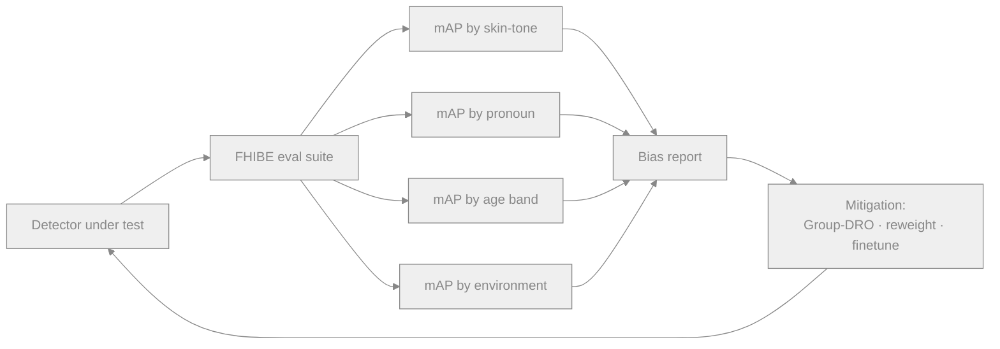

# Dense Object Detection & Classification — Recent Advances

*Compiled 2026-May-07 (America/Los_Angeles).*

This installment continues the running CV-updates log and deliberately
picks up threads not covered in earlier reports
([Apr-30](../2026-Apr-30/2026-Apr-30_CV_updates.md),
[May-01](../2026-May-01/2026-May-01_CV_updates.md),
[May-02](../2026-May-02/2026-May-02_CV_updates.md),
[May-04](../2026-May-04/2026-May-04_CV_updates.md),
[May-05](../2026-May-05/2026-May-05_CV_updates.md)).
The eight sections below focus on areas that have moved meaningfully
in the last few months and that previous installments did not address.

## Table of contents

1. [What's new since May-05](#1-whats-new-since-may-05)
2. [Topic map](#2-topic-map)
3. [Self-supervised foundation backbones: DINOv3 era](#3-self-supervised-foundation-backbones-dinov3-era)
4. [SAM 3 family — concept-prompt detection-as-segmentation](#4-sam-3-family--concept-prompt-detection-as-segmentation)
5. [YOLO26 — NMS-free, edge-first redesign](#5-yolo26--nms-free-edge-first-redesign)
6. [Oriented (rotated) object detection](#6-oriented-rotated-object-detection)
7. [Detection in adverse weather and low-light](#7-detection-in-adverse-weather-and-low-light)
8. [Egocentric / first-person detection](#8-egocentric--first-person-detection)
9. [Federated and privacy-preserving detection](#9-federated-and-privacy-preserving-detection)
10. [Fairness and demographic auditing of detectors](#10-fairness-and-demographic-auditing-of-detectors)
11. [Reading list](#11-reading-list)

---

## 1. What's new since May-05

| Thread                          | One-line take                                                                                                       |
| ------------------------------- | ------------------------------------------------------------------------------------------------------------------- |
| DINOv3 (Meta)                   | 7B SSL ViT, **COCO 66.1 mAP with frozen weights**; ConvNeXt distillates for compute-bound deployment.               |
| SAM 3 / 3.1 / SAM3-I            | "Promptable concept segmentation" — text/exemplar prompts return *all* instances; SAM3-I adds instruction-following. |
| YOLO26 (Ultralytics, Jan 2026)  | Drops DFL, ships an end-to-end NMS-free head, MuSGD optimiser, ~43% CPU speed-up vs YOLOv11.                        |
| Oriented detection              | DOTA-v2 (1.79M instances) and OBB-native YOLO26-OBB / Oriented-DETR variants take over remote-sensing leaderboards. |
| Adverse-weather DA              | Mean-teacher + decomposed *style-gap vs. weather-gap* losses; weather-aware DETRs reach within 2 mAP of clear-domain. |
| Egocentric detection            | Ego4D / EPIC-KITCHENS still anchor benchmarks; hand-object occlusion-aware DETRs and active-object heads dominate.   |
| Federated detection             | DP-FedDet frameworks hit near-SOTA on COCO/VOC under (ε=8) DP budgets; hierarchical aggregation handles non-IID.    |
| FHIBE                           | Sony AI / Nature 2025 release; first consented, demographically-stratified benchmark for person/face detection.     |

## 2. Topic map

A static SVG version (light/dark friendly, neutral strokes) is in
[`assets/topic-map.svg`](assets/topic-map.svg); the Mermaid view below
is the same idea in textual form so the file renders without external
asset support.



---

## 3. Self-supervised foundation backbones: DINOv3 era

**What changed.** Meta's DINOv3 (arXiv:2508.10104) scales the
DINO recipe to a 7B-parameter ViT trained on 1.7B unlabelled images.
The headline result for *dense* tasks: DINOv3's frozen backbone
reaches **66.1 COCO mAP** on object detection without any
fine-tuning, plus state-of-the-art zero-shot dense features for
depth and segmentation.

**Why it matters for detection.** Almost every dense head today is
gated by backbone quality. Treating DINOv3 as a frozen feature
extractor lets practitioners reuse one set of weights across detection,
segmentation, depth, and tracking, which collapses both training
budget and serving footprint.

**The trick — Gram anchoring.** Long SSL training schedules tend to
*degrade* the spatial structure of dense feature maps even while
global classification probes keep improving. DINOv3's Gram-anchoring
loss constrains the Gram matrix of patch features against a frozen
teacher snapshot, fixing this dense-feature collapse and producing
crisp per-patch embeddings that downstream detectors can read
directly.

**Distillation ladder.** The 7B teacher is distilled into a usable
ladder of students: ViT-{S, B, L} for accuracy-tuned use cases and
ConvNeXt-{T, S, B, L} for compute-constrained deployment — important
because frozen ViT-7B is impractical at the edge.



**Practical implication.** For new detection projects, the right
default is no longer "ImageNet-21k init"; it is either
DINOv3-distilled ViT-B or DINOv3-ConvNeXt-L, with the head fine-tuned
and the backbone optionally frozen. Roboflow has practitioner-level
walkthroughs for this swap.

- Paper: <https://arxiv.org/abs/2508.10104>
- Meta release: <https://ai.meta.com/dinov3/> · <https://ai.meta.com/blog/dinov3-self-supervised-vision-model/>
- Practitioner guide: <https://blog.roboflow.com/train-dinov3/>
- Technical deep dive: <https://www.lightly.ai/blog/dinov3>
- OpenCV write-up: <https://opencv.org/dinov3/>

---

## 4. SAM 3 family — concept-prompt detection-as-segmentation

The line between detection and instance segmentation has been
collapsing for two years; SAM 3 is where the merger becomes the
default. SAM 3 (arXiv:2511.16719, Meta, Nov 2025) introduces
**promptable concept segmentation**: given a short noun phrase
("blue forklift") or an exemplar image patch, the model returns
every instance of that concept in an image or video.

| Model       | What it adds                                                       | Format              |
| ----------- | ------------------------------------------------------------------ | ------------------- |
| SAM 1 (2023) | promptable mask given point/box                                    | per-instance        |
| SAM 2 (2024) | streaming + video memory, mask propagation                         | per-instance        |
| **SAM 3** (2025) | text & exemplar concept prompts, *all* instances at once       | open-vocab detection-segmentation |
| **SAM 3.1** (Meta blog, Q1 2026) | multiplexed prompts, global reasoning, faster real-time video | tracking            |
| **SAM3-I** (arXiv:2512.04585) | instruction-following extension; cascaded adaptation            | reasoning prompts   |

**Why this is a *detection* paper.** SAM 3 doubles the previous
SOTA on image and video promptable concept segmentation, and the
underlying head is operationally identical to an open-vocabulary
detector — it produces a set of (mask, score, label) tuples per
prompt. For workflows that want masks, SAM 3 replaces the
"Grounding-DINO → SAM" two-stage pipeline that has been the
de-facto open-vocabulary detector recipe since 2024.

**Where Grounded-SAM still wins.** The community has not retired
Grounded-SAM-2: licence flexibility, lighter dependency footprint,
and easier fine-tuning continue to favour the assembled pipeline
for many production stacks. Expect both to coexist through 2026.



- SAM 3 paper: <https://arxiv.org/abs/2511.16719>
- SAM 3.1 announcement: <https://ai.meta.com/blog/segment-anything-model-3/>
- SAM3-I paper: <https://arxiv.org/abs/2512.04585>
- Ultralytics integration docs: <https://docs.ultralytics.com/models/sam-3/>
- Grounded-SAM 2 retrospective: <https://pyimagesearch.com/2026/01/19/grounded-sam-2-from-open-set-detection-to-segmentation-and-tracking/>

---

## 5. YOLO26 — NMS-free, edge-first redesign

Ultralytics released YOLO26 on **January 14, 2026** (preprint
arXiv:2509.25164 / 2602.14582). Unlike most of the YOLO lineage,
YOLO26 *reduces* architectural complexity. The motivating
constraint is deployability on CPUs, NPUs, and accelerator-light
edge boxes (Jetson Orin, Raspberry Pi 5, Ryzen AI NPU,
mobile-phone NPUs).

### Architectural changes worth noting

- **Dual-head**:
  - *One-to-One* head: end-to-end output `(N, 300, 6)`,
    no post-hoc NMS.
  - *One-to-Many* head: legacy YOLO output `(N, nc + 4, 8400)`,
    used as auxiliary supervision and for accuracy-priority
    deployments.
- **DFL removed**. Distribution Focal Loss (used since YOLOv8) is
  dropped — fewer ops in the head, faster export to ONNX/TFLite, and
  no measurable accuracy loss on COCO.
- **STAL — Small-Target-Aware Label Assignment**, paired with
  **ProgLoss**, addresses the long-standing YOLO weakness on
  sub-32 px instances (drone footage, tiny-pedestrian detection).
- **MuSGD optimiser** replaces SGD/AdamW. Closes the convergence gap
  versus DETR-family training while remaining compatible with mixed
  precision.
- **Tasks**: detection, instance segmentation, classification,
  pose, OBB — all in one weight family.

### Quantization & deployment

YOLO26 is qualified for **FP16 and INT8** post-training quantization
without a separate QAT step on most of the small/medium variants;
INT4 results exist in third-party reports but are not part of the
official benchmark suite. AMD's January 2026 deployment note
demonstrates ~22 ms end-to-end on a Ryzen AI NPU for YOLO-World
(open-vocab variant).

| Model     | NMS in graph | DFL | Quant. defaults | Notes                         |
| --------- | ------------ | --- | --------------- | ----------------------------- |
| YOLOv8    | yes          | yes | INT8 (PTQ ok)   | mature exports                |
| YOLOv11   | yes          | yes | INT8 (PTQ ok)   | accuracy-leaning              |
| **YOLO26** | **no (1-to-1 head)** | **no** | INT8 native, FP16 | edge-first; +43% CPU speed |



- arXiv: <https://arxiv.org/abs/2509.25164> · <https://arxiv.org/abs/2602.14582>
- Docs: <https://docs.ultralytics.com/models/yolo26/>
- LearnOpenCV summary: <https://learnopencv.com/yolov26-real-time-deployment/>
- Roboflow walk-through: <https://blog.roboflow.com/yolo26/>
- Ryzen AI NPU deployment note: <https://www.amd.com/en/developer/resources/technical-articles/2026/deploying-object-detection-model-on-amd-ai-pc.html>
- Hardware-specific tuning: <https://www.ultralytics.com/blog/how-to-make-yolo-models-fast-on-your-favorite-chip>

---

## 6. Oriented (rotated) object detection

Earlier reports covered crowds, BEV 3D, and aerial detection in
broad strokes but did not address **oriented bounding boxes (OBB)**
specifically. OBBs encode `(cx, cy, w, h, θ)` rather than the
axis-aligned `(x1, y1, x2, y2)`; they tighten IoU under rotation
and dominate aerial, scene-text, microscopy, document-layout, and
pose-anchored detection.

### Dataset state-of-the-art

- **DOTA-v2** (captain-whu) — 18 categories (now including *airport*
  and *helipad*), 11,268 images, **1,793,658 instances**. The de-facto
  oriented-detection benchmark in 2026.
- The **DOTA survey** (ScienceDirect 2024) summarises the metric
  landscape (rotated mAP, AP_50, AP_75) and points out that
  >50% of papers report only on DOTA-v1, which inflates absolute
  numbers; v2 results are typically 4–8 mAP lower on the same head.

### What's working

- **Oriented-DETR variants** — extending DETR's set-prediction loss
  with angle-aware Hungarian matching (typically Gaussian Wasserstein
  distance on rotated boxes) avoids the periodicity discontinuity
  that plagued earlier regression-based oriented detectors.
- **YOLO26-OBB** — first time the YOLO release ships native OBB heads
  in the same checkpoint family rather than as an afterthought; OBB
  shares the dual-head design from §5.
- **Box-boundary-aware vectors** (BBAVectors-style heads) remain
  competitive when angles are sparse, because they avoid the angle
  parameterisation altogether by predicting four boundary vectors.
- **Dynamic deformable convolution + self-normalising attention** —
  small-but-effective change for arbitrary orientation in dense
  vehicle / ship clusters.

```mermaid
%%{init: {"theme":"base","themeVariables":{
  "primaryColor":"#88888822","primaryBorderColor":"#888",
  "primaryTextColor":"#888","lineColor":"#888"}} }%%
flowchart TB
    A[(cx,cy,w,h,θ) regression] -- periodicity issue --> P{Discontinuity at ±π/2}
    P --> S1[Gaussian Wasserstein loss]
    P --> S2[BBAVectors: 4 boundary vectors]
    P --> S3[CSL — circular smooth label]
    S1 --> H[Oriented-DETR]
    S2 --> H2[BBAVectors heads]
    S3 --> H3[YOLO26-OBB]
```

- DOTA homepage: <https://captain-whu.github.io/DOTA/>
- DOTA-v2 in Ultralytics: <https://docs.ultralytics.com/datasets/obb/dota-v2/>
- OBB task docs (YOLO): <https://docs.ultralytics.com/tasks/obb/>
- 2024 DOTA survey: <https://www.sciencedirect.com/science/article/pii/S1569843224005648>
- BBAVectors (WACV21): <https://github.com/yijingru/BBAVectors-Oriented-Object-Detection>
- Dynamic deformable conv + SN-attention: <https://www.mdpi.com/2079-9292/12/9/2132>

---

## 7. Detection in adverse weather and low-light

Detection in fog, rain, snow, glare, and night-time imagery is
where domain shift bites hardest. Two convergent threads matter
in 2026.

### a) Decomposed style/weather domain adaptation

Recent UDA work splits the clear→adverse gap into a **style gap**
(camera ISP, colour balance, contrast) and a **weather gap**
(scattering, occlusion, motion). Loss functions that target each
gap separately — typically a CycleGAN-ish style loss plus a
physics-informed weather loss — outperform monolithic alignment.

### b) Mean-teacher + high-quality pseudo-labels

A mean-teacher pair (teacher EMA of student weights) generates
pseudo-labels on adverse-weather targets, with **pseudo-label
filtering and composition** to reject low-quality boxes and
*compose* high-quality ones from cross-frame agreement. ECCV/Springer
2024 showed this revisit of pseudo-label generation closes most of
the remaining UDA gap on Foggy Cityscapes / RTTS / BDD-100K-night.

### c) Detection-driven enhancement — and the opposite

- *Detection-driven enhancement* networks (DENet-style) train the
  enhancement front-end with the detector loss, so cleanup serves
  the downstream task rather than human perception.
- **Weather-Aware DETR** (arXiv:2504.10877) flips this: it adds a
  weather-conditioning token to the DETR encoder, letting the
  detector adapt internally rather than rely on a separate
  enhancement model. Reported within ~2 mAP of clear-domain
  performance on RTTS.

### d) Adversarial image translation

Lightweight Pix2Pix adverse→clear translators feeding YOLOv8 / YOLO26
remain a strong baseline when target-domain data is scarce — at
the cost of an extra forward pass.



- Source-free 3D adverse weather UDA: <https://ieeexplore.ieee.org/document/10161341/>
- DA-RAW: <https://arxiv.org/html/2309.08152> · IEEE: <https://ieeexplore.ieee.org/document/10611219/>
- Pseudo-label generation/composition: <https://link.springer.com/chapter/10.1007/978-3-031-72764-1_16>
- Weather-Aware DETR: <https://arxiv.org/html/2504.10877>
- DENet: <https://openaccess.thecvf.com/content/ACCV2022/papers/Qin_DENet_Detection-driven_Enhancement_Network_for_Object_Detection_under_Adverse_Weather_ACCV_2022_paper.pdf>
- Adversarial image translation for autonomy: <https://pmc.ncbi.nlm.nih.gov/articles/PMC12520344/>

---

## 8. Egocentric / first-person detection

Egocentric video is the third frontier (after RGB still images and
exocentric video) where dense detection is being re-defined. The
core differences from third-person detection: severe motion blur,
extreme camera ego-motion, hand-object occlusion, persistent
near-field truncation, and a long-tailed object vocabulary
dominated by kitchen / workshop tools.

### Datasets that anchor the field in 2026

- **Ego4D** — 3,670 hours, 923 participants, 9 countries; PNR
  temporal localisation, **active object detection**, and
  state-change classification are first-class tasks.
- **EPIC-KITCHENS-100** — still the canonical kitchen benchmark;
  its action / object splits remain the comparison baseline.
- **Ego-Exo4D** — synchronised first- and third-person views; lets
  detectors learn ego-specific features supervised by clean
  exocentric labels.

### Methods that work

- **Active-object detection heads** narrow the prediction set to
  objects the wearer is currently interacting with — a
  detection-as-temporal-localisation framing (arXiv:2406.01079).
- **Hand-object interaction (HOI) detectors** that jointly predict
  hand keypoints, contact state, and grasped-object boxes show
  consistent gains over plain detection on HOI-heavy datasets.
- **Stabilisation features** — IMU-conditioned tokens or learned
  homography compensation injected into the detector backbone help
  the detector trust temporal aggregation despite ego-motion.



- Ego4D: <https://ego4d-data.org/>
- EPIC-KITCHENS overview: <https://huggingface.co/papers/1804.02748>
- Object-aware egocentric online action detection: <https://arxiv.org/abs/2406.01079>
- Egocentric HOI benchmark + method: <https://www.sciencedirect.com/science/article/abs/pii/S095741742503831X>
- 2026 dataset survey: <https://www.labellerr.com/blog/egocentric-datasets-robotics/>
- EgoVis CVPR 2025 workshop: <https://egovis.github.io/cvpr25/>

---

## 9. Federated and privacy-preserving detection

Pooling detection training data across hospitals, phones, vehicles,
and CCTV operators is increasingly blocked by GDPR and ISO/SAE
21434. Federated detection — train on each client, share only
parameters / gradients, aggregate centrally — is the emerging
workaround.

### What's working

- **DP-FedDet** (MDPI Mathematics 12(14)) — applies dynamic
  differential privacy *per layer*, with looser ε on the backbone
  (less sensitive) and tighter ε on the head (more sensitive).
  Reports near-SOTA on COCO and PASCAL VOC under ε≈8 budgets.
- **Hierarchical aggregation** (ACMMM 2024, "Adaptive Hierarchical
  Aggregation for Federated Object Detection") — clusters clients by
  data similarity before global aggregation, mitigating non-IID
  drift between, e.g., highway-camera fleets and warehouse cameras.
- **Photon-limited federated learning** — uses irreversible
  Poisson-photon sampling as an *intrinsic* privacy mechanism, not
  layered on top via DP noise. Promising for medical imaging where
  the raw modality already produces low-photon images.
- **Semi-supervised federated detection** — cuts the label burden
  on each client while staying inside the federation; OpenReview
  baseline beats fully-supervised single-client training when the
  federation has >10 clients.

### Open problems

- **Communication cost** — detection heads are heavy; sparsified
  uploads and quantised gradients are now table-stakes.
- **Adversarial clients** — Byzantine-robust aggregation is still
  immature for dense detection where one poisoned client can
  corrupt the FPN at all scales.
- **Heterogeneous backbones** — clients with different deployment
  hardware want different model sizes; *clustered federated
  distillation* (Sci. Rep. 2025) addresses this by sharing only
  logits / soft targets.

```mermaid
%%{init: {"theme":"base","themeVariables":{
  "primaryColor":"#88888822","primaryBorderColor":"#888",
  "primaryTextColor":"#888","lineColor":"#888"}} }%%
flowchart LR
    C1[Client 1<br/>vehicle fleet] -- DP gradients --> Agg[Hierarchical aggregator]
    C2[Client 2<br/>hospital] -- DP gradients --> Agg
    C3[Client 3<br/>retail CCTV] -- DP gradients --> Agg
    Agg --> G[Global detector]
    G -- distil .-> C1
    G -- distil .-> C2
    G -- distil .-> C3
```

- DP-FedDet: <https://www.mdpi.com/2227-7390/12/14/2150>
- Visual privacy-preserving federated detection (IEEE): <https://ieeexplore.ieee.org/document/10089464/>
- Adaptive hierarchical aggregation (ACMMM '24): <https://dl.acm.org/doi/10.1145/3664647.3681158>
- Photon-limited FL: <https://www.sciencedirect.com/science/article/abs/pii/S0020025526000423>
- Clustered federated distillation: <https://www.nature.com/articles/s41598-025-96468-8>
- Semi-supervised federated detection: <https://openreview.net/forum?id=2D7ou48q0E>
- Adaptive privacy-aware FL (2026): <https://journals.stmjournals.com/article/article=2026/view=240854/>

---

## 10. Fairness and demographic auditing of detectors

Detection deployments increasingly need stratified accuracy
reports across demographic groups, not a single mAP number.

### FHIBE — the new reference benchmark

The **Fair Human-Centric Image Benchmark** (Sony AI / Nature 2025,
PMC12675298) is the first public, *fully consented*, demographically
stratified benchmark covering eight human-centric tasks: pose
estimation, person segmentation, person detection, face detection,
face parsing, face verification, face reconstruction, and face
super-resolution. It supplies pixel-level, demographic, and
environmental annotations.

Why this matters for detection:

- The **person-detection split** lets practitioners report mAP not
  just on COCO-person but stratified across self-reported pronoun,
  skin-tone (Monk Scale), age band, and apparent gender expression.
- FHIBE's authors found that some current models systematically
  under-detect "She/Her/Hers"-pronoun individuals, traceable to
  *hairstyle variability* rather than to the labelled attribute
  itself — a useful demonstration that intersectional bias rarely
  has a single proximate cause.
- It enables *post-hoc* bias mitigation evaluation: re-weighting,
  group-DRO, or sampling fixes can be measured against the same
  external benchmark instead of a held-out slice of the training set.

### Method-level bias mitigation

- Group-DRO and Reduce-and-Reweight remain the strongest training-time
  interventions on detection mAP-by-group.
- *Demographic-label-free* fairness (MDPI Symmetry 18(2)) infers
  latent groups via clustering and then constrains group-conditional
  accuracy — useful when demographic annotations are absent.
- A 2024 survey of fairness in CV (arXiv:2408.02464) is still the
  best entry point for the methods landscape.



- FHIBE in *Nature*: <https://www.nature.com/articles/s41586-025-09716-2>
- FHIBE PMC mirror: <https://pmc.ncbi.nlm.nih.gov/articles/PMC12675298/>
- Sony AI announcement: <https://ai.sony/articles/Groundbreaking-Fairness-Evaluation-Dataset-From-Sony%20AI%20/>
- 2024 fairness in CV survey: <https://arxiv.org/html/2408.02464v1>
- Demographic-label-free fairness: <https://www.mdpi.com/2073-8994/18/2/344>
- Amazon Science: face-detection fairness via bias mitigation: <https://www.amazon.science/publications/enhancing-fairness-in-face-detection-in-computer-vision-systems-by-demographic-bias-mitigation>
- Ultralytics dataset-bias glossary: <https://www.ultralytics.com/glossary/dataset-bias>

---

## 11. Reading list

A condensed list to bookmark — one or two canonical links per topic
in this report.

- **DINOv3** — <https://arxiv.org/abs/2508.10104> · <https://ai.meta.com/dinov3/>
- **SAM 3** — <https://arxiv.org/abs/2511.16719> · <https://ai.meta.com/blog/segment-anything-model-3/>
- **SAM3-I (instructions)** — <https://arxiv.org/abs/2512.04585>
- **YOLO26** — <https://arxiv.org/abs/2509.25164> · <https://docs.ultralytics.com/models/yolo26/>
- **DOTA-v2** — <https://captain-whu.github.io/DOTA/>
- **DOTA / aerial detection survey 2024** — <https://www.sciencedirect.com/science/article/pii/S1569843224005648>
- **Weather-Aware DETR** — <https://arxiv.org/html/2504.10877>
- **DA-RAW** — <https://arxiv.org/html/2309.08152>
- **Ego4D** — <https://ego4d-data.org/>
- **Object-aware egocentric online action detection** — <https://arxiv.org/abs/2406.01079>
- **Federated DP detection** — <https://www.mdpi.com/2227-7390/12/14/2150>
- **Hierarchical FL aggregation** — <https://dl.acm.org/doi/10.1145/3664647.3681158>
- **FHIBE** — <https://www.nature.com/articles/s41586-025-09716-2>
- **Fairness in CV survey** — <https://arxiv.org/html/2408.02464v1>

*Diagrams use only Mermaid plus one inline SVG
(`assets/topic-map.svg`). Strokes/fills use neutral greys with
small accent hues so contrast holds in both light and dark
GitHub themes.*
