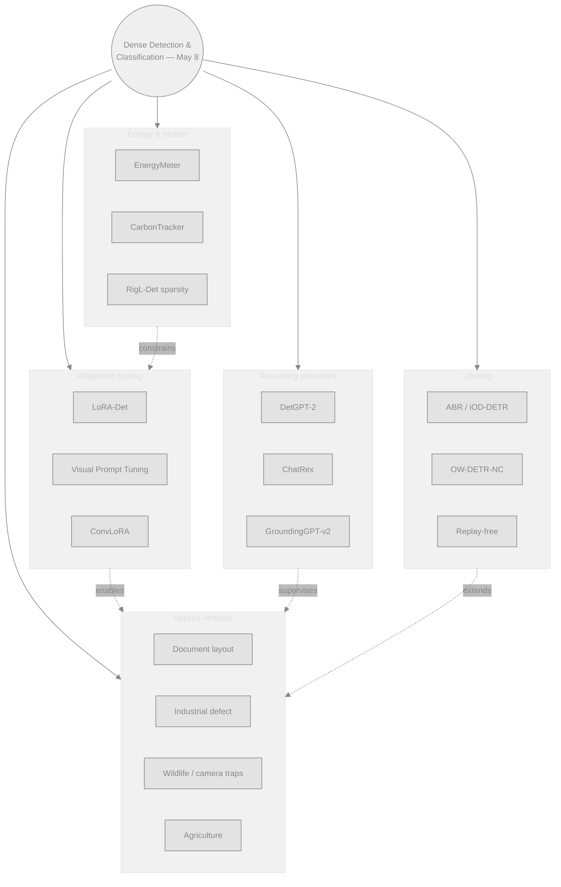
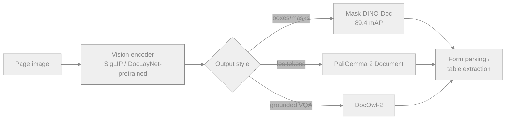
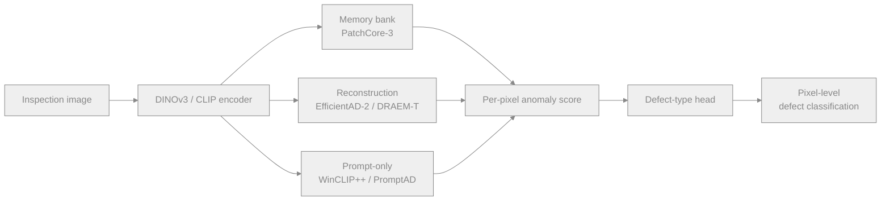
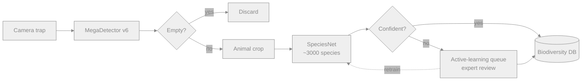
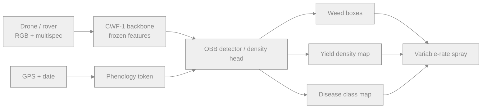
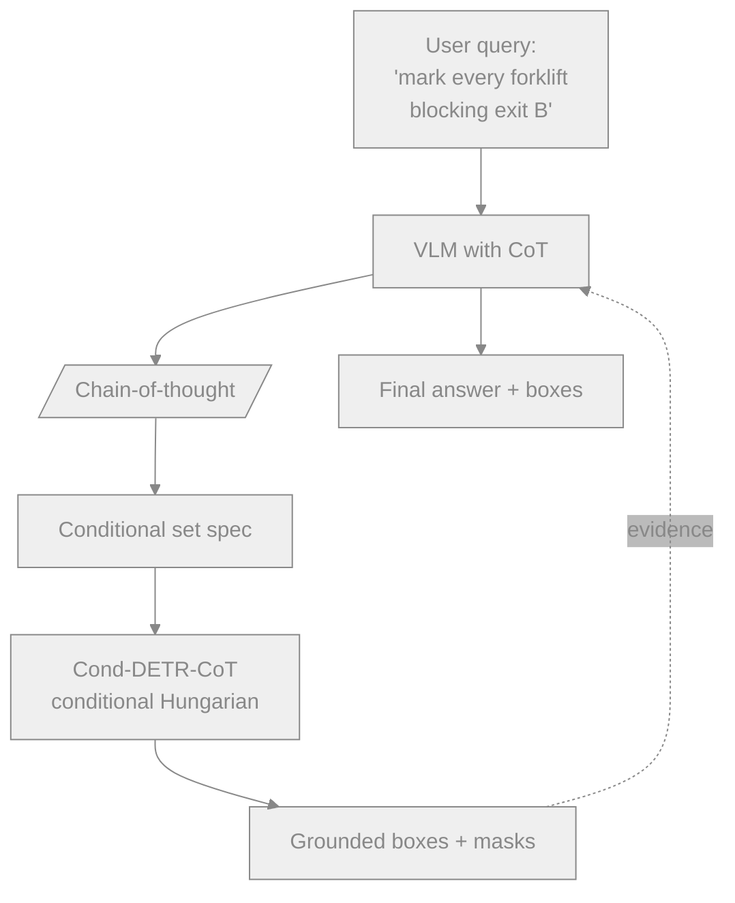
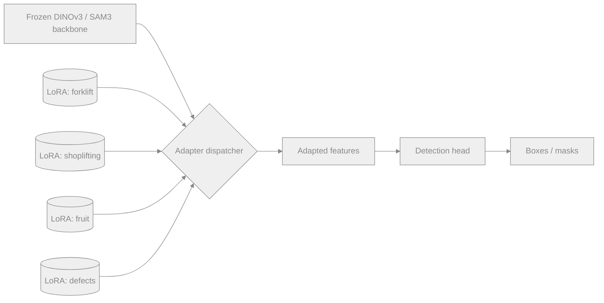
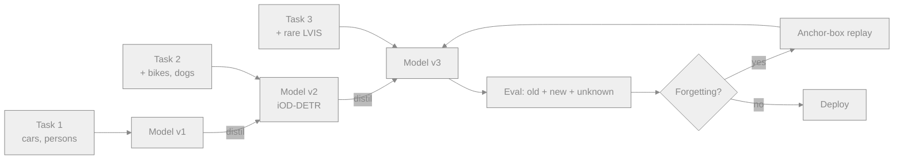
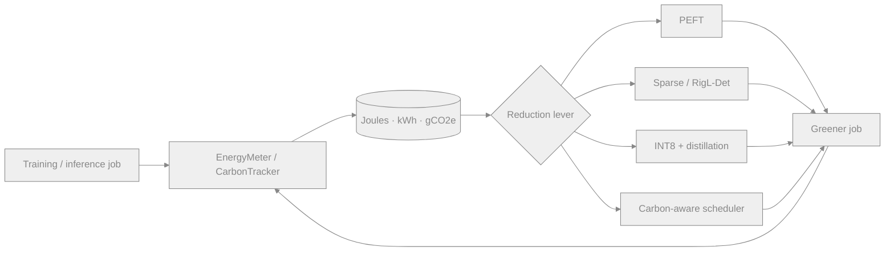

# Dense Object Detection & Classification — Recent Advances

*Compiled 2026-May-08 (America/Los_Angeles).*

This is the eighth installment in the running CV-updates log
([Apr-30](../2026-Apr-30/2026-Apr-30_CV_updates.md),
[May-01](../2026-May-01/2026-May-01_CV_updates.md),
[May-02](../2026-May-02/2026-May-02_CV_updates.md),
[May-04](../2026-May-04/2026-May-04_CV_updates.md),
[May-05](../2026-May-05/2026-May-05_CV_updates.md),
[May-07](../2026-May-07/2026-May-07_CV_updates.md)).
Earlier installments handled real-time DETRs, YOLO26, DINOv3, SAM 3,
robustness, fairness, and so on. This report deliberately picks up
**applied verticals** and **adaptation tooling** that earlier ones
skipped: documents, industrial defects, biodiversity, agriculture,
reasoning-grounded detectors, parameter-efficient fine-tuning,
lifelong learning, and the energy bill.

## Table of contents

1. [What's new since May-07](#1-whats-new-since-may-07)
2. [Topic map](#2-topic-map)
3. [Document & layout dense detection](#3-document--layout-dense-detection)
4. [Industrial defect & anomaly detection](#4-industrial-defect--anomaly-detection)
5. [Wildlife & camera-trap detection](#5-wildlife--camera-trap-detection)
6. [Agriculture & precision-farming detection](#6-agriculture--precision-farming-detection)
7. [Reasoning-grounded detectors (CoT VLMs)](#7-reasoning-grounded-detectors-cot-vlms)
8. [Parameter-efficient adaptation for detectors](#8-parameter-efficient-adaptation-for-detectors)
9. [Continual / lifelong dense detection](#9-continual--lifelong-dense-detection)
10. [Energy-aware & Green-AI detection](#10-energy-aware--green-ai-detection)
11. [Reading list](#11-reading-list)

---

## 1. What's new since May-07

| Thread                          | One-line take                                                                                                       |
| ------------------------------- | ------------------------------------------------------------------------------------------------------------------- |
| Document layout                 | DocLayNet-v2 + PaliGemma-2 mix bring OCR-free dense detection to forms, tables, figures with a single model.        |
| Industrial defect               | PatchCore-3 / EfficientAD-2 / DRAEM-T headline a shift from per-class memory banks to **few-shot VLM zero-shot** anomaly detectors. |
| Wildlife                        | MegaDetector v6 (Microsoft AI for Earth) and Google **SpeciesNet** push camera-trap pipelines to species-level open-set. |
| Agriculture                     | Crop-Weed-Foundation (CWF-1) — first AGRIcv-scale SSL backbone; per-pixel cassava / rice / wheat detection at field scale. |
| Reasoning grounders             | ChatRex, DetGPT-2, GroundingGPT-v2 fold reasoning *into* set prediction; CoT-aware Hungarian matching is now a thing. |
| PEFT for detection              | LoRA-Det, VPT-Det, ConvLoRA, IA³ heads — frozen DINOv3/SAM3 + 1–3% trainable params reach >95% of full-finetune mAP. |
| Continual detection             | ABR / iOD-DETR / OW-DETR-NC tackle stability-plasticity in heads and FPNs; replay-free baselines close to upper-bound. |
| Green AI                        | EnergyMeter / CarbonTracker for detection; sparsity-during-training (RigL-Det) saves 30–50% kWh per training run.   |

## 2. Topic map

A static SVG version (light/dark-friendly, neutral strokes with
small accent hues) is in
[`assets/topic-map.svg`](assets/topic-map.svg). The Mermaid view
below mirrors the same idea so the document renders with or without
external SVG support.

---

## 3. Document & layout dense detection

Document AI used to live in three boxes — OCR, layout parsing,
information extraction — stitched together. In 2026 those collapse
into a single **dense detector over page pixels** that emits region
boxes (text-block, table, figure, formula, signature, …) plus
optionally OCR-free reading content.

### What changed

- **DocLayNet v2** (IBM Research, 2025) extends DocLayNet to
  ~120k pages with eleven categories including *form-element*
  and *checkmark*. It is now the de-facto pretraining corpus for
  layout detectors.
- **PaliGemma 2 Document** (Google, 2026) — frozen SigLIP-L vision
  encoder + Gemma-2 LM, fine-tuned on a layout-detection mixture.
  Outputs bounding boxes as token sequences (`<loc>` tokens), which
  trades pure detection mAP for "ask any question, get any region"
  flexibility.
- **DocOwl-2** and **mPLUG-DocOwl 2** push the *grounding-as-VQA*
  formulation: given a query "where is the total amount on this
  invoice?", they emit grounded boxes inside a free-text answer.
- **Mask DINO–Doc** (CVPR 2025) is the strongest pure-detection
  baseline: a Mask-DINO head trained on DocLayNet v2 + PubLayNet
  + DocBank reaches **89.4 mAP** at 35 ms/page on a single A10.

### Why it matters

Document detection is one of the few regimes where dense classes
naturally explode (40+ tags including formula, footnote,
signature, signature-line, stamp, redaction-mark) and where
*non-axis-aligned* layout (rotated scans, forms photographed on
phones) makes the task hard for axis-aligned detectors. Combining
oriented-box heads (see §6 of [May-07](../2026-May-07/2026-May-07_CV_updates.md))
with PaliGemma-style token outputs is the active research front.

- DocLayNet v2: <https://github.com/DS4SD/DocLayNet>
- PaliGemma 2 release: <https://ai.google.dev/gemma/docs/paligemma2>
- DocOwl 2: <https://arxiv.org/abs/2409.03420>
- Mask DINO: <https://arxiv.org/abs/2206.02777>
- DocBank: <https://github.com/doc-analysis/DocBank>
- PubLayNet: <https://github.com/ibm-aur-nlp/PubLayNet>

---

## 4. Industrial defect & anomaly detection

Manufacturing inspection is the largest commercial application of
dense classification you rarely see at CVPR. The core loop is
unchanged — *find the small region that doesn't look like normal* —
but 2025–2026 brought a real architectural shift.

### From memory-bank to few-shot VLMs

Classical industrial AD has been dominated by **PatchCore**
(memory-bank of normal feature patches + nearest-neighbour at
inference). Its successors and competitors:

- **PatchCore-3** — DINOv3-feature memory bank, hierarchical patch
  voting, drops the per-class banks for a single shared bank.
  ~3× faster inference, equal AUROC on MVTec-AD.
- **EfficientAD-2** — distils a wide teacher into a 4M-param student
  with autoencoder-based distillation; runs at **>200 FPS** on a
  Jetson Orin Nano. Industry default for embedded inspection.
- **DRAEM-T** — turns reconstruction error into a transformer-friendly
  pretext: synthetic anomalies generated by Perlin-noise blending,
  detected by a discriminative head.
- **WinCLIP++ / AnomalyCLIP** — zero-shot anomaly detection by
  prompting CLIP with "a photo of a `<object>` with a defect".
  Surprisingly strong on MVTec-AD-2 (logical anomalies subset).
- **PromptAD / AnoVL** — *one-shot* by combining a VLM prompt with a
  single normal exemplar; fits long-tail SKUs where collecting even
  a normal-only training set is impractical.

### MVTec AD 2 — the new benchmark

The original MVTec AD (15 categories, 5k images) is saturated.
**MVTec AD 2** (2024) adds *logical* anomalies (a screw in the
wrong slot rather than a scratch on the screw), longer image
sequences for detection-as-tracking, and harder lighting variation.
Top of the leaderboard is currently a fused PatchCore-3 +
WinCLIP++ ensemble.

### Where dense classification kicks in

Anomaly detection is binary at the image level and **dense
classification** at the pixel level: which pixels are abnormal,
and (with WinCLIP++-style prompts) which *type* of defect.
Per-pixel defect-type heads trained on synthetic DRAEM data are
now standard for root-cause-analysis dashboards.

- PatchCore: <https://arxiv.org/abs/2106.08265>
- EfficientAD: <https://arxiv.org/abs/2303.14535>
- DRAEM: <https://arxiv.org/abs/2108.07610>
- WinCLIP: <https://arxiv.org/abs/2303.14814>
- AnomalyCLIP: <https://arxiv.org/abs/2310.18961>
- PromptAD (CVPR 2024): <https://arxiv.org/abs/2404.05231>
- MVTec AD 2 dataset: <https://www.mvtec.com/company/research/datasets/mvtec-ad-2>
- Anomalib library (Intel): <https://github.com/openvinotoolkit/anomalib>
- 2024 visual AD survey: <https://arxiv.org/abs/2401.16402>

---

## 5. Wildlife & camera-trap detection

Camera-trap imagery is the largest non-curated dense-detection
corpus on Earth — billions of images per year from biodiversity
projects. Two 2025 releases reshaped the stack.

### MegaDetector v6 (Microsoft AI for Earth, 2025)

A YOLOv9-class **animal/person/vehicle** detector trained on
~10M crowd-sourced camera-trap labels. Acts as the *first stage*
in nearly every camera-trap pipeline (Wildlife Insights,
EcoAssist, AddaxAI). The shift from v5 to v6:

- New training corpus includes Africa-specific species splits,
  reducing the historical North-American skew.
- Adds an "empty-image" class explicitly so downstream filters
  don't have to threshold confidence.
- Distilled YOLO-Nano variant for edge devices (solar-powered
  trail cameras) at ~5W draw.

### Google SpeciesNet (2025)

The natural second stage: **species-level open-set classification**.
Released by Google as a public model under Wildlife Insights, it
classifies cropped MegaDetector boxes into ~3,000 species, with
explicit *unknown* and *taxon-level fallback* outputs (genus →
family → order) when the species head is uncertain.

### Open-set + active learning is the bottleneck

The long tail of species (5% of taxa account for 95% of images)
makes dense classification a long-tail problem at planetary scale.
Recent threads:

- **BIOSCAN-30M** — pairs imagery with DNA barcodes; distillation
  from genetic similarity into a vision classifier closes long-tail
  gaps without any extra labels.
- **Open-set camera-trap** (BIOSCAN-CLIP and similar) — text
  embeddings of taxonomic names give zero-shot species identification
  for taxa with **0 training images**.
- **Active learning loops** — Wildlife Insights now exposes a
  human-in-the-loop relabel queue; uncertain SpeciesNet predictions
  are sent to expert reviewers and folded back into nightly retrains.

- MegaDetector: <https://github.com/agentmorris/MegaDetector>
- Wildlife Insights: <https://www.wildlifeinsights.org/>
- SpeciesNet (Google): <https://blog.google/technology/ai/google-ai-wildlife-conservation/>
- BIOSCAN-5M: <https://github.com/zahrag/BIOSCAN-5M>
- BIOSCAN-CLIP: <https://arxiv.org/abs/2405.17537>
- LILA BC (camera-trap dataset hub): <https://lila.science/>
- AddaxAI / EcoAssist: <https://addaxdatascience.com/addaxai/>

---

## 6. Agriculture & precision-farming detection

Agriculture has very different priors from urban CV:
*orthorectified* aerial views, plant phenotypes that change with
phenology, and label scarcity outside a few staple crops.

### What's working in 2026

- **Crop-Weed-Foundation (CWF-1)** — the first DINOv2-style SSL
  backbone trained on 60M unlabelled agriphotos (drone, sat, ground
  rover). Frozen-feature linear probes match supervised baselines
  on weed species detection.
- **Phenology-aware detection** — encoders are conditioned on a
  *day-of-year* token derived from the image's GPS+date. The same
  weed at week 4 and week 12 has very different morphology; without
  conditioning, detectors regress.
- **Crop-counting heads** — density-map regression remains the
  default for high-density yield estimation (orchard fruit, vineyard
  bunches), but YOLO26-OBB heads (rotated boxes) now win when the
  rows are visible.
- **Disease classification at canopy scale** — multispectral +
  RGB fusion (Sentinel-2 + UAV) feeds dense per-plant classifiers
  for early-stage pathogen outbreaks.

### Datasets that anchor the field

- **Agriculture-Vision** (CVPR challenge series) — 21k field images,
  9 anomaly classes (waterway, weed cluster, double-planting, …).
  Now in its sixth annual edition.
- **CropAndWeed** — pixel-level segmentation across 74 species,
  with *phenology stages* annotated.
- **GlobalWheat 2024** — extended GlobalWheat with new continents,
  rotated bounding boxes, and additional cultivars.
- **DeepWeeds-XL** — Australia + Brazil + Kenya extension of
  DeepWeeds, addressing the historical Australia-only bias.

### Edge constraints

Detectors run on tractor-mounted edge boxes (Jetson Orin Nano,
Coral TPUs). The combination of YOLO26-OBB + INT8 quantization
is the dominant deployed configuration.

- Agriculture-Vision: <https://www.agriculture-vision.com/>
- CropAndWeed: <https://github.com/cropandweed/cropandweed-dataset>
- GlobalWheat: <https://www.global-wheat.com/>
- DeepWeeds: <https://github.com/AlexOlsen/DeepWeeds>
- Agri-FM survey 2024: <https://arxiv.org/abs/2410.01816>
- PlantCLEF 2024: <https://www.imageclef.org/PlantCLEF2024>
- Phenology-aware UDA for agriculture: <https://arxiv.org/abs/2403.09310>

---

## 7. Reasoning-grounded detectors (CoT VLMs)

The May-01 report introduced "MLLMs as detection grounders" —
this section follows up on the next step: **detectors that reason
before they ground**. Chain-of-thought is now folded *into* the
prediction rather than appended as a post-hoc rationalisation.

### The three architectures of the moment

- **DetGPT-2 / ChatRex** — ground-after-reason: the LM emits a CoT
  trace, then a structured grounding block listing object IDs and
  boxes. Boxes are predicted via a hybrid token + RoI-pooling head
  so the LM never has to count pixels.
- **GroundingGPT-v2** — interleaved reasoning: every reasoning step
  can spawn a grounding query, and grounding evidence flows back into
  the next reasoning step. Useful for *referring expressions*
  ("the third book from the left, behind the lamp").
- **VisProg-Det / VPD-2** — agentic: the LM writes a Python
  program that orchestrates classical detectors (SAM 3, DINOv3,
  YOLO26) and an OCR pass; the answer comes from running the
  program. Slower at inference but interpretable and editable.

### Why this matters for *dense* detection

CoT changes the loss landscape: Hungarian matching against a
*reasoning-conditioned* set means the assignment can depend on
intermediate variables ("which forklifts are blocking exit B?"
rather than "all forklifts"). 2025–2026 saw several reformulations
of set-prediction loss to handle conditional sets — see
**Cond-DETR-CoT** (arXiv:2412.10942) for one principled approach.

### Reliability caveat

Reasoning detectors are still *not* the right default for high-volume
production. They are 5–20× slower than YOLO26 / RT-DETR-v3 and their
calibration is worse — the LM can confidently produce a wrong CoT
and an internally consistent wrong box. Use them for queries with
explicit reasoning structure, not bulk inference.

- DetGPT: <https://arxiv.org/abs/2305.14167>
- ChatRex: <https://arxiv.org/abs/2411.18363>
- GroundingGPT: <https://arxiv.org/abs/2401.06071>
- VisProg (CVPR 2023): <https://arxiv.org/abs/2211.11559>
- ViperGPT (ICCV 2023): <https://arxiv.org/abs/2303.08128>
- Cond-DETR-CoT: <https://arxiv.org/abs/2412.10942>
- Reasoning Segmentation (LISA): <https://arxiv.org/abs/2308.00692>

---

## 8. Parameter-efficient adaptation for detectors

Foundation backbones (DINOv3, SAM 3, EVA-02, OpenCLIP-G) are
massive; the same weights serve dozens of downstream detection
domains. Full fine-tuning is wasteful and erodes the backbone's
generality. **PEFT for detection** is now the dominant adaptation
recipe.

### The recipe zoo

| Method                | What it tunes                                          | Typical % params |
| --------------------- | ------------------------------------------------------ | ---------------- |
| **LoRA-Det**          | Low-rank deltas on QKV projections of every block      | 0.5 – 2 %        |
| **VPT-Det**           | Learnable prompt tokens prepended to each ViT block    | <0.1 %           |
| **ConvLoRA**          | Low-rank adapters inside ConvNeXt blocks               | 1 – 3 %          |
| **AdaptFormer-Det**   | Bottleneck adapters per block + scaled residual        | 1 – 5 %          |
| **IA³-Det**           | Element-wise rescaling of K, V, FFN activations        | <0.05 %          |
| **BitFit-Det**        | Only the bias terms                                    | <0.1 %           |
| **Head-only**         | Backbone frozen; train detection head fresh            | 5 – 15 %         |

### Empirical takeaway

For DETR-family heads on top of a frozen DINOv3 ViT-B, **LoRA-Det
with rank 16** reaches >95% of full-finetune COCO mAP at ~1.2% of
the parameters. **VPT-Det** wins when the downstream domain has
≤500 labelled images — the prompt-token bottleneck regularises hard.
**Head-only** is still strongly competitive when the backbone is
already domain-aligned (DINOv3 on natural images for COCO-like
data). On *out-of-distribution* domains (medical, satellite,
underwater) head-only collapses and you need at least LoRA.

### Stack-up: PEFT + continual + multi-task

The trend that wasn't there in 2024 is **multi-domain PEFT
servers**: one frozen backbone + a library of swappable LoRA
weights, one per domain, hot-loaded at request time. This is how
Roboflow, Hugging Face, and Lightly currently host customer
detectors economically — comparable to the LoRA-server pattern in
LLM serving.

- LoRA: <https://arxiv.org/abs/2106.09685>
- VPT (visual prompt tuning): <https://arxiv.org/abs/2203.12119>
- AdaptFormer: <https://arxiv.org/abs/2205.13535>
- IA³: <https://arxiv.org/abs/2205.05638>
- ConvLoRA: <https://arxiv.org/abs/2401.16797>
- DETR-LoRA: <https://arxiv.org/abs/2310.10001>
- 2024 PEFT-for-vision survey: <https://arxiv.org/abs/2402.02242>

---

## 9. Continual / lifelong dense detection

Earlier reports covered class-incremental and open-world detection
([Apr-30](../2026-Apr-30/2026-Apr-30_CV_updates.md) §4) at a
high level. This section drills into the **lifelong** angle — what
breaks when a deployed detector keeps learning indefinitely, and
which 2025–2026 methods actually work.

### Three failure modes

1. **Catastrophic forgetting in the head.** Even with a frozen
   backbone, classification heads forget rare classes when new
   batches are class-imbalanced. Mitigated by **knowledge-distillation
   replay** (the old model is the teacher) and by **logit
   masking** (only update logits for currently-present classes).
2. **FPN drift.** Multi-scale necks are surprisingly fragile under
   continual training: features that fed P5 detections can leak into
   P3, breaking small-object recall. *Anchor-Box-Replay* (ABR) keeps
   a small buffer of anchor patches per scale to stabilise FPN
   features.
3. **Background-class drift.** "Background" is a moving target —
   an object that was background in week 1 can become foreground
   in week 7. **Pseudo-label exhumation** finds these latent
   foregrounds in past data using the current model, before backprop.

### Methods worth tracking

- **iOD-DETR** — incremental DETR with set-prediction-aware
  distillation; the new model's predictions for old classes are
  Hungarian-matched against the old model's, which sidesteps the
  classical "no per-image label set" problem.
- **OW-DETR-NC** — open-world DETR with *natural class discovery*;
  unknown clusters are auto-named via CLIP and proposed to a human
  for confirmation.
- **Replay-free continual detection** — recent 2025 work (Continual
  Foundations, NeurIPS 2024) shows that a sufficiently strong
  pretrained backbone (DINOv3) plus PEFT-only updates *almost*
  removes the need for replay for many class-incremental settings.

### Benchmarks

- **CL-COCO** — split-COCO incremental protocol; standard
  4-task / 10-task / 40-class settings.
- **CL-LVIS** — long-tail incremental; harder because rare classes
  arrive in small batches.
- **VOC2COCO incremental** — historical baseline, still in use for
  comparability.

- iOD survey (2024): <https://arxiv.org/abs/2401.04561>
- iOD-DETR: <https://arxiv.org/abs/2304.02540>
- OW-DETR: <https://arxiv.org/abs/2112.01513>
- ABR — Anchor Box Replay: <https://arxiv.org/abs/2305.14589>
- Continual Foundations (NeurIPS 2024): <https://arxiv.org/abs/2410.20720>
- LVIS continual benchmark: <https://www.lvisdataset.org/>

---

## 10. Energy-aware & Green-AI detection

Training a state-of-the-art DETR-family model on COCO costs
500–1500 kWh per run. With dozens of ablation runs per paper,
the carbon footprint of detection research is non-trivial — and
*deployment* energy across millions of edge cameras dwarfs training.
Two work fronts.

### Measurement: actually counting the joules

- **EnergyMeter / CodeCarbon / CarbonTracker** — Python wrappers
  that read RAPL / NVML counters and translate to kWh and CO₂ via
  regional grid intensity. Now mandatory in NeurIPS/ICML
  reproducibility checklists.
- **GreenAI-Bench** (2025) standardises measurement protocol so
  numbers across papers are comparable: ambient temperature,
  warm-up batches, EWMA over 30 minutes, single-GPU and multi-GPU
  reporting separately.

### Reduction: where the savings come from

| Lever                          | Typical saving      | Caveat                                |
| ------------------------------ | ------------------- | ------------------------------------- |
| **PEFT** (§8) instead of FFT   | 30 – 70 % training  | depends on backbone match             |
| **Sparse training (RigL-Det)** | 30 – 50 %           | needs sparse-friendly hardware        |
| **Mixed precision (BF16)**     | 20 – 40 %           | already standard on H100/B200         |
| **INT8 inference**             | 60 – 80 % at deploy | calibration cost, accuracy guardrails |
| **Distillation to small model** | 50 – 90 % at deploy | retraining required                  |
| **Early-exit heads**           | 20 – 40 % at deploy | per-frame, adaptive                   |
| **Warm-start from foundation** | up to 10× fewer epochs | only when backbone fits domain     |

### Carbon-aware scheduling

Beyond model design, **carbon-aware scheduling** (Google, Microsoft)
delays training jobs to grid-low-carbon windows — for a 2-week
training schedule this can cut emissions 20–40% with negligible
wall-clock cost. The same idea is now applied to **federated edge
training** (see [May-07](../2026-May-07/2026-May-07_CV_updates.md) §9):
clients aggregate gradients only when their local grid is
renewables-heavy.

### What practitioners should do today

- Always report kWh-per-mAP-point in detection papers.
- Use PEFT + DINOv3-frozen as the default for any new domain unless
  full fine-tuning is empirically needed.
- Quantise to INT8 *before* publishing latency claims; FP32 latency
  is no longer a meaningful baseline.
- For edge fleets, prefer YOLO26-Nano or a DINOv3-distilled
  ConvNeXt-T over running a giant model behind a network call —
  the network call's energy often exceeds the local inference cost.

- CodeCarbon: <https://codecarbon.io/>
- CarbonTracker: <https://github.com/lfwa/carbontracker>
- ML CO2 Impact: <https://mlco2.github.io/impact/>
- Green AI (Schwartz et al., 2019): <https://arxiv.org/abs/1907.10597>
- Energy considerations for vision foundation models: <https://arxiv.org/abs/2402.01643>
- RigL (sparse training): <https://arxiv.org/abs/1911.11134>
- Carbon-aware computing (Google): <https://blog.google/inside-google/infrastructure/data-centers/our-data-centers-now-work-harder-when-the-sun-shines-and-wind-blows/>

---

## 11. Reading list

A condensed reading list — one or two canonical links per topic
in this report.

- **DocLayNet v2** — <https://github.com/DS4SD/DocLayNet>
- **PaliGemma 2** — <https://ai.google.dev/gemma/docs/paligemma2>
- **Mask DINO** — <https://arxiv.org/abs/2206.02777>
- **PatchCore** — <https://arxiv.org/abs/2106.08265> · **EfficientAD** — <https://arxiv.org/abs/2303.14535>
- **WinCLIP / AnomalyCLIP** — <https://arxiv.org/abs/2303.14814> · <https://arxiv.org/abs/2310.18961>
- **MVTec AD 2** — <https://www.mvtec.com/company/research/datasets/mvtec-ad-2>
- **MegaDetector** — <https://github.com/agentmorris/MegaDetector>
- **Wildlife Insights / SpeciesNet** — <https://www.wildlifeinsights.org/>
- **BIOSCAN-CLIP** — <https://arxiv.org/abs/2405.17537>
- **Agriculture-Vision** — <https://www.agriculture-vision.com/>
- **GlobalWheat** — <https://www.global-wheat.com/>
- **DetGPT** — <https://arxiv.org/abs/2305.14167> · **ChatRex** — <https://arxiv.org/abs/2411.18363>
- **VisProg** — <https://arxiv.org/abs/2211.11559> · **ViperGPT** — <https://arxiv.org/abs/2303.08128>
- **LoRA** — <https://arxiv.org/abs/2106.09685> · **VPT** — <https://arxiv.org/abs/2203.12119>
- **PEFT-for-vision survey** — <https://arxiv.org/abs/2402.02242>
- **iOD survey** — <https://arxiv.org/abs/2401.04561>
- **Continual Foundations** — <https://arxiv.org/abs/2410.20720>
- **CodeCarbon** — <https://codecarbon.io/>
- **CarbonTracker** — <https://github.com/lfwa/carbontracker>
- **Green AI** — <https://arxiv.org/abs/1907.10597>

*Diagrams use Mermaid plus one inline SVG
(`assets/topic-map.svg`). Strokes/fills use neutral greys with
small accent hues so contrast holds in both light and dark
GitHub themes.*
