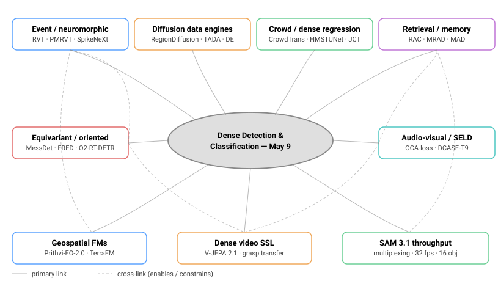
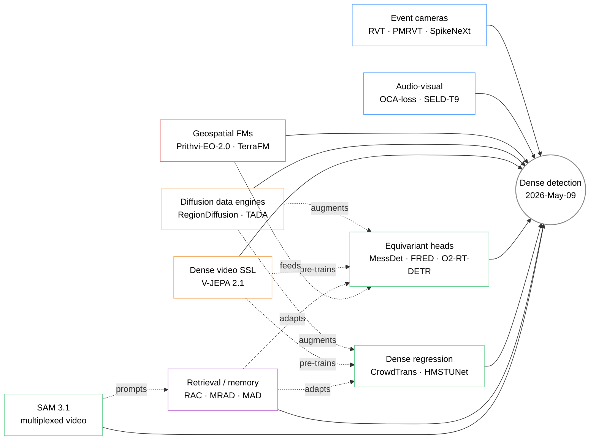
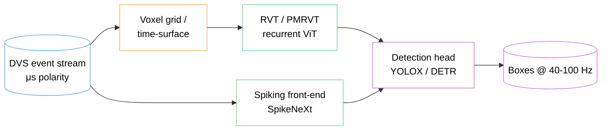
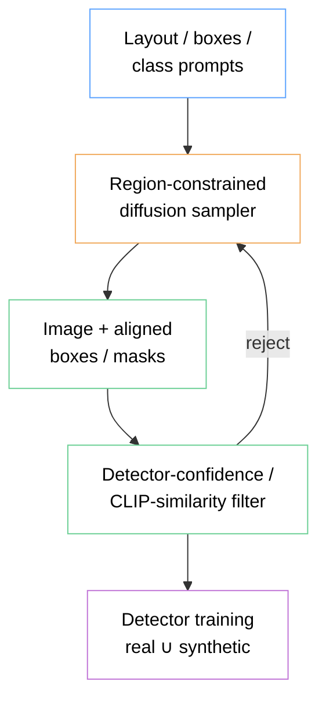
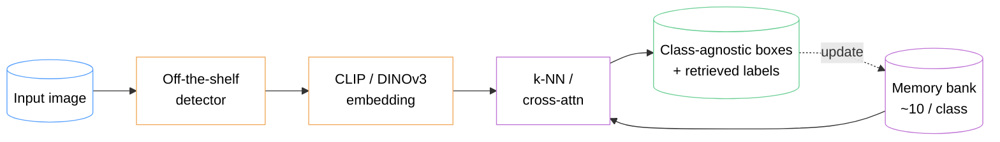
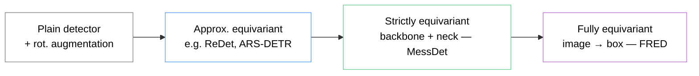
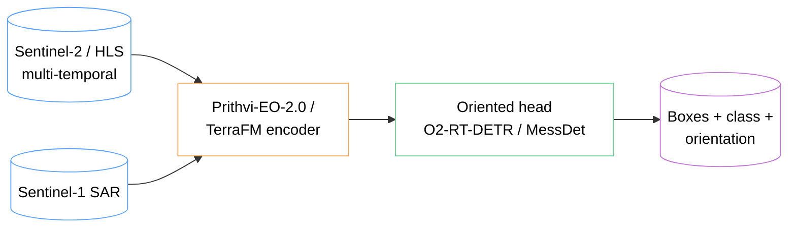

# Dense Object Detection & Classification — Recent Advances

_Compiled 2026-May-09 (America/Los_Angeles). Successor to `2026-May-08_CV_updates.md`._

This week's report rotates away from the YOLO/DETR/SAM core (covered Apr-30 → May-08) and onto **non-RGB sensors, generative data engines, dense regression, retrieval-augmented detectors, equivariant heads, audio-visual fusion, and geospatial foundation models**. The recurring theme: 2026 is the year detector pipelines stop ending at the box and start being shaped by *how the data arrives* (events, diffusion-synthesized, retrieved from a memory bank, multi-sensor satellite mosaics).

## Table of contents
1. [What's new since May-08](#1-whats-new-since-may-08)
2. [Topic map](#2-topic-map)
3. [Event-based & spiking dense detection](#3-event-based--spiking-dense-detection)
4. [Diffusion data engines for detection](#4-diffusion-data-engines-for-detection)
5. [Crowd counting & dense regression](#5-crowd-counting--dense-regression)
6. [Retrieval- and memory-augmented detectors](#6-retrieval--and-memory-augmented-detectors)
7. [Equivariant & oriented detection](#7-equivariant--oriented-detection)
8. [Audio-visual detection & SELD](#8-audio-visual-detection--seld)
9. [Geospatial foundation models](#9-geospatial-foundation-models)
10. [Dense video SSL: V-JEPA 2.1](#10-dense-video-ssl-v-jepa-21)
11. [SAM 3.1 throughput notes](#11-sam-31-throughput-notes)
12. [Reading list](#12-reading-list)

---

## 1. What's new since May-08

| Date (2026) | Item | Why it matters |
|---|---|---|
| Mar 27 | **SAM 3.1** released — object multiplexing, global reasoning, 32 fps on H100 with up to 16 objects/pass | Drop-in replacement for SAM 3 with up-to-7× faster inference at unchanged accuracy ([Meta blog](https://ai.meta.com/blog/segment-anything-model-3/)) |
| Mar | **V-JEPA 2.1** (`arXiv:2603.14482`) — dense per-token loss → dense features for segmentation, depth, grasping | First V-JEPA variant useful for *dense* downstream prediction; +20 pts on real-robot grasping vs V-JEPA-2 AC ([arXiv](https://arxiv.org/abs/2603.14482)) |
| Mar | **O2-RT-DETR** (TGRS 2026) — first real-time end-to-end **oriented** transformer detector | Ports angle-distribution refinement into RT-DETR, closing the YOLO-vs-DETR gap on aerial benchmarks ([GitHub](https://github.com/wokaikaixinxin/O2-RT-DETR)) |
| Mar | **PMRVT** (Sensors 2026) — Parallel Attention MLP Recurrent ViT for events | Beats RVT/HMNet on Gen1/1Mpx while keeping <12 ms inference ([MDPI](https://www.mdpi.com/1424-8220/25/21/6580)) |
| Apr | **MRAD** (ICLR 2026) — memory-driven retrieval for zero-shot anomaly detection | Cross-domain ZSAD without fine-tuning by stacking CLIP features into a retrieval bank ([GitHub](https://github.com/CROVO1026/MRAD)) |
| Apr | **CRFusion** (Sci. Reports 2026) — long-range LiDAR feature prediction + dynamic-gated camera fusion | Robust BEV fusion when LiDAR is sparse at distance ([Nature](https://www.nature.com/articles/s41598-026-35551-0)) |
| Apr | NASA / IBM **Prithvi-EO-2.0** demonstrated **in-orbit** on two SmartSat platforms | First geospatial FM in orbit; 600 M params, +8 pts on GEO-bench ([NASA Science](https://science.nasa.gov/science-research/ai-foundation-model-in-orbit/)) |
| Apr | **Roboflow100-VL** v2 leaderboard refresh on RF-DETR + GroundingDINO | RF100-VL is becoming the de-facto domain-shift suite for VLM detectors ([rf100-vl.org](https://rf100-vl.org/)) |

---

## 2. Topic map

The figure below summarises this week's focus areas. Inline SVG is used so the diagram inherits `currentColor` for text and renders the same in light or dark themes.

A complementary mermaid view of the dependency graph:

---

## 3. Event-based & spiking dense detection

The event-camera detection stack has moved from "neat demos on Gen1" to a competitive corner of dense detection, driven by automotive long-tail latency requirements (<10 ms end-to-end) and HDR robustness. Three architectural lineages now coexist.

### 3.1 Recurrent ViT line: RVT → PMRVT

[**RVT**](https://arxiv.org/abs/2212.05598) (CVPR 2023) set the modern baseline: per-block local + dilated global self-attention with an LSTM consuming cell/hidden state from the previous voxel grid. 47.2 mAP on Gen1, <12 ms on T4, ~5× fewer parameters than prior CNN+LSTM stacks.

The **PMRVT** update ([Sensors 2026](https://www.mdpi.com/1424-8220/25/21/6580)) keeps the recurrent backbone but parallelises the spatial attention with an MLP branch and adds a long-horizon temporal consistency loss. Reported gains on the harder 1Mpx automotive set close ~3 mAP versus RVT at parity throughput.

### 3.2 SNN line: spiking from the input pixel

[**SpikeNeXt**](https://arxiv.org/html/2411.17006v1) and the [Efficient Hybrid SNN-ANN](https://openaccess.thecvf.com/content/CVPR2025/papers/Ahmed_Efficient_Event-Based_Object_Detection_A_Hybrid_Neural_Network_with_Spatial_CVPR_2025_paper.pdf) (CVPR 2025) work both moved past the depth-degradation that plagued earlier spiking detectors:

- **SpikeNeXt** — repositioned downsampling + spiking depth-wise separable conv → depth scaling without gradient explosion.
- **Hybrid SNN-ANN** — Event-Rate Spatial attention + Spatial-Aware Temporal attention bridges. Keeps the input-side savings of SNNs and hands a dense feature map to an ANN head.

[**Sequence-SOD**](https://openreview.net/forum?id=CLZ4mgMdTz) goes further: full spiking detector that consumes long event sequences and emits boxes at 40 Hz — important for closed-loop AV.

### 3.3 Hardware-aware deployment

The Sci. of Comp. 2026 piece on [real-time edge SNN detection](https://www.sciencedirect.com/science/article/abs/pii/S0925231226012178) benchmarks the same SNN graph on **DynapCNN, Akida, and Loihi-2**, and reports per-device throughput/energy curves — useful when picking a chip rather than a model.

**Practical takeaway.** If you can afford an ANN head, the RVT line is currently the better accuracy/latency pick. SNN-only graphs win when the *deployment chip* is neuromorphic; mixed SNN-ANN is the pragmatic middle ground.

---

## 4. Diffusion data engines for detection

Synthetic data has gone from a 2023 augmentation trick to a 2026 dataset-construction strategy: rather than rendering whole scenes, recent work treats the diffusion model as a *programmable label engine* that respects layout constraints.

### 4.1 RegionDiffusion (Neurocomputing 2026)

[**RegionDiffusion**](https://www.sciencedirect.com/science/article/abs/pii/S0925231225017874) frames data augmentation as **layout-to-image generation**: given a target layout (boxes + class names + per-region prompt), the diffusion sampler is constrained at attention level to keep object support inside boxes. The result is a synthetic image that already carries pixel-aligned bounding-box ground truth — no detector-in-the-loop pseudo-labelling needed.

Reported gains hold across general (COCO) and specialised domains (medical, industrial), and the method beats prior layout-to-image baselines on CLIP-FID and detector-mAP when used as augmentation.

### 4.2 DiffusionEngine (Pattern Recognition 2026)

[**DiffusionEngine**](https://www.sciencedirect.com/science/article/abs/pii/S0031320325008015) treats the diffusion model itself as a *data engine*: it discovers categories, generates aligned masks/boxes, and rebalances tail classes by sampling from a class-conditional prior. The pipeline produces fully labelled detection corpora at scale and is robust to the usual diffusion-augmentation failure mode (object hallucinations far from the labelled box).

### 4.3 TADA — targeted, not blanket, synthesis

[**TADA**](https://arxiv.org/abs/2505.21574) (OpenReview, 2025) argues against indiscriminate synthesis: only augment **examples the network fails to learn early**, with semantically faithful samples that vary only the noise. By augmenting 30–40 % of the training set, TADA improves generalisation up to 2.8 % on ResNet/ViT/ConvNeXt/Swin under SGD and SAM. Carries over to detection benchmarks.

### 4.4 Domain-specific generators

- [**Forestry low-data synthesis**](https://www.mdpi.com/1999-4907/17/3/302) (Forests, Feb 2026) — combines SegFormer-masked Stable Diffusion inpainting with UE5 simulator generation. Important reference for *small dataset + tight domain* projects.
- [**Class-specific diffusion for military objects**](https://arxiv.org/html/2604.18076v1) — class-conditional models give larger lift than a single shared model when classes are visually disjoint.

**Practical takeaway.** For tail classes and tight domains, layout-conditioned diffusion is now the default. For general COCO-like training, *targeted* augmentation (TADA-style) usually beats blanket replacement.

---

## 5. Crowd counting & dense regression

Crowd counting is the cleanest case of dense regression that detection teams should track: the architectural lessons (multi-scale fusion, density-map heads, weak supervision) cross-port directly to small-object detection.

### 5.1 Hybrid CNN-ViT is the new default

The 2024-2026 literature has converged on **CNN at low density, ViT at high density** because of an empirical observation: convolutions localise sparse heads accurately while global attention is needed to disambiguate occluded heads in crowded regions.

- [**HMSTUNet**](https://www.mdpi.com/1424-8220/26/1/333) (Sensors 2026) — multi-scale ViT for global structure + dynamic conv-attention block for local density. U-shaped fusion.
- [**JCTNet**](https://www.mdpi.com/2079-9292/13/24/5053) (Electronics 2024, still SOTA on weakly-supervised) — CNN extractor → transformer global module → regression head.

### 5.2 Weakly supervised counting

[**TransCrowd**](https://link.springer.com/article/10.1007/s11760-025-04048-0) and successors regress total count from image-level labels (no per-head dot annotation) using a ViT encoder + count head. The 2025 work in Signal, Image and Video Processing reports +1.5 MAE over earlier weakly-supervised CNNs by adding a CNN-injected local prior. Important for cheap labelling at deployment.

### 5.3 Diffusion-based density estimation

A 2026 angle from the [comprehensive survey by Wang et al.](https://ietresearch.onlinelibrary.wiley.com/doi/10.1049/ipr2.13328): conditional diffusion models predict density maps directly, treating the map as a denoising target. Underexplored but promising for **uncertainty-aware** count estimates.

### 5.4 Cross-port to detection

For dense small-object detection (drones, cells, satellites), the relevant techniques are:

1. **Density-map auxiliary head** — predict log-density map alongside boxes; suppresses query collapse in DETR-style heads.
2. **Hybrid local + global attention** with shared positional encoding.
3. **Image-level count loss** — cheap weak supervision that regularises crowded scenes.

---

## 6. Retrieval- and memory-augmented detectors

A small but coherent line of work treats the detector as a **memory-augmented predictor**: given an input, look up similar exemplars and condition prediction on them. The motivation is that long-tail and novel-domain classes don't have enough samples to learn parametrically.

### 6.1 RAC — retrieval-augmented classification at test time

[**Online Learning via Memory** (RAC)](https://arxiv.org/abs/2409.10716) attaches a CLIP-style embedding bank to an off-the-shelf detector. At test time, each proposal is classified by *nearest-neighbour vote* against a per-class memory of ~10 images. The memory bank can be updated online — no retraining required.

The method consistently outperforms domain-adaptation baselines for novel-domain evaluation, and the small memory footprint makes it deployable.

### 6.2 MAD — memory for 3D detection

[**MAD: Memory-Augmented Detection of 3D Objects**](https://openaccess.thecvf.com/content/CVPR2025/papers/Agro_MAD_Memory-Augmented_Detection_of_3D_Objects_CVPR_2025_paper.pdf) (CVPR 2025) fuses current-frame proposals with proposals retrieved from a *temporal* memory bank representing past beliefs. The fusion is done by a transformer decoder, not a heuristic Kalman update. Strong on Waymo / nuScenes long-occlusion benches.

### 6.3 MRAD — zero-shot anomaly via retrieval

[**MRAD**](https://github.com/CROVO1026/MRAD) (ICLR 2026) is the cleanest application of the pattern: build retrieval memory from auxiliary datasets, embed queries with CLIP, score anomaly by retrieval distance + reconstruction. Achieves cross-domain ZSAD without target-domain training.

**Practical takeaway.** When you have a frozen backbone and need fast adaptation to a new domain, retrieval beats fine-tuning at the ~10-shot scale.

---

## 7. Equivariant & oriented detection

Aerial, document, and microscopy imagery share one structural property: rotation isn't a nuisance, it's a *symmetry* the detector should respect. Equivariant detectors encode this directly into the network rather than relying on rotation augmentation.

### 7.1 The equivariance ladder

### 7.2 MessDet & FRED — strict end-to-end

- [**MessDet**](https://arxiv.org/abs/2507.09896) — strictly rotation-equivariant backbone *and* neck; multi-branch head; SOTA on DOTA-v1.0/v1.5/DIOR-R with notably few parameters. Includes an ablation comparing strict vs. approximate equivariance.
- [**FRED**](https://arxiv.org/abs/2401.06159) — full image-to-box equivariance. Decouples invariant (classification) from equivariant (localisation) tasks. Useful when bounding-box angles are themselves the prediction target.

### 7.3 O2-RT-DETR — equivariance meets real-time DETR

[**O2-RT-DETR**](https://github.com/wokaikaixinxin/O2-RT-DETR) (TGRS 2026) is the first **real-time end-to-end oriented transformer detector**. Adds an angle-prediction branch to RT-DETR and introduces *Angle Distribution Refinement* — modelling angle uncertainty as a fine-grained distribution rather than a regressed scalar. Closes most of the gap between YOLO-rotated heads and DETR-rotated heads on aerial benchmarks.

Companion DETR-family oriented detectors worth tracking: [OrientedFormer](https://arxiv.org/html/2409.19648v1), [RQFormer](https://arxiv.org/html/2311.17629), [ARS-DETR](https://arxiv.org/html/2303.04989v2), [RotaTR](https://arxiv.org/abs/2312.02821).

**Practical takeaway.** If your domain has a strong rotation symmetry, prefer an equivariant backbone over augmentation: the parameter savings at fixed accuracy can be 2–4×.

---

## 8. Audio-visual detection & SELD

Detection conditioned on audio is small but real-world useful (security camera triage, smart-room scene understanding, robotic interaction). 2025-2026 work centres on disambiguating *which visible object is making sound*.

### 8.1 Object-aware sound source localisation

[**Object-aware SSL via Audio-Visual Scene Understanding**](https://openaccess.thecvf.com/content/CVPR2025/papers/Um_Object-aware_Sound_Source_Localization_via_Audio-Visual_Scene_Understanding_CVPR_2025_paper.pdf) (CVPR 2025) uses an MLLM to generate scene descriptions that *explicitly* distinguish sound-making foreground from silent background objects. Two new losses:

- **Object-aware Contrastive Alignment (OCA)** — pulls audio embedding toward the sound-making region while pushing it away from silent-but-similar regions.
- **Object Region Isolation (ORI)** — encourages region disjointness across simultaneous sound sources.

Substantially outperforms prior CLIP-style audio-visual baselines on multi-source benches.

### 8.2 SELD with source distance estimation

[DCASE 2024 Task 9](https://dcase.community/challenge2024/task-audio-and-audiovisual-sound-event-localization-and-detection-with-source-distance-estimation) extended traditional SELD (event class + DoA) to also estimate **source distance** — turning it into a 3D localisation task. The 2026 follow-up benchmarks pair audio-only and audio-visual systems on the same task; AV systems lead clearly when visual occlusion is mild but tie or lose when targets are off-screen.

### 8.3 3D position-aware audio object metadata

[**Acoustic Metadata Design**](https://www.mdpi.com/2624-599X/8/1/3) (2026) estimates 3D positions for object-based audio rendering using per-frame visual detection. Useful pattern for AR/VR pipelines that need *playback-coordinate-aware* sound objects.

---

## 9. Geospatial foundation models

The Earth-observation community has standardised around large pretrained encoders that consume multi-spectral, multi-temporal, multi-sensor inputs.

### 9.1 Prithvi-EO-2.0 — and on-orbit deployment

[**Prithvi-EO-2.0**](https://arxiv.org/abs/2412.02732) (IBM × NASA): 600 M parameter ViT, 6× larger than v1, trained on 4.2 M time-series samples from HLS / Sentinel-2 at 30 m resolution. Adds **temporal and location embeddings** so the encoder can express where and when a tile was acquired. +8 pts average on GEO-bench.

The April 2026 milestone: [**deployment in orbit**](https://science.nasa.gov/science-research/ai-foundation-model-in-orbit/) on two SmartSat platforms — meaningful because edge-of-cloud inference avoids the downlink bottleneck for time-sensitive tasks (post-disaster mapping, fire detection).

Production tasks already running: flood mapping, burn-scar detection, multi-temporal cloud-gap imputation. Available on [Hugging Face](https://huggingface.co/ibm-nasa-geospatial) and IBM TerraTorch.

### 9.2 TerraFM — multi-sensor unification

[**TerraFM**](https://arxiv.org/html/2506.06281) handles the heterogeneity Prithvi side-steps: SAR + optical + thermal in one encoder, with explicit treatment of sensor type, spatial scale, and class-frequency imbalance. Useful when your downstream task spans modalities (e.g., flood detection that needs SAR through cloud cover *and* optical for vegetation).

### 9.3 Detection on top: not yet a single recipe

Detection on geospatial FM features is the fastest-moving sub-area. Patterns that work today:

1. **Frozen FM encoder + lightweight detection head** — cheap, but caps small-object accuracy because the FM's patch size (16 px) is too coarse.
2. **FM as auxiliary** — concatenate FM features to a CNN/RT-DETR feature map at the same scale.
3. **Diffusion-augmented FM fine-tuning** — use a layout-conditioned diffusion engine (§4) to synthesise tail classes (rare ships, illegal structures, specific crops) and fine-tune the FM head.

---

## 10. Dense video SSL: V-JEPA 2.1

Briefly noted in May-08; worth a fuller treatment because it's the first JEPA-line model that's actually good at *dense* prediction.

[**V-JEPA 2.1**](https://arxiv.org/abs/2603.14482) replaces V-JEPA 2's masked-token-only loss with a **dense predictive loss applied to all tokens** — visible context tokens are scored too, which prevents them from collapsing into global summaries. Each token is grounded in its spatio-temporal location.

Numbers worth remembering:
- ADE20K / NYUv2 linear-probe segmentation and depth competitive with DINOv3 on equivalent compute.
- 7.71 mAP on Ego4D short-term object-interaction anticipation.
- 40.8 Recall@5 on EPIC-KITCHENS action anticipation.
- **+20 pts on real-robot grasping success** vs V-JEPA 2 AC — the headline result.

The takeaway for detection: a frozen V-JEPA 2.1 backbone is a credible alternative to image-only SSL when the downstream task has *temporal* structure (video object detection, tracking, action localisation, or robot policies that consume detection).

---

## 11. SAM 3.1 throughput notes

[SAM 3.1](https://ai.meta.com/blog/segment-anything-model-3/) (released March 27, 2026) is the engineering follow-up to SAM 3. The model **architecture is unchanged** — the gain comes from execution.

Two changes:

1. **Object multiplexing** — up to 16 tracked objects share one forward pass. Previously each object required its own pass.
2. **Global reasoning across multiplexed slots** — improves discrimination in crowded scenes (e.g., distinguishing two players in matching jerseys).

Reported numbers:
- 32 fps on a single H100 for medium-object-count videos (was 16 fps).
- Up to 7× faster end-to-end inference on heavy multi-object workloads.
- **Zero drop in segmentation accuracy** versus SAM 3.

Operationally the change is "free": SAM 3.1 is a drop-in checkpoint replacement. If your stack pinned SAM 3 specifically, the upgrade should be a 1-line PR.

---

## 12. Reading list

### Event-based & spiking
- [Recurrent Vision Transformers for Object Detection with Event Cameras](https://arxiv.org/abs/2212.05598) — RVT, CVPR 2023.
- [PMRVT](https://www.mdpi.com/1424-8220/25/21/6580) — Sensors 2026.
- [Event-based SNNs for Object Detection: review](https://arxiv.org/html/2411.17006v1) — datasets, learning rules, hardware.
- [Efficient Event-Based Object Detection: Hybrid SNN-ANN](https://openaccess.thecvf.com/content/CVPR2025/papers/Ahmed_Efficient_Event-Based_Object_Detection_A_Hybrid_Neural_Network_with_Spatial_CVPR_2025_paper.pdf) — CVPR 2025.
- [Sequence-SOD](https://openreview.net/forum?id=CLZ4mgMdTz) — sequence-aware spiking detection.
- [Real-time edge SNN detection benchmark](https://www.sciencedirect.com/science/article/abs/pii/S0925231226012178) — DynapCNN / Akida / Loihi-2.
- [Awesome event-camera papers list](https://github.com/Event-AHU/Event_Camera_in_Top_Conference) — kept up-to-date.

### Diffusion data engines
- [RegionDiffusion](https://www.sciencedirect.com/science/article/abs/pii/S0925231225017874) — Neurocomputing 2026.
- [DiffusionEngine](https://www.sciencedirect.com/science/article/abs/pii/S0031320325008015) — Pattern Recognition 2026.
- [TADA: Targeted Image Augmentation via Diffusion](https://arxiv.org/abs/2505.21574).
- [Forestry low-data synthesis](https://www.mdpi.com/1999-4907/17/3/302) — Forests Feb 2026.
- [Class-specific diffusion for military objects](https://arxiv.org/html/2604.18076v1).
- [Amazon controllable diffusion augmentation](https://www.amazon.science/publications/data-augmentation-for-object-detection-via-controllable-diffusion-models).

### Crowd counting & dense regression
- [HMSTUNet](https://www.mdpi.com/1424-8220/26/1/333) — Sensors 2026.
- [CrowdTrans](https://www.sciencedirect.com/science/article/abs/pii/S0925231224004211) — top-down ViT counting.
- [Density estimation & counting survey](https://ietresearch.onlinelibrary.wiley.com/doi/10.1049/ipr2.13328) — IET Image Processing 2025.
- [JCTNet](https://www.mdpi.com/2079-9292/13/24/5053) — weakly-supervised CNN+ViT.
- [Weakly-supervised crowd counting CNN+ViT](https://link.springer.com/article/10.1007/s11760-025-04048-0) — SIVP 2025.

### Retrieval / memory
- [Online Learning via Memory (RAC)](https://arxiv.org/abs/2409.10716).
- [MAD: Memory-Augmented Detection of 3D Objects](https://openaccess.thecvf.com/content/CVPR2025/papers/Agro_MAD_Memory-Augmented_Detection_of_3D_Objects_CVPR_2025_paper.pdf) — CVPR 2025.
- [MRAD: Memory-Driven Retrieval Anomaly Detection](https://github.com/CROVO1026/MRAD) — ICLR 2026.

### Equivariant / oriented detection
- [MessDet — Measuring the Impact of Rotation Equivariance](https://arxiv.org/abs/2507.09896).
- [FRED — Full Rotation-Equivariance](https://arxiv.org/abs/2401.06159).
- [O2-RT-DETR](https://github.com/wokaikaixinxin/O2-RT-DETR) — real-time oriented DETR, TGRS 2026.
- [OrientedFormer](https://arxiv.org/html/2409.19648v1) · [RQFormer](https://arxiv.org/html/2311.17629) · [ARS-DETR](https://arxiv.org/html/2303.04989v2) · [RotaTR](https://arxiv.org/abs/2312.02821).
- [ReDet (CVPR 2021)](https://arxiv.org/abs/2103.07733) — historical reference.

### Audio-visual / SELD
- [Object-aware SSL via Audio-Visual Scene Understanding](https://arxiv.org/abs/2506.18557) — CVPR 2025.
- [DCASE 2024 Task 9 — SELD with source distance](https://dcase.community/challenge2024/task-audio-and-audiovisual-sound-event-localization-and-detection-with-source-distance-estimation).
- [3D-position acoustic metadata](https://www.mdpi.com/2624-599X/8/1/3) — Acoustics 2026.

### Geospatial foundation models
- [Prithvi-EO-2.0](https://arxiv.org/abs/2412.02732) — IBM/NASA.
- [Prithvi in orbit](https://science.nasa.gov/science-research/ai-foundation-model-in-orbit/) — NASA, Apr 2026.
- [TerraFM](https://arxiv.org/html/2506.06281) — multi-sensor unified FM.
- [Hugging Face: ibm-nasa-geospatial](https://huggingface.co/ibm-nasa-geospatial).

### Dense video SSL & SAM 3.1
- [V-JEPA 2.1: Unlocking Dense Features in Video SSL](https://arxiv.org/abs/2603.14482).
- [V-JEPA 2 base paper](https://arxiv.org/html/2506.09985v1).
- [SAM 3.1 release notes](https://ai.meta.com/blog/segment-anything-model-3/) — Meta AI, Mar 27 2026.
- [SAM 3 paper](https://arxiv.org/abs/2511.16719).

### Benchmarks & infrastructure
- [Roboflow100-VL](https://rf100-vl.org/) — 100-domain VLM detection benchmark.
- [V3Det mmdetection toolkit](https://github.com/V3Det/mmdetection-V3Det).
- [RF-DETR (ICLR 2026)](https://github.com/roboflow/rf-detr).

### Prior reports in this series
- `2026-Apr-30/` — landscape, real-time DETR family, YOLO26, DINOv3, SigLIP 2, SAM 3.
- `2026-May-01/` — Mamba detectors, diffusion detectors, MLLM grounding, multi-camera 3D.
- `2026-May-02/` — camouflaged/salient, OWOD, long-tail, TTA, semi-supervised.
- `2026-May-04/` — efficient ViT, medical detection, panoptic scene graphs.
- `2026-May-05/` — multi-modal fusion, distillation, video, conformal prediction, pathology, 3DGS.
- `2026-May-07/` — document & layout, industrial defect, wildlife, agriculture, reasoning grounders.
- `2026-May-08/` — PEFT for detectors, continual / lifelong detection, energy-aware deployment.
