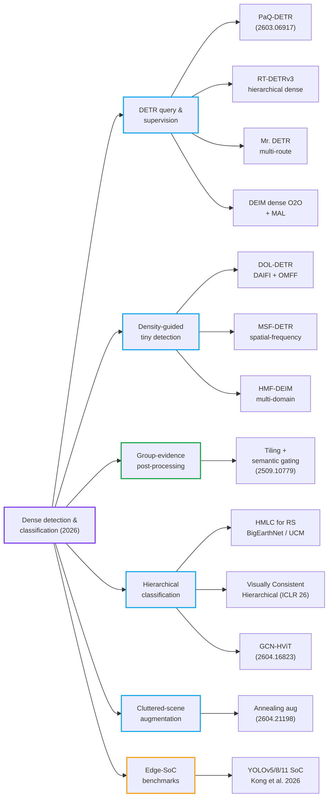
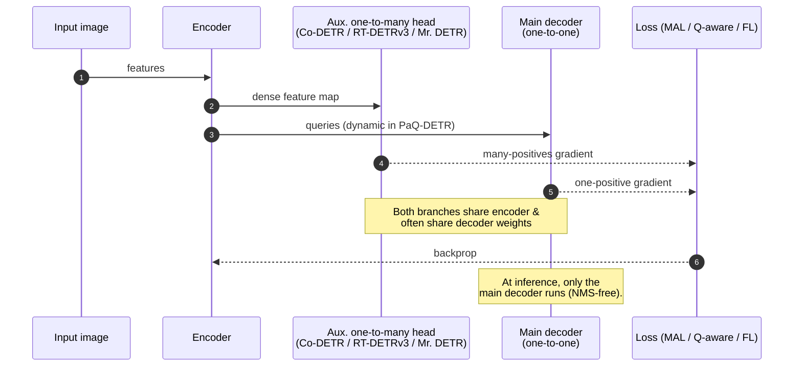
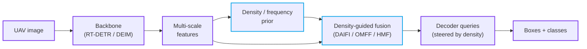
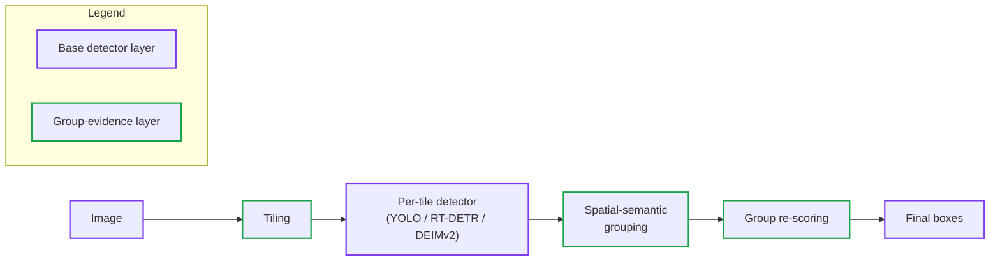
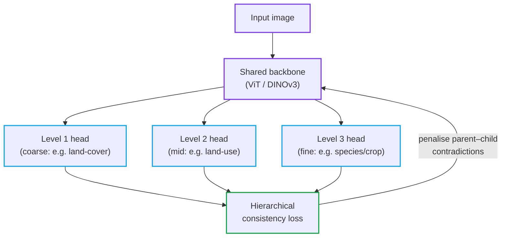

# Dense Object Detection & Classification — Recent Advances

*Compiled 2026-May-10 (Los Angeles).  This issue extends the running series and
deliberately avoids re-covering material already treated in the
[Apr-30](../2026-Apr-30/2026-Apr-30_CV_updates.md),
[May-01](../2026-May-01/2026-May-01_CV_updates.md),
[May-02](../2026-May-02/2026-May-02_CV_updates.md),
[May-04](../2026-May-04/2026-May-04_CV_updates.md),
[May-05](../2026-May-05/2026-May-05_CV_updates.md),
[May-07](../2026-May-07/2026-May-07_CV_updates.md), and
[May-08](../2026-May-08/2026-May-08_CV_updates.md) editions.*

## Table of contents

1. [What's new since May-08](#1-whats-new-since-may-08)
2. [Topic map](#2-topic-map)
3. [DETR query & supervision: dense-positive era](#3-detr-query--supervision-dense-positive-era)
4. [Density-guided detection of dense tiny objects](#4-density-guided-detection-of-dense-tiny-objects)
5. [Group-evidence post-processing for dense small objects](#5-group-evidence-post-processing-for-dense-small-objects)
6. [Hierarchical & visually consistent dense classification](#6-hierarchical--visually-consistent-dense-classification)
7. [Cluttered-scene augmentation: annealing-based dense synthesis](#7-cluttered-scene-augmentation-annealing-based-dense-synthesis)
8. [Edge-SoC deployment: reproducible 2026 benchmark](#8-edge-soc-deployment-reproducible-2026-benchmark)
9. [Reading list](#9-reading-list)

---

## 1. What's new since May-08

The two-day window since the last issue brings several developments worth
flagging that do not overlap with previously covered topics:

- **Query-and-supervision DETRs are converging on a single recipe.**
  PaQ-DETR (arXiv 2603.06917) is the most recent entry, combining
  *content-conditioned dynamic queries* with a *quality-aware one-to-many
  assignment*.  It joins RT-DETRv3, Mr. DETR, DEIM, and Co-DETR in a family
  whose common claim is "denser positive supervision without abandoning
  one-to-one inference."  The shared takeaway: 2026 DETRs train with dense
  signal but still ship NMS-free.
- **Density-guided detection has become the standard small-object recipe**
  for UAV/aerial pipelines.  DOL-DETR, MSF-DETR, and HMF-DEIM all show that
  letting an explicit density prior steer query selection or feature fusion
  beats brute-force resolution increases.
- **Group-evidence post-processing** has emerged as a detector-agnostic
  alternative to NMS for dense small-object scenes — instead of suppressing
  overlap, the framework treats overlap as evidence and re-scores groups
  (arXiv 2509.10779v2, refreshed early May 2026).
- **Hierarchical multi-label classification** finally has a remote-sensing
  benchmark.  The HMLC re-issues of BigEarthNet and UCM (Stoimchev et al.,
  2026) make hierarchy-aware models comparable for the first time, and
  *Visually Consistent Hierarchical Image Classification* (ICLR 2026)
  shows that even foundation backbones produce hierarchy-violating outputs
  unless explicitly constrained.
- **Edge-SoC benchmarking has been hardened.** Kong et al. (Sci. Reports
  2026) publish a reproducible YOLOv5/v8/v11 deployment benchmark with
  fixed power, thermal, and quantisation budgets — a useful counter-weight
  to the COCO-mAP-only headlines.

If you want a one-line summary: **DETRs are still moving fast, but the most
practical 2026 progress is in the *plumbing* around them — query design,
density-aware feature fusion, group-aware post-processing, hierarchy-aware
losses, and reproducible edge benchmarks.**

---

## 2. Topic map

---

## 3. DETR query & supervision: dense-positive era

End-to-end transformer detectors keep their NMS-free *inference* but the
2024–2026 wave has quietly redesigned the *training* signal around them.
Five threads have now merged into a coherent recipe.

### 3.1 The shared diagnosis

Vanilla DETR matches *one query per ground-truth object* via the Hungarian
algorithm.  This is statistically clean but starves the encoder and decoder
of positive samples — which is exactly the bottleneck that slows convergence
and hurts dense scenes.  Every method below relaxes that constraint during
training while preserving one-to-one matching at test time:

| Method | Year | Core trick | Where the extra positives come from |
|---|---|---|---|
| Co-DETR | ICCV 2023 | Auxiliary heads with one-to-many labels | Classical assigners (ATSS, Faster R-CNN heads) |
| DN-DETR | TPAMI 2023 | Query denoising | Noised GT boxes injected as queries |
| Group DETR | 2023 | Parallel query groups | Each group gets a separate one-to-one match |
| DEIM | CVPR 2025 | Dense O2O matching + Matchability-Aware Loss | Augmentation-multiplied targets, IoU-modulated focal |
| RT-DETRv3 | arXiv 2409.08475 | CNN auxiliary branch with hierarchical dense supervision | Self-attention on dense feature maps |
| Mr. DETR | arXiv 2412.10028 | Instructive multi-route training | Three parallel decoder heads share weights |
| **PaQ-DETR** | arXiv **2603.06917** (Mar 2026) | Dynamic queries + quality-aware O2M | Latent pattern queries + IoU-cls consistency gating |

Reading these papers side-by-side, the design space is essentially:
*(a)* how many positives per object, *(b)* how to weight them, and
*(c)* whether the auxiliary supervision lives in a separate branch or is
folded into the main decoder.

### 3.2 PaQ-DETR — the latest entry

PaQ-DETR (Mar 2026) is the most recent attempt to ship the whole stack in a
single, lightweight module.  Two ideas are stacked:

1. **Pattern-conditioned dynamic queries.**  Instead of a fixed bank of
   learned queries, PaQ-DETR learns a small pool of *latent patterns* and
   produces image-specific queries by content-conditioned weighting of the
   pool.  This addresses the "query utilisation imbalance" problem that
   classical DETRs exhibit (a handful of queries consistently dominate).
2. **Quality-aware O2M assignment.**  Positive samples are selected based
   on joint localisation–classification consistency, similar in spirit to
   DEIM's MAL but acting on a one-to-many scheme.

Reported gains: **+1.5–4.2 mAP on COCO** across ResNet and Swin backbones,
with negligible parameter overhead.  Source:
[arXiv:2603.06917](https://arxiv.org/abs/2603.06917).

### 3.3 Why this matters for *dense* scenes

Dense scenes (crowds, fish schools, cells, vehicles in parking lots) are
exactly where DETR's sparse supervision hurts most: many small objects, few
queries assigned per image, and a lot of background context to model.  The
2025–2026 dense-positive recipes typically reclaim **3–6 mAP** in the
small-object slice (`AP_S`) of COCO at the same inference cost as RT-DETR.

### 3.4 Practical reading order

If you are picking up this thread today:

1. **DEIM** for the cleanest exposition of dense O2O + MAL.
2. **RT-DETRv3** for hierarchical dense supervision applied to a real-time
   model.
3. **PaQ-DETR** for the latest dynamic-query + quality-aware O2M
   formulation.
4. Skim **Mr. DETR** for the multi-route view.

Sources:
[DEIM](https://arxiv.org/abs/2412.04234) ·
[RT-DETRv3](https://arxiv.org/html/2409.08475v3) ·
[PaQ-DETR](https://arxiv.org/abs/2603.06917) ·
[Mr. DETR](https://arxiv.org/html/2412.10028v1) ·
[Co-DETR](https://arxiv.org/abs/2211.12860).

---

## 4. Density-guided detection of dense tiny objects

UAV, satellite, and microscopy imagery share three properties that defeat
generic detectors: extreme scale variance, dense spatial clustering, and
heavy background interference.  The 2026 wave of UAV-specialised
transformers all converge on the same architectural answer:
**use an explicit object-density signal to steer feature fusion or query
selection.**

### 4.1 The three new architectures

| Model | Mechanism | Reported result | Notes |
|---|---|---|---|
| **DOL-DETR** | DAttention-based Intra-scale Feature Interaction (DAIFI) + Omni-Modulated Feature Fusion (OMFF) on RT-DETR | strong gain on UAV small-object slice | RT-DETR backbone, drop-in on existing DETR pipelines |
| **MSF-DETR** | Multi-scale perception + cross-spatial-frequency-domain fusion | reduces feature degradation for sparse-pixel objects | Frequency branch recovers high-frequency detail lost to downsampling |
| **HMF-DEIM** | High-fidelity multi-domain fusion on the DEIM backbone | **+21.3 % relative APs on VisDrone2019**; 465 FPS at FP16 on A100 | End-to-end, NMS-free, real-time |

The three together represent a generational shift: RT-DETR-class real-time
transformers, augmented with density-aware fusion, can now match heavy
two-stage detectors on tiny-object benchmarks while staying in real-time
budgets.

### 4.2 Density prior as a guidance signal

The pattern is consistent across all three works.  A coarse density map (or
its frequency-domain analogue) is computed from low-resolution features and
used to:

1. **Re-weight encoder features** before they enter the decoder, biasing
   capacity toward dense regions.
2. **Steer query selection**, so a larger fraction of the query budget
   lands in object-rich regions instead of empty background.
3. **Modulate the loss** in the decoder, so under-represented regions get
   stronger gradients.

### 4.3 What still doesn't work

Two failure modes survive 2026:

- **Cross-domain density transfer.**  Density priors learned on VisDrone do
  not transfer cleanly to satellite imagery — the spatial scale of "dense"
  is dataset-specific.
- **Density-vs-occlusion conflation.**  When dense clusters are also
  heavily occluded (e.g., parked cars, stacked livestock), density-guided
  query allocation can over-suppress occluded instances.  Pairing
  density-guided queries with the group-evidence post-processing in
  Section 5 has been shown to help on VisDrone but is not yet standard.

Sources: [DOL-DETR (MDPI Appl. Sci. 2026)](https://www.mdpi.com/2076-3417/16/9/4510)
· [MSF-DETR (Remote Sensing 2026)](https://www.mdpi.com/2072-4292/18/9/1394)
· [HMF-DEIM (Sensors 2026)](https://www.mdpi.com/1424-8220/26/7/2187).

---

## 5. Group-evidence post-processing for dense small objects

### 5.1 The problem with NMS on dense scenes

Standard non-maximum suppression and most NMS-free DETRs both assume that
overlapping high-confidence boxes describe the *same* instance.  In dense
small-object scenes that assumption breaks: a cluster of overlapping
detections often corresponds to *several* real instances, and suppressing
overlap discards true positives.

### 5.2 The 2026 alternative: treat overlap as evidence

Tiling-based Semantic Gating (arXiv 2509.10779v2; refreshed in early
May 2026) inverts the NMS premise.  The pipeline is:

1. **Slice** the image into overlapping tiles.
2. Run any base detector on each tile (the framework is detector-agnostic).
3. **Group** boxes from neighbouring tiles by spatial proximity and
   semantic agreement, instead of suppressing them.
4. **Re-score** each *group* using accumulated evidence (sum of confidence,
   variance of class predictions, geometric coherence).
5. Emit one detection per group at a confidence derived from the group, not
   from any single box.

Empirically, on VisDrone-style UAV imagery the framework recovers many of
the small-object false negatives that classical NMS removes, without
changing the underlying detector.

### 5.3 Where it fits in the stack

### 5.4 Why this is interesting now

Group-evidence post-processing is detector-agnostic, so it composes with
the density-guided detectors in Section 4 and with the dense-positive DETRs
in Section 3.  The combination — density-guided queries + group-evidence
re-scoring — is the most credible path to closing the small-object gap in
COCO `AP_S` and VisDrone `APs` without changing backbone or input
resolution.

Source:
[Group Evidence Matters (arXiv 2509.10779v2)](https://arxiv.org/html/2509.10779v2).

---

## 6. Hierarchical & visually consistent dense classification

Dense classification — assigning a label to every region or every pixel —
runs into a problem that flat classification ignores: real-world taxonomies
are *hierarchical* (vehicle → car → sedan → ...), and most models will
happily emit predictions that contradict the hierarchy (e.g., "sedan" with
parent class "boat").  Two 2026 contributions tackle this head-on.

### 6.1 Visually Consistent Hierarchical Image Classification (ICLR 2026)

The paper's central observation: **even foundation vision backbones,
when probed for hierarchical labels, produce predictions that are
internally inconsistent**.  Treating each level of the hierarchy as an
independent classifier is the root cause — the levels share the backbone,
not the decision.

Their fix is a hierarchical decoder that:

1. **Shares features across levels** so a coarse decision constrains the
   fine ones.
2. **Progressively groups fine details** into larger areas, emulating the
   coarse-to-fine structure of the label tree.
3. **Adds a consistency loss** that penalises parent–child contradictions
   directly.

The reported improvement is largest on rare leaves where a flat classifier
"falls back" to a misleading sibling class; with the consistency
constraint, the model now falls back to the correct *parent* instead.

Source:
[Visually Consistent Hierarchical Image Classification (arXiv 2406.11608v2)](https://arxiv.org/html/2406.11608v2).

### 6.2 Hierarchical multi-label classification (HMLC) for remote sensing

Stoimchev et al. (2026) re-issue **BigEarthNet** and **UCM** with full
CORINE Land-Cover hierarchies, and release them as the first HMLC remote
sensing benchmarks.  Their experiments show that hierarchy-aware models
beat the prevalent flat multi-label baselines by a non-trivial margin —
especially on the rare leaves, where flat classifiers see too few
positives to learn anything.

This is the dense-classification cousin of LVIS rare-class detection: the
problem is not that the labels are unknown, it's that they are
*structurally related to known labels* and a model that ignores the
structure cannot generalise.

Source:
[HMLC of Land Use/Land Cover (Springer 2026)](https://link.springer.com/chapter/10.1007/978-3-032-25311-8_13).

### 6.3 GCN-augmented hierarchical ViT

A complementary line of work uses a graph convolutional network on top of
the ViT to model patch-wise interactions *within* a level and label
relations *between* levels:
[GCN-HViT (arXiv 2604.16823)](https://arxiv.org/abs/2604.16823).
This is closer to a structural prior on the *label graph* and pairs
naturally with the consistency loss above.

### 6.4 Architecture sketch

### 6.5 Practical takeaway

For any application where the label space is naturally hierarchical
(satellite land-cover, biomedical taxonomies, retail product trees), the
2026 evidence is clear: **treat hierarchy as a first-class training
signal, not a post-hoc remap**.  The cost is a consistency loss term and a
multi-head decoder; the win is large on rare leaves and on
out-of-distribution inputs that should fall back to a coarser parent.

---

## 7. Cluttered-scene augmentation: annealing-based dense synthesis

A common bottleneck in dense object detection is that real training data
is dominated by easy, sparse scenes.  Dense scenes — fish schools, packed
livestock, crowded markets — are rare, expensive to annotate, and often
under-represented in the tail of the dataset.

A late-April 2026 paper (arXiv 2604.21198, "A Probabilistic Framework for
Improving Dense Object Detection in Underwater Image Data via
Annealing-Based Data Augmentation") proposes a synthesis approach
specifically aimed at this gap.  Their pseudo-simulated annealing
algorithm:

1. Treats target placement as an energy-minimisation problem.
2. Penalises overlap, off-image positions, and collision with non-target
   structure.
3. Uses a temperature schedule (annealing) to escape local minima — early
   iterations explore freely, late ones settle into realistic dense
   layouts.
4. Generates bounding boxes directly from segmentation masks of source
   instances, so the produced labels are pixel-accurate.

The result is training data with *controlled* density distributions — the
practitioner can dial up the density of synthesised scenes to match the
operational regime, without needing to collect more real dense imagery.

The same recipe is plausibly transferable to drone-cam livestock counting,
microscopy, and warehouse stocktake — anywhere "dense and crowded" is the
deployment scenario but "sparse and clean" is the training scenario.

Source:
[Annealing-based augmentation (arXiv 2604.21198)](https://arxiv.org/abs/2604.21198).

---

## 8. Edge-SoC deployment: reproducible 2026 benchmark

Most public detection comparisons quote COCO mAP at 640×640 on a single
NVIDIA T4 — a setting that has very little to say about whether a model
will run on a Jetson Orin Nano or an i.MX 8M Plus inside a thermal
envelope.  Kong et al. (Sci. Reports 2026) push back with a reproducible
benchmark across **YOLOv5, YOLOv8, YOLO11** in Nano / Small / Medium
configurations, evaluated on COCO under **fixed power, thermal, and
quantisation budgets**.

### 8.1 What's measured

| Axis | Detail |
|---|---|
| Model family | YOLOv5 / YOLOv8 / YOLO11 |
| Sizes | Nano, Small, Medium |
| Hardware | Multiple commodity edge SoCs |
| Budgets | Power cap, junction temperature, INT8 quantisation parity |
| Metric | mAP, latency, throughput, energy-per-inference |

### 8.2 Why it's useful

Most "edge" claims in 2025-era papers fail one or more of three
reproducibility tests: undisclosed thermal throttling, unstated INT8
calibration, and inconsistent batch sizes.  This benchmark fixes all
three, so the relative ordering of YOLO variants on edge SoCs is now
something practitioners can trust.

If your 2026 deployment plan involves quoting a single number from a paper
on an edge SoC, this benchmark is the one to use as a sanity check.

Source:
[Kong et al., *Object detection on low-compute edge SoCs*, Sci. Reports
2026](https://www.nature.com/articles/s41598-026-36862-y).

---

## 9. Reading list

In rough order of "highest signal-to-noise for someone catching up today":

1. **PaQ-DETR — Pattern and Quality-Aware Dynamic Queries for Object
   Detection.**  arXiv 2603.06917 (Mar 2026).
   [link](https://arxiv.org/abs/2603.06917)
2. **DEIM — DETR with Improved Matching for Fast Convergence.**  CVPR
   2025.  Still the cleanest exposition of dense O2O + MAL.
   [link](https://arxiv.org/abs/2412.04234)
3. **RT-DETRv3 — Hierarchical Dense Positive Supervision.**  arXiv
   2409.08475.
   [link](https://arxiv.org/html/2409.08475v3)
4. **Mr. DETR — Instructive Multi-Route Training.**  arXiv 2412.10028.
   [link](https://arxiv.org/html/2412.10028v1)
5. **HMF-DEIM — High-Fidelity Multi-Domain Fusion for UAV Small Object
   Detection.**  Sensors 2026.
   [link](https://www.mdpi.com/1424-8220/26/7/2187)
6. **DOL-DETR — Efficient Small-Object Detection for UAV Remote
   Sensing.**  Applied Sciences 2026.
   [link](https://www.mdpi.com/2076-3417/16/9/4510)
7. **MSF-DETR — Multi-Scale Perception + Cross-Spatial-Frequency Fusion
   for UAV.**  Remote Sensing 2026.
   [link](https://www.mdpi.com/2072-4292/18/9/1394)
8. **Group Evidence Matters — Tiling-based Semantic Gating for Dense
   Object Detection.**  arXiv 2509.10779v2 (refresh May 2026).
   [link](https://arxiv.org/html/2509.10779v2)
9. **Visually Consistent Hierarchical Image Classification.**  ICLR
   2026.
   [link](https://arxiv.org/html/2406.11608v2)
10. **Hierarchical Multi-label Classification of Land Use / Land Cover
    in Remote Sensing Images.**  Stoimchev et al., 2026.
    [link](https://link.springer.com/chapter/10.1007/978-3-032-25311-8_13)
11. **GCN-HViT — Hierarchical ViT enhanced by GCN.**  arXiv 2604.16823.
    [link](https://arxiv.org/abs/2604.16823)
12. **Annealing-based Augmentation for Dense Underwater Detection.**
    arXiv 2604.21198 (Apr 2026).
    [link](https://arxiv.org/abs/2604.21198)
13. **Object Detection on Low-Compute Edge SoCs — Reproducible
    Benchmark.**  Kong et al., Sci. Reports 2026.
    [link](https://www.nature.com/articles/s41598-026-36862-y)
14. **Density-Driven Guidance for Detecting Dense Tiny Objects.**
    arXiv 2512.22949.
    [link](https://arxiv.org/abs/2512.22949)
15. **Co-DETR — DETRs with Collaborative Hybrid Assignments Training.**
    ICCV 2023.  Foundational reference for dense-positive DETRs.
    [link](https://arxiv.org/abs/2211.12860)

---

*End of issue.  Next planned focus: cross-modal dense detection updates
(RGB-event, RGB-radar 4D), and 2026 progress on conformal prediction for
detection beyond the SeqCRC line covered earlier in the series.*
