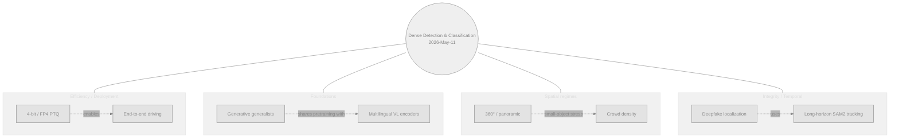
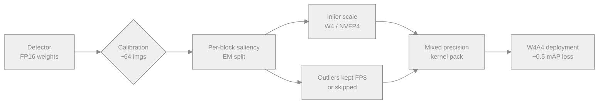
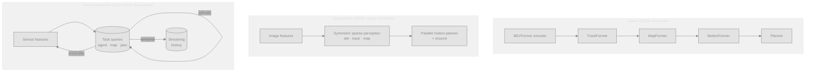
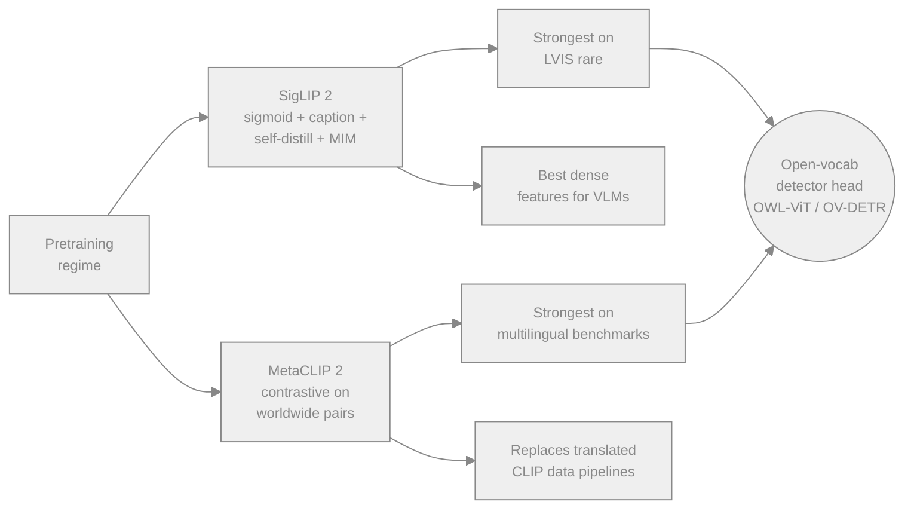
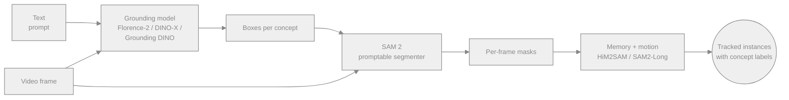

# Dense Object Detection & Classification — Recent Advances

*Compiled 2026-May-11 (America/Los_Angeles).*

Ninth installment in the running CV-updates log
([Apr-30](../2026-Apr-30/2026-Apr-30_CV_updates.md),
[May-01](../2026-May-01/2026-May-01_CV_updates.md),
[May-02](../2026-May-02/2026-May-02_CV_updates.md),
[May-04](../2026-May-04/2026-May-04_CV_updates.md),
[May-05](../2026-May-05/2026-May-05_CV_updates.md),
[May-07](../2026-May-07/2026-May-07_CV_updates.md),
[May-08](../2026-May-08/2026-May-08_CV_updates.md)).
Earlier installments handled the YOLO/DETR core, SSL backbones, SAM 3,
streaming/Mamba/diffusion decoders, LiDAR/MOT/event, robustness, label
efficiency, vertical domains, and PEFT/continual/Green-AI. This report
rotates to threads that have moved noticeably in the last week and that
no previous installment treated head-on:

- the 4-bit detector — NVFP4 silicon, MX-formats, and outlier-aware PTQ;
- end-to-end driving perception, from UniAD's sequential stack to the
  task-parallel transformers (SparseDrive, DriveTransformer);
- "generation = understanding" generalists, exemplified by Vision Banana;
- multilingual vision-language backbones (SigLIP 2, MetaCLIP 2) and
  what they actually do for open-vocabulary detection;
- panoramic / 360° dense detection and tracking;
- crowd counting & dense head localization with hybrid Tx-CNN density maps;
- deepfake & AIGC *dense* localization, not just real-or-fake;
- long-horizon video detection-tracking built on SAM 2 + a grounder.

## Table of contents

1. [What's new since May-08](#1-whats-new-since-may-08)
2. [Topic map](#2-topic-map)
3. [Low-bit & FP4 detector quantization](#3-low-bit--fp4-detector-quantization)
4. [End-to-end driving perception: UniAD → DriveTransformer](#4-end-to-end-driving-perception-uniad--drivetransformer)
5. [Generative generalists: the Vision Banana paradigm](#5-generative-generalists-the-vision-banana-paradigm)
6. [Multilingual VL backbones: SigLIP 2 & MetaCLIP 2](#6-multilingual-vl-backbones-siglip-2--metaclip-2)
7. [Panoramic / 360° dense detection](#7-panoramic--360-dense-detection)
8. [Crowd counting & dense head localization](#8-crowd-counting--dense-head-localization)
9. [Deepfake / AIGC dense localization](#9-deepfake--aigc-dense-localization)
10. [Long-horizon video detection-tracking](#10-long-horizon-video-detection-tracking)
11. [Reading list](#11-reading-list)

---

## 1. What's new since May-08

| Thread                                | One-line take                                                                                                                                                  |
| ------------------------------------- | -------------------------------------------------------------------------------------------------------------------------------------------------------------- |
| 4-bit detector quantization           | NVFP4 silicon (Blackwell / CDNA 4) and **InlierQ** (ICLR 2026) take detection PTQ from W8A8 to W4A4 with sub-1 mAP drop on COCO/nuScenes.                       |
| End-to-end driving                    | **DriveTransformer** (ICLR 2025) collapses UniAD's sequential per-task stack into a unified attention block; **SparseDrive** still leads nuScenes at 49.6 mAP. |
| Generative generalists                | **Vision Banana** reframes every dense task as RGB *image generation* — beats SAM 3 on segmentation, Depth Anything V3 on metric depth, in zero-shot transfer. |
| SigLIP 2 / MetaCLIP 2                 | Two big multilingual VL encoders ship: SigLIP 2 pushes LVIS *rare* AP for open-vocab; MetaCLIP 2 trains from worldwide pairs without translation pipelines.    |
| 360° / panoramic                      | **YOLO11-4K** (Dec 2025) ships a P2 head + GhostConv stack for full-FoV 4K input; **OmniMOT** datasets push omnidirectional tracking past 0.5 HOTA.            |
| Crowd counting                        | Hybrid Tx-CNN UNets (**HMSTUNet**) and **CLDE-Net** close the gap on JHU-Crowd++ / NWPU-Crowd; localization-aware losses make density maps actionable as detections. |
| Deepfake dense localization           | The **DDL** dataset (1.8 M forgeries, 75 methods) and the **DDL-X IJCAI 2026** challenge push detection from binary real/fake to per-pixel forgery masks.      |
| Long-horizon video tracking           | **SAM2-Long**, **HiM2SAM**, and **Grounded-SAM-2** all attack the SAM 2 memory-bank bottleneck for >1-minute tracks; MASA gives any detector a zero-shot tracker. |

## 2. Topic map

A static SVG version (light/dark-friendly, neutral strokes with small
accent hues) is in [`assets/topic-map.svg`](assets/topic-map.svg). The
Mermaid view below mirrors the same structure so the file renders
without external assets.

---

## 3. Low-bit & FP4 detector quantization

The story for detection deployment in May 2026 is "INT8 is yesterday,
W4A4 is shipping." Two pieces of progress force the shift:

- **Hardware.** NVIDIA Blackwell adds native **NVFP4** (FP4 with
  per-block microscaling), and AMD's CDNA 4 roadmap mirrors it; both
  expose 2× throughput vs FP8 at near-FP8 accuracy. NVIDIA's NeMo team
  published a quantization-aware *distillation* (QAD) recipe in
  March 2026 specifically to recover the accuracy gap for NVFP4
  inference ([NVFP4 QAD report, NVIDIA 2026](https://research.nvidia.com/labs/nemotron/files/NVFP4-QAD-Report.pdf)).
  The same kernels light up for detector activations.
- **Algorithms.** Detection activations are *heavy-tailed* in a way
  classification activations are not — background tokens and large
  empty patches generate outliers that dominate quantization scale.
  **InlierQ** ([arXiv 2602.03472, ICLR 2026](https://arxiv.org/abs/2602.03472))
  treats this head-on: it computes gradient-aware *volume saliency*
  per activation block, fits an EM-based posterior to separate
  anomalies from inliers, and uses only the inliers to set scale.
  It is label-free, drop-in, needs 64 calibration images, and reports
  consistent error reductions on COCO (2D), nuScenes (camera 3D), and
  nuScenes-LiDAR. The same pattern was hinted at in the older
  task-loss-guided Lp PTQ work ([arXiv 2304.09785](https://arxiv.org/abs/2304.09785))
  but only InlierQ makes it work at W4.

What this changes in practice:

| Stage             | Before (2025)                                | Now (2026)                                                |
| ----------------- | -------------------------------------------- | --------------------------------------------------------- |
| Backbone weights  | INT8 PTQ (RepVGG/EfficientNet/ConvNeXt)      | NVFP4 PTQ + QAD; FP4 for ViT trunks via MX-FP4            |
| Detector head     | INT8 with QAT or distillation                | W4A4 with InlierQ-style outlier separation                |
| Calibration set   | 1k–10k labeled COCO images                   | 64 unlabeled frames; gradient saliency                    |
| Accuracy hit (COCO) | ~1.0–1.5 AP                                  | ~0.3–0.8 AP for W4A4 with InlierQ                         |
| Edge throughput   | ~2× vs FP16 (INT8)                           | ~3.5–4× vs FP16 (NVFP4 / MX-FP4 on Blackwell, Thor)       |

Anchor for vendors: NVIDIA's developer forum thread on running
YOLOv7 at INT4/FP4 on Jetson Thor ([NVIDIA dev forum, 2026](https://forums.developer.nvidia.com/t/performing-int4-fp4-quantization-on-thor-for-yolov7/345343))
is the cleanest single account of the "what works today" workflow on
embedded silicon.

Open issues:

- Calibration-set bias is now the bottleneck — InlierQ is still
  vulnerable to calibration sets that under-sample rare classes.
- Cross-format mixing (W4 NVFP4 weights + W8 activations for the head)
  beats uniform W4A4 by ~0.4 AP and is the new "almost-free" recipe.
- The community quantization survey ([awesome-quantization repo](https://github.com/Kai-Liu001/Awesome-Model-Quantization))
  is the canonical entry point.

## 4. End-to-end driving perception: UniAD → DriveTransformer

Prior installments covered LiDAR 3D, multi-camera BEV, and
end-to-end MOT separately. The shift this quarter is that **all of
those tasks are being folded into a single transformer block** for
autonomous driving, and the loud disagreement is whether to keep them
*sequential* (UniAD-style) or run them *in parallel* with shared queries.

### 4.1 Why sequential UniAD got displaced

UniAD's design ([UniAD, CVPR 2023 best paper](https://arxiv.org/abs/2212.10156))
strings BEVFormer → TrackFormer → MapFormer → MotionFormer → Planner.
Cumulative perception errors compound through the chain, and the
multi-stage training schedule is fragile. **PARA-Drive** ([CVPR 2024](https://openaccess.thecvf.com/content/CVPR2024/papers/Weng_PARA-Drive_Parallelized_Architecture_for_Real-time_Autonomous_Driving_CVPR_2024_paper.pdf))
removed task links entirely and reported **2.77× speedup** vs UniAD-base
with no planning-quality loss, demonstrating that the sequence was
load-bearing for *training* but not for *inference*.

### 4.2 Sparse representations (SparseDrive)

**SparseDrive** ([arXiv 2405.19620](https://arxiv.org/abs/2405.19620),
[NVIDIA NIM model card](https://build.nvidia.com/nvidia/sparsedrive/modelcard))
replaces dense BEV grids with decoupled per-instance features +
geometric anchors. A *symmetric* sparse perception module handles
detection / tracking / online mapping; a parallel planner generates
multi-modal trajectories for all agents and selects via a
collision-aware rescore.

| Method            | nuScenes 3D det mAP | NDS  | Collision rate (↓) |
| ----------------- | ------------------- | ---- | ------------------ |
| UniAD-base        | 38.0                | 49.8 | baseline           |
| PARA-Drive        | ~ same as UniAD     | ~    | ~                  |
| **SparseDrive**   | **49.6**            | **58.8** | **best**       |

### 4.3 Unified attention (DriveTransformer)

**DriveTransformer** ([ICLR 2025 paper](https://openreview.net/forum?id=M42KR4W9P5),
[arXiv 2503.07656](https://arxiv.org/abs/2503.07656),
[code](https://github.com/Thinklab-SJTU/DriveTransformer))
trims the design down further: agent, map, and planning queries all
live in the same block. Three operations are repeated per layer —
*task self-attention* (queries see each other), *sensor cross-attention*
(queries see raw image / LiDAR features directly, no BEV stage), and
*temporal cross-attention* (queries keep their own streaming history).
Reported state-of-the-art on the closed-loop **Bench2Drive** simulation
benchmark and on open-loop nuScenes, at high FPS.

### 4.4 Where this is heading

- **Sparse + task-parallel is the new default.** UniAD-style sequential
  is now the baseline you have to beat, not the design you start from.
- **Planning is becoming a query, not a head.** Both SparseDrive's
  rescore and DriveTransformer's planning queries blur the
  perception/planning boundary that the modular AV stack used to
  enforce.
- **Open-loop benchmarks are saturating.** Bench2Drive closed-loop
  results and recent work like **MomAD** ([CVPR 2025 code](https://github.com/adept-thu/MomAD))
  on momentum-aware planning are now where the leaderboard moves.

## 5. Generative generalists: the Vision Banana paradigm

The most interesting *conceptual* result this month is Google DeepMind's
**Vision Banana** ([project page](https://vision-banana.github.io/),
[arXiv 2604.20329](https://arxiv.org/abs/2604.20329), with He Kaiming and
Xie Saining listed as authors). It is an instruction-tuned image
generator (built on Nano Banana Pro) that reframes *every* vision task
as image generation.

The core trick is to parameterize every output as an RGB image with a
precise, invertible color scheme:

- Segmentation → a per-pixel colored mask image.
- Metric depth → a depth-coded grayscale image with a known LUT.
- Surface normals → an XYZ-as-RGB normal map.
- Detection → masked overlays / bounding-box renderings.

Because the color scheme is invertible, the generated image can be
decoded back into a quantitative output (boxes, masks, depth values)
and scored against the standard benchmarks.

Reported zero-shot transfer numbers:

| Task                | Vision Banana       | Specialist           |
| ------------------- | ------------------- | -------------------- |
| Segmentation (3 sets) | best                | SAM 3                |
| Metric depth (δ1)   | **0.929**           | Depth Anything V3 (0.918) |
| Surface normals (mean angle err) | **18.93°** | Lotus-2 (19.64°)     |

What this implies for dense detection:

- **One model, many tasks, zero new decoders.** The detection head
  isn't a regression module — it's a prompt + LUT. Adding a new task
  is a tokenizer change, not a re-train.
- **Pretraining objective is generative, not contrastive.** That is the
  break from CLIP / DINO. The paper's thesis ("Image Generators are
  Generalist Vision Learners") argues image-generation pretraining is to
  vision what next-token pretraining is to language. This is at odds
  with the DINOv3 worldview that animated the May-07 installment.
- **Costs.** Decoding boxes from rendered RGB images is wasteful at
  inference relative to a DETR head; the practical product story is
  "ship a small specialist distilled *from* the generalist," not "deploy
  the generalist."

Independent coverage: [MarkTechPost summary](https://www.marktechpost.com/2026/04/25/google-deepmind-introduces-vision-banana-an-instruction-tuned-image-generator-that-beats-sam-3-on-segmentation-and-depth-anything-v3-on-metric-depth-estimation/),
[Roboflow blog](https://blog.roboflow.com/vision-banana/).

## 6. Multilingual VL backbones: SigLIP 2 & MetaCLIP 2

Open-vocabulary detectors live or die on the backbone. Two recent VL
encoders rework that backbone in incompatible ways:

### 6.1 SigLIP 2

**SigLIP 2** ([arXiv 2502.14786](https://arxiv.org/abs/2502.14786),
[HF blog](https://huggingface.co/blog/siglip2))
extends the sigmoid loss with *captioning-based* pretraining, two
self-supervised losses (self-distillation à la DINO + masked patch
prediction), and online data curation. Four sizes: ViT-B (86 M),
L (303 M), So400m (400 M), g (1 B).

The detection-relevant claim: SigLIP 2 beats SigLIP on **LVIS rare**
categories by the largest margin of any zero-shot benchmark, and also
beats OWL-ViT for open-vocabulary detection at matched backbone size.
Open-vocabulary segmentation beats both SigLIP and the larger OpenCLIP
G/14 model. For detection, that "biggest gain in rare categories"
finding is the one that matters — long-tail open-vocab is where the
production gap lives.

### 6.2 MetaCLIP 2

**MetaCLIP 2** ([arXiv 2507.22062](https://arxiv.org/html/2507.22062v1))
trains CLIP-style models from scratch on native worldwide image-text
pairs — *no* outsourced private data, *no* machine translation, *no*
distillation. It sets multilingual SOTA on Babel-IN (+3.8), XM3600
(+1.1/+1.5), CVQA (+3.0/+7.6), Flickr-30k-200 (+7.7/+7.0), XTD-200
(+6.4/+5.8).

For detection, MetaCLIP 2 is the credible backbone if your deployment
needs non-English category names (agriculture, retail, surveillance in
non-English markets). The two encoders are not redundant: SigLIP 2 wins
on rare-class generalization, MetaCLIP 2 wins on multilingual lexical
coverage.

For an end-to-end recipe, the [OpenCLIP project](https://github.com/mlfoundations/open_clip)
remains the most-maintained reference implementation and ships both
SigLIP-style and MetaCLIP-style training paths.

## 7. Panoramic / 360° dense detection

Panoramic detection used to be a niche; with AR/VR headsets and
embodied-agent cameras hitting 4K omnidirectional sensors, the niche
became a benchmark. The latest survey, **PANORAMA**
([arXiv 2509.12989](https://arxiv.org/pdf/2509.12989)), argues that the
embodied AI era will be driven by omnidirectional, not perspective,
cameras. Three open problems:

- **Distortion.** Equirectangular projections deform objects at the
  poles; convolutional priors that assume locality break.
- **Discontinuous edges.** The horizontal wrap-around forces the
  detector to handle the same object split across left/right edges.
- **Scale variation.** 4K input plus extreme scale variation — small
  objects at the edges, large in the center — overwhelms standard P3-P5
  heads.

### 7.1 YOLO11-4K

**YOLO11-4K** ([arXiv 2512.16493](https://arxiv.org/abs/2512.16493))
is the cleanest engineering answer so far. It adds a **P2 detection
head** operating on early high-resolution feature maps for small
objects, swaps in GhostConv + C3Ghost blocks for parameter efficiency,
and trains on **CVIP360**, a 4K panoramic dataset with 6 876 manually
annotated frames.

Reported numbers on CVIP360:

| Model        | mAP@0.5 | Latency / frame |
| ------------ | ------- | --------------- |
| YOLO11       | 0.908   | 112.3 ms        |
| **YOLO11-4K** | **0.95** | **28.3 ms** (−75 %) |

The result is significant: full-FoV 4K real-time detection without
tiling, which had been the unavoidable tradeoff in earlier panoramic
work.

### 7.2 Omnidirectional MOT

For tracking, **OmniMOT** ([arXiv 2503.04565](https://arxiv.org/html/2503.04565v1))
introduces a benchmark with rapid, non-linear platform motion that
breaks the constant-velocity priors most MOTs use. Companion datasets
like **360VOT** (single-object) and **SHD360** (saliency) build out the
benchmark surface; expect omnidirectional tracking to become a tracked
category on the major MOT leaderboards by EOY.

## 8. Crowd counting & dense head localization

Crowd counting is the canonical "dense classification" task: predict a
density map whose integral is the head count. The architectural
direction this year is unambiguously **hybrid transformer + CNN UNets**
with explicit localization losses, not pure transformers.

- **HMSTUNet** ([Sensors 2026, MDPI](https://www.mdpi.com/1424-8220/26/1/333))
  combines a multi-scale ViT for long-range dependencies with a
  *Dynamic Convolutional Attention Block* for local density patterns.
  Reports new SOTA on JHU-Crowd++ and NWPU-Crowd at the time of
  publication.
- **CLDE-Net** ([Multimedia Systems 2024](https://link.springer.com/article/10.1007/s00530-024-01318-8))
  marries CNN locality with transformer global context for joint
  *localization* and *density estimation*, predicting per-person
  coordinates not just a density blob — closing the historical gap
  between density-map counting and per-instance detection.
- **CountFormer** ([ECCV 2024](https://link.springer.com/chapter/10.1007/978-3-031-72943-0_2))
  generalizes to *multi-view* crowd counting, with cross-view
  attention disambiguating heads that overlap in any single view.
- The weakly-supervised story keeps maturing: **TransCrowd**
  ([SCIS 2022](https://link.springer.com/article/10.1007/s11432-021-3445-y))
  showed you can train on count labels alone with a transformer, and
  the architectures above incorporate that supervision when present.

What changed *operationally*:

- **Density-as-output is being replaced by points + density.** The
  practical winner is to emit per-person coordinates *and* a density
  field. This is the same shift dense pedestrian detection went through
  five years ago, finally landing in the counting community.
- **Scale invariance is the hard part.** All current SOTA papers
  highlight extreme scale variation (a few pixels at the back of the
  crowd, hundreds of pixels in front) as the unsolved problem.

For a survey-style index, see the [crowd-counting benchmark on
MDPI](https://www.mdpi.com/1424-8220/26/1/333).

## 9. Deepfake / AIGC dense localization

The deepfake detection community has shifted from binary classification
to **dense forgery localization**: per-pixel masks for image, per-frame
+ per-region for video.

### 9.1 DDL — the new benchmark

**DDL** ([arXiv 2506.23292](https://arxiv.org/abs/2506.23292)) is a
1.8 M-sample, 75-method dataset with two halves:

- **DDL-I**: 1.2 M images split real / fake / **per-pixel masks**.
- **DDL-AV**: 0.2 M audio-visual videos with spatial *and* temporal
  forgery annotations.

The methods covered span GANs, diffusion, VAEs, AR models, normalizing
flows, NeRFs, and Gaussian splats — i.e., everything the AIGC stack
currently generates. The **DDL-X challenge at IJCAI 2026**
([Codabench](https://www.codabench.org/competitions/15686/)) is the
first competition to score detection, localization, and *explainability*
jointly.

### 9.2 Architectures

- **GAMMA** uses multi-task learning + manipulation-augmented training
  to generalize across AIGC families ([survey index](https://github.com/ant-research/Awesome-AIGC-Image-Video-Detection)).
- **ADAD** (Attentive Deepfake Artifact Dissection,
  [Springer](https://link.springer.com/chapter/10.1007/978-981-95-6950-2_3))
  outputs *visual grounding* of artifacts plus a textual explanation,
  rather than a CAM saliency map. This is the explainability story the
  field has needed.
- Recent 2026 work on **Fine-Grained DINO Tuning with Dual Supervision**
  pushes face-forgery detection by adapting DINOv2/3 with paired
  per-pixel + classification supervision (see the
  [Awesome-Comprehensive-Deepfake-Detection list](https://github.com/qiqitao77/Awesome-Comprehensive-Deepfake-Detection)
  for citations).

### 9.3 Why it matters for dense detection

The deepfake pipeline is now indistinguishable from a *general*
forgery-segmentation task. Two consequences:

- Backbones from the May-07 thread (DINOv3, SAM 3) and the May-08
  thread (reasoning grounders) are directly transferable, because the
  problem is "produce a mask + label given an image."
- The benchmarking community has finally given up on real/fake
  accuracy as the headline metric; spatial F1 and temporal IoU on DDL
  / DDL-X are what now decide papers.

For an entry-level walkthrough, see the [Awesome Deepfake
Detection list](https://github.com/qiqitao77/Awesome-Comprehensive-Deepfake-Detection).

## 10. Long-horizon video detection-tracking

SAM 2 (covered briefly in May-07) added a per-session memory module that
made *prompted* video segmentation tractable. The next problem was
clear: SAM 2's memory bank is good for ~30 s clips but degrades on
multi-minute tracks. Three lines of work in early 2026 attack this.

### 10.1 SAM 2 memory upgrades

- **SAM2-Long** introduces a decision-tree memory structure to keep a
  bounded set of high-utility frames rather than a sliding window.
- **HiM2SAM** ([Springer chapter, 2026](https://link.springer.com/chapter/10.1007/978-981-95-5755-4_19))
  layers hierarchical motion estimation — lightweight linear prediction
  with selective non-linear refinement — on top of SAM 2 and partitions
  memory into long-term and short-term banks. Reports best-in-class on
  LaSOT-extended.
- **Kalman-filtered SAM 2** ([Sensors 2025](https://www.mdpi.com/1424-8220/25/13/4199))
  adds a per-track Kalman filter for occlusion recovery — a striking
  callback to pre-DL tracking ideas, now wrapping a foundation model.

### 10.2 Composing detection + SAM 2

Most production pipelines are not single models but compositions:

This is the **Grounded-SAM-2** pattern
([IDEA-Research repo](https://github.com/IDEA-Research/Grounded-SAM-2),
[PyImageSearch 2026 walkthrough](https://pyimagesearch.com/2026/01/19/grounded-sam-2-from-open-set-detection-to-segmentation-and-tracking/)),
which composes an open-vocab grounder with SAM 2. The grounder can be
swapped: Florence-2 for breadth, Grounding DINO 1.5 for speed, DINO-X
for open-world generality. The same pipeline doubles as an
*auto-labeller* via [autodistill](https://docs.autodistill.com/base_models/grounded-sam-2/).

### 10.3 Tracker-free MOT (MASA)

**MASA** ([project page](https://matchinganything.github.io/),
CVPR 2024 highlight, ongoing maintenance) trains an *adapter* on top of
SAM-style segments such that any detector becomes a zero-shot tracker
on open-vocabulary MOT benchmarks — no track labels required during
training. This is the path most relevant to teams that already have a
strong detector and don't want to train a tracker.

### 10.4 Status of the field

- **SAM 3 (May-07) + a memory module** is the obvious next step but
  isn't published yet. SAM2-Long and HiM2SAM are placeholders.
- For long-form video (minutes to hours), motion priors are essential.
  Pure memory-bank approaches degrade; HiM2SAM's hierarchical motion
  split is currently the cleanest design.
- The auto-labelling pipeline (Florence-2 → SAM 2 → memory) is now
  cheaper than human labelling for most domains except medical and
  legal.

## 11. Reading list

### 4-bit detector deployment
- [InlierQ — Inlier-Centric PTQ for Object Detection (ICLR 2026)](https://arxiv.org/abs/2602.03472)
- [NVFP4 Quantization-Aware Distillation (NVIDIA 2026)](https://research.nvidia.com/labs/nemotron/files/NVFP4-QAD-Report.pdf)
- [Task-Loss-Guided Lp PTQ for Detection (arXiv 2304.09785)](https://arxiv.org/abs/2304.09785)
- [Awesome-Model-Quantization (Kai-Liu001)](https://github.com/Kai-Liu001/Awesome-Model-Quantization)
- [NVIDIA Jetson Thor INT4/FP4 thread (YOLOv7)](https://forums.developer.nvidia.com/t/performing-int4-fp4-quantization-on-thor-for-yolov7/345343)

### End-to-end driving
- [UniAD (CVPR 2023, arXiv 2212.10156)](https://arxiv.org/abs/2212.10156)
- [SparseDrive (arXiv 2405.19620)](https://arxiv.org/abs/2405.19620) · [code](https://github.com/swc-17/SparseDrive) · [NVIDIA NIM card](https://build.nvidia.com/nvidia/sparsedrive/modelcard)
- [PARA-Drive (CVPR 2024)](https://openaccess.thecvf.com/content/CVPR2024/papers/Weng_PARA-Drive_Parallelized_Architecture_for_Real-time_Autonomous_Driving_CVPR_2024_paper.pdf)
- [DriveTransformer (ICLR 2025, arXiv 2503.07656)](https://arxiv.org/abs/2503.07656) · [code](https://github.com/Thinklab-SJTU/DriveTransformer)
- [MomAD (CVPR 2025)](https://github.com/adept-thu/MomAD)

### Generative generalists
- [Vision Banana — project page](https://vision-banana.github.io/)
- [Image Generators are Generalist Vision Learners (arXiv 2604.20329)](https://arxiv.org/abs/2604.20329)
- [Roboflow blog: Vision Banana](https://blog.roboflow.com/vision-banana/)
- [MarkTechPost coverage](https://www.marktechpost.com/2026/04/25/google-deepmind-introduces-vision-banana-an-instruction-tuned-image-generator-that-beats-sam-3-on-segmentation-and-depth-anything-v3-on-metric-depth-estimation/)

### Multilingual VL encoders
- [SigLIP 2 (arXiv 2502.14786)](https://arxiv.org/abs/2502.14786) · [HF blog](https://huggingface.co/blog/siglip2)
- [MetaCLIP 2 (arXiv 2507.22062)](https://arxiv.org/html/2507.22062v1)
- [OpenCLIP — reference implementation](https://github.com/mlfoundations/open_clip)

### Panoramic / 360°
- [YOLO11-4K (arXiv 2512.16493)](https://arxiv.org/abs/2512.16493)
- [PANORAMA survey (arXiv 2509.12989)](https://arxiv.org/pdf/2509.12989)
- [OmniMOT (arXiv 2503.04565)](https://arxiv.org/html/2503.04565v1)
- [SHD360 dataset](https://github.com/YeeZ93/SHD360)

### Crowd counting
- [HMSTUNet — Sensors 2026](https://www.mdpi.com/1424-8220/26/1/333) · [PMC mirror](https://pmc.ncbi.nlm.nih.gov/articles/PMC12788309/)
- [CLDE-Net (Multimedia Systems 2024)](https://link.springer.com/article/10.1007/s00530-024-01318-8)
- [CountFormer (ECCV 2024)](https://link.springer.com/chapter/10.1007/978-3-031-72943-0_2)
- [TransCrowd (SCIS 2022)](https://link.springer.com/article/10.1007/s11432-021-3445-y)

### Deepfake / AIGC localization
- [DDL dataset (arXiv 2506.23292)](https://arxiv.org/abs/2506.23292)
- [DDL-X IJCAI 2026 challenge](https://www.codabench.org/competitions/15686/)
- [ADAD — Dissecting Deepfake Artifacts via Multimodal Explanations](https://link.springer.com/chapter/10.1007/978-981-95-6950-2_3)
- [Awesome-Comprehensive-Deepfake-Detection](https://github.com/qiqitao77/Awesome-Comprehensive-Deepfake-Detection)
- [Awesome AIGC Image / Video Detection](https://github.com/ant-research/Awesome-AIGC-Image-Video-Detection)
- [DeepFake detection in the AIGC era — survey (Information Fusion 2025)](https://www.sciencedirect.com/science/article/abs/pii/S1566253525008024)

### Long-horizon video tracking
- [SAM 2 — Meta announcement](https://ai.meta.com/research/sam2/)
- [HiM2SAM (Springer chapter, 2026)](https://link.springer.com/chapter/10.1007/978-981-95-5755-4_19)
- [Kalman-filtered SAM 2 (Sensors 2025)](https://www.mdpi.com/1424-8220/25/13/4199)
- [MASA — Matching Anything by Segmenting Anything](https://matchinganything.github.io/)
- [Grounded-SAM-2 (IDEA-Research)](https://github.com/IDEA-Research/Grounded-SAM-2)
- [PyImageSearch — Grounded SAM 2 walkthrough](https://pyimagesearch.com/2026/01/19/grounded-sam-2-from-open-set-detection-to-segmentation-and-tracking/)
- [SAM2MOT (arXiv 2504.04519)](https://arxiv.org/html/2504.04519v1)
- [Seg2Track-SAM2 (arXiv 2509.11772)](https://arxiv.org/html/2509.11772)
