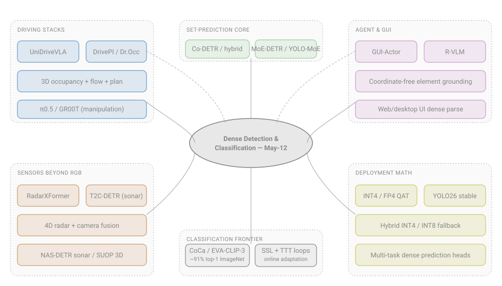
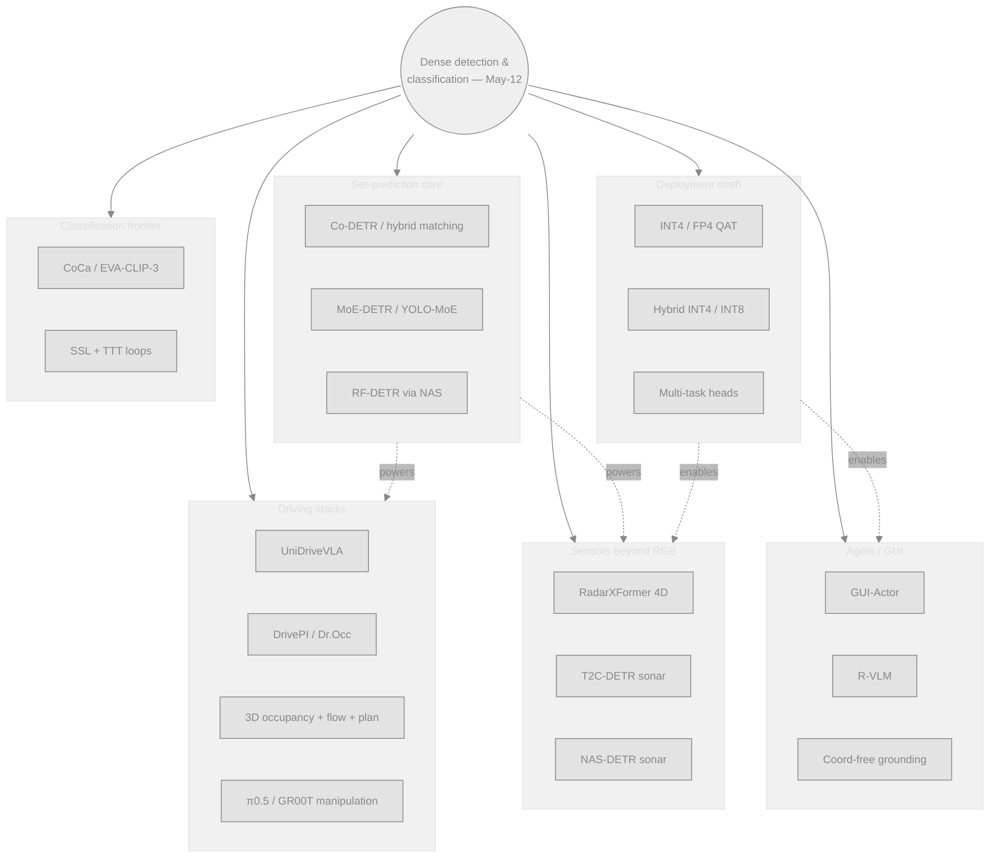
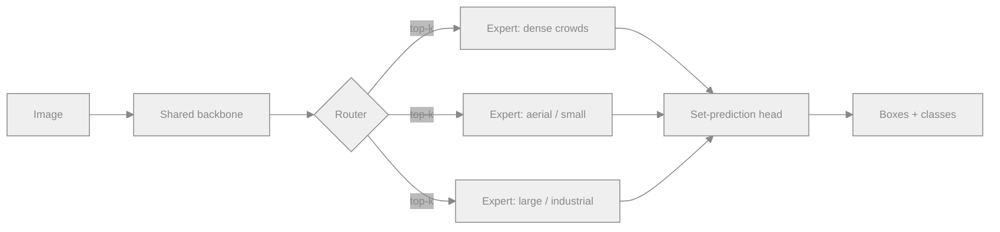

# Dense Object Detection & Classification — Recent Advances

*Compiled 2026-May-12 (America/Los_Angeles).*

Ninth installment in the rolling CV-updates log
([Apr-30](../2026-Apr-30/2026-Apr-30_CV_updates.md),
[May-01](../2026-May-01/2026-May-01_CV_updates.md),
[May-02](../2026-May-02/2026-May-02_CV_updates.md),
[May-04](../2026-May-04/2026-May-04_CV_updates.md),
[May-05](../2026-May-05/2026-May-05_CV_updates.md),
[May-07](../2026-May-07/2026-May-07_CV_updates.md),
[May-08](../2026-May-08/2026-May-08_CV_updates.md)).
The earlier entries cover real-time DETRs, DINOv3 / SAM 3, YOLO26,
LiDAR / event sensors, hidden-object / OWOD, weather and fairness,
documents / industrial / wildlife verticals, and the
PEFT-continual-green axis. This installment picks up threads that
are now visibly hot in the **CVPR 2026** / **ICLR 2026** /
**NeurIPS 2026** pipeline but were not the focus of any prior
report:

- end-to-end driving stacks that fold 3D detection, occupancy, and
  planning into one VLA model,
- collaborative and Mixture-of-Experts training for DETR / YOLO,
- GUI-element grounding for computer-use agents,
- INT4 / FP4 deployment math for detectors,
- 4D radar and sonar dense detection,
- multi-task dense heads (det + depth + seg) on a single backbone,
- the test-time-training × self-supervised loop, and where it bites
  detection,
- and the current image-classification ceiling on ImageNet-1k.

## Table of contents

1. [What's new since May-08](#1-whats-new-since-may-08)
2. [Topic map](#2-topic-map)
3. [End-to-end driving: VLA + occupancy + planning](#3-end-to-end-driving-vla--occupancy--planning)
4. [Collaborative and MoE training for DETR / YOLO](#4-collaborative-and-moe-training-for-detr--yolo)
5. [GUI-element detection for computer-use agents](#5-gui-element-detection-for-computer-use-agents)
6. [INT4 / FP4 quantization for detectors](#6-int4--fp4-quantization-for-detectors)
7. [Beyond RGB: 4D radar and sonar dense detection](#7-beyond-rgb-4d-radar-and-sonar-dense-detection)
8. [Multi-task dense prediction on one backbone](#8-multi-task-dense-prediction-on-one-backbone)
9. [Test-time training meets self-supervised detectors](#9-test-time-training-meets-self-supervised-detectors)
10. [Image classification frontier: where ImageNet sits in 2026](#10-image-classification-frontier-where-imagenet-sits-in-2026)
11. [Reading list](#11-reading-list)

---

## 1. What's new since May-08

| Thread                          | One-line take                                                                                                       |
| ------------------------------- | ------------------------------------------------------------------------------------------------------------------- |
| Driving stacks                  | **UniDriveVLA** + **DrivePI** + **Dr.Occ** land at CVPR 2026 — 3D detection, occupancy, and planning share one Mixture-of-Transformers trunk; mAP 0.407 / NDS 0.460 on nuScenes with end-to-end training. |
| Collaborative training          | Co-DETR's auxiliary-head recipe is now table-stakes for any SOTA DETR; **RF-DETR** (ICLR 2026) is the first real-time detector past **60 AP on COCO**. |
| MoE detectors                   | YOLO-MoE and AdaMV-MoE descendants route per-image to specialist heads; gains are largest on long-tail and remote-sensing crops. |
| GUI grounding                   | **GUI-Actor** (coordinate-free attention head) and **R-VLM** (zoom-in region proposals) replace text-coordinate regression for desktop / web element detection. |
| INT4 deployment                 | Hybrid **INT4 / INT8** layer-wise schedules are emerging as the practical path: INT4 weights on Conv2D, INT8 elsewhere, keeps mAP within 1–2 pts of FP16 on YOLO26 / RT-DETRv4. |
| 4D radar / sonar                | **RadarXFormer** keeps height information by skipping BEV compression; **T2C-DETR** + **NAS-DETR** push sonar AP50 past 97% at 70+ FPS. |
| Multi-task heads                | Spatial-channel task tokens let one transformer trunk emit detection, depth, and semantic segmentation with single-task accuracy. |
| TTT × SSL                       | Naïvely stacking test-time adaptation on self-supervised detectors *hurts*; collaborative SSL-TTA distillation is the current fix. |
| Classification ceiling          | CoCa-class multimodal captioners hold the **~91% top-1** ImageNet line; gains in 2026 mostly come from data quality and resolution, not architecture. |

## 2. Topic map

The same map is provided as a [standalone SVG](assets/topic-map.svg)
(neutral strokes, translucent accent fills — renders fine on dark
or light backgrounds) and as a Mermaid graph below, so the document
remains readable in either renderer.





---

## 3. End-to-end driving: VLA + occupancy + planning

The biggest shift since May-08 is structural: 3D detection, online
mapping, occupancy, motion forecasting, and planning are no longer
modules glued by a perception protobuf — they share a **single
mixture-of-transformers** trunk and are trained with masked joint
attention.

**UniDriveVLA** ([arXiv 2604.02190](https://arxiv.org/html/2604.02190))
is the most cited example. Three experts (driving understanding,
scene perception, action planning) are decoupled inside one
transformer; a UniDriveVLA-Large checkpoint reports **mAP 0.407 /
NDS 0.460** for nuScenes 3D detection, **map mAP 0.535**, alongside
closed-loop planning on Bench2Drive. The architecture matters
because it removes the perception-reasoning conflict that plagued
earlier monolithic VLAs (the same head was being asked to localize
*and* to reason).

**DrivePI** ([CVPR 2026, repo](https://github.com/happinesslz/DrivePI))
takes a similar line — a spatial-aware 4D MLLM that jointly does
3D occupancy, occupancy flow, action outputs, and driving-oriented
VQA in one pass.

**Dr.Occ** (CVPR 2026, surfaced via the [DriveX 2026 workshop
listing](https://drivex-workshop.github.io/cvpr2026/)) is the
occupancy-focused counterpart: depth- and region-guided 3D
occupancy from surround-view cameras, with a sparsity-aware voxel
attention block that handles foreground modulation explicitly.

On the manipulation side, **π0.5** ([pi.website paper](https://www.pi.website/download/pi05.pdf))
and Google DeepMind's **Gemini Robotics** train on detection (2D
pointing, 3D detection) as *auxiliary tasks* under a VLA backbone
— the recipe is the same as driving stacks, only the downstream
controller is a manipulator policy instead of a steering+throttle
head. Surveys of the area: [Pure VLA survey (arXiv 2509.19012)](https://arxiv.org/html/2509.19012v1)
and the [VLA concepts review](https://arxiv.org/html/2505.04769v2).

```mermaid
%%{init: {"theme":"base","themeVariables":{
  "primaryColor":"#88888822","primaryBorderColor":"#888",
  "primaryTextColor":"#888","lineColor":"#888","fontSize":"12px"}} }%%
flowchart LR
    Sensors[Surround cameras<br/>+ radar / LiDAR<br/>+ HD nav prompt] --> Enc[Mixture-of-Transformers<br/>shared trunk]
    Enc --> Und[Driving understanding<br/>(VQA, intent)]
    Enc --> Per[Scene perception<br/>3D detection · occupancy]
    Enc --> Plan[Action planning<br/>trajectory]
    Per -. occupancy flow .-> Plan
    Und -. context .-> Plan
    Plan --> Ctl[Vehicle control]
```

**What this means for dense detection.** The detection mAP is no
longer the optimisation target — joint training trades a small
fraction of detection quality for large gains in occupancy
completeness and planner robustness. Standalone 3D detectors are
becoming evaluation tools, not deployment artifacts. Anyone
benchmarking a new BEV detector in 2026 should also report
occupancy IoU and planning L2 on the same checkpoint, otherwise
the comparison is incomplete.

The broader landscape is captured in [*To New Beginnings: A Survey
of Unified Perception in Autonomous Vehicle Software* (arXiv
2508.20892)](https://arxiv.org/html/2508.20892v1) and the
continually-updated [Awesome-LLM4AD list](https://github.com/Thinklab-SJTU/Awesome-LLM4AD).

---

## 4. Collaborative and MoE training for DETR / YOLO

DETR's one-to-one Hungarian matching is statistically sparse —
each ground-truth object updates exactly one query, which
under-trains the encoder. Two ideas now dominate the SOTA boards:

### 4.1 Collaborative / hybrid matching (Co-DETR family)

[Co-DETR (Sense-X repo)](https://github.com/Sense-X/Co-DETR) /
[ICCV 2023 paper](https://openaccess.thecvf.com/content/ICCV2023/papers/Zong_DETRs_with_Collaborative_Hybrid_Assignments_Training_ICCV_2023_paper.pdf)
adds auxiliary one-to-many heads (ATSS, Faster R-CNN style) **only
during training**, plus customized positive queries derived from
those heads. At inference the auxiliary heads are discarded, so
latency is unchanged. The recipe pushed DINO-Deformable-DETR with
Swin-L from 58.5 → 59.5 AP, and a ViT-L variant to **66.0 AP on
COCO test-dev / 67.9 AP on LVIS val**.

The reason this matters in 2026 is that Co-DETR's training trick
has become a near-default "wrapper" applied to every new DETR
variant: NAN-DETR ([PMC 11513373](https://pmc.ncbi.nlm.nih.gov/articles/PMC11513373/)),
HA-DETR ([Sci. Reports 2026](https://www.nature.com/articles/s41598-026-48909-1)),
MI-DETR ([arXiv 2503.01463](https://arxiv.org/html/2503.01463)),
and PD-DETR ([Complex & Intelligent Systems 2024](https://link.springer.com/article/10.1007/s40747-024-01559-0))
all build on the collaborative-assignment recipe even when their
main contribution is elsewhere (multi-anchor noise, decoder
self-attention replacement, multi-time inquiries, parallel hybrid
matching for PV defects).

### 4.2 NAS-discovered DETR backbones

**RF-DETR** ([arXiv 2511.09554, ICLR 2026](https://arxiv.org/abs/2511.09554) ·
[Roboflow repo](https://github.com/roboflow/rf-detr)) is the
first **real-time detector to clear 60 AP** on COCO. It uses a
DINOv2 ViT trunk and revisits neural architecture search end-to-end
on detection/segmentation, with a scheduler-free training recipe.
RF-DETR (2x-large) holds the SOTA accuracy-latency Pareto on both
COCO and RF100-VL.

### 4.3 Mixture-of-Experts detectors

MoE began as an LLM trick, but the conditional-compute math
generalises directly to dense detection where most queries fire on
near-empty background. The recent
[YOLO meets MoE](https://www.researchgate.net/publication/397701955_YOLO_Meets_Mixture-of-Experts_Adaptive_Expert_Routing_for_Robust_Object_Detection)
work routes among multiple YOLOv9-T experts per image and reports
mAP and AR gains on heterogeneous inputs. The
[MoE-in-remote-sensing survey](https://www.icck.org/article/abs/jgeo.2025.140654)
documents the same pattern for satellite imagery, where land-cover
heterogeneity makes single-expert detectors thrash.

Routing strategies have also matured: **expert-choice** routing
(experts pick the top-k tokens, instead of tokens picking the
top-k experts) is now common, giving stable convergence even when
per-image expert utilisation is uneven — see the
[MoE survey (arXiv 2503.07137)](https://arxiv.org/html/2503.07137v1).



### 4.4 Picks for 2026

* **Closed-set COCO / LVIS**: Co-DETR-ViT-L or RF-DETR-2x-large.
* **Long-tail or domain-heterogeneous**: a YOLOv9-T MoE wrapper
  with 4–8 experts and expert-choice routing.
* **Real-time edge**: RF-DETR-medium → INT4 weights /
  INT8 activations (see §6).

---

## 5. GUI-element detection for computer-use agents

The single fastest-moving applied detection track in 2026 is
**GUI element grounding** — detecting the buttons, fields,
tabs, icons, and dialogs an agent must click. It is a dense
detection problem (a single screenshot can contain hundreds of
elements), and it has its own benchmark family
(ScreenSpot-Pro, OSWorld, Mind2Web).

### 5.1 The grounding loss problem

Early VLM-as-agent systems regressed click coordinates as raw
text tokens. That works on toy datasets but breaks on real
desktops: text-token regression cannot represent the long-tail of
high-resolution screens, and it makes the gradient very weak for
small icons. Two architectural fixes are now SOTA.

**GUI-Actor** ([Microsoft project page](https://microsoft.github.io/GUI-Actor/))
replaces coordinate regression with an **attention-based action
head** that proposes *action regions*. The model never emits
pixel coordinates — instead it attends to a patch (or a small
neighborhood of patches), and the patch index is decoded as the
click target. This makes the model coordinate-free and resolution-robust.

**R-VLM** ([arXiv 2507.05673](https://arxiv.org/abs/2507.05673) ·
[Amazon Science page](https://www.amazon.science/publications/r-vlm-region-aware-vision-language-model-for-precise-gui-grounding))
takes a complementary route: zoom-in region proposals first
(via a lightweight region proposer), then run the VLM only on the
proposed crops. This is the GUI analogue of two-stage detection
and trades a small latency hit for large gains on small icons.

The [GUI-Agents-Paper-List grounding section](https://github.com/OSU-NLP-Group/GUI-Agents-Paper-List/blob/main/paper_by_key/paper_grounding.md)
tracks every other entry in this space — UGround, OS-Atlas,
ScreenAgent — and most of them are converging on one of those two
patterns.

### 5.2 Why dense detection people should care

GUI grounding is **dense classification of structured layouts**
under heavy domain shift (every new desktop is a new "scene"). The
problems carried over from document layout (May-08) — OCR-free
end-to-end detection, hierarchical region prediction, occlusion
between overlapping windows — are now the central problems of
agent UX, with a much harder real-time budget (sub-200 ms for
fluid control) and a different evaluation metric (task success,
not box mAP).

The detection lesson: **Boundary IoU** ([CVPR 2021](https://openaccess.thecvf.com/content/CVPR2021/papers/Cheng_Boundary_IoU_Improving_Object-Centric_Image_Segmentation_Evaluation_CVPR_2021_paper.pdf) ·
[arXiv 2103.16562](https://arxiv.org/abs/2103.16562)) is a better
proxy for GUI element correctness than mask IoU. The
[S2FB IoU follow-up (ACM Multimedia Asia 2024)](https://dl.acm.org/doi/10.1145/3696409.3700238)
formalises this for boundary-based segmentation quality.

---

## 6. INT4 / FP4 quantization for detectors

YOLO26 ([learnopencv overview](https://learnopencv.com/yolov26-real-time-deployment/))
introduced **quantization stability** as a first-class design goal
(see May-07). Four data points have hardened the picture since:

| Precision     | Typical mAP delta vs. FP16   | Latency           | Notes                                                                 |
| ------------- | ----------------------------- | ----------------- | --------------------------------------------------------------------- |
| **FP16**      | –                             | 1.00×             | Standard server baseline.                                             |
| **INT8 QAT**  | −0.3 to −0.6 mAP              | 0.45–0.55×        | Universally supported on Hexagon, ANE, Jetson, Cortex-M55.            |
| **INT4 QAT** (pure) | **−2 to −5 mAP** ([SAI paper](https://thesai.org/Downloads/Volume16No5/Paper_3-Quantized_Object_Detection_for_Real_Time_Inference.pdf)) | 0.85–0.90× wrt INT8 | Memory wins are real; *native* INT4 kernels still rare. |
| **Hybrid INT4 / INT8** | −0.5 to −1.0 mAP        | 0.55–0.70×        | INT4 weights on Conv2D, INT8 elsewhere — the practical path.          |
| **FP4 / NVFP4** | −0.4 to −1.2 mAP            | ~INT4             | Available on Jetson T4000 / JetPack 7.1 ([NVIDIA blog](https://www.edge-ai-vision.com/2026/01/accelerate-ai-inference-for-edge-and-robotics-with-nvidia-jetson-t4000-and-nvidia-jetpack-7-1/)). |

Key reads:

* [*Bridging the Gap Between AI Quantization and Edge*](https://openreview.net/pdf?id=legjTSXjbD)
  documents the hardware-fallback trick: INT4 is "promising only
  in simulation" without native kernels, so deployments must
  decompose to INT4-stored / INT8-compute on supported layers.
* The [Awesome-Quantization-Papers list](https://github.com/Zhen-Dong/Awesome-Quantization-Papers)
  is the canonical entry point.
* The [LLM-quant overview](https://vrlatech.com/llm-quantization-explained-int4-int8-fp8-awq-and-gptq-in-2026/)
  is LLM-focused but the AWQ / GPTQ tricks are now being adapted
  to detection backbones (DINOv3 stems, in particular).
* [*Sustainable LLM Inference for Edge AI*](https://dl.acm.org/doi/10.1145/3767742)
  is the energy-side accounting; the same numbers carry over to
  always-on perception cameras.
* MDPI's [systematic review of quantization-optimized
  lightweight transformers](https://www.mdpi.com/2073-431X/15/1/69)
  for real-time edge detection makes the agriculture case for
  MobileNetV3-INT4 at 2.5 W on Edge TPU.

```mermaid
%%{init: {"theme":"base","themeVariables":{
  "primaryColor":"#88888822","primaryBorderColor":"#888",
  "primaryTextColor":"#888","lineColor":"#888","fontSize":"12px"}} }%%
flowchart LR
    FP16[FP16<br/>baseline] --> QAT[Quant-aware<br/>training]
    QAT --> INT8[INT8<br/>−0.5 mAP]
    QAT --> HY[Hybrid<br/>INT4/INT8<br/>−1 mAP]
    QAT --> I4[Pure INT4<br/>−3 mAP]
    INT8 --> Edge[Jetson · ANE · Hexagon]
    HY --> Edge
    I4 --> Sim[Simulator only<br/>(no native kernel)]
```

**Practical recipe** for a YOLO26 / RF-DETR deployment to a
NPU-class edge chip in mid-2026: quantize the Conv2D weights to
INT4 (with per-channel scales), keep all activations and
non-Conv2D ops at INT8, calibrate with 256+ images sampled per
domain, and finish with a 1-epoch QAT pass. Expect within 1 mAP
of the FP16 starting point at roughly half the energy bill of
INT8-only.

---

## 7. Beyond RGB: 4D radar and sonar dense detection

### 7.1 4D radar

The May-02 update covered LiDAR 3D detection. Radar was the
modality everyone wanted to add but no one quite trusted —
the data was sparse, noisy, and the standard preprocessing
flattened the elevation channel away. Two recent papers change
that.

**RadarXFormer** ([arXiv 2603.14822](https://arxiv.org/html/2603.14822))
keeps the elevation channel: the raw 4D radar spectrum is turned
into a compact **3D representation** and fused with RGB through a
cross-dimension transformer with **spherical 3D object queries**.
Compared with BEV-fusion baselines that compress height first,
this preserves vertical spatial structure and lifts AP on small
vertically-offset objects (pedestrians on curbs, low-cars in dips).

**DPFT** ([arXiv 2404.03015](https://arxiv.org/html/2404.03015))
is the dual-perspective sibling for camera-radar fusion, useful
for legacy radar with only 3 channels.

For benchmarking and dataset access, **K-Radar** ([repo](https://github.com/kaist-avelab/K-Radar) ·
[OpenReview](https://openreview.net/forum?id=W_bsDmzwaZ7)) remains
the de facto 4D-radar evaluation set, with multi-weather splits
that expose how camera-only detectors collapse in rain and snow.

### 7.2 Sonar / underwater

Sonar imagery is the inverse of RGB: blurred boundaries, strong
background clutter, scarce labels, and small targets. The 2026
detector wave is:

* **T2C-DETR** ([MDPI Algorithms 19(4):281](https://www.mdpi.com/1999-4893/19/4/281))
  is RT-DETR with a Transformer + Convolution dual-channel
  backbone and a noise-filtering module; **AP50 97.8 / 98.2 /
  98.5** on three sonar datasets at 72–73 FPS.
* **NAS-DETR** ([arXiv 2505.06694](https://arxiv.org/html/2505.06694v1))
  uses a zero-shot neural-architecture-search over differential
  entropy to pick a CNN-Transformer hybrid for small sonar sets.
* **SUOP** ([Scientific Data 2026](https://www.nature.com/articles/s41597-026-07070-0))
  is the new 3D point-cloud dataset from mechanical scanning
  sonar — the first one where underwater 3D detection can be
  evaluated with terrestrial-style metrics.
* Broader reviews: [Frontiers in Marine Science](https://www.frontiersin.org/journals/marine-science/articles/10.3389/fmars.2025.1539371/full),
  [J. Field Robotics 2026 (Wiley)](https://onlinelibrary.wiley.com/doi/10.1002/rob.70077),
  and [arXiv 2412.11840 sonar overview](https://arxiv.org/html/2412.11840v1).

The pattern is the same in both cases: import a SOTA RGB detector
(RT-DETR, YOLOv7) and add a sensor-specific preprocessing /
noise-filter module *plus* a stage-wise transfer-learning recipe
for tiny labelled sets. Sensor diversity, not architecture, is
where the room is.

---

## 8. Multi-task dense prediction on one backbone

The May-05 update touched distillation; this section is the
complementary axis — how to train **one** trunk to emit
detection, depth, and segmentation at once without each task
dragging the others down.

The current pattern is **spatial-channel task tokens**: a small
set of learnable tokens are appended at each transformer block,
one bank per task. Task tokens carry spatial information (which
pixels matter) and channel information (which features matter)
independently, so the trunk can specialise channel-wise while
keeping spatial features shared. The
[Frontiers / Springer review of joint depth + segmentation](https://link.springer.com/article/10.1007/s11704-024-40443-5)
and the [Joint 2D-3D Cityscapes-3D benchmark (arXiv 2304.00971)](https://ar5iv.labs.arxiv.org/html/2304.00971)
collect the strongest baselines.

Uncertainty is the second axis. The
[Efficient Multi-task Uncertainties paper](https://link.springer.com/chapter/10.1007/978-3-031-85187-2_22)
and its [evaluation arxiv preprint](https://arxiv.org/html/2405.17097v1)
show that letting each head emit a Laplace or Gaussian
uncertainty and weighting the loss by inverse variance is a
solid drop-in for the older Kendall–Gal recipe, and it
particularly helps when one task (typically depth) is much
noisier than the others.

Why this matters for detection: a multi-task trunk shared between
a detection head and a depth head almost always *helps* the
detector on small / far objects, because the depth gradient
penalises scale-ambiguity in features. The 1–3 mAP cost for
splitting the budget is recouped immediately on Cityscapes / KITTI
distance-stratified mAP.

Adaptation note: ViT-Adapter ([repo](https://github.com/czczup/ViT-Adapter))
remains the cheapest way to retrofit a plain ViT trunk (DINOv2 /
DINOv3) with multi-scale features for dense heads without
modifying the trunk weights.

---

## 9. Test-time training meets self-supervised detectors

Two ideas that worked well in isolation — **self-supervised
backbones** (DINOv3, MAE-2) and **test-time training / online
adaptation** (TTT, OTTA) — are turning out to **interfere** when
naïvely composed for detection.

The detailed result is in [*When Test-Time Adaptation Meets
Self-Supervised Models* (arXiv 2506.23529)](https://arxiv.org/html/2506.23529v1):
TTA methods that work fine on supervised backbones
collapse on self-supervised ones because the source-domain
accuracy is too low for entropy minimisation or pseudo-labeling
to bootstrap meaningfully. The proposed fix is a **collaborative
SSL + TTA distillation loop** — alternate a contrastive update
on the SSL trunk with a knowledge-distillation step from a frozen
source model, refining representations stepwise.

For detection specifically:

* [*Improved Self-Training for Test-Time Adaptation* (CVPR 2024)](https://openaccess.thecvf.com/content/CVPR2024/papers/Ma_Improved_Self-Training_for_Test-Time_Adaptation_CVPR_2024_paper.pdf)
  gives the loss-side recipe (confidence-aware self-training with
  a momentum teacher).
* The
  [TTA awesome list, OTTA section](https://github.com/tim-learn/awesome-test-time-adaptation/blob/main/TTA-OTTA.md)
  is the most current bibliography.
* [*In Search of Lost Online Test-Time Adaptation* (IJCV 2024)](https://link.springer.com/article/10.1007/s11263-024-02213-5)
  is the survey that finally sorted "TTA", "OTTA", and "TTT"
  taxonomically.

**For practitioners.** If you are deploying a DINOv3-backed
detector to a long-tail target (think: a new factory line, a new
country's traffic), do *not* turn on TTA naïvely. Either freeze
the trunk and adapt only the head, or use the collaborative
distillation recipe above. Pure entropy minimisation on an SSL
trunk routinely destroys 5+ mAP in the first few hundred batches.

---

## 10. Image classification frontier: where ImageNet sits in 2026

Pure classification leaderboards have been quiet for a year. The
top of [ImageNet-1k](https://paperswithcode.com/sota/image-classification-on-imagenet)
sits at **~91% top-1** (CoCa, large-scale image-text captioner)
and gains are increasingly coming from data scale and resolution,
not architecture. Two practical observations from the latest
round of guides ([CodeSOTA leaderboard](https://www.codesota.com/browse/computer-vision/image-classification/imagenet) ·
[Label Your Data 2026 model picks](https://labelyourdata.com/articles/image-classification-models) ·
[Hiring Net 2025 SOTA digest](https://hiringnet.com/image-classification-state-of-the-art-models-in-2025)
· [Articsledge 2026 guide](https://www.articsledge.com/post/image-classification)):

1. **ConvNeXt-V2 and EfficientNetV2** remain the right choice
   when compute or data is limited. They beat ViTs trained from
   scratch under 1M images, and they are easier to quantize
   (relevant to §6).
2. **DINOv3 / EVA-CLIP-3 features + a linear head** is the
   default for foundation-style classification. Linear probes on
   DINOv3 are within 1–2 pts of full fine-tuning on most fine-
   grained sets, at a fraction of the training cost.
3. **CoCa-class multimodal captioners** are the way to get
   genuinely zero-shot ImageNet performance, but they are
   over-specified for vanilla 1k-class classification — their
   real value is in the classification ↔ retrieval interplay
   that powers open-vocabulary detection (see SAM 3 / GroundingDINO
   coverage in May-07).

For deployment, a sane 2026 stack is **EfficientNetV2-M (FP16)
for closed-set / cost-sensitive** and **DINOv3-L + linear head
(INT8)** for general-purpose dense feature extraction. ViT-L
fine-tunes from scratch are rarely the right move unless you
have ≥10M domain images.

---

## 11. Reading list

### Architectures (this report)

- [RF-DETR: Neural Architecture Search for Real-Time Detection Transformers (arXiv 2511.09554, ICLR 2026)](https://arxiv.org/abs/2511.09554)
- [RF-DETR repository (Roboflow)](https://github.com/roboflow/rf-detr)
- [Co-DETR: DETRs with Collaborative Hybrid Assignments Training (ICCV 2023)](https://openaccess.thecvf.com/content/ICCV2023/papers/Zong_DETRs_with_Collaborative_Hybrid_Assignments_Training_ICCV_2023_paper.pdf) · [repo](https://github.com/Sense-X/Co-DETR) · [IEEE Xplore](https://ieeexplore.ieee.org/document/10376521/)
- [HA-DETR — accelerating real-time detection by replacing decoder self-attention (Sci. Reports 2026)](https://www.nature.com/articles/s41598-026-48909-1)
- [NAN-DETR — noising multi-anchor (PMC 11513373)](https://pmc.ncbi.nlm.nih.gov/articles/PMC11513373/)
- [MI-DETR (arXiv 2503.01463)](https://arxiv.org/html/2503.01463)
- [PD-DETR for PV defects (Complex & Intelligent Systems 2024)](https://link.springer.com/article/10.1007/s40747-024-01559-0)
- [RT-DETRv4 (arXiv 2510.25257)](https://arxiv.org/pdf/2510.25257)
- [Comprehensive DETR review (arXiv 2306.04670)](https://arxiv.org/html/2306.04670) · [PMC 12526829 transformer review](https://pmc.ncbi.nlm.nih.gov/articles/PMC12526829/) · [PMC 12252279 DETR review](https://pmc.ncbi.nlm.nih.gov/articles/PMC12252279/)

### Driving & VLA

- [UniDriveVLA (arXiv 2604.02190)](https://arxiv.org/html/2604.02190) · [Hugging Face paper page](https://huggingface.co/papers/2604.02190)
- [DrivePI (CVPR 2026 repo)](https://github.com/happinesslz/DrivePI)
- [DriveX 2026 CVPR workshop](https://drivex-workshop.github.io/cvpr2026/)
- [LLVM-AD @ WACV 2026](https://llvm-ad.github.io/WACV_2026/)
- [Survey of unified perception in AV software (arXiv 2508.20892)](https://arxiv.org/html/2508.20892v1)
- [End-to-end autonomous driving (arXiv 2306.16927)](https://arxiv.org/html/2306.16927v3)
- [3D Occupancy survey (Information Fusion 2025)](https://github.com/HuaiyuanXu/3D-Occupancy-Perception) · [Frontiers of Computer Science review](https://link.springer.com/article/10.1007/s11704-024-40443-5)
- [SurroundOcc (ICCV 2023)](https://openaccess.thecvf.com/content/ICCV2023/papers/Wei_SurroundOcc_Multi-camera_3D_Occupancy_Prediction_for_Autonomous_Driving_ICCV_2023_paper.pdf)
- [UniAD walk-through (Medium)](https://medium.com/axinc-ai/uniad-foundational-model-for-end-to-end-autonomous-driving-aa593496eb53)
- [Awesome-LLM4AD list](https://github.com/Thinklab-SJTU/Awesome-LLM4AD)
- [NVIDIA CVPR autonomous-driving challenge wrap-up](https://blogs.nvidia.com/blog/autonomous-driving-challenge-cvpr/)

### Robotics & manipulation (VLA)

- [π0.5 paper](https://www.pi.website/download/pi05.pdf)
- [Pure VLA survey (arXiv 2509.19012)](https://arxiv.org/html/2509.19012v1)
- [VLA: Concepts, Progress, Applications (arXiv 2505.04769)](https://arxiv.org/html/2505.04769v2)
- [Multimodal fusion with VLA models for manipulation (ScienceDirect)](https://www.sciencedirect.com/science/article/pii/S1566253525011248)
- [Multimodal fusion & VLM survey for robot vision (ScienceDirect)](https://www.sciencedirect.com/science/article/abs/pii/S1566253525007249)
- [VLAbot human-VLA interaction (ScienceDirect)](https://www.sciencedirect.com/science/article/pii/S0736584526000475)
- [VLA models for robotics (Roboflow blog)](https://blog.roboflow.com/vision-language-action-models/)
- [VLA 2026 guide (HyScaler)](https://hyscaler.com/insights/vision-language-action-vla-guide/)
- [VLA on Wikipedia](https://en.wikipedia.org/wiki/Vision-language-action_model)
- [Generalist robot policy commentary](https://itcanthink.substack.com/p/vision-language-action-models-and)

### GUI grounding for agents

- [GUI-Actor (Microsoft)](https://microsoft.github.io/GUI-Actor/)
- [R-VLM (arXiv 2507.05673)](https://arxiv.org/abs/2507.05673) · [PDF](https://arxiv.org/pdf/2507.05673) · [Amazon Science](https://www.amazon.science/publications/r-vlm-region-aware-vision-language-model-for-precise-gui-grounding) · [ACL 2025 findings PDF](https://aclanthology.org/2025.findings-acl.501.pdf)
- [Navigating the Digital World as Humans Do (OpenReview)](https://openreview.net/forum?id=kxnoqaisCT) · [arXiv 2410.05243](https://arxiv.org/html/2410.05243v1)
- [Attention-Driven GUI Grounding (AAAI)](https://ojs.aaai.org/index.php/AAAI/article/view/32957/35112)
- [VL Diffusion Models for GUI grounding (arXiv 2603.26211)](https://arxiv.org/html/2603.26211v1)
- [OSU GUI-Agents paper list — grounding](https://github.com/OSU-NLP-Group/GUI-Agents-Paper-List/blob/main/paper_by_key/paper_grounding.md)

### MoE for vision / detection

- [YOLO Meets MoE — Adaptive Expert Routing (ResearchGate)](https://www.researchgate.net/publication/397701955_YOLO_Meets_Mixture-of-Experts_Adaptive_Expert_Routing_for_Robust_Object_Detection)
- [MoE survey (arXiv 2503.07137)](https://arxiv.org/html/2503.07137v1)
- [AdaMV-MoE (ICCV 2023)](https://openaccess.thecvf.com/content/ICCV2023/papers/Chen_AdaMV-MoE_Adaptive_Multi-Task_Vision_Mixture-of-Experts_ICCV_2023_paper.pdf)
- [Counterfactual routing analysis in MoE LMs (arXiv 2605.07260)](https://arxiv.org/html/2605.07260)
- [Expert-choice routing (NeurIPS 2022)](https://dl.acm.org/doi/abs/10.5555/3600270.3600785)
- [MoE in Remote Sensing — survey](https://www.icck.org/article/abs/jgeo.2025.140654)
- [Understanding MoE (IntuitionLabs)](https://intuitionlabs.ai/pdfs/understanding-mixture-of-experts-moe-neural-networks.pdf)
- [Zilliz MoE primer](https://zilliz.com/learn/what-is-mixture-of-experts)
- [Mixture of Experts in LLMs (arXiv 2507.11181)](https://arxiv.org/html/2507.11181v2)

### Quantization & deployment

- [YOLOv26: Built for Real-Time Deployment (learnopencv)](https://learnopencv.com/yolov26-real-time-deployment/)
- [Quantized Object Detection for Real-Time Inference (SAI)](https://thesai.org/Downloads/Volume16No5/Paper_3-Quantized_Object_Detection_for_Real_Time_Inference.pdf)
- [Bridging the gap between AI quantization and edge (OpenReview)](https://openreview.net/pdf?id=legjTSXjbD)
- [Quantization-optimised lightweight transformer review (MDPI Computers 15/1/69)](https://www.mdpi.com/2073-431X/15/1/69)
- [Sustainable LLM Inference for Edge AI (ACM TIoT)](https://dl.acm.org/doi/10.1145/3767742)
- [Awesome-Quantization-Papers](https://github.com/Zhen-Dong/Awesome-Quantization-Papers)
- [Awesome-TinyML](https://github.com/umitkacar/awesome-tinyml)
- [Optimising LLMs for performance and accuracy with PTQ (Edge AI & Vision Alliance)](https://www.edge-ai-vision.com/2025/08/optimizing-llms-for-performance-and-accuracy-with-post-training-quantization/)
- [Jetson T4000 + JetPack 7.1 inference walkthrough](https://www.edge-ai-vision.com/2026/01/accelerate-ai-inference-for-edge-and-robotics-with-nvidia-jetson-t4000-and-nvidia-jetpack-7-1/)
- [LLM quantization explained — INT4/INT8/FP8/AWQ/GPTQ in 2026](https://vrlatech.com/llm-quantization-explained-int4-int8-fp8-awq-and-gptq-in-2026/)

### Radar & sonar dense detection

- [RadarXFormer (arXiv 2603.14822)](https://arxiv.org/html/2603.14822)
- [DPFT — Dual Perspective Fusion Transformer (arXiv 2404.03015)](https://arxiv.org/html/2404.03015)
- [K-Radar dataset (repo)](https://github.com/kaist-avelab/K-Radar) · [OpenReview](https://openreview.net/forum?id=W_bsDmzwaZ7)
- [LiDAR + 4D radar fusion (CVPR 2024)](https://openaccess.thecvf.com/content/CVPR2024/papers/Chae_Towards_Robust_3D_Object_Detection_with_LiDAR_and_4D_Radar_CVPR_2024_paper.pdf)
- [Radar Transformer (Sensors 21/11/3854)](https://mdpi.com/1424-8220/21/11/3854/htm) · [PMC 8199779](https://pmc.ncbi.nlm.nih.gov/articles/PMC8199779/)
- [Survey of transformers for autonomous driving (Expert Systems w/ Applications)](https://www.sciencedirect.com/science/article/pii/S0957417425039533)
- [AI for ADAS object detection (Springer 2026)](https://link.springer.com/article/10.1007/s13177-026-00664-3)
- [T2C-DETR (MDPI Algorithms 19/4/281)](https://www.mdpi.com/1999-4893/19/4/281)
- [NAS-DETR sonar (arXiv 2505.06694)](https://arxiv.org/html/2505.06694v1)
- [SUOP small-underwater 3D dataset (Sci. Data 2026)](https://www.nature.com/articles/s41597-026-07070-0)
- [Multibeam Forward-Looking Sonar dataset (Sci. Data 2022)](https://www.nature.com/articles/s41597-022-01854-w)
- [Sonar review — Enhancing image quality (ScienceDirect)](https://www.sciencedirect.com/science/article/abs/pii/S0029801825015689)
- [Frontiers Marine Science — sonar AUV detection](https://www.frontiersin.org/journals/marine-science/articles/10.3389/fmars.2025.1539371/full)
- [Sonar-based deep learning overview (arXiv 2412.11840)](https://arxiv.org/html/2412.11840v1)
- [Naval sonar systems & AI signal processing (J. Field Robotics 2026)](https://onlinelibrary.wiley.com/doi/10.1002/rob.70077)
- [Small underwater detection model (Sci. Reports 2025)](https://www.nature.com/articles/s41598-025-85961-9)
- [Improved YOLOv7 for sonar (ScienceDirect)](https://www.sciencedirect.com/science/article/abs/pii/S1047320324000798)

### Multi-task dense prediction

- [Joint 2D-3D Cityscapes-3D benchmark (arXiv 2304.00971)](https://ar5iv.labs.arxiv.org/html/2304.00971)
- [Efficient Multi-task Uncertainties (Springer)](https://link.springer.com/chapter/10.1007/978-3-031-85187-2_22) · [arXiv 2405.17097](https://arxiv.org/html/2405.17097v1)
- [Joint depth prediction & segmentation w/ Multi-View SAM (arXiv 2311.00134)](https://arxiv.org/abs/2311.00134)
- [Joint depth & segmentation w/ adversarial multi-task (ResearchGate)](https://www.researchgate.net/publication/347254604_Joint_Depth_Estimation_and_Semantic_Segmentation_with_Adversarial_Multi-task_Network)
- [Joint Task-Recursive Learning (ECCV 2018)](https://openaccess.thecvf.com/content_ECCV_2018/papers/Zhenyu_Zhang_Joint_Task-Recursive_Learning_ECCV_2018_paper.pdf)
- [CAENet for joint seg + depth (ResearchGate)](https://www.researchgate.net/publication/373997616_CAENet_Efficient_Multi-task_Learning_for_Joint_Semantic_Segmentation_and_Depth_Estimation)
- [Semantic seg + depth completion w/ boundary (PMC 7038358)](https://pmc.ncbi.nlm.nih.gov/articles/PMC7038358/)
- [Semantic seg & depth via residual attention (Sensors 23/17/7466)](https://www.mdpi.com/1424-8220/23/17/7466)
- [ViT-Adapter (ICLR 2023 Spotlight)](https://github.com/czczup/ViT-Adapter)
- [Awesome-Multi-Task-Learning](https://github.com/WeihongLi-ac/Awesome-Multi-Task-Learning)

### Test-time training × self-supervised

- [When TTA meets self-supervised models (arXiv 2506.23529)](https://arxiv.org/html/2506.23529v1) · [arXiv abstract](https://arxiv.org/abs/2506.23529)
- [Test-Time Training (arXiv 1909.13231)](https://arxiv.org/abs/1909.13231) · [PDF](https://arxiv.org/pdf/1909.13231)
- [Improved Self-Training for TTA (CVPR 2024)](https://openaccess.thecvf.com/content/CVPR2024/papers/Ma_Improved_Self-Training_for_Test-Time_Adaptation_CVPR_2024_paper.pdf)
- [Autoencoder-based SSL TTA for medical imaging (PMC 8316425)](https://pmc.ncbi.nlm.nih.gov/articles/PMC8316425/)
- [SSL TTA on video data (NeurIPS SSL 2021 WS)](https://sslneurips21.github.io/files/CameraReady/SSL_TTA.pdf)
- [In Search of Lost OTTA — survey (IJCV 2024)](https://link.springer.com/article/10.1007/s11263-024-02213-5)
- [Awesome-TTA — OTTA](https://github.com/tim-learn/awesome-test-time-adaptation/blob/main/TTA-OTTA.md) · [Awesome-TTA — TTBA](https://github.com/tim-learn/awesome-test-time-adaptation/blob/main/TTA-TTBA.md)
- [RT-DATR — unsupervised domain-adaptive DETR (arXiv 2504.09196)](https://arxiv.org/html/2504.09196v1)

### Classification frontier

- [ImageNet leaderboard (Papers With Code)](https://paperswithcode.com/sota/image-classification-on-imagenet)
- [ImageNet SOTA leaderboard (CodeSOTA)](https://www.codesota.com/browse/computer-vision/image-classification/imagenet)
- [Top 30+ CV models for 2026 (Analytics Vidhya)](https://www.analyticsvidhya.com/blog/2025/03/computer-vision-models/)
- [Image classification SOTA 2025 (HiringNet)](https://hiringnet.com/image-classification-state-of-the-art-models-in-2025) · [MaDaiLab mirror](https://madailab.com/image-classification-state-of-the-art-models-in-2025)
- [Image classification — 2026 guide (Articsledge)](https://www.articsledge.com/post/image-classification)
- [Image classification models — 2026 picks (Label Your Data)](https://labelyourdata.com/articles/image-classification-models)
- [NFNets — DeepMind 2021 baseline](https://towardsdatascience.com/deepmind-releases-a-new-state-of-the-art-image-classification-model-nfnets-75c0b3f37312/)
- [Polygon annotation — tools & techniques 2026 (Label Your Data)](https://labelyourdata.com/articles/data-annotation/polygon-annotation)

### Boundary metrics

- [Boundary IoU (CVPR 2021)](https://openaccess.thecvf.com/content/CVPR2021/papers/Cheng_Boundary_IoU_Improving_Object-Centric_Image_Segmentation_Evaluation_CVPR_2021_paper.pdf) · [arXiv 2103.16562](https://arxiv.org/abs/2103.16562) · [Boundary IoU API](https://github.com/bowenc0221/boundary-iou-api) · [Semantic Scholar](https://www.semanticscholar.org/paper/Boundary-IoU:-Improving-Object-Centric-Image-Cheng-Girshick/363c260b6044bd35b0c200a4481228bbc6eb49a7) · [ResearchGate](https://www.researchgate.net/publication/355864396_Boundary_IoU_Improving_Object-Centric_Image_Segmentation_Evaluation) · [PDF mirror (Scribd)](https://www.scribd.com/document/595876239/Boundary-IOU)
- [S2FB IoU — boundary-based segmentation quality (ACM Multimedia Asia 2024)](https://dl.acm.org/doi/10.1145/3696409.3700238)
- [BorderMask — enhanced boundary perception (Sci. Reports 2025)](https://www.nature.com/articles/s41598-025-09139-z) · [PMC 12223250](https://pmc.ncbi.nlm.nih.gov/articles/PMC12223250/)

### Streaming / video segmentation

- [VisTR — VIS w/ transformers (CVPR 2021)](https://openaccess.thecvf.com/content/CVPR2021/papers/Wang_End-to-End_Video_Instance_Segmentation_With_Transformers_CVPR_2021_paper.pdf) · [ADS](https://ui.adsabs.harvard.edu/abs/2020arXiv201114503W/abstract)
- [SeqFormer (ECCV 2022)](https://link.springer.com/chapter/10.1007/978-3-031-19815-1_32)
- [TT-SRN walk-through (TDS)](https://towardsdatascience.com/tt-srn-transformer-based-video-instance-segmentation-framework-part-i-ae9964126ac0/)
- [Video Transformers Review (Intelligent Computing 0143)](https://spj.science.org/doi/pdf/10.34133/icomputing.0143)
- [Transformer-based VIS overview (Mendez blog)](https://miguel-mendez-ai.com/2024/04/15/video-segmentation)
- [Dense Video Semantic Segmentation (Emergent Mind)](https://www.emergentmind.com/topics/dense-video-semantic-segmentation-vss)
- [Video Transformers for segmentation — survey (arXiv 2310.12296)](https://arxiv.org/html/2310.12296)

---

*If you maintain a track that this report missed (e.g. neural rendering as a
detection prior, satellite mosaic dense detection, or pose-conditioned
detection), open a PR against the next installment in this folder.*
