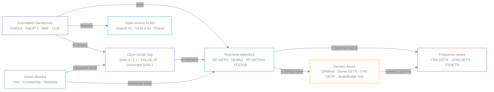
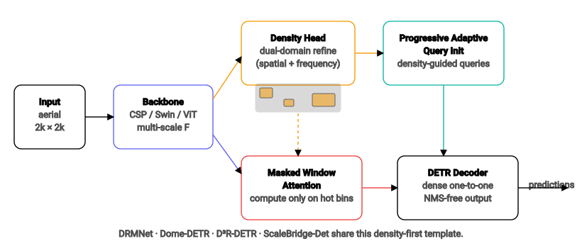
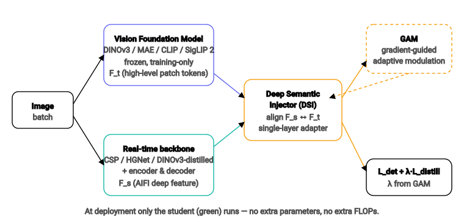
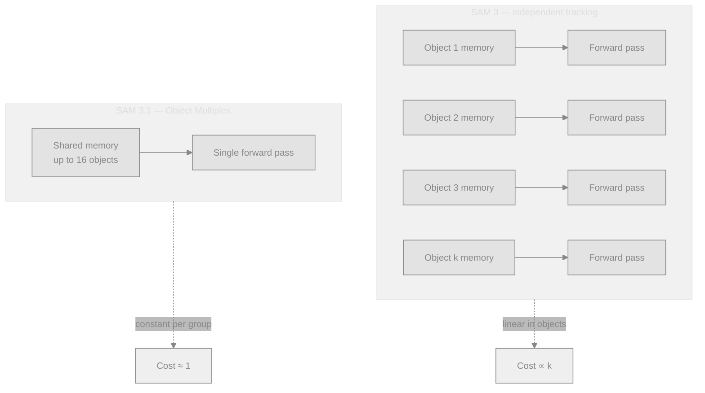

# Dense Object Detection & Classification — Recent Advances

*Compiled 2026-May-13 (America/Los_Angeles).*

Ninth installment in the running CV-updates log
([Apr-30](../2026-Apr-30/2026-Apr-30_CV_updates.md),
[May-01](../2026-May-01/2026-May-01_CV_updates.md),
[May-02](../2026-May-02/2026-May-02_CV_updates.md),
[May-04](../2026-May-04/2026-May-04_CV_updates.md),
[May-05](../2026-May-05/2026-May-05_CV_updates.md),
[May-07](../2026-May-07/2026-May-07_CV_updates.md),
[May-08](../2026-May-08/2026-May-08_CV_updates.md)).

Earlier installments framed the 2026 baseline — real-time DETRs
(RF-DETR, D-FINE, DEIM, DEIMv2), YOLO26, foundation backbones
(DINOv3, SigLIP 2), SAM 3, OBB / aerial, robustness, fairness,
applied verticals, PEFT, continual learning, and energy. This
report picks up four threads that have hardened in the past week
and were either absent from prior reports or only mentioned in
passing:

1. **Density-driven detection** has gone from a niche aerial trick
   to a generic recipe for tiny / crowded scenes.
2. **VFM-as-teacher distillation** is now the dominant way to lift
   a real-time detector — RT-DETRv4 and DEIMv2 both ride on
   DINOv3, but neither carries it at inference.
3. **SAM 3.1 Object Multiplex** retroactively turns SAM 3 into a
   real-time multi-object video segmenter — 7× speedup, no model
   surgery required.
4. **Frequency-domain DETRs** (FDA-DETR, DFIR-DETR, D³R-DETR)
   become the third axis for small-object DETRs, alongside density
   maps and dynamic queries.

Where earlier reports surveyed the *menagerie*, this one tries to
extract the *patterns* that are now repeating across the
literature.

---

## Table of contents

1. [What's new since May-08](#1-whats-new-since-may-08)
2. [Topic map](#2-topic-map)
3. [Density-driven detection for tiny & crowded scenes](#3-density-driven-detection-for-tiny--crowded-scenes)
4. [VFM-as-teacher: RT-DETRv4 & DEIMv2 in depth](#4-vfm-as-teacher-rt-detrv4--deimv2-in-depth)
5. [SAM 3.1 Object Multiplex](#5-sam-31-object-multiplex)
6. [Open-vocabulary instance segmentation in real time](#6-open-vocabulary-instance-segmentation-in-real-time)
7. [Frequency-domain DETRs](#7-frequency-domain-detrs)
8. [Mamba & hybrid backbones for dense prediction](#8-mamba--hybrid-backbones-for-dense-prediction)
9. [Open-source VLMs touching classification](#9-open-source-vlms-touching-classification)
10. [Reading list](#10-reading-list)

---

## 1. What's new since May-08

| Thread                          | One-line take                                                                                                       |
| ------------------------------- | ------------------------------------------------------------------------------------------------------------------- |
| Density-driven detection        | DRMNet ("Learning Where to Focus") generalises Dome-DETR / D³R-DETR / ScaleBridge-Det into a density-first template. |
| VFM-as-teacher distillation     | RT-DETRv4's DSI + GAM lifts CSP detectors with frozen DINOv3 — no inference overhead.                               |
| DEIMv2 + DINOv3                 | First sub-10M detector >50 AP on COCO; Spatial Tuning Adapter (STA) bridges single-scale ViT features to FPNs.      |
| SAM 3.1 Object Multiplex        | Shared-memory tracker pushes SAM 3 video PCS to ≈7× throughput, 16 objects/forward pass.                           |
| YOLOE-26                        | Open-vocab instance segmentation in the YOLO26 (NMS-free) deployment envelope: 36.8% LVIS mAP at YOLO-L cost.       |
| Frequency-domain DETRs          | FDA-DETR / DFIR-DETR / D³R-DETR add Fourier / Gabor branches to tiny-object DETRs — complements density heads.      |
| Vision Mamba (verticals)        | Interpretable Vision Mamba for SAR (–67.8% params), ConMamba for plant disease, SMamba for IR small objects.        |
| Open-source VLMs                | Qwen3-VL and GLM-4.6V close on GPT-5 / Gemini 2.5 Pro for classification-style queries; specialist eval still wins. |

## 2. Topic map

A mermaid view follows. Themes use neutral strokes with one accent
hue per cluster, so it renders cleanly in both light and dark UIs.

The same picture, slightly compressed: in 2026 the
backbone–detector–task triangle is being filled in by *adapters*
(STA, DSI) and *side-heads* (density, frequency) rather than by
new monolithic architectures.

---

## 3. Density-driven detection for tiny & crowded scenes

The defining property of dense detection in 2026 is that compute
is no longer uniformly spread across the image. Several recent
papers all converge on the same template:

1. Run a lightweight **density head** on backbone features.
2. Use the resulting heatmap to **allocate queries** (or anchors)
   to dense regions.
3. Restrict expensive attention to the **masked windows** flagged
   by the density head.
4. Hand off to a DETR-style decoder with **dense one-to-one**
   matching — no NMS.

### Concrete instantiations

| Method | Density mechanism | Query / compute allocation | Notes |
| ------ | ----------------- | -------------------------- | ----- |
| **DRMNet** ("Learning Where to Focus", arXiv 2512.22949, Dec 2025) | Density Generation Branch (DGB) on YOLO P3–P5 | Dense Area Focusing Module (DAFM) | Tunes YOLO-style cross-layer fusion for objects <8×8 px; +16.5% over YOLOv8/v10/v11 in dense aerial. |
| **Dome-DETR** (arXiv 2505.05741, ACM MM '25) | Density-Focal Extractor (DeFE) heatmap | Progressive Adaptive Query Init (PAQI) + Masked Window Attention Sparsification (MWAS) | Sparse attention drops decoder cost on AI-TOD. |
| **D³R-DETR** (arXiv 2601.02747, Jan 2026) | Dual-Domain (spatial + frequency) refinement of density map | Gabor-kernel frequency branch | 31.3% AP on AI-TOD-v2 — best reported for tiny-object DETR. |
| **ScaleBridge-Det** ("Bridging the Scale Gap", arXiv 2512.01665, Dec 2025) | Density-Guided Dynamic Query (DGQ) | Routing-Enhanced Mixture Attention (REM) over ResNet / ViT / Swin experts | First "large detection" framework that holds across extreme scale ratios. |
| **Density-Aware DETR** (IEEE T-… 2025 / 11007261) | Dynamic query budget per scene | End-to-end tiny detection | Drops the manual `num_queries` knob. |

What makes this a *trend* rather than a collection of papers is
that the density-first template is now showing up in non-aerial
domains: RGB-T crowd counting (Dual-Modulation, arXiv 2509.17079)
uses Spatially Modulated Attention to mimic the same "focus where
the density head says" logic, and RCCFormer (arXiv 2504.04935)
applies multi-level feature fusion with background suppression
for the same goal in person-count tasks.

### Practical recipe

- If your data has clusters of <16-px objects, fitting a density
  head is now cheaper than enlarging the backbone.
- Density maps double as a free **auxiliary loss** — supervise
  them with Gaussian-splatted box centres.
- Pair with **NMS-free** decoders; dense duplicate predictions
  are exactly the failure mode density allocation is designed to
  remove.

---

## 4. VFM-as-teacher: RT-DETRv4 & DEIMv2 in depth

The Apr-30 report named "VFM distillation" as a trend; in the
past two weeks two flagship realisations have made the pattern
canonical.

### RT-DETRv4 — *painlessly* furthering RT-DETR

[arXiv 2510.25257](https://arxiv.org/abs/2510.25257) and the
[RT-DETRv4 repo](https://github.com/RT-DETRs/RT-DETRv4) introduce
two surgical pieces:

- **Deep Semantic Injector (DSI).** A single linear adapter aligns
  the student's deepest encoder feature (the AIFI `F5` map) with
  patch tokens from a frozen VFM (DINOv3 by default; MAE / CLIP
  also tested). No multi-stage feature alignment, no extra heads.
- **Gradient-guided Adaptive Modulation (GAM).** Instead of a
  hand-tuned distillation weight `λ`, GAM watches the ratio of
  gradient norms between the detection loss and the distillation
  loss, and scales `λ` so the teacher never drowns out the task.
  Empirically beats the best fixed `λ` across all sizes.

Reported COCO AP / TensorRT-FP16 throughput on T4:
49.7 / 273 FPS, 53.5 / 169 FPS, **55.4 / 124 FPS**, 57.0 / 78 FPS
across the S / M / L / X variants — entirely from training-time
supervision. Inference graph is unchanged.

### DEIMv2 — Dense O2O meets DINOv3

[arXiv 2509.20787](https://arxiv.org/abs/2509.20787) replaces
DEIM's backbone with a DINOv3-pretrained ViT (or its distilled
ConvNeXt) and bridges single-scale ViT features to the
multi-scale decoder via a **Spatial Tuning Adapter (STA)**.
Combined with the upgraded Dense O2O matching:

- **DEIMv2-X**: 57.8 AP with 50.3M params — previously this AP
  bracket needed >60M params.
- **DEIMv2-S**: 50.9 AP at **9.71M params** — first sub-10M
  detector to clear 50 AP on COCO.
- Eight scales from `X` down to `Atto`; the Atto / Femto variants
  target mobile NPUs.

### Why this matters

The combination of frozen-teacher distillation + adapter ties the
fortunes of real-time detectors to the foundation-model cycle.
Each new DINO release now has a "free" detector accuracy bump
that doesn't cost any inference-time FLOPs. The community is
treating this as the new default training recipe rather than a
research trick.

---

## 5. SAM 3.1 Object Multiplex

Earlier reports flagged the SAM 3 release (Nov 2025) and noted
"SAM 3.1" in the [May-07 reading list](../2026-May-07/2026-May-07_CV_updates.md).
The blog ([Meta](https://ai.meta.com/blog/segment-anything-model-3/),
[GitHub](https://github.com/facebookresearch/sam3),
[checkpoints](https://huggingface.co/facebook/sam3))
now spell out the change.

- **Mechanism.** Object Multiplex groups up to 16 tracked
  instances into a *shared* memory bank and processes them in one
  forward pass through the tracker.
- **Speedup.** Reported up to **7× faster** real-time video
  tracking versus SAM 3, with no accuracy regression on SA-Co.
- **No architectural change.** The image / video encoder is the
  same; the trick is how memories are fused. SAM 3 checkpoints
  fine-tune cleanly into Object Multiplex.
- **Practical effect.** SAM 3 was previously the right answer for
  "find every instance of this concept in this clip" but scaled
  linearly with crowd size; 3.1 makes it a viable real-time
  detector + tracker for crowded scenes (sports, retail,
  surveillance).

The corresponding paper is the same arXiv entry
([2511.16719](https://arxiv.org/abs/2511.16719)) with v2 covering
the multiplex extension; checkpoints are tagged `sam3.1-*` on
Hugging Face.

---

## 6. Open-vocabulary instance segmentation in real time

The headline ICLR / CVPR 2026 result here is **YOLOE-26**
([arXiv 2602.00168](https://arxiv.org/abs/2602.00168),
[Ultralytics docs](https://docs.ultralytics.com/models/yolo26)),
which folds the YOLOE open-vocabulary recipe into the YOLO26
NMS-free deployment envelope.

Architecture highlights:

- **Object embedding head** replaces fixed class logits;
  classification becomes a similarity match against prompt
  embeddings (text, image exemplars, or built-in vocabulary).
- **RepRTA** — Re-Parameterizable Region-Text Alignment lets the
  text branch fuse into the visual branch *at deployment*, so
  text prompts add zero inference cost.
- **SAVPE** (Semantic-Activated Visual Prompt Encoder) lets a
  user click / box / mask a reference object in image space.
- **Lazy Region Prompt Contrast** enables prompt-free,
  vocabulary-free inference for open-world object discovery.

Reported numbers: **YOLOE26-L 36.8% LVIS mAP** vs. YOLOE-L's
35.2%, at roughly YOLO-L latency budget. The closed-set COCO
numbers are essentially YOLO26's, which is the point — open
vocabulary used to come with a ~30–40% inference tax.

Outside the YOLO line, **Grounded SAM 2** (PyImageSearch /
Roboflow tutorials, Jan 2026) is still the dominant *pipeline*
answer for offline open-vocab tasks: Grounding DINO / Florence-2
/ DINO-X for boxes → SAM 2 for masks → tracking head for video.
SAM 3 / 3.1 collapses this pipeline into a single model, but
Grounded SAM 2 remains useful when the grounding model is
domain-fine-tuned.

---

## 7. Frequency-domain DETRs

A third axis is emerging for small-object DETRs alongside density
maps and dynamic queries: **frequency-domain features**.

| Method | Spectral mechanism | Use case |
| ------ | ------------------ | -------- |
| **D³R-DETR** ([2601.02747](https://arxiv.org/abs/2601.02747)) | Gabor kernels in a Dual-Domain Fusion Module on low-level features | Aerial AI-TOD-v2 |
| **FDA-DETR** ([PLOS One](https://journals.plos.org/plosone/article?id=10.1371/journal.pone.0330929)) | Multi-scale FFT branch amplifying high-frequency cues + density-aware queries | Oriented small objects (DOTA-style) |
| **DFIR-DETR** ([2512.07078](https://arxiv.org/abs/2512.07078)) | Frequency-Domain Iterative Refinement + dynamic feature aggregation | Cross-scene small-object detection |
| **FSDETR** ([2604.14884](https://arxiv.org/abs/2604.14884)) | Frequency–Spatial Feature Enhancement | UAV imagery |

Why spectral now? At <8 px object size, spatial CNN/ViT features
collapse — there simply aren't enough pixels to form
discriminative patterns. High-frequency components (sharp edges,
periodic textures) survive longer, and Gabor / FFT branches let
the network exploit that signal without giving up the geometry
work that spatial attention does. Density heads tell the model
*where* to look; spectral branches give it *what* to look at.
Both pair naturally with the NMS-free decoder.

---

## 8. Mamba & hybrid backbones for dense prediction

Vision Mamba progress in the past week is dominated by
domain-specialised wins rather than a new general backbone:

- **Interpretable Vision Mamba (IVim)** for SAR classification
  ([Frontiers Neurorobot.](https://www.frontiersin.org/journals/neurorobotics/articles/10.3389/fnbot.2026.1753927/full)):
  Token Semantic Re-allocation + Token Attention Selection cuts
  parameters by **67.8%** vs. comparable ViT classifiers while
  matching accuracy on SAR-image classes.
- **ConMamba** ([arXiv 2506.03213](https://arxiv.org/abs/2506.03213)):
  contrastive SSL on Vision Mamba for plant disease detection;
  outperforms SwinV2 / ConvNeXt baselines on three datasets with
  far less labelled data.
- **SMamba (Super-Mamba)** for UAV-IR small objects
  ([Nature Sci. Reports](https://www.nature.com/articles/s41598-025-21837-2)):
  high-resolution multi-scale detection at reduced compute vs.
  Swin / RT-DETR baselines.
- **MambaVision** ([CVPR 2025](https://openaccess.thecvf.com/content/CVPR2025/papers/Hatamizadeh_MambaVision_A_Hybrid_Mamba-Transformer_Vision_Backbone_CVPR_2025_paper.pdf),
  [NVlabs repo](https://github.com/NVlabs/MambaVision)): the
  ongoing hybrid baseline. ImageNet-1K SoTA at matching
  throughput; downstream COCO / ADE20K numbers competitive with
  Swin-V2.

Open question: MambaOut ([CVPR 2025](https://arxiv.org/pdf/2405.07992))
argues hybrid backbones don't actually *need* the Mamba block on
fixed-length image tasks. The current truce in the literature is
"use Mamba where sequence length is unbounded (video, point
clouds, SAR sweeps); stick to attention for image grids" — and
the IVim / SMamba results are consistent with that.

---

## 9. Open-source VLMs touching classification

Pure-vision classification benchmarks are still owned by DINOv3
distillates (May-07 covered this), but **VLM classification** —
"label this image with one of these N classes via prompt" — has
shifted noticeably:

- **Qwen3-VL** (Alibaba, open weights) handles entire books or
  multi-hour videos with second-level indexing; on
  classification-style prompts it now matches GPT-5 on coarse
  categories and trails on fine-grained.
- **GLM-4.6V** is the strongest open-source competitor on
  UI-pixel-accurate tasks (screenshots → HTML/CSS/JS) and
  document classification.
- **Pixtral 12B** / **InternVL-3** keep moving the
  efficient-frontier curve for sub-15B-parameter open models.
- Vendor-specialist VLMs (medical, industrial, satellite) keep
  beating generalist VLMs by 5–10 percentage points on
  in-domain classification despite the latter being orders of
  magnitude larger
  ([Nature Comms](https://www.nature.com/articles/s41467-024-51465-9)).

The practical implication for *dense detection* is that VLMs
remain a poor fit for box-level set prediction (they will happily
emit "a dog is in the image" but degrade fast on "list every
pedestrian"), and the right pattern for open-vocab dense tasks
is still **VLM → detector / SAM 3** rather than VLM-as-detector.

---

## 10. Reading list

### Papers introduced this week

- DRMNet — *Learning Where to Focus: Density-Driven Guidance for
  Detecting Dense Tiny Objects*, [arXiv 2512.22949](https://arxiv.org/abs/2512.22949) (Dec 2025).
- ScaleBridge-Det — *Bridging the Scale Gap: Balanced Tiny and
  General Object Detection in Remote Sensing Imagery*,
  [arXiv 2512.01665](https://arxiv.org/abs/2512.01665) (Dec 2025).
- D³R-DETR — *DETR with Dual-Domain Density Refinement for Tiny
  Object Detection in Aerial Images*,
  [arXiv 2601.02747](https://arxiv.org/abs/2601.02747) (Jan 2026).
- DFIR-DETR — *Frequency-Domain Iterative Refinement and Dynamic
  Feature Aggregation for Small Object Detection*,
  [arXiv 2512.07078](https://arxiv.org/abs/2512.07078) (Dec 2025).
- RT-DETRv4 — *Painlessly Furthering Real-Time Object Detection
  with Vision Foundation Models*,
  [arXiv 2510.25257](https://arxiv.org/abs/2510.25257) /
  [code](https://github.com/RT-DETRs/RT-DETRv4) (Oct 2025).
- DEIMv2 — *Real-Time Object Detection Meets DINOv3*,
  [arXiv 2509.20787](https://arxiv.org/abs/2509.20787) /
  [HF doc](https://huggingface.co/docs/transformers/model_doc/deimv2).
- YOLOE-26 — *Integrating YOLO26 with YOLOE for Real-Time
  Open-Vocabulary Instance Segmentation*,
  [arXiv 2602.00168](https://arxiv.org/abs/2602.00168) /
  [Ultralytics docs](https://docs.ultralytics.com/models/yolo26).
- YOLO26 analysis — *YOLO26: An Analysis of NMS-Free End-to-End
  Framework*, [arXiv 2601.12882](https://arxiv.org/abs/2601.12882).

### Foundations & survey context

- DINOv3 — [Meta AI blog](https://ai.meta.com/blog/dinov3-self-supervised-vision-model/) /
  [arXiv 2508.10104](https://arxiv.org/abs/2508.10104).
- SAM 3 / 3.1 — [Meta AI blog](https://ai.meta.com/blog/segment-anything-model-3/) /
  [arXiv 2511.16719](https://arxiv.org/abs/2511.16719) /
  [GitHub](https://github.com/facebookresearch/sam3) /
  [HF checkpoints](https://huggingface.co/facebook/sam3).
- RF-DETR — *Neural Architecture Search for Real-Time Detection
  Transformers*, [arXiv 2511.09554](https://arxiv.org/abs/2511.09554) /
  [Roboflow repo](https://github.com/roboflow/rf-detr).
- Ultralytics YOLO evolution survey,
  [arXiv 2510.09653](https://arxiv.org/abs/2510.09653).
- Object detection with multimodal LLMs — review in
  [Information Fusion](https://www.sciencedirect.com/science/article/pii/S1566253525006475).

### Backbones & verticals

- MambaVision — [CVPR 2025 paper](https://openaccess.thecvf.com/content/CVPR2025/papers/Hatamizadeh_MambaVision_A_Hybrid_Mamba-Transformer_Vision_Backbone_CVPR_2025_paper.pdf) /
  [NVlabs repo](https://github.com/NVlabs/MambaVision).
- MambaOut — [arXiv 2405.07992](https://arxiv.org/abs/2405.07992).
- Interpretable Vision Mamba for SAR — [Frontiers Neurorobot.](https://www.frontiersin.org/journals/neurorobotics/articles/10.3389/fnbot.2026.1753927/full).
- ConMamba — [arXiv 2506.03213](https://arxiv.org/abs/2506.03213).
- Super-Mamba (UAV IR small objects) — [Nature Sci. Reports](https://www.nature.com/articles/s41598-025-21837-2).
- RGB-T Dual-Modulation crowd counting — [arXiv 2509.17079](https://arxiv.org/abs/2509.17079).
- RCCFormer — [arXiv 2504.04935](https://arxiv.org/abs/2504.04935).
- DRMNet (full HTML) — [arXiv 2512.22949](https://arxiv.org/html/2512.22949).

### Coverage / tutorial links (for orientation, not primary)

- *Best Object Detection Models 2026*, [Roboflow blog](https://blog.roboflow.com/best-object-detection-models/).
- *Grounded SAM 2 walkthrough*, [PyImageSearch](https://pyimagesearch.com/2026/01/19/grounded-sam-2-from-open-set-detection-to-segmentation-and-tracking/).
- *SAM 3 for video*, [PyImageSearch](https://pyimagesearch.com/2026/03/02/sam-3-for-video-concept-aware-segmentation-and-object-tracking/).
- *YOLOE-26 hands-on*, [Medium write-up](https://medium.com/@dhanrajjain/yoloe-26-open-vocabulary-instance-segmentation-enters-real-time-production-97a00fcff564).
- *DEIMv2 review*, [BrightCoding](https://www.blog.brightcoding.dev/2026/04/22/deimv2-the-revolutionary-real-time-detector-powered-by-dinov3).

---

*Diagrams in this report use `currentColor` for strokes and a small,
fixed accent palette (indigo / teal / amber / red / purple / green /
sky) so they render legibly in both light- and dark-mode renderers.*
