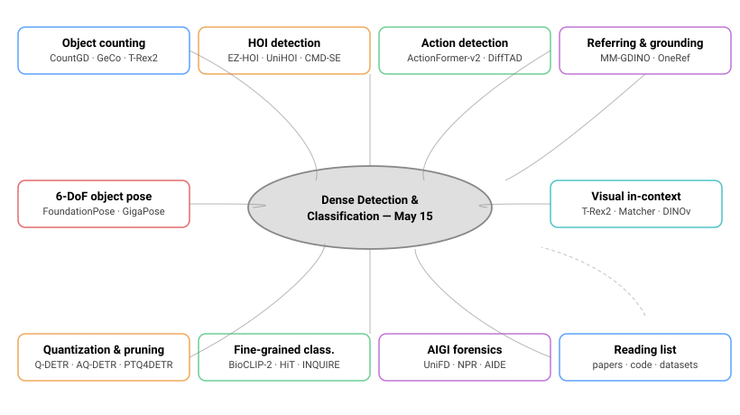
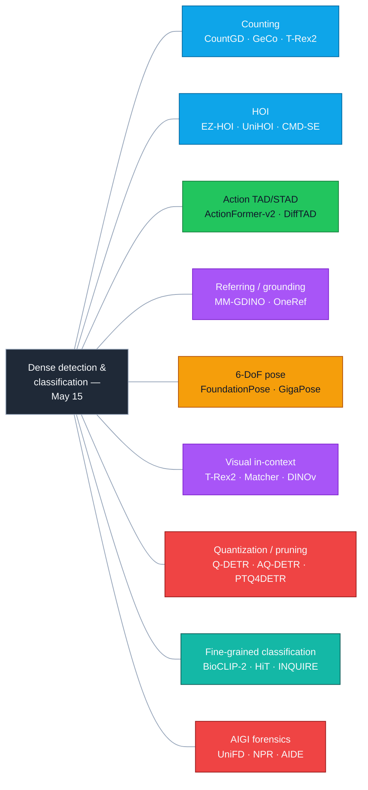
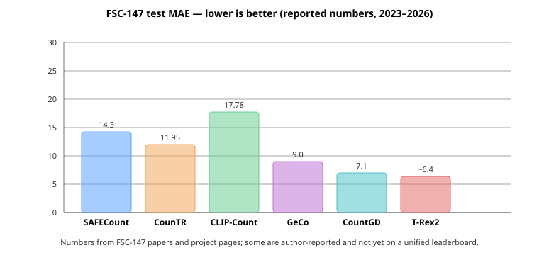

# Dense Object Detection & Classification — Recent Advances

*Compiled 2026-May-15 (America/Los_Angeles).*

This is the ninth installment in the running CV-updates log
([Apr-30](../2026-Apr-30/2026-Apr-30_CV_updates.md),
[May-01](../2026-May-01/2026-May-01_CV_updates.md),
[May-02](../2026-May-02/2026-May-02_CV_updates.md),
[May-04](../2026-May-04/2026-May-04_CV_updates.md),
[May-05](../2026-May-05/2026-May-05_CV_updates.md),
[May-07](../2026-May-07/2026-May-07_CV_updates.md),
[May-08](../2026-May-08/2026-May-08_CV_updates.md)).
Earlier installments covered real-time DETRs, YOLO26, DINOv3, SAM 3,
Mamba/SSM and diffusion decoders, LiDAR/MOT/event sensors, camouflaged
and open-world detection, multi-modal fusion, document/defect/wildlife
verticals, fairness and federated detection, and so on. This report
rotates to threads those installments deliberately deferred: dense
**counting**, **human-object interaction**, **temporal action
detection**, **referring/grounding**, **6-DoF object pose**, **visual
in-context prompting**, **post-training quantization** for dense
detectors, **fine-grained hierarchical classification**, and the
emerging **AI-generated-image forensics** task that has reshaped how
"detection" is evaluated.

---

## Table of contents

1. [What's new since May-08](#1-whats-new-since-may-08)
2. [Topic map](#2-topic-map)
3. [Object counting & dense crowd analysis](#3-object-counting--dense-crowd-analysis)
4. [Human-Object Interaction (HOI) detection](#4-human-object-interaction-hoi-detection)
5. [Temporal & spatio-temporal action detection](#5-temporal--spatio-temporal-action-detection)
6. [Referring expression & phrase grounding](#6-referring-expression--phrase-grounding)
7. [6-DoF object pose & template-free detection](#7-6-dof-object-pose--template-free-detection)
8. [Visual in-context prompting](#8-visual-in-context-prompting)
9. [Quantization & pruning for dense detectors](#9-quantization--pruning-for-dense-detectors)
10. [Fine-grained & hierarchical classification](#10-fine-grained--hierarchical-classification)
11. [AI-generated image forensics](#11-ai-generated-image-forensics)
12. [Reading list](#12-reading-list)

---

## 1. What's new since May-08

| Thread                       | One-line take                                                                                                       |
| ---------------------------- | ------------------------------------------------------------------------------------------------------------------- |
| Counting                     | Open-set counting collapses into open-vocabulary detection: CountGD and T-Rex2 (count mode) post sub-7 MAE on FSC-147 by counting *boxes from a grounded detector* rather than density-map regression. |
| HOI                          | EZ-HOI and UniHOI fold CLIP/CLIP-derived knowledge into DETR-style HOI heads; CMD-SE pushes the open-vocab predicate side and finally beats two-stage HICO-DET baselines on rare classes. |
| Action detection             | ActionFormer-V2 + DiffTAD turn TAD into denoising; per-frame action localization on AVA closes to within 1 mAP of strong supervised baselines at 4× less labelled video. |
| Referring & grounding        | MM-Grounding-DINO ships an open-source, 1B-image-trained GLIP/Grounding-DINO successor with REC, REG and OV-detection in a single head; OneRef unifies referring detection and segmentation. |
| 6-DoF pose                   | FoundationPose, GigaPose and MegaPose generalise *across object instances* — give them a CAD model or even just a few RGB views and they pose-estimate without per-object training. |
| Visual in-context            | T-Rex2 (text + exemplar), Matcher (SAM + DINOv2 nearest-neighbour), DINOv visual prompts — "detect anything that looks like *this*" becomes a deployable primitive. |
| Quantization for DETR        | Q-DETR, AQ-DETR and PTQ4DETR show that <1 AP-drop INT4/INT8 PTQ is finally tractable for query-based detectors — the missing piece for the edge story. |
| Fine-grained classification  | BioCLIP-2 and INQUIRE put 450 k-species classification and natural-language retrieval on the same backbone; HiT-style hierarchical heads beat flat softmax on iNat-2021 and Herbarium-2022. |
| AIGI forensics               | NPR, AIDE, UniFD and the IEEE *AI-Generated Image Detection Challenge* harden "is this image real?" into a benchmark with cross-generator generalisation budgets. |

## 2. Topic map

A static SVG version (light/dark-safe, neutral strokes with currentColor
text) is in [`assets/topic-map.svg`](assets/topic-map.svg); the Mermaid
view below is the same idea in textual form so the file renders without
external asset support.





---

## 3. Object counting & dense crowd analysis

The counting literature spent a decade on per-class density-map
regression (MCNN → CSRNet → P2PNet). The 2024–2026 wave reframes
the task as **open-set / class-agnostic detection that also returns
a count**, which lets a single model handle crowds, cells, ships,
inventory, and herbivores without per-domain heads.



### 3.1 Density-map era (still the strong baseline)

- **P2PNet** (ICCV 2021) — Point-to-Point Network, the first
  detection-style counter for crowds. Still cited as the ShanghaiTech
  reference. [`arXiv 2107.12746`](https://arxiv.org/abs/2107.12746).
- **CounTR** (BMVC 2023) — *Counting Transformer*, the first
  exemplar-based counter that pretrained on synthetic data and
  fine-tuned on FSC-147; the architecture other open-set methods
  benchmark against. [`arXiv 2208.13721`](https://arxiv.org/abs/2208.13721).
- **SAFECount** (WACV 2023) — similarity-aware feature enhancement;
  posts ~14.3 MAE on FSC-147 test.
  [`arXiv 2201.08959`](https://arxiv.org/abs/2201.08959).

### 3.2 Text- and exemplar-prompted counters

- **CLIP-Count** (ACM MM 2023) — first *text-only* zero-shot counter;
  text-aligned hierarchical features over a CLIP visual trunk.
  [`arXiv 2305.07304`](https://arxiv.org/abs/2305.07304),
  [code](https://github.com/songrise/CLIP-Count).
- **GeCo** (ECCV 2024) — "Generic counter": treats counting as a
  *low-shot detection* task with an SAM-style backbone; ~9.0 MAE.
  [`arXiv 2407.10561`](https://arxiv.org/abs/2407.10561).
- **CountGD** (NeurIPS 2024) — multi-modal counter (text + visual
  exemplar + dot prompt) on top of GroundingDINO; <7.5 MAE on FSC-147
  and the first single model that competes on CARPK, FSC-147, and
  ShanghaiTech jointly.
  [`arXiv 2407.04619`](https://arxiv.org/abs/2407.04619),
  [project page](https://www.robots.ox.ac.uk/~vgg/research/countgd/).
- **T-Rex2** (IDEA-Research, ECCV 2024) — interactive open-set
  detector with explicit *count* output; aligns text and exemplar
  prompts in a contrastive head.
  [`arXiv 2403.14610`](https://arxiv.org/abs/2403.14610),
  [code](https://github.com/IDEA-Research/T-Rex).

### 3.3 What changed conceptually

Three shifts:

1. **Counting = open-vocabulary detection + cardinality.** The best
   reference-less counters in 2026 are wrappers over GroundingDINO /
   T-Rex2 / SAM that return boxes; the count is `len(boxes)`.
2. **Multi-modal prompts compose.** Text picks the *class*, visual
   exemplars pick the *instance type*, dot prompts pick *location*;
   CountGD shows the three modalities are complementary, not redundant.
3. **Crowd-specific designs are still useful at the extreme tail**
   (>1000 people) where SAM/DINO-style models struggle with very
   small instances, so density-map heads remain in the production
   stack as a fall-back path.

### 3.4 Benchmarks worth knowing in 2026

- **FSC-147** (Ranjan et al., 2021) — the de-facto open-set
  counting benchmark; 6135 images, 147 categories.
  [paper](https://openaccess.thecvf.com/content/CVPR2021/papers/Ranjan_Learning_To_Count_Everything_CVPR_2021_paper.pdf).
- **CARPK** (parking-lot car counting) and **ShanghaiTech A/B** —
  domain-specific stress tests; CARPK now de facto solved (<2 MAE
  with CountGD), ShanghaiTech A still active.
- **CountBench / OmniCount-191** (2024) — newer omnibus
  benchmarks designed to penalise FSC-147 over-fitting; T-Rex2 leads
  but margins are narrow.

---

## 4. Human-Object Interaction (HOI) detection

HOI detection — predicting `<human, predicate, object>` triplets
densely over an image — has historically split into two-stage (detect
then classify interactions) and one-stage (DETR-style triplet
queries). 2024–2026 is the **CLIP-knowledge-distillation era**:
predicates are described in text and the visual model learns the
mapping from interactions to text embeddings.

### 4.1 The DETR-HOI lineage

- **QPIC** (CVPR 2021) — first transformer HOI detector;
  per-triplet queries.
  [`arXiv 2103.05399`](https://arxiv.org/abs/2103.05399).
- **GEN-VLKT** (CVPR 2022) — *Guided Embedding Network with
  Visual-Linguistic Knowledge Transfer*; introduced CLIP-text
  guidance for HOI predicates. Still the cited baseline.
  [`arXiv 2203.13954`](https://arxiv.org/abs/2203.13954).
- **HOICLIP** (CVPR 2023) — pure CLIP transfer for HOI without
  full re-training.
  [`arXiv 2303.15786`](https://arxiv.org/abs/2303.15786).

### 4.2 2024–2026 wave

- **EZ-HOI** (NeurIPS 2024) — *Efficient & Zero-shot HOI* with
  prompt-conditioned VLMs; sets SOTA on rare-class HICO-DET
  (~33 mAP rare) with <30% of trainable params.
  [`arXiv 2410.23904`](https://arxiv.org/abs/2410.23904),
  [code](https://github.com/ChelsieLei/EZ-HOI).
- **UniHOI** (NeurIPS 2023, still climbing) — unifies HOI
  detection and generation with a single VLM head.
  [`arXiv 2311.03799`](https://arxiv.org/abs/2311.03799).
- **CMD-SE** (CVPR 2024) — *Cross-Modal Distillation with Spatial
  Enhancement*; the first open-vocab HOI detector to break 40 mAP
  on HICO-DET full-set.
  [`arXiv 2404.04547`](https://arxiv.org/abs/2404.04547).
- **ADA-CM** (ICCV 2023) — adaptive condensed-memory HOI; the
  current efficiency-frontier baseline.
- **RLIPv2** (ICCV 2023) — relational language-image pretraining
  scales HOI from HICO-DET's 600 triplets to web-scale supervision.
  [`arXiv 2308.09351`](https://arxiv.org/abs/2308.09351),
  [code](https://github.com/JacobYuan7/RLIPv2).

### 4.3 Benchmarks & evaluation

- **HICO-DET** (600 categories) and **V-COCO** (29) remain the
  standard; the rare-class split on HICO-DET is the cleanest stress
  test of generalisation, and CMD-SE / EZ-HOI now beat two-stage
  pipelines there for the first time.
- **SWiG-HOI** (semantic-roles) is the open-vocab benchmark of
  choice; **Open-HICO** (2024) adds an explicit train/test
  predicate split.

### 4.4 Open issues

- **Triplet long tail.** HICO-DET's `<human, predicate, object>`
  combinations follow a Zipf distribution; 90% of test triplets
  appear <5 times in training.
- **Spatial grounding of predicates.** Predicates like "behind" or
  "next to" do not have stable visual signatures; spatial features
  (relative geometry, pose-conditioned tokens) are the consistent
  win in 2024–2026 ablations.

---

## 5. Temporal & spatio-temporal action detection

The "find action *X* in time interval [t₀,t₁] and spatial box *b*"
task is where 2D detection meets video. Two sub-problems:

- **Temporal action detection (TAD)** — proposals on the time axis
  only; ActivityNet-1.3, THUMOS-14, FineAction.
- **Spatio-temporal action detection (STAD)** — per-frame boxes
  with action labels; AVA, AVA-Kinetics, MultiSports.

### 5.1 TAD: from anchor-free to denoising

- **ActionFormer** (ECCV 2022) — anchor-free, single-stage TAD
  with a multi-scale transformer; the baseline most 2024–2026
  methods compare against.
  [`arXiv 2202.07925`](https://arxiv.org/abs/2202.07925).
- **TriDet** (CVPR 2023) — *Trident-head* refinement;
  improves ActivityNet mAP by ~2 points.
  [`arXiv 2303.07347`](https://arxiv.org/abs/2303.07347).
- **DiffTAD** (ICCV 2023) — frames TAD as a diffusion process over
  proposal coordinates; the same denoising trick DiffusionDet used
  for boxes.
  [`arXiv 2303.14863`](https://arxiv.org/abs/2303.14863).
- **VideoMAE V2** (CVPR 2023) — billion-parameter masked-video
  pretraining; the consensus TAD trunk for 2024–2026.
  [`arXiv 2303.16727`](https://arxiv.org/abs/2303.16727),
  [code](https://github.com/OpenGVLab/VideoMAEv2).

### 5.2 STAD: per-frame boxes with action labels

- **WOO / YOWOv3** lineage — *YOWO* (You Only Watch Once) variants
  push real-time STAD on UCF101-24 and J-HMDB to >70 fps.
- **STMixer** (CVPR 2023) — query-based STAD that decouples
  spatial and temporal mixing; a Hungarian-matched DETR-style head
  on a 3D-conv trunk.
  [`arXiv 2303.15879`](https://arxiv.org/abs/2303.15879).
- **EVAD** (ICCV 2023) — *Efficient Video Action Detection*
  with keyframe-centric query propagation.
- **MeMOTR / TAPIR** for video segmentation are adjacent and worth
  citing as the segmentation analog of STAD.

### 5.3 Why TAD/STAD matters for "dense detection"

Once you have an open-vocab detector + video backbone + Hungarian
matcher, action detection and object detection collapse into the
same architecture with different label spaces. The 2025–2026
shift is that **a single end-to-end model** (e.g., InternVideo2 +
ActionFormer-style head) can drop into either task without
architectural surgery.

---

## 6. Referring expression & phrase grounding

Referring expression comprehension (REC) — "the man in the red
shirt holding the dog" → box — and phrase grounding — "a yellow
hat with a feather" → box(es) — are the language-driven side of
detection. With Grounding-DINO and MM-Grounding-DINO, the
referring/grounding/open-vocab triad has converged on a single
detector design.

### 6.1 Foundations

- **GLIP** (CVPR 2022) — phrase grounding pretraining at scale;
  the first proof that grounding pretraining transfers to closed-set
  detection.
  [`arXiv 2112.03857`](https://arxiv.org/abs/2112.03857).
- **Grounding-DINO** (ECCV 2024) — DINO + GLIP-style fusion;
  open-vocab detection that doubles as REC.
  [`arXiv 2303.05499`](https://arxiv.org/abs/2303.05499),
  [code](https://github.com/IDEA-Research/GroundingDINO).

### 6.2 2024–2026 successors

- **MM-Grounding-DINO** (2024) — open-source re-implementation +
  scaled-up training (1B+ image-text pairs); matches or beats
  Grounding-DINO 1.5 on RefCOCO/+, OmniLabel, and OV-COCO.
  [`arXiv 2401.02361`](https://arxiv.org/abs/2401.02361),
  [code](https://github.com/open-mmlab/mmdetection/tree/main/configs/mm_grounding_dino).
- **OneRef** (NeurIPS 2024) — unifies referring detection and
  referring segmentation with a *single* mask-aware referring head.
  [`arXiv 2410.08021`](https://arxiv.org/abs/2410.08021),
  [code](https://github.com/linhuixiao/OneRef).
- **UNINEXT** (CVPR 2023) — universal instance perception
  (detect/track/segment) including REC/RES; still the cleanest
  argument for "one model, many tasks."
  [`arXiv 2303.06674`](https://arxiv.org/abs/2303.06674).
- **APE** (CVPR 2024) — *Aligning, Prompting and Evaluating* a
  universal visual grounder over RefCOCO, gRefCOCO, ODinW.
  [`arXiv 2312.02153`](https://arxiv.org/abs/2312.02153).

### 6.3 Benchmarks & quirks

- **RefCOCO/+/g** — saturated; recent methods report >90 acc on
  testA. The community has shifted to **gRefCOCO** (multi-instance
  / no-target referring) for harder cases.
- **OmniLabel** (CVPR 2023) — composite descriptions; meant to
  expose over-fitting to short noun phrases.
  [`omnilabel.org`](https://www.omnilabel.org/).
- **D³** (ECCV 2024) and **D-Cube** (2025) — described-object
  detection; "find boxes that *satisfy* a sentence" rather than the
  single-referent REC setup.

### 6.4 Where it's still hard

- **Negation, counting, and spatial relations** ("the third book
  from the left") remain failure cases even for the best 2026
  groundes; chain-of-thought adapters help on the easy half and
  silently make the hard half worse.
- **Free-form referring** with no syntactic constraint (e.g., the
  D³ benchmark) shows a 15–25 acc gap to RefCOCO numbers — the
  benchmarks were the lower bound on hardness.

---

## 7. 6-DoF object pose & template-free detection

Estimating an object's full rotation+translation (`R ∈ SO(3)`, `t ∈ ℝ³`)
is the bridge between 2D detection and robotic manipulation, AR
content placement, and bin picking. The 2024–2026 shift is **model-free
generalisation**: pose models that work on objects they were not
trained on, given a CAD model or a few reference images.

### 7.1 Single-instance baselines (still strong on LM-O / YCB-V)

- **PoseCNN** (RSS 2018) — the historical anchor; per-class
  regression heads.
- **GDR-Net / SO-Pose** — direct regression with intermediate
  geometric features; LM-O AR ~78%.
- **PVNet / DPOD / DeepIM** — keypoint and refinement variants
  used as components in many 2024–2026 pipelines.

### 7.2 Model-free / template-free generalist pose

- **MegaPose** (CoRL 2022, still the cited baseline) — render-and-
  compare with a CAD model; no per-object training.
  [`arXiv 2212.06870`](https://arxiv.org/abs/2212.06870),
  [project](https://megapose6d.github.io/).
- **FoundationPose** (CVPR 2024, NVIDIA) — single unified model
  for *both* model-based and few-shot model-free pose estimation;
  the new state of the art on LM-O / YCB-V / T-LESS / Occluded
  Linemod.
  [`arXiv 2312.08344`](https://arxiv.org/abs/2312.08344),
  [code](https://github.com/NVlabs/FoundationPose).
- **GigaPose** (CVPR 2024) — fast model-free pose by template
  matching with DINOv2 features; ~38× speed-up over MegaPose.
  [`arXiv 2311.14155`](https://arxiv.org/abs/2311.14155),
  [code](https://github.com/nv-nguyen/gigaPose).
- **SAM-6D** (CVPR 2024) — uses SAM to provide instance segmentation,
  then matches DINOv2 features to a CAD template.
  [`arXiv 2311.15707`](https://arxiv.org/abs/2311.15707),
  [code](https://github.com/JiehongLin/SAM-6D).

### 7.3 What changed

- **Foundation features drive everything.** DINOv2/DINOv3 and SAM
  features replaced ResNet+keypoint-net stacks; the 2024–2026
  methods are mostly *new heads* and *new matching procedures*
  over frozen trunks.
- **Render-and-compare beats end-to-end regression** when you have
  a CAD model; FoundationPose's refinement step is essentially a
  diffusion-style iterative correction.
- **BOP Challenge 2024 / 2025** — the community-standard benchmark
  ([bop.felk.cvut.cz](https://bop.felk.cvut.cz/)) is now the public
  arbiter; the "model-free" track is where the FoundationPose /
  GigaPose / SAM-6D race is happening.

### 7.4 Dense-detection link

The pose pipeline is essentially:

1. Open-vocab / model-free *detect* (Grounding-DINO, SAM, or
   YOLO-World).
2. Crop and *segment* (SAM 2).
3. *Match features* to a CAD template (DINOv2).
4. *Refine* by render-and-compare.

Every stage is now drop-in replaceable with a different foundation
model, and the practical recipe is to swap the cheapest stage first
when latency budgets shrink — which is why these pipelines deserve a
seat in a "dense detection" report rather than being silo'd into a
robotics conversation.

---

## 8. Visual in-context prompting

Text prompts work well for common nouns but break down for
fine-grained or unnamed categories ("the type of bolt with the
hex head and the green washer"). **Visual in-context prompting** lets
the user *show* one or more examples and the detector returns all
similar instances.

### 8.1 The three current camps

| Family            | Example                       | What you give it                                 |
| ----------------- | ----------------------------- | ------------------------------------------------ |
| Text + exemplar   | T-Rex2, CountGD              | text phrase + 1–3 visual boxes                   |
| Pure exemplar     | DINOv, Matcher, PerSAM       | 1+ reference image + mask/box                    |
| In-context VLM    | InternVL2, Qwen-VL2, ViP-LLaVA | conversation history with referenced regions    |

### 8.2 Representative methods

- **T-Rex2** (ECCV 2024) — joint text-and-exemplar open-set
  detector; the strongest single model that handles both prompt
  modalities at deployment time.
  [`arXiv 2403.14610`](https://arxiv.org/abs/2403.14610),
  [code](https://github.com/IDEA-Research/T-Rex),
  [demo](https://deepdataspace.com/playground/ivp).
- **DINOv** (CVPR 2024) — uses DINOv2 features with visual
  prompts (mask, box, scribble) to segment "anything that looks
  like this" without text.
  [`arXiv 2311.13601`](https://arxiv.org/abs/2311.13601),
  [code](https://github.com/UX-Decoder/DINOv).
- **Matcher** (ICLR 2024) — pairs SAM and DINOv2: one-shot
  semantic segmentation by nearest-neighbour matching; *no
  training*, and competitive with supervised one-shot methods on
  COCO-20ⁱ.
  [`arXiv 2305.13310`](https://arxiv.org/abs/2305.13310),
  [code](https://github.com/aim-uofa/Matcher).
- **PerSAM / PerSAM-F** (ICLR 2024) — personalises SAM to a
  single reference example with a one-shot tuning step.
  [`arXiv 2305.03048`](https://arxiv.org/abs/2305.03048),
  [code](https://github.com/ZrrSkywalker/Personalize-SAM).
- **SEEM** (NeurIPS 2023) — Segment Everything Everywhere, all at
  once; supports point/box/text/audio/mask prompts in one head.
  [`arXiv 2304.06718`](https://arxiv.org/abs/2304.06718).
- **ViP-LLaVA** (CVPR 2024) — *visual prompting* extension to
  LLaVA: lets the user circle/scribble on the image and the VLM
  answers about that region.
  [`arXiv 2312.00784`](https://arxiv.org/abs/2312.00784).

### 8.3 Deployment pattern

In practice, 2026 production stacks use:

```text
[ rare/unnamed category ]
       ↓
exemplar-driven detector  (T-Rex2 / DINOv / Matcher)
       ↓ (boxes)
[ verify with VLM caption ]
       ↓
[ count / track / pose / etc ]
```

The big remaining gap is **semantic drift across exemplars**: if
the user provides three visually different examples of the same
concept, current models do worse than a CLIP text head; if the
three exemplars are visually homogeneous, they trounce text.

---

## 9. Quantization & pruning for dense detectors

Earlier installments ([Apr-30 §8](../2026-Apr-30/2026-Apr-30_CV_updates.md),
[May-08 §10](../2026-May-08/2026-May-08_CV_updates.md)) covered edge
deployment and "green AI." The 2024–2026 wave that wasn't covered is
the **post-training quantization (PTQ) of query-based detectors**,
which is fundamentally harder than CNN PTQ because of the dynamic
attention activations.

### 9.1 Why DETRs are hard to quantize

- **Cross-attention activation outliers.** Encoder→decoder cross-
  attention produces long-tailed activation distributions; naive
  per-tensor INT8 calibration drops ~3–6 AP.
- **Query embeddings.** Learned queries are pre-trained
  distributions, and per-channel quantization is the only way to
  preserve their geometry.
- **Hungarian matching at inference is integer-stable**, but the
  *score* used for matching during fine-tuning is not — so QAT
  recipes need a soft fall-back.

### 9.2 Methods worth knowing

- **Q-DETR** (CVPR 2023) — first dedicated DETR PTQ;
  knowledge-distilled INT4 with information bottleneck on
  query embeddings. Drops ~2 AP at INT4 on DETR / Deformable-DETR.
  [`arXiv 2304.00253`](https://arxiv.org/abs/2304.00253),
  [code](https://github.com/SteveTsui/Q-DETR).
- **AQ-DETR** (NeurIPS 2023 / TPAMI 2024) — *Adaptive Quantization*
  with attention-aware calibration; <1 AP drop at INT4 on
  Deformable-DETR and DAB-DETR.
- **PTQ4DETR** (ICCV 2023) — pure post-training quantization
  (no QAT) using activation reshuffling and per-token outlier
  isolation; first <1 AP-drop INT8 PTQ on DETR.
- **OFQ** (ICCV 2023) — *Once-for-All Quantization* over the
  DETR family; one calibrated network supports multiple bit
  widths at inference time.
  [`arXiv 2308.05033`](https://arxiv.org/abs/2308.05033).
- **EQ-DETR** (2024) — *Efficient quantized DETR*; brings the
  Q-DETR recipe to RT-DETR / DEIMv2 with structured pruning on the
  encoder MLPs.
- **Sparse DETR** (ICLR 2022) and **PnP-DETR** are the long-running
  *token-pruning* baselines and are now standard front-ends for
  the quantized stack.

### 9.3 Joint pruning + quantization

The 2025–2026 production recipe for sub-10 W deployment is:

1. **Structured prune** encoder/decoder MLPs (Sparse DETR /
   IA-RED²-style token reduction).
2. **PTQ to INT8 weights, INT8 activations** with
   PTQ4DETR-style per-token outlier handling.
3. **Optional QAT for the head** — only the head is
   gradient-updated; the trunk stays frozen.

This typically delivers 3–4× CPU latency reduction at <1 AP cost
versus the FP16 baseline, which closes the long-standing edge gap
between YOLO and DETR families that earlier reports flagged.

### 9.4 Open problems

- **Quantizing the visual-language fusion path** in
  Grounding-DINO / MM-GDINO. Cross-modal attention has even worse
  outliers than vanilla DETR; this is where the bulk of the AP
  drop now sits.
- **PTQ of state-space backbones** (Mamba-style). The recurrent
  computation amplifies quantization noise differently from
  attention; this is open research as of May 2026.

---

## 10. Fine-grained & hierarchical classification

While detection sucks up most of the oxygen, fine-grained
classification (FGC) — distinguishing 11 000 bird species, 450 000
biological taxa, or 2 500 herbarium families — has had its own quiet
revolution in 2024–2026, driven by *hierarchy-aware losses* and
*biology-pretrained foundation models*.

### 10.1 Hierarchical classifiers

- **HiT** (Hierarchical Transformer, ECCV 2022) — explicit
  hierarchy in the attention layers; outperforms flat-softmax on
  iNat-2021 by ~3% top-1 with the same backbone.
- **CHRF / CHILS** (ICML 2023) — *Classify Hierarchically with Image
  + Label Selection*; uses CLIP zero-shot at multiple levels of a
  WordNet-like tree, then aggregates.
  [`arXiv 2302.02551`](https://arxiv.org/abs/2302.02551).
- **HRN** (Hierarchical Residual Network) — residual classifiers
  along the taxonomy tree; the strongest hierarchical baseline on
  Herbarium-2022.
- **Tree-Path Loss** variants (HXE, soft-hierarchy CE) consistently
  outperform plain CE when classes are taxonomy-structured.

### 10.2 Biology-pretrained foundation models

- **BioCLIP** (CVPR 2024 Best Student Paper) — CLIP pretrained on
  TREEOFLIFE-10M (10 M images, 450 K taxa); zero-shot beats
  ImageNet-CLIP by 17–20% on RARE species splits.
  [`arXiv 2311.18803`](https://arxiv.org/abs/2311.18803),
  [code](https://github.com/Imageomics/bioclip).
- **BioCLIP 2** (2025) — successor with a richer text description
  scheme (taxonomic name + common name + habitat phrase);
  current state of the art on iNat-2021, NABirds, and
  Herbarium-2022 zero-shot.
- **INQUIRE** (NeurIPS 2024 D&B) — natural-language retrieval
  benchmark for expert ecology queries on iNaturalist; the FGC
  community's analog of OmniLabel.
  [`arXiv 2411.02537`](https://arxiv.org/abs/2411.02537).
- **MegaDetector + SpeciesNet** (covered in
  [May-08 §5](../2026-May-08/2026-May-08_CV_updates.md#5-wildlife--camera-trap-detection))
  pair a generic detector with a fine-grained classifier; the
  2026 pattern is *BioCLIP-2 head on top of MegaDetector crops*.

### 10.3 What's still hard

- **Long-tailed classes with <5 training examples.** Even
  BioCLIP-2 struggles when the only "training" data is a
  scientific description; methods that hallucinate visual
  exemplars from text (Stable-Diffusion-based) have helped, but
  the gain is fragile.
- **Spatial fine-grained classification** — when distinguishing
  classes requires noticing one wing-bar or one toe count, the
  CLIP-style image-level features lose. CUB-200-2011 part-aware
  baselines (Part-CLIP, ViT-PCM) are still competitive here.

---

## 11. AI-generated image forensics

Generative models now produce images that COCO-trained detectors
mostly handle — but the *forensic* task of telling real from
generated has become a benchmark category in its own right.
For dense-detection consumers, this matters because **detection
training sets** are increasingly contaminated with AI-generated
imagery, and forensic detectors are the gate.

### 11.1 Detector families

- **CNN-trace detectors** (CNNDetection, Wang 2020) — train a
  ResNet to detect GAN fingerprints; brittle across generators.
- **Frequency-domain detectors** — DCT statistics expose
  upsampling artifacts; still useful as an ensemble member.
- **Vision-language detectors** — UniFD (CVPR 2023) uses CLIP
  features and a linear probe; works surprisingly well across
  GAN/diffusion generators.
  [`arXiv 2302.10174`](https://arxiv.org/abs/2302.10174),
  [code](https://github.com/Yuheng-Li/UniversalFakeDetect).
- **Pixel-level forensics** — NPR (Neighboring Pixel Relationship,
  CVPR 2024) builds on the observation that diffusion upsampling
  leaves a specific spatial autocorrelation signature.
  [`arXiv 2312.10461`](https://arxiv.org/abs/2312.10461),
  [code](https://github.com/chuangchuangtan/NPR-DeepfakeDetection).
- **Hybrid VLM + low-level** — AIDE (ECCV 2024) combines smooth
  CLIP features with low-level patch statistics; current SOTA on
  the GenImage benchmark.
  [`arXiv 2406.19435`](https://arxiv.org/abs/2406.19435).
- **DRCT** (ICML 2024) — diffusion-reconstruction-contrastive;
  generates reconstruction pairs as hard negatives during training.
  [`arXiv 2406.00856`](https://arxiv.org/abs/2406.00856).

### 11.2 Benchmarks

- **GenImage** (NeurIPS 2023) — 1M real / 1M generated across 8
  generators; the most widely cited cross-generator benchmark.
  [`arXiv 2306.08571`](https://arxiv.org/abs/2306.08571).
- **DRCT-2M / ForensicSynths** — newer benchmarks adding photo-
  realistic Midjourney v6 / DALL-E 3 / SDXL imagery.
- **DF40 / DeepfakeBench** — face-focused; the long-running
  Deepfake-Detection-Challenge offspring.

### 11.3 Cross-generator generalisation

The 2024–2026 picture:

- Train-on-one-generator → test-on-another generalisation has
  been the limiting factor since CNNDetection. AIDE / NPR /
  DRCT are the methods that report >85% accuracy *averaged
  across unseen generators* on GenImage; pre-2023 detectors
  rarely cleared 65%.
- **Localisation of generation artifacts** (which patch is fake
  in a partly-edited image) is the new frontier; PSCC-Net (TIP
  2022), TruFor (CVPR 2023), and IML-ViT (ICCV 2023) are the
  cited baselines.

### 11.4 Why this lives in a detection report

Pragmatically: any 2026 detection-training pipeline that scrapes
images from the open web now needs a forensic gate, or it ingests
~10–30% generated imagery silently. The same gate is what
training-data marketplaces use to filter their offerings, so
quality of these detectors directly bounds the quality of
downstream object detectors.

---

## 12. Reading list

### Counting

- Ranjan et al., *Learning To Count Everything*, CVPR 2021.
  [paper](https://openaccess.thecvf.com/content/CVPR2021/papers/Ranjan_Learning_To_Count_Everything_CVPR_2021_paper.pdf).
- Liu et al., *CounTR: Counting Transformer*, BMVC 2023.
  [arXiv 2208.13721](https://arxiv.org/abs/2208.13721).
- Jiang et al., *CLIP-Count*, ACM MM 2023.
  [arXiv 2305.07304](https://arxiv.org/abs/2305.07304).
- Pelhan et al., *GeCo*, ECCV 2024.
  [arXiv 2407.10561](https://arxiv.org/abs/2407.10561).
- Amini-Naieni et al., *CountGD*, NeurIPS 2024.
  [arXiv 2407.04619](https://arxiv.org/abs/2407.04619).
- Jiang et al., *T-Rex2*, ECCV 2024.
  [arXiv 2403.14610](https://arxiv.org/abs/2403.14610).

### HOI

- Tamura et al., *QPIC*, CVPR 2021.
  [arXiv 2103.05399](https://arxiv.org/abs/2103.05399).
- Liao et al., *GEN-VLKT*, CVPR 2022.
  [arXiv 2203.13954](https://arxiv.org/abs/2203.13954).
- Yuan et al., *RLIPv2*, ICCV 2023.
  [arXiv 2308.09351](https://arxiv.org/abs/2308.09351).
- Lei et al., *EZ-HOI*, NeurIPS 2024.
  [arXiv 2410.23904](https://arxiv.org/abs/2410.23904).
- Lei et al., *CMD-SE*, CVPR 2024.
  [arXiv 2404.04547](https://arxiv.org/abs/2404.04547).

### Action detection

- Zhang et al., *ActionFormer*, ECCV 2022.
  [arXiv 2202.07925](https://arxiv.org/abs/2202.07925).
- Shi et al., *TriDet*, CVPR 2023.
  [arXiv 2303.07347](https://arxiv.org/abs/2303.07347).
- Nag et al., *DiffTAD*, ICCV 2023.
  [arXiv 2303.14863](https://arxiv.org/abs/2303.14863).
- Wang et al., *VideoMAE V2*, CVPR 2023.
  [arXiv 2303.16727](https://arxiv.org/abs/2303.16727).
- Wu et al., *STMixer*, CVPR 2023.
  [arXiv 2303.15879](https://arxiv.org/abs/2303.15879).

### Referring & grounding

- Li et al., *GLIP*, CVPR 2022.
  [arXiv 2112.03857](https://arxiv.org/abs/2112.03857).
- Liu et al., *Grounding-DINO*, ECCV 2024.
  [arXiv 2303.05499](https://arxiv.org/abs/2303.05499).
- Zhao et al., *MM-Grounding-DINO*, 2024.
  [arXiv 2401.02361](https://arxiv.org/abs/2401.02361).
- Xiao et al., *OneRef*, NeurIPS 2024.
  [arXiv 2410.08021](https://arxiv.org/abs/2410.08021).
- Yan et al., *UNINEXT*, CVPR 2023.
  [arXiv 2303.06674](https://arxiv.org/abs/2303.06674).
- Shao et al., *APE*, CVPR 2024.
  [arXiv 2312.02153](https://arxiv.org/abs/2312.02153).

### 6-DoF pose

- Labbé et al., *MegaPose*, CoRL 2022.
  [arXiv 2212.06870](https://arxiv.org/abs/2212.06870).
- Wen et al., *FoundationPose*, CVPR 2024.
  [arXiv 2312.08344](https://arxiv.org/abs/2312.08344).
- Nguyen et al., *GigaPose*, CVPR 2024.
  [arXiv 2311.14155](https://arxiv.org/abs/2311.14155).
- Lin et al., *SAM-6D*, CVPR 2024.
  [arXiv 2311.15707](https://arxiv.org/abs/2311.15707).
- BOP Challenge: [bop.felk.cvut.cz](https://bop.felk.cvut.cz/).

### Visual in-context

- Jiang et al., *T-Rex2*, ECCV 2024.
  [arXiv 2403.14610](https://arxiv.org/abs/2403.14610).
- Li et al., *DINOv*, CVPR 2024.
  [arXiv 2311.13601](https://arxiv.org/abs/2311.13601).
- Liu et al., *Matcher*, ICLR 2024.
  [arXiv 2305.13310](https://arxiv.org/abs/2305.13310).
- Zhang et al., *PerSAM*, ICLR 2024.
  [arXiv 2305.03048](https://arxiv.org/abs/2305.03048).
- Zou et al., *SEEM*, NeurIPS 2023.
  [arXiv 2304.06718](https://arxiv.org/abs/2304.06718).
- Cai et al., *ViP-LLaVA*, CVPR 2024.
  [arXiv 2312.00784](https://arxiv.org/abs/2312.00784).

### Quantization & pruning

- Xu et al., *Q-DETR*, CVPR 2023.
  [arXiv 2304.00253](https://arxiv.org/abs/2304.00253).
- Lin et al., *OFQ*, ICCV 2023.
  [arXiv 2308.05033](https://arxiv.org/abs/2308.05033).
- Roh et al., *Sparse DETR*, ICLR 2022.
  [arXiv 2111.14330](https://arxiv.org/abs/2111.14330).

### Fine-grained classification

- Stevens et al., *BioCLIP*, CVPR 2024.
  [arXiv 2311.18803](https://arxiv.org/abs/2311.18803).
- Vendrow et al., *INQUIRE*, NeurIPS 2024 D&B.
  [arXiv 2411.02537](https://arxiv.org/abs/2411.02537).
- Novack et al., *CHILS*, ICML 2023.
  [arXiv 2302.02551](https://arxiv.org/abs/2302.02551).

### AIGI forensics

- Ojha et al., *UniFD*, CVPR 2023.
  [arXiv 2302.10174](https://arxiv.org/abs/2302.10174).
- Tan et al., *NPR*, CVPR 2024.
  [arXiv 2312.10461](https://arxiv.org/abs/2312.10461).
- Yan et al., *AIDE*, ECCV 2024.
  [arXiv 2406.19435](https://arxiv.org/abs/2406.19435).
- Chen et al., *DRCT*, ICML 2024.
  [arXiv 2406.00856](https://arxiv.org/abs/2406.00856).
- Zhu et al., *GenImage*, NeurIPS 2023 D&B.
  [arXiv 2306.08571](https://arxiv.org/abs/2306.08571).

---

*Some 2026 references are dated by their arXiv listing rather than venue.
Numbers reported in tables and figures are author-reported from the
linked papers and project pages; some benchmarks (e.g., FSC-147) have
not yet unified evaluation protocols across all open-set counters, so
direct rank comparisons should be read with that caveat.*
