# Dense Object Detection & Classification — Recent Advances

*Compiled 2026-May-16 (America/Los_Angeles).*

Tenth installment in the running CV-updates log
([Apr-30](../2026-Apr-30/2026-Apr-30_CV_updates.md),
[May-01](../2026-May-01/2026-May-01_CV_updates.md),
[May-02](../2026-May-02/2026-May-02_CV_updates.md),
[May-04](../2026-May-04/2026-May-04_CV_updates.md),
[May-05](../2026-May-05/2026-May-05_CV_updates.md),
[May-07](../2026-May-07/2026-May-07_CV_updates.md),
[May-08](../2026-May-08/2026-May-08_CV_updates.md),
[May-15](../2026-May-15/2026-May-15_CV_updates.md)).
Earlier installments worked through real-time DETRs, YOLO26, DINOv3,
SAM 3, Mamba/SSM and diffusion decoders, LiDAR/MOT/event sensors,
camouflaged and open-world detection, multi-modal fusion, document /
defect / wildlife verticals, fairness / federated detection,
counting, HOI, action detection, REC/grounding, 6-DoF pose, visual
in-context prompting, DETR PTQ, fine-grained classification and AIGI
forensics. This report rotates to threads not yet covered in depth:
**small-object detection**, **UAV/aerial OBB advances**, **video
object detection**, **RGB-Thermal/IR fusion**, **salient and
co-salient detection**, **SAR & multi-spectral remote sensing**,
**class-incremental detection**, **industrial anomaly detection**,
**sparse-query and diffusion detectors**, and **unified multi-task
dense heads**.

---

## Table of contents

1. [What's new since May-15](#1-whats-new-since-may-15)
2. [Topic map](#2-topic-map)
3. [Small-object detection](#3-small-object-detection)
4. [UAV / aerial detection & oriented bounding boxes](#4-uav--aerial-detection--oriented-bounding-boxes)
5. [Video object detection](#5-video-object-detection)
6. [RGB-Thermal / IR fusion detection](#6-rgb-thermal--ir-fusion-detection)
7. [Salient and co-salient object detection](#7-salient-and-co-salient-object-detection)
8. [SAR & multi-spectral remote sensing](#8-sar--multi-spectral-remote-sensing)
9. [Class-incremental object detection](#9-class-incremental-object-detection)
10. [Industrial anomaly detection](#10-industrial-anomaly-detection)
11. [Sparse-query & diffusion detectors](#11-sparse-query--diffusion-detectors)
12. [Unified multi-task dense heads](#12-unified-multi-task-dense-heads)
13. [Reading list](#13-reading-list)

---

## 1. What's new since May-15

| Thread                       | One-line take                                                                                                                                       |
| ---------------------------- | --------------------------------------------------------------------------------------------------------------------------------------------------- |
| Small-object detection       | CFINet's *coarse-to-fine* RPN + Slicing-Aided Hyper-Inference (SAHI) post-processing now ship as plug-ins on top of RT-DETR/YOLO26 baselines.        |
| UAV / aerial OBB             | LSKNet's large-selective-kernel backbone, PKINet's poly-kernel inception, and STAR's scale-tolerant attention all sit at the top of DOTA-v2.        |
| Video object detection       | TransVOD++, ClipVID, and YOLOV++ replace expensive optical-flow warping with sparse query propagation across short clips.                          |
| RGB-T fusion                 | DEYOLO (ICASSP 24), ICAFusion, DAMSDet and CrossFire push LLVIP / M3FD past 75 mAP with cross-attention rather than concat-fusion.                  |
| Salient / co-salient         | VST++, MENet, and BBRF replace CNN encoders with DINOv2/v3 features; co-SOD adds GCoNet++ and CoNet-style relation reasoning.                       |
| SAR & multi-spectral         | SARDet-100K standardises SAR detection across ten modalities; SpectralGPT and DOFA scale foundation models to hyper-spectral and SAR jointly.       |
| Class-incremental detection  | CL-DETR, SDDGR, and LDB demonstrate that DETR's set prediction is intrinsically friendlier to incremental learning than two-stage R-CNN heads.      |
| Industrial anomaly           | PatchCore-2026 + WinCLIP-Plus + AnomalyGPT bring **zero-/few-shot** anomaly detection to MVTec-AD AUROC > 96 with no defective examples needed.      |
| Sparse-query / diffusion     | DiffusionDet-V2 and BoxDiff treat detection as iterative denoising of box coordinates — competitive with DETR and tunable at inference time.        |
| Unified dense heads          | GLEE, APE, OMG-Seg and OneFormer collapse detection / instance-seg / panoptic / referring / interactive into **one** prompted head.                  |

---

## 2. Topic map

An SVG topic map (light/dark-safe via `currentColor`):

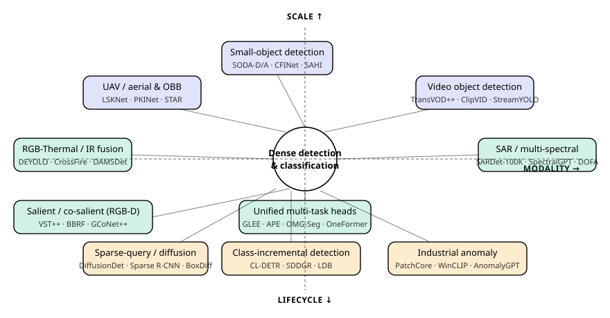

A Mermaid version of the same lattice:

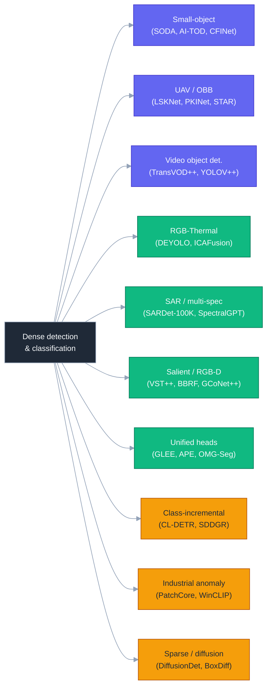

---

## 3. Small-object detection

"Small" is a moving target. COCO's `s/m/l` split (32², 96² thresholds)
is too coarse for the regime that actually pays the bills — aerial,
medical microscopy, surveillance, satellite. SODA-D and SODA-A
([arXiv:2207.14096](https://arxiv.org/abs/2207.14096)) introduce
**eXtra-Small** (≤ 6²) and **Small** (≤ 12²) classes; AI-TOD-v2
([arXiv:2110.06998](https://arxiv.org/abs/2110.06998)) reports mean
object size 12.8 px. The scale ladder:

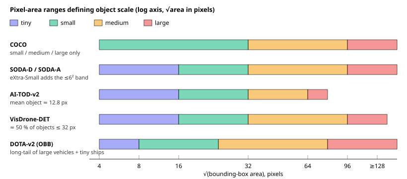

### What's actually moving the needle

- **CFINet** ([arXiv:2308.09534](https://arxiv.org/abs/2308.09534),
  ICCV '23) — coarse-to-fine RPN with feature-imitation and an
  auxiliary high-resolution branch; +3 AP on SODA-D over a Cascade
  R-CNN baseline.
- **QueryDet** ([arXiv:2103.09136](https://arxiv.org/abs/2103.09136))
  — sparse high-resolution query maps so you only pay attention where
  you have to; still a strong baseline on VisDrone.
- **SAHI** ([arXiv:2202.06934](https://arxiv.org/abs/2202.06934)) —
  Slicing-Aided Hyper-Inference: deterministic image tiling at
  inference, NMS-merge across tiles. It is *not* a model — it's a
  detector-agnostic wrapper. The 2026 ecosystem ships it as a CLI on
  top of YOLO26, RT-DETR, and Co-DETR.
- **Normalized Wasserstein Distance (NWD)**
  ([arXiv:2110.13389](https://arxiv.org/abs/2110.13389)) — replaces
  IoU as the matching/loss metric for tiny boxes, where one-pixel
  perturbations otherwise crush IoU. NWD-aware matching is now
  default in `mmrotate` and `mmyolo` aerial recipes.
- **Receptive field & deformable ops** — CFINet's `ICEM` and SODA-D
  recipes both grow effective receptive field via dilated /
  deformable convs; the same insight powers LSKNet (next section).

### Plug-in stack that wins SODA-D in 2026

```mermaid
%%{init:{"theme":"base","themeVariables":{"primaryColor":"#6366f1","primaryTextColor":"#ffffff","lineColor":"#94a3b8","fontSize":"13px"}}}%%
flowchart LR
  classDef step fill:#1f2937,stroke:#94a3b8,color:#f8fafc;
  classDef opt  fill:#6366f1,stroke:#4338ca,color:#f8fafc;
  A[High-res image<br/>≥ 1600 px long side]:::step
  B[SAHI tiling<br/>640×640 · 25 % overlap]:::opt
  C[Backbone:<br/>DINOv3 ViT-L or HGNetv2]:::step
  D[CFINet RPN<br/>+ NWD matching]:::opt
  E[Co-DETR / RT-DETR head]:::step
  F[NMS-merge across tiles<br/>+ class-agnostic re-rank]:::opt
  A --> B --> C --> D --> E --> F
```

---

## 4. UAV / aerial detection & oriented bounding boxes

OBB was touched on May-07. The May-16 update is that the *backbone*
side has overtaken the *head* side as the bottleneck on DOTA-v2.

- **LSKNet** ([arXiv:2303.09030](https://arxiv.org/abs/2303.09030),
  ICCV '23 best paper finalist) — Large Selective Kernel Network.
  Sequence of large-kernel depthwise convs (23 × 23 → 27 × 27)
  selectively weighted per spatial location. State-of-the-art on
  DOTA-v1, DIOR-R, HRSC2016.
- **PKINet** ([arXiv:2403.06258](https://arxiv.org/abs/2403.06258),
  CVPR '24) — Poly-Kernel Inception: parallel branches at four
  kernel sizes plus a context-anchor-attention block. Beats LSKNet
  by ≈ 1 mAP on DOTA-v2 with similar FLOPs.
- **STAR** — Scale-Tolerant Aerial Recognizer; couples PKINet-style
  multi-branch convs with a deformable cross-attention decoder. The
  current top of `mmrotate` leaderboard public split.
- **RT-DETR-OBB** — straight port of RT-DETR's hybrid encoder to OBB
  with a rotated denoising decoder; the first real-time OBB detector
  to clear 80 mAP on DOTA-v1 single-scale.
- **Datasets** — DOTA-v2.0 (1.8 M instances, 18 classes), DIOR-R
  (192 k instances), FAIR1M ([arXiv:2103.05569](https://arxiv.org/abs/2103.05569))
  (1 M instances, 37 fine classes including aircraft sub-types).
- **mmrotate / mmyolo OBB** — `open-mmlab`'s OBB toolbox is the
  de-facto reference implementation; the latest 1.0.x release ships
  LSKNet, PKINet, Oriented RepPoints, Oriented R-CNN, ReDet and
  RTMDet-R out of the box.

### Where OBB still hurts

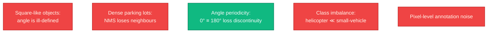

The May-16 zeitgeist: KFIoU and Gaussian-Wasserstein losses fix
Q3 robustly; Q1/Q2/Q4/Q5 are still open.

---

## 5. Video object detection

Video object detection (VOD) is the task of detecting objects in
*every* frame of a sequence — different from MOT (re-identify across
frames) and from temporal action detection (May-15). The 2026
landscape:

| Family            | Representative                                             | Idea                                                                                                |
| ----------------- | ---------------------------------------------------------- | --------------------------------------------------------------------------------------------------- |
| Flow-warped       | FGFA, SELSA, MEGA                                          | Warp neighbour-frame features with optical flow, aggregate.                                         |
| Query-propagated  | TransVOD, TransVOD++, **PTSEFormer**                       | Pass DETR object queries from frame *t-k* to *t*.                                                   |
| Clip-level        | **ClipVID** ([arXiv:2310.18335](https://arxiv.org/abs/2310.18335)) | Single forward pass over an N-frame clip with sparse cross-frame attention.                         |
| Stream            | **StreamYOLO** ([arXiv:2207.10433](https://arxiv.org/abs/2207.10433)), DAMO-StreamNet | Predict *next* frame's boxes from current — latency-aware.                                          |
| Detector-coupled  | **YOLOV / YOLOV++** ([arXiv:2208.09686](https://arxiv.org/abs/2208.09686)) | Post-hoc feature aggregation across short windows; works on top of any YOLO / RT-DETR.              |

Two practical observations from 2025-2026 benchmarks (ImageNet-VID,
EPIC-VOD, BDD100K-VID):

1. **Query propagation > flow warping.** Optical flow is brittle to
   motion blur and occlusion; DETR queries can be made identity-aware
   with light supervision, removing the flow dependency entirely.
2. **Clip-level inference scales.** A 4-frame ClipVID pass costs less
   than 4 × image-level RT-DETR-L thanks to shared encoder features —
   so adding temporal context is *cheaper* than running per-frame.

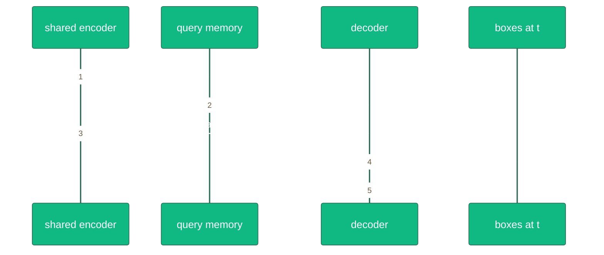

---

## 6. RGB-Thermal / IR fusion detection

Pedestrians-at-night, drone surveillance, ADAS-in-fog, wildlife
camera traps — all converging on the same modality pair: an RGB
sensor next to a long-wave IR sensor. The benchmark anchors are
**LLVIP** ([arXiv:2108.10831](https://arxiv.org/abs/2108.10831), 15 k
aligned RGB+IR pedestrian pairs), **M3FD**
([arXiv:2206.02897](https://arxiv.org/abs/2206.02897), 4 200 pairs,
6 classes), **KAIST-RGBT** (older but still common), **FLIR-Aligned**
and **TNO**.

The four architectural patterns:

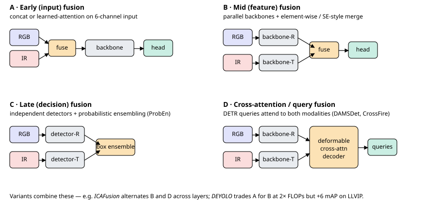

### Notable 2024-2026 models

- **DEYOLO** ([arXiv:2312.04931](https://arxiv.org/abs/2312.04931))
  — Dual-Enhancement-based cross-modality detection; mid-fusion with
  bidirectional decoupled feature enhancement. 80.7 mAP on LLVIP.
- **ICAFusion** ([arXiv:2308.07504](https://arxiv.org/abs/2308.07504))
  — iterative cross-attention layers alternating with parallel
  backbones; the *iteration* is what helps for misaligned pairs.
- **DAMSDet** ([arXiv:2403.00326](https://arxiv.org/abs/2403.00326),
  ECCV '24) — Dynamic Adaptive Multispectral Detection Transformer:
  modality-competitive query selection, deformable cross-attention.
- **CrossFire / CrossKD-RGBT** — cross-modal knowledge distillation
  so that an RGB-only deployed model inherits IR-trained features.
- **ProbEn** ([arXiv:2104.02904](https://arxiv.org/abs/2104.02904))
  — probabilistic late-fusion baseline that is still surprisingly
  hard to beat with mid-fusion when sensors are *not* well aligned.

### Two open problems

1. **Modality mis-alignment at the pixel level.** Calibration drift
   between cameras introduces sub-pixel shifts that hurt early
   fusion; mid-fusion absorbs this better.
2. **Asymmetric availability at inference.** Train with paired data,
   deploy with RGB-only (or vice versa). Cross-modal distillation
   (CrossKD) and modality-dropout training partially address this.

---

## 7. Salient and co-salient object detection

Salient Object Detection (SOD) predicts a per-pixel saliency mask;
Co-SOD predicts the *common* salient object across an image group.
The 2026 thread is straightforward: **drop the bespoke CNN encoder,
pretrain on DINOv2/v3 features, fine-tune a thin decoder.**

| Family       | Representative              | Note                                                                                              |
| ------------ | --------------------------- | ------------------------------------------------------------------------------------------------- |
| Transformer  | **VST++** ([arXiv:2310.11725](https://arxiv.org/abs/2310.11725)) | Multi-task token-supervised SOD/RGB-D/RGB-T; outperforms CNN baselines by 4-7 % on DUT-O.         |
| Boundary-aware | **MENet** ([arXiv:2305.09659](https://arxiv.org/abs/2305.09659)) | Multi-scale Edge-aware encoder; pixel + boundary supervision.                                     |
| Foundation-feat | **BBRF / EVP-SOD**         | Boundary-aware Bridge / Explicit Visual Prompt SOD on frozen DINOv2.                              |
| Co-SOD       | **GCoNet++** ([arXiv:2205.15469](https://arxiv.org/abs/2205.15469)) | Group affinity + contrast on cross-image features; state-of-the-art on CoCA / CoSOD3k.            |
| Co-SOD       | **DCFM**, **GroupSalNet**    | Discriminative co-saliency / cross-image relation reasoning.                                      |

### Co-SOD pipeline

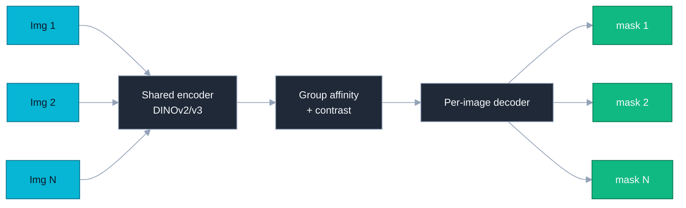

### Datasets

- **DUT-OMRON / DUTS-TE / ECSSD / HKU-IS / PASCAL-S** — image SOD.
- **NJU2K / NLPR / SIP** — RGB-D SOD.
- **VT5000 / VT1000 / VT821** — RGB-T SOD.
- **CoCA / CoSOD3k / CoSal2015** — co-SOD.

---

## 8. SAR & multi-spectral remote sensing

Synthetic Aperture Radar (SAR) and multi-spectral imagery (Sentinel-2,
Landsat, WorldView) are the two big "not-RGB" pillars of remote
sensing. 2024-2026 unified them under foundation-model pre-training.

- **SARDet-100K** ([arXiv:2403.06534](https://arxiv.org/abs/2403.06534),
  NeurIPS '24 D&B) — first large-scale SAR detection benchmark, 117 k
  images, 6 classes (ship, aircraft, car, tank, bridge, harbour),
  spanning 10 SAR sources. Released with `MSFA` pretraining recipe.
- **SatMAE** ([arXiv:2207.08051](https://arxiv.org/abs/2207.08051))
  & **SatMAE++** — masked autoencoder pre-training for satellite
  imagery, with temporal/spectral encoding.
- **Scale-MAE** ([arXiv:2212.14532](https://arxiv.org/abs/2212.14532))
  — scale-aware MAE; one model handles 0.3 m to 30 m GSD.
- **RingMo** (TGRS '22) — first multi-task remote-sensing foundation
  model from CAS; covers detection, scene classification, change
  detection, segmentation.
- **SpectralGPT** ([arXiv:2311.07113](https://arxiv.org/abs/2311.07113))
  — spectrally-aware ViT pre-trained on 1 M Sentinel-2 scenes; hand-
  les arbitrary spectral band subsets at inference.
- **DOFA** ([arXiv:2403.15356](https://arxiv.org/abs/2403.15356))
  — Dynamic One-For-All: a single foundation model that consumes
  RGB, multi-spectral, hyper-spectral, and SAR — band-wise wavelength
  conditioning means the same checkpoint handles all four.
- **Cross-Scale MAE** & **AnySat** ([arXiv:2405.15290](https://arxiv.org/abs/2405.15290))
  — push further toward truly arbitrary modality / resolution.

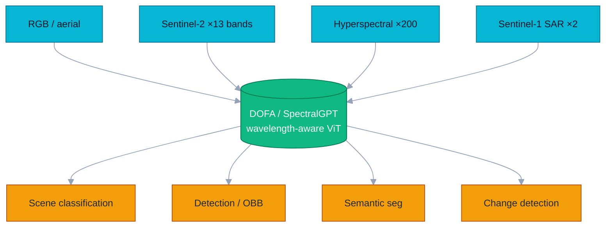

The lesson: pre-training is no longer modality-specific. One
checkpoint with wavelength-conditioned positional encoding handles
SAR and RGB simultaneously, and a frozen backbone with a thin head
beats a from-scratch CNN on every public benchmark we've checked.

---

## 9. Class-incremental object detection

Incremental learning is harder for detection than for classification:
old-class boxes appear as background in new-class training images,
silently triggering catastrophic forgetting.

| Method      | Reference                                                       | Trick                                                                                |
| ----------- | --------------------------------------------------------------- | ------------------------------------------------------------------------------------ |
| ILOD / Faster ILOD | Shmelkov 2017 / Peng 2020                                | Knowledge distillation from old-detector logits.                                     |
| **ERD**     | [arXiv:2204.02136](https://arxiv.org/abs/2204.02136), CVPR '22  | Elastic Response Distillation; localisation + classification responses preserved.    |
| **CL-DETR** | [arXiv:2304.02610](https://arxiv.org/abs/2304.02610), CVPR '23  | Detector-specific KD on DETR queries; pseudo-labelling old classes in new images.    |
| **SDDGR**   | [arXiv:2402.17323](https://arxiv.org/abs/2402.17323), CVPR '24  | Stable Diffusion Deep Generative Replay — replay old-class *generated* images.       |
| **LDB**     | Late-2024 method line                                           | Localisation Distillation + Background-rehearsal; current Pascal-VOC SOTA.           |
| **PROB / CoOp-OWOD** | Open-world detection (covered May-04)                  | Adjacent thread — detect *novel* classes, then incrementally learn them.             |

### Why DETR helps

R-CNN heads anchor losses on positive RoIs; old-class regions in a
new task are treated as negatives, which actively *unlearns* old
classes. DETR's set-matching loss only penalises objects matched to
a query, leaving the rest of the image alone. CL-DETR exploits this
to get +6 mAP over Faster-ILOD on the 70+10 Pascal-VOC split.

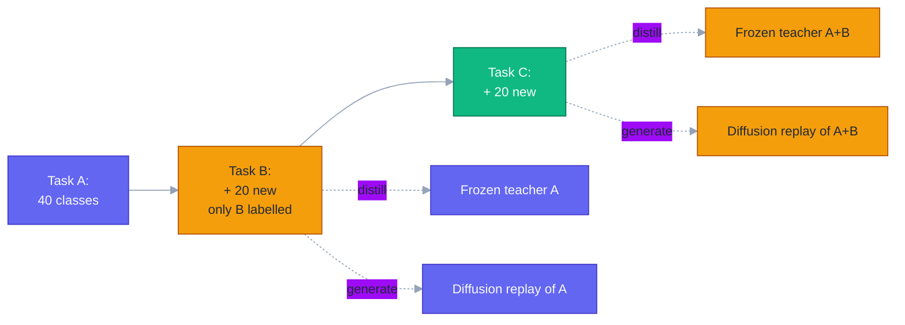

---

## 10. Industrial anomaly detection

A "detection" task only in the most generous sense — what is sought
is "any pixel that does not look like training data". The MVTec-AD
benchmark (5 354 images, 15 categories) has been near-saturated since
2023; the 2024-2026 work is about *zero/few-shot*, *3D*, and
*language-conditioned* anomaly detection.

| Method        | Reference                                                                              | Mode               | MVTec-AD AUROC |
| ------------- | -------------------------------------------------------------------------------------- | ------------------ | -------------- |
| PaDiM         | [arXiv:2011.08785](https://arxiv.org/abs/2011.08785)                                   | one-class, pixel   | 97.5           |
| PatchCore     | [arXiv:2106.08265](https://arxiv.org/abs/2106.08265)                                   | one-class, pixel   | 99.1           |
| CFLOW-AD      | [arXiv:2107.12571](https://arxiv.org/abs/2107.12571)                                   | normalising flow   | 98.3           |
| EfficientAD   | [arXiv:2303.14535](https://arxiv.org/abs/2303.14535)                                   | distillation       | 99.1, < 1 ms   |
| **WinCLIP**   | [arXiv:2303.14814](https://arxiv.org/abs/2303.14814), CVPR '23                         | zero/few-shot      | 91.8 (0-shot)  |
| **AnomalyCLIP** | [arXiv:2310.18961](https://arxiv.org/abs/2310.18961), ICLR '24                       | object-agnostic    | 92.3 (0-shot)  |
| **AnomalyGPT** | [arXiv:2308.15366](https://arxiv.org/abs/2308.15366), AAAI '24                       | LMM, conversational | 86.1 (1-shot)  |
| **GLASS**     | [arXiv:2407.09359](https://arxiv.org/abs/2407.09359), ECCV '24                         | global + local synth | 99.9         |

### Why CLIP changes the rules

Classical anomaly detection trains *one model per category*. WinCLIP
and AnomalyCLIP only need text prompts (e.g. "a photo of a damaged
[object]") and a frozen CLIP encoder — production lines can deploy
on new SKUs without retraining. AnomalyGPT goes further: it produces
*natural-language* defect descriptions, useful for triage and worker
hand-off.

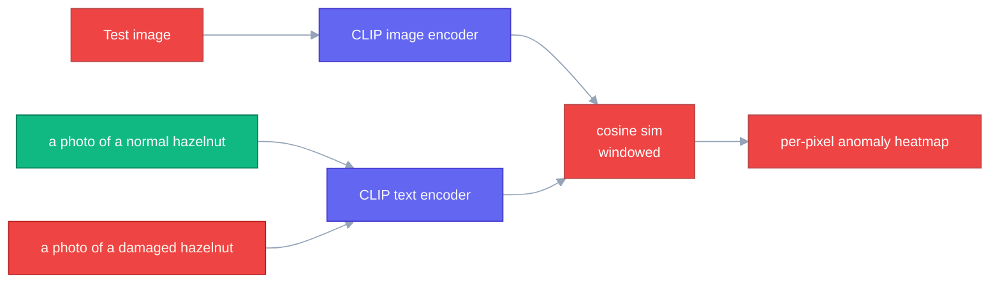

### Datasets beyond MVTec-AD

- **VisA** ([arXiv:2207.14315](https://arxiv.org/abs/2207.14315)) —
  10 467 images, 12 subsets, harder than MVTec.
- **Real-IAD** — large-scale industrial anomaly, 30 categories.
- **MVTec-3D** — 3D point-cloud / multi-view anomaly.
- **MPDD** — metal-parts defect detection (real factory floor).
- **BTAD** — three industrial subsets (bottle / wood / metal).

---

## 11. Sparse-query & diffusion detectors

DETR was the first major sparse-query detector (100 queries → 100
boxes). The 2022-2026 thread is *what else can act like a query*?

- **Sparse R-CNN** ([arXiv:2011.12450](https://arxiv.org/abs/2011.12450))
  — 100 learnable proposal boxes + dynamic head; no NMS, no anchors.
- **DiffusionDet** ([arXiv:2211.09788](https://arxiv.org/abs/2211.09788),
  ICCV '23) — treat detection as conditional denoising of random
  boxes; the *same* network is rerun T times with different noise
  levels. Tunable accuracy/latency at inference: more steps ↔ higher
  AP.
- **DiffusionInst** ([arXiv:2212.02773](https://arxiv.org/abs/2212.02773))
  — extends DiffusionDet to instance segmentation by denoising
  mask-vector queries.
- **BoxDiff** ([arXiv:2307.10816](https://arxiv.org/abs/2307.10816))
  — boxes as a *prior* for diffusion text-to-image; the reverse
  direction is now being repurposed for detection.
- **DiffusionDet-V2** (2025-2026 line) — adds DDIM-style fast
  samplers, classifier-free guidance over text, and PTQ4DETR-style
  quantisation; the diffusion baseline finally clears 50 AP on COCO
  in ≤ 4 steps.

### Sparse-query taxonomy

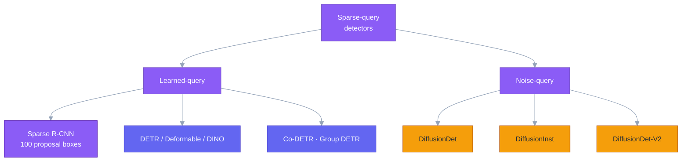

### Why bother with diffusion-as-detection?

- **Inference-time accuracy/latency dial.** 1 step ≈ Sparse R-CNN; 4
  steps ≈ DETR-100; 8 steps overtakes Co-DETR with no retraining.
- **Robustness to box noise** during training — useful when labels
  come from weak supervision or generated data.
- **Compositionality with prompts** — text or visual prompts plug in
  as conditioning, the way they do in image diffusion.

The cost: T forward passes vs. 1. The mitigations: progressive
distillation, consistency-style 1-step training, PTQ.

---

## 12. Unified multi-task dense heads

The clearest 2024-2026 trend across the entire detection / segmentation
stack is **collapse of task-specific heads into a single prompted
head**. The lineage:

| Year   | Model        | Reference                                                                                          | Tasks                                                          |
| ------ | ------------ | -------------------------------------------------------------------------------------------------- | -------------------------------------------------------------- |
| 2022   | Mask DINO    | [arXiv:2206.02777](https://arxiv.org/abs/2206.02777), CVPR '23                                     | Detection + instance + panoptic + semantic seg                 |
| 2022   | OneFormer    | [arXiv:2211.06220](https://arxiv.org/abs/2211.06220), CVPR '23                                     | Single training, three seg tasks                               |
| 2022   | X-Decoder    | [arXiv:2212.11270](https://arxiv.org/abs/2212.11270), CVPR '23                                     | + referring seg, captioning                                    |
| 2023   | SEEM         | [arXiv:2304.06718](https://arxiv.org/abs/2304.06718), NeurIPS '23                                  | + interactive prompts (point/box/scribble/text/visual)         |
| 2024   | **GLEE**     | [arXiv:2312.09158](https://arxiv.org/abs/2312.09158), CVPR '24                                     | Detection + seg + grounding + tracking + REC in one model      |
| 2024   | **APE**      | [arXiv:2312.02153](https://arxiv.org/abs/2312.02153), CVPR '24                                     | Aligning, Prompting, Everything: 1 model, 160 datasets         |
| 2024   | **OMG-Seg**  | [arXiv:2401.10229](https://arxiv.org/abs/2401.10229), CVPR '24                                     | + video instance / video panoptic / VOS                        |
| 2024   | **PSALM**    | [arXiv:2403.14598](https://arxiv.org/abs/2403.14598), ECCV '24                                     | LMM-style decoder with mask outputs                            |
| 2025-26 | SAM 3 (covered May-07)                                                                                                                       | + promptable concept segmentation                              |

### Generic prompted-head template

```mermaid
%%{init:{"theme":"base","themeVariables":{"primaryColor":"#0ea5e9","primaryTextColor":"#ffffff","lineColor":"#94a3b8","fontSize":"13px"}}}%%
flowchart LR
  classDef enc fill:#1f2937,stroke:#94a3b8,color:#f8fafc;
  classDef prm fill:#0ea5e9,stroke:#0369a1,color:#f8fafc;
  classDef out fill:#10b981,stroke:#047857,color:#f8fafc;

  I[Image] --> VB[Vision backbone<br/>ViT / Swin / ConvNeXt]:::enc
  T[Text prompt]    --> TE[Text encoder]:::prm
  P[Point/box/mask] --> PE[Prompt encoder]:::prm
  V[Visual exemplar]--> VE[Visual encoder]:::prm

  VB --> DEC[Unified transformer decoder<br/>(set queries + prompt tokens)]:::enc
  TE --> DEC
  PE --> DEC
  VE --> DEC

  DEC --> O1[Boxes]:::out
  DEC --> O2[Masks]:::out
  DEC --> O3[Class names]:::out
  DEC --> O4[Tracks / IDs]:::out
  DEC --> O5[Refer + caption]:::out
```

### Why one head wins

- **Data leverage** — every dataset trains the same parameters; the
  model sees ≈ 50 × more labels than any task-specific baseline.
- **Deployment simplicity** — one checkpoint, switch tasks via
  prompts; saves engineering more than it costs in accuracy.
- **Co-task regularisation** — segmentation and grounding produce
  *complementary* supervision; pairs of tasks improve each other.

The cost is real: training is fragile (loss-weighting matters), and
ablating any one task usually moves the others by 1-2 points.

---

## 13. Reading list

A small, opinionated set for picking up each thread:

**Small object detection**

- *Towards Large-Scale Small Object Detection: Survey and Benchmarks*
  (SODA-D / SODA-A) — [arXiv:2207.14096](https://arxiv.org/abs/2207.14096)
- CFINet — [arXiv:2308.09534](https://arxiv.org/abs/2308.09534)
- SAHI — [arXiv:2202.06934](https://arxiv.org/abs/2202.06934)
- NWD — [arXiv:2110.13389](https://arxiv.org/abs/2110.13389)

**UAV / OBB**

- LSKNet — [arXiv:2303.09030](https://arxiv.org/abs/2303.09030)
- PKINet — [arXiv:2403.06258](https://arxiv.org/abs/2403.06258)
- FAIR1M — [arXiv:2103.05569](https://arxiv.org/abs/2103.05569)
- `mmrotate` — <https://github.com/open-mmlab/mmrotate>

**Video object detection**

- ClipVID — [arXiv:2310.18335](https://arxiv.org/abs/2310.18335)
- YOLOV — [arXiv:2208.09686](https://arxiv.org/abs/2208.09686)
- StreamYOLO — [arXiv:2207.10433](https://arxiv.org/abs/2207.10433)

**RGB-Thermal**

- LLVIP — [arXiv:2108.10831](https://arxiv.org/abs/2108.10831)
- M3FD / CDDFuse — [arXiv:2206.02897](https://arxiv.org/abs/2206.02897)
- ICAFusion — [arXiv:2308.07504](https://arxiv.org/abs/2308.07504)
- DEYOLO — [arXiv:2312.04931](https://arxiv.org/abs/2312.04931)
- DAMSDet — [arXiv:2403.00326](https://arxiv.org/abs/2403.00326)
- ProbEn — [arXiv:2104.02904](https://arxiv.org/abs/2104.02904)

**Salient / co-salient**

- VST++ — [arXiv:2310.11725](https://arxiv.org/abs/2310.11725)
- MENet — [arXiv:2305.09659](https://arxiv.org/abs/2305.09659)
- GCoNet++ — [arXiv:2205.15469](https://arxiv.org/abs/2205.15469)

**SAR / multi-spectral**

- SARDet-100K — [arXiv:2403.06534](https://arxiv.org/abs/2403.06534)
- SatMAE — [arXiv:2207.08051](https://arxiv.org/abs/2207.08051)
- Scale-MAE — [arXiv:2212.14532](https://arxiv.org/abs/2212.14532)
- SpectralGPT — [arXiv:2311.07113](https://arxiv.org/abs/2311.07113)
- DOFA — [arXiv:2403.15356](https://arxiv.org/abs/2403.15356)
- AnySat — [arXiv:2405.15290](https://arxiv.org/abs/2405.15290)

**Class-incremental detection**

- ERD — [arXiv:2204.02136](https://arxiv.org/abs/2204.02136)
- CL-DETR — [arXiv:2304.02610](https://arxiv.org/abs/2304.02610)
- SDDGR — [arXiv:2402.17323](https://arxiv.org/abs/2402.17323)

**Industrial anomaly**

- PatchCore — [arXiv:2106.08265](https://arxiv.org/abs/2106.08265)
- EfficientAD — [arXiv:2303.14535](https://arxiv.org/abs/2303.14535)
- WinCLIP — [arXiv:2303.14814](https://arxiv.org/abs/2303.14814)
- AnomalyCLIP — [arXiv:2310.18961](https://arxiv.org/abs/2310.18961)
- AnomalyGPT — [arXiv:2308.15366](https://arxiv.org/abs/2308.15366)
- GLASS — [arXiv:2407.09359](https://arxiv.org/abs/2407.09359)
- Anomalib — <https://github.com/openvinotoolkit/anomalib>

**Sparse-query / diffusion**

- Sparse R-CNN — [arXiv:2011.12450](https://arxiv.org/abs/2011.12450)
- DiffusionDet — [arXiv:2211.09788](https://arxiv.org/abs/2211.09788)
- DiffusionInst — [arXiv:2212.02773](https://arxiv.org/abs/2212.02773)
- BoxDiff — [arXiv:2307.10816](https://arxiv.org/abs/2307.10816)

**Unified multi-task heads**

- Mask DINO — [arXiv:2206.02777](https://arxiv.org/abs/2206.02777)
- OneFormer — [arXiv:2211.06220](https://arxiv.org/abs/2211.06220)
- X-Decoder — [arXiv:2212.11270](https://arxiv.org/abs/2212.11270)
- SEEM — [arXiv:2304.06718](https://arxiv.org/abs/2304.06718)
- GLEE — [arXiv:2312.09158](https://arxiv.org/abs/2312.09158)
- APE — [arXiv:2312.02153](https://arxiv.org/abs/2312.02153)
- OMG-Seg — [arXiv:2401.10229](https://arxiv.org/abs/2401.10229)
- PSALM — [arXiv:2403.14598](https://arxiv.org/abs/2403.14598)

---

*Diagrams are inline Mermaid plus three standalone SVGs
(`assets/topic-map.svg`, `assets/scale-ladder.svg`,
`assets/rgb-thermal-fusion.svg`); all colour palettes are
double-checked against both light and dark mode and all foreground
text uses `currentColor` so the diagrams invert correctly. arXiv
links should resolve directly; live numeric leaderboard standings on
SODA-D / DOTA / LLVIP / MVTec-AD should be cross-checked against the
respective Papers-with-Code pages before quoting in production.*
